# Part 6 — The Azure & Microsoft Fabric Data Stack

> Section goal: Demystify the Microsoft cloud data platform the JD lists — **Fabric (Lakehouse/Warehouse, Pipelines, Semantic Models), Synapse, Databricks, Data Factory** — plus the concepts under them (data lake, OneLake, Delta, Medallion). This is your biggest gap; we make it click from zero.

Covers index item **6**. Maps to JD: "SQL, Python, Azure Databricks, Synapse, Power BI, Fabric," "Azure data stack: Fabric (Lakehouse/Warehouse, Pipelines, Semantic Models), Synapse, Databricks, Data Factory."

---

## 0. The one-paragraph orientation

Modern analytics moves data from many sources into cloud storage, transforms it into clean models (your star schema from Part 5), and serves it to Power BI. Microsoft offers a suite of cloud tools to do this. The newest, **Microsoft Fabric**, bundles them into one product. Everything in this Part is a variation on the same pipeline: **ingest → store → transform → model → serve.**

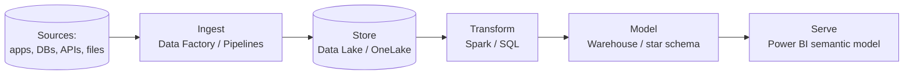

> 💡 **Tie-in:** You hold DP-900 and AZ-900 — you already know the *concepts* (cloud, storage, compute). This Part attaches the *product names* to those concepts so the JD's tool list stops being scary.

### What's in this Part (roadmap)

| # | Section | One-line purpose |
|---|---|---|
| 1 | Cloud fundamentals | IaaS/PaaS/SaaS, regions, compute–storage split, elasticity |
| 2 | Storage & file formats | ADLS Gen2/Blob, row vs columnar, CSV/JSON/Parquet/ORC/Avro, partitioning |
| 3 | Lake vs Warehouse vs Lakehouse + Delta | ACID, `_delta_log`, time travel, MERGE/OPTIMIZE/Z-ORDER/VACUUM |
| 4 | Medallion architecture | Bronze→Silver→Gold = ELT into a star schema |
| 5 | Microsoft Fabric (deep) | OneLake, every workload, Direct Lake, capacities, CI/CD, security, Copilot |
| 6 | Azure Synapse (deep) | MPP, distributions, serverless, Spark pools, Synapse Link |
| 7 | Azure Databricks (deep) | Clusters, Photon, Unity Catalog, DLT, MLflow, multi-cloud |
| 8 | Azure Data Factory (deep) | Pipelines, IR, triggers, data flows; ADF vs Fabric DF |
| 9 | End-to-end request flow | How one support question becomes a governed dashboard |
| 10 | Governance, security, CI/CD, cost | Purview, RBAC/RLS, deployment pipelines, capacity cost |
| 11 | Certification path | PL-300 → DP-600 → DP-700 |
| 12 | Hands-on labs | Fabric trial + Databricks Community fallback |

---

## 1. Cloud fundamentals — the ground floor (Beginner)

Before any tool names, lock down the cloud ideas underneath them.
Your AZ-900 and DP-900 already touched these — here we make them concrete with support-data examples.

### 1.1 What "the cloud" actually is

- **Cloud** — *renting computers, storage, and software over the internet instead of buying and running your own.*
- **Analogy:** electricity from the grid vs. running your own generator in the basement.
- **Why it matters:** you pay for what you use, scale instantly, and never patch a physical server.
- **Memory hook:** "Cloud = someone else's computer you rent by the hour."

### 1.2 The three service models — IaaS / PaaS / SaaS

This is the single most-asked cloud-fundamentals question. Learn the pizza analogy.

- **IaaS (Infrastructure as a Service)** — *you rent raw virtual machines, disks, and networks; you install and manage everything above that.*
  - **Analogy:** you rent the kitchen; you cook the pizza yourself.
  - **Example:** an Azure Virtual Machine where you install SQL Server by hand.
- **PaaS (Platform as a Service)** — *you rent a managed platform; the provider runs the servers, OS, and patching; you just bring your data and code.*
  - **Analogy:** a "take and bake" pizza — the dough and toppings are done, you just heat it.
  - **Example:** Azure SQL Database, Azure Data Factory, Azure Synapse, Azure Databricks.
- **SaaS (Software as a Service)** — *you just use a finished application in the browser; you manage nothing underneath.*
  - **Analogy:** pizza delivered to your door — you only eat.
  - **Example:** Power BI Service, Microsoft 365, and **Microsoft Fabric** (Fabric is SaaS — a huge selling point).

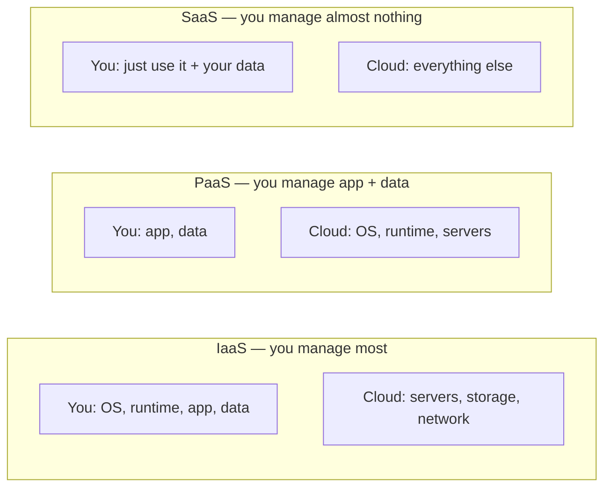

| Model | You manage | Cloud manages | Support-data example |
|---|---|---|---|
| **IaaS** | OS, runtime, app, data | Hardware, network, virtualization | VM hosting a legacy ticketing DB |
| **PaaS** | App config + data | OS, patching, scaling | Synapse/Databricks transforming case data |
| **SaaS** | Just your data + settings | Everything | Power BI / Fabric serving the CSAT dashboard |

> 💡 **Tie-in to your background:** As a SharePoint Online / OneDrive escalation engineer you already lived in SaaS every day — SharePoint Online *is* SaaS. When you say "Fabric is SaaS, like SharePoint Online — Microsoft runs the servers, I just build the analytics," interviewers instantly see you get it.

### 1.3 Regions, availability zones, and geographies

- **Region** — *a cluster of Microsoft datacenters in one geographic area* (e.g., East US, West Europe, Central India).
  - **Analogy:** a branch of a bank in a particular city.
  - **Why it matters:** you pick a region close to users (lower latency) and that meets data-residency rules (e.g., EU support data must stay in EU).
- **Availability Zone** — *physically separate datacenters within one region* so one building failure doesn't take you down.
  - **Analogy:** three vaults in different buildings in the same city.
- **Geography** — *a data-residency boundary* (e.g., "Europe") that groups regions for compliance.

> 🔍 **Plain-English deep-dive — why region choice matters for support data:**
> Imagine your CE&S ticket data contains customer names from German enterprises. GDPR may require it to live in an EU region. Pick "West Europe," not "East US," or you create a compliance incident. Region selection is a *governance* decision, not just a performance one.

### 1.4 Separation of compute and storage (the most important modern idea)

- **Storage** — *where your data sits at rest* (files, tables). Cheap, always there.
- **Compute** — *the processing power that reads and crunches the data* (CPUs/engines). Expensive, only needed while running.
- **Separation of compute and storage** — *keep data in one cheap place; spin engines up and down independently.*
  - **Analogy:** your furniture lives in a storage unit (cheap, always there); you only rent a moving truck (compute) on the days you actually move things.
  - **Why it matters:** five different engines (Spark, T-SQL, Power BI) can all read the *same* stored data without copying it, and you only pay for compute while a job runs.

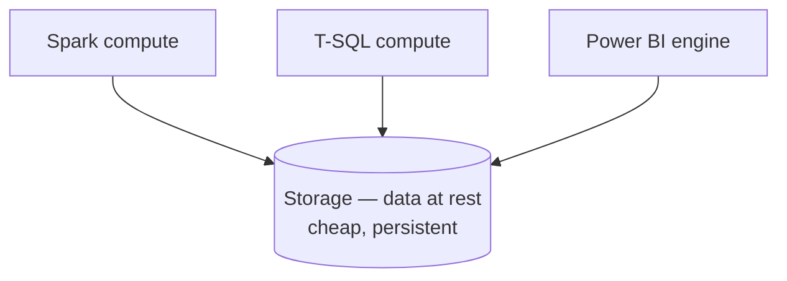

> 🔍 **Plain-English deep-dive:** In the *old* on-prem warehouse world, storage and compute were welded together — to store more data you had to buy more CPU you didn't need, and vice versa. The cloud broke them apart. This single idea is *why* OneLake (one storage) + Fabric workloads (many computes) works. Remember it; it's the backbone of this whole Part.

### 1.5 Elasticity and scaling

- **Elasticity** — *automatically adding/removing compute as demand changes.*
  - **Analogy:** a rubber band stretching for a heavy load and snapping back when done.
- **Scale up (vertical)** — *make one machine bigger* (more CPU/RAM).
- **Scale out (horizontal)** — *add more machines that share the work* (this is how Spark and MPP warehouses go fast).
- **Autoscaling** — *the platform decides how many machines to run based on load.*

| Term | Plain meaning | Support-data example |
|---|---|---|
| Scale up | Bigger single machine | Heavier nightly CSAT aggregation gets a larger node |
| Scale out | More machines in parallel | Re-processing 3 years of tickets across 20 Spark workers |
| Elastic | Auto grow/shrink | Month-end reporting spike auto-adds compute, then releases it |

> 💡 **Tie-in:** Escalations spike after a product release. Elastic compute is exactly how a BI platform absorbs a "telemetry flood" the day a buggy update ships, then scales back down — a story you can tell.

---

## 2. Storage and file formats — where data physically lives

You can't reason about lakes, Delta, or Fabric until you understand *files*.
This section is the hidden foundation most beginners skip.

### 2.1 Azure storage building blocks

- **Azure Blob Storage** — *cheap, massive object storage for "blobs" (any file).*
  - **Analogy:** an infinite pile of labeled boxes; you fetch a box by its label (path).
  - **"Object storage"** means data is stored as whole objects with a key/path, not as a file system with folders you can rename cheaply.
- **Azure Data Lake Storage Gen2 (ADLS Gen2)** — *Blob storage plus a real hierarchical namespace (true folders) tuned for analytics.*
  - **Analogy:** the same warehouse of boxes, but now with proper aisles, shelves, and a folder tree, so analytics engines can scan efficiently.
  - **Why it matters:** ADLS Gen2 is the standard analytics lake storage in Azure, and **OneLake is built on ADLS Gen2 technology.**
- **Hierarchical namespace** — *real directories you can rename/secure as a unit* (vs. flat blob "fake folders").

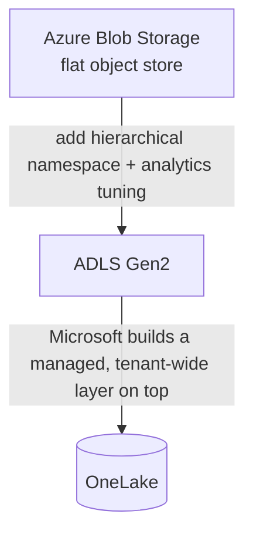

| Feature | Blob Storage | ADLS Gen2 |
|---|---|---|
| Real folders (hierarchical namespace) | No (flat) | Yes |
| Best for | Backups, images, generic files | Analytics / data lakes |
| Folder-level security (ACLs) | Limited | Yes (POSIX ACLs) |
| Used by | App storage | Synapse, Databricks, OneLake |

### 2.2 Row-oriented vs columnar storage (the core intuition)

This idea explains *why* analytics uses Parquet, why warehouses are fast, and why Power BI compresses so well.

- **Row-oriented storage** — *stores all values of one record together, row by row.*
  - **Analogy:** a stack of fully filled paper forms — to read everyone's "CSAT score" you must pick up every form and find that one field.
  - **Great for:** transactional systems (read/write one whole ticket at a time).
- **Columnar storage** — *stores all values of one column together.*
  - **Analogy:** one envelope per field — an envelope holding *all* CSAT scores, another holding *all* product names.
  - **Great for:** analytics — "average CSAT across 10M tickets" reads *one* envelope, skipping the rest.

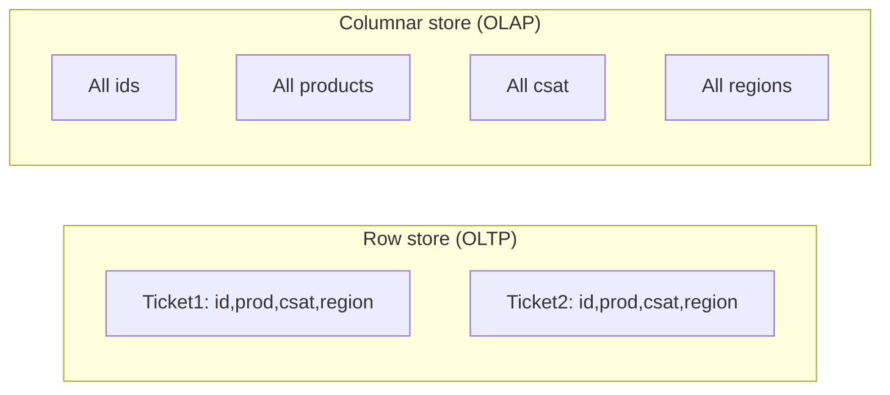

> 🔍 **Plain-English deep-dive — why columnar wins for BI:**
> 1. **Less data read** — to compute "avg CSAT by product" you only touch the `product` and `csat` columns, not the other 40 columns in a ticket.
> 2. **Better compression** — a column holds *similar* values (all small CSAT integers 1–5), which squashes far smaller than mixed rows. Less disk = less to scan = faster + cheaper.
> 3. **Vectorized speed** — engines crunch a whole column in tight loops.
> This is exactly why your Power BI imports are so small and fast — its VertiPaq engine is columnar.

| Aspect | Row store | Columnar store |
|---|---|---|
| Layout | Record by record | Field by field |
| Workload | OLTP (write one ticket) | OLAP (analyze millions) |
| Compression | Lower | Much higher |
| Example | The live ticketing system | Parquet/Delta lake, Power BI |

### 2.3 File formats — text vs binary-columnar

- **CSV (Comma-Separated Values)** — *plain text rows, comma-delimited.*
  - **Pro:** human-readable, universal. **Con:** no types, no schema, big, slow, no compression by default.
  - **Analogy:** a handwritten spreadsheet on paper.
- **JSON (JavaScript Object Notation)** — *nested text records with key/value pairs.*
  - **Pro:** flexible, great for semi-structured API/telemetry data. **Con:** verbose, slow to scan at scale.
  - **Analogy:** a labeled form that can have sub-forms inside it.
- **Parquet** — *open, binary, columnar format with built-in schema, types, and compression.*
  - **Pro:** small, fast, analytics-native. **Con:** not human-readable.
  - **Analogy:** the column-envelope filing system, shrink-wrapped.
- **ORC (Optimized Row Columnar)** — *another columnar format, common in the Hadoop/Hive world;* similar idea to Parquet.
- **Avro** — *a row-based binary format great for streaming/event data and schema evolution* (often the wire format for Kafka/Event Hubs).
  - **Analogy:** Avro = good for *moving* events; Parquet = good for *analyzing* piles.

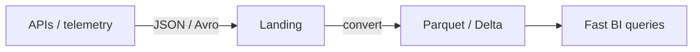

| Format | Type | Columnar? | Schema? | Best at | Support-data use |
|---|---|---|---|---|---|
| **CSV** | Text | No | No | Exchange, exports | Raw ticket export from a legacy tool |
| **JSON** | Text | No | Flexible | Semi-structured | Telemetry/event payloads, API pulls |
| **Avro** | Binary | No (row) | Yes (evolves) | Streaming/events | Product telemetry on Event Hubs |
| **ORC** | Binary | Yes | Yes | Hive analytics | Legacy Hadoop case archives |
| **Parquet** | Binary | Yes | Yes | Cloud analytics | Bronze/Silver/Gold lake tables |

> 💡 **Tie-in:** A typical support pipeline lands messy **JSON** telemetry and **CSV** ticket exports in bronze, then converts to **Parquet/Delta** for fast analytics. Naming this conversion shows you understand the *physical* side of ETL, not just the logic.

### 2.4 Compression

- **Compression** — *encoding data to take less space.*
  - **Analogy:** vacuum-packing clothes for a suitcase.
- **Snappy** — *fast, light compression; the Parquet/Delta default.* Good balance of speed and size.
- **Gzip / Zstd** — *smaller files, a bit more CPU to compress/decompress.*
- **Why it matters:** less storage cost *and* less data to scan = faster queries. Columnar + compression is a multiplier.

### 2.5 Partitioning

- **Partitioning** — *splitting a big table into folders by a column value so engines can skip irrelevant data.*
  - **Analogy:** filing tickets in folders by year/month — to read "March 2024" you open one folder, not the whole cabinet.
- **Partition pruning** — *the engine skips partitions that can't match the filter.*
- **Common partition keys for support data:** date (`year/month/day`), region, product.
- **Pitfall — over-partitioning:** too many tiny partitions (e.g., by minute) creates the **"small files problem"** — thousands of tiny files that slow everything down.

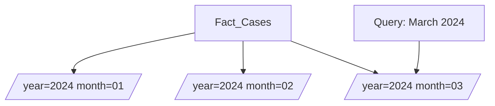

| Concept | Plain meaning | Support example |
|---|---|---|
| Partition | Folder split by column | `region=EMEA/` , `month=2024-03/` |
| Pruning | Skip non-matching folders | "Last month's breaches" reads 1 folder |
| Small files problem | Too many tiny files | Partitioning telemetry by second |

> 🔍 **Plain-English deep-dive:** Partitioning is "physical filing for speed." Pick a column you *always filter by* (usually date). For 100M support tickets, partitioning by month means a "this-month SLA breaches" query scans ~3% of the data. Get this wrong (partition by `ticket_id`) and you get millions of one-row folders that cripple performance.

---

## 3. Lake vs Warehouse vs Lakehouse — and Delta Lake in depth

### 3.1 The three storage philosophies

- **Data warehouse** — *a system optimized to store and query structured, modeled data for analytics* (your star schema from Part 5 lives here).
  - **Analogy:** a well-organized library with a strict catalogue; everything must be shelved correctly before entry.
  - **Strength:** fast SQL, governed, reliable. **Weakness:** rigid, pricier, structured data only.
- **Data lake** — *cheap storage holding raw data in any format (tables, JSON, images, logs) at massive scale.*
  - **Analogy:** a giant warehouse where you dump everything now and sort it later.
  - **Strength:** cheap, flexible, any format. **Weakness:** no transactions, easy to turn into a "data swamp."
- **Lakehouse** — *a hybrid: the cheap, open storage of a lake PLUS the tables, schema, ACID, and SQL of a warehouse.*
  - **Analogy:** that giant warehouse, but with proper shelving, a catalogue, and an undo button bolted on.
  - **Strength:** one place for everything; this is the central idea of both Databricks and Fabric.

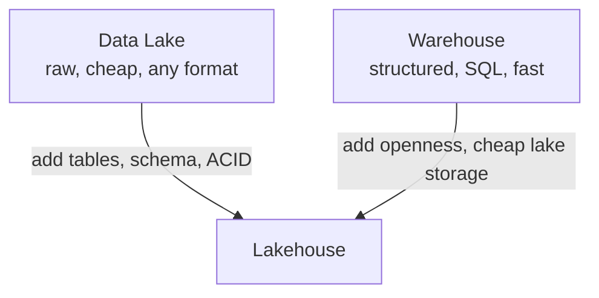

| Trait | Data lake | Data warehouse | Lakehouse |
|---|---|---|---|
| Cost of storage | Lowest | Higher | Low (lake-based) |
| Data shape | Any (raw) | Structured only | Any → structured |
| Transactions (ACID) | No | Yes | Yes (via Delta) |
| Best engine | Spark | SQL | Spark **and** SQL |
| Risk | "Data swamp" | Rigid/expensive | Needs discipline |
| Product example | ADLS Gen2 | Synapse dedicated pool | Fabric, Databricks |

### 3.2 What "ACID" means (and why a lake needs it)

- **ACID** — four guarantees that make data trustworthy:
  - **Atomicity** — *a change happens fully or not at all* (no half-written tables). *Analogy: a bank transfer either completes both sides or neither.*
  - **Consistency** — *data moves from one valid state to another* (rules hold).
  - **Isolation** — *concurrent jobs don't corrupt each other* (a reader doesn't see a half-finished write).
  - **Durability** — *once committed, it survives crashes.*
- **Why a plain lake lacks it:** if a Spark job writing 10,000 files dies halfway, readers see a broken, half-written table. Delta fixes exactly this.

### 3.3 Delta Lake — turning files into real tables

- **Delta Lake (Delta format)** — *an open table format that adds ACID transactions, versioning, and time-travel on top of Parquet files.*
  - **Analogy:** loose Parquet files are pages; Delta adds a **logbook (the transaction log)** that says which pages officially make up the table *right now* — like a librarian's ledger.
  - **Why it matters:** Delta is the storage format under **both Databricks and Fabric.** This one word connects the entire stack.

#### The magic: Parquet + a log = a table

A Delta table on disk is just:
- a folder of **Parquet data files**, plus
- a **`_delta_log`** folder of JSON (and checkpoint) files that record every transaction.

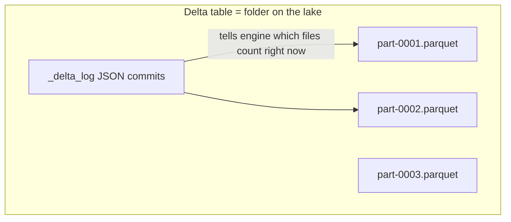

> 🔍 **Plain-English deep-dive — why the log changes everything:**
> The `_delta_log` is an ordered list of transactions: "add file A," "add file B," "remove file A, add file C." To read the table, an engine replays the log to learn the *current valid set of Parquet files*. Because writers only "commit" by appending one log entry, readers never see half-written data (isolation), a failed job leaves no committed entry (atomicity), and you can read an *older* log position to see the past (time travel). It's a database transaction log, sitting in cheap cloud storage.

#### Delta features you must be able to name

- **Time travel** — *query the table as of an older version or timestamp.*
  - *Support example:* "Show the SLA-breach numbers exactly as the Monday report saw them, before the reload."
  - `SELECT * FROM cases VERSION AS OF 12;`
- **Schema enforcement** — *Delta rejects writes that don't match the table's columns/types* (no accidental garbage).
  - *Analogy:* a bouncer checking IDs at the door.
- **Schema evolution** — *deliberately add new columns over time* with `mergeSchema`.
  - *Support example:* telemetry adds a new `severity` field next quarter — evolve, don't rebuild.
- **MERGE (upsert)** — *insert new rows and update changed ones in one atomic statement* (great for incremental loads / CDC).
- **OPTIMIZE** — *compact many small files into fewer big ones* (fixes the small-files problem).
- **Z-ORDER** — *co-locate related data within files so queries skip more* (multi-column data skipping).
  - *Analogy:* arranging a warehouse so items often bought together sit on the same shelf.
- **VACUUM** — *permanently delete old, unreferenced files* to reclaim storage (after the time-travel window).
  - ⚠️ VACUUM removes the ability to time-travel before the cutoff — it's a cleanup, use with care.

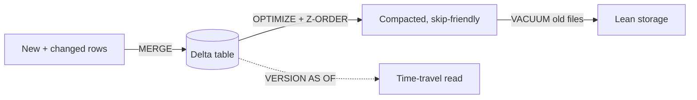

```sql
-- Incremental upsert of daily support cases (PySpark/SQL idea)
MERGE INTO cases_silver AS tgt
USING cases_daily AS src
  ON tgt.case_id = src.case_id
WHEN MATCHED THEN UPDATE SET *
WHEN NOT MATCHED THEN INSERT *;

-- Housekeeping
OPTIMIZE cases_silver ZORDER BY (product, region);
VACUUM cases_silver RETAIN 168 HOURS;   -- keep 7 days of history
```

| Delta feature | What it does | Support-data payoff |
|---|---|---|
| Time travel | Read old versions | Reproduce last week's CSAT report |
| Schema enforcement | Reject bad writes | Stop a malformed telemetry load |
| Schema evolution | Add columns safely | New `severity` field, no rebuild |
| MERGE | Upsert in one step | Incremental nightly case loads |
| OPTIMIZE | Compact small files | Faster telemetry queries |
| Z-ORDER | Multi-column skipping | Filter by product+region fast |
| VACUUM | Delete stale files | Control storage cost |

> 💡 **Tie-in:** When you say "a Delta table is just Parquet files plus a `_delta_log`, which is why both Databricks and Fabric can read the same table," you sound like an engineer, not a memorizer. That one sentence is worth a lot in this interview.

---

## 4. The Medallion architecture — bronze, silver, gold

A standard way to organise a lakehouse into quality tiers. Memorise it; it appears constantly.

### 🔍 Plain-English deep-dive
- **Why three layers?** Separation of concerns: bronze preserves the original (auditable, re-runnable), silver fixes quality once, gold serves the business. **Analogy:** raw groceries (bronze) → prepped ingredients (silver) → plated dish (gold).

### 4.1 What actually happens in each layer (support-data walkthrough)

| Layer | Goal | Typical operations | Support-data example |
|---|---|---|---|
| **🥉 Bronze** | Land raw, keep history | Copy as-is, add load timestamp, no edits | Daily dump of `cases.csv`, `survey.json`, `telemetry/*.avro` |
| **🥈 Silver** | Clean + conform | Dedupe, fix types, standardize codes, join, validate | One row per case; `region` codes normalized (EMEA/AMER/APAC); null CSAT handled |
| **🥇 Gold** | Model for business | Aggregate, build fact/dim, define KPIs | `Fact_Cases`, `Dim_Product`, `Dim_Date`; weekly CSAT + breach-rate marts |

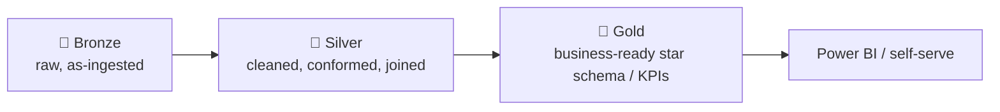

### 4.2 Medallion = ETL/ELT in disguise

- **ETL (Extract, Transform, Load)** — *transform data before loading it into the target.*
- **ELT (Extract, Load, Transform)** — *load raw first, then transform inside the lake/warehouse* (the modern, cloud-native default).
- **Medallion is ELT:** bronze = Extract+Load, silver/gold = Transform — done *inside* the lakehouse using cheap, scalable compute.

| ETL stage | Medallion layer | Engine in Fabric |
|---|---|---|
| Extract + Load | Bronze | Data Factory / Pipelines |
| Transform (clean) | Silver | Spark notebook / Dataflow Gen2 |
| Transform (model) | Gold | Spark or T-SQL → star schema |
| Serve | Gold → semantic model | Power BI (Direct Lake) |

### 4.3 Medallion maps onto your star schema (Part 5 link)

- Bronze holds *source-shaped* data (whatever the system emitted).
- Silver holds *conformed* data — clean keys, consistent grain.
- Gold holds the **star schema**: a central `Fact_Cases` surrounded by `Dim_Product`, `Dim_Customer`, `Dim_Date`, `Dim_Agent`.

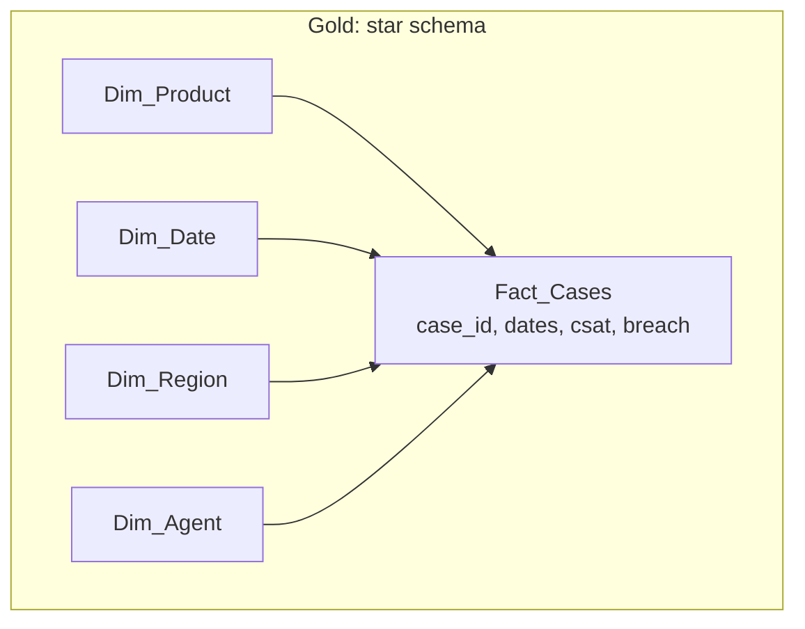

> 💡 **Tie-in to your background:** This maps directly to data-quality governance (Part 9) — quality is enforced at silver, definitions standardized at gold. Your escalation instincts ("trace the bad number back to its source") are exactly what bronze→silver lineage gives you.

> 🔍 **Plain-English deep-dive — why not just load straight to gold?** Because raw sources are messy and change. If you transform straight into the final tables and something breaks, you've lost the original and can't replay. Bronze is your *safety net and audit trail*; silver is where you fix things *once* so every gold mart inherits clean data. It's the data version of "keep the original ticket, work on a copy."

---

## 5. Microsoft Fabric — the headline platform (the JD's #1 ask)

**Microsoft Fabric** is Microsoft's all-in-one **SaaS** analytics platform (GA since 2023). It unifies data integration, data engineering, data warehousing, data science, real-time intelligence, databases, and Power BI — all on **one storage layer called OneLake**.

- **Analogy:** Fabric is the "Office 365 of analytics" — instead of buying Word, Excel, and PowerPoint separately and gluing them together, you get one subscription where everything already talks to everything.
- **Why it matters:** the JD names Fabric first. The core selling points are *one storage (OneLake), one capacity (compute), one governance, one security model.*

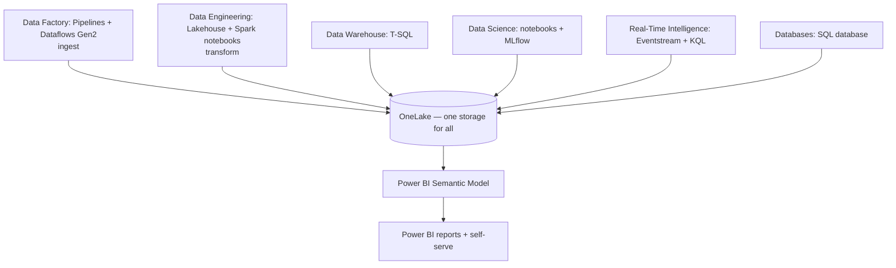

### 5.1 OneLake — "OneDrive for data" (the heart of Fabric)

- **OneLake** — *the single, unified, tenant-wide data lake that every Fabric workload uses automatically.*
  - **Analogy:** just as your whole company has *one* OneDrive/SharePoint for documents, a Fabric tenant has *one* OneLake for data. You don't provision storage accounts — it's just there.
  - **Built on:** ADLS Gen2 technology; data is stored open, in **Delta/Parquet**.
  - **Why it matters:** *no copying data between tools.* A Spark notebook, a T-SQL warehouse, and a Power BI model all read the **same** Delta tables in OneLake.

#### OneLake key features

- **No data duplication** — *one physical copy, many engines.* A gold table written by Spark is instantly queryable by T-SQL and Power BI — no export/import.
- **Shortcuts** — *virtual pointers to data that lives elsewhere* (another OneLake workspace, ADLS Gen2, Amazon S3, Google Cloud Storage) without moving/copying it.
  - **Analogy:** a OneDrive "shortcut" or a desktop symlink — the file looks like it's in your folder, but it physically lives elsewhere.
  - **Support example:** shortcut to the central product-telemetry lake so your BI workspace can join it to cases *without* a nightly copy job.
- **Domains** — *a way to organize OneLake by business area* (e.g., "Support", "Sales", "Finance") for data-mesh-style ownership and discovery.
  - **Analogy:** departments each owning their shelf in the shared library.
- **OneLake file explorer** — *a Windows app that surfaces OneLake like a OneDrive folder* on your PC.

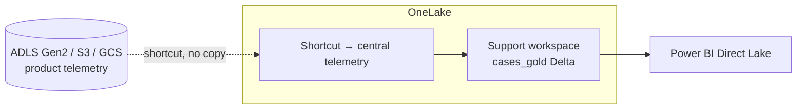

> 🔍 **Plain-English deep-dive — why "OneDrive for data" is the perfect phrase for you:** You supported OneDrive for years. OneDrive ended "emailing copies of documents" by giving everyone one shared, governed location. OneLake does the same for *data*: it ends "exporting CSVs and emailing them around" by giving every tool one shared, governed Delta lake. Use this analogy in the interview — it's authentic to your background and exactly right.

### 5.2 The Fabric workloads (experiences) — every one explained

Fabric is organized into **workloads** (also called experiences). You switch workloads from a menu; all of them save to OneLake.

#### (a) Data Factory — ingest & orchestrate

- **Purpose:** *get data in and schedule everything.*
- **Pipelines** — *visual orchestration: a sequence of activities (copy, run notebook, run dataflow, conditionals, loops).*
- **Copy activity** — *the workhorse that moves data from a source connector to a destination* (200+ connectors: SQL, REST APIs, Blob, Salesforce, etc.).
- **Dataflows Gen2** — *low-code transformation using Power Query* (the same "M" experience as Power BI's Power Query).
  - **Analogy:** Pipelines = the conveyor belt and schedule; Dataflows Gen2 = the no-code kitchen where Power Query cleans data.
- **Support example:** a pipeline runs nightly → Copy activity pulls `cases` from Azure SQL and `surveys` from a REST API into bronze → then triggers a Spark notebook for silver.

#### (b) Data Engineering — Lakehouse + Spark

- **Lakehouse (Fabric item)** — *a store that holds both **Files** (any format) and **Tables** (Delta), with a free **SQL analytics endpoint** for read-only T-SQL.*
- **Spark notebooks** — *code-first PySpark/Scala/SparkSQL for big transforms* (your Part 4 skills run here).
- **Spark job definitions** — *scheduled/headless Spark jobs* (no notebook UI).
- **Support example:** PySpark notebook dedupes 50M telemetry rows, conforms region codes, writes `cases_silver` Delta.

#### (c) Data Warehouse — full T-SQL

- **Warehouse (Fabric item)** — *a true relational data warehouse with full T-SQL **DML** (INSERT/UPDATE/DELETE/MERGE), unlike the Lakehouse's read-only SQL endpoint.*
- **Best for:** SQL-first teams building governed star schemas, stored procedures, and complex joins.
- **Support example:** build `Fact_Cases` and dimensions via T-SQL `CREATE TABLE AS SELECT`, plus a stored proc that refreshes weekly KPI marts.

#### (d) Data Science — notebooks, MLflow, AutoML

- **Purpose:** *build and track machine-learning models on lakehouse data.*
- **Notebooks** — *Python with libraries like scikit-learn / SynapseML.*
- **MLflow** — *open-source tool to track experiments, parameters, metrics, and model versions* (built into Fabric).
  - **Analogy:** a lab notebook that auto-records every experiment so you can compare and reproduce.
- **AutoML** — *automatically trains and compares many models to find a good one.*
- **Support example:** predict which open cases are likely to breach SLA, or auto-categorize ticket text; track each model run in MLflow.

#### (e) Real-Time Intelligence — streaming & telemetry

- **Eventstream** — *no-code ingestion of streaming events* (from Event Hubs, IoT, etc.) routed to destinations.
- **Eventhouse / KQL Database** — *a store optimized for huge volumes of time-series/log data, queried with KQL.*
- **KQL (Kusto Query Language)** — *a fast, read-optimized query language for logs and telemetry* (same language as Azure Data Explorer / Log Analytics).
  - **Analogy:** SQL's cousin built for "search a firehose of events fast."
- **Support example:** live product-crash telemetry streams in; a KQL query shows error spikes within seconds of a bad release — feeding a real-time "incident radar."

```kql
// Crashes per product in the last hour, 5-minute buckets
Telemetry
| where Timestamp > ago(1h) and EventType == "crash"
| summarize crashes = count() by Product, bin(Timestamp, 5m)
| order by Timestamp desc
```

#### (f) Power BI — the serving & visualization layer

- **Purpose:** *semantic models (relationships + DAX measures) and interactive reports/dashboards* (deep-dived in Part 7).
- In Fabric, Power BI is a first-class workload reading OneLake — often via **Direct Lake** (next section).

#### (g) Databases — operational data in Fabric

- **Fabric SQL database** — *a transactional (OLTP) database inside Fabric* whose data is also mirrored to OneLake as Delta for analytics.
- **Analogy:** the app's "live" database and the analytics lake finally living under one roof.

| Workload | What it's for | Primary skill | Support-data example |
|---|---|---|---|
| Data Factory | Ingest + orchestrate | Pipelines, Power Query | Nightly pull of cases + surveys |
| Data Engineering | Big transforms | PySpark, Spark SQL | Dedup/conform telemetry → silver |
| Data Warehouse | SQL modeling | T-SQL (full DML) | Build star schema + KPI marts |
| Data Science | ML | Python, MLflow | Predict SLA breach |
| Real-Time Intelligence | Streaming | KQL | Live crash-spike radar |
| Power BI | Serve/visualize | DAX, modeling | CSAT & breach dashboards |
| Databases | Operational data | T-SQL | App DB mirrored for analytics |

### 5.3 Direct Lake vs Import vs DirectQuery (a must-know Fabric concept)

Power BI semantic models can connect to data in three "storage modes." Direct Lake is Fabric's headline feature.

- **Import mode** — *Power BI copies (imports) the data into its own in-memory VertiPaq engine.*
  - **Pro:** blazing fast. **Con:** data is a *copy* and goes stale until the next refresh; refresh can be slow/heavy.
  - **Analogy:** photocopying the report into your desk drawer — instant to read, but a copy.
- **DirectQuery mode** — *Power BI leaves data in the source and sends a live query for every interaction.*
  - **Pro:** always fresh, no copy. **Con:** slower (depends on the source), heavier load on the source.
  - **Analogy:** phoning the warehouse for every single question — always current, but slow.
- **Direct Lake mode** — *Power BI reads the Delta/Parquet files in OneLake **directly** into memory, on demand, with no import and no per-query round-trip to a SQL engine.*
  - **Pro:** import-like speed **and** live-like freshness, no scheduled refresh of a copy.
  - **Requires:** data sitting as Delta in OneLake (i.e., a Fabric Lakehouse/Warehouse).
  - **Analogy:** the report *is* the warehouse's own shelf — you read the real thing at memory speed because it's already in the open Delta format VertiPaq understands.

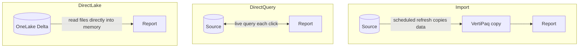

| Mode | Speed | Freshness | Data copied? | Best when |
|---|---|---|---|---|
| **Import** | Fastest | Stale until refresh | Yes | Small/medium data, complex transforms |
| **DirectQuery** | Slower | Always live | No | Huge data, must be real-time, source is fast |
| **Direct Lake** | Fast (import-like) | Fresh (live-like) | No | Data already in OneLake (the Fabric default) |

> 🔍 **Plain-English deep-dive — why Direct Lake is a big deal:** Historically you had to choose: *fast but stale* (Import) or *fresh but slow* (DirectQuery). Direct Lake breaks the trade-off because OneLake already stores data in the columnar Delta/Parquet format that Power BI's engine loves — so it can page the columns straight into memory with no copy step. If the data isn't in OneLake, Direct Lake can silently *fall back* to DirectQuery, so "keep your gold tables in OneLake as Delta" is the practical rule.

### 5.4 Capacities and F-SKUs — how you pay for compute

- **Capacity** — *the pool of shared compute power that all your Fabric workloads draw from.*
  - **Analogy:** a prepaid electricity meter for the whole building; every appliance (workload) draws from the same meter.
- **F-SKU** — *the capacity size you buy*, named **F2, F4, F8, … F64, F128, F256** (the number ≈ compute units / "Capacity Units").
  - F64 and above unlocks free Power BI report consumption for users (a common licensing note).
- **Capacity Units (CUs)** — *the unit of compute consumption* a workload spends.
- **Smoothing** — *Fabric averages your usage over time so short spikes don't immediately throttle you.*
  - **Analogy:** a phone plan that bills your average usage over the month, not your single busiest minute.
- **Bursting** — *a single job can temporarily use more compute than your steady-state size for speed*, then it's repaid via smoothing.
  - **Analogy:** flooring the accelerator briefly to merge onto the highway, then settling back to cruising speed.
- **Throttling** — *if sustained demand exceeds what you bought, Fabric slows/delays work* until usage settles.
- **Pause/resume** — *you can pause a capacity to stop billing* (great for dev environments overnight).

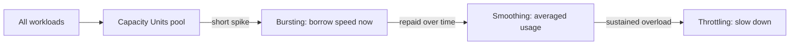

| Term | Plain meaning | Why you care |
|---|---|---|
| Capacity | Shared compute pool | One bill, all workloads |
| F-SKU (F2…F256) | Capacity size | Bigger = more parallel power |
| CU | Compute consumed | The "fuel" workloads burn |
| Smoothing | Averages usage | Spikes don't instantly throttle |
| Bursting | Temporary extra speed | Fast big jobs |
| Throttling | Slowdown when overloaded | Cost/perf signal to size up |

> 💡 **Tie-in:** Capacity management is a *cost-governance* skill. Your support mindset — "watch utilization, spot the spike, right-size" — is exactly how teams keep Fabric bills sane. Mention pausing dev capacities overnight; it shows cost awareness.

### 5.5 Workspaces, Git integration, and deployment pipelines

- **Workspace** — *a container that holds related Fabric items (lakehouses, notebooks, pipelines, reports) and is the unit of collaboration and security.*
  - **Analogy:** a SharePoint site or a project folder — a team's shared room.
- **Git integration** — *connect a workspace to Azure DevOps/GitHub so items are version-controlled as code.*
  - **Analogy:** "track changes" + history for your data project; you can branch, review, and roll back.
- **Deployment pipelines** — *promote content through **Dev → Test → Prod** workspaces with controlled, repeatable releases.*
  - **Analogy:** a staged release process — bake in Dev, verify in Test, ship to Prod — instead of editing live.
- **CI/CD (Continuous Integration / Continuous Deployment)** — *automating build, test, and release.* Git + deployment pipelines are how Fabric does CI/CD.

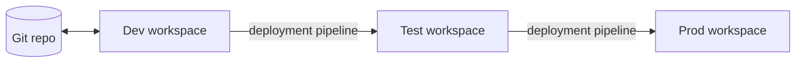

> 💡 **Tie-in to your background:** As an escalation engineer you know the pain of untested changes hitting production. Saying "I'd keep transformations in Git and promote Dev→Test→Prod with deployment pipelines, never editing the Prod report live" signals real engineering maturity.

### 5.6 OneLake security & governance (high level)

- **Workspace roles** — *Admin / Member / Contributor / Viewer* control who can do what in a workspace.
- **OneLake data access roles** — *folder/table-level security inside a lakehouse.*
- **Row-Level Security (RLS)** — *filter rows by who's asking* (e.g., EMEA managers see only EMEA cases).
- **Object/column-level security** — *hide sensitive columns* (e.g., customer PII).
- **Sensitivity labels** — *Microsoft Purview Information Protection labels (e.g., "Confidential") that travel with the data and exported files.*
- **Microsoft Entra ID (formerly Azure AD)** — *the identity provider; all access is governed by your corporate sign-in.*

### 5.7 Copilot in Fabric

- **Copilot in Fabric** — *AI assistance built into the workloads:* generate PySpark/SQL/DAX from plain English, summarize data, build report visuals, and document pipelines.
  - **Analogy:** a pair-programmer that drafts the boring code while you steer.
  - Requires a sufficiently large capacity (commonly F64+).
- **Support example:** "Copilot, write PySpark to compute weekly breach rate by product from `cases_silver`."

> 💡 **Tie-in:** Your AI-900 / AI-102 background is a genuine edge here — you can speak to *responsible* AI use (grounding, reviewing generated code, not blindly trusting it).

### 5.8 Lakehouse vs Warehouse in Fabric — the decision table

Both store Delta in OneLake and interoperate. Choose by team skill and workload.

| Factor | Fabric **Lakehouse** | Fabric **Warehouse** |
|---|---|---|
| Primary engine | Spark (+ read-only SQL endpoint) | T-SQL |
| Write with | PySpark / Spark SQL / notebooks | Full T-SQL DML (INSERT/UPDATE/DELETE/MERGE) |
| Data shape | Files **and** tables (any format) | Structured tables |
| Best for | Data engineering, ML, big/varied data | SQL-first modeling, governed star schemas |
| Who loves it | Python/Spark engineers | SQL/BI developers |
| Storage format | Delta in OneLake | Delta in OneLake |
| Multi-table transactions | Limited | Yes (T-SQL) |

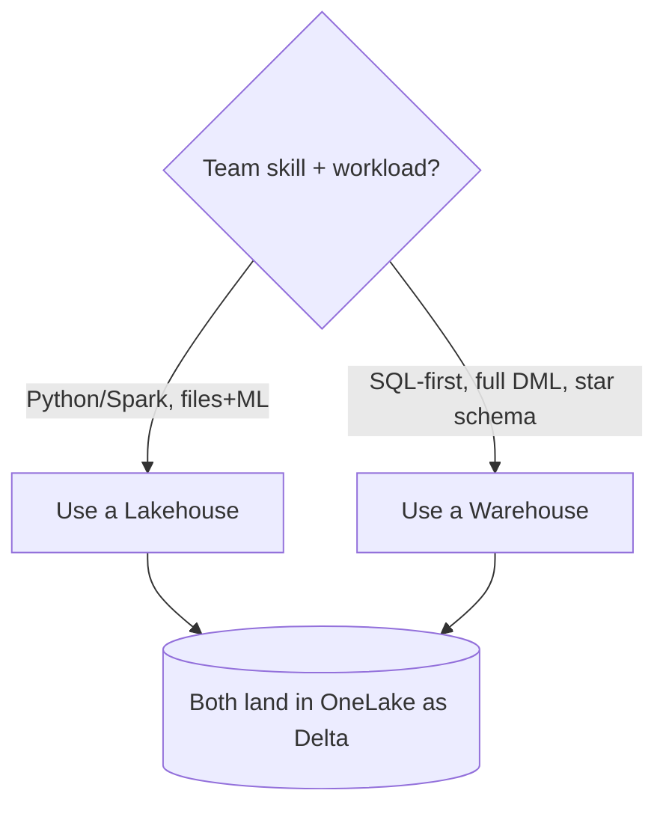

> 💡 **Tie-in:** Frame Fabric as "the place where everything in this guide comes together — ingest with Pipelines, transform with PySpark or T-SQL, model as a star schema, and serve through a Direct Lake semantic model to Power BI, all on OneLake." That sentence shows you see the whole picture.

---

## 6. Azure Synapse Analytics — Fabric's predecessor (still everywhere)

**Azure Synapse Analytics** is the previous-generation unified analytics service: SQL + Spark + pipelines in one studio. Fabric is its spiritual successor, but **many teams still run Synapse in production**, so you must know it.

- **Analogy:** Synapse is the "Fabric before Fabric" — the same idea (one place for SQL, Spark, and ingestion) but PaaS, not SaaS, and you manage more of it.

### 6.1 Synapse dedicated SQL pool (the MPP warehouse)

- **Dedicated SQL pool** (formerly **SQL Data Warehouse**) — *a provisioned, massively parallel relational data warehouse.*
- **MPP (Massively Parallel Processing)** — *split the data and the work across many compute nodes that run in parallel, then combine results.*
  - **Analogy:** instead of one librarian counting every book, 60 librarians each count their shelf and you sum the totals.
- **Distributions** — *Synapse splits each table into **60 distributions** (buckets) spread across the nodes.* How you distribute a table massively affects speed.

#### The three distribution strategies (classic interview question)

- **Hash distribution** — *rows are assigned to a distribution by hashing a chosen column.*
  - **Best for:** large fact tables. Pick a high-cardinality, evenly-spread join key (e.g., `case_id`).
  - **Why:** rows that join/aggregate together land together → less data shuffling.
- **Round-robin distribution** — *rows are spread evenly with no logic (next bucket each time).*
  - **Best for:** staging/loading tables, or when no good hash key exists. Even spread, but joins cause shuffles.
- **Replicated distribution** — *a full copy of the table on every node.*
  - **Best for:** small dimension tables (e.g., `Dim_Product`, a few thousand rows) so joins need no movement.

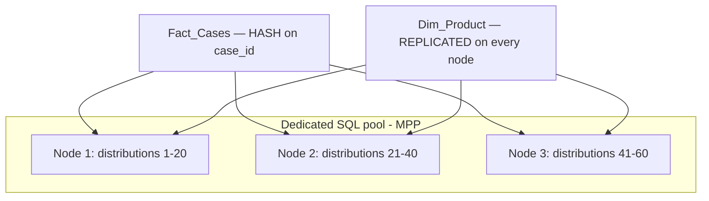

| Distribution | How rows are placed | Best for | Support example |
|---|---|---|---|
| **Hash** | By hashing a column | Big fact tables | `Fact_Cases` hashed on `case_id` |
| **Round-robin** | Evenly, no logic | Staging/load tables | Raw bronze landing table |
| **Replicated** | Full copy per node | Small dimensions | `Dim_Product`, `Dim_Region` |

- **Data shuffling / movement** — *when a join needs rows that live on different nodes, the engine moves data between nodes (slow).* Good distribution choices minimize shuffles.
- **Partitions (in dedicated pool)** — *within each distribution, you can further split by a column (usually date) for pruning and easier maintenance.* (Different from, and on top of, distributions.)
- **DWU (Data Warehousing Units)** — *the compute size you provision and pay for.*

> 🔍 **Plain-English deep-dive — distributions vs partitions:** Distribution decides *which node* a row lives on (for parallelism); partitioning decides *which folder/segment within a node* (for pruning). Hash your big fact on a join key, replicate your small dims, and partition the fact by month — that combination is the classic high-performance MPP design.

### 6.2 Synapse serverless SQL pool

- **Serverless SQL pool** — *query files in the data lake **directly** with T-SQL, paying per terabyte scanned, with **no infrastructure to provision**.*
  - **Analogy:** a taxi (pay per ride) vs. the dedicated pool's leased car (pay to own it).
  - **Best for:** ad-hoc exploration of Parquet/CSV in the lake, building logical views, light/occasional querying.
  - `SELECT * FROM OPENROWSET(BULK 'https://.../cases/*.parquet', FORMAT='PARQUET')`

### 6.3 Synapse Apache Spark pools

- **Spark pool** — *a managed Apache Spark cluster inside Synapse* for PySpark/Scala data engineering and ML (your Part 4 skills).
- Autoscaling clusters; integrates with the lake and SQL pools.

### 6.4 Synapse Pipelines & Synapse Link

- **Synapse Pipelines** — *the same engine as Azure Data Factory, embedded in Synapse* for ingestion/orchestration.
- **Synapse Link** — *near-real-time analytics over operational stores **without ETL*** (e.g., Cosmos DB, Dataverse, SQL) by auto-replicating their data into an analytical store.
  - **Analogy:** a live mirror of the operational database you can query for analytics without disturbing it.

### 6.5 How Synapse relates to Fabric

| Concept | Synapse (PaaS) | Fabric (SaaS) |
|---|---|---|
| MPP warehouse | Dedicated SQL pool | Warehouse item |
| Query lake files | Serverless SQL pool | Lakehouse SQL endpoint |
| Spark | Spark pool | Data Engineering notebooks |
| Ingestion | Synapse Pipelines | Data Factory pipelines |
| Storage | ADLS Gen2 you wire up | OneLake (automatic) |
| Management | You provision/size | Microsoft manages |

> 💡 **Tie-in:** If the team still has Synapse, your value is bridging it to Fabric: "I understand hash/round-robin/replicated distributions in the dedicated pool, and that Fabric's Warehouse gives the same star-schema modeling on auto-managed OneLake."

---

## 7. Azure Databricks — the premium Spark lakehouse

**Azure Databricks** is a first-party Azure service built by the creators of Apache Spark and Delta Lake. It's the heavyweight platform for large-scale data engineering, ML, and lakehouse analytics.

- **Analogy:** a high-performance Spark workshop with professional tools. Where Fabric is "all-in-one and managed," Databricks is "best-in-class Spark + ML, on Azure (and AWS/GCP)."

### 7.1 Core building blocks

- **Workspace** — *the collaborative environment* holding notebooks, jobs, clusters, and data (like a Fabric workspace, Databricks-flavored).
- **Cluster** — *a set of VMs running Spark* that executes your code.
  - **All-purpose cluster** — *interactive, shared, for development/exploration in notebooks.*
  - **Job cluster** — *spun up to run a scheduled job, then torn down* (cheaper, isolated).
  - **Autoscaling** — *adds/removes worker nodes based on load.*
  - **Photon** — *Databricks' vectorized C++ query engine that speeds up SQL/Delta workloads.*
    - **Analogy:** a turbocharger bolted onto the Spark engine.
- **Notebooks** — *Python/SQL/Scala/R notebooks* (your PySpark home).
- **Jobs / Workflows** — *orchestrate notebooks/tasks on a schedule with dependencies* (Databricks' pipeline equivalent).
- **SQL Warehouses (formerly SQL Endpoints)** — *compute optimized for BI/SQL queries on Delta tables* (often Photon-powered), used by analysts and BI tools.

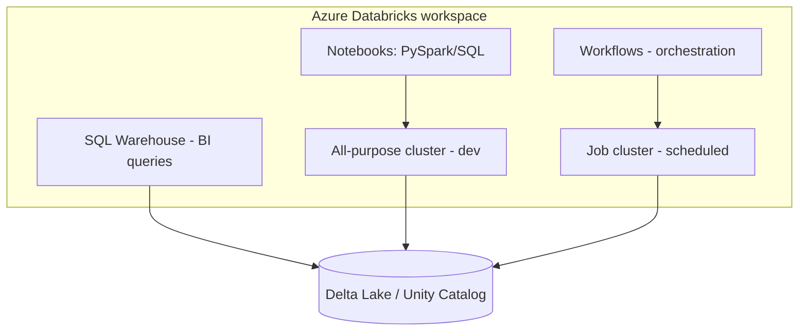

| Cluster type | Lifespan | Best for | Cost angle |
|---|---|---|---|
| All-purpose | Long-running, shared | Interactive dev, exploration | Pricier; keep small or auto-terminate |
| Job | Created per run, then killed | Scheduled production jobs | Cheaper, isolated |
| SQL Warehouse | On-demand BI compute | Dashboards, SQL analysts | Auto-stop when idle |

### 7.2 Unity Catalog — governance for the lakehouse

- **Unity Catalog** — *Databricks' centralized governance layer: one catalog of all data with fine-grained access control, lineage, and discovery across workspaces.*
  - **Three-level namespace:** `catalog.schema.table` (e.g., `support.silver.cases`).
  - **Analogy:** a company-wide card catalog + security desk for every table, no matter which workspace created it.
  - Provides **lineage** (where a column came from), **auditing**, and **row/column security**.

### 7.3 Delta Live Tables (DLT)

- **Delta Live Tables** — *a declarative framework to build reliable ETL pipelines:* you describe the tables and quality rules, Databricks manages dependencies, retries, and incremental processing.
  - **Analogy:** instead of hand-wiring every step, you declare "bronze → silver → gold with these quality expectations" and the framework runs it.
  - **Expectations** — *built-in data-quality rules* that drop/quarantine/fail bad rows (great for the silver layer).

### 7.4 MLflow

- **MLflow** — *open-source platform (created by Databricks) to track experiments, package models, and manage their lifecycle/registry.* Now also embedded in Fabric — same tool, two homes.

### 7.5 Relationship to Delta, Fabric, and multi-cloud

- Databricks **created Delta Lake** — the very format Fabric also uses — which is why **Databricks and Fabric interoperate**: Databricks can write Delta that Fabric reads via OneLake **shortcuts**, and vice versa.
- **Multi-cloud:** Databricks runs on Azure, AWS, and Google Cloud; Fabric is Azure/Microsoft-only SaaS. Enterprises often use Databricks for heavy engineering/ML and Fabric/Power BI for serving.

```mermaid
flowchart LR
    DBX[Azure Databricks<br/>Spark + Delta + ML] -->|writes Delta| Lake[(Delta in ADLS / OneLake)]
    Lake -->|OneLake shortcut, no copy| Fab[Microsoft Fabric]
    Fab --> PBI[Power BI Direct Lake]
```

| Aspect | Azure Databricks | Microsoft Fabric |
|---|---|---|
| Type | PaaS (managed Spark) | SaaS (all-in-one) |
| Strength | Heavy engineering, ML, scale | Unified analytics + Power BI |
| Clouds | Azure, AWS, GCP | Microsoft/Azure only |
| Governance | Unity Catalog | OneLake + Purview |
| Shared format | Delta Lake | Delta Lake |

> 💡 **Tie-in:** "My PySpark from Part 4 runs natively in Databricks notebooks; the Delta tables it produces are the same format Fabric reads, so I can work across both. Databricks for scale, Fabric for serving — they share Delta."

---

## 8. Azure Data Factory (ADF) — cloud ingestion & orchestration

**Azure Data Factory** is Azure's standalone cloud ETL/ELT and orchestration service: 90+ connectors and visual pipelines that move and schedule data.

- **Analogy:** the logistics company that moves goods between warehouses on a schedule — it doesn't *make* the product, it *moves* it reliably.

### 8.1 The five core ADF concepts

- **Pipeline** — *a logical group of activities that together do a task* (e.g., "load support data nightly").
- **Activity** — *a single step* — Copy activity (move data), data-flow activity (transform), control activities (ForEach, If, Until, Execute Pipeline).
- **Dataset** — *a named view of the data structure* you read/write (e.g., "the cases table" or "the surveys folder").
- **Linked service** — *a connection string / credential to a source or sink* (e.g., the Azure SQL connection).
  - **Analogy:** a linked service is the *address + key* to a building; a dataset is *which room* inside it.
- **Integration Runtime (IR)** — *the compute engine that actually performs the movement/transform.*

```mermaid
flowchart LR
    LS[Linked Service: connection] --> DS[Dataset: shape/location]
    DS --> ACT[Activity: Copy / Data Flow]
    ACT --> PL[Pipeline: orchestrates activities]
    IR[Integration Runtime: does the work] -.powers.-> ACT
    TRG[Trigger: when to run] -.starts.-> PL
```

### 8.2 Integration Runtime — Azure vs self-hosted

- **Azure IR** — *Microsoft-managed compute in the cloud* for cloud-to-cloud movement and data flows.
- **Self-hosted IR (SHIR)** — *an agent you install on-premises (or in a private network) to reach private/on-prem sources securely.*
  - **Analogy:** a trusted courier you station inside a locked building so the cloud can fetch packages without exposing the building to the internet.
  - **Support example:** pulling case data from an on-prem SQL Server behind the corporate firewall.
- **Azure-SSIS IR** — *runs legacy SQL Server Integration Services (SSIS) packages in the cloud* (lift-and-shift of old ETL).

| IR type | Where it runs | Use for |
|---|---|---|
| Azure IR | Cloud (managed) | Cloud sources, data flows |
| Self-hosted IR | Your network/on-prem | Private/on-prem sources |
| Azure-SSIS IR | Cloud | Running existing SSIS packages |

### 8.3 Triggers — how pipelines start

- **Schedule trigger** — *run on a wall-clock schedule* (e.g., every night at 2 AM).
- **Tumbling-window trigger** — *run for fixed, non-overlapping time slices with state/dependency/back-fill support* (great for hourly/daily incremental loads you may need to replay).
  - **Analogy:** processing the mail one sealed hour-bin at a time, in order, and able to reprocess a missed bin.
- **Event-based trigger** — *run when something happens* (e.g., a new file lands in Blob/ADLS — a storage event).
  - **Support example:** the moment a daily `cases.csv` is dropped in the landing folder, ingestion kicks off.

```mermaid
flowchart TD
    S[Schedule: nightly 2AM] --> P[Pipeline]
    T[Tumbling window: hourly slices] --> P
    E[Event: file arrives] --> P
```

### 8.4 Mapping data flows, parameters & variables

- **Mapping data flow** — *a visual, code-free transformation that runs on Spark under the hood* (joins, aggregates, derived columns) — no Spark code required.
  - **Analogy:** a drag-and-drop assembly line that secretly runs on a Spark cluster.
- **Parameters** — *values passed into a pipeline at runtime* (e.g., the load date, the source table name) for reusable, generic pipelines.
- **Variables** — *values set and changed during a run* (e.g., a running counter or a built-up file path).

### 8.5 ADF vs Fabric Data Factory

| Aspect | Azure Data Factory (standalone) | Fabric Data Factory |
|---|---|---|
| Lives in | Its own Azure service (PaaS) | Inside Fabric (SaaS) |
| Transforms | Mapping data flows | **Dataflows Gen2** (Power Query) |
| Orchestration | Pipelines | Pipelines (very similar) |
| Destination | Any (ADLS, Synapse, etc.) | OneLake-native + others |
| Best when | Pure Azure ETL, on-prem reach via SHIR | You're already standardized on Fabric |

> 💡 **Honest interview line:** "I've built Azure foundations through AZ-900/DP-900 and hands-on Fabric and Power BI labs. I understand how Data Factory ingests (linked services, datasets, Integration Runtime, triggers), how Synapse and Databricks transform with SQL and Spark, and how Fabric unifies them on OneLake. My production depth is growing through projects, and the concepts — lakehouse, Delta, Medallion, distributions, semantic models — transfer across whichever engine the team uses."

---

## 9. How a real analytics request flows through the whole stack

Now connect everything. A stakeholder asks a question; here's the end-to-end journey — the diagram that proves you understand the platform.

### 9.1 The scenario

> "Support leadership wants a **weekly CSAT and SLA-breach dashboard, sliced by product and region**, refreshed every morning, with EMEA managers seeing only EMEA data."

### 9.2 The sequence (request → dashboard)

```mermaid
sequenceDiagram
    participant Stk as Stakeholder (Support lead)
    participant An as You (Analyst)
    participant PL as Pipeline (Data Factory)
    participant BR as OneLake Bronze
    participant LH as Lakehouse (Spark, Silver)
    participant WH as Warehouse / Gold (star schema)
    participant SM as Semantic Model (Direct Lake)
    participant PBI as Power BI report

    Stk->>An: "Weekly CSAT + breach by product & region"
    An->>An: Clarify grain, KPI definitions, RLS need (Part 8)
    An->>PL: Schedule nightly ingest (triggers)
    PL->>BR: Copy cases (SQL) + surveys (API) + telemetry (events)
    BR->>LH: PySpark clean, dedupe, conform region codes
    LH->>WH: Build Fact_Cases + Dim_Product/Region/Date
    WH->>SM: Relationships + DAX (CSAT %, Breach Rate)
    SM->>SM: Apply Row-Level Security (EMEA filter)
    SM->>PBI: Direct Lake — fast + fresh, no copy
    PBI-->>Stk: Every-morning self-serve dashboard
```

### 9.3 Layer-by-layer, with the Part it links to

| Step | Stack layer | Tool | Links to |
|---|---|---|---|
| Understand the ask | Requirements | Conversation, backlog | Part 8 (Agile/requirements) |
| Ingest | Bronze | Data Factory pipeline + Copy activity | Section 5/8 |
| Clean & conform | Silver | Spark notebook (PySpark) | Part 4 (Python/PySpark) |
| Model | Gold | Warehouse T-SQL / Spark → star schema | Part 5 (modeling) |
| Define KPIs | Semantic model | DAX measures | Part 7 (DAX) |
| Secure | Semantic model | RLS + sensitivity labels | Part 9 (governance) |
| Serve | Report | Power BI Direct Lake | Part 7 |
| Trust the numbers | Quality/lineage | Bronze→Silver lineage, Purview | Part 9 |

> 🔍 **Plain-English deep-dive — say this in the interview:** "A request becomes a pipeline. Data Factory lands raw case, survey, and telemetry data in OneLake bronze. A Spark notebook cleans and conforms it to silver. I model a star schema in gold. A Direct Lake semantic model exposes standardized DAX KPIs with row-level security so EMEA managers see only EMEA. Power BI serves it every morning. One platform, one copy of data, governed end to end." If you can narrate that, you've understood Parts 3–9 as one story.

> 💡 **Tie-in to your background:** This is the analytics version of an escalation: *intake the issue → reproduce/clean the data → root-cause into a model → communicate a trustworthy answer.* Your support discipline maps onto every step.

---

## 10. Governance, security, CI/CD, and cost (the "grown-up" layer)

A BI team is judged not just on dashboards but on *trust, safety, and cost*. Know these at a high level; Part 9 goes deeper.

### 10.1 Microsoft Purview — governance

- **Microsoft Purview** — *a unified governance service for cataloging, classifying, and tracking data across the estate.*
  - **Data catalog** — *a searchable inventory of data assets* ("where does CSAT live, who owns it?").
  - **Data lineage** — *the map of where data came from and where it flows* (source → bronze → silver → gold → report).
  - **Classification & sensitivity labels** — *auto-tag PII/Confidential data* so policies follow it.
  - **Analogy:** a library catalogue + provenance records + security stamps for all company data.
- **Support example:** prove that the "breach rate" on a leadership slide traces back through gold → silver → the source ticket system — instant credibility.

### 10.2 Security model

- **RBAC (Role-Based Access Control)** — *grant permissions via roles, not to individuals one by one.*
  - **Analogy:** building access by job badge (every "Analyst" badge opens the same doors) instead of cutting a custom key per person.
- **Row-Level Security (RLS)** — *filter table rows by who's viewing* (EMEA managers → EMEA rows only).
- **Object/Column-Level Security (OLS/CLS)** — *hide whole tables or sensitive columns* (mask customer PII).
- **Sensitivity labels** — *Purview labels (Public/Internal/Confidential) that travel with exports* (even into a downloaded Excel).
- **Microsoft Entra ID** — *the identity backbone; all access ties to corporate sign-in and conditional access.*

```mermaid
flowchart TD
    User[User signs in - Entra ID] --> RBAC[RBAC: what items can you open?]
    RBAC --> RLS[RLS: which rows do you see?]
    RLS --> CLS[CLS: which columns are visible?]
    CLS --> Label[Sensitivity label travels with exports]
```

| Control | Question it answers | Support example |
|---|---|---|
| RBAC | Can you open this workspace/report? | Only BI team edits; leaders view |
| RLS | Which rows? | EMEA lead sees EMEA cases only |
| CLS/OLS | Which columns/tables? | Hide customer names from analysts |
| Sensitivity label | How sensitive, what follows export? | "Confidential" tag on customer data |

### 10.3 CI/CD (high level)

- **CI/CD** — *automate building, testing, and releasing changes* so deployments are repeatable and safe.
- In Fabric: **Git integration** (version control) + **deployment pipelines** (Dev→Test→Prod). In ADF/Synapse/Databricks: ARM templates / Git / Databricks Repos + Workflows.
- **Why it matters:** no more "I edited the live report and broke it" — the exact problem you've escalated from the support side.

### 10.4 Cost & capacity management (high level)

- **Right-size capacity** — *match the F-SKU to real demand; scale up for month-end, down otherwise.*
- **Pause dev/test capacities** — *stop paying when nobody's working.*
- **Watch CUs** — *use the Fabric Capacity Metrics app to spot heavy queries/refreshes and smooth/burst behavior.*
- **Prefer efficient patterns** — *columnar/partitioned gold tables, OPTIMIZE, incremental loads* reduce compute burned.

| Lever | Action | Payoff |
|---|---|---|
| Capacity size | Right-size F-SKU | Avoid over/under-paying |
| Pause | Stop dev capacity off-hours | Direct savings |
| Monitor | Capacity Metrics app | Catch runaway costs early |
| Optimize data | Partition + OPTIMIZE + incremental | Less compute per refresh |

> 💡 **Tie-in:** Governance, security, and cost are where your support background shines — you already think in terms of access, audit, and "who broke what." Lead with that; it differentiates you from purely technical candidates.

---

## 11. Certification path — what to target

You already hold AZ-900, DP-900, AI-900, AI-102. For this Data Analyst (BI) role, line up the role-based certs in this order.

```mermaid
flowchart LR
    F1[AZ-900 ✔] --> F2[DP-900 ✔]
    F2 --> P[PL-300<br/>Power BI Data Analyst]
    P --> D6[DP-600<br/>Fabric Analytics Engineer]
    D6 --> D7[DP-700<br/>Fabric Data Engineer]
```

| Cert | Title | Focus | Why for you |
|---|---|---|---|
| **PL-300** | Power BI Data Analyst | Model, DAX, visualize, RLS | Core JD skill; quickest high-value win (pairs with Part 7) |
| **DP-600** | Fabric Analytics Engineer | Lakehouse, semantic models, DAX, SQL/Spark, Direct Lake | The flagship Fabric cert for *this* role — closes your biggest gap |
| **DP-700** | Fabric Data Engineer | Pipelines, Spark, Real-Time Intelligence, KQL, ingestion | Deepens the engineering side if you want to grow further |

- **Suggested sequence:** PL-300 first (builds on your Power BI strength), then **DP-600** (the headline Fabric cert), then DP-700 if you lean engineering.
- **DP-203 (Azure Data Engineer)** is being retired in favor of the Fabric-era certs — focus on DP-600/DP-700.

> 💡 **Tie-in:** Saying "I'm targeting PL-300 then DP-600 to formalize my Fabric skills" turns your biggest gap into a *plan*, which interviewers love far more than a finished checklist.

---

## 12. Hands-on Lab Demos

Reading builds knowledge; *doing* makes it stick. Do at least one of these. Both are free.

### 🧪 Hands-on Lab Demo A — Build a Fabric Lakehouse end-to-end (free trial, ~45 min)

**Goal:** Ingest → transform → model → serve in Power BI, all in Fabric — the full Medallion flow.

**Setup:** Go to [app.fabric.microsoft.com](https://app.fabric.microsoft.com) and start the **free Microsoft Fabric trial** (60 days; a work/school account works best — a personal Microsoft account may need a trial sign-up). If you have no Fabric access at all, do Lab B (Databricks Community) instead.

**Steps:**

1. **Create a Workspace** → confirm it has trial/Fabric capacity (look for the diamond icon). Name it `support-bi-dev`.
2. **Create a Lakehouse** (New → Lakehouse, name it `support_lh`). This provisions OneLake storage with **Tables** (Delta) and **Files** (raw) areas.
3. **Ingest (Bronze):** Use **Get data → Upload files** to upload a `cases.csv` (reuse Part 3/4 data). For the low-code path, try **New Dataflow Gen2** and load the same file with Power Query.
4. **Transform (Bronze → Silver) with a Notebook:** New → Notebook, attach it to `support_lh`, run PySpark:
   ```python
   from pyspark.sql import functions as F

   # Bronze: read raw
   bronze = spark.read.option("header", True).csv("Files/cases.csv", inferSchema=True)

   # Silver: clean + conform + derive breach flag
   silver = (bronze
             .filter(F.col("csat").isNotNull())
             .withColumn("region", F.upper(F.col("region")))
             .withColumn("breach", (F.col("resolution_hours") > 24).cast("int")))

   silver.write.mode("overwrite").format("delta").saveAsTable("cases_silver")
   ```
   You just created a **Delta table** in OneLake (peek at the `Tables/cases_silver/_delta_log` folder to see the transaction log!).
5. **Model (Gold):** Build a business-ready aggregate and save it as Delta:
   ```python
   gold = (spark.table("cases_silver")
           .groupBy("product", "region")
           .agg(F.round(F.avg("csat"), 2).alias("avg_csat"),
                F.round(F.avg("breach") * 100, 1).alias("breach_rate_pct"),
                F.count("*").alias("case_count")))

   gold.write.mode("overwrite").format("delta").saveAsTable("product_health_gold")
   ```
6. **Query with T-SQL:** Switch the Lakehouse to its **SQL analytics endpoint** and run:
   ```sql
   SELECT product, region, avg_csat, breach_rate_pct
   FROM product_health_gold
   ORDER BY breach_rate_pct DESC;
   ```
   Same data, now via T-SQL — proving one copy, two engines.
7. **Serve (Direct Lake):** From the Lakehouse, **New semantic model**, add `product_health_gold`, then **Create report** → bar chart of `product` vs `breach_rate_pct`. The model uses **Direct Lake** — fast *and* fresh, no import.
8. **(Optional) Orchestrate:** New → **Data pipeline** → **Copy activity** to schedule the ingest, then add a **Notebook activity** to run your transform — that's Data Factory inside Fabric.
9. **(Optional) Govern:** Open the semantic model → add a simple **Row-Level Security** role filtering `region = "EMEA"`, and test "View as role."

**Success check:** you can point at OneLake, a `_delta_log`, a silver and a gold Delta table, a Direct Lake semantic model, RLS, and a report — and narrate the Medallion flow that connects them.

### 🧪 Hands-on Lab Demo B — Databricks Community fallback (free forever, ~40 min)

**When to use:** no Fabric access, or you want to feel Spark + Delta in their native home.

**Setup:** Sign up at [Databricks Community Edition](https://community.cloud.databricks.com/) (free; no credit card). You get a small cluster and notebooks. (Note: Community Edition is great for learning the *concepts*; Unity Catalog/Workflows are limited there.)

**Steps:**

1. **Create a cluster** (Compute → Create; the free single-node cluster is fine). This is your Spark engine.
2. **Create a notebook** (default language Python), attach it to the cluster.
3. **Create a Delta table (Bronze → Silver):**
   ```python
   from pyspark.sql import functions as F

   data = [(1, "Teams", "emea", 5, 30),
           (2, "OneDrive", "AMER", 4, 12),
           (3, "SharePoint", "apac", 2, 50)]
   cols = ["case_id", "product", "region", "csat", "resolution_hours"]

   bronze = spark.createDataFrame(data, cols)

   silver = (bronze
             .withColumn("region", F.upper("region"))
             .withColumn("breach", (F.col("resolution_hours") > 24).cast("int")))

   silver.write.mode("overwrite").format("delta").saveAsTable("cases_silver")
   ```
4. **See Delta features in action:**
   ```python
   # Time travel + history
   spark.sql("DESCRIBE HISTORY cases_silver").show(truncate=False)

   # MERGE (upsert) a corrected row
   spark.sql("""
     MERGE INTO cases_silver t
     USING (SELECT 3 AS case_id, 4 AS csat) s
     ON t.case_id = s.case_id
     WHEN MATCHED THEN UPDATE SET t.csat = s.csat
   """)

   # Read an older version (time travel)
   spark.sql("SELECT * FROM cases_silver VERSION AS OF 0").show()
   ```
5. **Build a gold aggregate and query with SQL:**
   ```sql
   %sql
   CREATE OR REPLACE TABLE product_health_gold AS
   SELECT product, region,
          ROUND(AVG(csat), 2)               AS avg_csat,
          ROUND(AVG(breach) * 100, 1)       AS breach_rate_pct,
          COUNT(*)                          AS case_count
   FROM cases_silver
   GROUP BY product, region;

   SELECT * FROM product_health_gold ORDER BY breach_rate_pct DESC;
   ```
6. **Optimize (concept):** on a paid workspace you'd run `OPTIMIZE cases_silver ZORDER BY (product)` and `VACUUM cases_silver`. Read the history output to *see* that a Delta table is just Parquet + a log.

**Success check:** you can explain — from your own runs — what a Delta table, the transaction log, time travel, and MERGE actually do, and how the same Delta format is what lets Databricks and Fabric share data.

> 💡 **Tie-in:** After Lab A or B, you can honestly say in the interview: "I've built a Medallion lakehouse end to end — ingested raw data, transformed it with PySpark into Delta, modeled a gold table, and served it." That sentence, backed by real hands-on, is exactly what closes your biggest gap.

---

---

## 13. Quick-reference, decision trees & support-data scenario bank

Use this section to revise fast the night before, and to have ready answers for "what would you use for X?" questions.

### 13.1 Acronym & term cheat-sheet

| Term | Plain meaning | Memory hook |
|---|---|---|
| IaaS / PaaS / SaaS | Rent infra / platform / finished app | Cook / bake / delivered pizza |
| ADLS Gen2 | Analytics lake storage with real folders | Blob + folders + ACLs |
| Parquet | Columnar, compressed, typed file | "Column envelopes, shrink-wrapped" |
| Delta | Parquet + transaction log = a table | "Files + a logbook" |
| ACID | Atomic, Consistent, Isolated, Durable | "All-or-nothing, crash-proof" |
| `_delta_log` | The transaction log folder | "The librarian's ledger" |
| Time travel | Query an older table version | "Undo button for tables" |
| MERGE | Atomic upsert (insert+update) | "One-step nightly load" |
| OPTIMIZE | Compact small files | "Tidy the shelves" |
| Z-ORDER | Co-locate related data | "Group items bought together" |
| VACUUM | Delete old unreferenced files | "Take out the trash" |
| Medallion | Bronze→Silver→Gold tiers | "Raw → prepped → plated" |
| OneLake | Tenant-wide lake for Fabric | "OneDrive for data" |
| Shortcut | Pointer to data, no copy | "Symlink for the lake" |
| Direct Lake | Read OneLake Delta into Power BI directly | "Fast like import, fresh like live" |
| Capacity / F-SKU | Shared compute pool / its size | "Prepaid meter for the building" |
| Smoothing / Bursting | Average usage / borrow speed | "Phone-plan averaging / flooring it" |
| MPP | Massively parallel processing | "60 librarians, not one" |
| Distribution | How rows spread across nodes | "Hash big, replicate small" |
| Serverless SQL | Query lake files, pay per scan | "Taxi, not a leased car" |
| Photon | Databricks' vectorized engine | "Turbocharger on Spark" |
| Unity Catalog | Databricks governance layer | "Card catalog + security desk" |
| DLT | Declarative Databricks ETL | "Describe it, it runs it" |
| MLflow | Track ML experiments/models | "Auto lab notebook" |
| Integration Runtime | ADF's compute that moves data | "The courier" |
| SHIR | Self-hosted IR for on-prem | "Courier inside the locked building" |
| RBAC / RLS / CLS | Item / row / column security | "Door / pew / line item" |
| Purview | Catalog + lineage + classification | "Library catalogue for all data" |

### 13.2 "What would you use for…?" decision tree

```mermaid
flowchart TD
    Q0{What do you need to do?} --> Ing{Move/ingest data?}
    Ing -->|yes| ADF[Data Factory pipeline + Copy activity]
    Q0 --> Big{Big/varied transform, Python?}
    Big -->|yes| LH[Lakehouse + Spark notebook]
    Q0 --> SQL{SQL-first modeling, full DML?}
    SQL -->|yes| WH[Warehouse - T-SQL]
    Q0 --> Stream{Streaming/telemetry, sub-second?}
    Stream -->|yes| RTI[Real-Time Intelligence + KQL]
    Q0 --> ML{Predict/classify?}
    ML -->|yes| DS[Data Science + MLflow]
    Q0 --> Serve{Dashboard/self-serve?}
    Serve -->|yes| PBI[Power BI - Direct Lake semantic model]
```

### 13.3 Storage-mode quick pick (Power BI)

```mermaid
flowchart TD
    A{Is data already Delta in OneLake?} -->|yes| DL[Direct Lake — default]
    A -->|no| B{Need real-time + huge source?}
    B -->|yes| DQ[DirectQuery]
    B -->|no| IM[Import]
```

### 13.4 Spark vs T-SQL — same job, two tools

| Task | PySpark (Lakehouse) | T-SQL (Warehouse) |
|---|---|---|
| Read | `spark.table("cases_silver")` | `SELECT * FROM cases_silver` |
| Filter | `.filter(F.col("breach")==1)` | `WHERE breach = 1` |
| Aggregate | `.groupBy("product").agg(F.avg("csat"))` | `GROUP BY product` + `AVG(csat)` |
| Upsert | Delta `MERGE` via Spark SQL | `MERGE INTO … WHEN MATCHED …` |
| Write | `.write.format("delta").saveAsTable(...)` | `CREATE TABLE AS SELECT …` |

> 🔍 **Plain-English deep-dive:** Both engines read and write the *same* Delta tables in OneLake. Choosing Spark vs T-SQL is about *who's on the team and what's comfortable*, not about where the data ends up. That interoperability is the whole point of the lakehouse.

### 13.5 Support-data scenario bank (practice saying these out loud)

| Scenario | Stack answer |
|---|---|
| "Pull nightly cases from Azure SQL + surveys from a REST API." | Data Factory pipeline; Copy activity per source; schedule trigger; land in **bronze**. |
| "Reach an on-prem legacy ticket DB behind the firewall." | ADF with a **self-hosted Integration Runtime**. |
| "Dedupe and conform 80M telemetry rows." | **Spark notebook** (PySpark) writing **silver** Delta; OPTIMIZE after. |
| "Build weekly CSAT + breach KPIs by product/region." | **Gold** star schema (`Fact_Cases` + dims); **DAX** measures in the semantic model. |
| "EMEA leads must see only EMEA rows." | **Row-Level Security** on the semantic model, by Entra ID. |
| "Reproduce last Monday's breach number after a reload." | Delta **time travel** — `VERSION AS OF`. |
| "Live crash-spike radar right after a release." | **Real-Time Intelligence**: Eventstream → KQL Database → KQL query. |
| "Predict which open cases will breach SLA." | **Data Science** notebook + AutoML; track in **MLflow**. |
| "Join central product telemetry without a nightly copy job." | OneLake **shortcut** to the telemetry lake. |
| "Dashboard is fast but always a day stale." | It's **Import** mode — switch to **Direct Lake** (data in OneLake). |
| "Month-end refresh storm slows everyone." | Capacity **bursting/smoothing**; consider sizing up the **F-SKU** temporarily. |
| "Prove the leadership number traces to source." | **Purview lineage**: source → bronze → silver → gold → report. |
| "Stop paying for the dev environment overnight." | **Pause** the dev **capacity**. |
| "Promote a tested report to production safely." | Git integration + **deployment pipeline** Dev→Test→Prod. |
| "Hide customer names from analysts." | **Column-level security / masking** + a **sensitivity label**. |

### 13.6 Common pitfalls (and the fix)

| Pitfall | Why it hurts | Fix |
|---|---|---|
| Over-partitioning (by id/second) | Small-files problem, slow scans | Partition by date; run OPTIMIZE |
| Loading straight to gold | No audit trail, can't replay | Keep bronze; fix once in silver |
| Import mode on huge data | Stale + heavy refreshes | Direct Lake on OneLake Delta |
| Hashing fact on a skewed/low-cardinality key | Data skew, one hot node | Hash on even, high-cardinality join key |
| Editing the live Prod report | Breaks users, no rollback | Git + deployment pipelines |
| Never VACUUMing | Storage bloat | VACUUM after the time-travel window |
| VACUUM too aggressively | Lose time travel you needed | Keep a sensible retention (e.g., 7 days) |

> 💡 **Tie-in to your background:** Every pitfall above is a mini "incident." Framing them as "here's the failure mode and here's the fix" plays directly to your escalation-engineer strengths — you think in root cause and remediation.

### 13.7 Mini architecture walk-throughs (support-data examples)

These are short, interview-ready stories.
Practice saying them in 60–90 seconds.

#### Scenario A — "Leadership wants weekly CSAT by product and region"

- **Source systems:** case table in Azure SQL, survey CSV from SharePoint/OneDrive, product master in SAP export.
- **Ingest:** Fabric Data Factory pipeline copies all three into **bronze** in OneLake.
- **Transform:** Lakehouse notebook standardizes product names, fixes null regions, derives `breach_flag`, and writes **silver** Delta tables.
- **Model:** Warehouse creates `Fact_Cases`, `Dim_Product`, `Dim_Region`, `Dim_Date`.
- **Serve:** Power BI semantic model exposes measures such as `Avg CSAT`, `Breach Rate %`, and `Cases Closed`.
- **Security:** RLS filters region leaders to their own rows.
- **Why this answer works:** it shows the full stack in the right order.

#### Scenario B — "An executive asks why today's dashboard numbers changed after a reload"

- **Likely issue:** source data corrected or the transform logic changed.
- **Delta answer:** use **DESCRIBE HISTORY** and **time travel** to compare version N vs version N-1.
- **Governance answer:** use **Purview lineage** to see whether the change came from source, notebook, warehouse, or semantic model.
- **Business answer:** communicate whether the number changed because of a real source correction or a pipeline defect.
- **Why this answer works:** it sounds like a production support engineer who understands analytics reliability.

#### Scenario C — "Telemetry volume triples after a major release"

- **Ingest:** Eventstream or ADF lands raw telemetry in bronze.
- **Store:** keep raw JSON in files, then parse to Delta in silver.
- **Scale:** Spark autoscaling or a larger Fabric capacity handles the spike.
- **Optimize:** partition by event date, run OPTIMIZE, and keep hot filters in Z-ORDER columns.
- **Serve:** near-real-time views go to Eventhouse/KQL; curated daily metrics go to gold + Power BI.
- **Why this answer works:** it separates streaming triage from curated BI reporting.

### 13.8 Tool-selection matrix for common interview prompts

| If the interviewer says... | Best first answer | Why |
|---|---|---|
| "We need one governed Microsoft analytics platform." | **Fabric** | SaaS, OneLake, Power BI built in |
| "We already have big Spark pipelines and data scientists." | **Databricks** | Premium Spark + ML maturity |
| "We have legacy Synapse workloads." | **Synapse now, Fabric later** | Realistic migration answer |
| "We just need data movement from many sources." | **ADF / Fabric Data Factory** | Pipelines, connectors, triggers |
| "We want SQL analysts to build a warehouse fast." | **Fabric Warehouse** | Full T-SQL DML, easy BI path |
| "We want to query lake files without provisioning compute." | **Synapse serverless SQL** | Pay per scan, no cluster |
| "We need a gold model for Power BI with no duplicate import." | **Direct Lake** | Reads OneLake Delta directly |
| "We need sub-second operational telemetry search." | **Real-Time Intelligence / KQL** | Purpose-built for event streams |

### 13.9 10 high-value one-liners to memorize

- "Fabric is **SaaS analytics on OneLake**."
- "OneLake is **OneDrive for data**."
- "Delta is **Parquet plus a transaction log**."
- "The `_delta_log` is the **ledger of truth** for the table."
- "Medallion is **raw → clean → business-ready**."
- "Direct Lake is **fast like Import, fresh like live**."
- "Synapse is the **predecessor to Fabric**, not a competitor in the same way."
- "Databricks is the **premium Spark lakehouse** and the original home of Delta."
- "ADF is the **orchestrator and mover**, not the place where heavy analytics lives."
- "Purview answers **what is this data, where did it come from, and who should touch it**?"

### 13.10 If you blank in the interview, use this fallback structure

1. **Start with the business ask** — "We need weekly breach and CSAT by product."
2. **Name the sources** — cases, surveys, telemetry, product master.
3. **Name ingestion** — ADF or Fabric pipeline into bronze.
4. **Name storage** — OneLake / ADLS, preferably Delta after raw landing.
5. **Name transformation** — Spark notebook or SQL, silver then gold.
6. **Name serving** — semantic model and Power BI.
7. **Name governance** — RLS, sensitivity labels, Purview lineage.
8. **Name cost/perf** — Direct Lake, partitioning, OPTIMIZE, right-sized capacity.

> 🔍 **Plain-English deep-dive:** This fallback structure is powerful because most interview questions are just different slices of the same pipeline. If you can calmly walk source → ingest → store → transform → model → serve → govern, you almost never get lost.

---

## 📚 Reference Links

**Fabric core**
- Microsoft Learn — [Microsoft Fabric end-to-end learning path](https://learn.microsoft.com/training/paths/get-started-fabric/)
- Microsoft Learn — [Get started with lakehouses in Microsoft Fabric](https://learn.microsoft.com/training/modules/get-started-lakehouses/)
- Microsoft Learn — [Ingest data with Dataflows Gen2 / pipelines](https://learn.microsoft.com/training/paths/ingest-data-with-microsoft-fabric/)
- Microsoft Learn — [Implement a Medallion architecture in Fabric](https://learn.microsoft.com/fabric/onelake/onelake-medallion-lakehouse-architecture)
- Microsoft — [What is OneLake?](https://learn.microsoft.com/fabric/onelake/onelake-overview) · [OneLake shortcuts](https://learn.microsoft.com/fabric/onelake/onelake-shortcuts) · [Direct Lake](https://learn.microsoft.com/fabric/get-started/direct-lake-overview)
- Microsoft — [Fabric capacities & licensing](https://learn.microsoft.com/fabric/enterprise/licenses) · [Smoothing & throttling](https://learn.microsoft.com/fabric/enterprise/throttling)
- Microsoft — [Git integration](https://learn.microsoft.com/fabric/cicd/git-integration/intro-to-git-integration) · [Deployment pipelines](https://learn.microsoft.com/fabric/cicd/deployment-pipelines/intro-to-deployment-pipelines)

**Storage, Delta & formats**
- Microsoft — [Azure Data Lake Storage Gen2 introduction](https://learn.microsoft.com/azure/storage/blobs/data-lake-storage-introduction)
- Delta Lake — [Delta Lake documentation](https://docs.delta.io/latest/index.html)
- Databricks — [Lakehouse & Delta Lake](https://docs.databricks.com/en/lakehouse/index.html)

**Synapse, Databricks, ADF**
- Microsoft Learn — [Azure Synapse Analytics](https://learn.microsoft.com/training/paths/data-engineer-azure-synapse-analytics/) · [Distributions in dedicated SQL pool](https://learn.microsoft.com/azure/synapse-analytics/sql-data-warehouse/sql-data-warehouse-tables-distribute)
- Microsoft Learn — [Azure Data Factory](https://learn.microsoft.com/training/paths/data-integration-scale-azure-data-factory/) · [Integration runtimes](https://learn.microsoft.com/azure/data-factory/concepts-integration-runtime)
- Microsoft — [Azure Databricks documentation](https://learn.microsoft.com/azure/databricks/) · [Unity Catalog](https://learn.microsoft.com/azure/databricks/data-governance/unity-catalog/)

**Governance & security**
- Microsoft — [Microsoft Purview](https://learn.microsoft.com/purview/purview) · [Row-level security in Power BI](https://learn.microsoft.com/power-bi/enterprise/service-admin-rls)

**Certifications (target these)**
- [PL-300 — Microsoft Power BI Data Analyst](https://learn.microsoft.com/credentials/certifications/power-bi-data-analyst-associate/)
- [DP-600 — Fabric Analytics Engineer Associate](https://learn.microsoft.com/credentials/certifications/fabric-analytics-engineer-associate/)
- [DP-700 — Fabric Data Engineer Associate](https://learn.microsoft.com/credentials/certifications/fabric-data-engineer-associate/)
- Foundations you already hold: [AZ-900](https://learn.microsoft.com/credentials/certifications/azure-fundamentals/) · [DP-900](https://learn.microsoft.com/credentials/certifications/azure-data-fundamentals/)

---

## ⭐ Likely Interview Questions for This Section

**Q1. "What is Microsoft Fabric and why would an org use it?"**
> *Model answer:* "Fabric is Microsoft's all-in-one SaaS analytics platform that unifies data integration, engineering, warehousing, data science, real-time intelligence, and Power BI on a single storage layer called OneLake. The big win is no data duplication or silos — every workload reads the same Delta data in OneLake — plus one capacity, one governance, and one security model. For a team like CE&S BI, it means going from source to self-serve report in one governed platform."

**Q2. "Explain the difference between a data lake, a warehouse, and a lakehouse."**
> *Model answer:* "A data lake is cheap, flexible storage for raw data in any format, but it lacks transactions and structure — it can become a 'data swamp.' A warehouse is structured, SQL-friendly, and fast, but stricter and pricier and structured-only. A lakehouse combines both — the cheap, open storage of a lake with the tables, schema, and ACID reliability of a warehouse, usually via the Delta format. Fabric and Databricks are lakehouse platforms."

**Q3. "What is the Medallion architecture?"**
> *Model answer:* "It's a layered lakehouse pattern: Bronze holds raw ingested data untouched, Silver holds cleaned and conformed data, and Gold holds business-ready modeled tables and KPIs. It separates concerns — bronze is auditable and re-runnable, silver fixes quality once, gold serves the business — and it's really ELT, mapping onto a star schema in gold. For support data: raw ticket/survey/telemetry dumps in bronze, one clean conformed case table in silver, and Fact_Cases plus dimensions in gold."

**Q4. "When would you choose a Fabric Lakehouse vs. a Warehouse?"**
> *Model answer:* "Lakehouse for Spark/PySpark, mixed files-and-tables, data engineering and ML — code-first work; its SQL endpoint is read-only. Warehouse when the team is SQL-first and needs full T-SQL DML — INSERT/UPDATE/DELETE/MERGE — and a classic structured serving layer. Both store Delta in OneLake and interoperate, so it's mostly about team skillset and workload."

**Q5. "How do ADF, Synapse, Databricks and Fabric relate?"**
> *Model answer:* "Azure Data Factory is the ingestion and orchestration service. Synapse was the prior-generation unified SQL + Spark + pipelines service — Fabric's predecessor, still common in production. Databricks is a premium, multi-cloud Spark lakehouse strong for large-scale engineering and ML, and it created Delta Lake. Fabric is the newer SaaS platform that unifies ingestion, engineering, warehousing and Power BI on OneLake. They all share the Delta format, so they coexist — Databricks can write Delta that Fabric reads via a shortcut."

**Q6. "What is OneLake and why does it matter?"**
> *Model answer:* "OneLake is Fabric's single, tenant-wide data lake — 'OneDrive for data.' Every workload stores and reads data there in Delta/Parquet, so you avoid copying data between tools and get one governed source of truth. Shortcuts let you point at data in another workspace, ADLS, S3, or GCS without copying. Having supported OneDrive, the analogy is natural — one shared, governed location instead of emailing copies."

**Q7. "What is Delta Lake and why is it important?"**
> *Model answer:* "Delta is an open table format built on Parquet that adds database reliability — ACID transactions, schema enforcement and evolution, versioning and time-travel. Physically a Delta table is just Parquet data files plus a `_delta_log` transaction log that records which files officially make up the table. That log is what gives atomicity, isolation, and time travel. It's the common format under Databricks and Fabric, which is why they interoperate."

**Q8. "Explain Direct Lake vs Import vs DirectQuery."**
> *Model answer:* "Import copies data into Power BI's in-memory engine — fastest, but a copy that goes stale until refresh. DirectQuery leaves data in the source and queries live each interaction — always fresh but slower and heavier on the source. Direct Lake reads the Delta files in OneLake directly into memory with no import and no per-query SQL round-trip — import-like speed and live-like freshness. It needs the data as Delta in OneLake, and can fall back to DirectQuery if not."

**Q9. "What's the difference between row-oriented and columnar storage, and why does analytics use columnar?"**
> *Model answer:* "Row stores keep each record's fields together — great for writing one whole ticket (OLTP). Columnar stores keep each column together, so an analytics query like 'average CSAT by product' only reads the two columns it needs and skips the rest. Columns of similar values also compress far better. Less data scanned plus better compression equals faster, cheaper queries — that's why Parquet, warehouses, and Power BI's VertiPaq are all columnar."

**Q10. "What is the difference between Blob Storage and ADLS Gen2?"**
> *Model answer:* "Both are Azure object storage, but ADLS Gen2 adds a hierarchical namespace — real folders you can rename and secure with ACLs — plus analytics tuning. Blob is great for generic files and backups; ADLS Gen2 is the standard data-lake storage for analytics, and OneLake is built on that technology."

**Q11. "Why convert CSV/JSON to Parquet or Delta in a pipeline?"**
> *Model answer:* "CSV and JSON are text — no enforced types, no built-in compression, and slow to scan at volume. Parquet is binary, columnar, typed, and compressed, so analytics queries are far faster and cheaper. Delta adds the transaction log on top for ACID and time travel. So we land raw CSV/JSON telemetry in bronze, then convert to Delta for everything downstream."

**Q12. "What is partitioning, and how can it go wrong?"**
> *Model answer:* "Partitioning splits a table into folders by a column — usually date — so the engine prunes and only scans relevant folders. The classic mistake is over-partitioning, like partitioning by ticket_id or by second, which creates the 'small files problem': millions of tiny files that slow everything down. The fix is to partition by something you always filter on, and run OPTIMIZE to compact small files."

**Q13. "Explain MERGE, OPTIMIZE, Z-ORDER, and VACUUM in Delta."**
> *Model answer:* "MERGE is an atomic upsert — insert new rows and update changed ones in one statement, ideal for incremental nightly loads. OPTIMIZE compacts many small files into fewer big ones. Z-ORDER co-locates related data within files so queries skip more — useful for multi-column filters like product plus region. VACUUM permanently deletes old, unreferenced files to reclaim storage, but it removes time-travel before that point, so use it carefully."

**Q14. "What are distributions in a Synapse dedicated SQL pool?"**
> *Model answer:* "A dedicated SQL pool is MPP — it splits each table across 60 distributions over the compute nodes. Hash distribution places rows by hashing a column — best for big fact tables on a join key to minimize shuffling. Round-robin spreads rows evenly with no logic — good for staging. Replicated copies the whole table to every node — best for small dimensions so joins need no data movement. Hash the fact, replicate small dims, partition the fact by date."

**Q15. "Serverless vs dedicated SQL pool in Synapse?"**
> *Model answer:* "Dedicated SQL pool is provisioned MPP compute you pay to keep running — best for steady, high-performance warehousing. Serverless SQL pool queries files in the lake directly with T-SQL and bills per terabyte scanned, with nothing to provision — best for ad-hoc exploration and logical views over Parquet/CSV. Taxi versus leased car."

**Q16. "In Databricks, what's the difference between an all-purpose and a job cluster, and what is Photon?"**
> *Model answer:* "An all-purpose cluster is interactive and shared for development in notebooks; a job cluster is created to run a scheduled job and torn down after, which is cheaper and isolated. Photon is Databricks' vectorized C++ engine that accelerates SQL and Delta workloads — a turbocharger on Spark. For production I'd run scheduled work on job clusters with autoscaling."

**Q17. "What is Unity Catalog?"**
> *Model answer:* "It's Databricks' centralized governance layer — one catalog of all data across workspaces with a three-level namespace, catalog.schema.table, plus fine-grained access control, lineage, and discovery. It's the 'security desk and card catalog' for the lakehouse, the Databricks counterpart to OneLake security plus Purview in the Microsoft world."

**Q18. "Walk me through ADF's core components and Integration Runtime."**
> *Model answer:* "A linked service is the connection and credentials to a source or sink; a dataset is the shape and location of the data; an activity is a step like Copy or a data flow; a pipeline orchestrates activities; and a trigger decides when it runs. The Integration Runtime is the compute that actually does the work — Azure IR for cloud-to-cloud, a self-hosted IR installed in your network to reach on-prem or private sources securely, and Azure-SSIS IR to run legacy SSIS packages."

**Q19. "What trigger types does ADF support?"**
> *Model answer:* "Schedule triggers run on a wall-clock schedule. Tumbling-window triggers run fixed, non-overlapping time slices with state, dependencies, and back-fill — great for hourly or daily incremental loads you might need to replay. Event-based triggers fire when something happens, like a new file landing in Blob/ADLS — perfect for kicking off ingest the moment a daily cases.csv arrives."

**Q20. "What is a Fabric capacity, and what are smoothing and bursting?"**
> *Model answer:* "A capacity is the shared compute pool, sized by F-SKU like F2 through F256, that all workloads draw from — like a prepaid meter for the building. Bursting lets a single job temporarily use more compute for speed, repaid over time. Smoothing averages usage so short spikes don't immediately throttle you. If sustained demand exceeds what you bought, Fabric throttles. You can also pause a capacity to stop billing, which is great for dev."

**Q21. "How would you secure a support dashboard so EMEA managers see only EMEA data?"**
> *Model answer:* "Row-Level Security on the semantic model — define a role that filters the fact/region by the viewer's identity using Entra ID, so EMEA managers only see EMEA rows. I'd layer RBAC so only the BI team can edit while leaders view, column-level security or masking to hide customer PII, and a Purview sensitivity label so the classification follows any export."

**Q22. "How does a real analytics request flow through the whole stack?"**
> *Model answer:* "A request becomes a pipeline. Data Factory lands raw case, survey, and telemetry data into OneLake bronze. A Spark notebook cleans and conforms it to silver. I model a star schema — Fact_Cases with dimensions — in gold. A Direct Lake semantic model exposes standardized DAX KPIs like CSAT % and breach rate, with row-level security for EMEA. Power BI serves the dashboard every morning. One platform, one copy of data, governed end to end — and conceptually it mirrors an escalation: intake, reproduce, root-cause, communicate a trustworthy answer."

**Q23. "Which certifications are you targeting and why?"**
> *Model answer:* "I hold AZ-900 and DP-900 for foundations. Next I'm targeting PL-300 because Power BI is core to this role and builds on my existing strength, then DP-600, the Fabric Analytics Engineer cert, to formalize the lakehouse, semantic-model, and Direct Lake skills that are my biggest growth area — and DP-700 later if I lean more into data engineering."

---

## 🧠 30-Second Memory Hooks
- **Pipeline everywhere:** ingest → store → transform → model → serve.
- **IaaS/PaaS/SaaS = pizza:** cook it / take-and-bake / delivered. **Fabric is SaaS** (like SharePoint Online).
- **Compute ≠ storage:** store once cheap, rent engines on demand.
- **Row store = write one ticket · Columnar = analyze millions.** Parquet/VertiPaq are columnar.
- **Lake = raw & cheap · Warehouse = structured & fast · Lakehouse = both** (via Delta).
- **Delta = Parquet + `_delta_log`** → ACID, time travel, MERGE, OPTIMIZE, VACUUM.
- **Medallion = Bronze (raw) → Silver (clean) → Gold (modeled star schema).** It's ELT.
- **Fabric = all-in-one SaaS on OneLake** ("OneDrive for data," no copies; shortcuts, domains).
- **Lakehouse item = Spark; Warehouse item = full T-SQL DML;** both = Delta in OneLake.
- **Direct Lake = fast like import + fresh like live** (data must be Delta in OneLake).
- **Capacity = F-SKU meter;** bursting borrows speed, smoothing averages, throttling slows.
- **Synapse distributions: Hash big facts · Replicate small dims · Round-robin staging.**
- **Databricks: all-purpose = dev · job = scheduled · Photon = turbo · Unity Catalog = governance.** Created Delta.
- **ADF: linked service (address) → dataset (room) → activity → pipeline; IR does the work; SHIR reaches on-prem.**
- **Triggers: schedule · tumbling-window (replayable) · event (file lands).**
- **Security: RBAC (which items) → RLS (which rows) → CLS (which columns) → sensitivity label (follows export).**
- **Certs: PL-300 → DP-600 → DP-700.**

---

*Next suggested section:* **[Part 7 — Power BI Modeling & DAX](Part-07-PowerBI-Modeling-And-DAX.md)** (the serving layer — turning your gold star schema into interactive reports with standardized DAX measures and Direct Lake; a required JD skill).
