# Part 7 — Power BI Modeling & DAX
> Section goal: Go from “I can build reports” to “I can design a professional Power BI semantic model, write confident DAX, explain why it works, and operate it in production.” This Part is intentionally deep because the JD names **Power BI modeling & DAX** as a required qualification.
Covers index item **7**. Maps to JD: **Required Qualification** — “Experience in Power BI modeling & DAX.”
---
## 0. Orientation — what this Part is really teaching
If SQL is how you ask a database a question, Power BI modeling and DAX are how you build the **brain** that answers business questions repeatedly, quickly, and consistently.
This file is written in three layers:
- **Beginner** — what Power BI pieces exist, what tables and relationships mean, and what a measure is.
- **Intermediate** — how filter context, CALCULATE, iterators, and time intelligence actually work.
- **Advanced** — performance, storage modes, security, deployment, calculation groups, field parameters, and interview-grade patterns.
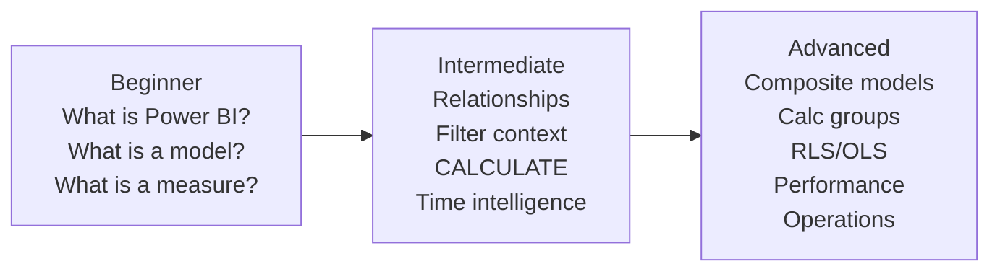
### 🔍 Plain-English deep-dive: the one mental model to keep all the way through
- **Power Query** — *the layer that gets and cleans data before it lands in the model.* **Analogy:** washing, cutting, and sorting ingredients before cooking.
- **Semantic model** — *the tables, relationships, calculations, and business definitions users query.* **Analogy:** the recipe book plus the kitchen rules.
- **DAX measure** — *a formula that answers a business question under the current filters.* **Analogy:** a smart calculator that changes its answer depending on which drawer you opened and what date you asked about.
- **Visual** — *the thing users click.* **Analogy:** the dashboard speedometer on top of the engine.
- **Filter context** — *the current slice of data being asked about.* **Analogy:** “Tell me the answer, but only for Product = SPO, Segment = Enterprise, Month = September.”
> 💡 **Tie-in to your background:** In CE&S support, you already think in slices: product, region, support channel, severity, escalation path, and month. Power BI simply formalizes that habit into dimensions, relationships, and measures.
### The running example used everywhere in this section
We will use a support analytics star schema throughout the file:
- **Fact_Cases** — one row per support case or support interaction grain.
- **Dim_Date** — the calendar/fiscal date table.
- **Dim_Product** — SPO, OneDrive, Teams, Exchange, etc.
- **Dim_Agent** — agent, manager, site, tenure, queue.
- **Dim_Segment** — Enterprise, SMB, EDU, Consumer.
- **Dim_Channel** — Phone, Web, Chat, Email, Escalation.
Common fact columns we will reference:
- `CaseID`
- `CreatedDate`
- `ResolvedDate`
- `ProductKey`
- `AgentKey`
- `SegmentKey`
- `ChannelKey`
- `Severity`
- `ResolutionHours`
- `CSATScore`
- `EscalatedFlag`
- `ReopenCount`
- `CaseCount` (sometimes a derived 1-per-row helper)
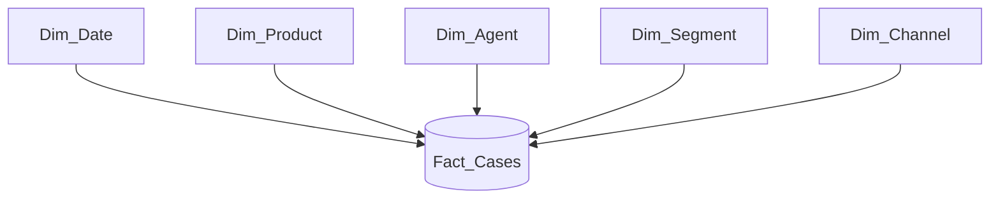
### Roadmap of this Part
| Section | Focus | Why interviewers care |
|---|---|---|
| 1 | Power BI architecture | Shows you know the whole platform, not just the canvas |
| 2–3 | Power Query / M / query folding | Shows you can shape data efficiently before modeling |
| 4–7 | Storage modes, modeling, security | Shows you can build a robust semantic model |
| 8–16 | DAX core to advanced | Shows you understand how answers are calculated |
| 17–19 | Performance, UX, deployment | Shows you can run BI as a product, not a demo |
| 20 | Hands-on labs | Converts theory into “I have done this” proof |
---
## 1. Power BI architecture — the whole ecosystem before the formulas
People often say “Power BI” when they really mean one of several products. Knowing the platform vocabulary makes you sound senior immediately.
### 1.1 Power BI Desktop, Service, Mobile, and Report Server
- **Power BI Desktop** — *the free Windows authoring tool where you connect data, clean it, model it, write DAX, and design reports.*
- **Analogy:** your workshop. - **Why it matters:** nearly all model design work starts here.
- **Power BI Service** — *the cloud portal where reports and semantic models are published, refreshed, shared, secured, and packaged into apps.*
- **Analogy:** the gallery plus the operations center. - **Why it matters:** this is where business users consume and where admins operate.
- **Power BI Mobile** — *the phone/tablet app for consuming dashboards and reports.*
- **Analogy:** the pocket version of the gallery. - **Why it matters:** executives often consume KPI summaries on mobile.
- **Power BI Report Server** — *the on-premises server for Power BI reports and paginated reports when organizations cannot use the cloud for some data or workloads.*
- **Analogy:** running your own private cinema instead of streaming online. - **Why it matters:** useful in regulated or hybrid environments.
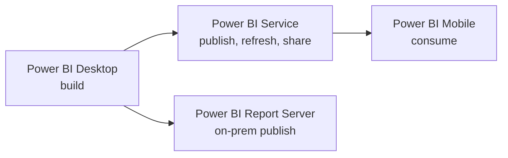
### 1.2 Semantic models, datasets, reports, dashboards, dataflows, datamarts
- **Semantic model** — *the modern name for what many people still call a dataset: tables + relationships + measures + security + metadata.*
- **Analogy:** the “official brain” behind many reports.
- **Dataset** — *older common term for the same core object in the Service.*
- **Interview tip:** say “semantic model (formerly commonly called dataset)” and you sound current.
- **Report** — *a multi-page interactive analytical artifact built on a semantic model.*
- **Analogy:** a book of interactive charts.
- **Dashboard** — *a single-page Service object made by pinning visuals from one or more reports.*
- **Analogy:** a wall of executive scorecards.
- **Dataflow** — *a reusable Power Query-in-the-service object for ingesting and transforming data before it reaches downstream models.*
- **Analogy:** a shared prep kitchen several chefs can reuse.
- **Datamart** — *a self-service departmental analytic store that combines managed storage, SQL access, and a semantic layer.*
- **Analogy:** a small department-specific warehouse with a ready-made serving layer. - **Why it matters:** the idea is more important than the branding: business teams want reusable, governed, self-service data.
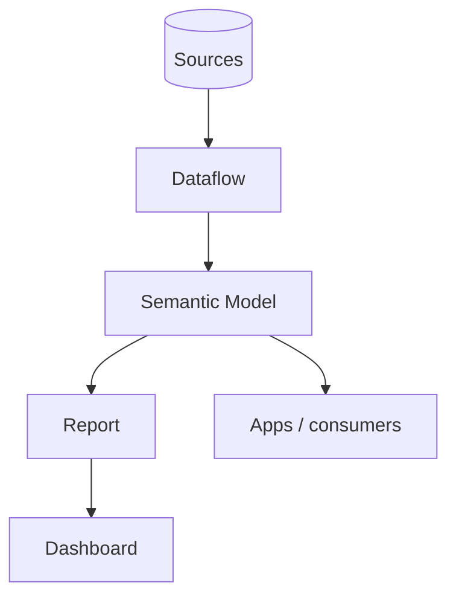
### 1.3 The three layers inside every Power BI solution
This is one of the cleanest ways to explain Power BI in an interview.
1. **Power Query layer** — get, clean, type, and shape data.
2. **Model + DAX layer** — define relationships, business logic, measures, and security.
3. **Report layer** — present the logic in a user-friendly way.
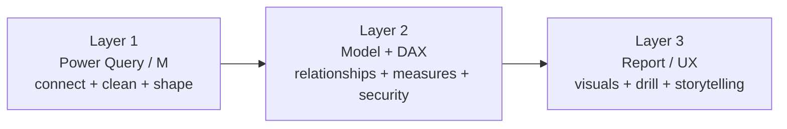
### 🔍 Plain-English deep-dive: why the model layer matters more than most beginners realize
- A weak report on top of a strong model is fixable.
- A beautiful report on top of a broken model is dangerous.
- If the semantic model is wrong,
every visual can be confidently wrong.
- This is why serious BI teams obsess over star schema,
relationships, measures, and governance.
> 💡 **Tie-in to your background:** In support, a clean root-cause document matters more than a pretty email. In BI, a clean semantic model matters more than a pretty chart. Same principle: truth first, presentation second.
### 1.4 Where Fabric fits
- **Microsoft Fabric** — *the broader SaaS analytics platform that includes Power BI plus lakehouse, warehouse, data engineering, pipelines, real-time analytics, and more.*
- **Direct Lake** semantic models are one of the most important Fabric-era Power BI topics.
- For interviews, the easiest phrasing is:
- “Power BI is the serving and semantic layer.” - “Fabric is the end-to-end analytics platform around it.”
### 1.5 Quick architecture comparison table
| Object | Primary purpose | Usually built in | Consumed in |
|---|---|---|---|
| Power Query | Connect + transform data | Desktop or Dataflow | Feeds model |
| Semantic model | Business-ready analytical model | Desktop / Service / Fabric | Reports, Excel, other tools |
| Report | Interactive analysis pages | Desktop / Service | Service, Mobile |
| Dashboard | One-page KPI view | Service | Service, Mobile |
| Dataflow | Reusable ETL/ELT prep | Service / Fabric | Semantic models |
| Datamart | Department analytics store | Service / Fabric | SQL + Power BI |
| Report Server | On-prem hosting | Report Server | Browser / on-prem users |
### 🧪 Hands-on Lab Demo: identify the objects in the UI
**Goal:** make the architecture real in 10 minutes.
1. Open **Power BI Desktop** on Windows.
2. Create a tiny report from any CSV.
3. Save the `.pbix` file.
4. If you have a Power BI Service account, publish it.
5. In the Service, identify:
- the **report**, - the **semantic model**, - the **refresh settings**, - the **lineage view**.
6. If you have mobile access, open the same report in **Power BI Mobile**.
7. Say out loud: “Desktop builds, Service operates, Mobile consumes, Report Server is the on-prem alternative.”
**Success check:** you can explain what each object is without mixing up report vs dashboard vs model.
---
## 2. Power Query and M — the data preparation layer in depth
Before DAX ever runs, the data must be shaped correctly. A lot of “bad DAX” is really “a model that should have been cleaned upstream.”
### 2.1 What Power Query is
- **Power Query** — *the ETL/ELT shaping interface inside Power BI, Excel, Dataflows, and Fabric.*
- **M** — *the language behind Power Query transformations.*
- **Analogy:** Power Query is the kitchen interface; M is the recipe text behind your actions.
- Each UI step becomes an M step.
- Power Query is rowset shaping,
not semantic calculation.
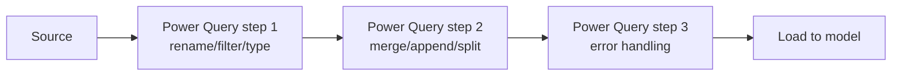
### 2.2 Common connectors you should know
- SQL Server
- Azure SQL Database
- Synapse
- Databricks
- Excel
- CSV / Text
- SharePoint Folder
- SharePoint List
- OneLake / Fabric
- Web / REST API
- OData
- Folder
- Oracle
- Snowflake
### 🔍 Plain-English deep-dive: connector means “how Power BI speaks to the source”
- A **connector** is the adapter that knows how to authenticate,
browse, and read from a source.
- **Analogy:** a plug adapter for different power sockets around the world.
- Why it matters:
some connectors support query folding better than others, some support DirectQuery, and some are file-import only.
### 2.3 Common transformations every analyst should recognize instantly
- Remove columns
- Filter rows
- Sort rows
- Rename columns
- Split column by delimiter
- Merge columns
- Replace values
- Fill down / fill up
- Pivot
- Unpivot
- Group by
- Change data type
- Add custom column
- Remove duplicates
- Trim and clean text
- Parse dates
- Expand nested records/tables from JSON or APIs
| Transformation | Plain meaning | Support-data example |
|---|---|---|
| Filter rows | Keep only what you need | Remove test cases |
| Rename columns | Make names readable and stable | `prd_nm` → `ProductName` |
| Change type | Tell Power BI what kind of data this is | `ResolutionHours` as decimal |
| Group by | Aggregate rows | Daily case counts by product |
| Pivot | Turn values into columns | Severity values into columns |
| Unpivot | Turn columns into rows | Wide monthly survey columns into tidy rows |
| Merge | Join tables side by side | Bring agent attributes into cases staging |
| Append | Stack rows vertically | Combine monthly exports |
### 2.4 Data types in Power Query — more important than beginners think
- **Whole Number** — integer values like case counts.
- **Decimal Number** — fractional values like resolution hours.
- **Fixed Decimal Number** — currency-style exact numeric type.
- **Text** — strings like product names.
- **Date** — calendar dates.
- **Date/Time** — date plus time.
- **True/False** — logical values.
- **Binary** — files or raw binary objects.
### 🔍 Plain-English deep-dive: why data types matter
- Types affect storage.
- Types affect joins.
- Types affect sorting.
- Types affect DAX behavior.
- Types affect query folding.
- **Analogy:** if you mislabel a spice jar as sugar, every recipe after that goes wrong.
Common mistakes:
- Dates stored as text,
- numeric IDs accidentally loaded as decimals,
- Boolean flags stored as “Y/N” text,
- times stored inconsistently.
### 2.5 M syntax basics without making it scary
You do not need to become an M language purist, but you should understand what you are seeing.
```m
let
    Source = Csv.Document(File.Contents("C:\Data\cases.csv"), [Delimiter=",", Columns=10, Encoding=65001, QuoteStyle=QuoteStyle.Csv]),
    PromoteHeaders = Table.PromoteHeaders(Source, [PromoteAllScalars=true]),
    ChangedTypes = Table.TransformColumnTypes(PromoteHeaders, {
        {"CaseID", Int64.Type},
        {"CreatedDate", type date},
        {"ResolvedDate", type date},
        {"ResolutionHours", type number},
        {"CSATScore", Int64.Type}
    }),
    FilteredRows = Table.SelectRows(ChangedTypes, each [IsTestCase] <> true)
in
    FilteredRows
```
What to notice:
- `let ... in` means “define steps, then return the last thing.”
- Each step has a name.
- Later steps reference earlier steps.
- Most transformations are table functions.
### 2.6 Parameters and functions in Power Query
- **Parameter** — *a reusable input value like environment, date range, file path, or API base URL.*
- **Analogy:** a setting knob.
- **Function** — *a reusable M recipe you can call with different inputs.*
- **Analogy:** a mini-machine you can feed different files or pages.
Use cases:
- switch between Dev and Prod server names,
- loop through paginated API results,
- process many similarly structured files,
- build reusable date filters.
```m
(FilePath as text) as table =>
let
    Source = Csv.Document(File.Contents(FilePath), [Delimiter=",", Encoding=65001]),
    PromoteHeaders = Table.PromoteHeaders(Source, [PromoteAllScalars=true])
in
    PromoteHeaders
```
### 2.7 Merge vs append
This is a very common interview check.
- **Merge** — *join tables horizontally using a key.*
- **Analogy:** stapling two forms together because they refer to the same case.
- **Append** — *stack tables vertically because they have the same columns.*
- **Analogy:** putting January’s case rows on top of February’s case rows in one pile.
| Operation | Direction | Use when | Support example |
|---|---|---|---|
| Merge | Side-by-side | Tables describe the same entities through keys | Add segment lookup to staged cases |
| Append | Top-to-bottom | Tables have same shape and you want one longer table | Combine monthly case exports |
### 2.8 Error handling in Power Query
Real data is messy. Professional analysts expect that.
Common patterns:
- Replace errors
- Keep errors for investigation
- Remove rows with errors when appropriate
- Use `try ... otherwise`
- Validate types before load
```m
let
    AddedSafeCSAT = Table.AddColumn(Source, "SafeCSAT", each try Number.From([CSATScore]) otherwise null)
in
    AddedSafeCSAT
```
### 🔍 Plain-English deep-dive: where error handling belongs
- If the issue is a raw data quality issue,
fix or trap it in Power Query.
- If the issue is a semantic analytical choice,
handle it in DAX.
- **Example:** “the API returns malformed dates sometimes” is a Power Query problem.
- **Example:** “divide by zero when no cases exist in the selected slice” is a DAX problem.
> 💡 **Tie-in to your background:** You already triage messy incident data, odd timestamps, partial fields, and inconsistent statuses. Power Query is basically your escalation hygiene written into repeatable steps.
### 2.9 Recommended Power Query habits
- Rename steps meaningfully.
- Remove unused columns early.
- Set data types explicitly.
- Filter test/noise rows early when safe.
- Avoid doing fact-to-dimension denormalization if the star schema should remain separate.
- Prefer source-side transformations if query folding supports them.
- Keep business calculations in the model layer unless there is a strong reason not to.
### 🧪 Hands-on Lab Demo: clean support data in Power Query
**Goal:** prepare `Fact_Cases` so the model starts clean.
1. Open **Power BI Desktop**.
2. Import a CSV or Excel extract with case data.
3. Click **Transform data**.
4. In Power Query:
- remove columns you will never use, - rename columns to readable names, - set types for dates, numbers, and flags, - filter out test cases, - split a combined `Product - Channel` field if one exists, - replace obvious bad values with null, - trim extra spaces from text columns.
5. Duplicate the query only if you truly need a staging copy.
6. Close & Apply.
7. Say out loud: “I used Power Query for cleaning and typing; I will use the model for business logic.”
**Success check:** the model receives clean, typed, analysis-ready tables.
---
## 3. Query folding — what it is, why it matters, how to check it
If you only memorize one advanced Power Query concept, make it **query folding**.
### 3.1 What query folding means
- **Query folding** — *Power Query pushes transformations back to the source system so the source does the work instead of Power BI doing it locally.*
- **Analogy:** instead of carrying the whole grocery store home and then sorting it on your kitchen floor, you ask the store to pre-pack only what you need.
- **Why it matters:** less data movement, faster refresh, lower memory usage, better scalability.
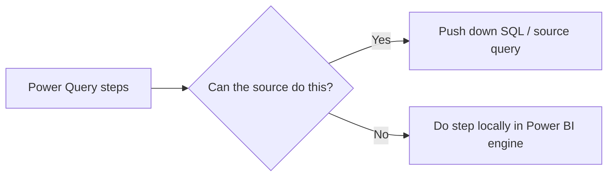
### 3.2 Folding examples
These often fold well against relational sources:
- filtering rows,
- selecting columns,
- renaming columns,
- basic joins,
- grouping,
- simple calculated columns,
- sorting.
These often break folding:
- custom row-by-row logic the source cannot translate,
- some complex text functions,
- buffering,
- certain list operations,
- mixing incompatible sources,
- late steps after a non-foldable step.
### 3.3 Why interviewers care so much about folding
Because poor folding is one of the easiest ways to make refreshes painfully slow.
If your source has 100 million support rows and you only need the last 18 months, you want the source database to filter that, not Power BI after importing everything.
### 3.4 How to check query folding
In Power Query, a common quick check is:
- right-click a step,
- choose **View Native Query**,
- if it is available,
folding likely exists up to that step.
Also useful:
- Query Diagnostics,
- Performance Analyzer for downstream effects,
- source-side monitoring,
- knowledge of connector capabilities.
### 🔍 Plain-English deep-dive: folding is step-order-sensitive
- If step 2 folds,
and step 3 breaks folding, then step 4 may also not fold, even if step 4 by itself is simple.
- **Analogy:** once you leave the highway and enter a tiny village road,
you are no longer getting highway speed.
- Interview-safe rule:
**do foldable filters and column pruning as early as possible.**
### 3.5 Query folding best-practice table
| Practice | Why it helps |
|---|---|
| Filter early | Reduces rows before data travels |
| Remove unused columns early | Reduces payload |
| Prefer native source transforms when practical | Lets the source engine do the heavy lifting |
| Avoid unnecessary custom M early | Preserves foldability |
| Check “View Native Query” after major steps | Confirms whether pushdown still exists |
| Use incremental refresh for large historical fact tables | Avoids full reloads |
### 3.6 A support-data example
Suppose `Fact_Cases` is in Azure SQL. You only need:
- cases from the last 730 days,
- selected columns,
- non-test rows.
A fold-friendly pattern is:
1. connect to the table,
2. filter rows by date and test flag,
3. remove unused columns,
4. maybe join to a small lookup if still foldable.
A fold-unfriendly pattern is:
1. import everything,
2. add a complex custom step,
3. then filter,
4. then remove columns.
### 3.7 Native SQL vs Power Query transformations
Sometimes you can write native SQL or use a view in the source. That can be great, but use it thoughtfully.
| Approach | Pros | Cons |
|---|---|---|
| Source view / native SQL | Strong pushdown, centralized logic | Less self-service transparency, may depend on DB team |
| Power Query UI/M | Easy to audit in BI layer, more self-service | Can accidentally break folding |
### 🧪 Hands-on Lab Demo: observe query folding
**Goal:** see folding instead of just hearing about it.
1. Connect Power BI Desktop to a relational source if available.
2. In Power Query, select the cases table.
3. Add a simple date filter.
4. Right-click the step and choose **View Native Query**.
5. Now add a custom transformation that may not translate.
6. Right-click the latest step again.
7. Observe whether native query disappears.
8. Reorder steps so the heavy filters happen earlier.
**Success check:** you can explain folding as “push work to the source for speed and scale.”
---
## 4. Storage modes — Import, DirectQuery, Dual, Direct Lake, and composite models
Storage mode determines where the data lives at query time and how Power BI gets answers. This is architecture, performance, and user experience all at once.
### 4.1 Import mode
- **Import** — *Power BI loads a compressed copy of the data into the VertiPaq in-memory columnar engine.*
- **Analogy:** bringing the important books into your office so you can answer questions instantly without walking to the library every time.
- **Pros:** fastest queries, rich DAX support, strong interactivity.
- **Cons:** data freshness depends on refresh schedule; model size limits matter.
### 4.2 DirectQuery mode
- **DirectQuery** — *Power BI leaves data in the source and sends queries live when users interact.*
- **Analogy:** calling the library for every question instead of keeping books at your desk.
- **Pros:** near-live data, avoids full import of huge tables.
- **Cons:** slower, source-dependent, more restrictions, every click can burden the source.
### 4.3 Dual mode
- **Dual** — *for some dimension tables in composite models, Power BI can behave as import or DirectQuery depending on the query path.*
- **Analogy:** keeping a small cheat sheet on your desk while still consulting the library for giant details.
- **Why it matters:** Dual dimensions can improve performance when combining imported and DirectQuery tables.
### 4.4 Direct Lake
- **Direct Lake** — *Fabric-era mode where semantic models read Delta/OneLake data directly without traditional import refresh and without classic DirectQuery-style live source round trips.*
- **Analogy:** your books stay in the building’s master archive,
but your office has a super-fast direct aisle into that archive.
- **Why it matters:** near import-like speed with fresher data for Fabric workloads.
### 4.5 Composite models
- **Composite model** — *a model that mixes storage behaviors, such as import + DirectQuery, or connects to existing semantic models plus local tables.*
- **Analogy:** part of your answer comes from a notebook on your desk, part from a live phone call, but the user sees one result.
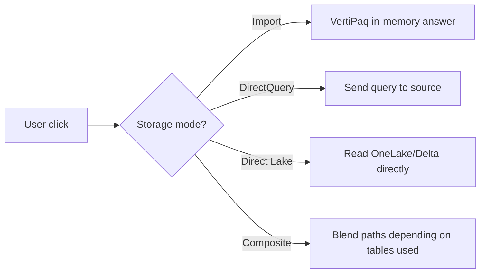
### 4.6 Aggregations
- **Aggregation table** — *a smaller summarized import table used to answer high-level queries quickly while detail stays elsewhere, often DirectQuery.*
- **Analogy:** keeping monthly summaries in your pocket notebook while detailed daily logs remain in the archive.
- **Why it matters:** this is a key performance pattern for large models.
### 4.7 Storage mode trade-offs table
| Mode | Where data is queried from | Speed | Freshness | DAX flexibility | Best for |
|---|---|---|---|---|---|
| Import | Power BI memory | Fastest | Scheduled refresh | Highest | Most enterprise BI reports |
| DirectQuery | Source system live | Often slower | Very fresh | More limits | Operational / near-real-time scenarios |
| Dual | Mixed behavior for dimensions | Good when designed well | Mixed | Good | Composite models with imported facts or DQ facts |
| Direct Lake | OneLake Delta data | Very fast | Fresh/near-real-time in Fabric flow | Strong | Fabric-centric analytics |
| Composite | Mixed | Depends | Mixed | Depends | Large or federated architectures |
### 🔍 Plain-English deep-dive: why Import is still the default recommendation so often
- Import is fast.
- Import is predictable.
- Import supports rich DAX.
- Import isolates report performance from source system spikes.
- Many business dashboards do not truly need second-by-second freshness.
- **Interview-safe line:** “If the business can tolerate scheduled refresh, Import is usually my first choice for performance and simplicity.”
### 4.8 When DirectQuery is justified
Good reasons:
- data is too large to import conveniently,
- strict freshness requirements,
- governance requires source-resident data,
- centralized source compute is preferred,
- hybrid scenarios with aggregations.
Bad reasons:
- “We thought live sounded modern.”
- “We did not want to think about refresh.”
### 4.9 Composite model example for support analytics
Imagine:
- last 3 years of daily case details in DirectQuery,
- monthly aggregated case metrics imported,
- small dimensions in Dual.
Then:
- executive summary pages hit import aggregations,
- drill-to-detail pages hit DirectQuery only when needed.
That is a mature design pattern.
### 4.10 Interview-ready decision framework
| Question | Pushes you toward |
|---|---|
| Users need sub-second dashboard interactions | Import / Direct Lake |
| Users need near-live operational detail | DirectQuery / Direct Lake |
| Source cannot handle many live queries | Import |
| Data volume is enormous | Composite / DirectQuery / Direct Lake |
| Fabric + OneLake already exists | Direct Lake |
| Mixed detailed and summary workloads | Composite + aggregations |
---
## 5. Modeling deep — relationships, cardinality, filter direction, active/inactive links
A Power BI model is a graph of tables. If the graph is wrong, DAX becomes confusing and sometimes impossible.
### 5.1 Relationship basics
- **Relationship** — *a link between tables on matching keys so filters can flow from one table to another.*
- **Cardinality** — *how many rows on one side can match rows on the other side.*
- **Cross-filter direction** — *which way filters travel.*
- **Active relationship** — *the default path used automatically.*
- **Inactive relationship** — *a stored but dormant path you can activate in DAX.*
### 5.2 Cardinality types
- **1:1** — one row matches one row.
- Rare in dimensional models.
- **1:* (one-to-many)** — one dimension row matches many fact rows.
- This is the standard star-schema pattern.
- ***:* (many-to-many)** — many rows match many rows.
- Use cautiously; it can introduce ambiguity and harder-to-reason-about filtering.
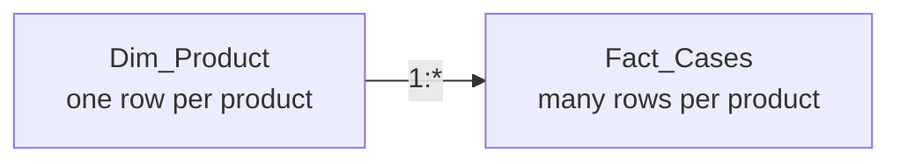
### 5.3 Single-direction vs bi-directional filtering
- **Single direction** — *usually dimension filters fact.*
- Recommended default.
- **Bi-directional** — *filter can flow both ways.*
- Powerful, but can create ambiguous paths, unexpected totals, and performance issues.
### 🔍 Plain-English deep-dive: why single-direction filters are the default best practice
- In a star schema,
dimensions answer “which slice?”
- Facts answer “how much?”
- If dimensions filter facts in one direction,
every question is clean.
- If filters fly around in both directions everywhere,
the model can start “arguing with itself” about which path to use.
- **Analogy:** one clear road sign is better than a maze of detours.
### 5.4 Active and inactive relationships with a date dimension
Support data often has multiple dates:
- CreatedDate
- ResolvedDate
- ClosedDate
- SurveyDate
Only one relationship to `Dim_Date` can be active at a time by default. That is where **inactive relationships** and `USERELATIONSHIP` matter.
```mermaid
flowchart TD
    Date[Dim_Date] -->|Active| Created[Fact_Cases[CreatedDate]]
    Date -.->|Inactive| Resolved[Fact_Cases[ResolvedDate]]
```
### 5.5 Role-playing dimensions
- **Role-playing dimension** — *the same physical dimension reused for different roles, such as Date as Created Date vs Resolved Date.*
- **Analogy:** one person wearing different job badges in different meetings.
- In Power BI,
you can handle this by: - multiple relationships to one dimension, - or duplicated date dimensions in some scenarios, - or DAX using `USERELATIONSHIP`.
### 5.6 Many-to-many relationships — use carefully
They are sometimes necessary, but beginners overuse them.
Common reasons:
- bridge tables for multi-select associations,
- security tables,
- tag mapping,
- degenerate or poorly modeled upstream data.
Common risks:
- ambiguous totals,
- duplicate counting,
- harder debugging,
- slower queries.
### 5.7 Why star schema is required, not optional
For analytical Power BI models, star schema is not just “nice.” It is the expected design.
Benefits:
- clearer filter paths,
- simpler DAX,
- better compression,
- better usability,
- easier governance,
- easier security.

### 5.8 Flat table vs star schema comparison
| Design | Pros | Cons |
|---|---|---|
| Flat single table | Quick to prototype | Repeated text, poor compression, messy DAX, harder reuse |
| Star schema | Clean semantics, better performance, easier slicing | Requires up-front modeling discipline |
### 5.9 Relationship troubleshooting checklist
If a visual is wrong, check these in order:
1. Is the relationship present?
2. Is the key unique on the dimension side?
3. Are data types identical?
4. Is the relationship active?
5. Is filter direction appropriate?
6. Are there duplicate dimension keys?
7. Is a many-to-many pattern causing duplication?
> 💡 **Tie-in to your background:** Relationship debugging feels a lot like support escalation triage: confirm the path, isolate the failing link, and test assumptions one by one instead of guessing.
---
## 6. Advanced modeling objects — calculated tables, hierarchies, field parameters, calculation groups
Beyond basic relationships, Power BI has advanced modeling objects that make semantic models more powerful and flexible.
### 6.1 Calculated tables
- **Calculated table** — *a table created with DAX and stored in the model at refresh time.*
- **Analogy:** a derived worksheet you generate during build rather than importing from a source.
- Good uses:
- creating a date table, - small helper or disconnected tables, - parameter-like structures, - controlled summary or mapping tables.
- Bad uses:
- recreating large source transformations that belong upstream.
```dax
Dim_Date =
ADDCOLUMNS(
    CALENDAR(DATE(2023, 7, 1), DATE(2027, 6, 30)),
    "Year", YEAR([Date]),
    "Month No", MONTH([Date]),
    "Month Name", FORMAT([Date], "MMMM"),
    "Fiscal Year", "FY" & FORMAT(YEAR(EDATE([Date], 6)), "0000"),
    "Fiscal Month No", MOD(MONTH([Date]) + 5, 12) + 1,
    "Fiscal Quarter", "FQ" & ROUNDUP((MOD(MONTH([Date]) + 5, 12) + 1) / 3, 0)
)
```
### 6.2 Hierarchies
- **Hierarchy** — *an ordered set of levels users drill through, like Year → Quarter → Month → Date.*
- **Analogy:** folders inside folders.
- Common hierarchies in support analytics:
- Fiscal Year → Fiscal Quarter → Fiscal Month, - Product Family → Product, - Manager → Agent.
### 6.3 Field parameters
- **Field parameters** — *Power BI-generated tables that let users dynamically switch dimensions or measures in visuals.*
- **Analogy:** a remote control that changes what the chart is grouped by or which KPI it shows.
- Why it matters:
fewer duplicate visuals, more flexible self-service, better executive interaction.
Example uses:
- switch chart axis between Product, Segment, Channel, Agent,
- switch metric between Cases, CSAT, Breach Rate, Reopen Rate.
### 6.4 Calculation groups
- **Calculation group** — *a Tabular-model feature that lets you define reusable calculation logic like YTD, YoY, or currency conversion once and apply it across measures.*
- **Analogy:** a stencil you can lay over many different measures instead of rewriting the same logic each time.
- In many Power BI environments,
calculation groups are authored with **Tabular Editor** rather than pure Desktop UI.
- Why advanced teams love them:
- reduce measure sprawl, - standardize time intelligence, - simplify maintenance.
### 🔍 Plain-English deep-dive: field parameters vs calculation groups
- **Field parameters** change **which field or measure the visual is using**.
- **Calculation groups** change **how a selected measure is calculated or presented**.
- **Analogy:** field parameters change the song; calculation groups change the audio effect.
### 6.5 Example: a time-intelligence calculation group conceptually
A calculation group might contain items like:
- Current
- YTD
- Prior Year
- YoY %
- Rolling 3 Months
Then one base measure like `[Total Cases]` can automatically be transformed by those items instead of you creating five separate measures by hand for every KPI.
### 6.6 Naming and organization habits
Use display folders and naming conventions:
- `01 Base Measures`
- `02 Time Intelligence`
- `03 Ratios`
- `04 Rankings`
- `05 Dynamic Titles`
Good names:
- `Total Cases`
- `Avg CSAT`
- `Breach Rate %`
- `Cases YoY %`
Avoid:
- `Measure1`
- `Temp`
- `New Measure (2)`
### 6.7 Hidden columns and model cleanliness
Professional models:
- hide surrogate keys,
- hide technical columns not meant for report users,
- expose only friendly business fields,
- keep measure formatting consistent,
- organize folders so users see a curated semantic layer.
---
## 7. Security in the model — RLS and OLS
Security is part of modeling, not an afterthought.
### 7.1 Row-Level Security (RLS)
- **RLS** — *security that filters rows so each user sees only the records they are allowed to see.*
- **Analogy:** the same filing cabinet,
but each person’s key only opens the drawers for their region or team.
- Support examples:
- an agent sees only their own cases, - a manager sees their team, - a regional lead sees only EMEA cases, - a segment owner sees only Enterprise.
### 7.2 Static vs dynamic RLS
- **Static RLS** — fixed filter expressions defined per role.
- **Dynamic RLS** — filters depend on the signed-in user,
often through a mapping table and functions like `USERPRINCIPALNAME()`.
```dax
-- Example role filter on Dim_Agent
Dim_Agent[AgentEmail] = USERPRINCIPALNAME()
```
### 7.3 Object-Level Security (OLS)
- **OLS** — *security that hides entire tables or columns from certain users.*
- **Analogy:** not only locking a drawer,
but making the drawer invisible.
- Why it matters:
some users may be allowed to see case counts but not detailed customer-identifying fields or sensitive compensation-related columns.
### 7.4 RLS caveats interviewers like to hear
- Test with **View as**.
- RLS affects query results,
so measures must still behave correctly under restricted data.
- Avoid overly complex security logic if a simpler dimension-driven pattern exists.
- Document role definitions clearly.
- Be careful with bi-directional security filtering unless truly required.
### 7.5 Security example pattern for CE&S reporting
| Role | Allowed slice |
|---|---|
| Agent | Cases where AgentEmail = signed-in user |
| Manager | Cases for agents in their hierarchy |
| Regional Lead | Cases in assigned region/segment |
| Exec | Full aggregate access |
> 💡 **Tie-in to your background:** You already understand permission scoping, escalation visibility, and least-privilege access from Microsoft support systems. RLS is that same principle in the analytics layer.
### 🧪 Hands-on Lab Demo: create and test basic RLS
1. Build a small `Dim_Agent` table with `AgentEmail` and `ManagerEmail`.
2. Relate it to `Fact_Cases` by `AgentKey`.
3. In **Modeling → Manage roles**, create role `AgentSelf`.
4. Add filter:
```dax
Dim_Agent[AgentEmail] = USERPRINCIPALNAME()
```
5. Use **View as** to test the role.
6. Publish to Service if available and assign a test user.
7. Verify that totals change correctly,
not just detail rows.
**Success check:** the same report shows different row sets to different users without separate copies.
---
## 8. DAX fundamentals — what DAX is and the core building blocks
DAX stands for **Data Analysis Expressions**. It is the formula language for Power BI, Analysis Services, and semantic models in Fabric.
### 8.1 The three big DAX object types
- **Calculated column** — row-by-row formula stored in a table.
- **Measure** — dynamic formula evaluated at query time under current filter context.
- **Calculated table** — table built at refresh time with DAX.
### 8.2 Calculated column vs measure vs calculated table
| Object | Evaluated when | Stored? | Best for | Typical example |
|---|---|---|---|---|
| Calculated column | Refresh time, row by row | Yes | attributes, bucketing, row-level flags | `IsBreachFlag` |
| Measure | Query time | No | aggregations, ratios, dynamic logic | `Breach Rate %` |
| Calculated table | Refresh time | Yes | helper tables, date tables, parameter tables | `Dim_Date` |
### 🔍 Plain-English deep-dive: why “prefer measures” is such a common best practice
- Measures do not bloat storage the way calculated columns can.
- Measures respond to slicers and visual context.
- Measures better represent business questions.
- Calculated columns are appropriate when the answer must exist per row,
regardless of visual context.
- **Analogy:** a measure is like asking a smart assistant a fresh question; a calculated column is like handwriting a note onto every record in advance.
### 8.3 DAX data types
- Whole number
- Decimal number
- Currency / fixed decimal
- Date/Time
- True/False
- Text
- Blank
### 8.4 DAX syntax essentials
- Tables and columns use `Table[Column]`.
- Measures are referenced like `[Measure Name]`.
- Strings are in quotes.
- Functions use parentheses.
- Comments can be `-- single line`.
```dax
Total Cases = COUNTROWS(Fact_Cases)
Avg CSAT = AVERAGE(Fact_Cases[CSATScore])
High Severity Cases =
CALCULATE(
    [Total Cases],
    Fact_Cases[Severity] = "High"
)
```
### 8.5 Operators you should know
- Arithmetic: `+`, `-`, `*`, `/`, `^`
- Comparison: `=`, `<>`, `>`, `<`, `>=`, `<=`
- Logical: `&&`, `||`, `NOT`
- Concatenation: `&`
### 8.6 Basic aggregation functions
- `SUM`
- `AVERAGE`
- `MIN`
- `MAX`
- `COUNT`
- `COUNTROWS`
- `DISTINCTCOUNT`
```dax
Total Resolution Hours = SUM(Fact_Cases[ResolutionHours])
Distinct Agents = DISTINCTCOUNT(Fact_Cases[AgentKey])
```
### 8.7 Safe math patterns
Use `DIVIDE` instead of `/` for ratios.
```dax
Breach Rate % =
DIVIDE(
    CALCULATE([Total Cases], Fact_Cases[EscalatedFlag] = 1),
    [Total Cases]
)
```
Why?
- cleaner visuals,
- no ugly divide-by-zero errors,
- optional alternate result if denominator is zero.
### 8.8 Formatting basics
- percentages should be formatted as percentage,
- averages as decimals where needed,
- counts as whole numbers,
- durations appropriately,
- avoid using `FORMAT()` unless you truly need text output because it converts numbers to text and can hurt usability/performance.
---
## 9. Evaluation contexts — row context, filter context, context transition
This is the crux of DAX. If you truly understand these three ideas, most “hard DAX” becomes understandable instead of magical.
### 9.1 Filter context
- **Filter context** — *the set of filters applied when a measure is evaluated.*
- Sources of filter context:
- slicers, - page filters, - report filters, - visual axes/rows/columns, - cross-highlighting/cross-filtering, - DAX itself via `CALCULATE`.
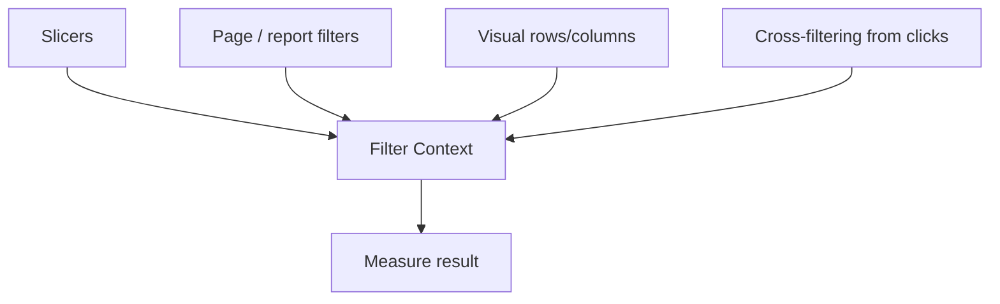
### 9.2 Row context
- **Row context** — *the concept of “current row” during row-by-row evaluation.*
- Created by:
- calculated columns, - iterators like `SUMX`, - some row-wise table operations.
- **Analogy:** a flashlight moving one record at a time.
### 9.3 Context transition
- **Context transition** — *when row context is turned into filter context, typically by CALCULATE.*
- This is the subtle step that confuses many learners.
- **Analogy:** the flashlight on one row becomes a formal query filter for the rest of the calculation.
### 🔍 Plain-English deep-dive: the easiest way to remember the three contexts
- **Row context** = “which row am I on?”
- **Filter context** = “which slice of the table is currently allowed?”
- **Context transition** = “take the current row and use it as a filter.”
### 9.4 How visuals create filter context automatically
Suppose you place:
- `Dim_Product[ProductName]` on rows,
- `Dim_Date[FiscalMonth]` on columns,
- `[Total Cases]` as values.
Each cell now asks a question like:
- “How many cases for Product = SPO and FiscalMonth = FY2026-M03?”
- “How many cases for Product = OneDrive and FiscalMonth = FY2026-M03?”
You did not write those filters. The visual created them.
### 9.5 Example: measure in filter context
```dax
Total Cases = COUNTROWS(Fact_Cases)
```
If a slicer sets `Dim_Product[ProductName] = "SPO"`, then `[Total Cases]` automatically means “count rows only for SPO.”
### 9.6 Example: calculated column in row context
```dax
Breach Bucket =
IF(
    Fact_Cases[ResolutionHours] > 24,
    "Breach",
    "Within SLA"
)
```
This formula works row by row, without needing a visual.
### 9.7 Example: context transition in action
```dax
-- In a calculated column, this can trigger context transition
Product Case Count =
CALCULATE([Total Cases])
```
Because `CALCULATE` appears in a row context, DAX can transition that current row context into filter context. This is why `CALCULATE` is so central.
### 9.8 Visual explanation with support schema

### 9.9 Common beginner confusion table
| Situation | Main context involved | What to remember |
|---|---|---|
| Calculated column | Row context | One row at a time |
| Measure in a visual | Filter context | Current slice of data |
| Iterator like `SUMX` | Row context inside iteration + possible measure evaluation | Each iterated row can trigger measure logic |
| `CALCULATE` in row context | Context transition | Current row becomes filter |
### 9.10 A support example that makes context intuitive
If your matrix shows:
- rows = Product,
- columns = Channel,
- measure = Avg CSAT,
then each cell asks:
“Average CSAT for this Product × this Channel under the page filters already applied.”
That sentence is filter context.
> 💡 **Tie-in to your background:** In support reviews, you naturally say “show me CSAT for OneDrive, chat channel, enterprise, this month.” That whole sentence is exactly what filter context formalizes.
---
## 10. CALCULATE deep dive — adding, overriding, and removing filters
`CALCULATE` is the most important DAX function. If you are asked one DAX function in an interview, this is the likeliest one.
### 10.1 What CALCULATE does
- Evaluates an expression,
- in a modified filter context.
That is the whole idea. But it leads to enormous power.
```dax
High Severity Cases =
CALCULATE(
    [Total Cases],
    Fact_Cases[Severity] = "High"
)
```
### 10.2 Add a filter
If the existing filter context does not mention severity, this adds a High-only filter.
### 10.3 Override a filter
If the user selected `Severity = Low`, this measure can still force `Severity = High`. That is filter override behavior.
### 10.4 Remove a filter
```dax
Cases All Products =
CALCULATE(
    [Total Cases],
    ALL(Dim_Product)
)
```
Now product filters are removed, so you can compare current product against the grand total.
### 10.5 Common CALCULATE modifiers
- `ALL`
- `ALLEXCEPT`
- `ALLSELECTED`
- `REMOVEFILTERS`
- `KEEPFILTERS`
- `USERELATIONSHIP`
- `CROSSFILTER`
### 10.6 Boolean filters vs table filters
Boolean filter argument:
```dax
CALCULATE([Total Cases], Fact_Cases[Severity] = "High")
```
Table filter argument:
```dax
CALCULATE(
    [Total Cases],
    FILTER(Fact_Cases, Fact_Cases[ResolutionHours] > 24)
)
```
Use boolean filters when possible for readability and efficiency. Use `FILTER` when the logic is more complex.
### 10.7 KEEPFILTERS behavior
Normally, `CALCULATE` can override a filter on the same column. `KEEPFILTERS` tells DAX to intersect instead of replace.
```dax
High Severity Within Existing Selection =
CALCULATE(
    [Total Cases],
    KEEPFILTERS(Fact_Cases[Severity] = "High")
)
```
### 10.8 REMOVEFILTERS vs ALL
Both are used to remove filters. Many teams prefer `REMOVEFILTERS` when the intent is specifically filter removal because it reads more explicitly.
```dax
Pct of Product Total =
DIVIDE(
    [Total Cases],
    CALCULATE([Total Cases], REMOVEFILTERS(Dim_Channel))
)
```
### 10.9 CALCULATETABLE
- **CALCULATETABLE** — *same idea as CALCULATE, but returns a table instead of a scalar value.*
- Useful for advanced table expressions,
debugging, and helper logic.
```dax
HighSeverityTable =
CALCULATETABLE(
    Fact_Cases,
    Fact_Cases[Severity] = "High"
)
```
### 10.10 Advanced support examples
```dax
Cases Resolved In FY =
CALCULATE(
    [Total Cases],
    USERELATIONSHIP(Fact_Cases[ResolvedDate], Dim_Date[Date])
)
Cases Not Chat =
CALCULATE(
    [Total Cases],
    Dim_Channel[ChannelName] <> "Chat"
)
Enterprise Cases Excluding Phone =
CALCULATE(
    [Total Cases],
    Dim_Segment[SegmentName] = "Enterprise",
    Dim_Channel[ChannelName] <> "Phone"
)
```
### 🔍 Plain-English deep-dive: the easiest sentence for CALCULATE
Say this out loud:
**“CALCULATE asks DAX to re-evaluate an expression as if the current filters were different.”**
That sentence is simple, correct, and interview-ready.
---
## 11. Filter functions — FILTER, ALL, ALLEXCEPT, ALLSELECTED, REMOVEFILTERS, KEEPFILTERS, VALUES, DISTINCT, SELECTEDVALUE, HASONEVALUE
These functions are the vocabulary of filter manipulation.
### 11.1 FILTER
- Returns a filtered table.
- Common inside `CALCULATE`, `SUMX`, and table expressions.
```dax
Cases Over 48 Hours =
CALCULATE(
    [Total Cases],
    FILTER(Fact_Cases, Fact_Cases[ResolutionHours] > 48)
)
```
### 11.2 ALL
- Removes filters from a table or column.
- Often used for grand totals or percent-of-total calculations.
```dax
Pct of All Products =
DIVIDE(
    [Total Cases],
    CALCULATE([Total Cases], ALL(Dim_Product))
)
```
### 11.3 ALLEXCEPT
- Removes all filters from a table except specified columns.
```dax
Cases Within Product Across All Channels =
CALCULATE(
    [Total Cases],
    ALLEXCEPT(Dim_Product, Dim_Product[ProductName])
)
```
### 11.4 ALLSELECTED
- Keeps outer selections made by the user,
but ignores more granular visual-level context in certain scenarios.
- Useful for “visual total” style calculations.
```dax
Pct of Selected Total =
DIVIDE(
    [Total Cases],
    CALCULATE([Total Cases], ALLSELECTED(Dim_Product[ProductName]))
)
```
### 11.5 REMOVEFILTERS
- Explicitly clears filters.
- Very readable in modern DAX.
```dax
Cases Ignoring Segment =
CALCULATE(
    [Total Cases],
    REMOVEFILTERS(Dim_Segment)
)
```
### 11.6 KEEPFILTERS
- Intersects a new filter with the existing one instead of replacing it.
```dax
High Severity In Current Selection =
CALCULATE(
    [Total Cases],
    KEEPFILTERS(Fact_Cases[Severity] = "High")
)
```
### 11.7 VALUES
- Returns the distinct values currently visible in a column,
including blank if present.
- Useful for dynamic logic and iterating current selections.
```dax
Visible Products Count = COUNTROWS(VALUES(Dim_Product[ProductName]))
```
### 11.8 DISTINCT
- Similar to `VALUES`,
but with slightly different blank behavior in some cases.
- Often used when you simply want unique values from a column expression.
```dax
Distinct Products = COUNTROWS(DISTINCT(Dim_Product[ProductName]))
```
### 11.9 SELECTEDVALUE
- Returns the single selected value if there is one,
otherwise returns blank or an alternate result.
- Great for dynamic titles and single-selection logic.
```dax
Selected Product = SELECTEDVALUE(Dim_Product[ProductName], "All Products")
```
### 11.10 HASONEVALUE
- Returns true if the context contains exactly one distinct value.
- Often used before logic that assumes a single choice.
```dax
Product Title =
IF(
    HASONEVALUE(Dim_Product[ProductName]),
    "Product: " & SELECTEDVALUE(Dim_Product[ProductName]),
    "Multiple Products"
)
```
### 11.11 Comparison table
| Function | Main use | Good mental model |
|---|---|---|
| FILTER | Build a filtered table | “Take this table and keep only rows meeting this rule” |
| ALL | Remove filters | “Ignore this slicing” |
| ALLEXCEPT | Keep only selected grouping columns | “Ignore everything except these anchors” |
| ALLSELECTED | Respect higher-level user selections | “Total within what the user selected” |
| REMOVEFILTERS | Explicit filter clearing | “Clear these filters” |
| KEEPFILTERS | Intersect instead of replace | “Narrow further, don’t override” |
| VALUES | Visible distinct values | “What values are currently in play?” |
| DISTINCT | Unique values | “Give me unique items” |
| SELECTEDVALUE | One selected item | “Which single thing did they choose?” |
| HASONEVALUE | Single-selection check | “Is exactly one thing chosen?” |
### 🔍 Plain-English deep-dive: ALL vs ALLSELECTED
- `ALL` can ignore the current visual’s filters completely for the specified column/table.
- `ALLSELECTED` is more like:
“respect what the user selected globally, but remove the local visual grain so I can calculate visual totals.”
- **Analogy:**
- `ALL` = leave the meeting and ask for company-wide totals. - `ALLSELECTED` = stay inside this meeting’s attendee list,
    but ignore which person is currently speaking.
---
## 12. Iterators — the X functions and row context inside them
Iterators are functions that go row by row over a table and evaluate an expression for each row. This is where row context becomes very concrete.
### 12.1 Why “X functions” exist
Basic aggregators like `SUM` simply add a column. But sometimes you need:
- row-specific logic,
- then aggregation.
That is what iterators do.
### 12.2 SUMX
```dax
Total Weighted CSAT Points =
SUMX(
    Fact_Cases,
    Fact_Cases[CSATScore] * Fact_Cases[SurveyWeight]
)
```
This means:
- walk each row of `Fact_Cases`,
- compute `CSATScore * SurveyWeight`,
- sum the results.
### 12.3 AVERAGEX
```dax
Avg Resolution Hours by Visible Case Set =
AVERAGEX(
    Fact_Cases,
    Fact_Cases[ResolutionHours]
)
```
### 12.4 MINX and MAXX
```dax
Max Case Age Visible =
MAXX(
    Fact_Cases,
    Fact_Cases[ResolutionHours]
)
```
### 12.5 COUNTX
```dax
Count NonBlank CSAT Rows =
COUNTX(
    Fact_Cases,
    Fact_Cases[CSATScore]
)
```
### 12.6 RANKX
```dax
Product Rank by Cases =
RANKX(
    ALL(Dim_Product[ProductName]),
    [Total Cases],
    ,
    DESC,
    DENSE
)
```
### 12.7 CONCATENATEX
Useful for dynamic labels or debugging visible values.
```dax
Selected Channels List =
CONCATENATEX(
    VALUES(Dim_Channel[ChannelName]),
    Dim_Channel[ChannelName],
    ", "
)
```
### 12.8 Row context inside iterators
Each iterator creates a row context over its first argument table. That means inside `SUMX(Fact_Cases, ...)`, DAX is considering one case row at a time.
### 🔍 Plain-English deep-dive: why iterators feel “hard” at first
- They mix two ideas:
1. table traversal, 2. expression evaluation.
- **Analogy:** an iterator is like walking down each support case in a spreadsheet,
writing a temporary result in your notebook, then aggregating those notebook values.
- Once you see them that way,
they stop being scary.
### 12.9 Common iterator patterns in support analytics
| Pattern | DAX idea |
|---|---|
| weighted scores | `SUMX` over score × weight |
| per-agent averages | `AVERAGEX(VALUES(Dim_Agent[AgentName]), [Some Measure])` |
| rankings | `RANKX` |
| list selected channels | `CONCATENATEX` |
| custom row logic before totaling | `SUMX` |
### 12.10 Example: average cases per active agent
```dax
Avg Cases Per Agent =
AVERAGEX(
    VALUES(Dim_Agent[AgentKey]),
    [Total Cases]
)
```
Notice the pattern:
- create a table of visible agents,
- evaluate `[Total Cases]` for each agent,
- average those results.
That is a very interview-worthy pattern.
---
## 13. Relationship functions — RELATED, RELATEDTABLE, USERELATIONSHIP, CROSSFILTER, TREATAS
These functions help you reason across tables or even simulate relationships.
### 13.1 RELATED
- Pulls a value from the “one” side into the current row on the “many” side.
- Most common in calculated columns.
```dax
Product Name Column = RELATED(Dim_Product[ProductName])
```
### 13.2 RELATEDTABLE
- Returns the related rows from the “many” side when you are on the “one” side.
```dax
Agent Case Count Column = COUNTROWS(RELATEDTABLE(Fact_Cases))
```
### 13.3 USERELATIONSHIP
- Temporarily activates an inactive relationship during calculation.
- Essential for role-playing dimensions like Created Date vs Resolved Date.
```dax
Resolved Cases =
CALCULATE(
    [Total Cases],
    USERELATIONSHIP(Fact_Cases[ResolvedDate], Dim_Date[Date])
)
```
### 13.4 CROSSFILTER
- Changes cross-filter direction for a calculation.
- Advanced,
use sparingly.
```dax
Cases With Temporary Both-Direction =
CALCULATE(
    [Total Cases],
    CROSSFILTER(Dim_Product[ProductKey], Fact_Cases[ProductKey], BOTH)
)
```
### 13.5 TREATAS — virtual relationships
- **TREATAS** — *applies the values from one table expression as filters to columns in another table.*
- **Analogy:** act as if there were a relationship for this calculation,
even if there is not a physical one.
- Great for disconnected parameter tables,
mapping tables, or advanced comparison scenarios.
```dax
Cases For Selected Product Parameter =
CALCULATE(
    [Total Cases],
    TREATAS(
        VALUES('Product Parameter'[ProductName]),
        Dim_Product[ProductName]
    )
)
```
### 🔍 Plain-English deep-dive: physical vs virtual relationships
- **Physical relationship** = built in the model,
always available.
- **Virtual relationship** = created inside a calculation,
only for that expression.
- **Analogy:**
- physical = permanent bridge, - virtual = temporary rope bridge you set up just for one crossing.
### 13.6 When to use each function
| Function | Best use |
|---|---|
| RELATED | Bring dimension attribute into current fact row |
| RELATEDTABLE | Get related fact rows from dimension context |
| USERELATIONSHIP | Switch to inactive path such as Resolved Date |
| CROSSFILTER | Temporarily change relationship direction |
| TREATAS | Apply values as filters without a physical relationship |
### 13.7 Support example: compare created vs resolved cases by month
```dax
Created Cases = [Total Cases]
Resolved Cases =
CALCULATE(
    [Total Cases],
    USERELATIONSHIP(Fact_Cases[ResolvedDate], Dim_Date[Date])
)
Resolution Gap = [Created Cases] - [Resolved Cases]
```
This is a clean way to discuss intake vs closure trends. That is excellent material for a BI interview in a support organization.
---
## 14. Time intelligence — proper date table, YTD/QTD/MTD, SAMEPERIODLASTYEAR, DATEADD, DATESINPERIOD, PARALLELPERIOD, PREVIOUSMONTH, DATESYTD, fiscal year July–June, YoY, MoM, running totals
Time intelligence is where business users immediately feel Power BI’s value. It is also where models fail if the date table is sloppy.
### 14.1 What a proper Date table is
A **proper Date table** is a dedicated dimension with one row per date and rich attributes. It should include at minimum:
- Date
- Year
- Month Number
- Month Name
- Quarter
- Week (if needed)
- Fiscal Year
- Fiscal Quarter
- Fiscal Month Number
- Sort columns
Requirements:
- contiguous dates with no gaps,
- unique Date column,
- marked as a Date table,
- used consistently for time intelligence.
### 14.2 Build a proper Date table with Microsoft fiscal year (July–June)
```dax
Dim_Date =
ADDCOLUMNS(
    CALENDAR(DATE(2023, 7, 1), DATE(2027, 6, 30)),
    "Calendar Year", YEAR([Date]),
    "Calendar Month No", MONTH([Date]),
    "Calendar Month", FORMAT([Date], "MMMM"),
    "Calendar Month Short", FORMAT([Date], "MMM"),
    "Calendar Quarter", "Q" & FORMAT(ROUNDUP(MONTH([Date]) / 3, 0), "0"),
    "Fiscal Year Number", YEAR(EDATE([Date], 6)),
    "Fiscal Year", "FY" & FORMAT(YEAR(EDATE([Date], 6)), "0000"),
    "Fiscal Month No", MOD(MONTH([Date]) + 5, 12) + 1,
    "Fiscal Quarter",
        "FQ" & FORMAT(ROUNDUP((MOD(MONTH([Date]) + 5, 12) + 1) / 3, 0), "0"),
    "Month Start", DATE(YEAR([Date]), MONTH([Date]), 1),
    "Year Month", FORMAT([Date], "YYYY-MM"),
    "Fiscal Year Month Sort", YEAR(EDATE([Date], 6)) * 100 + (MOD(MONTH([Date]) + 5, 12) + 1)
)
```
### 14.3 Mark as Date table
After creating the table:
1. select `Dim_Date`,
2. choose **Mark as date table**,
3. select the `Date` column.
This tells Power BI to trust the table for time intelligence.
### 14.4 Base measures first
Always build time intelligence on top of clean base measures.
```dax
Total Cases = COUNTROWS(Fact_Cases)
Avg CSAT = AVERAGE(Fact_Cases[CSATScore])
Total Resolution Hours = SUM(Fact_Cases[ResolutionHours])
```
### 14.5 MTD, QTD, YTD
```dax
Cases MTD = TOTALMTD([Total Cases], Dim_Date[Date])
Cases QTD = TOTALQTD([Total Cases], Dim_Date[Date])
Cases YTD = TOTALYTD([Total Cases], Dim_Date[Date])
```
For fiscal year ending June 30, use the year-end parameter.
```dax
Cases Fiscal YTD = TOTALYTD([Total Cases], Dim_Date[Date], "6/30")
```
### 14.6 DATESYTD for more explicit fiscal control
```dax
Cases Fiscal YTD Explicit =
CALCULATE(
    [Total Cases],
    DATESYTD(Dim_Date[Date], "6/30")
)
```
### 14.7 SAMEPERIODLASTYEAR
```dax
Cases PY =
CALCULATE(
    [Total Cases],
    SAMEPERIODLASTYEAR(Dim_Date[Date])
)
```
### 14.8 DATEADD
```dax
Cases Last Month =
CALCULATE(
    [Total Cases],
    DATEADD(Dim_Date[Date], -1, MONTH)
)
```
### 14.9 PREVIOUSMONTH
```dax
Cases Previous Month =
CALCULATE(
    [Total Cases],
    PREVIOUSMONTH(Dim_Date[Date])
)
```
### 14.10 PARALLELPERIOD
```dax
Cases Parallel Prior Quarter =
CALCULATE(
    [Total Cases],
    PARALLELPERIOD(Dim_Date[Date], -1, QUARTER)
)
```
### 14.11 DATESINPERIOD
Great for rolling windows.
```dax
Cases Rolling 90 Days =
CALCULATE(
    [Total Cases],
    DATESINPERIOD(
        Dim_Date[Date],
        MAX(Dim_Date[Date]),
        -90,
        DAY
    )
)
```
### 14.12 MoM change and YoY change
```dax
Cases MoM Change = [Total Cases] - [Cases Last Month]
Cases MoM % = DIVIDE([Cases MoM Change], [Cases Last Month])
Cases YoY Change = [Total Cases] - [Cases PY]
Cases YoY % = DIVIDE([Cases YoY Change], [Cases PY])
```
### 14.13 Running totals
```dax
Cases Running Total =
CALCULATE(
    [Total Cases],
    FILTER(
        ALL(Dim_Date[Date]),
        Dim_Date[Date] <= MAX(Dim_Date[Date])
    )
)
```
### 14.14 Fiscal running totals
```dax
Cases Fiscal Running Total =
CALCULATE(
    [Total Cases],
    FILTER(
        ALL(Dim_Date),
        Dim_Date[Fiscal Year] = MAX(Dim_Date[Fiscal Year])
            && Dim_Date[Date] <= MAX(Dim_Date[Date])
    )
)
```
### 14.15 Support example: created vs resolved trends with fiscal logic
```dax
Created Cases Fiscal YTD =
CALCULATE(
    [Total Cases],
    DATESYTD(Dim_Date[Date], "6/30")
)
Resolved Cases Fiscal YTD =
CALCULATE(
    [Total Cases],
    USERELATIONSHIP(Fact_Cases[ResolvedDate], Dim_Date[Date]),
    DATESYTD(Dim_Date[Date], "6/30")
)
```
This is perfect for discussing backlog trends, closure performance, and seasonal support spikes.
### 14.16 Time intelligence comparison table
| Function | Best use | Example question answered |
|---|---|---|
| TOTALMTD | Month-to-date | “How many cases so far this month?” |
| TOTALQTD | Quarter-to-date | “How is this quarter going so far?” |
| TOTALYTD / DATESYTD | Year-to-date / fiscal year-to-date | “How many cases in the fiscal year so far?” |
| SAMEPERIODLASTYEAR | Prior-year comparison | “How does this month compare to last year?” |
| DATEADD | Shift date context by interval | “What was the count last month?” |
| PARALLELPERIOD | Shift a whole period | “Prior quarter equivalent period” |
| PREVIOUSMONTH | Prior month | “Last month’s value” |
| DATESINPERIOD | Rolling windows | “Rolling 90-day trend” |
### 🔍 Plain-English deep-dive: why time intelligence breaks so often
Common causes:
- no proper Date table,
- fact table date used directly instead of the dedicated date dimension,
- missing contiguous dates,
- not marking as Date table,
- bad sorting of month names,
- trying fiscal logic without fiscal columns.
### 14.17 Dynamic fiscal labels
```dax
Current Fiscal Period Label =
VAR Fy = SELECTEDVALUE(Dim_Date[Fiscal Year], "Multiple FYs")
VAR Fm = SELECTEDVALUE(Dim_Date[Fiscal Month No])
RETURN
Fy & IF(NOT ISBLANK(Fm), " - FM" & FORMAT(Fm, "00"), "")
```
### 14.18 Rolling 12 months average CSAT
```dax
Avg CSAT Rolling 12M =
AVERAGEX(
    DATESINPERIOD(Dim_Date[Date], MAX(Dim_Date[Date]), -12, MONTH),
    [Avg CSAT]
)
```
### 14.19 When SAMEPERIODLASTYEAR is not enough
Sometimes you need custom fiscal logic, partial-period alignment, or offset based on completed months only. That is when you combine `CALCULATE` with fiscal filters or use calculation groups.
### 14.20 Interview-ready fiscal-year line
Say this clearly:
**“Because Microsoft’s fiscal year runs July through June, I would either use `TOTALYTD(..., "6/30")` or `DATESYTD(..., "6/30")`, and I would keep fiscal attributes in the Date dimension so visuals and sorting stay consistent.”**
### 🧪 Hands-on Lab Demo: build fiscal YTD, MoM, YoY measures
1. Create `Dim_Date` with July–June fiscal columns.
2. Relate `Fact_Cases[CreatedDate]` to `Dim_Date[Date]`.
3. Create these measures:
- `Total Cases` - `Cases Fiscal YTD` - `Cases Last Month` - `Cases MoM %` - `Cases PY` - `Cases YoY %`
4. Build a line chart by `Fiscal Year Month`.
5. Build a matrix by Product and Fiscal Month.
6. Verify that July starts a new fiscal year total.
7. Add slicers for Product and Segment and watch measures recompute.
**Success check:** you can explain both the math and the fiscal logic.
---
## 15. Variables and table functions — readability, debugging, and powerful intermediate logic
### 15.1 Variables with VAR / RETURN
- **VAR** lets you store intermediate results.
- **RETURN** outputs the final expression.
- Benefits:
- better readability, - easier debugging, - avoid repeating expensive logic, - clearer interview explanations.
```dax
Breach Rate % =
VAR BreachCases =
    CALCULATE(
        [Total Cases],
        Fact_Cases[ResolutionHours] > 24
    )
VAR TotalVisibleCases = [Total Cases]
RETURN
DIVIDE(BreachCases, TotalVisibleCases)
```
### 15.2 Common variable pitfalls
- Variables are evaluated once in the context where they are defined.
- If you store a value too early,
then change filter context later, the variable will not magically recalculate unless defined inside that new context.
- **Analogy:** a snapshot,
not a live camera feed.
### 15.3 SELECTCOLUMNS and ADDCOLUMNS
```dax
Product List Table =
SELECTCOLUMNS(
    Dim_Product,
    "Product", Dim_Product[ProductName],
    "Family", Dim_Product[ProductFamily]
)
```
```dax
Product Summary With Cases =
ADDCOLUMNS(
    VALUES(Dim_Product[ProductName]),
    "Cases", [Total Cases],
    "Avg CSAT", [Avg CSAT]
)
```
### 15.4 SUMMARIZE and SUMMARIZECOLUMNS
```dax
Product Channel Summary =
SUMMARIZE(
    Fact_Cases,
    Dim_Product[ProductName],
    Dim_Channel[ChannelName],
    "Cases", [Total Cases]
)
```
```dax
Product Segment Summary =
SUMMARIZECOLUMNS(
    Dim_Product[ProductName],
    Dim_Segment[SegmentName],
    "Cases", [Total Cases],
    "Avg CSAT", [Avg CSAT]
)
```
### 15.5 GENERATE and CROSSJOIN
- **CROSSJOIN** — every combination of rows from two tables.
- **GENERATE** — for each row in one table,
return rows from another table expression.
Use carefully; these can explode row counts.
```dax
Product Channel Grid =
CROSSJOIN(
    VALUES(Dim_Product[ProductName]),
    VALUES(Dim_Channel[ChannelName])
)
```
### 15.6 TOPN
```dax
Top 5 Products Table =
TOPN(
    5,
    ADDCOLUMNS(VALUES(Dim_Product[ProductName]), "Cases", [Total Cases]),
    [Cases],
    DESC
)
```
### 15.7 UNION, EXCEPT, INTERSECT
- `UNION` — combine row sets.
- `EXCEPT` — rows in first table not in second.
- `INTERSECT` — rows common to both.
These are useful for advanced comparison scenarios, audit logic, and set-based reasoning.
### 15.8 NATURALINNERJOIN
- Joins two tables on common columns by name.
- Useful in advanced table expressions,
but be careful and explicit about column names.
### 15.9 Table function comparison table
| Function | Main purpose |
|---|---|
| SELECTCOLUMNS | Project specific columns |
| ADDCOLUMNS | Add calculated columns to a table expression |
| SUMMARIZE | Group rows |
| SUMMARIZECOLUMNS | Group in a measure-friendly way |
| GENERATE | Expand rows using a second table expression |
| CROSSJOIN | Cartesian combinations |
| TOPN | Top/bottom selection |
| UNION | Stack tables |
| EXCEPT | Set difference |
| INTERSECT | Set overlap |
| NATURALINNERJOIN | Join on common column names |
### 🔍 Plain-English deep-dive: why table functions matter even when you mostly write measures
A lot of advanced DAX is really:
1. create a temporary table,
2. add or reshape columns,
3. iterate or rank over it,
4. return a scalar result.
Once you see that, advanced DAX patterns become much easier to read.
---
## 16. Practical DAX patterns — ranking, running totals, % of total, parent-child, dynamic titles, error handling
This section is about patterns interviewers love because they reveal real project experience.
### 16.1 Ranking pattern
```dax
Product Rank by Cases =
RANKX(
    ALL(Dim_Product[ProductName]),
    [Total Cases],
    ,
    DESC,
    DENSE
)
```
Top-N flag:
```dax
Is Top 5 Product =
IF([Product Rank by Cases] <= 5, 1, 0)
```
### 16.2 Running total pattern
```dax
Running Cases =
CALCULATE(
    [Total Cases],
    FILTER(
        ALL(Dim_Date[Date]),
        Dim_Date[Date] <= MAX(Dim_Date[Date])
    )
)
```
### 16.3 Percentage of total pattern
```dax
Pct of Product Total =
DIVIDE(
    [Total Cases],
    CALCULATE([Total Cases], ALL(Dim_Channel[ChannelName]))
)
```
### 16.4 Percentage of grand total across all products and channels
```dax
Pct of Grand Total =
DIVIDE(
    [Total Cases],
    CALCULATE([Total Cases], REMOVEFILTERS(Dim_Product, Dim_Channel))
)
```
### 16.5 Parent-child pattern with PATH functions
Suppose `Dim_Agent` has:
- `AgentKey`
- `ManagerAgentKey`
Then:
```dax
Agent Path = PATH(Dim_Agent[AgentKey], Dim_Agent[ManagerAgentKey])
Agent Depth = PATHLENGTH(Dim_Agent[Agent Path])
Level 1 Manager = PATHITEM(Dim_Agent[Agent Path], 1, INTEGER)
```
Why it matters:
- manager hierarchy reporting,
- escalations by management chain,
- dynamic rollups.
### 16.6 Dynamic title pattern
```dax
Dynamic Title =
VAR ProductLabel = SELECTEDVALUE(Dim_Product[ProductName], "All Products")
VAR SegmentLabel = SELECTEDVALUE(Dim_Segment[SegmentName], "All Segments")
VAR ChannelLabel = SELECTEDVALUE(Dim_Channel[ChannelName], "All Channels")
RETURN
"Cases and CSAT for " & ProductLabel & " | " & SegmentLabel & " | " & ChannelLabel
```
### 16.7 Error-handling pattern with DIVIDE, COALESCE, IFERROR
```dax
Safe Avg CSAT = COALESCE([Avg CSAT], 0)
Safe Reopen Rate = DIVIDE(SUM(Fact_Cases[ReopenCount]), [Total Cases], 0)
```
`IFERROR` is less common in well-designed measures, but understanding error-handling intent is useful.
### 16.8 Banding pattern
```dax
Resolution SLA Band =
SWITCH(
    TRUE(),
    Fact_Cases[ResolutionHours] <= 4, "0-4h",
    Fact_Cases[ResolutionHours] <= 8, "4-8h",
    Fact_Cases[ResolutionHours] <= 24, "8-24h",
    ">24h"
)
```
### 16.9 Disconnected what-if parameter pattern
Power BI can create **what-if parameters**. You can use them to simulate targets, thresholds, or staffing scenarios.
```dax
Above Target Cases =
VAR TargetCSAT = SELECTEDVALUE('CSAT Target'[CSAT Target Value], 4.5)
RETURN
IF([Avg CSAT] >= TargetCSAT, [Total Cases], BLANK())
```
### 16.10 Case backlog pattern (created minus resolved cumulative)
```dax
Created Cases = [Total Cases]
Resolved Cases =
CALCULATE(
    [Total Cases],
    USERELATIONSHIP(Fact_Cases[ResolvedDate], Dim_Date[Date])
)
Backlog Running =
[Created Cases Fiscal Running Total] - [Resolved Cases Fiscal Running Total]
```
With helper measures:
```dax
Created Cases Fiscal Running Total =
CALCULATE(
    [Created Cases],
    FILTER(ALL(Dim_Date[Date]), Dim_Date[Date] <= MAX(Dim_Date[Date]))
)
Resolved Cases Fiscal Running Total =
CALCULATE(
    [Resolved Cases],
    FILTER(ALL(Dim_Date[Date]), Dim_Date[Date] <= MAX(Dim_Date[Date]))
)
```
### 🔍 Plain-English deep-dive: what makes a DAX “pattern” useful
A pattern is just a reusable shape of logic. Instead of memorizing every formula from scratch, you recognize the category:
- ranking,
- percent-of-total,
- running total,
- prior-period comparison,
- dynamic title,
- hierarchy rollup,
- target comparison.
That turns DAX from memorization into pattern matching.
> 💡 **Tie-in to your background:** Support engineering already trained you to recognize patterns: known issue, configuration problem, routing problem, service incident, client-side issue. DAX mastery works the same way.
---
## 17. Performance — VertiPaq, storage engine vs formula engine, cardinality reduction, tuning tools, aggregations, reducing model size
Fast dashboards are not luck. They come from good model design and good query behavior.
### 17.1 VertiPaq
- **VertiPaq** — *Power BI’s in-memory, columnar, highly compressed storage engine for Import models.*
- **Analogy:** a hyper-efficient filing system that stores similar values together and compresses them aggressively.
- Why it matters:
- fast scan speeds, - high compression, - excellent performance when models are designed well.
### 17.2 Storage engine vs formula engine
- **Storage Engine (SE)** — *the part that scans compressed data and performs efficient grouped aggregations.*
- **Formula Engine (FE)** — *the part that handles complex calculation logic, joins, iterators, and orchestration.*
- **Analogy:**
- storage engine = forklift moving pallets very efficiently, - formula engine = expert planner deciding the sequence of operations.
### 17.3 Why some DAX is slower
Often because:
- it forces more work into the formula engine,
- it iterates unnecessarily over large tables,
- it uses high-cardinality text fields in expensive ways,
- the model itself is too wide or too messy.
### 17.4 Cardinality reduction
- **Cardinality** — *how many distinct values a column has.*
- Lower cardinality usually compresses better.
- High-cardinality columns can bloat the model and slow queries.
Examples:
- raw GUIDs,
- precise timestamps down to seconds,
- long free-text case titles,
- customer identifiers when not needed for analysis.
### 17.5 Cardinality reduction tactics
- remove unused columns,
- split datetime into date and maybe hour bucket if second-level precision is not needed,
- store numeric keys instead of repeated long text in facts,
- move descriptive text into dimensions,
- avoid unnecessary calculated columns.
### 17.6 Model size reduction checklist
| Tactic | Why it helps |
|---|---|
| Remove unused columns | Less memory |
| Keep star schema | Better compression and simpler scans |
| Use integer surrogate keys | Smaller than long text |
| Avoid duplicate attributes in fact table | Reduces repetition |
| Prefer measures over calculated columns | Less stored data |
| Reduce timestamp precision | Lower cardinality |
| Summarize historical detail when appropriate | Smaller footprint |
### 17.7 Performance tools you should know by name
- **Performance Analyzer** in Power BI Desktop
- **DAX Studio**
- **VertiPaq Analyzer**
- **Tabular Editor**
- Source-side query monitoring
### 17.8 What each tool is for
| Tool | What it helps with |
|---|---|
| Performance Analyzer | Visual query timing inside Desktop |
| DAX Studio | Query inspection, server timings, xmSQL, measure testing |
| VertiPaq Analyzer | Model size and column compression analysis |
| Tabular Editor | Advanced model authoring, calculation groups, scripting, best-practice checks |
### 17.9 Aggregations as a performance pattern
If detailed data must stay large or live, create summarized import tables for common rollups. Then map them as aggregation tables so summary visuals answer quickly.
### 17.10 Performance anti-patterns
- bi-directional relationships everywhere,
- many-to-many without clear design,
- flat mega-table models,
- huge text columns in facts,
- too many calculated columns,
- expensive iterator logic over massive tables when simpler aggregations exist,
- DirectQuery for everything “because live sounds good.”
### 🔍 Plain-English deep-dive: performance usually starts with the model, not the visual
Beginners often blame the chart. But the usual root causes are:
- bad storage mode choice,
- bad model shape,
- too much data,
- poor cardinality,
- unnecessarily complex DAX.
The visual is often just where the pain becomes visible.
### 17.11 Interview-ready performance answer
A strong answer sounds like this:
“I start with star schema and the right storage mode, prefer Import or Direct Lake when possible, reduce cardinality and unused columns, use measures instead of stored calculated columns for aggregations, avoid unnecessary bi-directional relationships, and profile with Performance Analyzer and DAX Studio before changing DAX blindly.”
---
## 18. Visualization and UX — chart choice, drill-through, tooltips, bookmarks, conditional formatting, what-if parameters, accessibility, executive design
Power BI is not only a calculation engine. It is a communication tool. The point is not “show data.” The point is “help someone decide.”
### 18.1 Chart selection
| Goal | Best visual types |
|---|---|
| Trend over time | Line chart, area chart |
| Compare categories | Bar/column chart |
| Show contribution to total | Stacked bar/column, treemap cautiously |
| Show relationship | Scatter chart |
| Show one KPI | Card / KPI visual |
| Show detail | Matrix / table |
### 18.2 Design for executives
Executives usually want:
- one-screen clarity,
- clear headline metrics,
- trend direction,
- exception highlighting,
- minimal clutter,
- obvious drill path to detail.
Recommended executive page pattern:
1. Top row: KPI cards.
2. Middle row: trends.
3. Bottom row: top drivers and exceptions.
4. Side/top: slicers kept minimal.
### 18.3 Bookmarks
- **Bookmarks** — *saved states of report pages, filters, and visibility.*
- Useful for show/hide panels,
guided storytelling, “tabbed” experiences, and executive simplification.
### 18.4 Drill-through
- **Drill-through** — *navigate from a summary page to a detailed page filtered to the item the user selected.*
- Great for “which product is bad?” → “show me its agents, channels, and cases.”
### 18.5 Tooltips
- **Report page tooltips** can show rich mini-detail without leaving the page.
- Good for contextual support metrics,
e.g. hover on Product to see CSAT, cases, breach rate, and top channels.
### 18.6 Conditional formatting
Use to highlight exceptions:
- red for breach rate above threshold,
- green for CSAT above target,
- icons for MoM up/down.
### 18.7 What-if parameters
Let users simulate thresholds or targets. Great for staffing, capacity, or service goal scenarios.
### 18.8 Accessibility
- use color-blind-safe palettes,
- do not rely on color alone,
- add alt text where appropriate,
- ensure readable font sizes,
- use clear titles,
- maintain logical tab order.
### 18.9 UX anti-patterns
- too many visuals per page,
- too many colors,
- tiny unreadable labels,
- 3D charts,
- pie charts with many categories,
- meaningless decorative icons,
- no clear story or action path.
### 🔍 Plain-English deep-dive: storytelling title pattern
A good title says the takeaway, not just the metric name.
Weak:
- “CSAT Trend”
Better:
- “CSAT fell for 3 straight fiscal months, led by chat cases in SPO”
That is executive-ready analytics.
> 💡 **Tie-in to your background:** You already summarize incidents for leadership. Great dashboards do the same thing: state the situation, show evidence, and guide next action.
---
## 19. Deployment and operations — workspaces, apps, gateways, refresh, incremental refresh, deployment pipelines, certified/promoted datasets, Fabric integration
Building the model is only half the job. Operating it safely and repeatably is the other half.
### 19.1 Workspaces
- **Workspace** — *the collaborative container where reports, models, dataflows, and other assets live in the Service.*
- Think of it as the team’s production room.
Common patterns:
- Dev workspace
- Test/UAT workspace
- Prod workspace
### 19.2 Apps
- **App** — *a packaged, user-facing distribution of content from a workspace.*
- **Analogy:** workspace is the kitchen; app is the menu customers see.
### 19.3 Gateways
- **Gateway** — *the bridge that lets the Power BI Service securely reach on-premises data sources.*
- Essential when data lives inside a corporate network.
- **Analogy:** a guarded tunnel from the cloud to your internal building.
### 19.4 Scheduled refresh
- refreshes imported models on a schedule.
- Good for daily,
multiple-times-per-day, or hourly scenarios depending on licensing and architecture.
### 19.5 Incremental refresh
- **Incremental refresh** — *refresh only recent partitions while keeping historical partitions intact.*
- Huge win for large fact tables.
- Especially useful for `Fact_Cases` with multi-year history.
### 19.6 Deployment pipelines
- **Deployment pipeline** — *managed promotion path across development, test, and production stages.*
- Helps versioning,
controlled releases, and safe changes.
### 19.7 Promoted and certified datasets / semantic models
- **Promoted** — a model recommended by its owners for wider use.
- **Certified** — a model formally approved as trusted by governance processes.
- Why it matters:
avoids “everyone builds their own number” chaos.
### 19.8 Fabric integration
Power BI now increasingly sits inside broader Fabric workflows:
- OneLake storage,
- Lakehouse and Warehouse serving as upstream sources,
- Direct Lake semantic models,
- Data Factory pipelines,
- notebook and SQL transformations.
### 19.9 Operations checklist for production BI
- naming conventions,
- ownership documented,
- refresh monitored,
- failures alerted,
- access reviewed,
- RLS tested,
- metrics reconciled to trusted source,
- semantic models certified where appropriate,
- deployment path controlled.
### 19.10 Incremental refresh conceptual flow
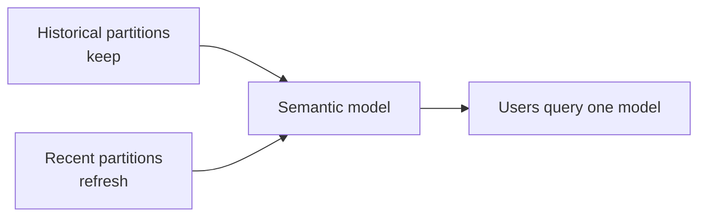
### 19.11 Interview-ready deployment answer
“I would separate Dev, Test, and Prod workspaces, use apps for end-user distribution, configure gateways for on-prem sources, schedule or incrementally refresh imported models, certify trusted semantic models, and use deployment pipelines to promote changes safely. In Fabric-centric architectures I would also consider Direct Lake and OneLake lineage.”
---
## 20. End-to-end hands-on labs — build model, measures, time intelligence, and RLS in Power BI Desktop on Windows
This section turns the theory into a portfolio-ready demo. You can do this with free Power BI Desktop on Windows.
### 🧪 Hands-on Lab Demo 1: build the support star schema
**Goal:** create the semantic model.
1. Open **Power BI Desktop**.
2. Load files for:
- `Fact_Cases` - `Dim_Product` - `Dim_Agent` - `Dim_Segment` - `Dim_Channel`
3. Create `Dim_Date` with DAX.
4. In Model view,
create one-to-many, single-direction relationships from each dimension to the fact.
5. Hide technical keys.
6. Create hierarchies:
- Fiscal Year → Fiscal Quarter → Month, - Manager → Agent if available.
7. Format fields and organize measure folders.
**Success check:** your model view visually looks like a star, not a spaghetti bowl.
### 🧪 Hands-on Lab Demo 2: create core measures
Create these measures:
```dax
Total Cases = COUNTROWS(Fact_Cases)
Avg CSAT = AVERAGE(Fact_Cases[CSATScore])
Avg Resolution Hours = AVERAGE(Fact_Cases[ResolutionHours])
Escalated Cases = CALCULATE([Total Cases], Fact_Cases[EscalatedFlag] = 1)
Escalation Rate % = DIVIDE([Escalated Cases], [Total Cases])
Breach Cases = CALCULATE([Total Cases], Fact_Cases[ResolutionHours] > 24)
Breach Rate % = DIVIDE([Breach Cases], [Total Cases])
```
Build visuals:
- KPI cards,
- line chart by fiscal month,
- bar chart by product,
- matrix by channel and segment.
### 🧪 Hands-on Lab Demo 3: add time intelligence
Create:
```dax
Cases Fiscal YTD = TOTALYTD([Total Cases], Dim_Date[Date], "6/30")
Cases Last Month = CALCULATE([Total Cases], DATEADD(Dim_Date[Date], -1, MONTH))
Cases MoM % = DIVIDE([Total Cases] - [Cases Last Month], [Cases Last Month])
Cases PY = CALCULATE([Total Cases], SAMEPERIODLASTYEAR(Dim_Date[Date]))
Cases YoY % = DIVIDE([Total Cases] - [Cases PY], [Cases PY])
```
Use a line chart and matrix to verify the logic.
### 🧪 Hands-on Lab Demo 4: role-playing date dimension with USERELATIONSHIP
1. Keep CreatedDate relationship active.
2. Create inactive relationship for ResolvedDate.
3. Add:
```dax
Resolved Cases =
CALCULATE(
    [Total Cases],
    USERELATIONSHIP(Fact_Cases[ResolvedDate], Dim_Date[Date])
)
```
4. Compare created vs resolved trends.
### 🧪 Hands-on Lab Demo 5: implement RLS
1. Add `AgentEmail` to `Dim_Agent`.
2. Create role filter:
```dax
Dim_Agent[AgentEmail] = USERPRINCIPALNAME()
```
3. Use **View as**.
4. Test that totals and details both change.
### 🧪 Hands-on Lab Demo 6: executive UX polish
1. Add dynamic title measure.
2. Add conditional formatting for breach rate.
3. Add drill-through page for Product.
4. Add tooltip page for Channel.
5. Add a bookmark to show/hide advanced filters.
### Final demo story you can tell in an interview
“I built a support analytics star schema in Power BI Desktop using Fact_Cases and Date/Product/Agent/Segment/Channel dimensions, wrote base and time-intelligence DAX measures, used an inactive relationship plus `USERELATIONSHIP` for resolved-date analysis, added RLS for agent-level visibility, and designed an executive-friendly report with drill-through and conditional formatting. I used Microsoft’s July–June fiscal year in the Date table and measures.”
That is a strong answer.
---
## 21. Quick reference cheat tables
### 21.1 Measures vs columns quick recall
| Question | Calculated column | Measure |
|---|---|---|
| Row-by-row attribute? | Yes | No |
| Dynamic under slicers? | No | Yes |
| Stored in memory? | Yes | No |
| Good for aggregation? | Sometimes but usually not preferred | Yes |
### 21.2 Context quick recall
| Context | Core question |
|---|---|
| Row context | “Which row am I on?” |
| Filter context | “Which slice is visible?” |
| Context transition | “Turn current row into filter” |
### 21.3 Storage mode quick recall
| Mode | Recall cue |
|---|---|
| Import | Fastest cached copy |
| DirectQuery | Ask source live |
| Dual | Hybrid dimension helper |
| Direct Lake | Fabric fast direct read |
| Composite | Mixed architecture |
---
## 📚 Reference Links
- Microsoft Learn — [PL-300: Microsoft Power BI Data Analyst](https://learn.microsoft.com/training/courses/pl-300t00)
- Microsoft Learn — [Model data in Power BI](https://learn.microsoft.com/training/paths/model-power-bi/)
- Microsoft Learn — [Use DAX in Power BI Desktop](https://learn.microsoft.com/training/modules/dax-power-bi-models/)
- Microsoft Learn — [Star schema guidance](https://learn.microsoft.com/power-bi/guidance/star-schema)
- Microsoft Learn — [Understand storage modes](https://learn.microsoft.com/power-bi/transform-model/desktop-storage-mode)
- Microsoft Learn — [Row-level security in Power BI](https://learn.microsoft.com/power-bi/enterprise/service-admin-rls)
- Microsoft Learn — [Incremental refresh](https://learn.microsoft.com/power-bi/connect-data/incremental-refresh-overview)
- Microsoft Learn — [Direct Lake in Microsoft Fabric](https://learn.microsoft.com/fabric/fundamentals/direct-lake-overview)
- SQLBI — [Introducing DAX](https://www.sqlbi.com/articles/)
- SQLBI — [Introducing CALCULATE in DAX](https://www.sqlbi.com/articles/introducing-calculate-in-dax/)
- SQLBI — [Row context and filter context in DAX](https://www.sqlbi.com/articles/row-context-and-filter-context-in-dax/)
- SQLBI — [Optimizing DAX](https://www.sqlbi.com/topics/optimization/)
- SQLBI — [The Definitive Guide to DAX](https://www.sqlbi.com/books/the-definitive-guide-to-dax-2nd-edition/)
---
## ⭐ Likely Interview Questions for This Section
**Q1. “What are the three layers of a Power BI solution?”**
> *Model answer:* “I think of Power BI in three layers: Power Query for getting and shaping data, the semantic model for relationships, DAX, and security, and the report layer for visuals and user experience. A strong report depends on a strong model, and a strong model depends on clean shaping upstream.”
**Q2. “What is the difference between Power BI Desktop, Service, Mobile, and Report Server?”**
> *Model answer:* “Desktop is the free Windows authoring tool where I build the model and report. The Service is the cloud where I publish, refresh, share, secure, and package content. Mobile is the consumption app for phones and tablets. Report Server is the on-premises hosting option when cloud use is restricted.”
**Q3. “What is a semantic model, and why does it matter?”**
> *Model answer:* “A semantic model is the business-ready analytical layer containing tables, relationships, measures, metadata, and security. It matters because it standardizes definitions like Total Cases or Breach Rate so multiple reports and users consume the same logic instead of each visual reinventing calculations.”
**Q4. “Explain query folding in plain English.”**
> *Model answer:* “Query folding means Power Query pushes transformations back to the source so the source system does the work. It matters because filtering and selecting columns at the source reduces data movement and makes refreshes much faster. I check it with View Native Query and try to keep foldable steps early.”
**Q5. “Merge vs append?”**
> *Model answer:* “Merge joins tables side by side using keys, like attaching agent attributes to cases. Append stacks tables vertically, like combining monthly case exports into one longer fact table.”
**Q6. “Import vs DirectQuery vs Direct Lake?”**
> *Model answer:* “Import stores compressed data in VertiPaq and is usually the fastest and simplest choice if scheduled refresh is acceptable. DirectQuery leaves data in the source and queries it live, which helps freshness but often hurts performance and adds constraints. Direct Lake is a Fabric mode that reads OneLake Delta data directly and aims for near-import speed with fresher data.”
**Q7. “Why is star schema so important in Power BI?”**
> *Model answer:* “Power BI’s engine and DAX work best with a star schema because one-to-many, single-direction relationships from dimensions to the fact create clear filter paths, better compression, and simpler measures. Flat tables and tangled bi-directional models are harder to maintain and easier to get wrong.”
**Q8. “What is the difference between a calculated column and a measure?”**
> *Model answer:* “A calculated column is evaluated at refresh time row by row and stored in memory. A measure is evaluated at query time under filter context and is not stored. I use calculated columns for row-level attributes or bucketing and measures for aggregations, ratios, and dynamic business logic.”
**Q9. “Explain row context, filter context, and context transition.”**
> *Model answer:* “Row context means the current row, usually in a calculated column or iterator. Filter context means the current slice of data created by visuals, slicers, and DAX filters. Context transition is when CALCULATE turns row context into filter context. I remember it as current row, current slice, and convert row to slice.”
**Q10. “What does CALCULATE actually do?”**
> *Model answer:* “CALCULATE evaluates an expression in a modified filter context. It can add filters, override filters, remove filters, activate inactive relationships, and more. It is the core function behind many advanced DAX patterns.”
**Q11. “When would you use ALL versus ALLSELECTED?”**
> *Model answer:* “I use ALL when I want to remove filters entirely from a table or column, such as calculating a grand-total denominator. I use ALLSELECTED when I want a total within the user’s broader selection rather than the current visual grain, which is helpful for visual totals and some percent-of-selected calculations.”
**Q12. “What is an iterator? Give an example.”**
> *Model answer:* “An iterator is an X function like SUMX or AVERAGEX that goes row by row over a table expression and evaluates an expression for each row. For example, SUMX can calculate weighted CSAT by summing score times weight over each case row.”
**Q13. “How do you handle multiple date roles like created date and resolved date?”**
> *Model answer:* “I use a proper Date dimension and usually keep one relationship active, often CreatedDate, then create another inactive relationship for ResolvedDate. Measures that need the alternate path use USERELATIONSHIP inside CALCULATE. That is a standard role-playing dimension pattern.”
**Q14. “How would you implement Microsoft fiscal-year YTD in Power BI?”**
> *Model answer:* “Because Microsoft fiscal year runs July through June, I create fiscal columns in Dim_Date and use TOTALYTD or DATESYTD with a year-end of 6/30. For example, `TOTALYTD([Total Cases], Dim_Date[Date], "6/30")` gives fiscal YTD.”
**Q15. “What are field parameters and calculation groups?”**
> *Model answer:* “Field parameters let users dynamically switch the fields or measures used in visuals, which is great for flexible slicing without duplicating charts. Calculation groups define reusable calculation logic, such as Current, YTD, Prior Year, or YoY %, and are typically authored with tools like Tabular Editor to reduce measure sprawl and standardize logic.”
**Q16. “How do you secure a Power BI model?”**
> *Model answer:* “I use Row-Level Security to restrict visible rows and Object-Level Security where required to hide sensitive columns or tables. I test roles with View As, document the mapping logic, and keep security dimension-driven and as simple as possible. In support analytics, dynamic RLS by signed-in user is common.”
**Q17. “How do you make a Power BI model perform well?”**
> *Model answer:* “I start with star schema and the right storage mode, usually Import or Direct Lake when possible. I reduce model size and cardinality, remove unused columns, avoid unnecessary calculated columns and bi-directional relationships, and then profile with Performance Analyzer, DAX Studio, and VertiPaq Analyzer before optimizing specific measures.”
**Q18. “What tools do you use to tune DAX and models?”**
> *Model answer:* “Power BI Performance Analyzer for visual timing, DAX Studio for query and server timings, VertiPaq Analyzer for model size and compression insights, and Tabular Editor for advanced model authoring, scripting, and calculation groups.”
**Q19. “How would you design an executive support dashboard?”**
> *Model answer:* “I would keep one-screen clarity with KPI cards, a few important trends, and a clear story in the titles. I would include drill-through for detail, tooltips for context, conditional formatting for exceptions, and only a small number of meaningful slicers. The goal is to support decisions, not display every possible chart.”
**Q20. “How do you operationalize Power BI in production?”**
> *Model answer:* “I separate Dev, Test, and Prod workspaces, use apps for controlled distribution, configure gateways for on-prem data, set refresh and incremental refresh appropriately, certify trusted semantic models, and use deployment pipelines for safe promotion. I also monitor refreshes, validate numbers against source systems, and review security regularly.”
### DAX challenge questions with solutions
**Q21. “Write a measure for percent of total cases by channel within the selected product.”**
> *Model answer:* “Use the current product filter but remove the channel filter in the denominator.”
>
> ```dax
> Channel % of Product =
> DIVIDE(
>     [Total Cases],
>     CALCULATE([Total Cases], REMOVEFILTERS(Dim_Channel[ChannelName]))
> )
> ```
**Q22. “Write a measure for resolved cases using ResolvedDate instead of CreatedDate.”**
> *Model answer:* “Use USERELATIONSHIP to activate the inactive ResolvedDate relationship.”
>
> ```dax
> Resolved Cases =
> CALCULATE(
>     [Total Cases],
>     USERELATIONSHIP(Fact_Cases[ResolvedDate], Dim_Date[Date])
> )
> ```
**Q23. “Write a YoY % measure for average CSAT.”**
> *Model answer:* “First get prior-year CSAT, then divide the difference by the prior-year value.”
>
> ```dax
> Avg CSAT PY =
> CALCULATE(
>     [Avg CSAT],
>     SAMEPERIODLASTYEAR(Dim_Date[Date])
> )
>
> Avg CSAT YoY % =
> DIVIDE([Avg CSAT] - [Avg CSAT PY], [Avg CSAT PY])
> ```
**Q24. “Write a ranking measure for top products by escalation rate.”**
> *Model answer:* “Rank product values using RANKX over all products.”
>
> ```dax
> Product Rank by Escalation Rate =
> RANKX(
>     ALL(Dim_Product[ProductName]),
>     [Escalation Rate %],
>     ,
>     DESC,
>     DENSE
> )
> ```
---
## 🧠 30-Second Memory Hooks
- **Power BI has three jobs:** Power Query preps, the model thinks, the report speaks.
- **Desktop builds; Service shares and operates; Mobile consumes; Report Server is on-prem.**
- **Semantic model = the business brain, not just a pile of tables.**
- **Star schema is the default power move.** Dimensions slice; facts measure.
- **Single-direction filters are the safest default.**
- **Import is fastest most of the time; DirectQuery is for freshness trade-offs; Direct Lake is Fabric’s high-speed path.**
- **Calculated column = stored per row; measure = calculated on demand.**
- **Row context = current row. Filter context = current slice. Context transition = turn row into slice.**
- **CALCULATE = re-evaluate with different filters.**
- **ALL removes filters; KEEPFILTERS narrows without replacing; ALLSELECTED respects user selection scope.**
- **Iterators are row-by-row calculators: SUMX, AVERAGEX, RANKX, CONCATENATEX.**
- **USERELATIONSHIP solves created-date vs resolved-date questions.**
- **TREATAS creates a virtual relationship.**
- **Proper time intelligence starts with a real Date table.**
- **Microsoft fiscal year = July to June, so fiscal YTD ends on 6/30.**
- **VAR makes DAX readable and often more efficient.**
- **Performance starts with the model, not the pretty chart.**
- **Reduce cardinality, remove unused columns, and prefer measures over stored columns for aggregations.**
- **RLS filters rows; OLS hides objects.**
- **Executives want a decision tool, not a wall of charts.**
- **Workspaces build and govern; apps distribute; gateways connect on-prem; pipelines promote safely.**
---
*Next suggested section:* **Part 8 — Business Needs → Technical Requirements (Agile)** (because once you can build the technical BI engine, the next senior skill is turning messy stakeholder asks into clear stories, acceptance criteria, sequencing, and delivery plans).
