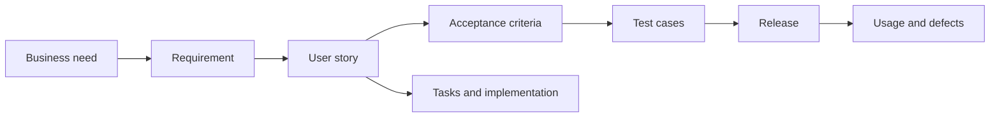
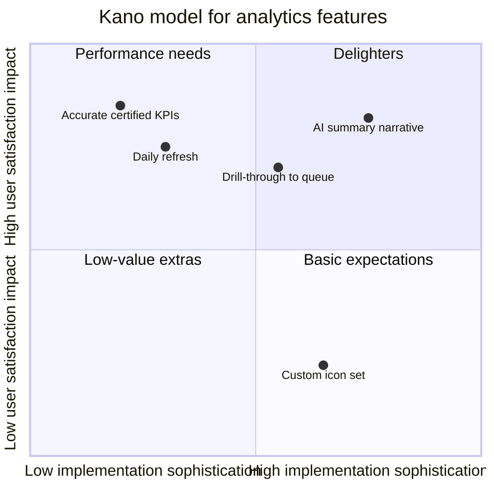
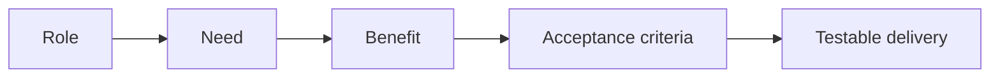
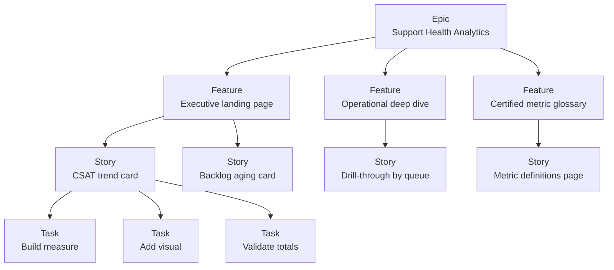
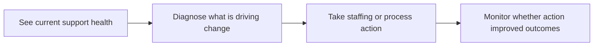
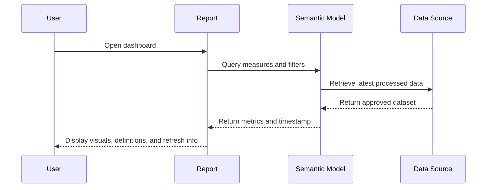
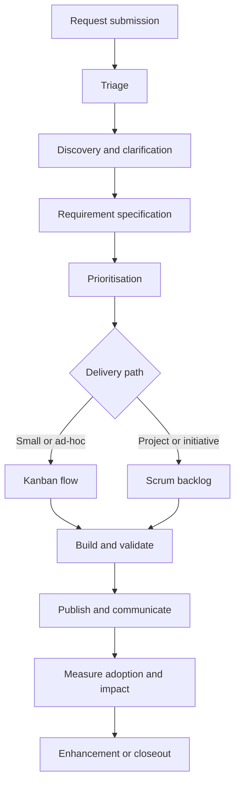

# Part 8 — Requirements Engineering, Agile Delivery, and BI Intake Design
> Section goal: Learn how to turn fuzzy business requests into clear, prioritised, testable, and deliverable analytics work. By the end of this Part, you should be able to move from “we need a dashboard” to a full backlog, acceptance criteria, estimation approach, stakeholder plan, quality gate, and agile delivery model.
Covers index item **8**. Maps to JD responsibilities: **translate business needs into technical
requirements; design and streamline intake processes including user stories, acceptance criteria,
bug and data matrices, effort estimations and task sequencing; Agile method practice.**
---
## 0. Why this Part matters for this role
A data analyst is not only a report builder. A strong BI analyst is a translator. They translate:
- business language into technical language,
- vague requests into scoped work,
- stakeholder pain into measurable outcomes,
- and finished dashboards into decisions people can actually make.
That is exactly why this section matters so much for the Microsoft CE&S BI role. A support
organisation rarely asks for work in a perfectly structured way. People usually say things like:
- “Can we get a support health dashboard?”
- “I want to know where we are slipping.”
- “Can you show which teams need help?”
- “Why is leadership seeing different numbers in different decks?”
Those are not requirements. Those are starting points. Your job is to shape them into something a BI
team can build well.
```mermaid
flowchart LR A[Vague ask<br/>"Show support health"] --> B[Discovery<br/>What decision? For whom?] B
--> C[Requirements<br/>metrics, rules, filters, freshness, security] C --> D[Backlog<br/>epic,
stories, tasks, bugs] D --> E[Delivery<br/>Scrum, Kanban, Scrumban] E --> F[Validation<br/>accuracy,
refresh, usability] F --> G[Adoption<br/>decision making and action]
```
### 🔍 Plain-English deep-dive: what “requirements engineering” really means
- **Requirements engineering** — *the discipline of discovering, documenting, validating, prioritising, tracing, and managing what the business actually needs.* **Analogy:** it is like taking a messy spoken request for a custom house and turning it into a blueprint, room list, safety rules, timeline, and inspection checklist. **Why it matters:** without it, teams build fast in the wrong direction.
- **Agile delivery** — *an iterative way of working where you build in small slices, get feedback, and adapt instead of guessing everything upfront.* **Analogy:** tasting a soup while cooking rather than serving it only at the end. **Why it matters:** analytics needs often evolve once users see real data.
- **Intake process** — *the path a request takes from submission to triage to delivery.* **Analogy:** the front door, waiting room, and routing desk for BI work. **Why it matters:** even a strong team becomes chaotic if requests enter in random formats.
> 💡 **Tie-in to your background:** This is a strength zone for you. Your Microsoft CE&S support escalation work already trained you to clarify impact, identify stakeholders, separate symptoms from root cause, and drive governance. In BI language, that becomes requirements gathering, prioritisation, risk management, and structured delivery.
---
## 1. The requirements engineering lifecycle
Requirements work is not one meeting. It is a loop. You discover needs. You document them. You
validate them. You prioritise them. You trace them into delivery. Then you revisit them when reality
changes.
| Step | What happens | Why it matters in analytics |
|---|---|---|
| Elicit | Gather needs from people, systems, documents, and observation | Most requests are incomplete at first |
| Analyse | Resolve ambiguity, conflicts, missing details, and assumptions | Different teams often define metrics differently |
| Specify | Write requirements in a structured format | Makes work estimable and testable |
| Validate | Confirm the requirement is correct and useful | Prevents building the wrong dashboard |
| Prioritise | Decide what gets done first | BI demand is usually larger than BI capacity |
| Trace | Link asks to stories, tests, metrics, and releases | Important for governance and audits |
| Manage changes | Update requirements when business needs change | Support operations changes quickly |
```mermaid
flowchart TD A[Elicit] --> B[Analyse] B --> C[Specify] C --> D[Validate] D --> E[Prioritise] E -->
F[Deliver] F --> G[Measure usage and impact] G --> H[Change request or enhancement] H --> B
```
### Beginner view
Requirements engineering answers one basic question:
**“What exactly should we build, for whom, why, and how will we know it is correct?”**
### Intermediate view
A good requirement is:
- clear,
- unambiguous,
- testable,
- feasible,
- valuable,
- and connected to an actual decision.
### Advanced view
In a mature BI team, requirements engineering also supports:
- portfolio prioritisation,
- governance,
- auditability,
- cross-team alignment,
- and change control.
That matters in Microsoft-scale environments where multiple teams consume the same metrics.
---
## 2. Requirement types in analytics work
Not all requirements are the same. When people hear “requirements,” they often think only about
features. In analytics, that is too narrow. A dashboard can fail even if the charts look good. It
can fail because the data is late. Or the metric definition is wrong. Or the right audience cannot
access it. Or the page takes too long to load. Or users cannot tell what action to take.
### 2.1 Functional requirements
Functional requirements describe **what the solution should do**. Examples:
- Show weekly CSAT by product and region.
- Allow filtering by severity, support plan, and queue.
- Provide drill-through from team level to agent level.
- Export the current filtered view to Excel.
- Send an alert when backlog exceeds threshold.
### 2.2 Non-functional requirements
Non-functional requirements describe **how well the solution should work**. Examples:
- Refresh daily by 6:00 AM Pacific Time.
- Page loads within 5 seconds for standard filters.
- Only managers can see agent-level data.
- Metric definitions must match the certified glossary.
- Data accuracy must reconcile to the source within the agreed tolerance.
### 2.3 Requirement types that appear constantly in BI and analytics
| Requirement type | Plain-English meaning | Support-analytics example |
|---|---|---|
| Data requirements | What raw data is needed, at what grain, from which source, with which joins and retention rules | Need case records, survey responses, engineer roster, and product hierarchy |
| Metric requirements | How each KPI is defined, calculated, filtered, and labelled | Escalation rate = escalated cases / total eligible cases |
| Refresh requirements | How often data updates and when users expect it ready | Refresh by 6 AM daily on business days |
| Security requirements | Who can see what level of detail | Managers see agent data; executives see only aggregated teams |
| UX requirements | How the report should feel and guide usage | Clear landing page, tooltip definitions, mobile-friendly summary page |
| Quality requirements | How accuracy, completeness, and timeliness are verified | All KPIs must pass the data validation matrix before release |
| Operational requirements | How ownership, support, incident handling, and documentation work | Named data owner, BI owner, refresh alert owner, runbook link |
| Compliance requirements | Rules for privacy, retention, and regulated data handling | Remove personal identifiers from broad distribution report |
### 🔍 Plain-English deep-dive: why analytics requirements need extra care
A normal software feature might fail because a button does not work. An analytics feature can fail
in quieter ways:
- the number is technically correct but defined differently from finance,
- the number is right but refreshed too late to influence staffing,
- the report is accurate but the audience cannot access it,
- the page is beautiful but does not answer the actual decision.
That is why strong analytics analysts think beyond visuals. They think in layers:
- data,
- logic,
- trust,
- usability,
- and actionability.
> 💡 **Tie-in to your background:** In support escalations, a fix is not “done” just because the error disappears. It is done when the issue is understood, the customer can operate, and the process is stable. Analytics work is similar: a dashboard is not “done” just because it renders.
---
## 3. Elicitation techniques: how you gather real requirements
**Elicitation** means drawing out information from people and evidence.
Many stakeholders do not deliberately hide requirements. They simply carry them in their heads. Your
job is to help surface them.
| Technique | What it is | Best used when | Example |
|---|---|---|---|
| Interviews | One-on-one structured or semi-structured conversations | When you need depth, context, or stakeholder-specific pain points | A support director explains why weekly backlog trends matter for staffing decisions |
| Workshops | Group sessions to align multiple stakeholders at once | When requirements conflict or need fast alignment | Support, operations, BI, and engineering agree what counts as an escalation |
| Observation | Watching people do their work in real life | When people struggle to explain current workflows | You observe a business manager manually combining three exports every Monday |
| Document analysis | Reviewing existing reports, SOPs, decks, ticket definitions, glossary docs | When history already exists in artifacts | You compare KPI decks and find three different CSAT formulas |
| Prototyping | Showing a low-fidelity mockup to trigger better feedback | When stakeholders react better to something visual | A wireframe helps leaders decide which trend cards belong on the landing page |
| Surveys | Structured questions sent to a larger audience | When you need broad input across many users | A survey captures which filters support managers use most often |
### 3.1 Interviews
Interviews are ideal when you need:
- context,
- nuance,
- political awareness,
- and hidden constraints.
Good interview questions include:
- What decision are you trying to make?
- What do you do today instead?
- What is painful about the current process?
- What number do you trust today, if any?
- What would make you say this was a success?
### 3.2 Workshops
Workshops are useful when multiple stakeholders need to align. For example:
- support leadership wants daily trending,
- finance wants certified definitions,
- operations wants drill-through,
- and engineering wants scope control.
A workshop helps expose conflict early.
### 3.3 Observation
Observation is underrated. People often say:
- “I just need a dashboard.”
But when you watch them work, you learn:
- they actually need two dashboards,
- or an export,
- or a daily alert,
- or a way to compare current week to the same week last quarter.
### 3.4 Document analysis
Always inspect:
- current spreadsheets,
- PowerPoint decks,
- definitions pages,
- team wiki notes,
- process maps,
- and old tickets.
Documents reveal:
- legacy assumptions,
- conflicting formulas,
- and hidden scope.
### 3.5 Prototyping
A rough sketch is often more useful than a perfect discussion. Why? Because stakeholders react to
something concrete. They can say:
- “That card is unnecessary.”
- “That trend should be weekly, not monthly.”
- “This needs a regional slicer.”
### 3.6 Surveys
Surveys are helpful when your user base is broad. For example, if many support managers will use a
dashboard, a survey can reveal:
- top-needed filters,
- how often users check the dashboard,
- whether email subscriptions matter,
- and what level of detail different audiences need.
```mermaid
flowchart TD A[Stakeholder says<br/>"We need a dashboard"] --> B{Best elicitation method?} B
-->|Need depth| C[Interview] B -->|Need alignment| D[Workshop] B -->|Need real workflow|
E[Observation] B -->|Need history| F[Document analysis] B -->|Need visual feedback| G[Prototype] B
-->|Need broad input| H[Survey]
```
### 🔍 Plain-English deep-dive: elicitation is not just note-taking
Weak elicitation sounds like this:
- “Okay, we’ll build a support dashboard.”
Strong elicitation sounds like this:
- “Who needs it?”
- “What decision will change?”
- “Which measures are most trusted today?”
- “Which existing reports disagree?”
- “What would make this dashboard unnecessary in six months?”
That is the difference between hearing requests and shaping them.
> 💡 **Tie-in to your background:** Your escalation role likely required interviews, triage calls, and cross-functional syncs under pressure. That is elicitation experience already. In an interview, say that you use a mix of interviews, workshops, and document review to move from symptoms to root requirements.
---
## 4. Discovery questions: finding the real decision behind the request
The best analytics analysts do not stop at “what report do you want?” They ask “what decision are
you trying to make?” They ask “what decision are you trying to make?” That one shift changes
everything.
| Question theme | Example question | Why it matters |
|---|---|---|
| Decision | What decision will this output support? | Without the decision, you cannot tell which metrics matter |
| Audience | Who will use it, and at what level? | Executives, managers, frontline leads, analysts all need different views |
| Outcome | What action should users take after seeing the data? | A dashboard without action is often just decoration |
| Metric | Which KPI or measure is needed? | Avoid vague phrases like 'support health' without concrete metrics |
| Definition | How is each metric defined? | Prevents conflicting formulas across teams |
| Grain | At what level of detail is the data needed? | Daily vs weekly, team vs queue vs agent |
| Filters | Which slices and drill paths are necessary? | Region, product, plan, channel, severity |
| Time horizon | How far back and how often? | 13 weeks, 12 months, current day, fiscal quarter |
| Freshness | How up to date must the data be? | Daily may be enough; real-time may be overkill |
| Source of truth | Which source is authoritative? | Critical when multiple operational systems exist |
| Trust issues | Which numbers are debated today? | This tells you where validation effort must be highest |
| Consumers | Will this be read, exported, subscribed to, or embedded? | Impacts UX and tool choice |
| Security | Who should not see certain data? | Agent-level performance may require role-based access |
| Success measure | How will we know this work helped? | Usage, faster staffing decisions, reduced manual prep |
| Constraints | What deadlines, dependencies, or known blockers exist? | Helps realistic sequencing |
### 4.1 A running example: “support health dashboard”
Imagine a stakeholder says:
**“We need a support health dashboard.”**
That sounds reasonable. But it is still too vague. Here is how you sharpen it.
| Bad requirement | Better requirement |
|---|---|
| Show support health | Show weekly support health for support directors so they can decide staffing and escalation focus areas |
| Include CSAT | Include weekly average CSAT, response rate, and change vs prior 4-week average |
| Show backlog | Show open backlog by severity, aging bucket, and product family |
| Use live data | Refresh daily by 6:00 AM PT using the certified support warehouse |
| Keep it secure | Restrict agent-level view to managers; executives see aggregated team view only |
### 4.2 The “five layers” discovery pattern
Use this simple pattern in conversation.
#### Layer 1: Decision layer
Ask:
- What decision changes because of this?
- What would you do differently on Monday morning if this existed?
- What are the most important operational actions you need to take?
#### Layer 2: Metric layer
Ask:
- Which metrics best signal the problem?
- Which metrics are leading indicators and which are lagging indicators?
- Which metrics are currently controversial?
#### Layer 3: Usage layer
Ask:
- How often will you use this?
- During which meeting or workflow?
- Do you need drill-through, export, or subscriptions?
#### Layer 4: Trust layer
Ask:
- Which system should be the source of truth?
- Which exclusions or business rules matter?
- How close must it match existing certified numbers?
#### Layer 5: Delivery layer
Ask:
- How urgent is this compared with other asks?
- What is the MVP, or minimum viable product?
- What is phase 2 if phase 1 lands well?
```mermaid
flowchart TD A[Request: Support health dashboard] --> B[Decision layer] B --> C[Metric layer] C -->
D[Usage layer] D --> E[Trust layer] E --> F[Delivery layer] F --> G[Refined requirements and MVP]
```
### 🔍 Plain-English deep-dive: “real decision” vs “reported symptom”
A stakeholder may ask for “more data.” But the real problem may be:
- they cannot staff weekend coverage,
- they cannot explain escalations to leadership,
- they cannot trust one team’s numbers,
- or they spend three hours manually preparing weekly business reviews.
If you solve only the symptom, you often produce a dashboard that looks impressive but does not
remove pain. If you solve the decision, you create real operational value.
---
## 5. Requirements traceability: keeping every ask connected to delivery and validation
**Traceability** means linking requirements all the way through the lifecycle.
For analytics, that usually means linking:
- business need,
- requirement,
- user story,
- acceptance criteria,
- source data,
- validation test,
- release,
- and defect if something fails.
| Traceability link | Example |
|---|---|
| Business objective | Reduce manual weekly support review prep time by 50% |
| Requirement | Show 13-week CSAT, backlog, escalation rate by product and region |
| User story | As a support director, I want weekly trend cards so I can allocate staffing |
| Acceptance criterion | Data matches certified source within ±0.01 and refreshes by 6 AM PT |
| Technical item | Build measure for eligible escalation rate in semantic model |
| Validation test | Reconcile sample region-week totals to certified source |
| Release item | Version 1.0 dashboard published to leadership workspace |
| Bug link | Bug B-104: backlog aging bucket missing 30+ days rule |
### Why traceability matters
Traceability helps when someone asks:
- Why was this built?
- Which story created this chart?
- Which rule defines this KPI?
- Which test proves this number?
- Which release changed this definition?
Without traceability, answers live only in memory. That is fragile.

### A simple requirements traceability matrix
| Req ID | Business need | Story ID | Metric/source | Validation | Release |
|---|---|---|---|---|---|
| REQ-01 | Spot deteriorating support performance | US-12 | CSAT from survey table | Reconcile by week-region | Sprint 14 |
| REQ-02 | Prioritise staffing | US-13 | Backlog aging from case table | Bucket totals match warehouse | Sprint 14 |
| REQ-03 | Track escalation risk | US-14 | Escalation rate from escalation event log | Definition approved by operations | Sprint 15 |
| REQ-04 | Protect sensitive data | US-15 | Role-based security mapping | User acceptance by test accounts | Sprint 15 |
> 💡 **Tie-in to your background:** Traceability is very natural for someone from a support escalation environment. Escalations often require clean incident histories, owner tracking, resolution notes, and policy mapping. Requirements traceability is the BI version of that discipline.
---
## 6. Prioritisation frameworks: deciding what to do first
BI teams almost always have more requests than capacity. So prioritisation is not optional. It is a
core skill. The point of a framework is not to replace judgment. The point is to make trade-offs
more visible and less emotional.
### 6.1 MoSCoW
**MoSCoW** stands for:
- **Must have**
- **Should have**
- **Could have**
- **Won’t have for now**
It is simple and easy to use in stakeholder discussions.
| Category | Meaning | Support dashboard example |
|---|---|---|
| Must | Essential for the solution to be usable | Certified CSAT, backlog, escalation rate, daily refresh, role-based access |
| Should | Very valuable but not mandatory for initial release | Drill-through from team to agent |
| Could | Nice to have if capacity allows | Custom colour themes and export bookmarks |
| Won’t yet | Explicitly out of scope for now | Predictive forecast model for attrition risk in phase 1 |
### 6.2 Kano model
The **Kano model** helps think about how features affect satisfaction. Types:
- **Basic needs** — if missing, users are unhappy; if present, they just expect them.
- **Performance needs** — the better you do, the happier users are.
- **Delighters** — unexpected features that create extra satisfaction.
For analytics:
- accurate numbers are a basic need,
- faster drill paths may be a performance need,
- an auto-generated meeting summary might be a delighter.

### 6.3 WSJF
**WSJF** means **Weighted Shortest Job First**.
It is commonly used in scaled agile environments. Formula:
**WSJF = Cost of Delay / Job Size**
A high score means a job delivers strong value relative to its size. Cost of Delay often includes:
- business value,
- time criticality,
- and risk reduction or opportunity enablement.
| Item | Business value | Time criticality | Risk reduction | Job size | WSJF |
|---|---|---|---|---|---|
| Daily backlog aging dashboard | 8 | 9 | 6 | 5 | 4.6 |
| Agent-level drill-through | 5 | 4 | 3 | 8 | 1.5 |
| Metric glossary page | 6 | 5 | 7 | 3 | 6.0 |
| PowerPoint export template | 4 | 3 | 2 | 2 | 4.5 |
### 6.4 Value vs effort matrix
This matrix is a quick visual way to sort work.
| Quadrant | Meaning | Typical action |
|---|---|---|
| High value / low effort | Quick wins | Do soon |
| High value / high effort | Strategic initiatives | Plan carefully |
| Low value / low effort | Minor fillers | Do only if useful |
| Low value / high effort | Poor investment | Challenge or drop |
### 6.5 RICE
**RICE** stands for:
- **Reach**
- **Impact**
- **Confidence**
- **Effort**
Formula:
**RICE = (Reach × Impact × Confidence) / Effort**
It is useful when you can estimate how many users or processes a request affects.
| Request | Reach | Impact | Confidence | Effort | RICE idea |
|---|---|---|---|---|---|
| Leadership support health landing page | High | High | High | Medium | Very strong candidate for phase 1 |
| One team’s custom export layout | Low | Medium | Medium | Medium | Lower priority |
| Certified glossary and definitions page | High | High | High | Low | Excellent foundational item |
| Experimental predictive risk score | Medium | Unknown | Low | High | Likely a later spike first |
### When to use which framework
| Framework | Best for | Strength | Watch-out |
|---|---|---|---|
| MoSCoW | Stakeholder conversations and release scoping | Simple and easy to explain | People overuse 'Must' |
| Kano | Thinking about user satisfaction | Separates basic needs from delights | Less precise for scheduling |
| WSJF | Portfolio prioritisation in agile programs | Balances urgency and size | Scoring can become subjective |
| Value vs effort | Quick triage | Very visual | Can oversimplify dependencies |
| RICE | Product-style prioritisation | Adds reach and confidence | Needs some data quality in assumptions |
### 🔍 Plain-English deep-dive: prioritisation is a negotiation tool, not a math trick
Frameworks help the conversation move from:
- “My request is urgent because I asked loudly.”
to:
- “This request supports a high-impact staffing decision for 12 managers, unblocks certified reporting, and is relatively small, so it should come earlier.”
That is a much healthier conversation.
> 💡 **Tie-in to your background:** Stakeholder management and governance are already visible strengths in your profile. In interview answers, say you use a lightweight but explicit prioritisation method so BI teams can explain trade-offs clearly.
---
## 7. User stories: the basic unit of agile work
A **user story** captures a need from the perspective of the user. The standard format is:
**As a <role>, I want <capability>, so that <benefit>.**
### Example
As a **support director**, I want a **weekly support health dashboard by product and region**, so
that I can **spot deteriorating performance and reallocate staffing before backlog worsens**.
### Why user stories work well in analytics
They force you to say:
- who the audience is,
- what they need,
- and why it matters.
That protects teams from building metrics nobody uses.
### INVEST checklist
A good story is:
- **Independent** — not tightly tangled with many other stories.
- **Negotiable** — open to discussion, not a rigid contract sentence.
- **Valuable** — delivers value to a user or stakeholder.
- **Estimable** — clear enough for the team to size.
- **Small** — able to fit into a sprint or a manageable flow unit.
- **Testable** — acceptance criteria can confirm it works.
| Weak story | Why weak | Stronger version |
|---|---|---|
| As a user, I want a dashboard | Too vague; no user or decision | As a support manager, I want weekly backlog aging by queue so I can rebalance workloads |
| As leadership, I want all support metrics in one place | Too broad and not small | As a support VP, I want a landing page with CSAT, backlog, and escalation rate cards so I can monitor weekly trends |
| As an analyst, I want Power BI to be faster | Value unclear and not testable | As a support analyst, I want the landing page to load in under 5 seconds so I can use it live in review meetings |

### 🔍 Plain-English deep-dive: a user story is not a task list
A story explains value. A task explains implementation. For example:
- Story: “As a support director, I want a weekly trend view so I can spot deterioration.”
- Task: “Create DAX measures for rolling 4-week average and trend arrow.”
Stories talk about outcomes. Tasks talk about how the team builds them.
---
## 8. Story hierarchy, splitting, mapping, spikes, and enabler stories
Once work grows beyond one small item, you need hierarchy.
### 8.1 Epic → Feature → Story → Task
- **Epic** — a large body of work that spans multiple stories.
- **Feature** — a meaningful capability inside the epic.
- **Story** — a user-focused slice of value.
- **Task** — a piece of implementation work.

### 8.2 Story splitting patterns
When a story is too big, split it. Common patterns:
- split by user role,
- split by workflow step,
- split by data slice,
- split by rule complexity,
- split by happy path first,
- split by reporting surface.
| Split pattern | Example | Why it helps |
|---|---|---|
| By user role | Separate executive view from manager drill-through | Different security and detail needs |
| By workflow step | Landing page first, drill-through second | Gets usable value sooner |
| By data slice | Region first, product second | Reduces complexity |
| By business rule | Basic backlog aging first, complex exclusions later | Lets you validate core logic before edge cases |
| By interface | Dashboard view first, export second | Avoids bundling too much into one story |
| By data freshness | Daily refresh first, intra-day refresh spike later | Prevents overcommitting on performance |
### 8.3 Story mapping
**Story mapping** is a way to arrange user needs from left to right by journey, and top to bottom by priority.
For analytics, a simple map might be:
- understand current state,
- diagnose drivers,
- take action,
- monitor after action.

### 8.4 Spikes
A **spike** is a time-boxed research item. You use a spike when the team lacks enough knowledge to
estimate or commit confidently. Examples:
- spike to confirm whether a required field exists in the warehouse,
- spike to test whether row-level security can support the org hierarchy,
- spike to explore if near-real-time refresh is technically feasible.
A spike should answer a question. It should not become endless research.
### 8.5 Non-functional or enabler stories
Not every valuable story produces a visible chart. Some stories enable quality, speed, trust, or
maintainability. Examples:
- Create a certified metric glossary page.
- Implement role-based access.
- Add automated validation checks for key metrics.
- Refactor semantic model naming for consistency.
- Create refresh monitoring and alerting.
These are often called **enabler stories** or **non-functional stories**.
| Story type | Example | Value |
|---|---|---|
| Business-facing story | As a support director, I want weekly trend cards | Direct decision support |
| Enabler story | As a BI team, we want automated validation checks | Prevents trust failures |
| Spike | Investigate feasibility of near-real-time refresh | Reduces uncertainty |
| Technical task | Create semantic model measures | Implements story |
### 🔍 Plain-English deep-dive: the danger of giant stories
A giant story sounds efficient because it rolls everything together. But giant stories usually
create:
- weak estimates,
- hidden dependencies,
- delayed feedback,
- and rushed testing.
Smaller stories let the team:
- learn earlier,
- deliver sooner,
- and adapt without wasting large amounts of work.
---
## 9. Acceptance criteria: the rules that make a story testable
Acceptance criteria answer the question:
**“What must be true for this story to be accepted?”**
They prevent ambiguity.
### 9.1 Gherkin format: Given, When, Then
**Gherkin** is a structured plain-English style.
Format:
- **Given** a starting context,
- **When** an action happens,
- **Then** an outcome should occur.
### Example for a support health dashboard story
- **Given** I am a support director with access to the leadership workspace,
- **When** I open the Support Health dashboard landing page,
- **Then** I see cards for CSAT, backlog aging, escalation rate, and response time for the last completed week.
- **Given** I select Product = Teams and Region = EMEA,
- **When** the page refreshes,
- **Then** all visuals update consistently to the selected filters.
- **Given** the daily warehouse load completed successfully,
- **When** I view the refresh timestamp,
- **Then** it displays the latest successful refresh time and date.
### 9.2 Rule-based acceptance criteria
Not all criteria need Gherkin. For data work, rule-based bullets are often clearer. Example:
- CSAT is defined as average post-case survey score from 1 to 5.
- Internal test cases are excluded.
- Data refresh completes by 6:00 AM PT on business days.
- Report displays the last 13 completed weeks by default.
- Week labels follow fiscal calendar definitions.
- Metric values reconcile to the certified source within ±0.01.
- Only managers can see agent names.
| Style | Best for | Example |
|---|---|---|
| Given-When-Then | Behaviour and interaction | Given I change a filter, then visuals update |
| Rule-based bullets | Data, formulas, constraints, and quality rules | Metric excludes test records and refreshes daily by 6 AM PT |
### 9.3 What good acceptance criteria usually cover in analytics
- visible behaviour,
- metric definition,
- filter behaviour,
- drill path behaviour,
- data freshness,
- accuracy tolerance,
- security rules,
- error or empty-state handling,
- and usability details such as labels or timestamps.
### 9.4 Data-accuracy and timeliness criteria
Analytics AC should often state:
- where the number comes from,
- what formula is used,
- which exclusions apply,
- what tolerance is acceptable,
- and by what time the data must be available.
Examples:
- “Backlog aging totals must match the certified warehouse extract exactly at the week-region grain.”
- “Escalation rate must match the agreed denominator definition approved by operations.”
- “If refresh fails, the dashboard must display the last successful refresh timestamp.”

### 🔍 Plain-English deep-dive: acceptance criteria are pre-agreed evidence
Think of AC as the answer to this future conversation: Stakeholder:
- “How do we know this story is complete?”
Team:
- “Because these explicit conditions are now true.”
That is much safer than relying on memory or opinion.
---
## 10. Definition of Ready and Definition of Done
Two terms often confuse beginners:
- **Definition of Ready (DoR)**
- **Definition of Done (DoD)**
They are not the same.
| Concept | Meaning | Question it answers |
|---|---|---|
| Definition of Ready | The entry criteria for starting a story | Is this item ready for delivery? |
| Definition of Done | The exit criteria for completing a story | Is this item truly complete? |
### 10.1 Typical Definition of Ready for BI work
A story may be “ready” when:
- the business outcome is clear,
- the user story is written,
- acceptance criteria exist,
- source systems are identified,
- dependencies are known,
- key assumptions are stated,
- and the team can estimate it.
### 10.2 Typical Definition of Done for BI work
A story may be “done” when:
- the report or model is built,
- validation checks pass,
- peer review is complete,
- documentation is updated,
- security is tested,
- stakeholder acceptance is confirmed,
- and deployment is complete.
| Area | Ready check | Done check |
|---|---|---|
| Requirements | Story and AC are clear | Stakeholder validates outcome meets need |
| Data | Source and grain identified | Validation matrix passed |
| Security | Audience defined | Access rules tested |
| Documentation | Need known | Glossary/runbook/spec updated |
| Release | Dependencies identified | Published and communicated |
> 💡 **Tie-in to your background:** DoR and DoD map nicely to support governance. Ready means the case has enough information to work properly. Done means resolution, validation, communication, and closure all happened.
---
## 11. Estimation: sizing work without pretending you know the future exactly
A common beginner mistake is to think estimation means promising exact hours. That is usually
unrealistic. Agile teams often estimate relatively.
### 11.1 Story points
**Story points** are a relative measure of effort, complexity, and uncertainty.
They are not a direct time unit. A common scale is Fibonacci:
- 1
- 2
- 3
- 5
- 8
- 13
Why this scale? Because uncertainty grows as work gets bigger.
### 11.2 Relative sizing
Relative sizing asks:
- Is this story smaller, similar, or larger than that other story?
Humans are generally better at comparing work than predicting exact duration.
### 11.3 Planning poker
**Planning poker** is a collaborative estimation method.
Typical flow:
- team reads the story,
- asks clarifying questions,
- each person picks a point value privately,
- everyone reveals at once,
- the lowest and highest explain their reasoning,
- the team converges on a value.
This is valuable because disagreement surfaces hidden assumptions.
### 11.4 T-shirt sizing
Instead of points, some teams use:
- XS
- S
- M
- L
- XL
This is useful early in discovery when precision would be fake.
### 11.5 Affinity estimation
In **affinity estimation**, the team quickly groups items by relative size. This helps when many
backlog items need an initial rough sort.
| Method | Best use | Strength | Watch-out |
|---|---|---|---|
| Story points | Sprint-ready items | Supports velocity-based forecasting | False precision if stories are unclear |
| Planning poker | Collaborative sizing | Surfaces assumptions | Can be slow for very large backlogs |
| T-shirt sizing | Early discovery and intake | Fast and lightweight | Too rough for detailed sprint commitments |
| Affinity estimation | Batch sorting many items | Efficient at scale | Needs later refinement |
### 11.6 Velocity
**Velocity** is the amount of work a team usually completes in a sprint, often measured in story points.
If a team typically completes 24 points every two weeks, that helps forecast future capacity.
Velocity is descriptive. It is not a performance target to weaponise.
### 11.7 Burndown and burnup charts
- **Burndown chart** — shows remaining work decreasing over time.
- **Burnup chart** — shows completed work rising over time, often alongside total scope.
Burnup is especially useful when scope changes.
```mermaid
xychart-beta title Sprint burndown example x-axis Day 1,Day 2,Day 3,Day 4,Day 5,Day 6,Day 7,Day
8,Day 9,Day 10 y-axis Remaining points 0 --> 30 line Ideal 30,27,24,21,18,15,12,9,6,3 line Actual
30,30,28,27,24,22,20,14,10,4
```
```mermaid
xychart-beta title Sprint burnup example x-axis Day 1,Day 2,Day 3,Day 4,Day 5,Day 6,Day 7,Day 8,Day
9,Day 10 y-axis Points 0 --> 30 line Total scope 24,24,24,24,26,26,26,26,26,26 line Completed
0,2,4,6,8,11,14,18,22,25
```
### 11.8 Forecasting
Forecasting uses past throughput or velocity to predict likely completion windows. A simple example:
- backlog = 48 points,
- average velocity = 24 points per sprint,
- rough forecast = about 2 sprints,
- but only if assumptions and scope stay stable.
Always speak in ranges when uncertainty is high.
### 11.9 Reference-class sizing
**Reference-class sizing** means comparing new work to similar completed work from the past.
Example:
- “Our last executive dashboard with three certified KPIs, role-based access, and one drill page was about 20 points. This request looks similar, plus one extra validation rule, so we might start around 24 points.”
This is often more grounded than estimating from pure imagination.
### 11.10 A note on #NoEstimates
Some teams prefer very lightweight forecasting based on flow metrics instead of formal estimates.
The **#NoEstimates** idea argues that effort spent estimating can sometimes be better spent slicing
work small and measuring actual throughput. This can work best when:
- work items are small,
- flow is steady,
- and historical data is strong.
For many BI teams, a hybrid approach works well:
- rough sizing for larger projects,
- flow-based forecasting for repeatable small requests.
### 🔍 Plain-English deep-dive: estimation is about reducing surprise, not proving intelligence
Good estimation does not mean “I guessed the exact number of hours.” It means:
- the team discussed assumptions,
- surfaced complexity,
- and gave the business a realistic planning signal.
That is much more useful.
---
## 12. Agile fundamentals: the Agile Manifesto and the 12 principles
The **Agile Manifesto** is a short statement of values that shaped modern agile ways of working. It
values:
- **Individuals and interactions** over processes and tools
- **Working software** over comprehensive documentation
- **Customer collaboration** over contract negotiation
- **Responding to change** over following a plan
Important nuance: The items on the right still matter. The manifesto says the items on the left are
valued more.
| Agile value | Plain-English meaning for BI teams |
|---|---|
| Individuals and interactions | Talk early and often with stakeholders instead of hiding behind tickets only |
| Working software | A working dashboard with trusted metrics teaches more than a giant document alone |
| Customer collaboration | Review with users regularly instead of waiting until the end |
| Responding to change | If users learn something new after seeing real data, adapt thoughtfully |
### The 12 principles in plain English
1. Satisfy the customer through early and continuous delivery of valuable work. 2. Welcome changing
requirements, even late, if they improve value. 3. Deliver working increments frequently. 4.
Business people and delivery teams should work together daily. 5. Build around motivated individuals
and trust them. 6. Face-to-face conversation, or direct communication, is usually most effective. 7.
Working outcomes are the primary measure of progress. 8. Maintain a sustainable pace. 9. Continuous
attention to technical excellence improves agility. 10. Simplicity matters; maximise the amount of
work not done. 11. The best architectures and designs emerge from self-organising teams. 12. Teams
should regularly reflect and adjust.
### What these principles mean in analytics practice
- deliver a small but trusted first version,
- learn from user behaviour,
- avoid giant scope bundles,
- keep definitions visible,
- and improve the team process over time.
A BI team is not “agile” just because it has standups. It is agile when it learns and adapts quickly
while protecting trust.
```mermaid
flowchart LR A[Early small release] --> B[Real user feedback] B --> C[Refined backlog] C -->
D[Improved increment] D --> E[Higher trust and adoption]
```

> 💡 **Tie-in to your background:** Process improvement work fits naturally with agile. Agile is not chaos. Done well, it is disciplined learning. That message will resonate well if you frame it through support operations and governance.

---

## 13. Scrum deep dive

**Scrum** is a structured agile framework that works in fixed-length iterations called **sprints**.

A sprint is usually 1 to 4 weeks. Many teams use 2 weeks.

### 13.1 Scrum roles
- **Product Owner** — owns backlog ordering and maximises value.
- **Scrum Master** — helps the team use Scrum well and removes impediments.
- **Developers** — the people who build the increment. In a BI team, this could include data analysts, BI developers, analytics engineers, and testers.

| Role | Main responsibility | BI-flavoured example |
|---|---|---|
| Product Owner | Prioritises what gets built next | Chooses whether metric glossary or drill-through comes first |
| Scrum Master | Improves team flow and removes blockers | Helps resolve dependency on data engineering team |
| Developers | Deliver the working increment | Build model, report, security, tests, and documentation |

### 13.2 Scrum events
- **Sprint** — the fixed timebox where work happens.
- **Sprint Planning** — decide what to do and how to approach it.
- **Daily Scrum** — a short daily coordination event.
- **Sprint Review** — inspect the increment with stakeholders.
- **Sprint Retrospective** — improve how the team works.
- **Backlog Refinement** — not an official Scrum event in the Guide, but commonly practiced to prepare future work.

### 13.3 Scrum artifacts and commitments
- **Product Backlog** — ordered list of work.
- Commitment: **Product Goal**
- **Sprint Backlog** — selected work for the sprint plus the plan.
- Commitment: **Sprint Goal**
- **Increment** — the usable output built during the sprint.
- Commitment: **Definition of Done**

```mermaid
flowchart TD PB[Product Backlog<br/>ordered work] --> SP[Sprint Planning] SP --> SB[Sprint
Backlog<br/>selected items + plan] SB --> Sprint[2-week Sprint] Sprint --> Inc[Increment] Inc -->
Review[Sprint Review] Review --> PB Sprint --> Retro[Retrospective] Retro --> SP
```

### 13.4 How Scrum feels on a BI team
Scrum works well when:
- there is a coherent project or product direction,
- the team can commit to sprint goals,
- and stakeholders can review increments regularly.

Examples:
- building a new executive support dashboard,
- creating a certified KPI suite,
- redesigning the support reporting model,
- or launching a new self-service reporting area.

### 13.5 Common Scrum mistakes in analytics
- pulling in too much unplanned ad-hoc work mid-sprint,
- using standups as status reporting to a manager instead of team coordination,
- treating every stakeholder request as an emergency,
- demoing visuals before validating metric logic,
- and skipping retrospectives because the team is busy.

### A simple Daily Scrum frame for BI teams
A helpful standup is not “what did you do yesterday for management.” It is:
- what progress did we make toward the sprint goal,
- what will we do today toward that goal,
- what blocker needs help.

### Sprint Review questions for analytics
At review time, ask:
- Did the increment answer the intended decision?
- Do users trust the numbers?
- What did they try to click that they could not?
- What assumptions changed after seeing real data?
- What should move into the next sprint backlog?

### Sprint Retrospective questions for analytics
Ask:
- What helped us move quickly without breaking trust?
- Where did unclear requirements slow us down?
- Which validation checks caught useful issues?
- Which dependencies surprised us?
- What one process tweak would help next sprint?

---

## 14. Kanban deep dive

**Kanban** is a flow-based method.

Instead of fixed sprint commitments, work items move continuously through stages. It is especially
useful for teams handling steady incoming requests.

### 14.1 Board and columns
A Kanban board makes work visible. Typical columns for a BI team:
- New request
- Triaged
- Ready
- In analysis
- In development
- In validation
- Ready for release
- Done

```mermaid
flowchart LR A[New request] --> B[Triaged] B --> C[Ready] C --> D[In analysis] D --> E[In
development] E --> F[In validation] F --> G[Ready for release] G --> H[Done]
```

### 14.2 WIP limits
**WIP** means **Work In Progress**.

A **WIP limit** caps how many items can sit in a stage at once. Example:
- In analysis: max 3 items
- In development: max 4 items
- In validation: max 2 items

This prevents overloading the system.

### 14.3 Pull system
In Kanban, work is usually **pulled** when capacity is available. That means:
- people do not start new work just because new work exists,
- they finish current work and then pull the next priority item.

This helps reduce multitasking and delays.

### 14.4 Flow metrics

| Metric | Meaning | Why it matters |
|---|---|---|
| Lead time | Time from request creation to delivery | How long requesters wait overall |
| Cycle time | Time from active work start to finish | How efficiently the team executes once work begins |
| Throughput | Number of items completed in a period | How much work the team actually finishes |
| WIP | Number of items currently in progress | Whether the system is overloaded |

### 14.5 Cumulative flow diagram
A **cumulative flow diagram (CFD)** shows how many items sit in each state over time. It helps spot:
- bottlenecks,
- growing queues,
- and unstable flow.

```mermaid
xychart-beta title Simplified cumulative flow trend x-axis Week1,Week2,Week3,Week4,Week5 y-axis
Items 0 --> 20 line New 2,3,4,4,5 line Analysis 1,2,3,5,6 line Development 1,2,3,4,5 line Validation
0,1,2,4,5 line Done 0,2,4,6,8
```

### 14.6 Classes of service
Some Kanban teams define **classes of service** to make urgency explicit. Common examples:
- **Standard** — normal work.
- **Expedite** — urgent work with strong business justification.
- **Fixed date** — must be ready by a specific time.
- **Intangible** — important foundational work such as refactoring or glossary cleanup.

| Class of service | Example in BI | Handling approach |
|---|---|---|
| Standard | Regular dashboard enhancement | Normal queue and WIP rules |
| Expedite | Executive metric error before QBR | Fast track with visible policy and limited abuse |
| Fixed date | Quarter-close reporting needs | Schedule backwards from deadline |
| Intangible | Validation automation or model cleanup | Protect capacity so it does not get starved |

### 14.7 Scrum vs Kanban

| Dimension | Scrum | Kanban |
|---|---|---|
| Cadence | Fixed-length sprints | Continuous flow |
| Planning model | Commit to sprint goal | Pull next item when capacity exists |
| Best for | Project-like work with a coherent sprint goal | Steady stream of operational requests |
| Primary metric | Velocity and sprint goal achievement | Lead time, cycle time, throughput, WIP |
| Change during work | Usually limited during sprint | More flexible day to day |
| Ceremonies | Defined Scrum events | Can be lighter-weight |

### 14.8 Scrumban
Many analytics teams use **Scrumban**, a hybrid of Scrum and Kanban. Example:
- strategic dashboard builds run in sprints,
- ad-hoc reporting and urgent BI support work flow on a Kanban lane,
- shared definitions and WIP rules keep the system visible.

This often fits BI teams very well because analytics demand is mixed.

### 🔍 Plain-English deep-dive: why Kanban is attractive for analytics intake
A BI team often deals with:
- quick asks,
- bug fixes,
- metric changes,
- urgent executive questions,
- and small enhancements.

That work does not always behave nicely in 2-week bundles. Kanban gives visibility and flow
discipline without pretending every request belongs in a sprint.

---

## 15. Scaling agile for larger organisations: SAFe, LeSS, and what fits BI teams

When many teams need to coordinate, organisations often adopt scaling frameworks. You do not need to
be an expert in all of them for this role. But it helps to know the basics.

### 15.1 SAFe
**SAFe** stands for **Scaled Agile Framework**.

It provides structured guidance for aligning many teams, often with planning cadence, portfolio
layers, and program-level coordination. Strengths:
- strong planning structure,
- clear portfolio alignment,
- useful for large enterprises.

Watch-outs:
- can feel heavy if applied rigidly,
- may create too much ceremony for smaller teams.

### 15.2 LeSS
**LeSS** stands for **Large-Scale Scrum**.

It aims to scale Scrum while staying relatively simple. Strengths:
- lighter than some enterprise frameworks,
- keeps focus on one product and simplified structures.

Watch-outs:
- may be harder where multiple operational streams and governance layers exist.

| Framework | Plain-English idea | Fit for BI/analytics teams |
|---|---|---|
| SAFe | More structured scaling for many teams and portfolios | Useful when BI work is tied to larger enterprise programs |
| LeSS | Keep Scrum simpler across multiple teams | Better when one product area has several coordinated teams |
| Hybrid local model | Use only the parts that help | Often most realistic for BI functions inside large organisations |

### 15.3 What often fits a BI team best
A practical model for analytics teams is often:
- **Kanban** for ad-hoc intake, support questions, and small bugs,
- **Scrum** for planned dashboard or data-model initiatives,
- and lightweight portfolio alignment with whichever enterprise framework the company uses.

This is often the most honest answer in interviews.

---

## 16. Azure DevOps Boards, Jira, and GitHub Projects: turning process into visible work

A strong analyst should be comfortable translating requirements into work items in common tools. You
do not need to worship the tool. But you do need to know how it supports process.

### 16.1 Azure DevOps Boards
**Azure DevOps Boards** is Microsoft’s work tracking tool for agile planning.

Common capabilities:
- work item hierarchy,
- backlogs,
- boards,
- sprints,
- queries,
- dashboards,
- and links between work items, code, and tests.

### 16.2 Work-item hierarchy in Azure DevOps
Teams can configure hierarchy, but a common version is:
- **Epic**
- **Feature**
- **User Story** or **Product Backlog Item**
- **Task**
- **Bug**

```mermaid
flowchart TD A[Epic<br/>Support Health Reporting] --> B[Feature<br/>Executive KPI landing page] B
--> C[User Story<br/>CSAT trend card] C --> D[Task<br/>Build measure] C --> E[Task<br/>Add visual] C
--> F[Task<br/>Validate against source] B --> G[Bug<br/>Trend filter mismatch]
```

### 16.3 Queries in Azure DevOps
Queries help answer questions like:
- Which BI requests are blocked by data engineering?
- Which bugs are high severity and still active?
- Which stories are in the current sprint but missing acceptance criteria?
- Which requests came from support leadership in the last 30 days?

This is very useful for governance and operational visibility.

### 16.4 Sprints and capacity
In Azure DevOps you can:
- assign items to an iteration,
- set capacity,
- track remaining work,
- and view sprint burndown.

For BI teams, this helps avoid overcommitting on analytical work that has hidden dependencies.

### 16.5 Dashboards
Boards dashboards can display:
- burndown,
- velocity,
- work item counts,
- query tiles,
- cumulative flow,
- and custom widgets.

This is useful for team health, not just project status.

### 16.6 Jira
**Jira** is widely used for agile tracking.

Concepts are similar:
- epics,
- stories,
- tasks,
- bugs,
- boards,
- sprints,
- filters,
- dashboards,
- and automation.

Strengths:
- strong configurability,
- common market familiarity,
- useful dashboards and workflow controls.

### 16.7 GitHub Projects
**GitHub Projects** is lighter-weight but useful, especially for smaller teams or free-tier labs.

It works well for:
- simple Kanban boards,
- issue tracking,
- labels,
- milestones,
- and status visibility.

For learning and demos, it is often more than enough.

| Tool | Strong points | Good fit |
|---|---|---|
| Azure DevOps Boards | Deep Microsoft ecosystem integration, hierarchy, queries, sprints | Enterprise Microsoft teams and structured agile governance |
| Jira | Flexible workflows, strong market familiarity, rich dashboards | Cross-functional agile teams |
| GitHub Projects | Simple, lightweight, easy for demos and smaller flows | Learning labs, lightweight teams, open collaboration |

### 16.8 How to represent the support health example in Boards or Jira
You could create:
- Epic: Support Health Dashboard
- Feature: Executive landing page
- Feature: Operational deep dive
- Story: Weekly CSAT trend card
- Story: Backlog aging view
- Story: Escalation rate by product and region
- Story: Role-based security
- Story: Metric glossary page
- Bug: Backlog totals mismatch for excluded queues
- Task: Build measure
- Task: Validate against certified source

### 16.9 What good work items include
A strong work item usually includes:
- clear title,
- business context,
- story or requirement statement,
- acceptance criteria,
- dependencies,
- attachments or mockups,
- priority,
- owner,
- and tags such as support, finance, or certified-metric.

### 🔍 Plain-English deep-dive: the tool does not create clarity for you
A messy request placed inside Azure DevOps is still a messy request. Boards help organise work. They
do not replace thinking. Your value is in the translation from business need to a high-quality work
item.

---

## 17. Bug tracking and data validation matrices

The JD explicitly mentions **bug and data matrices**. That is a clue. This team cares about
disciplined quality management.

### 17.1 Defect tracking basics
A **defect** or **bug** is a problem where the delivered solution does not behave as intended. In
analytics, common defect types include:
- wrong formula,
- missing filter propagation,
- stale data,
- broken drill-through,
- security leakage,
- performance slowdown,
- bad labels or confusing UX.

### 17.2 Severity vs priority
- **Severity** = how serious the impact is.
- **Priority** = how soon it should be fixed.

These are related but not identical.

| Example bug | Severity | Priority | Why |
|---|---|---|---|
| Executive sees wrong backlog number in QBR dashboard | Critical | Critical | Trust and decision risk are high |
| Tooltip typo in glossary page | Low | Low | Minor user impact |
| Agent names visible to unauthorised audience | Critical | Critical | Security risk |
| One low-usage filter label truncated on mobile | Low | Medium | Small impact but easy fix before rollout |

### 17.3 Defect lifecycle
A typical bug lifecycle might be:
- New
- Triage
- Active or In Progress
- Resolved
- Retest or Verify
- Closed
- Reopened if needed

```mermaid
flowchart LR A[New] --> B[Triage] B --> C[Active] C --> D[Resolved] D --> E[Verified] E -->
F[Closed] D --> G[Reopened] G --> C
```

### 17.4 What a strong bug record contains
- bug ID,
- title,
- environment,
- steps to reproduce,
- expected result,
- actual result,
- severity,
- priority,
- owner,
- screenshots or examples,
- linked story or requirement,
- linked source or metric if relevant.

### 17.5 Data validation matrix
A **data validation matrix** is a structured table that links each metric or important field to:
- source,
- transformation rule,
- owner,
- check method,
- expected tolerance,
- and validation status.

This is a very strong practice in analytics because it turns trust into a repeatable process.

| Metric | Source | Rule | Owner | Validation check | Tolerance | Status |
|---|---|---|---|---|---|---|
| CSAT | survey.responses | Average 1-5 score excluding test cases | BI analyst | Match weekly region totals to certified source | ±0.01 | Pass |
| Backlog aging | case.snapshot | Open cases bucketed by age and severity | BI analyst | Bucket totals equal source extract | Exact | Pass |
| Escalation rate | escalation.events + case.fact | Eligible escalations divided by eligible case count | Operations + BI | Approved denominator and sample reconciliation | ±0.001 | Pending |
| Response time | case.timestamps | First response timestamp minus create timestamp | Data owner | No negative values and sample spot-check | Business rule | Pass |

### 17.6 Data matrix as a quality gate
A mature BI team should not rely on “I checked it once.” Instead, use the matrix as a release gate.
Before publish:
- each key metric has an owner,
- each rule is documented,
- each check is completed,
- exceptions are logged,
- unresolved issues are visible.

### 17.7 Why this matters in support analytics
Support metrics can drive:
- staffing decisions,
- escalation reviews,
- leadership narratives,
- and customer-impact discussions.

If the number is wrong, the downstream decision can be wrong too. That is why data validation is not
a side task. It is core delivery work.

> 💡 **Tie-in to your background:** This is another strong overlap area for you. Escalation environments rely on severity, ownership, lifecycle discipline, and auditable evidence. That mindset transfers directly into defect management and data quality gates.

---

## 18. Documentation that keeps analytics work understandable and reusable

Good documentation is not bureaucracy for its own sake. It reduces confusion, onboarding time, and
repeated questions.

### 18.1 BRD
**BRD** means **Business Requirements Document**.

It explains the business problem, objective, stakeholders, scope, and high-level need. A BRD is
useful when you need business context and approval alignment.

### 18.2 FRD or functional specification
**FRD** means **Functional Requirements Document**.

It focuses more on what the solution must do. For analytics, this can include:
- required metrics,
- filters,
- pages,
- drill paths,
- security rules,
- refresh timing,
- and acceptance criteria.

### 18.3 Data requirements document
This document captures data-specific information such as:
- sources,
- key fields,
- joins,
- grain,
- history depth,
- exclusions,
- metric formulas,
- and validation rules.

### 18.4 Report specification
A report spec often includes:
- page purpose,
- intended audience,
- visuals per page,
- filters and slicers,
- definitions and labels,
- navigation,
- subscription needs,
- export behaviour,
- and sample mockups.

| Document | Main purpose | Typical contents |
|---|---|---|
| BRD | Explain business need and scope | Problem statement, stakeholders, objectives, success criteria |
| FRD / functional spec | Describe required behaviour | Pages, metrics, filters, access, AC |
| Data requirements doc | Describe data logic and source needs | Source tables, joins, grain, rules, owners, validation |
| Report spec | Describe the reporting experience | Page layouts, visuals, interactions, labels, drill paths |

### 18.5 Documentation tips for BI teams
Keep documents:
- concise,
- linked to work items,
- version-aware,
- easy to find,
- and updated enough to stay trusted.

Over-documentation can slow teams. Under-documentation creates rework and dependency on memory. Aim
for useful documentation, not decorative documentation.

### 🔍 Plain-English deep-dive: the best documentation answers repeated future questions
If people keep asking:
- “What does this metric mean?”
- “Which source is correct?”
- “Why does leadership see a different number?”
- “Can everyone view agent-level data?”

then you probably need better documentation.

---

## 19. Stakeholder management and change management for analytics adoption

A dashboard can be technically strong and still fail. Why? Because people must adopt it. That means
stakeholder management and change management matter.

### 19.1 Stakeholder mapping with the power-interest grid
A simple way to map stakeholders is by:
- **Power** — how much influence they have,
- **Interest** — how much they care about this work.

| Quadrant | Typical approach | Example |
|---|---|---|
| High power / high interest | Manage closely | Support VP sponsoring executive dashboard |
| High power / low interest | Keep satisfied | Senior leader who wants periodic updates only |
| Low power / high interest | Keep informed | Support managers using the dashboard daily |
| Low power / low interest | Monitor lightly | Peripheral teams with occasional read-only access |

```mermaid
quadrantChart title Power-interest grid for support analytics rollout x-axis Low interest --> High
interest y-axis Low power --> High power quadrant-1 Manage closely quadrant-2 Keep satisfied
quadrant-3 Monitor quadrant-4 Keep informed Support VP sponsor: [0.88, 0.92] Support managers:
[0.85, 0.45] Adjacent ops team: [0.45, 0.35] Executive finance observer: [0.25, 0.82]
```

### 19.2 RACI
**RACI** stands for:
- **Responsible** — does the work
- **Accountable** — ultimately answerable
- **Consulted** — gives input
- **Informed** — kept updated

| Activity | Responsible | Accountable | Consulted | Informed |
|---|---|---|---|---|
| Define support health KPIs | BI analyst | Product owner or business lead | Support ops, finance | Leadership |
| Approve metric definitions | Support ops | Business sponsor | BI analyst, finance | Consumers |
| Build dashboard | BI team | BI lead | Support managers | Leadership |
| Validate data accuracy | BI analyst | BI lead | Data owner | Sponsor |
| Adoption communication | Product owner | Business sponsor | BI lead | End users |

### 19.3 ADKAR change management model
**ADKAR** is a practical model for change adoption.

It stands for:
- **Awareness**
- **Desire**
- **Knowledge**
- **Ability**
- **Reinforcement**

| ADKAR step | Meaning | Analytics example |
|---|---|---|
| Awareness | Users understand why the new dashboard exists | Explain pain points solved: reduced manual reporting and one certified view |
| Desire | Users want to engage with the change | Show how managers save time and get earlier warning signals |
| Knowledge | Users know how to use it | Provide short demos, glossary, and usage guide |
| Ability | Users can actually use it in their workflow | Ensure permissions, training, and accessible design |
| Reinforcement | Use is sustained over time | Add dashboard into regular review meetings and retire old spreadsheets |

### Why change management matters in BI
Common adoption failures include:
- old spreadsheets remain in circulation,
- users do not trust new definitions,
- stakeholders were informed too late,
- training assumed too much prior knowledge,
- or the dashboard is not embedded into real meetings and actions.

Analytics adoption is partly a people problem.

> 💡 **Tie-in to your background:** Stakeholder management is a visible strength in your profile. In interviews, connect your escalation coordination, governance habits, and communication style to power-interest mapping, RACI clarity, and adoption planning.

---

## 20. Designing and streamlining a BI intake process end to end

This section ties everything together. The JD explicitly asks for someone who can design and
streamline intake processes. So you should be able to describe a full intake model clearly.

### 20.1 Intake step 1: request submission
Use a standard intake form. Recommended fields:
- requester,
- business problem,
- target audience,
- decision supported,
- desired metrics,
- known definitions,
- priority rationale,
- deadline if any,
- example of current manual process,
- and attachments.
This alone improves request quality.
### 20.2 Intake step 2: triage
At triage, decide:
- is this clear enough to proceed,
- is this truly a BI need or another team’s issue,
- does a solution already exist,
- how urgent is it,
- and which delivery path fits best.
### 20.3 Intake step 3: discovery and refinement
Use the discovery questions from earlier sections. Then convert the ask into:
- requirement statements,
- user stories,
- acceptance criteria,
- and an initial estimate.
### 20.4 Intake step 4: prioritisation and sequencing
Apply a prioritisation framework. Then identify:
- dependencies,
- blockers,
- owners,
- and likely MVP scope.
### 20.5 Intake step 5: delivery routing
Good intake distinguishes different work types. Example routing model:
- ad-hoc question under a small threshold → Kanban lane,
- bug affecting trust or leadership metrics → expedited defect path,
- new dashboard initiative → Scrum backlog,
- unclear request → discovery spike,
- foundational metric or model work → enabler lane.
### 20.6 Intake step 6: build, validate, release
Before release:
- finish story tasks,
- validate metrics,
- confirm security,
- update documentation,
- communicate changes,
- and confirm acceptance.
### 20.7 Intake step 7: measure outcome
Strong BI teams do not stop at publish. They measure:
- usage,
- stakeholder satisfaction,
- reduced manual effort,
- faster decisions,
- fewer data disputes,
- and improvement opportunities.
### 20.8 BI team SLAs
**SLA** means **service-level agreement**.
An SLA helps set realistic expectations for the analytics team. Example BI intake SLA ideas:
- acknowledge new request within 2 business days,
- triage priority within 5 business days,
- provide clarification questions within 3 business days if incomplete,
- high-severity production metric bug response within 4 hours during support window,
- standard enhancement estimated within one refinement cycle.
| Service item | Illustrative SLA | Why useful |
|---|---|---|
| New request acknowledgement | 2 business days | Requester knows the ask was received |
| Triage decision | 5 business days | Reduces queue uncertainty |
| Critical data bug response | 4 hours | Protects trust in leadership reporting |
| Standard enhancement estimate | Within next refinement cycle | Sets expectation without fake precision |
| Post-release support | Monitor first business cycle after release | Catches adoption and quality issues early |
### 20.9 Intro to DataOps
**DataOps** is a set of practices for improving the speed, reliability, and quality of data and analytics delivery.
It borrows ideas from DevOps but applies them to data workflows. Common DataOps themes:
- automated testing,
- pipeline reliability,
- monitoring,
- fast feedback,
- reproducibility,
- and collaboration across data roles.
### 20.10 What DataOps means in simple BI terms
For a BI team, DataOps might look like:
- automated checks for key metric outputs,
- monitored refresh pipelines,
- version-controlled definitions and scripts,
- standard release checklists,
- fewer manual publish surprises,
- and quicker detection of upstream schema changes.
### 20.11 A mature intake process feels like this
Requesters know:
- where to submit work,
- what information is needed,
- how priorities are decided,
- what SLAs exist,
- and where their request stands.
The BI team knows:
- what work is most valuable,
- what is blocked,
- what needs clarification,
- and what quality gate must pass.
That is what “streamlined intake” really means.
### 🔍 Plain-English deep-dive: streamlining does not mean rushing
Some people hear “streamline” and think “remove steps.” But good streamlining means:
- remove waste,
- keep the steps that protect trust,
- and reduce ambiguity as early as possible.
For analytics, that usually means standardising intake, not skipping thinking.
---
## 21. Worked example: turning a vague request into a full requirements package
Let us walk through the running example end to end.
### The vague request
“Leadership wants a support health dashboard.”
### 21.1 Clarified business problem
Leadership cannot quickly tell:
- where support performance is slipping,
- which regions or products need attention,
- whether backlog and escalations are worsening,
- and where staffing action is needed.
### 21.2 Target audience
Primary:
- support VP,
- support directors,
- operations managers.
Secondary:
- BI analysts,
- program managers,
- adjacent leadership.
### 21.3 Decisions supported
Users need to:
- rebalance staffing,
- escalate operational risks,
- focus improvement efforts,
- and prepare consistent leadership reviews.
### 21.4 High-level requirements
- Show weekly support health trends for the last 13 completed weeks.
- Include CSAT, backlog aging, escalation rate, and response time.
- Allow filtering by region, product family, support plan, and severity.
- Provide manager-only drill-through to queue and agent level.
- Refresh daily by 6:00 AM PT.
- Use certified definitions approved by support operations.
### 21.5 Epic
**Epic:** Support Health Analytics Experience
### 21.6 Features
- Feature 1: Executive landing page
- Feature 2: Operational diagnostics page
- Feature 3: Security and audience views
- Feature 4: Certified metric glossary
### 21.7 Sample stories
- As a support VP, I want weekly KPI cards so that I can see whether overall support health is improving or deteriorating.
- As a support director, I want backlog aging by region and product so that I can rebalance staffing.
- As an operations manager, I want drill-through to queue level so that I can identify the teams driving trends.
- As a BI analyst, I want metric definitions visible in a glossary page so that users interpret the numbers consistently.
### 21.8 Sample acceptance criteria for one story
Story: As a support director, I want backlog aging by region and product so that I can rebalance
staffing. Acceptance criteria:
- Given I open the dashboard, when the page loads, then I see backlog counts split into 0–2, 3–7, 8–14, 15–30, and 30+ day aging buckets.
- Given I filter Region = Americas, when visuals refresh, then all backlog visuals reflect only Americas data.
- Backlog is defined as open cases as of the latest completed daily snapshot.
- Exclude internal test queues from all backlog visuals.
- Data refresh completes by 6:00 AM PT on business days.
- Totals match the certified warehouse snapshot exactly at the region-product-aging grain.
### 21.9 Sample tasks
- Confirm source tables and aging logic.
- Build semantic model measures.
- Create aging bucket dimension.
- Design page layout and filters.
- Validate sample totals.
- Test role-based access.
- Update glossary and release notes.
### 21.10 Sample prioritisation
- Must: CSAT, backlog aging, escalation rate, refresh timestamp, certified definitions.
- Should: drill-through by queue.
- Could: subscriptions and annotated commentary.
- Won’t yet: predictive staffing recommendation.
### 21.11 Sample traceability snapshot
| Need | Story | AC | Validation | Owner |
|---|---|---|---|---|
| Spot deteriorating performance | VP KPI cards | 13-week trends and timestamp | Weekly source reconciliation | BI analyst |
| Rebalance staffing | Backlog aging by region | Buckets and filters | Exact match at region-product-aging grain | BI analyst |
| Diagnose trend drivers | Queue drill-through | Manager-only access | Security test accounts | BI + admin |
| Consistency in interpretation | Glossary page | Definitions visible and approved | Operations sign-off | BI analyst |
---
## 22. 🧪 Hands-on Lab Demo: turn a vague request into a full backlog in Azure DevOps Boards, Jira, or GitHub Projects
This lab is designed so you can practice the exact muscle this JD is asking for. You can do it in:
- [Azure DevOps Boards](https://azure.microsoft.com/products/devops/boards/)
- [Jira Free](https://www.atlassian.com/software/jira/free)
- [GitHub Projects](https://github.com/features/issues)
Free tiers are enough for practice.
### Lab goal
Take one fuzzy sentence and turn it into:
- a clear business problem,
- requirement statements,
- an epic,
- features,
- stories,
- tasks,
- acceptance criteria,
- priorities,
- a data validation matrix,
- and a delivery board.
### Lab scenario
A senior support leader says:
**“I need a support health dashboard before the next monthly review.”**
### Step 1: create a short discovery note
Write answers to these questions:
- Who will use the dashboard?
- Which meeting or workflow is it for?
- What decision will it support?
- Which 3–5 KPIs matter most?
- How are those KPIs defined today?
- Which source is trusted?
- How fresh must the data be?
- What is the deadline and why?
- What would make this delivery a success?
### Step 2: write the problem statement
Example: Support leadership spends several hours each week assembling inconsistent metrics from
multiple reports. They need one certified view of support health to spot deteriorating performance,
prioritise staffing, and reduce time spent preparing for monthly operational reviews.
### Step 3: write success criteria
Example:
- Weekly review preparation time reduced by at least 50%.
- Leadership uses one dashboard instead of three manual reports.
- Certified KPIs match approved source definitions.
- Users can identify top risk regions or products within five minutes.
### Step 4: create the epic
Title:
- Support Health Dashboard
Description:
- Build a certified support health analytics experience for leadership and operations managers, including KPI trends, backlog aging, escalation visibility, and documented metric definitions.
### Step 5: create features
Example features:
- Executive landing page
- Operational diagnostics
- Security and audience views
- Certified metric glossary
- Validation and release readiness
### Step 6: create 6 example user stories
1. As a support VP, I want an executive KPI landing page so that I can see overall support health in
one place. 2. As a support director, I want weekly backlog aging by region and product so that I can
rebalance staffing. 3. As an operations manager, I want escalation rate by region and product so
that I can detect increasing risk. 4. As a manager, I want queue drill-through so that I can
identify the teams driving trends. 5. As a BI analyst, I want a glossary page for metric definitions
so that users interpret KPIs consistently. 6. As a security-conscious stakeholder, I want role-based
visibility so that agent-level details are restricted appropriately.
### Step 7: add acceptance criteria to one story
Story: As a support VP, I want an executive KPI landing page so that I can see overall support
health in one place. Acceptance criteria:
- Given I open the landing page, when it loads, then I see CSAT, backlog aging, escalation rate, and response time cards.
- Given data refresh completed successfully, when I view the page, then the latest successful refresh timestamp is visible.
- The page defaults to the last 13 completed weeks.
- All KPI definitions match the approved glossary.
- Totals match the certified source within the agreed tolerance.
### Step 8: break one story into tasks
Example tasks:
- Confirm KPI definitions with support operations.
- Identify source tables and joins.
- Create measures in semantic model.
- Build landing page visuals.
- Add definitions tooltip or glossary link.
- Validate outputs.
- Review with sponsor.
### Step 9: add bugs and risks
Create at least two bug or risk work items:
- Bug: Escalation denominator differs from current leadership deck.
- Risk: Role-based access depends on org hierarchy feed that is updated weekly.
### Step 10: create a data validation matrix
Use at least four metrics. Suggested format:
| Metric | Source | Rule | Owner | Check | Status |
|---|---|---|---|---|---|
| CSAT | Survey table | Average score excluding test responses | BI analyst | Weekly sample reconcile | To do |
| Backlog aging | Daily case snapshot | Open cases bucketed by age | BI analyst | Exact bucket total match | To do |
| Escalation rate | Escalation events + cases | Eligible escalations / eligible cases | Ops + BI | Definition sign-off | To do |
| Response time | Case timestamps | First response minus create timestamp | Data owner | Null and negative checks | To do |
### Step 11: choose your board structure
#### Option A: Azure DevOps Boards
Create:
- Epic
- Features
- User Stories
- Tasks
- Bugs
Add:
- Area path or team tags
- Iteration or sprint
- Acceptance criteria in story description
- Queries for high-priority BI items and open bugs
#### Option B: Jira
Create:
- Epic
- Stories
- Tasks or subtasks
- Bugs
Add:
- custom fields for data source and metric owner if possible
- sprint assignment or Kanban status
- dashboard filter for BI requests
#### Option C: GitHub Projects
Create:
- Issues for stories, tasks, and bugs
- Labels such as epic, story, bug, support-analytics, certified-metric
- Project columns like Intake, Ready, In Progress, Validation, Done
- Milestone for phase 1 release
### Step 12: estimate items
Try:
- T-shirt sizes at first,
- then story points for the stories once refined.
Example:
- Executive landing page story = 5 points
- Backlog aging story = 5 points
- Escalation rate story = 8 points because logic and trust alignment are harder
- Glossary page = 3 points
- Role-based access story = 8 points because security testing adds complexity
### Step 13: sequence the work
A reasonable sequence might be: 1. Confirm KPI definitions and source feasibility. 2. Build semantic
model measures. 3. Build landing page. 4. Add drill-through. 5. Add role-based access. 6. Validate
metrics. 7. Demo to sponsor. 8. Publish and monitor.
```mermaid
flowchart LR A[Define KPIs] --> B[Confirm sources] B --> C[Build semantic model] C --> D[Create
landing page] D --> E[Add drill-through] E --> F[Apply security] F --> G[Validate] G --> H[Demo and
publish]
```

### Step 14: decide Scrum or Kanban
For this lab, a strong answer is:
- use **Scrum** if this is a time-boxed dashboard initiative with a clear release goal,
- use **Kanban** for follow-up enhancement requests and support bugs after launch.

That hybrid answer sounds realistic.

### Step 15: define Definition of Ready and Done
Ready:
- story clear,
- AC written,
- sources identified,
- stakeholder available,
- estimate possible.

Done:
- build complete,
- validation passed,
- documentation updated,
- sponsor reviewed,
- published.

### Step 16: present your backlog like an analyst
When you talk through the result, use this structure:
- business problem,
- target audience,
- decision supported,
- prioritised stories,
- acceptance criteria,
- quality gate,
- delivery model.

That sounds much stronger than simply listing cards on a board.

### Lab output checklist
By the end of the lab, you should have:
- one epic,
- three to five features,
- six or more stories,
- tasks under at least two stories,
- at least one bug item,
- one data validation matrix,
- one priority method,
- one estimate set,
- and one explanation of why the chosen agile method fits.

### If you want to sound especially strong in an interview
After describing the board, say: “I would also make the intake process measurable by tracking
request age, cycle time, bug escape “I would also make the intake process measurable by tracking
request age, cycle time, bug escape rate, and percentage of delivered items with completed
validation matrices. That makes the process itself improvable, not just the deliverables.”

---

## 23. Quick glossary for this Part

Use this as a revision sheet.

- **Requirement** — A statement of something the solution needs to do or satisfy.
- **Functional requirement** — What the solution should do.
- **Non-functional requirement** — How well or under what constraints the solution should work.
- **Elicitation** — The act of drawing out requirements from people and evidence.
- **Traceability** — Linking requirements to stories, tests, releases, and defects.
- **User story** — A short value-focused requirement statement from a user perspective.
- **Acceptance criteria** — The specific conditions that must be true for a story to be accepted.
- **Definition of Ready** — The criteria a work item should meet before the team starts it.
- **Definition of Done** — The criteria a work item should meet before it is complete.
- **Story points** — A relative sizing method for effort, complexity, and uncertainty.
- **Velocity** — How much work a team usually completes in a sprint.
- **Burndown** — A chart showing remaining work over time.
- **Burnup** — A chart showing completed work over time.
- **Kanban** — A flow-based way of managing work visually.
- **WIP limit** — A cap on how much work can be in progress at once.
- **Lead time** — Time from request creation to delivery.
- **Cycle time** — Time from active work start to finish.
- **Throughput** — How many items are completed in a time period.
- **WSJF** — Weighted Shortest Job First, a prioritisation formula.
- **RICE** — Reach, Impact, Confidence, Effort prioritisation approach.
- **MoSCoW** — Must, Should, Could, Won’t prioritisation categories.
- **Kano model** — A way to think about how features affect user satisfaction.
- **Spike** — A time-boxed research item to reduce uncertainty.
- **Enabler story** — A story that improves quality, trust, or capability rather than a visible feature.
- **RACI** — Responsible, Accountable, Consulted, Informed role model.
- **ADKAR** — Awareness, Desire, Knowledge, Ability, Reinforcement change model.
- **Data validation matrix** — A table linking metrics to sources, rules, checks, and owners.
- **DataOps** — Practices that improve data delivery speed, quality, and reliability.

---

## 📚 Reference Links
- Agile Manifesto — [Manifesto for Agile Software Development](https://agilemanifesto.org/)
- Scrum Guides — [The Scrum Guide](https://scrumguides.org/scrum-guide.html)
- Microsoft Learn — [Get started with Azure Boards](https://learn.microsoft.com/azure/devops/boards/get-started/what-is-azure-boards)
- Microsoft Learn — [Plan and track work in Azure Boards](https://learn.microsoft.com/azure/devops/boards/backlogs/)
- Atlassian Agile Coach — [User stories](https://www.atlassian.com/agile/project-management/user-stories)
- Atlassian Agile Coach — [Story points estimation](https://www.atlassian.com/agile/project-management/estimation)
- Atlassian Agile Coach — [Kanban](https://www.atlassian.com/agile/kanban)
- Atlassian — [Acceptance criteria](https://www.atlassian.com/work-management/project-management/acceptance-criteria)
- Jira Software — [Jira Free](https://www.atlassian.com/software/jira/free)
- GitHub — [GitHub Issues and Projects](https://github.com/features/issues)
- IIBA — [BABOK overview](https://www.iiba.org/career-resources/a-business-analysis-professionals-foundation-for-success/babok/)
- Scaled Agile — [What is SAFe?](https://scaledagile.com/framework/)
- LeSS — [Large-Scale Scrum](https://less.works/)
- Kanban University — [What is Kanban?](https://kanban.university/kanban-resources/getting-started/what-is-kanban/)
- Mountain Goat Software — [INVEST in good stories](https://www.mountaingoatsoftware.com/blog/invest-in-good-stories-and-smart-tasks)
- Prosci — [What is ADKAR?](https://www.prosci.com/methodology/adkar)

---

## ⭐ Likely Interview Questions for This Section

**Q1. “How do you translate a vague business ask into technical requirements?”**
> *Model answer:* I start by clarifying the decision behind the request, not just the requested output. I ask who will use it, what action it should enable, which metrics matter, how those metrics are defined, what freshness is required, and what source is trusted. Then I convert that into structured requirements, user stories, acceptance criteria, and a validation plan so the work becomes prioritised, testable, and estimable.

**Q2. “What requirement types do you pay attention to in analytics work?”**
> *Model answer:* I separate functional and non-functional requirements. Functional requirements describe what users need to see or do, such as trend views or drill-through. Non-functional requirements describe quality and constraints such as data freshness, security, performance, metric accuracy, and usability. In BI, I also explicitly capture data-source, metric-definition, and validation requirements because analytics can fail even when the visuals work.

**Q3. “How do you find the real need behind a dashboard request?”**
> *Model answer:* I ask what decision the stakeholder is trying to make. That usually reveals the real need. For example, a request for a support health dashboard might actually be about staffing, escalation risk, or reducing manual review preparation time. Once the decision is clear, the right metrics, grain, and acceptance criteria become easier to define.

**Q4. “Which elicitation techniques do you use?”**
> *Model answer:* I use a mix depending on context. Interviews are best for depth, workshops are useful for alignment, observation helps reveal actual workflow pain, document analysis exposes existing definitions and conflicts, prototyping helps users react to something concrete, and surveys help when there are many consumers. I usually combine at least two methods because no single source tells the whole story.

**Q5. “What makes a good user story?”**
> *Model answer:* A good user story is valuable, clear, small enough to deliver, and testable. I use the standard “As a… I want… so that…” format and check it against INVEST: Independent, Negotiable, Valuable, Estimable, Small, and Testable. If a story is too broad, I split it by role, workflow step, data slice, or complexity.

**Q6. “How do you write acceptance criteria for analytics stories?”**
> *Model answer:* I usually combine behaviour-based and rule-based criteria. I may use Given-When-Then for filter behaviour or navigation, and bullet rules for metric definitions, exclusions, refresh timing, security, and accuracy tolerance. In analytics, I want acceptance criteria to make data trust explicit, not just interface behaviour.

**Q7. “What is the difference between Definition of Ready and Definition of Done?”**
> *Model answer:* Definition of Ready is the bar for starting work. It means the story is clear enough to estimate and execute. Definition of Done is the bar for finishing work. It means build, validation, documentation, and stakeholder acceptance are complete. Ready protects execution quality at the start; Done protects delivery quality at the end.

**Q8. “How do you prioritise BI requests?”**
> *Model answer:* I use lightweight but explicit frameworks such as MoSCoW, value versus effort, RICE, or WSJF depending on the context. The goal is to make trade-offs visible. I weigh business value, urgency, number of users affected, risk reduction, dependencies, and effort. I also challenge requests that are urgent emotionally but not high-value operationally.

**Q9. “How do you estimate analytics work?”**
> *Model answer:* I prefer relative estimation because analytics work contains uncertainty. Story points, planning poker, and t-shirt sizing are useful depending on maturity. I also compare to previously delivered work using reference-class sizing. Most importantly, I surface assumptions and dependencies rather than pretending I know exact hours early in discovery.

**Q10. “What metrics would you use to improve the intake process itself?”**
> *Model answer:* I would track request age, lead time, cycle time, throughput, WIP, percentage of requests returned for clarification, defect escape rate, and percentage of delivered items with completed validation matrices. Those metrics help improve the process, not just the dashboard output.

**Q11. “When would you use Scrum versus Kanban for a BI team?”**
> *Model answer:* I would use Scrum for larger, goal-oriented initiatives such as a new executive dashboard or certified KPI program where sprint planning and review cadence help. I would use Kanban for ad-hoc intake, small enhancements, and operational BI support work where flow and WIP management matter more than sprint commitments. Many BI teams benefit from a hybrid Scrumban model.

**Q12. “What is a data validation matrix?”**
> *Model answer:* It is a table that maps each key metric or field to its source, transformation rule, owner, validation check, and status. I use it as a quality gate before release. It turns data trust into a repeatable practice instead of a one-time manual memory exercise.

**Q13. “How do you handle stakeholder conflict over metric definitions?”**
> *Model answer:* I make the conflict explicit early, identify the decision the metric supports, review existing definitions and source logic, and facilitate agreement with the right accountable stakeholders. I document the approved definition and link it into the glossary, acceptance criteria, and validation matrix so the team does not keep relitigating the same KPI.

**Q14. “How would you design a BI intake process?”**
> *Model answer:* I would standardise request submission, triage work by impact and fit, use discovery questions to clarify the need, convert the ask into stories and acceptance criteria, prioritise with visible rules, route work into the right delivery path, validate with a data matrix, and measure both delivery and adoption after release. I would also define SLAs so requesters know what to expect.

**Q15. “What role does change management play in analytics adoption?”**
> *Model answer:* A technically good dashboard can fail if people do not trust or use it. I use stakeholder mapping and a change model such as ADKAR to build awareness, desire, knowledge, ability, and reinforcement. That means early involvement, clear communication, training, and retiring old unofficial reports when the new one is ready.

**Q16. “What would you put into Azure DevOps Boards for a support health request?”**
> *Model answer:* I would create an epic for the dashboard, features for major capability areas, user stories for each user-facing slice, tasks for implementation work, bugs for defects, and links to acceptance criteria and validation evidence. I would also use queries and dashboards so the team can see priorities, blockers, and sprint or flow health.

**Q17. “How do you make sure requirements stay connected to delivery?”**
> *Model answer:* I use traceability. I link business objectives to requirements, stories, acceptance criteria, tests, defects, and releases. That way, when someone asks why a KPI exists, what rule defines it, or which release changed it, the answer is visible rather than tribal knowledge.

**Q18. “How would you use your support escalation background in this BI role?”**
> *Model answer:* My support background is highly relevant because it trained me to clarify impact, manage stakeholders, triage urgency, work with governance, and distinguish symptoms from root causes. In BI terms, that translates into stronger requirements gathering, prioritisation, bug management, and adoption planning. It is one of the areas where I can add value quickly.

---

## 🧠 30-Second Memory Hooks
- **Requirement first, report second.** If the decision is unclear, the dashboard is probably premature.
- **Functional = what. Non-functional = how well.** Analytics needs both.
- **Ask for the decision.** “What will you do differently after seeing this?” is a gold question.
- **Elicitation is a toolkit.** Interview, workshop, observe, read, prototype, survey.
- **Traceability protects trust.** Link need → story → AC → test → release.
- **MoSCoW is simple.** Must, Should, Could, Won’t for now.
- **Kano reminds you that accuracy is a basic need.** Users expect trusted numbers.
- **WSJF = value of delay divided by size.** Bigger benefit and smaller effort often move first.
- **RICE helps when user reach matters.** Reach, Impact, Confidence, Effort.
- **User story = role + need + benefit.** Keep the “so that” because value matters.
- **INVEST = good story checklist.** Independent, Negotiable, Valuable, Estimable, Small, Testable.
- **Big stories hide risk.** Split by role, workflow, slice, or complexity.
- **Spike = time-boxed learning.** Research with a clear question, not endless exploration.
- **Acceptance criteria make done testable.** No AC, no shared definition of success.
- **DoR gets work ready. DoD gets work truly finished.**
- **Story points are relative, not hours.** Estimate uncertainty, not fantasy precision.
- **Velocity helps forecast, not judge people.**
- **Burndown shows remaining work. Burnup shows progress and changing scope.**
- **Scrum = cadence. Kanban = flow. Scrumban = practical hybrid.**
- **WIP limits fight multitasking.** Finishing beats starting.
- **Lead time = request to delivery. Cycle time = start to finish.**
- **Defect severity is impact. Priority is urgency.**
- **Data validation matrix = chain-of-custody for numbers.**
- **BRD explains the business need. FRD explains the functional behaviour.**
- **Power-interest grid tells you how to engage stakeholders.**
- **RACI prevents ownership confusion.**
- **ADKAR helps adoption.** Awareness, Desire, Knowledge, Ability, Reinforcement.
- **Streamlined intake means less ambiguity, not less thinking.**
- **DataOps for BI means more automation, monitoring, and reliability.**
- **Your support background is an asset.** Escalation discipline maps well to BI governance and requirements work.

---

*Next suggested section:* **Part 9 — Data Quality, Governance & Measurement** (next, build the trust layer: how you keep metrics accurate, definitions governed, and analytics impact measurable over time).
