# Part 9 — Data Quality, Governance & Measurement
> Section goal: Learn how a BI analyst turns raw data into trusted, governed, measurable decision support. This section explains, from zero knowledge upward, how to protect data accuracy and timeliness, enforce business-rule logic and taxonomy, and prove that analytics changed outcomes in a quantifiable way.
Covers index item **9**. Maps to JD responsibilities **quality, timeliness, frameworks, standards, business-rule logic, taxonomy, and measurement of analytics impact**.
---
## 0. Why quality = trust = adoption = impact
In analytics, a number is never just a number.
It is a promise.
It says, "You can make a decision with me and not get embarrassed later."
That is why data quality is not a technical side topic.
It is the foundation of business influence.
If the data is wrong, leaders stop trusting the dashboard.
If leaders do not trust the dashboard, they stop using it.
If they stop using it, even a beautifully built model has zero impact.
That gives us a chain:
quality -> trust -> adoption -> impact.
Break the first link, and the rest collapse.
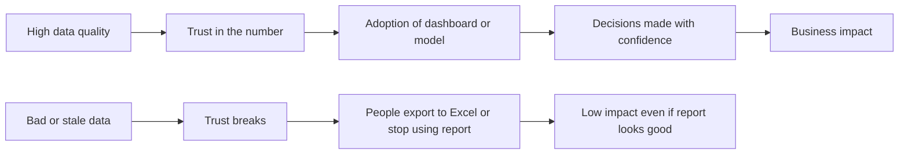
### 🔍 Plain-English deep-dive: why trust matters more than features
- **Quality** means the data is fit for the decision it supports.
- **Trust** means a stakeholder believes your number without first opening five source systems to double-check it.
- **Adoption** means people use the report, metric, or model in real workflows, not only in demos.
- **Impact** means a business outcome changed because the analytics influenced action.
**Analogy:**
Think of a GPS app.
If it gives you one obviously wrong route, you start second-guessing every future route.
The issue is not only one bad route.
The issue is the loss of trust.
In BI teams, the same pattern happens.
One incorrect KPI in a leadership review can make users treat every future chart with suspicion.
| If quality is strong | If quality is weak |
|---|---|
| Leaders ask deeper questions | Leaders question whether the numerator is even correct |
| Self-serve usage grows | People recreate metrics offline |
| Analysts spend time on insights | Analysts spend time defending numbers |
| Teams align around one story | Teams argue over whose number is right |
| Analytics influences action | Analytics becomes decoration |
> 💡 **Tie-in to your background:** In support escalation work, credibility came from being consistently right, timely, and evidence-based under pressure. Data quality is the same professional reputation, translated into numbers instead of case updates.
---
## 1. The end-to-end picture: quality, governance, and measurement are one system
Beginners often think of these as three separate topics.
They are not.
They form one operating system for trustworthy analytics.
- **Data quality** checks whether the data is usable.
- **Data governance** decides who owns definitions, standards, access, and accountability.
- **Measurement** proves whether the analytics product actually created value.
You can think of them like building, running, and judging a hospital.
Quality checks whether the medicine is safe.
Governance decides who approves procedures and who can access patient records.
Measurement asks whether patients actually got better.
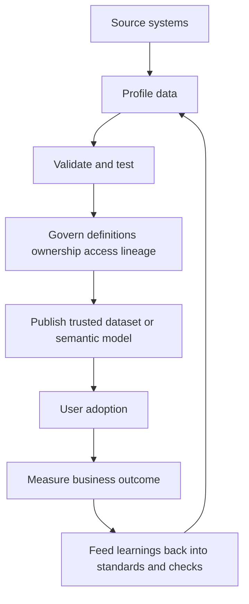
### 🔍 Plain-English deep-dive: the lifecycle mindset
- **Build** quality into the pipeline before the report is published.
- **Govern** the meaning of data so two teams do not define the same metric differently.
- **Observe** the pipeline so freshness, schema, and volume issues are caught quickly.
- **Measure** whether the analytics changed behavior or outcomes.
A mature BI team does not say, "The dashboard is done."
A mature BI team says, "The dashboard is trusted, governed, adopted, and measurably useful."
| Layer | Main question | Example in CE&S support analytics |
|---|---|---|
| Quality | "Is the data correct and fresh?" | Are case volumes complete and refreshed by morning review time? |
| Governance | "Are definitions and access controlled?" | Is "escalation" defined once and owned by the right domain lead? |
| Measurement | "Did this analysis change outcomes?" | Did the alert dashboard reduce breach risk or escalations? |
> 💡 **Tie-in to your background:** This is very similar to support operations. A process is only useful if it is accurate, owned, repeatable, monitored, and proven to improve service outcomes.
---
## 2. Data quality dimensions: the language of trustworthy data
Interviewers often ask for data quality dimensions because the answer reveals whether you think systematically.
The classic set includes:
accuracy,
completeness,
consistency,
timeliness,
validity,
and uniqueness.
For a stronger answer, add:
integrity,
conformity,
and precision.
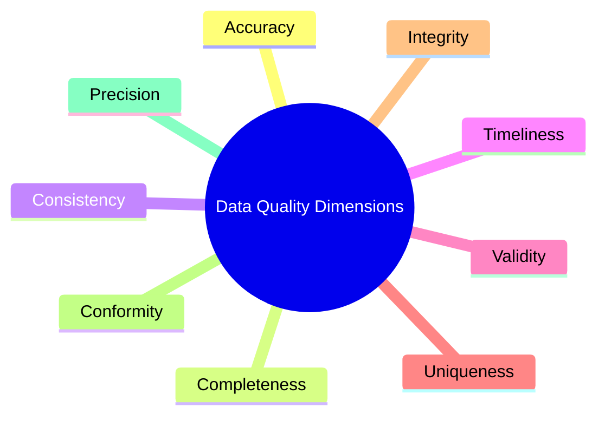
| Dimension | Plain-English question |
|---|---|
| Accuracy | Does the value reflect reality? |
| Completeness | Is anything required missing? |
| Consistency | Do systems and fields agree with each other? |
| Timeliness | Is the data fresh enough for the decision? |
| Validity | Does the value obey allowed rules and formats? |
| Uniqueness | Is each business entity represented once where expected? |
| Integrity | Do relationships between tables remain valid? |
| Conformity | Does the data follow the agreed standard and taxonomy? |
| Precision | Is the value recorded at the right level of detail? |
The best way to learn them is not by memorising definitions.
It is by attaching each one to a concrete check.
## 2.1. Accuracy
Accuracy asks whether the recorded value matches the real-world fact it represents.
### 🔍 Plain-English deep-dive: Accuracy
- **Meaning** — Accuracy asks whether the recorded value matches the real-world fact it represents.
- **Analogy** — A bathroom scale is accurate if it shows your real weight, not simply a tidy-looking number.
- **Why it matters** — If accuracy is weak, every downstream average, trend, and forecast becomes suspicious.
**Support-data example**
- A support case marked as 'Resolved' even though the customer reopened it the same day is an accuracy issue.
- A CSAT score tied to the wrong ticket or product is another classic accuracy failure.
**Concrete check**
| Item | Example |
|---|---|
| Check | Reconcile survey-case mapping to certified source |
| Business rule | Resolved cases should align to actual workflow outcome |
| Typical signal | Unexpected mismatch counts after joins |
```sql
SELECT *
FROM fact_cases
WHERE survey_case_id IS NOT NULL
  AND survey_case_id <> case_id;
```
```python
mismatched = df[df['survey_case_id'].notna() & (df['survey_case_id'] != df['case_id'])]
assert mismatched.empty, 'Survey linked to wrong case'
```
**Power Query / Power BI angle**
- Compare merged keys after joining survey data to cases and flag rows where the joined case identifier does not match the expected case identifier.
- Surface the result as a simple pass/fail or exception count so non-technical stakeholders can understand the issue quickly.
## 2.2. Completeness
Completeness asks whether required data is present.
### 🔍 Plain-English deep-dive: Completeness
- **Meaning** — Completeness asks whether required data is present.
- **Analogy** — A passport form with blank mandatory fields is incomplete even if every filled field is correct.
- **Why it matters** — Missing values break grouping, filtering, and root-cause analysis.
**Support-data example**
- If closed cases are missing resolution timestamps, average resolution time becomes biased or impossible to compute.
- If product family is blank for a large share of cases, product-level quality analysis becomes misleading.
**Concrete check**
| Item | Example |
|---|---|
| Check | Null-rate threshold by required column |
| Business rule | Closed case must have close date |
| Typical signal | Spiking null percentage after upstream schema change |
```sql
SELECT
    COUNT(*) AS total_rows,
    SUM(CASE WHEN resolution_datetime IS NULL THEN 1 ELSE 0 END) AS missing_resolution_datetime,
    SUM(CASE WHEN product_family IS NULL THEN 1 ELSE 0 END) AS missing_product_family
FROM fact_cases;
```
```python
required_cols = ['case_id', 'product_family', 'resolution_datetime']
missing_pct = df[required_cols].isna().mean().sort_values(ascending=False)
print(missing_pct)
```
**Power Query / Power BI angle**
- Use Column quality and Column distribution in Power Query to surface empty, null, and error percentages before the data is loaded.
- Surface the result as a simple pass/fail or exception count so non-technical stakeholders can understand the issue quickly.
> 💡 **Tie-in to your background:** In escalation work, missing evidence, broken handoffs, or the wrong level of detail can delay root cause analysis. Completeness is the data equivalent of preventing those operational gaps.
## 2.3. Consistency
Consistency asks whether the same concept is represented the same way across fields, files, and systems.
### 🔍 Plain-English deep-dive: Consistency
- **Meaning** — Consistency asks whether the same concept is represented the same way across fields, files, and systems.
- **Analogy** — If one calendar says the meeting is at 9 and another says 10, the problem is inconsistency, not missing data.
- **Why it matters** — Inconsistent labels create fake categories, broken joins, and conflicting totals.
**Support-data example**
- One system storing region as 'EMEA' and another as 'Europe, Middle East & Africa' creates reporting drift unless standardised.
- Severity values like 'High', 'H', and 'P1' may refer to the same concept but fragment the analysis.
**Concrete check**
| Item | Example |
|---|---|
| Check | Distinct value audit for key categorical fields |
| Business rule | Approved taxonomy list only |
| Typical signal | Multiple spellings of same category |
```sql
SELECT DISTINCT region
FROM dim_region_source
ORDER BY region;
```
```python
print(df['region'].astype(str).str.strip().value_counts(dropna=False).head(20))
```
**Power Query / Power BI angle**
- Trim whitespace, standardise casing, and map synonyms through a reference table instead of hardcoding replacements in many reports.
- Surface the result as a simple pass/fail or exception count so non-technical stakeholders can understand the issue quickly.
## 2.4. Timeliness
Timeliness asks whether the data arrives early enough for the decision window.
### 🔍 Plain-English deep-dive: Timeliness
- **Meaning** — Timeliness asks whether the data arrives early enough for the decision window.
- **Analogy** — A weather forecast that is perfectly correct yesterday is useless for deciding what to wear today.
- **Why it matters** — Even accurate data loses value if it arrives after the meeting, alert window, or operational decision point.
**Support-data example**
- A support operations dashboard refreshed at noon may be too late for the 8 AM command review.
- A backlog KPI delayed by two days hides emerging risk until the issue is bigger and harder to address.
**Concrete check**
| Item | Example |
|---|---|
| Check | Hours since last successful refresh |
| Business rule | Daily dataset ready by 06:00 local business time |
| Typical signal | Staleness exceeds agreed SLA |
```sql
SELECT
    MAX(load_datetime_utc) AS latest_load_utc,
    DATEDIFF(hour, MAX(load_datetime_utc), SYSUTCDATETIME()) AS hours_since_load
FROM fact_cases;
```
```python
max_ts = df['load_datetime_utc'].max()
hours_stale = (pd.Timestamp.utcnow().tz_localize(None) - max_ts).total_seconds() / 3600
print(hours_stale)
```
**Power Query / Power BI angle**
- Store and surface a last refresh timestamp in the model and expose it on the report so users can immediately judge freshness.
- Surface the result as a simple pass/fail or exception count so non-technical stakeholders can understand the issue quickly.
## 2.5. Validity
Validity asks whether the value follows allowed formats, ranges, and business rules.
### 🔍 Plain-English deep-dive: Validity
- **Meaning** — Validity asks whether the value follows allowed formats, ranges, and business rules.
- **Analogy** — A form asking for a date should not accept 'blue' as an answer.
- **Why it matters** — Invalid data often signals pipeline bugs, bad user entry, or broken transformations.
**Support-data example**
- CSAT should stay in an agreed range such as 1 to 5.
- Negative resolution hours or impossible dates are validity failures.
**Concrete check**
| Item | Example |
|---|---|
| Check | Range, format, and accepted value checks |
| Business rule | Allowed severity set only |
| Typical signal | Out-of-range numeric values or invalid dates |
```sql
SELECT *
FROM fact_cases
WHERE csat_score IS NOT NULL
  AND (csat_score < 1 OR csat_score > 5 OR resolution_hours < 0);
```
```python
assert df['csat_score'].dropna().between(1, 5).all(), 'Invalid CSAT value found'
assert (df['resolution_hours'].dropna() >= 0).all(), 'Negative duration found'
```
**Power Query / Power BI angle**
- Set correct data types early and profile error rows; type conversion errors are often the first visible sign of invalid values.
- Surface the result as a simple pass/fail or exception count so non-technical stakeholders can understand the issue quickly.
## 2.6. Uniqueness
Uniqueness asks whether the same real-world entity appears only once where one record is expected.
### 🔍 Plain-English deep-dive: Uniqueness
- **Meaning** — Uniqueness asks whether the same real-world entity appears only once where one record is expected.
- **Analogy** — Counting the same person twice in a headcount report makes the total look larger than reality.
- **Why it matters** — Duplicates inflate totals, distort rates, and create false confidence in volume trends.
**Support-data example**
- One support case should usually appear once in the fact table grain chosen for the dashboard.
- Duplicate rows after joining case snapshots to survey records can double-count incidents or responses.
**Concrete check**
| Item | Example |
|---|---|
| Check | Duplicate business-key audit |
| Business rule | One row per agreed grain |
| Typical signal | Join explosions or duplicate late-arriving records |
```sql
SELECT case_id, COUNT(*) AS row_count
FROM fact_cases
GROUP BY case_id
HAVING COUNT(*) > 1;
```
```python
dupes = df[df.duplicated(subset=['case_id'], keep=False)].sort_values('case_id')
assert dupes.empty, 'Duplicate case_id rows found'
```
**Power Query / Power BI angle**
- Use Group By on the business key to detect duplicate counts before the final load step.
- Surface the result as a simple pass/fail or exception count so non-technical stakeholders can understand the issue quickly.
## 2.7. Integrity
Integrity asks whether relationships between datasets remain logically valid.
### 🔍 Plain-English deep-dive: Integrity
- **Meaning** — Integrity asks whether relationships between datasets remain logically valid.
- **Analogy** — A child page reference to a book that does not exist in the library catalogue is a relationship integrity problem.
- **Why it matters** — Broken relationships create orphan facts, incomplete dimensions, and misleading slicers.
**Support-data example**
- Every case record should map to a valid product, customer, and date dimension value if the model expects those relationships.
- A product_key in fact_cases that does not exist in dim_product means product totals may disappear or land in unknown buckets.
**Concrete check**
| Item | Example |
|---|---|
| Check | Foreign-key relationship test |
| Business rule | All fact keys must resolve to dimension values |
| Typical signal | Blank or unknown category buckets in reports |
```sql
SELECT f.product_key
FROM fact_cases f
LEFT JOIN dim_product d
    ON f.product_key = d.product_key
WHERE d.product_key IS NULL;
```
```python
orphan_keys = set(df_fact['product_key'].dropna()) - set(df_dim['product_key'].dropna())
assert not orphan_keys, 'Orphan product keys detected'
```
**Power Query / Power BI angle**
- Check referential integrity during model design and investigate unmatched rows when merging reference data into transactional data.
- Surface the result as a simple pass/fail or exception count so non-technical stakeholders can understand the issue quickly.
> 💡 **Tie-in to your background:** In escalation work, missing evidence, broken handoffs, or the wrong level of detail can delay root cause analysis. Integrity is the data equivalent of preventing those operational gaps.
## 2.8. Conformity
Conformity asks whether data follows the agreed enterprise standard, naming rule, and taxonomy.
### 🔍 Plain-English deep-dive: Conformity
- **Meaning** — Conformity asks whether data follows the agreed enterprise standard, naming rule, and taxonomy.
- **Analogy** — A school uniform is not about personal taste; it is about everyone following the same standard so the institution functions predictably.
- **Why it matters** — Conformity is what lets many teams combine data without constantly renegotiating meanings.
**Support-data example**
- If every support channel uses the same severity taxonomy and region hierarchy, cross-team analytics becomes much easier.
- One team using 'Commercial' while another uses 'Enterprise Sales' for the same customer segment breaks comparison.
**Concrete check**
| Item | Example |
|---|---|
| Check | Allowed-taxonomy conformance test |
| Business rule | Use enterprise-approved labels and hierarchies |
| Typical signal | Home-grown categories created in local files |
```sql
SELECT DISTINCT severity_label
FROM fact_cases
WHERE severity_label NOT IN ('Low','Medium','High','Critical');
```
```python
approved = {'Low', 'Medium', 'High', 'Critical'}
nonconforming = sorted(set(df['severity_label'].dropna()) - approved)
print(nonconforming)
```
**Power Query / Power BI angle**
- Join to an approved reference list so nonconforming values are surfaced as exceptions instead of silently passing through.
- Surface the result as a simple pass/fail or exception count so non-technical stakeholders can understand the issue quickly.
## 2.9. Precision
Precision asks whether a value is captured at the right level of detail or granularity.
### 🔍 Plain-English deep-dive: Precision
- **Meaning** — Precision asks whether a value is captured at the right level of detail or granularity.
- **Analogy** — A map of an entire country is useful for planning a road trip, but not for navigating the final street turn.
- **Why it matters** — Too little detail hides important patterns; too much detail may create false accuracy or privacy risk.
**Support-data example**
- Storing only the month of resolution may be enough for strategy review but not enough for daily queue management.
- Rounding handle time to whole hours can erase meaningful differences between queues.
**Concrete check**
| Item | Example |
|---|---|
| Check | Granularity fit-for-purpose review |
| Business rule | Capture enough detail for operational use without oversharing sensitive data |
| Typical signal | Rounded values hide actual process variation |
```sql
SELECT TOP 20 resolution_hours, resolution_minutes
FROM fact_cases
WHERE resolution_hours = ROUND(resolution_hours, 0)
  AND resolution_minutes IS NULL;
```
```python
granularity_check = df['event_datetime'].dt.floor('D').eq(df['event_datetime']).mean()
print(f'Share of date-only timestamps: {granularity_check:.2%}')
```
**Power Query / Power BI angle**
- Decide deliberately whether date, datetime, minute-level, or second-level precision is required for the use case before designing the model.
- Surface the result as a simple pass/fail or exception count so non-technical stakeholders can understand the issue quickly.
> 💡 **Tie-in to your background:** In escalation work, missing evidence, broken handoffs, or the wrong level of detail can delay root cause analysis. Precision is the data equivalent of preventing those operational gaps.
---
## 3. Data profiling: learning the shape of the data before trusting it
**Data profiling** means systematically examining a dataset to understand what is inside it before you rely on it.
It is the first serious conversation you have with a new dataset.
Profiling answers questions like:
- Which columns have nulls?
- Which categories exist?
- What ranges do numeric fields have?
- Which keys are duplicated?
- Which relationships look suspicious?
- Which patterns changed since yesterday?
**Analogy:**
Before buying a used car, you do not only admire the paint.
You inspect mileage, service history, warning lights, tyre wear, and accident signs.
Profiling is that inspection step for data.

### 3.1 Column profiling
Column profiling looks at one field at a time.
Typical checks:
- data type
- null count
- distinct count
- min and max
- mean and standard deviation for numeric fields
- most common values for categorical fields
- pattern checks for IDs or codes
**Example questions for support data**
- How many case IDs are null?
- Which severity values appear most often?
- Are there impossible negative resolution durations?
- Are there suspicious future timestamps?
```sql
SELECT
    COUNT(*) AS total_rows,
    COUNT(case_id) AS non_null_case_id,
    COUNT(DISTINCT case_id) AS distinct_case_id,
    MIN(resolution_hours) AS min_resolution_hours,
    MAX(resolution_hours) AS max_resolution_hours,
    AVG(resolution_hours) AS avg_resolution_hours
FROM fact_cases;
```
```python
profile = df[['resolution_hours', 'csat_score']].describe(include='all').T
profile['null_pct'] = df[['resolution_hours', 'csat_score']].isna().mean()
print(profile)
```
In Power Query, Column quality, Column distribution, and Column profile provide a quick visual read on nulls, unique values, and errors.
### 3.2 Cross-column profiling
Cross-column profiling looks for relationships within the same table.
This matters because many problems are not visible when each column is checked alone.
Examples:
- close_datetime should be later than open_datetime
- cases marked Closed should have a close reason
- high severity cases should not have null incident managers if the process requires one
- survey_sent_flag should align with survey_date presence
```sql
SELECT *
FROM fact_cases
WHERE close_datetime < open_datetime
   OR (status = 'Closed' AND close_reason IS NULL)
   OR (survey_sent_flag = 1 AND survey_date IS NULL);
```
```python
assert (df['close_datetime'] >= df['open_datetime']).all(), 'Close before open detected'
assert df.loc[df['status'].eq('Closed'), 'close_reason'].notna().all(), 'Closed case missing close reason'
```
### 3.3 Cross-table profiling
Cross-table profiling checks how datasets align with one another.
Examples:
- Do all product keys in the case fact exist in the product dimension?
- Do daily totals in the report match the totals in the certified source system?
- Do survey records join cleanly to case records?
- Did the new extract suddenly drop a region that existed yesterday?
```sql
SELECT COUNT(*) AS orphan_case_products
FROM fact_cases f
LEFT JOIN dim_product d
  ON f.product_key = d.product_key
WHERE d.product_key IS NULL;
```
### 🔍 Plain-English deep-dive: profiling levels compared
| Profiling level | Main purpose | Example |
|---|---|---|
| Column | Understand one field | Null rate in product_family |
| Cross-column | Validate logic within a table | Closed case must have close date |
| Cross-table | Validate relationships and reconciliation | fact_cases product_key must exist in dim_product |
### 3.4 Profiling in SQL, pandas, and Power Query
| Tool | Best for | Strength | Example use |
|---|---|---|---|
| SQL | Large tables in the warehouse | Fast aggregation close to the data | Distinct counts, duplicates, orphan keys |
| pandas | Exploratory profiling and custom checks | Flexible analysis with code | Pattern checks, ad hoc anomaly review |
| Power Query | Analyst-friendly visual data shaping | Quick visual quality signals | Nulls, errors, transformations before model load |
### 3.5 A practical profiling workflow
1. Start with schema and row count.
2. Check nulls, distinct counts, ranges, and top values.
3. Identify business-key uniqueness.
4. Test obvious cross-column rules.
5. Test joins to reference and dimension tables.
6. Compare totals to a trusted source.
7. Write down discovered assumptions.
8. Convert stable findings into automated tests.
### 3.6 Why profiling is more than a one-time setup task
Profiling is not only for onboarding a new dataset.
It should also run continuously.
Why?
Because data drifts.
Categories change.
Source systems evolve.
Users invent new free-text variants.
Pipelines break.
Business processes change.
A data source that was clean last quarter can be risky this quarter.
> 💡 **Tie-in to your background:** This is like checking recurring incident patterns in support. You do not assume a service is healthy forever just because it was healthy last month. You monitor, inspect, and update runbooks as reality changes.
---
## 4. Data validation and testing: making quality enforceable
Profiling helps you discover issues.
Validation and testing make sure those issues are blocked from quietly returning.
### 4.1 Assertions: the simplest form of data test
An **assertion** is a statement that must be true.
If it is false, the process should raise a visible failure.
Examples:
- every case_id is unique
- csat_score is between 1 and 5
- close_datetime is not earlier than open_datetime
- refresh must complete before 06:00 UTC
```python
assert df['case_id'].is_unique, 'Duplicate case IDs found'
assert df['csat_score'].dropna().between(1, 5).all(), 'Invalid CSAT score found'
assert (df['close_datetime'] >= df['open_datetime']).all(), 'Negative lifecycle detected'
```
### 🔍 Plain-English deep-dive: why assertions matter
- Assertions remove ambiguity.
- They turn "we should check that" into a repeatable control.
- They make failure loud instead of silent.
**Analogy:**
A smoke detector is an assertion for a building.
It does not discuss whether there might be smoke.
It triggers when the rule is violated.
### 4.2 Unit, integration, and end-to-end tests for data
| Test type | What it checks | Example |
|---|---|---|
| Unit test | One transformation or rule in isolation | A function that standardises severity labels |
| Integration test | Whether multiple pipeline steps work together | Raw cases join cleanly with product dimension and survey table |
| End-to-end test | Whether the entire published output is trustworthy | Dashboard total matches warehouse total and refresh timestamp is current |

### 4.3 Common test categories in analytics engineering
- **Schema tests** — correct columns and types exist.
- **Null tests** — required fields are populated.
- **Uniqueness tests** — keys are not duplicated.
- **Relationship tests** — foreign keys resolve.
- **Accepted value tests** — only approved categories appear.
- **Range tests** — measures stay within sensible thresholds.
- **Freshness tests** — data loaded recently enough.
- **Reconciliation tests** — outputs align to certified totals.
### 4.4 dbt tests in plain English
**dbt** stands for data build tool.
It is widely used to transform data in warehouses and attach tests directly to models.
Common built-in dbt tests:
- `not_null`
- `unique`
- `relationships`
- `accepted_values`
Example dbt YAML:
```yaml
models:
  - name: fact_cases
    columns:
      - name: case_id
        tests:
          - not_null
          - unique
      - name: severity_label
        tests:
          - accepted_values:
              values: ['Low', 'Medium', 'High', 'Critical']
      - name: product_key
        tests:
          - relationships:
              to: ref('dim_product')
              field: product_key
```
You do not need to be a dbt specialist to explain the concept.
In interviews, saying "I like tests close to the transformation logic so the pipeline fails before bad data reaches reports" already communicates maturity.
### 4.5 Great Expectations in plain English
**Great Expectations** is a framework for describing what good data should look like.
Examples of expectations:
- expect case_id to be unique
- expect row count not to fall more than 20% from yesterday
- expect csat_score to be between 1 and 5
- expect product_family to be in an approved set
Why teams like it:
- expectations are readable
- failures can produce data docs and alerts
- it bridges technical checks and business-readable quality rules
### 4.6 Fabric and Power BI quality checks
In Microsoft-centric environments, quality checks may happen in several places:
- **Data Factory / pipelines** can enforce step-level success, schema expectations, and refresh sequencing.
- **Lakehouse or warehouse SQL** can run profiling and reconciliation queries.
- **Power BI semantic models** can expose refresh timestamps, exception counts, and certified measures.
- **Dataflows / Power Query** can surface column quality, errors, and transformation failures before load.
- **Deployment pipelines** can separate dev, test, and production promotion paths.
A practical pattern is to keep core checks upstream and only lightweight user-facing signals in the BI layer.
### 4.7 Reconciliation and control totals
**Reconciliation** means comparing your result to a trusted source.
Examples:
- case count in gold table vs case count in source extract
- total backlog in semantic model vs approved operations snapshot
- total survey responses in dashboard vs survey platform export
**Control totals** are the specific counts or sums used for the comparison.
Examples of control totals:
- row counts
- revenue totals
- case counts by date
- distinct customer counts
- number of late cases
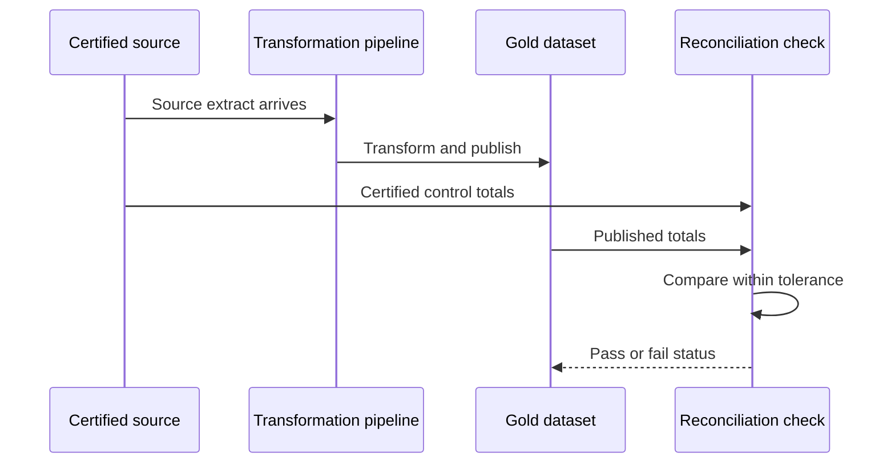
### 4.8 Tolerances: when exact matching is unrealistic
Not every reconciliation should be a hard exact match.
Small differences may be acceptable when caused by:
- rounding
- late-arriving records within a known window
- timezone cutoff differences
- minor expected lag between operational and analytical systems
That is why teams define **tolerances**.
Examples:
- CSAT average must match within plus or minus 0.01
- daily count difference must be less than 0.5%
- revenue difference must be less than 10 currency units due to rounding
The key is not to choose a loose tolerance for comfort.
The key is to choose a justified tolerance for the business context.
### 4.9 A quality gate pattern
A **quality gate** blocks publication if critical checks fail.
| Check class | Example | Action if failed |
|---|---|---|
| Critical | Duplicate business keys, broken dimensions, stale dataset | Stop publish and page owner |
| High | Major null spike, major volume drop | Stop publish or quarantine |
| Medium | New category value, small mismatch | Publish with warning and log incident |
| Low | Cosmetic naming issue | Create backlog item |
### 4.10 Data tests as operational controls
A good answer in an interview is not only "I would validate the data."
A stronger answer is:
"I would define critical tests, attach severity, set thresholds, and make the publish step conditional on passing those tests. I would also reconcile to a certified source and expose refresh status so users see both the metric and its freshness."
> 💡 **Tie-in to your background:** Escalation engineers rely on checklists, evidence gates, and go/no-go criteria before communicating customer-impacting conclusions. Data validation is the same discipline applied to pipelines and metrics.
---
## 5. Data observability: seeing pipeline health before stakeholders do
**Data observability** means monitoring data systems so you notice issues quickly, understand impact, and respond before users lose trust.
Traditional monitoring asks, "Did the job run?"
Data observability asks, "Did the data still look healthy after the job ran?"
### 5.1 The five common observability pillars
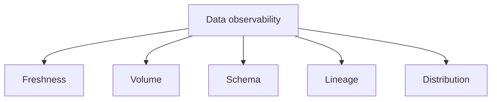
#### Freshness
Freshness asks whether data arrived on time.
Example checks:
- time since last successful load
- arrival delay by source system
- SLA compliance for morning dashboards
#### Volume
Volume asks whether the amount of data changed unexpectedly.
Example checks:
- row count vs yesterday
- case count by region vs 7-day average
- survey submissions vs historical baseline
#### Schema
Schema asks whether columns, types, or structure changed.
Example checks:
- missing column in source file
- integer changed to string
- new nested field introduced without downstream mapping
#### Lineage
Lineage asks what downstream assets depend on the broken object.
Example checks:
- which reports depend on this table?
- which dashboards will be stale if this pipeline fails?
- which business owners should be notified?
#### Distribution
Distribution asks whether the statistical shape of data changed.
Example checks:
- average resolution hours jumped unexpectedly
- severity mix shifted far outside normal band
- share of unknown categories spiked
### 🔍 Plain-English deep-dive: why observability is different from normal IT monitoring
- A green pipeline job can still produce bad data.
- A successful refresh can still load only half the rows.
- A dataset can be fresh but wrong.
**Analogy:**
A plane taking off on time does not prove it landed in the right city.
Operational success and outcome correctness are different things.
### 5.2 Anomaly detection and alerting
An **anomaly** is a change that is unusual enough to deserve attention.
Common anomaly examples in support analytics:
- case volume drops 80% overnight
- one product suddenly goes from 10% to 70% of all escalations
- null rate in incident manager jumps from 1% to 35%
- schema changed and many records now fail parsing
Alerting works best when it is:
- threshold-based for simple critical rules
- trend-aware for expected seasonality
- routed to the right owner
- prioritised so teams do not ignore alert noise
### 5.3 SLIs, SLAs, and SLOs for data
These terms sound intimidating, but the ideas are simple.
| Term | Meaning in plain English | Example |
|---|---|---|
| SLI | The metric you track | Hours since last refresh |
| SLO | The target you aim to meet | 99% of daily refreshes complete by 06:00 UTC |
| SLA | The formal promise, often customer-facing or stakeholder-facing | Executive scorecard ready by 07:00 with agreed freshness |
A good BI team defines data SLOs just like an engineering team defines service reliability targets.
### 5.4 Data quality scorecards
A **scorecard** summarises health in business-friendly language.
Example scorecard columns:
- dataset name
- owner
- freshness status
- row count variance
- null-rate status
- key test pass rate
- last incident
- overall quality score
| Dataset | Owner | Freshness | Volume | Schema | Distribution | Overall |
|---|---|---|---|---|---|---|
| Daily case operations | Support BI | Green | Green | Green | Amber | 92/100 |
| CSAT survey feed | VOC team | Amber | Green | Green | Green | 85/100 |
| Product hierarchy | MDM team | Green | Green | Red | Green | 70/100 |
### 5.5 Incident response for data issues
A mature response looks like this:
1. detect the issue
2. classify severity
3. assess impacted assets through lineage
4. notify owners and consumers
5. contain or quarantine bad output
6. fix root cause
7. backfill or republish if needed
8. document the lesson in controls or standards
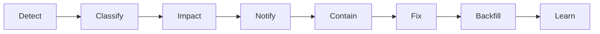
### 5.6 Designing alerts that people actually respect
Bad alert design creates fatigue.
Good alert design creates action.
Good practices:
- reserve paging for truly critical issues
- group related symptoms into one incident
- include expected vs actual values
- include lineage-based impacted assets
- include owner and runbook link
- include clear next action
### 5.7 Observability in a Microsoft-heavy ecosystem
In a Microsoft environment, observability may combine:
- Fabric or pipeline run status
- SQL-based freshness and reconciliation checks
- Power BI refresh status and usage metrics
- Purview lineage for impact analysis
- Teams or email alerts for incident routing
> 💡 **Tie-in to your background:** Data observability is extremely close to support monitoring and incident triage. Your experience distinguishing symptom from root cause is directly valuable here.
---
## 6. Data governance: the rules of the road for data
**Data governance** is the system of decision rights, accountability, policies, standards, and processes that keeps data consistent, secure, and useful across the organisation.
It answers questions like:
- Who owns this dataset?
- Who can approve a metric definition change?
- Which taxonomy is official?
- Which data is sensitive?
- Who may access customer-level details?
- What happens when quality rules fail?
### 🔍 Plain-English deep-dive: what governance is and is not
- **Governance is not** random bureaucracy for its own sake.
- **Governance is** controlled consistency so that many teams can safely work from the same information.
- **Governance is not** one document nobody reads.
- **Governance is** roles, policies, operating routines, and tooling that people actually use.
**Analogy:**
Traffic rules do not exist because society loves paperwork.
They exist so many drivers can share roads safely and predictably.
Governance does the same for data.
### 6.1 Core governance components
- policies
- standards
- roles and accountability
- issue management
- metadata and cataloguing
- access and privacy controls
- lifecycle and retention rules
- training and adoption
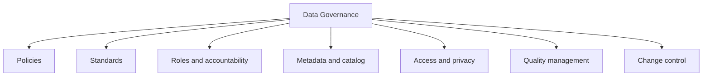
### 6.2 Why governance matters for BI teams specifically
BI teams often sit at the junction of many domains.
That means they suffer first when definitions conflict.
Without governance:
- one team defines active customer differently from another
- business users create local spreadsheets with renamed categories
- sensitive customer data leaks into overly broad access
- analysts waste time debating definitions instead of producing insight
With governance:
- metrics are owned and approved
- datasets are catalogued
- taxonomies are standardised
- access follows business need
- lineage supports change and incident analysis
- trusted self-service becomes possible
> 💡 **Tie-in to your background:** Your CV strengths in operational governance, compliance, and risk management map naturally here. A strong interview translation is: "I bring a governance mindset already; in data that means controlled definitions, ownership, risk-aware access, and measurable quality controls."
---
## 7. Governance operating models: centralized, decentralized, and federated
Different organisations govern data in different ways.
The best model depends on scale, domain complexity, and decision speed.
### 7.1 Centralized governance
A central data team defines most standards, controls, and approvals.
**Strengths**
- high consistency
- easier enterprise-wide standards
- simpler control over tooling and taxonomy
**Weaknesses**
- can become bottlenecked
- domain nuance may be lost
- slower local decisions
### 7.2 Decentralized governance
Each domain governs its own data with minimal central coordination.
**Strengths**
- high domain ownership
- faster local decisions
- teams feel accountable for their own data
**Weaknesses**
- standards drift easily
- duplicate work grows
- enterprise reporting becomes harder
### 7.3 Federated governance
A shared central framework exists, but domain teams own their data within that framework.
This is common in large enterprises because it balances consistency with domain expertise.
**Central team usually owns**
- enterprise policies
- naming standards
- catalog tooling
- security principles
- cross-domain metric approval process
**Domain teams usually own**
- business definitions within their domain
- quality rules close to the source
- data stewardship
- operational issue resolution
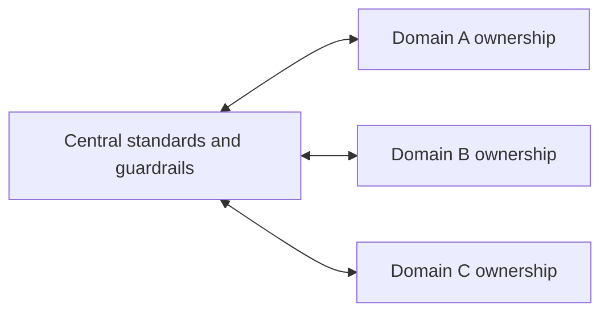
### 🔍 Plain-English deep-dive: which model often fits large Microsoft-style environments?
A purely centralized model struggles when business domains move quickly.
A purely decentralized model struggles when leadership needs one enterprise story.
That is why a **federated** model is often strongest.
It says:
- define the roads centrally
- let domains drive on them responsibly
### 7.4 Comparison table
| Model | Best when | Main risk | Good interview framing |
|---|---|---|---|
| Centralized | Regulation and consistency dominate | Slow decisions | Good for enterprise standards and core metric control |
| Decentralized | Domains are highly independent | Metric drift and duplication | Good for speed but harder for shared reporting |
| Federated | Large organisations need both control and flexibility | Requires strong role clarity | Best balance for many modern BI organisations |
### 7.5 What to say in an interview
A strong answer is:
"I prefer a federated model for large organisations: central standards for taxonomy, metric approval, cataloguing, and privacy controls; domain ownership for business rules, stewardship, and issue response. That preserves consistency without disconnecting from real business context."
---
## 8. DAMA-DMBOK overview: the big map of data management
**DAMA-DMBOK** stands for Data Management Body of Knowledge.
It is a well-known framework that organises the major areas of data management.
You do not need to memorise every detail.
But knowing the map helps you sound structured and mature.
### 8.1 The knowledge areas in plain English
| Knowledge area | Plain-English meaning | Why a BI analyst should care |
|---|---|---|
| Data governance | Decision rights, policies, accountability | Ensures consistent ownership and standards |
| Data architecture | How data systems fit together | Influences where and how data should flow |
| Data modeling and design | How entities and relationships are structured | Affects reporting usability and semantic clarity |
| Data storage and operations | How data is stored, processed, backed up | Affects reliability and performance |
| Data security | Confidentiality, integrity, access control | Critical for customer and support data |
| Data integration and interoperability | Moving and combining data across systems | Core to BI pipelines |
| Documents and content | Managing unstructured information | Useful where case notes or KB content matters |
| Reference and master data | Shared entities and codes | Supports conformed dimensions and standard categories |
| Data warehousing and BI | Reporting, analytics, semantic layers | Your direct home turf |
| Metadata | Data about data | Enables cataloging, glossary, and lineage |
| Data quality | Assessing and improving fitness for use | Underpins trust and adoption |
### 8.2 Why DMBOK is useful in interviews
It gives you a vocabulary for showing that you understand data work as an operating system, not only as dashboard creation.
Example framing:
"I think of BI not just as report building but as a combination of data quality, metadata, governance, master data, security, and measurement. That lens aligns well with DMBOK."
### 8.3 How this Part maps to DMBOK
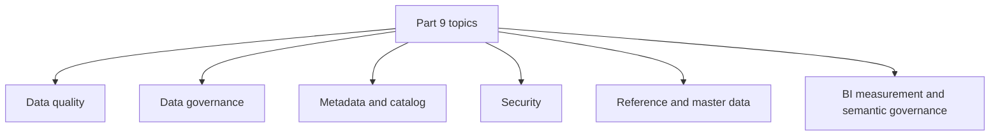
### 8.4 DMBOK as a maturity signal
Mentioning DMBOK does not mean you need to sound academic.
It simply tells the interviewer:
- you know there are established practices in data management
- you can place your work in a broader framework
- you understand that analytics quality depends on more than a single report build
> 💡 **Tie-in to your background:** Think of DMBOK like an operations excellence framework. In support, you do not only manage tickets; you also think about process, controls, knowledge, ownership, and escalation. DMBOK is that broader map for data.
---
## 9. Policies, standards, and processes: how governance becomes real work
A governance programme becomes useful only when its principles are translated into working controls.
### 9.1 Policy vs standard vs process
| Term | Plain-English meaning | Example |
|---|---|---|
| Policy | High-level rule or principle | Sensitive support data must be access-controlled and classified |
| Standard | Specific required way of doing something | Region taxonomy must use the enterprise-approved hierarchy |
| Process | Repeatable workflow for applying the rule | Metric definition changes require owner approval and release notes |
### 9.2 Typical governance policies for analytics
- data classification policy
- access control policy
- retention and deletion policy
- approved metric definition policy
- issue escalation policy for data incidents
- testing and reconciliation policy before publication
### 9.3 Typical data standards
- naming conventions for datasets and measures
- timestamp timezone standards
- approved taxonomies and code lists
- required metadata fields in the catalog
- minimum test coverage for production datasets
- refresh timestamp visibility on user-facing reports
### 9.4 Typical repeatable processes
- onboarding a new dataset
- approving a new KPI definition
- handling a data incident
- certifying a dataset for self-service use
- reviewing access rights quarterly
- managing schema changes with downstream impact analysis
### 🔍 Plain-English deep-dive: why standards matter more than heroics
When organisations lack standards, success depends on who happened to build the report.
One analyst trims whitespace.
Another does not.
One uses UTC.
Another uses local time.
One excludes test cases.
Another forgets.
That is not scalable.
Standards remove avoidable variation.
They convert personal habits into team reliability.
### 9.5 A simple governance document set
A practical BI governance stack might include:
- business glossary
- data dictionary
- metric catalog
- dataset certification criteria
- data incident severity matrix
- data access model
- change control template
The goal is not to create endless documents.
The goal is to capture enough shared rules that quality no longer depends on memory.
---
## 10. Ownership, stewardship, custody, and RACI
One of the fastest ways to expose weak governance is to ask:
"Who owns this metric?"
If nobody knows, governance is weak.
### 10.1 Key roles in plain English
#### Data owner
The **data owner** is accountable for the business meaning, quality expectations, and approved usage of a data asset or domain.
They answer questions like:
- What does this metric officially mean?
- Which quality threshold is acceptable?
- Who should access this data?
- Which change requests should be approved?
#### Data steward
The **data steward** helps maintain quality, definitions, metadata, and day-to-day governance hygiene.
They are often closest to the domain and the practical rules.
They answer questions like:
- Are metadata descriptions current?
- Are taxonomy values still correct?
- Which quality issues need follow-up?
- Are glossary terms understood by users?
#### Data custodian
The **data custodian** is typically the technical team responsible for storing, securing, moving, and operating the data platform.
They answer questions like:
- Is the data backed up?
- Are access controls enforced?
- Did the pipeline run?
- How is encryption configured?
### 🔍 Plain-English deep-dive: owner vs steward vs custodian
| Role | Focus | Simple memory cue |
|---|---|---|
| Owner | Accountability and approval | "Who is answerable?" |
| Steward | Definition and quality care | "Who keeps it healthy and understandable?" |
| Custodian | Technical operation and protection | "Who runs and safeguards the platform?" |
### 10.2 Why role clarity matters
Without role clarity:
- nobody fixes metadata because each team thinks another team will do it
- access reviews are delayed
- metric changes happen informally
- incident response is confused
With role clarity:
- decision-making speeds up
- accountability is visible
- issue routing improves
- trust grows because people know whom to ask
### 10.3 Sample RACI for a governed KPI
RACI stands for:
- **Responsible** — does the work
- **Accountable** — owns the outcome and approves
- **Consulted** — provides input
- **Informed** — kept updated
| Activity | BI analyst | Domain steward | Data owner | Platform custodian | Security/privacy |
|---|---|---|---|---|---|
| Define metric business meaning | C | R | A | I | I |
| Build semantic model measure | R | C | A | I | I |
| Add metadata to catalog | R | A | C | I | I |
| Approve access to customer-level data | I | C | A | R | C |
| Investigate data quality incident | R | R | A | R | I |
| Approve taxonomy change | C | R | A | I | I |
| Publish certified dataset | R | C | A | R | I |
### 10.4 A practical owner/steward/custodian example for CE&S support data
| Data asset | Owner | Steward | Custodian |
|---|---|---|---|
| Case operations KPI set | Support operations lead | Support BI analyst | Data platform / Fabric team |
| Product hierarchy | Product operations lead | Product data steward | Master data platform team |
| Survey response dataset | VOC programme lead | VOC analyst | Data engineering team |
| Access to customer-identifying fields | Privacy/security owner | Domain steward | Platform admin |
> 💡 **Tie-in to your background:** This maps well to support operations, where accountability, escalations, and handoffs must be crystal clear. You already understand what happens when ownership is fuzzy during high-pressure incidents.
---
## 11. Metadata, catalog, glossary, dictionary, lineage, and data contracts
Metadata is often described as "data about data."
That sounds abstract, so make it concrete.
Metadata is the information that helps people discover, trust, interpret, and operate datasets.
### 11.1 Three major metadata types
| Metadata type | Plain-English meaning | Example |
|---|---|---|
| Business metadata | What the data means in business terms | "Escalation rate" definition and owner |
| Technical metadata | How the data is structured | Column names, types, schema, partitions |
| Operational metadata | How the data behaves over time | Refresh timestamp, failure logs, row counts |
### 11.2 Business glossary vs data dictionary
These terms are related but not identical.
| Asset | Main purpose | Example |
|---|---|---|
| Business glossary | Defines business concepts and terms | What counts as an escalation? |
| Data dictionary | Defines fields and allowed values | `severity_label` is text with approved values Low, Medium, High, Critical |
### 11.3 Why catalogs matter
A **data catalog** is a searchable inventory of datasets, tables, columns, lineage, owners, and metadata.
A good catalog helps people answer:
- What data exists?
- Can I trust it?
- Who owns it?
- Is it certified?
- Where did it come from?
- Which report already uses it?
Without a catalog, analysts repeatedly ask the same questions in chat and meetings.
That wastes time and encourages shadow copies.
### 11.4 Lineage in plain English
**Lineage** shows the flow from source to transformation to final output.
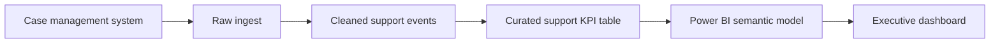
Lineage matters for two big reasons:
#### Incident response
If a dashboard number looks wrong, lineage tells you where to investigate.
You can move upstream instead of guessing.
#### Impact analysis
If a source table changes, lineage tells you which downstream reports, measures, and stakeholders may be affected.
### 11.5 A lineage incident example
Imagine the `product_family` column changes in the source system.
Without lineage, the BI team discovers the issue only after a leader asks why product charts are blank.
With lineage, you can identify:
- which gold tables use `product_family`
- which semantic model fields depend on it
- which reports will break
- who owns those reports
That speeds up both communication and repair.
### 11.6 Data contracts
A **data contract** is an explicit agreement between a data producer and a data consumer.
It usually covers:
- expected schema
- delivery timing
- meaning of key fields
- quality expectations
- allowed changes and notice period
- ownership and support model
**Analogy:**
A data contract is like a service agreement for data.
It says, "If you publish this table to me, here is what it must look like and when I can rely on it."
### 11.7 Why data contracts are becoming more important
Modern data estates have many producers and consumers.
When producers change schema without warning, consumers break.
Data contracts reduce surprise and clarify responsibilities.
### 11.8 Metadata and self-service trust
Self-service only works when users can quickly judge whether a dataset is appropriate.
Useful trust signals include:
- owner name
- certification status
- last refresh time
- sensitivity label
- lineage
- quality score
- known limitations
> 💡 **Tie-in to your background:** Think of metadata like excellent case documentation. Good notes, ownership, and traceability make handoff, escalation, and root cause analysis dramatically easier.
---
## 12. Microsoft Purview: governing the unified data estate
**Microsoft Purview** is Microsoft's governance, catalog, compliance, and data estate visibility platform.
For interview purposes, you should be able to explain Purview in plain English:
"Purview helps organisations discover, classify, catalog, understand, and govern data across their data estate. It is especially useful for metadata, lineage, sensitivity, and searchability of trusted assets."
### 12.1 Key Purview concepts
#### Data Map
The **Data Map** captures metadata from scanned data sources.
It is the inventory layer.
#### Data Catalog
The **Data Catalog** makes that metadata searchable and understandable for users.
It is the discovery layer.
#### Classification
Purview can classify data types such as email, phone number, or other sensitive patterns.
It helps identify where sensitive content exists.
#### Sensitivity labels
Purview integrates with sensitivity and protection concepts so sensitive data can be labeled and handled according to policy.
#### Lineage
Purview can show lineage across supported sources and downstream assets.
That supports change impact analysis and incident investigation.
#### Unified data estate view
Purview helps create one governance lens across multiple platforms instead of treating each system as an isolated island.
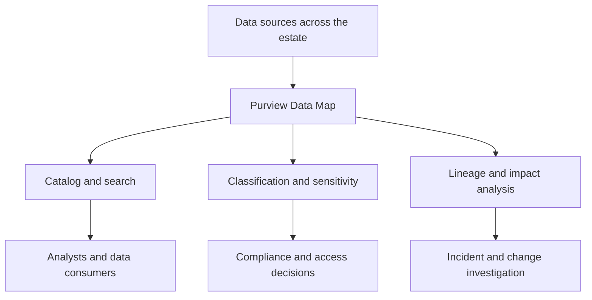
### 12.2 What problems Purview helps solve
| Problem | How Purview helps |
|---|---|
| People cannot find trusted data | Catalog search, ownership, descriptions, certification signals |
| Sensitive data is hard to locate | Scanning and classification |
| Impact of changes is unclear | Lineage and dependency visibility |
| Definitions are fragmented | Glossary and metadata centralization |
| Data estate is spread across many systems | Unified governance view |
### 12.3 Purview in a support-data scenario
Imagine CE&S support data lives across:
- operational case systems
- survey platforms
- product hierarchy sources
- Fabric lakehouse or warehouse
- Power BI semantic models
Purview helps by:
- scanning these assets
- cataloging them
- identifying sensitive fields
- linking lineage from source to report
- helping analysts find the certified support KPI dataset instead of cloning raw data
### 12.4 Purview and incident management
When a report issue occurs, Purview lineage helps answer:
- where did this field originate?
- which upstream system changed?
- which downstream reports are affected?
- whom do we notify?
That reduces panic and shortens time to resolution.
### 12.5 Purview and governance maturity
Purview is not the governance programme by itself.
It is an enabling tool.
Governance still needs:
- role clarity
- approved definitions
- standards
- issue processes
- access decisions
A useful interview framing is:
"Purview gives the organisation visibility and metadata infrastructure, but people, policies, and processes still make governance real."
### 12.6 Purview vocabulary worth remembering
- data map
- catalog
- lineage
- classification
- sensitivity
- business glossary
- data estate
> 💡 **Tie-in to your background:** Purview is especially relevant for someone with governance and compliance instincts because it turns governance concepts into searchable, auditable operational assets.
---
## 13. Master data management, reference data, golden records, and conformed dimensions
Some data elements must be consistent everywhere.
That is where **Master Data Management (MDM)** becomes important.
### 13.1 Master data in plain English
**Master data** describes core business entities that many systems use.
Examples:
- customer
- product
- geography
- employee
- service offering
If different systems hold conflicting versions of those entities, reporting becomes chaotic.
### 13.2 Reference data in plain English
**Reference data** is the controlled list of allowed values used to classify or describe other data.
Examples:
- severity levels
- region codes
- support channel codes
- issue category list
Reference data is smaller and more stable than transactional data, but it is critical for consistency.
### 13.3 Golden record
A **golden record** is the best, most trusted consolidated representation of an entity.
For example, a customer might appear in many systems.
The golden record aims to represent the official version after matching, merging, and survivorship rules.
**Analogy:**
If five people describe the same person with slightly different names and addresses, the golden record is the carefully reconciled official profile.
### 13.4 MDM workflow in plain English
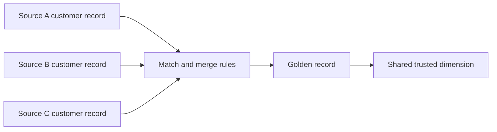
### 13.5 Why MDM matters for BI
Without MDM or at least disciplined conformed dimensions:
- customer counts differ by report
- product rollups do not align
- region views change depending on source
- cross-domain analytics becomes unreliable
With MDM and conformed dimensions:
- the same customer or product rolls up the same way across reports
- enterprise KPIs reconcile more easily
- self-service users work from shared dimensions
### 13.6 Conformed dimensions
A **conformed dimension** is a shared dimension used consistently across fact tables and subject areas.
Example:
If all support, finance, and customer-success reports use the same `dim_product`, product comparisons become aligned.
### 13.7 Support-data examples
| Entity | Why it needs strong master/reference handling |
|---|---|
| Product hierarchy | Needed for consistent product-family reporting across support and engineering |
| Region hierarchy | Needed so leadership views roll up the same way everywhere |
| Case severity codes | Needed so operational and executive reports use the same category meanings |
| Customer / tenant | Needed to avoid duplicate customer counts across cases and subscriptions |
### 13.8 MDM and governance together
MDM is not only a technical matching exercise.
It depends on governance decisions:
- which source is authoritative for which field?
- how are conflicts resolved?
- who approves taxonomy changes?
- how are duplicates handled?
> 💡 **Tie-in to your background:** In support, getting the right product, tenant, and severity context attached to a case is essential. MDM applies the same discipline at enterprise scale so analytics does not fragment around duplicate or conflicting entities.
---
## 14. Security, privacy, and compliance: protecting data while still enabling insight
Analysts are not only measured by what they can show.
They are also measured by what they protect.
For a CE&S BI role, this matters a lot because support data can contain customer context, operational risk signals, and sometimes sensitive identifiers.
### 14.1 Security objectives in plain English
A simple way to think about security is the CIA triad:
- **Confidentiality** — only authorised people can see the data.
- **Integrity** — data is not improperly altered.
- **Availability** — authorised people can access the data when needed.
### 14.2 Role-based access control (RBAC)
**RBAC** means access is granted based on role, not personal favour.
Examples:
- support operations leads can view detailed queue data
- executives can view aggregated performance data
- only a small approved group can access customer-identifying details
RBAC scales better than ad hoc permissions because it is easier to review and audit.
### 14.3 Row-level security (RLS) and object-level security (OLS)
| Control | What it does | Example |
|---|---|---|
| Row-level security | Filters which rows a user can see | Regional manager sees only their region's cases |
| Object-level security | Hides entire tables or columns | Sensitive customer identifier column hidden from broad analyst group |
In Power BI and similar semantic layers, RLS and OLS are key tools for enabling self-service without exposing everything to everyone.
### 14.4 Encryption at rest and in transit
- **At rest** means data is encrypted while stored.
- **In transit** means data is encrypted while moving between systems.
**Analogy:**
At-rest encryption is locking files in a cabinet.
In-transit encryption is sending the package in a sealed armoured vehicle instead of an open tray.
### 14.5 Sensitivity labels and DLP
**Sensitivity labels** classify data based on how carefully it should be handled.
Examples might include Public, General, Confidential, or Highly Confidential.
**DLP** stands for Data Loss Prevention.
It refers to policies and controls designed to stop sensitive data from being shared, copied, or exposed improperly.
### 14.6 PII and PHI handling
- **PII** means personally identifiable information.
Examples: name, email, phone number, account identifier, address.
- **PHI** means protected health information.
It matters especially in healthcare-related contexts.
In support data, PII may appear in case notes, attachments, customer contact fields, or survey feedback.
Good handling practices include:
- minimising access
- masking or pseudonymising where possible
- avoiding unnecessary exports
- keeping sensitive fields out of broad self-service models
- using approved tools and storage only
### 14.7 GDPR and CCPA principles in plain English
You do not need to be a lawyer to explain the basics.
A strong answer focuses on principles.
Common privacy principles include:
- collect only what is needed
- use data for a legitimate, defined purpose
- keep it accurate
- retain it only as long as necessary
- protect it appropriately
- support data subject rights where applicable
### 14.8 Data residency
**Data residency** asks where data is stored and processed geographically.
This matters because:
- regulations may restrict where data can live
- customers may have contractual expectations
- cross-border transfers may require extra controls
### 14.9 Microsoft Cloud Background Check context
For a Microsoft support-data role, a strong security posture is not abstract.
It is part of trustworthiness in handling customer information.
A good interview tone is respectful and practical:
- customer data should be accessed on a need-to-know basis
- sensitive fields should be governed and labeled
- analyst workflows should avoid unnecessary local copies
- aggregated reporting should be preferred where detail is not required
- lineage and cataloging should make sensitive fields discoverable for protection, not for casual exposure
### 14.10 Responsible handling of customer support data
Support data can be uniquely sensitive because it may contain:
- outage details
- customer tenant or environment references
- contact information
- issue descriptions that imply security or operational risk
- attachments or notes with sensitive text
A mature handling pattern is:
1. classify the data
2. minimise who can access raw detail
3. curate broad-use semantic models with safe fields only
4. mask or remove direct identifiers where possible
5. log and review access
6. apply retention and deletion rules
### 14.11 Privacy by design for analytics
Privacy by design means thinking about privacy at design time, not after a complaint arrives.
Examples:
- use aggregated counts rather than customer names in most dashboards
- create separate secured tables for sensitive detail
- label sensitive datasets in the catalog
- define RLS before broad report rollout
- review whether a field is truly needed before including it
### 14.12 Security and privacy controls comparison
| Control area | Example control | BI benefit |
|---|---|---|
| Access | RBAC, RLS, OLS | Right people see right level of detail |
| Protection | Encryption, labels, DLP | Reduces risk of exposure |
| Governance | Owner approval, catalog labels, audits | Makes handling accountable and repeatable |
| Privacy | Minimisation, masking, retention | Supports compliant use of support data |
### 14.13 How to talk about security in an interview
A strong answer sounds like this:
"I treat data security and privacy as part of quality. A metric is not truly production-ready if access is too broad or sensitive fields are not classified. I prefer role-based access, row-level restrictions where needed, sensitivity labeling, and aggregated reporting by default, especially for customer support data."
> 💡 **Tie-in to your background:** Your compliance and risk-management strengths are a direct advantage here. Many analysts focus only on getting the number out. You can also speak credibly about safe handling, controlled access, and governance discipline.
---
## 15. KPI and metric governance: one definition, one semantic truth
A business can survive many small technical issues.
It struggles much more when leaders use different definitions for the same KPI.
That is why **metric governance** is central to BI maturity.
### 15.1 Single source of truth in plain English
A **single source of truth** does not mean there is only one table in the entire company.
It means that for each important metric, there is one approved definition and one trusted implementation path.
### 15.2 Semantic layer or metrics layer
A **semantic layer** sits between raw data and users.
It defines trusted measures, dimensions, hierarchies, relationships, and business logic in a reusable way.
Why it matters:
- business rules are implemented once
- multiple reports use the same measures
- self-service users can build without re-deriving the logic each time
### 15.3 Certified vs promoted datasets
Different organisations use slightly different labels, but the core idea is common.
| Status | Meaning | Typical use |
|---|---|---|
| Promoted | Useful and shareable, but not fully governed as an official enterprise source | Team-level collaboration |
| Certified | Officially reviewed and trusted for broad business use | Leadership reporting and self-service foundation |
### 15.4 Enforcing taxonomy and business-rule logic once
This point is directly from the JD.
Examples of logic that should be implemented centrally:
- what counts as an escalation
- what counts as a breach
- which cases are excluded from KPI calculations
- how region hierarchy rolls up
- how issue categories map into common taxonomy
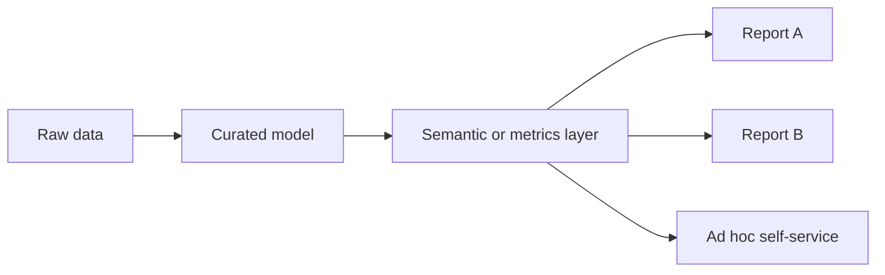
If each report recreates the metric logic separately, drift becomes almost guaranteed.
### 15.5 Metric definition card
A strong governance habit is to maintain a simple metric definition card.
| Field | Example |
|---|---|
| Metric name | Escalation rate |
| Business definition | Share of support cases escalated within the period |
| Numerator | Count of cases with escalation flag = 1 |
| Denominator | Count of in-scope support cases |
| Exclusions | Test cases, training tenants, invalid records |
| Grain | Day, week, month |
| Owner | Support operations lead |
| Steward | BI analyst |
| Source | Certified gold support KPI table |
| Refresh | Daily by 06:00 UTC |
| Notes | Compare by product family and region |
### 15.6 Change control for metric definitions
Metrics should not change silently.
A good change process includes:
- proposed change description
- business rationale
- impacted reports and users
- owner approval
- effective date
- version history
- communication note
### 15.7 Why metric governance matters for self-service
Self-service fails when users can access many datasets but cannot tell which one contains the approved metric.
Metric governance enables safe self-service by making the trusted path obvious.
### 15.8 Good interview framing
"I like to enforce business-rule logic and taxonomy once in the semantic layer, then expose certified measures for reuse. That reduces definition drift, makes self-service safer, and ensures leadership sees one version of the truth."
> 💡 **Tie-in to your background:** In support operations, consistent severity or escalation definitions are essential. Metric governance is the analytics version of making sure everyone uses the same operational rulebook.
---
## 16. Measuring analytics impact: proving that the work mattered
This is where many analysts stay shallow.
They report that a dashboard was launched.
Stronger analysts prove what changed because of it.
### 16.1 Output vs outcome vs impact
| Level | Plain-English meaning | Example |
|---|---|---|
| Output | What you built or delivered | New backlog-risk dashboard launched |
| Outcome | What users changed in behavior | Queue managers use it daily to reprioritise work |
| Impact | What business result improved | Escalation rate and breach rate decreased |
### 🔍 Plain-English deep-dive: why this distinction matters
If you stop at output, you are measuring activity.
If you reach impact, you are measuring value.
**Analogy:**
Building a gym is an output.
People exercising is an outcome.
Improved health is impact.
### 16.2 Baseline, target, and measurement window
To claim impact, you need at least three things:
- a **baseline** before the change
- a **target** that defines success
- a **measurement window** long enough to judge the result fairly
Example:
- baseline escalation rate = 8.0%
- target = 7.0%
- measurement window = next full quarter after rollout
### 16.3 Leading and lagging indicators
| Type | Meaning | Support example |
|---|---|---|
| Leading indicator | Earlier signal that may predict future performance | Time to first action, share of at-risk cases reviewed |
| Lagging indicator | Final result seen later | CSAT, escalation rate, breach rate |
A good scorecard usually mixes both.
Leading indicators tell you whether behavior is changing.
Lagging indicators tell you whether the final business result improved.
### 16.4 Adoption metrics and value realisation
You cannot prove impact if nobody used the product.
That is why adoption metrics matter.
Examples:
- weekly active users of the dashboard
- share of target managers who used the report
- repeat usage rate
- number of drill-throughs or exports by intended audience
- self-service questions resolved through the certified dataset rather than ad hoc requests
Adoption is not the final answer, but it is a key bridge between shipping and impact.
### 16.5 KPI trees and OKRs
A **KPI tree** shows how operational drivers connect to higher-level business outcomes.
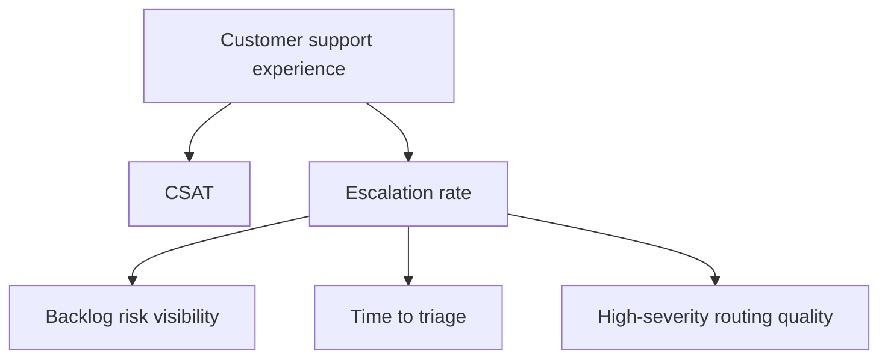
An **OKR** structure may look like this:
- **Objective** — Improve support decision quality and responsiveness.
- **Key Result 1** — Reduce escalation rate from 8% to 7%.
- **Key Result 2** — Achieve 90% weekly adoption among queue leads.
- **Key Result 3** — Deliver daily trusted operations scorecard by 06:00 with 99% freshness compliance.
### 16.6 Control groups and A/B testing
**A/B testing** compares a group that receives the change to a group that does not.
In analytics, the "change" might be:
- a new alert
- a new prioritisation view
- a redesigned escalation workflow report
If one region or team receives the feature first, that can sometimes create a natural comparison.
### 16.7 Causal inference intro: why causality is harder than correlation
A metric improving after your dashboard launch does not automatically prove your dashboard caused the improvement.
That is because other things may also have changed.
These are called **confounders**.
Examples of confounders:
- staffing changes
- seasonality
- product release quality shifts
- policy changes
- parallel process improvements
### 16.8 Difference-in-differences in plain English
**Difference-in-differences** sounds complex, but the intuition is simple.
You compare:
- how the treated group changed before vs after
- how the comparison group changed before vs after
Then you subtract the common background change.
**Analogy:**
If both cities get warmer in summer, you would not credit one city's new park for the temperature rise.
You compare relative change, not only raw after-values.
### 16.9 Danger of confounders
Here are weak claims:
- "We launched the report in April and CSAT improved in May, so the report caused it."
Here is a stronger claim:
- "We launched the report in April, adoption reached 93% of intended managers, first-action time improved within two weeks, and compared with a similar region that adopted later, escalation rate fell more sharply in the treated group."
### 16.10 Presenting impact to leadership
Leadership communication should be short, quantified, and honest.
A strong pattern is:
1. What changed?
2. Who adopted it?
3. Which leading indicators moved?
4. Which lagging outcomes moved?
5. How confident are we that the analytics helped?
6. What remains uncertain?
### 16.11 Example impact statement
"We introduced the at-risk case prioritisation dashboard in Q2. Within three weeks, 11 of 12 target queue leads were using it weekly. The share of high-risk cases reviewed within 24 hours improved from 62% to 81%, and escalation rate decreased from 8.0% to 6.7% over the quarter, outperforming the comparison region by 0.9 points. We cannot attribute all improvement solely to the dashboard because staffing also improved, but the timing, adoption pattern, and comparison suggest the analytics materially contributed."
### 16.12 An impact scorecard structure
| Layer | Example metric | Why it matters |
|---|---|---|
| Output | Dashboard launched, training completed | Confirms delivery |
| Adoption | 92% of intended leads active weekly | Confirms usage |
| Outcome | Time to triage improved from 14h to 8h | Shows behavior change |
| Impact | Escalation rate reduced from 8.0% to 6.7% | Shows business value |
### 16.13 Value realisation beyond hard dollars
Not every analytics outcome is directly revenue-linked.
Value may also appear as:
- faster decision speed
- lower operational risk
- fewer manual hours spent creating reports
- higher confidence in leadership reviews
- better compliance posture
- lower rework from definition conflicts
### 16.14 What interviewers love to hear
A mature answer sounds like this:
"I define success before building. I capture the baseline, target audience, leading and lagging indicators, and adoption measures. After release, I track usage and outcome shifts, and where possible I use a comparison group or phased rollout to separate real impact from coincidence."
> 💡 **Tie-in to your background:** You already speak the language of operational outcomes, service quality, and leadership communication. That is a major advantage because impact measurement is really disciplined operational storytelling backed by numbers.
---
## 17. Six Sigma and statistical process control: quality as a mindset, not a one-time cleanup
Your note about being "currently upskilling" in Six Sigma is useful here.
You do not need to present yourself as a Black Belt.
You only need to show the quality mindset.
### 17.1 Why Six Sigma thinking fits data work
Six Sigma encourages teams to:
- define the process
- measure variation
- identify root causes
- reduce defects
- sustain improvements with control mechanisms
That maps beautifully to data quality.
### 17.2 Common vs special cause variation
This is one of the most valuable concepts.
- **Common cause variation** is normal background noise in a stable process.
- **Special cause variation** is an unusual signal that suggests something changed.
In data terms:
- a small daily volume fluctuation may be common cause
- a sudden 70% drop in one day may be special cause
### 17.3 Control charts in plain English
A **control chart** tracks a metric over time with upper and lower control limits.
It helps distinguish normal variation from likely process problems.
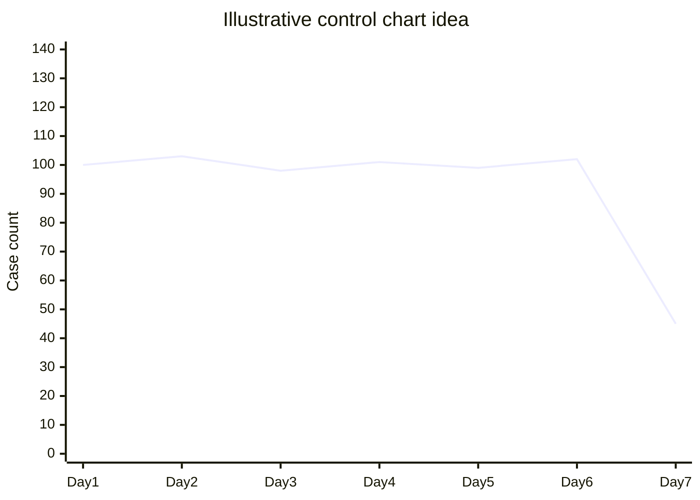
In the example above, the final day is far outside the normal band.
That is a likely special-cause signal.
### 17.4 Applying SPC thinking to data quality
Examples:
- track null rate over time, not only current value
- track row-count variance over time
- track freshness lateness over time
- track quality test pass rate over time
### 17.5 Why this matters in analytics operations
A single threshold can miss important drift.
A time-series view shows whether the process is becoming unstable.
### 17.6 A good interview statement
"I think about data quality with a process-control mindset. I do not only ask whether today's data passed. I also watch whether the process is becoming unstable over time through trends, control limits, and anomaly signals."
> 💡 **Tie-in to your background:** This is a natural bridge from support operations into analytics. It shows you are not waiting passively for failure; you are designing measurable controls to detect variation early.
---
## 18. Integrated CE&S support-data case study: from raw case data to trusted executive action
This section ties everything together in one story.
### 18.1 The scenario
A CE&S BI team wants to reduce escalation risk and improve support responsiveness.
The team plans to publish a daily support operations scorecard and an at-risk case dashboard.
The raw inputs include:
- case events from the support platform
- survey response data
- product hierarchy data
- region mapping reference data
- staffing coverage data
### 18.2 Step 1: profile the raw data
The team first profiles the incoming data.
They discover:
- 4.8% of closed cases are missing close reason
- three region variants exist for EMEA
- a small set of survey rows do not join to a case_id
- product hierarchy changed and introduced a new family label
### 18.3 Step 2: convert profiling findings into tests
The team creates:
- null tests on required closure fields
- accepted-values tests for region and severity taxonomy
- relationship tests between case fact and product dimension
- freshness checks for morning delivery cutoff
- reconciliation against certified case counts
### 18.4 Step 3: govern the metric definitions
The team creates metric cards for:
- escalation rate
- backlog at risk
- time to first action
- breach rate
- survey response rate
They assign:
- owner = support operations lead
- steward = BI analyst
- custodian = platform engineering
### 18.5 Step 4: catalog and label the assets
They register datasets in the catalog.
They add:
- business descriptions
- owners
- refresh cadence
- sensitivity labels
- lineage from source to semantic model
### 18.6 Step 5: publish only certified measures
Instead of letting every report re-implement logic, they publish a semantic model with certified measures.
The report uses those measures directly.
### 18.7 Step 6: observe health continuously
The team monitors:
- freshness by 06:00 target
- row count variance vs rolling average
- new category values
- null rate drift
- downstream report usage
### 18.8 Step 7: measure adoption and impact
After launch, they track:
- weekly active usage by queue leads
- time from case creation to first triage action
- share of high-risk cases reviewed within 24 hours
- escalation rate by product and region
### 18.9 The before-and-after narrative
| Layer | Before | After |
|---|---|---|
| Quality | Numbers manually checked, inconsistent daily | Automated tests and visible freshness |
| Governance | Metric logic scattered across files | Certified semantic measures with owners |
| Discovery | People ask in chat which dataset to use | Catalog points to certified support KPI model |
| Security | Broad access to raw detail | Role-based access and governed fields |
| Impact | Hard to prove analytics value | Adoption and outcome scorecard in place |
### 18.10 Example leadership readout
"We now deliver the support operations scorecard daily before the morning review with 99% freshness compliance. Certified metric logic reduced definition disputes, and the at-risk dashboard reached 92% of intended users in four weeks. Time to first action improved by 31%, and escalation rate decreased from 8.0% to 6.8% during the post-launch quarter."
### 18.11 Why this case study is interview gold
It lets you show that you understand not only dashboards, but also:
- quality controls
- governance structure
- security and privacy
- catalog and lineage
- impact measurement
That is exactly the difference between a report builder and a business analyst who can operate in a mature BI team.
---
## 20. 🧪 Hands-on Lab Demo 1 — SQL data profiling and quality checks
This lab shows how an analyst can inspect support data like an engineer with a quality mindset.
### Lab scenario
A `fact_cases` table contains support case data.
We want to profile it and validate critical rules before publishing a daily KPI table.
### 20.1 Sample profiling questions
- How many rows arrived today?
- Which columns have nulls?
- Are business keys unique?
- Are timestamps sensible?
- Are approved taxonomy values being followed?
- Do dimension joins succeed?
### 20.2 SQL checks
```sql
-- 1) Row count and freshness
SELECT
    COUNT(*) AS total_rows,
    MAX(load_datetime_utc) AS latest_load_utc
FROM fact_cases;
```
```sql
-- 2) Null checks on required fields
SELECT
    SUM(CASE WHEN case_id IS NULL THEN 1 ELSE 0 END) AS null_case_id,
    SUM(CASE WHEN open_datetime IS NULL THEN 1 ELSE 0 END) AS null_open_datetime,
    SUM(CASE WHEN status = 'Closed' AND close_datetime IS NULL THEN 1 ELSE 0 END) AS closed_missing_close_datetime
FROM fact_cases;
```
```sql
-- 3) Duplicate business key detection
SELECT case_id, COUNT(*) AS row_count
FROM fact_cases
GROUP BY case_id
HAVING COUNT(*) > 1;
```
```sql
-- 4) Validity checks
SELECT *
FROM fact_cases
WHERE resolution_hours < 0
   OR csat_score NOT BETWEEN 1 AND 5;
```
```sql
-- 5) Conformity checks for taxonomy
SELECT DISTINCT severity_label
FROM fact_cases
WHERE severity_label NOT IN ('Low','Medium','High','Critical');
```
```sql
-- 6) Integrity check against product dimension
SELECT f.product_key
FROM fact_cases f
LEFT JOIN dim_product d
  ON f.product_key = d.product_key
WHERE d.product_key IS NULL;
```
```sql
-- 7) Reconciliation against certified source totals
SELECT
    g.case_date,
    g.case_count AS gold_count,
    s.case_count AS source_count,
    g.case_count - s.case_count AS diff
FROM daily_case_totals_gold g
JOIN daily_case_totals_source s
  ON g.case_date = s.case_date
WHERE ABS(g.case_count - s.case_count) > 5;
```
### 20.3 What a mature analyst would say after running these checks
"I would classify the findings into blockers versus warnings. Duplicate case IDs, broken foreign keys, and stale refreshes are publish blockers. Small approved tolerances on rounded metrics may be warnings. The goal is not just to find issues, but to decide whether the dataset is safe to publish."
### 20.4 Success check
You know the lab worked if you can explain which issues are:
- data-quality defects
- taxonomy defects
- relationship defects
- freshness defects
- reconciliation defects
---
## 21. 🧪 Hands-on Lab Demo 2 — Python and pandas quality assertions
This lab turns quality ideas into reusable code checks.
### 21.1 Example setup
```python
import pandas as pd
# Example support case data
# Assume df already exists with columns:
# case_id, region, severity_label, open_datetime, close_datetime,
# resolution_hours, csat_score, product_key, load_datetime_utc
```
### 21.2 Profiling in pandas
```python
summary = df.describe(include='all').T
summary['null_pct'] = df.isna().mean()
summary['distinct_count'] = df.nunique(dropna=True)
print(summary[['null_pct', 'distinct_count']].head(20))
```
### 21.3 Quality assertions
```python
assert df['case_id'].notna().all(), 'Null case_id found'
assert df['case_id'].is_unique, 'Duplicate case_id found'
assert df['csat_score'].dropna().between(1, 5).all(), 'Invalid csat_score found'
assert (df['resolution_hours'].dropna() >= 0).all(), 'Negative resolution_hours found'
assert (df['close_datetime'] >= df['open_datetime']).all(), 'Close before open found'
```
### 21.4 Taxonomy conformity check
```python
approved_regions = {'AMER', 'EMEA', 'APAC'}
nonconforming_regions = sorted(set(df['region'].dropna().astype(str).str.strip()) - approved_regions)
assert not nonconforming_regions, f'Unexpected region values: {nonconforming_regions}'
```
### 21.5 Freshness check
```python
latest_load = df['load_datetime_utc'].max()
hours_stale = (pd.Timestamp.utcnow().tz_localize(None) - latest_load).total_seconds() / 3600
assert hours_stale <= 6, f'Dataset is stale: {hours_stale:.2f} hours old'
```
### 21.6 Simple distribution anomaly check
```python
daily_counts = df.groupby(df['open_datetime'].dt.date).size().sort_index()
rolling_mean = daily_counts.rolling(7, min_periods=3).mean()
rolling_std = daily_counts.rolling(7, min_periods=3).std().fillna(0)
z_score = (daily_counts - rolling_mean) / rolling_std.replace(0, pd.NA)
print(z_score.tail())
```
### 21.7 What this lab teaches
- assertions make rules executable
- freshness can be checked directly
- taxonomy drift can be surfaced early
- simple anomaly logic already improves observability
### 21.8 Success check
You can clearly explain why each assertion exists and what business risk it prevents.
---
## 22. 🧪 Hands-on Lab Demo 3 — Power Query, semantic governance, and an impact scorecard
This lab focuses on the Microsoft BI workflow.
### 22.1 Power Query quality workflow
1. Load the support case table into Power Query.
2. Enable Column quality, Column distribution, and Column profile.
3. Inspect null percentages for required columns.
4. Trim and standardise text fields like region or severity.
5. Merge against reference tables for approved taxonomy values.
6. Flag unmatched rows as exceptions.
7. Promote correct data types early.
### 22.2 Semantic governance workflow
1. Publish a semantic model with approved measures.
2. Define measures like Escalation Rate, Breach Rate, and CSAT in one place.
3. Hide raw helper columns from self-service users where appropriate.
4. Add refresh timestamp and quality status measures.
5. Apply certified or promoted status based on governance maturity.
6. Configure RLS if regional views should be restricted.
### 22.3 Example semantic measures
```DAX
Escalation Rate =
DIVIDE(
    CALCULATE(COUNTROWS('fact_cases'), 'fact_cases'[escalation_flag] = 1),
    COUNTROWS('fact_cases')
)
```
```DAX
Data Freshness Hours =
DATEDIFF(MAX('fact_cases'[load_datetime_utc]), UTCNOW(), HOUR)
```
### 22.4 Impact scorecard template
| Layer | Metric | Baseline | Current | Target | Notes |
|---|---|---|---|---|---|
| Output | Dashboard launch | No | Yes | Yes | Released to queue leads |
| Adoption | Weekly active intended users | 0% | 92% | 85% | 11 of 12 leads active |
| Outcome | High-risk cases reviewed <24h | 62% | 81% | 75% | Behaviour change visible |
| Impact | Escalation rate | 8.0% | 6.7% | 7.0% | Improved faster than comparison region |
| Confidence | Comparison group used | No | Yes | Yes | Supports stronger claim |
### 22.5 Two-sentence leadership readout
"The dashboard is not only live; it is adopted by nearly all intended queue leads. Since rollout, the percentage of high-risk cases reviewed within 24 hours has improved materially, and escalation rate is below target versus baseline, with comparison data suggesting the analytics contributed to the result."
### 22.6 Success check
You can explain the difference between a report being published, a report being used, and a report creating measurable impact.
---
## 23. 🧪 Hands-on Lab Demo 4 — Mini governance design for a support KPI domain
This lab is intentionally non-code-heavy.
It helps you think like a data owner or steward.
### 23.1 The KPI domain
Create a tiny governance design for three metrics:
- Escalation Rate
- Breach Rate
- CSAT
### 23.2 Fill in a governance table
| Item | Example answer |
|---|---|
| Domain owner | Support operations manager |
| Domain steward | Support BI analyst |
| Platform custodian | Fabric / data engineering team |
| Official taxonomy | Enterprise region and severity standards |
| Certification criteria | Quality tests, metadata complete, owner approval |
| Sensitive fields | Customer identifiers, contact details, raw case notes |
| Consumer audience | Queue leads, operations managers, executives |
| Review cadence | Monthly metric review, quarterly access review |
### 23.3 Add a data contract note
Example contract bullets:
- source system sends daily extract by 02:00 UTC
- schema changes require 14 days notice
- case_id, product_key, region, open_datetime are mandatory
- null rate on product_key must stay below 0.5%
- owner and steward must be notified on delivery failures
### 23.4 Success check
You can now explain governance as a practical operating model rather than a vague policy concept.
---
## 📚 Reference Links
- [Microsoft Purview overview](https://learn.microsoft.com/purview/purview)
- [Govern your data estate with Microsoft Purview](https://learn.microsoft.com/training/paths/govern-your-data-estate-microsoft-purview/)
- [Power BI implementation planning](https://learn.microsoft.com/power-bi/guidance/powerbi-implementation-planning-introduction)
- [Power BI Row-level security](https://learn.microsoft.com/power-bi/enterprise/service-admin-rls)
- [Microsoft Fabric documentation](https://learn.microsoft.com/fabric/)
- [DAMA-DMBOK overview](https://www.dama.org/cpages/body-of-knowledge)
- [Great Expectations documentation](https://docs.greatexpectations.io/)
- [dbt tests documentation](https://docs.getdbt.com/docs/build/data-tests)
- [Nielsen Norman Group on outputs vs outcomes](https://www.nngroup.com/articles/outcomes-vs-outputs/)
- [ASQ Statistical process control basics](https://asq.org/quality-resources/statistical-process-control)
- [GDPR overview](https://gdpr.eu/what-is-gdpr/)
- [California Consumer Privacy Act overview](https://oag.ca.gov/privacy/ccpa)
---
## ⭐ Likely Interview Questions
**Q1. "Why do you say data quality drives adoption and impact, not just trust?"**
> *Model answer:* Because trust is only the first business effect. Once people trust the data, they actually use it in meetings and workflows. That adoption is what creates impact. So I think of the chain as quality creates trust, trust enables adoption, and adoption allows the analytics to influence outcomes.
**Q2. "What data quality dimensions do you normally work with?"**
> *Model answer:* I usually start with accuracy, completeness, consistency, timeliness, validity, and uniqueness. For stronger governance conversations I also mention integrity, conformity, and precision. I like to pair each dimension with a concrete check such as null-rate testing, duplicate-key detection, relationship tests, freshness SLAs, or accepted-value validation.
**Q3. "How would you profile a new support dataset?"**
> *Model answer:* I would start with column profiling for nulls, distinct counts, ranges, and common values, then move to cross-column rules like close date after open date, then cross-table checks like key integrity and reconciliation against source totals. I would do that in SQL for scale, use pandas for exploratory checks, and use Power Query profiling for fast analyst-friendly inspection.
**Q4. "What is the difference between profiling and validation?"**
> *Model answer:* Profiling helps me discover what is in the data and where risk might exist. Validation turns those learnings into explicit rules and tests. In other words, profiling is diagnosis, while validation is enforceable control.
**Q5. "How would you design data tests for production analytics?"**
> *Model answer:* I would define critical schema, freshness, uniqueness, null, relationship, accepted-value, and reconciliation tests close to the transformation layer. Then I would classify failures by severity and make publish conditional on passing the critical tests. I also like exposing freshness and quality status to report users so trust is visible.
**Q6. "How do dbt tests or Great Expectations fit into quality management?"**
> *Model answer:* They help express data quality expectations in repeatable, versioned ways. dbt is strong for tests attached directly to warehouse models, while Great Expectations is strong for readable expectation suites and documentation. The shared principle is that quality rules should be executable, not only described in slides.
**Q7. "What is data observability?"**
> *Model answer:* Data observability means monitoring data health across pillars like freshness, volume, schema, lineage, and distribution so issues are detected early and their impact is understood quickly. It goes beyond job success because a pipeline can run successfully and still produce bad data.
**Q8. "How would you set SLAs or SLOs for a BI dataset?"**
> *Model answer:* I would start with the decision window. If leaders need the dataset by 7 AM, the freshness SLI might be hours since last successful load, the SLO might be 99% of refreshes complete by 6 AM, and the SLA would be the formal promise to stakeholders if one exists. I would pair freshness targets with quality and reconciliation targets, not only timing.
**Q9. "What is data governance in your own words?"**
> *Model answer:* Data governance is the system of ownership, policies, standards, and processes that keeps data consistent, secure, and usable across the organisation. It answers who owns the data, what it means, who can access it, and how changes or incidents are handled.
**Q10. "Which governance operating model do you prefer?"**
> *Model answer:* For large organisations I usually prefer a federated model: central standards for taxonomy, privacy, cataloging, and metric approval, with domain ownership for business rules, stewardship, and operational issue response. That balances enterprise consistency with local expertise.
**Q11. "What is the difference between a data owner, steward, and custodian?"**
> *Model answer:* The owner is accountable for meaning and approval, the steward maintains quality and metadata day to day, and the custodian operates and protects the technical platform. I remember it as answerable, healthy, and operational.
**Q12. "Why do metadata and lineage matter so much in BI?"**
> *Model answer:* Because they make data discoverable, understandable, and supportable. Metadata tells people what a dataset means, who owns it, and how fresh it is. Lineage tells us where it came from and what breaks if something changes. That is critical for both incident response and change management.
**Q13. "How would you explain Microsoft Purview to a non-specialist?"**
> *Model answer:* I would say Purview helps an organisation discover, classify, catalog, and trace data across its data estate. It gives people a searchable place to find trusted assets, understand lineage, and identify sensitive data, which supports both governance and compliance.
**Q14. "What role does master data management play in analytics?"**
> *Model answer:* It creates consistent, trusted representations of core entities like customer, product, or region. That supports conformed dimensions, cleaner joins, and more reliable cross-domain reporting. Without it, every report risks counting and grouping the same entity differently.
**Q15. "How do you handle sensitive support data responsibly?"**
> *Model answer:* I start with classification and least-privilege access. I prefer role-based permissions, row or object-level restrictions where needed, and aggregated reporting by default. Sensitive fields should be labeled, cataloged, and kept out of broad-use models unless there is a legitimate need.
**Q16. "How do you enforce consistent KPI logic across self-service users?"**
> *Model answer:* I define the metric once in a governed semantic or metrics layer, document it with an owner and business definition, and publish it as a certified measure. That way users reuse the same logic instead of rebuilding the formula in each report.
**Q17. "How do you measure whether an analytics feature actually helped?"**
> *Model answer:* I separate output, outcome, and impact. I set a baseline, target, and measurement window before launch, track adoption by the intended users, then measure leading and lagging indicators after release. Where possible I use a comparison group or phased rollout to strengthen the causal claim.
**Q18. "How would you present analytics impact to leadership?"**
> *Model answer:* I would keep it short and quantified: what was launched, who adopted it, which behaviors changed, which business KPI moved, and how confident we are in the attribution. I also state any confounders honestly because credibility matters more than overclaiming.
**Q19. "How does Six Sigma thinking help in a BI role?"**
> *Model answer:* It gives a process-control mindset. I look at variation over time, distinguish common versus special causes, and build controls that detect drift early. That is very useful for row counts, null rates, freshness, and other recurring quality signals.
**Q20. "A KPI drops 90% overnight. What do you do first?"**
> *Model answer:* I treat it as a data incident until proven otherwise. I check freshness, volume, schema changes, failed joins, and lineage impact before concluding the business actually changed that dramatically. In practice, sudden extreme swings often come from pipeline or mapping issues rather than reality.
---
## 🧠 30-Second Memory Hooks
- **Quality -> trust -> adoption -> impact** = the chain to remember.
- **Profiling finds problems; validation prevents them from quietly returning.**
- **Accuracy** = matches reality.
- **Completeness** = nothing required is missing.
- **Consistency** = the same thing is represented the same way everywhere.
- **Timeliness** = fresh enough for the decision window.
- **Validity** = follows allowed rules and formats.
- **Uniqueness** = no duplicate business entities at the chosen grain.
- **Integrity** = relationships between tables still hold.
- **Conformity** = follows approved standard and taxonomy.
- **Precision** = captured at the right level of detail.
- **Observability** = freshness, volume, schema, lineage, distribution.
- **Governance** = people + policies + standards + accountability.
- **Owner vs steward vs custodian** = accountable vs quality caretaker vs technical operator.
- **Glossary** explains business terms; **dictionary** explains fields and allowed values.
- **Lineage** answers both 'where did this come from?' and 'what will this break?'.
- **Purview** = discover, classify, catalog, and trace the data estate.
- **MDM** = one trusted representation of core entities.
- **Metric governance** = define once, reuse everywhere.
- **Output vs outcome vs impact** = built it, used it, changed something.
- **Baseline + target + control** make impact claims stronger.
- **SPC mindset** = watch variation over time, not just one daily pass/fail result.
- **Sensitive support data** should be governed, labeled, and exposed on least-privilege principles.
---
*Next suggested section:* **Part 10 — Customer Support & Experience Analytics Domain** (the natural follow-on: the support-specific KPIs, leading indicators, operational rhythms, and product/service signals that turn this governance foundation into CE&S business insight).
