# Part 10 — Customer Support & Experience Analytics Domain
> Section goal: Master the operating model, KPIs, service motions, and AI use-cases of support analytics from zero knowledge upward. This section turns Arti Thakur's CE&S escalation experience into analyst-grade language for leadership dashboards, ML framing, and customer-experience optimisation across assisted and self-service support.
Covers index item **10**. Maps to JD: **optimise customer experience and support operations across Microsoft's assisted and self-service surfaces, develop ML models, communicate trends, and improve business performance using data**.
---
## 0. Why this section should feel like home turf
If Parts 1-9 teach the tools, this Part teaches the battlefield.
And this battlefield is already familiar to you.
You have spent years inside Microsoft CE&S support motions.
You have handled SharePoint Online and OneDrive for Business escalations.
You have tracked delivery-partner CSAT above 4.75 and SMB CSAT above 4.85.
You have watched real queues rise after incidents, releases, or known issues.
You have seen why some contacts should be deflected, why some must be escalated, and why a bad handoff can destroy customer trust.
That lived intuition matters.
A BI analyst without domain knowledge may build clean visuals.
A BI analyst with domain knowledge builds the right visuals, asks sharper questions, and catches misleading stories before leadership acts on them.
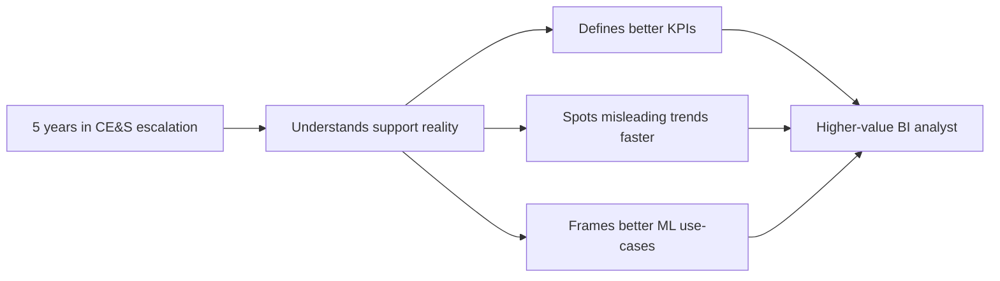
### 🔍 Plain-English deep-dive
- **Domain knowledge** means you understand what the numbers are really describing in the real world.
- **Support analytics** is not only counting tickets.
- It is the science of understanding customer pain, operational workload, service quality, and where experience breaks down.
- **Analogy:** tools like SQL and Power BI are the camera and lenses; domain knowledge tells you what is worth photographing.
> 💡 **Tie-in to your background:** In interview answers, keep translating your support work into analytics language: escalation-trend analysis, queue health, service-level risk, satisfaction segmentation, deflection opportunity, and process-improvement impact.
---
## 1. The support operating model
Support is an operating system, not a single inbox.
It is made of tiers, queues, channels, routing logic, knowledge assets, and escalation paths.
The BI team studies that system the way a doctor studies pulse, blood pressure, and oxygen together.
### 1.1 Assisted support vs self-service support
At the highest level, support work happens in two big surfaces.
One surface is **assisted**.
The other surface is **self-service**.
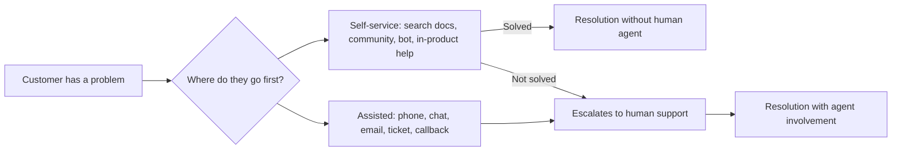
### 🔍 Plain-English deep-dive
- **Assisted support** means a person or team actively works the issue with the customer.
- **Self-service support** means the customer resolves the issue using content, community, tools, or AI without needing a human.
- **The strategic balance** is simple: increase self-service success and deflection where appropriate, but protect quality for complex issues that genuinely need expert handling.
- **Analogy:** assisted support is like seeing a doctor; self-service is like using a trusted home-care guide.
| Surface | What it means | Typical channels | Main goal | Core KPI family |
|---|---|---|---|---|
| Assisted | Human-supported resolution | Phone, chat, email, web case, callback | Resolve accurately and efficiently | CSAT, FCR, SLA, resolution time, escalation rate |
| Self-service | Customer resolves independently | KB, search, forum, in-product help, bot, Copilot | Deflect demand while preserving experience | Deflection, containment, article success, search success |
> 💡 **Tie-in to your background:** Your SPO and ODB escalation work lived inside the assisted surface. That makes you unusually credible when you explain where self-service stops being enough and where escalation expertise starts to matter.

### 1.2 Tiered support model
Most large support organisations use a tiered structure.
The exact names differ.
The logic is consistent.
| Tier | Plain-English role | Typical scope | Example metrics | Common failure mode |
|---|---|---|---|---|
| T0 | Self-help layer | Search, docs, community, bot, in-product help | Deflection, containment, bounce | Content exists but is hard to find |
| T1 | Frontline / first-line support | Intake, triage, simple fixes, scripted troubleshooting | FRT, AHT, FCR, transfer rate | Misclassification or weak troubleshooting depth |
| T2 | Specialist or advanced support | Product-depth troubleshooting, logs, complex workflows | MTTR, escalation rate, backlog age | Queue overload or knowledge silos |
| T3 | Engineering / product group | Bugs, code defects, service-side fixes | Time to engineering engagement, bug aging | Slow handoff or weak repro data |
| Incident / command center | Cross-team crisis handling | Sev A / major incidents, broad customer impact | Time to mitigate, communications cadence | Confusion in ownership |
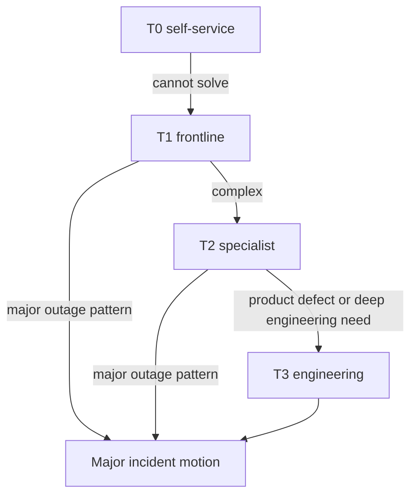
### 🔍 Plain-English deep-dive
- A **tier** is a level of support depth and specialisation.
- The idea is not to make customers 'earn' expert help.
- The idea is to match issue complexity with the lowest-cost capable resolver.
- **Good tiering** reduces cost and speeds resolution.
- **Bad tiering** creates transfers, restarts, and customer frustration.
> 💡 **Tie-in to your background:** Because you worked escalation motions, you can explain the cost of poor upstream triage in very concrete terms: missing logs, wrong issue taxonomy, duplicated effort, and longer time-to-resolution.

### 1.3 Queues and routing
A queue is a line of work waiting for the right team.
In support analytics, queues are one of the most important units of operational health.
If you understand queues, you understand daily operations.
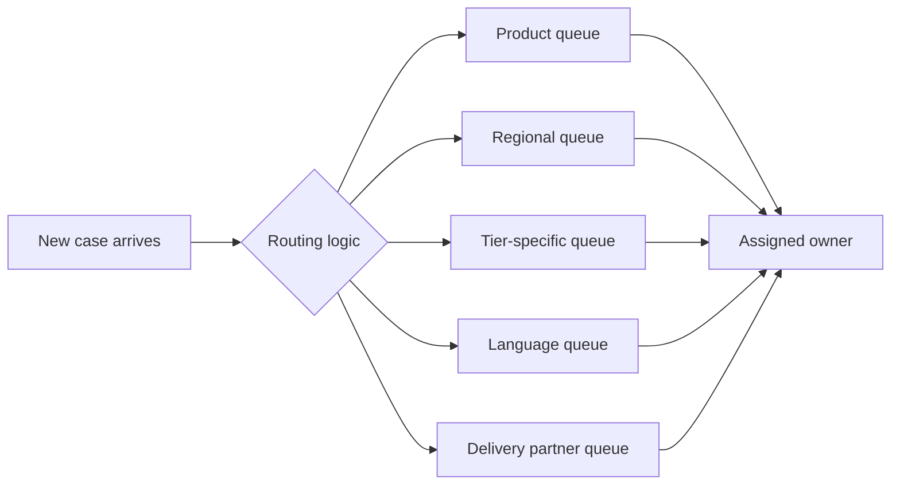
### 🔍 Plain-English deep-dive
- **Queue** means a work bucket with shared ownership and usually shared SLA expectations.
- Cases can be routed by **product**, **issue category**, **severity**, **language**, **segment**, **region**, **support contract**, or **specialist skill**.
- Routing quality matters because every misrouted case creates extra delay, extra cost, and often lower satisfaction.
- A routing model can be rule-based, ML-assisted, or hybrid.
| Routing dimension | Why it exists | Example | Analytics question |
|---|---|---|---|
| Product | Send issue to right product experts | SharePoint vs OneDrive vs Exchange | Which products create the most re-routing? |
| Issue taxonomy | Match skill to problem type | Sync issue, permissions issue, migration issue | Which taxonomy labels have high transfer rates? |
| Severity | Prioritise business impact | Sev A vs Sev C | Are high-severity cases getting faster response? |
| Segment | Align to customer expectations | Enterprise, SMB, partner-managed | Does SMB wait longer but resolve faster? |
| Language | Enable effective communication | English, French, Japanese | Which language queues face staffing gaps? |
| Partner model | Separate internal vs delivery-partner work | DP queue | Are partner queues holding CSAT? |

### 1.4 Swarming vs classic tiering
Not every support organisation wants rigid ladders.
Some use **swarming**.
That means specialists collaborate early rather than handing work upward step by step.
| Model | Plain-English idea | Strength | Risk | Best for |
|---|---|---|---|---|
| Classic tiered | Move case upward through levels | Clear accountability and staffing design | More handoffs | Stable, high-volume motions |
| Swarming | Pull multiple experts onto issue quickly | Faster for ambiguous or complex issues | Harder to measure ownership and utilisation | Complex enterprise issues or major incidents |
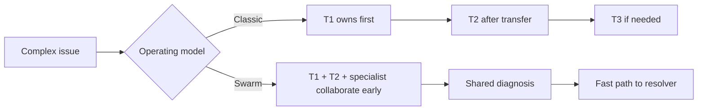
### 🔍 Plain-English deep-dive
- **Swarming** is like calling the plumber, electrician, and carpenter into the room together when the leak has damaged the ceiling and wiring.
- **Tiering** is like seeing one specialist at a time.
- Analysts should not assume one model is always superior.
- They should ask: for this issue mix, which model gives better customer outcomes per cost?

### 1.5 Omnichannel support surfaces
Customers do not think in internal channel categories.
They think, 'I just need help.'
That is why modern support is omnichannel.
The same journey can span multiple surfaces.
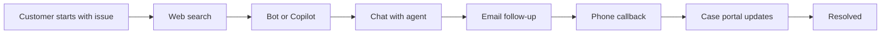
### 🔍 Plain-English deep-dive
- **Omnichannel** means support feels like one connected experience across phone, chat, email, web, community, and in-product surfaces.
- The customer should not need to repeat the whole story each time they change channel.
- Analysts care because channel shifts affect cost, resolution speed, and satisfaction.
| Channel | Typical strength | Typical weakness | KPI angle |
|---|---|---|---|
| Phone | Rich conversation, good for urgent complexity | Costly, queue wait sensitivity | ASA, abandonment, AHT, CSAT |
| Chat | Fast, efficient, parallelizable | Can feel rushed for deep troubleshooting | FRT, concurrency, containment to human, CSAT |
| Email | Good for detailed written traces | Slow back-and-forth | ART, resolution time, backlog age |
| Web case portal | Structured intake, status visibility | Form friction | Case creation conversion, form abandonment |
| In-product help | Context-aware and scalable | Limited for rare edge cases | Deflection, click-through, search success |
| Community / forums | Peer scale and searchable answers | Quality variability | View-to-solution, bounce, escalation after visit |
| Copilot / bot | 24x7 and cheap at scale | Hallucination or poor containment if unguided | Containment, handoff rate, self-serve CSAT |

### 1.6 Assisted + self-service strategy at Microsoft scale
Microsoft does not win by forcing everything into humans.
It wins by placing the right problem on the right surface.
Simple known issues should be solved through self-help, guided flows, or AI-assisted experiences.
High-complexity, high-impact, or high-emotion situations still require expert human engagement.
That is especially true across products like Microsoft 365, Azure, and Dynamics 365 where complexity, business criticality, and customer skill vary widely.
> 💡 **Tie-in to your background:** Because you lived inside CE&S and partner support motions, you can explain the support operating model not as theory, but as workload, queue pressure, customer expectation, and service economics.
---
## 2. The case or ticket lifecycle
A case is the unit of work support systems track.
But a case is also a story.
It starts with a customer problem and ends only when the customer is effectively back on track.
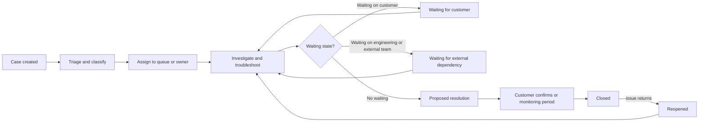
### 2.1 Core lifecycle states
Different systems use different labels.
The logic is still recognisable.
| State | Plain-English meaning | Analyst concern |
|---|---|---|
| New | Case exists but not yet meaningfully triaged | Intake health and queue arrival volume |
| Open | Work is in progress | Active workload and staffing |
| Assigned | An owner or queue is responsible | Routing quality and ownership clarity |
| Pending customer | Waiting for customer reply or action | Risk of stale cases or false backlog inflation |
| Pending internal / engineering | Waiting on another team or dependency | OLA performance and handoff efficiency |
| Resolved | Support believes fix or workaround was provided | Reopen risk and closure quality |
| Closed | Case formally ended | Final outcome measurement |
| Reopened | Issue returned after closure | Quality gap signal |
| Canceled / duplicate | Case removed or merged | Taxonomy and deduplication quality |
### 🔍 Plain-English deep-dive
- A **lifecycle** is the sequence of states a case moves through.
- Analysts care because each state change starts or stops certain clocks.
- If states are used inconsistently, resolution-time metrics become misleading.
- **Analogy:** imagine timing a race where some runners pause the stopwatch and others do not; your final statistics become nonsense.

### 2.2 Severity, priority, impact, and urgency
These terms are often mixed up.
They should not be.
| Term | Meaning | Typical question | Example |
|---|---|---|---|
| Severity | How bad is the business or service impact? | 'How much damage is happening?' | Production outage vs minor inconvenience |
| Urgency | How quickly action is needed | 'How soon must we act?' | Payroll blocked today vs non-urgent admin issue |
| Priority | The servicing order after combining impact and urgency | 'What jumps the queue?' | P1, P2, P3 |
| Impact | Breadth or importance of affected users/processes | 'Who or what is affected?' | Single user vs tenant-wide outage |
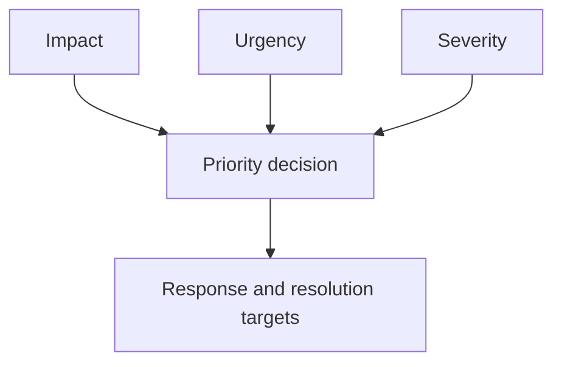
### 🔍 Plain-English deep-dive
- **Severity** is not always the same as priority.
- A severe technical fault affecting one low-importance test environment may still be lower priority than a narrower issue blocking payroll.
- Good analytics separates these concepts instead of flattening them into one field.
> 💡 **Tie-in to your background:** Escalation work trains you to distinguish 'technically ugly' from 'business critical.' That judgment is exactly what better support analytics should preserve.

### 2.3 SLA clocks and timer logic
Support analytics lives and dies on clocks.
If you do not understand timer logic, you can misread performance badly.
| Clock | Starts when | Stops when | Typical use | Major gotcha |
|---|---|---|---|---|
| First response clock | Case created or submitted | First human or valid bot response | Promise initial responsiveness | Auto-acks may inflate performance |
| Resolution clock | Case created or accepted | Case resolved or closed | End-to-end speed | Pending states may or may not pause it |
| Queue wait clock | Case joins queue | Owner starts work | Staffing or routing health | Transfers can reset or hide wait time |
| Customer wait clock | Request sent to customer | Customer responds | See external delay share | Systems often track it poorly |
| OLA clock | Internal handoff occurs | Receiving team acts | Internal support of external SLA | Hidden if only customer SLA is tracked |
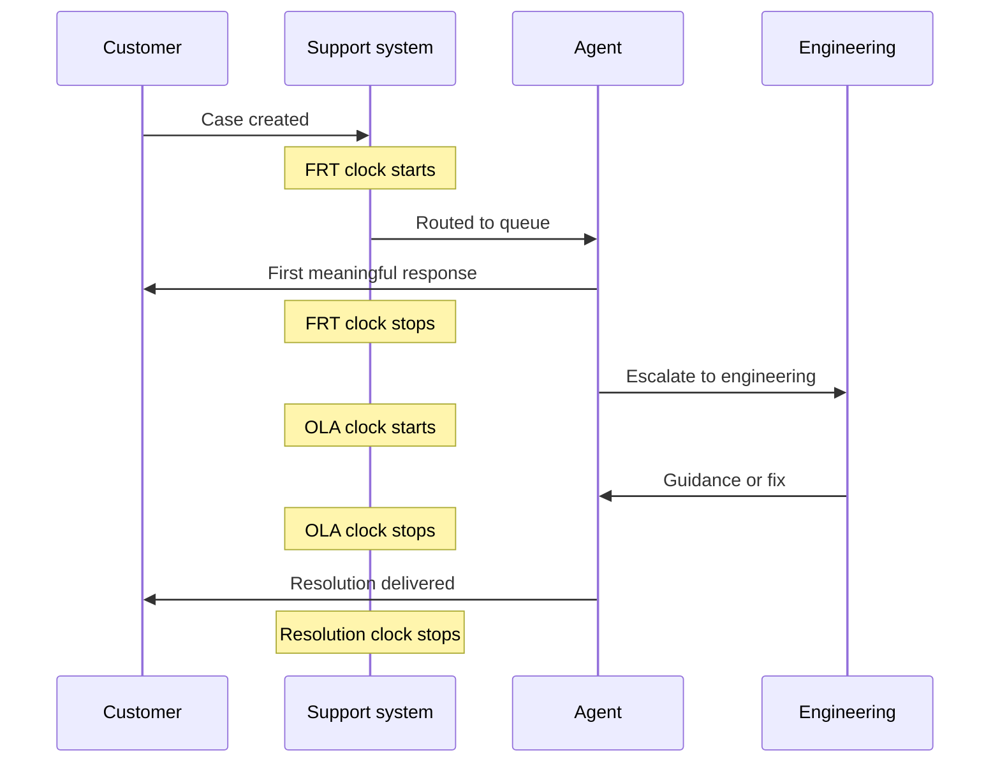
### 🔍 Plain-English deep-dive
- **SLA clock** means a stopwatch tied to a service promise.
- Teams often debate whether the clock should pause when waiting on the customer.
- That is why analysts must document timer logic, not just report percentages.
- If two dashboards use different pause rules, leaders may think performance changed when only the formula changed.

### 2.4 Common lifecycle analytics questions
- Where do cases spend the most time: waiting, working, or transferring?
- Which states create the highest backlog age?
- Are reopened cases associated with particular issue categories, channels, or agents?
- Do high-severity cases get faster first response but slower ultimate resolution because they are more complex?
- How much of resolution time is internal effort versus dependency wait?
- Which queues close many cases but carry a dangerously old tail?
---
## 3. The support KPI framework
A strong support dashboard should feel balanced.
If it only shows speed, it will reward rushing.
If it only shows satisfaction, it may ignore cost and productivity.
If it only shows deflection, it may hide false containment.
The best KPI architecture balances **satisfaction**, **efficiency**, **effectiveness**, and **self-service health**.
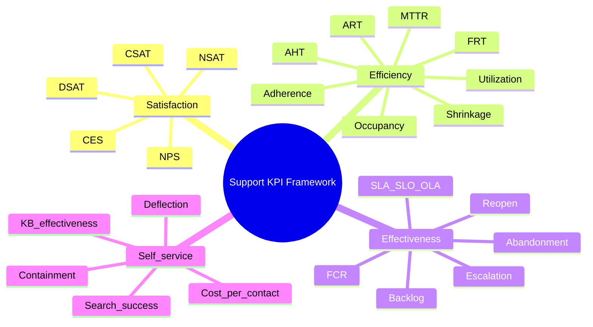
### 🔍 Plain-English deep-dive
- **Satisfaction** asks whether the customer felt well served.
- **Efficiency** asks whether the operation used time and capacity well.
- **Effectiveness** asks whether the issue was actually solved in a sustainable way.
- **Self-service health** asks whether customers can solve the right issues before contacting a human.
- **Analogy:** judging a restaurant only by how fast meals leave the kitchen would ignore taste, accuracy, and repeat business.

### 3.1 Satisfaction and loyalty metrics
#### 3.1.1 CSAT — Customer Satisfaction
### 🔍 Plain-English deep-dive
- **Meaning** — A post-interaction satisfaction score that asks how satisfied the customer was with the support experience.
- **Scale** — Often 1-5, 1-10, or a satisfied / unsatisfied format.
- **Formula** — CSAT = Sum of valid satisfaction scores / Number of valid survey responses  OR  %Satisfied = Satisfied responses / Valid responses.
- **Why it matters** — It is the most common direct signal of whether support felt helpful to the customer.
- **Gotcha** — Survey response bias is huge. Very happy and very angry customers are more likely to respond. Also define clearly whether the score is per case, per interaction, or per relationship moment.
- **Best companion metric** — Pair CSAT with response rate, FCR, and segment splits so the number is interpretable.
> 💡 **Tie-in to your background:** Your DP CSAT above 4.75 and SMB CSAT above 4.85 are strong proof points. Use them confidently.

#### 3.1.2 NSAT — Net Satisfaction
### 🔍 Plain-English deep-dive
- **Meaning** — A net score that subtracts dissatisfaction from satisfaction to show overall support sentiment in one number.
- **Scale** — Usually percentage points, often from -100 to +100.
- **Formula** — NSAT = %Satisfied - %Dissatisfied.
- **Why it matters** — It summarises both positive and negative experience, not only the average score.
- **Gotcha** — Two teams can both say 'NSAT' but use different cutoffs for satisfied and dissatisfied. The label is not enough; the business rule must be documented.
- **Best companion metric** — Pair NSAT with raw response counts and score distribution.
> 💡 **Tie-in to your background:** Microsoft support contexts often use NSAT language, so showing comfort with it makes your answers feel native to the environment.

#### 3.1.3 DSAT — Dissatisfaction Rate
### 🔍 Plain-English deep-dive
- **Meaning** — The share of survey responses that indicate an unhappy customer.
- **Scale** — Usually a percentage.
- **Formula** — DSAT = Dissatisfied responses / Valid responses.
- **Why it matters** — DSAT is useful because leadership often wants to know how many customers had a clearly bad experience, not only the average.
- **Gotcha** — A stable average score can hide a worsening DSAT tail if polarisation increases.
- **Best companion metric** — Pair DSAT with verbatim comments and escalation history.
> 💡 **Tie-in to your background:** Escalation-heavy environments benefit from DSAT tracking because severe pain is concentrated, not always average-like.

#### 3.1.4 NPS — Net Promoter Score
### 🔍 Plain-English deep-dive
- **Meaning** — A relationship-level loyalty metric based on the question 'How likely are you to recommend us?'.
- **Scale** — 0-10 response scale; output usually -100 to +100.
- **Formula** — NPS = %Promoters - %Detractors.
- **Why it matters** — NPS is broader than case satisfaction and can indicate whether product or service experiences are affecting long-term loyalty.
- **Gotcha** — NPS is not a clean replacement for case-level support satisfaction. A customer can like Microsoft overall and still hate a specific support interaction, or vice versa.
- **Best companion metric** — Pair NPS with product health and support-interaction metrics instead of treating it as a pure support KPI.
> 💡 **Tie-in to your background:** In interview answers, say NPS is valuable but more relationship-level than queue-level. That shows metric judgment.

#### 3.1.5 CES — Customer Effort Score
### 🔍 Plain-English deep-dive
- **Meaning** — A measure of how easy or difficult it was for the customer to get support and achieve resolution.
- **Scale** — Often a 1-5 or 1-7 ease scale.
- **Formula** — CES = Sum of valid effort scores / Number of valid responses  OR  %Easy = Easy responses / Valid responses.
- **Why it matters** — Low effort is strongly linked to loyalty because customers remember friction.
- **Gotcha** — Some organisations ask about effort after the case and some after the self-service journey; do not mix them without labeling.
- **Best companion metric** — Pair CES with transfer rate, repeat contact, and search success.
> 💡 **Tie-in to your background:** Your experience makes CES very intuitive because you have seen how repeated re-explanation and handoffs increase customer effort.

### 3.2 Efficiency metrics
#### 3.2.1 AHT — Average Handle Time
### 🔍 Plain-English deep-dive
- **Meaning** — Average active handling time per contact or case.
- **Formula** — AHT = (Talk time + Hold time + After-call work + Handling time) / Contacts handled.
- **Why it matters** — It is a cost and productivity signal.
- **Gotcha** — Low AHT is not always good; rushing can destroy FCR and CSAT.
- **Best companion metric** — Pair with quality metrics so speed is not gamed.

#### 3.2.2 ART — Average Response Time
### 🔍 Plain-English deep-dive
- **Meaning** — Average time between customer messages and support replies across the case journey.
- **Formula** — ART = Sum of response intervals / Number of responses.
- **Why it matters** — It describes conversational rhythm, especially in email or portal motions.
- **Gotcha** — ART can look fine while first response is terrible or total resolution is awful.
- **Best companion metric** — Break it into first response and subsequent response patterns.

#### 3.2.3 FRT — First Response Time
### 🔍 Plain-English deep-dive
- **Meaning** — Time from case creation to first meaningful response.
- **Formula** — FRT = First response timestamp - Case creation timestamp.
- **Why it matters** — It strongly shapes first impressions and breach risk.
- **Gotcha** — Auto-acknowledgements can fake a good FRT if counted as real responses.
- **Best companion metric** — Define 'meaningful response' clearly.

#### 3.2.4 MTTR — Mean Time To Resolve
### 🔍 Plain-English deep-dive
- **Meaning** — Average elapsed time from case start to resolution.
- **Formula** — MTTR = Sum of resolution durations / Number of resolved cases.
- **Why it matters** — It is easy to compute and widely understood.
- **Gotcha** — Means are very sensitive to outliers and ugly long-tail cases.
- **Best companion metric** — Always show mean with median or P90.

#### 3.2.5 Median Resolution Time
### 🔍 Plain-English deep-dive
- **Meaning** — The middle case duration when cases are sorted by resolution time.
- **Formula** — Median RT = 50th percentile of resolution duration.
- **Why it matters** — It gives a truer picture for skewed support data.
- **Gotcha** — Median can hide the painful long tail that executives still care about.
- **Best companion metric** — Pair median with P90.

#### 3.2.6 P90 Resolution Time
### 🔍 Plain-English deep-dive
- **Meaning** — The time by which 90% of cases resolve.
- **Formula** — P90 RT = 90th percentile of resolution duration.
- **Why it matters** — It shows the long tail and is excellent for enterprise support reporting.
- **Gotcha** — P90 moves slowly and needs enough case volume to be stable.
- **Best companion metric** — Use with sample size and segmentation.

#### 3.2.7 Occupancy
### 🔍 Plain-English deep-dive
- **Meaning** — How much of logged-in staffed time agents spend handling contacts or ready work.
- **Formula** — Occupancy = Busy handling time / Available staffed time.
- **Why it matters** — It helps workforce teams understand if queues are over- or under-loaded.
- **Gotcha** — Very high occupancy causes burnout and quality problems.
- **Best companion metric** — Occupancy is not the same as utilisation.

#### 3.2.8 Utilization
### 🔍 Plain-English deep-dive
- **Meaning** — How much paid or scheduled time is spent on productive work.
- **Formula** — Utilization = Productive work time / Paid or scheduled time.
- **Why it matters** — It gives a broader productivity view than occupancy.
- **Gotcha** — Definitions vary by what counts as productive work.
- **Best companion metric** — Document numerator rules explicitly.

#### 3.2.9 Schedule Adherence
### 🔍 Plain-English deep-dive
- **Meaning** — How closely agents followed planned schedules.
- **Formula** — Adherence = Time in planned state during scheduled periods / Scheduled time.
- **Why it matters** — Adherence matters for queue coverage and SLA achievement.
- **Gotcha** — High adherence with bad forecasts can still lead to poor service.
- **Best companion metric** — Pair with staffing accuracy and occupancy.

#### 3.2.10 Shrinkage
### 🔍 Plain-English deep-dive
- **Meaning** — The share of paid time not available for direct handling because of meetings, leave, training, breaks, and other non-contact time.
- **Formula** — Shrinkage = Non-available paid time / Total paid time.
- **Why it matters** — You need shrinkage to convert workload into real staffing needs.
- **Gotcha** — Teams often underestimate shrinkage and under-staff as a result.
- **Best companion metric** — Use historical shrinkage plus planned events.

#### 3.2.11 Transfer Rate
### 🔍 Plain-English deep-dive
- **Meaning** — The percentage of contacts or cases transferred between agents, queues, or tiers.
- **Formula** — Transfer Rate = Transferred cases / Total cases.
- **Why it matters** — Transfers are a friction and cost signal.
- **Gotcha** — Some transfers are healthy specialist routing, so context matters.
- **Best companion metric** — Pair with FCR, CES, and taxonomy quality.

### 3.3 Effectiveness metrics
#### 3.3.1 FCR — First Contact Resolution
### 🔍 Plain-English deep-dive
- **Meaning** — The share of issues solved in the first interaction or first owned support episode without repeat contact or reopening.
- **Formula** — FCR = Cases resolved on first contact / Total eligible cases.
- **Why it matters** — FCR is one of the best combined quality-and-cost metrics in support.
- **Gotcha** — The definition of 'contact' changes by channel, and aggressive closure can fake FCR.
- **Best companion metric** — Use clear reopen windows and repeat-contact rules.

#### 3.3.2 Reopen Rate
### 🔍 Plain-English deep-dive
- **Meaning** — The share of resolved or closed cases that come back.
- **Formula** — Reopen Rate = Reopened cases / Closed or resolved cases.
- **Why it matters** — It reveals false resolution and weak closure quality.
- **Gotcha** — A low reopen rate can also mean customers gave up instead of returning.
- **Best companion metric** — Read it alongside CSAT and verbatim comments.

#### 3.3.3 Escalation Rate
### 🔍 Plain-English deep-dive
- **Meaning** — The share of cases that move to a higher skill tier, specialist queue, or engineering path.
- **Formula** — Escalation Rate = Escalated cases / Total cases.
- **Why it matters** — It is a direct operational signal of complexity, skill gaps, knowledge gaps, or product instability.
- **Gotcha** — A rising escalation rate may be healthy if the product just had a major incident or a new complex feature launch.
- **Best companion metric** — Segment by issue category, severity, and release period.

#### 3.3.4 Backlog
### 🔍 Plain-English deep-dive
- **Meaning** — The number of open cases at a point in time.
- **Formula** — Backlog = Count of cases still open or unresolved at snapshot time.
- **Why it matters** — It tells leaders how much work remains in the system.
- **Gotcha** — A flat backlog can still hide worsening age if new cases simply replace old closures.
- **Best companion metric** — Always pair backlog with aging.

#### 3.3.5 Aged Cases
### 🔍 Plain-English deep-dive
- **Meaning** — Open cases that have passed a chosen age threshold, such as 7, 14, or 30 days.
- **Formula** — Aged Case Rate = Aged open cases / Total open cases.
- **Why it matters** — This exposes the stale tail of the queue.
- **Gotcha** — Thresholds matter; one age band can hide another.
- **Best companion metric** — Use age buckets, not only one cutoff.

#### 3.3.6 SLA Attainment
### 🔍 Plain-English deep-dive
- **Meaning** — The share of cases that met the contractual or promised service target.
- **Formula** — SLA Attainment = Cases meeting SLA / SLA-eligible cases.
- **Why it matters** — It shows whether customer-facing promises were kept.
- **Gotcha** — Ineligible cases, paused clocks, and timer logic must be defined carefully.
- **Best companion metric** — Document eligibility rules beside the metric.

#### 3.3.7 SLO Attainment
### 🔍 Plain-English deep-dive
- **Meaning** — The share of work meeting an internal reliability target, whether or not it is legally promised to the customer.
- **Formula** — SLO Attainment = Events meeting SLO / Eligible events.
- **Why it matters** — It is useful for internal quality and product operations.
- **Gotcha** — Teams sometimes confuse SLOs with SLAs and overstate external commitments.
- **Best companion metric** — Keep customer promise and internal goal separate.

#### 3.3.8 OLA Attainment
### 🔍 Plain-English deep-dive
- **Meaning** — The share of internal handoffs or dependencies meeting an operational-level agreement.
- **Formula** — OLA Attainment = Internal handoffs meeting target / Eligible handoffs.
- **Why it matters** — It helps show where internal partners are causing breach risk.
- **Gotcha** — OLA data is often weak because systems focus on customer-facing timestamps only.
- **Best companion metric** — This is a strong analyst opportunity area.

#### 3.3.9 Abandonment Rate
### 🔍 Plain-English deep-dive
- **Meaning** — The share of customers who leave before being served, especially in phone or chat queues.
- **Formula** — Abandonment Rate = Abandoned contacts / Total offered contacts.
- **Why it matters** — It is a queue pain signal and experience signal.
- **Gotcha** — Very low abandonment can hide long waits if callback options are shifting behavior.
- **Best companion metric** — Watch abandonment beside wait time and channel mix.

#### 3.3.10 Contact Rate
### 🔍 Plain-English deep-dive
- **Meaning** — The volume of support contacts relative to a business base such as active users, seats, or tenants.
- **Formula** — Contact Rate = Number of contacts / Population base.
- **Why it matters** — It normalises raw volume so products of different size can be compared fairly.
- **Gotcha** — Choose the denominator carefully: seat, user, tenant, or transaction counts tell different stories.
- **Best companion metric** — This metric is excellent for product and self-service strategy discussions.

#### 3.3.11 Volume per Seat or per Asset
### 🔍 Plain-English deep-dive
- **Meaning** — Support demand normalised by installed base, paid seat, device, or customer asset.
- **Formula** — Volume per Seat = Cases / Number of active seats.
- **Why it matters** — It shows true support intensity, not only raw scale.
- **Gotcha** — Seat counts can lag reality or include inactive users.
- **Best companion metric** — Use the cleanest and most decision-relevant denominator.

### 3.4 Self-service metrics
#### 3.4.1 Deflection Rate
### 🔍 Plain-English deep-dive
- **Meaning** — The share of potential assisted contacts prevented because self-service solved the issue first.
- **Formula** — Deflection Rate = Estimated assisted contacts avoided / Potential assisted contacts.
- **Why it matters** — It is the headline scale metric for self-service strategy.
- **Gotcha** — False deflection is the classic trap: the customer may simply abandon the journey without being helped.
- **Best companion metric** — Validate with downstream contact suppression, satisfaction, and outcome signals.

#### 3.4.2 Containment Rate
### 🔍 Plain-English deep-dive
- **Meaning** — The share of self-service or bot sessions that end without handoff to a human.
- **Formula** — Containment Rate = Sessions resolved without human handoff / Total eligible self-service sessions.
- **Why it matters** — It measures whether the self-service surface keeps the issue contained.
- **Gotcha** — Containment is not equal to success; a confused customer can leave without resolution.
- **Best companion metric** — Pair with self-service CSAT, bounce, and repeat-contact checks.

#### 3.4.3 Self-service Success Rate
### 🔍 Plain-English deep-dive
- **Meaning** — The share of self-service sessions that appear to end in successful resolution.
- **Formula** — Success Rate = Successful self-service sessions / Total self-service sessions.
- **Why it matters** — It is more outcome-focused than pure containment.
- **Gotcha** — Success may need proxy logic such as no contact within 7 days plus positive feedback.
- **Best companion metric** — Be transparent about proxy assumptions.

#### 3.4.4 KB or Article Effectiveness
### 🔍 Plain-English deep-dive
- **Meaning** — How often a knowledge article actually helps the customer solve the problem.
- **Formula** — Article Effectiveness = Successful article sessions / Article views.
- **Why it matters** — It helps prioritise content investment.
- **Gotcha** — High views with low success can indicate discoverability without usefulness.
- **Best companion metric** — Pair views, thumbs ratings, and follow-on contact behavior.

#### 3.4.5 Search Success
### 🔍 Plain-English deep-dive
- **Meaning** — The share of searches that lead to a useful click, article engagement, or resolution.
- **Formula** — Search Success = Successful search sessions / Total search sessions.
- **Why it matters** — Search is the front door to self-service.
- **Gotcha** — Clicks alone are not success if the article is poor.
- **Best companion metric** — Use click + dwell + no-follow-up-contact style logic.

#### 3.4.6 Bounce Rate
### 🔍 Plain-English deep-dive
- **Meaning** — The share of self-service visits where the user leaves quickly without meaningful engagement.
- **Formula** — Bounce Rate = Bounced visits / Total visits.
- **Why it matters** — It is a signal of weak relevance, bad landing pages, or poor search results.
- **Gotcha** — Some bounces are actually fast success if the answer is immediately visible.
- **Best companion metric** — Interpret bounce with dwell time and no-follow-up-contact logic.

#### 3.4.7 Cost per Contact
### 🔍 Plain-English deep-dive
- **Meaning** — Average cost to serve a customer interaction on a given channel.
- **Formula** — Cost per Contact = Total support cost for channel / Contacts handled in channel.
- **Why it matters** — It lets leadership compare assisted and self-service economics.
- **Gotcha** — Over-focusing on cost can push harmful deflection or understaffing.
- **Best companion metric** — Always present cost beside quality and resolution metrics.

### 3.5 Master KPI 'up is good?' table
| KPI | Group | Up is good? | Biggest gotcha |
|---|---|---|---|
| CSAT | Satisfaction | Usually yes | Response bias and inconsistent scoring scales |
| NSAT | Satisfaction | Usually yes | Definition differs across teams |
| DSAT | Satisfaction | No | Average score can hide worsening unhappy tail |
| NPS | Loyalty | Usually yes | It is relationship-level, not pure support quality |
| CES | Satisfaction | Yes | Must separate self-service effort from agent effort |
| AHT | Efficiency | Usually lower | Too low can damage quality |
| ART | Efficiency | Lower | Average hides first-response problems |
| FRT | Efficiency | Lower | Auto-acks can fake improvement |
| MTTR mean | Efficiency | Lower | Outliers distort the mean |
| Median RT | Efficiency | Lower | Can hide long-tail pain |
| P90 RT | Efficiency | Lower | Needs enough volume to be stable |
| Occupancy | Efficiency | Middle is healthy | Too high burns people out |
| Utilization | Efficiency | Context-dependent | Definitions vary |
| Schedule adherence | Efficiency | Yes | Good adherence cannot save a bad forecast |
| Shrinkage | Efficiency | Lower in planning terms | Underestimating it causes chronic understaffing |
| Transfer rate | Efficiency | Lower | Some transfers are appropriate specialist routing |
| FCR | Effectiveness | Higher | Can be gamed with premature closure |
| Reopen rate | Effectiveness | Lower | Low reopen can mean customer gave up |
| Escalation rate | Effectiveness | Usually lower | Complex incident periods can raise it legitimately |
| Backlog | Effectiveness | Lower | Count alone hides age distribution |
| Aged cases | Effectiveness | Lower | Threshold choice matters |
| SLA attainment | Effectiveness | Higher | Timer logic and eligibility rules matter |
| SLO attainment | Effectiveness | Higher | Do not confuse with external promise |
| OLA attainment | Effectiveness | Higher | Often poorly captured |
| Abandonment rate | Effectiveness | Lower | Callback options can distort it |
| Contact rate | Effectiveness | Usually lower | Depends on denominator and product maturity |
| Volume per seat | Effectiveness | Usually lower | Seat denominator may be stale |
| Deflection rate | Self-service | Higher | False deflection if customer gave up |
| Containment rate | Self-service | Higher | Containment is not always success |
| Self-service success | Self-service | Higher | Often needs proxy logic |
| KB effectiveness | Self-service | Higher | Views do not equal usefulness |
| Search success | Self-service | Higher | Clicks alone are weak evidence |
| Bounce rate | Self-service | Lower | Some fast bounces are quick answers |
| Cost per contact | Economics | Lower | Cheap support can still be bad support |

### 3.6 Leading vs lagging KPIs
- **Leading indicators** move earlier and can warn you: FRT, queue depth, search failure, transfer rate, incident spike, negative sentiment.
- **Lagging indicators** confirm results after the fact: CSAT, reopen rate, retention, churn, NPS.
- Good BI teams monitor both.
> 💡 **Tie-in to your background:** When you noticed recurring escalation patterns and partner pain points, you were effectively reading leading indicators before they turned into broader service-quality damage.
---
## 4. Capacity planning and forecasting
Support leadership is always making a hidden equation work:
incoming demand + handling time + service targets + shrinkage = staffing need.
That is why forecasting is central to support analytics.
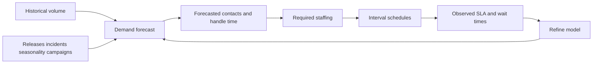
### 4.1 Demand forecasting basics
Demand means how much work is likely to arrive.
In support, demand is not random noise only.
It is shaped by product releases, outage patterns, seasonality, billing cycles, geography, installed base growth, and self-service changes.
### 🔍 Plain-English deep-dive
- **Demand forecasting** means predicting how many contacts or cases will arrive in future periods.
- Forecasts can be daily, weekly, monthly, or intra-day by 15-minute or 30-minute interval.
- **Analogy:** it is like predicting traffic before deciding how many toll booths to open.
| Forecast input | Why it matters | Example in support |
|---|---|---|
| Historical volume | Base pattern | Monday chat spike |
| Seasonality | Repeating cycle | Month-end admin activity |
| Release calendar | Product-driven workload | New M365 feature rollout |
| Incident history | Spike risk | Tenant-wide sync outage |
| Installed base | Demand denominator | More seats can mean more contact potential |
| Self-service changes | Channel shift | Better article lowers assisted contacts |
| Segment mix | Complexity shift | Enterprise may generate fewer but longer cases |

### 4.2 Forecasting methods you should know by name
- **Naive forecast** — next period equals recent period. Good baseline, not enough alone.
- **Moving average** — smooths noise by averaging recent windows.
- **Seasonal average** — compares Mondays to Mondays, month-ends to month-ends.
- **Regression or gradient boosting** — uses drivers like releases, incidents, and seat growth.
- **Time-series models** — ARIMA, Prophet, ETS, and related methods.
- **Hierarchical forecasting** — align product, region, and global totals.
- **ML forecast ensembles** — combine multiple models and select the best performer by horizon.

### 4.3 Erlang C intro
Workforce teams often use Erlang C for queue-based channels like phone and chat.
You do not need to derive the math in an interview.
You do need to understand what it is trying to solve.
### 🔍 Plain-English deep-dive
- **Erlang C** estimates how many agents are needed to meet a waiting-time target under random arrivals and queueing assumptions.
- Inputs usually include forecasted contacts, average handle time, target service level, and interval length.
- Output is a staffing requirement and predicted wait behaviour.
- **Analogy:** it is the math version of asking how many checkout counters a supermarket needs so queues do not explode.
| Erlang C concept | Plain-English meaning |
|---|---|
| Offered load | How much work arrives compared with handling capacity |
| Service level target | The promise, such as 80% of calls answered in 20 seconds |
| Average speed of answer | Expected wait before answer |
| Occupancy | How busy agents will be if staffed at that level |

### 4.4 Shrinkage-aware staffing
A common beginner mistake is to forecast workload correctly and still under-staff.
Why?
Because not all paid time is contact-ready time.
**Core formula**
`Required FTE after shrinkage = Base handling FTE / (1 - Shrinkage rate)`
For example:
- If handling need is 80 FTE and shrinkage is 25%,
- then required scheduled FTE = 80 / 0.75 = 106.7 FTE.
That means you need roughly 107 scheduled FTE to get 80 effective ready FTE.
### 🔍 Plain-English deep-dive
- **Shrinkage** includes leave, holidays, meetings, training, coaching, breaks, system downtime, and other time not available for direct queue work.
- If you ignore shrinkage, the forecast looks good on paper and terrible in production.
- This is one of the most practical analytics-to-operations bridges in support.

### 4.5 Scheduling and interval planning
Forecasting says how much work is coming.
Scheduling decides who is available when.
| Scheduling concept | Meaning | Why analysts care |
|---|---|---|
| Interval forecast | Demand by 15-minute or 30-minute slot | One daily total can hide queue explosions |
| Shift design | Start times and lengths | Better fit between demand and coverage |
| Break placement | Non-working windows inside shift | Can create avoidable short-term SLA misses |
| Skill-based staffing | Matching agents to products / languages / channels | A global headcount can still miss the right skill mix |
| Schedule adherence | Whether plans were followed | Distinguishes bad forecast from poor execution |
> 💡 **Tie-in to your background:** Escalation teams feel staffing gaps immediately. Long waits, stale backlog, and overloaded specialists are the operational symptoms of poor forecasting or poor skill alignment.
---
## 5. SLA, SLO, OLA, and escalation management
Support organisations run on promises.
Some promises are made to customers.
Some are internal reliability goals.
Some are handoff promises between teams.
Analytics must keep all three visible.
### 5.1 SLA vs SLO vs OLA
| Term | Plain-English meaning | Audience | Example |
|---|---|---|---|
| SLA | Formal service promise | Customer or partner | First response within 4 hours |
| SLO | Internal target for desired performance | Operations / engineering / leadership | 95% of Sev B cases updated every 24 hours |
| OLA | Internal agreement between teams that supports an SLA | Internal teams | Engineering review within 8 hours after escalation |
### 🔍 Plain-English deep-dive
- **SLA** is the customer-facing promise.
- **SLO** is the internal target the team manages toward.
- **OLA** is the internal handshake that makes the external promise possible.
- If OLA performance is weak, SLA performance eventually breaks.

### 5.2 Escalation management
Escalation management is where your experience becomes especially powerful.
An escalation is not just a transfer.
It is a risk signal.
It often means the current support layer cannot solve the issue alone because of complexity, severity, customer risk, product uncertainty, or internal dependency.
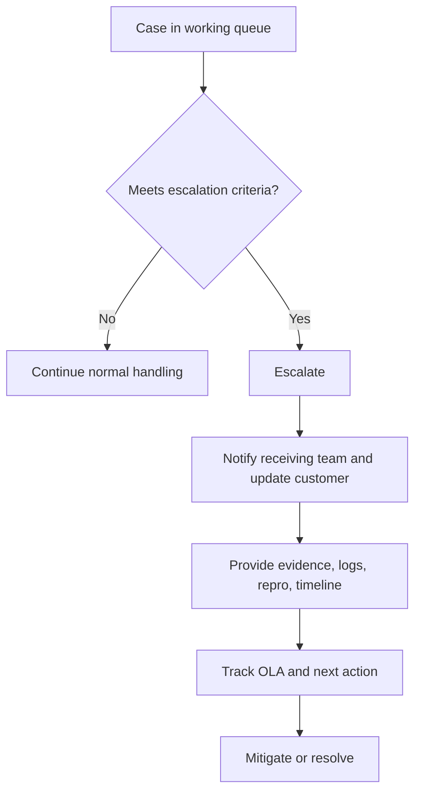
### 🔍 Plain-English deep-dive
- Good escalation management is about **speed**, **clarity**, **evidence quality**, and **customer communication**.
- A bad escalation is a handoff without enough context.
- A good escalation is a package: issue summary, customer impact, timeline, troubleshooting done, logs, reproduction steps, and next ask.
- Analysts can quantify where escalation quality breaks down.
| Escalation management question | Why it matters | Example KPI or cut |
|---|---|---|
| Which categories escalate most? | Find knowledge or skill gaps | Escalation rate by taxonomy |
| Which escalations breach most? | Find OLA pain | OLA attainment by receiving team |
| Which escalations reopen most? | Find weak solution quality | Reopen rate after escalation |
| Which segments escalate differently? | Align operating model to customer value | Escalation rate by Enterprise vs SMB |
| Which releases trigger escalation spikes? | Connect support data to product change | Escalations by release cohort |

### 5.3 Major incident management
A major incident is not just a large case.
It is a service event with broad impact, intense time pressure, and heavy communication needs.
```mermaid
flowchart LR
    Detect[Detect spike or outage] --> Declare[Declare major incident]
    Declare --> Bridge[Open command bridge]
    Bridge --> Triage[Scope impacted products regions segments]
    Triage --> Mitigate[Mitigate customer impact]
    Mitigate --> Communicate[Send updates]
    Communicate --> Recover[Recover service]
    Recover --> PIR[Post-incident review]
    PIR --> Improve[Fix root causes and playbooks]
```
### 🔍 Plain-English deep-dive
- Major incident analytics includes time-to-detect, time-to-mitigate, update cadence, impact breadth, and post-incident recurrence risk.
- During incidents, queue metrics alone are not enough.
- You also need service telemetry, product signals, and communication effectiveness.
- Analysts help by turning chaotic event data into a clear operational narrative.
> 💡 **Tie-in to your background:** In escalation roles, you have probably felt the difference between normal case work and high-severity incident handling. That lived distinction gives your analytics answers real credibility.
---
## 6. Knowledge management and KCS
Support quality does not scale by memory alone.
It scales by reusable knowledge.
### 6.1 What KCS means
KCS stands for **Knowledge-Centered Service**.
The basic idea is simple:
solve the issue, capture what was learned, improve the article, and reuse that knowledge next time.
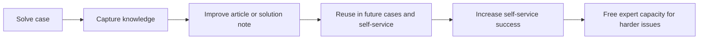
### 🔍 Plain-English deep-dive
- KCS treats support interactions as knowledge-generation opportunities.
- Instead of solving the same issue from scratch repeatedly, the team builds a reusable memory.
- **Analogy:** every solved case becomes a recipe card for the next cook.

### 6.2 Content lifecycle
Knowledge content has its own lifecycle just like cases do.
| Stage | Plain-English meaning | Common metric |
|---|---|---|
| Draft | New article not yet trusted | Time to publish |
| Review | Technical and editorial validation | Review cycle time |
| Published | Available to agents or customers | Views, usage, effectiveness |
| Improved | Updated after feedback or new learnings | Helpful vote trend |
| Retired | Archived because outdated or redundant | Retirement rate, broken-link risk |

### 6.3 How knowledge drives deflection
Better content improves self-service in three ways.
- It helps customers solve issues without contacting support.
- It helps frontline agents solve issues without escalating.
- It improves consistency, so customers receive the same answer across channels.
### 🔍 Plain-English deep-dive
- A knowledge base is not a static library.
- It is a traffic system.
- Good content routes easy demand away from humans and routes complex demand toward the right humans faster.
- That is why content analytics is really support-capacity analytics in disguise.
| Knowledge metric | Formula or idea | Why it matters |
|---|---|---|
| Article views | Views per article | Shows demand for topic |
| Helpful rate | Helpful votes / votes | Direct usefulness signal |
| Article-assisted FCR | FCR when article used vs not used | Shows agent-assist value |
| Article deflection proxy | No-contact sessions after article view / article sessions | Estimates self-service resolution |
| Content freshness | Days since last review | Stale articles hurt trust |
| Search-to-article click-through | Article clicks / searches | Discoverability signal |
> 💡 **Tie-in to your background:** Your process-improvement mindset is perfect here. In support, better playbooks and better knowledge reduce escalations just like better data models reduce reporting confusion.
---
## 7. The customer lens
Support analytics is not only about tickets.
It is about customers moving through a journey.
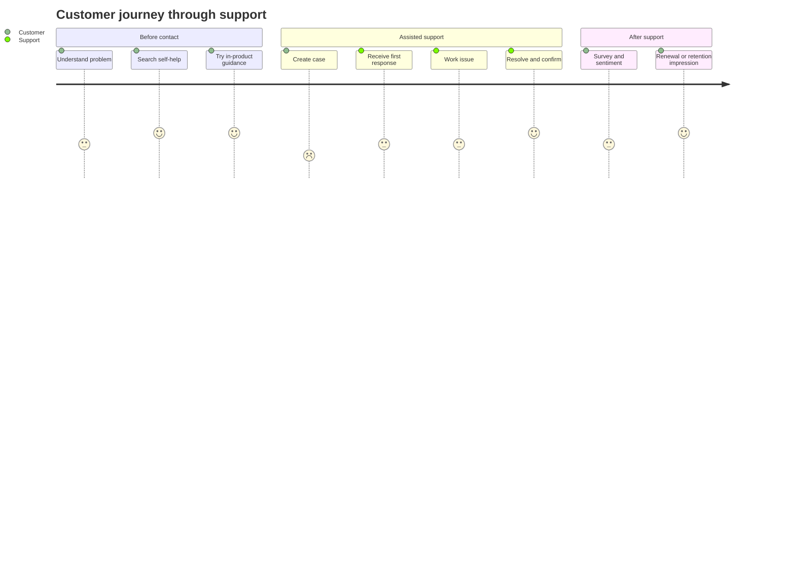
### 7.1 Customer journey and lifecycle
A support event sits inside a bigger customer lifecycle.
That lifecycle may include onboarding, adoption, expansion, renewal, and retention.
Support quality can strengthen or damage each stage.
### 🔍 Plain-English deep-dive
- If a new customer struggles during onboarding, support data is an adoption signal.
- If a mature enterprise customer sees repeated severe incidents, support data becomes a churn-risk signal.
- Support is not a side department; it is part of the customer experience system.

### 7.2 Segmentation
Segmentation means slicing customers into meaningful groups so you do not average away important differences.
| Segment example | Why it matters in support | Example question |
|---|---|---|
| Enterprise | Fewer but more complex, higher expectation, stricter commitments | Are P90 resolution times rising for enterprise escalations? |
| SMB | Higher volume, lower-touch, more self-service dependency | Is self-service content good enough to protect SMB CSAT? |
| Partner / DP | Service delivered through a partner model | Are delivery-partner queues sustaining target CSAT and SLA? |
| Product family | Different issue types and operating motions | Which product drives the aged-case tail? |
| Geography / region | Language, time-zone, compliance differences | Which region needs more skill coverage? |
| Tenant size / seats | Complexity and risk level differ | Does contact rate rise with seat growth? |
> 💡 **Tie-in to your background:** You already think in DP vs SMB terms because you tracked those CSAT targets separately. That is textbook segmentation thinking.

### 7.3 Customer health scores
A health score is a combined indicator that estimates how healthy a customer relationship is.
**Example health score ingredients**
- Recent support volume
- Severe-case count
- SLA breaches
- CSAT or NSAT trend
- Product adoption measures
- Renewal timing
- Sentiment from verbatims or case notes
**Simple formula idea**
`Customer Health Score = weighted positive signals - weighted risk signals`
For example:
`Health = 100 - 15*(SevA count) - 10*(breaches) - 8*(negative sentiment cases) + 5*(successful adoption events)`
The exact formula varies.
The analyst's job is to make it useful, explainable, and stable.

### 7.4 Churn and retention lens
Support teams do not directly own churn in every organisation.
But support signals often predict it.
| Signal | Why it may indicate churn risk |
|---|---|
| Rising severe-case volume | Product experience may be unstable for that customer |
| Repeated reopenings | Problems are not staying solved |
| Negative survey verbatims | Trust is eroding |
| Long unresolved escalations | Customer feels unsupported |
| High effort across channels | Friction accumulates |
### 🔍 Plain-English deep-dive
- **Churn** means a customer reduces or ends their relationship.
- **Retention** means they stay and ideally deepen usage.
- Support data matters because bad service experiences are often emotional moments customers remember during renewal decisions.

### 7.5 Voice of Customer, sentiment, and verbatim analytics
Voice of Customer data includes surveys, free-text comments, case notes, community posts, and sometimes call transcripts.
This is where support analytics becomes deeply human.
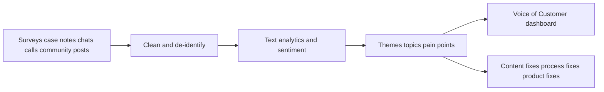
### 🔍 Plain-English deep-dive
- **Sentiment analysis** estimates emotional tone.
- **Topic extraction** finds common themes like sync issues, permissions confusion, or migration pain.
- **Verbatim analytics** means reading what customers actually said, not only the score they selected.
- The score tells you *that* a problem exists.
- The words help explain *why*.
---
## 8. Support analytics use-case catalog
A CE&S BI team can own or heavily support a large catalog of analytics use-cases.
It helps to organise them from descriptive to prescriptive.
| Analytics layer | Plain-English question | Support example | Typical output |
|---|---|---|---|
| Descriptive | What happened? | Weekly case volume by product and channel | Dashboard, trend chart |
| Diagnostic | Why did it happen? | Escalation spike after release | Driver tree, breakdown, root-cause view |
| Predictive | What is likely to happen next? | Forecast next week's chat demand | Forecast or risk score |
| Prescriptive | What should we do? | Which article to improve first to cut assisted volume | Recommendation, action list |
### 8.1 Common use-cases the BI team may own
- Executive support health scorecards
- Queue and staffing dashboards
- Escalation trend analysis
- Release-impact monitoring
- Major-incident support command views
- CSAT and VoC deep dives
- Self-service funnel analytics
- KB effectiveness and gap analysis
- Delivery-partner performance reporting
- Customer-segment performance monitoring
- Forecasting and staffing recommendation models
- Churn-risk and customer-health analytics
- ML routing or recommendation performance evaluation
- Analyst-facing semantic models and certified KPI layers
> 💡 **Tie-in to your background:** 'Analysed recurring escalation trends and delivery-partner pain points to drive process improvement' is exactly the language of a support analytics use-case. Say it that way.
### 8.2 Detailed support analytics use-case matrix
| Use-case | Primary stakeholder | Main grain | Typical metric | Typical action |
|---|---|---|---|---|
| Daily queue health | Queue lead | Queue x day | Backlog, FRT, aged cases | Rebalance staffing |
| Executive service review | Support director | Product x week | CSAT, SLA, escalation rate | Set priorities and funding |
| Release watch | Product + support | Release cohort x day | Contact rate, DSAT, incident spikes | Trigger rollback or hotfix review |
| Partner quality monitoring | Vendor manager | Partner x month | CSAT, SLA, transfer rate | Coaching or contract review |
| Knowledge-gap analysis | KM lead | Issue taxonomy x month | Article effectiveness, escalation rate | Create or refresh content |
| Self-service funnel analysis | Digital support lead | Session x channel | Search success, containment, bounce | Improve search and bot prompts |
| Major incident support dashboard | Incident manager | Incident x hour | Queue spike, breach risk, sentiment | Allocate swarm resources |
| Customer-risk watchlist | Account team | Customer x week | Sev count, unresolved escalations | Proactive outreach |
| Workforce planning | Operations manager | Interval x queue | Forecast vs actual, occupancy | Adjust schedules |
| Agent-assist performance | Support enablement | Agent x week | FCR lift, adoption, edit rate | Tune recommendation logic |
| Taxonomy health audit | BI / governance | Taxonomy node x month | Miscategorisation, transfer rate | Fix labels and mappings |
| Cost-to-serve review | Finance + support | Channel x month | Cost per contact, deflection | Shift investment mix |

### 8.3 Descriptive to prescriptive maturity ladder
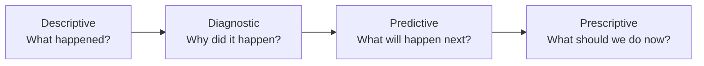
### 🔍 Plain-English deep-dive
- Descriptive support analytics tells the story of workload and outcomes.
- Diagnostic analytics finds the drivers, such as one product, one partner queue, or one article gap.
- Predictive analytics estimates what is likely next, such as escalation risk or next week's volume.
- Prescriptive analytics recommends action, such as which queue needs help first or which KB article is the highest-value fix.
- A strong BI team usually supports all four layers, even if not every output uses ML.
---
## 9. ML and AI in support — use-cases, targets, and features
The JD explicitly mentions ML models.
For this role, you should understand what the models are usually trying to predict and what data feeds them.
### 9.1 Case classification and routing
### 🔍 Plain-English deep-dive
- **Target or label** — Predict product, issue category, queue, priority, or resolver group for a new case.
- **Common features** — Case title, description text, product metadata, tenant attributes, customer segment, channel, language, historical similar cases.
- **Typical model family** — Text classification, gradient boosting, transformer-based NLP, or hybrid rule-plus-model systems.
- **How success is measured** — Accuracy, macro F1, top-3 routing accuracy, transfer reduction.
- **Business value** — Faster assignment, lower transfer rate, shorter FRT, lower workload waste.
- **Main risk** — Bad taxonomy labels, drift after product changes, and overconfidence in ambiguous cases.

### 9.2 Article recommendation and deflection
### 🔍 Plain-English deep-dive
- **Target or label** — Predict which article, troubleshooting flow, or Copilot answer is most likely to solve the issue before a human is needed.
- **Common features** — Search query, page context, user role, product area, prior click stream, tenant attributes, issue text.
- **Typical model family** — Ranking model, semantic search, recommendation model, RAG retrieval layer.
- **How success is measured** — Click-through, self-service success, deflection lift, containment lift.
- **Business value** — Higher self-service success and lower assisted load.
- **Main risk** — False deflection, outdated content, and recommendations that optimise clicks instead of outcomes.

### 9.3 Escalation prediction
### 🔍 Plain-English deep-dive
- **Target or label** — Predict whether an open case is likely to escalate.
- **Common features** — Issue category, severity, customer segment, sentiment, initial response delay, transfer count, article usage, reopen history, product-release timing.
- **Typical model family** — Binary classification such as logistic regression, random forest, XGBoost, or calibrated neural models.
- **How success is measured** — AUC, precision at top risk decile, lift, actionable recall.
- **Business value** — Lets teams intervene early with specialists, better updates, or better knowledge.
- **Main risk** — Label leakage and self-fulfilling routing changes if the score changes behaviour.

### 9.4 Churn or retention risk prediction
### 🔍 Plain-English deep-dive
- **Target or label** — Predict whether a customer account is at elevated renewal or retention risk.
- **Common features** — Support volume, severe incidents, CSAT trend, unresolved escalations, sentiment, adoption metrics, seat changes, account tenure.
- **Typical model family** — Binary classification or survival analysis depending on data maturity.
- **How success is measured** — AUC, precision-recall, retention lift from targeted intervention.
- **Business value** — Connects support experience to account-health action.
- **Main risk** — Outcome labels may arrive late and support data alone may not explain everything.

### 9.5 Volume forecasting
### 🔍 Plain-English deep-dive
- **Target or label** — Predict future contact or case volume by channel, product, or interval.
- **Common features** — Historical contacts, seasonality markers, holiday flags, releases, incidents, installed base, campaigns, self-service launches.
- **Typical model family** — ARIMA, Prophet, ETS, gradient boosting, LSTM, or ensemble forecasts.
- **How success is measured** — MAPE, WAPE, RMSE, bias, service-level outcomes after staffing.
- **Business value** — Improves staffing, scheduling, and budget planning.
- **Main risk** — Structural breaks after major product changes or new support surfaces.

### 9.6 Sentiment and verbatim theme analysis
### 🔍 Plain-English deep-dive
- **Target or label** — Predict sentiment or classify topics from surveys, chats, and case notes.
- **Common features** — Raw text, embeddings, channel, product, language, customer segment.
- **Typical model family** — NLP classification, topic modeling, embedding clustering, LLM-assisted summarisation.
- **How success is measured** — Sentiment accuracy, theme coherence, analyst usefulness.
- **Business value** — Finds pain points earlier than score-only reporting.
- **Main risk** — Sarcasm, domain jargon, multilingual drift, and privacy handling.

### 9.7 Anomaly detection
### 🔍 Plain-English deep-dive
- **Target or label** — Detect unusual spikes or drops in support demand or quality metrics.
- **Common features** — Time-series values, seasonality, product release markers, region, channel, incident telemetry.
- **Typical model family** — Control charts, seasonal hybrid ESD, isolation forest, autoencoders, Bayesian changepoint methods.
- **How success is measured** — Precision of alerts, false-positive rate, mean time to detect.
- **Business value** — Earlier recognition of outages, regressions, and broken content.
- **Main risk** — Alert fatigue if thresholds ignore normal seasonality.

### 9.8 Agent-assist and next-best-action
### 🔍 Plain-English deep-dive
- **Target or label** — Recommend the next action, script, article, or escalation path during live handling.
- **Common features** — Live conversation text, issue taxonomy, customer profile, prior resolution paths, knowledge usage.
- **Typical model family** — Recommendation systems, retrieval systems, policy models, GenAI with guardrails.
- **How success is measured** — FCR lift, handle-time improvement, article adoption, agent acceptance rate.
- **Business value** — Speeds handling and reduces inconsistency.
- **Main risk** — Bad recommendations can spread errors quickly.

### 9.9 Case summarisation
### 🔍 Plain-English deep-dive
- **Target or label** — Generate accurate case summaries, handoff notes, and timeline digests.
- **Common features** — Case notes, emails, chat transcripts, diagnostics, prior actions.
- **Typical model family** — LLM summarisation, template-driven summarisation, extractive summarisation.
- **How success is measured** — Human-rated usefulness, edit rate, hallucination rate, handoff-speed gain.
- **Business value** — Reduces reading time and improves handoff quality.
- **Main risk** — Hallucinated facts or omitted critical details.

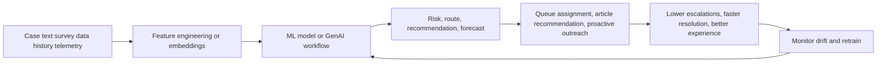
---
## 10. GenAI and Copilot in support
GenAI is not a separate universe from support analytics.
It sits on top of the same knowledge, interaction, and customer data that BI teams help model and govern.
### 10.1 RAG over the knowledge base
RAG stands for **Retrieval-Augmented Generation**.
It means the model first retrieves relevant trusted content, then generates an answer grounded in that content.
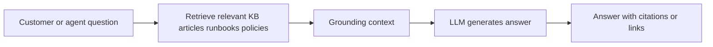
### 🔍 Plain-English deep-dive
- Without retrieval, a model may answer from generic training memory.
- With retrieval, it answers from your current support content.
- **Analogy:** it is like asking an intern to answer only after checking the official binder.

### 10.2 Support GenAI use-cases
| Use-case | What it does | Main benefit | Main risk |
|---|---|---|---|
| Case summarisation | Condenses long case history | Faster handoff, faster reading | Missing or invented facts |
| Draft response generation | Suggests customer reply drafts | Speed and consistency | Tone issues or incorrect claims |
| Self-service Copilot chat | Answers customer questions | Scale and 24x7 reach | Hallucination or unsafe advice |
| Agent assist | Recommends troubleshooting steps or articles | Better FCR, lower handle time | Overreliance on weak recommendations |
| Analyst 'chat with data' | Lets analysts query metrics in natural language | Faster exploration | Semantic misunderstanding of measures |
### 10.3 Risks and guardrails
- **Hallucination** — the model states something false with confidence.
- **Privacy risk** — the workflow may expose sensitive customer or tenant data if not properly controlled.
- **Prompt injection or unsafe content retrieval** — external or untrusted content may try to manipulate the response.
- **Grounding drift** — good content yesterday may be outdated today.
- **Metric ambiguity** — a natural-language analytics answer can use the wrong definition if the semantic layer is weak.
### 🔍 Plain-English deep-dive
- GenAI is powerful in support because support generates lots of text, repetitive explanations, and knowledge reuse opportunities.
- It is risky for the same reason.
- If the underlying knowledge, governance, and metric definitions are weak, GenAI can amplify the weakness at scale.
> 💡 **Tie-in to your background:** You piloted Copilot Studio. That is a major credibility point. Say that you have seen both the promise and the guardrail need: grounding, escalation paths, privacy, and measurement of actual containment rather than vanity usage.
### 10.4 Analyst "chat with data" for support BI
One increasingly important GenAI pattern is the analyst or leader asking support questions in plain English.
Examples:
- "Why did SMB CSAT fall last week?"
- "Which queues drove the aged-case increase?"
- "Show me escalations for OneDrive by partner and severity."

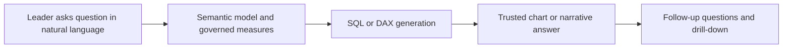
### 🔍 Plain-English deep-dive
- This is powerful only if the semantic layer is governed.
- If the metric definition for escalation rate is inconsistent, the chatbot will confidently return the wrong number faster.
- Good support BI teams treat semantic governance as a prerequisite for natural-language analytics, not an afterthought.
- Useful guardrails include certified measures, data-source lineage, question templates, and clear refusal behavior for ambiguous asks.
---
## 11. The support star schema tying Parts 5-9 together
Here is the data-model lens that unifies the support domain with the earlier technical sections.
```mermaid
flowchart TD
    Date[Dim_Date] --- Fact[Fact_Cases]
    Agent[Dim_Agent SCD2] --- Fact
    Customer[Dim_Customer Segment Health] --- Fact
    Product[Dim_Product] --- Fact
    Channel[Dim_Channel] --- Fact
    Issue[Dim_Issue_Taxonomy] --- Fact
    Severity[Dim_Severity] --- Fact
    Queue[Dim_Queue] --- Fact
    Geography[Dim_Geography] --- Fact
    Fact --- Survey[Fact_Surveys]
    Fact --- SelfServe[Fact_SelfServe_Sessions]
```
### 11.1 Core fact table: Fact_Cases
**Grain:** one row per support case at the chosen business grain, or one row per case-status snapshot if you need point-in-time tracking.
Typical measures include:
- case_count
- csat_score
- first_response_minutes
- resolution_minutes
- escalated_flag
- reopened_flag
- sla_met_flag
- transfer_count
- backlog_flag
- aged_bucket_key

### 11.2 Conformed dimensions
| Dimension | Why it matters | Key design note |
|---|---|---|
| Dim_Date | Common time slicing | Use fiscal calendars as needed |
| Dim_Product | Support by product family | Conform across support and product analytics |
| Dim_Customer | Segment, tenant size, geography | Useful for Enterprise / SMB / DP cuts |
| Dim_Channel | Phone, chat, email, portal, self-service | Needed for omnichannel reporting |
| Dim_Issue_Taxonomy | Topic and root-cause rollups | Governance-heavy and business-critical |
| Dim_Queue | Operational work buckets | Enables staffing and routing analysis |
| Dim_Severity | Customer impact lens | Keep meaning standardised |
| Dim_Agent | Owner, team, role, tier | Often needs SCD2 history |

### 11.3 Why Dim_Agent often needs SCD2
Agents move between teams, tiers, and skill groups.
If you overwrite history, yesterday's cases will appear to have been owned by today's team structure.
That breaks trend analysis.
### 🔍 Plain-English deep-dive
- **SCD2** means creating a new dimension row when a tracked attribute changes, while preserving the old row for history.
- In support, that helps when an engineer moves from SMB to enterprise or from frontline to escalation.
- It keeps historical metrics aligned to the organisational reality that existed at the time.

### 11.4 Extending the model beyond cases
A mature support analytics model usually adds more than one fact table.
| Fact table | Grain | Why it exists |
|---|---|---|
| Fact_Cases | One row per case or case snapshot | Core assisted-support reporting |
| Fact_Surveys | One row per survey response | CSAT, NSAT, CES, verbatim analysis |
| Fact_SelfServe_Sessions | One row per self-service session | Deflection, containment, search performance |
| Fact_KB_Usage | One row per article view / interaction | Content effectiveness |
| Fact_Queue_Intervals | One row per queue interval | Staffing, abandonment, service-level operations |
> 💡 **Tie-in to your background:** The star schema formalises what you have already lived operationally: customer segment, issue type, queue, tier, channel, severity, and satisfaction are not random fields. They are the dimensions that explain support reality.
### 11.5 Business questions this model should answer fast
- Which product and issue taxonomy combinations drive the highest escalation rate?
- Is SMB CSAT dropping because of one channel, one region, or one partner queue?
- Which queues have the oldest tail, even if total backlog looks flat?
- Which knowledge articles reduce escalations when used by frontline agents?
- Which release cohorts show rising contact rate per active seat?
- Which major incidents created the strongest downstream DSAT pattern?

### 11.6 Example warehouse and BI logic
```sql
SELECT
    d.fiscal_month,
    p.product_family,
    c.segment_name,
    AVG(f.csat_score) AS avg_csat,
    AVG(CASE WHEN f.escalated_flag = 1 THEN 1.0 ELSE 0.0 END) AS escalation_rate
FROM Fact_Cases f
JOIN Dim_Date d
  ON f.date_key = d.date_key
JOIN Dim_Product p
  ON f.product_key = p.product_key
JOIN Dim_Customer c
  ON f.customer_key = c.customer_key
GROUP BY d.fiscal_month, p.product_family, c.segment_name;
```
```DAX
Escalation Rate =
DIVIDE(
    CALCULATE(COUNTROWS('Fact_Cases'), 'Fact_Cases'[escalated_flag] = 1),
    COUNTROWS('Fact_Cases')
)
```
### 🔍 Plain-English deep-dive
- The warehouse joins dimensions so the case fact becomes explainable.
- The semantic layer turns those joins into reusable business language.
- That means the dashboard author, the executive, and the ML feature engineer can all use the same governed meaning for product, segment, and escalation.
---
## 12. Microsoft-specific context
For this role, generic support knowledge is good.
Microsoft-flavoured support knowledge is better.
### 12.1 CE&S in plain English
CE&S stands for **Customer Experience & Success**.
It is the broad Microsoft organisation focused on helping customers adopt, operate, and succeed with Microsoft products and services.
In support analytics terms, CE&S is where customer needs, support motions, cloud products, partner ecosystems, and service quality all meet.
### 12.2 Product and service context
Support analytics at Microsoft can span cloud and business products such as:
- Microsoft 365 workloads like SharePoint Online, OneDrive for Business, Teams, Exchange, and related admin experiences.
- Azure services with different incident and technical-support patterns.
- Dynamics 365 and Power Platform service experiences.
- Unified or enterprise support relationships with higher-touch expectations.
### 12.3 Assisted + self-service at Microsoft scale
At Microsoft scale, no single motion can absorb all demand.
That is why assisted and self-service are intentionally linked.
- Search, docs, KB, community, troubleshooters, and Copilot absorb repeatable or simpler demand.
- Assisted channels handle complexity, ambiguity, and high-impact cases.
- BI teams help leadership see whether that portfolio is balanced by product, segment, geography, and channel.
### 12.4 Why your background fits unusually well
You are not coming from a generic reporting role trying to learn support language from scratch.
You are coming from the support domain itself.
That means you can talk about customer pain, escalation friction, partner quality, and CSAT improvement with operational realism.
That is exactly what makes your transition into a CE&S BI analyst story believable.
### 12.5 Support data sources at Microsoft scale
At a company the size of Microsoft, support analytics rarely comes from one system.
It usually blends multiple data families.
| Data family | What it contributes | Example analytical use |
|---|---|---|
| Case-management data | State changes, timestamps, ownership, severity | FRT, MTTR, backlog, escalation rate |
| Survey data | CSAT, NSAT, CES, verbatims | Satisfaction trends and VoC |
| Self-service telemetry | Search, article views, bot sessions, click paths | Deflection and containment |
| Product telemetry | Service health, errors, release markers | Spike diagnosis and incident correlation |
| Workforce data | Schedules, shrinkage, adherence, staffing | Capacity planning |
| Knowledge data | Article lifecycle, ratings, usage | KCS and content effectiveness |
| Customer-account data | Segment, seat counts, contract tier, renewal timing | Contact rate, customer health, churn risk |

### 12.6 Assisted + self-service operating rhythm
Another strong Microsoft-specific framing is that support is managed as a portfolio.
| Rhythm | Typical question | Example owner |
|---|---|---|
| Daily | Are queues healthy right now? | Operations lead |
| Weekly | Which products or segments are worsening? | Support BI / service manager |
| Monthly | Are we hitting CSAT, SLA, and cost targets? | Leadership |
| Quarterly | Where should we invest in content, tooling, staffing, or AI? | CE&S leadership and partner teams |
### 🔍 Plain-English deep-dive
- Daily views are operational.
- Weekly views are diagnostic.
- Monthly views are management and partner-performance views.
- Quarterly views shape investment decisions, such as whether to improve self-service, fund a support tool, or redesign escalation playbooks.
- This is exactly where a BI analyst creates value: not by making prettier charts, but by making the operating rhythm smarter.
---
## 13. 🧪 Hands-on Lab Demo 1 — Build a support KPI scorecard in SQL
**Goal:** Turn raw support-case data into the KPI scorecard a queue manager or support leader would actually use.
**Tool:** Any SQL engine such as SQLite or SQL Server.
**Business story:** Imagine you want one dataset that shows queue health, satisfaction, efficiency, and self-service performance by date, product, segment, and channel.
### 13.1 Create a mini raw table
```sql
CREATE TABLE cases (
    case_id INTEGER PRIMARY KEY,
    created_at TEXT,
    first_response_at TEXT,
    resolved_at TEXT,
    product TEXT,
    segment TEXT,
    channel TEXT,
    severity TEXT,
    csat_score REAL,
    escalated INTEGER,
    reopened INTEGER,
    transferred INTEGER,
    sla_met INTEGER,
    self_serve_session INTEGER,
    self_serve_success INTEGER
);
```
### 13.2 Example KPI queries
```sql
SELECT
    segment,
    AVG(csat_score) AS avg_csat,
    AVG(CASE WHEN escalated = 0 AND reopened = 0 THEN 1.0 ELSE 0.0 END) AS fcr_proxy,
    AVG(CAST(escalated AS FLOAT)) AS escalation_rate,
    AVG(CAST(reopened AS FLOAT)) AS reopen_rate,
    AVG(CAST(sla_met AS FLOAT)) AS sla_attainment
FROM cases
GROUP BY segment;
```
```sql
SELECT
    product,
    AVG((julianday(first_response_at) - julianday(created_at)) * 24 * 60) AS frt_minutes,
    AVG((julianday(resolved_at) - julianday(created_at)) * 24) AS mttr_hours
FROM cases
GROUP BY product
ORDER BY mttr_hours DESC;
```
```sql
SELECT
    channel,
    AVG(CAST(self_serve_success AS FLOAT)) AS self_serve_success_rate,
    AVG(CAST(self_serve_session AS FLOAT)) AS self_serve_mix
FROM cases
GROUP BY channel;
```
### 13.3 What to look for
- Which segment has the best CSAT?
- Which product has the worst FRT or MTTR?
- Which channels show low satisfaction but high cost?
- Which product has the highest escalation rate and therefore the strongest content or engineering improvement opportunity?

## 14. 🧪 Hands-on Lab Demo 2 — Turn the SQL dataset into a Power BI support health page
**Goal:** Build the one-page view a support leader would read every morning.
### 14.1 Recommended visuals
- KPI cards for CSAT, FCR, escalation rate, median resolution time, SLA attainment, and deflection proxy.
- Trend line for daily case volume and CSAT.
- Stacked bar for backlog by age bucket.
- Matrix for product by segment with conditional formatting.
- Decomposition tree for escalation rate or DSAT.
- Slicers for segment, channel, product, severity, and fiscal month.
### 14.2 Useful DAX measures
```DAX
Cases = COUNTROWS('cases')
```
```DAX
Avg CSAT = AVERAGE('cases'[csat_score])
```
```DAX
Escalation Rate = DIVIDE(CALCULATE(COUNTROWS('cases'), 'cases'[escalated] = 1), [Cases])
```
```DAX
Reopen Rate = DIVIDE(CALCULATE(COUNTROWS('cases'), 'cases'[reopened] = 1), [Cases])
```
```DAX
SLA Attainment = DIVIDE(CALCULATE(COUNTROWS('cases'), 'cases'[sla_met] = 1), [Cases])
```
### 14.3 Success check
If a support manager can answer 'Are we healthy, where are we unhealthy, and what should we inspect first?' from your page, the lab worked.

## 15. 🧪 Hands-on Lab Demo 3 — Forecast queue demand and estimate staffing
**Goal:** Connect support analytics to workforce planning.
### 15.1 Create a daily demand series
```sql
SELECT
    DATE(created_at) AS case_date,
    COUNT(*) AS cases_opened
FROM cases
GROUP BY DATE(created_at)
ORDER BY case_date;
```
### 15.2 Simple forecast logic to explain in interview
- Start with recent 4-week moving average.
- Adjust for known release events.
- Separate weekdays if demand is strongly seasonal.
- Convert forecasted volume into workload using average handle time and expected resolution effort.
- Inflate staffing for shrinkage.
### 15.3 Staffing mini-example
- Forecasted contacts for a day: 1,200
- Average handle time: 18 minutes
- Required handling minutes: 21,600
- Handling hours: 360
- If one effective FTE gives 6.0 contact-ready hours, base need = 60 FTE
- If shrinkage is 25%, scheduled need = 60 / 0.75 = 80 FTE
---
## 📚 Reference Links
- [Microsoft Learn — Dynamics 365 Customer Service analytics](https://learn.microsoft.com/dynamics365/customer-service/use/cs-analytics-dashboards)
- [Microsoft Learn — Omnichannel for Customer Service](https://learn.microsoft.com/dynamics365/customer-service/administer/overview-omnichannel)
- [Microsoft Learn — Copilot and AI features for Customer Service](https://learn.microsoft.com/dynamics365/customer-service/administer/configure-copilot-features)
- [Microsoft Learn — Microsoft Fabric documentation](https://learn.microsoft.com/fabric/)
- [Microsoft Learn — Power BI guidance](https://learn.microsoft.com/power-bi/guidance/)
- [Microsoft Learn — Azure AI Language documentation](https://learn.microsoft.com/azure/ai-services/language-service/overview)
- [HBR — Stop Trying to Delight Your Customers](https://hbr.org/2010/07/stop-trying-to-delight-your-customers)
- [KCS Academy overview](https://www.kcsacademy.com/)
- [NICE — Contact center metrics glossary](https://www.nice.com/)
- [Zendesk CX metrics guide](https://www.zendesk.com/blog/customer-service-metrics/)
- [Gartner customer service and support research](https://www.gartner.com/en/customer-service-support)
---
## ⭐ Likely Interview Questions
**Q1. "What's the difference between assisted and self-service support, and why does the BI team care?"**
> *Model answer:* Assisted support is human-led resolution through channels like phone, chat, email, and web cases. Self-service support is customer-led resolution through search, knowledge, bots, community, or in-product guidance. The BI team cares because the operating model aims to shift the right demand toward self-service without hurting customer outcomes. That means tracking deflection, containment, CSAT, and cost together, not in isolation.
**Q2. "How would you explain FCR to a business leader?"**
> *Model answer:* I would say FCR is the share of issues solved the first time without repeat effort. It matters because it is one of the best combined quality-and-cost metrics in support. High FCR usually means less customer effort, less rework, and lower operating cost. I would also state the definition clearly because first contact means different things by channel.
**Q3. "Why is AHT dangerous if used alone?"**
> *Model answer:* Because it measures speed, not success. Teams can reduce AHT by rushing customers off the phone, closing early, or avoiding deep troubleshooting, but that often hurts CSAT and increases reopen rate. So I always pair AHT with quality metrics like FCR, reopen rate, and satisfaction.
**Q4. "When should you use mean, median, and P90 for resolution time?"**
> *Model answer:* Mean is useful for simple averages and capacity math, but it is sensitive to outliers. Median is better for describing the typical case in skewed support data. P90 shows the long-tail pain, which is especially important for enterprise and escalation-heavy environments. In leadership reporting I like to show median and P90 together.
**Q5. "How do you measure deflection honestly?"**
> *Model answer:* I treat honest deflection as self-service that prevented an assisted contact while still solving the issue. So I would not rely on a click or session exit alone. I would combine article or bot engagement with downstream no-contact windows, self-service feedback, and where possible confirmed success signals to avoid false deflection.
**Q6. "What drives escalation rate upward?"**
> *Model answer:* Several things can drive it: genuine product complexity, poor frontline routing, weak knowledge content, insufficient specialist staffing, new releases, or major incidents. That is why escalation rate should always be segmented by issue category, severity, product, and time. A higher rate is not automatically bad, but it should always be explained.
**Q7. "What is the difference between SLA, SLO, and OLA?"**
> *Model answer:* SLA is the customer-facing promise. SLO is the internal target the team manages toward. OLA is the internal agreement between teams that supports the external promise. I like this distinction because many support failures happen inside the handoff layer, so OLA analytics are often where the real operational improvement opportunity sits.
**Q8. "How would you investigate a sudden CSAT drop?"**
> *Model answer:* First I would rule out data issues like a survey pipeline break or changed exclusions. Then I would segment the drop by product, region, channel, issue taxonomy, and customer segment. I would also check leading indicators like FRT, transfer rate, escalations, and negative verbatims to see whether the satisfaction drop is tied to queue pressure, product incidents, or process friction.
**Q9. "Why does segmentation matter so much in support analytics?"**
> *Model answer:* Because blended averages hide different realities. Enterprise, SMB, and partner-managed customers can have different case complexity, expectations, and service models. Product families differ too. Segmenting the metrics stops us from making one-size-fits-all decisions based on misleading averages.
**Q10. "How would you connect knowledge management to business value?"**
> *Model answer:* I would connect it through fewer escalations, higher self-service success, lower repeat contacts, and better agent consistency. If a knowledge article is genuinely effective, it should reduce assisted demand or improve frontline resolution, not just collect views. So I would measure article effectiveness with downstream outcome signals, not vanity metrics alone.
**Q11. "What support analytics use-cases are strongest for ML?"**
> *Model answer:* The strongest use-cases are case classification and routing, article recommendation, escalation prediction, demand forecasting, sentiment analysis, anomaly detection, and next-best-action for agents. These are valuable because they improve speed, quality, and staffing at the same time. I would always frame them in terms of target variable, feature set, business action, and guardrails.
**Q12. "How would you frame a model for escalation prediction?"**
> *Model answer:* I would define the label as whether a case escalates within a chosen window, then build features from taxonomy, severity, sentiment, customer segment, response delays, transfer history, and release timing. The business goal is not just a high AUC; it is to help teams intervene earlier with better routing or specialist attention. I would also watch for label leakage.
**Q13. "What is RAG and why is it important in support Copilot scenarios?"**
> *Model answer:* RAG means retrieval-augmented generation. The system first retrieves trusted support content and then generates an answer grounded in that content. That matters in support because correctness and current policy are critical. Without grounding, a model may sound fluent but still be wrong.
**Q14. "What risks matter most when using GenAI in support?"**
> *Model answer:* The big ones are hallucination, privacy exposure, weak grounding, and overtrust by agents or customers. In support, a wrong answer can create real business harm. So I would emphasise citations, grounding in approved content, human escalation paths, and measurement of real outcomes like containment and edit rate rather than vanity usage.
**Q15. "Why should Dim_Agent be SCD2 in a support model?"**
> *Model answer:* Because people move teams, queues, and roles over time. If we overwrite their attributes, we rewrite history and make old cases look like they belonged to the current organisation chart. SCD2 preserves the historical truth and makes trend analysis by team or tier reliable.
**Q16. "How would you explain support contact rate to a product team?"**
> *Model answer:* I would say contact rate tells us support demand relative to the product's population, such as active users or paid seats. Raw case counts rise when a product grows, so they do not always mean quality is worse. Contact rate normalises that and helps product teams judge whether the experience is truly becoming more support-intensive.
**Q17. "What would you put on a daily support leadership dashboard?"**
> *Model answer:* I would include volume, backlog, aged cases, SLA attainment, FRT, median and P90 resolution time, CSAT or NSAT, escalation rate, transfer rate, and for self-service the deflection or containment view. I would segment by product, region, and customer segment and add a clear alert section for anomalies or major incident effects.
**Q18. "How does your CE&S escalation background help in this BI role?"**
> *Model answer:* It helps because I already understand the operating reality behind the metrics: why queues clog, why escalations happen, which customer signals are meaningful, and how process changes affect service quality. I am not learning the domain from scratch. I am translating that domain knowledge into a stronger analytics language and toolset.
**Q19. "How would you talk about your Copilot Studio experience in this interview?"**
> *Model answer:* I would frame it as practical exposure to AI in the support workflow. I have seen how Copilot-like experiences can reduce effort, assist resolution, and improve consistency, but also why grounding, escalation design, privacy, and honest measurement matter. That gives me a useful bridge between support operations and BI or ML use-cases.
**Q20. "What is one metric pair you would never present separately?"**
> *Model answer:* I would never present AHT without quality context, and I would never present deflection without success context. AHT alone can reward rushing. Deflection alone can reward abandonment. In support analytics, balanced metrics matter because the operating model is interconnected.

---
## 🧠 30-Second Memory Hooks
- **Support analytics = customer pain + operational workload + service quality + cost.**
- **Assisted** = human-led support.
- **Self-service** = customer-led resolution through content, tools, community, or AI.
- **Goal** = move the right demand to self-service without hurting satisfaction.
- **Tiering** matches issue complexity to resolver skill.
- **Swarming** pulls experts together earlier for complex cases.
- **Queues** are where support operations become measurable.
- **Severity** is impact; **priority** is servicing order.
- **SLA clock logic must be documented or numbers become misleading.**
- **CSAT / NSAT / DSAT / NPS / CES** are not interchangeable.
- **FCR** is one of the strongest quality-plus-cost KPIs.
- **AHT** should never be optimised alone.
- **Mean + median + P90** beat a single resolution-time number.
- **Backlog without aging hides risk.**
- **Deflection without success checks can be fake.**
- **Shrinkage** converts paper staffing into real staffing.
- **SLA = customer promise; SLO = internal target; OLA = internal handoff promise.**
- **KCS** turns solved cases into reusable knowledge.
- **VoC** means listening to words, not only scores.
- **Contact rate** normalises support demand by product population.
- **Escalation prediction** and **routing** are natural ML use-cases.
- **RAG** grounds Copilot answers in trusted content.
- **Dim_Agent SCD2** preserves org history correctly.
- **Your CE&S escalation experience is not side history; it is the domain advantage.**
---
*Next suggested section:* **Part 11 — Miscellaneous & Deeper Topics** (use it to deepen statistics, experimentation, GenAI analytics patterns, and the broader industry context after locking in this support-domain foundation).
