# Part 11 — Miscellaneous & Deeper Topics (Extra Edge)
> Section goal: Give you the extra-edge topics that make you memorable for a Microsoft CE&S BI interview — ML fundamentals, deeper model evaluation, GenAI/LLMs, statistics, Responsible AI, the modern data stack, and the 2026 landscape. The aim is zero-to-intermediate-to-advanced fluency in plain English so you can explain, compare, and apply these ideas in customer-support analytics.
Covers index item **11**.
The extra-edge Part — adjacent and advanced material, ML, GenAI, deeper stats, competitive landscape, standards, and trends.
---
### Learning path in this Part
- **Beginner:** understand the words, analogies, and why each concept exists.
- **Intermediate:** compare methods, metrics, and business trade-offs.
- **Advanced:** connect modeling, experimentation, GenAI, Responsible AI, and platform choices into one production-ready story.
> 💡 **How to read it:** If you feel new to a topic, read the plain-English sections first.
Then read the tables and diagrams.
Then read the interview questions at the end out loud.
---
## 0. Why this Part matters
This Part is where you sound broader than a dashboard-only analyst.
This is where you show you can talk to data scientists, product managers, support leaders, and Responsible AI reviewers without getting lost.
This is also where your background becomes unusually valuable.
You have already worked in Microsoft CE&S support.
You have already seen escalations, queue pressure, sentiment swings, and self-service gaps.
You have AI-900 and AI-102.
You have piloted Copilot Studio and Power Platform.
That means these are not abstract topics for you.
They are extensions of problems you have already lived.

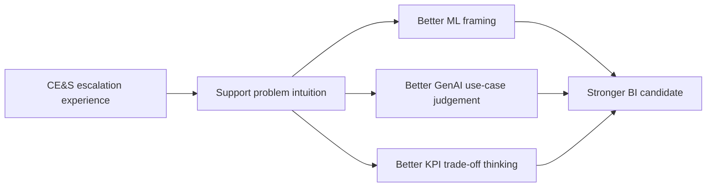

### 🔍 Plain-English deep-dive
- **Extra edge** means topics that are not always mandatory for an analyst, but make you stand out when the hiring team itself builds ML models.
- **Why it matters here:** the JD says the team develops ML models and drives self-serve analytics across support surfaces.
- **What they want to hear:** not only that you know Power BI or SQL, but that you understand prediction, experimentation, grounding, drift, fairness, and platform choices.
- **Analogy:** Parts 1-10 build the car; this Part shows you understand the engine, the navigation system, and the safety controls.
> 💡 **Tie-in to your background:** When you speak about escalation prediction, case deflection, or customer sentiment, you are not guessing. You have seen the operational pain when a high-risk case is missed, when self-help fails, or when a frustrated customer reopens an issue. Keep using those examples.
---
## 1. Machine Learning fundamentals — from intuition to production thinking
A lot of interview fear around ML comes from vocabulary.
Once the words become simple, the topic becomes far less scary.
### 1.1 What machine learning is
Machine learning means learning patterns from past data so a system can make a useful prediction or decision on new data.
Instead of hand-writing every rule, you let the algorithm learn from examples.
### 🔍 Plain-English deep-dive
- **Traditional programming:** you write the rules and give the computer data.
- **Machine learning:** you give the computer data with examples, and it learns the rules for you.
- **Analogy:** instead of writing a 50-rule document for "which support cases tend to escalate," you show the model thousands of past cases and whether they escalated.
- **Key idea:** the model is not magic.
- It is pattern recognition plus probability.
| Concept | Plain meaning | Support example |
|---|---|---|
| Data | Raw facts | case age, severity, product, case notes |
| Pattern | Repeated relationship in data | reopened high-severity cases escalate more often |
| Model | Learned mapping from inputs to output | risk score for escalation |
| Prediction | Output for a new record | 0.82 probability this case escalates |
| Generalization | Works on unseen data | model performs on next month's cases, not only last month's |
### 1.2 Main learning types
The three broad families you should know are supervised, unsupervised, and reinforcement learning.

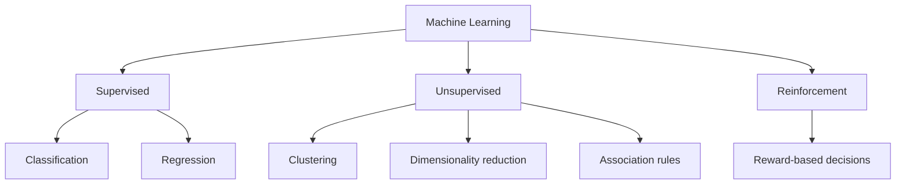

#### 1.2.1 Supervised learning
Supervised learning means the historical data includes the answer.
The model learns to predict that answer.
Examples:
- Will this case escalate?
- Will this customer churn?
- How many support tickets will arrive next week?
- What CSAT score is likely for this interaction?
#### 1.2.2 Unsupervised learning
Unsupervised learning means the historical data does not include a target answer.
The model tries to find natural structure.
Examples:
- Group tickets into similar issue clusters.
- Segment customers by support behavior.
- Discover which issue types co-occur.
- Reduce many variables into a smaller set of summary dimensions.
#### 1.2.3 Reinforcement learning
Reinforcement learning means an agent learns by trying actions and receiving rewards or penalties.
It is less common in day-to-day BI analytics, but good to recognize.
Examples:
- Optimizing the next best action in a chatbot over time.
- Choosing which knowledge-base article to surface first based on downstream resolution success.
- Dynamic routing or staffing policies in complex environments.
### 🔍 Plain-English deep-dive
- **Supervised = teacher with answer key.**
- **Unsupervised = sorting without labels.**
- **Reinforcement = learning from scoreboards and feedback.**
- **Analogy:** supervised is studying solved examples, unsupervised is organizing a messy closet into piles, reinforcement is learning a game by seeing which moves earn points.
> 💡 **Tie-in to your background:** Escalation prediction, deflection prediction, and churn-risk flags are supervised learning examples. Discovering natural complaint themes in case text is unsupervised. Improving a Copilot conversation flow based on containment success can resemble reinforcement learning.
### 1.3 The ML workflow / lifecycle
Most strong answers about ML sound good because they describe the full lifecycle, not just the algorithm.


#### 1.3.1 Business problem first
Before choosing a model, define the business question.
A lot of weak ML work starts with "let's use XGBoost" instead of "what decision are we improving?"
Good framing questions:
- What outcome are we predicting?
- Who will use the prediction?
- What action happens when the score is high?
- What is the cost of a false positive?
- What is the cost of a false negative?
- How fresh must the prediction be?
- What data is realistically available at prediction time?
#### 1.3.2 Data collection and labeling
If the label is wrong, the model learns the wrong lesson.
If definitions change over time, the model can silently degrade.
Example label questions for escalation prediction:
- What exactly counts as an escalation?
- Do partner handoffs count?
- Do engineering engagements count?
- Are there policy changes that changed the meaning over time?
#### 1.3.3 Cleaning and preparation
Real data is messy.
Missing fields, inconsistent categories, duplicate cases, and text noise are normal.
A lot of practical ML work is preparation work.
#### 1.3.4 Feature engineering
Features are the inputs the model sees.
Good features often matter more than fancy algorithms.
#### 1.3.5 Train, validate, test
You do not train on all the data and then grade yourself on the same rows.
That is like studying the exact exam answers and then claiming mastery.
#### 1.3.6 Model training and tuning
This is where the algorithm learns from the data and where you tune hyperparameters.
#### 1.3.7 Evaluation
You compare models, measure errors, and decide what matters most for the business.
#### 1.3.8 Deployment and monitoring
A model that looked good in a notebook can still fail in production.
That is why deployment, monitoring, and retraining matter.
### 1.4 Features, labels, rows, and grain
You will sound much stronger if you connect ML to basic analytics discipline.
One key discipline is grain.
| Term | Plain meaning | Support example |
|---|---|---|
| Row / observation | One unit being modeled | one support case |
| Feature | Input column used to predict | severity, product, reopen count, sentiment |
| Label / target | Outcome to predict | escalated yes/no |
| Grain | What one row represents | case-level, customer-level, day-level |
| Leakage | Using info not available at prediction time | final engineer assignment used to predict escalation |
### 🔍 Plain-English deep-dive
- If your grain is one case, then your features must describe the case at the time you want to score it.
- If your grain is customer-week, then your features must be customer-week features.
- **Analogy:** do not mix recipe ingredients for one cake with ingredients for an entire bakery shift.
- A lot of model mistakes are really grain mistakes.
#### 1.4.1 Features vs label example
Suppose you want to predict whether a case will escalate within 48 hours of creation.
Possible features might be:
- product
- severity at intake
- support plan
- initial queue
- first response time target
- sentiment from first customer message
- whether the case was reopened historically for this customer
The label might be:
- escalated within 48 hours = yes or no
Bad feature examples:
- final escalation owner
- engineering engagement flag created after escalation
- final resolution time
Those bad features leak the future into the past.
### 1.5 Train / validation / test split
A common beginner question is why we need more than one split.
The answer is that we make decisions during modeling, and we need a clean final check.

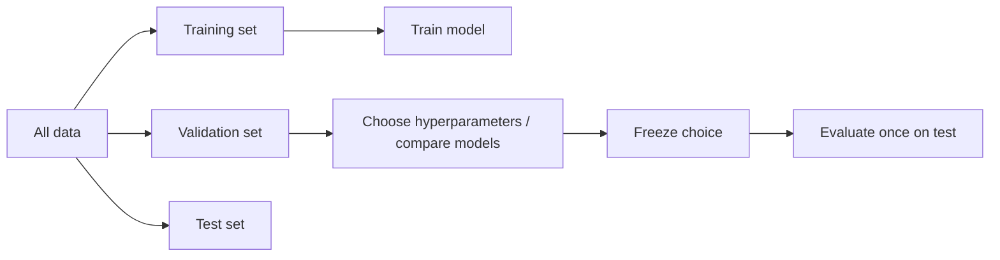

- **Training set:** used to fit the model.
- **Validation set:** used to compare options and tune settings.
- **Test set:** used once at the end for an honest final estimate.
#### 1.5.1 Why not only train and test?
Because if you keep trying many models and looking at the test set each time, you slowly tune to the test set too.
Then the test set stops being truly unseen.
#### 1.5.2 Time-aware splitting
For support and forecasting problems, time matters.
If you randomly mix future rows into training data, you can overstate performance.
Example:
- Train on January to October.
- Validate on November.
- Test on December.
That better matches reality.
### 1.6 Cross-validation
Cross-validation is a smarter way to estimate performance when data is limited.

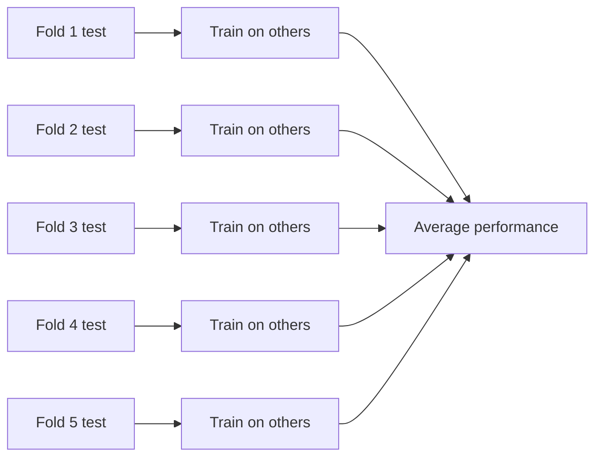

### 🔍 Plain-English deep-dive
- In **k-fold cross-validation**, you split data into k parts.
- Train on k-1 parts and validate on the remaining part.
- Repeat so each part gets a turn as validation.
- Then average the performance.
- **Analogy:** instead of judging a student from one mock exam, you grade them across several rotating mock exams.
When to use it:
- limited data
- comparing model families
- estimating stability
When to be careful:
- time-series data often needs time-based cross-validation, not random folds
- grouped data may need grouped folds to avoid leakage across related rows
### 1.7 Bias-variance trade-off
This is one of the most important ideas in ML.
It sounds technical, but the intuition is simple.
| Term | Plain meaning | Symptom |
|---|---|---|
| Bias | Model too simple, misses true pattern | both train and test performance poor |
| Variance | Model too sensitive to training quirks | train great, test weak |
| Sweet spot | Enough flexibility but still generalizes | good train and test performance |
### 🔍 Plain-English deep-dive
- **High bias** means the model underfits.
- **High variance** means the model overfits.
- **Analogy:** a ruler is too stiff to trace a curved road; a loose string traces every pebble.
- A good model follows the road, not every pebble.


### 1.8 Overfitting and underfitting
#### Underfitting
The model is too simple.
It misses important structure.
Example: trying to predict complex customer behavior with one weak variable.
#### Overfitting
The model is too tailored to the training set.
It learns noise, quirks, and accidents instead of the true signal.
Example: a very deep tree that memorizes tiny historical patterns that never repeat.
Common signs:
- training score much better than validation score
- performance unstable across folds
- model depends on suspicious features
- performance drops sharply on new time periods
### 1.9 Regularization
Regularization is a way to discourage overly complex models.
Think of it as a "stay humble" penalty.
### 🔍 Plain-English deep-dive
- Regularization adds a penalty when model parameters become too large or too complex.
- It helps prevent overfitting.
- **Analogy:** a baggage fee discourages you from carrying unnecessary luggage.
- In regression, regularization often means shrinking coefficients.
Main types to know:
- **L2 / Ridge:** shrinks coefficients smoothly.
- **L1 / Lasso:** can shrink some coefficients all the way to zero.
- **Elastic Net:** mix of L1 and L2.
### 1.10 Hyperparameters vs parameters
Interviewers often like this distinction.
| Term | Set by | Example |
|---|---|---|
| Parameter | learned by the model | regression coefficients, tree splits |
| Hyperparameter | chosen before training | tree depth, learning rate, k in k-NN |
### 🔍 Plain-English deep-dive
- Parameters are what the model learns from the data.
- Hyperparameters are the knobs you set before or during training.
- **Analogy:** if baking is the model, ingredients mixed during baking are parameters, oven temperature and bake time are hyperparameters.
### 1.11 Hyperparameter tuning
Common tuning methods:
- **Grid search:** try every combination from a small list.
- **Random search:** try random combinations.
- **Bayesian optimization:** use earlier results to choose smarter next trials.
Practical tuning advice:
- start with a baseline first
- tune the few knobs that matter most
- use cross-validation or a validation set
- do not chase tiny improvements that hurt interpretability or speed
### 1.12 Baselines matter
A model should beat a simple baseline.
If it does not, the extra complexity is not justified.
Good baselines:
- predict the majority class
- predict the recent average
- logistic regression before gradient boosting
- yesterday's volume before Prophet or ARIMA
> 💡 **Tie-in to your background:** In a CE&S setting, a strong practical answer is: "For escalation prediction, I'd start with a clear label definition, build a simple baseline like logistic regression, emphasize recall because missing true escalations is costly, and only then compare more advanced models."
---
## 2. Supervised algorithms — intuition, fit, strengths, and traps
The best way to talk about algorithms is not to worship them.
It is to explain when they fit, what trade-offs they make, and what can go wrong.
### 2.1 A simple selection map

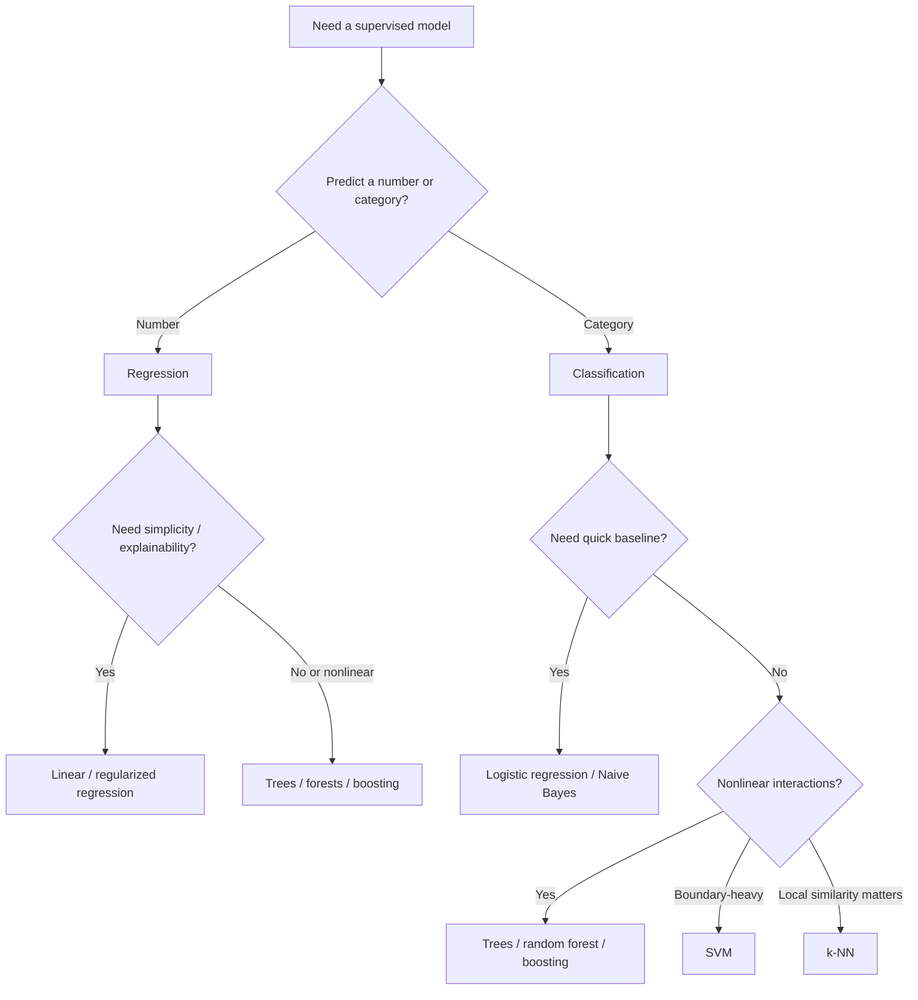

### 2.2 Quick comparison table
| Algorithm | Best first intuition | Strengths | Weaknesses | Good support use-case |
|---|---|---|---|---|
| Linear regression | best-fit line for numbers | simple, fast, interpretable | misses complex nonlinear patterns | predict resolution hours or CSAT proxy |
| Logistic regression | weighted risk score for yes/no | fast, strong baseline, interpretable | linear decision boundary unless engineered features | predict escalation or churn |
| Ridge / Lasso | regression with complexity penalty | controls overfit, useful with many features | still linear-ish | many correlated operational features |
| k-NN | similar cases vote | easy intuition, no explicit training | slow at scale, sensitive to scaling | classify cases by nearby historical patterns |
| Naive Bayes | independent evidence combines | fast, good for text baseline | independence assumption often unrealistic | route or classify ticket text |
| Decision tree | ask yes/no questions down branches | interpretable, handles nonlinear rules | easy to overfit | triage logic or churn flags |
| Random forest | many trees vote together | robust, strong general performance | less interpretable than one tree | escalation risk with mixed data |
| Gradient boosting | trees learn from prior mistakes | often high accuracy | tuning can be tricky | best-performing risk models |
| SVM | find widest separating boundary | strong on certain medium-size problems | less interpretable, scaling important | classification with clear margin structure |
### 2.3 Linear regression
**What it is trying to do:** predict a number.
### 🔍 Plain-English deep-dive
- **Core intuition:** fit the best straight-line relationship between inputs and a numeric outcome.
- **Analogy:** laying a ruler through a cloud of points so the overall error is as small as possible.
- **When it shines:**
- simple baseline
- easy coefficient interpretation
- fast to train
- works surprisingly well when relationships are roughly additive
- **Watch-outs:**
- assumes linear relationship unless you engineer nonlinear features
- sensitive to outliers
- can struggle with strong multicollinearity
- **Support example:** Predict average resolution hours from severity, queue backlog, customer segment, and reopen history.
- **Interview-ready explanation:** A positive coefficient means the predicted number rises as that feature rises, holding others constant.
### 2.4 Logistic regression
**What it is trying to do:** predict a probability for a category, usually yes/no.
### 🔍 Plain-English deep-dive
- **Core intuition:** combine weighted features into a score, then squash it into a probability between 0 and 1.
- **Analogy:** a weighted checklist where each risk factor adds or subtracts from the final risk.
- **When it shines:**
- excellent baseline for classification
- probabilities are easy to threshold
- fast and scalable
- coefficients are often explainable
- **Watch-outs:**
- still mostly linear in feature space
- needs thoughtful encoding and scaling in some cases
- performance may trail boosting on highly nonlinear data
- **Support example:** Predict whether a newly opened case will escalate based on severity, sentiment, product, prior reopens, and first-touch metadata.
- **Interview-ready explanation:** It is often the first serious model to try for escalation, churn, or deflection prediction.
### 2.5 Ridge, Lasso, and Elastic Net
**What it is trying to do:** regularized linear or logistic models.
### 🔍 Plain-English deep-dive
- **Core intuition:** same basic idea as regression, but with a penalty that discourages overgrown coefficients.
- **Analogy:** packing for a trip with baggage fees; you keep only the most useful items.
- **When it shines:**
- helps with overfitting
- handles many features better
- Lasso can perform feature selection
- **Watch-outs:**
- still not a cure for bad data or leakage
- feature scaling often matters
- too much regularization can oversimplify
- **Support example:** A wide feature set with many correlated service metrics, text scores, and channel indicators.
- **Interview-ready explanation:** Ridge shrinks all coefficients; Lasso can zero out some; Elastic Net balances both.
### 2.6 k-Nearest Neighbors (k-NN)
**What it is trying to do:** predict based on nearby examples.
### 🔍 Plain-English deep-dive
- **Core intuition:** look at the most similar historical cases and let them vote or average.
- **Analogy:** asking the five most similar past support cases what usually happened next.
- **When it shines:**
- very intuitive
- no heavy training phase
- can capture local patterns
- **Watch-outs:**
- prediction can be slow on large datasets
- sensitive to scale and noisy features
- high-dimensional data makes distance less meaningful
- **Support example:** For a small curated dataset, classify whether a case is likely to need specialist routing based on similarity to known past cases.
- **Interview-ready explanation:** Always scale numeric features first, otherwise one large-range feature can dominate distance.
### 2.7 Naive Bayes
**What it is trying to do:** fast probabilistic classification.
### 🔍 Plain-English deep-dive
- **Core intuition:** combine pieces of evidence as if they were independent, then pick the most likely class.
- **Analogy:** a detective adding clues together, even if the clues are treated more independently than reality allows.
- **When it shines:**
- very fast
- strong baseline for text classification
- works well with bag-of-words and TF-IDF
- **Watch-outs:**
- independence assumption is often false
- probabilities can be poorly calibrated
- usually not the top performer on structured nonlinear data
- **Support example:** Classify case text into likely product area or sentiment bucket from subject and notes.
- **Interview-ready explanation:** Even when its assumptions are simplistic, it can be surprisingly competitive as a text baseline.
### 2.8 Decision trees
**What it is trying to do:** split data with yes/no rules.
### 🔍 Plain-English deep-dive
- **Core intuition:** repeatedly ask the question that best separates outcomes.
- **Analogy:** a triage nurse following a branching decision chart.
- **When it shines:**
- easy to explain visually
- captures nonlinear interactions
- works with mixed feature types
- **Watch-outs:**
- single trees can overfit badly
- small data changes can create different trees
- performance may be unstable
- **Support example:** A triage-oriented model where high severity plus negative sentiment plus repeat reopen behavior sharply increases escalation risk.
- **Interview-ready explanation:** A tree can naturally learn interaction effects that linear models miss.
### 2.9 Random forests
**What it is trying to do:** ensemble of many trees.
### 🔍 Plain-English deep-dive
- **Core intuition:** grow many slightly different trees and let them vote or average.
- **Analogy:** instead of trusting one expert, ask a panel of experts who each saw slightly different training examples.
- **When it shines:**
- strong default performance
- less overfitting than a single tree
- handles nonlinearities and interactions
- **Watch-outs:**
- harder to explain than one tree
- bigger and slower than linear models
- can still struggle with extreme class imbalance if unmanaged
- **Support example:** Predict escalation, churn, or reopen risk from dozens of operational and behavioral features.
- **Interview-ready explanation:** Randomness in row sampling and feature sampling makes the ensemble more robust.
### 2.10 Gradient boosting (XGBoost / LightGBM / CatBoost)
**What it is trying to do:** sequentially correct mistakes.
### 🔍 Plain-English deep-dive
- **Core intuition:** build one small tree, see where it errs, then build the next tree to focus on those errors, and keep improving.
- **Analogy:** a tutor who reviews every test mistake and designs the next lesson around the hardest misses.
- **When it shines:**
- often top performance on tabular business data
- handles complex nonlinear patterns
- strong feature importance tooling
- **Watch-outs:**
- can overfit if untuned
- more knobs to tune
- explanations need more care
- **Support example:** A production-grade escalation risk model using structured support features and engineered text or sentiment scores.
- **Interview-ready explanation:** For tabular enterprise data, boosting is often a serious benchmark to beat.
### 2.11 Support Vector Machines (SVM)
**What it is trying to do:** find a strong separating boundary.
### 🔍 Plain-English deep-dive
- **Core intuition:** choose the boundary that separates classes with the widest margin.
- **Analogy:** drawing the safest line between two groups while leaving the biggest buffer zone on each side.
- **When it shines:**
- can work well in medium-size, high-dimensional problems
- kernel tricks can capture nonlinear patterns
- strong theoretical foundation
- **Watch-outs:**
- less intuitive for business audiences
- can be slow on very large datasets
- requires scaling and careful tuning
- **Support example:** Classifying issue categories from engineered text vectors in a moderate-size dataset.
- **Interview-ready explanation:** In practice, boosting and logistic regression often appear more often in business analytics, but SVM is still worth recognizing.
### 2.12 How to choose in practice
A realistic analyst answer is rarely "this algorithm is best."
A mature answer is usually closer to this:
- start with a simple, explainable baseline
- choose metrics that match the business cost
- compare a few strong families
- use cross-validation or time-based validation
- check calibration, threshold behavior, fairness, and stability
- pick the simplest model that performs well enough and can be operationalized safely
### 2.13 Interpretability vs performance
| Situation | Often prefer |
|---|---|
| Leadership wants a transparent first model | logistic regression or shallow tree |
| Need strongest tabular predictive power | gradient boosting |
| Need simple numeric forecast baseline | linear or regularized regression |
| Text baseline for routing or sentiment | Naive Bayes or logistic regression with TF-IDF |
| Highly nonlinear mixed signals with limited feature engineering | random forest or boosting |
> 💡 **Tie-in to your background:** If asked which model you would use for escalation prediction, a strong answer is: "I'd baseline with logistic regression for interpretability, compare tree ensembles like random forest or XGBoost for lift, and choose based on recall, calibration, operational simplicity, and fairness across customer segments."
---
## 3. Unsupervised learning — finding patterns when labels do not exist
Unsupervised learning is useful when you do not have a target column, or when you want discovery rather than direct prediction.
### 3.1 Why support analytics needs unsupervised methods
Support data is full of hidden structure.
Sometimes you do not know the right segments before analysis.
Sometimes issue themes emerge before taxonomy catches up.
That is where unsupervised methods help.

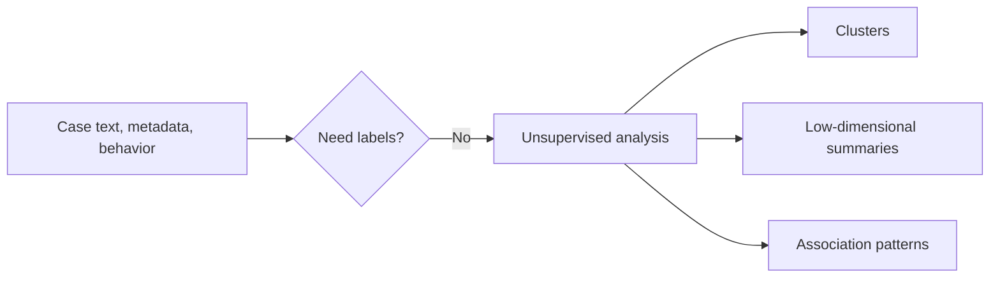

### 3.2 k-means clustering
k-means tries to divide data into k groups so points are close to the center of their assigned group.
### 🔍 Plain-English deep-dive
- **Analogy:** placing k magnets on a table full of metal pins and letting each pin attach to the nearest magnet.
- **What you choose:** the number of clusters, k.
- **What the algorithm does:** repeatedly assigns points to the nearest centroid, then moves centroids to the center of assigned points.
- **Where it fits:** when clusters are roughly blob-shaped and you want a fast, interpretable segmentation.
Good support uses:
- cluster customers by support behavior: case frequency, severity mix, reopen rate, self-service usage
- cluster issue patterns by structured metadata
- discover "heavy support load" vs "self-serve friendly" segments
Watch-outs:
- you must choose k
- sensitive to scaling
- struggles with irregular shapes and outliers
### 3.3 Hierarchical clustering
Hierarchical clustering builds a tree of similarity.
It can work bottom-up or top-down.

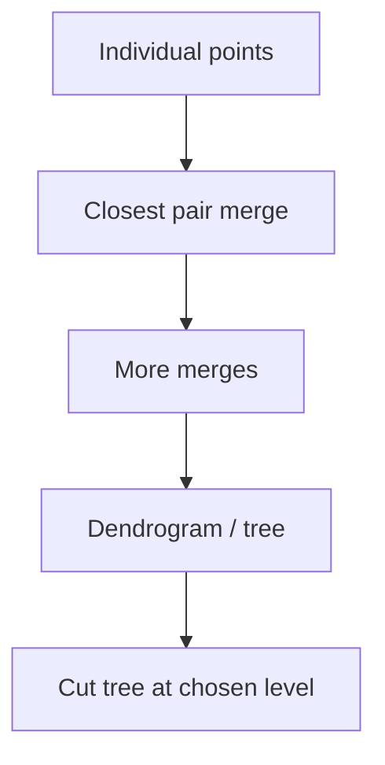

### 🔍 Plain-English deep-dive
- **Analogy:** creating family branches from people who are most similar, then grouping those families into bigger clans.
- It is useful when you want to explore multiple levels of grouping, not just one fixed k.
- A dendrogram helps you visually inspect where natural group splits might exist.
Support uses:
- clustering issue categories to see which products or symptoms belong together
- exploring customer segments with nested relationships
Watch-outs:
- can be slower on large datasets
- results depend on distance metric and linkage method
### 3.4 DBSCAN
DBSCAN groups dense regions together and labels sparse isolated points as noise.
### 🔍 Plain-English deep-dive
- **Analogy:** imagine people at a party.
- Dense conversation circles become clusters.
- A person standing alone near the wall may be labeled noise.
- DBSCAN is excellent when clusters are irregularly shaped and when outliers matter.
Good support uses:
- detect unusual case patterns that do not belong to normal clusters
- find abnormal product-issue combinations
- separate frequent issue families from strange one-off behaviors
Watch-outs:
- parameter choice matters
- scaling matters
- performance can drop in very high dimensions
### 3.5 PCA — Principal Component Analysis
PCA is a dimensionality-reduction method.
It turns many correlated variables into a smaller number of combined dimensions that explain most variance.

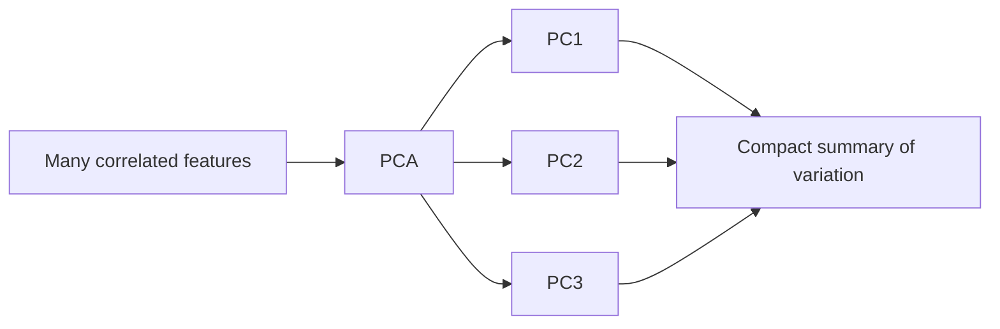

### 🔍 Plain-English deep-dive
- **Analogy:** if a long book repeats the same theme in many chapters, PCA writes a shorter summary without keeping every sentence.
- PCA does not keep the original meaning of each feature as cleanly.
- It creates new combined axes.
- It is useful for visualization, compression, and reducing redundancy.
Support uses:
- compress many operational signals into a smaller set of behavior dimensions
- visualize issue clusters in 2D after reducing dimensions
- reduce multicollinearity before modeling
Watch-outs:
- components are less business-interpretable
- standardization usually matters
- not ideal when explainability is the main goal
### 3.6 Association rules
Association rules find items or events that often appear together.
This is the classic "customers who bought X also bought Y" idea.
In support, it becomes "cases with symptom A often also involve configuration B."
| Term | Plain meaning | Support example |
|---|---|---|
| Support | how often pattern occurs | 8% of cases mention both sync and permissions |
| Confidence | if A happens, how often B also happens | among sync issues, 52% also mention permissions |
| Lift | how much stronger than chance | sync+permissions occurs 2.3x more than random expectation |
### 🔍 Plain-English deep-dive
- **Analogy:** noticing that customers who search one article often next open a second article.
- This can guide knowledge-base bundling, article recommendations, and workflow design.
### 3.7 Unsupervised learning in interview language
A sharp interview answer sounds like this:
"If labels exist and the business action is predictive, I lean supervised. If I need discovery, segmentation, or hidden issue patterns, unsupervised methods like clustering, PCA, or association rules are useful. In support, they can reveal customer segments, issue families, and deflection opportunities that taxonomy alone misses."
> 💡 **Tie-in to your background:** A very credible example for you is clustering support contacts by journey behavior: customers who resolve via self-help, customers who escalate after repeated failed attempts, and customers whose negative sentiment spikes after transfers. That links unsupervised learning directly to deflection and experience improvement.
---
## 4. Time series — forecasting support volume and operational load
Time series means data ordered through time.
For support analytics, this is crucial.
Leaders care about next week's volume, backlog risk, and staffing pressure.
### 4.1 Core time-series components

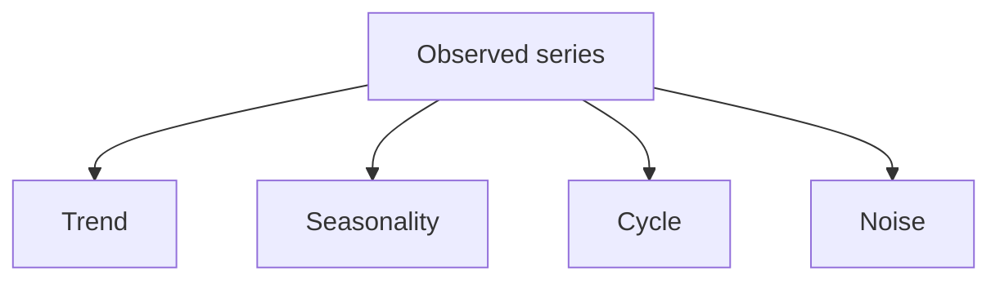

| Component | Plain meaning | Support example |
|---|---|---|
| Trend | long-term direction | support demand gradually rising over 12 months |
| Seasonality | repeating calendar pattern | Monday spikes, month-end spikes, holiday dips |
| Cycle | broader up/down waves without fixed short cadence | change in support demand after a product launch or macro shift |
| Noise | random fluctuation | one-day anomaly from a transient issue |
### 🔍 Plain-English deep-dive
- **Trend** is the slope of the road.
- **Seasonality** is the repeated bumps you expect.
- **Cycle** is a broader wave.
- **Noise** is the pebbles and weather.
- A good forecast tries to understand which is which.
### 4.2 Why time series is different from generic regression
Time order matters.
Yesterday influences today.
The same weekday pattern may repeat.
Shocks may create temporary spikes.
Randomly shuffling rows can break the story.
### 4.3 Exponential smoothing
Exponential smoothing gives more weight to recent observations than older ones.
It is often a very practical forecasting baseline.
### 🔍 Plain-English deep-dive
- **Simple exponential smoothing:** good when there is no strong trend or seasonality.
- **Holt's method:** adds trend.
- **Holt-Winters:** adds seasonality.
- **Analogy:** listening more carefully to the last few support weeks than to last year's distant noise.
When it fits:
- stable operational series
- short-term forecasting
- explainable baseline
### 4.4 ARIMA
ARIMA stands for AutoRegressive Integrated Moving Average.
The name sounds intimidating.
The intuition does not have to be.
### 🔍 Plain-English deep-dive
- **AutoRegressive:** use past values to predict current value.
- **Integrated:** difference the series if needed to remove trend and make it more stable.
- **Moving Average:** use past errors too.
- **Analogy:** forecasting today's queue by looking at yesterday, the recent direction of travel, and recent forecast misses.
ARIMA is useful when:
- the series is univariate
- temporal dependence is strong
- you want a classical statistical forecast
Watch-outs:
- parameter tuning can be finicky
- multiple seasonalities complicate things
- business users may prefer simpler storytelling
### 4.5 Prophet
Prophet is a forecasting library designed to make practical forecasting easier, especially when you have trend plus seasonality plus holidays or special events.
### 🔍 Plain-English deep-dive
- **Analogy:** Prophet is like a planner that explicitly marks weekends, holidays, launches, and seasonality on the calendar before estimating the curve.
- It is friendly for business time series with strong calendar effects.
- It can be useful for support volume forecasting around launches, holiday periods, and region-specific events.
### 4.6 Forecasting workflow for support volume
1. Define the unit.
2. For example: daily case arrivals by product and region.
3. Plot the history.
4. Check for missing days or data issues.
5. Compare baseline approaches.
6. Include known calendar effects.
7. Validate on a future holdout window.
8. Judge both accuracy and operational usefulness.
### 4.7 Forecast metrics and business use
Useful metrics include:
- MAE
- RMSE
- MAPE with caution when denominators get small
- bias in forecast direction
Business uses:
- staffing and scheduling
- early-warning dashboards
- capacity planning for known launches or incident seasons
- deflection strategy planning
> 💡 **Tie-in to your background:** You can explain that support volume forecasting is not only about "how many tickets." It directly affects staffing, backlog age, SLA risk, and whether self-service or deflection investments are needed before a surge becomes painful.
---
## 5. Recommendation systems and anomaly detection — two high-value support patterns
Recommendation and anomaly detection are often less discussed than classification, but very relevant in support environments.
### 5.1 Recommendation systems
A recommendation system tries to suggest the next useful item, action, or content.
In e-commerce that might be a product.
In support it might be the next article, workflow, or resolver path.
### 5.2 Types of recommendation systems
| Type | Plain meaning | Support example |
|---|---|---|
| Content-based | recommend similar items based on attributes | recommend KB articles similar to the current error and product context |
| Collaborative filtering | recommend based on behavior of similar users | customers like you often solved it with these two articles |
| Hybrid | combine both | blend article content and past success behavior |
### 🔍 Plain-English deep-dive
- **Content-based:** "This article looks similar to what you are viewing now."
- **Collaborative filtering:** "People with journeys like yours found this helpful."
- **Hybrid:** use both because either one alone can be too narrow.
Support uses:
- next-best knowledge-base article
- next-best troubleshooting step
- agent assist suggestions during live support
- Copilot prompts or grounded snippets for analysts and agents
### 5.3 Anomaly detection
Anomaly detection looks for things that are unusual compared with normal patterns.
In support, anomalies can be early-warning gold.

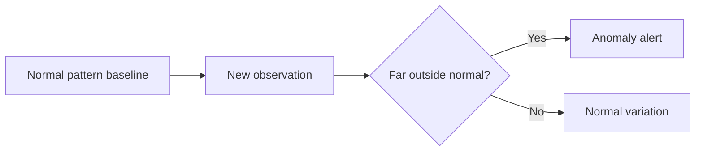

### 🔍 Plain-English deep-dive
- **Analogy:** if a hospital suddenly sees triple the normal volume for a symptom, that unusual spike matters before the diagnosis is fully known.
- In support, anomalies can signal incidents, bad releases, routing bugs, spam floods, or data pipeline issues.
Common anomaly methods to recognize:
- simple thresholds and control charts
- z-scores
- isolation forest
- density-based methods
- reconstruction-error methods in more advanced settings
Support examples:
- sudden spike in OneDrive sync cases from one region
- abnormal drop in self-service containment after a bot change
- unexpected surge in negative sentiment after a policy update
- highly unusual case handling time for one queue
### 5.4 Recommendation + anomaly together
These two ideas can work together.
If a spike appears for a new issue, the system can recommend the right article, known-issue banner, or triage path quickly.
That improves deflection and reduces avoidable escalation.
> 💡 **Tie-in to your background:** You can credibly say that anomaly detection is useful for catching emerging support pain early, while recommendation systems help scale self-service and agent assist. That directly connects your escalation experience with deflection strategy and Copilot-style support.
---
## 6. Feature engineering — the craft that often matters more than model choice
Many models improve more from better features than from fancier algorithms.
Feature engineering means turning raw data into useful, model-ready signals.
### 6.1 Why feature engineering matters
Bad features can hide signal.
Good features can unlock it.
And leaked features can fake it.

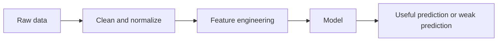

### 6.2 Common feature-engineering categories
| Category | What it means | Support example |
|---|---|---|
| Encoding | turn categories into numbers | product name, channel, severity |
| Scaling | normalize numeric ranges | handle time, customer age, backlog size |
| Binning | group continuous values into ranges | resolution hours into short/medium/long |
| Datetime features | derive calendar signals | day of week, hour, month-end |
| Text features | turn text into numerical signals | TF-IDF, embeddings, sentiment score |
| Interaction features | combine variables | severity × negative sentiment |
| Aggregates | summarize historical behavior | customer's 90-day reopen rate |
### 6.3 Encoding categorical variables
Most ML models cannot directly use raw text categories like "SharePoint" or "Chat."
They need numeric representation.
Common methods:
- **One-hot encoding:** one column per category.
- **Ordinal encoding:** map categories to ordered numbers when a natural order exists.
- **Target encoding:** encode categories using target statistics, with care to avoid leakage.
- **Frequency encoding:** encode by category frequency.
### 🔍 Plain-English deep-dive
- **One-hot** is like turning one field into many yes/no switches.
- **Ordinal** is only correct when the order is meaningful, like low, medium, high.
- **Target encoding** can be powerful but dangerous if done carelessly.
- **Analogy:** encoding is translating words into a numeric language the model can understand.
Examples:
- severity: low, medium, high can be ordinal if the order is real
- channel: phone, chat, email usually fits one-hot
- product: SharePoint, OneDrive, Teams usually fits one-hot or target encoding in high-cardinality settings
### 6.4 Scaling numeric features
Some models care a lot about scale.
Others care less.
| Model family | Scaling importance |
|---|---|
| k-NN | high |
| SVM | high |
| linear / logistic regression | often useful |
| tree-based models | usually less important |
Common scaling methods:
- **Standardization:** center around zero and scale by standard deviation.
- **Min-max scaling:** squeeze values into a range like 0 to 1.
- **Robust scaling:** more resistant to outliers.
### 6.5 Binning
Binning turns a continuous variable into ranges.
This can help with interpretability and some model behaviors.
Examples:
- case age: 0-4 hours, 4-24 hours, 1-3 days, 3+ days
- sentiment score: positive, neutral, negative, very negative
- backlog size: low, medium, high
Watch-out:
Binning can throw away information if overdone.
Use it when the ranges are meaningful, not just because bins feel tidy.
### 6.6 Datetime features
Datetime fields are gold mines.
A raw timestamp is rarely the final feature.
Useful derived features:
- day of week
- hour of day
- month
- quarter
- month-end flag
- business-hours flag
- holiday flag
- days since last contact
- days since product release
### 🔍 Plain-English deep-dive
- Datetime features help models capture operational rhythm.
- **Analogy:** the same support event feels different on Monday morning than on Friday night.
- A timestamp is a suitcase.
- Derived calendar features unpack the useful items inside.
### 6.7 Historical aggregate features
These features summarize past behavior up to the prediction time.
They are often very powerful.
Examples:
- customer's past 90-day case volume
- prior escalation rate for this customer segment
- average recent backlog for the assigned queue
- article view count before case creation
- prior self-service success rate for the issue cluster
Watch-out:
The phrase "up to the prediction time" matters.
If the aggregation includes future events, you leak information.
### 6.8 Text features — TF-IDF and embeddings
Support text is rich.
Case subject lines, issue descriptions, chat transcripts, and KB content all contain signal.
#### TF-IDF
TF-IDF stands for Term Frequency–Inverse Document Frequency.
It gives weight to words that are frequent in one document but not frequent everywhere.
### 🔍 Plain-English deep-dive
- **Analogy:** common words like "the" are boring and should count less.
- Words that are especially characteristic of a ticket should count more.
- TF-IDF is a classic, fast way to turn text into vectors.
Good uses:
- text classification baselines
- routing models
- sentiment or issue tagging baselines
#### Embeddings
Embeddings are dense numeric representations that capture semantic meaning.
Similar text ends up near similar text in vector space.
### 🔍 Plain-English deep-dive
- **Analogy:** embeddings turn meaning into location.
- Sentences with similar meaning end up living in nearby neighborhoods.
- Embeddings are central for semantic search and RAG retrieval.
Good uses:
- semantic issue search
- document retrieval for Copilot answers
- clustering similar ticket narratives
- recommendation systems for KB articles
### 6.9 Missing values
Missing values are data, not just data problems.
Sometimes missingness itself carries signal.
Examples:
- missing phone number may be irrelevant
- missing severity at creation may indicate poor intake quality
- missing survey response is not the same as a low score
Common strategies:
- drop rows or columns when appropriate
- impute mean, median, or mode
- impute with model-based methods in more advanced cases
- add a missing-indicator flag
### 6.10 Leakage — the silent model killer
Leakage means your model uses information that would not be known at the time of real prediction.
It makes offline results look unrealistically good.

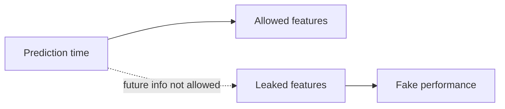

Common support leakage examples:
- using final resolution code to predict escalation
- using post-escalation notes to predict escalation
- using final CSAT response to predict churn before resolution
- computing customer history with future rows included
### 🔍 Plain-English deep-dive
- Leakage is like letting a student see tomorrow's answer sheet while pretending they took a fair test.
- It is one of the fastest ways to build false confidence.
### 6.11 Feature engineering workflow for a CE&S support example
Suppose you want to predict escalation risk at case creation.
A strong feature set might include:
- product
- severity
- channel
- customer segment
- support plan
- detected sentiment from first message
- recent case count for that customer
- recent reopen count for that customer
- queue backlog at intake
- day of week and hour of creation
- known-issue flag from current incident state
- article views before case creation
### 6.12 Feature engineering and business trust
People trust models more when the features make business sense.
This does not mean every feature must be simple.
It means the overall story should be explainable.
> 💡 **Tie-in to your background:** Your support experience helps you invent sensible features that a purely technical candidate may miss, such as failed self-help journeys before assisted support, transfer count, repeated reopen patterns, or sentiment deterioration across contacts.
---
## 7. Model evaluation — the language of good judgement
Interviewers often care less about whether you know every algorithm and more about whether you know how to judge a model properly.
This section matters a lot.
### 7.1 Classification evaluation starts with the confusion matrix

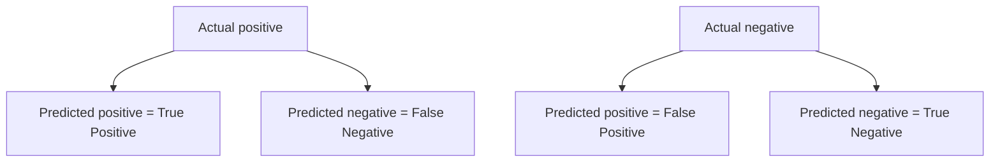

| Cell | Plain meaning | Escalation example |
|---|---|---|
| True Positive | model correctly flags a real positive | predicted escalation and case truly escalated |
| False Positive | model flags but reality is negative | predicted escalation but case did not escalate |
| False Negative | model misses a real positive | predicted no escalation but case escalated |
| True Negative | model correctly ignores a negative | predicted no escalation and case stayed stable |
### 7.2 Accuracy
Accuracy is the share of correct predictions overall.
It sounds good and is sometimes useful.
But it can be dangerously misleading on imbalanced problems.
Example:
If only 5% of cases escalate, a model that always predicts "no escalation" gets 95% accuracy.
That is not useful.
### 7.3 Precision, recall, and F1
| Metric | Formula idea | Plain meaning | When it matters most |
|---|---|---|---|
| Precision | TP / (TP + FP) | of flagged positives, how many were truly positive | false alarms are costly |
| Recall | TP / (TP + FN) | of real positives, how many did we catch | misses are costly |
| F1 | harmonic mean of precision and recall | balance between the two | need one summary metric |
### 🔍 Plain-English deep-dive
- **Precision:** if the alarm rings, was it usually right?
- **Recall:** when there was a real fire, did we catch it?
- **F1:** one-number compromise when both matter.
- **Analogy:** precision is "don't cry wolf too often" and recall is "don't miss the wolf when it really comes."
### 7.4 Recall emphasis for support risk models
For escalation prediction, churn risk, or severe dissatisfaction risk, recall often deserves extra attention.
Why?
Because missing a truly risky case can be expensive.
Business reasoning:
- missed escalations create customer pain and leadership surprises
- missed churn signals lose revenue or trust
- false positives consume analyst or manager review time, but may be tolerable at some level
This does not mean recall should be the only metric.
It means metric choice must match business cost.
### 7.5 ROC-AUC and PR-AUC
Both metrics summarize performance across thresholds.
But they are not identical in meaning.
| Metric | Plain meaning | Best use |
|---|---|---|
| ROC-AUC | how well model ranks positives above negatives overall | general ranking performance |
| PR-AUC | trade-off of precision and recall across thresholds | especially useful on imbalanced data |
### 🔍 Plain-English deep-dive
- **ROC-AUC** asks: if I randomly pick one positive and one negative, how often does the model rank the positive higher?
- **PR-AUC** focuses more directly on positive-class usefulness.
- For rare events like escalation, PR-AUC is often more informative.
### 7.6 Log loss
Log loss evaluates predicted probabilities, not just hard class labels.
It punishes confident wrong answers heavily.
### 🔍 Plain-English deep-dive
- If a model says 99% sure and is wrong, log loss punishes that more than if the model said 55% sure.
- This is useful when probability quality matters, not just final classification.
### 7.7 Calibration
A calibrated model means its probabilities are trustworthy.
If the model gives 0.80 risk to 100 cases, around 80 of them should truly be positive over time.
Why this matters:
- leaders may use probability bands for triage
- thresholds rely on score meaning
- badly calibrated scores can mislead decision-making even if ranking is decent
### 7.8 Threshold tuning
Many models output probabilities.
You then choose a threshold.
Above the threshold becomes positive.
Below it becomes negative.

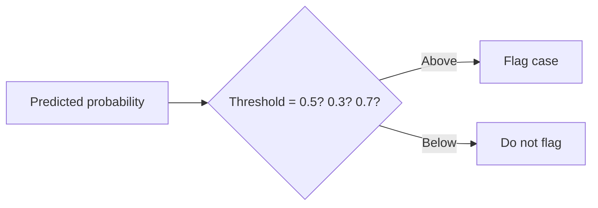

### 🔍 Plain-English deep-dive
- Lowering the threshold usually increases recall and decreases precision.
- Raising the threshold usually increases precision and decreases recall.
- **Analogy:** a metal detector set to be very sensitive catches more threats but creates more false alarms.
Practical threshold selection questions:
- how many cases can the review team handle?
- what is the cost of missing one?
- what recall floor is acceptable?
- should thresholds differ by segment or only by one global policy?
### 7.9 Class imbalance
Class imbalance means one class is much rarer than the other.
Support escalation, fraud, churn, and severe dissatisfaction often look like this.
Common strategies:
- choose metrics beyond accuracy
- use class weights
- over-sample the minority class
- under-sample the majority class
- use SMOTE carefully
- tune thresholds to business capacity
#### SMOTE
SMOTE stands for Synthetic Minority Over-sampling Technique.
It creates synthetic minority examples by interpolating between existing minority points.
### 🔍 Plain-English deep-dive
- **Analogy:** if you have too few photos from one angle, SMOTE creates plausible in-between camera positions.
- It can help the model see the rare class more often.
- But it can also create unrealistic examples if used carelessly.
### 7.10 Regression evaluation
When the target is numeric rather than categorical, the metrics change.
| Metric | Plain meaning | Good for | Caution |
|---|---|---|---|
| MAE | average absolute error | easy to explain | treats all errors linearly |
| MSE | average squared error | penalizes large misses more | units are squared |
| RMSE | square root of MSE | interpretable in original units, large misses matter | still more sensitive to outliers |
| R² | share of variance explained vs baseline mean model | rough fit summary | can be misunderstood as business value |
| Adjusted R² | R² adjusted for feature count | compare models with different numbers of features | still not enough alone |
| MAPE | average percentage error | intuitive for positive stable values | breaks or misleads near zero |
### 7.11 Evaluation by segment
A model can look good overall and still fail for important groups.
Always slice evaluation by relevant segments.
Examples:
- SMB vs Enterprise
- product family
- region
- language
- new vs tenured customers
- partner-supported vs Microsoft-supported motions
### 7.12 Offline vs online evaluation
Offline evaluation uses historical data.
Online evaluation measures the model in real operations.
Both matter.
Examples of online impact:
- did flagged cases actually receive earlier intervention?
- did deflection recommendations reduce assisted contact volume?
- did CSAT improve after model-driven prioritization?
### 7.13 Cost-based evaluation
Sometimes a custom business loss function is more honest than generic metrics.
If one false negative costs five times more than one false positive, the evaluation should reflect that.
> 💡 **Tie-in to your background:** In CE&S, saying "for escalation or churn models I would not lean on accuracy; I would focus on recall, precision, PR-AUC, calibration, and business cost by segment" immediately sounds senior and role-relevant.
---
## 8. MLOps introduction — taking a model from notebook to reliable production use
A model is only valuable if it can run repeatedly, safely, and observably.
That is what MLOps is about.
### 8.1 What MLOps means
MLOps applies DevOps-style discipline to machine-learning systems.
It covers reproducibility, deployment, monitoring, and retraining.


### 8.2 Core building blocks
| MLOps element | Plain meaning | Why it matters |
|---|---|---|
| Experiment tracking | log runs, params, metrics, artifacts | know what worked and why |
| Model registry | central place for approved models | versioning and promotion control |
| Deployment | make model available for batch or real-time scoring | business usage |
| Monitoring | watch performance, latency, drift, failures | catch production issues |
| Retraining | refresh model on new data or degraded performance | keep model useful |
### 8.3 Experiment tracking
If a team runs 50 experiments and cannot reproduce the best one, it does not really have a production process.
Tracking should capture:
- dataset version
- code version
- feature version
- hyperparameters
- metrics
- artifacts such as confusion matrices or feature importance charts
### 8.4 Model registry
A registry stores approved model versions and lifecycle state.
Typical states might be:
- staging
- production
- archived
This helps teams know exactly which model is deployed and how to roll back if needed.
### 8.5 Deployment patterns
| Pattern | Plain meaning | Support example |
|---|---|---|
| Batch scoring | score records on a schedule | daily escalation-risk scores for open cases |
| Real-time scoring | score one item on demand | live risk score when a case is opened |
| Human-in-the-loop | model suggests, person decides | analyst review queue for high-risk cases |
| Shadow mode | model runs without affecting decisions | compare predicted vs actual before full rollout |
### 8.6 Monitoring and drift
Monitoring is where many real-world model problems first appear.
Types of drift to know:
- **Data drift:** input distributions change.
- **Concept drift:** relationship between features and target changes.
- **Prediction drift:** score patterns change unexpectedly.
- **Performance drift:** real quality falls.
### 🔍 Plain-English deep-dive
- **Data drift analogy:** your support mix shifts from on-prem to Copilot-related issues, so feature patterns change.
- **Concept drift analogy:** severity no longer predicts escalation the way it used to after a process change.
- Drift means the world moved.
- The model did not move with it.
### 8.7 Retraining triggers
Common retraining triggers:
- scheduled monthly or quarterly refresh
- drift threshold breached
- new product or taxonomy launch
- clear performance degradation
- policy or workflow change affecting labels
### 8.8 Tools to recognize
#### MLflow
MLflow is a popular open-source platform for experiment tracking, model packaging, and registry-style workflows.
It is commonly mentioned in MLOps conversations.
#### Azure Machine Learning
Azure ML supports experiment tracking, pipelines, model management, deployment, monitoring, and Responsible AI tooling inside Azure.
It is highly relevant in Microsoft's ecosystem.
#### Microsoft Fabric Data Science
Fabric Data Science brings notebooks, experiments, ML workflows, and model experiences into the broader Fabric platform.
For a Microsoft-centric analytics team, it matters because it keeps data, notebooks, and downstream reporting closer together.
### 8.9 Why this matters for BI teams too
Even if you are not the primary ML engineer, analysts often help with:
- feature definitions
- validation logic
- business metric design
- monitoring dashboards
- adoption reporting
- fairness or segment-level QA
> 💡 **Tie-in to your background:** Your support operations perspective is valuable in MLOps because model quality is not only math. It is whether the model actually improves queue management, deflection, or customer experience in the real support motion.
---
## 9. GenAI, LLMs, and enterprise grounding — from intuition to design choices
This is one of the highest-value sections for a Microsoft interview in 2026.
It connects your AI certifications and Copilot Studio pilot experience to enterprise analytics and support.
### 9.1 What GenAI is and is not
Generative AI creates new content such as text, summaries, code, or images.
An LLM predicts the next token repeatedly to generate language.
That sounds simple.
The emergent behavior becomes powerful.
### 9.2 Tokens
A token is a chunk of text the model processes.
It is not exactly a word.
It can be shorter or longer.
### 🔍 Plain-English deep-dive
- Tokens are the units the model reads and writes.
- Cost, latency, and context-window usage are all tied to tokens.
- **Analogy:** if language is a Lego castle, tokens are the individual pieces the model snaps together.
Why tokens matter:
- longer prompts cost more
- retrieved context uses tokens too
- response size also consumes tokens
- context windows have limits
### 9.3 Embeddings
Embeddings are vector representations that capture semantic similarity.
They are core to semantic search and RAG.
### 🔍 Plain-English deep-dive
- **Analogy:** embeddings turn meaning into coordinates on a map.
- "password reset failure" and "cannot reset credentials" may end up near each other even if the exact wording differs.
### 9.4 Transformers and attention
Transformers are the neural-network architecture behind modern LLMs.
Attention is the key mechanism.

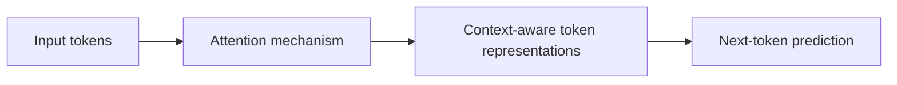

### 🔍 Plain-English deep-dive
- **Attention** helps the model decide which other words in the sequence matter most for understanding the current word.
- **Analogy:** when reading a sentence, you do not weigh every earlier word equally.
- You glance back at the words that matter for meaning.
- Transformers automate that at scale.
What to say in an interview:
"I think of transformers as models that are very good at using attention to understand relationships across tokens in context, which is why they perform so well on language tasks."
### 9.5 Prompt engineering
Prompt engineering is the craft of asking the model clearly and giving it the right structure, context, and constraints.
Useful prompt elements:
- role or job to perform
- task objective
- available context
- output format
- constraints
- examples
- fallback behavior when uncertain
### 🔍 Plain-English deep-dive
- **Analogy:** the model is a very capable intern.
- A vague request gets a vague result.
- A structured brief gets a better result.
Support prompt example:
- summarize this case chronologically
- identify customer pain points
- propose next steps using only the provided KB
- cite the grounding passage
- if the KB does not cover it, say that directly
### 9.6 Retrieval-Augmented Generation (RAG)
RAG means retrieving trusted information at query time and giving it to the model so the answer is grounded in that information.


### 9.7 Why RAG matters in enterprise support
LLMs are fluent, but enterprise truth lives in company data.
Product documentation, known issues, policy rules, KB articles, case notes, and telemetry summaries all matter.
RAG helps connect model fluency to trusted enterprise content.
### 9.8 RAG building blocks
#### Chunking
Chunking means splitting documents into retrievable pieces.
If chunks are too big, retrieval gets noisy.
If chunks are too small, context breaks.
#### Vector stores
Vector stores keep embeddings and enable nearest-neighbor search for semantic similarity.
#### Retrieval
Retrieval chooses which chunks to bring back for the prompt.
This can be vector-only, keyword-only, or hybrid.
#### Grounding
Grounding means the answer is explicitly tied to retrieved evidence.
#### Citations
Citations show where the answer came from.
They help trust, auditability, and user verification.
### 🔍 Plain-English deep-dive
- **Chunking analogy:** cutting a textbook into useful index cards.
- **Vector store analogy:** shelving those cards by meaning, not only exact words.
- **Retrieval analogy:** before answering, the assistant quickly pulls the most relevant cards.
- **Grounding analogy:** the assistant answers with the textbook open on the desk.
### 9.9 Chunking strategies
Common chunking strategies:
- fixed-size chunks by token length
- chunk by section heading
- chunk by semantic boundary
- overlapping chunks to preserve context across boundaries
Trade-offs:
- larger chunks provide more context but may dilute retrieval precision
- smaller chunks improve precision but may lose needed context
- overlap improves continuity but increases storage and token use
### 9.10 Retrieval quality matters as much as model quality
A weak retriever feeding irrelevant content to a strong LLM still produces weak answers.
The saying "garbage in, garbage out" fully applies here.
Useful retrieval ideas:
- hybrid search = keyword + vector
- metadata filters = product, region, freshness, access rights
- reranking = a second stage that reorders results by relevance
- freshness controls = prefer newest trusted content when policy changed
### 9.11 RAG vs fine-tuning
| Question | RAG | Fine-tuning |
|---|---|---|
| What does it mainly do? | gives model external knowledge at query time | changes model behavior or style through additional training |
| Best for | private knowledge, current docs, citations | specialized format, behavior, tone, task adaptation |
| Update speed | fast; update the source data | slower; retrain or fine-tune again |
| Hallucination mitigation | strong when retrieval is good | does not automatically solve knowledge freshness |
| Support use-case | answer from current KB and policy docs | teach a style of case summarization or classification format |
### 🔍 Plain-English deep-dive
- If the problem is **knowledge freshness or private knowledge**, think RAG first.
- If the problem is **behavioral adaptation or output style**, fine-tuning may help.
- In enterprise support analytics, RAG is very often the safer first move.
### 9.12 Agents and tool use
Agents are systems that can reason across steps, decide when to use tools, retrieve data, call APIs, and maintain a workflow toward a goal.
They are more than one-shot prompting.
Examples in support:
- look up recent incidents
- retrieve relevant KBs
- summarize the case
- suggest next actions
- draft a customer-safe response
- log the action to a workflow system
### 🔍 Plain-English deep-dive
- **Analogy:** a plain chatbot answers one question.
- An agent can check documents, use a calculator, look up a ticket, and then answer.
- Tool use is what turns language skill into operational usefulness.
### 9.13 Context windows
A context window is how much information the model can consider in one prompt-response cycle.
Larger windows help, but they are not unlimited wisdom.
They create trade-offs in latency, cost, and attention quality.
Practical implications:
- do not dump entire data lakes into a prompt
- retrieve what matters most
- summarize long histories when needed
- keep prompts structured and focused
### 9.14 Hallucination — what it is and how to reduce it
Hallucination means the model produces content that sounds plausible but is false, unsupported, or fabricated.
This is one of the main enterprise risks.
Mitigation strategies:
- grounding with RAG
- explicit instructions to abstain when evidence is missing
- citations and source links
- constrained output schemas
- human review for high-stakes cases
- content safety filters
- prompt patterns like "use only the provided sources"
- model evaluation with factuality checks
### 9.15 Evaluation of GenAI systems
GenAI evaluation is broader than simple accuracy.
Useful dimensions include:
- relevance
- groundedness
- factuality
- citation quality
- completeness
- harmfulness / safety
- latency
- cost
- user satisfaction
- task success rate
### 🔍 Plain-English deep-dive
- For a support bot, a "good answer" is not just fluent.
- It must be correct, grounded, safe, useful, and fast enough.
### 9.16 Azure OpenAI and Microsoft ecosystem relevance
Azure OpenAI matters because it provides enterprise access to powerful models with Azure security, governance, networking, and integration patterns.
This is highly relevant for Microsoft internal and enterprise scenarios.
### 9.17 Copilot Studio relevance
Copilot Studio matters because it helps build conversational experiences, workflows, and grounded copilots with enterprise data and orchestration patterns.
Your pilot experience is directly relevant.
### 9.18 Practical support and analytics use-cases
High-value GenAI use-cases for CE&S BI and support analytics:
- customer-issue summarization
- agent assist and next-best action
- grounded case or incident summaries for leadership
- semantic search over known issues and KB content
- self-service deflection copilots
- natural-language data exploration in Fabric and Power BI
- survey verbatim summarization and topic extraction
- root-cause evidence collation for escalations
### 9.19 GenAI risks beyond hallucination
Other risks to recognize:
- privacy leakage
- prompt injection in retrieved content or tools
- stale knowledge
- unsafe or biased outputs
- over-automation without human oversight
- cost explosion from long prompts and poor retrieval
### 9.20 Enterprise-ready answer pattern
A strong enterprise answer sounds like this:
"I see GenAI as most valuable when it is grounded, measured, and attached to a workflow. In support, that means using RAG over trusted KB and policy content, adding citations, evaluating factuality and containment, protecting customer data, and keeping a human-in-the-loop for higher-risk actions."
> 💡 **Tie-in to your background:** Because you piloted Copilot Studio and worked in CE&S support, you can connect GenAI to real scenarios: deflecting repetitive issues, grounding answers on support content, summarizing escalations, and surfacing sentiment or risk signals for faster intervention.
---
## 10. Statistics deep dive — turning numbers into evidence
Statistics is what stops analytics from becoming confident storytelling without proof.
This section gives you the interview language for evidence, experiments, and uncertainty.
### 10.1 Hypothesis testing basics
A hypothesis test asks whether an observed difference is likely real or could reasonably have happened by chance.
| Term | Plain meaning |
|---|---|
| Null hypothesis | default idea, usually "no real effect" |
| Alternative hypothesis | the effect or difference you think may exist |
| Test statistic | number summarizing evidence |
| p-value | if null were true, how surprising is the observed result? |
| Significance level | threshold such as 0.05 for deciding whether evidence is strong enough |
### 🔍 Plain-English deep-dive
- The **null** is your skeptical starting point.
- The **p-value** is not the probability the null is true.
- It is the probability of seeing data this extreme, or more, if the null were true.
- **Analogy:** if a coin were fair, how surprising would 19 heads out of 20 flips be?
### 10.2 Type I and Type II errors
| Error type | Plain meaning | Support experiment example |
|---|---|---|
| Type I error | false positive | conclude new self-service banner improved deflection when it really did not |
| Type II error | false negative | miss a real improvement because sample was too small |
### 10.3 Statistical significance vs practical significance
A tiny effect can be statistically significant if sample size is huge.
A useful effect can be statistically non-significant if sample size is too small.
Always ask both questions:
- is it likely real?
- is it large enough to matter?
### 10.4 Confidence intervals
A confidence interval gives a range of plausible values for the true effect.
This is often more informative than a naked p-value.
### 🔍 Plain-English deep-dive
- **Analogy:** instead of saying "our route is exactly 22 minutes," you say "it is probably between 20 and 24 minutes."
- Confidence intervals communicate uncertainty honestly.
- Narrow intervals suggest more precision.
- Wide intervals suggest more uncertainty.
### 10.5 A/B testing fundamentals
A/B testing compares two variants in a controlled experiment.
In support and self-service, examples include:
- old bot flow vs new bot flow
- article layout A vs B
- proactive deflection banner vs no banner
- case-routing message wording A vs B

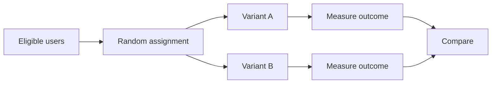

### 10.6 Randomization and control
Randomization helps make the groups comparable.
Without it, hidden differences can bias the result.
A control group gives you a reference point.
### 10.7 Power, sample size, and MDE
These are classic interview terms.
| Term | Plain meaning |
|---|---|
| Power | chance of detecting a real effect if it truly exists |
| Sample size | how many observations you need |
| MDE (Minimum Detectable Effect) | smallest effect you care to reliably detect |
### 🔍 Plain-English deep-dive
- If power is low, you may miss real improvements.
- If sample size is tiny, uncertainty stays huge.
- MDE connects stats to business relevance.
- **Analogy:** do not use a blurry ruler to decide whether a line moved by one millimeter.
### 10.8 Experiment design pitfalls
Common pitfalls:
- peeking too early and calling winners too soon
- changing success metrics mid-test
- uneven populations across variants
- contamination between groups
- ignoring seasonality or day-of-week effects
- running many tests and cherry-picking winners
### 10.9 Multiple-testing caution
If you test many hypotheses, some will appear significant by luck.
This is the multiple-testing problem.
Ways to respond:
- pre-register primary metrics when possible
- reduce the number of casual comparisons
- use corrections like Bonferroni or false-discovery-rate methods where appropriate
- treat exploratory findings as exploratory
### 10.10 Regression analysis and interpretation
Regression is not only an ML tool.
It is also a statistical tool for understanding relationships.
### 🔍 Plain-English deep-dive
- A coefficient estimates how the outcome changes as a predictor changes, holding other included variables constant.
- In linear regression, coefficients are often directly interpretable.
- In logistic regression, coefficients connect to log-odds, so many business audiences prefer odds ratios or directional interpretation.
Example interpretation:
"Holding channel, severity, and segment constant, reopened cases are associated with higher escalation risk."
### 10.11 R² and adjusted R²
R² measures how much of the outcome variance is explained by the model compared with using the mean alone.
Adjusted R² penalizes extra variables that do not really help.
Important caution:
High R² does not automatically mean causal truth or business usefulness.
A model can fit history well and still be operationally weak.
### 10.12 Correlation vs causation
One of the most important analyst habits is not confusing association with causation.
If customers who use chat have lower CSAT, it does not automatically mean chat causes lower CSAT.
Maybe harder cases disproportionately enter chat.
Maybe wait times differ.
Maybe the customer segment differs.
### 10.13 Bayesian intro
Bayesian thinking updates beliefs as new evidence arrives.
Instead of treating one estimate as fixed, you start with a prior belief and revise it using observed data.
### 🔍 Plain-English deep-dive
- **Analogy:** before opening a case, you already know the base rate of escalation for similar issues.
- Then the new case details update that belief.
- That is Bayesian intuition.
Why it is useful to recognize:
- prior knowledge can be valuable
- uncertainty can be expressed naturally
- sequential learning fits many real business settings
### 10.14 A/B testing in a support analytics example
Suppose CE&S launches a new Copilot-guided self-help flow.
You want to know whether it improves deflection without hurting satisfaction.
A strong experiment design would include:
- random assignment where feasible
- clearly defined outcome metrics such as containment, assisted-contact rate, and follow-up CSAT
- enough sample size for a meaningful lift
- guardrail metrics such as reopen rate or later escalation rate
- segment cuts by region and issue type
> 💡 **Tie-in to your background:** Your strongest statistics examples will often come from support reality: verifying whether a deflection change truly improved outcomes, whether sentiment changes are statistically meaningful, and whether volume shifts reflect real change rather than normal noise.
---
## 11. Responsible AI — how to be useful without being reckless
Responsible AI is not a side note at Microsoft.
It is core.
You should be able to speak about it comfortably and concretely.
### 11.1 Microsoft's six Responsible AI principles
| Principle | Plain-English meaning | Support / analytics interpretation |
|---|---|---|
| Fairness | avoid unjust bias across groups | model should not systematically underserve one segment |
| Reliability and safety | perform dependably and avoid harmful failure | support copilots should not invent unsafe steps |
| Privacy and security | protect data and systems | customer case data and PII must be handled carefully |
| Inclusiveness | work for diverse users and needs | experiences should be usable across languages and abilities |
| Transparency | be clear about how the system works and its limits | explain when an answer is AI-generated and cite sources |
| Accountability | humans remain responsible for outcomes | ownership and governance must be clear |
### 11.2 Fairness metrics to recognize
You do not need to become a fairness researcher.
But it helps to know common ideas.
Examples:
- demographic parity
- equal opportunity
- equalized odds
- subgroup error-rate comparison
- calibration by group
### 🔍 Plain-English deep-dive
- Fairness is not one number.
- Different fairness goals can conflict.
- The practical question is: who could be harmed, how would we detect it, and what mitigation is appropriate?
### 11.3 Bias auditing
Bias auditing means checking how system behavior varies across relevant segments.
Examples in support:
- does escalation risk model under-detect Enterprise cases?
- does the deflection bot work worse for certain languages?
- does sentiment classification misread certain writing styles?
- does a support recommendation system reinforce historical inequities?
### 11.4 Content safety
Generative systems need safety controls.
This includes:
- prompt filtering
- output moderation
- grounding restrictions
- role-based access
- human escalation paths for sensitive requests
### 11.5 Privacy with customer data
Support data often contains PII, account details, contract context, and sensitive case narratives.
That makes privacy discipline essential.
Practical habits:
- data minimization
- masking or redaction where possible
- role-based access
- retention discipline
- secure logging
- avoiding unnecessary prompt exposure of sensitive content
### 11.6 Transparency and human review
Users should know when they are interacting with AI-generated content.
High-impact decisions should not become invisible automation.
Human review should be proportionate to risk.
### 11.7 Responsible AI in interview language
A strong answer sounds like this:
"For ML and GenAI in support, I would evaluate not only accuracy but also fairness by segment, hallucination risk, privacy exposure, and operational impact. Microsoft expects Responsible AI to be built into the workflow, not added after the fact."
> 💡 **Tie-in to your background:** Because you handled customer issues and compliance-sensitive support environments, you can speak naturally about why privacy, auditability, and human accountability matter when using AI on support data.
---
## 12. Competitive landscape and the modern data stack — how Microsoft's ecosystem fits the market
Interviewers do not expect you to be equally deep on every vendor.
They do expect you to know the map.
Knowing the map shows market awareness.
### 12.1 Big-picture platform comparison
| Area | Microsoft ecosystem | Major alternatives | Plain-English view |
|---|---|---|---|
| Cloud data + analytics platform | Fabric, Azure Data Factory, Synapse, Azure Databricks, Azure ML | Databricks, Snowflake, BigQuery, AWS stack | Microsoft emphasizes integration across analytics, BI, and AI |
| BI / semantic modeling | Power BI | Tableau, Looker | Power BI is strong in semantic modeling and Microsoft integration |
| Lakehouse | Fabric Lakehouse, Azure Databricks | Databricks, Snowflake increasingly, BigQuery editions | lakehouse unifies file and warehouse-style analytics |
| Data transformation | Fabric notebooks / SQL / pipelines, some dbt-compatible patterns in many orgs | dbt, Airflow, Fivetran, native ELT tools | modern stacks often mix orchestration and SQL transformation tools |
| Governance | Purview | Collibra, Alation | governance is catalog, lineage, classification, policy |
| ML / AI platform | Azure ML, Fabric Data Science, Azure OpenAI | Databricks ML, SageMaker, Vertex AI | enterprise AI value depends on governance as much as models |
### 12.2 Microsoft vs Snowflake vs Databricks vs BigQuery
| Platform | Strength profile | Watch-out / common perception |
|---|---|---|
| Microsoft Fabric | integrated SaaS experience across lake, warehouse, BI, notebooks, real-time, Copilot | newer platform maturity varies by workload and organization readiness |
| Azure Databricks | strong Spark, data engineering, advanced ML, lakehouse depth | often paired with separate BI and governance tools |
| Snowflake | strong cloud warehouse, easy scale, broad ecosystem, growing AI features | historically more warehouse-first than full BI product stack |
| BigQuery | strong serverless analytics and Google ecosystem alignment | strongest fit often in Google-centric organizations |
### 🔍 Plain-English deep-dive
- **Fabric pitch:** fewer copies, more unified experience, OneLake, integrated Power BI, integrated data science, and increasingly integrated Copilot experiences.
- **Databricks pitch:** elite engineering and ML strength, especially for Spark-heavy environments.
- **Snowflake pitch:** strong warehouse simplicity and cross-cloud appeal.
- **BigQuery pitch:** serverless speed and Google-cloud-native alignment.
### 12.3 Power BI vs Tableau vs Looker
| Tool | Strengths | Weaknesses / trade-offs |
|---|---|---|
| Power BI | semantic model strength, DAX, Microsoft integration, often cost-effective | DAX learning curve, some modeling choices require care |
| Tableau | visual flexibility, strong exploratory visuals | semantic modeling and broader Microsoft integration less central |
| Looker | semantic modeling via LookML, strong Google ecosystem fit | different development model, often less self-service-friendly for some personas |
### 12.4 dbt, Fivetran, and Airflow
These names appear often in modern data-stack conversations.
| Tool | Plain meaning | Role |
|---|---|---|
| dbt | SQL transformation framework with testing and documentation | transforms raw to modeled data inside warehouse/lakehouse |
| Fivetran | managed data ingestion connectors | brings source data into destination with less custom code |
| Airflow | workflow orchestrator | schedules and manages multi-step pipelines |
### 🔍 Plain-English deep-dive
- A modern data stack is often modular.
- One tool ingests.
- One tool transforms.
- One tool orchestrates.
- One tool visualizes.
- Microsoft's story increasingly aims to unify more of this under one roof, especially through Fabric.
### 12.5 Data mesh vs data fabric
These terms sound similar but are not identical.
| Term | Plain meaning |
|---|---|
| Data mesh | organizational approach where domains own their data products |
| Data fabric | architectural approach to connect, govern, and manage data across systems |
### 🔍 Plain-English deep-dive
- **Data mesh** is about who owns the data.
- **Data fabric** is about how the platform helps connect and govern data.
- In real enterprises, you often see a hybrid.
### 12.6 Lakehouse trend
The lakehouse idea tries to combine the flexibility of a data lake with the performance and governance expectations of a warehouse.
This is why Delta, open table formats, and unified storage layers matter.
### 12.7 Streaming and real-time analytics
Not every problem needs real time.
But some support problems benefit from it.
Examples:
- live incident detection
- queue anomaly alerts
- real-time Copilot containment dashboards
- near-real-time sentiment or failure spikes
### 12.8 DataOps, MLOps, and LLMOps
| Term | Plain meaning |
|---|---|
| DataOps | reliable delivery and quality of data pipelines |
| MLOps | reliable lifecycle management of ML systems |
| LLMOps | reliable lifecycle management of LLM / RAG / GenAI systems |
### 12.9 Semantic layer and self-serve democratization
A semantic layer turns raw data into business-friendly metrics and definitions.
This is central to trustworthy self-serve analytics.
### 🔍 Plain-English deep-dive
- If every team defines CSAT, deflection, escalation, or assisted-contact rate differently, self-serve becomes chaos.
- A semantic layer is the shared dictionary plus calculation logic.
- Power BI semantic models are a major part of that Microsoft story.
### 12.10 2026 trends worth naming
Current trends you can mention briefly and credibly:
- Copilot and GenAI embedded across the analytics workflow
- stronger demand for grounded enterprise AI, not only generic chat
- LLMOps and evaluation becoming standard concerns
- lakehouse and open table formats continuing to matter
- real-time and event-driven analytics growing in operational scenarios
- data products and semantic layers enabling self-serve at scale
- Responsible AI and privacy governance becoming table stakes
- multimodal AI and agentic workflows expanding practical enterprise use
### 12.11 What to sound like in interview answers
You do not need to sell against competitors aggressively.
You only need to show perspective.
A balanced answer sounds like this:
"My strongest hands-on alignment is with the Microsoft ecosystem, especially Fabric, Power BI, Azure AI, and Copilot-related capabilities. I also understand how that maps to alternatives like Databricks, Snowflake, BigQuery, Tableau, or dbt-based stacks, and I think the right choice depends on workload, governance needs, and how integrated the organization wants the platform to be."
> 💡 **Tie-in to your background:** Because you already worked inside Microsoft's support environment and have Copilot Studio exposure, you can speak very naturally about why a unified Microsoft stack can be powerful for customer-support analytics, self-serve, and AI governance.
---
## 13. Synthesis — how these deeper topics connect in one CE&S BI story
The strongest candidates do not list buzzwords.
They connect them.

```mermaid
flowchart TD
    A[Support operations data] --> B[Feature engineering]
    B --> C[ML models]
    B --> D[Forecasting]
    B --> E[Anomaly detection]
    A --> F[GenAI / RAG on support knowledge]
    C --> G[Escalation or churn risk]
    D --> H[Volume planning]
    E --> I[Early incident signals]
    F --> J[Deflection and grounded assistance]
    G --> K[Better customer outcomes]
    H --> K
    I --> K
    J --> K
```

A support analytics team can use:
- supervised learning to predict escalation or churn
- unsupervised learning to discover issue clusters
- time-series methods to forecast volume and staffing needs
- anomaly detection to catch emerging incidents early
- recommendation systems and RAG to improve deflection and agent assist
- Responsible AI practices to keep trust and safety intact
- MLOps and LLMOps to keep everything reliable in production
That is the deeper-topic picture.
That is why this Part matters.
---
## 🧪 Hands-on Lab Demo 1 — Train and evaluate a tiny classifier in Colab with scikit-learn
**Goal:** demystify supervised ML by building a tiny escalation-risk classifier end to end.
**Tool:** [Google Colab](https://colab.research.google.com)
**Business framing:** imagine you want a simple first-pass model that flags cases likely to escalate.
You care more about catching risky cases than about looking good on raw accuracy.
### Step 1 — Create a toy dataset

```python
import pandas as pd
# Each row = one support case at intake time
# Target = did the case escalate?
df = pd.DataFrame({
    "resolution_hours_so_far": [2, 5, 8, 1, 20, 36, 3, 14, 28, 6, 42, 9, 18, 30, 4, 24],
    "severity_high":          [0, 0, 1, 0, 1, 1, 0, 0, 1, 0, 1, 0, 1, 1, 0, 1],
    "reopened_before":        [0, 0, 1, 0, 1, 1, 0, 0, 1, 0, 1, 0, 1, 1, 0, 1],
    "negative_sentiment":     [0, 0, 1, 0, 1, 1, 0, 1, 1, 0, 1, 0, 1, 1, 0, 1],
    "escalated":              [0, 0, 1, 0, 1, 1, 0, 0, 1, 0, 1, 0, 1, 1, 0, 1]
})
df.head()
```

### Step 2 — Split features and label

```python
X = df[["resolution_hours_so_far", "severity_high", "reopened_before", "negative_sentiment"]]
y = df["escalated"]
```

### Step 3 — Train/test split

```python
from sklearn.model_selection import train_test_split
X_train, X_test, y_train, y_test = train_test_split(
    X, y, test_size=0.25, random_state=42, stratify=y
)
```

### Step 4 — Train a classifier

```python
from sklearn.linear_model import LogisticRegression
model = LogisticRegression()
model.fit(X_train, y_train)
```

### Step 5 — Predict probabilities and labels

```python
proba = model.predict_proba(X_test)[:, 1]
pred = (proba >= 0.50).astype(int)
print(proba)
print(pred)
```

### Step 6 — Evaluate with confusion matrix and classification report

```python
from sklearn.metrics import confusion_matrix, classification_report, roc_auc_score
print(confusion_matrix(y_test, pred))
print(classification_report(y_test, pred))
print("ROC-AUC:", roc_auc_score(y_test, proba))
```

### Step 7 — Interpret coefficients

```python
coef_table = pd.DataFrame({
    "feature": X.columns,
    "coefficient": model.coef_[0]
}).sort_values("coefficient", ascending=False)
coef_table
```

### Step 8 — Tune the threshold for recall

```python
pred_recall_friendly = (proba >= 0.30).astype(int)
print(confusion_matrix(y_test, pred_recall_friendly))
print(classification_report(y_test, pred_recall_friendly))
```

### What you should notice
- lower threshold usually catches more true positives
- lower threshold may also create more false positives
- this is exactly the business trade-off you should discuss
### Interview-ready takeaway
"I trained a simple logistic-regression classifier, looked at probability outputs rather than only raw class labels, and saw how threshold changes affect recall versus precision. For escalation risk, that trade-off is the heart of the business decision."
### 🔍 Plain-English deep-dive
- This tiny dataset is only a toy.
- Real projects need more data, careful labeling, leakage checks, cross-validation, and segment-level evaluation.
- But this lab teaches the workflow end to end.
---
## 🧪 Hands-on Lab Demo 2 — RAG-style prompt exercise for grounded support answers
**Goal:** feel the difference between an ungrounded GenAI answer and a grounded one.
**Tool options:** Azure OpenAI playground, Copilot Studio, or any LLM interface where you can paste context manually.
### Step 1 — Use this tiny support KB snippet

```text
KB snippet:
- If OneDrive sync fails with error 0x8004de40, first verify network connectivity and proxy configuration.
- If the tenant recently enabled a conditional access policy, re-authentication may be required.
- Do not advise registry edits unless the approved troubleshooting article explicitly calls for them.
- If repeated retries fail after re-authentication and network checks, escalate to advanced support with sync logs attached.
```

### Step 2 — Ask an ungrounded question
Prompt:
"A customer has OneDrive sync error 0x8004de40. What should they do?"
Observe:
- the model may answer reasonably
- but it may add unsupported steps
- it may sound confident without showing evidence
### Step 3 — Ask a grounded RAG-style question
Prompt:
"Using only the KB snippet below, answer the customer question in 5 bullet points. If the KB does not support a step, say that it is not specified. End with a short escalation condition. Cite the exact KB bullet each answer came from.
[Paste the KB snippet]
Customer question: A customer has OneDrive sync error 0x8004de40. What should they do?"
### Step 4 — Improve the prompt with guardrails
Prompt improvement ideas:
- add output format
- say "do not invent steps"
- ask the model to quote or cite the grounding bullet
- require a fallback phrase if evidence is missing
### Step 5 — Reflect on what changed
You should notice:
- the grounded answer is narrower
- the answer is more auditable
- unsupported creativity drops
- trust increases because the answer shows its source
### Interview-ready takeaway
"RAG improved answer trust by grounding the model in approved support content. The key differences were retrieval context, explicit instruction to stay within source material, and citation behavior."
> 💡 **Tie-in to your background:** This lab maps directly to Copilot Studio and support deflection work. It mirrors how a grounded support copilot should behave: use approved content, cite it, and escalate when the evidence is insufficient.
---
## 📚 Reference Links
- Microsoft Learn — [Azure AI Fundamentals (AI-900)](https://learn.microsoft.com/credentials/certifications/azure-ai-fundamentals/)
- Microsoft Learn — [Azure AI Engineer Associate (AI-102)](https://learn.microsoft.com/credentials/certifications/azure-ai-engineer/)
- Microsoft Learn — [What is machine learning?](https://learn.microsoft.com/azure/machine-learning/overview-what-is-azure-machine-learning)
- scikit-learn — [User Guide](https://scikit-learn.org/stable/user_guide.html)
- Google — [Machine Learning Crash Course](https://developers.google.com/machine-learning/crash-course)
- Microsoft Learn — [Retrieval-Augmented Generation on Azure](https://learn.microsoft.com/azure/search/retrieval-augmented-generation-overview)
- Microsoft — [Responsible AI at Microsoft](https://www.microsoft.com/ai/responsible-ai)
- Microsoft Learn — [Copilot in Fabric overview](https://learn.microsoft.com/fabric/get-started/copilot-fabric-overview)
- Microsoft Learn — [Azure Machine Learning documentation](https://learn.microsoft.com/azure/machine-learning/)
- MLflow — [Official docs](https://mlflow.org/docs/latest/index.html)
- Prophet — [Documentation](https://facebook.github.io/prophet/)
- XGBoost — [Documentation](https://xgboost.readthedocs.io/)
- LightGBM — [Documentation](https://lightgbm.readthedocs.io/)
- Microsoft Fabric — [Data Science documentation](https://learn.microsoft.com/fabric/data-science/)
- Book: *An Introduction to Statistical Learning* (free online resources widely available)
- Book: *Naked Statistics* by Charles Wheelan
---
## ⭐ Likely Interview Questions
**Q1. "Explain supervised, unsupervised, and reinforcement learning in plain English."**
> *Model answer:* Supervised learning uses labeled examples, so the answer is known in the training data. Unsupervised learning looks for structure without a target label, such as clustering or association patterns. Reinforcement learning learns from rewards and penalties over time. In support, escalation prediction is supervised, issue clustering is unsupervised, and optimizing a bot policy over repeated interactions can resemble reinforcement learning.
**Q2. "What are features and labels?"**
> *Model answer:* Features are the input variables the model uses. The label is the outcome you want to predict. For an escalation model, features might include severity, sentiment, and queue backlog. The label would be whether the case escalated.
**Q3. "Why do we need train, validation, and test sets?"**
> *Model answer:* Training data fits the model. Validation data helps compare options and tune hyperparameters. The test set is the final honest check on unseen data. Without this separation, we can fool ourselves into thinking a model generalizes when it only memorized.
**Q4. "What is overfitting, and how do you reduce it?"**
> *Model answer:* Overfitting means the model learns the training data too specifically, including noise. It often shows up as strong training performance but weaker validation or test performance. I reduce it with simpler baselines, cross-validation, regularization, better feature discipline, and careful tuning. For support data, time-based validation is especially important so we do not accidentally learn the future.
**Q5. "When would you use logistic regression instead of XGBoost?"**
> *Model answer:* I would often start with logistic regression as a baseline because it is fast, interpretable, and easy to operationalize. If the problem is highly nonlinear and the business accepts more complexity, I would compare it with tree ensembles like XGBoost. The final choice depends on recall, calibration, fairness, latency, and maintainability, not only raw leaderboard performance.
**Q6. "Why can accuracy be misleading?"**
> *Model answer:* Accuracy treats all errors as if they matter equally and can look strong on imbalanced data. If only 5 percent of cases escalate, always predicting no escalation gives 95 percent accuracy and still misses all risky cases. For support-risk models, I would focus much more on precision, recall, PR-AUC, and cost-aware thresholding.
**Q7. "What metric matters most for escalation prediction?"**
> *Model answer:* There is no universal single metric, but recall is often especially important because missing a true escalation can be costly. I would still pair recall with precision, PR-AUC, and calibration so the score remains usable in operations. Then I would choose a threshold based on business review capacity and the cost of false negatives versus false positives.
**Q8. "What is class imbalance and how do you handle it?"**
> *Model answer:* Class imbalance means one class is much rarer than the other, such as escalated versus not escalated cases. I handle it by choosing better metrics, considering class weights, using resampling techniques carefully, and tuning the decision threshold. SMOTE can help in some settings, but I use it carefully because synthetic samples can distort reality if applied blindly.
**Q9. "What is feature leakage?"**
> *Model answer:* Feature leakage happens when the model uses information that would not exist at prediction time. That makes offline evaluation look unrealistically good. In support, using final resolution code to predict escalation would be classic leakage. I always ask: could we truly know this feature when the prediction is made?
**Q10. "How would you explain cross-validation?"**
> *Model answer:* Cross-validation rotates which slice of data is used for validation so we get a more stable estimate of performance. It is especially useful when data is limited. For time-based problems I would use time-aware validation rather than random folds so the evaluation matches real deployment.
**Q11. "What is RAG and why is it useful?"**
> *Model answer:* RAG stands for Retrieval-Augmented Generation. It retrieves trusted source material at query time and gives it to the model so the answer is grounded. That is useful in enterprise support because the truth lives in current KBs, policies, and issue docs, not only in the model parameters. It also enables citations and reduces hallucination risk.
**Q12. "RAG or fine-tuning — which would you choose?"**
> *Model answer:* If the problem is private, current, or changing knowledge, I would usually prefer RAG first. If the problem is model behavior or style adaptation, fine-tuning may help. In support analytics and support copilots, RAG is often the safer first move because freshness, grounding, and citation matter so much.
**Q13. "What are embeddings?"**
> *Model answer:* Embeddings are dense vector representations of meaning. Similar text ends up close together in vector space. That is why embeddings power semantic search, clustering of similar issues, and retrieval for RAG systems.
**Q14. "How would you evaluate a GenAI support copilot?"**
> *Model answer:* I would evaluate more than fluency. I would measure groundedness, factuality, citation quality, safety, containment or task success, user satisfaction, latency, and cost. For high-risk workflows I would also include human review outcomes and segment-level quality checks.
**Q15. "What is concept drift?"**
> *Model answer:* Concept drift means the relationship between features and target changes over time. In support, severity or sentiment may stop predicting escalation the same way after a workflow or policy change. That is why monitoring and retraining matter even when the original model looked strong.
**Q16. "Explain p-value in simple terms."**
> *Model answer:* A p-value tells us how surprising the observed result would be if the null hypothesis were true. It is not the probability that the null is true. I use it as one piece of evidence, alongside confidence intervals and practical significance.
**Q17. "What is MDE in an A/B test?"**
> *Model answer:* MDE means Minimum Detectable Effect. It is the smallest change we care enough to reliably detect with the planned sample size and power. It helps connect experiment design to business relevance so we do not run underpowered tests for trivial effects.
**Q18. "How do you bring Responsible AI into analytics work?"**
> *Model answer:* I treat it as part of design, not a postscript. That means checking fairness by segment, protecting customer data, grounding GenAI outputs, being transparent about limitations, and keeping clear human accountability for decisions. At Microsoft, that aligns directly with the six Responsible AI principles.
**Q19. "How would you explain the modern data stack to a business leader?"**
> *Model answer:* I would say it is the collection of tools that ingest, transform, govern, analyze, and operationalize data at scale. The market includes modular stacks like dbt, Fivetran, and Airflow, while Microsoft increasingly offers a more integrated platform through Fabric, Power BI, Azure AI, and related services. The right choice depends on workload, governance, and how unified the organization wants the experience to be.
**Q20. "Why are these deeper topics relevant for a BI analyst?"**
> *Model answer:* Because modern BI is no longer only static reporting. Analysts increasingly work with predictive models, experimentation, semantic layers, self-serve, GenAI, and Responsible AI expectations. For a CE&S BI team that develops ML models, understanding these topics helps the analyst ask better questions, define better metrics, and partner effectively across functions.
---
## 🧠 30-Second Memory Hooks
- **Supervised = labeled prediction; unsupervised = hidden structure; reinforcement = learn from rewards.**
- **Features are inputs; label is the answer; leakage is cheating with future information.**
- **Train learns, validation tunes, test tells the truth.**
- **Bias = too simple; variance = too twitchy; good models balance both.**
- **Regularization is the stay-humble penalty.**
- **Baseline first; complexity earns its place.**
- **Logistic regression = transparent risk score; boosting = powerful tabular workhorse.**
- **k-means groups by nearest center; DBSCAN finds dense groups and noise; PCA compresses dimensions.**
- **Time series = trend + seasonality + cycle + noise.**
- **Recommendation suggests the next best thing; anomaly detection spots unusual patterns early.**
- **Feature engineering often matters more than fancy model choice.**
- **Accuracy can lie on imbalanced data; recall often matters most for escalation and churn.**
- **Thresholds turn probabilities into actions.**
- **MLOps keeps models reproducible, deployable, and monitored.**
- **Tokens are text units; embeddings are meaning vectors; transformers use attention.**
- **RAG = retrieve trusted context first, then generate with grounding and citations.**
- **RAG solves freshness better than fine-tuning; fine-tuning changes behavior more than knowledge.**
- **Good GenAI evaluation checks groundedness, safety, usefulness, latency, and cost.**
- **p-value asks how surprising the result is under the null; confidence intervals show uncertainty honestly.**
- **Power, sample size, and MDE keep experiments from being wishful thinking.**
- **Responsible AI = fairness, safety, privacy, inclusiveness, transparency, accountability.**
- **Modern data stacks are about integration, governance, self-serve, and trustworthy AI — not just storage.**
---
*Next suggested section:* **Part 12 — Interview Question Bank** (100+ drill questions across all Parts, with quick hints and cross-references for self-quiz practice).
