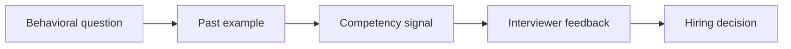
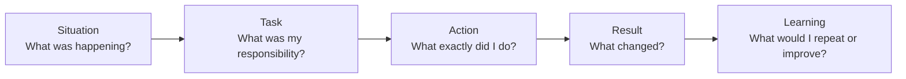
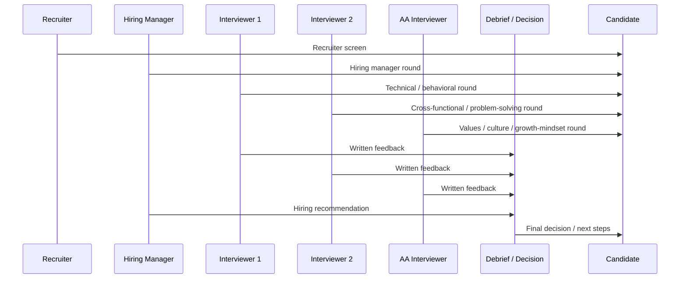
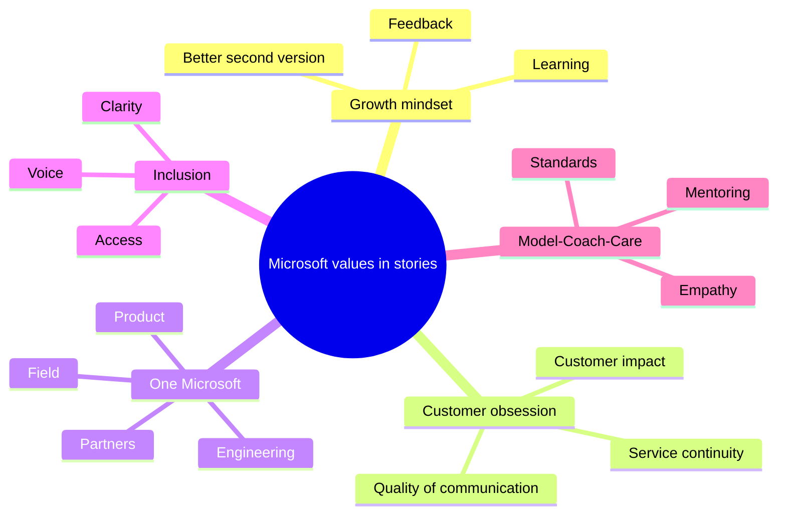
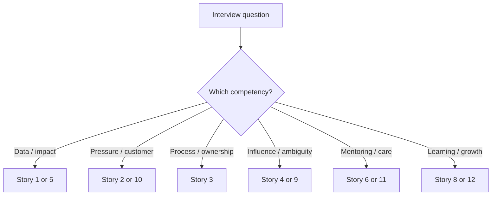
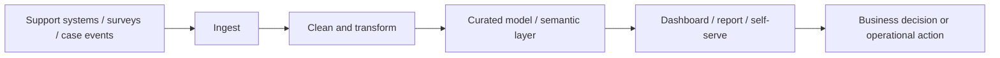

# Part 13 — Behavioral & Closing

> Section goal: Turn your experience into interview-ready stories that sound credible, structured, and business-focused. This Part takes you from the basics of behavioral interviewing all the way to Microsoft-specific values, full ready-to-adapt stories, tough closing questions, interviewer questions, remote-interview execution, and a final night-before cheat sheet.

Covers index item **13**. For this role, technical skill gets you into the conversation, but behavioral depth often decides whether the team can picture you doing the work with customers, partners, engineering, and leadership.

**How to use this Part:**
- Read once for understanding.
- Mark the stories that feel most natural to you.
- Rehearse them aloud until they sound like your own words, not like a script.
- Replace any placeholder-style phrasing with your exact numbers, names, and timeline where you can.
- Come back after a mock interview and tighten the weak spots.

**Why this section matters for Arti specifically:**
- You already have strong Microsoft-shaped evidence: customer pressure, escalation ownership, senior-leadership communication, enablement, and cross-functional execution.
- Your main interview challenge is usually not "Do I have stories?" It is "Can I translate support stories into BI/data-analyst language fast and clearly?"
- This file solves that translation problem.

---

## 1. What behavioral interviews are really testing

A behavioral interview is not just story time.
It is a structured way for the interviewer to predict how you will behave in their real environment.

### 🔍 Plain-English deep-dive: what the interviewer is secretly asking
- **Behavioral question** — *a prompt about a past event used to predict future behavior.* **Analogy:** It is like checking an athlete's match footage instead of trusting gym talk. **Why it matters:** Interviewers trust lived examples more than self-descriptions.
- **Competency** — *a repeatable skill or pattern, like influencing, learning fast, or handling ambiguity.* **Analogy:** A competency is a muscle group; one story is a lift that proves the muscle exists. **Why it matters:** Good candidates make the competency obvious without making the interviewer guess.
- **Signal** — *the evidence your answer sends about your judgment, ownership, and maturity.* **Analogy:** A signal is what your story "smells like" after the details fade. **Why it matters:** Interviewers often remember the signal more than every sentence.
- **Red flag** — *a pattern that makes the interviewer worry about future risk.* **Analogy:** It is the crack in the bridge that suggests a heavier load may fail. **Why it matters:** Rambling, blaming, vagueness, and zero self-awareness can outweigh an otherwise decent background.

| What the interviewer hears | What they conclude |
|---|---|
| "We did a lot" with no clear ownership | Candidate may have participated but not led |
| "I looked at the trend, found the driver, aligned the teams, and changed the process" | Candidate is analytical and action-oriented |
| "It was hard because everyone else failed" | Candidate may lack maturity or partnership instinct |
| "I missed something, fixed my approach, and changed how I work" | Candidate has growth mindset and coachability |

> 💡 **Tie-in:** Your background naturally produces strong signals for customer obsession, cross-functional coordination, calm under pressure, and data-backed leadership communication. The goal is to label those signals clearly in BI language.

### What strong behavioral answers usually prove
- You can notice patterns, not just react to tasks.
- You understand the business meaning of a metric, not just the number itself.
- You can work through other teams, not only inside your own lane.
- You can stay calm when the stakes are high.
- You can learn quickly when the job changes shape.
- You can tell the difference between activity and impact.

### What weak behavioral answers usually sound like
- Too much setup and not enough action.
- A lot of "we" and almost no "I."
- No numbers, no scale, no timing, no result.
- No lesson learned.
- No clue which competency the story proves.
- One giant dramatic story forced into every question.

### The mindset shift that matters most
Think of behavioral interviewing like building a dashboard.
A bad dashboard dumps everything on one screen.
A good dashboard shows the few measures that change the decision.

Your answer should do the same thing.
Do not dump the full history.
Show the context, the decision, your action, and the result that matters.

---

## 2. The STAR method — deep, practical, and Microsoft-friendly

STAR is the default structure for behavioral interviewing because it keeps answers concrete, concise, and outcome-led.
The letters are simple, but using them well is a real skill.

### 🔍 Plain-English deep-dive: STAR from the ground up
- **S — Situation** — *the starting context.* **Analogy:** It is the opening scene in a movie trailer. **Why it matters:** The interviewer needs enough context to care, but not so much that the plot never starts.
- **T — Task** — *the job to be done, specifically yours.* **Analogy:** It is the mission brief before the operation begins. **Why it matters:** This line separates background noise from your actual responsibility.
- **A — Action** — *the steps you personally took.* **Analogy:** It is the steering wheel; this is where the interviewer sees how you think. **Why it matters:** Action is the biggest part of the answer because this is the only part that predicts future performance.
- **R — Result** — *the measurable or observable outcome, plus what changed because of it.* **Analogy:** It is the scoreboard at the end of the game. **Why it matters:** Interviews reward impact, not effort alone.

### The ideal timing for a two-minute answer
A good rule is not equal time for each letter.
The action should dominate.

| STAR part | Target time | What good sounds like |
|---|---:|---|
| Situation | 15–25 sec | Clear stakes, no backstory flood |
| Task | 10–20 sec | Your role and goal are obvious |
| Action | 60–80 sec | Specific, sequential, personal, thoughtful |
| Result | 20–30 sec | Quantified outcome, business meaning, learning |

### A simple formula you can remember under pressure
- **Situation:** "We had a problem that mattered because..."
- **Task:** "I was responsible for..."
- **Action:** "I first... then... after that..."
- **Result:** "That led to... and I learned..."

### Do's and don'ts for each STAR section

| STAR part | Do | Don't |
|---|---|---|
| Situation | State the business problem, stakeholder, and stakes | Start with a five-minute history lesson |
| Task | Clarify your role and success target | Assume the interviewer knows what you owned |
| Action | Use "I"; show steps, judgment, trade-offs | Say "we worked on it" and leave your role blurry |
| Result | Quantify, compare before/after, explain why it mattered | End with "it went well" and no proof |

### The "I vs we" rule
In real work, success is often collaborative.
So it is normal that many good stories involve engineering, product, field teams, or partners.
But the interviewer is hiring you, not your org chart.

Use this pattern:
- "**I** analyzed the trend and framed the recommendation."
- "**I** aligned engineering and field stakeholders on the action plan."
- "**We** then executed the broader rollout together."

That structure keeps collaboration visible without hiding your contribution.

### What "quantified result" really means
A quantified result does not always require a giant percentage drop or revenue number.
It can be any concrete sign that your action changed something.

| Type of result | Example from your background |
|---|---|
| KPI | Sustained DP CSAT above 4.75 |
| KPI | Sustained SMB CSAT above 4.85 |
| Efficiency | Faster escalation handoffs after workflow redesign |
| Adoption | Leadership re-used the review format or asked for it monthly |
| Reach | Knowledge assets used by new team members or partner teams |
| Recognition | 100+ recognitions over time for impact and consistency |
| Quality | Fewer mismatched definitions or reporting disputes |
| Customer outcome | Business continuity protected during a critical incident |

### If you do not have an exact number
Use one of these safer forms instead of inventing:
- "The main measurable outcome was that DP CSAT stayed above 4.75 during that period."
- "The change reduced back-and-forth handoffs and gave leaders a cleaner weekly view."
- "The process became consistent enough that the template was reused in later escalations."
- "The key proof was that the recommendation was adopted and showed up in ongoing MBR discussions."

### A strong STAR answer usually contains six hidden ingredients
- A clear business problem.
- A clear owner.
- A decision point.
- A trade-off or constraint.
- A measurable or observable outcome.
- A learning that makes you sound more senior, not more defensive.

### Common STAR mistakes and how to fix them

| Mistake | Why it hurts | Fix |
|---|---|---|
| Starting too early | Burns time before the real story begins | Start at the point where the stakes appear |
| Too much technical detail | The interviewer loses the decision narrative | Keep only details needed to explain your judgment |
| No tension | The story sounds routine and forgettable | Name the risk, pressure, ambiguity, or conflict |
| Only teamwork language | Ownership signal disappears | Use "I" for your steps and "we" for shared execution |
| No result | The interviewer cannot judge impact | Always end with a measurable or visible change |
| No reflection | You may sound rigid | Add one short lesson or improvement |

### STAR is not a script; it is a container
If you memorize every sentence, you can sound robotic.
If you ignore structure, you can sound scattered.
The sweet spot is to memorize the shape, the numbers, and the critical phrases.

Think of STAR like a suitcase.
You do not memorize the airport journey.
You remember what belongs inside the suitcase.

### A fast checklist before you stop speaking
- Did I explain why the problem mattered?
- Did I say what I owned?
- Did I spend most of the answer on action?
- Did I include a number, comparison, or visible outcome?
- Did I show one Microsoft-shaped value?
- Did I sound calm and accountable?

### SOAR and CAR — useful variants to know
Some interviewers do not explicitly ask for STAR.
Some coaching resources use similar frameworks.
You do not need to switch frameworks on the day, but it helps to recognize them.

| Framework | Letters | Best use | What changes vs STAR |
|---|---|---|---|
| STAR | Situation, Task, Action, Result | Default behavioral answers | Most balanced and widely expected |
| SOAR | Situation, Obstacle, Action, Result | Good when challenge or friction is central | Makes the blocker more explicit |
| CAR | Challenge, Action, Result | Good for short answers or follow-ups | Faster; combines situation and task |

### Example: one story, three frameworks
- **STAR:** "Escalations were rising in a delivery-partner segment; I owned the trend analysis; I broke down drivers and aligned changes; CSAT stayed above target."
- **SOAR:** "We faced rising escalations; the obstacle was inconsistent definitions and handoffs; I standardized the analysis and alignment; leadership used the new view and outcomes stabilized."
- **CAR:** "The challenge was unclear visibility into support health; I clarified the question, defined the metrics, and built an iterative view; leaders used it for staffing decisions."

> 💡 **Tie-in:** Because your work already involved monthly business reviews, incidents, and enablement, you can usually answer in STAR without needing to invent anything dramatic. The real improvement is sharper packaging.

### A reusable answer skeleton
Use this when practising out loud:
1. "One example that comes to mind is when..."
2. "At the time, the key problem was..."
3. "I was responsible for..."
4. "What I did first was..."
5. "Then I..."
6. "To make sure it would stick, I also..."
7. "The result was..."
8. "What I took from that was..."

### Mini worksheet — stress-test any story before using it

| Question | If your answer is weak, improve this part |
|---|---|
| What exact competency does this prove? | Rewrite your Task and Result |
| Why should the interviewer care? | Strengthen the stakes in Situation |
| What did *you* do that was not generic? | Add details in Action |
| How do we know it worked? | Add a measurable or visible Result |
| What would you say if they ask "What was hard?" | Add the obstacle/trade-off |
| What did you learn? | Add one line of reflection |

---

## 3. How the Microsoft interview process usually works

Microsoft interview flows vary by org, geography, and urgency, but the broad pattern is fairly consistent.
Knowing the shape of the process helps you answer with the right level of detail at each stage.

### 🔍 Plain-English deep-dive: think of the process like a funnel, not one test
- **Recruiter screen** — *a fit and logistics check.* **Analogy:** It is airport check-in, not the full flight. **Why it matters:** The recruiter is checking whether your story, motivation, location, level, and salary range are aligned enough to move forward.
- **Hiring-manager round** — *a scope and fit test by the person who would likely own the hire.* **Analogy:** It is the coach checking whether your playing style fits the team. **Why it matters:** The hiring manager wants to know whether they can trust you with their real problems.
- **Technical or partner round** — *a capability check by someone closer to the work.* **Analogy:** It is the practical driving test after the paperwork. **Why it matters:** This round often probes how you think, not just what tools you list.
- **Loop / panel** — *a set of separate interviews by multiple people, often around four interviewers.* **Analogy:** It is less like one exam and more like several camera angles on the same performance. **Why it matters:** Different interviewers test different competencies, then combine feedback.
- **AA interviewer** — *an as-appropriate interviewer, often focused on culture, values, and calibration.* **Analogy:** It is the quality-control lens in the process. **Why it matters:** This person often looks for long-term Microsoft fit, not just immediate team fit.

### Stage 1 — recruiter screen
The recruiter usually probes four things:
- Do you understand the role at a credible level?
- Is your narrative coherent?
- Are location, work authorization, timing, and compensation roughly aligned?
- Does your experience justify moving you to the next step?

**What the recruiter is not usually doing:**
- Deep SQL or DAX assessment.
- Detailed architecture evaluation.
- Minute-by-minute cross-examination of one project.

**What helps most here:**
- A crisp "tell me about yourself."
- A confident explanation of why you want to move from support into BI.
- Honest but positive framing of gaps.
- Calm answers on salary and level.

### Stage 2 — hiring-manager conversation
This is often the most important conversation.
The hiring manager is trying to picture your first 6–12 months on their team.

They usually probe:
- Whether you understand the team's business problems.
- Whether your strengths match the work mix.
- Whether your growth slope justifies any skill gap.
- Whether you communicate with maturity and accountability.
- Whether you will raise the quality of collaboration.

For Arti, this round is where domain leverage is strongest.
A strong message is:
"I already understand the support and customer-experience world deeply; I am now formalizing the analytics stack so I can improve that world from the data side."

### Stage 3 — technical and partner rounds
These rounds may be called different things, but the pattern is similar.
You are usually tested on how you think through problems with another practitioner.

They may probe:
- SQL fluency.
- KPI definition quality.
- Power BI or DAX reasoning.
- Data modeling basics.
- How you handle ambiguity in requests.
- How you communicate assumptions.
- Whether you understand governance and decision-making, not just report building.

### Stage 4 — the loop
In Microsoft language, the "loop" usually means a set of separate interviews in a concentrated window.
Often there are around four interviewers.
One may be the hiring manager, one may be a peer, one may represent a partner team, and one may be an AA interviewer.
Sometimes there are more.
Sometimes there is a presentation or live exercise.

### What each interviewer often probes

| Interviewer type | What they often test | What strong answers sound like |
|---|---|---|
| Recruiter | Motivation, level, clarity, logistics | Crisp narrative, realistic leveling, positive energy |
| Hiring manager | Scope fit, ownership, judgment, ramp speed | Clear business thinking, prioritization, maturity |
| Peer / practitioner | Day-to-day working style, technical habits, collaboration | Structured thinking, humble confidence, team awareness |
| Cross-functional partner | Influence, communication, ambiguity, stakeholder empathy | Clear translation between technical and business language |
| AA interviewer | Values, culture, growth mindset, long-term fit | Reflective stories, inclusion, coachability, customer focus |

### The AA interviewer — what that usually means in practice
"As-appropriate" does not mean random.
It usually means someone included to help calibrate the hire beyond the immediate team.
That person may pay extra attention to:
- Growth mindset.
- Values and culture.
- Decision quality.
- Inclusiveness.
- Communication maturity.
- Patterns that suggest future leadership or future friction.

If you treat the AA round like a soft round, that is a mistake.
It is often the round where vague values-talk gets exposed.

### Competency-based interviewing at Microsoft
Competency-based interviewing means interviewers are not just asking "Do I like this person?"
They are gathering evidence against behaviors the team values.

Common competencies include:
- Drive for results.
- Customer obsession.
- Collaboration.
- Influence without authority.
- Dealing with ambiguity.
- Learning agility.
- Communication.
- Judgment.
- Inclusion.
- Ownership.

That is why a single story can answer multiple questions.
A high-pressure incident story can show customer obsession, communication, collaboration, and calm execution all at once.

### How feedback and the hiring decision often work
Each interviewer usually writes feedback independently.
That matters because you cannot rely on one person's enthusiasm to erase a weak signal elsewhere.

A simplified version of the decision flow:
1. Each interviewer submits written feedback.
2. The group compares signals and concerns.
3. The hiring manager and recruiting team look for consistency.
4. Leveling and fit are considered alongside hire/no-hire discussion.
5. The final decision is shared after approvals and alignment.

### Important implication for your preparation
You do not need to be perfect for every interviewer.
You do need consistent signals across interviews.

Consistency usually comes from:
- A stable narrative.
- A core set of strong stories.
- The same values showing up in multiple examples.
- Calm, concise answers instead of improvising a new identity every round.

> 💡 **Tie-in:** Your strongest advantage is that your stories already live inside Microsoft-shaped work: escalations, MBRs, leadership communication, partner alignment, enablement, and customer impact. That naturally matches the kinds of competencies the loop tends to probe.

---

## 4. Microsoft values and how to demonstrate them in stories

Interviewers rarely ask, "Tell me about a time you showed One Microsoft" in those exact words.
But they absolutely listen for behaviors that reflect Microsoft's culture and values.

### The values in plain English

| Microsoft value | Plain-English meaning | What it should sound like in your stories |
|---|---|---|
| Growth mindset / learn-it-all | You learn fast, seek feedback, and improve your approach | "I realized my first approach was too detailed, so I simplified it and got better adoption." |
| Customer obsession | You begin with customer impact, not internal convenience | "I designed the update cadence around the customer's business risk, not our comfort." |
| One Microsoft | You work across boundaries instead of protecting silos | "I aligned field, engineering, and partner teams around one definition and one plan." |
| Diversity and inclusion | You widen participation, respect different contexts, and create access | "I changed the enablement format so quieter or newer teammates could contribute." |
| Model, Coach, Care | You set the standard, help others grow, and treat people like humans, not resources | "I documented the playbook, coached newer engineers, and stayed available during a stressful incident." |

### 🔍 Plain-English deep-dive: values are behavior, not slogans
- **Growth mindset** — *choosing learning over ego.* **Analogy:** It is a software update mindset: improve the version, do not defend every bug. **Why it matters:** Microsoft strongly prefers candidates who can absorb feedback and evolve.
- **Customer obsession** — *making decisions through the customer's experience and outcome.* **Analogy:** It is using the map from the passenger's seat, not the driver's convenience alone. **Why it matters:** Support and BI teams both exist to improve the customer journey.
- **One Microsoft** — *solving across teams, not just inside one box.* **Analogy:** It is a relay race, not a solo sprint. **Why it matters:** BI work touches engineering, operations, field, and product.
- **Diversity and inclusion** — *building environments where more people can contribute meaningfully.* **Analogy:** It is designing a building with ramps and signs, not only stairs. **Why it matters:** Inclusive teams surface better information and make better decisions.
- **Model, Coach, Care** — *leading by example, developing others, and acting with empathy.* **Analogy:** It is being both a reliable system and a helpful guide. **Why it matters:** Microsoft values people who raise team capability, not just individual output.

### Value-to-competency map
The values often show up through more interview-style competency labels.

| Competency | Value link | What to make explicit |
|---|---|---|
| Drive for results | Customer obsession, ownership | What changed because of your work |
| Dealing with ambiguity | Growth mindset | How you created clarity when it did not exist |
| Influence without authority | One Microsoft | How you aligned people who did not report to you |
| Collaboration | One Microsoft, inclusion | How you worked across roles and made others effective |
| Learning agility | Growth mindset | How you ramped on a new tool or concept quickly |
| People development | Model-Coach-Care | How you enabled others, not just yourself |
| Judgment | Customer obsession, care | How you made trade-offs under pressure |
| Inclusion | Diversity and inclusion | How you widened participation or reduced barriers |

### How to demonstrate growth mindset without sounding rehearsed
Good growth-mindset answers usually include three moves:
- You recognized a gap, mistake, or limitation.
- You changed your approach.
- The second version worked better.

Weak versions sound like:
- "My weakness is that I work too hard."
- "I always learn fast."
- "I take feedback well" with no example.

Stronger versions sound like:
- "In one review, I realized my analysis answered too many interesting questions and not the one decision leaders had to make. I rebuilt the narrative around the decision point, and adoption improved."
- "When I first explored automation tooling, I underestimated the importance of governance and handoff design. I corrected that by starting with a narrower pilot and stakeholder map."

### How to demonstrate customer obsession in BI language
For a BI role, customer obsession is not only about speaking nicely to a customer.
It can also show up in:
- Choosing the metric that best reflects customer reality.
- Avoiding misleading averages when median or P90 is more honest.
- Segmenting by customer type instead of hiding pain in a blended average.
- Designing reporting that leads to faster corrective action.
- Building self-serve insight that reduces friction and repeat issues.

### How to demonstrate One Microsoft
Your background makes this one natural.
You have examples with:
- Engineering teams.
- Product teams.
- Field stakeholders.
- Delivery partners.
- Leadership audiences.

A One Microsoft answer usually sounds like:
- "I started by getting all groups onto the same definition."
- "I translated support pain into engineering language and engineering constraints into business language."
- "I treated alignment as part of the work, not as extra work."

### How to demonstrate diversity and inclusion
Inclusion does not require a dramatic formal program to be real.
It often appears in ordinary choices.

Examples you can credibly use:
- Designing enablement sessions for different experience levels.
- Publishing knowledge in a reusable format so people in different regions can access it.
- Intentionally inviting quieter contributors into discussions.
- Avoiding jargon overload when presenting across technical and non-technical groups.
- Building a shared resource instead of keeping expertise trapped with a few people.

### How to demonstrate Model-Coach-Care
This value is especially strong if you have mentored others.
You can show it through:
- Reusable knowledge assets.
- Structured enablement sessions.
- Calm guidance during escalations.
- Raising team consistency, not just solving your own queue.

### Strong phrasing patterns for value-heavy answers
- "The customer impact mattered because..."
- "I wanted one shared definition before anyone built a report or a fix."
- "I realized my first draft was harder for non-technical stakeholders to use, so I simplified it."
- "I documented the workflow so newer team members could use it without depending on tribal knowledge."
- "I made space for input from teams with a different perspective because the handoff problem crossed boundaries."

### A quick self-check for every story
Ask these questions:
- Which value is most visible in this story?
- Which competency is most visible?
- If the interviewer wrote one sentence about this answer, what would it be?
- Does the story sound like Microsoft work, or just generic corporate work?

> 💡 **Tie-in:** Your support background gives you unusually authentic ways to show customer obsession and One Microsoft. Your mentoring and knowledge assets give you natural proof of Model-Coach-Care. Your MBA and certifications help you show growth mindset as active investment, not empty language.

---

## 5. Background → competency translation table (deep version)

This is one of the highest-value tables in the entire guide.
It translates your existing background into the competencies a CE&S BI team is likely to care about.

| JD competency / signal | Concrete evidence from Arti's background | One-line phrasing you can use in an answer | Why it matters to BI |
|---|---|---|---|
| Data-driven decision-making | KPI, CSAT, and escalation trend analysis in monthly business reviews | "I have been turning support trends into leadership decisions, not just reports." | BI exists to support decisions, not dashboard volume |
| Executive communication | MBRs for senior leadership | "I know how to take a noisy dataset and tell the decision story clearly for leaders." | Senior stakeholders need signal, not detail overload |
| Customer obsession | High-impact incident and escalation management | "I make choices based on customer impact and business continuity, especially under pressure." | BI metrics should reflect real customer outcomes |
| Ownership | Took responsibility for trends, incident coordination, and process fixes | "I do not stop at identifying the problem; I carry it toward a workable solution." | Analysts often need to push work through ambiguity |
| Process improvement | Escalation workflow redesign | "I use data to improve the process itself, not just report on it." | BI teams often improve operational systems and decision loops |
| Stakeholder management | Worked with engineering, product, field, partners, and leadership | "I am comfortable operating across teams with different priorities and vocabularies." | Analytics work is cross-functional by nature |
| Influence without authority | Aligned teams around definitions, handoffs, and action plans | "I have often had to get alignment through clarity and trust rather than formal power." | Many analyst roles require exactly this |
| Dealing with ambiguity | Turned vague requests into defined metrics, views, or actions | "I start by clarifying the decision, the metric, the owner, and the grain." | Requirements are often fuzzy at intake |
| Governance / quality mindset | Operational rigor, risk mitigation, consistency in definitions | "I treat data quality the way support treats process control: define it, monitor it, and correct drift early." | Trusted reporting depends on governance |
| Domain expertise | ~5 years in SharePoint Online and OneDrive support escalation | "I understand the support data because I have lived the operating reality behind it." | Domain context makes analyses more accurate and useful |
| Enablement / mentoring | Mentoring sessions and knowledge assets | "I raise team capability through structured enablement, not just one-off help." | Strong teams value analysts who democratize understanding |
| Learning agility | MBA in Business Analytics; DP-900, AI-102, AI-900, AZ-900 | "I am deliberately closing the tooling gap through structured study, hands-on practice, and applied pilots." | This supports your transition story |
| AI / automation curiosity | Copilot Studio and Power Platform pilots | "I am already exploring how automation and GenAI can remove repetitive work and improve insight delivery." | Modern BI teams often touch automation and AI-assisted workflows |
| Resilience under pressure | Enterprise escalations and incidents | "I stay structured when the pressure is high and the audience is broad." | Reliable analysts keep quality under stress |
| Results track record | DP CSAT >4.75, SMB CSAT >4.85, 100+ recognitions | "My impact has shown up in both customer metrics and repeated recognition." | Results make the transition story credible |

### Quick translation rules
- Replace "support" with the business problem behind the support work.
- Replace "case" with the business event if needed.
- Replace "update" with the decision or outcome the update enabled.
- Replace "I handled escalations" with "I managed high-stakes, cross-functional problems with customer impact."
- Replace "I made reports" with "I turned operational data into recommendations leaders used."

### Example translation in one line
- **Before:** "I did MBR analysis for support leadership."
- **After:** "I used KPI and escalation analysis to shape leadership decisions on support health and action priorities."

> 💡 **Tie-in:** This table is your bridge from "support engineer" language to "analyst" language. Study the phrasing until it feels natural.

---

## 6. Story portfolio map — which story answers which question?

You do not need a unique story for every behavioral question.
You need a small library of strong stories that can be rotated based on the competency being tested.

| Story | Main theme | Can also answer |
|---|---|---|
| Story 1 | Data-driven decision and impact | Executive communication, prioritization, stakeholder management |
| Story 2 | High-pressure incident | Customer obsession, calm under pressure, collaboration |
| Story 3 | Process improvement | Ownership, change management, operational excellence |
| Story 4 | Influence without authority | Stakeholder management, ambiguity, requirements translation |
| Story 5 | Ambiguity to clarity | Discovery, metric definition, data quality, BI mindset |
| Story 6 | Mentoring and teaching | Model-Coach-Care, communication, people development |
| Story 7 | Conflict and competing priorities | Prioritization, judgment, negotiation, resilience |
| Story 8 | Failure and learning | Growth mindset, humility, adaptation |
| Story 9 | Cross-functional collaboration | One Microsoft, influence, partnership |
| Story 10 | Customer obsession | Empathy, communication, judgment |
| Story 11 | Driving inclusion | Inclusion, enablement, collaboration |
| Story 12 | Learning a new skill fast | Learning agility, initiative, future potential |

### How to choose the best story in real time
Ask yourself three fast questions:
1. What competency is the interviewer actually probing?
2. Which story gives the clearest evidence with the least explanation?
3. Which value do I want to leave behind in their notes?

If two stories fit, choose the one with:
- Clearer numbers.
- Clearer ownership.
- Stronger learning.
- Stronger connection to BI or CE&S.

---

## 7. Complete ready-to-adapt STAR stories

The stories below are written to be interview-ready, but they should still sound like you when spoken aloud.
Do not memorize every line.
Memorize the structure, the key numbers, and the proof points.

### Story 1 — Data-driven decision in an MBR

**Best for prompts like:**
- Tell me about a time you used data to drive a decision.
- Describe a time you influenced leadership with analysis.
- Tell me about a time you prioritized based on trends.

**Competencies it proves:**
- Data-driven decision-making
- Executive communication
- Drive for results
- Stakeholder management

**Microsoft values it demonstrates:**
- Customer obsession
- Growth mindset
- One Microsoft

**S — Situation**
- In one monthly business-review cycle, I saw a delivery-partner segment showing a concerning escalation trend.
- The raw volume alone was not enough to explain the business risk, but when paired with CSAT movement, it suggested a pattern leadership needed to act on quickly.
- Because the audience included senior leaders, the risk was not just analysis quality; it was whether I could turn noisy operational data into a clear decision story.

**T — Task**
- I owned the trend analysis and the recommendation framing for the review.
- My job was to identify the main drivers, separate real signal from one-off noise, and propose actions leaders could realistically sponsor.

**A — Action**
1. I first broke the data down by segment, category, and recurring issue pattern so I could see whether the increase was broad or concentrated.
2. I then looked at the relationship between the escalation trend and customer-experience indicators instead of presenting the metrics in isolation.
3. Once I identified the highest-friction drivers, I grouped them into a small set of decision-ready themes rather than showing a long list of symptoms.
4. I converted the findings into a concise narrative: what changed, why it mattered, what would happen if we ignored it, and which actions had the best near-term payoff.
5. Before the review, I aligned the language with relevant stakeholders so we were not debating definitions in the meeting itself.
6. During the review, I led with the recommendation rather than starting with a data dump, which helped the discussion stay focused on action.

**R — Result**
- The analysis helped leadership focus on the most meaningful drivers instead of reacting broadly.
- During the broader period, DP CSAT stayed above 4.75 and SMB CSAT stayed above 4.85, which gave credibility to the operational decisions being made.
- The work strengthened trust in my ability to translate data into direction, and it contributed to a track record that included 100+ recognitions over time.
- My biggest learning was that senior audiences want the decision story first and the backup detail second.

**Why this story works for a CE&S BI interview:**
- This story works well for BI interviews because it shows that you understand analysis as decision support, not just reporting.
- It also proves you can communicate at executive altitude without losing analytical rigor.

**Follow-up angles to be ready for:**
- What metric definitions did you have to align?
- How did you know the pattern was not just seasonal noise?
- How did you balance speed with accuracy?

**30-second version**
> I analyzed escalation and CSAT trends for an MBR, isolated the highest-impact drivers, turned them into a decision-ready leadership narrative, and helped keep key customer-experience metrics above target while building trust in my analytical judgment.

### Story 2 — High-pressure incident with customer-impact risk

**Best for prompts like:**
- Describe a high-pressure situation and how you handled it.
- Tell me about a time you managed a critical customer issue.
- Give an example of staying calm during an incident.

**Competencies it proves:**
- Customer obsession
- Judgment under pressure
- Cross-functional collaboration
- Communication

**Microsoft values it demonstrates:**
- Customer obsession
- One Microsoft
- Model-Coach-Care

**S — Situation**
- I managed a high-impact enterprise escalation involving SharePoint Online and OneDrive business-critical usage.
- The customer risk was not abstract; if the issue dragged on or communication broke down, business continuity and trust could both suffer.
- Multiple parties were involved, including the customer-facing teams, engineering, and partner stakeholders.

**T — Task**
- I needed to create order in a fast-moving situation, keep stakeholders aligned, and help drive the case toward stability and resolution.
- My role was both operational and communicative: coordinate the action path while protecting confidence.

**A — Action**
1. I started by clarifying impact: who was affected, how severe the disruption was, and what timeline the customer was experiencing.
2. I set a clear communication cadence so people knew when they would hear from us next, which reduced panic-driven follow-ups.
3. I translated technical findings into plain business language for non-engineering stakeholders and translated business urgency back into engineering terms for the fix path.
4. I tracked open questions and owners so nothing disappeared into the gap between teams.
5. When new information arrived, I updated the narrative rather than sending disconnected fragments, so the customer and field teams had one coherent picture.
6. I stayed disciplined about not overpromising before engineering validation, because credibility matters most during a crisis.

**R — Result**
- The issue was driven toward stability with minimal confusion across the stakeholder group.
- The communication structure helped preserve customer confidence during the incident rather than letting uncertainty become a second problem.
- The cadence and template I used became a reusable pattern for later critical escalations.
- The main lesson I took forward was that structured communication is not separate from incident management; it is part of incident management.

**Why this story works for a CE&S BI interview:**
- For a BI team, this story shows that you can keep decision-makers grounded under pressure and can communicate risk in a way that changes action.
- It also shows you understand the business cost of poor information flow.

**Follow-up angles to be ready for:**
- How did you choose the communication frequency?
- What trade-off did you make between speed and certainty?
- How did you handle emotional stakeholders?

**30-second version**
> In a high-impact customer escalation, I created a clear impact picture, set a disciplined communication rhythm, aligned engineering and field stakeholders, and helped restore stability while protecting customer trust.

### Story 3 — Escalation workflow redesign

**Best for prompts like:**
- Tell me about a time you improved a process.
- Describe a time you removed inefficiency.
- Give an example of ownership without formal authority.

**Competencies it proves:**
- Process improvement
- Ownership
- Influence without authority
- Operational excellence

**Microsoft values it demonstrates:**
- Growth mindset
- One Microsoft
- Model-Coach-Care

**S — Situation**
- I noticed that the escalation workflow had redundant steps, inconsistent handoffs, and too much dependence on who happened to pick up the case.
- That created avoidable delays and variation in quality, especially when pressure was high or multiple teams were involved.
- Even when cases eventually progressed, the path was more fragile than it needed to be.

**T — Task**
- I took ownership of making the workflow more consistent and efficient without weakening quality or stakeholder visibility.
- Because the process crossed teams, I had to improve it through evidence, clarity, and adoption rather than authority alone.

**A — Action**
1. I mapped the current workflow end to end so the team could see the actual path rather than the assumed path.
2. I identified repeat friction points such as duplicate updates, unclear ownership at handoff moments, and inconsistent expectations about what 'ready for next team' really meant.
3. I used examples from real escalations to show where time was being lost and where quality drift entered the process.
4. I proposed a cleaner handoff structure with clearer entry criteria, fewer redundant touchpoints, and a more standard communication pattern.
5. I socialized the redesign with the people who would use it so the process was not just theoretically better but practically usable.
6. After rollout, I supported adoption with enablement sessions and written guidance so the change could stick beyond the initial launch.

**R — Result**
- The workflow became more consistent and easier for the wider team to follow.
- Handoff friction dropped, and the path through escalation was clearer for both internal and external stakeholders.
- Importantly, the change held quality steady while improving efficiency, which is the balance that matters in support operations.
- I learned that process improvement fails if you only design the new flow; you also have to design the adoption path.

**Why this story works for a CE&S BI interview:**
- This story is strong for BI roles because analysts often improve decision processes, intake flows, metric governance, and reporting operating models, not just dashboards.
- It also shows an implementation mindset rather than a commentary mindset.

**Follow-up angles to be ready for:**
- How did you know which step to remove?
- How did you deal with resistance?
- What would you improve further?

**30-second version**
> I mapped an inconsistent escalation workflow, identified the bottlenecks and quality risks, redesigned the handoffs with stakeholder input, and improved consistency and efficiency without sacrificing quality.

### Story 4 — Influencing without authority across teams

**Best for prompts like:**
- Tell me about a time you influenced others without authority.
- Describe a time you had to align multiple stakeholders.
- Give an example of partnership across teams.

**Competencies it proves:**
- Influence without authority
- Stakeholder management
- Collaboration
- Communication

**Microsoft values it demonstrates:**
- One Microsoft
- Customer obsession
- Inclusion

**S — Situation**
- I was asked to help provide 'better visibility into support health,' but the request came from multiple stakeholders who meant different things by that phrase.
- Engineering, field stakeholders, and leadership were each looking for slightly different answers, and there was no single owner who could simply dictate the approach.
- Without alignment, any report or update would likely create more debate than clarity.

**T — Task**
- My task was to turn that vague, multi-stakeholder need into something concrete and trusted enough to guide action.
- I had to create shared understanding before anyone could move efficiently.

**A — Action**
1. I began by treating the request as a discovery problem instead of a reporting problem.
2. I asked each stakeholder what decision they were trying to make, which metric they cared about, how often they needed it, and what level of detail was actually useful.
3. I surfaced where definitions conflicted, especially around what counted as a meaningful escalation signal and which time grain made sense.
4. I summarized the inputs back into a single proposed view with explicit assumptions, so alignment happened on paper instead of through vague agreement.
5. I made sure the language worked for both technical and non-technical audiences, which reduced confusion and improved buy-in.
6. Once the group aligned, I drove the solution forward with regular check-ins rather than assuming one meeting had solved the problem forever.

**R — Result**
- The group moved from a fuzzy request to a shared, decision-ready view they could actually use.
- By aligning definitions early, we avoided rework and reduced unproductive debate later.
- The end result was not just a better output; it was a more trusted process for getting there.
- I learned that influence often starts by improving the quality of the question, not by arguing harder for an answer.

**Why this story works for a CE&S BI interview:**
- This is highly relevant to BI because vague asks are common, and analysts often succeed by clarifying the decision, grain, owner, and definitions before building anything.
- It proves you can turn ambiguity into structure.

**Follow-up angles to be ready for:**
- What if stakeholders still disagreed?
- How did you prioritize conflicting needs?
- What artifact did you use to align them?

**30-second version**
> I turned a vague multi-team request for better visibility into a shared set of decisions, definitions, and metrics, which let the group move from debate to action without formal authority.

### Story 5 — Turning ambiguity into a usable metric framework

**Best for prompts like:**
- Tell me about a time you dealt with ambiguity.
- Describe a time you built clarity from incomplete information.
- Give an example of defining metrics or requirements.

**Competencies it proves:**
- Dealing with ambiguity
- Requirements translation
- Governance mindset
- Analytical thinking

**Microsoft values it demonstrates:**
- Growth mindset
- Customer obsession
- One Microsoft

**S — Situation**
- At one point, the business need was clear at a high level—leaders wanted a better understanding of support health—but the metric definitions and reporting logic were not mature enough to support consistent decision-making.
- Different teams used similar words for different things, which meant trust in the output was vulnerable before the work even started.

**T — Task**
- I needed to create a clear metric framework that people could understand, trust, and reuse.
- That meant defining not only the measures but also the grain, logic, and intended decisions behind them.

**A — Action**
1. I started by writing down the business questions explicitly, because metrics without decisions behind them quickly become noise.
2. I separated leading indicators from lagging indicators so the view would support both monitoring and action.
3. I worked through definition disagreements, especially where blended averages risked hiding the experience of specific customer segments.
4. I pushed for a smaller, cleaner set of metrics that could be consistently explained rather than a larger set that looked impressive but confused users.
5. I validated the proposed logic against the trusted source and checked it with the people who would depend on it most.
6. I documented the definitions so the output would remain stable beyond one conversation or one owner.

**R — Result**
- The team got a more trusted and usable reporting lens because the metric logic was explicit instead of implied.
- That reduced rework, improved adoption, and made follow-up discussions faster because everyone started from the same frame.
- The main lesson for me was that BI credibility begins long before the visual layer; it begins at definition quality.

**Why this story works for a CE&S BI interview:**
- This is a direct BI story because it shows requirements gathering, metric governance, and user-focused simplification.
- It also lets you sound like someone who understands that semantic clarity is part of analytical quality.

**Follow-up angles to be ready for:**
- How did you choose which metrics to keep?
- How did you validate trust?
- What trade-off did you make between completeness and clarity?

**30-second version**
> I turned a fuzzy reporting need into a clear metric framework by starting with the business decisions, aligning definitions, validating the logic, and keeping the final view small enough to be trusted and used.

### Story 6 — Mentoring and building knowledge assets

**Best for prompts like:**
- Tell me about a time you mentored someone.
- Describe how you help others succeed.
- Give an example of knowledge sharing.

**Competencies it proves:**
- Mentoring
- Communication
- People development
- Documentation

**Microsoft values it demonstrates:**
- Model-Coach-Care
- Inclusion
- Growth mindset

**S — Situation**
- In escalation support, the same patterns and lessons can be learned slowly by many people or turned into reusable assets that lift the whole team faster.
- I saw opportunities where newer engineers or adjacent stakeholders would benefit from clearer enablement and written knowledge rather than repeated one-off explanations.

**T — Task**
- I wanted to make expertise more accessible and reduce dependence on tribal knowledge.
- My goal was not only to solve cases but to raise the team's baseline capability.

**A — Action**
1. I identified the recurring themes that were producing the most repeated questions or avoidable confusion.
2. I created knowledge assets and enablement sessions that explained not just the steps but the reasoning behind them.
3. I used plain language so the content worked for different experience levels and not only for the most technical audience.
4. During sessions, I encouraged questions and examples from the audience so the material addressed real operating pain instead of staying generic.
5. I refined the content based on what people still struggled with afterward, which made each version more practical.
6. I also treated mentoring as ongoing support, not a one-time presentation.

**R — Result**
- The knowledge became more reusable, onboarding became smoother, and more teammates could handle recurring patterns with confidence.
- The benefit was not just speed; it was consistency, because people had a shared reference instead of personal interpretation alone.
- This work reinforced for me that teaching is one of the fastest ways to scale impact beyond your own individual output.

**Why this story works for a CE&S BI interview:**
- For BI teams, this story shows that you can democratize understanding, which matters in self-serve analytics, documentation, and stakeholder enablement.
- It also shows care for team capability, not just personal visibility.

**Follow-up angles to be ready for:**
- How did you choose the right level of detail?
- How did you measure whether the sessions helped?
- What would you improve next time?

**30-second version**
> I converted recurring support learnings into reusable knowledge assets and enablement sessions, which improved consistency, helped newer teammates ramp faster, and let impact scale beyond my own casework.

### Story 7 — Managing conflict and competing priorities

**Best for prompts like:**
- Tell me about a time you had competing priorities.
- Describe a time you had to make a trade-off.
- Give an example of handling conflict professionally.

**Competencies it proves:**
- Prioritization
- Judgment
- Communication
- Resilience

**Microsoft values it demonstrates:**
- Customer obsession
- One Microsoft
- Care

**S — Situation**
- I faced situations where a live customer escalation demanded immediate attention while leadership reporting or another important deliverable was also time-sensitive.
- The challenge was not that one task was important and the other was not; both mattered, but for different reasons and audiences.

**T — Task**
- I had to make a smart priority decision, protect the highest-risk work, and still prevent the other commitment from failing.
- I also needed to communicate the trade-offs early so others were not surprised by timing or detail changes.

**A — Action**
1. I quickly assessed the business risk of each item, looking at customer impact, time sensitivity, and dependency on my unique involvement.
2. When the live escalation had the higher immediate risk, I protected that work first but reduced the reporting risk by communicating early and narrowing the scope to the essential decision points.
3. If another stakeholder needed support, I delegated the parts that could safely move without me and kept the pieces that required my context.
4. I made the trade-off explicit rather than silently hoping everything would work out, which kept trust intact.
5. After the immediate pressure passed, I closed the loop with the other stakeholders so the short-term prioritization did not become long-term drift.

**R — Result**
- The highest-risk work was protected without letting the second commitment collapse.
- Because I communicated clearly, stakeholders understood the logic behind the decision instead of reading it as disorganization.
- I learned that prioritization is not just choosing what matters most; it is also designing how the non-chosen work will still move responsibly.

**Why this story works for a CE&S BI interview:**
- BI roles constantly juggle ad hoc asks, production issues, and roadmap work, so this story helps prove judgment and expectation management.
- It shows that you can prioritize with a business lens rather than a first-come-first-served lens.

**Follow-up angles to be ready for:**
- How did you explain the trade-off?
- What framework did you use to prioritize?
- Did anyone disagree with your choice?

**30-second version**
> When I had a live escalation competing with another high-visibility deliverable, I prioritized based on business risk, communicated the trade-off early, protected the customer-critical work, and kept the second commitment moving in a controlled way.

### Story 8 — A failure that improved how I present analysis

**Best for prompts like:**
- Tell me about a failure.
- Describe a time something did not go as planned.
- Give an example of learning from feedback.

**Competencies it proves:**
- Growth mindset
- Self-awareness
- Communication
- Adaptability

**Microsoft values it demonstrates:**
- Growth mindset
- Model-Coach-Care
- Customer obsession

**S — Situation**
- Earlier in my transition toward analytics-heavy work, I sometimes over-indexed on completeness when presenting analysis.
- In one case, I built a view with more detail than the audience needed because I wanted to be thorough and avoid missing anything.
- The information was accurate, but it did not land as clearly as it could have.

**T — Task**
- I needed to improve how I framed analysis so stakeholders could act on it more easily.
- The real task was to move from proving I had done the work to proving I understood the decision.

**A — Action**
1. I paid attention to where the audience became less engaged and which questions they asked repeatedly.
2. I realized that I had optimized for completeness instead of decision speed.
3. After that, I changed my preparation process: I started with the decision, then the few metrics and visuals required to support it, and kept the deeper backup detail separate.
4. I also started pressure-testing my narrative before meetings by asking what the audience actually needed to decide or sponsor.
5. Over time, I made my updates shorter, clearer, and more outcome-led.

**R — Result**
- My later reviews were easier for stakeholders to consume and drove more focused discussion.
- The change improved adoption because the output was no longer analytically dense but operationally heavy to use.
- The lesson I took forward was that good analysis is not the maximum amount of correct information; it is the minimum amount needed for a good decision.

**Why this story works for a CE&S BI interview:**
- This is a strong transition story because it shows maturity, coachability, and a BI mindset about user-centered insight design.
- It also helps answer any concern that a support background might be too operational by showing deliberate analytical growth.

**Follow-up angles to be ready for:**
- How did you realize it was not landing?
- What did the improved version look like?
- How do you balance depth and simplicity now?

**30-second version**
> I once presented analysis that was too detailed for the decision being made, learned from that miss, and changed my approach so later reviews were shorter, clearer, and more useful to stakeholders.

### Story 9 — Cross-functional collaboration on a recurring issue pattern

**Best for prompts like:**
- Tell me about a time you worked cross-functionally.
- Describe a time you collaborated across teams with different priorities.
- Give an example of One Microsoft behavior.

**Competencies it proves:**
- Cross-functional collaboration
- Influence
- Communication
- Problem framing

**Microsoft values it demonstrates:**
- One Microsoft
- Customer obsession
- Inclusion

**S — Situation**
- I worked on recurring support themes where the symptom showed up in escalations, but the path to improvement required input from engineering, product, field teams, and sometimes partners.
- Each group had a valid perspective, but they naturally saw the problem through different lenses and timelines.

**T — Task**
- I needed to help create shared understanding of the issue pattern and support a more aligned response across the involved groups.
- That meant translating between viewpoints without diluting the actual customer pain.

**A — Action**
1. I collected evidence from the support side in a way that was more useful than isolated anecdotes.
2. I summarized the pattern into themes that engineering and product teams could act on without needing to absorb every case detail.
3. I also brought field and partner input into the picture so the response reflected the full customer journey rather than a single internal viewpoint.
4. Where priorities were different, I anchored the conversation on customer impact and repeatability, because those were the strongest common denominators.
5. I kept the communication practical and decision-oriented instead of letting it become a long cross-team status exercise.

**R — Result**
- The teams aligned more effectively around the pattern and the likely path forward.
- The quality of the conversation improved because the issue was framed at the right level for each audience.
- I learned that strong cross-functional work often depends less on pushing harder and more on translating accurately.

**Why this story works for a CE&S BI interview:**
- This story is useful for BI because analysts constantly translate among business users, data owners, and technical teams.
- It also reinforces that you know how to work inside a matrixed Microsoft environment.

**Follow-up angles to be ready for:**
- What disagreement was hardest to resolve?
- How did you keep the customer voice present?
- What artifact helped align everyone?

**30-second version**
> I helped multiple teams align on a recurring support issue by translating raw support evidence into the right level of business and technical framing, which improved the quality of the response across functions.

### Story 10 — Customer obsession beyond just solving the ticket

**Best for prompts like:**
- Tell me about a time you put the customer first.
- Describe a time you went above the minimum for a customer outcome.
- Give an example of balancing process with customer need.

**Competencies it proves:**
- Customer obsession
- Empathy
- Judgment
- Communication

**Microsoft values it demonstrates:**
- Customer obsession
- Care
- One Microsoft

**S — Situation**
- In enterprise support, there are moments when the technical issue is only part of the problem and the experience of uncertainty becomes equally damaging.
- I handled cases where the customer's business context made clear, steady communication just as important as the technical resolution path.

**T — Task**
- My task was to manage not only the issue but the customer's confidence and clarity throughout the process.
- I wanted the customer to feel that we understood both the technical problem and the business stakes.

**A — Action**
1. I made sure I understood the customer's real-world impact instead of relying only on the technical symptom description.
2. I tailored the communication to that impact level, including what we knew, what we were still validating, and when the customer could expect another update.
3. I avoided generic reassurance and focused on useful clarity, because customers under stress usually value predictability more than polished language.
4. I coordinated with the wider teams so the messages remained consistent and did not force the customer to stitch the story together on their own.
5. Where possible, I also identified practical mitigation steps so the customer had agency while the deeper issue progressed.

**R — Result**
- The customer experience was more stable and confidence remained stronger than it would have with fragmented communication alone.
- The case reinforced why customer obsession is not simply speed; it is understanding what the customer actually needs in that moment.
- It also shaped how I think about BI metrics: the measure should reflect customer reality, not internal convenience.

**Why this story works for a CE&S BI interview:**
- This story connects beautifully to analytics because it shows empathy, segmentation, and outcome thinking.
- It helps you sound like someone who will build measures and reports that reflect the lived customer journey.

**Follow-up angles to be ready for:**
- How did you adapt your communication?
- What mitigation did you offer?
- How would you measure this kind of customer experience in data?

**30-second version**
> I treated a critical customer case as both a technical and human problem, tailored the communication to the business impact, coordinated consistent updates, and helped protect customer trust while the issue progressed.

### Story 11 — Driving inclusion through enablement and shared access

**Best for prompts like:**
- Tell me about a time you promoted inclusion.
- Describe a time you made work more accessible for others.
- Give an example of making sure different voices were heard.

**Competencies it proves:**
- Inclusion
- Communication
- Mentoring
- Collaboration

**Microsoft values it demonstrates:**
- Diversity and inclusion
- Model-Coach-Care
- One Microsoft

**S — Situation**
- In support and enablement work, I saw that the same information does not reach everyone equally.
- Different experience levels, time zones, confidence levels, and familiarity with the topic can all affect who benefits from a discussion and who quietly stays behind.

**T — Task**
- I wanted to make knowledge-sharing more inclusive so that it worked for more people, not just the loudest or most experienced participants.
- That meant changing both format and follow-through.

**A — Action**
1. I designed enablement content in plain language with reusable written assets so the material was not locked inside one live meeting.
2. During sessions, I made space for clarifying questions and examples from different levels of experience rather than letting the conversation be dominated by a few voices.
3. I paid attention to where people seemed hesitant and adjusted the pace or framing accordingly.
4. I followed up with documentation so teammates who could not attend live or who needed review later still had access.
5. I treated inclusion as practical design, not just good intention.

**R — Result**
- The material became easier to use across a wider range of teammates and contexts.
- That improved consistency, reduced hidden knowledge gaps, and created a more supportive environment for learning.
- The biggest lesson for me was that inclusion often shows up in the design of ordinary work, not only in formal programs.

**Why this story works for a CE&S BI interview:**
- For BI teams, this matters because self-serve analytics only works when definitions, documentation, and access are designed for varied audiences.
- It also gives you a strong answer for inclusion that sounds operationally real rather than generic.

**Follow-up angles to be ready for:**
- How did you know who was being left out?
- What specific change improved access most?
- How would you bring inclusion into dashboard design?

**30-second version**
> I made enablement more inclusive by using plain language, reusable documentation, and session design that worked for different experience levels and schedules, which widened access and improved team consistency.

### Story 12 — Learning a new skill fast through AI and automation pilots

**Best for prompts like:**
- Tell me about a time you had to learn something quickly.
- Describe a time you stepped outside your comfort zone.
- Give an example of initiative and self-development.

**Competencies it proves:**
- Learning agility
- Initiative
- Adaptability
- Future potential

**Microsoft values it demonstrates:**
- Growth mindset
- Customer obsession
- Innovation

**S — Situation**
- As AI and automation became more relevant inside support and analytics workflows, I wanted to move from curiosity to applied experimentation.
- I explored Copilot Studio and Power Platform pilots to understand where automation could reduce repetitive work and improve internal efficiency or user experience.

**T — Task**
- My task was to ramp quickly enough to build something useful while staying grounded in real process needs and governance considerations.
- I wanted the learning to be practical, not just theoretical.

**A — Action**
1. I started by identifying a narrow, realistic use case instead of trying to automate everything at once.
2. I learned the tooling through structured exploration, documentation, and hands-on iteration.
3. As I built the pilot, I paid attention to where automation genuinely removed friction and where human review still mattered.
4. I connected the pilot back to broader operational value, such as reducing repetitive effort, improving consistency, or enabling faster access to knowledge.
5. I also used the experience to sharpen how I think about AI more generally: grounded use cases, measurable value, and careful expectations.

**R — Result**
- The pilot work gave me practical experience with newer tools and strengthened my confidence in learning unfamiliar technology quickly.
- More importantly, it showed that I can move from business need to experiment to usable insight instead of staying at the idea stage.
- The lesson I took forward was that the fastest way to learn a new capability is to attach it to a real workflow problem.

**Why this story works for a CE&S BI interview:**
- This story supports your transition by showing that you are not waiting passively for someone to train you; you are already building the next layer of capability.
- It pairs nicely with your MBA and certifications as proof of structured upskilling.

**Follow-up angles to be ready for:**
- How did you choose the pilot scope?
- What limitation did you discover?
- How does this connect to a BI role?

**30-second version**
> I used Copilot Studio and Power Platform pilots to learn a new capability through a real workflow problem, which helped me build practical automation experience and proved my ability to ramp quickly on new tools.

---

## 8. The "why" answers — polished variants you can adapt

Closing answers matter because they tell the interviewer how to interpret the rest of your profile.
A candidate with a non-traditional path can sound either unusually strong or unusually risky depending on how these answers are framed.

### 8.1 "Tell me about yourself" — three useful versions

#### 30-second version
> I have spent about five years in Microsoft CE&S support escalation engineering for SharePoint Online and OneDrive, where I became especially strong at turning support, CSAT, and escalation patterns into action for leadership and partner teams. Over time, I realized the part I was most energized by was the analytics, decision support, and process improvement side, so I have been formalizing that path through an MBA in Business Analytics, certifications, and hands-on BI and automation learning. I am now looking to bring both the domain depth and the analytics growth path into a CE&S BI role.

#### 60-second version
> I have roughly five years in Microsoft CE&S in support escalation roles focused on SharePoint Online and OneDrive, working on high-impact incidents, escalation management, trend analysis, and leadership-facing reviews. A lot of my work naturally moved toward analytics: analyzing KPI and CSAT trends, identifying escalation drivers, framing monthly business reviews, redesigning parts of the escalation workflow, and creating enablement assets that improved consistency. That made me realize I wanted to move from reacting to operational pain toward using data to prevent, prioritize, and improve it at scale. To support that move, I have been building the technical side through an MBA in Business Analytics, Azure and AI certifications, and exploration of Copilot Studio and Power Platform pilots. What excites me about CE&S BI is that I can combine real domain understanding with growing analytical depth instead of starting from zero on either side.

#### 90-second version
> I started my career in Microsoft CE&S support escalation engineering, where I spent about five years in the SharePoint Online and OneDrive space. In that role, I worked on high-impact enterprise escalations, customer communication during critical issues, KPI and CSAT trend analysis, and monthly business reviews for senior leadership. Over time, the work I found most energizing was not only solving the immediate issue but understanding the patterns behind it—what the data was saying, which problems were systemic, how to communicate that clearly, and what process changes would improve outcomes at scale. I also had opportunities to redesign parts of escalation workflow, mentor teammates through enablement sessions, and explore automation and Copilot-related pilots, which reinforced that I enjoy translating operational complexity into structured, reusable solutions. That is why I am now intentionally moving toward BI and analytics, supported by an MBA in Business Analytics and certifications like DP-900, AI-102, AI-900, and AZ-900. I think my edge is that I already understand the CE&S support domain deeply, so as I continue strengthening the analytics stack, I can connect the data to the business questions quickly and credibly.

### 8.2 Why move from support to BI?

#### Variant A — the energy answer
> The part of support work that consistently energized me most was the analysis behind the decisions: understanding escalation drivers, interpreting CSAT movement, shaping leadership reviews, and improving the operating process. I am moving toward BI because I want to spend even more of my time on that part of the value chain—turning operational data into decisions and scalable improvements.

#### Variant B — the scale answer
> In support, I could help one customer issue or one escalation at a time, which mattered. In BI, I can help improve the system behind many of those issues at once by making the right patterns visible and actionable. That shift from reacting case by case to improving the broader operating model is what attracts me.

#### Variant C — the fit answer
> This move is not a rejection of support; it is a natural extension of the parts of support work where I have already been strongest. My background gave me the domain, customer lens, and executive communication habits. BI is where I want to apply those strengths with deeper technical analytics focus.

### 8.3 Why Microsoft? Why stay in CE&S?

#### Variant A — mission + familiarity
> I already know the quality bar, pace, and customer focus inside Microsoft CE&S, and that experience has only made me want to keep growing here. I believe in the mission of improving customer outcomes, and I like that Microsoft rewards people who keep learning and broadening their impact.

#### Variant B — values + growth
> Microsoft's culture resonates with me because growth mindset here is expected in a real way, not only as a slogan. I have lived that by building new analytics and AI capability on top of my support background, and I want to keep doing that in an environment where cross-functional learning is normal.

#### Variant C — CE&S BI specifically
> CE&S BI is especially attractive because it sits at the point where trusted data, operational decision-making, and customer outcomes meet. That is exactly where my background and my future direction overlap.

### 8.4 Why this role / why CE&S BI?

> This role fits me because it combines three things I genuinely bring together well: deep knowledge of the CE&S support environment, a strong instinct for decision-oriented analysis, and a deliberate investment in the BI and analytics toolkit. I would not be approaching the data as an outsider. I understand what many of the measures mean operationally, which questions leaders actually care about, and where misleading reporting can create the wrong action. That domain fluency should help me ramp faster while I continue deepening the technical stack.

### 8.5 Why you? What is your edge?

#### Variant A — domain edge
> My strongest edge is that I understand the support and customer-experience domain behind the data. Many people can learn a tool; fewer can quickly recognize which metric definition is misleading, which segmentation matters, or why a trend is operationally important.

#### Variant B — translation edge
> I have spent years translating between technical, operational, and leadership audiences. That translation skill is a major strength for BI, because the work only matters when insight becomes action.

#### Variant C — transition edge
> I am not trying to become analytical from zero. I have already been doing data-driven storytelling, process improvement, and stakeholder alignment in my current role. I am now formalizing and deepening the analytics side so those strengths can create impact in a BI context.

### 8.6 Biggest gap and your plan

> My biggest gap relative to someone who has spent their entire career in pure BI is depth with the full production analytics stack, especially in areas like advanced semantic modeling, deeper DAX optimization, and broader experience across modern Azure or Fabric data workflows. What gives me confidence is that the underlying business and analytical thinking already fits the role, and I am closing the tooling gap deliberately through an MBA in Business Analytics, hands-on projects, certifications, and ongoing practice. I do not present the gap as solved; I present it as visible, actively shrinking, and manageable because I ramp quickly when the why is clear.

### 8.7 Where do you see yourself in 3–5 years?

#### Variant A — depth first
> In the next few years, I want to become a highly trusted BI professional in the CE&S space—someone who can move from business question to clean metric definition, robust model, useful reporting, and clear recommendation. I want depth first, then broader scope.

#### Variant B — scale and leadership
> Longer term, I want to be known for raising decision quality at scale—through better analytics, stronger governance, and mentoring others in how to use data well. I am interested in growing into larger scope over time, but I want that growth to be built on strong fundamentals and consistent impact.

#### Variant C — Microsoft-shaped answer
> I see myself continuing to grow inside Microsoft by deepening the technical analytics side while also using my domain background to help teams make better customer-impact decisions. I want to become someone people trust for both the numbers and the judgment behind them.

### 8.8 A simple structure for any closing answer
- Start with what genuinely draws you.
- Connect it to evidence from your past.
- Address the transition or gap without defensiveness.
- End with forward-looking energy.

> 💡 **Tie-in:** Your strongest closing posture is not "I want to leave support." It is "I want to apply what support taught me at a more systemic, data-driven level."

---

## 9. Handling tough questions well

Hard questions are not traps by default.
They are often tests of maturity, self-awareness, and honesty under pressure.

### 9.1 Weaknesses — what to say and what not to say
A good weakness answer should sound real, controlled, and improving.

#### Better pattern
1. Name a real but non-fatal weakness.
2. Show how you recognized it.
3. Explain what you changed.
4. Show evidence the change is working.

#### Example answer
> One development area for me has been resisting the urge to include too much detail when presenting analysis. Earlier on, I sometimes equated thoroughness with usefulness, and I learned that for leadership audiences those are not always the same thing. I now start with the decision, keep the main view focused, and put supporting detail behind it. That change has made my communication sharper and more actionable.

#### Avoid
- "I care too much."
- "I work too hard."
- "I do not really have weaknesses, but..."
- Any weakness that directly sounds like inability to learn, inability to collaborate, or inability to handle accountability.

### 9.2 Failures — how to sound accountable, not fragile
A good failure answer includes:
- A genuine miss.
- No blaming.
- No drama inflation.
- A visible change in behavior afterward.

#### Example answer
> One mistake I made earlier in my analytics-style work was building an update that was too detailed for the audience and decision point. The information itself was correct, but it made the discussion less efficient than it should have been. That taught me to design from the decision backward, not from the dataset outward. Since then, I have been much more deliberate about separating core signal from backup detail.

### 9.3 "Why leave support?"
This question is often really asking whether you are running away from something or moving toward something.

#### Strong answer
> I am not leaving support because I dislike it. In fact, support gave me the customer lens, domain depth, and much of the judgment I now value most. I am moving because the part of the work that consistently pulled me in was the analytics and systemic-improvement side—trend analysis, decision support, process redesign, and translating operational patterns into action. BI lets me build more of my career around that strength.

### 9.4 "You do not have a formal BI title yet. Why should we take the risk?"

> That is fair, and I would answer it by separating title from evidence. My title has been in support escalation, but the evidence underneath includes KPI and CSAT analysis for leadership, trend-driven recommendations, workflow redesign, cross-functional stakeholder management, enablement, and active investment in the BI stack through an MBA, certifications, and applied tooling work. So I am not asking you to ignore the gap; I am asking you to evaluate the quality of the transfer. I believe the transfer is strong.

### 9.5 Salary expectations
The safest approach is calm, informed flexibility.

#### Good pattern
- Signal openness.
- Show you care about overall fit and scope.
- If pushed, give a range only when you have context on geography and level.

#### Example answer if early in process
> I am open and would like to understand the role scope, level, and location band first so I can answer responsibly. My main focus right now is fit, but I am looking for a package that is consistent with the level and market for the role.

#### Example answer if recruiter needs a number
> Based on the role scope, location, and my background, I would be looking for a competitive package aligned with the level the team sees this role at. If it helps, I can share a range once we have calibrated the likely level and location band.

### 9.6 Leveling / IC band discussion
Microsoft roles are often discussed with level numbers or bands.
For candidates, the smartest move is usually not to force a number too early.

#### Good posture
- Ask how the team is calibrating the role.
- Show you are aware that level should reflect scope, independence, and evidence.
- Avoid sounding fixated on title over fit.

#### Sample answer
> I am open to the level that best matches the role's expected scope and the evidence I bring. Because I am moving from a support-heavy title into a BI-focused path, I would want to calibrate based on actual responsibilities, independence expected, and what success looks like in the first year rather than anchor too early on a number.

#### Smart follow-up question to recruiter
> How is the team thinking about level for this role, and what differentiates someone who comes in at one band versus the next?

### 9.7 Negotiation etiquette — basic but important
Negotiation does not have to sound aggressive.
It should sound informed and respectful.

| Good negotiation behavior | Risky negotiation behavior |
|---|---|
| Wait until there is real mutual interest | Pushing comp heavily in the first conversation |
| Ask how the offer was calibrated | Demanding without understanding scope or band |
| Consider total package, not just base | Fixating only on one number |
| Stay enthusiastic while discussing details | Sounding transactional or indifferent to the role |
| Use evidence and market framing | Using ultimatums too early |

#### Sample negotiation line
> I am excited about the role and the fit feels strong. Before I make a final decision, I would love to understand whether there is flexibility in the offer based on the scope, my domain experience, and the market for comparable roles.

### 9.8 Employment gap, relocation, or other sensitive questions
If asked, answer briefly and confidently.
Do not overshare.
Do not sound evasive.

#### Employment gap pattern
> During that period, I handled a personal / family / academic focus, and I used the time productively to stay current and continue learning. I am now fully ready and excited for this next step.

#### Relocation pattern
> I am open to discussing location expectations and want to understand the team's working model so I can align responsibly.

#### Notice-period / timing pattern
> I can work with the team's timeline and can give a realistic notice period once we reach that stage.

### 9.9 If you do not know an answer in the moment
For technical questions, it is okay to reason aloud.
For behavioral questions, it is better to pause than to ramble.

Use lines like:
- "Let me take a second and choose the strongest example."
- "I have two examples; I will pick the one that best shows ambiguity and cross-team work."
- "I do not want to overstate my experience there, but here is how I have approached the adjacent problem."

> 💡 **Tie-in:** The most convincing version of you is calm, accountable, and specific. That matters more than having a perfect answer to every edge-case question.

---

## 10. Questions to ask each interviewer type

Asking strong questions does three things at once:
- It shows seriousness.
- It reveals how the team actually works.
- It lets you subtly demonstrate that you understand the role.

### 10.1 Questions for the recruiter
- How is the team describing the scope of this role today?
- What does the interview process look like from here, and what is each stage mainly focused on?
- How is the role being calibrated in terms of level and expected ramp?
- What background tends to do especially well on this team?
- Are there any specific areas where the team wants stronger evidence during interviews?

### 10.2 Questions for the hiring manager
- What are the most important outcomes you want this person to drive in the first 6–12 months?
- Which business decisions does this role most directly influence?
- Where does the team see the biggest current gap: data quality, stakeholder self-serve, insight generation, governance, or something else?
- How does the team balance central platform work with business-specific analytics requests?
- What distinguishes a solid first year from an exceptional first year in this role?
- How much of the work is proactive roadmap work versus reactive or ad hoc support?
- Which partnerships matter most for this role—engineering, product, operations, field, finance, or others?

### 10.3 Questions for peers or practitioner interviewers
- What does a typical week look like on the team?
- What kinds of asks create the most ambiguity or rework?
- Which tools or practices make the biggest difference for day-to-day success here?
- How mature is the team's semantic modeling and metric governance today?
- What is one thing new hires usually underestimate about the work?
- How collaborative is the review process for dashboards, models, or KPI definitions?

### 10.4 Questions for cross-functional partners
- What makes collaboration with the BI team especially effective from your perspective?
- Where do requests usually become unclear or slow down?
- Which deliverables from BI have the highest trust and adoption today?
- What communication habits make the biggest difference when analytics work crosses teams?

### 10.5 Questions for a skip-level or senior leader
- What strategic shifts or priorities are shaping the team's work over the next year?
- How do you want the team to balance speed, trust, and self-serve capability?
- What capabilities do you want the team to be stronger in a year from now?
- How do you evaluate whether BI work is truly improving customer or operational outcomes?
- Where do you see AI, Copilot, or automation creating the most value for this organization?

### 10.6 Questions that are especially strong for this exact target role
- Where is the team on the Fabric journey today, and how do you see that evolving?
- How do you measure the impact of analytics work on support outcomes like CSAT, escalation health, and efficiency?
- Which support or customer-experience metrics are hardest to define consistently across teams?
- How much of the work involves building reusable self-serve capability versus bespoke analysis for leadership?
- How is the team using Copilot or GenAI internally in analytics, reporting, or support-experience workflows?
- What kinds of domain knowledge help someone ramp fastest in CE&S BI?

### How to choose which questions to ask
Use this simple rule:
- Ask at least one question about success.
- Ask at least one question about how the team works.
- Ask at least one question that helps you judge whether the role matches your growth path.

Avoid asking questions that are already answered publicly or that focus only on benefits too early.

---

## 11. Virtual and remote interview execution

Remote interviews reduce travel, but they increase the importance of signal clarity.
Small issues in setup or communication can make a bigger impression than you think.

### 11.1 Logistics checklist before the interview
- Stable internet connection.
- Charged laptop and backup power.
- Camera at eye level.
- Quiet background.
- Water nearby.
- Resume and role description open but not cluttering the screen.
- A small note sheet with story names, numbers, and key questions to ask.
- Correct meeting links and time zones confirmed.

### 11.2 Your screen presence
- Look into the camera when making a key point.
- Keep your pace slightly slower than normal conversation.
- Pause briefly after the question so you sound thoughtful, not rushed.
- Smile when appropriate, especially in opening and closing moments.
- Avoid reading long prepared text.

### 11.3 Thinking aloud without sounding chaotic
A strong remote interview often rewards visible structure.
If you need to reason live, narrate in a clean sequence.

Use lines like:
- "I will break this into the business question, the data needed, and the output."
- "My first assumption is..., and if that changes, I would adjust by..."
- "I will start with the grain because that drives the model and the metric logic."

### 11.4 Whiteboarding a data or architecture answer remotely
If asked to sketch a flow, keep it simple.
You are not trying to impress with every tool icon.
You are trying to show clean thinking.

A good whiteboard flow for this role might be:
1. Source systems.
2. Ingestion.
3. Cleaning / transformation.
4. Model / semantic layer.
5. Reporting / self-serve output.
6. Decision or business action.

### 11.5 Live SQL etiquette
If a live SQL problem appears:
- Clarify the table grain first.
- Clarify output columns and sort order.
- State assumptions.
- Solve a simple correct version before optimizing.
- Talk through joins and null handling.
- If time allows, mention performance considerations after correctness.

#### Useful phrase
> I will first restate the problem in terms of grain, filters, and expected output so I do not optimize the wrong query.

### 11.6 Live DAX etiquette
If a live DAX question appears:
- Ask whether the measure should respect current filters or override them.
- Clarify whether the request is row-level logic or aggregate logic.
- Prefer measures for dynamic business metrics.
- Mention filter context explicitly.
- Check the date table if time intelligence is involved.

#### Useful phrase
> My first thought is to use a measure because this sounds like a dynamic KPI under filter context rather than a row-by-row attribute.

### 11.7 If you need a moment
Silence feels longer on video than it really is.
A short pause is fine.
A panicked filler monologue is worse.

Use lines like:
- "Let me take a second to structure that."
- "I want to choose the best example rather than answer too generally."
- "I have an approach in mind; I will talk through it step by step."

### 11.8 Closing the conversation well
At the end of each round:
- Thank the interviewer.
- Ask one strong question if time allows.
- Reinforce fit briefly.
- Keep the energy steady to the last minute.

#### Good closing line
> Thank you, this conversation reinforced why I am excited about the role. I appreciate hearing how the team thinks about the work, and I would be excited to bring my CE&S domain background and growing analytics depth into that environment.

> 💡 **Tie-in:** Remote interviews reward candidates who sound organized. That plays to your strength if you use clean structures and calm pacing.

---

## 12. Mock-interview plan, self-recording, and readiness checklist

Reading creates familiarity.
Readiness requires speaking, timing, and recovering when you are not perfectly prepared.

### 12.1 A practical mock plan

| Practice block | What to do | Why it matters |
|---|---|---|
| Story selection | Pick your best 8–10 stories | Reduces panic when questions vary |
| Story rehearsal | Speak each one in 90–120 seconds | Builds fluency without sounding robotic |
| Technical drill | Answer 8–10 SQL, BI, and KPI questions aloud | Strengthens concise explanation |
| Mixed mock | Combine behavioral and technical in one session | Simulates interview switching cost |
| Review and refine | Note where you rambled or lost the result | Converts practice into improvement |

### 12.2 A 7-day practice rhythm
- **Day 1:** Read this file and choose your core story set.
- **Day 2:** Rehearse Stories 1–4 aloud and tighten them to ~2 minutes each.
- **Day 3:** Rehearse Stories 5–8 and practice the core "why" answers.
- **Day 4:** Rehearse Stories 9–12 and answer tough questions on weakness, failure, and transition.
- **Day 5:** Do a mixed mock with technical and behavioral questions back to back.
- **Day 6:** Record yourself, review the playback, and shorten the weak parts.
- **Day 7:** Do one final mock with minimal notes and realistic pacing.

### 12.3 How to self-record usefully
Do not watch the playback like a critic.
Watch it like an interviewer.

Score yourself on:
- Clarity.
- Ownership.
- Brevity.
- Result strength.
- Energy.
- Confidence without arrogance.
- Microsoft-value signal.

| Review question | Strong sign | Weak sign |
|---|---|---|
| Did I answer the actual question? | Story clearly fits the competency | Story feels forced into the prompt |
| Did I say "I" enough? | My role is easy to identify | The interviewer would need to guess my part |
| Did I quantify the outcome? | Result includes number or visible proof | Result is vague or missing |
| Did I sound calm? | Steady pace, clean structure | Rambling, over-explaining, apologizing |
| Did I show learning? | One short reflection adds maturity | No reflection or defensive reflection |

### 12.4 What "ready" really means
You are probably ready enough to interview when:
- You can answer "Tell me about yourself" three different ways.
- You can deliver 8 strong stories without losing structure.
- You can adapt one story to multiple competencies.
- You can answer "Why BI?" and "Why now?" without sounding uncertain.
- You can survive a follow-up question without collapsing.
- You can ask thoughtful questions at the end.

### 12.5 What "not ready yet" often looks like
- You understand the content but cannot speak it clearly.
- Every story starts with too much history.
- You still avoid numbers because you are not sure which ones matter.
- You switch between support language and BI language awkwardly.
- You freeze when asked a slightly different version of a known question.

### 12.6 The candid truth
Reading this file helps.
It does not make you interview-ready by itself.
Real readiness comes from:
- Speaking aloud.
- Owning your real examples.
- Practising transitions between technical and behavioral modes.
- Doing at least one mock where someone interrupts, asks follow-ups, or changes direction.

That is good news.
It means readiness is trainable.

---

## 13. 🌙 Expanded one-page night-before cheat sheet

### My narrative in one sentence
I spent about five years inside Microsoft CE&S support escalation work, became strongest at turning support signals into decisions and process improvements, and am now intentionally moving that strength into a BI role with added analytics depth from an MBA, certifications, and hands-on learning.

### My fastest opening lines
- "I already understand the support world behind the data; now I am formalizing the analytics stack to improve that world at scale."
- "My edge is domain depth plus decision-oriented analysis, not just tool familiarity."
- "I am moving from reacting to issues one by one toward improving the system behind them."

### Frameworks to recall
- **Behavioral:** STAR = Situation, Task, Action, Result.
- **Short variant:** CAR = Challenge, Action, Result.
- **Question decoding:** competency first, story second.
- **Decision framing:** business question → metric → grain → owner → action.
- **Analytics ladder:** descriptive → diagnostic → predictive → prescriptive.
- **Modeling:** grain first, then fact, then dimensions, then measures.
- **DAX reminder:** filter context is the question each cell is asking.
- **SQL reminder:** solve for correctness first, then optimize.

### My strongest story set
- Story 1 — Data-driven decision in an MBR.
- Story 2 — High-pressure incident.
- Story 3 — Workflow redesign.
- Story 4 — Influence without authority.
- Story 6 — Mentoring and enablement.
- Story 8 — Failure and learning.
- Story 10 — Customer obsession.
- Story 12 — Learning a new skill fast.

### My key numbers
- ~5 years in Microsoft CE&S support escalation engineering.
- DP CSAT above 4.75.
- SMB CSAT above 4.85.
- 100+ recognitions.
- MBA in Business Analytics.
- Certifications: DP-900, AI-102, AI-900, AZ-900.

### Microsoft values to visibly weave in
- Growth mindset: I learn, adapt, and improve the second version.
- Customer obsession: I frame decisions around customer impact.
- One Microsoft: I align engineering, product, field, partners, and leadership.
- Inclusion: I widen access to knowledge and participation.
- Model-Coach-Care: I document, mentor, and raise team capability.

### Questions I should be able to answer cleanly
- Why BI now?
- Why this role?
- Why Microsoft / why CE&S BI?
- Why you over someone with a more traditional BI title?
- What is your biggest gap and how are you closing it?
- Tell me about a time you used data to drive action.
- Tell me about a time you failed and learned.
- Tell me about a time you influenced without authority.

### Questions I can ask them
- What does success look like in the first 6–12 months?
- Where does the team most need stronger insight today?
- How is impact from analytics measured here?
- What is the team's Fabric / modern data-platform journey?
- How do BI, operations, and engineering work together on the highest-value problems?

### Remote interview reminders
- Camera at eye level.
- Slow down slightly.
- Pause before choosing a story.
- Use "I" for actions.
- Land the result.
- End strong.

### Mindset reminders
- I do not need a perfect answer to every question.
- I do need consistent signals.
- My path is credible because the evidence is real.
- Domain depth is a strength, not something to apologize for.
- Calm beats speed.
- Clarity beats cleverness.
- Reading is not readiness; speaking is readiness.

---

## ⭐ Likely Interview Questions for This Section

**Q1. "Tell me about yourself."**
> *Model answer:* I have spent about five years in Microsoft CE&S support escalation work focused on SharePoint Online and OneDrive, where I became especially strong at handling high-impact customer issues, analyzing trends, and turning operational data into action for leadership. Over time, I realized the part of the work I enjoyed most was the analytics and process-improvement side, so I have been intentionally building toward BI through an MBA in Business Analytics, certifications, and hands-on learning. I am excited about this role because it lets me combine real CE&S domain knowledge with a growing analytics toolkit.

**Q2. "Tell me about a time you used data to drive a decision."**
> *Model answer:* In one monthly business review, I analyzed escalation and CSAT trends for a delivery-partner segment, isolated the highest-impact drivers, and reframed the findings into a decision-led story for leadership. The key was not showing more data; it was making the action clear. That helped leadership focus on the right issues, and we maintained strong customer-experience outcomes including DP CSAT above 4.75 and SMB CSAT above 4.85.

**Q3. "Describe a high-pressure situation and how you handled it."**
> *Model answer:* I managed a high-impact enterprise escalation where the customer risk was significant and multiple teams were involved. I started by clarifying impact, set a disciplined communication cadence, aligned engineering and field stakeholders, and kept the messages consistent as new information arrived. The issue moved toward stability, but just as importantly, customer confidence stayed stronger because the communication was structured.

**Q4. "Tell me about a time you improved a process."**
> *Model answer:* I noticed the escalation workflow had redundant steps and inconsistent handoffs, so I mapped the current state, identified the biggest friction points, and proposed a cleaner process with clearer ownership and fewer unnecessary touchpoints. I also supported the rollout with enablement and documentation so the change would stick. The result was better consistency and smoother handoffs without sacrificing quality.

**Q5. "How do you handle ambiguity?"**
> *Model answer:* I usually start by clarifying the decision behind the request, because ambiguity often lives in the question more than the data. In one case, I turned a vague ask for better support visibility into a clear set of business questions, metric definitions, and stakeholder-aligned outputs. That reduced rework and created a view people trusted enough to use.

**Q6. "Tell me about a time you influenced without authority."**
> *Model answer:* I worked on a multi-stakeholder request where different teams wanted better visibility but were using different definitions and lenses. I treated it as a discovery and alignment problem first, gathered what each group really needed to decide, and summarized it back into a shared proposed view with explicit assumptions. That created enough trust and clarity for the work to move forward without formal authority.

**Q7. "Tell me about a failure or mistake."**
> *Model answer:* Earlier in my analytics-style work, I once presented analysis that was too detailed for the audience and decision. The work itself was correct, but it was not as usable as it should have been. I learned to design from the decision backward, keep the primary message tighter, and move extra detail into backup material. That change made later reviews much more actionable.

**Q8. "Why are you moving from support to BI?"**
> *Model answer:* The move feels natural because the parts of support I was strongest in and most energized by were already analytics-heavy—trend analysis, leadership storytelling, process improvement, and turning operational patterns into action. BI lets me focus more directly on that value while still using the customer and domain understanding support gave me.

**Q9. "Why Microsoft? Why this team?"**
> *Model answer:* I already know the customer-focus, collaboration, and learning culture inside Microsoft CE&S, and that is exactly why I want to keep growing here. CE&S BI is especially compelling because it sits where data, operations, and customer outcomes meet. That is the point where my background and my future direction overlap best.

**Q10. "What is your biggest gap for this role?"**
> *Model answer:* Relative to someone who has spent their whole career in pure BI, my biggest gap is depth across the full production analytics stack, especially advanced semantic modeling and broader platform depth. I am addressing that deliberately through an MBA in Business Analytics, certifications, hands-on practice, and applied tooling work. The reason I am confident in the transition is that the business and analytical thinking already fit the role strongly.

**Q11. "How do you demonstrate customer obsession in a BI role?"**
> *Model answer:* In BI, customer obsession means choosing metrics and analyses that reflect the customer's actual experience and help the business improve it. My support background helps me do that because I have seen how misleading definitions or blended averages can hide real pain. I naturally think about the human and operational reality behind the number.

**Q12. "Tell me about a time you mentored others."**
> *Model answer:* I turned recurring escalation learnings into reusable knowledge assets and enablement sessions so newer teammates and adjacent stakeholders could ramp faster and handle common patterns more consistently. I focused on plain language and practical examples rather than only technical depth. That improved team capability and reduced dependence on tribal knowledge.

**Q13. "How do you approach working with multiple teams that have different priorities?"**
> *Model answer:* I start by clarifying where the goals actually overlap, which is often customer impact, decision quality, or operational risk. Then I tailor the framing for each audience without changing the core facts. That translation work has been a major part of my role with engineering, product, field, partner, and leadership stakeholders.

**Q14. "What Microsoft value do you think you show most strongly?"**
> *Model answer:* Customer obsession and One Microsoft are probably the clearest in my background. Many of my strongest examples involve protecting customer outcomes while aligning several teams around one plan, one definition, or one communication path. I also think growth mindset shows up in how intentionally I have been building analytics depth on top of my existing domain experience.

**Q15. "How do you know if you are ready for this move?"**
> *Model answer:* I think readiness comes from both evidence and honesty. The evidence is that I have already been doing data-driven analysis, executive communication, process improvement, and cross-functional alignment in my current role. The honesty is that I still have tooling depth to keep building, which I am actively doing. I am ready because the transfer is already visible and the remaining gaps are understood and shrinking.

---

## 🧠 30-Second Memory Hooks
- **Behavioral interview** = past evidence used as a forecast.
- **STAR** = context, responsibility, action, outcome.
- **Action is the meat** = spend most of your time on what you did.
- **"I" before "we"** = show ownership, then collaboration.
- **Quantify the result** = number, adoption, reuse, quality, or customer impact.
- **Microsoft values are behaviors** = show them; do not just name them.
- **Growth mindset** = better second version.
- **Customer obsession** = customer reality over internal convenience.
- **One Microsoft** = align across boundaries.
- **Inclusion** = widen access and participation.
- **Model-Coach-Care** = set a standard, help others grow, act with empathy.
- **Your edge** = CE&S domain depth + decision-oriented analysis + growing BI stack.
- **Why BI?** = moving from reacting one case at a time to improving the system with data.
- **Why you?** = you already understand what the metrics mean in real operations.
- **Reading is familiarity; practice is readiness.**
- **If stuck, pause and choose the competency first.**

---

*Next suggested section:* **Part 14 — Capstone Project** (build one end-to-end portfolio piece that lets you *show* the technical and business judgment this guide has been preparing you to explain).

