# Part 14 — Capstone Project: End-to-End CE&S Support Health & Deflection Analytics

> Section goal: Build one complete, portfolio-grade project that exercises **every skill from Parts 2–13** in a way that directly fits the Microsoft CE&S BI team: stakeholder framing, requirements, synthetic-data design, Fabric-style ingestion, PySpark/SQL transformation, dimensional modeling with SCD2, semantic modeling and DAX governance, Power BI storytelling, ML-driven escalation/deflection analysis, and a decision-ready impact narrative.

Covers index item **14**. Integrates Parts **2–13** into one build-along project mapped to Microsoft CE&S BI responsibilities: support-health analytics, deflection measurement, standardized KPI governance, experimentation, stakeholder communication, and privacy-safe analytics.

**How to use this Part:**
1. Pick **one build path** first so you do not stall on tooling.
2. Build **Bronze → Silver → Gold → Semantic model → Power BI → ML → narrative** in order.
3. Save screenshots and outputs as you go; this file is designed to become a **real portfolio artifact**, not just reading material.
4. Rehearse the **3–5 minute walkthrough** at the end until the storyline sounds natural.

**Why this section matters for Arti specifically:**
- Your background already shows customer pressure, escalation ownership, coaching, and Microsoft support context; this capstone translates that into **BI analyst evidence**.
- The CE&S BI team will care whether you can connect data engineering, analytics, reporting, and stakeholder action. This project proves that whole chain.
- Because it uses **synthetic support data**, you can publish it safely on GitHub and discuss it freely in interviews.

---
## 0. Project brief — write it like a real stakeholder request

Imagine the request arrives from a Director in Microsoft Customer Experience & Success (CE&S):

> **Stakeholder request**
>
> "We need a CE&S Support Health & Deflection Analytics solution that shows whether support is getting healthier or noisier across products, regions, segments, and channels. We want to know where CSAT is weakening, where escalations and reopens are rising, which issue types are strong candidates for self-serve deflection, and where we should invest enablement, knowledge-base content, or staffing. Build it in Microsoft Fabric if possible, but provide a free/local fallback so the logic remains portable. Use no real customer data."
### 0.1 What the stakeholder is really asking for
- A **single trusted KPI layer** so leadership does not argue about definitions.
- A **support-operations view** that ties speed, quality, experience, and cost together.
- A **deflection view** that identifies opportunities to move repeatable work from assisted support to self-serve without hurting customer satisfaction.
- A **predictive layer** so the team can intervene before bad outcomes happen.
- A **story**, not just charts: what is happening, why, what to do next, and what impact to expect.
### 0.2 Project questions your solution must answer
1. Which products, issue types, segments, and regions have the highest **escalation** and **reopen** risk?
2. Where is **SLA attainment** slipping even if average resolution time looks acceptable?
3. Which case patterns look **deflectable** to self-serve or Copilot-assisted knowledge experiences?
4. Which teams or process changes could improve **CSAT** and **FCR** most quickly?
5. What should leadership invest in first: staffing, enablement, content, tooling, or automation?
### 0.3 Success criteria
| Success area | What “good” looks like in this capstone | Why it matters for the role |
|---|---|---|
| Data platform | Bronze, Silver, Gold layers are clearly separated and reproducible | Shows Fabric/warehouse thinking |
| Data quality | Validity, uniqueness, completeness, consistency, and business-rule checks are explicit | Shows governance maturity |
| Modeling | Gold layer is a clean star schema with declared grain and SCD2 agent history | Shows BI modeling competence |
| Metrics | KPI definitions are standardized once and validated against source totals | Shows semantic-model discipline |
| Report | Power BI scorecard has executive, opportunity, and drill-through views | Shows storytelling and stakeholder fit |
| ML | Escalation and deflection models are trained, evaluated, and critiqued responsibly | Shows advanced analytical range |
| Narrative | Final output includes insight, recommendation, impact plan, and caveats | Shows business judgment |
| Packaging | GitHub-ready repository, README, screenshots, and demo script exist | Turns work into a portfolio asset |
### 0.4 Non-goals (this keeps the scope professional)
- No real customer data, ticket text, or personally identifying customer information.
- No attempt to create a production-grade support system.
- No over-optimistic causal claims from synthetic data.
- No misleading “AI magic”; every predictive output must be explained and caveated.
### 0.5 End-to-end architecture
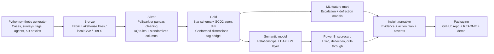
### 0.6 Skill-coverage map — where each Part shows up
| Build step | What you actually do | Main skills | Parts exercised |
|---|---|---|---|
| Problem framing | Turn the stakeholder request into measurable outcomes | requirements, KPI framing, business thinking | 2, 8, 10, 13 |
| Synthetic data design | Create realistic support data safely | Python, domain logic, Responsible AI/privacy | 4, 9, 10, 11 |
| Bronze ingest | Land raw files into Fabric/local storage | pipelines, medallion, platform setup | 6 |
| Silver transform | Clean, validate, standardize, and enrich data | PySpark, pandas, SQL, DQ | 3, 4, 6, 9 |
| Gold model | Build star schema and SCD2 dimensions | dimensional modeling, grain, conformed dimensions | 5 |
| Semantic model | Centralize measures and relationships | Power BI modeling, DAX, governance | 5, 7, 9 |
| Scorecard | Build leadership-ready report pages | storytelling, UX, KPI communication | 7, 10 |
| ML | Predict escalation and deflection candidates | scikit-learn, evaluation, feature engineering | 4, 11 |
| Narrative | Turn findings into action and impact plan | executive communication, measurement | 2, 8, 9, 10, 13 |
| Packaging | Publish and demo the project | documentation, portfolio positioning | 1, 13 |

> 💡 **Tie-in:** This is exactly the kind of end-to-end thread that lets you bridge your support-domain credibility with BI delivery. In interview language: “I understand the operations, and I can model, measure, and improve them.”

---
## 1. Choose your build path before you touch the data

You want the same business logic regardless of tooling. The path only changes the **execution environment**, not the **analytics design**.
### 1.1 Quick decision table
| Path | Environment | Use this if | What you prove | Watch-outs |
|---|---|---|---|---|
| **A — Full Fabric** | Fabric trial + Lakehouse/Warehouse + Power BI Desktop | You want the most Microsoft-native portfolio story | Fabric, OneLake, medallion, Direct Lake thinking | Trial limits, workspace setup time |
| **B — Local/free** | CSV + SQLite + pandas + Power BI Desktop + scikit-learn | You need fully free and portable build steps | Same analytics logic with less platform dependency | Fewer Fabric screenshots |
| **C — Databricks Community** | DBFS + PySpark + SQL + Power BI Desktop | You want Spark-first practice and notebook fluency | Spark transformations, Delta patterns, notebook workflow | Community edition resource limits |
### 1.2 Recommended path for this role
- **Best interview story:** **Path A** because the CE&S BI team sits naturally in the Microsoft data ecosystem.
- **Best backup story:** **Path B** because it proves you understand the architecture, not just one tool.
- **Best Spark practice story:** **Path C** if you specifically want more PySpark muscle for transformations.
### 1.3 A simple path chooser
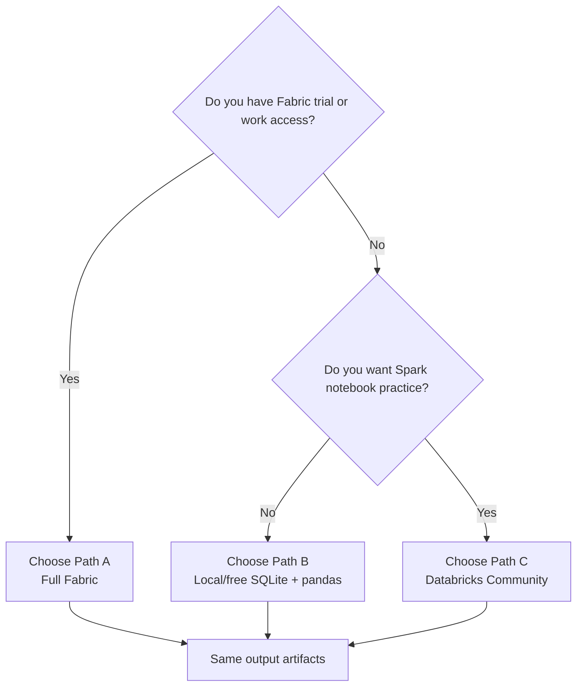
### 1.4 Build-path artifact equivalence
| Artifact | Path A | Path B | Path C |
|---|---|---|---|
| Bronze | Lakehouse Files / tables | local CSV / SQLite raw tables | DBFS / Delta raw |
| Silver | Spark notebook → Delta tables | pandas → CSV/SQLite tables | Spark notebook → Delta tables |
| Gold | Warehouse / Lakehouse SQL endpoint | SQLite star schema | Databricks SQL / Delta tables |
| Semantic model | Power BI via Fabric connector / Direct Lake import | Power BI via CSV/SQLite import | Power BI via CSV/export or connector |
| ML | Fabric notebook or local Python | local Python | Databricks notebook or local Python |
| Governance docs | Markdown in repo | Markdown in repo | Markdown in repo |
### 1.5 Numbered setup instructions for each path
#### Path A — Full Fabric
1. Sign in to your Fabric-enabled tenant or trial.
2. Create a workspace called `ce-and-s-support-health-demo`.
3. Create a **Lakehouse** named `support_lh`.
4. Create folders in the Lakehouse Files area: `bronze`, `silver`, `gold`, `artifacts`.
5. Optionally create a **Warehouse** named `support_wh` if you want T-SQL modeling screenshots.
6. Open a notebook attached to the Lakehouse for the PySpark steps.
7. Keep Power BI Desktop ready for the semantic/report layer.
#### Path B — Local/free
1. Create a project folder structure exactly as shown in Section 10.
2. Install Python packages with `pip install pandas numpy scikit-learn matplotlib seaborn pyarrow`.
3. Use built-in `sqlite3` or DB Browser for SQLite.
4. Create a local `data` folder with subfolders `bronze`, `silver`, `gold`, `artifacts`.
5. Use Power BI Desktop to import the Gold CSV/SQLite tables.
#### Path C — Databricks Community
1. Create a Community Edition workspace.
2. Create folders `/FileStore/ce_support_demo/bronze`, `silver`, `gold`.
3. Upload the generated Bronze CSVs to DBFS.
4. Create a notebook cluster and attach the notebook.
5. Save Silver and Gold as Delta tables.
6. Export Gold outputs to CSV if you want easy Power BI import.
### 1.6 What to say in the interview if you used a fallback path
- “I designed the architecture for Fabric and used a local/Databricks fallback to keep the project reproducible without paid dependencies.”
- “The model, DQ rules, metric definitions, and report design are platform-agnostic; Fabric mainly changes the operational packaging.”
- “That choice itself reflects real analyst judgment: tool constraints should not block analytical rigor.”

> 💡 **Tie-in:** For Arti, even a Path B build is powerful because the support-health and deflection logic directly matches CE&S. If you have time, build in Path B first, then capture Path A screenshots later for Microsoft-native packaging.

---
## 2. Step 1 — Data design and Bronze ingest

Plain English first: before you can analyze support health, you need believable support data. Because you cannot use real Microsoft customer cases in a portfolio, you will **generate synthetic but realistic support data** that behaves like a real service environment.
### 2.1 Data entities you will create
- **Cases** — one row per support case or self-serve session.
- **Agent master** — one row per support agent.
- **Agent team history** — SCD2 history showing team changes over time.
- **Surveys** — post-case satisfaction responses.
- **Case tags** — many-to-many descriptive labels used for root-cause analysis.
- **KB articles** — lightweight knowledge-base catalog for deflection logic and RAG-style extension.
### 2.2 Business assumptions baked into the synthetic data
- Enterprise customers skew toward assisted support and higher severity.
- Self-serve volume is larger for “how-to” and “configuration” issues.
- High severity and long first-response time increase escalation risk.
- Reopened cases tend to reduce CSAT.
- Some issue types are more deflectable than others.
- A few agents move teams mid-period, so SCD2 history actually matters.
### 2.3 Source-model relationship diagram
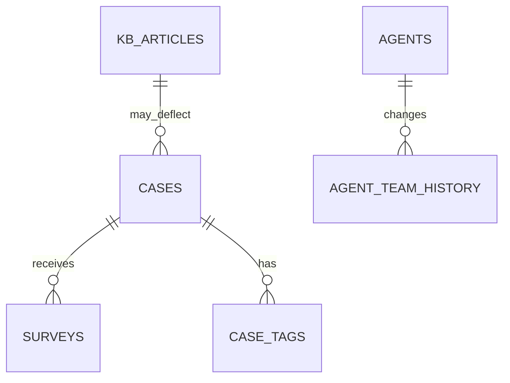
### 2.4 Full Python synthetic data generator

Save this as `src/generate_support_data.py` and run it. It creates all Bronze files locally. For Fabric or Databricks, you then upload the generated outputs into the bronze area.
```python
from __future__ import annotations

import math
import random
from pathlib import Path
from typing import Dict, List

import numpy as np
import pandas as pd

RANDOM_SEED = 42
random.seed(RANDOM_SEED)
np.random.seed(RANDOM_SEED)

OUTPUT_ROOT = Path("data")
BRONZE_DIR = OUTPUT_ROOT / "bronze"
BRONZE_DIR.mkdir(parents=True, exist_ok=True)

START_DATE = pd.Timestamp("2024-07-01")
END_DATE = pd.Timestamp("2026-06-30 23:59:59")
CASE_COUNT = 28000

PRODUCTS: Dict[str, Dict[str, object]] = {
    "Microsoft Teams": {
        "weight": 0.24,
        "issues": {
            "Meetings": 0.30,
            "Calling": 0.18,
            "Chat": 0.20,
            "Provisioning": 0.10,
            "How-To": 0.22,
        },
        "base_resolution": 6.5,
    },
    "SharePoint Online": {
        "weight": 0.22,
        "issues": {
            "Permissions": 0.28,
            "Sites": 0.22,
            "Search": 0.15,
            "Sync": 0.10,
            "How-To": 0.25,
        },
        "base_resolution": 8.0,
    },
    "OneDrive for Business": {
        "weight": 0.16,
        "issues": {
            "Sync": 0.34,
            "Permissions": 0.14,
            "Storage": 0.12,
            "How-To": 0.28,
            "Recovery": 0.12,
        },
        "base_resolution": 7.0,
    },
    "Exchange Online": {
        "weight": 0.18,
        "issues": {
            "Mailflow": 0.28,
            "Migration": 0.14,
            "Permissions": 0.12,
            "Outlook": 0.26,
            "How-To": 0.20,
        },
        "base_resolution": 9.5,
    },
    "Microsoft Purview": {
        "weight": 0.10,
        "issues": {
            "Compliance": 0.24,
            "eDiscovery": 0.16,
            "Sensitivity Labels": 0.18,
            "How-To": 0.22,
            "Reports": 0.20,
        },
        "base_resolution": 10.0,
    },
    "Power Platform": {
        "weight": 0.10,
        "issues": {
            "Flows": 0.26,
            "Connectors": 0.20,
            "Governance": 0.16,
            "How-To": 0.20,
            "Licensing": 0.18,
        },
        "base_resolution": 7.5,
    },
}

REGIONS = {
    "AMER": 0.42,
    "EMEA": 0.34,
    "APAC": 0.24,
}

SEGMENTS = {
    "Enterprise": 0.55,
    "SMB": 0.45,
}

CHANNELS = {
    "assisted": 0.62,
    "self_serve": 0.38,
}

SEVERITIES = {
    "Low": 0.46,
    "Medium": 0.37,
    "High": 0.14,
    "Critical": 0.03,
}

TEAMS = ["Tier 1", "Tier 2", "Escalation Desk", "Proactive Advisory"]
MANAGERS = ["Morgan Chen", "Sofia Gupta", "Liam O'Brien", "Priya Nair"]
KB_COLLECTIONS = ["Quick Start", "Troubleshooting", "Admin Center", "Copilot Prompts"]
TAGS = [
    "auth",
    "latency",
    "tenant-config",
    "policy",
    "client-side",
    "service-health",
    "network",
    "known-issue",
    "kb-gap",
    "training-gap",
    "license",
    "permissions",
    "sync",
    "migration",
    "outlook-addin",
    "copilot-opportunity",
    "deflection-ready",
]

DEFLECTABLE_ISSUES = {"How-To", "Permissions", "Sync", "Reports", "Provisioning"}
HIGH_TOUCH_ISSUES = {"Compliance", "eDiscovery", "Migration", "Mailflow"}


def weighted_choice(weight_map: Dict[str, float]) -> str:
    keys = list(weight_map.keys())
    weights = list(weight_map.values())
    return random.choices(keys, weights=weights, k=1)[0]


def random_timestamp(start: pd.Timestamp, end: pd.Timestamp) -> pd.Timestamp:
    delta_seconds = int((end - start).total_seconds())
    return start + pd.to_timedelta(random.randint(0, delta_seconds), unit="s")


def clipped_normal(mean: float, std_dev: float, lower: float, upper: float) -> float:
    value = np.random.normal(mean, std_dev)
    return float(np.clip(value, lower, upper))


def create_agents() -> pd.DataFrame:
    rows: List[dict] = []
    for idx in range(1, 49):
        region = weighted_choice(REGIONS)
        team = random.choices(TEAMS, weights=[0.48, 0.26, 0.18, 0.08], k=1)[0]
        hire_date = START_DATE - pd.to_timedelta(random.randint(120, 1600), unit="D")
        rows.append(
            {
                "agent_id": 1000 + idx,
                "agent_name": f"Agent_{idx:02d}",
                "region_home": region,
                "current_team": team,
                "manager_name": random.choice(MANAGERS),
                "hire_date": hire_date.date().isoformat(),
                "is_active": 1,
            }
        )
    return pd.DataFrame(rows)


def create_agent_team_history(agent_df: pd.DataFrame) -> pd.DataFrame:
    history_rows: List[dict] = []
    team_change_agents = set(agent_df.sample(8, random_state=RANDOM_SEED)["agent_id"].tolist())

    for _, row in agent_df.iterrows():
        agent_id = int(row["agent_id"])
        current_team = row["current_team"]
        region_home = row["region_home"]
        manager_name = row["manager_name"]
        hire_date = pd.to_datetime(row["hire_date"])

        if agent_id not in team_change_agents:
            history_rows.append(
                {
                    "agent_id": agent_id,
                    "agent_name": row["agent_name"],
                    "team_name": current_team,
                    "manager_name": manager_name,
                    "region_home": region_home,
                    "valid_from": max(hire_date, START_DATE).date().isoformat(),
                    "valid_to": "9999-12-31",
                    "is_current": 1,
                }
            )
            continue

        prior_team_options = [team for team in TEAMS if team != current_team]
        prior_team = random.choice(prior_team_options)
        change_date = START_DATE + pd.to_timedelta(random.randint(130, 430), unit="D")

        history_rows.append(
            {
                "agent_id": agent_id,
                "agent_name": row["agent_name"],
                "team_name": prior_team,
                "manager_name": manager_name,
                "region_home": region_home,
                "valid_from": max(hire_date, START_DATE).date().isoformat(),
                "valid_to": (change_date - pd.Timedelta(days=1)).date().isoformat(),
                "is_current": 0,
            }
        )
        history_rows.append(
            {
                "agent_id": agent_id,
                "agent_name": row["agent_name"],
                "team_name": current_team,
                "manager_name": manager_name,
                "region_home": region_home,
                "valid_from": change_date.date().isoformat(),
                "valid_to": "9999-12-31",
                "is_current": 1,
            }
        )

    history_df = pd.DataFrame(history_rows)
    history_df = history_df.sort_values(["agent_id", "valid_from"]).reset_index(drop=True)
    history_df.insert(0, "agent_version_sk", range(1, len(history_df) + 1))
    return history_df


def team_for_case(agent_history: pd.DataFrame, agent_id: int, created_date: pd.Timestamp) -> str:
    agent_rows = agent_history[agent_history["agent_id"] == agent_id].copy()
    agent_rows["valid_from"] = pd.to_datetime(agent_rows["valid_from"])
    agent_rows["valid_to"] = pd.to_datetime(agent_rows["valid_to"], errors="coerce")
    agent_rows["valid_to"] = agent_rows["valid_to"].fillna(pd.Timestamp("9999-12-31"))
    match = agent_rows[
        (agent_rows["valid_from"] <= created_date.normalize())
        & (agent_rows["valid_to"] >= created_date.normalize())
    ]
    if match.empty:
        return agent_rows.iloc[-1]["team_name"]
    return match.iloc[0]["team_name"]


def create_kb_articles() -> pd.DataFrame:
    kb_rows: List[dict] = []
    article_id = 1
    for product_name, cfg in PRODUCTS.items():
        for issue_name in cfg["issues"].keys():
            kb_rows.append(
                {
                    "kb_article_id": f"KB-{article_id:04d}",
                    "product_name": product_name,
                    "issue_name": issue_name,
                    "collection_name": random.choice(KB_COLLECTIONS),
                    "article_title": f"{product_name} — {issue_name} quick resolution guide",
                    "article_summary": f"Step-by-step guidance for {issue_name.lower()} scenarios in {product_name}.",
                    "is_self_serve_friendly": int(issue_name in DEFLECTABLE_ISSUES),
                    "article_quality_score": round(clipped_normal(0.78, 0.10, 0.45, 0.98), 2),
                }
            )
            article_id += 1
    return pd.DataFrame(kb_rows)


def create_cases(agent_df: pd.DataFrame, agent_history: pd.DataFrame, kb_df: pd.DataFrame) -> pd.DataFrame:
    agent_region_map = agent_df.set_index("agent_id")["region_home"].to_dict()
    assisted_agents = agent_df[agent_df["current_team"].isin(["Tier 1", "Tier 2", "Escalation Desk"])]
    assisted_agent_ids = assisted_agents["agent_id"].tolist()
    cases: List[dict] = []

    product_names = list(PRODUCTS.keys())
    product_weights = [PRODUCTS[p]["weight"] for p in product_names]

    for case_num in range(1, CASE_COUNT + 1):
        created_at = random_timestamp(START_DATE, END_DATE)
        product_name = random.choices(product_names, weights=product_weights, k=1)[0]
        issue_name = weighted_choice(PRODUCTS[product_name]["issues"])
        segment = weighted_choice(SEGMENTS)
        region = weighted_choice(REGIONS)
        channel = random.choices(list(CHANNELS.keys()), weights=list(CHANNELS.values()), k=1)[0]

        severity_weights = list(SEVERITIES.values())
        if segment == "Enterprise":
            severity_weights = [0.38, 0.39, 0.18, 0.05]
        if issue_name in HIGH_TOUCH_ISSUES:
            severity_weights = [0.28, 0.40, 0.24, 0.08]
        severity = random.choices(list(SEVERITIES.keys()), weights=severity_weights, k=1)[0]

        agent_pool = [aid for aid in assisted_agent_ids if agent_region_map[aid] == region]
        if not agent_pool:
            agent_pool = assisted_agent_ids
        agent_id = random.choice(agent_pool)
        team_name = team_for_case(agent_history, agent_id, created_at)

        complexity = {
            "Low": 0.85,
            "Medium": 1.00,
            "High": 1.55,
            "Critical": 2.20,
        }[severity]
        segment_multiplier = 1.15 if segment == "Enterprise" else 0.95
        issue_multiplier = 0.72 if issue_name in DEFLECTABLE_ISSUES else 1.18 if issue_name in HIGH_TOUCH_ISSUES else 1.00
        channel_multiplier = 0.65 if channel == "self_serve" else 1.00

        first_response_hours = max(
            0.05,
            np.random.lognormal(mean=math.log(1.2 * complexity * segment_multiplier), sigma=0.55),
        )
        if channel == "self_serve":
            first_response_hours = max(0.01, clipped_normal(0.08, 0.04, 0.01, 0.40))

        base_resolution = float(PRODUCTS[product_name]["base_resolution"])
        resolution_hours = max(
            0.25,
            np.random.lognormal(mean=math.log(base_resolution * complexity * issue_multiplier * channel_multiplier), sigma=0.60),
        )

        sla_hours = 4.0 if severity in {"Low", "Medium"} else 1.0
        breached_sla = int(first_response_hours > sla_hours)

        deflection_candidate = int(
            issue_name in DEFLECTABLE_ISSUES
            and severity in {"Low", "Medium"}
            and channel == "assisted"
        )

        escalation_probability = 0.04
        escalation_probability += 0.20 if severity == "Critical" else 0.10 if severity == "High" else 0.0
        escalation_probability += 0.06 if breached_sla else 0.0
        escalation_probability += 0.05 if issue_name in HIGH_TOUCH_ISSUES else 0.0
        escalation_probability += 0.03 if segment == "Enterprise" else 0.0
        escalation_probability -= 0.02 if team_name == "Escalation Desk" else 0.0
        escalation_probability = min(max(escalation_probability, 0.01), 0.82)
        escalated = int(random.random() < escalation_probability)

        reopen_probability = 0.03
        reopen_probability += 0.08 if escalated else 0.0
        reopen_probability += 0.05 if resolution_hours > 24 else 0.0
        reopen_probability += 0.03 if issue_name in {"Sync", "Permissions", "Outlook"} else 0.0
        reopen_probability = min(max(reopen_probability, 0.01), 0.55)
        reopened = int(random.random() < reopen_probability)

        kb_match = kb_df[(kb_df["product_name"] == product_name) & (kb_df["issue_name"] == issue_name)].iloc[0]
        kb_article_id = kb_match["kb_article_id"]
        kb_quality_score = float(kb_match["article_quality_score"])
        deflection_success_probability = 0.20
        deflection_success_probability += 0.30 if issue_name in DEFLECTABLE_ISSUES else 0.0
        deflection_success_probability += 0.10 if kb_quality_score >= 0.82 else 0.0
        deflection_success_probability -= 0.15 if severity in {"High", "Critical"} else 0.0
        deflection_success_probability = min(max(deflection_success_probability, 0.02), 0.88)
        deflected = int(channel == "self_serve" and random.random() < deflection_success_probability)

        customer_effort_score = int(round(clipped_normal(2.6 + 0.9 * escalated + 0.5 * reopened, 0.9, 1, 5)))
        csat_center = 4.6
        csat_center -= 0.75 * escalated
        csat_center -= 0.35 * reopened
        csat_center -= 0.20 if breached_sla else 0.0
        csat_center += 0.15 if deflected and issue_name in DEFLECTABLE_ISSUES else 0.0
        csat_score = int(round(clipped_normal(csat_center, 0.65, 1, 5)))

        cases.append(
            {
                "case_id": f"CASE-{case_num:06d}",
                "created_at": created_at.isoformat(),
                "product_name": product_name,
                "issue_name": issue_name,
                "segment_name": segment,
                "region_name": region,
                "channel_name": channel,
                "severity_name": severity,
                "case_title": f"{product_name} {issue_name} support request {case_num}",
                "customer_tenant_id": f"TENANT-{random.randint(10000, 99999)}",
                "agent_id": agent_id,
                "team_name_at_create": team_name,
                "kb_article_id": kb_article_id,
                "resolution_hours": round(float(resolution_hours), 2),
                "first_response_hours": round(float(first_response_hours), 2),
                "sla_target_hours": sla_hours,
                "breached_sla": breached_sla,
                "fcr_flag": int(escalated == 0 and reopened == 0),
                "escalated_flag": escalated,
                "reopened_flag": reopened,
                "deflection_candidate_flag": deflection_candidate,
                "deflected_flag": deflected,
                "customer_effort_score": customer_effort_score,
                "csat_score": csat_score,
            }
        )

    return pd.DataFrame(cases)


def create_surveys(cases_df: pd.DataFrame) -> pd.DataFrame:
    survey_rows: List[dict] = []
    for _, row in cases_df.iterrows():
        response_probability = 0.50 if row["channel_name"] == "assisted" else 0.34
        response_probability += 0.08 if row["segment_name"] == "Enterprise" else 0.0
        if random.random() > min(response_probability, 0.88):
            continue

        survey_rows.append(
            {
                "survey_id": f"SURV-{len(survey_rows)+1:06d}",
                "case_id": row["case_id"],
                "submitted_at": (pd.to_datetime(row["created_at"]) + pd.to_timedelta(random.randint(2, 96), unit="h")).isoformat(),
                "csat_score": row["csat_score"],
                "customer_effort_score": row["customer_effort_score"],
                "would_recommend_flag": int(row["csat_score"] >= 4 and row["customer_effort_score"] <= 3),
                "survey_channel": "post-case email" if row["channel_name"] == "assisted" else "in-product prompt",
            }
        )
    return pd.DataFrame(survey_rows)


def create_case_tags(cases_df: pd.DataFrame) -> pd.DataFrame:
    rows: List[dict] = []
    for _, row in cases_df.iterrows():
        candidate_tags = []
        if row["issue_name"] in {"Permissions", "Compliance", "Governance"}:
            candidate_tags.extend(["policy", "permissions"])
        if row["issue_name"] in {"Sync", "Storage"}:
            candidate_tags.extend(["sync", "client-side"])
        if row["issue_name"] in {"How-To", "Reports", "Provisioning"}:
            candidate_tags.extend(["training-gap", "deflection-ready", "copilot-opportunity"])
        if row["escalated_flag"] == 1:
            candidate_tags.extend(["service-health", "known-issue"])
        if row["breached_sla"] == 1:
            candidate_tags.extend(["latency"])
        if random.random() < 0.22:
            candidate_tags.append(random.choice(TAGS))

        final_tags = sorted(set(candidate_tags))[: random.randint(1, 4)]
        if not final_tags:
            final_tags = [random.choice(TAGS)]

        for tag in final_tags:
            rows.append({"case_id": row["case_id"], "tag_name": tag})
    return pd.DataFrame(rows)


def main() -> None:
    agents_df = create_agents()
    agent_history_df = create_agent_team_history(agents_df)
    kb_df = create_kb_articles()
    cases_df = create_cases(agents_df, agent_history_df, kb_df)
    surveys_df = create_surveys(cases_df)
    tags_df = create_case_tags(cases_df)

    agents_df.to_csv(BRONZE_DIR / "agents_master.csv", index=False)
    agent_history_df.to_csv(BRONZE_DIR / "agent_team_history.csv", index=False)
    kb_df.to_csv(BRONZE_DIR / "kb_articles.csv", index=False)
    cases_df.to_csv(BRONZE_DIR / "cases_raw.csv", index=False)
    surveys_df.to_csv(BRONZE_DIR / "surveys_raw.csv", index=False)
    tags_df.to_csv(BRONZE_DIR / "case_tags_raw.csv", index=False)

    summary = pd.DataFrame(
        {
            "table_name": [
                "agents_master",
                "agent_team_history",
                "kb_articles",
                "cases_raw",
                "surveys_raw",
                "case_tags_raw",
            ],
            "row_count": [
                len(agents_df),
                len(agent_history_df),
                len(kb_df),
                len(cases_df),
                len(surveys_df),
                len(tags_df),
            ],
        }
    )
    summary.to_csv(BRONZE_DIR / "bronze_row_counts.csv", index=False)

    print("Synthetic Bronze data generated successfully.")
    print(summary)
    print("Cases sample:")
    print(cases_df.head(5).to_string(index=False))


if __name__ == "__main__":
    main()
```
### 2.5 What this generator gives you
| File | Purpose | Key columns |
|---|---|---|
| `cases_raw.csv` | Raw support-case or self-serve session records | case_id, created_at, product, issue, segment, channel, severity, agent_id, SLA, FCR, escalation |
| `surveys_raw.csv` | Customer feedback responses | survey_id, case_id, csat_score, customer_effort_score |
| `agents_master.csv` | Agent reference data | agent_id, agent_name, region_home, current_team |
| `agent_team_history.csv` | SCD2-ready team history | agent_version_sk, agent_id, team_name, valid_from, valid_to |
| `case_tags_raw.csv` | Many-to-many case tags | case_id, tag_name |
| `kb_articles.csv` | Knowledge article lookup | kb_article_id, product_name, issue_name, quality score |
### 2.6 Why the data design is interview-strong
- It creates **multiple grains**, so you must think carefully about modeling.
- It includes **history**, so SCD2 is not just theoretical.
- It includes **survey and tag data**, so you can show fact enrichment and bridge-table modeling.
- It includes **deflection context**, so the project feels domain-specific rather than generic BI.
### 2.7 Bronze ingest instructions — all three paths
#### Path A — Fabric Lakehouse Bronze
1. In the Lakehouse Files area, create folders `bronze/cases`, `bronze/agents`, `bronze/surveys`, `bronze/tags`, `bronze/kb`.
2. Upload each generated CSV into the matching folder.
3. Create a **Data Pipeline** (optional but interview-friendly) with Copy Data activities:
   - Source: uploaded CSV / OneLake file
   - Destination: Bronze files or Bronze tables
4. Name the pipeline `pl_bronze_support_ingest`.
5. Add a notebook activity later if you want orchestration from Bronze to Silver.
6. Capture a screenshot of the workspace, Lakehouse, and pipeline for your README.
#### Path B — Local/free Bronze
1. Keep the generated CSVs under `data/bronze/`.
2. If you want SQL querying early, load them into SQLite with Python:
```python
import sqlite3
from pathlib import Path
import pandas as pd

conn = sqlite3.connect("data/support_demo.db")
bronze_dir = Path("data/bronze")
for file_name in [
    "cases_raw.csv",
    "surveys_raw.csv",
    "agents_master.csv",
    "agent_team_history.csv",
    "case_tags_raw.csv",
    "kb_articles.csv",
]:
    table_name = file_name.replace(".csv", "")
    df = pd.read_csv(bronze_dir / file_name)
    df.to_sql(table_name, conn, if_exists="replace", index=False)
conn.close()
print("Bronze tables loaded into SQLite.")
```
#### Path C — Databricks Community Bronze
1. Upload Bronze CSVs to `/FileStore/ce_support_demo/bronze/`.
2. Use a notebook to preview them with `spark.read.csv`.
3. Optionally convert them into raw Delta tables for notebook convenience.
### 2.8 Bronze validation checklist
- [ ] Row counts exist for each source file.
- [ ] Case IDs are unique in raw generation.
- [ ] Team history has at least one agent with two versions.
- [ ] Survey file links to a subset of cases only.
- [ ] Tag file contains many-to-many rows.
- [ ] No real customer identifiers appear anywhere.

> 💡 **Tie-in:** Because you worked close to support operations, you can explain why the skew matters. Real support data is rarely balanced. The generator is not just random—it encodes operational reality.

---
## 3. Step 2 — Transform and quality-check the data into Silver

Plain English first: Silver is where raw files become trustworthy analytical inputs. You are not changing business meaning here; you are making the data **clean, standardized, and testable**.
### 3.1 Silver goals
1. Standardize column names and data types.
2. Add derived business fields like fiscal period, SLA breach bucket, resolution bucket, and self-serve outcomes.
3. Validate data quality across the five dimensions you studied earlier.
4. Preserve enough raw detail for downstream debugging.
### 3.2 Data-quality rules matrix
| Quality dimension | Example rule in this project | Why it matters |
|---|---|---|
| Validity | CSAT must be between 1 and 5 | Prevents impossible scores |
| Uniqueness | `case_id` must be unique in Silver | Avoids double counting |
| Completeness | Product, issue, created_at, channel, severity cannot be null | Core analysis breaks without them |
| Consistency | Region/channel/segment spellings must be standardized | Prevents split categories |
| Business consistency | `fcr_flag` should be 0 whenever escalated or reopened is 1 | Maintains logic trust |
| Referential readiness | All case product/issue values should map to dimensions | Prevents broken joins |
### 3.3 Silver-layer transformation flow
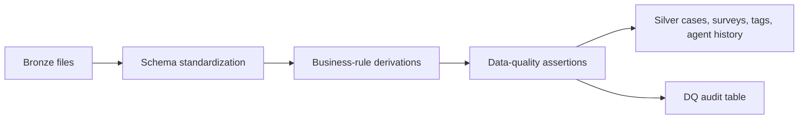
### 3.4 PySpark notebook version (Fabric or Databricks)

Save this as `notebooks/01_silver_transform.py`.
```python
from pyspark.sql import functions as F
from pyspark.sql.types import DoubleType, IntegerType

BRONZE_BASE = "Files/bronze"

cases_raw = (
    spark.read.option("header", True)
    .option("inferSchema", True)
    .csv(f"{BRONZE_BASE}/cases/cases_raw.csv")
)

surveys_raw = (
    spark.read.option("header", True)
    .option("inferSchema", True)
    .csv(f"{BRONZE_BASE}/surveys/surveys_raw.csv")
)

agents_master = (
    spark.read.option("header", True)
    .option("inferSchema", True)
    .csv(f"{BRONZE_BASE}/agents/agents_master.csv")
)

agent_history = (
    spark.read.option("header", True)
    .option("inferSchema", True)
    .csv(f"{BRONZE_BASE}/agents/agent_team_history.csv")
)

case_tags_raw = (
    spark.read.option("header", True)
    .option("inferSchema", True)
    .csv(f"{BRONZE_BASE}/tags/case_tags_raw.csv")
)

kb_articles = (
    spark.read.option("header", True)
    .option("inferSchema", True)
    .csv(f"{BRONZE_BASE}/kb/kb_articles.csv")
)

cases = (
    cases_raw.select(
        F.col("case_id"),
        F.to_timestamp("created_at").alias("created_at"),
        F.trim(F.col("product_name")).alias("product_name"),
        F.trim(F.col("issue_name")).alias("issue_name"),
        F.upper(F.trim(F.col("region_name"))).alias("region_name"),
        F.initcap(F.trim(F.col("segment_name"))).alias("segment_name"),
        F.lower(F.trim(F.col("channel_name"))).alias("channel_name"),
        F.initcap(F.trim(F.col("severity_name"))).alias("severity_name"),
        F.col("agent_id").cast(IntegerType()).alias("agent_id"),
        F.trim(F.col("team_name_at_create")).alias("team_name_at_create"),
        F.col("kb_article_id"),
        F.col("resolution_hours").cast(DoubleType()).alias("resolution_hours"),
        F.col("first_response_hours").cast(DoubleType()).alias("first_response_hours"),
        F.col("sla_target_hours").cast(DoubleType()).alias("sla_target_hours"),
        F.col("breached_sla").cast(IntegerType()).alias("breached_sla"),
        F.col("fcr_flag").cast(IntegerType()).alias("fcr_flag"),
        F.col("escalated_flag").cast(IntegerType()).alias("escalated_flag"),
        F.col("reopened_flag").cast(IntegerType()).alias("reopened_flag"),
        F.col("deflection_candidate_flag").cast(IntegerType()).alias("deflection_candidate_flag"),
        F.col("deflected_flag").cast(IntegerType()).alias("deflected_flag"),
        F.col("customer_effort_score").cast(IntegerType()).alias("customer_effort_score"),
        F.col("csat_score").cast(IntegerType()).alias("csat_score"),
    )
    .withColumn("created_date", F.to_date("created_at"))
    .withColumn("created_year", F.year("created_at"))
    .withColumn("created_month", F.month("created_at"))
    .withColumn("created_hour", F.hour("created_at"))
    .withColumn(
        "fiscal_year",
        F.when(F.month("created_at") >= 7, F.year("created_at") + 1).otherwise(F.year("created_at")),
    )
    .withColumn(
        "fiscal_month_number",
        F.when(F.month("created_at") >= 7, F.month("created_at") - 6).otherwise(F.month("created_at") + 6),
    )
    .withColumn(
        "resolution_bucket",
        F.when(F.col("resolution_hours") <= 4, "0-4h")
        .when(F.col("resolution_hours") <= 8, "4-8h")
        .when(F.col("resolution_hours") <= 24, "8-24h")
        .when(F.col("resolution_hours") <= 72, "24-72h")
        .otherwise("72h+"),
    )
    .withColumn(
        "first_response_bucket",
        F.when(F.col("first_response_hours") <= 0.25, "0-15m")
        .when(F.col("first_response_hours") <= 1, "15-60m")
        .when(F.col("first_response_hours") <= 4, "1-4h")
        .otherwise("4h+"),
    )
    .withColumn("is_assisted", F.when(F.col("channel_name") == "assisted", 1).otherwise(0))
    .withColumn("is_self_serve", F.when(F.col("channel_name") == "self_serve", 1).otherwise(0))
)

surveys = (
    surveys_raw.select(
        F.col("survey_id"),
        F.col("case_id"),
        F.to_timestamp("submitted_at").alias("submitted_at"),
        F.col("csat_score").cast(IntegerType()).alias("survey_csat_score"),
        F.col("customer_effort_score").cast(IntegerType()).alias("survey_effort_score"),
        F.col("would_recommend_flag").cast(IntegerType()).alias("would_recommend_flag"),
        F.col("survey_channel"),
    )
    .dropDuplicates(["survey_id"])
)

agent_history_silver = (
    agent_history.select(
        F.col("agent_version_sk").cast(IntegerType()),
        F.col("agent_id").cast(IntegerType()),
        F.col("agent_name"),
        F.col("team_name"),
        F.col("manager_name"),
        F.upper(F.col("region_home")).alias("region_home"),
        F.to_date("valid_from").alias("valid_from"),
        F.to_date("valid_to").alias("valid_to"),
        F.col("is_current").cast(IntegerType()),
    )
)

agents_current = (
    agents_master.select(
        F.col("agent_id").cast(IntegerType()),
        F.col("agent_name"),
        F.upper(F.col("region_home")).alias("region_home"),
        F.col("current_team"),
        F.col("manager_name"),
        F.to_date("hire_date").alias("hire_date"),
        F.col("is_active").cast(IntegerType()),
    )
)

case_tags = (
    case_tags_raw.select(F.col("case_id"), F.lower(F.trim(F.col("tag_name"))).alias("tag_name"))
    .dropDuplicates(["case_id", "tag_name"])
)

kb_articles_silver = (
    kb_articles.select(
        F.col("kb_article_id"),
        F.col("product_name"),
        F.col("issue_name"),
        F.col("collection_name"),
        F.col("article_title"),
        F.col("article_summary"),
        F.col("is_self_serve_friendly").cast(IntegerType()),
        F.col("article_quality_score").cast(DoubleType()),
    )
)

cases_with_surveys = (
    cases.join(surveys, on="case_id", how="left")
    .withColumn("survey_response_flag", F.when(F.col("survey_id").isNotNull(), F.lit(1)).otherwise(F.lit(0)))
    .withColumn("effective_csat_score", F.coalesce(F.col("survey_csat_score"), F.col("csat_score")))
)

assert cases_with_surveys.filter(F.col("case_id").isNull()).count() == 0, "Null case_id found"
assert cases_with_surveys.select("case_id").distinct().count() == cases_with_surveys.count(), "Duplicate case_id found"
assert cases_with_surveys.filter(~F.col("effective_csat_score").between(1, 5)).count() == 0, "Invalid CSAT range"
assert cases_with_surveys.filter(~F.col("customer_effort_score").between(1, 5)).count() == 0, "Invalid effort score"
assert cases_with_surveys.filter(F.col("product_name").isNull()).count() == 0, "Missing product"
assert cases_with_surveys.filter((F.col("fcr_flag") == 1) & ((F.col("escalated_flag") == 1) | (F.col("reopened_flag") == 1))).count() == 0, "FCR logic conflict"
assert cases_with_surveys.filter(~F.col("region_name").isin(["AMER", "EMEA", "APAC"])).count() == 0, "Unexpected region name"

case_tag_counts = case_tags.groupBy("case_id").agg(F.count("tag_name").alias("tag_count"))

silver_cases = (
    cases_with_surveys.join(case_tag_counts, on="case_id", how="left")
    .fillna({"tag_count": 0})
    .withColumn(
        "deflection_success_flag",
        F.when((F.col("is_self_serve") == 1) & (F.col("deflected_flag") == 1), 1).otherwise(0),
    )
)

dq_rows = [
    ("silver_cases", "row_count", str(silver_cases.count()), 1),
    ("silver_cases", "unique_case_id_check", str(silver_cases.select("case_id").distinct().count() == silver_cases.count()), 1),
    ("silver_cases", "csat_range_check", str(silver_cases.filter(~F.col("effective_csat_score").between(1, 5)).count() == 0), 1),
    ("silver_cases", "fcr_business_rule", str(silver_cases.filter((F.col("fcr_flag") == 1) & ((F.col("escalated_flag") == 1) | (F.col("reopened_flag") == 1))).count() == 0), 1),
    ("agent_history", "current_row_exists", str(agent_history_silver.filter(F.col("is_current") == 1).count() > 0), 1),
]

dq_audit = spark.createDataFrame(dq_rows, ["entity_name", "check_name", "check_result", "passed_flag"])

silver_cases.write.mode("overwrite").format("delta").saveAsTable("silver_cases")
surveys.write.mode("overwrite").format("delta").saveAsTable("silver_surveys")
case_tags.write.mode("overwrite").format("delta").saveAsTable("silver_case_tags")
kb_articles_silver.write.mode("overwrite").format("delta").saveAsTable("silver_kb_articles")
agents_current.write.mode("overwrite").format("delta").saveAsTable("silver_agents_current")
agent_history_silver.write.mode("overwrite").format("delta").saveAsTable("silver_agent_history")
dq_audit.write.mode("overwrite").format("delta").saveAsTable("silver_dq_audit")

print("Silver transform complete.")
display(dq_audit)
display(silver_cases.limit(20))
```
### 3.5 pandas + SQLite version (local/free fallback)

Save this as `src/build_silver_local.py`.
```python
from __future__ import annotations

import sqlite3
from pathlib import Path

import numpy as np
import pandas as pd

DATA_ROOT = Path("data")
BRONZE_DIR = DATA_ROOT / "bronze"
SILVER_DIR = DATA_ROOT / "silver"
SILVER_DIR.mkdir(parents=True, exist_ok=True)
DB_PATH = DATA_ROOT / "support_demo.db"

cases = pd.read_csv(BRONZE_DIR / "cases_raw.csv", parse_dates=["created_at"])
surveys = pd.read_csv(BRONZE_DIR / "surveys_raw.csv", parse_dates=["submitted_at"])
agents = pd.read_csv(BRONZE_DIR / "agents_master.csv", parse_dates=["hire_date"])
agent_history = pd.read_csv(BRONZE_DIR / "agent_team_history.csv", parse_dates=["valid_from", "valid_to"])
case_tags = pd.read_csv(BRONZE_DIR / "case_tags_raw.csv")
kb_articles = pd.read_csv(BRONZE_DIR / "kb_articles.csv")

cases["product_name"] = cases["product_name"].str.strip()
cases["issue_name"] = cases["issue_name"].str.strip()
cases["region_name"] = cases["region_name"].str.strip().str.upper()
cases["segment_name"] = cases["segment_name"].str.strip().str.title()
cases["channel_name"] = cases["channel_name"].str.strip().str.lower()
cases["severity_name"] = cases["severity_name"].str.strip().str.title()
case_tags["tag_name"] = case_tags["tag_name"].str.strip().str.lower()

cases["created_date"] = cases["created_at"].dt.date
cases["created_year"] = cases["created_at"].dt.year
cases["created_month"] = cases["created_at"].dt.month
cases["created_hour"] = cases["created_at"].dt.hour
cases["fiscal_year"] = np.where(cases["created_at"].dt.month >= 7, cases["created_at"].dt.year + 1, cases["created_at"].dt.year)
cases["fiscal_month_number"] = np.where(cases["created_at"].dt.month >= 7, cases["created_at"].dt.month - 6, cases["created_at"].dt.month + 6)

cases["resolution_bucket"] = pd.cut(
    cases["resolution_hours"],
    bins=[-1, 4, 8, 24, 72, 100000],
    labels=["0-4h", "4-8h", "8-24h", "24-72h", "72h+"],
)

cases["first_response_bucket"] = pd.cut(
    cases["first_response_hours"],
    bins=[-1, 0.25, 1, 4, 100000],
    labels=["0-15m", "15-60m", "1-4h", "4h+"],
)

cases["is_assisted"] = (cases["channel_name"] == "assisted").astype(int)
cases["is_self_serve"] = (cases["channel_name"] == "self_serve").astype(int)

surveys = surveys.drop_duplicates(subset=["survey_id"])
case_tags = case_tags.drop_duplicates(subset=["case_id", "tag_name"])
case_tag_counts = case_tags.groupby("case_id", as_index=False).agg(tag_count=("tag_name", "count"))

silver_cases = cases.merge(surveys, on="case_id", how="left", suffixes=("", "_survey"))
silver_cases["survey_response_flag"] = silver_cases["survey_id"].notna().astype(int)
silver_cases["effective_csat_score"] = silver_cases["csat_score_survey"].fillna(silver_cases["csat_score"])
silver_cases = silver_cases.merge(case_tag_counts, on="case_id", how="left")
silver_cases["tag_count"] = silver_cases["tag_count"].fillna(0).astype(int)
silver_cases["deflection_success_flag"] = ((silver_cases["is_self_serve"] == 1) & (silver_cases["deflected_flag"] == 1)).astype(int)

assert silver_cases["case_id"].is_unique, "Duplicate case_id found"
assert silver_cases["effective_csat_score"].between(1, 5).all(), "CSAT outside 1-5"
assert silver_cases["customer_effort_score"].between(1, 5).all(), "Effort outside 1-5"
assert silver_cases[["product_name", "issue_name", "region_name", "segment_name", "channel_name", "severity_name"]].notna().all().all(), "Core fields missing"
assert set(silver_cases["region_name"].unique()) <= {"AMER", "EMEA", "APAC"}, "Unexpected region"
assert ((silver_cases["fcr_flag"] == 1) & ((silver_cases["escalated_flag"] == 1) | (silver_cases["reopened_flag"] == 1))).sum() == 0, "FCR business rule violated"

quality_audit = pd.DataFrame(
    [
        {"entity_name": "silver_cases", "check_name": "row_count", "check_result": str(len(silver_cases)), "passed_flag": 1},
        {"entity_name": "silver_cases", "check_name": "unique_case_id", "check_result": str(silver_cases["case_id"].is_unique), "passed_flag": int(silver_cases["case_id"].is_unique)},
        {"entity_name": "silver_cases", "check_name": "csat_range", "check_result": str(silver_cases["effective_csat_score"].between(1, 5).all()), "passed_flag": int(silver_cases["effective_csat_score"].between(1, 5).all())},
        {"entity_name": "silver_case_tags", "check_name": "duplicate_tag_pairs", "check_result": str(not case_tags.duplicated(["case_id", "tag_name"]).any()), "passed_flag": int(not case_tags.duplicated(["case_id", "tag_name"]).any())},
        {"entity_name": "agent_history", "check_name": "has_current_rows", "check_result": str((agent_history["is_current"] == 1).any()), "passed_flag": int((agent_history["is_current"] == 1).any())},
    ]
)

silver_cases.to_csv(SILVER_DIR / "silver_cases.csv", index=False)
surveys.to_csv(SILVER_DIR / "silver_surveys.csv", index=False)
case_tags.to_csv(SILVER_DIR / "silver_case_tags.csv", index=False)
agent_history.to_csv(SILVER_DIR / "silver_agent_history.csv", index=False)
agents.to_csv(SILVER_DIR / "silver_agents_current.csv", index=False)
kb_articles.to_csv(SILVER_DIR / "silver_kb_articles.csv", index=False)
quality_audit.to_csv(SILVER_DIR / "silver_quality_audit.csv", index=False)

with sqlite3.connect(DB_PATH) as conn:
    silver_cases.to_sql("silver_cases", conn, if_exists="replace", index=False)
    surveys.to_sql("silver_surveys", conn, if_exists="replace", index=False)
    case_tags.to_sql("silver_case_tags", conn, if_exists="replace", index=False)
    agent_history.to_sql("silver_agent_history", conn, if_exists="replace", index=False)
    agents.to_sql("silver_agents_current", conn, if_exists="replace", index=False)
    kb_articles.to_sql("silver_kb_articles", conn, if_exists="replace", index=False)
    quality_audit.to_sql("silver_quality_audit", conn, if_exists="replace", index=False)

print("Silver build complete.")
print(quality_audit)
print(silver_cases.head(5).to_string(index=False))
```
### 3.6 Silver validation queries
```sql
SELECT channel_name, COUNT(*) AS cases
FROM silver_cases
GROUP BY channel_name;

SELECT COUNT(*) AS bad_csat_rows
FROM silver_cases
WHERE effective_csat_score NOT BETWEEN 1 AND 5;

SELECT agent_id, COUNT(*) AS versions
FROM silver_agent_history
GROUP BY agent_id
HAVING COUNT(*) > 1;

SELECT COUNT(*) AS conflicting_rows
FROM silver_cases
WHERE fcr_flag = 1
  AND (escalated_flag = 1 OR reopened_flag = 1);
```
### 3.7 What to document in your README for Silver
- What standardization rules you applied.
- What DQ rules are **hard failures** vs **warnings**.
- Which fields are derived and which come from Bronze.
- How Silver enables consistent downstream joins.

> 💡 **Tie-in:** Data quality is where analyst credibility is won or lost. In BI interviews, saying “I standardized the metrics” is good; saying “I enforced explicit quality gates before modeling” sounds much more senior.

---
## 4. Step 3 — Build the Gold dimensional model

Plain English first: Gold is the business-facing analytical model. This is where raw operational tables become a clean structure that Power BI and SQL analysts can use safely.
### 4.1 Declare the grain before anything else

**Grain of `Fact_Cases`: one row per case.**

That sentence matters because it tells you what each metric row represents. If you blur the grain, your KPIs become untrustworthy.
### 4.2 Gold entities you will create
- `Fact_Cases`
- `Dim_Date`
- `Dim_Product`
- `Dim_Agent` (**SCD2**)
- `Dim_Segment`
- `Dim_Channel`
- `Dim_Issue`
- `Bridge_CaseTag`
- `Dim_Tag`
### 4.3 Star schema diagram
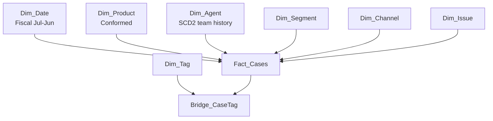
### 4.4 Why SCD2 belongs specifically in this project
### 🔍 Plain-English deep-dive: SCD Type 2 in support analytics
- **Slowly Changing Dimension Type 2 (SCD2)** — *a way to keep history when a descriptive attribute changes over time.* **Analogy:** Imagine keeping every version of a person’s job badge instead of overwriting the old one. **Why it matters:** If an agent moved from Tier 1 to Tier 2 in January, cases from October should still count under Tier 1, not be rewritten into the future team.
- **Surrogate key** — *an artificial key for a specific version of a dimension row.* **Analogy:** One employee can have multiple historical ID cards, but each card version has its own barcode. **Why it matters:** It lets one agent_id map to several historical team assignments safely.
- **As-of join** — *joining a fact row to the dimension version valid at that point in time.* **Analogy:** You are asking, “Which badge was active on the day this case was created?” **Why it matters:** This is the link between operational history and truthful trend reporting.
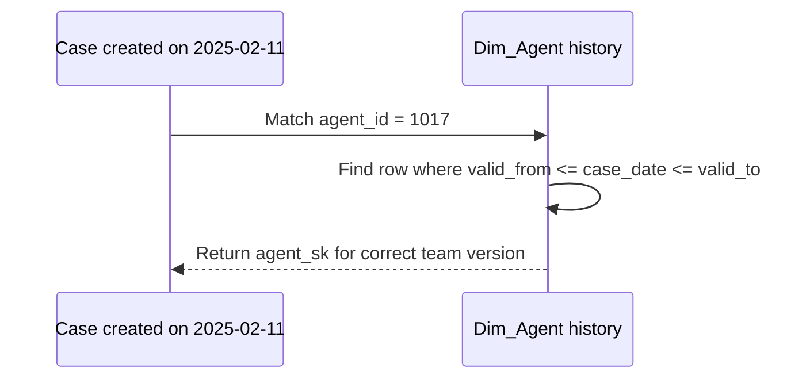
### 4.5 Gold-model DDL and load SQL

Use this as `sql/01_build_gold_model.sql`. It is written in portable SQL style. In Fabric Warehouse you may adapt some syntax slightly; in SQLite replace `DATE`/`DECIMAL` types with text/real where needed.
```sql
DROP TABLE IF EXISTS Bridge_CaseTag;
DROP TABLE IF EXISTS Fact_Cases;
DROP TABLE IF EXISTS Dim_Tag;
DROP TABLE IF EXISTS Dim_Issue;
DROP TABLE IF EXISTS Dim_Channel;
DROP TABLE IF EXISTS Dim_Segment;
DROP TABLE IF EXISTS Dim_Agent;
DROP TABLE IF EXISTS Dim_Product;
DROP TABLE IF EXISTS Dim_Date;

CREATE TABLE Dim_Date (
    DateKey INTEGER PRIMARY KEY,
    FullDate DATE NOT NULL,
    CalendarYear INTEGER NOT NULL,
    CalendarMonthNumber INTEGER NOT NULL,
    CalendarMonthName TEXT NOT NULL,
    CalendarQuarter TEXT NOT NULL,
    FiscalYear INTEGER NOT NULL,
    FiscalQuarter TEXT NOT NULL,
    FiscalMonthNumber INTEGER NOT NULL,
    FiscalMonthLabel TEXT NOT NULL,
    MonthStartDate DATE NOT NULL,
    IsMonthEnd INTEGER NOT NULL
);

CREATE TABLE Dim_Product (
    ProductKey INTEGER PRIMARY KEY,
    ProductName TEXT NOT NULL,
    ProductFamily TEXT NOT NULL,
    WorkloadGroup TEXT NOT NULL,
    IsCurrent INTEGER NOT NULL DEFAULT 1
);

CREATE TABLE Dim_Agent (
    AgentKey INTEGER PRIMARY KEY,
    AgentVersionSK INTEGER NOT NULL,
    AgentID INTEGER NOT NULL,
    AgentName TEXT NOT NULL,
    TeamName TEXT NOT NULL,
    ManagerName TEXT NOT NULL,
    RegionHome TEXT NOT NULL,
    ValidFrom DATE NOT NULL,
    ValidTo DATE NOT NULL,
    IsCurrent INTEGER NOT NULL,
    HireDate DATE,
    TenureMonthsAtVersionStart INTEGER
);

CREATE TABLE Dim_Segment (
    SegmentKey INTEGER PRIMARY KEY,
    SegmentName TEXT NOT NULL
);

CREATE TABLE Dim_Channel (
    ChannelKey INTEGER PRIMARY KEY,
    ChannelName TEXT NOT NULL,
    IsAssisted INTEGER NOT NULL,
    IsSelfServe INTEGER NOT NULL
);

CREATE TABLE Dim_Issue (
    IssueKey INTEGER PRIMARY KEY,
    ProductName TEXT NOT NULL,
    IssueName TEXT NOT NULL,
    IssueGroup TEXT NOT NULL,
    IsDeflectable INTEGER NOT NULL,
    IsHighTouch INTEGER NOT NULL
);

CREATE TABLE Dim_Tag (
    TagKey INTEGER PRIMARY KEY,
    TagName TEXT NOT NULL
);

CREATE TABLE Fact_Cases (
    CaseKey INTEGER PRIMARY KEY,
    CaseID TEXT NOT NULL,
    DateKey INTEGER NOT NULL,
    ProductKey INTEGER NOT NULL,
    AgentKey INTEGER NOT NULL,
    SegmentKey INTEGER NOT NULL,
    ChannelKey INTEGER NOT NULL,
    IssueKey INTEGER NOT NULL,
    RegionName TEXT NOT NULL,
    KBArticleID TEXT,
    ResolutionHours DECIMAL(12,2) NOT NULL,
    FirstResponseHours DECIMAL(12,2) NOT NULL,
    SLATargetHours DECIMAL(12,2) NOT NULL,
    EffectiveCSATScore INTEGER NOT NULL,
    CustomerEffortScore INTEGER NOT NULL,
    SurveyResponseFlag INTEGER NOT NULL,
    FCRFlag INTEGER NOT NULL,
    EscalatedFlag INTEGER NOT NULL,
    ReopenedFlag INTEGER NOT NULL,
    BreachedSLA INTEGER NOT NULL,
    DeflectionCandidateFlag INTEGER NOT NULL,
    DeflectedFlag INTEGER NOT NULL,
    DeflectionSuccessFlag INTEGER NOT NULL,
    TagCount INTEGER NOT NULL,
    CreatedHour INTEGER NOT NULL,
    FiscalYear INTEGER NOT NULL,
    FiscalMonthNumber INTEGER NOT NULL
);

CREATE TABLE Bridge_CaseTag (
    CaseKey INTEGER NOT NULL,
    TagKey INTEGER NOT NULL,
    PRIMARY KEY (CaseKey, TagKey)
);

WITH RECURSIVE calendar(d) AS (
    SELECT DATE('2024-07-01')
    UNION ALL
    SELECT DATE(d, '+1 day')
    FROM calendar
    WHERE d < DATE('2026-06-30')
)
INSERT INTO Dim_Date (
    DateKey, FullDate, CalendarYear, CalendarMonthNumber, CalendarMonthName, CalendarQuarter,
    FiscalYear, FiscalQuarter, FiscalMonthNumber, FiscalMonthLabel, MonthStartDate, IsMonthEnd
)
SELECT
    CAST(STRFTIME('%Y%m%d', d) AS INTEGER) AS DateKey,
    d AS FullDate,
    CAST(STRFTIME('%Y', d) AS INTEGER) AS CalendarYear,
    CAST(STRFTIME('%m', d) AS INTEGER) AS CalendarMonthNumber,
    CASE STRFTIME('%m', d)
        WHEN '01' THEN 'Jan' WHEN '02' THEN 'Feb' WHEN '03' THEN 'Mar' WHEN '04' THEN 'Apr'
        WHEN '05' THEN 'May' WHEN '06' THEN 'Jun' WHEN '07' THEN 'Jul' WHEN '08' THEN 'Aug'
        WHEN '09' THEN 'Sep' WHEN '10' THEN 'Oct' WHEN '11' THEN 'Nov' WHEN '12' THEN 'Dec'
    END AS CalendarMonthName,
    'Q' || CAST(((CAST(STRFTIME('%m', d) AS INTEGER) - 1) / 3) + 1 AS INTEGER) AS CalendarQuarter,
    CASE WHEN CAST(STRFTIME('%m', d) AS INTEGER) >= 7
         THEN CAST(STRFTIME('%Y', d) AS INTEGER) + 1
         ELSE CAST(STRFTIME('%Y', d) AS INTEGER)
    END AS FiscalYear,
    CASE
        WHEN CAST(STRFTIME('%m', d) AS INTEGER) BETWEEN 7 AND 9 THEN 'FQ1'
        WHEN CAST(STRFTIME('%m', d) AS INTEGER) BETWEEN 10 AND 12 THEN 'FQ2'
        WHEN CAST(STRFTIME('%m', d) AS INTEGER) BETWEEN 1 AND 3 THEN 'FQ3'
        ELSE 'FQ4'
    END AS FiscalQuarter,
    CASE WHEN CAST(STRFTIME('%m', d) AS INTEGER) >= 7
         THEN CAST(STRFTIME('%m', d) AS INTEGER) - 6
         ELSE CAST(STRFTIME('%m', d) AS INTEGER) + 6
    END AS FiscalMonthNumber,
    'FY' || SUBSTR(CAST(CASE WHEN CAST(STRFTIME('%m', d) AS INTEGER) >= 7
                                 THEN CAST(STRFTIME('%Y', d) AS INTEGER) + 1
                                 ELSE CAST(STRFTIME('%Y', d) AS INTEGER)
                            END AS TEXT), 3, 2)
    || '-P' || printf('%02d', CASE WHEN CAST(STRFTIME('%m', d) AS INTEGER) >= 7
                                   THEN CAST(STRFTIME('%m', d) AS INTEGER) - 6
                                   ELSE CAST(STRFTIME('%m', d) AS INTEGER) + 6
                              END) AS FiscalMonthLabel,
    DATE(d, 'start of month') AS MonthStartDate,
    CASE WHEN DATE(d, '+1 day') = DATE(d, 'start of month', '+1 month') THEN 1 ELSE 0 END AS IsMonthEnd
FROM calendar;

INSERT INTO Dim_Product (ProductKey, ProductName, ProductFamily, WorkloadGroup, IsCurrent)
SELECT
    ROW_NUMBER() OVER (ORDER BY product_name) AS ProductKey,
    product_name,
    CASE
        WHEN product_name IN ('Microsoft Teams', 'Exchange Online', 'SharePoint Online', 'OneDrive for Business') THEN 'Microsoft 365'
        WHEN product_name = 'Microsoft Purview' THEN 'Security & Compliance'
        ELSE 'Business Applications'
    END AS ProductFamily,
    CASE
        WHEN product_name IN ('Microsoft Teams', 'Exchange Online') THEN 'Collaboration'
        WHEN product_name IN ('SharePoint Online', 'OneDrive for Business') THEN 'Content Services'
        WHEN product_name = 'Microsoft Purview' THEN 'Compliance'
        ELSE 'Low-Code Platform'
    END AS WorkloadGroup,
    1 AS IsCurrent
FROM (SELECT DISTINCT product_name FROM silver_cases) p;

INSERT INTO Dim_Segment (SegmentKey, SegmentName)
SELECT ROW_NUMBER() OVER (ORDER BY segment_name), segment_name
FROM (SELECT DISTINCT segment_name FROM silver_cases) s;

INSERT INTO Dim_Channel (ChannelKey, ChannelName, IsAssisted, IsSelfServe)
SELECT ROW_NUMBER() OVER (ORDER BY channel_name), channel_name,
       CASE WHEN channel_name = 'assisted' THEN 1 ELSE 0 END,
       CASE WHEN channel_name = 'self_serve' THEN 1 ELSE 0 END
FROM (SELECT DISTINCT channel_name FROM silver_cases) c;

INSERT INTO Dim_Issue (IssueKey, ProductName, IssueName, IssueGroup, IsDeflectable, IsHighTouch)
SELECT
    ROW_NUMBER() OVER (ORDER BY product_name, issue_name),
    product_name,
    issue_name,
    CASE
        WHEN issue_name IN ('How-To', 'Reports', 'Provisioning') THEN 'Guided Setup'
        WHEN issue_name IN ('Permissions', 'Governance', 'Compliance', 'Sensitivity Labels') THEN 'Policy & Access'
        WHEN issue_name IN ('Sync', 'Storage', 'Recovery') THEN 'File Reliability'
        WHEN issue_name IN ('Meetings', 'Calling', 'Chat', 'Outlook', 'Mailflow') THEN 'Communication Experience'
        ELSE 'Platform Administration'
    END,
    CASE WHEN issue_name IN ('How-To', 'Permissions', 'Sync', 'Reports', 'Provisioning') THEN 1 ELSE 0 END,
    CASE WHEN issue_name IN ('Compliance', 'eDiscovery', 'Migration', 'Mailflow') THEN 1 ELSE 0 END
FROM (SELECT DISTINCT product_name, issue_name FROM silver_cases) i;

INSERT INTO Dim_Tag (TagKey, TagName)
SELECT ROW_NUMBER() OVER (ORDER BY tag_name), tag_name
FROM (SELECT DISTINCT tag_name FROM silver_case_tags) t;

INSERT INTO Dim_Agent (
    AgentKey, AgentVersionSK, AgentID, AgentName, TeamName, ManagerName, RegionHome,
    ValidFrom, ValidTo, IsCurrent, HireDate, TenureMonthsAtVersionStart
)
SELECT
    ROW_NUMBER() OVER (ORDER BY h.agent_id, h.valid_from),
    h.agent_version_sk,
    h.agent_id,
    h.agent_name,
    h.team_name,
    h.manager_name,
    h.region_home,
    h.valid_from,
    h.valid_to,
    h.is_current,
    a.hire_date,
    CAST((JULIANDAY(h.valid_from) - JULIANDAY(a.hire_date)) / 30.4 AS INTEGER)
FROM silver_agent_history h
LEFT JOIN silver_agents_current a
    ON h.agent_id = a.agent_id;

INSERT INTO Fact_Cases (
    CaseKey, CaseID, DateKey, ProductKey, AgentKey, SegmentKey, ChannelKey, IssueKey,
    RegionName, KBArticleID, ResolutionHours, FirstResponseHours, SLATargetHours,
    EffectiveCSATScore, CustomerEffortScore, SurveyResponseFlag, FCRFlag, EscalatedFlag,
    ReopenedFlag, BreachedSLA, DeflectionCandidateFlag, DeflectedFlag,
    DeflectionSuccessFlag, TagCount, CreatedHour, FiscalYear, FiscalMonthNumber
)
SELECT
    ROW_NUMBER() OVER (ORDER BY s.case_id),
    s.case_id,
    CAST(STRFTIME('%Y%m%d', s.created_date) AS INTEGER),
    p.ProductKey,
    a.AgentKey,
    seg.SegmentKey,
    ch.ChannelKey,
    iss.IssueKey,
    s.region_name,
    s.kb_article_id,
    s.resolution_hours,
    s.first_response_hours,
    s.sla_target_hours,
    CAST(s.effective_csat_score AS INTEGER),
    CAST(s.customer_effort_score AS INTEGER),
    CAST(s.survey_response_flag AS INTEGER),
    CAST(s.fcr_flag AS INTEGER),
    CAST(s.escalated_flag AS INTEGER),
    CAST(s.reopened_flag AS INTEGER),
    CAST(s.breached_sla AS INTEGER),
    CAST(s.deflection_candidate_flag AS INTEGER),
    CAST(s.deflected_flag AS INTEGER),
    CAST(s.deflection_success_flag AS INTEGER),
    CAST(s.tag_count AS INTEGER),
    CAST(s.created_hour AS INTEGER),
    CAST(s.fiscal_year AS INTEGER),
    CAST(s.fiscal_month_number AS INTEGER)
FROM silver_cases s
JOIN Dim_Product p ON s.product_name = p.ProductName
JOIN Dim_Segment seg ON s.segment_name = seg.SegmentName
JOIN Dim_Channel ch ON s.channel_name = ch.ChannelName
JOIN Dim_Issue iss ON s.product_name = iss.ProductName AND s.issue_name = iss.IssueName
JOIN Dim_Agent a ON s.agent_id = a.AgentID
                AND DATE(s.created_date) BETWEEN DATE(a.ValidFrom) AND DATE(a.ValidTo);

INSERT INTO Bridge_CaseTag (CaseKey, TagKey)
SELECT f.CaseKey, t.TagKey
FROM Fact_Cases f
JOIN silver_case_tags ct ON f.CaseID = ct.case_id
JOIN Dim_Tag t ON ct.tag_name = t.TagName;
```
### 4.6 Gold-layer validation queries
```sql
SELECT
    (SELECT COUNT(*) FROM silver_cases) AS silver_cases,
    (SELECT COUNT(*) FROM Fact_Cases) AS fact_cases;

SELECT COUNT(*) AS unmapped_agent_rows
FROM silver_cases s
LEFT JOIN Dim_Agent a
    ON s.agent_id = a.AgentID
   AND DATE(s.created_date) BETWEEN DATE(a.ValidFrom) AND DATE(a.ValidTo)
WHERE a.AgentKey IS NULL;

SELECT d.FiscalYear, p.ProductName, COUNT(*) AS case_count
FROM Fact_Cases f
JOIN Dim_Date d ON f.DateKey = d.DateKey
JOIN Dim_Product p ON f.ProductKey = p.ProductKey
GROUP BY d.FiscalYear, p.ProductName
ORDER BY d.FiscalYear, case_count DESC;

SELECT COUNT(*) AS bridge_rows, COUNT(DISTINCT CaseKey) AS cases_with_tags
FROM Bridge_CaseTag;
```
### 4.7 Why this model is strong for Power BI
| Modeling choice | Benefit in Power BI | Interview value |
|---|---|---|
| Separate dimensions | Clean filters and simpler DAX | Shows star-schema discipline |
| SCD2 agent dimension | Honest historical reporting by team | Shows warehouse thinking |
| Bridge_CaseTag | Supports flexible tag slicing without exploding the fact | Shows many-to-many awareness |
| Conformed product dimension | Reusable across support, surveys, and future datasets | Shows scale thinking |
| Fiscal calendar | Aligns reporting with Microsoft-style business cadence | Shows business alignment |

> 💡 **Tie-in:** This is one of the best places to mention your support background. Reorgs and team changes are real in operational environments; SCD2 is not academic here—it protects reporting credibility.

---
## 5. Step 4 — Semantic model and standardized DAX KPIs

Plain English first: the semantic model is the governed layer that business users actually consume. Instead of redefining CSAT or SLA in every visual, you define them once, clearly, and reuse them everywhere.
### 5.1 Relationship design
1. Import `Fact_Cases`, `Dim_Date`, `Dim_Product`, `Dim_Agent`, `Dim_Segment`, `Dim_Channel`, `Dim_Issue`, `Dim_Tag`, and `Bridge_CaseTag` into Power BI.
2. Create **one-to-many, single-direction** relationships from each dimension to `Fact_Cases`.
3. For tags, create `Dim_Tag[TagKey]` → `Bridge_CaseTag[TagKey]` and `Fact_Cases[CaseKey]` → `Bridge_CaseTag[CaseKey]`.
4. Mark `Dim_Date[FullDate]` as the **date table**.
5. Hide surrogate keys and bridge internals from report view.
6. Create a dedicated **measure table** to hold DAX measures.
### 5.2 Semantic model diagram
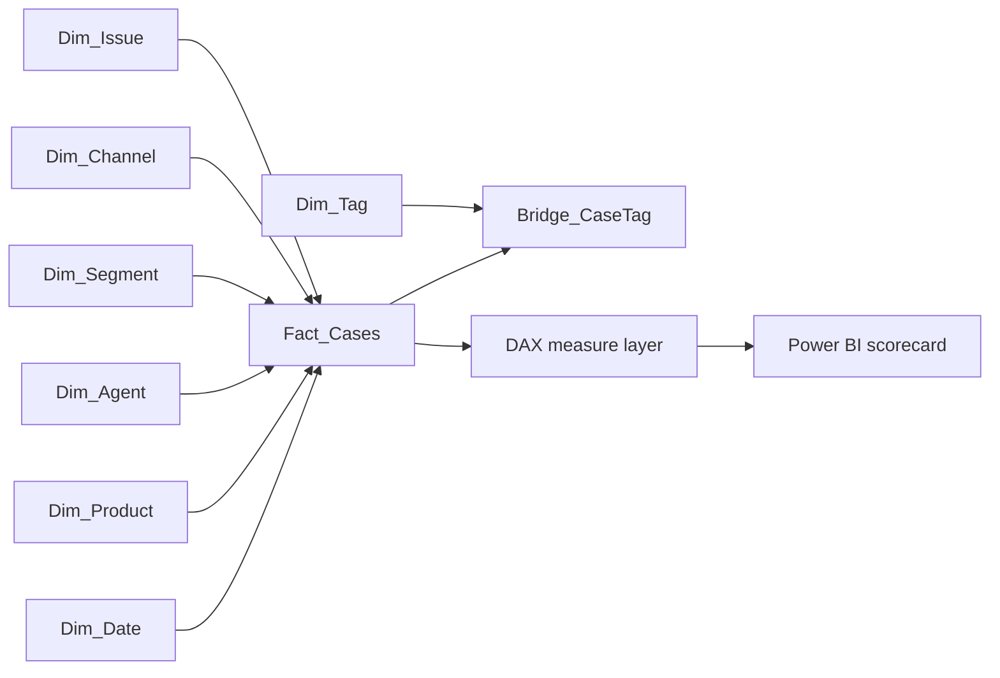
### 5.3 Standardized DAX measures
```dax
Total Cases = COUNTROWS(Fact_Cases)
Assisted Cases = CALCULATE([Total Cases], Dim_Channel[ChannelName] = "assisted")
Self-Serve Sessions = CALCULATE([Total Cases], Dim_Channel[ChannelName] = "self_serve")
Survey Responses = SUM(Fact_Cases[SurveyResponseFlag])
Survey Response Rate = DIVIDE([Survey Responses], [Total Cases])
Active Agents = DISTINCTCOUNT(Dim_Agent[AgentID])
Cases per Active Agent = DIVIDE([Total Cases], [Active Agents])
Avg CSAT = AVERAGE(Fact_Cases[EffectiveCSATScore])
Avg Effort Score = AVERAGE(Fact_Cases[CustomerEffortScore])
FCR Cases = SUM(Fact_Cases[FCRFlag])
FCR Rate = DIVIDE([FCR Cases], [Total Cases])
Escalated Cases = SUM(Fact_Cases[EscalatedFlag])
Escalation Rate = DIVIDE([Escalated Cases], [Total Cases])
Reopened Cases = SUM(Fact_Cases[ReopenedFlag])
Reopen Rate = DIVIDE([Reopened Cases], [Total Cases])
SLA Breached Cases = SUM(Fact_Cases[BreachedSLA])
SLA Attainment = 1 - DIVIDE([SLA Breached Cases], [Total Cases])
Deflection Candidate Cases = SUM(Fact_Cases[DeflectionCandidateFlag])
Deflected Sessions = SUM(Fact_Cases[DeflectedFlag])
Deflection Success Sessions = SUM(Fact_Cases[DeflectionSuccessFlag])
Deflection Rate = DIVIDE([Deflected Sessions], [Total Cases])
Deflection Success Rate = DIVIDE([Deflection Success Sessions], [Self-Serve Sessions])
P90 Resolution Hours = PERCENTILEX.INC(Fact_Cases, Fact_Cases[ResolutionHours], 0.90)
Median Resolution Hours = MEDIAN(Fact_Cases[ResolutionHours])
Avg First Response Hours = AVERAGE(Fact_Cases[FirstResponseHours])
Total Cases MoM % =
VAR CurrentValue = [Total Cases]
VAR PriorValue = CALCULATE([Total Cases], DATEADD(Dim_Date[FullDate], -1, MONTH))
RETURN DIVIDE(CurrentValue - PriorValue, PriorValue)
Avg CSAT MoM % =
VAR CurrentValue = [Avg CSAT]
VAR PriorValue = CALCULATE([Avg CSAT], DATEADD(Dim_Date[FullDate], -1, MONTH))
RETURN DIVIDE(CurrentValue - PriorValue, PriorValue)
Escalation Rate MoM Δ = [Escalation Rate] - CALCULATE([Escalation Rate], DATEADD(Dim_Date[FullDate], -1, MONTH))
Total Cases YoY % =
VAR CurrentValue = [Total Cases]
VAR PriorValue = CALCULATE([Total Cases], SAMEPERIODLASTYEAR(Dim_Date[FullDate]))
RETURN DIVIDE(CurrentValue - PriorValue, PriorValue)
Avg CSAT YoY % =
VAR CurrentValue = [Avg CSAT]
VAR PriorValue = CALCULATE([Avg CSAT], SAMEPERIODLASTYEAR(Dim_Date[FullDate]))
RETURN DIVIDE(CurrentValue - PriorValue, PriorValue)
Escalation Rate YoY Δ = [Escalation Rate] - CALCULATE([Escalation Rate], SAMEPERIODLASTYEAR(Dim_Date[FullDate]))
Deflection Opportunity Rate = DIVIDE([Deflection Candidate Cases], [Assisted Cases])
Estimated Escalations Avoided = [Deflection Success Sessions] * CALCULATE([Escalation Rate], Dim_Channel[ChannelName] = "assisted")
Estimated Agent Hours Saved = SUMX(Fact_Cases, IF(Fact_Cases[DeflectionSuccessFlag] = 1, Fact_Cases[ResolutionHours], 0))
Last Refresh Timestamp = NOW()
Support Health Status =
VAR Esc = [Escalation Rate]
VAR SLA = [SLA Attainment]
VAR CSAT = [Avg CSAT]
RETURN SWITCH(TRUE(), Esc <= 0.10 && SLA >= 0.90 && CSAT >= 4.3, "Healthy", Esc <= 0.15 && SLA >= 0.85 && CSAT >= 4.0, "Watch", "Action Needed")
```
### 5.4 Formatting and governance tips for measures
- Format rates as percentages with one decimal place.
- Format hours with one decimal place.
- Add measure descriptions in Power BI so other users understand the logic.
- Organize measures into folders like `Volume`, `Experience`, `Operations`, `Time Intelligence`, `Deflection`, and `Display`.
- Hide raw columns such as `EscalatedFlag` if you do not want analysts dragging them casually into visuals.
### 5.5 Metric-spec matrix
| Metric | DAX definition summary | Numerator | Denominator | Exclusions / notes | Validation check |
|---|---|---|---|---|---|
| Avg CSAT | Average of effective CSAT score | sum of score values | survey-bearing or imputed rows | Note whether imputed values are allowed in final version | Compare to Silver case average |
| FCR Rate | `FCRFlag / Total Cases` | FCR cases | total cases | Case must not escalate or reopen | Check logic conflict count = 0 |
| Escalation Rate | `EscalatedFlag / Total Cases` | escalated cases | total cases | None | Compare to SQL aggregation |
| Reopen Rate | `ReopenedFlag / Total Cases` | reopened cases | total cases | None | Compare to SQL aggregation |
| SLA Attainment | `1 - (breaches / total)` | non-breached cases | total cases | SLA target depends on severity | Compare to Silver breach counts |
| Deflection Rate | `Deflected sessions / total cases` | deflected sessions | total cases | Use opportunity rate alongside it | Compare to channel-based SQL counts |
| P90 Resolution Hours | percentile of resolution hours | ordered values | n/a | Sensitive to data shape | Compare with SQL percentile proxy if available |
| Survey Response Rate | survey responses / total cases | responded cases | total cases | Channel-specific response behavior | Compare to survey joins |
### 5.6 Data-validation matrix between layers
| Validation | Bronze source | Silver expectation | Gold / semantic expectation |
|---|---|---|---|
| Case row count | `cases_raw.csv` rows | same count after dedupe and valid filters | same count in `Fact_Cases` |
| Agent-version count | `agent_team_history.csv` rows | same in `silver_agent_history` | same in `Dim_Agent` |
| Tag cardinality | `case_tags_raw.csv` rows | same after duplicate-pair removal or documented reduction | bridge row count matches distinct tag pairs |
| Product distinct count | raw products | same standardized distinct count | same in `Dim_Product` |
| Escalated total | raw case flags | same in Silver | DAX `Escalated Cases` matches SQL count |
| Survey response total | survey file rows | same after dedupe | DAX `Survey Responses` matches SQL count |
### 5.7 A useful SQL cross-check query for semantic trust
```sql
SELECT
    COUNT(*) AS total_cases,
    AVG(EffectiveCSATScore) AS avg_csat,
    AVG(CASE WHEN EscalatedFlag = 1 THEN 1.0 ELSE 0.0 END) AS escalation_rate,
    AVG(CASE WHEN ReopenedFlag = 1 THEN 1.0 ELSE 0.0 END) AS reopen_rate,
    AVG(CASE WHEN BreachedSLA = 0 THEN 1.0 ELSE 0.0 END) AS sla_attainment
FROM Fact_Cases;
```
> 💡 **Tie-in:** A CE&S BI interviewer will care a lot about “trusted KPIs.” Saying “I centralized metric definitions in the semantic model and validated them back to SQL” is exactly the right language.

---
## 6. Step 5 — Build the Power BI scorecard

Plain English first: the scorecard is where the technical model becomes something a leader can actually use. The goal is not to show every chart type. The goal is to make the next decision easier.
### 6.1 Report-page architecture
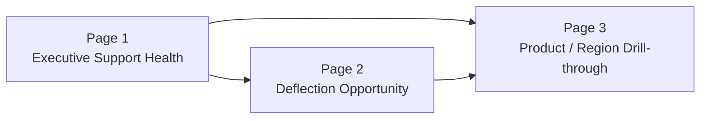
### 6.2 Page 1 — Executive Support Health

**Purpose:** give leadership a one-screen summary of support health and where to look next.
#### Recommended visuals
1. KPI cards:
   - Total Cases
   - Avg CSAT
   - FCR Rate
   - Escalation Rate
   - Reopen Rate
   - SLA Attainment
2. Monthly trend line for:
   - Avg CSAT
   - Escalation Rate
   - SLA Attainment
3. Clustered bar chart by ProductName showing:
   - Escalation Rate
   - P90 Resolution Hours
4. Heatmap or matrix by Region × Segment with Support Health Status.
5. Slicers for Fiscal Year, ProductFamily, RegionName, SegmentName, ChannelName.
#### Insight-led titles you should use
- “Support health is stable overall, but escalation risk is concentrated in two workloads.”
- “SLA attainment dips when high-touch issues spike.”
- “Enterprise EMEA cases drive a disproportionate share of reopens.”
#### Layout suggestion
- Top band: KPI cards.
- Middle left: monthly trend line.
- Middle right: product comparison.
- Bottom: segment/region matrix with conditional formatting.
### 6.3 Page 2 — Deflection Opportunity

**Purpose:** identify where assisted volume could move to self-serve without hurting experience.
#### Recommended visuals
1. Funnel or stacked bars:
   - Assisted Cases
   - Deflection Candidate Cases
   - Self-Serve Sessions
   - Deflection Success Sessions
2. Scatter plot:
   - X-axis: Deflection Opportunity Rate
   - Y-axis: Avg CSAT
   - Size: Total Cases
   - Legend: ProductName
3. Matrix by IssueGroup × ProductName showing:
   - Assisted cases
   - Deflection candidate rate
   - Deflection success rate
   - Estimated agent hours saved
4. Decomposition tree or key-influencers-style narrative using issue, segment, severity, region.
### 6.4 Page 3 — Drill-through detail

**Purpose:** let analysts and hiring managers see you can move from aggregate insight to operational detail.
#### Recommended visuals
1. Detail table with:
   - CaseID
   - ProductName
   - IssueName
   - RegionName
   - SegmentName
   - TeamName
   - EffectiveCSATScore
   - EscalatedFlag
   - ReopenedFlag
   - ResolutionHours
2. Tooltip page showing monthly trend for the selected product or issue.
3. Drill-through filters based on ProductName, IssueName, RegionName, or TeamName.
### 6.5 Optional Page 4 — Model Monitoring
If you have time, add a page for predicted escalation risk distributions, confusion matrix summary, or top predictive factors. It shows you understand the bridge between BI and data science.
### 6.6 Visual-design best practices for this specific capstone
| Principle | What to do | What to avoid |
|---|---|---|
| Executive focus | Use 5–7 core KPIs max on the first page | A dashboard with 20 competing visuals |
| Consistency | Use the same product, region, segment, and fiscal slicers across pages | Changing slicer semantics page by page |
| Accessibility | Use color-safe palettes and enough contrast | Red/green dependency only |
| Explanation | Use titles that state the insight, not just the measure | Titles like “Chart 1” or “Trend” |
| Trust | Add “Last refresh” and metric info tooltip | Hiding the data context |
| Actionability | Highlight products/issues with intervention opportunity | Only descriptive trend lines |
### 6.7 Row-level security (RLS)
You can strengthen the portfolio story by adding dynamic region-based access.
#### Option A — Static demo roles
- `AMER_Viewer`: `Fact_Cases[RegionName] = "AMER"`
- `EMEA_Viewer`: `Fact_Cases[RegionName] = "EMEA"`
- `APAC_Viewer`: `Fact_Cases[RegionName] = "APAC"`
#### Option B — Dynamic RLS with a security table
Create a table `Security_UserRegion` with columns:
- `UserUPN`
- `RegionName`

Relate `Security_UserRegion[RegionName]` to `Fact_Cases[RegionName]` and set this role filter:
```dax
[UserUPN] = USERPRINCIPALNAME()
```
### 6.8 Report-build checklist
- [ ] Model view relationships are clean and single-direction.
- [ ] Date table is marked.
- [ ] Cards match SQL validations.
- [ ] Titles state insight, not just metric name.
- [ ] Drill-through works from summary visuals.
- [ ] Tooltip page adds context instead of clutter.
- [ ] RLS is configured or at least documented.
- [ ] At least one page is designed for leadership, not analysts.

> 💡 **Tie-in:** In your background, you already presented metrics to stakeholders. This page structure lets you show that your storytelling is not generic—it is aligned to support operations and leadership decisions.

---
## 7. Step 6 — ML escalation and deflection model

Plain English first: the predictive layer is not there to replace judgment. It is there to prioritize attention. In support operations, predicting which cases may escalate—or which assisted cases are good deflection candidates—can improve staffing and content investment.
### 7.1 Modeling strategy
You will train **two binary classifiers** using the same feature-preparation pattern:
1. **Escalation model** — target = `EscalatedFlag`
2. **Deflection candidate model** — target = `DeflectionCandidateFlag`
### 7.2 Why recall matters for escalation
If you miss a likely escalation, the cost can be high: dissatisfied customers, management attention, and operational churn. So for escalation risk, **recall** usually matters more than raw accuracy.
### 7.3 Why precision still matters for deflection
If you tell teams too many cases are deflectable when they are not, you waste content investment or push customers to poor experiences. So deflection needs a better balance between **precision** and **recall**.
### 7.4 ML pipeline diagram
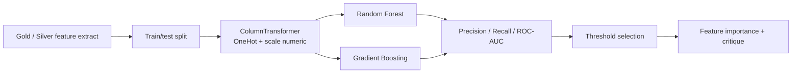
### 7.5 Full scikit-learn training script

Save this as `src/train_models.py`.
```python
from __future__ import annotations

from pathlib import Path
from typing import Dict, List

import joblib
import matplotlib.pyplot as plt
import numpy as np
import pandas as pd
import seaborn as sns
from sklearn.compose import ColumnTransformer
from sklearn.ensemble import GradientBoostingClassifier, RandomForestClassifier
from sklearn.impute import SimpleImputer
from sklearn.inspection import permutation_importance
from sklearn.metrics import (
    average_precision_score,
    classification_report,
    confusion_matrix,
    precision_recall_curve,
    precision_score,
    recall_score,
    roc_auc_score,
)
from sklearn.model_selection import train_test_split
from sklearn.pipeline import Pipeline
from sklearn.preprocessing import OneHotEncoder, StandardScaler
from sklearn.utils.class_weight import compute_sample_weight

DATA_ROOT = Path("data")
SILVER_PATH = DATA_ROOT / "silver" / "silver_cases.csv"
ARTIFACT_DIR = DATA_ROOT / "artifacts"
ARTIFACT_DIR.mkdir(parents=True, exist_ok=True)


def load_feature_frame() -> pd.DataFrame:
    df = pd.read_csv(SILVER_PATH, parse_dates=["created_at", "submitted_at"])
    df["created_date"] = pd.to_datetime(df["created_date"])
    df["case_age_hours"] = (df["created_at"].max() - df["created_at"]).dt.total_seconds() / 3600.0
    df["is_enterprise"] = (df["segment_name"] == "Enterprise").astype(int)
    df["is_high_severity"] = df["severity_name"].isin(["High", "Critical"]).astype(int)
    df["is_high_touch_issue"] = df["issue_name"].isin(["Compliance", "eDiscovery", "Migration", "Mailflow"]).astype(int)
    df["is_deflectable_issue"] = df["issue_name"].isin(["How-To", "Permissions", "Sync", "Reports", "Provisioning"]).astype(int)
    df["response_vs_sla_ratio"] = df["first_response_hours"] / df["sla_target_hours"].replace(0, np.nan)
    df["resolution_log_hours"] = np.log1p(df["resolution_hours"])
    df["first_response_log_hours"] = np.log1p(df["first_response_hours"])
    df["month_end_pressure"] = df["created_date"].dt.day.ge(25).astype(int)
    return df


def build_preprocessor(categorical_cols: List[str], numeric_cols: List[str]) -> ColumnTransformer:
    categorical_pipeline = Pipeline(
        steps=[
            ("imputer", SimpleImputer(strategy="most_frequent")),
            ("onehot", OneHotEncoder(handle_unknown="ignore")),
        ]
    )
    numeric_pipeline = Pipeline(
        steps=[
            ("imputer", SimpleImputer(strategy="median")),
            ("scaler", StandardScaler()),
        ]
    )
    return ColumnTransformer(
        transformers=[
            ("categorical", categorical_pipeline, categorical_cols),
            ("numeric", numeric_pipeline, numeric_cols),
        ]
    )


def evaluate_model(model_name, estimator, X_train, X_test, y_train, y_test, sample_weight, output_prefix, threshold):
    if sample_weight is None:
        estimator.fit(X_train, y_train)
    else:
        estimator.fit(X_train, y_train, model__sample_weight=sample_weight)

    probabilities = estimator.predict_proba(X_test)[:, 1]
    predictions = (probabilities >= threshold).astype(int)

    metrics = {
        "precision": precision_score(y_test, predictions, zero_division=0),
        "recall": recall_score(y_test, predictions, zero_division=0),
        "roc_auc": roc_auc_score(y_test, probabilities),
        "avg_precision": average_precision_score(y_test, probabilities),
    }

    print(f"\n===== {model_name} =====")
    print(classification_report(y_test, predictions, zero_division=0))
    print("Confusion matrix:\n", confusion_matrix(y_test, predictions))
    print(metrics)

    cm = confusion_matrix(y_test, predictions)
    plt.figure(figsize=(5, 4))
    sns.heatmap(cm, annot=True, fmt="d", cmap="Blues")
    plt.title(f"{model_name} confusion matrix")
    plt.xlabel("Predicted")
    plt.ylabel("Actual")
    plt.tight_layout()
    plt.savefig(ARTIFACT_DIR / f"{output_prefix}_{model_name.lower().replace(' ', '_')}_cm.png", dpi=150)
    plt.close()

    precision_vals, recall_vals, thresholds = precision_recall_curve(y_test, probabilities)
    plt.figure(figsize=(6, 4))
    plt.plot(recall_vals, precision_vals)
    plt.title(f"{model_name} precision-recall curve")
    plt.xlabel("Recall")
    plt.ylabel("Precision")
    plt.tight_layout()
    plt.savefig(ARTIFACT_DIR / f"{output_prefix}_{model_name.lower().replace(' ', '_')}_pr_curve.png", dpi=150)
    plt.close()
    return metrics


def feature_importance_report(fitted_pipeline, X_test, y_test, output_prefix):
    result = permutation_importance(
        fitted_pipeline,
        X_test,
        y_test,
        n_repeats=8,
        random_state=42,
        scoring="recall",
    )
    feature_names = fitted_pipeline.named_steps["preprocessor"].get_feature_names_out()
    importances = pd.DataFrame(
        {
            "feature_name": feature_names,
            "importance_mean": result.importances_mean,
            "importance_std": result.importances_std,
        }
    ).sort_values("importance_mean", ascending=False)
    importances.head(20).to_csv(ARTIFACT_DIR / f"{output_prefix}_top_feature_importance.csv", index=False)
    return importances


def run_target(df: pd.DataFrame, target_col: str, threshold: float) -> None:
    categorical_cols = [
        "product_name",
        "issue_name",
        "region_name",
        "segment_name",
        "channel_name",
        "severity_name",
        "team_name_at_create",
        "resolution_bucket",
        "first_response_bucket",
    ]
    numeric_cols = [
        "resolution_hours",
        "first_response_hours",
        "sla_target_hours",
        "customer_effort_score",
        "created_hour",
        "fiscal_year",
        "fiscal_month_number",
        "tag_count",
        "survey_response_flag",
        "response_vs_sla_ratio",
        "resolution_log_hours",
        "first_response_log_hours",
        "case_age_hours",
        "is_enterprise",
        "is_high_severity",
        "is_high_touch_issue",
        "is_deflectable_issue",
        "month_end_pressure",
    ]

    feature_cols = categorical_cols + numeric_cols
    model_df = df[feature_cols + [target_col]].copy()
    X = model_df[feature_cols]
    y = model_df[target_col].astype(int)

    X_train, X_test, y_train, y_test = train_test_split(
        X,
        y,
        test_size=0.25,
        random_state=42,
        stratify=y,
    )

    preprocessor = build_preprocessor(categorical_cols, numeric_cols)

    rf_pipeline = Pipeline(
        steps=[
            ("preprocessor", preprocessor),
            (
                "model",
                RandomForestClassifier(
                    n_estimators=350,
                    max_depth=12,
                    min_samples_leaf=8,
                    class_weight="balanced",
                    random_state=42,
                    n_jobs=-1,
                ),
            ),
        ]
    )

    gb_pipeline = Pipeline(
        steps=[
            ("preprocessor", preprocessor),
            (
                "model",
                GradientBoostingClassifier(
                    learning_rate=0.05,
                    n_estimators=180,
                    max_depth=3,
                    random_state=42,
                ),
            ),
        ]
    )

    sample_weight = compute_sample_weight(class_weight="balanced", y=y_train)
    output_prefix = target_col.replace("_flag", "")

    rf_metrics = evaluate_model("Random Forest", rf_pipeline, X_train, X_test, y_train, y_test, None, output_prefix, threshold)
    gb_metrics = evaluate_model("Gradient Boosting", gb_pipeline, X_train, X_test, y_train, y_test, sample_weight, output_prefix, threshold)

    fitted_pipeline = rf_pipeline if rf_metrics["recall"] >= gb_metrics["recall"] else gb_pipeline
    if fitted_pipeline is rf_pipeline:
        fitted_pipeline.fit(X_train, y_train)
        chosen_name = "random_forest"
    else:
        fitted_pipeline.fit(X_train, y_train, model__sample_weight=sample_weight)
        chosen_name = "gradient_boosting"

    top_features = feature_importance_report(fitted_pipeline, X_test, y_test, output_prefix)
    print("Top features for", target_col)
    print(top_features.head(15).to_string(index=False))

    predictions_df = X_test.copy()
    predictions_df["actual"] = y_test.values
    predictions_df["predicted_probability"] = fitted_pipeline.predict_proba(X_test)[:, 1]
    predictions_df["predicted_label"] = (predictions_df["predicted_probability"] >= threshold).astype(int)
    predictions_df.to_csv(ARTIFACT_DIR / f"{output_prefix}_scored_holdout.csv", index=False)
    joblib.dump(fitted_pipeline, ARTIFACT_DIR / f"{output_prefix}_{chosen_name}_pipeline.joblib")


def main() -> None:
    df = load_feature_frame()
    run_target(df, target_col="escalated_flag", threshold=0.35)
    run_target(df, target_col="deflection_candidate_flag", threshold=0.45)
    print("Model training complete. Artifacts written to", ARTIFACT_DIR)


if __name__ == "__main__":
    main()
```
### 7.6 How to interpret model outputs
| Output | What to look for | Business meaning |
|---|---|---|
| Recall | Higher is better for escalation use case | Fewer risky cases missed |
| Precision | Important for deflection candidate triage | Fewer wasted interventions |
| ROC-AUC | Overall ranking quality | Can the model separate positives from negatives? |
| Confusion matrix | False negatives vs false positives | Operational trade-off clarity |
| Feature importance | Top drivers like severity, SLA, issue type | Helps explain what to improve |
### 7.7 Written critique you should include in your project
1. **Why recall matters for escalation**
   - Missing a likely escalation is more costly than reviewing an extra case.
2. **Why not rely on accuracy**
   - If only 10% of cases escalate, a model that predicts “no escalation” every time looks 90% accurate and is still useless.
3. **How class imbalance was handled**
   - Random forest used `class_weight="balanced"`.
   - Gradient boosting used balanced sample weights.
4. **Responsible AI considerations**
   - Review top features to ensure the model is not overly relying on proxy signals that could be unfair or unstable.
   - Do not use customer-identifying features.
   - Keep the model as a prioritization aid, not an automatic decision maker.
5. **Overfitting caution**
   - Synthetic data follows the rules you created. Real-world data will be messier.
   - Re-validate thresholds and feature usefulness on real deployment data.
6. **Monitoring plan**
   - Track recall, precision, score drift, and feature drift monthly.
   - Re-train if definitions, channels, or support motions materially change.
### 7.8 Optional lightweight RAG-style deflection assistant prototype
```python
from pathlib import Path

import pandas as pd
from sklearn.feature_extraction.text import TfidfVectorizer
from sklearn.metrics.pairwise import cosine_similarity

KB_PATH = Path("data/bronze/kb_articles.csv")
kb = pd.read_csv(KB_PATH)
kb["search_text"] = (
    kb["product_name"].fillna("") + " "
    + kb["issue_name"].fillna("") + " "
    + kb["article_title"].fillna("") + " "
    + kb["article_summary"].fillna("")
)

vectorizer = TfidfVectorizer(stop_words="english")
kb_matrix = vectorizer.fit_transform(kb["search_text"])


def retrieve_kb(case_text: str, top_n: int = 3) -> pd.DataFrame:
    query_vec = vectorizer.transform([case_text])
    scores = cosine_similarity(query_vec, kb_matrix).flatten()
    ranked_idx = scores.argsort()[::-1][:top_n]
    result = kb.iloc[ranked_idx].copy()
    result["similarity_score"] = scores[ranked_idx]
    return result[["kb_article_id", "product_name", "issue_name", "article_title", "similarity_score"]]


def build_prompt(case_text: str) -> str:
    retrieved = retrieve_kb(case_text)
    evidence = "\n".join(
        f"- {row.kb_article_id}: {row.article_title} (score={row.similarity_score:.3f})"
        for row in retrieved.itertuples()
    )
    prompt = f"""You are a support-deflection assistant.
Given the case description below, suggest whether to route to self-serve or assisted support.

Case description:
{case_text}

Retrieved knowledge articles:
{evidence}

Answer in this structure:
1. Recommended route
2. Why
3. Best matching article
4. Caveat / when to escalate
"""
    return prompt


sample_case = "SharePoint Online permissions how-to request from SMB admin with low severity and repeated guidance need."
print(retrieve_kb(sample_case).to_string(index=False))
print(build_prompt(sample_case))
```
> 💡 **Tie-in:** This section is your differentiator. Many BI candidates stop at dashboards. Adding a responsible predictive layer makes your capstone stand out without leaving the business problem behind.

---
## 8. Step 7 — Insight narrative and impact plan

Plain English first: your project is not finished when the dashboard works. It is finished when a leader can read your summary and know what to do next.
### 8.1 The decision memo structure
1. **Headline insight** — the single most important pattern.
2. **Evidence** — the 2–4 facts or visuals that support it.
3. **Recommendation** — what action should be taken.
4. **Impact plan** — how success will be measured.
5. **Caveats** — what you know and what still needs validation.
### 8.2 Example headline insight

> **Headline insight:** Enterprise EMEA cases in high-touch issue groups are driving a disproportionate share of escalations and SLA breaches, while a large share of assisted low/medium-severity “how-to” and permissions volume appears suitable for self-serve deflection without a major CSAT penalty.
### 8.3 Evidence ladder
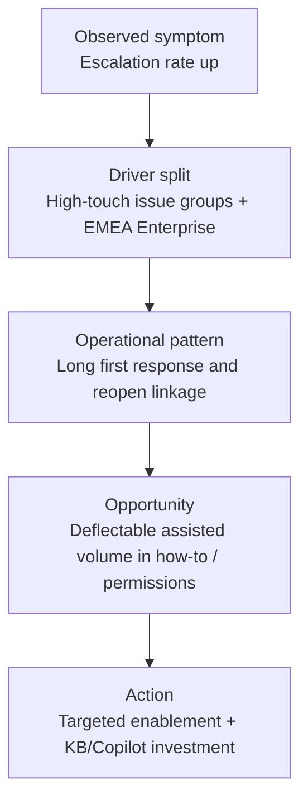
### 8.4 Example narrative you can include almost as-is

**Business question:** Where is support health under pressure, and where can we safely deflect assisted volume to self-serve?

**What I found:**
- High-touch issue groups such as Compliance, Mailflow, and Migration show the highest escalation and SLA-breach rates, especially in Enterprise EMEA.
- Reopens are strongly associated with high first-response delay and certain repeat issue clusters.
- A meaningful share of assisted “How-To,” “Permissions,” and “Reports” work appears deflectable based on channel, severity, issue type, and self-serve outcome patterns.
- The predictive model confirms that severity, first-response delay, issue type, and team/process context are among the strongest escalation signals.

**What I recommend:**
1. Prioritize enablement and staffing intervention for the highest-risk high-touch issue clusters.
2. Invest in KB/Copilot-style guided content for top deflectable issue groups.
3. Track the intervention using baseline, target, and control-region comparisons rather than only raw trend watching.
### 8.5 Baseline-target-control impact plan
| Measure | Baseline | 90-day target | Control / comparison | Why it matters |
|---|---:|---:|---|---|
| Escalation Rate | 12.8% | 10.9% | Compare against non-pilot region or product | Tests whether risk mitigation works |
| SLA Attainment | 86.5% | 90.0% | Compare before/after and against control | Shows operational speed improvement |
| Deflection Opportunity Rate | 18.0% | 22.0% qualified opportunity | Compare selected issue groups vs others | Measures pipeline creation |
| Deflection Success Rate | 34.0% | 42.0% | Compare pilot issue groups only | Measures whether self-serve actually works |
| Avg CSAT | 4.21 | ≥ 4.25 | Monitor pilot vs control | Guards against harming experience |
| Estimated Agent Hours Saved | 0 | +250 hrs / quarter | Compare baseline | Connects to efficiency |
### 8.6 Impact-plan logic
- **Output** = the assets or changes you deploy (KB articles, playbooks, staffing focus).
- **Outcome** = the immediate behavior shift (higher self-serve success, faster response).
- **Impact** = the business result (lower escalation, stable/improved CSAT, lower support cost).
### 8.7 Caveats you should state clearly
- Synthetic data is useful for demonstrating architecture and logic, not for claiming exact business effects.
- Feature importance suggests relationships; it does not prove causality.
- Real customer deployment would need tighter domain validation, refresh governance, and access control.
- Self-serve deflection should never optimize volume at the cost of customer success.

---
## 9. Advanced extensions — how to push the project from strong to exceptional
### 9.1 Incremental refresh and partitioning
- In Power BI, create `RangeStart` and `RangeEnd` parameters on the date field.
- Refresh recent periods only.
- In Fabric or Databricks, partition Silver/Gold by fiscal year or month.
### 9.2 Direct Lake and semantic performance
- “In a Fabric-native deployment, I would prefer Direct Lake for low-latency analytics directly over OneLake-backed tables while keeping the star schema and semantic governance intact.”
### 9.3 Purview lineage and governance
- Capture lineage from Bronze files → Silver notebook → Gold tables → semantic model → report.
- Tag assets with business labels like “Certified KPI” or “Internal only.”
### 9.4 Git, CI/CD, and deployment pipelines
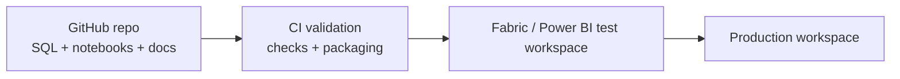
### 9.5 MLOps with Fabric Data Science or MLflow
- Save training script and data snapshot version.
- Log model metrics and chosen threshold.
- Track feature drift and prediction-rate drift.
- Re-train when model performance drops below agreed thresholds.
### 9.6 Real-time extension with Eventstream / KQL
- Stream high-severity case events.
- Land them in Eventstream or KQL.
- Surface near-real-time escalation alerts.
### 9.7 Copilot / RAG deflection assistant

| Extension | Effort | Interview payoff |
|---|---:|---|
| Incremental refresh | Medium | High |
| Direct Lake note | Low | High |
| Purview lineage | Medium | High |
| Deployment pipeline story | Low | Medium-high |
| Monitoring page | Medium | High |
| Real-time prototype | High | Medium |
| RAG assistant | Medium | Very high |

> 💡 **Tie-in:** Advanced extensions are not there to impress with buzzwords. They are there to show you know how this project would mature in a real Microsoft environment.

---
## 10. Packaging the capstone like a portfolio piece
### 10.1 Recommended repository structure
```text
ce-support-health-deflection-analytics/
├── README.md
├── requirements.txt
├── data/
│   ├── bronze/
│   ├── silver/
│   ├── gold/
│   └── artifacts/
├── notebooks/
│   ├── 01_silver_transform.ipynb
│   ├── 02_gold_model_checks.ipynb
│   └── 03_model_review.ipynb
├── src/
│   ├── generate_support_data.py
│   ├── build_silver_local.py
│   ├── build_gold_local.py
│   ├── train_models.py
│   └── rag_deflection_prototype.py
├── sql/
│   ├── 01_build_gold_model.sql
│   ├── 02_validation_queries.sql
│   └── 03_metric_reconciliation.sql
├── powerbi/
│   ├── CE_Support_Health_Deflection.pbix
│   └── screenshots/
├── docs/
│   ├── metric-spec.md
│   ├── dq-matrix.md
│   ├── architecture.png
│   └── demo-script.md
└── .gitignore
```
### 10.2 README template
```markdown
# CE&S Support Health & Deflection Analytics
## Overview
This project is an end-to-end analytics solution designed for a Microsoft CE&S-style support environment. It uses synthetic support data to model support health, KPI governance, deflection opportunity, and escalation risk across products, regions, segments, and channels.
## Business problem
Support leaders need one trusted view of CSAT, FCR, escalation, reopen rate, SLA attainment, and self-serve deflection opportunity so they can prioritize enablement, staffing, and knowledge investments.
## Architecture
- Bronze: synthetic raw support data
- Silver: cleaned and quality-checked support tables
- Gold: star schema with SCD2 agent dimension and conformed dimensions
- Semantic model: standardized DAX KPI layer
- Report: Power BI scorecard with executive, deflection, and drill-through views
- ML: escalation and deflection-candidate prediction with Responsible AI critique
## Tools used
- Microsoft Fabric (preferred path) / local SQLite + pandas fallback / Databricks Community fallback
- Python, PySpark, SQL, Power BI, DAX, scikit-learn
## Key KPIs
- Avg CSAT
- FCR Rate
- Escalation Rate
- Reopen Rate
- SLA Attainment
- Deflection Rate
- P90 Resolution Hours
## Key insight
Enterprise EMEA high-touch issue groups drive a disproportionate share of escalations and SLA breaches, while a meaningful share of low/medium-severity assisted how-to and permissions demand appears suitable for self-serve deflection.
## How to run locally
1. Install dependencies from `requirements.txt`.
2. Run `python src/generate_support_data.py`.
3. Run `python src/build_silver_local.py`.
4. Build Gold tables using `sql/01_build_gold_model.sql` in SQLite or equivalent environment.
5. Run `python src/train_models.py`.
6. Open the PBIX file and refresh the model.
```
### 10.3 Three-to-five minute demo script
1. Problem framing.
2. Bronze → Silver → Gold architecture.
3. Semantic model and KPI governance.
4. Scorecard pages.
5. ML layer and Responsible AI critique.
6. Insight and impact plan.
### 10.4 LinkedIn post idea

> I built a privacy-safe, end-to-end CE&S-style Support Health & Deflection Analytics capstone using Microsoft Fabric concepts, Power BI, SQL, Python/PySpark, and scikit-learn. The project covers Bronze→Silver→Gold data flow, SCD2 dimensional modeling, standardized KPI governance, a Power BI scorecard, and ML models for escalation and self-serve deflection opportunity.
### 10.5 Self-assessment rubric
| Area | 1 — weak | 3 — solid | 5 — excellent | Your score |
|---|---|---|---|---|
| Stakeholder framing | Generic dashboard description | Clear problem and KPIs | Strong problem statement tied to decisions and impact |  |
| Data generation realism | Random toy data only | Some skew and business rules | Rich support-like relationships, history, and tag logic |  |
| Silver quality controls | Minimal cleaning | Good assertions and audit table | Explicit DQ matrix with reconciliation and documentation |  |
| Dimensional model | Flat table or unclear grain | Good star schema | Strong star schema with SCD2, bridge tags, fiscal date dim |  |
| DAX standardization | Measures exist but feel ad hoc | Core KPI set centralized | Full metric spec, time intelligence, validation matrix |  |
| Report design | Charts without narrative | Clean report with useful pages | Executive-ready storytelling, drill-through, RLS, accessibility |  |
| ML layer | Single notebook experiment | Good train/test and metrics | Two well-critiqued models with thresholds and Responsible AI notes |  |
| Narrative | Descriptive only | Recommendation included | Clear action plan with baseline/target/control and caveats |  |
| Packaging | Loose files | Organized repo | README, screenshots, demo script, polished portfolio story |  |

---
## 11. Alternative and mini-capstone ideas
### 11.1 Mini-capstone A — Support Queue Health Early Warning
- Focus only on queue pressure, SLA risk, and escalations.
- Best if you want a faster build.
### 11.2 Mini-capstone B — Knowledge Base Effectiveness & Deflection
- Focus on article usage, self-serve success, article gaps, and content ROI.
- Best if the interviewer emphasizes self-help and Copilot opportunities.
### 11.3 Mini-capstone C — Agent Performance & Team Transition Analytics
- Center the SCD2 dimension and team-change history.
- Best if you want to emphasize modeling maturity.
| If you want to emphasize… | Choose… |
|---|---|
| End-to-end Microsoft BI readiness | Full capstone |
| Fastest build with strong support relevance | Queue Health Early Warning |
| Knowledge / Copilot / deflection angle | KB Effectiveness & Deflection |
| Advanced modeling / SCD2 credibility | Agent Performance & Team Transition |

---
## 12. Build checklist — use this as your execution tracker
| # | Milestone | What done looks like | Skills shown | Done |
|---|---|---|---|---|
| 1 | Define stakeholder brief | problem statement + business questions written | requirements, business framing | ⬜ |
| 2 | Choose build path | Path A/B/C selected and environment ready | delivery planning | ⬜ |
| 3 | Generate Bronze data | all source CSVs created | Python, synthetic data design | ⬜ |
| 4 | Upload/load Bronze | files visible in Lakehouse or local DB | ingest, platform setup | ⬜ |
| 5 | Build Silver | standardized and validated tables saved | PySpark/pandas, DQ | ⬜ |
| 6 | Build Gold | star schema and SCD2 dimension loaded | SQL, modeling | ⬜ |
| 7 | Import to Power BI | semantic model created | Power BI modeling | ⬜ |
| 8 | Create KPI measures | DAX layer standardized | DAX governance | ⬜ |
| 9 | Build Page 1 | executive support-health page finished | storytelling | ⬜ |
| 10 | Build Page 2 | deflection-opportunity page finished | domain analytics | ⬜ |
| 11 | Build Page 3 | drill-through page finished | UX, operational detail | ⬜ |
| 12 | Configure RLS | demo or dynamic role documented | security/governance | ⬜ |
| 13 | Train escalation model | metrics + confusion matrix saved | ML | ⬜ |
| 14 | Train deflection model | metrics + feature importance saved | ML | ⬜ |
| 15 | Write insight memo | headline + evidence + recommendation | communication | ⬜ |
| 16 | Build impact plan | baseline / target / control written | measurement | ⬜ |
| 17 | Package repo | README + screenshots + docs ready | portfolio packaging | ⬜ |
| 18 | Rehearse demo | 3–5 minute story sounds natural | interview readiness | ⬜ |

---

---
## ⭐ Likely Interview Questions for This Section

**Q1. "Walk me through this capstone end to end."**
> *Model answer:* “I framed the project as a CE&S support-health and deflection problem, generated privacy-safe synthetic support data, landed it in a Bronze layer, transformed and quality-checked it into Silver with PySpark or pandas, modeled a Gold star schema with an SCD2 agent dimension and conformed dimensions, centralized KPI definitions in a Power BI semantic model, built an executive scorecard plus a deflection page and drill-through page, added escalation and deflection-candidate ML models, and finished with a recommendation and impact plan.”

**Q2. "Why did you use synthetic data?"**
> *Model answer:* “It let me encode realistic support relationships—severity, SLA, escalations, reopens, self-serve behavior, team history—without using any sensitive customer data, which made the project both safe to publish and more role-specific.”

**Q3. "Why a star schema instead of one flat table?"**
> *Model answer:* “The star schema makes the semantic model cleaner, filters behave predictably, DAX is simpler, and the structure scales better. It also let me model reusable conformed dimensions and an SCD2 agent dimension.”

**Q4. "Where exactly did SCD2 matter?"**
> *Model answer:* “Some agents changed teams mid-period. I used an as-of join so each case mapped to the team version valid on the case date. Without that, historical team performance would be distorted by current-state overwrites.”

**Q5. "How did you make Power BI numbers trustworthy?"**
> *Model answer:* “I added explicit Silver-layer quality gates, reconciled Gold counts back to Silver, documented KPI logic in a metric-spec matrix, and cross-checked key Power BI measures against SQL outputs.”

**Q6. "Why optimize for recall in the escalation model?"**
> *Model answer:* “Because the expensive mistake is missing a case likely to escalate. A false positive means some extra review effort; a false negative can mean a customer issue blows up.”

**Q7. "How did you handle class imbalance?"**
> *Model answer:* “I used `class_weight='balanced'` for the random forest, balanced sample weights for gradient boosting, and stratified train/test splits. I evaluated precision, recall, ROC-AUC, and the confusion matrix instead of relying on accuracy.”

**Q8. "What does deflection mean here?"**
> *Model answer:* “Deflection is shifting demand from assisted support to effective self-serve for appropriate issue types. I measured deflection rate, deflection success rate, and deflection opportunity rate, then connected that to CSAT and estimated hours saved.”

**Q9. "What were the most important predictive features?"**
> *Model answer:* “Severity, first-response delay relative to SLA, issue type, channel, and tag context tended to surface strongly. That made intuitive sense because operational friction and complexity are strong signals for both escalation risk and self-serve suitability.”

**Q10. "How would you productionize this in Microsoft Fabric?"**
> *Model answer:* “I’d schedule Bronze ingestion with pipelines, keep Silver/Gold transformations in notebooks or SQL, use Direct Lake or an optimized semantic model for Power BI, add lineage and certification, use deployment pipelines across environments, and put model monitoring plus retraining criteria around the ML layer.”

**Q11. "How would you keep this Responsible AI aligned?"**
> *Model answer:* “I’d minimize sensitive fields, avoid customer identifiers in modeling, keep a human reviewer in the loop, monitor drift and subgroup behavior, document intended use and limits, and treat the model as a prioritization tool—not an autonomous decision engine.”

**Q12. "What business action came out of the project?"**
> *Model answer:* “The main action was split in two: targeted enablement/staffing focus for high-risk issue clusters, and self-serve content investment for the most deflectable assisted demand. I paired that with a baseline/target/control measurement plan.”

**Q13. "Why did you include RLS in a demo project?"**
> *Model answer:* “Because governance is part of BI maturity. Trusted metrics also require trusted access. Including RLS showed that I think about the operational reality of enterprise reporting, not only the visuals.”

**Q14. "If the model and dashboard disagreed, what would you do?"**
> *Model answer:* “I’d treat the dashboard as descriptive truth from governed metrics and the model as a probabilistic signal. First I’d check data freshness and feature alignment. Then I’d investigate whether the model is highlighting leading indicators or whether it has drifted.”

**Q15. "What makes this especially relevant to the Microsoft CE&S BI team?"**
> *Model answer:* “It directly targets support-health and deflection questions that CE&S teams care about, uses Microsoft-aligned platform patterns, and shows that I can connect support operations, data modeling, KPI governance, Power BI storytelling, and predictive analysis into one coherent business solution.”

---
## 🧠 30-Second Memory Hooks
- **This capstone = one story for the whole interview.**
- **Bronze = raw landing, Silver = trusted prep, Gold = business-ready model.**
- **Fact grain first: one row per case.**
- **SCD2 agent dim = honest team history across reorgs.**
- **Conformed dimensions keep the model reusable and clean.**
- **Metric governance means define once, reuse everywhere.**
- **Power BI first page is for decisions, not decoration.**
- **Escalation model cares most about recall.**
- **Deflection model needs precision and customer-experience caution.**
- **Synthetic data protects privacy and allows public sharing.**
- **Tag bridge table proves many-to-many modeling maturity.**
- **Fiscal Jul–Jun calendar matches Microsoft-style reporting rhythm.**
- **Baseline + target + control = impact, not just insight.**
- **RLS shows governance, not just visuals.**
- **Feature importance explains where to intervene.**
- **Copilot/RAG extension = guided self-serve assistant, human in the loop.**
- **Packaging matters: README, screenshots, demo script, repo structure.**
- **Best interview opener:** “Let me show you the CE&S-style support analytics solution I built.”

---

🎓 **You've reached the end of the guide.** You now have, in order: the role & your edge, the fundamentals, the full technical stack (SQL, Python/PySpark, modeling, Fabric, Power BI/DAX), the applied process (requirements, governance, domain), the extra edge, a 100+ question bank, behavioral/closing prep, and a capstone that proves it all.

**Remember the honesty principle:** reading built your knowledge, but readiness also needs *answering aloud*, *building the project with your own hands*, *writing your real STAR stories* with your real numbers, and *a mock interview*. Build this capstone, practice the 3–5 minute walkthrough, explain the trade-offs out loud, and you will walk into the Microsoft CE&S BI interview with concrete proof—not just preparation.

*Back to the [master index](../Microsoft%20CE&S%20BI%20Data%20Analyst%20-%20Study%20Guide.md).*
