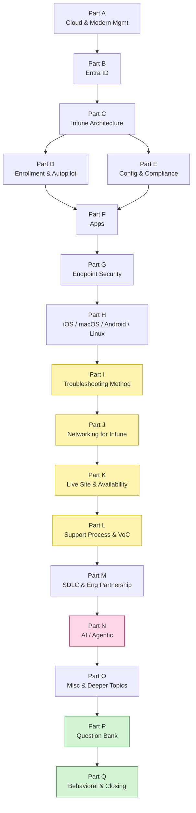

# Microsoft Intune — Agentic Support Engineering (CVC Excellence) · Master Study Guide

> **Role:** Support Engineer / Technical Lead — Microsoft Security, Customer Value Creation (CVC) Excellence, **Intune Agentic Support Engineering** team.
> **Goal:** Never go blank. Know the fundamentals *and* the concept behind every answer — so you can reason your way to an answer even for a question you've never seen.
> **Mode:** Interview prep (full question bank + behavioral + closing included).

---

## 0. How to use this guide

1. Read the Parts **in order** — each one assumes only what came before it, and nothing else.
2. Every term is explained **before** it is used, in plain English, with a real-world analogy.
3. Every Part ends with **⭐ Likely Interview Questions** (with model answers) and **🧠 30-Second Memory Hooks**.
4. After finishing a Part, tick it off in the [status table](#4-part-status-tracker) below.
5. In the last week, live in [Part P — Interview Question Bank](prep/Part-P-interview-question-bank.md) and [Part Q — Behavioral & Closing](prep/Part-Q-behavioral-and-closing.md).

> 📌 **This guide assumes zero prior knowledge.** You do not need to have touched Intune, Entra, iOS, Android, or cloud services before. Nothing is assumed except general computer literacy. Acronyms are expanded on first use, every time it matters, and there is a full glossary in [Part O](prep/Part-O-misc-and-deeper-topics.md).

---

## 1. What this role actually is (decode the job description)

| The JD says… | In plain English | Covered in |
|---|---|---|
| "Partner with Software Engineering to review architecture/design… as it relates to customer experience & supportability" | Sit in design reviews and ask *"when this breaks at 2am at a 200,000-seat bank, how will anyone know why?"* — logging, error codes, diagnosability | Part M |
| "Be the Intune technical lead for a customer in **Mission Critical Support**" | Be *the* named engineer for one huge enterprise customer — you know their tenant, their config, their pain | Part K, Part L |
| "Lead supportability and troubleshoot the **availability of the service**" | Live site: is Intune *up*, is it *healthy*, and why did policy delivery slow down in this region | Part K |
| "Drive **process improvements**" | Fix the machine, not just the ticket | Part L |
| "Active coordination across multiple support teams" | Entra + Intune + Defender + Windows + Apple/Android — you're the conductor | Part L |
| "Drive **bugs/DCRs** related to problem management tickets" | Turn recurring pain into filed, prioritized engineering work | Part L, Part M |
| "Identify the **cost** associated with each problem management ticket" | Cost-per-ticket, volume × handle time — build the business case for the fix | Part L |
| "Document processes, best methodologies, technical instructions" | TSGs, KBs, runbooks | Part L |
| "**Enable** customer support teams and partners" | Train the front line so cases stop reaching you | Part L |
| "**Voice of the Customer**: identify trends… drive improvements into the product" | Telemetry + community + case-mining → product change | Part L, Part N |
| "**Agentic** Support Engineering" *(team name!)* | Use AI agents/Copilot/automation to resolve and deflect at scale — this is the differentiator | Part N |
| "Production experience managing large environments using cloud-based services" | Scale thinking: tenants, throttling, sharding, blast radius | Part C, Part K |
| "Client Side Support, Hardware/OS, and Networking" | Classic device + OS + network troubleshooting depth | Part I, Part J |
| "Windows 11, MDM and/or Autopilot deployments" | Core Intune technical depth | Parts D–G |
| "iOS and Android devices and operating systems" | Cross-platform management — a commonly under-prepared area | Part H |
| "SDLC in a fast-paced agile environment" | Sprints, backlogs, ADO, CI/CD, safe deployment | Part M |
| "Ambiguity… leadership… negotiating… decision making" | Behavioral round — STAR stories | Part Q |

---

## 2. Grouped index of Parts

### 🟩 Group 1 — Foundations *(you cannot troubleshoot what you can't name)*

**Part A — Cloud & Modern Management Foundations**
1. IaaS / PaaS / SaaS, and why Intune is SaaS
2. Tenants, subscriptions, directories, licensing (M365 E3/E5, EMS, Intune Plan 1/2/Suite)
3. The Microsoft Security suite: **Entra**, **Intune**, **Defender**, **Purview** — what each does and where they touch
4. Traditional management (domain + Group Policy + ConfigMgr) vs **Modern Management** (cloud + MDM)
5. Zero Trust in one page, and why device management is its foundation
6. The Microsoft support & engineering org map: CVC, CSS, product group, MCS/UDP — who owns what
7. Multi-tenancy, scale units, "shared fate" and blast radius (first taste)

**Part B — Identity & Access with Microsoft Entra ID**
8. Directory basics: users, groups, static vs **dynamic** groups, group rules
9. Device identity: Entra **registered** vs **joined** vs **hybrid joined** — the single most misunderstood topic in Intune support
10. Authentication vs authorization; OAuth 2.0, OIDC, tokens, refresh tokens, **PRT** (Primary Refresh Token)
11. **Conditional Access** — the policy engine that turns compliance into enforcement
12. MFA, passwordless, Windows Hello for Business, FIDO2, TAP
13. RBAC in Intune: built-in roles, custom roles, **scope tags**, delegated admin (GDAP)
14. Service principals, managed identities, app registrations, **Microsoft Graph** permissions
15. Common identity-caused Intune failures (and how to spot them fast)

### 🟦 Group 2 — Intune Core Technical *(the product itself)*

**Part C — Intune Architecture & Service Internals**
16. What Intune *is* underneath: services, front-end/back-end, **ASU (Account Scale Unit)**, tenant location
17. The MDM protocol family: **OMA-DM**, SyncML, **CSPs** (Configuration Service Providers), and how a setting becomes a registry/OS change
18. The Windows client side: MDM client, **IME (Intune Management Extension)**, scheduler/sync cycles, **WNS** push
19. Apple's MDM protocol + **APNs**; Android's Google Play / device policy controller
20. Microsoft Graph and the Intune admin center — the same API you and the portal both use
21. Data flow of a single policy, end-to-end, with a sequence diagram
22. Throttling, service limits, and why "it works for 10 devices but not 100,000"
23. Service health, Message Center, and how Intune ships (rings, SDP)

**Part D — Device Enrollment & Windows Autopilot**
24. What "enrollment" actually creates (identity + MDM channel + certificates)
25. Windows enrollment paths: Entra join + auto-enroll, hybrid join, bulk/provisioning package, GPO-triggered, co-management
26. **Windows Autopilot**: profiles, hardware hash, deployment scenarios — user-driven, self-deploying, **pre-provisioning (white glove)**, Autopilot for existing devices, **Autopilot device preparation** (the new one)
27. **Enrollment Status Page (ESP)** — the #1 source of "my deployment is stuck" cases
28. Enrollment restrictions, device limits, device categories, corporate identifiers
29. Apple: **ABM/ASM**, **ADE** (Automated Device Enrollment), Setup Assistant, supervised mode, user-affinity vs userless
30. Android Enterprise enrollment modes: personally-owned work profile, corporate-owned work profile, fully managed, dedicated, AOSP
31. Enrollment troubleshooting playbook + top error codes

**Part E — Configuration, Compliance & Policy**
32. Configuration profiles vs **Settings Catalog** vs templates vs ADMX-backed policy
33. From setting → CSP → OS: reading a CSP reference like a debugger reads a symbol
34. **Compliance policies**, grace periods, actions for noncompliance, and the compliance→CA loop
35. **Security baselines** and how they differ from configuration profiles
36. Assignments: include/exclude, user vs device targeting, **filters**, assignment evaluation order
37. **Policy conflicts** — the rules, and how to prove which policy won
38. Refresh/sync cycles: how often each thing checks in, and what forces a sync
39. Group Policy analytics, GPO → Intune migration, **co-management** workloads with Configuration Manager
40. Endpoint Analytics, Device Query, Device Inventory

**Part F — Application Management & Deployment**
41. App types: **Win32 (.intunewin)**, LOB, MSI/MSIX, Microsoft Store (new/WinGet), M365 Apps, web links
42. Win32 app anatomy: install/uninstall commands, **detection rules**, requirement rules, return codes, restart behavior
43. **Dependencies** and **supersedence** — and how they create install loops
44. Assignment intents: required, available, uninstall; available-with/without enrollment
45. Delivery Optimization, content distribution, CDN, bandwidth control
46. **Enterprise App Management** and app patching
47. **App Protection Policies (MAM)** — managing the *app* without managing the *device*; MAM-WE
48. iOS **VPP**/Apps & Books, Android **Managed Google Play**, macOS apps/PKG/DMG
49. App troubleshooting: IME logs, `AgentExecutor`, detection failures, ESP app-blocking
50. Scripts: PowerShell scripts, shell scripts (macOS/Linux), **Remediations** (proactive remediations)

**Part G — Endpoint Security & Protection**
51. Endpoint security workloads in Intune and the "security admin" surface
52. **Microsoft Defender for Endpoint** integration: onboarding, risk score → compliance → Conditional Access
53. Antivirus policy, **ASR (Attack Surface Reduction)** rules, Tamper Protection, EDR policy
54. **BitLocker** and disk encryption (FileVault, Android/iOS encryption), recovery keys, escrow
55. Firewall rules and Firewall Rule Migration
56. **Windows LAPS** (Local Administrator Password Solution)
57. **Windows Update for Business**: update rings, feature/quality/driver updates, deadlines, **Windows Autopatch**
58. Certificates: SCEP, PKCS, **Cloud PKI**, NDES, connectors, trusted root, Wi-Fi/VPN profiles
59. **Intune Suite** add-ons: Endpoint Privilege Management (EPM), Remote Help, Advanced Analytics, Microsoft Tunnel, Enterprise App Management
60. Wipe / Retire / Fresh Start / Autopilot Reset / Lock / Rotate keys — and the difference between them

**Part H — Cross-Platform: iOS/iPadOS, macOS, Android, Linux**
61. Apple management model: MDM protocol, **APNs certificate** (and its infamous annual expiry), supervision, DEP
62. **Declarative Device Management (DDM)** — where Apple is going, and why it matters
63. iOS/iPadOS specifics: restrictions, per-app VPN, app config, iOS updates (DDM update enforcement)
64. macOS specifics: **Platform SSO**, shell scripts, FileVault, custom `.mobileconfig`, macOS enrollment types
65. Android Enterprise deeply: work profile boundary, DPC, Play Protect, OEMConfig, Samsung Knox, **AOSP/dedicated devices**
66. Linux (Ubuntu/RHEL) management in Intune — what's supported and what isn't
67. Platform-by-platform log collection and diagnostics
68. A comparison matrix: same task, five platforms

### 🟨 Group 3 — Troubleshooting, Supportability & Live Site *(the heart of the job)*

**Part I — Troubleshooting Methodology & Client-Side Diagnostics**
69. A repeatable methodology: scope → reproduce → isolate the layer → prove → fix → prevent
70. The Intune "layers" model — where a failure can live (identity / service / network / client / app / OS)
71. Windows diagnostics: Event Viewer **DeviceManagement-Enterprise-Diagnostics-Provider**, `MdmDiagnosticsTool`, MDM Diagnostic Report HTML, registry enrollment keys
72. **IME logs** (`IntuneManagementExtension.log`, `AgentExecutor.log`) — how to actually read them
73. Autopilot diagnostics, ESP diagnostics, `Get-AutopilotDiagnostics`, OOBE `Shift+F10` tricks
74. Company Portal logs, Apple `sysdiagnose`, Android bug reports, macOS log collection
75. Server-side: Intune **Troubleshooting + Support** pane, device/user timelines, report types, Graph queries
76. Telemetry-side: **Kusto/KQL**, Log Analytics, Azure Monitor, Endpoint Analytics
77. Network capture and ETW (Event Tracing for Windows) for Intune problems
78. A curated table of the most common error codes and what they *really* mean

**Part J — Networking Fundamentals for Intune Support**
79. The stack from the ground up: DNS → TCP → TLS → HTTP, and where each fails
80. Intune's required **endpoints/URLs**, service tags, and why "allow *.manage.microsoft.com" is not enough
81. Proxies: authenticated proxies, WPAD/PAC, system vs user context, SYSTEM-account proxy problems
82. **TLS/SSL inspection** — the single most common enterprise breaker; certificate pinning
83. Certificates on the wire: chains, CRL/OCSP, expiry, clock skew
84. **WNS** (Windows push), **APNs** (port 5223), FCM — push notification channels and their firewall needs
85. Delivery Optimization, BITS, CDN, peer caching, Connected Cache
86. VPN split tunneling, ExpressRoute, Microsoft 365 network principles, captive portals & NCSI
87. Bandwidth, latency, and geo effects at enterprise scale
88. A network-troubleshooting decision tree for "device won't check in"

**Part K — Service Availability, Live Site & Incident Management**
89. Availability, reliability, SLA vs SLO vs SLI, error budgets — and how Intune measures them
90. **Mission Critical Support (MCS) / Unified Designated Engineer**: what the role really is day-to-day
91. Monitoring, alerting, health signals, synthetic probes, watchdogs
92. Incident lifecycle: detect → triage → **mitigate** → resolve → RCA; sev levels; **ICM**; DRI/on-call
93. Mitigation-first thinking (why "fix it properly" is often the wrong first move)
94. **Safe Deployment Practices**: rings, flighting, feature flags, rollback, blast radius
95. Post-incident review / RCA writing that engineering actually acts on
96. Communications during a live site: customer comms, Service Health Dashboard, Message Center
97. Capacity, throttling, noisy-neighbor and multi-tenant fairness

**Part L — Support Process, Problem Management & Voice of the Customer**
98. Case lifecycle, severity, escalation paths, hand-offs, follow-the-sun
99. **Incident vs Problem management** (ITIL in plain English) — and why this role is problem management
100. Filing a bug engineering will actually fix: repro, impact, evidence, ask
101. **DCR (Design Change Request)** vs bug vs feature request
102. Cost-per-ticket: volume × handle time × loaded cost; building the ROI case for a fix
103. Metrics that matter: TTR/TTM, backlog age, reopen rate, CSAT/NSAT, deflection rate, case-per-seat
104. Knowledge management: TSGs, KBs, runbooks, and what makes them good
105. **Enablement**: training support teams and partners; readiness content
106. **Voice of the Customer**: case mining, telemetry trends, community/UserVoice/Feedback, customer advisory boards → product change
107. Supportability review checklist you can quote in the interview

### 🟪 Group 4 — Engineering Partnership & the "Agentic" Part

**Part M — SDLC, Agile & Partnering with Engineering**
108. SDLC phases and where support must show up
109. Agile/Scrum/Kanban in plain English: sprint, backlog, standup, retro, definition of done
110. Azure DevOps work item types, boards, queries; Git/PR basics for a support engineer
111. CI/CD, feature flags, experimentation, telemetry-driven development
112. **Designing for supportability**: actionable error codes, correlation IDs, log levels, diagnosability requirements
113. "Shift left": how support feedback changes the design, with concrete examples
114. Writing a supportability review for a new Intune feature — a worked example
115. Working with ambiguity: how to make progress with incomplete information

**Part N — AI & Agentic Support Engineering**
116. LLM fundamentals in plain English: tokens, context window, temperature, hallucination
117. Prompting, few-shot, chain-of-thought, structured output
118. **RAG (Retrieval-Augmented Generation)** — why grounding matters for support
119. **Agents**: tools, planning, loops, evaluation; **MCP (Model Context Protocol)**
120. Microsoft's AI surface: Copilot, **Security Copilot**, Copilot in Intune, Copilot Studio, Azure AI Foundry
121. Practical agentic support: triage bots, auto-diagnosis from logs, KB generation, case summarization, trend clustering
122. Evaluation & guardrails: groundedness, eval sets, human-in-the-loop, Responsible AI
123. Measuring AI impact in support: deflection, TTR reduction, quality, cost
124. Your 30/60/90 "agentic" proposal — a ready-to-say answer

### 🟥 Group 5 — Final Prep

**Part O — Miscellaneous & Deeper Topics (the extra edge)**
125. Competitive landscape: Jamf, VMware/Omnissa Workspace ONE, Ivanti, Kandji, Google Workspace/ChromeOS
126. Standards & compliance: Zero Trust, NIST, CIS benchmarks, STIG, FedRAMP, GDPR, sovereign/GCC clouds
127. Current trends: Windows 10 EOL/ESU, Windows 11 migration, Windows 365/Cloud PC & AVD, Autopatch, Intune Suite, DDM, passwordless, Security Copilot
128. Adjacent products you'll bump into: Entra Private/Internet Access, Purview DLP on endpoints, Defender for Cloud Apps
129. Microsoft culture & leadership: growth mindset, one Microsoft, **Model–Coach–Care**, customer obsession, D&I
130. Glossary: every acronym in this guide, in one table

**Part P — Interview Question Bank (150 questions)**
- 25 Basic · 25 Intermediate · 70 Advanced · 20 Behavioural (STAR) · 10 Closing
- Each with a concise answer/hint + cross-reference to the Part that explains it
- A "20 questions to be perfect on" shortlist, a self-quiz tracker, and the answer *shapes* that work

**Part Q — Behavioural & Closing**
- STAR (+ Reflection) taught properly, with the anti-patterns
- A background → competency translation table you fill in for yourself
- 8 ready-to-adapt STAR story templates + a story-to-question map
- "Why this role / why Microsoft Security / why you", weakness, 3–5 years, first 90 days, "tell me about yourself"
- Questions to ask *them* that make you look senior
- The **never-go-blank protocol**
- A one-page **night-before cheat sheet**

---

## 3. Suggested study order & time budget

- 🟨 **Yellow** = the Parts this role is *really* hiring for. Know these cold.
- 🩷 **Pink** = the differentiator that's literally in the team's name.
- 🟩 **Green** = final-week drilling.

---

## 4. Part status tracker

| # | Part | File | Focus | Status |
|---|------|------|-------|--------|
| A | Cloud & Modern Management Foundations | [prep/Part-A-cloud-and-modern-management.md](prep/Part-A-cloud-and-modern-management.md) | Foundations | ✅ Written |
| B | Identity & Access with Microsoft Entra ID | [prep/Part-B-entra-identity-and-access.md](prep/Part-B-entra-identity-and-access.md) | Foundations | ✅ Written |
| C | Intune Architecture & Service Internals | [prep/Part-C-intune-architecture.md](prep/Part-C-intune-architecture.md) | Core technical | ✅ Written |
| D | Device Enrollment & Windows Autopilot | [prep/Part-D-enrollment-and-autopilot.md](prep/Part-D-enrollment-and-autopilot.md) | Core technical | ✅ Written |
| E | Configuration, Compliance & Policy | [prep/Part-E-configuration-and-compliance.md](prep/Part-E-configuration-and-compliance.md) | Core technical | ✅ Written |
| F | Application Management & Deployment | [prep/Part-F-app-management.md](prep/Part-F-app-management.md) | Core technical | ✅ Written |
| G | Endpoint Security & Protection | [prep/Part-G-endpoint-security.md](prep/Part-G-endpoint-security.md) | Core technical | ✅ Written |
| H | Cross-Platform: iOS, macOS, Android, Linux | [prep/Part-H-cross-platform.md](prep/Part-H-cross-platform.md) | Core technical | ✅ Written |
| I | Troubleshooting Methodology & Diagnostics | [prep/Part-I-troubleshooting-and-diagnostics.md](prep/Part-I-troubleshooting-and-diagnostics.md) | ⭐ Applied | ✅ Written |
| J | Networking Fundamentals for Intune Support | [prep/Part-J-networking-for-intune.md](prep/Part-J-networking-for-intune.md) | ⭐ Applied | ✅ Written |
| K | Service Availability, Live Site & Incidents | [prep/Part-K-live-site-and-availability.md](prep/Part-K-live-site-and-availability.md) | ⭐ Applied | ✅ Written |
| L | Support Process, Problem Mgmt & VoC | [prep/Part-L-support-process-and-voc.md](prep/Part-L-support-process-and-voc.md) | ⭐ Applied | ✅ Written |
| M | SDLC, Agile & Engineering Partnership | [prep/Part-M-sdlc-and-engineering-partnership.md](prep/Part-M-sdlc-and-engineering-partnership.md) | Process | ✅ Written |
| N | AI & Agentic Support Engineering | [prep/Part-N-ai-and-agentic-support.md](prep/Part-N-ai-and-agentic-support.md) | ⭐ Differentiator | ✅ Written |
| O | Miscellaneous & Deeper Topics | [prep/Part-O-misc-and-deeper-topics.md](prep/Part-O-misc-and-deeper-topics.md) | Extra edge | ✅ Written |
| P | Interview Question Bank (150 questions) | [prep/Part-P-interview-question-bank.md](prep/Part-P-interview-question-bank.md) | Drill | ✅ Written |
| Q | Behavioural & Closing | [prep/Part-Q-behavioral-and-closing.md](prep/Part-Q-behavioral-and-closing.md) | Drill | ✅ Written |

**Legend:** ✅ Written · ⬜ Not yet studied · 🟨 Studying · 🎯 Drilled out loud

> Track your *own* progress in the right-hand column as you work through each Part — change ✅ Written to 🟨 Studying, then 🎯 Drilled once you can answer that Part's questions aloud without notes.

---

## 5. The five skills the interview is really testing

Whatever your background, every question in this loop is probing one of these five. Map every answer you give back to one of them.

| Skill being tested | What a strong answer looks like | Where it's taught |
|---|---|---|
| **1. Technical depth in Intune/endpoint management** | You can explain *how* a setting gets from the portal to the device, not just where to click | Parts C–H |
| **2. Structured troubleshooting** | You scope, isolate a layer, form a hypothesis, prove it with evidence, and only then fix | Parts I, J |
| **3. Live-site / availability judgement** | You mitigate first, communicate early, and write an RCA that changes the system | Part K |
| **4. Systemic thinking (problem, not incident)** | You quantify the pain, file the right bug/DCR, and remove a whole class of tickets | Parts L, M |
| **5. Leadership & communication under ambiguity** | You drive clarity across teams without authority, and can tell the story in STAR form | Parts M, Q |

> 🔁 **The universal answer shape** — for almost any technical question, answer in this order:
> **(1)** what the thing *is* in one sentence → **(2)** the mechanism/flow underneath → **(3)** how it fails in the real world → **(4)** how you'd prove which failure it is → **(5)** how you'd prevent it recurring.
> If you go blank, start at (1) and walk forward. This shape alone will carry you through questions you have never seen.

---

## 6. What happens next

Every Part listed above is written out in full under [prep/](prep/). Work through them in order, and use the status tracker to keep score.
