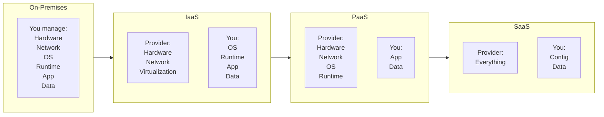
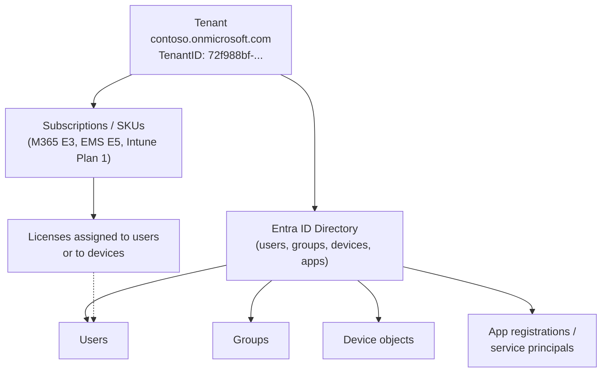
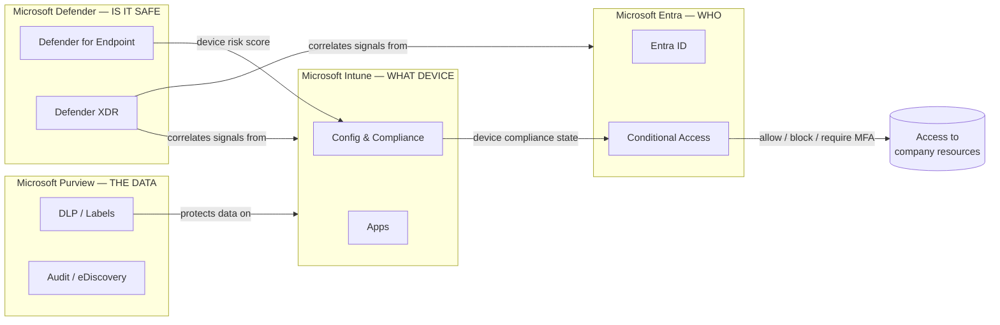
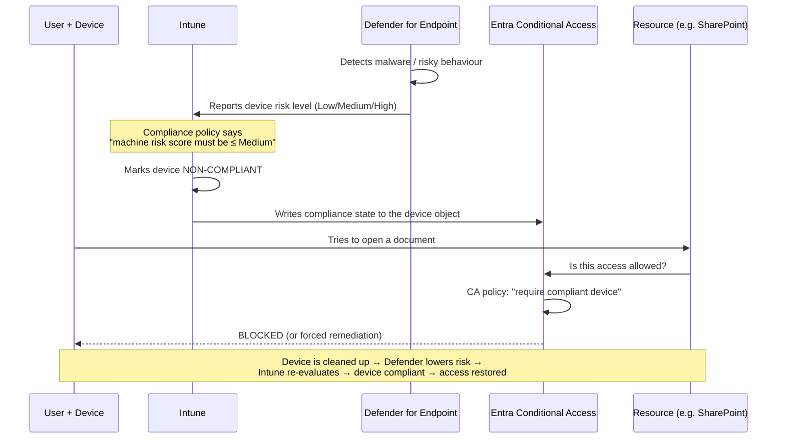
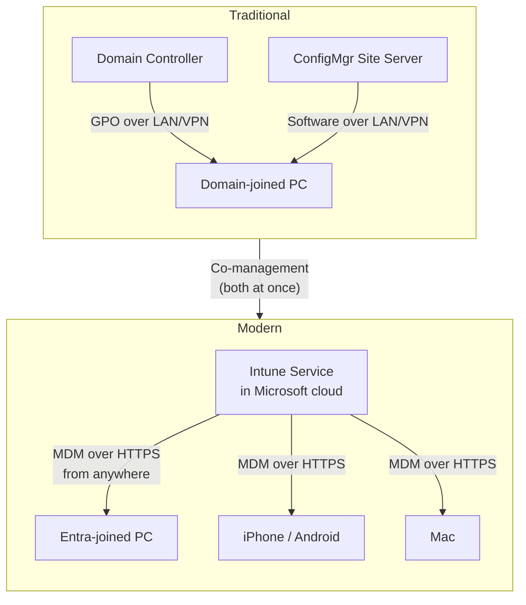
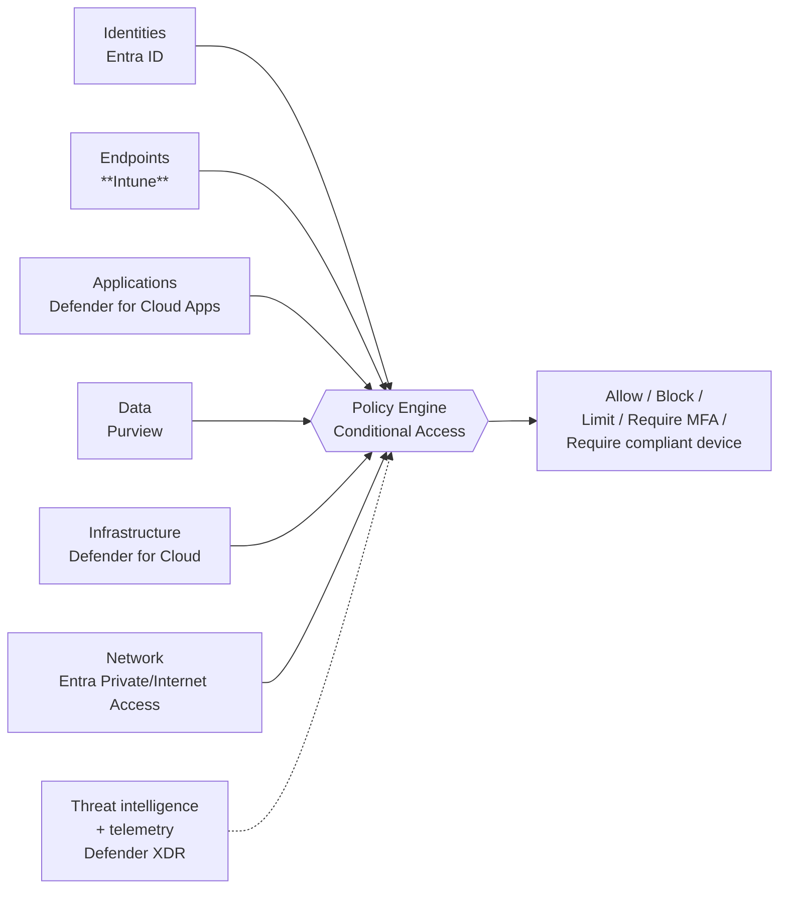
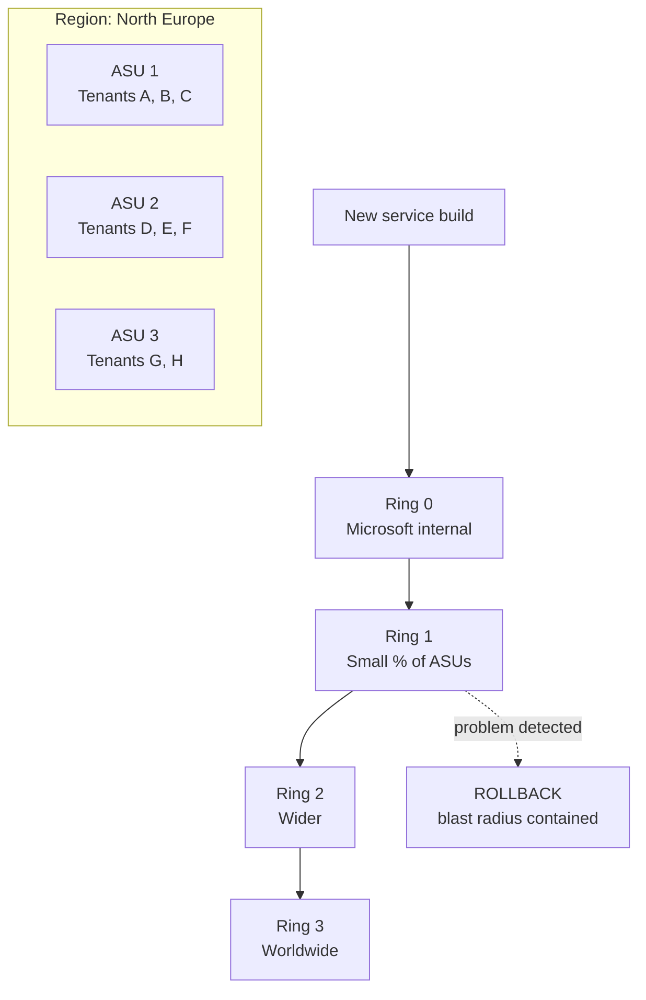

# Part A — Cloud & Modern Management Foundations

> **Section goal:** By the end of this Part you will understand what "the cloud" actually means, what a *tenant* is, what Microsoft Intune is and where it sits among Microsoft's security products, why the industry moved from domain-joined PCs to cloud-managed devices, and what Zero Trust means. Everything later in this guide builds on these words.

Covers index items **1–7**. Maps to JD requirements: *"Production experience in managing large environments using cloud-based services"*, *"Microsoft Security organization… Entra, Intune, Defender, Purview"*.

**Assumes: nothing.** Every term is defined before use.

---

## 1. What "the cloud" actually is — IaaS, PaaS, SaaS

**In one sentence:** "The cloud" means *someone else's computers, in someone else's building, that you rent over the internet instead of buying and running yourself.*

Before the cloud, if a company wanted email for 5,000 employees it had to: buy servers, put them in a room with air conditioning and backup power, install Windows Server and Exchange on them, patch them forever, back them up, and hire people to babysit them. That is called **on-premises** ("on-prem") — the computers are physically on your premises.

With the cloud, the company pays a monthly fee and Microsoft/Amazon/Google runs all of that. The company just uses it.

### 🔍 Plain-English deep-dive: the three service models

Think of it as **pizza**. You want pizza. How much do you do yourself?

| Model | Full name | What *you* manage | What the *provider* manages | Pizza analogy | Example |
|---|---|---|---|---|---|
| **On-prem** | — | Everything: building, hardware, OS, app, data | Nothing | You grow the wheat, make the dough, bake it at home | Your own Exchange server in a basement |
| **IaaS** | Infrastructure as a Service | OS, patching, app, data | Physical servers, storage, network, virtualization | You buy frozen pizza, bake it in *your* oven | Azure Virtual Machines, AWS EC2 |
| **PaaS** | Platform as a Service | Your app code and data only | Everything under the app: OS, runtime, scaling, patching | Pizza delivery — you supply the table and drinks | Azure App Service, Azure SQL Database |
| **SaaS** | Software as a Service | Your *configuration* and your *data* | Absolutely everything else | You go to the restaurant — you just eat | **Microsoft Intune**, Microsoft 365, Salesforce |

### Why this matters for a *support* engineer

**Intune is SaaS.** That has three enormous consequences you must be able to state in an interview:

1. **You cannot "restart the server."** There is no server the customer owns. Troubleshooting is about *configuration, identity, client state, and network path* — never about rebooting a box.
2. **Everyone shares the same service.** A change Microsoft makes affects thousands of customers at once. This is why *safe deployment*, *rings* and *blast radius* (Part K) are life-or-death concepts.
3. **The blame boundary is fuzzy.** When a device fails to get a policy, the fault could be in Microsoft's service, in the customer's network, in the customer's identity configuration, on the device, or in the OS. A huge part of this job is *proving which*. That's Parts I and J.

> 💡 **Interview soundbite:** "Because Intune is a multi-tenant SaaS, my first troubleshooting question is never 'is the server up' — it's 'is this the service, the tenant configuration, the network path, or the client?' Those four buckets shape my whole investigation."

---

## 2. Tenants, subscriptions, directories and licensing

These four words get confused constantly. Get them straight now.

### 🔍 Plain-English deep-dive: the vocabulary

- **Tenant** — *your organization's own private, isolated space inside Microsoft's cloud.* **Analogy:** an apartment in a huge apartment block. You share the building (Microsoft's infrastructure), plumbing and lifts, but your flat is locked and nobody else can see inside. Every tenant has a unique **Tenant ID** (a GUID like `72f988bf-86f1-41af-91ab-2d7cd011db47`) and one or more domain names (`contoso.onmicrosoft.com`, `contoso.com`). **Why it matters:** almost every support case starts with "which tenant?" — it is the top-level container for *everything*.

- **Directory** — *the database of who and what exists* in the tenant: users, groups, devices, applications. In Microsoft's cloud this is **Microsoft Entra ID** (formerly *Azure Active Directory* / Azure AD). **Analogy:** the building's resident register + key-card system. **Why it matters:** in Microsoft's cloud, tenant and directory are effectively 1:1 — one tenant has exactly one Entra ID directory.

- **Subscription** — *a billing container.* In Azure, a subscription holds resources you pay for. For Microsoft 365/Intune the equivalent is a **subscription/SKU** that grants a number of **licenses**. **Analogy:** the utilities account for the flat. **Why it matters:** "the feature is greyed out" is very often a licensing answer, not a bug.

- **License** — *a per-user (sometimes per-device) entitlement to use a service.* **Analogy:** a gym membership card per family member. **Why it matters:** an unlicensed user literally cannot enrol a device; this is one of the most common "enrollment failed" root causes.

### The licensing landscape you should be able to name

You will *not* be quizzed on price lists, but you should know the shape:

| SKU / bundle | What it includes (relevant bits) |
|---|---|
| **Microsoft Intune Plan 1** | Core Intune: MDM + MAM, configuration, compliance, apps, endpoint security. The baseline. |
| **Microsoft Intune Plan 2** | Plan 1 + Microsoft Tunnel for MAM, Intune management of specialty/frontline devices (Configuration Manager cloud-attach extras). |
| **Microsoft Intune Suite** | Plan 1 + 2 + the advanced add-ons: **Endpoint Privilege Management (EPM)**, **Remote Help**, **Advanced Endpoint Analytics**, **Microsoft Cloud PKI**, **Enterprise App Management**, **Microsoft Tunnel**. |
| **Enterprise Mobility + Security (EMS) E3/E5** | Bundles Entra ID P1/P2 + Intune + Purview Information Protection + Defender for Identity (E5). |
| **Microsoft 365 E3 / E5** | The big one: Windows Enterprise + Office apps + EMS + (E5) Defender for Endpoint P2, Defender for Office, Purview advanced, Entra ID P2. |
| **Microsoft 365 Business Premium** | SMB bundle (≤300 seats) that includes Intune Plan 1 and Defender for Business. |
| **Add-ons** | Windows 365 (Cloud PC), Microsoft Defender for Endpoint standalone, Entra ID Governance, Security Copilot. |

> 💡 **Support tip worth saying out loud:** "Before I debug an enrollment failure, I check three cheap things: is the user licensed for Intune, is the user in scope of MDM auto-enrollment, and is the device blocked by an enrollment restriction. Those three account for a very large share of 'enrollment broken' cases."

---

## 3. The Microsoft Security suite — Entra, Intune, Defender, Purview

The job description names four product families. You must be able to describe each in one sentence, plus how they connect.

### 🔍 Plain-English deep-dive: the four pillars

- **Microsoft Entra** — *identity.* Answers "**who** are you, and are you allowed in?" **Analogy:** the passport office + the door security guard. Main product: **Entra ID** (formerly Azure AD). Also includes Entra ID Governance, Entra Private Access, Entra Internet Access, Entra Permissions Management, Entra Verified ID.
- **Microsoft Intune** — *device and app management.* Answers "**what** are you connecting from, is it configured safely, and what software is on it?" **Analogy:** the fleet manager for every company car — servicing schedule, safety checks, what's allowed in the boot. Formally the family is **Microsoft Intune** (endpoint management), which also covers Configuration Manager co-management, Windows Autopilot, Endpoint Analytics, and the Intune Suite add-ons.
- **Microsoft Defender** — *threat protection.* Answers "**is something bad happening** right now?" **Analogy:** the security cameras, alarm system and guard dogs. Family members: Defender for Endpoint (devices), Defender for Office 365 (email), Defender for Identity (on-prem AD signals), Defender for Cloud Apps (SaaS usage), Defender for Cloud (Azure workloads), Defender XDR (the unified portal that correlates all of them).
- **Microsoft Purview** — *data governance, compliance and risk.* Answers "**where is our sensitive data**, who touched it, and can we prove compliance?" **Analogy:** the filing clerk + auditor + shredder policy. Includes Data Loss Prevention (DLP), Information Protection/sensitivity labels, eDiscovery, Insider Risk Management, Audit, Communication Compliance.

### The one integration you MUST be able to explain

This loop comes up in nearly every Intune interview:

> 💡 **Say this in the interview:** "Intune is the *sensor and enforcement point*, Entra Conditional Access is the *decision point*, and Defender is the *risk signal*. Compliance is the language they speak to each other. That loop — Defender risk → Intune compliance → Entra CA → resource access — is the backbone of Zero Trust on endpoints."

---

## 4. Traditional management vs Modern Management

To troubleshoot Intune you must understand what it replaced and why.

### The traditional world (still very much alive in enterprises)

- **Active Directory Domain Services (AD DS)** — an on-premises directory running on **domain controllers** (DCs). Devices are **domain joined**: they get a computer account in AD and trust the domain.
- **Group Policy (GPO)** — settings pushed from domain controllers to domain-joined Windows devices. **Analogy:** the office noticeboard — every PC walks past it every 90 minutes and does what it says.
- **Configuration Manager (ConfigMgr / SCCM / MECM)** — Microsoft's on-prem management server for deploying software, OS images, and updates at scale. **Analogy:** a warehouse and delivery fleet inside your own building.

**How they work:** the device must be *on the corporate network* (or on VPN) and must be able to reach a domain controller / management point. Everything is **pull**-based on a schedule.

### The modern world

- **Mobile Device Management (MDM)** — an internet-based standard where a device holds a *management channel* to a cloud service and receives configuration through it. Works from any network, no VPN, no domain controller.
- **Cloud identity** — the device is **Microsoft Entra joined** instead of (or as well as) domain joined.
- **Intune** is Microsoft's MDM/MAM service.

### 🔍 Plain-English deep-dive: MDM, MAM, UEM, EMM, BYOD, COPE

- **MDM (Mobile Device Management)** — *managing the whole device*: enforce a PIN, encrypt the disk, install apps, wipe it. **Analogy:** the company owns the car and sets all the rules for the car.
- **MAM (Mobile Application Management)** — *managing only the corporate apps and data inside them*, on a device you don't control. **Analogy:** the company gives you a locked briefcase to carry in *your own* car — they control the briefcase, not the car. In Intune this is **App Protection Policies (APP)**.
- **UEM (Unified Endpoint Management)** — the industry term for one console managing PCs *and* phones *and* Macs. Intune is a UEM.
- **EMM (Enterprise Mobility Management)** — older term, roughly MDM + MAM + identity.
- **BYOD (Bring Your Own Device)** — employee-owned. Usually MAM, or MDM with a lighter touch.
- **COPE / COBO / CYOD** — Corporate-Owned Personally-Enabled / Corporate-Owned Business-Only / Choose Your Own Device — ownership models that determine how heavy-handed you can be.

| | Traditional (AD + GPO + ConfigMgr) | Modern (Entra + Intune MDM) |
|---|---|---|
| **Identity** | Domain join, Kerberos/NTLM | Entra join, OAuth/OIDC tokens |
| **Network requirement** | Must reach a domain controller (LAN/VPN) | Any internet connection |
| **Settings mechanism** | Group Policy (registry-based ADMX) | CSPs via OMA-DM (see Part C) |
| **Software delivery** | ConfigMgr distribution points on your network | Intune + Azure CDN + Delivery Optimization |
| **OS deployment** | Task sequences, imaging (WIM), PXE boot | **Windows Autopilot** — no image, OEM ships direct to user |
| **Cadence** | GPO ~every 90 min + 0–30 min random; ConfigMgr policy ~every 60 min | MDM sync ~every 8 hours + push-triggered |
| **Platforms** | Windows only | Windows, iOS/iPadOS, macOS, Android, Linux |
| **Reporting** | ConfigMgr reports, WSUS | Intune reports, Graph, Endpoint Analytics, Log Analytics |
| **Who can be managed** | Employees on the corporate network | Anyone, anywhere, including BYOD |

**Co-management** is the bridge: a Windows device is *both* domain-joined+ConfigMgr-managed *and* Entra-joined+Intune-enrolled, and each **workload** (compliance policies, device configuration, Windows Update, apps, endpoint protection, Office click-to-run) is individually assigned to either ConfigMgr or Intune. Covered properly in Part E.

---

## 5. Zero Trust in one page

**In one sentence:** Zero Trust means *stop assuming anything inside the corporate network is safe; verify every single request, every time, from every device.*

The old model was a **castle and moat**: hard perimeter (firewall/VPN), soft inside. Once you were on the LAN, you were trusted. That collapsed because of cloud apps, remote work, phishing, and supply-chain attacks — attackers get *inside* the moat routinely.

### The three Zero Trust principles (memorize these three phrases)

1. **Verify explicitly** — authenticate and authorize based on *all* available signals: user identity, location, device health, service, data classification, anomalies.
2. **Use least-privilege access** — just-enough-access (JEA), just-in-time (JIT), risk-based adaptive policies, data protection.
3. **Assume breach** — segment access, minimize blast radius, encrypt end-to-end, use analytics to detect and respond.

### The six Zero Trust pillars, and where Intune sits

**Intune owns the Endpoints pillar.** Without a trustworthy device signal, "verify explicitly" is impossible — you'd be letting a fully authenticated user connect from a malware-infested machine. That is *why device compliance exists*.

> 💡 **Interview soundbite:** "Zero Trust is only as good as its device signal. Intune's job in Zero Trust is to make the statement 'this device is healthy and configured to policy' true and provable, so Conditional Access can act on it."

---

## 6. The Microsoft org map — who owns what

The JD mentions the **Customer Value Creation (CVC)** team, **Mission Critical Support**, partnering with **Software Engineering**, and coordinating **across multiple support teams**. Knowing the landscape makes you sound like an insider.

| Group | What they do | How this role interacts |
|---|---|---|
| **Product Group / Software Engineering (the "PG")** | Builds and runs the Intune service. Owns code, features, live-site health. | You review their designs for supportability, file bugs/DCRs, escalate live-site issues. |
| **CSS — Customer Service & Support** | The front-line and escalation support organization that takes customer cases. Tiers/levels of engineers. | You enable them, write TSGs for them, and receive escalations. |
| **CVC — Customer Value Creation** | The org in the JD. Sits between customers and the product group: anticipates, amplifies and systemically solves customer needs. Owns the end-to-end customer experience. | **This is your org.** |
| **Mission Critical Support (MCS) / Unified — Designated Engineer** | A premium support offering where a named engineer is assigned to one huge customer. | The JD says you will be *"the Intune technical lead for a customer in the Mission Critical Support service."* |
| **CSAM / Account teams (Customer Success Account Manager)** | Owns the commercial + success relationship with the customer. | Your partner for customer comms and escalation. |
| **FastTrack** | Deployment/onboarding assistance for eligible customers. | Hands off adoption blockers that turn into product feedback. |
| **Partners / MSPs** | Third parties managing customers' tenants (often via **GDAP** — Granular Delegated Admin Privileges). | You enable them too; delegated-admin issues are a real support category. |

### 🔍 Plain-English deep-dive: the support tiers vocabulary

- **Tier 1 / Frontline** — first responders; handle common, documented issues using **TSGs** (Troubleshooting Guides).
- **Tier 2 / Escalation Engineer** — deeper product knowledge, takes what T1 can't solve.
- **Tier 3 / Escalation to Engineering (a.k.a. "PG escalation" / ICM ticket)** — reaches the people who own the code.
- **DRI (Directly Responsible Individual)** — the on-call engineer who owns a live-site incident right now.
- **ICM (Incident Manager)** — Microsoft's internal incident-tracking system. "I'll raise an ICM" = "I'm paging the engineering on-call."
- **Problem Management** — the discipline of finding the *underlying cause of repeated incidents* and eliminating it (Part L).
- **Supportability** — how easy it is to diagnose and fix a product when it misbehaves. This role's core currency.

---

## 7. Multi-tenancy, scale and blast radius — first taste

Three ideas that shape everything about running Intune. They are covered in depth in Parts C and K; here is the vocabulary.

- **Multi-tenancy** — *many customers share the same physical service, logically isolated.* **Analogy:** an apartment block again. **Why it matters:** a bug or a bad deployment can affect many customers simultaneously; and one customer's abusive usage can theoretically affect neighbours (the **noisy neighbour** problem), which is why **throttling** exists.

- **Scale unit / stamp** — *a self-contained slice of the service* holding a subset of tenants. **Analogy:** each apartment *block* in a big estate; if one block loses water, the others are fine. Intune calls these **ASUs (Account Scale Units)**, and each tenant lives on one. **Why it matters:** an incident may affect only some scale units — so "Intune is down" is usually really "Intune is down for tenants on ASU-x in region-y." Knowing your customer's scale unit is a genuine MCS-engineer skill.

- **Blast radius** — *how many customers/devices a change can hurt if it's wrong.* **Analogy:** how big a hole the bomb makes. **Why it matters:** it is the reason changes ship in **rings** (internal → early adopters → broad) rather than everywhere at once. This is called **SDP — Safe Deployment Practice**.

- **Throttling** — *deliberately slowing or rejecting requests* beyond a limit, to protect the service. **Analogy:** a nightclub with a one-in-one-out door policy. **Why it matters:** a script hammering Microsoft Graph will get **HTTP 429 Too Many Requests** with a `Retry-After` header. Recognising 429 instantly marks you out as someone who has worked at scale.

---

## 📌 Part A quick-reference sheet

| Term | One-line meaning |
|---|---|
| IaaS / PaaS / SaaS | Rent servers / rent a platform / rent finished software. Intune = SaaS. |
| Tenant | Your organization's isolated space in Microsoft's cloud; identified by a Tenant ID GUID. |
| Entra ID | The cloud directory (users, groups, devices, apps). Formerly Azure AD. |
| Intune | Microsoft's cloud endpoint management (MDM + MAM) service. |
| Defender | Threat protection family; feeds device risk into Intune compliance. |
| Purview | Data governance/compliance family. |
| MDM | Manage the whole device. |
| MAM / App Protection Policy | Manage only corporate data inside apps, without managing the device. |
| UEM | One console for PCs + phones + Macs. Intune is a UEM. |
| GPO | Traditional on-prem Windows settings mechanism, needs a domain controller. |
| ConfigMgr / SCCM | Traditional on-prem management server; can co-manage with Intune. |
| Co-management | Windows device managed by ConfigMgr *and* Intune, workload by workload. |
| Autopilot | Cloud provisioning of new Windows PCs without imaging. |
| Zero Trust | Verify explicitly, least privilege, assume breach. |
| Conditional Access | Entra's policy engine: the decision point for access. |
| Compliance | Intune's judgement of whether a device meets the rules; the signal CA consumes. |
| ASU / scale unit | A slice of the service holding a subset of tenants. |
| Blast radius | How many customers a bad change can hurt. |
| SDP | Safe Deployment Practice — ship in rings to limit blast radius. |
| Throttling / HTTP 429 | Service protecting itself by rejecting excess requests. |
| CVC | Customer Value Creation — the org this role sits in. |
| CSS | Customer Service & Support — the front-line support org. |
| MCS / Designated Engineer | Premium support; a named engineer owns one major customer. |
| ICM | Microsoft's internal incident management system. |
| DRI | Directly Responsible Individual — the on-call owner of an incident. |
| TSG | Troubleshooting Guide. |
| DCR | Design Change Request. |

---

## ⭐ Likely Interview Questions for This Section

**Q1. "What is Microsoft Intune, in one or two sentences?"**
> *Model answer:* "Intune is Microsoft's cloud-based unified endpoint management service. It enrols Windows, iOS/iPadOS, macOS, Android and Linux devices, pushes configuration and security policy to them, deploys and protects applications, and reports device compliance — and that compliance signal is what Entra Conditional Access uses to allow or block access to company resources. It also does app-level management (MAM) for devices that aren't enrolled at all."

**Q2. "Intune is SaaS. What does that change about how you troubleshoot it?"**
> *Model answer:* "There's no server for the customer to restart, so I never think in terms of 'is the box up'. I think in four buckets: is it the *service* (check Service Health and Message Center, and whether it's scoped to a scale unit or region), the *tenant configuration* (licences, policy assignments, enrollment restrictions, Conditional Access), the *network path* (endpoints, proxy, TLS inspection, DNS), or the *client* (enrollment state, MDM/IME logs, OS health). Multi-tenancy also means I always ask 'is this one tenant or many?' — that single question decides whether I'm filing a support case or paging live site."

**Q3. "Explain the difference between MDM and MAM, and when you'd choose each."**
> *Model answer:* "MDM manages the whole device — you enrol it and you can enforce encryption, PINs, restrictions, deploy apps and wipe the device. MAM manages only the corporate data inside specific apps: you can require a PIN on the app, block copy-paste to personal apps, and selectively wipe only company data — without touching anything personal. You choose MDM for corporate-owned devices where you need full control and full compliance signal. You choose MAM for BYOD, contractors, or countries/works councils where enrolling a personal device isn't acceptable. They aren't exclusive — you can apply App Protection Policies to enrolled devices too, and 'MAM-WE' means MAM without enrollment."

**Q4. "How do Intune, Entra ID and Defender for Endpoint work together?"**
> *Model answer:* "Defender for Endpoint detects threats on the device and produces a machine risk score. Intune consumes that risk score in a compliance policy — for example 'device is non-compliant if risk is High'. Intune writes the resulting compliance state onto the Entra device object. Entra Conditional Access then makes the access decision: 'require a compliant device to reach SharePoint'. So Defender is the *signal*, Intune is the *policy and enforcement point for the device*, and Conditional Access is the *decision point for access*. Once the device is remediated the loop reverses automatically and access is restored."

**Q5. "A customer says 'Intune is down.' What are your first three questions?"**
> *Model answer:* "One — what exactly is failing, for how many devices/users, and since when? 'Down' usually means one scenario, like enrollment or app install, not the whole service. Two — is it one tenant or multiple? I'd check the Service Health Dashboard and Message Center, and internally whether the impact correlates with a scale unit, region or a recent deployment ring. Three — what changed on their side: a Conditional Access policy, a proxy/TLS-inspection change, an expired APNs certificate or SCEP/NDES certificate, a licence change. If it's isolated to one tenant with a clear config change, it's a case; if I see a cross-tenant pattern, I escalate to live site immediately, because time-to-detect is what matters there."

**Q6. "What is Zero Trust and where does endpoint management fit?"**
> *Model answer:* "Zero Trust replaces 'trust the network' with 'verify every request'. Three principles: verify explicitly using all signals, grant least-privilege access, and assume breach. It has six pillars — identity, endpoints, apps, data, infrastructure, network — and Intune owns endpoints. Its job is to make 'this device is healthy and configured to policy' a true, provable, real-time statement, because without a trustworthy device signal the 'verify explicitly' principle is hollow — you'd be admitting an authenticated user from a compromised machine."

**Q7. "What's the difference between managing devices with Group Policy and with Intune?"**
> *Model answer:* "Group Policy needs the device to be domain-joined and able to reach a domain controller, so it needs the corporate network or VPN, and it's Windows-only. It applies registry-based settings roughly every 90 minutes. Intune is internet-based: the device holds an MDM channel over HTTPS to a cloud service and can be managed from anywhere, on any of five platforms, with push-triggered plus scheduled syncs. Under the covers Intune uses CSPs — Configuration Service Providers — rather than ADMX registry policy, though Intune can deliver ADMX-backed settings too. In practice large enterprises run both via co-management, moving one workload at a time, and Intune has Group Policy Analytics to help map existing GPOs to their Intune equivalents."

**Q8. "What is a tenant, and why does it matter operationally?"**
> *Model answer:* "A tenant is an organization's isolated instance of Microsoft's cloud, with its own Entra ID directory and a unique Tenant ID GUID. Operationally it matters because it's the boundary for everything: identity, licensing, policy, RBAC, data residency and support. Every case starts with 'which tenant ID', because that determines which scale unit and region the customer is served from — which in turn tells me whether an incident could plausibly affect them."

**Q9. "You said Intune is multi-tenant. What risks does that create and how does Microsoft manage them?"**
> *Model answer:* "Three risks: noisy neighbours consuming shared capacity, correlated failure where one bad change hits many customers, and data isolation. They're managed by throttling and service limits — Graph returns HTTP 429 with Retry-After when you exceed them; by partitioning tenants across scale units so failures are contained; and by Safe Deployment Practices, where changes roll out in rings with health signals and automatic rollback so the blast radius stays small. As a support engineer, the practical consequence is that I always try to establish scope — one tenant, one scale unit, or global — before I decide what kind of problem I'm looking at."

**Q10. "Name the Microsoft Security product families and what each is for."**
> *Model answer:* "Entra is identity — who you are and whether you're allowed in, including Conditional Access. Intune is endpoint management — what device you're on and whether it's configured safely. Defender is threat protection — Defender for Endpoint, Office 365, Identity, Cloud Apps and Cloud, unified in Defender XDR. Purview is data governance and compliance — DLP, sensitivity labels, eDiscovery, insider risk, audit. They interlock: Defender supplies risk signals, Intune supplies device state, Entra makes access decisions, Purview protects the data itself."

---

## 🧠 30-Second Memory Hooks

- **Cloud models** = pizza: IaaS = frozen pizza in *your* oven · PaaS = delivery · SaaS = restaurant. **Intune = restaurant.**
- **Tenant** = your locked flat in Microsoft's apartment block. **Tenant ID** = the flat number.
- **Entra = WHO · Intune = WHAT DEVICE · Defender = IS IT SAFE · Purview = THE DATA.**
- **The Zero Trust loop:** Defender *signals* → Intune *judges compliance* → Entra CA *decides access*.
- **MDM = the whole car. MAM = the locked briefcase in your own car.**
- **Zero Trust in 3 words:** Verify · Least-privilege · Assume-breach.
- **Old world needs a domain controller. New world needs only the internet.**
- **Blast radius** = how big a hole a bad change makes → that's why **rings** exist.
- **HTTP 429** = "you're throttled, back off and honour `Retry-After`."
- **First question of every case:** one tenant, or many? That splits *support case* from *live site*.

---

*Next suggested section:* **[Part B — Identity & Access with Microsoft Entra ID](Part-B-entra-identity-and-access.md)** — because *nothing* in Intune works until identity works: enrollment, compliance, Conditional Access and app deployment all start with a user and a device object in Entra.
