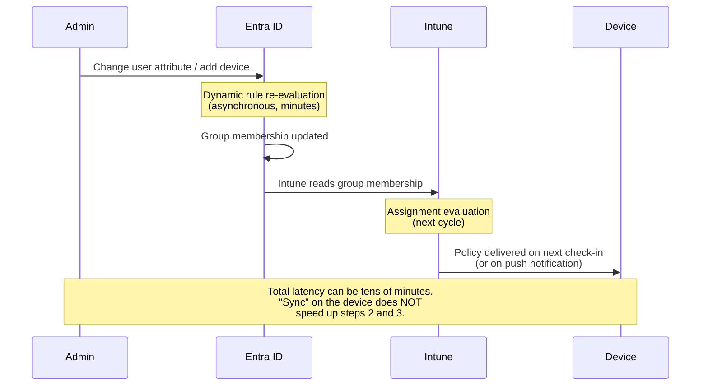
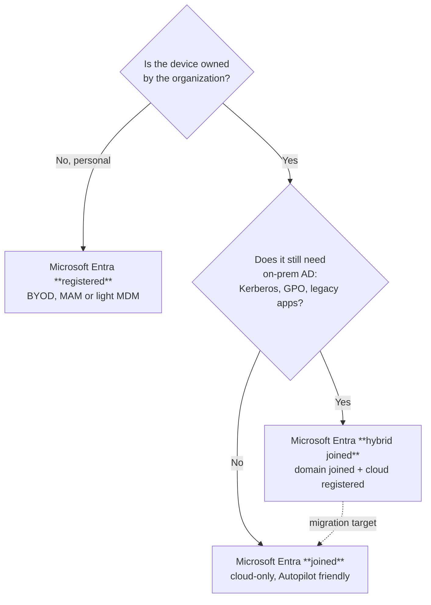
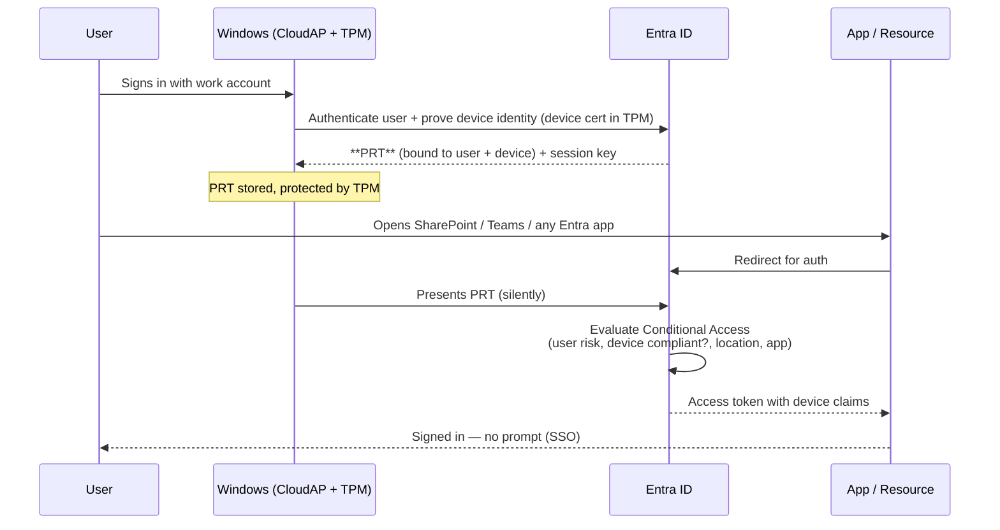
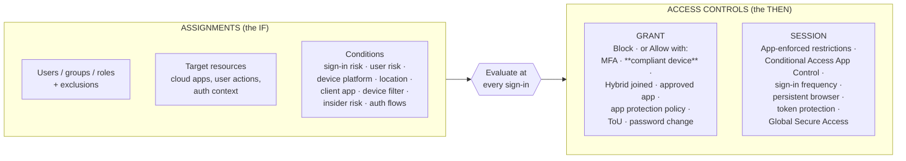
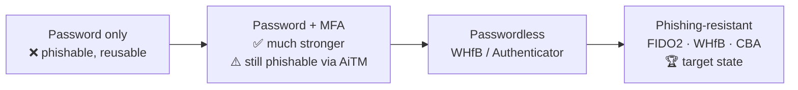
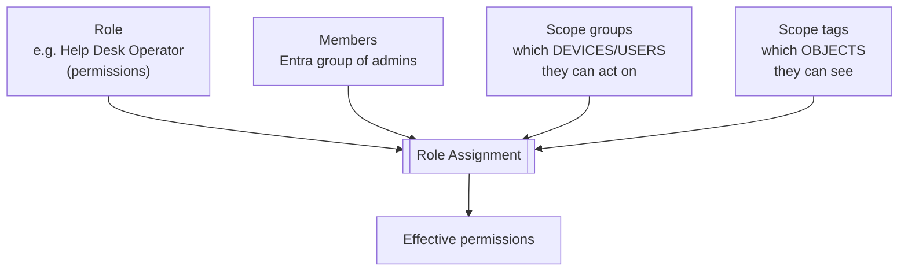
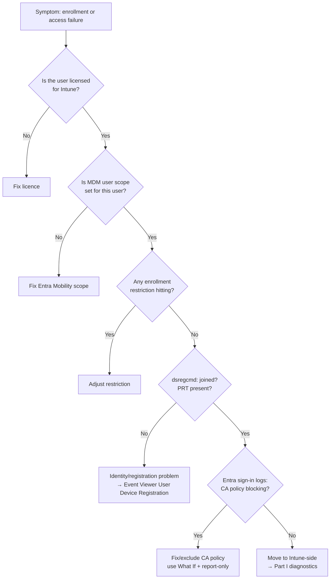

# Part B — Identity & Access with Microsoft Entra ID

> **Section goal:** Identity is the foundation of everything in Intune. If you cannot explain the difference between Entra *registered*, *joined* and *hybrid joined*, or what a Primary Refresh Token is, you cannot troubleshoot enrollment, Conditional Access, or single sign-on. By the end of this Part you will be able to reason about *any* "it says I'm not allowed" problem.

Covers index items **8–15**. Maps to JD: *"Microsoft Entra"*, *"sound troubleshooting skills"*, *"Client Side Support"*.

**Assumes:** [Part A](Part-A-cloud-and-modern-management.md) (tenant, directory, licence, MDM).

---

## 8. Directory basics — users, groups, and dynamic membership

**Microsoft Entra ID** (formerly Azure Active Directory / Azure AD) is the cloud directory: the authoritative list of **who** and **what** exists in the tenant.

### The object types you must know

| Object | What it is | Why Intune cares |
|---|---|---|
| **User** | A person's account (`amit@contoso.com`). Has a UPN, object ID (GUID), licences. | Policies and apps are assigned to users; licence check happens here. |
| **Group** | A collection of users and/or devices. | *Everything* in Intune is assigned to groups, never to individuals (best practice). |
| **Device** | An object representing a machine, with a device ID, OS, join type, owner, and **compliance state**. | Conditional Access reads compliance from here. |
| **Application / Service principal** | An app that can sign in or be signed into. | Graph automation, connectors, LOB apps. |
| **Administrative unit (AU)** | A sub-container of users/groups/devices for scoping admin rights (e.g. "EMEA"). | Delegated administration in large orgs. |

### 🔍 Plain-English deep-dive: UPN vs email vs SAMAccountName

- **UPN (User Principal Name)** — *the sign-in name, in email format*: `amit@contoso.com`. **Analogy:** your passport number written as an email. **Why it matters:** the UPN is what the user types to sign in and what Intune shows. It is *not necessarily* the same as the user's email address, and in hybrid environments a UPN mismatch between on-prem AD and Entra ID is a classic cause of enrollment and SSO failures.
- **SAMAccountName** — the legacy pre-Windows-2000 logon name (`CONTOSO\amit`). Only exists on-prem.
- **Object ID** — a GUID that never changes. **Why it matters:** in logs and Graph, objects are referenced by GUID, not by name. Learning to pivot on GUIDs is a core support skill.
- **Immutable ID / sourceAnchor** — the value that ties an on-prem AD object to its cloud counterpart during directory sync. **Why it matters:** a broken immutable ID creates *duplicate* objects, one synced and one cloud-only — a nasty, real-world support scenario.

### Static vs dynamic groups

- **Assigned (static) group** — you add members manually. Predictable, but doesn't scale.
- **Dynamic group** — membership is calculated from a **rule** over object attributes. Entra re-evaluates automatically.

```
# Dynamic USER group — all sales staff in the UK
(user.department -eq "Sales") and (user.country -eq "GB")

# Dynamic DEVICE group — all corporate Windows devices
(device.deviceOSType -eq "Windows") and (device.deviceOwnership -eq "Company")

# Dynamic DEVICE group — all Autopilot devices with a specific Group Tag
(device.devicePhysicalIds -any (_ -eq "[OrderID]:Finance"))
```

> 🔍 **Why the last one matters:** Windows Autopilot stores its **Group Tag** in the device's `devicePhysicalIds` attribute as `[OrderID]:<tag>`. This is *the* standard way to target Autopilot profiles at a subset of devices, and it appears in interviews constantly. (More in [Part D](Part-D-enrollment-and-autopilot.md).)

**The classic support trap:** dynamic group membership is *not* instant. Evaluation is asynchronous and can take minutes (occasionally longer in very large tenants), and Intune then has to pick up the change on its own cycle. "I added the device to the group and nothing happened" is very often *just latency*, and knowing that saves hours.



---

## 9. Device identity — registered vs joined vs hybrid joined

**This is the single most misunderstood topic in Intune support. Learn it cold.**

There are three ways a device can relate to Entra ID.

### 🔍 Plain-English deep-dive: the three join types

- **Entra ID registered** (formerly "Azure AD registered", also "workplace joined") — *the device is known to the directory, but the user signs into the device with a personal or local account.* **Analogy:** you registered your own car with the office car park so the barrier lets you in — but it's still your car and the company doesn't set the radio station. **Typical use:** BYOD phones and personal PCs. **Sign-in:** local/Microsoft account; work account added as a *secondary* identity via *"Access work or school"*.

- **Microsoft Entra joined** (formerly "Azure AD joined") — *the device belongs to the organization and users sign into Windows with their work account.* **Analogy:** a company car — the company owns it, you drive it with your employee badge. **Typical use:** modern corporate Windows devices, Autopilot, Cloud PCs. **Sign-in:** `amit@contoso.com` at the Windows logon screen. No on-prem domain involved.

- **Microsoft Entra hybrid joined** (formerly "hybrid Azure AD joined") — *the device is joined to the on-premises Active Directory domain **and** registered in Entra ID.* **Analogy:** a company car that also has a car-park pass for the new building — it answers to both the old and the new landlord. **Typical use:** enterprises mid-migration who still need Kerberos to on-prem file servers/apps and still use Group Policy. **Sign-in:** domain credentials, which are also usable in the cloud.

| | Entra registered | Entra joined | Entra hybrid joined |
|---|---|---|---|
| **Owner** | User (BYOD) | Organization | Organization |
| **On-prem AD domain join?** | No | No | **Yes** |
| **Windows sign-in identity** | Local / MSA (work account added separately) | Work account | Domain account (= work account) |
| **Group Policy applies?** | No | No | **Yes** |
| **Gets a PRT?** | Yes (for the work identity) | Yes | Yes |
| **How it's set up** | Settings → Access work or school → *Connect* | OOBE / Settings → *Join this device to Microsoft Entra ID* / Autopilot | Domain join + Entra Connect sync + SCP configuration; auto-registers |
| **MDM enrollment** | Optional, usually MAM instead | Automatic via MDM auto-enrollment | Via GPO/ConfigMgr-triggered auto-enrollment or Entra auto-enrollment |
| **Supported OS** | Windows 10/11, iOS, Android, macOS | Windows 10/11 (+ Windows Server for some scenarios) | Windows 10/11, down-level Windows with limits |
| **Typical failure mode** | Work account token expiry; wrong account used | Enrollment restrictions, licence missing | SCP misconfig, sync issues, service connection point, dsregcmd shows AzureAdJoined=NO |



### The one command every Intune supporter runs

On a Windows device, in a command prompt:

```
dsregcmd /status
```

This prints the device's identity state. The lines that matter:

| Field | Meaning | What "bad" looks like |
|---|---|---|
| `AzureAdJoined` | Is it Entra joined (or hybrid joined)? | `NO` when it should be `YES` |
| `EnterpriseJoined` | Joined to on-prem AD FS-style enterprise registration | Rarely used |
| `DomainJoined` | Joined to an on-prem AD domain | `YES` + `AzureAdJoined: YES` = hybrid |
| `WorkplaceJoined` | Entra **registered** (secondary work account present) | — |
| `DeviceId` | The Entra device object GUID | Empty = not registered at all |
| `TenantName` / `TenantId` | Which tenant | Wrong tenant = wrong credentials used |
| `AzureAdPrt` | Is there a valid **Primary Refresh Token**? | `NO` → SSO and Conditional Access break |
| `AzureAdPrtUpdateTime` / `ExpiryTime` | PRT freshness | Very old = stale |
| `MdmUrl` / `MdmEnrollmentUrl` | The MDM enrollment endpoints published in Entra | Empty → auto-enrollment won't trigger |
| **`Device State` → `DeviceAuthStatus`** | Can the device authenticate itself? | `FAILED. Device is either disabled or deleted` |
| **SSO State** | PRT + Kerberos state | Diagnostics section lists last error codes |
| **Diagnostic Data** section | Last registration attempt errors | The actual error code lives here |

> 💡 **Interview gold:** "For any Windows identity or enrollment problem, `dsregcmd /status` is my first command. It tells me the join type, the device ID, the tenant, whether there's a valid PRT, the MDM URLs, and the last registration error — all in one screen. If `AzureAdJoined` is NO or `AzureAdPrt` is NO, I stop looking at Intune and start looking at identity."

---

## 10. Authentication vs authorization, tokens, and the PRT

### 🔍 Plain-English deep-dive: authN vs authZ

- **Authentication (authN)** — *proving who you are.* **Analogy:** showing your passport at the airport desk.
- **Authorization (authZ)** — *deciding what you're allowed to do.* **Analogy:** your boarding pass says economy, so you can't sit in business class.
- **Identity provider (IdP)** — the service that performs authentication and issues tokens. Here: **Entra ID**.
- **Token** — *a signed digital note that says "this user is authenticated and may do X, until time Y."* **Analogy:** a festival wristband. It's issued once, then reused, and it expires.

### The protocols, in one page

- **OAuth 2.0** — an **authorization** framework: how an app gets permission to call an API *on your behalf* without ever seeing your password. Produces **access tokens**.
- **OpenID Connect (OIDC)** — a thin **authentication** layer *on top of* OAuth 2.0. Adds the **ID token**, which describes *who the user is*.
- **SAML** — an older XML-based standard, still widely used for federated web SSO with third-party apps.
- **Kerberos / NTLM** — the on-premises Windows authentication protocols. Kerberos uses tickets (TGT + service tickets) and requires line-of-sight to a domain controller.
- **WS-Trust / WS-Fed** — legacy federation protocols (AD FS).

### The three tokens

| Token | Contains | Lifetime (typical) | Used for |
|---|---|---|---|
| **ID token** (OIDC) | Who the user is (claims: name, UPN, object ID, tenant) | Short | The app learns the user's identity |
| **Access token** (OAuth2) | What the bearer may do (scopes/roles, audience, expiry) | ~60–90 min (variable) | Calling an API, e.g. Microsoft Graph |
| **Refresh token** | The right to get *new* access tokens without re-authenticating | Long (rolling, up to 90 days by default; revocable) | Silent renewal |

### 🔍 Plain-English deep-dive: the Primary Refresh Token (PRT)

- **What it is:** a special refresh token issued to a **Windows device** at user sign-in, bound to *both* the user and the device, and protected by the device's **TPM** (Trusted Platform Module — a security chip that stores keys so they can't be copied off the machine).
- **Analogy:** an all-access backstage pass that the venue tapes to your wrist *and* to your specific seat. It proves both "you are you" and "you're on this exact device."
- **What it does:** gives **single sign-on** across all Entra-integrated apps on that device (browser and native), and it carries the **device claim** that Conditional Access needs to say "this request comes from a managed, compliant device."
- **Why it matters:** *no PRT = no device-based Conditional Access and no seamless SSO.* Users suddenly get repeated prompts or "you can't get there from here" blocks. `dsregcmd /status` shows `AzureAdPrt : YES/NO`.
- **How it breaks:** device disabled or deleted in Entra; TPM problems or TPM cleared; the user changed their password on another device; broken time sync (Kerberos/tokens are time-sensitive — clock skew beyond ~5 minutes breaks things); network can't reach `login.microsoftonline.com`; the user signed in with a local account rather than the work account.



---

## 11. Conditional Access — the decision point

**In one sentence:** Conditional Access (CA) is Entra ID's policy engine: a set of **if-then** statements evaluated at every sign-in.

**Analogy:** the bouncer's rulebook. *If* you're on the guest list, *and* you're over 18, *and* you're not wearing trainers, *then* you may enter — otherwise, denied, or "come back with ID."

### The anatomy of a CA policy



### The three controls that Intune produces

1. **Require device to be marked as compliant** — reads the Intune compliance state on the Entra device object.
2. **Require Microsoft Entra hybrid joined device** — reads the join type.
3. **Require app protection policy** — the device need not be enrolled; the *app* must be under an Intune App Protection Policy.

> ⚠️ **The most common CA + Intune failure:** the device *is* compliant in the Intune portal, but access is still blocked. Causes, in order of likelihood: (a) the compliance state hasn't propagated to Entra yet, (b) the user's token predates compliance — they need to sign out/in to get a fresh token with the device claim, (c) the device object in Entra is a *different* object from the one in Intune (duplicate registration), (d) the browser is not passing the device claim (e.g. a non-supported browser, or missing Windows Accounts extension in Chrome), (e) the platform doesn't support the control (e.g. Linux/unsupported).

### Other CA concepts to be able to name

- **Report-only mode** — the policy is evaluated and logged but not enforced. *Always* the first step of any CA change; the "test in production safely" tool.
- **What If tool** — simulate a sign-in and see which policies apply. Great for support.
- **Break-glass / emergency access accounts** — 2+ cloud-only global admin accounts excluded from all CA policies, with long random passwords stored securely. **Why:** a bad CA policy can lock every admin out of the tenant. *Being able to say this unprompted signals real operational maturity.*
- **Named locations** — IP ranges or countries used as conditions (e.g. "trusted office IPs").
- **Continuous Access Evaluation (CAE)** — instead of waiting for a token to expire (~1 hour), Entra pushes critical events (account disabled, password change, high user risk, network location change) to supporting resources so access is revoked in near-real-time. **Analogy:** revoking the wristband while the person is still inside the venue.
- **Token protection (token binding)** — cryptographically binds a token to the device it was issued to, so a stolen token can't be replayed elsewhere.
- **Sign-in logs** — the ground truth. Every sign-in shows which CA policies applied, and *why* it succeeded or failed, including the **failure reason code**.
- **Security defaults** — a simple all-or-nothing baseline for small tenants; mutually exclusive with CA policies.

> 💡 **Interview soundbite:** "For any 'access denied' case I go straight to the Entra **sign-in logs**, find the exact sign-in, and open the **Conditional Access** tab — it lists every policy and its result: applied, not applied, or failed, and which control failed. That converts guesswork into a two-minute answer. Then I use **What If** to confirm the fix before I change anything, and I roll out CA changes in **report-only** mode first."

---

## 12. MFA, passwordless, Windows Hello, FIDO2

- **MFA (Multi-Factor Authentication)** — proving identity with two or more of: *something you know* (password), *something you have* (phone, token, device), *something you are* (fingerprint, face). **Why it matters:** MFA blocks the overwhelming majority of password-based attacks.
- **Authentication methods** — Microsoft Authenticator app (push + number matching), FIDO2 security keys, Windows Hello for Business, certificate-based auth, OATH hardware/software tokens, SMS/voice (weakest — being phased out).
- **Number matching / additional context** — anti-MFA-fatigue: the user must type a number shown on screen, and sees app + location.
- **Passwordless** — sign in with something better than a password: Windows Hello for Business, FIDO2 key, passkeys, or Authenticator phone sign-in.
- **Windows Hello for Business (WHfB)** — a private key stored in the device's **TPM**, unlocked by a PIN or biometric. **Critical nuance for interviews:** *the PIN never leaves the device and is not a password* — it unlocks a device-bound private key, so it's useless to an attacker who steals it remotely. Deployment models: cloud Kerberos trust (recommended), key trust, certificate trust.
- **TAP (Temporary Access Pass)** — a time-limited passcode that lets a user bootstrap a passwordless method or recover access. Very relevant to Autopilot self-deploying/onboarding scenarios.
- **Conditional Access authentication strength** — require a *specific* strength (e.g. "phishing-resistant MFA") rather than just "MFA".



---

## 13. RBAC in Intune — roles, scope tags, delegated admin

**RBAC (Role-Based Access Control)** = *who can do what, to which objects.*

### Two RBAC systems overlap — know both

1. **Entra ID roles** — tenant-wide directory roles. Relevant ones: **Global Administrator** (everything — use sparingly), **Intune Administrator** (full Intune control), **Global Reader**, **Security Administrator**, **Security Reader**, **Cloud Device Administrator**, **Privileged Role Administrator**.
2. **Intune RBAC roles** — scoped inside Intune, much more granular. Built-ins include: **Help Desk Operator**, **Policy and Profile Manager**, **Application Manager**, **Read Only Operator**, **Endpoint Security Manager**, **School Administrator**, **Intune Role Administrator**. You can also build **custom roles** by picking individual permissions.

### 🔍 Plain-English deep-dive: scope tags

- **What it is:** a label you put on Intune objects (policies, apps, devices) *and* on role assignments, so an admin can only see and act on the objects carrying their tag.
- **Analogy:** colour-coded keys in a hotel. The EMEA housekeeper's key only opens EMEA-tagged rooms.
- **Why it matters:** it's how a global company lets the India helpdesk manage Indian devices without seeing US devices. Every Intune RBAC assignment has three pieces: **role** (what you can do), **members** (who has it), **scope (groups + tags)** (what you can do it to).
- **Gotcha:** objects with no scope tag get the **Default** tag. An admin scoped only to "EMEA" will *not* see untagged objects. This causes "the policy disappeared!" tickets.



### Other access-governance terms worth knowing

- **PIM (Privileged Identity Management)** — just-in-time elevation: an admin is *eligible* for a role and activates it for a few hours with approval and MFA. Reduces standing privilege.
- **GDAP (Granular Delegated Admin Privileges)** — how partners/MSPs get time-bound, least-privilege access to a customer tenant (replaced the old all-or-nothing DAP).
- **Administrative Units** — Entra-side scoping containers, complementary to Intune scope tags.
- **Least privilege** — say it, mean it: helpdesk gets Help Desk Operator, not Global Admin.

---

## 14. Service principals, app registrations, and Microsoft Graph

### 🔍 Plain-English deep-dive

- **App registration** — *the definition of an application* in your tenant: its ID, its redirect URIs, and what permissions it requests. **Analogy:** the blueprint/company registration for a business.
- **Service principal** — *the local instance/identity of that application inside a tenant*, which actually gets permissions granted to it. **Analogy:** the branch office that actually operates and holds the keys. One app registration → a service principal in each tenant that consents to it.
- **Managed identity** — a service principal whose credentials Azure manages for you (no secrets to rotate). **Analogy:** a company car with the keys built into your badge.
- **Client secret / certificate** — the app's "password". Certificates are preferred; secrets expire and *expired secrets are a very common cause of "our automation stopped working overnight"*.
- **Consent** — an admin (or user) approving the permissions an app requests. **Admin consent** is required for app-only and high-privilege permissions.

### Microsoft Graph

**Microsoft Graph** is *the single REST API for all Microsoft 365 and Entra data*, at `https://graph.microsoft.com`. **The Intune admin center is itself a Graph client** — everything you can click, you can script.

- **Endpoints:** `/v1.0` (stable) and `/beta` (preview; many Intune features live here first — say this, it shows familiarity).
- **Intune resources live under** `deviceManagement/…`, e.g. `deviceManagement/managedDevices`, `deviceManagement/deviceConfigurations`, `deviceManagement/deviceCompliancePolicies`, `deviceAppManagement/mobileApps`.
- **Permission types:**
  - **Delegated** — the app acts *as the signed-in user*; effective permission = intersection of app permission and user's own rights.
  - **Application (app-only)** — the app acts *as itself*, no user; used for unattended automation. Needs admin consent.
- **Tooling:** Graph Explorer (browser), the **Microsoft Graph PowerShell SDK** (`Connect-MgGraph`, `Get-MgDeviceManagementManagedDevice`), and raw REST with an access token.
- **Throttling:** Graph returns **HTTP 429** with a `Retry-After` header. Well-behaved scripts honour it with exponential backoff.
- **Common status codes:** `401` (not authenticated — bad/expired token), `403` (authenticated but not authorized — missing scope/consent), `404`, `409` (conflict), `429` (throttled), `503` (service unavailable).

> 💡 **Support superpower:** many Intune data points are *only* visible via Graph (or only in `/beta`). Being able to say "I'd pull that from `deviceManagement/managedDevices` with a `$filter` and confirm what the service actually holds, rather than trusting the portal's cached view" is a strong signal.

---

## 15. Common identity-caused Intune failures

This table is worth memorizing; it lets you answer "the device won't enrol" questions with real specifics.

| Symptom | Likely identity root cause | How to prove it |
|---|---|---|
| Enrollment fails immediately, "your organization does not support this" | User not licensed for Intune; or MDM user scope = None/limited group | Check licences on the user; Entra → Mobility (MDM and MAM) → Microsoft Intune → MDM user scope |
| Enrollment fails after credentials | Device enrollment **restriction** blocks platform/version/personal devices | Intune → Devices → Enrollment → Restrictions |
| `dsregcmd` shows `AzureAdJoined: NO` on a device that should be joined | Registration failed; check the Diagnostic Data section error | `dsregcmd /status`, Event Viewer → *User Device Registration* |
| Hybrid join never completes | SCP (Service Connection Point) not configured; Entra Connect not syncing the computer object; device on a network that can't reach Entra | `dsregcmd /status`, Entra Connect sync status, check SCP in AD |
| SSO prompts constantly | No PRT (`AzureAdPrt: NO`); TPM issue; password changed elsewhere; clock skew | `dsregcmd /status`, check time sync, sign out/in |
| Compliant device still blocked by CA | Stale token (no device claim yet); duplicate device object; browser not passing device state | Entra sign-in logs → Conditional Access tab; compare device IDs in Intune vs Entra |
| Some users get policy, others don't | Group membership latency; dynamic rule wrong; user vs device targeting mismatch; **filters** excluding them | Check group membership; Intune per-user assignment/"policy" view |
| Admin can't see a policy they created | Scope tag mismatch | Check scope tags on the object and on the admin's role assignment |
| Automation stopped working overnight | App registration **client secret expired**; consent revoked; permission changed | Entra → App registrations → Certificates & secrets; sign-in logs for the service principal |
| Duplicate/stale device objects | Re-imaged devices, wipe-and-reuse, immutable ID mismatch | Entra devices list filtered by name; Intune device list; clean-up rules |
| Users can enrol devices they shouldn't | Device enrollment limit; "Users may join devices to Microsoft Entra" set to All | Entra → Devices → Device settings |
| Guest/B2B user can't be targeted | Guests generally can't enrol; licensing/identity model differs | Check user type |



---

## 📌 Part B quick-reference sheet

| Term | One-line meaning |
|---|---|
| Entra ID | Microsoft's cloud directory (formerly Azure AD). |
| UPN | Sign-in name in email format; not always the email address. |
| Object ID | Immutable GUID for any directory object; what logs use. |
| Dynamic group | Membership computed from an attribute rule; evaluation is asynchronous. |
| Group Tag (Autopilot) | Stored in `devicePhysicalIds` as `[OrderID]:<tag>`; used in dynamic device rules. |
| Entra registered | Device known to the directory; user signs in with a personal/local account. BYOD. |
| Entra joined | Organization-owned, cloud-only; user signs into Windows with the work account. |
| Entra hybrid joined | Domain joined **and** Entra registered; still gets Group Policy. |
| `dsregcmd /status` | The one command that shows join type, device ID, tenant, PRT and MDM URLs. |
| OAuth 2.0 / OIDC | Authorization framework / authentication layer on top of it. |
| Access token | Short-lived proof of what you may do. |
| Refresh token | Long-lived right to get new access tokens. |
| **PRT** | Device+user-bound refresh token in the TPM; powers SSO and the device claim for CA. |
| TPM | Security chip that stores keys so they can't be exported. |
| Conditional Access | Entra's if-then policy engine, evaluated at every sign-in. |
| Report-only mode | Evaluate and log a CA policy without enforcing it. Always do this first. |
| What If tool | Simulate a sign-in against CA policies. |
| Break-glass account | Emergency cloud-only admin account excluded from CA. |
| CAE | Continuous Access Evaluation — near-real-time revocation instead of waiting for token expiry. |
| MFA | Two or more of: know / have / are. |
| WHfB | Windows Hello for Business — TPM-held private key unlocked by PIN/biometric. |
| TAP | Temporary Access Pass — bootstrap/recovery credential. |
| Intune RBAC | Role + members + scope groups + scope tags. |
| Scope tag | Label controlling which Intune objects an admin can see. |
| PIM | Just-in-time privileged role activation. |
| GDAP | Time-bound least-privilege partner access to a customer tenant. |
| App registration / service principal | The app's blueprint / the app's identity in a tenant. |
| Delegated vs application permission | Acts as the user / acts as itself. |
| Microsoft Graph | The one REST API for M365 + Entra + Intune; `/v1.0` and `/beta`. |
| HTTP 401 / 403 / 429 | Not authenticated / not authorized / throttled. |

---

## ⭐ Likely Interview Questions for This Section

**Q1. "Explain Entra registered vs Entra joined vs hybrid joined."**
> *Model answer:* "Entra **registered** means the device is known to the directory but the user signs into the device with a personal or local account and just adds a work account — that's the BYOD model. Entra **joined** means the device is organization-owned and cloud-only: the user signs into Windows itself with their work account, there's no on-prem domain, and it's the model Autopilot targets. **Hybrid joined** means the device is joined to the on-premises Active Directory domain *and* registered in Entra ID, so it still receives Group Policy and can use Kerberos to on-prem resources while also being cloud-manageable — that's the transitional state most large enterprises are in. I confirm which one I'm looking at with `dsregcmd /status`: `AzureAdJoined` plus `DomainJoined` together tell me hybrid, `WorkplaceJoined` tells me registered."

**Q2. "What is a Primary Refresh Token and why should a support engineer care?"**
> *Model answer:* "The PRT is a refresh token issued to a Windows device at sign-in that's bound to both the user and the device and protected by the TPM. It gives single sign-on across Entra-integrated apps and, crucially, it carries the device claim that Conditional Access needs to evaluate 'require compliant device'. So if the PRT is missing or stale, the user gets repeated auth prompts and device-based CA policies fail even though the device really is compliant. I check `AzureAdPrt` in `dsregcmd /status`. Common causes of a bad PRT are the device object being disabled or deleted in Entra, TPM issues, a password change elsewhere, clock skew, or the client being unable to reach login.microsoftonline.com."

**Q3. "A user says their device shows compliant in Intune but they still can't open SharePoint. Walk me through it."**
> *Model answer:* "First I confirm the failure in the Entra **sign-in logs** for that user and open the Conditional Access tab on the failed sign-in — it tells me exactly which policy and which grant control failed. Then the usual causes, in order: the token predates the compliance change, so a sign-out/sign-in refreshes the device claim; the compliance state hasn't propagated from Intune to the Entra device object yet; there are **duplicate device objects** and the compliant one isn't the one being used — I compare the Entra device ID in `dsregcmd /status` against the object Intune reports compliant; the browser isn't passing device state, for example Chrome without the Windows Accounts extension; or the platform is out of scope of the control. I'd use the **What If** tool to confirm my hypothesis, and if I have to change a policy I'd stage it in **report-only** mode first."

**Q4. "How does Intune RBAC work, and how would you give a regional helpdesk limited access?"**
> *Model answer:* "An Intune role assignment has four parts: the role, which defines the permissions; the members, an Entra group of admins; scope groups, which define which users/devices they can act on; and scope tags, which define which Intune objects they can see. For a regional helpdesk I'd create a dynamic device group for that region, create scope tags for the region, tag the relevant policies, apps and devices, then assign the built-in **Help Desk Operator** role to the regional admin group with those scope groups and tags. Least privilege — never Global Admin, and ideally Global Admin itself only via PIM with just-in-time activation. One gotcha to flag: untagged objects carry the Default tag, so a regionally-scoped admin won't see them, which generates 'my policy vanished' tickets."

**Q5. "What's the difference between delegated and application permissions in Microsoft Graph?"**
> *Model answer:* "Delegated permissions mean the app acts on behalf of a signed-in user, and the effective permission is the intersection of what the app was granted and what the user is actually allowed to do — so a helpdesk user's script can't exceed their own rights. Application permissions mean the app acts as itself with no user present, which is what you use for unattended automation and daemons; those always require admin consent because there's no user to constrain them. Practically, I prefer certificate credentials over client secrets, because expired secrets are one of the most common causes of 'our automation silently stopped last night', and I always honour HTTP 429 with the `Retry-After` header."

**Q6. "Why do dynamic groups sometimes seem 'broken'?"**
> *Model answer:* "Usually they're not broken, they're just asynchronous. When an attribute changes, Entra re-evaluates the rule in the background — that can take minutes, and longer in very large tenants. Then Intune has to pick up the new membership on its own cycle, and then the device has to check in. So end-to-end you can be tens of minutes out, and hitting Sync on the device doesn't speed up the directory or assignment steps. Beyond latency, the real bugs are rule syntax errors, targeting the wrong attribute — for example using a user attribute in a device group — or an attribute that isn't populated on the objects. For Autopilot specifically, Group Tag lives in `devicePhysicalIds` as `[OrderID]:tag`, and getting that expression wrong is a classic."

**Q7. "What is Conditional Access, and what's the safest way to deploy a new policy?"**
> *Model answer:* "Conditional Access is Entra's policy engine — if these users, accessing these resources, under these conditions, then apply these grant or session controls. The safe rollout is: create the policy in **report-only** mode, let it run and review the report-only results in sign-in logs for real traffic; use the **What If** tool to spot-check specific users; pilot on a small group; then expand. And always, always have break-glass emergency-access accounts excluded from every CA policy — two cloud-only global admins with long random credentials stored securely — because a bad CA policy can lock every administrator out of the tenant."

**Q8. "What is Continuous Access Evaluation and why was it needed?"**
> *Model answer:* "Access tokens normally live around an hour, so if you disable an account or a user's risk spikes, the existing token still works until it expires. CAE has Entra push critical events — account disabled or deleted, password reset, high user risk, network location change — to CAE-aware resources like Exchange Online, SharePoint and Teams, so they can reject the token in near-real-time instead of waiting for expiry. It closes the revocation gap. It's part of the same story as token protection, which binds a token to the device so a stolen token can't be replayed elsewhere."

**Q9. "A user's Windows Hello for Business PIN — is that weaker than a password?"**
> *Model answer:* "No, it's stronger in practice, and this is a great one to explain clearly. A password is a shared secret that travels and can be replayed from anywhere, so phishing it is enough. The Hello PIN is *local only* — it never leaves the device and never goes to the identity provider. It unlocks a private key held in the device's TPM, and the TPM has anti-hammering so brute force fails. So an attacker who learns the PIN has nothing without physically holding that specific device. That's why Hello counts as phishing-resistant, and why Conditional Access authentication strength can require it."

**Q10. "How would you investigate 'automation that has run for a year suddenly returns 403'?"**
> *Model answer:* "403 means authenticated but not authorized, so the token is being issued and the permission is the problem — that's different from 401, which would point at credentials or an expired secret. I'd look at the Entra **sign-in logs filtered to service principal sign-ins** to see the app's activity, then check the app registration's API permissions and whether admin consent was revoked or a permission removed, whether the app was scoped by an app-consent or app-access policy, and whether the specific Graph call needs a permission the app never had but that the service recently began enforcing. If it were 401 instead, my first suspicion would be an expired client secret — which is why I recommend certificate credentials and expiry monitoring."

---

## 🧠 30-Second Memory Hooks

- **Registered = your car with a car-park pass. Joined = company car. Hybrid = company car with passes to both buildings.**
- **`dsregcmd /status` is the identity X-ray.** Join type · Device ID · Tenant · **PRT** · MDM URLs · last error.
- **PRT = wristband taped to you *and* your seat.** No PRT → no SSO, no device claim, CA fails.
- **authN = passport. authZ = boarding pass class.**
- **CA = IF (users + resources + conditions) THEN (grant/session controls).**
- **Always: report-only → What If → pilot → broad. And always keep break-glass accounts.**
- **401 = who are you? 403 = I know you, you're not allowed. 429 = slow down.**
- **Scope tags = colour-coded hotel keys.** Untagged objects = Default tag = invisible to scoped admins.
- **Dynamic groups are asynchronous.** "Nothing happened" is usually latency, not a bug.
- **Hello PIN never leaves the device** — it unlocks a TPM key, it isn't a password.

---

*Next suggested section:* **[Part C — Intune Architecture & Service Internals](Part-C-intune-architecture.md)** — now that you know how a user and device get an identity, you need to know exactly how a setting travels from the admin portal to the operating system.
