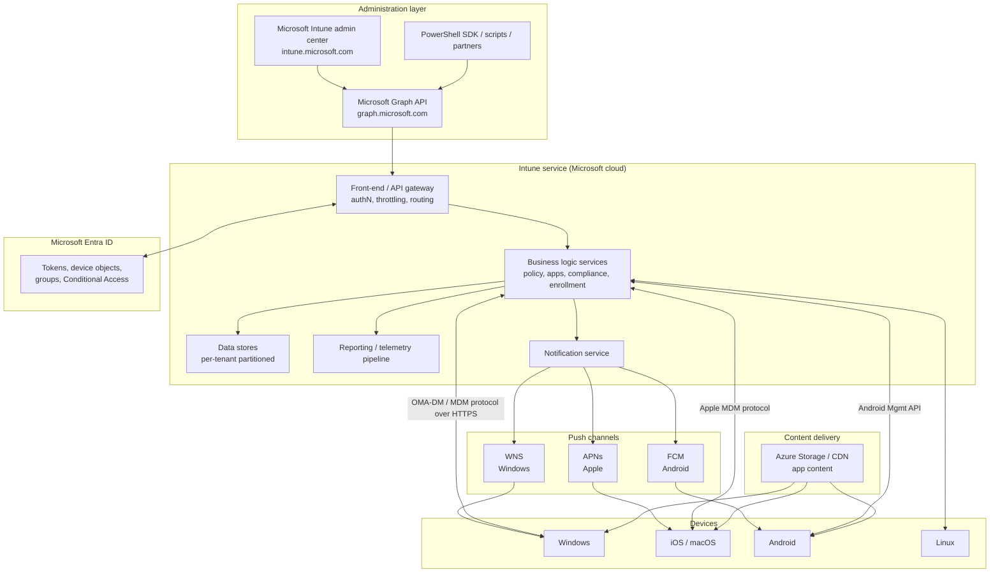
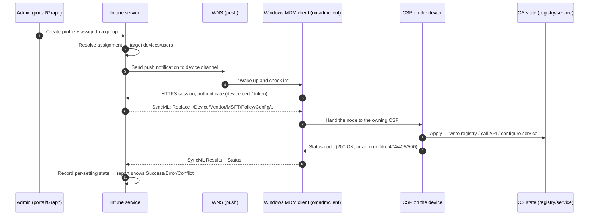
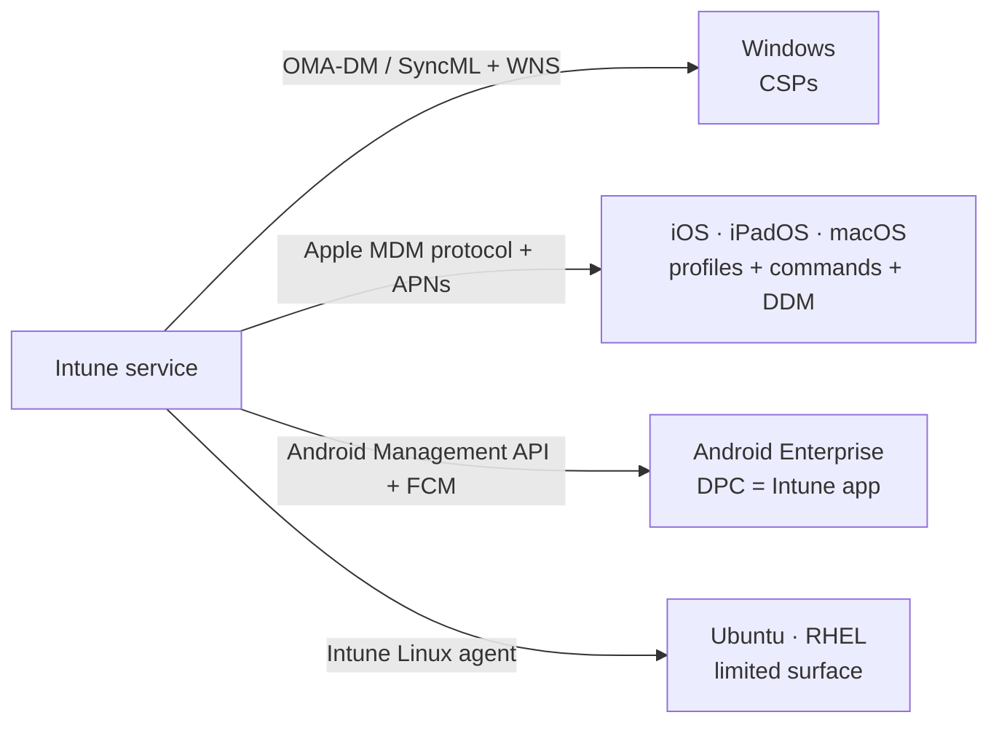
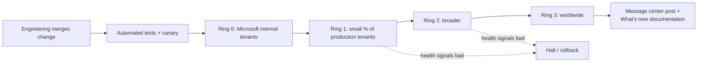

# Part C — Intune Architecture & Service Internals

> **Section goal:** Understand *mechanically* how a setting travels from an admin's click in the Intune portal all the way to a registry key, a plist, or an Android policy — and what can break at every hop. This is the Part that turns you from "someone who uses Intune" into "someone who can debug Intune."

Covers index items **16–23**. Maps to JD: *"Partner with the Software Engineering team to review architecture/design"*, *"Lead supportability and troubleshoot the availability of the service"*, *"Production experience in managing large environments using cloud-based services"*.

**Assumes:** [Part A](Part-A-cloud-and-modern-management.md) (SaaS, tenant, MDM) and [Part B](Part-B-entra-identity-and-access.md) (Entra, tokens, device objects).

---

## 16. What Intune actually is underneath

Intune is not one program. It is a large distributed cloud service made of many cooperating components. You do not need Microsoft-internal detail, but you must be able to describe the shape.

### The layered view



### 🔍 Plain-English deep-dive: the words used for "where your tenant lives"

- **Region / geo** — the geographic area where your tenant's data is stored (e.g. North America, EMEA, APAC, plus sovereign clouds). Chosen at tenant creation from the tenant's country. **Why it matters:** data residency commitments, and incidents are often regional.
- **ASU — Account Scale Unit** — *the specific slice of the Intune service that hosts your tenant.* **Analogy:** which building in the campus your flat is in. **Why it matters:** an incident might only affect certain ASUs, so "is my customer on an affected ASU?" is a real, daily MCS question. Historically visible in the admin center's Tenant Administration → Tenant details as the *MDM authority / service location*.
- **Sharding / partitioning** — splitting tenants across many scale units so no single database or service instance holds everyone. **Analogy:** a library splitting books across several buildings.
- **Ring** — a deployment stage. Microsoft ships new service builds to internal rings, then a small percentage of production, then broadly. See [Part K](Part-K-live-site-and-availability.md).
- **Sovereign / national clouds** — physically and logically separate instances: **GCC**, **GCC High**, **DoD** (US Government), **China (21Vianet)**. **Why it matters:** feature parity lags, endpoints and URLs are different (e.g. `.us`, `.cn` domains), and guidance that works in commercial may not apply. Asking "is this commercial or GCC High?" early is a mark of experience.

---

## 17. The MDM protocol family — OMA-DM, SyncML and CSPs

This is the heart of Windows MDM. Learn it properly; it is the single most differentiating technical topic in an Intune interview.

### 🔍 Plain-English deep-dive: the acronyms

- **OMA** — *Open Mobile Alliance*, the standards body.
- **OMA-DM (Device Management)** — *the standard protocol for a management server to configure a device over the internet.* **Analogy:** a common language, like air-traffic control phraseology, so any server can talk to any device.
- **SyncML** — *the XML message format OMA-DM speaks.* **Analogy:** if OMA-DM is the conversation, SyncML is the grammar and the paper it's written on. Messages contain commands such as `Get`, `Replace` (set a value), `Add`, `Delete`, `Exec` (run an action), `Atomic`, and `Results`/`Status`.
- **OMA-URI** — *the address of a specific setting*, a path like `./Device/Vendor/MSFT/Policy/Config/DeviceLock/MinDevicePasswordLength`. **Analogy:** a file path, but for settings. **Why it matters:** when the portal doesn't expose a setting, admins create a **Custom** profile and type the OMA-URI directly. Reading and validating OMA-URIs is a support task.
- **CSP — Configuration Service Provider** — *the component on the device that actually implements a group of settings.* **Analogy:** a department in a company. OMA-DM delivers the memo to the front desk; the **DeviceLock CSP** department is the one that actually changes the lock screen. **Why it matters:** the CSP is where the setting becomes real — a registry write, a WMI call, a service configuration. Microsoft publishes a full CSP reference; a strong support engineer reads it like an API doc.

### The URI anatomy

```
./Device/Vendor/MSFT/Policy/Config/DeviceLock/MinDevicePasswordLength
│  │      │      │    │      │      │          └── the specific setting
│  │      │      │    │      │      └── the policy area
│  │      │      │    │      └── Config (set) vs Result (read back)
│  │      │      │    └── the CSP name (Policy CSP)
│  │      │      └── MSFT = Microsoft-defined (vs OEM)
│  │      └── Vendor-specific branch
│  └── Device scope (applies to the machine) — alternative: ./User (per user)
└── Relative to the device management tree root
```

> ⚠️ **Device vs User scope is a real-world trap.** `./Device/...` applies machine-wide; `./User/...` applies to the enrolling user only. Choosing the wrong one produces "the policy applied but nothing changed."

### CSPs you should be able to name

| CSP | What it controls |
|---|---|
| **Policy CSP** | The giant one — hundreds of policy areas (DeviceLock, Update, Defender, Browser, Privacy, Experience…). Most Settings Catalog items map here. |
| **DeviceLock / passwordpolicies** | PIN/password complexity, lock timeout. |
| **BitLocker CSP** | Disk encryption settings and recovery key escrow. |
| **DefenderCSP / Defender** | Antivirus configuration. |
| **Firewall CSP** | Windows firewall rules and profiles. |
| **WiFi / VPNv2 CSP** | Wi-Fi and VPN profiles. |
| **ClientCertificateInstall / RootCATrustedCertificates** | Certificate deployment (SCEP/PKCS/trusted roots). |
| **EnterpriseModernAppManagement / EnterpriseDesktopAppManagement** | Store/MSIX app install and MSI install. |
| **Update CSP** | Windows Update for Business settings. |
| **Reboot / RemoteWipe / Accounts** | Actions: restart, wipe, rename, local account. |
| **DiagnosticLog CSP** | Collect logs / diagnostics from the device remotely. |
| **DeclaredConfiguration CSP** | Newer Windows declarative configuration model. |
| **ADMX-backed policies** | Classic Group Policy settings exposed through Policy CSP by ingesting ADMX definitions. |
| **LAPS CSP** | Windows Local Administrator Password Solution. |
| **DMClient CSP** | The management client itself — poll schedules, server URLs, enrollment info. **Very important for troubleshooting sync cadence.** |

### How a setting becomes an OS change



**Every arrow in that diagram is a place a support case can be born.** Learning to say *which arrow* is the whole game.

### SyncML status codes you will meet

| Code | Meaning in MDM terms | Typical cause |
|---|---|---|
| **200** | OK, applied | — |
| **404** | Node not found | CSP or setting doesn't exist on this OS edition/version — very common when an admin uses an OMA-URI unsupported by the device's Windows build |
| **405** | Command not allowed | Wrong verb, e.g. writing to a read-only node |
| **406/415** | Optional feature / unsupported format | Data type mismatch (int vs string vs base64) |
| **418** | Already exists | Add on an existing node |
| **500** | Command failed | CSP-internal failure; needs client logs |
| **507** | Out of space / atomic failure | Rare |
| **0x86000000-range / 0x8018xxxx** | Windows MDM-specific errors | See [Part I](Part-I-troubleshooting-and-diagnostics.md) error table |

---

## 18. The Windows client side — MDM client, IME, scheduling, WNS

There are **two independent delivery mechanisms** on Windows, and confusing them is the #1 cause of misdiagnosis.

### 🔍 Plain-English deep-dive: the two channels

1. **The MDM channel (OMA-DM)** — built into Windows. Handles *configuration profiles, compliance policies, certificates, Wi-Fi/VPN, Store apps, MSI (via EnterpriseDesktopAppManagement), security baselines*. Runs as the **omadmclient** task under `Microsoft\Windows\EnterpriseMgmt` in Task Scheduler. **Analogy:** the postal service built into the house.

2. **The Intune Management Extension (IME)** — an *additional agent* Intune installs on Windows. Handles *Win32 apps (.intunewin), PowerShell scripts, Remediations, Microsoft Store (new) apps, and some Endpoint Analytics/Device Query work*. Runs as the service `Microsoft Intune Management Extension`. **Analogy:** a courier company you hire because the post office won't carry big parcels.

| | MDM channel (OMA-DM) | Intune Management Extension (IME) |
|---|---|---|
| Ships with Windows? | Yes, built in | No — installed by Intune |
| Delivers | Config profiles, compliance, certs, Wi-Fi/VPN, MSI, Store apps, baselines | **Win32 apps**, PowerShell scripts, Remediations, Store (new) apps |
| Trigger | Push (WNS) + scheduled poll | Its own check-in, roughly **every 60 minutes**, plus on service start/sign-in |
| Log | Event Viewer → DeviceManagement-Enterprise-Diagnostics-Provider | `C:\ProgramData\Microsoft\IntuneManagementExtension\Logs\IntuneManagementExtension.log` |
| When is it installed? | n/a | On first Win32 app / script assignment, or when PowerShell scripts are targeted |
| Requires | MDM enrollment | MDM enrollment **plus** the device to be Entra joined/registered and able to reach IME endpoints |

> 💡 **Interview-grade nuance:** "If configuration profiles apply but Win32 apps never install, I stop looking at the MDM channel entirely — that's an IME problem, and I go to `IntuneManagementExtension.log`. Conversely if a password policy won't apply, IME logs are irrelevant; I need the MDM event log and the SyncML status code."

### Sync cadence — the numbers people quote

These are *approximate defaults* and Microsoft can change them; quote them as "roughly", and always add "plus push-triggered."

| Platform / channel | Typical check-in interval |
|---|---|
| Windows MDM | ~8 hours (more frequent right after enrollment: every few minutes for the first 15–30 min, then every ~8 h) |
| Intune Management Extension | ~60 minutes |
| iOS/iPadOS | ~8 hours |
| macOS | ~8 hours |
| Android | ~8 hours |
| Compliance re-evaluation | On check-in, plus scheduled evaluation |
| Manual sync | Company Portal → Sync; Settings → Accounts → Access work or school → Info → Sync; Intune portal → Sync action; `Get-ScheduledTask -TaskName PushLaunch \| Start-ScheduledTask` |

**The critical caveat:** a "Sync" makes the *device* ask for policy now. It does **not** speed up Entra group membership evaluation, Intune assignment recalculation, or reporting pipelines. Saying this correctly separates experienced engineers from beginners.

### 🔍 Plain-English deep-dive: WNS

- **WNS — Windows Push Notification Service** — *Microsoft's push channel to Windows devices.* **Analogy:** tapping someone on the shoulder so they check their inbox instead of waiting for the next scheduled post.
- **How it's used:** Intune asks WNS to nudge the device; the device then *initiates* an outbound HTTPS session to Intune. **The device always initiates the connection** — Intune never connects inbound to a device. Say this; it kills the common misconception that Intune "pushes into" the network.
- **Why it matters:** if WNS endpoints are blocked, management still works but only on the slow scheduled cycle — producing "policies take 8 hours" complaints. WNS uses HTTPS/443 to `*.notify.windows.com` and related endpoints.
- **Apple equivalent:** **APNs — Apple Push Notification service** — required, uses **TCP 5223** (with 443 fallback) to `*.push.apple.com`, and needs an **MDM push certificate** renewed **annually** (an infamous outage cause).
- **Android equivalent:** **FCM — Firebase Cloud Messaging**, used for Android Enterprise; requires Google Play services reachability.

---

## 19. Apple and Android management models (architecture level)

Detailed platform behaviour is in [Part H](Part-H-cross-platform.md); here is where they sit architecturally.

### Apple

- Apple defines its own **MDM protocol** (not OMA-DM): the server sends **commands** and **configuration profiles** (`.mobileconfig`, XML plists) over HTTPS; the device is nudged by **APNs**.
- Trust is established by an **MDM push certificate** issued via Apple Push Certificates Portal, tied to an **Apple ID** — *the identity that renews it must be preserved*, which is why organizations should use a shared, non-personal Apple ID.
- **ADE (Automated Device Enrollment)** via **Apple Business Manager / Apple School Manager** allows zero-touch, supervised, non-removable enrollment.
- **DDM (Declarative Device Management)** is Apple's newer model where the device holds *declarations* and proactively reports status, instead of the server polling — architecturally similar to Windows' declarative direction.

### Android

- **Android Enterprise** is the modern framework; Intune integrates with **Google's Android Management API / managed Google Play**.
- A **DPC (Device Policy Controller)** app on the device enforces policy — for Intune this is the **Microsoft Intune app** (fully managed / dedicated / corporate work profile) or **Company Portal** (personally-owned work profile, and legacy device administrator).
- **Device Administrator** management is the deprecated legacy path; Google and Microsoft have retired most of it.
- Requires **Google Mobile Services (GMS)** in most modes; **AOSP** management exists for devices without Google services (e.g. some rugged/VR devices).

### Linux

- Managed via a **Microsoft Intune app** on supported Ubuntu LTS / RHEL desktops, using Entra device registration and a limited set of compliance and configuration capabilities (custom configuration via JSON, compliance checks, script-based custom compliance).



---

## 20. Microsoft Graph and the admin center

**The key insight:** the Microsoft Intune admin center is a *web client of Microsoft Graph*. Every blade in the portal is issuing Graph calls.

**Why this matters for support:**
- You can reproduce, script and bulk-fix anything the portal does.
- Some data is available *only* in Graph, or only in `/beta`.
- When the portal shows something odd, calling Graph directly tells you whether it's a UI problem or real service data — a genuinely valuable triage step.
- Browser **F12 developer tools → Network** lets you watch which Graph calls the portal makes and what they return, including error payloads the UI swallows. **This is a top-tier support trick worth mentioning in an interview.**

### Practical Graph you should recognise

```
GET  https://graph.microsoft.com/v1.0/deviceManagement/managedDevices
GET  https://graph.microsoft.com/v1.0/deviceManagement/managedDevices?$filter=complianceState eq 'noncompliant'
GET  https://graph.microsoft.com/beta/deviceManagement/deviceConfigurations
GET  https://graph.microsoft.com/beta/deviceManagement/configurationPolicies          (Settings Catalog)
GET  https://graph.microsoft.com/v1.0/deviceAppManagement/mobileApps
POST https://graph.microsoft.com/v1.0/deviceManagement/managedDevices/{id}/syncDevice
GET  https://graph.microsoft.com/beta/deviceManagement/managedDevices/{id}/deviceHealthScriptStates
GET  https://graph.microsoft.com/v1.0/devices?$filter=displayName eq 'LAPTOP-01'      (Entra device object)
```

```powershell
# Microsoft Graph PowerShell SDK
Connect-MgGraph -Scopes "DeviceManagementManagedDevices.Read.All"
Get-MgDeviceManagementManagedDevice -Filter "operatingSystem eq 'Windows'" -All |
    Select-Object deviceName, complianceState, lastSyncDateTime |
    Sort-Object lastSyncDateTime
```

**Useful OData query parameters:** `$filter`, `$select`, `$top`, `$skip`, `$orderby`, `$expand`, `$count`, and `@odata.nextLink` for paging. Not honouring paging is a classic reason a script "only returns 1,000 devices."

---

## 21. End-to-end: the life of one policy

Put it all together. This is a whiteboard answer you should be able to draw.

```mermaid
sequenceDiagram
    autonumber
    participant AD as Admin
    participant GR as Graph / Portal
    participant SV as Intune service
    participant AAD as Entra ID
    participant PU as Push (WNS/APNs/FCM)
    participant CL as Device client
    participant CSP as CSP / OS
    participant RP as Reporting

    AD->>GR: Create policy, assign to group "All Finance Windows"
    GR->>SV: Persist policy + assignment
    SV->>AAD: Resolve group membership → device/user list
    Note over SV: Targeting evaluated;<br/>filters applied;<br/>conflicts resolved
    SV->>PU: Notify targeted devices
    PU->>CL: Wake up
    CL->>SV: Outbound HTTPS check-in + authenticate
    SV-->>CL: Deliver policy payload (SyncML / .mobileconfig / JSON)
    CL->>CSP: Apply setting
    CSP-->>CL: Per-setting status
    CL-->>SV: Report status
    SV->>RP: Aggregate into reports
    RP-->>AD: "Succeeded / Error / Conflict / Not applicable / Pending"
```

### Where it breaks — the seven hops

| Hop | Failure mode | First evidence to collect |
|---|---|---|
| 1. Authoring | Setting misconfigured, wrong OMA-URI/data type | Export the policy JSON via Graph |
| 2. Assignment | Wrong group, filter excludes, user vs device targeting | Intune → device → "Device configuration" / per-device policy view |
| 3. Membership | Dynamic group latency or bad rule | Entra group membership, processing state |
| 4. Notification | WNS/APNs/FCM blocked → slow only | Network/proxy config; device still syncs eventually |
| 5. Check-in | Device offline, token expired, cert invalid, enrollment broken | `dsregcmd /status`, MDM event log, last check-in time |
| 6. Apply | CSP returns 404/500; unsupported OS edition/version; conflict | MDM event log SyncML status; OS build vs setting requirements |
| 7. Report | Applied but report is stale or shows "pending" | Reporting latency (can be tens of minutes); confirm actual OS state on the device |

> 💡 **The single most valuable habit:** always verify the *actual OS state* on a device (registry, `Get-LocalUser`, `manage-bde -status`, etc.) rather than trusting the Intune report. Reports are eventually-consistent aggregations, not live truth.

---

## 22. Scale, throttling and service limits

Interviewers for a "manage large environments" role love this area.

### Throttling

- Microsoft Graph and Intune protect themselves with **throttling**: exceed a rate and you get **HTTP 429 Too Many Requests** with a **`Retry-After`** header (seconds).
- Correct client behaviour: honour `Retry-After`, then **exponential backoff with jitter**; never tight-retry.
- `503 Service Unavailable` may also carry `Retry-After`.
- Symptoms in the real world: bulk scripts failing halfway, portal blades timing out for very large tenants, partner tools misbehaving.

### Service limits worth knowing (orders of magnitude, not exact trivia)

- A **device enrollment limit per user** (configurable; default commonly 5, max 15).
- Limits on the number of **devices per tenant**, apps, policies, and assignments — large but real.
- **Win32 app content size** limits and **.intunewin** packaging constraints.
- **Group targeting**: extremely large numbers of assignments slow evaluation; best practice is fewer, well-designed policies and groups.
- **Reporting** has its own aggregation windows; some reports refresh on a several-hour cadence.

### Design consequences you can quote

| Problem at scale | Mitigation |
|---|---|
| Thousands of policies × thousands of groups = slow evaluation | Consolidate policies; use **filters** instead of many groups |
| Bulk Graph operations get 429s | Batch requests (`$batch`), honour `Retry-After`, backoff + jitter, run off-hours |
| App content saturating a branch office link | **Delivery Optimization** peer caching, **Connected Cache**, bandwidth limits |
| Mass re-evaluation storms after a policy change | Staged rollout rings; change during low-traffic windows |
| Reporting lag confuses admins | Set expectations; verify device-side truth |

> 💡 **Say this:** "At enterprise scale my instinct is to reduce the *number* of moving parts — fewer, broader policies with filters rather than hundreds of groups — because assignment evaluation cost is what actually shows up as 'Intune is slow' for a 200,000-device tenant."

---

## 23. Service health, Message Center, and how Intune ships

### Where to look when "Intune is broken"

| Surface | What it tells you | Where |
|---|---|---|
| **Service health** | Active incidents and advisories affecting your tenant, with impact statements and updates | Microsoft 365 admin center → Health → Service health; also surfaced in Intune admin center → Tenant admin → Tenant status |
| **Message center** | *Planned* changes, deprecations, and required actions | M365 admin center → Health → Message center; Intune-specific posts tagged accordingly |
| **Tenant status page** | Tenant name, MDM authority, service release version, connector status (Apple ADE token/APNs expiry, Managed Google Play, Windows Autopilot), Intune service health summary | Intune admin center → Tenant administration → Tenant status |
| **What's new / release notes** | Feature rollouts by service release | Intune documentation |
| **Public status pages / community** | Corroboration when you suspect a wide incident | Status pages, forums, X/Twitter |

**The Tenant status page is underrated.** Connector expiry (APNs certificate, Apple ADE token, VPP token, NDES/Certificate Connector, Managed Google Play) causes some of the most impactful "everything Apple broke overnight" incidents, and they are all visible there with expiry dates.

### How Intune ships — service releases and rings

- Intune ships **service releases roughly monthly** plus continuous smaller changes.
- Changes roll out through **rings** (internal → pilot → broad), region by region, so *two tenants can legitimately be on different behaviour for a period*. This explains "it works in my test tenant but not the customer's."
- **Message center** announces breaking changes and deprecations ahead of time; part of this job is reading those and pre-emptively warning your customer.
- **Client-side** components (IME, Company Portal, platform OS updates) also version independently — so "which IME version?" and "which Windows build?" are legitimate triage questions.



> 💡 **Interview soundbite:** "Because Intune rolls out by rings and by region, 'it works in tenant A but not tenant B' is not automatically a bug — my first check is whether the two tenants are on the same service release and whether the client versions match. That's a mindset difference between on-prem and SaaS support."

---

## 📌 Part C quick-reference sheet

| Term | One-line meaning |
|---|---|
| ASU / scale unit | The slice of the Intune service hosting your tenant. |
| Sovereign cloud | GCC / GCC High / DoD / China — separate instances, different endpoints and feature parity. |
| OMA-DM | The standard MDM protocol Windows uses. |
| SyncML | The XML message format OMA-DM speaks (Get/Replace/Add/Exec/Status). |
| OMA-URI | The path to a specific setting, e.g. `./Device/Vendor/MSFT/Policy/Config/...`. |
| CSP | Configuration Service Provider — the on-device component that implements settings. |
| Policy CSP | The biggest CSP; most Settings Catalog items map to it. |
| DMClient CSP | Controls the management client itself, including poll schedules. |
| SyncML 404 | Node not found — the setting doesn't exist on this OS build/edition. |
| SyncML 500 | CSP failed internally — get client logs. |
| MDM channel | Built into Windows; delivers config, compliance, certs, MSI, Store apps. |
| IME | Intune Management Extension; delivers Win32 apps, scripts, remediations; checks in ~hourly. |
| WNS | Windows push channel; nudges the device to check in. |
| APNs | Apple push; TCP 5223; needs an annually-renewed MDM push certificate. |
| FCM | Android push (Firebase). |
| Device always initiates | Intune never connects inbound to a device. |
| Sync ≠ instant | Sync only makes the device ask now; it doesn't speed up directory or assignment evaluation. |
| Microsoft Graph | The API behind the portal; `/v1.0` and `/beta`. |
| F12 → Network | Watch the portal's own Graph calls to see real errors. |
| HTTP 429 + Retry-After | Throttled — back off with jitter. |
| Delivery Optimization | Peer/CDN content distribution to save bandwidth. |
| Service health / Message center | Live incidents / planned changes. |
| Tenant status page | MDM authority, service release, and **connector expiry dates**. |
| Rings | Staged rollout; explains cross-tenant behaviour differences. |

---

## ⭐ Likely Interview Questions for This Section

**Q1. "Walk me through what happens from the moment I assign a configuration profile to when the setting is live on a Windows device."**
> *Model answer:* "The admin action is a Graph write, so the policy and its assignment are persisted in the Intune service. Intune resolves the assignment against Entra group membership, applies any filters, and works out the target device list. It then asks **WNS** to nudge those devices. The device — always outbound, Intune never connects in — opens an HTTPS session, authenticates with its management certificate, and receives a **SyncML** payload containing OMA-DM commands like `Replace` against an OMA-URI such as `./Device/Vendor/MSFT/Policy/Config/DeviceLock/MinDevicePasswordLength`. The Windows MDM client hands that node to the owning **CSP**, which makes the actual OS change, and returns a status code. The client reports status back, and Intune aggregates it into reporting. If push is blocked, everything still works but only on the ~8-hour scheduled cycle. Each of those hops is a distinct failure point, and my triage is about identifying which hop."

**Q2. "What's a CSP?"**
> *Model answer:* "A Configuration Service Provider is the component on the device that implements a group of settings — it's the thing that turns an MDM instruction into a real OS change, whether that's a registry write, a service configuration or an API call. Each CSP owns a branch of the device's management tree and is addressed by an OMA-URI. The Policy CSP is the biggest, covering hundreds of policy areas; others include BitLocker, Firewall, WiFi, VPNv2, DeviceLock and DMClient. Practically, the CSP reference documentation is where I check whether a setting even exists on a given Windows edition and build — because if it doesn't, the device returns SyncML **404 node not found**, and that's a very common 'my custom OMA-URI doesn't work' case."

**Q3. "Configuration profiles apply fine but Win32 apps never install. Where do you look?"**
> *Model answer:* "That split immediately tells me it's not the MDM channel — config profiles prove OMA-DM, authentication and check-in are healthy. Win32 apps are delivered by the **Intune Management Extension**, a separate agent with its own ~hourly check-in and its own log at `C:\ProgramData\Microsoft\IntuneManagementExtension\Logs\IntuneManagementExtension.log`. So I'd verify the IME service is installed and running, check the log for the app's content download and detection, confirm the device can reach the IME and content-delivery endpoints — a proxy or TLS-inspection issue often blocks content download specifically — and check the app's requirement and detection rules. Knowing the two channels are independent is what stops you wasting an hour in the wrong log."

**Q4. "A customer complains policies take hours to apply. What do you tell them?"**
> *Model answer:* "First I set expectations honestly: Windows MDM polls roughly every eight hours by default — more frequently in the first half hour after enrollment — and push notifications via WNS are what make it feel instant. If WNS endpoints are blocked by a firewall or proxy, you fall back to the scheduled cycle, which looks exactly like 'policies take hours'. So I'd validate the required endpoints. Second, I'd explain that 'Sync' on the device only makes the device ask for policy now — it does not accelerate Entra dynamic-group evaluation, Intune assignment recalculation or the reporting pipeline, so end-to-end latency can still be tens of minutes even with a manual sync. Third, if it's genuinely a large tenant, I'd look at assignment complexity — huge numbers of policies and groups increase evaluation time, and consolidating with filters is the fix."

**Q5. "How would you tell whether a problem is a portal/UI issue or a real service issue?"**
> *Model answer:* "I'd call Microsoft Graph directly for the same object — the portal is just a Graph client, so if Graph returns correct data and the blade doesn't, it's presentation. The fastest version of that is opening browser F12 developer tools, watching the Network tab while I reproduce, and reading the actual Graph response and error payload, which the UI often swallows. I'd also check the Tenant status page and Service health for a known incident, and compare with a second tenant to see whether it's tenant-specific — remembering that Intune ships in rings, so two tenants can legitimately be on different service releases."

**Q6. "What is throttling and how should clients behave?"**
> *Model answer:* "Throttling is the service protecting itself by rejecting requests beyond a rate limit. Graph returns HTTP 429 with a `Retry-After` header giving the number of seconds to wait; 503 can behave similarly. A well-behaved client honours `Retry-After` exactly and then uses exponential backoff with jitter, rather than retrying tightly — tight retries make the incident worse for everyone on that scale unit. At scale I'd also batch with `$batch`, use `$select` and `$filter` to reduce payload, follow `@odata.nextLink` for paging, and schedule bulk work off-peak. When a customer says 'our automation randomly fails', 429 handling is one of the first things I check."

**Q7. "What is an ASU, and why would you care as a support engineer?"**
> *Model answer:* "An Account Scale Unit is the slice of the Intune service that hosts a given tenant — Intune partitions tenants across many scale units so that no single component holds everyone, and so failures are contained. It matters operationally because incidents are frequently scoped to particular scale units or regions. If a customer reports a problem, knowing their tenant ID, region and scale unit lets me correlate against known live-site impact and answer 'is this you, or is this us?' quickly. It's also why 'Intune is down' is almost never literally true — it's usually 'this scenario is degraded for tenants on these scale units'."

**Q8. "Why can the same policy behave differently in two tenants?"**
> *Model answer:* "Several legitimate reasons before you reach 'bug'. Intune ships in rings, so the two tenants may be on different service releases. The devices may be on different Windows builds or editions, and CSP support varies by build — a setting supported on 23H2 Enterprise may return 404 on an older build or a different SKU. Client component versions differ — Intune Management Extension and Company Portal update independently. Licensing differs, so a feature may be an Intune Suite add-on the second tenant doesn't own. And of course assignment scope, filters, scope tags and conflicting policies differ. I'd systematically compare those before escalating."

**Q9. "Does Intune connect *to* devices?"**
> *Model answer:* "No, and this is an important misconception to clear up with network teams. The device always initiates outbound HTTPS to the service. Push channels — WNS for Windows, APNs for Apple, FCM for Android — only send a lightweight notification telling the device to check in; they aren't a management channel and they don't carry policy. That's why no inbound firewall rules are needed, but outbound access to the required endpoints, including the push endpoints and content-delivery endpoints, absolutely is."

**Q10. "What would you check on the Tenant status page?"**
> *Model answer:* "MDM authority and tenant name to confirm I'm in the right place, the current Intune service release so I know which ring the tenant is on, the service health summary, and — most valuable — the **connector status and expiry dates**: the Apple MDM push certificate, Apple ADE and VPP tokens, the Managed Google Play binding, the Certificate Connector/NDES, and the Autopilot/Windows connectors. Certificate and token expiry causes some of the most dramatic 'everything Apple stopped working overnight' incidents, and it's entirely preventable with monitoring and calendar reminders. For a Mission Critical customer I'd build proactive expiry alerting rather than waiting for the failure."

**Q11. "How does Intune deliver policy to iOS versus Windows, architecturally?"**
> *Model answer:* "Windows uses OMA-DM with SyncML over HTTPS, and settings are implemented by CSPs; push is via WNS. Apple uses its own MDM protocol — the server sends commands and XML `.mobileconfig` configuration profiles, the device is nudged by APNs over TCP 5223, and trust depends on an MDM push certificate that must be renewed annually against the same Apple ID. Apple is also moving to Declarative Device Management, where the device holds declarations and proactively reports status rather than being polled. Android Enterprise uses Google's Android Management API with FCM for push, and a Device Policy Controller app on the device — the Microsoft Intune app or Company Portal depending on the enrollment mode — enforces policy. Different protocols, same conceptual pipeline: authenticate, deliver payload, apply, report."

---

## 🧠 30-Second Memory Hooks

- **OMA-DM = the conversation. SyncML = the grammar. OMA-URI = the address. CSP = the department that does the work.**
- **Two Windows channels: MDM (built in) for *settings*; IME (installed) for *Win32 apps and scripts*.** Wrong log = wasted hour.
- **The device always dials out. WNS/APNs/FCM only tap it on the shoulder.**
- **404 = "that setting doesn't exist on this build." 500 = "the CSP tried and failed."**
- **~8 hours Windows MDM · ~60 minutes IME · push makes it feel instant.**
- **Sync = "ask now", not "make everything upstream faster."**
- **The portal is a Graph client — F12 → Network shows you the truth.**
- **429 + Retry-After = back off with jitter.**
- **ASU = which building your tenant lives in — incidents are often per-ASU.**
- **Tenant status page = where expiring APNs/ADE/VPP/NDES tokens confess before they break you.**
- **Rings mean two tenants can legitimately behave differently. Compare service release + OS build + client version before crying "bug".**

---

*Next suggested section:* **[Part D — Device Enrollment & Windows Autopilot](Part-D-enrollment-and-autopilot.md)** — you now know how policy flows to a *managed* device; next is how a device becomes managed in the first place, which is where the largest share of real support cases live.
