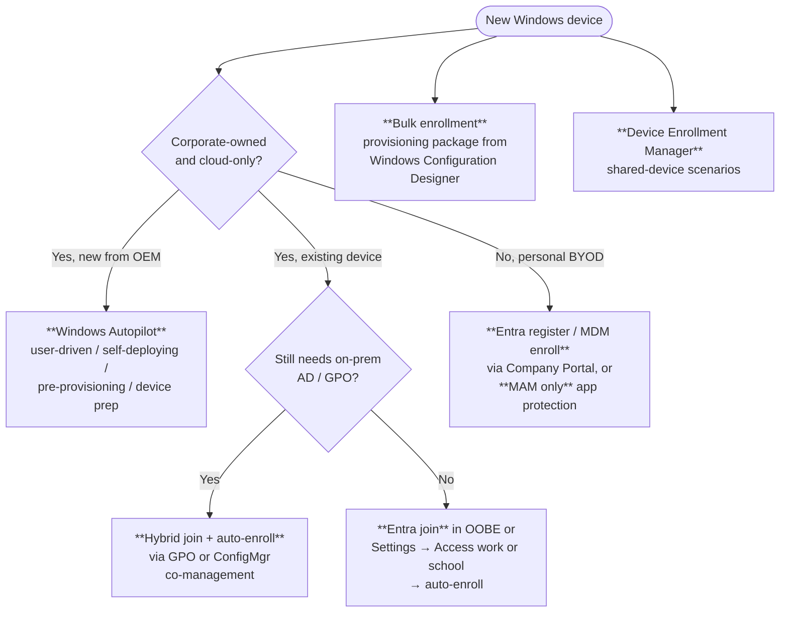
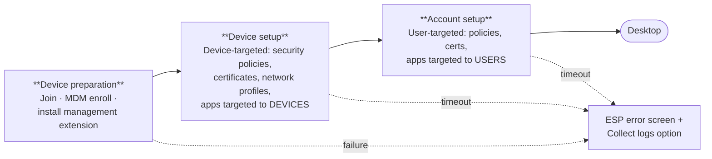
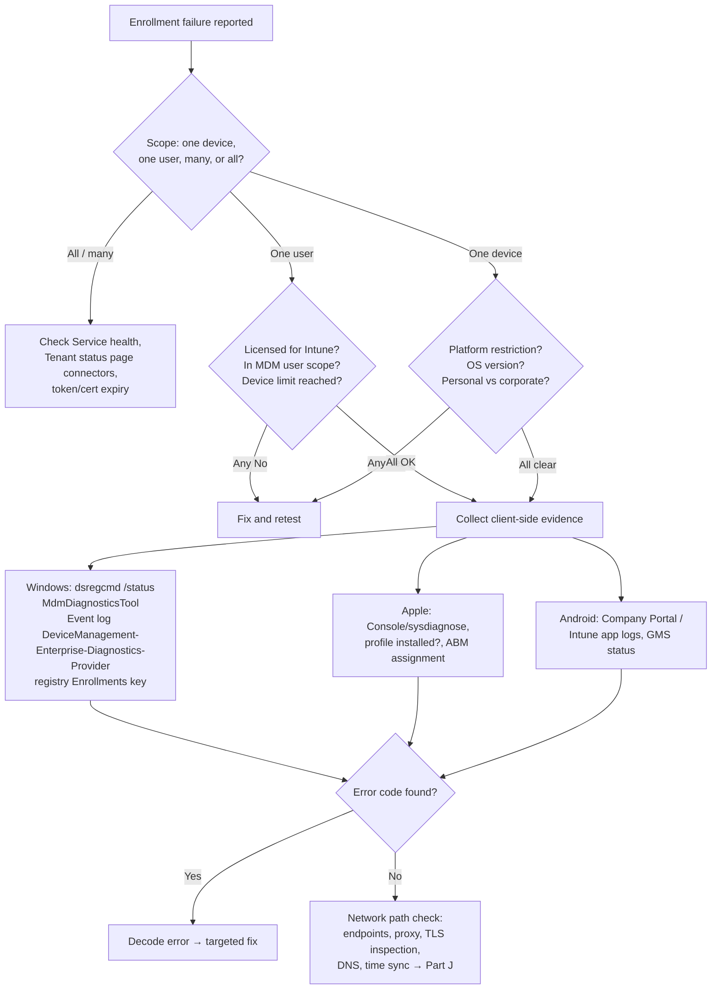

# Part D — Device Enrollment & Windows Autopilot

> **Section goal:** Enrollment is where the largest share of real Intune support cases live. By the end of this Part you will be able to describe every enrollment path on every platform, explain exactly what enrollment creates on a device, run the Autopilot flow from memory, and triage a stuck Enrollment Status Page without guessing.

Covers index items **24–31**. Maps to JD: *"Production system experience with Windows 11, Mobile Device Management and/or Autopilot based deployments"*, *"Experience with iOS and Android devices"*, *"Sound troubleshooting skills"*.

**Assumes:** [Part A](Part-A-cloud-and-modern-management.md), [Part B](Part-B-entra-identity-and-access.md) (join types, PRT, licences), [Part C](Part-C-intune-architecture.md) (OMA-DM, CSPs, IME, push).

---

## 24. What "enrollment" actually creates

**In one sentence:** enrollment is the handshake that gives Intune a *trusted, authenticated, addressable management channel* to a device.

Three things are created:

1. **An identity for the device** — an Entra ID device object (device ID GUID), and an Intune **managed device** record.
2. **A management channel** — the OS's MDM client is configured with the Intune enrollment/management server URLs and a poll schedule (Windows: written by the **DMClient CSP**).
3. **Cryptographic trust** — a **device management certificate** is issued and stored on the device; the device authenticates to Intune with it on every check-in.

### On Windows, enrollment leaves these fingerprints

| Artifact | Location | What it tells you |
|---|---|---|
| Enrollment registry keys | `HKLM\SOFTWARE\Microsoft\Enrollments\{EnrollmentGUID}` | `UPN`, `ProviderID` (should be `MS DM Server`), `DiscoveryServiceFullURL`, `EnrollmentState` (1 = in progress, 2/3 = enrolled), `AADResourceID` |
| Provider/policy keys | `HKLM\SOFTWARE\Microsoft\PolicyManager\...` | Applied policy values per CSP area |
| Scheduled tasks | Task Scheduler → `Microsoft\Windows\EnterpriseMgmt\{EnrollmentGUID}` | `Schedule #1/#2/#3 created by enrollment client`, `PushLaunch` — the sync cadence |
| Device management certificate | `certlm.msc` → Personal → Certificates (issued by "Microsoft Intune MDM Device CA" / SC_Online_Issuing) | Trust for the MDM channel; if missing/expired, check-in fails |
| MDM URLs in Entra | `dsregcmd /status` → `MdmUrl`, `MdmTouUrl`, `MdmComplianceUrl` | Whether auto-enrollment can trigger |
| Event log | Event Viewer → Applications and Services → Microsoft → Windows → **DeviceManagement-Enterprise-Diagnostics-Provider** → Admin | Enrollment steps, SyncML, error codes |

> 💡 **Support move:** when a device "looks enrolled but isn't working", compare the `EnrollmentState` and the presence of the scheduled tasks and MDM certificate. A partially-enrolled device (state 1, tasks missing) behaves like a ghost — visible in the portal, never checking in.

### Enrollment vs registration vs join — don't blur them

- **Entra registration/join** = *identity* (Part B).
- **MDM enrollment** = *management*.
- They are **separate**. A device can be Entra joined but not enrolled (identity without management), or MAM-only (management of apps without either).

---

## 25. Windows enrollment paths

There are more ways to enrol Windows than any other platform. Know each and when it's used.



### The paths in detail

| Path | How it works | Typical use | Key prerequisite |
|---|---|---|---|
| **Automatic MDM enrollment on Entra join** | User joins device to Entra in OOBE or Settings; Entra returns the MDM URLs; Windows immediately enrols | The default modern path | Entra → Mobility (MDM and MAM) → Microsoft Intune → **MDM user scope** set to *Some* or *All*; user licensed |
| **Windows Autopilot** | Device identity pre-registered with Microsoft; OOBE is customized and enrollment is automatic | New corporate PCs shipped direct to users | Hardware hash registered; Autopilot profile assigned; network at OOBE |
| **Hybrid join + auto-enrolment** | Device domain-joins, hybrid-registers with Entra, then a **GPO** (*Enable automatic MDM enrollment using default Azure AD credentials*) or ConfigMgr triggers MDM enrollment | Enterprises with on-prem dependencies | Entra Connect sync, SCP configured, line of sight to a DC at least once |
| **Co-management enrollment** | ConfigMgr client auto-enrols the device into Intune; workloads switched over gradually | ConfigMgr estates modernizing | ConfigMgr cloud attach configured |
| **User-driven (Settings)** | Settings → Accounts → Access work or school → **Connect** → *Join this device to Microsoft Entra ID* (full join) or just **Connect** (register) | Ad-hoc, small orgs, re-enrollment | Same as auto-enrolment |
| **Enroll only in MDM** | Settings → Access work or school → Enroll only in device management (no Entra join) | Rare; specific BYOD/lab cases | MDM discovery URL |
| **Bulk enrollment / provisioning package** | **Windows Configuration Designer** creates a `.ppkg` containing a bulk-enrollment token; applied at OOBE or from Windows | Kiosks, labs, shared devices, no user interaction | Token validity (default 30 days, up to 180) |
| **Device Enrollment Manager (DEM)** | A special account allowed to enrol up to 1,000 devices, all owned by that account | Shared/kiosk devices with no per-user affinity | DEM account configured in Intune; **no user affinity**, so no Company Portal user experience |
| **Windows 365 / Cloud PC & AVD** | Cloud PCs are provisioned Entra-joined and Intune-enrolled automatically | Virtual desktops | Windows 365 licensing |

### 🔍 Plain-English deep-dive: MDM user scope vs MAM user scope

In **Entra ID → Mobility (MDM and MAM) → Microsoft Intune**, there are two independent scopes:

- **MDM user scope** — *which users' Windows devices will automatically enrol into Intune when they Entra-join.* **Analogy:** who gets a company car automatically issued.
- **MAM user scope** — *which users' Windows devices get Windows Information Protection-style app management without enrolment.* **Analogy:** who just gets the locked briefcase.

**Why it matters:** setting MDM user scope to **None** is a very common cause of "the device joined Entra but never enrolled in Intune." It is also the switch used to stage a migration (scope = a pilot group).

There are also three URLs here — **MDM terms of use URL**, **MDM discovery URL**, **MDM compliance URL**. These are pushed to the device and show up in `dsregcmd /status`. Non-default values (from a previous third-party MDM) break enrolment.

### Enrollment for personal Windows devices

- **Register + enrol** via Company Portal or Settings.
- Or **MAM only** — App Protection Policies for Edge and M365 apps, with no device enrollment. Increasingly the preferred BYOD answer.

---

## 26. Windows Autopilot — the deep dive

**In one sentence:** Autopilot lets a device that has never been touched by IT arrive at the user's home, be switched on, and configure itself into a fully managed corporate PC — without imaging.

**Analogy:** ordering a new phone that recognises you the moment you sign in and restores everything, versus receiving a blank phone and a USB stick of instructions.

### The core idea: hardware identity registered in advance

- Every PC has a **hardware hash** (also called the *hardware ID* / *4K HH*) — a long encoded blob describing the device's hardware characteristics.
- The hash (or the OEM's **Device ID / PKID / tuple of manufacturer + model + serial**) is uploaded to the **Windows Autopilot deployment service**, which links it to the tenant.
- At OOBE, before the user signs in, Windows contacts the Autopilot service, is told "you belong to Contoso", and downloads the **Autopilot profile**.

**How devices get registered:**
1. **OEM / reseller / distributor** registers on your behalf at purchase (the ideal path — true zero-touch).
2. **Manual collection** with `Get-WindowsAutopilotInfo` (PowerShell script from the PowerShell Gallery, run in the OS or from OOBE via `Shift+F10`), producing a CSV to upload.
3. **Automatic registration on enrolment** — an Intune-managed device can be converted using an Autopilot deployment profile with *Convert all targeted devices to Autopilot* = Yes.
4. **Intune "Autopilot device preparation"** — the newer model (see below), which does not rely on hardware-hash pre-registration.

### The Autopilot deployment scenarios

| Scenario | What the user sees | Join type | Typical use |
|---|---|---|---|
| **User-driven** | OOBE branded with company name; user enters work credentials; device joins, enrols and configures | Entra joined **or** hybrid joined | The mainstream scenario |
| **Self-deploying** | Zero user interaction; device configures itself with no credentials | Entra joined | Kiosks, digital signage, shared devices, conference rooms. **Requires TPM 2.0** for device attestation |
| **Pre-provisioning** (formerly *white glove*) | IT or the OEM runs the technician phase (apps/policies applied) then reseals; user gets a fast, mostly-configured OOBE | Entra joined or hybrid | Big deployments where user wait time matters. Triggered by pressing **Windows key ×5** at the OOBE start |
| **Autopilot for existing devices** | Applied during a Windows 10/11 in-place task sequence from ConfigMgr using an `AutopilotConfigurationFile.json` | Entra joined | Re-purposing existing domain-joined hardware |
| **Autopilot Reset** | Wipes user data/apps/settings but keeps the device enrolled and Autopilot-registered | Unchanged | Re-issuing a device to a new user |
| **Autopilot device preparation** (newer) | Simplified, faster flow: a **device preparation policy** targets a *device group* Intune populates automatically; no hardware hash required; a fixed, small set of "essential" apps and scripts is tracked | Entra joined | The direction of travel; addresses ESP complexity and pre-registration friction |

### The user-driven flow, step by step

```mermaid
sequenceDiagram
    autonumber
    participant D as New PC (OOBE)
    participant AP as Autopilot deployment service
    participant E as Entra ID
    participant I as Intune
    participant ESP as Enrollment Status Page

    D->>D: Power on → network + language screens
    D->>AP: "Here is my hardware hash — do you know me?"
    AP-->>D: Yes → deliver Autopilot **profile** (branding, join type, OOBE settings)
    D->>D: Skip privacy/EULA/local account per profile
    D->>E: User enters work credentials → authenticate (+ MFA if required by CA)
    E-->>D: Entra join; return MDM enrollment URLs
    D->>I: MDM enrollment (device cert issued, tasks created)
    I-->>D: Policies, certificates, apps, scripts
    D->>ESP: Show progress: Device preparation → Device setup → Account setup
    ESP-->>D: All required items complete → desktop
```

### 🔍 Plain-English deep-dive: profile assignment and the "not Autopilot" trap

- The Autopilot **profile** must be assigned to a **group containing the device object** — and Autopilot device objects appear in Entra with a name like `Desktop-XXXXXX` and carry the Group Tag in `devicePhysicalIds`.
- **Assign profiles to *device* groups, not user groups**, for the join and OOBE behaviour to be right.
- Profile assignment is **not instantaneous** — allow time after registration for the profile status to show *Assigned* on the device record in Intune → Devices → Enrollment → Windows Autopilot devices.
- **The trap:** if the device boots OOBE *before* the profile is assigned, it goes through a normal OOBE, not the Autopilot experience. The fix is to re-run OOBE (reset) after confirming profile status is Assigned.

### Autopilot profile settings you should be able to explain

| Setting | Effect |
|---|---|
| **Deployment mode** | User-driven vs self-deploying |
| **Join to Entra ID as** | Microsoft Entra joined / Microsoft Entra hybrid joined |
| **Microsoft Software License Terms** | Hide/show EULA |
| **Privacy settings** | Hide/show |
| **Hide change account options** | Prevents the user backing out to a different account |
| **User account type** | **Administrator or Standard** — a genuinely important security decision |
| **Allow pre-provisioned deployment** | Enables the Windows-key-×5 technician flow |
| **Language / region / keyboard** | Automatic or preconfigured |
| **Apply device name template** | e.g. `CONTOSO-%SERIAL%` or `%RAND:6%` — not supported for hybrid join |
| **Group Tag / OrderID** | Free-text label used in dynamic device group rules |

---

## 27. Enrollment Status Page (ESP)

**In one sentence:** ESP is the full-screen progress page that *blocks the user from reaching the desktop* until required setup finishes.

**Analogy:** the "please wait, your new phone is setting up" screen, but IT chooses what must finish first, and whether the user is allowed to skip.

### The three phases



### ESP settings and what they actually do

| Setting | Meaning | Support relevance |
|---|---|---|
| **Show app and profile configuration progress** | Turns ESP on at all | If Off, users reach the desktop before configuration completes — sometimes a deliberate choice |
| **Block device use until all apps and profiles are installed** | Enforce completion | The setting that creates "stuck at 'Setting up your device'" tickets |
| **Show an error when installation takes longer than (minutes)** | The timeout (default 60) | Too short → false failures on slow links; too long → users stuck for ages |
| **Allow users to reset device / use device anyway / retry** | Escape hatches on failure | Always enable at least one; otherwise a failed ESP bricks the user's day |
| **Block device use until required apps are installed if they are assigned to the user/device** | Choose *All* or *Selected* apps | **Best practice: select only a small number of genuinely essential apps.** Blocking on everything is the single biggest cause of ESP pain |
| **Only show page to devices provisioned by out-of-box experience (OOBE)** | Limits ESP to new devices | Prevents ESP appearing for every new user on a shared device |

### Why ESP fails — the ranked list

1. **Too many blocking apps**, or a large app (Office/M365 Apps, CAD, security agents) exceeding the timeout.
2. **A Win32 app with a bad detection rule** — it installs but Intune never sees success, so ESP waits forever.
3. **A Win32 app that requires a reboot or that fails silently** — non-zero exit code, or "hard reboot" handling.
4. **Network/proxy** — content download from the CDN blocked, or TLS inspection breaking downloads; slow WAN links.
5. **Dependencies/supersedence chains** that don't resolve.
6. **IME not installed or unhealthy** — Win32 apps and scripts can't run at all.
7. **PowerShell scripts** targeted during ESP that hang or prompt.
8. **Certificate/SCEP issues** — a required certificate profile can't be issued (NDES down, connector offline).
9. **Licensing/Conditional Access** — CA requiring MFA or a compliant device during enrollment; the classic chicken-and-egg. (Common fix: exclude the *Microsoft Intune Enrollment* / *Microsoft Intune* cloud apps carefully, or use a device-registration CA policy designed for it.)
10. **Hybrid join** during Autopilot — needs domain controller connectivity (VPN/Intune Connector for AD) and is the most fragile Autopilot variant.

### Diagnosing ESP

- On the ESP error screen, choose **Collect logs** → writes a CAB to the device (typically `C:\Users\Public\Documents\MDMDiagnostics\`).
- `Shift+F10` at OOBE opens a command prompt — the single most useful trick in Autopilot troubleshooting.
- `Get-AutopilotDiagnostics` (community PowerShell script from the Gallery) parses the diagnostics CAB or the live device and prints a clean timeline of profiles, apps and ESP phases with statuses. **Naming this in an interview lands very well.**
- `MdmDiagnosticsTool.exe -area Autopilot -cab C:\out.cab` collects the relevant logs.
- Event Viewer → **DeviceManagement-Enterprise-Diagnostics-Provider** and → **Microsoft-Windows-Provisioning-Diagnostics-Provider**.
- Intune → Devices → **Windows Autopilot deployments** report (per-deployment success/failure with duration and failure reason) and the **Enrollment failures** report.

> ⚠️ **The chicken-and-egg you should raise unprompted:** a Conditional Access policy requiring a *compliant device* will block enrollment, because the device cannot be compliant before it is enrolled. The same applies to requiring MFA in scenarios where no user interaction is possible (self-deploying). Recognising this class of problem is a strong senior signal.

---

## 28. Enrollment restrictions and limits

Intune → Devices → **Enrollment** → **Enrollment device platform restrictions** and **Device limit restrictions**.

| Control | What it does | Classic failure it causes |
|---|---|---|
| **Platform restrictions** | Allow/block per platform (Windows, iOS/iPadOS, macOS, Android Enterprise, Android device administrator) | "Android enrollment fails" — device administrator blocked, and the device isn't using Android Enterprise |
| **OS version min/max** | Block older/newer OS builds | Brand-new OS release blocked by a max version left in place |
| **Personally owned devices: Allow/Block** | Blocks BYOD by checking corporate identifiers/serials | Corporate device not on the corporate-identifier list → treated as personal → blocked |
| **Device limit restriction** | Max devices per user (default commonly 5, max 15) | "User can't enrol another device" |
| **Corporate device identifiers** | IMEI / serial number lists that mark a device corporate | Ownership shows Personal, so restrictions and privacy behaviour differ |
| **Device categories** | Prompt the user to categorize the device at enrolment; can drive dynamic group membership | Extra prompt users complain about |
| **Enrollment notifications** | Email/push to the user on enrolment | — |

**Ownership matters more than people expect:** *Corporate* vs *Personal* changes which inventory is visible (e.g. full app inventory only on corporate devices), which actions are permitted, and which restrictions apply.

---

## 29. Apple enrollment

### The prerequisites (all of them)

1. **MDM push certificate (APNs)** — created at the *Apple Push Certificates Portal*, uploaded to Intune. **Renew annually with the same Apple ID.** Expiry = all Apple devices stop being manageable and must be re-enrolled. Track it on the Tenant status page.
2. **Apple Business Manager (ABM)** or **Apple School Manager (ASM)** — Apple's portal linking purchased hardware to your organization; provides the **ADE token** (a.k.a. DEP token / server token, valid one year) and **VPP / Apps and Books token** (one year).
3. Enrollment program token uploaded to Intune, and **enrollment profiles** created and assigned to serial numbers.

### The Apple enrollment methods

| Method | User touches device? | Supervised? | Removable by user? | Use case |
|---|---|---|---|---|
| **Automated Device Enrollment (ADE / DEP)** | Setup Assistant only | **Yes** | **No** (locked to MDM) | Corporate-owned iOS/iPadOS/macOS bought via ABM |
| **Apple Configurator** (USB / Setup Assistant) | Physically connected to a Mac | Yes | Depends | Devices not purchased through ABM |
| **BYOD / user enrollment (Account-driven or profile-based)** | User installs Company Portal, signs in | No | Yes | Personal iPhones; **Account-driven User Enrollment** creates a separate managed APFS volume for work data |
| **Device enrollment (profile-based BYOD)** | Company Portal | No | Yes | Older BYOD model |
| **macOS: ADE, Company Portal, or Apple Configurator** | Varies | Varies | Varies | See [Part H](Part-H-cross-platform.md) |

### 🔍 Plain-English deep-dive: supervision and user affinity

- **Supervised** — *a heightened management state on Apple devices*, only achievable via ADE or Apple Configurator. **Analogy:** the difference between a hire car with a tracker fitted at the factory versus a sticker you put on afterwards. **Why it matters:** many powerful restrictions (blocking app removal, activation lock control, single-app mode, per-app VPN nuances, restricting AirDrop, etc.) are **supervised-only**. "That restriction doesn't work" is very often "the device isn't supervised."
- **User affinity** — whether the device is associated with a specific user (enabling Company Portal, per-user apps, email profiles) or is **userless/shared** (kiosk-style). Chosen in the ADE enrollment profile.
- **Activation Lock** — Apple's anti-theft tie to an Apple ID; on supervised devices, MDM can obtain a bypass code. Without it, a wiped personal device can become unusable to the organization.
- **Setup Assistant** — the Apple OOBE; the ADE profile decides which panes are skipped.

### Apple enrollment failure modes

| Symptom | Likely cause |
|---|---|
| All Apple devices stop checking in overnight | **APNs certificate expired** (or renewed with the wrong Apple ID → treated as new → all devices must re-enrol) |
| New ADE devices don't appear | ADE token expired; sync not run; device not assigned to the MDM server in ABM |
| VPP apps fail to install | VPP/Apps and Books token expired; insufficient licences; wrong assignment type (device vs user licensing) |
| Restriction has no effect | Device not supervised |
| User can remove management | Not ADE-enrolled (profile removable) |
| Enrollment blocked | Enrollment restrictions (personal devices blocked, min OS version) |
| Device stuck at Remote Management screen | Network/proxy blocking Apple endpoints, or profile not assigned to the serial |

---

## 30. Android enrollment

Android is the most *mode-dependent* platform. The mode chosen at enrollment determines everything afterwards.

| Mode | Ownership | Managed scope | Enrolment app | Notes |
|---|---|---|---|---|
| **Personally-owned work profile (BYOD)** | Personal | Only the **work profile** container | Company Portal | User's personal side untouched; IT can wipe only the work profile |
| **Corporate-owned work profile (COPE)** | Corporate | Work profile + limited device-wide controls | Microsoft Intune app | Best of both — privacy for personal use, corporate control of the device |
| **Fully managed (COBO)** | Corporate | Entire device | Microsoft Intune app | Full control, no personal profile |
| **Dedicated devices (COSU / kiosk)** | Corporate | Entire device, userless or shared | Microsoft Intune app | Kiosks, scanners, shared frontline devices; supports **shared device mode** with Entra |
| **AOSP management** | Corporate | Device without Google services | Intune AOSP app | Rugged/VR devices (e.g. Meta Quest), no GMS |
| **Android device administrator (legacy)** | Either | Legacy API | Company Portal | **Deprecated** by Google; being retired — expect migration questions |
| **MAM / App protection only** | Personal | Just the apps' data | None (apps themselves) | No enrollment at all |

### Prerequisites and dependencies

- **Managed Google Play connection** — Intune ↔ Google binding, created in Intune → Devices → Android enrollment → Managed Google Play. Requires a Google account (use an organizational one, not a personal one).
- **Google Mobile Services (GMS)** on the device for all Android Enterprise modes.
- **Zero-touch enrolment** (Google) or OEM equivalents (Samsung Knox Mobile Enrollment) for true zero-touch corporate provisioning; alternatively QR code, NFC, or the `afw#setup` token at OOBE.

### Android failure modes

| Symptom | Cause |
|---|---|
| Enrollment fails on a new device | Managed Google Play binding broken/unbound; enrollment restriction blocking device administrator; GMS unavailable or blocked |
| Work apps never install | Play Store blocked by network; app not approved in managed Google Play; user not licensed |
| Compliance shows unknown | Device hasn't checked in; battery optimization killing the Intune app; Play Protect / Play Integrity check failing |
| Legacy device admin devices go unmanageable | Google's deprecation of device administrator — must migrate to Android Enterprise |
| Personal profile controls don't work | Wrong mode chosen — a work profile can't control the personal side |

---

## 31. Enrollment troubleshooting playbook

### The universal method



### Windows enrollment error codes worth memorizing

| Code | Meaning | Typical fix |
|---|---|---|
| `0x80180014` | Enrollment blocked — platform restriction, or personal device blocked | Adjust enrollment restrictions / add corporate identifier |
| `0x80180018` | MDM enrollment failed — user licence / MDM scope | Assign licence; set MDM user scope |
| `0x8018000a` | Device is already enrolled / another MDM present | Remove existing enrollment (`Access work or school` → Disconnect); check for third-party MDM |
| `0x801c0003` | User is not authorized to enrol / device limit reached | Device limit restriction, or Entra "users may join devices" setting |
| `0x801c000e` | Registration quota exceeded | Increase Entra maximum devices per user |
| `0x801c03f2` | Device object not found in Entra | Stale/deleted device object — clean up and re-register |
| `0x8007064c` | Existing enrollment blocking | Clean stale enrollment keys/tasks |
| `0x80070774` | Could not resolve/contact server | DNS/network to `enterpriseregistration.windows.net` |
| `0x80072ee2` / `0x80072efd` | WinHTTP timeout / cannot connect | Proxy, firewall, TLS inspection, endpoints |
| `0x8018002b` | MDM discovery / autodiscovery failure | Discovery URL wrong (leftover third-party MDM), DNS CNAME `enterpriseenrollment` |
| `0x82aa0008` | Autopilot profile not assigned / device not found in Autopilot service | Confirm hash uploaded, profile assigned, status = Assigned |
| `0x800705b4` | Timeout | Slow network, ESP timeout too low |
| `0x87d1fde8` | Remediation failed (IME) | App/script failure — read IME log |

> 💡 **A senior answer format:** "I don't memorize codes to look clever — I use them to *localize* the failure. `0x8018xxxx` tells me it's the MDM enrollment stack; `0x801cxxxx` tells me it's Entra device registration; `0x8007xxxx` is a Win32 error, often network. That immediately tells me which log to open and which team owns the next step."

### Clean-up: how to fully un-enrol a stuck Windows device

Order matters. (Do this on a lab/test device; on production, understand the impact first.)

1. Settings → Accounts → **Access work or school** → Disconnect.
2. Delete the device object in **Intune** and in **Entra ID** (both — leaving one behind causes duplicate/ghost objects).
3. Remove the scheduled task folder `Microsoft\Windows\EnterpriseMgmt\{GUID}`.
4. Remove enrollment registry keys under `HKLM\SOFTWARE\Microsoft\Enrollments\{GUID}` (and `Enrollments\Status`, `PolicyManager\AdmxInstalled`, `Provisioning\OMADM` equivalents).
5. Remove the MDM device certificate from the Local Machine Personal store.
6. Reboot, then re-enrol.

**Better practice for production:** reset the device (or Autopilot Reset) rather than hand-surgery on the registry. Say this — it shows judgement.

---

## 📌 Part D quick-reference sheet

| Term | One-line meaning |
|---|---|
| Enrollment | Creates a device identity + management channel + management certificate. |
| `EnrollmentState` | Registry value; 1 = in progress, 2/3 = enrolled. |
| MDM user scope | Entra setting deciding whose Entra-joined Windows devices auto-enrol. Set to None = no enrolment. |
| Hardware hash | The encoded hardware identity used to register a device with Autopilot. |
| Group Tag / OrderID | Autopilot label stored in `devicePhysicalIds`, used in dynamic device rules. |
| User-driven Autopilot | User signs in during OOBE; the mainstream scenario. |
| Self-deploying | No user credentials; needs TPM 2.0 attestation; kiosks. |
| Pre-provisioning (white glove) | Technician phase first (Windows key ×5), fast user phase later. |
| Autopilot for existing devices | JSON file in a ConfigMgr task sequence to convert existing hardware. |
| Autopilot Reset | Wipe user state, keep enrolment and Autopilot registration. |
| Autopilot device preparation | Newer, simplified provisioning that doesn't need hardware hashes. |
| ESP | Enrollment Status Page — blocks the desktop until required setup completes; 3 phases. |
| `Shift+F10` | Opens a command prompt during OOBE. The Autopilot debugging trick. |
| `Get-AutopilotDiagnostics` | Community script that turns diagnostics into a readable timeline. |
| Enrollment restrictions | Platform, OS version, personal-device block, device limit. |
| Corporate identifiers | IMEI/serial lists marking devices as corporate. |
| APNs push certificate | Required for all Apple management; **annual renewal, same Apple ID**. |
| ABM / ASM | Apple Business/School Manager — source of ADE and VPP tokens. |
| ADE (DEP) | Apple zero-touch, supervised, non-removable enrollment. |
| Supervised | Apple's elevated management state; many restrictions are supervised-only. |
| User affinity | Whether the device is tied to a specific user or is shared/userless. |
| Activation Lock | Apple anti-theft; MDM can hold a bypass code on supervised devices. |
| Managed Google Play | The Intune↔Google binding required for Android Enterprise. |
| Work profile | Android container separating work and personal data. |
| Fully managed / dedicated | Corporate Android modes with whole-device control. |
| Device administrator (Android) | Deprecated legacy management API. |
| `afw#setup` / QR / NFC / zero-touch | Android Enterprise provisioning triggers. |
| DEM account | Device Enrollment Manager; up to 1,000 shared devices, no user affinity. |

---

## ⭐ Likely Interview Questions for This Section

**Q1. "Explain Windows Autopilot to someone who has only ever imaged PCs."**
> *Model answer:* "With imaging you build a golden image, boot the machine to PXE or USB, lay the image down, then join it to the domain — IT has to physically touch every device. Autopilot removes all of that. The device's hardware identity is registered with the Autopilot service in advance, usually by the OEM at purchase. The device ships sealed to the user. When they power it on and connect to the internet, Windows contacts the Autopilot service before anyone signs in, learns it belongs to your tenant, and downloads a profile that customises OOBE — branding, skipping EULA and privacy screens, deciding whether the user is admin or standard, and setting the join type. The user signs in with their work credentials, the device Entra-joins and MDM-enrols, and Intune delivers policies, certificates and apps while the Enrollment Status Page shows progress. You never image anything, and the factory OS is the OS you ship."

**Q2. "What are the Autopilot deployment scenarios and when do you use each?"**
> *Model answer:* "User-driven is the mainstream one — the user signs in and the device configures around them; it supports Entra join and hybrid join. Self-deploying uses no credentials at all and relies on TPM 2.0 attestation, so it's for kiosks, signage and shared devices. Pre-provisioning, formerly white glove, lets IT or the OEM run a technician phase — triggered by pressing the Windows key five times at OOBE — which installs device-targeted apps and policies, then reseals the device so the end user gets a much shorter experience. Autopilot for existing devices converts already-deployed hardware during a ConfigMgr task sequence using an AutopilotConfigurationFile.json. Autopilot Reset wipes user data but keeps enrolment for device re-issue. And Autopilot device preparation is the newer simplified model that doesn't require hardware-hash pre-registration and deliberately limits what's tracked during provisioning."

**Q3. "A user reports Autopilot 'didn't work' — they got a normal Windows setup. Why?"**
> *Model answer:* "Almost always the device wasn't recognised as an Autopilot device at the moment OOBE ran. Either the hardware hash was never uploaded, or it was uploaded but the deployment profile wasn't assigned yet — profile assignment isn't instantaneous, and the device record has to show status 'Assigned' before first boot. Other causes: the device was assigned to a group it isn't actually a member of, dynamic group latency on a Group Tag rule, the device booted before the profile propagated, or there was no network at OOBE so it couldn't reach the Autopilot service. I'd check Intune → Devices → Enrollment → Windows Autopilot devices for the serial, confirm profile status, then reset the device to re-run OOBE."

**Q4. "ESP is stuck at 'Setting up your device' for 45 minutes. Walk me through triage."**
> *Model answer:* "First, which phase — device preparation, device setup or account setup — because that tells me whether it's enrolment, device-targeted items or user-targeted items. Then the single most common cause: too many blocking apps, or one large or failing app. I'd `Shift+F10` to get a command prompt, or use Collect logs on the error screen, and run `Get-AutopilotDiagnostics` against the diagnostics to get a clean timeline of each policy and app with its status and duration. In the IME log I'd look for the app's content download and detection — a Win32 app with a bad **detection rule** installs successfully but is never detected, so ESP waits until timeout, and that's the classic. I'd also check content download against the CDN, because proxy or TLS inspection frequently blocks that specifically. Longer term the fix is architectural: only block on a genuinely minimal set of essential apps, raise the timeout to something realistic for the customer's network, and always allow the user an escape option so a failure doesn't cost them a day."

**Q5. "Why can Conditional Access break enrollment?"**
> *Model answer:* "Because of a chicken-and-egg. If a CA policy requires a compliant device, the device can't satisfy it during enrolment — it isn't enrolled yet, so it can't be compliant. The same applies to requiring MFA in a scenario where no interactive user exists, such as self-deploying Autopilot or a device-credential enrolment. The right approach is to design CA for the enrolment path explicitly — scope policies so the device-registration and Intune enrolment flows are handled deliberately rather than accidentally blocked, and validate with report-only mode and the What If tool before rollout. Raising this class of problem unprompted usually saves a customer a very confusing week."

**Q6. "What's the difference between Entra join and MDM enrollment?"**
> *Model answer:* "Entra join is about *identity* — the device gets an object in the directory and users sign into Windows with work credentials. MDM enrolment is about *management* — Intune gets an authenticated channel to configure the device, backed by a management certificate and scheduled sync tasks. They're separate: a device can be Entra joined but not enrolled, which happens when MDM user scope is set to None or the user isn't licensed. Auto-enrolment is the feature that chains them together: Entra returns the MDM discovery URLs at join time and Windows immediately enrols."

**Q7. "Every iPhone in a tenant stopped being manageable overnight. First hypothesis?"**
> *Model answer:* "Expired **APNs push certificate**. It's valid for a year and must be renewed in the Apple Push Certificates Portal with the *same Apple ID* used to create it — renewing with a different Apple ID produces a new certificate, which Intune treats as a new push identity, and every Apple device then has to be re-enrolled. That's why the guidance is to use a shared organizational Apple ID and to monitor the expiry on the Tenant status page. Adjacent causes with the same shape are an expired Apple ADE token or VPP token. For a Mission Critical customer I'd build proactive alerting on all three rather than relying on someone noticing a banner."

**Q8. "Compare the Android enrollment modes."**
> *Model answer:* "Personally-owned work profile is BYOD: a container on the user's own device, IT manages only the work profile and can wipe only that. Corporate-owned work profile is the same container model but on a company-owned device, so IT also gets some device-wide controls while preserving personal privacy — usually the best balance. Fully managed is a corporate device with no personal profile and whole-device control. Dedicated is for kiosk and shared frontline devices, userless or with shared device mode. AOSP management covers corporate devices with no Google services, like some rugged and VR hardware. And legacy device administrator is deprecated by Google and being retired, so a live workstream in many tenants is migrating those devices to Android Enterprise. All the Google-services modes depend on the Managed Google Play binding and on GMS being reachable, which is why a blocked Play endpoint looks like 'enrollment is broken'."

**Q9. "What is device supervision on Apple, and why do restrictions sometimes 'not work'?"**
> *Model answer:* "Supervision is an elevated management state that a device can only enter through Automated Device Enrollment via Apple Business Manager, or through Apple Configurator. A large set of the strongest restrictions — blocking app removal, single-app mode, controlling AirDrop, managing Activation Lock, and more — are supervised-only. So when an admin says 'this restriction has no effect', my first check is whether the device is actually supervised, and if it isn't, the honest answer is that the control cannot be enforced on that device without re-enrolling it through ADE. The same conversation applies to whether the user can simply remove the management profile: ADE-enrolled devices can't, profile-based BYOD enrollments can."

**Q10. "How would you fully clean a Windows device that is stuck in a half-enrolled state?"**
> *Model answer:* "In production my first answer is to reset the device or use Autopilot Reset, because surgical clean-up is fragile and risks leaving inconsistent state. If I do need to clean manually — say on a lab device to prove a hypothesis — the order is: disconnect the work account in Settings, delete the device object in *both* Intune and Entra so you don't leave a ghost, remove the `Microsoft\Windows\EnterpriseMgmt\{GUID}` scheduled task folder, remove the enrollment keys under `HKLM\SOFTWARE\Microsoft\Enrollments\{GUID}` and related provisioning keys, remove the Intune MDM device certificate from the local machine personal store, reboot and re-enrol. Deleting only one of the Intune or Entra objects is what creates duplicate device records and the 'compliant device still blocked by Conditional Access' symptom."

**Q11. "How would you decide between MDM enrollment and MAM-only for a BYOD population?"**
> *Model answer:* "It depends on what the organization must be able to prove and what the user will accept. MDM gives full device compliance signal, encryption enforcement, and the ability to deploy certificates and VPN — but it's intrusive on a personal device, and in some countries or with some works councils it's a non-starter. MAM with App Protection Policies protects corporate data inside the managed apps — PIN on the app, block copy-paste to unmanaged apps, block save-to-personal-locations, selective wipe of company data only — with no enrolment and no visibility of personal content. If the requirement is 'protect the data' I'd lead with MAM; if it's 'prove device health for Conditional Access' I'd need MDM, or accept the 'require app protection policy' CA control as the compromise. I'd also check the licence, because both need Intune licensing for the user."

---

## 🧠 30-Second Memory Hooks

- **Enrollment = identity + channel + certificate.** All three or nothing works.
- **`EnrollmentState` 2/3 = enrolled.** Scheduled tasks + MDM cert must exist too.
- **MDM user scope = None** is the silent killer of auto-enrolment.
- **Autopilot = the hardware hash arrives at Microsoft *before* the device arrives at the user.**
- **User-driven · Self-deploying (TPM) · Pre-provisioning (Win key ×5) · Existing devices · Reset · Device preparation.**
- **ESP phases: Device preparation → Device setup (device-targeted) → Account setup (user-targeted).**
- **ESP's #1 killer: a Win32 app with a bad *detection rule*.** It installed; Intune just can't see it.
- **`Shift+F10` at OOBE + `Get-AutopilotDiagnostics`** = the Autopilot debugging combo.
- **CA requiring "compliant device" during enrolment = chicken-and-egg.**
- **Apple: APNs cert = annual, same Apple ID. ADE token = annual. VPP token = annual.** Three clocks ticking.
- **Not supervised = the restriction simply cannot apply.**
- **Android: the mode you pick at enrolment decides everything forever.**
- **Delete the device in *both* Intune and Entra — a ghost object breaks Conditional Access.**

---

*Next suggested section:* **[Part E — Configuration, Compliance & Policy](Part-E-configuration-and-compliance.md)** — the device is now managed; next is everything you actually *do* to it, and how to prove which policy won.
