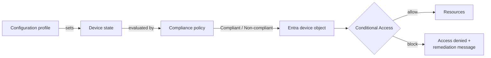
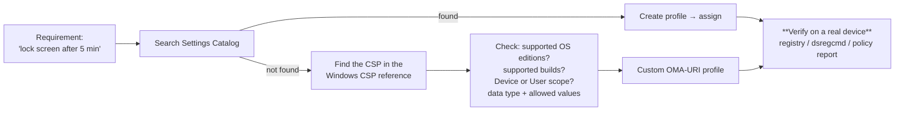
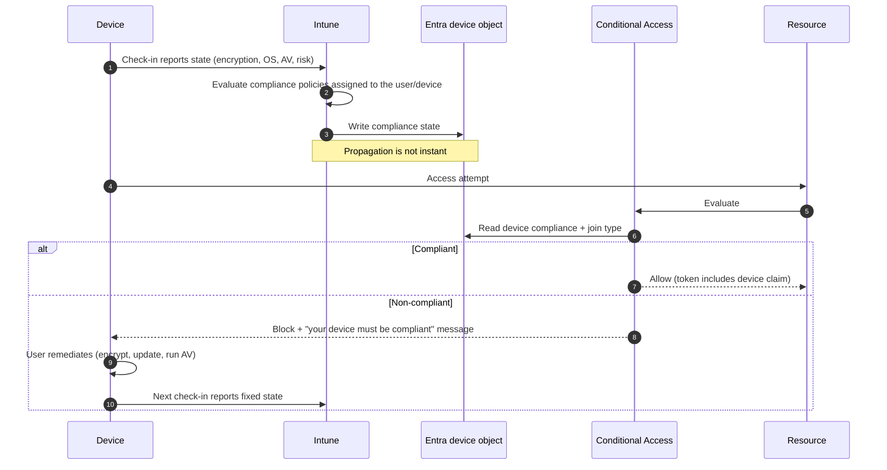
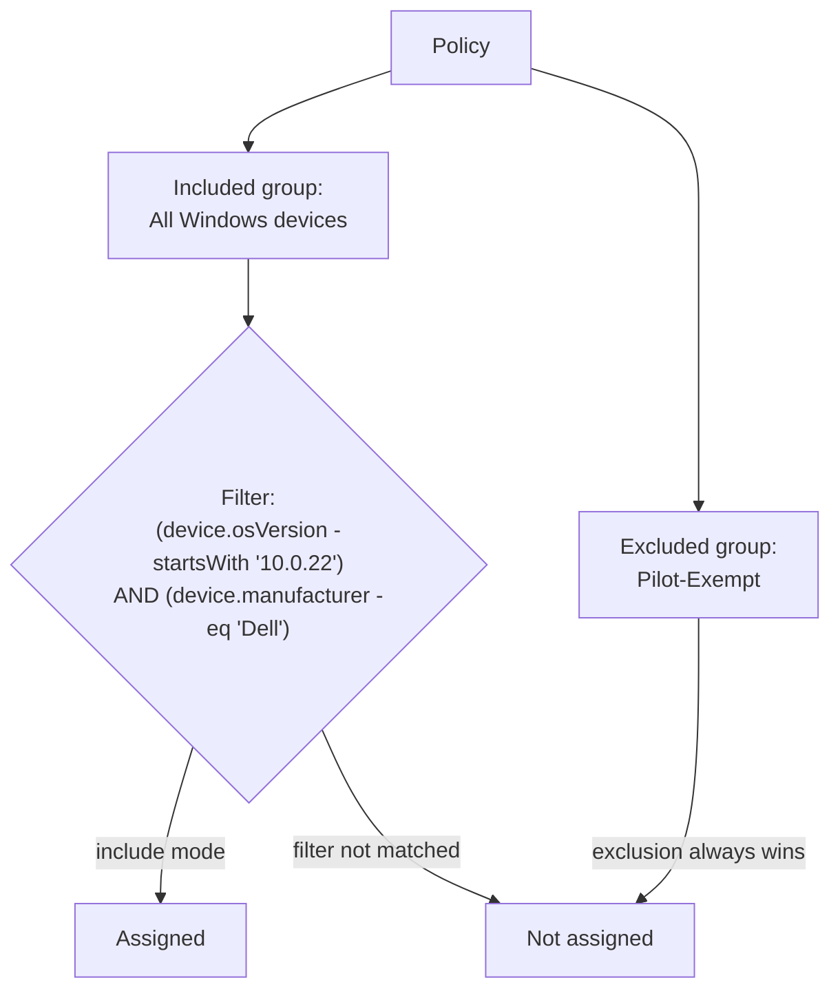
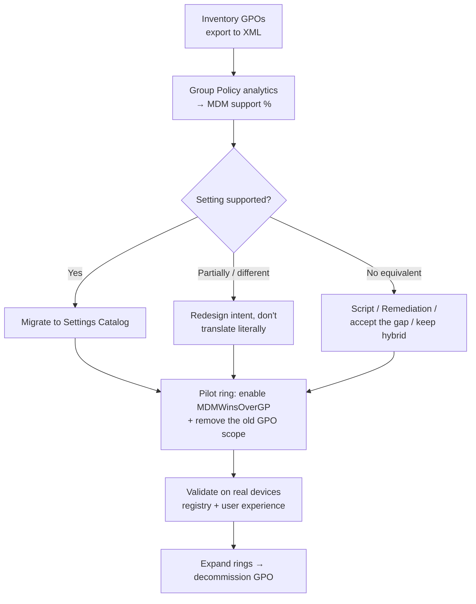

# Part E — Configuration, Compliance & Policy

> **Section goal:** Master the difference between *configuring* a device and *judging* a device, know every profile type Intune offers, be able to explain assignment and filter evaluation precisely, and — the interview favourite — prove exactly which policy won a conflict and why.

Covers index items **32–40**. Maps to JD: *"Production system experience with Windows 11, Mobile Device Management"*, *"Sound troubleshooting skills"*, *"Client Side Support, Hardware/OS"*.

**Assumes:** [Part C](Part-C-intune-architecture.md) (CSPs, OMA-URI, sync cadence) and [Part D](Part-D-enrollment-and-autopilot.md) (enrolled devices).

---

## 32. Configuration vs compliance — the mental model

Two different jobs that beginners constantly merge.

| | **Configuration profile** | **Compliance policy** |
|---|---|---|
| Purpose | **Makes** the device a certain way | **Checks** whether the device is a certain way |
| Verb | *Set* | *Judge* |
| Result | Setting applied on the device | Device marked **Compliant** / **Non-compliant** |
| Consumed by | The OS | **Entra Conditional Access** |
| Failure looks like | "Setting didn't apply" | "User blocked from email" |
| Analogy | Fitting the seatbelt | The MOT/roadworthiness test certificate |

**They are independent.** You can configure something without checking it, and check something without configuring it. Mature designs do both: configure it *and* verify it, so drift is detected.

---

## 33. The profile types — what to use when

Intune has accumulated several generations of configuration authoring. Know them all and know which is current.

| Type | What it is | When to use |
|---|---|---|
| **Settings Catalog** | A searchable list of *all* available settings for a platform, each mapped to a CSP node, that you compose freely into one profile | **The modern default.** Use this unless you have a reason not to |
| **Templates** (legacy "Device restrictions", "Endpoint protection", "Wi-Fi", "VPN", "Certificate", "Email", "Kiosk"…) | Curated, opinionated forms grouping related settings | Still needed for some scenarios (certificates, Wi-Fi/VPN, kiosk); otherwise being superseded by Settings Catalog |
| **Administrative Templates (ADMX)** | The familiar Group Policy tree, delivered via MDM | Migrating known GPO settings; admins who think in GPO terms |
| **Imported ADMX / custom ADMX ingestion** | Ingest third-party ADMX (e.g. Chrome, Firefox, Adobe) so their settings become manageable | Managing non-Microsoft apps' policies |
| **Custom profile (OMA-URI)** | You type the OMA-URI, data type and value yourself | A setting exists in a CSP but isn't surfaced in the UI. **Powerful and dangerous** |
| **Security baselines** | Microsoft-recommended pre-configured security settings, versioned | Fast, defensible security posture; see [Part G](Part-G-endpoint-security.md) |
| **Endpoint security policies** | Focused policies for AV, firewall, disk encryption, EDR, ASR, account protection | Security-team-owned settings, separate from general config |
| **Configuration profiles for macOS: preference file / custom `.mobileconfig`** | Upload an Apple property list | Settings Apple exposes but Intune's UI doesn't |
| **Scripts** (PowerShell, macOS/Linux shell) | Run code on the device | Last resort for what policy can't do |
| **Remediations** (proactive remediations) | Detection script + remediation script, scheduled | Self-healing and drift correction |

### 🔍 Plain-English deep-dive: Settings Catalog

- **What it is:** rather than Microsoft hand-building a form per feature, the Settings Catalog exposes the underlying settings surface directly, generated from the platform's own definitions.
- **Analogy:** the difference between a restaurant's fixed menu (templates) and the full pantry with every ingredient labelled (catalog).
- **Why it matters:** it's where new settings appear first, it shows the exact setting name and often the CSP mapping, and it supports both device and user scope. It also *merges* cleanly across multiple Settings Catalog policies when they don't conflict — unlike some legacy templates.
- **Practical tip:** search by the CSP or ADMX name, not just the friendly name. Many settings are findable only if you know the underlying identifier.

### 🔍 Plain-English deep-dive: custom OMA-URI profiles

Use when the UI doesn't expose a CSP setting. You must supply:

| Field | Example | Notes |
|---|---|---|
| **Name / Description** | "Disable Xbox services" | Document *why*, always |
| **OMA-URI** | `./Device/Vendor/MSFT/Policy/Config/ADMX_XboxGameSaves/...` | Case-sensitive; `./Device` vs `./User` matters |
| **Data type** | String, String (XML file), Integer, Boolean, Base64, Floating point, Date and time | **Wrong data type = silent failure or 406/415** |
| **Value** | `<enabled/>` for ADMX-style, or `1` | ADMX-backed nodes take a specific XML payload |

**Common custom-profile failures:** unsupported on that Windows edition (Home vs Pro vs Enterprise) → **404**; wrong scope (`./User` on a device-targeted profile); wrong data type; the setting exists only from a later Windows build; trailing whitespace in the URI.

---

## 34. From setting to OS — reading the CSP reference

A skill worth demonstrating: given a requirement, find the setting and confirm it's supported.

**Always verify on the device, not just in the report.** For Windows, applied policy values usually land under `HKLM\SOFTWARE\Microsoft\PolicyManager\current\device\<Area>` and provider-specific keys — comparing the intended value with what's actually written is the difference between "the report says success" and "the setting is genuinely in effect."

---

## 35. Compliance policies in depth

### What can be checked (by platform)

| Category | Examples |
|---|---|
| **Device health** | BitLocker enabled, Secure Boot on, Code integrity, **Microsoft Defender for Endpoint machine risk score**, jailbroken/rooted detection, Google Play Protect / Play Integrity attestation, Samsung Knox attestation |
| **Device properties** | Minimum/maximum OS version, build ranges |
| **System security** | Password/PIN required, length, complexity, expiry, history, idle timeout; encryption required; firewall on; antivirus/antispyware on and up to date; TPM required; real-time protection |
| **Microsoft Defender for Endpoint** | Require the device to be at or under a machine risk score |
| **Custom compliance** | A **detection script + JSON rules file** (Windows, macOS, Linux) to check literally anything |

### The settings that trip people up

- **Actions for noncompliance** — a *sequence* of actions with schedules: mark noncompliant (immediately or after N days — the **grace period**), send email to the user, send push notification, remotely lock, retire the device. **The grace period is the humane part**: it gives the user time to fix things before losing access.
- **"Mark devices with no compliance policy assigned as"** — a **tenant-wide** setting under Devices → Compliance → Compliance policy settings. Default is *Compliant*; setting it to **Not compliant** is a security best practice but will instantly break access for any device not covered by a policy. **A classic self-inflicted outage — mention this.**
- **Compliance status validity period** — how long a compliance result stays valid before the device must re-report (default 30 days).
- **Enhanced jailbreak detection** (iOS) — more frequent location-based checks; costs battery.
- **Built-in device compliance policy** — Intune's implicit baseline that marks devices non-compliant if they're not checking in / not enrolled properly.

### The compliance → Conditional Access loop

### The classic compliance support cases

| Symptom | Root cause |
|---|---|
| "Portal says compliant, CA still blocks" | Token predates the state change (sign out/in), propagation delay, duplicate Entra device object, browser not passing device claim |
| "Device shows Not evaluated / Unknown" | Device hasn't checked in; no compliance policy assigned; platform mismatch; enrollment broken |
| "Everyone went non-compliant at once" | Tenant setting *devices with no policy = Not compliant* enabled; a policy edited; Defender connector broken; OS minimum version raised without a grace period |
| "BitLocker shows non-compliant but the disk is encrypted" | The compliance check reads a specific signal (e.g. encryption of the OS drive with a particular method, or the CSP's reporting node) that lags or differs from what the user sees; also common when encryption is *in progress* |
| "Non-compliant for antivirus though Defender is running" | Third-party AV registered as the active provider; or Defender in passive mode; or signature age check failing |
| "Grace period didn't apply" | Grace applies to *actions*, not to the compliance state itself |

---

## 36. Assignments, targeting and filters

### The mechanics

Every policy, app and script is **assigned** to one or more **groups**, with:

- **Included groups** and **Excluded groups** (exclusion always wins over inclusion).
- Virtual groups: **All users**, **All devices** — convenient, blunt, and the cause of many accidents.
- **Assignment filters** — a rule evaluated *at assignment time* against device properties, applied per assignment as **include** or **exclude**.

### 🔍 Plain-English deep-dive: filters vs groups

- **Group** — a *list* of objects, maintained by Entra (static or dynamic). **Analogy:** a guest list.
- **Filter** — a *condition* evaluated by Intune when it decides who gets a specific assignment. **Analogy:** a rule on the door — "guest list, but only people wearing a jacket."
- **Why filters exist:** groups are heavy. Ten thousand group memberships must be materialized and synced; a filter is evaluated on the fly. Filters also let you slice by properties Entra doesn't hold well, like `deviceModel`, `osVersion`, `deviceOwnership`, `isRooted`, `enrollmentProfileName`, `deviceCategory`, `manufacturer`, `deviceName`, and Autopilot-related attributes.
- **Practical rule:** target broadly with a few groups, then narrow with filters. This is the scale-friendly pattern and a great thing to say in an interview.

### User targeting vs device targeting

| | User-targeted | Device-targeted |
|---|---|---|
| Applies when | The targeted user signs in / is the primary user | The device is in scope, regardless of who signs in |
| Good for | Per-person apps, user-scope settings, email profiles | Security settings, shared devices, ESP device phase, kiosks |
| Trap | Shared devices — a policy follows the user around | User-scope settings can't be delivered to a device with no user (self-deploying) |
| ESP relevance | Applied in **Account setup** phase | Applied in **Device setup** phase |

**A frequent real-world bug:** assigning a *device-scope* setting to a *user* group, or vice versa. The assignment succeeds but nothing happens, because the setting's CSP node lives in the other scope.

### Evaluation order, in practice

1. Determine target set: included groups minus excluded groups (**exclusion wins**).
2. Apply assignment **filters** (include/exclude modes).
3. Combine all applicable policies of that type.
4. Resolve **conflicts** (next section).
5. Deliver to the device on its next check-in / push.

---

## 37. Policy conflicts — how to prove which one won

This is a favourite interview question because it separates people who *click* from people who *understand*.

### The rules

| Situation | Outcome |
|---|---|
| Two policies set the **same setting to the same value** | Fine — applied, no conflict |
| Two policies set the **same setting to different values** | **Conflict.** For most Windows CSP settings, *neither* value is applied reliably and the report shows **Conflict**; the last-writer behaviour is not something to depend on |
| Settings in **different policies that don't overlap** | They **merge** — the device gets the union |
| Security baseline vs configuration profile setting the same thing | Conflict — baselines are not automatically superior |
| Endpoint security policy vs configuration profile | Conflict on overlapping settings |
| **Group Policy vs MDM** on a co-managed/hybrid device | By default **Group Policy wins** on Windows, unless the **MDMWinsOverGP** policy (`ControlPolicyConflict` CSP) is enabled |
| ConfigMgr vs Intune in **co-management** | Whichever authority owns that **workload** wins; the workload slider is the arbiter |
| Multiple compliance policies | The device must satisfy **all** of them — most restrictive effectively wins |
| App Protection Policies with different priority | Explicit **priority ordering** determines which applies to a user for an app |

### 🔍 Plain-English deep-dive: MDMWinsOverGP

- **What it is:** a Windows policy (`./Device/Vendor/MSFT/Policy/Config/ControlPolicyConflict/MDMWinsOverGP`) that flips the default so MDM-delivered settings take precedence over Group Policy for settings that exist in both.
- **Analogy:** two managers give conflicting instructions; this is the memo saying "in a tie, listen to the new manager."
- **Why it matters:** during a GPO→Intune migration, you get bizarre "the policy shows success in Intune but the device still has the old value" reports. The answer is nearly always that a GPO is still setting it and MDMWinsOverGP is off.
- **Caveat:** it applies to settings in the Policy CSP that have a GP equivalent, and only when the GPO is actually still applying — the true fix is to remove the duplicate GPO.

### Proving it on a device

1. Intune → Devices → *device* → **Device configuration** → per-profile state, and drill into per-setting status (**Succeeded / Error / Conflict / Not applicable / Pending**).
2. Intune → Devices → **Monitor** → *Assignment failures* / per-policy device status.
3. On Windows: Event Viewer → **DeviceManagement-Enterprise-Diagnostics-Provider** → look for the SyncML for that node and its status code.
4. Registry: `HKLM\SOFTWARE\Microsoft\PolicyManager\current\device\<Area>` for the effective MDM value; compare against `gpresult /h` output for GPO values on hybrid devices.
5. `MdmDiagnosticsTool.exe -area DeviceEnrollment;DeviceProvisioning;Autopilot -cab C:\logs.cab` and read the generated HTML report, which lists every applied policy and its source.

> 💡 **Say this:** "'Conflict' in Intune isn't a bug, it's Intune telling you two authorities disagree. My job is to identify both sources — which is usually two Intune policies, or an Intune policy versus a surviving GPO — and eliminate one, rather than trying to force a winner."

---

## 38. Sync cycles and what "refresh" really means

Recap with the numbers, plus what each trigger does.

| Trigger | What it actually does |
|---|---|
| **Push notification (WNS/APNs/FCM)** | Tells the device to check in *now* |
| **Scheduled poll** | Windows MDM ~8 h; accelerated right after enrolment; IME ~60 min; Apple/Android ~8 h |
| **Company Portal → Sync** | Device requests policy now |
| **Settings → Access work or school → Info → Sync** | Same |
| **Intune portal → device → Sync** | Sends a push to the device |
| **Bulk device action → Sync** | Same, for many devices |
| **`Get-ScheduledTask -TaskName PushLaunch \| Start-ScheduledTask`** | Forces the MDM sync task |
| **Restarting the IME service** | Forces IME to re-evaluate apps/scripts (also clears some cached state) |
| **Sign-out/sign-in** | Refreshes user tokens and user-scope policy; needed for CA device claims |

**What none of these do:** speed up Entra dynamic-group evaluation, Intune assignment recalculation, or reporting aggregation. Set that expectation with customers early.

---

## 39. Group Policy Analytics, GPO migration, and co-management

### Group Policy analytics

- Export a GPO to XML → upload to Intune → Intune reports **which settings have a modern MDM equivalent**, which are deprecated, and which have no equivalent.
- It can then **create Settings Catalog policies** from the mapped settings (migration feature).
- Great story for interviews about *how you'd approach a migration methodically instead of by hand*.

### A sane GPO → Intune migration approach

**Key judgement point to voice:** *don't translate GPOs one-for-one.* Many GPOs are 15 years of accumulated cruft. Migration is the moment to ask "what is the actual intent?" — that's a supportability and customer-value answer, exactly what this role wants.

### Co-management

**In one sentence:** a Windows device is managed by **both** Configuration Manager and Intune at the same time, and each **workload** is assigned to one authority.

**The seven workloads:**
1. Compliance policies
2. Windows Update policies
3. Resource access policies (VPN, Wi-Fi, certificates, email)
4. Endpoint Protection
5. Device configuration
6. Office Click-to-Run apps
7. Client apps

Each is set to **Configuration Manager**, **Pilot Intune** (a ConfigMgr collection), or **Intune**.

| Term | Meaning |
|---|---|
| **Cloud attach** | Connecting ConfigMgr to cloud services (tenant attach + co-management) |
| **Tenant attach** | Uploading ConfigMgr device data to the Intune admin center so you can see and act on ConfigMgr devices there — *without* co-management |
| **Pilot collection** | A ConfigMgr collection used to trial a workload move |
| **CMG (Cloud Management Gateway)** | Lets ConfigMgr manage internet-based clients via Azure |
| **Migration path** | Move workloads one at a time, validate, then decommission ConfigMgr for that area |

**Support relevance:** on a co-managed device, "why didn't my Intune policy apply?" is often "because that workload is still owned by ConfigMgr." Always establish workload ownership before debugging.

---

## 40. Endpoint Analytics, Device Query and inventory

These are the "know your fleet" features — heavily relevant to the *Voice of the Customer* part of the JD.

| Feature | What it gives you |
|---|---|
| **Endpoint Analytics** | Scores and metrics: **startup performance** (boot and sign-in time broken down), **application reliability** (crash rates per app), **work-from-anywhere** (cloud-management/identity/OS posture), **resource performance** (CPU/RAM pressure), **battery health**, **anomaly detection**, and the **Proactive remediations** dashboard |
| **Device Query** | Ad-hoc, near-real-time query of a single device's live inventory using a KQL-like syntax; **Device query across devices** (multi-device query) extends this fleet-wide (Intune Suite / Advanced Analytics) |
| **Device inventory / hardware inventory** | Collected properties per device; **custom inventory** lets you collect extra properties |
| **Discovered apps** | What's actually installed (full inventory only on corporate-owned devices) |
| **Reports** | Operational, Organizational, Historical and Specialist report categories; exportable via Graph |
| **Log Analytics / Azure Monitor integration** | Ship Intune diagnostic data to a Log Analytics workspace and query with **KQL**; build workbooks and alerts |

> 💡 **Interview angle:** "Endpoint Analytics is how I'd move from anecdote to evidence. If a customer says 'devices are slow', I want the startup-performance breakdown and app reliability data before I accept the framing — and if I see a pattern across tenants, that's Voice of the Customer input for the product team, not just a ticket."

---

## 📌 Part E quick-reference sheet

| Term | One-line meaning |
|---|---|
| Configuration profile | *Sets* device state. |
| Compliance policy | *Judges* device state; feeds Conditional Access. |
| Settings Catalog | The modern, complete, searchable settings surface. Default choice. |
| Templates | Legacy curated forms; still required for certs, Wi-Fi/VPN, kiosk. |
| Administrative Templates | Group Policy tree delivered over MDM. |
| ADMX ingestion | Import third-party ADMX to manage their settings. |
| Custom OMA-URI | Type the CSP path yourself; powerful, easy to get wrong. |
| Data type mismatch | Silent failure or 406/415 in SyncML. |
| Grace period | Days before non-compliance actions bite. |
| "No compliance policy = Not compliant" | Tenant-wide switch; enabling it carelessly is a self-inflicted outage. |
| Compliance status validity period | How long a compliance verdict remains valid (default 30 days). |
| Custom compliance | Detection script + JSON rules to check anything. |
| Included/excluded groups | Exclusion always wins. |
| Filter | An on-the-fly condition per assignment (include or exclude mode). |
| User vs device targeting | Follows the person vs follows the machine; must match the setting's scope. |
| Conflict | Two sources set the same setting differently; neither reliably applies. |
| MDMWinsOverGP | Flips the default so MDM beats Group Policy. |
| Co-management workloads | Seven sliders deciding ConfigMgr vs Intune ownership. |
| Tenant attach | See/act on ConfigMgr devices in Intune without co-management. |
| CMG | Cloud Management Gateway — internet-based ConfigMgr client management. |
| Group Policy analytics | Upload GPO XML; see MDM equivalence; generate Settings Catalog policies. |
| Endpoint Analytics | Startup performance, app reliability, WFA score, battery, anomalies. |
| Device Query | Live KQL-style query of device inventory. |
| Log Analytics + KQL | Ship Intune data out and query it properly. |

---

## ⭐ Likely Interview Questions for This Section

**Q1. "What's the difference between a configuration profile and a compliance policy?"**
> *Model answer:* "A configuration profile *makes* the device a certain way — it sets the value. A compliance policy *checks* whether the device meets a rule and produces a Compliant or Non-compliant verdict, which Intune writes to the Entra device object for Conditional Access to consume. They're independent, and good design uses both: configure BitLocker with a profile, then check BitLocker with a compliance policy so you detect drift. If you only configure, you never know when it stops being true; if you only check, you're relying on someone else to fix it."

**Q2. "Two profiles set the same setting to different values. What happens, and how do you prove it?"**
> *Model answer:* "You get a conflict, and for most Windows CSP settings neither value applies dependably — Intune reports the setting state as Conflict rather than silently picking a winner. To prove it I'd open the device in Intune, look at Device configuration and drill into per-setting status to see exactly which setting is in conflict, then identify both source policies. On the device I'd corroborate with the DeviceManagement-Enterprise-Diagnostics-Provider event log to see the SyncML and status for that node, and check the effective value under `HKLM\SOFTWARE\Microsoft\PolicyManager\current\device`. If it's a hybrid device I'd also run `gpresult` because the other source is often a surviving Group Policy, in which case Group Policy wins by default unless MDMWinsOverGP is enabled. The fix is to remove one authority, not to try to out-rank the other."

**Q3. "When would you use a filter instead of a group?"**
> *Model answer:* "Groups are best for organizational intent — 'Finance users', 'Kiosks in Store 42'. Filters are best for device characteristics at assignment time — OS version, model, manufacturer, ownership, enrollment profile, jailbroken state. The scale argument matters: group membership has to be materialized and synchronized, and thousands of groups make assignment evaluation slow in very large tenants, whereas a filter is evaluated when the assignment is calculated. So my pattern is: target broadly with a small number of groups, then narrow with filters. It also avoids the anti-pattern of creating a new dynamic group every time someone wants a slightly different slice."

**Q4. "A customer says every device suddenly went non-compliant. Where do you start?"**
> *Model answer:* "First, scope — all devices or a subset, and exactly when did it start? Then the highest-probability causes for a *mass* flip: someone enabled the tenant setting 'mark devices with no compliance policy assigned as Not compliant', which instantly catches everything outside a policy's scope; a compliance policy was edited, for instance a minimum OS version raised without a grace period; a connector broke, such as the Defender for Endpoint integration so risk score can't be read, or a Managed Google Play or Apple token expiry; or a service-side issue, which I'd check against Service health and whether it correlates with a scale unit. I'd confirm by looking at the compliance report's breakdown by policy and by setting, because that tells me whether one rule is failing or everything is. And I'd separate 'Non-compliant' from 'Not evaluated', because the latter usually means devices aren't checking in, which is a completely different investigation."

**Q5. "How do you decide between Settings Catalog, Administrative Templates and a custom OMA-URI profile?"**
> *Model answer:* "Settings Catalog first — it's the modern surface, it gets new settings first, it shows the underlying setting identity, and multiple catalog policies merge cleanly when they don't overlap. Administrative Templates when the customer thinks in Group Policy terms or is mid-migration and wants a familiar tree. Custom OMA-URI only when the setting genuinely isn't surfaced anywhere — and then I'm careful about three things: the device-versus-user scope in the URI, the data type, and whether the CSP node is supported on the target Windows edition and build, because an unsupported node returns SyncML 404 and the profile looks broken for no visible reason. I'd also document why the custom profile exists, because undocumented OMA-URIs are technical debt that outlives whoever created them."

**Q6. "What is co-management and how does it affect troubleshooting?"**
> *Model answer:* "Co-management means a Windows device is managed by Configuration Manager and Intune simultaneously, with seven workloads — compliance, Windows Update, resource access, endpoint protection, device configuration, Office Click-to-Run, and client apps — each assigned to one authority, with a pilot option in between. For troubleshooting the first question on any co-managed device is 'which authority owns this workload?', because if device configuration still sits with ConfigMgr, an Intune configuration profile simply won't take effect and the device isn't broken. It's also worth distinguishing co-management from tenant attach: tenant attach just surfaces ConfigMgr devices in the Intune console for visibility and actions, without moving any workload."

**Q7. "How would you plan a Group Policy to Intune migration?"**
> *Model answer:* "I'd start by inventorying the GPOs and exporting them to XML, then use Group Policy analytics in Intune to get a mapped view of which settings have MDM equivalents, which are deprecated, and which have none. Crucially I would not translate one-for-one — most estates have years of accumulated settings that nobody can justify — so I'd use the migration as the moment to re-derive intent, and where the intent is security posture I'd prefer a security baseline over hand-built profiles. For settings with no equivalent I'd look at Remediations or scripts, or consciously accept the gap. Then I'd pilot in rings, enable MDMWinsOverGP for the pilot scope, remove the old GPO from that scope so both authorities aren't fighting, validate the actual device state rather than trusting the report, and expand. Finally I'd document what changed, because the helpdesk will get the calls."

**Q8. "A setting shows Succeeded in Intune but the device clearly doesn't have it. What now?"**
> *Model answer:* "Succeeded means the device acknowledged the instruction, not that the world is how you imagined. I'd verify the actual OS state directly — for Windows, the effective value under PolicyManager in the registry, or the relevant tool such as `manage-bde -status` for BitLocker. Then the likely explanations: another authority is overwriting it, typically a Group Policy on a hybrid device or a second Intune policy, so I'd check for conflict and run `gpresult`; the setting was applied in the wrong scope, device versus user; the setting requires a reboot or a user sign-out to take effect; the CSP accepted the value but the OS edition ignores it; or a local application or script is resetting it after policy applies. Reports are eventually-consistent summaries — device truth wins."

**Q9. "What is Endpoint Analytics and how would you use it in this role?"**
> *Model answer:* "It's Intune's fleet-health analytics: startup performance with a breakdown of boot and sign-in phases, application reliability with crash rates per app, a work-from-anywhere score covering cloud management and identity posture, resource performance, battery health, and anomaly detection. In a support role it does two things. Operationally it turns 'my devices are slow' into a measurable claim I can confirm or refute before I spend a week on it. Strategically it's Voice of the Customer input — if I see the same application reliability problem across a customer's estate, or the same anomaly pattern, that's evidence I can take to the product team as a problem-management item rather than closing tickets one at a time."

**Q10. "How would you check compliance for something Intune doesn't natively check?"**
> *Model answer:* "Custom compliance. You write a detection script — PowerShell for Windows, shell for macOS or Linux — that outputs a JSON object of values, and pair it with a JSON rules file that defines the expected values, the operator, plus the remediation message shown to the user. Intune runs the script on the device, compares against the rules, and folds the result into the overall compliance verdict, which then flows to Conditional Access like any other rule. It's the right answer for organization-specific requirements like 'a particular agent must be installed and running' or 'this registry marker must be present'. I'd still be careful about script reliability and runtime, because a flaky detection script produces flapping compliance, which is worse than no check at all."

---

## 🧠 30-Second Memory Hooks

- **Configuration *sets*. Compliance *judges*. Conditional Access *decides*.**
- **Settings Catalog is the pantry; templates are the fixed menu.**
- **Custom OMA-URI: scope, data type, OS support.** Get one wrong → silent failure or 404.
- **Exclusion always beats inclusion. Filters narrow; groups organize.**
- **Same setting, different values = Conflict. Nobody wins — go remove one source.**
- **On hybrid Windows, GPO beats MDM unless MDMWinsOverGP is on.**
- **Co-management: always ask "who owns this workload?" before debugging.**
- **"No compliance policy = Not compliant" is a one-click outage. Handle with care.**
- **"Succeeded" means acknowledged, not true.** Verify on the device.
- **Endpoint Analytics turns anecdotes into evidence — and evidence into product change.**

---

*Next suggested section:* **[Part F — Application Management & Deployment](Part-F-app-management.md)** — apps are the other half of what Intune delivers, and Win32 app packaging and detection rules are the single richest source of real-world tickets.
