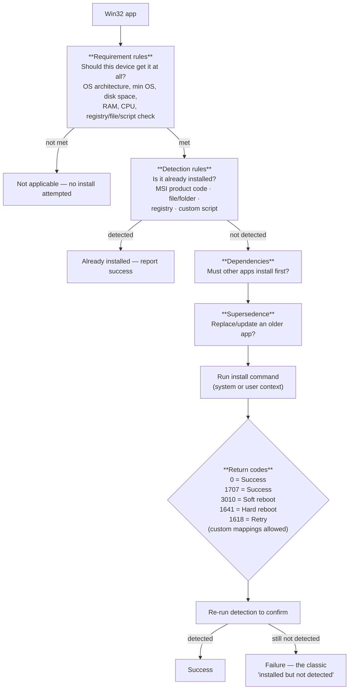
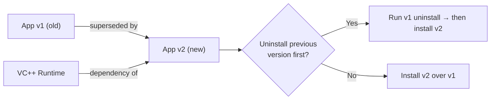
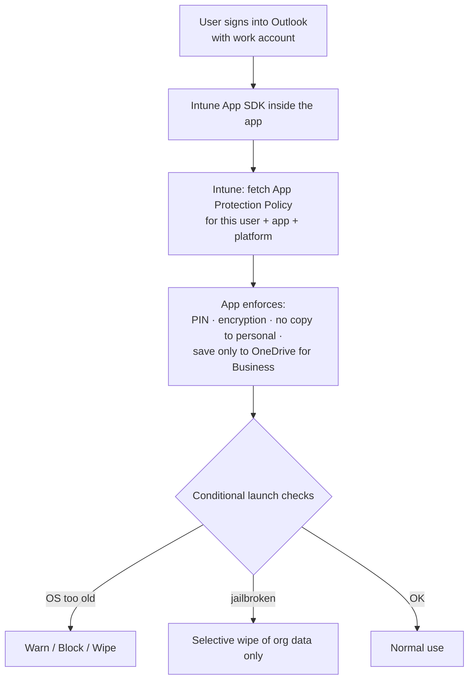
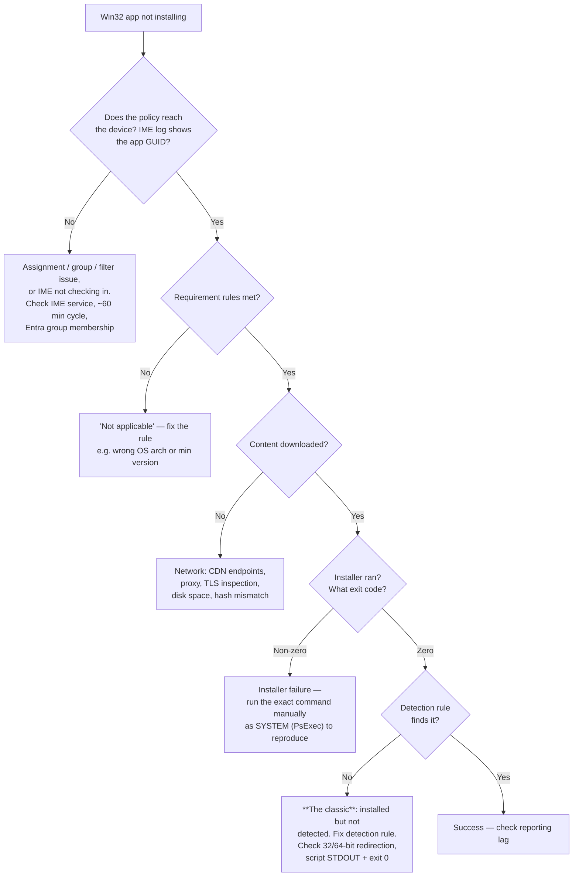
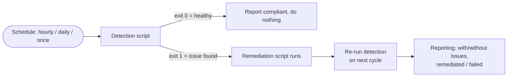

# Part F — Application Management & Deployment

> **Section goal:** Apps generate more Intune support tickets than anything except enrollment. By the end of this Part you will be able to describe every app type, package and troubleshoot a Win32 app end to end, explain detection/requirement/dependency/supersedence rules precisely, read the IME log, and explain App Protection Policies (MAM) with confidence.

Covers index items **41–50**. Maps to JD: *"Client Side Support"*, *"Sound troubleshooting skills"*, *"Production system experience with Windows 11"*, *"Experience with iOS and Android"*.

**Assumes:** [Part C](Part-C-intune-architecture.md) (IME vs MDM channel) and [Part E](Part-E-configuration-and-compliance.md) (assignments, filters).

---

## 41. The app types

### Windows

| Type | What it is | Delivered by | When to use |
|---|---|---|---|
| **Win32 app (`.intunewin`)** | Any Windows installer wrapped with the **Microsoft Win32 Content Prep Tool** | **IME** | The workhorse — EXE, MSI, script-driven installs, complex apps |
| **Line-of-business (LOB) app** | A raw `.msi` uploaded directly | MDM channel (EnterpriseDesktopAppManagement CSP) | Simple MSIs; largely superseded by Win32 |
| **Microsoft Store app (new)** | Apps from the new Store, including **WinGet**-sourced Win32 apps | IME (via WinGet) | Modern, self-updating public apps |
| **Microsoft Store app (legacy/UWP)** | Older Store integration | MDM channel | Deprecated path |
| **Microsoft 365 Apps** | Office click-to-run, configured in Intune's UI or with an XML config | MDM/Office CDN | Office deployment and update channel control |
| **Web link** | A shortcut/tile pointing to a URL | Company Portal | Cheap "apps" that are really web apps |
| **Windows app (Win32) via Enterprise App Management** | Microsoft-curated catalog apps with packaging and **patching** handled for you | IME | Intune Suite feature — reduces packaging toil |
| **MSIX / App Installer** | Modern packaging format | Varies | Newer app packaging |

### Apple

| Type | Notes |
|---|---|
| **iOS/iPadOS store app** | From the App Store, by bundle ID |
| **VPP / Apps and Books app** | Purchased through Apple Business Manager; licensed by **device** or by **user** |
| **iOS/iPadOS LOB app (`.ipa`)** | In-house signed apps |
| **Built-in apps** | Curated Microsoft apps |
| **macOS: LOB (`.pkg`)**, **DMG app**, **Store/VPP**, **Microsoft 365 for macOS**, **Microsoft Edge/Defender for macOS** | `.pkg` and `.dmg` are delivered via the Intune macOS agent |
| **Web clip** | Home-screen shortcut |

### Android

| Type | Notes |
|---|---|
| **Managed Google Play app** | The standard for Android Enterprise; approved in managed Google Play and synced to Intune |
| **Managed Google Play private/web app** | LOB or web app published privately to your org |
| **Android Enterprise system app** | Enable an OEM-preinstalled app |
| **Android LOB app (`.apk`)** | Legacy device-administrator scenarios and AOSP |

---

## 42. Win32 app anatomy — the deep dive

**In one sentence:** a Win32 app in Intune is an installer plus a set of *rules* that tell Intune when to install it, how to install it, and how to know it worked.

### The packaging step

```
IntuneWinAppUtil.exe -c <source folder> -s <setup file> -o <output folder> [-q]
```

- Produces a single encrypted **`.intunewin`** file containing the whole source folder.
- The `-s` setup file becomes the package's recognised entry point; for MSIs, the tool extracts MSI metadata (product code, version) automatically.
- **The whole folder is included** — so keep it clean; a bloated source folder means slow downloads for every device.

### The four rule sets you must configure



### 🔍 Plain-English deep-dive: detection rules

- **What they are:** the test Intune runs to decide "is this app present?" It runs **before** install (to skip unnecessary work) and **after** install (to confirm success).
- **Analogy:** a delivery driver checking whether the parcel is already on your porch, then checking again after they put it there.
- **Why they cause so much pain:** if the rule is wrong, Intune concludes the install failed even though it worked. The app then retries endlessly, ESP hangs, and reports show failure forever. **This is the single most common Win32 app support case.**
- **Rule types:**
  - **MSI product code** — reliable for MSIs; can also check version.
  - **File or folder** — path exists, version, size, date. Beware `Program Files` vs `Program Files (x86)` and the **32-bit redirection trap** (a script running 32-bit sees `SysWOW64`).
  - **Registry** — key exists, value equals/greater-than, string compare. Beware `HKLM\SOFTWARE\WOW6432Node`.
  - **Custom detection script (PowerShell)** — the most flexible. **The rules:** it must write something to **STDOUT** *and* **exit with code 0** to indicate "detected". Exit non-zero, or produce no output, and the app is considered not installed. Script runs in **64-bit** only if you tick the 64-bit option, otherwise 32-bit.
- **Best practice:** detect something the installer *actually creates* and that is version-specific — e.g. the app's own uninstall registry key with a `DisplayVersion` comparison.

### Install context: system vs user

| | System context | User context |
|---|---|---|
| Runs as | `SYSTEM` | The signed-in user |
| Use for | Machine-wide installs (most apps) | Per-user apps, HKCU settings, apps that must not require admin |
| Trap | `%APPDATA%`/`HKCU` refer to SYSTEM's profile, not the user's | No user signed in → nothing happens (ESP device phase, kiosk) |
| ESP phase | Device setup | Account setup |

### Return codes and restart behaviour

- **Return codes** map installer exit codes to Intune outcomes: *Success*, *Failed*, *Soft reboot*, *Hard reboot*, *Retry*. Defaults cover `0`, `1707`, `3010`, `1641`, `1618`; add custom mappings when a vendor installer uses its own codes.
- **Device restart behaviour**: *Determine behaviour based on return codes* (recommended), *No specific action*, *App install may force a device restart*, *Intune will force a mandatory device restart*.
- **Retry:** Intune retries a failed install (typically up to 3 attempts) with a wait between attempts.

### Assignment intents

| Intent | Behaviour |
|---|---|
| **Required** | Installed automatically |
| **Available for enrolled devices** | Appears in Company Portal for the user to install |
| **Available with or without enrollment** | Store/VPP/managed Google Play apps for MAM scenarios |
| **Uninstall** | Actively removes the app |

Plus per-assignment settings: **delivery optimization priority** (background vs foreground), **notifications** (show all / show reboot only / hide), **restart grace period**, **installation deadline / available time** (required apps), and **filters**.

> ⚠️ **Conflict rule:** if a user or device ends up with both **Required** and **Uninstall** for the same app, **Uninstall wins**. This surprises people; it's a common cause of "the app installs then disappears."

---

## 43. Dependencies and supersedence

### Dependencies

- "Install app B before app A."
- Configurable as **automatically install** the dependency or only proceed if it's already present.
- Chains are allowed but limited in depth; deep chains are fragile.
- **Failure mode:** a dependency that itself has a bad detection rule blocks everything above it, and the failure is reported on the *parent*, which sends people looking in the wrong place.

### Supersedence

- "This app replaces that app" — with the option to **uninstall the previous version** first, or install over the top (update).
- Used for version upgrades and for replacing a competitor product.
- **Failure modes:** supersedence loops (A supersedes B, B supersedes A), or an uninstall command that doesn't work silently, leaving devices with neither version.



> 💡 **Interview-quality caution:** "Dependencies and supersedence are powerful but they turn app deployment into a graph. I keep the graph shallow, I test the uninstall command manually before I trust it, and when troubleshooting a failing app I always check whether the failure is really in a dependency, because Intune reports it against the parent."

---

## 44. Delivery Optimization and content distribution

**The problem:** 5,000 devices in one office all downloading a 2 GB installer would melt the WAN link.

| Mechanism | What it does |
|---|---|
| **Delivery Optimization (DO)** | Windows' peer-to-peer + HTTP download technology. Devices share content with peers on the same LAN/group, reducing internet pulls |
| **DO download modes** | 0 HTTP only · 1 LAN peering · 2 Group (by AD site / DHCP option / DO group ID) · 3 Internet peering · 99 Simple (no peering) · 100 Bypass (legacy, use BITS) |
| **DO policies in Intune** | Max cache size/age, bandwidth limits (absolute or % of throughput), foreground vs background limits, peer selection group |
| **Microsoft Connected Cache** | A server-side cache (standalone, on ConfigMgr distribution points, or as a managed cache) that serves Intune app content, Windows Update and M365 content locally |
| **BITS** | Background Intelligent Transfer Service — legacy background download used by some paths |
| **CDN** | App content is served from Azure Content Delivery Network endpoints — these must be reachable and **must not be TLS-inspected** (see [Part J](Part-J-networking-for-intune.md)) |

**Support relevance:** "apps download very slowly at branch offices" is nearly always a DO/Connected Cache design conversation, not an Intune bug. "Apps fail to download at all" is nearly always a proxy/TLS-inspection/endpoint problem.

---

## 45. Microsoft Store apps, WinGet and Enterprise App Management

- The **Microsoft Store app (new)** type in Intune uses the **WinGet** ecosystem, so public apps stay updated by the Store rather than by you repackaging.
- **Enterprise App Management (Intune Suite)** provides a **Microsoft-curated app catalog** where Microsoft packages and, importantly, **patches** common third-party apps — a direct answer to the "packaging treadmill" pain point.
- **Why this matters in an interview:** it's a strong example of Microsoft turning a support cost (endless repackaging, unpatched third-party apps as an attack vector) into a product capability. Naming it shows current knowledge.

---

## 46. Microsoft 365 Apps deployment

- Deployed as a dedicated app type; you choose architecture, **update channel** (Current, Monthly Enterprise, Semi-Annual Enterprise, plus preview channels), languages, which apps to include/exclude, and whether to remove other Office versions.
- Advanced control uses an **XML configuration** from the Office Customization Tool.
- **Support angles:** channel mismatches between users, activation/licensing issues, the shared computer activation setting for VDI/multi-session, and clashes with an existing MSI Office install.

---

## 47. App Protection Policies (MAM)

**In one sentence:** App Protection Policies protect *corporate data inside an app*, on devices you may not manage at all.

**Analogy:** the company gives you a locked briefcase. You can carry it in your own car, but you can't photocopy what's inside, you can't leave it in a café, and if you resign, they can empty the briefcase without touching your car.

### What APP can enforce

| Category | Examples |
|---|---|
| **Data relocation** | Block/allow copy-paste between managed and unmanaged apps; restrict "Save As" to approved locations (OneDrive for Business, SharePoint); block screen capture (Android); restrict data transfer to other apps; block printing; manage web content transfer (open links in Edge) |
| **Access** | Require a PIN or biometric on the app; PIN complexity; number of attempts before wipe; require corporate credentials; block on jailbroken/rooted; offline grace period; minimum app/OS/patch version |
| **Conditional launch** | Rules with actions: *warn*, *block access*, *wipe data* — e.g. "min OS version 16.0, else block", "device is jailbroken, else wipe" |
| **Encryption** | Encrypt org data at rest within the app |
| **Selective wipe** | Remove only corporate data from the app, leaving personal data intact |

### 🔍 Plain-English deep-dive: how MAM works without enrollment

- Microsoft apps (Outlook, Teams, Edge, Word, OneDrive…) are built with the **Intune App SDK**. Third-party apps can be wrapped with the **App Wrapping Tool** or built with the SDK.
- When a user signs into the app with a work account, the app calls Intune, receives the policy, and *enforces it itself*.
- **This is why MAM works on unenrolled devices** — the enforcement lives in the app, not the OS.
- The Conditional Access grant control **"Require app protection policy"** lets you allow access from unmanaged devices *only through* protected apps — a very common BYOD design.

### MAM concepts and gotchas

- **MAM-WE** = "MAM without enrollment."
- **Policy targeting** is to **users**, not devices (with an app + platform + managed-state selector: all device types / unmanaged only / managed).
- **Priority** matters: if a user is in multiple APP policies for the same app, the policy with the **highest priority (lowest number)** applies. Say this — it's an exam-style detail.
- **Windows MAM** exists for Edge and M365 apps (an evolution of the retired Windows Information Protection).
- **Common cases:** users prompted for a PIN they didn't expect (two policies, priority confusion), "can't save file" (data relocation rules), "can't open link" (web content transfer set to Edge), copy-paste blocked, and *"my personal data was wiped"* — which it wasn't, because selective wipe is scoped.



---

## 48. iOS VPP, Android managed Google Play, macOS apps

### iOS/iPadOS VPP (Apps and Books)

- Buy app licences in **Apple Business Manager**, upload the **VPP token** to Intune (valid one year).
- **Device-licensed** vs **user-licensed**: device licensing doesn't require an Apple ID on the device and is preferred for shared/supervised devices; user licensing consumes a licence per Apple ID.
- Failure modes: token expired, licence count exhausted, wrong licence type for the enrollment model, region mismatch between the ABM location and the app.

### Android managed Google Play

- Apps are **approved** in managed Google Play, then synced to Intune and assigned.
- Private apps and web apps can be published to your organization only.
- Failure modes: Play endpoints blocked, binding broken, app not approved, app not available in the device's country, GMS missing.

### macOS

- **`.pkg` (LOB)** and **`.dmg`** app types delivered by the Intune macOS agent; **VPP/Store**; **Microsoft 365 for macOS**; **Edge**; **Defender**.
- **Shell scripts** and **custom attributes** for anything else.

---

## 49. Troubleshooting apps — the practical playbook

### The Windows Win32 log trail

**Primary log:** `C:\ProgramData\Microsoft\IntuneManagementExtension\Logs\IntuneManagementExtension.log`
Other logs in that folder: `AgentExecutor.log` (script execution), `ClientHealth.log`, `Win32AppInventory.log`, `HealthScripts.log` (remediations), `Sensor.log`.

**Read them with [CMTrace](https://learn.microsoft.com/mem/configmgr/core/support/cmtrace) or Support Center OneTrace** — they're ConfigMgr-style logs and are painful in Notepad. Saying "I'd open it in CMTrace" is an instant credibility marker.

**What to search for, in order:**

| Search term | Tells you |
|---|---|
| The app's **name** or **GUID** | All lines for that app |
| `Get-Policy`, `PolicyGet`, `[Win32App]` | Whether the app policy even reached the device |
| `Detection` / `detected` | Detection rule evaluation and its verdict |
| `ApplicabilityState` / `Requirement` | Whether requirement rules said "not applicable" |
| `Download`, `content`, `CDN` | Content download progress and failures |
| `ExitCode`, `Execution`, `installer` | The installer's actual exit code |
| `DownloadFailed`, `hash`, `decrypt` | Content integrity/proxy interference |
| `Waiting for install` / `dependency` | Blocked by a dependency |
| `ESPPhase`, `TrackedApp` | ESP interaction |

**Content cache location:** `C:\Program Files (x86)\Microsoft Intune Management Extension\Content\` (staging/incoming) — useful to prove whether content actually arrived.

### The decision tree



### Reproducing like a professional

- Run the **exact** install command manually in an elevated prompt — then again **as SYSTEM** (e.g. with PsExec `-s`) because behaviour differs.
- Test the **detection script** standalone: does it write to STDOUT *and* exit 0 when the app is present, and produce nothing/non-zero when it isn't?
- Check **32-bit vs 64-bit**: PowerShell launched 32-bit sees `C:\Program Files (x86)` and `HKLM\SOFTWARE\WOW6432Node`.
- Verify the installer is genuinely **silent** — an installer that shows a dialog under SYSTEM will hang forever with no visible window.

### Common root causes, ranked

1. Detection rule wrong (by a wide margin).
2. Installer isn't truly silent, or needs an argument you didn't pass.
3. Wrong install context (user vs system).
4. Requirement rule excludes the device unintentionally.
5. Content download blocked by proxy/TLS inspection, or disk space.
6. Dependency failing silently.
7. Non-standard exit code not mapped, so success is reported as failure (or vice versa).
8. Supersedence uninstall command failing.
9. App needs a reboot before detection succeeds.
10. IME unhealthy / not installed / service stopped.

---

## 50. Scripts and Remediations

### PowerShell scripts (Windows)

- Delivered by IME; run **once** by default (they re-run only if the script content changes or you toggle the setting).
- Options: run in **system** or **user** context; **run as 32-bit** or 64-bit; **enforce script signature check**.
- Logged in `AgentExecutor.log`.
- **Weaknesses:** run-once semantics, limited output visibility, no built-in retry logic, hard to prove state. Use them sparingly.

### Remediations (proactive remediations)

**In one sentence:** a pair of scripts — a **detection** script and a **remediation** script — run on a schedule, so the device fixes itself.



- **The contract:** detection script exits **0** = no issue; exits **1** = issue detected → remediation runs. Output to STDOUT is captured for reporting (with an option to include pre/post remediation output).
- Requires Windows 10/11 Enterprise/Education/Pro (with appropriate licensing) and is surfaced in Endpoint Analytics.
- **Why this matters for this role:** remediations are the cleanest way to turn a recurring support ticket into an automated self-heal — exactly the "systemically solve customer needs" language in the JD. Have an example ready.

### macOS / Linux shell scripts

- macOS shell scripts run as root by default, on a schedule you choose, with a configurable retry count.
- macOS **custom attributes** collect data from devices via script output.
- Linux supports custom configuration and custom compliance via scripts.

---

## 📌 Part F quick-reference sheet

| Term | One-line meaning |
|---|---|
| `.intunewin` | Encrypted package produced by the Win32 Content Prep Tool. |
| `IntuneWinAppUtil.exe -c -s -o` | The packaging command. |
| Requirement rule | Should this device get the app at all? |
| Detection rule | Is the app already/now installed? **The #1 source of app tickets.** |
| Detection script contract | Write to STDOUT **and** exit 0 = detected. |
| WOW6432Node / `Program Files (x86)` | The 32-bit redirection trap in detection rules and scripts. |
| System vs user context | SYSTEM machine-wide vs the signed-in user's profile. |
| Return codes | 0/1707 success · 3010 soft reboot · 1641 hard reboot · 1618 retry · custom mappable. |
| Required / Available / Uninstall | Assignment intents. **Uninstall beats Required.** |
| Dependency | Install B before A. Failures surface on the parent. |
| Supersedence | Replace an older app, optionally uninstalling it first. |
| Delivery Optimization | Peer-to-peer + HTTP content distribution; modes 0/1/2/3/99/100. |
| Connected Cache | Local cache server for Intune/Windows Update/M365 content. |
| Enterprise App Management | Intune Suite catalog with Microsoft-managed packaging **and patching**. |
| VPP / Apps and Books | Apple licence purchasing; device-licensed vs user-licensed; annual token. |
| Managed Google Play | Approve-and-sync model for Android Enterprise apps. |
| App Protection Policy (APP/MAM) | Protect corporate data inside apps, enrolled or not. |
| MAM-WE | MAM without enrollment. |
| Conditional launch | APP rules with warn/block/wipe actions. |
| Selective wipe | Remove only corporate data from the app. |
| APP priority | Lowest number wins when a user matches several policies. |
| `IntuneManagementExtension.log` | The Win32/script log. Read it in **CMTrace**. |
| `AgentExecutor.log` | Script execution log. |
| Remediation | Detection script (exit 0 healthy / 1 issue) + remediation script, on a schedule. |

---

## ⭐ Likely Interview Questions for This Section

**Q1. "A Win32 app reports failure but the software is clearly installed. What's happening?"**
> *Model answer:* "That's the classic detection-rule failure. Intune runs the detection rule after the installer exits; if it doesn't find what it expects, it reports failure regardless of the exit code, and it will keep retrying. The usual culprits are: the rule points at a path or registry key the installer doesn't actually create, or it checks a version format that doesn't match; 32-bit versus 64-bit redirection, so a rule or script running 32-bit is looking in `Program Files (x86)` or `WOW6432Node`; or a custom detection script that doesn't honour the contract — it must write something to STDOUT *and* exit 0 to mean 'detected'. I'd confirm by finding the app's GUID in `IntuneManagementExtension.log`, reading the detection evaluation lines, and testing the detection logic manually on the device as SYSTEM. Then I'd change the rule to check something the installer genuinely creates, ideally the app's own uninstall registry key with a version comparison."

**Q2. "Walk me through packaging and deploying a Win32 app."**
> *Model answer:* "I'd start with a clean source folder containing only what's needed, verify the silent install and silent uninstall commands manually — including as SYSTEM, because behaviour differs — then wrap it with `IntuneWinAppUtil.exe -c source -s setup.exe -o output` to produce the `.intunewin`. In Intune I'd upload it and set: the install and uninstall commands; the install context, system for machine-wide apps; requirement rules for architecture and minimum OS; detection rules based on something the installer really creates; return-code mappings if the vendor uses non-standard codes; restart behaviour driven by return codes; and dependencies or supersedence if relevant. Then I'd assign it to a pilot group as Required with notifications enabled, verify on real devices via the IME log, and only then expand. If it's going to be used during Autopilot, I'd think hard about whether it should be an ESP-blocking app, because a large or slow app there is a guaranteed support case."

**Q3. "Explain the difference between the MDM channel and the Intune Management Extension for apps."**
> *Model answer:* "The MDM channel is built into Windows and handles Store apps and MSI line-of-business apps through CSPs like EnterpriseModernAppManagement and EnterpriseDesktopAppManagement. The Intune Management Extension is a separate agent Intune installs, and it handles Win32 `.intunewin` apps, PowerShell scripts, Remediations and the new Microsoft Store apps via WinGet. They have different check-in cadences — the MDM channel is roughly every eight hours plus push, IME is roughly hourly — and completely different logs. That distinction is the first thing I establish, because if configuration profiles are applying but Win32 apps aren't, the MDM channel is healthy and I should be in the IME log, not the MDM event log."

**Q4. "What are App Protection Policies and when would you use them instead of enrolling the device?"**
> *Model answer:* "App Protection Policies protect corporate data inside apps rather than managing the device. They're enforced by the app itself, using the Intune App SDK — so they work on completely unenrolled, personally-owned devices. You can require a PIN or biometric on the app, encrypt org data at rest, block copy-paste and Save As to personal locations, force links to open in managed Edge, set conditional-launch rules that warn, block or selectively wipe based on OS version or jailbreak status, and selectively wipe only corporate data when someone leaves. I'd choose them for BYOD, contractors and any population where enrolling a personal device is culturally, legally or contractually unacceptable, and I'd pair them with the Conditional Access grant control 'require app protection policy' so unmanaged devices can still reach data, but only through protected apps. One detail that catches people out: APP is targeted to users, and when a user matches multiple policies for the same app, the lowest priority number wins."

**Q5. "Apps download very slowly for one branch office. What do you look at?"**
> *Model answer:* "First I separate 'slow' from 'failing'. If it's slow, this is a content-distribution design question, not an Intune fault: I'd look at Delivery Optimization configuration — is peering enabled and is the download mode appropriate, is the peer group scoped correctly by site or DHCP option, are bandwidth limits set too aggressively, and is the cache large enough not to evict content. For a branch with a thin WAN link the right answer is often Microsoft Connected Cache so content is served locally, plus scheduling large deployments outside business hours and using background download priority. If it's failing rather than slow, I'd pivot to the network path — the Azure CDN endpoints must be reachable and must not be TLS-inspected, and I'd look for hash or decryption failures in the IME log, which are the fingerprint of an inspecting proxy."

**Q6. "How do dependencies and supersedence work, and how do they go wrong?"**
> *Model answer:* "A dependency says 'install this other app first', optionally installing it automatically. Supersedence says 'this app replaces that one', optionally uninstalling the previous version before installing. They go wrong in predictable ways: a dependency with a bad detection rule blocks everything above it, and Intune reports the failure against the parent app, so people debug the wrong thing; deep dependency chains multiply the failure probability; supersedence uninstall commands that aren't truly silent leave devices with neither version installed; and circular supersedence relationships are a genuine mess. My rule is to keep the graph shallow, to test uninstall commands manually before trusting them, and when troubleshooting a parent app failure to always check whether the real failure is one level down."

**Q7. "What are Remediations and give an example of using them in a support role."**
> *Model answer:* "Remediations are paired detection and remediation PowerShell scripts that run on a schedule via the Intune Management Extension. The detection script exits 0 for healthy and 1 when it finds the issue; exit 1 triggers the remediation script, and the results are reported in Endpoint Analytics. The value for this role is that they convert a recurring ticket into a self-heal. A concrete example: if a customer keeps raising cases because a service on their devices is being stopped by something and users lose functionality, I'd write a detection script that checks the service state and start type, a remediation that restores and restarts it, schedule it hourly, and then use the reporting to measure how many devices were affected and how often. That gives me two things: the tickets stop, and I have hard data on frequency and blast radius to take to engineering as a problem-management item, rather than an anecdote."

**Q8. "An app is assigned as Required, installs, then disappears. Why?"**
> *Model answer:* "Most likely the same app is also assigned as Uninstall to a group the user or device is also in — and Uninstall takes precedence over Required, so the device installs it on one evaluation and removes it on the next, or removes it outright. I'd audit every assignment for that app, including exclusions and filters, and check group membership for the affected device. Other possibilities are a supersedence relationship where a superseding app uninstalls it, a detection rule that flaps so Intune keeps re-evaluating, or something outside Intune such as a competing management tool or a scheduled task removing it. The IME log will show the intent Intune received and the action it took, which settles the question quickly."

**Q9. "How do you deploy Microsoft 365 Apps and what goes wrong?"**
> *Model answer:* "Intune has a dedicated Microsoft 365 Apps app type where you choose architecture, update channel, languages, included and excluded apps, and whether to remove existing MSI Office installations — or you supply an XML from the Office Customization Tool for full control. What goes wrong: a pre-existing MSI-based Office install that isn't removed, so the install fails; different populations ending up on different update channels, which causes inconsistent behaviour and support confusion; activation and licensing problems, especially shared computer activation for VDI or multi-session; users on metered connections; and using it as an ESP-blocking app, where its size regularly blows the ESP timeout. My default advice is to keep Office out of the blocking app list during Autopilot unless there's a hard requirement."

**Q10. "You have five minutes on a user's machine and a failing app. What do you do?"**
> *Model answer:* "Open `C:\ProgramData\Microsoft\IntuneManagementExtension\Logs\IntuneManagementExtension.log` in CMTrace and search for the app name or GUID. In order I want to see: did the app policy arrive at all — if not it's assignment or IME check-in; did requirement rules mark it applicable; did content download succeed — hash or decrypt errors point at an inspecting proxy; what exit code did the installer return; and what did detection conclude afterwards. That sequence localises the failure to one of five places in under five minutes. If it's an installer failure I'd then run the exact command manually as SYSTEM to reproduce it with visible output, because that's where the real error message usually is."

**Q11. "Compare app deployment on Windows, iOS and Android."**
> *Model answer:* "Windows is the most flexible and the most work: Win32 packages you build yourself, with requirement, detection, dependency and supersedence rules, delivered by the Intune Management Extension, plus Store/WinGet apps and Microsoft 365 Apps. iOS is mostly store-based: App Store apps by bundle ID, and VPP apps purchased through Apple Business Manager with device or user licensing, which is why VPP token expiry and licence counts are common failure points; LOB `.ipa` apps require signing. Android Enterprise is approve-and-sync through managed Google Play, including private and web apps, so failures usually trace to the Play binding, app approval, country availability or blocked Google endpoints. The conceptual difference is that on Windows *you* own packaging and detection, whereas on iOS and Android the store owns installation and you mostly own licensing and assignment — which is why Enterprise App Management, where Microsoft packages and patches Windows apps for you, is such a meaningful addition."

---

## 🧠 30-Second Memory Hooks

- **Requirement = should you get it. Detection = do you have it. Return code = did it work. Detection again = prove it.**
- **Detection script contract: STDOUT + exit 0 = detected.** Nothing else counts.
- **32-bit blindness:** `Program Files (x86)` and `WOW6432Node` eat detection rules for breakfast.
- **Uninstall beats Required.** Always audit all assignments before believing a ghost.
- **0 / 1707 success · 3010 soft reboot · 1641 hard reboot · 1618 retry.**
- **IME log + CMTrace = the app-troubleshooting workbench.**
- **Hash / decrypt errors in the IME log = an inspecting proxy is eating your content.**
- **MAM = the locked briefcase.** Enforced by the app, so no enrolment needed. **Lowest priority number wins.**
- **DO peering + Connected Cache = the answer to "slow at branch offices".**
- **Remediation = detection exits 1 → fix runs.** Turn a ticket into a self-heal, then measure it.

---

*Next suggested section:* **[Part G — Endpoint Security & Protection](Part-G-endpoint-security.md)** — with configuration and apps covered, the remaining Intune surface is security: Defender, encryption, updates, certificates and the Intune Suite.
