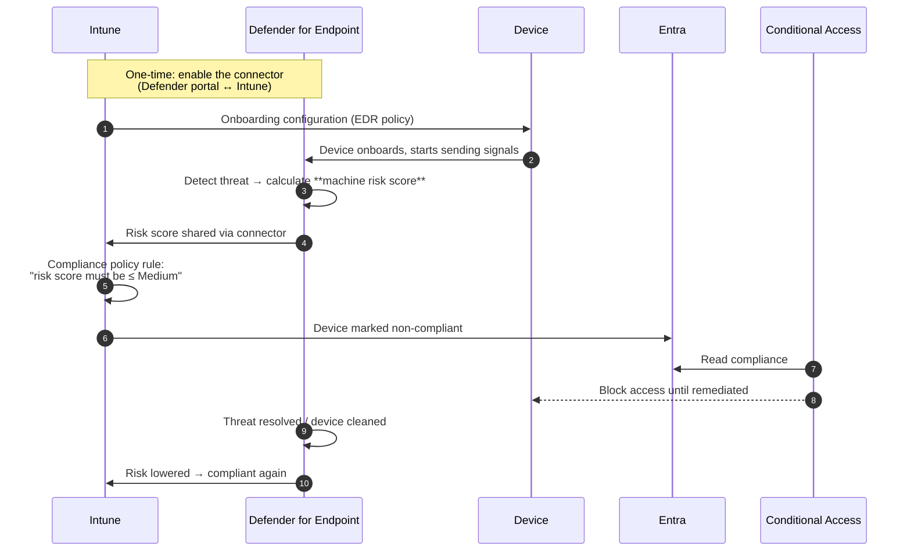
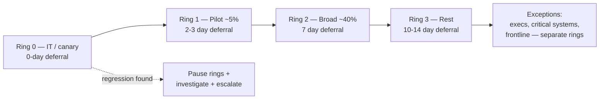
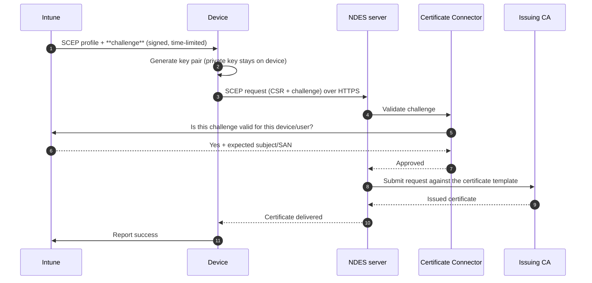

# Part G — Endpoint Security & Protection

> **Section goal:** Cover everything Intune does to *secure* an endpoint: Defender integration, antivirus and attack-surface reduction, disk encryption, firewall, LAPS, Windows Update for Business and Autopatch, the whole certificate story, the Intune Suite add-ons, and the device actions (wipe/retire/reset) you must never confuse.

Covers index items **51–60**. Maps to JD: *"Microsoft Security organization"*, *"Microsoft Defender"*, *"Production system experience with Windows 11"*, *"Lead supportability"*.

**Assumes:** [Part B](Part-B-entra-identity-and-access.md) (Conditional Access), [Part E](Part-E-configuration-and-compliance.md) (profiles vs compliance), [Part F](Part-F-app-management.md) (IME).

---

## 51. The endpoint security surface in Intune

Intune deliberately separates **general device configuration** (owned by the desktop/device team) from **endpoint security policies** (owned by the security team). Same underlying CSPs; different UI, different RBAC.

**Intune → Endpoint security** contains:

| Node | What it configures |
|---|---|
| **Security baselines** | Versioned, Microsoft-recommended bundles (Windows, Defender for Endpoint, Edge, Microsoft 365 Apps) |
| **Antivirus** | Microsoft Defender Antivirus settings, Windows Security experience, Defender for macOS/Linux |
| **Disk encryption** | BitLocker (Windows), FileVault (macOS), Personal Data Encryption |
| **Firewall** | Windows firewall profiles, rules, and **firewall rule migration** from existing GPO/local rules |
| **Endpoint detection and response (EDR)** | Defender for Endpoint onboarding and EDR settings |
| **Attack surface reduction** | ASR rules, exploit protection, web protection, device control, application control |
| **Account protection** | Windows Hello for Business, **LAPS**, local user group membership |
| **Device compliance / Conditional Access** | Shortcuts into those areas |
| **Endpoint Privilege Management** | Intune Suite — elevation rules |
| **Security tasks** | Requests from Defender for Endpoint's Threat & Vulnerability Management for Intune admins to remediate |

> 💡 **Interview point about *policy sprawl*:** the same setting can often be delivered by a security baseline, an endpoint security policy, a Settings Catalog profile, and a legacy template. That's four ways to set one thing — and a conflict waiting to happen. A good answer is: *"pick one authoring surface per setting domain and stick to it; document the decision; use the per-setting status view to detect overlap."*

---

## 52. Microsoft Defender for Endpoint integration

**In one sentence:** Defender for Endpoint (MDE) is Microsoft's EDR — endpoint detection and response — and Intune is how you onboard devices to it and act on what it finds.

### 🔍 Plain-English deep-dive: EPP vs EDR vs XDR

- **EPP (Endpoint Protection Platform)** — *prevention*: antivirus, firewall, device control. **Analogy:** the locks and alarm on the house.
- **EDR (Endpoint Detection and Response)** — *detection and investigation*: records behaviour, spots suspicious patterns, lets you hunt and respond (isolate a device, collect an investigation package, run live response). **Analogy:** CCTV plus a security team that can lock the doors remotely.
- **XDR (Extended Detection and Response)** — *correlation across domains*: endpoint + email + identity + cloud apps + cloud workloads, in one incident. **Analogy:** the whole city's security operations centre joining the dots between the house, the car and the office.
- **SIEM** — Security Information and Event Management (e.g. **Microsoft Sentinel**): log aggregation, correlation and long-term analytics across everything. **SOAR** adds automated response playbooks.

### How the integration works

### What you should be able to name

| Concept | Meaning |
|---|---|
| **Onboarding** | Connecting a device to the MDE service (Intune delivers the onboarding blob via an EDR policy) |
| **Machine risk score** | None / Low / Medium / High — the compliance input |
| **Security tasks** | MDE's Threat & Vulnerability Management raises a task ("update this app on 400 devices") that appears in Intune for the Intune admin to action — a great example of security↔ops workflow |
| **Live response** | Remote shell into a device from the Defender portal for investigation |
| **Device isolation** | Cut a compromised device off the network but keep MDE connectivity |
| **Automated investigation and response (AIR)** | Automatic triage and remediation of alerts |
| **Tamper protection** | Prevents local changes to Defender settings, including by malware and by local admins |
| **Defender for Business** | The SMB edition, included in Microsoft 365 Business Premium |
| **Cross-platform** | MDE runs on Windows, macOS, Linux, iOS and Android |

**Common support cases:** connector not configured or expired; devices onboarded but not appearing (network/proxy to MDE endpoints); risk-based compliance flapping; conflicts where a third-party AV puts Defender into passive mode and expected settings don't apply; onboarding via multiple methods (GPO + Intune + ConfigMgr) fighting each other.

---

## 53. Antivirus, ASR and Windows Security

### Microsoft Defender Antivirus essentials

| Concept | What to know |
|---|---|
| **Real-time protection** | Always-on scanning; disabling it is the first thing malware tries |
| **Cloud-delivered protection (MAPS)** | Sends metadata to the cloud for near-instant verdicts; block-at-first-sight depends on it |
| **Sample submission** | Whether suspicious files are uploaded for analysis |
| **Signature/intelligence updates** | Frequency and fallback order (Microsoft Update, WSUS, Microsoft Malware Protection Center, file share) |
| **Exclusions** | Paths, extensions, processes. **A major security risk when over-used and a very common cause of "AV didn't catch it"** |
| **Passive mode** | Defender AV steps aside when a third-party AV is registered, but still provides EDR signals if onboarded to MDE |
| **Tamper protection** | Blocks changes to AV settings from outside the management channel — including your own GPO/registry changes, which surprises admins |
| **Network protection** | Blocks outbound connections to malicious domains/IPs |
| **Controlled folder access** | Anti-ransomware: only trusted apps may write to protected folders |
| **Potentially unwanted applications (PUA)** | Block adware/bundleware |

### 🔍 Plain-English deep-dive: Attack Surface Reduction (ASR)

- **What it is:** a set of *rules* that block specific behaviours commonly used by malware, regardless of whether the file is known-bad. **Analogy:** rather than recognising every burglar's face, you simply brick up the letterbox they always climb through.
- **Examples of rules:** block Office applications from creating child processes; block credential stealing from LSASS; block executable content from email and webmail; block untrusted and unsigned processes running from USB; block JavaScript/VBScript from launching downloaded executable content; block persistence through WMI event subscription.
- **Each rule has modes:** *Not configured*, **Audit** (log only), **Block**, **Warn**, and per-rule **exclusions**.
- **Why it matters for support:** ASR rules are the single most common cause of "our line-of-business app suddenly stopped working after a security policy change." **Always deploy in Audit mode first**, review the ASR report in the Defender portal, add targeted exclusions, then move to Block. Saying this unprompted is a strong signal.

### Related protections worth naming

- **Exploit protection** — memory-hardening mitigations (DEP, ASLR, CFG), configurable per app via XML.
- **Application control (WDAC / App Control for Business)** — allow-listing what code may run; strongest control, highest operational cost. **Smart App Control** is the consumer-facing relative.
- **Device control** — removable storage access, printer protection, Bluetooth.
- **Web protection / SmartScreen** — reputation-based blocking of malicious sites and downloads.
- **Credential Guard / Local Security Authority protection** — virtualization-based protection of secrets.
- **Memory integrity (HVCI)** — hypervisor-enforced code integrity; can break older drivers, a real support scenario.

---

## 54. Disk encryption

### BitLocker (Windows)

| Concept | What to know |
|---|---|
| **What it is** | Full-volume encryption using the TPM to protect the key |
| **Protectors** | TPM-only, TPM+PIN, TPM+startup key, recovery password, recovery key |
| **Silent enablement** | Intune can enable BitLocker without user interaction if prerequisites are met (TPM 2.0, UEFI, Secure Boot, no third-party encryption, the device is Entra joined and can escrow) |
| **Recovery key escrow** | The recovery password is stored on the **Entra device object** (and/or on-prem AD for hybrid). **If escrow fails, silent enablement is blocked** — this is deliberate |
| **Encryption method** | XTS-AES 128/256 for OS and fixed drives; AES-CBC for removable |
| **`manage-bde -status`** | The on-device truth: protection status, encryption percentage, method, protectors |
| **`manage-bde -protectors -get C:`** | Lists protectors including the recovery ID |
| **Recovery key access** | Entra portal / Intune device page (**audited**), Company Portal self-service, or `Get-MgInformationProtectionBitlockerRecoveryKey` via Graph |

**Common cases:** device shows non-compliant for encryption while `manage-bde` says "Encryption in progress" (percentage not yet 100); silent enablement blocked because escrow failed, or because a third-party encryption product is present, or the user is a standard user and interaction would be required; a device with no TPM; hardware where Secure Boot is off; recovery key not found because the device object was deleted and recreated.

### FileVault (macOS)

- Enabled by an Intune disk-encryption policy; the **personal recovery key** is escrowed to Intune and can be rotated.
- Enablement typically occurs at the next user logout/login; the user may be prompted.
- Users can retrieve their key through Company Portal if allowed.

### Mobile

- iOS/iPadOS: encryption is inherent once a passcode is set — hence "require a passcode" is effectively the encryption control.
- Android: encryption is standard on modern versions; work profile data is separately protected.

### Personal Data Encryption (PDE)

- A newer Windows capability encrypting user content with keys tied to Windows Hello for Business, protecting files even while the device is running but locked.

---

## 55. Firewall

- Intune configures the Windows Defender Firewall per profile (**Domain**, **Private**, **Public**): default inbound/outbound actions, notification behaviour, logging, stealth mode, and rule merge behaviour.
- **Firewall rules** can be authored in Intune, or **imported** using the firewall rule migration tool, which converts existing local/GPO rules into Intune policy — a genuinely useful migration answer.
- **Failure modes:** local rules being merged (or not) unexpectedly; a blanket "block all inbound" breaking an LOB app; rule ordering and specificity; conflicts between a security baseline's firewall settings and a separate firewall policy.

---

## 56. Windows LAPS

**In one sentence:** LAPS (Local Administrator Password Solution) automatically sets a **unique, random, rotating password** for the local administrator account on every device, and stores it securely in the directory.

**Analogy:** instead of every branch having the same spare key under the mat, every branch has a unique key held in the head-office safe, and it's changed monthly.

- **Why it matters:** a shared local admin password is one of the classic lateral-movement enablers — compromise one machine, own them all (**pass-the-hash**).
- **Windows LAPS** is built into modern Windows and can store passwords in **Entra ID** (cloud) or **on-prem AD**.
- Intune configures it via the **Account protection** node (LAPS CSP): which account, password complexity and length, rotation age, post-authentication actions (e.g. reset the password after the admin session ends).
- **Retrieving the password** is an audited action in the Entra/Intune portal, and can be RBAC-scoped.
- **Support cases:** the managed account doesn't exist or is the wrong one; the policy targets Entra storage but the device is hybrid and expected AD; backup failing so rotation never completes; permissions to read passwords not granted.

---

## 57. Windows Update for Business, Autopatch and update management

### The building blocks

| Object | What it does |
|---|---|
| **Update rings for Windows 10 and later** | The core: servicing channel, quality-update deferral (0–30 days), feature-update deferral (0–365 days), **deadlines and grace periods**, active hours, restart behaviour, user experience settings, pause capability |
| **Feature updates for Windows 10 and later** | Pin devices to a specific Windows feature version (e.g. keep on 23H2) and control the rollout |
| **Quality updates for Windows 10 and later (expedite)** | Force a specific security update quickly, bypassing deferrals — used for zero-days |
| **Driver updates for Windows 10 and later** | Approve/decline driver and firmware updates individually or automatically |
| **Windows Autopatch** | A Microsoft-run service that manages the whole update process for you — rings, progressive rollout, health monitoring, automatic pause on regression |
| **Windows Update for Business reports** | Log Analytics-based reporting on update compliance |
| **Delivery Optimization** | Bandwidth control for update content ([Part F](Part-F-app-management.md)) |

### 🔍 Plain-English deep-dive: deadlines vs deferrals vs grace periods

- **Deferral** — *"don't offer this update until N days after release."* **Analogy:** waiting a week before buying a newly released gadget so others find the bugs.
- **Deadline** — *"once offered, the device must install and restart within N days."* **Analogy:** a library due date.
- **Grace period** — *"even after the deadline, give the user at least N days/hours of active-hours protection before forcing a restart."* **Analogy:** the grace days before a late fee.
- **Why it matters:** these three interact, and misconfiguration produces both "devices never patch" (deferral too long, no deadline) and "my machine rebooted during a customer demo" (deadline hit with no grace/active hours). This is one of the highest-emotion support topics.

### The ring design pattern

**Common update support cases:** devices not scanning (Windows Update service/agent health, dual-scan with WSUS, a leftover WSUS GPO pointing devices at an on-prem server); "compliance says patched but the device isn't"; feature update blocked by a **safeguard hold** (Microsoft's compatibility block for known-bad hardware/driver combinations — an excellent thing to name); deadline/restart complaints; devices offline for months returning and installing everything at once; Windows 10 end-of-support and **ESU** conversations.

---

## 58. Certificates

Certificates underpin Wi-Fi (802.1X), VPN, S/MIME email signing/encryption, and app authentication. This is a dense area where a confident explanation is worth a lot.

### The delivery methods

| Method | How it works | Pros / cons |
|---|---|---|
| **SCEP** (Simple Certificate Enrollment Protocol) | Intune sends a **challenge**; the device generates a key pair **on the device** (private key never leaves it) and requests a cert from **NDES**, which passes it to the on-prem CA; the **Certificate Connector** validates the challenge with Intune | Best practice: private key never leaves the device. Requires NDES + connector + CA infrastructure — lots of moving parts |
| **PKCS** (PFX) | The **Certificate Connector** requests the certificate from the CA on the device's behalf and delivers the key pair to the device | Simpler for the device; the private key is generated server-side, which some security teams dislike. Supports S/MIME encryption where key recovery is needed |
| **PKCS imported** | Upload existing PFX certificates (typically S/MIME encryption certs to preserve historical decryption) | Key archival scenarios |
| **Microsoft Cloud PKI** (Intune Suite) | A **cloud-hosted CA** run by Microsoft — root and issuing CAs in Intune, no NDES, no on-prem PKI | Removes the most fragile on-prem dependency; a major recent addition |
| **Trusted root certificate profile** | Deploys the root/intermediate CA certificates so the chain validates | **Always required** — deploy the root *before* the leaf |
| **Derived credentials** | Certificates derived from a smart card, for high-security US-government scenarios | Specialist |

### The SCEP flow

### The failure points (and this is a favourite interview question)

| Failure | Symptom |
|---|---|
| **Trusted root not deployed, or deployed after the SCEP profile** | Certificate issued but not trusted; 802.1X fails |
| **NDES not reachable** from the device's network (internet-facing publishing, Entra App Proxy, or reverse proxy misconfigured) | SCEP request never arrives |
| **Certificate Connector service down / its own client certificate expired** | Challenges can't be validated; nothing is issued |
| **Certificate template misconfigured** (permissions, supply-in-request, key usage, validity, minimum key size) | CA rejects the request |
| **NDES service account / IIS request-filtering limits** (`maxQueryString`, `maxUrl`) | Long SCEP URLs rejected with HTTP 404.15 — a classic |
| **Clock skew** | Time-limited challenge invalid |
| **Subject/SAN variables wrong** (e.g. `CN={{DeviceName}}`, `{{AAD_Device_ID}}`, `{{UserPrincipalName}}`) | Cert issued with the wrong identity; RADIUS rejects it |
| **Renewal threshold** misconfigured | Certs expire before renewal; mass Wi-Fi outage on a specific day |
| **CA/NDES certificate expiry** | Everything stops at once |

> 💡 **A strong senior answer:** "Certificate infrastructure is the most common cause of catastrophic-looking Intune outages, because failures are silent until a mass expiry date arrives. For a Mission Critical customer I'd inventory every certificate and token with an expiry — NDES, the connector's own certificate, the CA certs, the APNs push certificate, ADE and VPP tokens — and put proactive monitoring and calendar reminders on all of them. That's preventive problem management rather than reactive support. And where possible I'd move them to **Microsoft Cloud PKI**, which removes the NDES tier entirely."

### Wi-Fi and VPN profiles

- **Wi-Fi profiles**: SSID, security type (WPA2/WPA3 Personal or Enterprise), EAP type (**EAP-TLS** with certificates, **PEAP-MSCHAPv2** with credentials), server trust (root CA + server name), and the client certificate to use.
- **VPN profiles**: connection type (native IKEv2/L2TP, or third-party like Cisco AnyConnect, Palo Alto, Check Point, F5, Zscaler), server list, authentication method, **per-app VPN**, always-on VPN, split tunnelling, proxy, DNS.
- **Microsoft Tunnel** (Intune Suite): a Microsoft-provided VPN gateway for iOS/Android giving per-app VPN and conditional access integration; **Tunnel for MAM** brings it to unenrolled devices.

---

## 59. The Intune Suite add-ons

Know what's in it — it comes up as "what's new in Intune?"

| Add-on | What it does | Why customers buy it |
|---|---|---|
| **Endpoint Privilege Management (EPM)** | Lets standard users elevate *specific* approved applications without being local admin — rules by file hash/publisher/path, with automatic or user-confirmed or support-approved elevation, and full audit reporting | Removes local admin rights — one of the highest-impact security wins — without breaking the users who genuinely need to install one specific tool |
| **Remote Help** | Authenticated, RBAC-controlled, cloud-based remote assistance with device compliance warnings and session auditing; supports Windows, Android and macOS | Replaces ad-hoc third-party remote tools that are themselves an attack vector |
| **Advanced Endpoint Analytics** | Anomaly detection, device timelines, enhanced device query across the fleet, custom scripted insights, battery health | Turns fleet telemetry into proactive problem management |
| **Microsoft Cloud PKI** | Cloud-hosted CA — issuing certificates without NDES or on-prem PKI | Removes the most fragile piece of Intune infrastructure |
| **Enterprise App Management** | Curated catalog with Microsoft-managed packaging **and patching** of common third-party apps | Kills the repackaging treadmill and closes third-party patch gaps |
| **Microsoft Tunnel for MAM** | Per-app VPN for unenrolled iOS/Android devices | BYOD access to internal resources without enrollment |
| **Specialized device management** | Management for devices like Meta Quest / AOSP fleets | Frontline and immersive scenarios |

> 💡 **Interview framing:** "Each Intune Suite component maps to a well-known *support cost*: EPM to local-admin incidents, Enterprise App Management to packaging and third-party patch debt, Cloud PKI to NDES fragility, Remote Help to unsanctioned remote tools, Advanced Analytics to reactive firefighting. That's a product strategy built from support pain, which is exactly what the Voice of the Customer function is supposed to produce."

---

## 60. Device actions — and never confusing them

| Action | What it does | Enrollment survives? | User data | Typical use |
|---|---|---|---|---|
| **Sync** | Ask the device to check in now | Yes | Untouched | Speed up policy |
| **Restart** | Reboot | Yes | Untouched | Apply pending changes |
| **Rename** | Change the device name | Yes | Untouched | Naming standards |
| **Retire** | Remove **company** data, apps and policies; leave personal data | **No** — device leaves management | Personal data kept | Employee leaves; BYOD offboarding |
| **Wipe** (factory reset) | Return the device to factory state | No | **Everything erased** | Lost/stolen device; device reissue. Options: keep enrollment state and user account (Windows), wipe with/without retaining user data |
| **Fresh Start** (Windows) | Remove pre-installed OEM apps and reinstall/refresh Windows, optionally keeping user data | Typically re-enrols | Optionally kept | Cleaning bloatware/misbehaving devices |
| **Autopilot Reset** (Windows) | Wipe user data, apps and settings; keep Entra join, Intune enrollment and Autopilot registration; return to a ready-to-use OOBE state | **Yes** | Erased | Reissuing a device to a new user |
| **Delete** (from Intune) | Remove the *record* from Intune | Device is unmanaged but not cleaned | Untouched | Cleaning stale objects — **doesn't touch the device** |
| **Remote lock** | Lock the screen | Yes | Untouched | Lost device, first response |
| **Reset passcode** | Clear/reset the device passcode | Yes | Untouched | Locked-out user |
| **Bypass Activation Lock** (iOS) | Use the stored bypass code | Yes | — | Supervised device stuck on a former user's Apple ID |
| **Rotate BitLocker recovery key / FileVault key** | Generate and escrow a new key | Yes | Untouched | Key was exposed |
| **Rotate local admin password (LAPS)** | Force rotation | Yes | Untouched | After an admin session or exposure |
| **Collect diagnostics** | Gather logs remotely into Intune | Yes | Untouched | **Support gold** — remote log capture without touching the device |
| **Fresh device actions: Quick scan / Full scan / Update signatures** | Defender actions | Yes | Untouched | Malware response |

> ⚠️ **The distinction to state clearly:** **Retire** removes company data and leaves personal data — the right action for BYOD offboarding. **Wipe** factory-resets everything — the right action for a lost corporate device. **Delete** only removes the Intune record and does nothing to the device, which is why it's the wrong tool for "get our data off that laptop."

---

## 📌 Part G quick-reference sheet

| Term | One-line meaning |
|---|---|
| EPP / EDR / XDR / SIEM | Prevent / detect+respond on endpoints / correlate across domains / aggregate all logs. |
| Machine risk score | MDE's None–High rating; consumed by Intune compliance. |
| Security tasks | MDE vulnerability findings handed to Intune admins to remediate. |
| Tamper protection | Blocks non-management changes to Defender settings. |
| Passive mode | Defender AV steps aside for third-party AV but can still feed EDR. |
| ASR rules | Behaviour blocks; **always Audit first, then Block**, with targeted exclusions. |
| Controlled folder access | Anti-ransomware write protection for key folders. |
| WDAC / App Control | Code allow-listing; strongest and most operationally expensive. |
| HVCI / memory integrity | VBS code integrity; can break old drivers. |
| BitLocker silent enablement | Needs TPM 2.0, UEFI/Secure Boot, no third-party encryption, successful **escrow**. |
| `manage-bde -status` | On-device encryption truth. |
| Recovery key escrow | Stored on the Entra device object; retrieval is audited. |
| FileVault | macOS encryption; personal recovery key escrowed to Intune. |
| LAPS | Unique, rotating local admin password stored in Entra/AD. |
| Update ring | Deferrals + deadlines + grace + active hours + restart behaviour. |
| Deferral / deadline / grace | Don't offer yet / must install by / protected time before forced restart. |
| Expedite quality update | Push a specific patch fast, bypassing deferrals. |
| Safeguard hold | Microsoft blocking a feature update on known-incompatible configurations. |
| Windows Autopatch | Microsoft-managed update rings, rollout and regression handling. |
| SCEP | Device generates the key; NDES + Certificate Connector + CA issue the cert. |
| PKCS | Connector requests the cert and delivers the key pair to the device. |
| Trusted root profile | Must be deployed (first) for the chain to validate. |
| Microsoft Cloud PKI | Cloud-hosted CA; removes the NDES tier. |
| EAP-TLS vs PEAP | Certificate-based vs credential-based 802.1X. |
| Microsoft Tunnel | Microsoft VPN gateway for iOS/Android; Tunnel for MAM covers unenrolled devices. |
| EPM | Elevate specific apps for standard users, with audit. |
| Remote Help | RBAC'd, audited remote assistance. |
| Retire vs Wipe vs Delete | Company data only / factory reset / just remove the record. |
| Autopilot Reset | Wipe user state, keep enrollment and Autopilot registration. |
| Collect diagnostics | Remote log capture — use it before asking a user to run tools. |

---

## ⭐ Likely Interview Questions for This Section

**Q1. "How does Defender for Endpoint integrate with Intune?"**
> *Model answer:* "You enable the connector between the Defender portal and Intune, then use an Intune endpoint-security EDR policy to deliver the onboarding configuration to devices. Once onboarded, Defender produces a machine risk score for each device. Intune compliance policies can include a rule such as 'device must be at or under Medium risk', so a compromised device automatically becomes non-compliant, Intune writes that to the Entra device object, and Conditional Access blocks access until it's remediated — after which the loop reverses automatically. The integration also flows the other way: Defender's threat and vulnerability management raises **security tasks** that appear in Intune for the endpoint team to action, for example updating a vulnerable app across a set of devices. That closes the gap between 'security found it' and 'operations fixed it', which is usually where organizations leak time."

**Q2. "You're asked to deploy ASR rules to 50,000 devices. How do you do it safely?"**
> *Model answer:* "I'd never go straight to Block. ASR rules block behaviours, not known-bad files, so they routinely catch legitimate line-of-business applications — Office spawning child processes and script-driven installers are the usual casualties. So: deploy every rule in **Audit** mode first across a representative sample of the estate, including the awkward business units; let it run long enough to cover monthly and quarterly processes, not just a week; review the ASR report in the Defender portal and hunt the audit events to see exactly what *would* have been blocked; add narrowly-scoped exclusions rather than disabling whole rules; then move to Block ring by ring with a clear rollback plan and a communication to the helpdesk so they can recognise ASR blocks. And I'd document which exclusions exist and why, because undocumented exclusions become permanent holes."

**Q3. "A device is non-compliant for encryption but the user says the disk is encrypted. How do you resolve it?"**
> *Model answer:* "I'd get device truth first with `manage-bde -status`, which shows protection status, encryption percentage, method and protectors. The most common answers are: encryption is genuinely in progress and not yet at 100%, so the compliance check legitimately fails; the OS drive is encrypted but a fixed data drive isn't, and the policy requires all fixed drives; the encryption method doesn't match the required method in policy; or protection is suspended, which happens after certain firmware or update operations. I'd also check whether **silent enablement** was blocked — it requires TPM 2.0, UEFI with Secure Boot, no third-party encryption product, and successful **recovery-key escrow**; if escrow fails, Intune deliberately does not enable BitLocker, because encrypting a drive whose recovery key nobody has is worse than not encrypting it. And I'd verify the recovery key is actually present on the Entra device object, because if the device object was deleted and recreated the key can be orphaned."

**Q4. "Explain SCEP versus PKCS."**
> *Model answer:* "Both deliver certificates to devices, but they differ in where the private key is created. With SCEP, Intune sends the device a signed, time-limited challenge; the device generates its own key pair, so the private key never leaves the device, and sends a certificate request to NDES; the Certificate Connector validates the challenge back to Intune and confirms the expected subject and SAN, and the CA issues against a template. With PKCS, the Certificate Connector requests the certificate from the CA on the device's behalf and delivers the key pair down to the device — simpler, and necessary for scenarios like S/MIME encryption where the key must be archived and recoverable, but the private key exists off-device at some point. SCEP is generally preferred for authentication certificates. Both need the **trusted root profile** deployed, ideally before the leaf certificate profile, or the chain won't validate and 802.1X will fail even though the certificate is present."

**Q5. "What breaks most often in certificate deployment?"**
> *Model answer:* "In rough order: the trusted root not being deployed or arriving after the leaf; NDES not reachable from the device's network because the publishing path — reverse proxy or Entra application proxy — is misconfigured; the Certificate Connector service being down or its own client certificate having expired; certificate template permissions and settings, particularly whether the subject is supplied in the request; IIS request-filtering limits on the NDES server rejecting long SCEP URLs, which shows up as HTTP 404.15; clock skew invalidating the time-limited challenge; and wrong subject or SAN variables so the certificate is issued with an identity RADIUS won't accept. The strategic answer is that all of this is an on-premises dependency chain with silent expiry dates, which is why **Microsoft Cloud PKI** matters — it removes NDES and the on-prem CA from the path entirely."

**Q6. "How do you design Windows Update rings for an enterprise?"**
> *Model answer:* "I'd build a small number of rings with progressive deferrals: a canary ring of IT and volunteers at zero deferral, a pilot ring of a few percent at two or three days, a broad ring at about a week, and the remainder at ten to fourteen days — with separate treatment for special populations like executives, frontline shift devices and machines attached to critical equipment. Each ring needs a **deadline** so devices actually patch, and a **grace period** plus active hours so nobody gets restarted mid-presentation. I'd pair that with the quality-update **expedite** capability for zero-days, feature-update policies to pin the OS version deliberately rather than drifting, and driver-update approval where hardware is sensitive. I'd monitor with Windows Update for Business reports, and I'd expect to explain **safeguard holds** to the customer, because 'why hasn't this device taken the feature update' is very often Microsoft deliberately protecting it from a known incompatibility. If the customer wants to stop running all this themselves, that's the pitch for **Windows Autopatch**."

**Q7. "What is Endpoint Privilege Management and what problem does it solve?"**
> *Model answer:* "EPM lets you remove local administrator rights from users while still allowing specific, approved applications to run elevated. You define elevation rules by publisher certificate, file hash or path, and choose whether elevation is automatic, user-confirmed with a justification, or requires support approval, and every elevation is audited and reported. The problem it solves is a big one: standing local admin is one of the most exploited weaknesses on endpoints, but organizations keep it because a handful of engineering, finance or clinical tools need it. EPM breaks that trade-off, and from a support perspective it also gives you data — you can see exactly which applications are demanding elevation and why, which turns a security debate into an evidence-based one."

**Q8. "Retire, Wipe, Delete, Autopilot Reset — a user is leaving and hands back a BYOD phone and a corporate laptop. What do you do?"**
> *Model answer:* "For the BYOD phone, **Retire** — it removes company apps, data, certificates and policies and leaves the user's personal content alone, which is both correct and legally important. For the corporate laptop, if it's going back into stock for someone else, **Autopilot Reset** is ideal because it wipes user data, apps and settings while keeping the Entra join, Intune enrollment and Autopilot registration, so it comes back ready to hand out; a full **Wipe** is the choice if you want factory state or if the device is lost or stolen. **Delete** is the one people misuse — it removes the record from Intune and does nothing at all to the device, so it never gets your data back; it's only for cleaning up stale objects. And I'd remember to remove the corresponding device object in Entra as well, or I'll create the duplicate-object problem that breaks Conditional Access later."

**Q9. "Why would Defender settings you deploy simply not apply?"**
> *Model answer:* "Several distinct reasons, and it's worth checking them in order. **Tamper protection** blocks changes to Defender settings from outside the sanctioned management channel — that's the point of it, but it surprises admins who try to set things by GPO or registry. A third-party antivirus being registered puts Defender AV into **passive mode**, so AV settings become inert even though EDR signals may still flow if the device is onboarded to Defender for Endpoint. There may be a **conflict** with a security baseline or another endpoint-security policy setting the same value. The device may be onboarded by more than one method — GPO, ConfigMgr and Intune — with competing configuration. The setting may not exist on that Windows edition or build. And the device may simply not have checked in yet. I'd confirm on the device with the Defender PowerShell cmdlets and the per-setting status in Intune rather than trusting the summary report."

**Q10. "Which Intune Suite features would you recommend to a customer generating a lot of support cases, and why?"**
> *Model answer:* "I'd tie each recommendation to their actual case data rather than pitching the bundle. If they have a lot of 'I need admin rights' and local-admin-related security incidents, **Endpoint Privilege Management**. If they have packaging backlogs and third-party patch gaps showing up in vulnerability reports, **Enterprise App Management**. If NDES or the certificate connector is a recurring outage source, **Microsoft Cloud PKI**. If the helpdesk is using unsanctioned remote-control tools, **Remote Help**, which is authenticated, RBAC-scoped and audited. If they're firefighting reactively, **Advanced Endpoint Analytics** for anomaly detection and fleet-wide device query. The framing I'd use is that each of these was built from a known support cost, so the business case is measurable — I'd quantify the current cost per ticket class first and show the expected reduction, which is exactly the problem-management approach this role is about."

---

## 🧠 30-Second Memory Hooks

- **EPP prevents · EDR detects and responds · XDR correlates · SIEM remembers everything.**
- **Defender risk → Intune compliance → Entra CA.** One sentence, whole Zero Trust endpoint story.
- **ASR: Audit → review → targeted exclusions → Block.** Never straight to Block.
- **Tamper protection means your registry hack won't work — by design.**
- **BitLocker silent enablement needs escrow to succeed.** No key escrow, no encryption.
- **`manage-bde -status` beats any report.**
- **LAPS = unique key per house, kept in the head-office safe, rotated.**
- **Deferral = don't offer yet · Deadline = must install by · Grace = protected time before forced restart.**
- **Safeguard hold = Microsoft protecting the device from a known-bad combination.**
- **SCEP: key born on the device. PKCS: key delivered to the device. Root profile first, always.**
- **Every certificate and token has a silent expiry date. Inventory and monitor them all.**
- **Retire = company data only · Wipe = everything · Delete = only the record · Autopilot Reset = keep enrollment.**

---

*Next suggested section:* **[Part H — Cross-Platform: iOS/iPadOS, macOS, Android, Linux](Part-H-cross-platform.md)** — everything so far has leaned Windows; the JD explicitly asks for iOS and Android experience, so this is the Part that closes the most common preparation gap.
