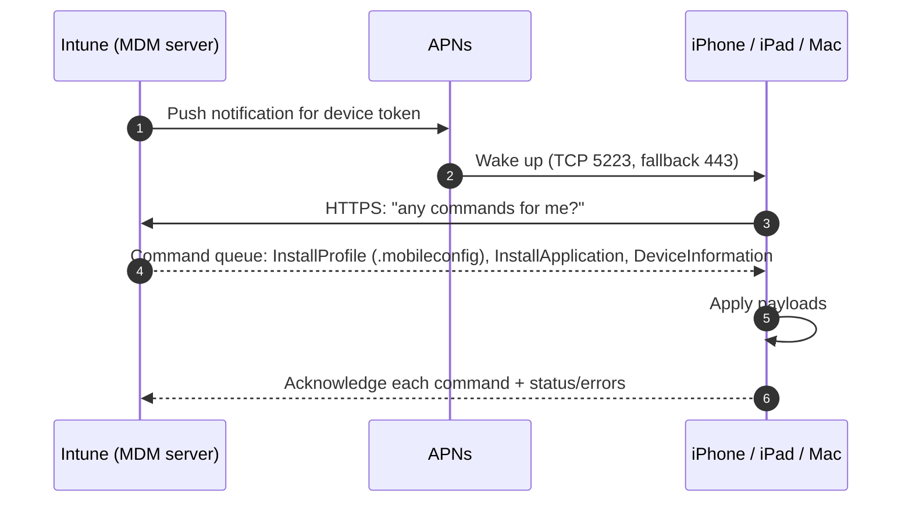
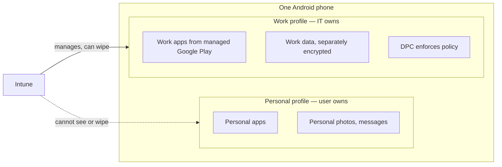

# Part H — Cross-Platform: iOS/iPadOS, macOS, Android & Linux

> **Section goal:** The job description explicitly asks for *"experience with iOS and Android devices and operating systems."* This is the Part most Windows-centric candidates under-prepare. By the end you will be able to explain Apple's and Google's management models properly, know exactly what breaks on each, and collect logs on all four platforms.

Covers index items **61–68**. Maps to JD: *"Experience with iOS and Android devices and operating systems"*, *"Demonstrated experience in Client Side Support, Hardware/OS"*.

**Assumes:** [Part D](Part-D-enrollment-and-autopilot.md) (enrollment methods, supervision, tokens) and [Part F](Part-F-app-management.md) (app types, MAM).

---

## 61. Apple's management model

### The mechanics

Apple defines its **own MDM protocol** — nothing to do with OMA-DM.

- The MDM server (Intune) sends **commands** (e.g. `InstallProfile`, `DeviceInformation`, `InstallApplication`, `EraseDevice`, `DeviceLock`, `ClearPasscode`) and **configuration profiles**.
- A **configuration profile** is an XML **property list (plist)** file with the extension **`.mobileconfig`**, containing one or more **payloads** (Wi-Fi payload, restrictions payload, VPN payload, certificate payload…).
- The device is nudged by **APNs** (Apple Push Notification service); it then connects outbound to the MDM server over HTTPS to collect commands.

### 🔍 Plain-English deep-dive: the four Apple things that expire

This is the single highest-value Apple knowledge for a support engineer.

| Item | Lifetime | What happens when it expires |
|---|---|---|
| **MDM push certificate (APNs)** | 1 year | **Every Apple device stops being manageable.** Must be renewed at the Apple Push Certificates Portal with **the same Apple ID**; renewing with a different Apple ID means all devices must re-enrol |
| **ADE / DEP token (enrollment program token)** | 1 year | New ADE devices can't be assigned; existing devices unaffected until re-enrollment |
| **VPP / Apps and Books token** | 1 year | App licence assignment and installation fail |
| **Apple Business Manager account** | Requires periodic re-acceptance of terms and a valid administrator | Token operations silently fail |

**Preventive practice:** use a **shared, organizational Apple ID** (not a departing employee's personal one), record which Apple ID owns each token, monitor the Tenant status page, and put calendar reminders 60/30/7 days out.

### Supervision — what it unlocks

**Supervised** is only achievable via **ADE (Automated Device Enrollment)** through Apple Business/School Manager, or via **Apple Configurator**.

| Capability | Unsupervised | Supervised |
|---|---|---|
| Basic restrictions (passcode, camera, iCloud backup) | ✅ | ✅ |
| **User can remove the management profile** | Yes | **No (with ADE)** |
| Block app removal / force app installation silently | ❌ | ✅ |
| Single App Mode / Autonomous Single App Mode (kiosk) | ❌ | ✅ |
| Restrict AirDrop, App Store, Safari, Game Center, Erase All Content | Limited | ✅ |
| Manage **Activation Lock** / obtain bypass code | ❌ | ✅ |
| Global HTTP proxy, Web content filter | ❌ | ✅ |
| Silently install/manage apps, allow-list apps | Limited | ✅ |
| Force OS updates / delay updates | Limited | ✅ |

> ⚠️ **"That restriction doesn't work" is, ~80% of the time, "that device isn't supervised."** Make this the first thing you check.

### Enrollment types recap (see [Part D](Part-D-enrollment-and-autopilot.md))

| Type | Supervised | Removable | Notes |
|---|---|---|---|
| **ADE (Automated Device Enrollment)** | Yes | No | Corporate, zero-touch, purchased via ABM/ASM |
| **Apple Configurator** | Yes | Varies | USB-based, for devices not bought via ABM |
| **Account-driven User Enrollment** | No | Yes | Modern BYOD: creates a **separate managed APFS volume** for work data, uses a Managed Apple ID, gives strong data separation with strong privacy |
| **Device enrollment (profile-based BYOD)** | No | Yes | Older BYOD model via Company Portal |
| **Account-driven Device Enrollment** | No | Yes | Corporate-owned without ABM |

---

## 62. Declarative Device Management (DDM)

**In one sentence:** instead of the server sending commands and polling for status, the device holds **declarations** describing the desired state, applies them itself, and **proactively reports** status changes.

**Analogy:** the difference between a manager phoning every hour to ask "have you done it yet?" (classic MDM) and giving the employee a written objective plus "tell me the moment anything changes" (DDM).

| Classic MDM | DDM |
|---|---|
| Server-driven, command-and-response | Device-driven, declaration-based |
| Server polls for status | Device pushes status changes |
| Scales poorly with many devices/commands | Much more scalable and responsive |
| Profiles (`.mobileconfig`) | **Declarations**: configurations, assets, activations, management |

**Where it shows up today:** software update enforcement (a much better OS-update experience than the old command model), passcode and account configurations, and a growing set of settings. Apple is steadily moving management to DDM, and Intune surfaces it (e.g. **Declarative Device Management for software updates**).

**Why to mention it in an interview:** it shows you're current, and it's directly relevant to supportability — DDM's proactive status reporting removes a whole class of "the command was sent but we don't know what happened" cases.

---

## 63. iOS/iPadOS specifics

### What you manage

| Area | Examples |
|---|---|
| **Device restrictions** | Camera, screenshots, App Store, Safari, AirDrop, iCloud sync/backup, Siri, factory reset, USB accessories, personal hotspot, Find My |
| **Passcode** | Required, length, complexity, auto-lock, grace period, failed-attempt wipe |
| **Wi-Fi / VPN / per-app VPN** | Certificate-based (EAP-TLS) or credential-based; per-app VPN routes only chosen apps |
| **Email profiles** | Native Mail configuration (Exchange ActiveSync) — note: only for enrolled devices; Outlook + APP is the more common modern answer |
| **App configuration policies** | Push settings *into* an app (e.g. pre-configure a server URL) — either via managed app configuration (MDM) or via the Intune App SDK for MAM |
| **Web content filter** | Supervised only |
| **Kiosk / Single App Mode** | Supervised only |
| **Software updates** | Delay visibility of updates (supervised), and DDM-based enforced update deadlines |
| **Certificates** | SCEP/PKCS/trusted root |
| **Conditional launch / APP** | For MAM scenarios |

### Common iOS support cases

| Symptom | Likely cause |
|---|---|
| All iOS devices unmanageable overnight | **APNs certificate expired** |
| Profile shows "Not applicable" | Setting requires supervision, or a newer iOS version, or the device is user-enrolled |
| App installs but is not configured | App configuration policy targeting or key/value mismatch; app doesn't support managed app config |
| VPP app fails | Token expired, licences exhausted, wrong licence type (device vs user), region mismatch |
| User removed management | Not ADE-enrolled, so the profile is removable |
| Device shows non-compliant "jailbroken" | Jailbreak detection false positives happen; check enhanced jailbreak detection settings |
| Enrollment stuck at "Remote Management" | Network/proxy blocking Apple endpoints; profile not assigned to that serial in ABM |
| Wiped device unusable | **Activation Lock** with a personal Apple ID; supervised devices can be bypassed with the stored code |
| Users complain about privacy | Explain what MDM can and cannot see: it cannot read personal email, texts, photos or browsing history; on personal devices it sees only managed app inventory |

---

## 64. macOS specifics

macOS is *not* "Windows with a different logo" — the management model is Apple's, but the OS behaves like a desktop.

| Capability | Notes |
|---|---|
| **Enrollment** | ADE (best — supervised, non-removable), Company Portal (user-driven), Apple Configurator |
| **Configuration** | Settings Catalog for macOS, templates, and **custom `.mobileconfig` preference-file profiles** for anything Apple exposes but Intune's UI doesn't |
| **FileVault** | Disk encryption with escrowed personal recovery key, rotation, and Company Portal self-service retrieval |
| **Platform SSO** | Extends Entra ID sign-in to the macOS login window — the Mac local account password can be synced with, or replaced by, the Entra credential (including passwordless/Secure Enclave-backed keys). **A major modern feature worth naming** |
| **Shell scripts** | Run as root, scheduled, with retry; the macOS analogue of PowerShell scripts |
| **Custom attributes** | Scripts that return data for reporting |
| **Apps** | `.pkg` LOB, `.dmg`, VPP/Store, Microsoft 365, Edge, Defender, Company Portal |
| **Endpoint security** | Defender for Endpoint on macOS, firewall, Gatekeeper, System Integrity Protection awareness |
| **Local account / admin management** | Standard vs admin, and privilege elevation options |
| **Software updates** | DDM-based enforced updates, or update policies |

**Common macOS cases:** profiles requiring **user approval** (some payloads need explicit approval unless the device is supervised via ADE — a classic reason "it applied but isn't working"); kernel/system extension approval for security agents; FileVault key escrow failures; scripts failing because of the macOS privacy framework (**TCC / Full Disk Access**) not being granted to the agent; Rosetta/architecture issues for Intel vs Apple silicon packages.

---

## 65. Android Enterprise in depth

### The work profile boundary

**In one sentence:** Android Enterprise creates a cryptographically separated **work profile** — a parallel set of apps and data with its own storage, badged with a briefcase icon — that IT controls, alongside the untouched personal profile.

### 🔍 Plain-English deep-dive: the DPC

- **DPC (Device Policy Controller)** — *the app on the device that receives policy from the management service and enforces it via Android's Device Policy Manager APIs.* **Analogy:** the site foreman who receives the plans and makes sure the building matches.
- In Intune: the **Microsoft Intune app** is the DPC for fully managed, dedicated and corporate-owned work profile modes; the **Company Portal** handles personally-owned work profile.
- **Why it matters:** if the DPC app is killed by aggressive battery optimization, or blocked from the network, the device silently stops receiving policy and drifts into "not evaluated" compliance. **Battery optimization on OEM Android skins is a genuine, recurring support cause** — many OEMs aggressively kill background apps.

### The modes, and what each can and cannot do

| Mode | Personal side | Device-wide controls | Wipe scope | Best for |
|---|---|---|---|---|
| **Personally-owned work profile** | Untouched, invisible to IT | None | Work profile only | BYOD |
| **Corporate-owned work profile (COPE)** | Present, mostly private | Some (e.g. block cameras device-wide, factory-reset protection) | Work profile or whole device | Corporate device with personal use allowed |
| **Fully managed (COBO)** | None | Full | Whole device | Corporate-only devices |
| **Dedicated / kiosk (COSU)** | None | Full, locked to app(s) | Whole device | Shared frontline, scanners, signage; supports **shared device mode** with Entra for fast user switching |
| **AOSP** | None | Limited (no Google services) | Whole device | Rugged/VR devices without GMS |
| **Device administrator (legacy)** | n/a | Legacy API | Whole device | **Deprecated** — migrate |

### Dependencies

- **Managed Google Play binding** between Intune and Google — created once, with an organizational Google account.
- **Google Mobile Services (GMS)** must be present and reachable for all non-AOSP modes.
- **OEMConfig** — a standard letting OEMs expose their proprietary settings (Samsung, Zebra, Honeywell…) through a schema-driven app that Intune can configure. **Naming OEMConfig marks you out as someone who has managed real Android fleets.**
- **Samsung Knox Mobile Enrollment / Google Zero-touch enrollment** — vendor zero-touch provisioning.
- **Play Integrity / SafetyNet attestation** — device integrity checks used in compliance.

### Common Android support cases

| Symptom | Cause |
|---|---|
| Enrollment fails | Managed Google Play binding broken; enrollment restriction blocking the mode; GMS unreachable |
| Apps never install | App not approved in managed Google Play; Play endpoints blocked; device country/app availability; insufficient storage |
| Compliance shows "not evaluated" | DPC killed by battery optimization; device offline; Play services disabled |
| Policy applies inconsistently across models | OEM behaviour differences; OEMConfig needed for vendor-specific settings |
| Work profile apps can't reach internal sites | Per-app VPN not configured, or DNS inside the work profile |
| Legacy devices going unmanaged | Google's device administrator deprecation |
| User complains IT can see personal data | Explain the work profile boundary — IT cannot see the personal side |

---

## 66. Linux management

- Supported for **Ubuntu LTS Desktop** and **RHEL** (current supported versions), via the **Microsoft Intune app** plus Microsoft Edge and the Entra device registration.
- Capabilities: device enrollment and inventory, **compliance policies** (OS version, password policy, encryption, custom compliance via bash script + JSON), **custom configuration** (JSON payloads), and Conditional Access through Entra registration.
- **Not** parity with Windows — no broad app deployment surface, more limited configuration.
- **Defender for Endpoint on Linux** is a separate, more mature offering commonly deployed on servers.

---

## 67. Log collection per platform

| Platform | How to collect | What you get |
|---|---|---|
| **Windows** | `MdmDiagnosticsTool.exe -area <areas> -cab out.cab`; Intune **Collect diagnostics** remote action; Event Viewer; IME logs | MDM event log, registry state, policy list, IME logs, Autopilot state |
| **iOS/iPadOS** | Company Portal → **Send/Share logs** (email or upload); Apple **sysdiagnose** (hold volume up+down+side buttons, or via a profile); Console.app on a connected Mac | Company Portal and MDM agent logs; full system diagnostics |
| **macOS** | Company Portal → Send logs; `sudo log collect`; `/Library/Logs/Microsoft/Intune/`; **Collect diagnostics** action; `profiles show` to list installed profiles | Agent logs, installed profiles, system log |
| **Android** | Company Portal / Intune app → **Send logs** (email or upload with an incident ID); `adb logcat` and `adb bugreport` for deep cases | App logs, device policy state |
| **Linux** | Intune agent logs under the user's app-data path; `journalctl` | Agent behaviour |
| **Server-side (all platforms)** | Intune → device → **Collect diagnostics**; Troubleshooting + support pane; per-policy device status; Graph | Server's view of policy delivery and status |

> 💡 **A real support habit worth stating:** "Before I ask a user to run anything, I use Intune's **Collect diagnostics** action, because it gets me logs without disturbing them and without depending on them following instructions correctly. On Apple and Android I ask the user to send logs from Company Portal and give me the incident ID, which correlates the upload to their device."

---

## 68. The cross-platform comparison matrix

Memorize the shape of this table; it lets you answer almost any "how does X differ on Y" question.

| Concept | **Windows** | **iOS/iPadOS** | **macOS** | **Android Enterprise** | **Linux** |
|---|---|---|---|---|---|
| **Protocol** | OMA-DM / SyncML | Apple MDM + DDM | Apple MDM + DDM | Android Management API | Intune agent |
| **Settings implemented by** | CSPs | Payloads in `.mobileconfig` | Payloads / preference files | Play/DPC policy | JSON config |
| **Push channel** | WNS | APNs (TCP 5223) | APNs | FCM | n/a |
| **Zero-touch provisioning** | Autopilot | ADE via ABM | ADE via ABM | Zero-touch / Knox ME | n/a |
| **Elevated management state** | n/a | **Supervised** | Supervised (via ADE) | Fully managed / dedicated | n/a |
| **BYOD model** | MAM (Edge/M365) or enrol | Account-driven User Enrollment or MAM | Enrol or MAM | Work profile or MAM | n/a |
| **App packaging** | You package (`.intunewin`) | App Store / VPP / `.ipa` | `.pkg` / `.dmg` / VPP | Managed Google Play | n/a |
| **App patching** | Yours (or Enterprise App Mgmt) | Store handles it | Store / vendor | Play handles it | Distro |
| **Encryption** | BitLocker | Passcode-implied | FileVault | Built-in + work profile | Policy check |
| **Scripting** | PowerShell + Remediations | ❌ none | Shell scripts + custom attributes | ❌ none (OEMConfig instead) | Shell |
| **Certificates** | SCEP/PKCS/Cloud PKI | SCEP/PKCS | SCEP/PKCS | SCEP/PKCS |  Limited |
| **Update control** | WUfB rings / Autopatch | DDM enforcement / delay (supervised) | DDM enforcement | OEM/Play + policy | Distro |
| **Compliance signals** | Rich (BitLocker, Secure Boot, Defender risk…) | Jailbreak, OS version, passcode, MDE risk | OS version, FileVault, MDE risk | Rooted, Play Integrity, OS version, MDE risk | OS version, encryption, custom |
| **Biggest recurring failure** | Detection rules, network path | **APNs/token expiry**, supervision | Profile approval, TCC permissions | Battery optimization killing the DPC, Play blocked | Limited surface |
| **Key log** | IME log + MDM event log | Company Portal logs / sysdiagnose | `/Library/Logs/Microsoft/Intune/` | Company Portal / Intune app logs | Agent log / journalctl |

---

## 📌 Part H quick-reference sheet

| Term | One-line meaning |
|---|---|
| `.mobileconfig` | Apple XML configuration profile made of payloads. |
| APNs | Apple push; TCP 5223; MDM push certificate renewed annually with the same Apple ID. |
| ABM / ASM | Apple Business/School Manager — source of ADE and VPP tokens. |
| ADE / DEP | Apple zero-touch enrollment; supervised and non-removable. |
| Supervised | Elevated Apple management state; unlocks most strong restrictions. |
| Activation Lock | Apple anti-theft; supervised devices support a bypass code. |
| Account-driven User Enrollment | Modern iOS BYOD with a separate managed data volume and Managed Apple ID. |
| DDM | Declarative Device Management — device holds declarations and reports proactively. |
| Platform SSO | Entra sign-in at the macOS login window. |
| TCC / Full Disk Access | macOS privacy framework that can block agents and scripts. |
| Work profile | Android's cryptographically separated corporate container. |
| DPC | Device Policy Controller — the app that enforces Android policy. |
| COPE / COBO / COSU | Corporate-owned personally-enabled / business-only / single-use (dedicated). |
| Managed Google Play | Approve-and-sync app catalog; requires the Intune↔Google binding. |
| GMS | Google Mobile Services — required for non-AOSP Android Enterprise. |
| AOSP management | Android without Google services (rugged, VR). |
| OEMConfig | Standard for exposing OEM-specific settings through a schema-driven app. |
| Knox ME / Zero-touch | Vendor zero-touch Android provisioning. |
| Play Integrity | Google's device integrity attestation used in compliance. |
| Battery optimization | The silent killer of Android policy delivery. |
| sysdiagnose / logcat / bugreport | Deep platform log collection on Apple / Android. |
| Collect diagnostics | Intune's remote log-collection action. |

---

## ⭐ Likely Interview Questions for This Section

**Q1. "Explain how Apple device management works, at a protocol level."**
> *Model answer:* "Apple uses its own MDM protocol, not OMA-DM. The MDM server queues commands — install profile, install application, device information, erase, lock — and sends a push through APNs to wake the device. The device then connects outbound over HTTPS, collects its commands, applies them and acknowledges with status. Configuration itself is delivered as `.mobileconfig` files, which are XML property lists made up of payloads: a Wi-Fi payload, a restrictions payload, a certificate payload and so on. Trust for the whole system depends on an MDM push certificate that expires annually and must be renewed with the same Apple ID. Apple is also moving toward Declarative Device Management, where the device holds declarations describing desired state and proactively reports status instead of the server polling — which is both more scalable and much better for supportability."

**Q2. "What is supervision and why does it matter?"**
> *Model answer:* "Supervision is an elevated management state for Apple devices, achievable only through Automated Device Enrollment via Apple Business Manager or through Apple Configurator. It's the gate for most of the strong controls: preventing the user from removing the management profile, silently installing and blocking removal of apps, single app mode for kiosks, restricting AirDrop, the App Store and Safari, global HTTP proxy, web content filtering, and managing Activation Lock. Practically, when an admin tells me a restriction has no effect, my first check is whether the device is supervised — because if it isn't, the control cannot apply, and the honest answer is that the device must be re-enrolled through ADE. It's also the difference between a device a leaver can simply un-enrol and one they can't."

**Q3. "All of a customer's iPhones went unmanaged. Diagnose it."**
> *Model answer:* "The overwhelmingly likely cause is an expired **APNs MDM push certificate**. It's valid for one year, and when it lapses Intune can no longer push to Apple devices at all. The critical nuance is that it must be renewed in the Apple Push Certificates Portal using the *same Apple ID* that created it — renewing with a different Apple ID creates a new push identity, and every Apple device then has to be re-enrolled, which is a catastrophic outcome for a large fleet. I'd confirm on the Tenant status page, which shows the certificate and its expiry alongside the Apple ADE and VPP tokens. Longer term I'd insist on a shared organizational Apple ID with documented ownership, and proactive monitoring and calendar alerts at 60, 30 and 7 days — this is a completely preventable outage, which makes it a problem-management item, not just an incident."

**Q4. "Compare the Android Enterprise management modes."**
> *Model answer:* "Personally-owned work profile is BYOD: a cryptographically separated container on the user's own device. IT manages and can wipe only the work profile and has no visibility of the personal side, which is exactly the privacy story you need for BYOD. Corporate-owned work profile is the same container on a company-owned device, so you also get some device-wide controls and factory-reset protection while keeping personal use private — usually the best balance for corporate phones. Fully managed is a corporate device with no personal profile and complete control. Dedicated is for kiosk and shared frontline devices, either userless or with Entra shared device mode for fast user switching. AOSP management covers corporate devices with no Google services, like rugged scanners or VR headsets. And legacy device administrator is deprecated by Google, so migrating those devices is a live project in many tenants. All the Google-services modes need the managed Google Play binding and reachable GMS, which is why blocked Play endpoints present as 'enrollment and apps are broken'."

**Q5. "Android devices intermittently stop reporting compliance. What's your hypothesis?"**
> *Model answer:* "My first hypothesis is aggressive battery optimization or an OEM power-management feature killing the Device Policy Controller — the Microsoft Intune app or Company Portal depending on the mode. Many Android OEM skins are far more aggressive than stock Android about terminating background apps, and when the DPC is killed the device silently stops checking in and drifts to 'not evaluated'. The fix is to exempt the DPC from battery optimization, which can often be configured through policy or OEMConfig for that vendor, plus user guidance. Other candidates I'd rule out: Google Play services disabled or blocked on the network, the device genuinely being offline, the managed Google Play binding being broken, and Play Integrity attestation failing on rooted or modified devices. I'd distinguish 'not evaluated' from 'non-compliant' first, because they point at completely different investigations."

**Q6. "What is OEMConfig?"**
> *Model answer:* "OEMConfig is a standard that lets device manufacturers expose their proprietary settings through a schema-driven app that any EMM, including Intune, can configure without needing per-OEM code. So instead of waiting for Intune to implement Samsung Knox or Zebra-specific controls, the OEM ships an OEMConfig app with a schema, Intune renders the settings, and you configure them like any other policy. It matters in real fleets because rugged and frontline devices — scanners, handhelds — rely heavily on vendor-specific behaviour that isn't in the standard Android Enterprise API. If a customer says 'this setting works on our Zebra devices but Intune can't set it', OEMConfig is usually the answer."

**Q7. "How is macOS management different from Windows?"**
> *Model answer:* "The protocol is Apple's, not OMA-DM, so settings are payloads in configuration profiles rather than CSP nodes, and where Intune's UI doesn't cover something you upload a custom `.mobileconfig` preference file. Scripting is shell rather than PowerShell, with custom attributes for reporting instead of a full inventory extension. Encryption is FileVault with an escrowed personal recovery key rather than BitLocker. There's no equivalent of Autopilot; the zero-touch story is ADE through Apple Business Manager, which also gets you supervision. Two macOS-specific things bite people: certain payloads require **user approval** unless the device is supervised via ADE, which produces 'it deployed but isn't in effect'; and macOS's privacy framework, TCC, can block agents and scripts from accessing data unless Full Disk Access is granted by policy. On the identity side, **Platform SSO** is the big modern feature — it brings Entra sign-in to the macOS login window, including passwordless options."

**Q8. "A user is worried IT can read their personal messages on their BYOD phone. What do you tell them?"**
> *Model answer:* "I'd be specific rather than reassuring in general terms, because specificity is what builds trust. On an Android personally-owned work profile, IT manages only the work profile — we cannot see personal apps, personal photos, messages or browsing, and a wipe removes only the work container. On iOS with user enrollment, work data lives on a separate managed volume with a Managed Apple ID, and management can't read personal content or the full app inventory. Across platforms, MDM does not give access to email content, SMS, photos, call history or browsing history. What IT *can* see on a personal device is limited to things like the device model, OS version, whether it's compliant, and managed app inventory. If they need stronger separation still, the alternative is MAM-only with App Protection Policies and no enrollment at all, where the only thing under management is the corporate data inside the managed apps."

**Q9. "How do you collect logs on each platform?"**
> *Model answer:* "Server-side first, because it's least disruptive: Intune's **Collect diagnostics** device action pulls logs remotely without involving the user. On Windows that gets me the MDM diagnostics, event logs, registry policy state and IME logs, and I can also run `MdmDiagnosticsTool` locally. On iOS I'd have the user send logs from Company Portal, which produces an incident ID I can correlate, and for deep issues an Apple **sysdiagnose**. On macOS it's Company Portal log sending, the Intune logs under `/Library/Logs/Microsoft/Intune/`, `profiles show` to enumerate installed profiles, and `log collect` for a full system log. On Android it's send-logs from Company Portal or the Intune app, with `adb logcat` and `adb bugreport` for genuinely deep cases. On Linux it's the agent logs and `journalctl`. The habit I'd emphasise is asking for the incident ID when a user sends logs, because otherwise correlating an upload to the right device is painful."

**Q10. "What's Declarative Device Management and why should Microsoft care?"**
> *Model answer:* "In classic Apple MDM the server sends commands and then has to poll to find out what happened, which scales poorly and leaves gaps where you know a command was sent but not what it did. With DDM, the server sends declarations describing desired state — configurations, assets, activations — and the device applies them itself and proactively reports status whenever it changes. For Apple it's about scale and responsiveness; for a management vendor like Microsoft it means faster, more reliable state convergence and much better telemetry. From a support perspective that's significant: proactive status reporting removes a class of 'we sent it, we don't know what happened' cases, which is exactly the kind of diagnosability improvement I'd want to advocate for in design reviews. It's already visible in software update enforcement, and Apple is steadily moving more of the management surface into it."

**Q11. "The JD asks for iOS and Android experience. Where do those platforms differ most from Windows in support terms?"**
> *Model answer:* "Three big differences. First, on Windows you own packaging, detection and patching of applications, whereas on iOS and Android the app store owns installation and updates — so your failures move from 'my detection rule is wrong' to 'the token expired, the licence ran out, or the app isn't approved or available in that country'. Second, the dependency chains are different: Apple management lives or dies on a small number of annually-expiring certificates and tokens, and Android management lives or dies on Google Play services and on the DPC surviving OEM battery optimization. Third, the control surface is gated by state rather than by settings: on Apple, most powerful restrictions require **supervision**, and on Android the enrollment mode you chose determines forever what you can control. So my first three triage questions on mobile are: are the tokens valid, is the device supervised or in the right mode, and can it reach the vendor's services."

---

## 🧠 30-Second Memory Hooks

- **Apple = commands + `.mobileconfig` payloads + APNs. Windows = SyncML + CSPs + WNS. Android = Play/DPC + FCM.**
- **Four Apple clocks: APNs cert · ADE token · VPP token · ABM terms.** All annual. All silent until they aren't.
- **Renew APNs with the SAME Apple ID** or re-enrol the entire fleet.
- **Not supervised = the control cannot apply.** First question, every time.
- **DDM = the device holds the objective and reports changes**, instead of the server nagging.
- **Android work profile = a locked room in the user's house.** IT owns the room, not the house.
- **DPC killed by battery optimization = silent Android policy death.**
- **OEMConfig = how vendor-specific Android settings get managed at all.**
- **macOS: profile approval + TCC/Full Disk Access are the two hidden blockers. Platform SSO is the headline feature.**
- **Collect diagnostics first — don't make the user your log-collection tool.**

---

*Next suggested section:* **[Part I — Troubleshooting Methodology & Client-Side Diagnostics](Part-I-troubleshooting-and-diagnostics.md)** — you now know the whole product surface; from here the guide shifts from *what Intune does* to *how you diagnose it*, which is what this role is actually hired for.
