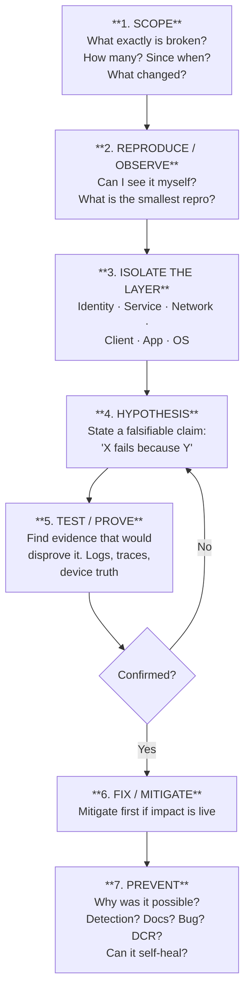
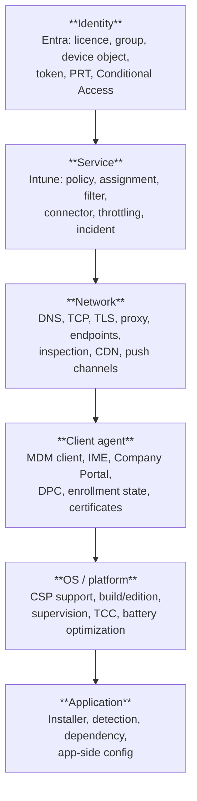
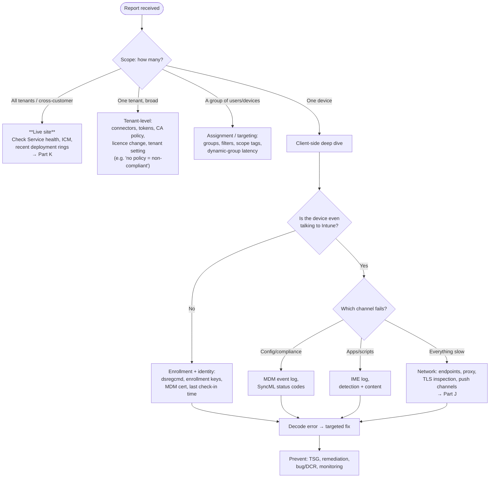

# Part I — Troubleshooting Methodology & Client-Side Diagnostics

> **Section goal:** This is the Part the role is really hiring for. By the end you will have a repeatable, teachable troubleshooting method, know every diagnostic surface on every platform, be able to read the logs that matter, and be able to *prove* a root cause rather than guess at one.

Covers index items **69–78**. Maps to JD: *"Sound troubleshooting skills"*, *"Demonstrated experience in Client Side Support, Hardware/OS, and Networking"*, *"Lead supportability and troubleshoot the availability of the service"*, *"3+ years' experience leading supportability and troubleshooting"*.

**Assumes:** Parts [C](Part-C-intune-architecture.md)–[H](Part-H-cross-platform.md).

---

## 69. A repeatable troubleshooting methodology

Anyone can Google an error code. What senior engineers are hired for is a **method that works on problems nobody has seen before**. Have one, name it, and use it in every technical answer you give.



### Step 1 — Scope, properly

The questions that make the rest of the investigation ten times faster:

| Question | Why it matters |
|---|---|
| **What is the exact symptom**, in the user's words *and* in technical terms? | "Intune is broken" → "Win32 app X reports 0x87D00324 on Windows 11 23H2" |
| **How many devices/users?** One, a group, everyone? | One = client/config. A group = assignment/targeting. Everyone = service or tenant-wide change |
| **Since when?** Exact time if possible | Correlate against changes and service events |
| **What changed?** Policy, network, OS update, certificate, licence, CA policy | The honest answer is usually "something changed" |
| **Is it reproducible?** Always, sometimes, once? | Intermittent = timing, network, race, or capacity |
| **Which tenant, region, platform, OS build, client version?** | Determines whether ring/version differences explain it |
| **What's the business impact?** | Determines urgency, mitigation appetite, and whether this is live site |

> 💡 **The single most valuable habit:** never accept the customer's framing as the problem statement. "Autopilot is broken" is a *symptom report*. Convert it into a precise, falsifiable statement before doing anything else.

### Step 3 — The layer model

Every Intune failure lives in one of six layers. Naming the layer *before* opening a log is what stops you thrashing.



**The discriminating questions:**

| If… | The layer is probably… |
|---|---|
| Some users affected, same devices fine for others | Identity / assignment |
| All platforms and all scenarios for one tenant | Service or tenant configuration |
| Only devices on one network/site | Network |
| Config profiles apply but Win32 apps don't | Client agent (IME) |
| Setting reports success but has no effect | OS/platform (CSP support, conflict) |
| One app fails, everything else fine | Application |

### Step 5 — Prove, don't assume

Three habits that separate strong engineers:

1. **Seek disconfirming evidence.** Ask "what would I expect to see if I'm wrong?" and go look for that.
2. **Trust device truth over reports.** Reports are eventually-consistent aggregations. `manage-bde -status`, the registry, `profiles show`, and the actual app on disk are truth.
3. **Change one thing at a time.** If you change three things and it works, you have not learned anything, and you cannot write a useful RCA or KB.

### Step 7 — Prevent (this is the role)

For a support *engineer* the ticket ends when it's fixed. For this role — CVC, problem management — the ticket ends when the **class** of ticket is reduced. Always finish with:

- Could the product have **told us** faster? (diagnosability → design feedback / DCR)
- Could it have **healed itself**? (Remediation script)
- Could the **error message** have been actionable? (bug)
- Is there a **TSG/KB** so nobody re-derives this? (documentation)
- How **often** does this happen and what does it **cost**? (problem management, [Part L](Part-L-support-process-and-voc.md))

---

## 70. The layers in practice — a triage flow



---

## 71. Windows diagnostics — the complete toolkit

### The event logs

**Event Viewer → Applications and Services Logs → Microsoft → Windows → …**

| Log | What's in it |
|---|---|
| **DeviceManagement-Enterprise-Diagnostics-Provider → Admin / Operational** | **The primary MDM log.** Enrollment steps, policy delivery, SyncML nodes and status codes, CSP failures |
| **AAD → Operational** | Entra authentication and token events |
| **User Device Registration → Admin** | Entra join/registration failures — the companion to `dsregcmd` |
| **Provisioning-Diagnostics-Provider** | Provisioning packages, Autopilot provisioning |
| **ModernDeployment-Diagnostics-Provider → Autopilot** | Autopilot-specific events |
| **AppxDeploymentServer / AppxPackaging** | Store/UWP app install failures |
| **BitLocker-API / BitLocker-DrivePreparationTool** | Encryption issues |
| **Windows Update Client / WindowsUpdateClient-Operational** | Update scan and install |
| **CertificateServicesClient-*** | Certificate enrollment/autoenrollment |
| **Security / System / Application** | The classics |

### `MdmDiagnosticsTool.exe`

```
:: Basic report (HTML + XML in a folder)
MdmDiagnosticsTool.exe -out C:\Temp\MDMDiag

:: Area-scoped CAB with logs and registry
MdmDiagnosticsTool.exe -area DeviceEnrollment;DeviceProvisioning;Autopilot -cab C:\Temp\mdm.cab

:: Other useful areas: TPM, HololensAutopilot
```

The generated **`MDMDiagReport.html`** is genuinely excellent: it lists enrolled MDM providers, **every applied policy with its value and source**, device details, and connection info. Knowing this file by name is a good signal.

### `dsregcmd`

```
dsregcmd /status              :: the identity X-ray (see Part B)
dsregcmd /status /verbose     :: more, including diagnostic data
dsregcmd /debug               :: force a registration attempt with verbose output
dsregcmd /forcerecovery       :: attempt to repair a broken device registration (prompts the user)
dsregcmd /leave               :: leave Entra join (destructive — lab use)
```

### Registry landmarks

| Path | Contents |
|---|---|
| `HKLM\SOFTWARE\Microsoft\Enrollments\{GUID}` | `UPN`, `EnrollmentState`, `ProviderID`, `DiscoveryServiceFullURL` |
| `HKLM\SOFTWARE\Microsoft\Enrollments\Status\{GUID}` | Per-enrollment status |
| `HKLM\SOFTWARE\Microsoft\PolicyManager\current\device\<Area>` | **Effective MDM policy values** |
| `HKLM\SOFTWARE\Microsoft\PolicyManager\AdmxInstalled` | Ingested ADMX |
| `HKLM\SOFTWARE\Microsoft\Provisioning\OMADM\Accounts\{GUID}` | MDM account/connection info |
| `HKLM\SOFTWARE\Microsoft\Windows\CurrentVersion\Uninstall\*` | What's actually installed (detection-rule reality check) |
| `HKLM\SOFTWARE\Microsoft\Provisioning\Diagnostics\Autopilot` | Autopilot state |
| `HKLM\SOFTWARE\Microsoft\IntuneManagementExtension` | IME configuration |

### Scheduled tasks

`Task Scheduler → Microsoft → Windows → EnterpriseMgmt → {EnrollmentGUID}` — the sync schedules. Missing tasks on an "enrolled" device = broken enrollment.

```powershell
Get-ScheduledTask -TaskPath "\Microsoft\Windows\EnterpriseMgmt\*" | Select TaskName, State
Get-ScheduledTask -TaskName PushLaunch | Start-ScheduledTask     # force an MDM sync
```

### Certificates

`certlm.msc` → Personal → Certificates. Look for the **Intune MDM Device CA**-issued certificate. Also check the trusted root store for deployed root CAs, and expiry dates on any SCEP/PKCS certificates.

### Useful PowerShell one-liners

```powershell
# Windows build and edition — the answer to half of "why doesn't this CSP work"
Get-ComputerInfo | Select WindowsProductName, WindowsVersion, OsBuildNumber, OsHardwareAbstractionLayer

# Is the IME service healthy?
Get-Service -Name IntuneManagementExtension | Select Name, Status, StartType

# BitLocker truth
manage-bde -status
Get-BitLockerVolume | Select MountPoint, VolumeStatus, EncryptionPercentage, ProtectionStatus

# TPM
Get-Tpm

# Defender state
Get-MpComputerStatus | Select AMServiceEnabled, RealTimeProtectionEnabled, AntivirusSignatureAge, AMRunningMode
Get-MpPreference | Select ExclusionPath, ExclusionProcess, AttackSurfaceReductionRules_Ids, AttackSurfaceReductionRules_Actions

# What's installed (32- and 64-bit uninstall keys)
Get-ItemProperty HKLM:\Software\Microsoft\Windows\CurrentVersion\Uninstall\*,
                 HKLM:\Software\WOW6432Node\Microsoft\Windows\CurrentVersion\Uninstall\* |
  Select DisplayName, DisplayVersion, Publisher | Sort DisplayName

# Proxy as seen by WinHTTP (SYSTEM context) vs the user
netsh winhttp show proxy
Get-ItemProperty "HKCU:\Software\Microsoft\Windows\CurrentVersion\Internet Settings" | Select ProxyEnable, ProxyServer, AutoConfigURL

# Time sync — token and Kerberos killer
w32tm /query /status
```

---

## 72. Reading the IME log

**Path:** `C:\ProgramData\Microsoft\IntuneManagementExtension\Logs\`

| File | Contents |
|---|---|
| `IntuneManagementExtension.log` | The main log: policy retrieval, Win32 app lifecycle, detection, content download, execution |
| `AgentExecutor.log` | PowerShell script and remediation execution output |
| `ClientHealth.log` | IME's own health and check-in |
| `Win32AppInventory.log` | App inventory reporting |
| `HealthScripts.log` | Remediations |
| `Sensor.log` | Endpoint Analytics / Device Query sensors |

**Open them in CMTrace or Support Center OneTrace** — they're ConfigMgr-format logs with timestamps, components and severity, and they're nearly unreadable in Notepad.

### The reading pattern

1. Find the **app or script GUID** (from the Intune portal URL for the app).
2. Search for it and read forward chronologically.
3. Look for these milestones in order:

| Milestone | Log evidence |
|---|---|
| Policy arrived | `Get-Policy`, `[Win32App]`, the app GUID appearing at all |
| Applicability | `ApplicabilityState`, requirement rule evaluation |
| Detection (pre-install) | `DetectionState`, `detected: False` |
| Content download | `Downloading`, `content`, byte counts, CDN URL |
| Decrypt/hash | `Decrypt`, `hash` — failures here mean tampering, usually TLS inspection |
| Execution | `Execute`, command line, working directory |
| Exit code | `ExitCode`, `Process exited with code` |
| Detection (post-install) | `detected: True/False` — the moment of truth |
| Reported state | `Sending status`, `installState` |

### Common IME log signatures

| What you see | What it means |
|---|---|
| App GUID never appears | Assignment problem, or IME hasn't checked in (~60 min cycle) |
| `ApplicabilityState: NotApplicable` | Requirement rule excluded the device |
| Download starts then fails / hash mismatch | Proxy or TLS inspection corrupting content; disk space |
| `ExitCode: 0` then `detected: False` | **The classic** — bad detection rule |
| Non-zero exit code | Installer failed — reproduce manually as SYSTEM |
| Repeated retries every cycle | Detection failing, or the app genuinely failing |
| `Waiting for dependency` | Blocked by a dependency app |
| Nothing at all in the log for hours | IME service stopped, or not installed |

---

## 73. Autopilot and OOBE diagnostics

| Tool | How |
|---|---|
| **`Shift+F10` at OOBE** | Opens a command prompt during setup. The single most useful Autopilot trick |
| **ESP → Collect logs** | Writes a diagnostics CAB (typically `C:\Users\Public\Documents\MDMDiagnostics`) |
| **`Get-AutopilotDiagnostics`** | Community script (PowerShell Gallery, `Get-WindowsAutopilotInfo` family). Run with `-Online` on a live device or point it at the CAB. Produces a clean timeline: profile, ESP phases, each policy and app with status and elapsed time |
| **`MdmDiagnosticsTool.exe -area Autopilot -cab out.cab`** | Autopilot-scoped collection |
| **Event logs** | ModernDeployment-Diagnostics-Provider → Autopilot; Provisioning-Diagnostics-Provider; DeviceManagement-Enterprise-Diagnostics-Provider |
| **Intune → Devices → Monitor → Autopilot deployments** | Per-deployment report: success/failure, duration, failure reason, per-device |
| **Intune → Devices → Enrollment → Windows Autopilot devices** | Registration and **profile assignment status** — check *before* blaming the device |
| **Intune → Devices → Monitor → Enrollment failures** | Aggregated enrollment error reporting |
| **Registry** | `HKLM\SOFTWARE\Microsoft\Provisioning\Diagnostics\Autopilot` |

**The Autopilot triage order:**
1. Is the device **registered** and is the profile **Assigned**? (server side, before anything else)
2. Did OOBE reach the Autopilot service? (network at OOBE, DNS, proxy)
3. Did Entra join and MDM enrollment succeed? (identity errors)
4. Which **ESP phase** stalled, and on which item? (`Get-AutopilotDiagnostics`)
5. For app stalls → IME log → detection/content/exit code.

---

## 74. Apple, Android, macOS and Linux diagnostics

| Platform | Tool | Notes |
|---|---|---|
| **iOS/iPadOS** | Company Portal → **Send logs** (gives an **incident ID** — always ask for it) | Correlates the upload to the device |
| | Apple **sysdiagnose** (volume-up + volume-down + side button) | Full system diagnostics; large |
| | Settings → General → **VPN & Device Management** | Shows the installed management profile and its payloads — proof of what actually landed |
| | Console.app on a tethered Mac | Live device log |
| **macOS** | Company Portal → Send logs; `/Library/Logs/Microsoft/Intune/` | Agent logs |
| | `profiles show` / `profiles show -type enrollment` | Lists installed configuration profiles — the macOS equivalent of "which policies applied" |
| | `sudo log collect --last 1h` / `log stream --predicate ...` | Unified system log |
| | System Settings → Privacy & Security → **Profiles** | Visual check |
| **Android** | Company Portal / Intune app → **Send logs** with incident ID | |
| | `adb logcat`, `adb bugreport` | Deep debugging on developer-enabled devices |
| | Device settings → battery optimization for the DPC | The #1 Android policy-delivery killer |
| **Linux** | Intune agent logs in the user's app-data path; `journalctl` | Limited surface |
| **All** | Intune → device → **Collect diagnostics** | Remote, non-intrusive, server-side collection |

---

## 75. Server-side diagnostics in Intune

| Surface | What it gives you |
|---|---|
| **Troubleshooting + support** blade | Pick a user → see their licences, group memberships, **enrollment failures**, devices, assigned policies/apps and per-item status. **The best single starting point for a user-scoped case** |
| **Device → Device configuration / Compliance / Managed Apps** | Per-policy and per-setting status: Succeeded / Error / Conflict / Not applicable / Pending |
| **Device → Discovered apps / Hardware / Recovery keys** | Inventory truth |
| **Device → Collect diagnostics / Device actions** | Remote actions and log collection |
| **Reports** (Operational / Organizational / Historical / Specialist) | Non-compliant devices, app install status, feature update failures, certificate status, Windows health |
| **Monitor blades** | Enrollment failures, Autopilot deployments, assignment failures, per-policy device status |
| **Tenant administration → Tenant status** | Service release, connector and **token expiry**, service health |
| **Audit logs** | **Who changed what, when.** The answer to "nothing changed" |
| **Graph / Graph Explorer / F12 Network tab** | The raw truth behind the UI |
| **Log Analytics / Azure Monitor** | Diagnostic settings ship Intune audit and operational logs to a workspace for **KQL** analysis, alerting and workbooks |
| **Endpoint Analytics** | Fleet-level performance, reliability and anomaly signals |

> 💡 **"Nothing changed" is never true.** The **audit log** — filterable by activity, actor, and date, and exportable via Graph — is how you find the policy edit, the group change or the deletion that started the incident. Reaching for the audit log early is a mark of maturity.

---

## 76. KQL, Log Analytics and telemetry

**KQL (Kusto Query Language)** is the query language used across Azure Monitor / Log Analytics, Microsoft Sentinel, Defender advanced hunting and Microsoft-internal telemetry (**Kusto**). For this role it is genuinely useful — and mentioning it credibly is a differentiator.

### The shape of KQL

```kusto
// Intune audit events: who changed what in the last 24 hours
IntuneAuditLogs
| where TimeGenerated > ago(24h)
| extend props = parse_json(Properties)
| project TimeGenerated, OperationName, Identity, tostring(props.TargetDisplayNames)
| order by TimeGenerated desc

// Devices failing a specific operation, grouped to find a pattern
IntuneOperationalLogs
| where TimeGenerated > ago(7d)
| where OperationName has "Enrollment"
| summarize Failures = count() by tostring(parse_json(Properties).Failure), bin(TimeGenerated, 1h)
| order by Failures desc

// Defender advanced hunting: ASR rule blocks by app, to plan exclusions
DeviceEvents
| where ActionType startswith "Asr"
| summarize Blocks = count() by ActionType, InitiatingProcessFileName
| order by Blocks desc
```

**The operators worth knowing:** `where`, `project`, `extend`, `summarize … by`, `count()`, `dcount()`, `bin()`, `join`, `union`, `top`, `order by`, `render timechart`, `parse_json`, `has`/`contains`/`startswith`, `ago()`, `todatetime()`.

### Why this matters in this role

- Turns "several customers complained" into "**1,347 devices across 22 tenants, starting at 14:10 UTC, all on build X**".
- That sentence is what gets an engineering team to act. It is the *entire* difference between a ticket and a problem-management case.
- It's also how you find *silent* problems nobody has reported yet — the proactive half of Voice of the Customer.

---

## 77. Network captures and ETW for Intune problems

When logs say "it failed" but not *why*, go to the wire.

| Tool | Use |
|---|---|
| **Fiddler / Fiddler Everywhere** | HTTPS proxy that decrypts traffic (with its root cert trusted). Shows exact URLs, status codes and payloads for enrollment, Graph and content downloads. **Note:** Fiddler *is itself* TLS inspection, so it can mask or cause pinning failures — use it knowingly |
| **`netsh trace` / Pktmon / Wireshark** | Packet capture when you need to see DNS resolution, TCP handshakes, RSTs, retransmissions, or TLS handshake failures and which certificate was presented |
| **ETW (Event Tracing for Windows)** | Kernel/user providers for deep Windows behaviour; `logman`/`wpr` to capture, Windows Performance Analyzer or TraceView to read |
| **`Test-NetConnection` / `curl` / `Invoke-WebRequest`** | Quick reachability and TLS checks against specific endpoints |
| **`nslookup` / `Resolve-DnsName`** | Name-resolution truth, including which resolver answered |
| **Browser F12 → Network** | For portal and Graph issues, and for anything web-based |
| **PSR / Steps Recorder, screen recording** | For "it flashes an error too fast to read" |

**Enrollment-in-OOBE trick:** at OOBE, `Shift+F10` then run `ping`, `nslookup`, `Test-NetConnection`, or set a proxy — this is how you prove whether OOBE has the network access Autopilot needs.

Network specifics — which endpoints, which ports, and how TLS inspection breaks things — are in [Part J](Part-J-networking-for-intune.md).

---

## 78. Error codes — the working reference

You are not expected to memorize these. You *are* expected to **recognise the family** and know what it implies.

### Reading the shape of a Windows error

| Prefix | Family | Implication |
|---|---|---|
| `0x0000xxxx` / small decimal | Win32 error | Look up with `net helpmsg <decimal>` or `err.exe` |
| `0x8007xxxx` | Win32 error wrapped as HRESULT (`0x8007` + Win32 code) | e.g. `0x80070005` = Access denied (5) |
| `0x8018xxxx` | **MDM enrollment / OMA-DM** | Enrollment stack |
| `0x801Cxxxx` | **Entra device registration** | Identity/registration stack |
| `0x8009xxxx` | Cryptography / certificates | Cert chain, key storage |
| `0x800Bxxxx` | Trust / certificate validation | Root not trusted, revoked, expired |
| `0x87D1xxxx` / `0x87D0xxxx` | **Intune / ConfigMgr client-side (IME, apps, remediations)** | App and script failures |
| `0x80072Exx` / `0x80072Fxx` | **WinHTTP / WinINet network errors** | Proxy, TLS, timeouts, DNS |
| `0xC0000xxx` | NTSTATUS | Kernel-level |

### The Intune error table

| Code | Meaning | Where it bites |
|---|---|---|
| `0x80180001` | MDM general failure | Enrollment |
| `0x80180002` | Server not found / discovery failed | Enrollment |
| `0x80180003` | Server error | Enrollment |
| `0x8018000a` | **Device already enrolled** in another MDM | Enrollment |
| `0x80180014` | **Blocked by enrollment restriction** (platform/personal) | Enrollment |
| `0x80180018` | User not licensed / MDM scope excludes user | Enrollment |
| `0x8018002b` | MDM discovery failure (wrong discovery URL, leftover third-party MDM) | Enrollment |
| `0x801c0003` | User not authorized to enrol / device limit | Entra registration |
| `0x801c000e` | Registration quota exceeded | Entra registration |
| `0x801c03f2` | Device object not found in Entra | Entra registration |
| `0x801c0021` | Tenant/user not found | Entra registration |
| `0x82aa0008` | Autopilot: device not found / profile not assigned | Autopilot |
| `0x80070005` | Access denied | Everywhere — permissions, TCC, UAC, ACLs |
| `0x80070032` | Not supported | CSP/OS mismatch |
| `0x8007064c` | Existing enrollment blocking a new one | Enrollment |
| `0x80070774` | Cannot resolve/contact server | DNS |
| `0x80072ee2` | WinHTTP timeout | Network/proxy |
| `0x80072ee7` | Server name cannot be resolved | DNS |
| `0x80072efd` | Cannot connect to server | Firewall/proxy |
| `0x80072f0c` | Client certificate required | TLS inspection / mutual TLS |
| `0x80072f8f` | **Date/time or certificate error** — very often **clock skew** | TLS |
| `0x80190194` | HTTP 404 from the service | Endpoint/URL problem |
| `0x87D00324` | **App not detected after installation** | Win32 app detection rule |
| `0x87D0027C` | Install failed / requirements not met | Win32 app |
| `0x87D1041C` | Remediation/script failure | IME scripts |
| `0x87D13B67` | App content download failure | Network/CDN/proxy |
| `1603` | MSI generic install failure | App installer — read the MSI log |
| `1618` | Another installation is in progress | App installer — retry |
| `1619` | Installation package could not be opened | Bad path / content |
| `3010` / `1641` | Reboot required (soft / hard) | Map these as success + reboot |
| SyncML `404` | CSP node not found | Setting unsupported on this build/edition |
| SyncML `405` | Command not allowed | Wrong verb / read-only node |
| SyncML `406`/`415` | Unsupported format | **Wrong data type in a custom OMA-URI** |
| SyncML `500` | CSP internal failure | Needs client logs |
| HTTP `401` / `403` / `429` / `503` | Not authenticated / not authorized / throttled / unavailable | Graph and service calls |

### The decoding tools

```
:: Decode a Windows error code
net helpmsg 5
certutil -error 0x80072f8f
:: Microsoft's Error Lookup Tool (err.exe) from the Windows SDK / debugging tools
err 0x8018000a
```

> 💡 **Say this:** "I don't collect error codes as trivia — I use the *prefix* to route. `0x8018` sends me to the MDM enrollment stack, `0x801c` to Entra device registration, `0x87D1` to the Intune client agent, and `0x80072Exx` to WinHTTP, which almost always means proxy, TLS inspection or DNS. That one habit cuts triage time dramatically and tells me which team to bring in."

---

## 📌 Part I quick-reference sheet

| Item | One-line meaning |
|---|---|
| Method | Scope → Reproduce → Isolate layer → Hypothesis → Prove → Fix/mitigate → Prevent. |
| Six layers | Identity · Service · Network · Client agent · OS/platform · Application. |
| Scope questions | What exactly, how many, since when, what changed, reproducible, which build/tenant. |
| Device truth > report | Reports are eventually consistent; the device is authoritative. |
| `dsregcmd /status` | Identity X-ray: join type, device ID, tenant, PRT, MDM URLs, last error. |
| `MdmDiagnosticsTool` | Produces `MDMDiagReport.html` listing every applied policy and its source. |
| DeviceManagement-Enterprise-Diagnostics-Provider | The primary Windows MDM event log. |
| `HKLM\...\PolicyManager\current\device` | Effective MDM policy values. |
| EnterpriseMgmt scheduled tasks | Sync schedules; missing = broken enrollment. |
| `IntuneManagementExtension.log` | Win32 app and script log. Read in **CMTrace**. |
| `Shift+F10` | Command prompt during OOBE. |
| `Get-AutopilotDiagnostics` | Readable Autopilot/ESP timeline. |
| `profiles show` (macOS) | Which configuration profiles actually landed. |
| Send logs + incident ID | Mobile log collection that can be correlated. |
| Collect diagnostics | Remote, server-initiated log collection. |
| Troubleshooting + support blade | Best starting point for a user-scoped case. |
| Audit logs | Who changed what, when. "Nothing changed" is never true. |
| KQL / Log Analytics | Turns anecdotes into counted, time-bounded evidence. |
| Fiddler / packet capture | When logs say "failed" but not why. |
| `0x8018` / `0x801c` / `0x87D1` / `0x80072E` | MDM enrollment / Entra registration / Intune client / WinHTTP. |
| `0x87D00324` | Installed but not detected — the detection-rule classic. |
| `0x80072f8f` | Date/time or certificate error — suspect clock skew. |
| SyncML 404 / 406 / 500 | Node unsupported / wrong data type / CSP failed. |

---

## ⭐ Likely Interview Questions for This Section

**Q1. "Describe your troubleshooting methodology."**
> *Model answer:* "Seven steps. **Scope** — turn the symptom report into a precise statement: exactly what fails, how many users or devices, since when, and what changed; the count alone tells me whether I'm looking at a client, an assignment or a service problem. **Reproduce or observe** — get the smallest reliable repro I can. **Isolate the layer** — Intune failures live in one of six: identity, service, network, client agent, OS/platform, or application; naming the layer before opening a log is what stops thrashing. **Hypothesis** — state something falsifiable, like 'the app installs but the detection rule doesn't match, so Intune reports failure'. **Prove** — go looking for evidence that would *disprove* it, and prefer device truth over portal reports. **Fix or mitigate** — mitigate first if there's live impact. **Prevent** — ask whether the product could have told us faster, whether it could self-heal, whether the error message was actionable, and whether this needs a TSG, a remediation script, a bug or a DCR. That last step is the difference between closing a ticket and removing a class of tickets."

**Q2. "A customer says 'Intune is broken.' Take me through the first ten minutes."**
> *Model answer:* "I refuse the framing politely and get specific: which scenario, which platform, how many devices, since when, and is it reproducible. In parallel I check scope from my side — Service health and the Tenant status page for incidents and connector or token expiry, and whether the impact correlates with a region or scale unit. If it's cross-tenant, I stop treating it as a case and escalate to live site, because time-to-detect is what matters there. If it's one tenant, I go to the audit log to find what changed, because 'nothing changed' is essentially never true. If it's a group of users, I look at assignments, groups, filters and scope tags. If it's one device, I go client-side. Within ten minutes I want a precise problem statement, a scope, and a named layer — not a fix."

**Q3. "Configuration profiles apply but Win32 apps never install. Walk me through it."**
> *Model answer:* "That split is diagnostic in itself: config profiles prove the MDM channel, authentication and check-in are healthy, so the problem is the Intune Management Extension, which is a separate agent with its own roughly hourly cycle. I'd confirm the IME service exists and is running, then open `IntuneManagementExtension.log` in CMTrace and search for the app's GUID. In order I want: did the app policy arrive at all — if not, it's assignment or IME check-in; did requirement rules mark it applicable; did content download complete — hash or decrypt failures there are the fingerprint of TLS inspection corrupting the download; what exit code did the installer return; and what did detection conclude afterwards. `ExitCode: 0` followed by `detected: False` is the single most common outcome, and that's a detection-rule problem, not an install problem."

**Q4. "How do you prove a root cause rather than guess?"**
> *Model answer:* "Three disciplines. First, I state the hypothesis so it can be *wrong* — 'this fails because the detection rule checks a path the installer doesn't create' — and then I deliberately look for evidence that would disprove it, rather than only collecting confirmation. Second, I verify on the device, not in the report: reports are eventually-consistent aggregations, so I'll check `manage-bde -status`, the PolicyManager registry values, the app's uninstall key, or `profiles show` on a Mac. Third, I change one thing at a time — if I change three and it works, I've fixed a device but learned nothing, and I can't write a useful RCA or KB from it. And for a problem-management case I want the claim quantified: how many devices, across how many tenants, starting when, correlated with what build — because that's what makes engineering act."

**Q5. "What logs do you look at for a Windows MDM policy failure?"**
> *Model answer:* "The primary one is the Event Viewer channel DeviceManagement-Enterprise-Diagnostics-Provider, under Applications and Services → Microsoft → Windows. It shows the SyncML exchanges, the specific OMA-URI nodes and their status codes, which is where I find things like 404 node not found — meaning the setting doesn't exist on that Windows edition or build — or 406/415, which usually means a wrong data type in a custom OMA-URI. Alongside that I run `MdmDiagnosticsTool.exe` to produce `MDMDiagReport.html`, which lists every applied policy with its value and source in one readable page. I'd cross-check the effective values under `HKLM\SOFTWARE\Microsoft\PolicyManager\current\device`, and on a hybrid device run `gpresult` too, because a surviving Group Policy beats MDM by default unless MDMWinsOverGP is enabled."

**Q6. "What's your approach to error codes?"**
> *Model answer:* "I use the prefix to route rather than memorizing individual codes. `0x8018` means the MDM enrollment stack. `0x801c` means Entra device registration, so I'm going to `dsregcmd` and the User Device Registration event log. `0x87D0`/`0x87D1` means the Intune client agent, so I'm in the IME log. `0x80072Exx` and `0x80072Fxx` are WinHTTP errors, which in practice means proxy, TLS inspection, DNS or timeouts. `0x8007xxxx` is a wrapped Win32 error I can decode with `net helpmsg` or `err.exe`. Two specific ones I always call out: `0x87D00324` is 'installed but not detected', which is a detection-rule problem rather than an install problem; and `0x80072f8f` is a date/time or certificate error that very often turns out to be clock skew, which also breaks Kerberos and token validation."

**Q7. "How would you use KQL in this role?"**
> *Model answer:* "To convert anecdote into evidence. Intune diagnostic settings can ship audit and operational logs to a Log Analytics workspace, and Defender has advanced hunting — both queried with KQL. So instead of saying 'a few customers complained about enrollment', I can produce 'this failure occurred on 1,347 devices across 22 tenants, starting at 14:10 UTC, concentrated on one OS build'. That sentence is what makes an engineering team prioritise. It also lets me find silent problems nobody has reported yet, which is the proactive half of Voice of the Customer, and to build alerting so the customer and I hear about a regression before the helpdesk does. Concretely I'd use `where`, `summarize by bin(TimeGenerated, 1h)`, `dcount()` on device IDs, and `render timechart` to show onset — because the shape of the curve usually tells you whether it's a deployment, an expiry or a gradual drift."

**Q8. "The customer insists nothing changed. What do you do?"**
> *Model answer:* "I believe they believe it, and then I check the **audit log**, because it records who changed what and when — policy edits, assignment changes, deletions, role assignments. Alongside that I check the Entra audit and sign-in logs for Conditional Access changes, the Tenant status page for connector or token expiry, which is a change that happens *to* you rather than by you, and Message Center for announced service changes that landed in that window. I'd also correlate against the customer's own change record — a proxy or TLS-inspection change, a firewall rule, a certificate renewal, a network migration. In my experience 'nothing changed' resolves into one of: something expired, someone else changed it, or the service rolled forward. Finding it in the audit trail also matters for the RCA, because 'we don't know what caused it' is not a closeable problem-management outcome."

**Q9. "How would you troubleshoot an Autopilot failure you've never seen before?"**
> *Model answer:* "Server side first, because it's free: is the device registered in Autopilot, and does the profile show **Assigned**? A surprising proportion of 'Autopilot didn't work' is simply a device that booted before profile assignment completed. Then the Autopilot deployments report in Intune for the failure reason and duration, and the Enrollment failures report. On the device, `Shift+F10` at OOBE gives me a command prompt — from there I can test network reachability and DNS, and collect diagnostics. I'd run `Get-AutopilotDiagnostics` against the collected CAB to get a clean timeline showing which ESP phase stalled and on which specific policy or app. If it stalls on an app, I move to the IME log and the detection/content/exit-code sequence. If it fails at join or enrollment, I go to the identity error code and the User Device Registration log. The method doesn't depend on having seen the specific failure before — it depends on knowing the pipeline and where to observe each stage."

**Q10. "What do you do after the fix?"**
> *Model answer:* "Three things, and this is where the role differs from frontline support. First, write it down so nobody re-derives it — a TSG or KB with the symptom, the diagnostic evidence that confirms it, and the fix, written so a tier-1 engineer can follow it. Second, ask whether it can be prevented or automated: a Remediation script to self-heal, monitoring or an alert to detect it earlier, or a configuration guardrail. Third, ask whether the *product* should change: was the error message actionable, did the logs contain what I needed, could the service have detected this itself? If not, that's a bug or a DCR with evidence attached — frequency, device count, customer impact and, ideally, an estimate of the support cost. And I'd feed the pattern back through Voice of the Customer if I think other customers are hitting it silently."

**Q11. "How do you troubleshoot something intermittent?"**
> *Model answer:* "Intermittent almost always means timing, network, capacity or a race. So I stop trying to reproduce on demand and start instrumenting: increase log retention, enable diagnostic settings to Log Analytics, add a Remediation-style detection script that records state when the condition occurs, and get the exact timestamps of several occurrences from affected users. Then I look for correlation rather than causation first — time of day, site or network, device model or build, whether it follows the user or the device, whether it coincides with a scheduled task, a token refresh or a check-in cycle. Network-related intermittency is very common in this space: a load-balanced proxy where only some nodes inspect TLS, or intermittent DNS. If I need packet-level truth I'd take a capture with a trigger. The key discipline is to resist changing anything before I have several data points, because a change during an intermittent problem destroys the evidence."

---

## 🧠 30-Second Memory Hooks

- **Scope · Reproduce · Isolate · Hypothesise · Prove · Fix · Prevent.** Say it, use it, every time.
- **Six layers: Identity · Service · Network · Client · OS · App.** Name the layer before opening a log.
- **The count is the clue.** One device = client. A group = assignment. Everyone = service or tenant setting.
- **Device truth beats the report.** Always.
- **`dsregcmd /status` · `MdmDiagnosticsTool` → `MDMDiagReport.html` · IME log in CMTrace.** The Windows big three.
- **`Shift+F10` + `Get-AutopilotDiagnostics`** = Autopilot X-ray.
- **`0x8018` MDM · `0x801c` Entra registration · `0x87D1` Intune client · `0x80072E` WinHTTP/network.**
- **`0x87D00324` = installed but not detected.** Fix the rule, not the installer.
- **`0x80072f8f` = check the clock.**
- **"Nothing changed" → open the audit log.**
- **KQL turns "some customers complained" into "1,347 devices, 22 tenants, 14:10 UTC."** That's what moves engineering.
- **Finish every case by asking: TSG? Remediation? Bug? DCR? Monitoring?**

---

*Next suggested section:* **[Part J — Networking Fundamentals for Intune Support](Part-J-networking-for-intune.md)** — the JD explicitly asks for networking, and a large share of "Intune is broken" cases are really the customer's network breaking Intune.
