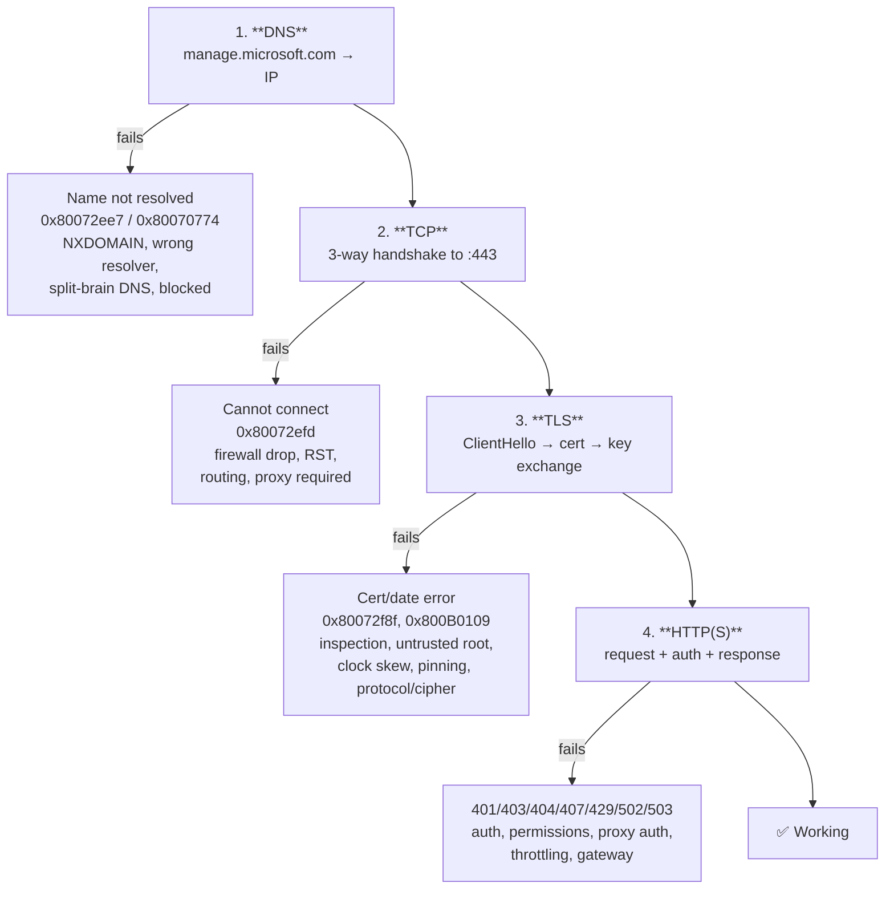
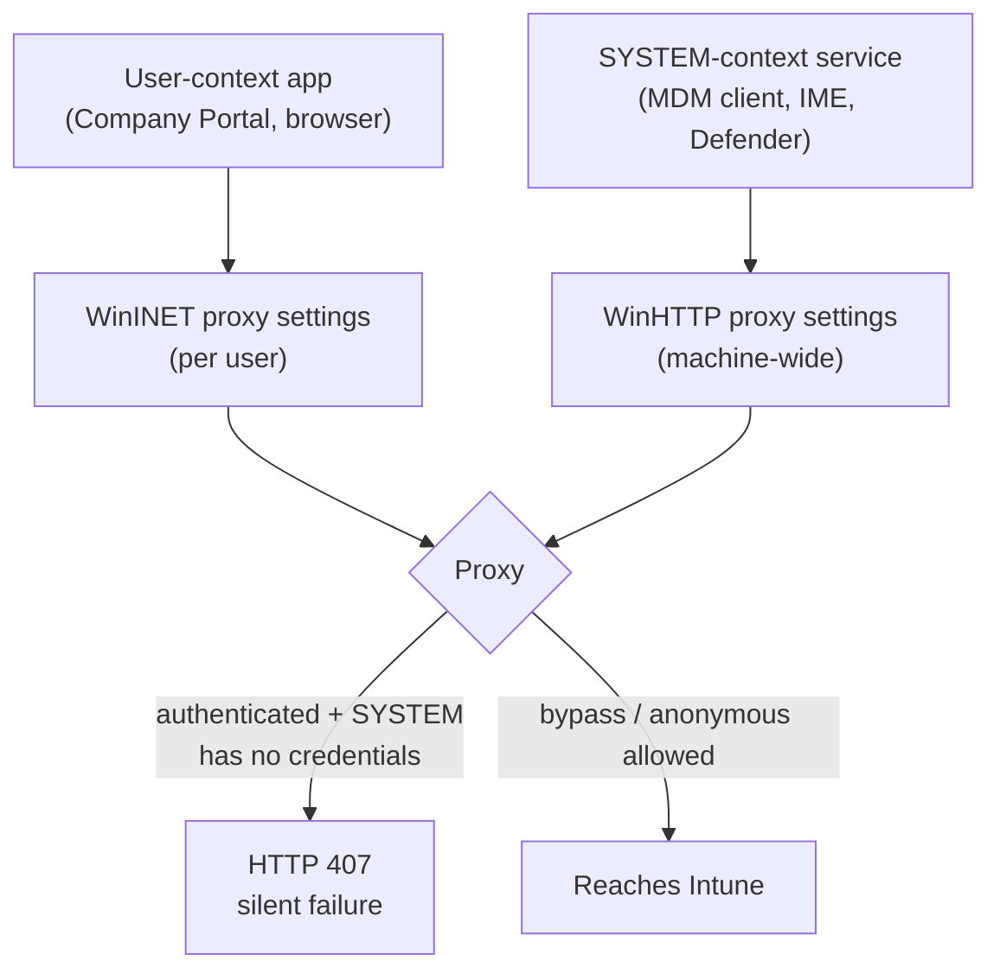
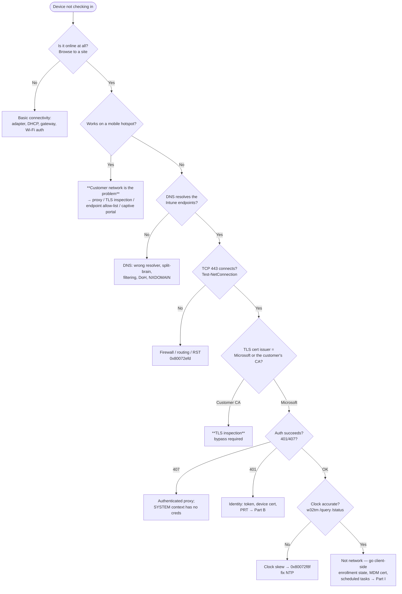

# Part J — Networking Fundamentals for Intune Support

> **Section goal:** The job description asks for **Networking** explicitly, and in practice a very large share of "Intune is broken" cases are the customer's network breaking Intune. By the end of this Part you will be able to explain the full network path from a device to the Intune service, name the required endpoints and ports, and diagnose proxy, TLS-inspection, DNS and certificate problems with confidence.

Covers index items **79–88**. Maps to JD: *"Demonstrated experience in Client Side Support, Hardware/OS, and **Networking**"*, *"Sound troubleshooting skills"*, *"Lead supportability and troubleshoot the availability"*.

**Assumes:** [Part C](Part-C-intune-architecture.md) (device dials out, push channels) and [Part I](Part-I-troubleshooting-and-diagnostics.md) (methodology, error families).

---

## 79. The stack, from the ground up

Every Intune interaction is: **resolve a name → open a TCP connection → negotiate TLS → speak HTTPS**. Each step fails differently, and knowing which one failed is 80% of the diagnosis.



### 🔍 Plain-English deep-dive: the four layers, with analogies

- **DNS (Domain Name System)** — *the phone book that turns a name into an address.* **Analogy:** looking up a company's street address before driving there. **Failure:** you never leave the driveway. Symptoms: `0x80072ee7` (name cannot be resolved), `0x80070774`, `nslookup` returns nothing or the wrong address (split-brain DNS in enterprises is common).
- **TCP (Transmission Control Protocol)** — *the reliable connection.* **Analogy:** dialling the number and someone picking up; a three-way handshake (SYN → SYN/ACK → ACK) is "ring, hello, hello". **Failure:** dropped by a firewall (silent timeout) or actively refused (**RST** — the door slams). Symptoms: `0x80072efd`, `Test-NetConnection` shows `TcpTestSucceeded: False`.
- **TLS (Transport Layer Security)** — *the encrypted, authenticated envelope.* **Analogy:** checking each other's ID and then speaking in a private code. Client sends **ClientHello** (with **SNI** — the server name it wants), server presents a **certificate chain**, both agree a cipher and derive keys. **Failure:** untrusted/expired certificate, clock skew, protocol/cipher mismatch, or an inspecting middlebox. Symptoms: `0x80072f8f` (date/time or certificate error), `0x800B0109` (untrusted root).
- **HTTP/HTTPS** — *the actual conversation.* **Analogy:** the words you say once the line is secure. **Failure:** status codes — `401` not authenticated, `403` not authorized, `404` wrong URL, `407` **proxy authentication required**, `429` throttled, `502`/`503` gateway/service problems.

### The tools, mapped to the layers

| Layer | Quick check |
|---|---|
| DNS | `Resolve-DnsName manage.microsoft.com`, `nslookup manage.microsoft.com 8.8.8.8` (compare resolvers) |
| TCP | `Test-NetConnection manage.microsoft.com -Port 443` |
| TLS | `curl.exe -v https://manage.microsoft.com`, browser certificate viewer, `openssl s_client -connect host:443 -servername host` |
| HTTP | `Invoke-WebRequest -Uri https://... -UseBasicParsing`, Fiddler, browser F12 |
| Whole path | `pathping`, `tracert`, packet capture |

---

## 80. Intune's required endpoints

**The rule:** Intune requires **outbound HTTPS (TCP 443)** to a defined set of endpoints. **No inbound rules are needed** — the device always initiates.

### The endpoint families

| Family | Examples (illustrative — always check current Microsoft docs) | Purpose |
|---|---|---|
| **Intune service** | `*.manage.microsoft.com`, `manage.microsoft.com` | Core MDM check-in, policy, reporting |
| **Enrollment / device registration** | `enterpriseregistration.windows.net`, `enrollment.manage.microsoft.com`, `enterpriseenrollment.<domain>` (CNAME) | Enrollment and Entra device registration |
| **Authentication** | `login.microsoftonline.com`, `login.windows.net`, `login.live.com`, `device.login.microsoftonline.com` | Tokens, PRT, MFA |
| **Microsoft Graph** | `graph.microsoft.com` | API used by the portal, clients and automation |
| **Content delivery / apps** | Azure CDN and storage endpoints (`*.azureedge.net`, `*.blob.core.windows.net`, `swda*` / `swdb*` style app content hosts) | Win32 app and script content |
| **Push notification** | `*.notify.windows.com`, `*.wns.windows.com` (Windows); `*.push.apple.com` (Apple); Firebase/Google endpoints (Android) | Wake-up notifications |
| **Autopilot** | `ztd.dds.microsoft.com`, `cs.dds.microsoft.com`, `login.live.com`, `ekop.intel.com`/TPM attestation endpoints for self-deploying | Profile retrieval and attestation |
| **Company Portal / Store** | `*.microsoft.com` Store endpoints, `displaycatalog.mp.microsoft.com`, `licensing.mp.microsoft.com` | Store apps, licensing |
| **Windows Update / Delivery Optimization** | `*.windowsupdate.com`, `*.delivery.mp.microsoft.com`, `*.do.dsp.mp.microsoft.com`, `*.dl.delivery.mp.microsoft.com` | Updates and DO |
| **Defender for Endpoint** | MDE onboarding/telemetry endpoints (`*.endpoint.security.microsoft.com`, `*.events.data.microsoft.com`) | EDR |
| **Apple services** | `*.apple.com`, `albert.apple.com`, `gs.apple.com`, `*.push.apple.com` (**TCP 5223** + 443 fallback), `mdmenrollment.apple.com` | Apple activation, ADE, APNs |
| **Google services** | `play.google.com`, `*.googleapis.com`, `android.clients.google.com`, `*.gvt1.com`, Firebase | Managed Google Play, FCM |
| **Telemetry / diagnostics** | `*.events.data.microsoft.com`, `settings-win.data.microsoft.com` | Device telemetry |
| **Time** | `time.windows.com` (NTP, UDP 123) | Clock accuracy — **critical for TLS and Kerberos** |
| **NTP/CRL/OCSP** | `crl.microsoft.com`, `ocsp.digicert.com`, `*.crl3/crl4.digicert.com` | Certificate revocation checks |

> ⚠️ **The mistake to call out:** "we allowed `*.manage.microsoft.com`" is *not* sufficient. Intune depends on authentication, content delivery, push, Store, telemetry, time and revocation endpoints too. And most importantly, the **content endpoints must not be TLS-inspected**.

### Ports summary

| Port/protocol | Used by |
|---|---|
| **TCP 443 (HTTPS)** | Everything, essentially |
| **TCP 80 (HTTP)** | CRL/OCSP revocation checks, some redirects and content |
| **TCP 5223** | **APNs** (Apple push) — falls back to 443 but with degraded behaviour; on many corporate/guest Wi-Fi networks this is blocked and is a classic Apple case |
| **UDP 123** | NTP time sync |
| **UDP 7680 / TCP 7680** | **Delivery Optimization** peer-to-peer (LAN) |
| **UDP 3544** | Teredo (legacy DO internet peering) |

---

## 81. Proxies

Proxies are the number-one source of enterprise Intune network pain, because the *context* a request runs in determines whether it sees the proxy at all.

### 🔍 Plain-English deep-dive: the proxy configuration surfaces on Windows

- **WinINET (per-user)** — the classic Internet Options / Settings → Network → Proxy configuration. **Only applies to the signed-in user's session.**
- **WinHTTP (system-wide)** — used by services running as SYSTEM. Configured with `netsh winhttp set proxy` or by importing the user's settings. **This is what the MDM client and IME often need.**
- **PAC file / WPAD** — a JavaScript file (`proxy.pac`) that decides per-URL which proxy to use; **WPAD** auto-discovers it via DHCP option 252 or a DNS `wpad` record. Fragile and a common source of intermittency.
- **Authenticated proxy** — requires credentials. **The core problem: a service running as SYSTEM has no user credentials to present**, so it gets HTTP **407 Proxy Authentication Required** and fails silently. Intune's guidance is to allow Microsoft endpoints to **bypass authentication**.



**The tell:** "it works when the user browses to the URL, but Intune still fails." That's almost always a user-context vs system-context proxy difference.

**Commands:**
```
netsh winhttp show proxy
netsh winhttp set proxy proxy-server="http=proxy:8080;https=proxy:8080" bypass-list="*.microsoft.com;<local>"
netsh winhttp import proxy source=ie
netsh winhttp reset proxy
```
Also check `HKLM\SOFTWARE\Policies\Microsoft\Windows\CurrentVersion\Internet Settings` and the per-user `HKCU` equivalents, and Group Policy proxy settings.

**Autopilot/OOBE nuance:** during OOBE there is no signed-in user, so **user-context proxy settings don't exist**. If the network requires an authenticated proxy, Autopilot will fail. That is why Microsoft guidance is to provide an unauthenticated path (or bypass) for provisioning networks — a great point to raise unprompted.

---

## 82. TLS inspection — the single most common enterprise breaker

### 🔍 Plain-English deep-dive: what TLS inspection actually does

- **What it is:** a security appliance (proxy/firewall/SSE) *terminates* the TLS session, decrypts the traffic to inspect it, then re-encrypts it to the destination with **its own certificate**, which the enterprise has installed as a trusted root on managed devices. Also called **SSL/TLS break-and-inspect**, **HTTPS interception**, **MITM proxy**.
- **Analogy:** the mailroom opens every letter, reads it, then reseals it in a *company* envelope with a *company* stamp. The recipient sees the mailroom's stamp, not the sender's.
- **Why it breaks Intune:**
  1. **Certificate pinning** — some clients verify they're talking to a *specific* Microsoft certificate. An interception certificate fails that check and the connection is refused.
  2. **Mutual TLS / client certificates** — MDM check-in authenticates with a **device certificate**. An inspecting proxy that terminates the session breaks client-certificate authentication (`0x80072f0c` — client certificate required).
  3. **Content integrity** — Win32 app content is downloaded and hash-verified; interception can corrupt or alter it, producing hash/decrypt failures in the IME log.
  4. **Payload size / buffering** — large content downloads through an inspecting device time out.
  5. **Protocol/cipher downgrades** — older appliances negotiate weaker TLS than Microsoft endpoints accept.

### The guidance

- **Do not TLS-inspect** Microsoft 365 / Intune endpoints. Microsoft publishes this explicitly and provides categorized endpoint lists (Optimize / Allow / Default) to make bypass practical.
- Use **hostname/SNI-based bypass** on the inspection device.
- Where the customer's security policy insists on inspection, they must accept the consequences — and this is a conversation you'll have repeatedly.

### How to prove TLS inspection is happening

```powershell
# Look at the certificate actually presented
curl.exe -v https://manage.microsoft.com 2>&1 | Select-String "issuer|subject|SSL"

# Or in a browser: open the URL, click the padlock, view the certificate chain.
# If the issuer is the customer's own CA or a security vendor (Zscaler, Netskope,
# Palo Alto, Blue Coat, Forcepoint, Fortinet), the session is being inspected.
```

**Also look for:** `0x80072f0c`, `0x800B0109`, hash/decrypt errors in `IntuneManagementExtension.log`, downloads that stall at a consistent size, and "works on guest Wi-Fi / mobile hotspot but not on corporate" — **that last test is the fastest TLS-inspection detector there is.**

> 💡 **Interview soundbite:** "My fastest network triage is: does it work on a mobile hotspot? If yes, the device, identity and service are fine and the customer's network path is the problem — and nine times out of ten that's TLS inspection, an authenticated proxy, or a missing endpoint."

---

## 83. Certificates on the wire

| Concept | What to know |
|---|---|
| **Chain of trust** | Leaf → intermediate(s) → root. All must be present and trusted. Missing intermediates cause intermittent failures depending on whether the client can fetch them (**AIA fetching**) |
| **Expiry** | Both ends. Server certs rotate; client/device certs expire; CA certs expire (catastrophically) |
| **Revocation: CRL and OCSP** | **CRL** — download a list of revoked certificates (large, cached). **OCSP** — ask a responder about one certificate (fast). If the client can't reach the CRL/OCSP endpoint over HTTP/80, validation can hang or fail — **a genuinely common cause of slow or failed TLS in locked-down networks** |
| **Clock skew** | Certificates and tokens are time-bound. More than a few minutes of drift breaks TLS validation, Kerberos and token validation. `w32tm /query /status` |
| **SNI (Server Name Indication)** | The hostname sent in the ClientHello *in the clear*; how firewalls do hostname-based filtering, and how servers pick the right certificate |
| **Certificate pinning** | Client only accepts a specific certificate/public key; defeats interception by design |
| **Mutual TLS (client certificates)** | Both sides present certificates; used by MDM check-in and 802.1X |
| **Cipher suites / TLS versions** | TLS 1.2 minimum for Microsoft services; TLS 1.3 increasingly required. Legacy appliances and old OS builds fail here |

---

## 84. Push notification channels in detail

| Channel | Platform | Requirements | What breaks |
|---|---|---|---|
| **WNS (Windows Push Notification Service)** | Windows | Outbound 443 to `*.notify.windows.com` and related | Blocked → management still works but falls back to the ~8-hour poll. Presents as "policies take forever" |
| **APNs (Apple Push Notification service)** | iOS/iPadOS/macOS | Outbound **TCP 5223** to `*.push.apple.com` (fallback 443), plus a valid **MDM push certificate** | Blocked 5223 on guest/corporate Wi-Fi → devices only check in when they roam to cellular. Expired certificate → total loss of management |
| **FCM (Firebase Cloud Messaging)** | Android | Google/Firebase endpoints reachable, GMS present | Blocked → policy delivery stops being timely; combined with battery optimization killing the DPC, devices go silent |

**The key teaching point:** push channels are **not** management channels. They carry no policy. They only say "wake up and call home." So blocking them degrades *latency*, not capability — except on Apple where the push certificate is also the trust anchor.

---

## 85. Content delivery — Delivery Optimization, BITS, CDN, Connected Cache

| Mechanism | What it is | Support relevance |
|---|---|---|
| **Azure CDN / content endpoints** | Where app and update content actually lives | Must be reachable and **not inspected**; geo-distributed, so a customer's forced-egress (backhaul all traffic to one datacentre) design causes slow downloads |
| **Delivery Optimization (DO)** | Peer-to-peer + HTTP download with configurable modes (0 HTTP only, 1 LAN, 2 Group, 3 Internet, 99 simple, 100 bypass) | Peer discovery over UDP/TCP 7680; group by AD site, DHCP option, DNS suffix or custom GUID |
| **Microsoft Connected Cache** | A local caching server (standalone, on ConfigMgr DPs, or managed) that serves Intune app content, Windows Update and M365 content from inside the network | The right answer for thin-WAN branch offices |
| **BITS (Background Intelligent Transfer Service)** | Legacy throttled background transfer | Some paths still use it; `Get-BitsTransfer` shows stuck jobs |
| **Bandwidth policies** | Absolute limits or % of measured throughput; foreground vs background; monthly caps | Set too aggressively → "apps never finish downloading" |

**Microsoft 365 network connectivity principles** (worth quoting):
1. Identify and differentiate Microsoft 365 traffic (Optimize / Allow / Default categories).
2. **Egress locally** — break out to the internet as close to the user as possible rather than backhauling.
3. Avoid network hairpins.
4. Bypass proxies and inspection devices for Optimize traffic.
5. Evaluate whether you need traffic inspection at all for trusted Microsoft endpoints.

---

## 86. VPN, split tunnelling, SSE and captive portals

| Concept | Plain English | Why it matters |
|---|---|---|
| **Full-tunnel VPN** | All traffic goes through the corporate VPN | Massive bottleneck for cloud traffic; the reason 2020-era remote work broke so many VPN concentrators |
| **Split tunnelling** | Only corporate-destined traffic uses the VPN; Microsoft 365 and Intune go direct | **The recommended design** for cloud services |
| **Always-on VPN / per-app VPN** | Automatic or app-scoped VPN | Deployed via Intune VPN profiles; misconfiguration blocks management traffic |
| **ExpressRoute** | Private connectivity into Azure/Microsoft | Not a substitute for internet access to Intune; some Microsoft 365 traffic should still go over the internet |
| **SSE / SASE (Secure Service Edge)** | Cloud-delivered security (Zscaler, Netskope, Entra Internet Access, Entra Private Access) | Effectively a cloud proxy — same TLS-inspection and endpoint-bypass conversations apply |
| **Captive portal** | The "accept terms / sign in" page on hotel and guest Wi-Fi | Intercepts HTTPS and breaks everything until accepted. **This is what NCSI-style connectivity detection exists to spot.** A device behind an unaccepted captive portal appears online but can reach nothing |
| **Connectivity detection (NCSI)** | Windows' Network Connectivity Status Indicator probes a known endpoint to decide "internet / no internet / limited" | If the probe endpoints are blocked or intercepted, Windows shows "no internet" even when traffic works — and some components then refuse to act. A great example of a network-policy decision producing a bizarre-looking client symptom |
| **IPv6** | Increasingly required; some endpoints are dual-stack | Half-configured IPv6 (advertised but not routable) causes long timeouts as clients prefer IPv6 and fall back |
| **DNS over HTTPS (DoH) / DNS filtering** | Encrypted or filtered name resolution | Can bypass or break enterprise split-brain DNS expectations |

---

## 87. Scale, latency and geography

- **Where the tenant lives** determines the service endpoints devices talk to. A device in Singapore whose tenant is in North America will have higher latency — usually fine, but visible in provisioning times.
- **Forced egress / backhaul** designs (all internet traffic exits from one country) turn a 20 ms path into a 250 ms path and multiply provisioning time.
- **Concurrency** matters: 3,000 devices provisioning on Monday morning through one proxy pair is a capacity problem, not an Intune problem.
- **Throttling** ([Part C](Part-C-intune-architecture.md)) applies at the service; retries with backoff are the client's responsibility.
- **Mobile networks**: metered connection settings can suppress downloads; Intune and Windows both have metered-network behaviours worth checking when "apps don't install for field staff."

---

## 88. The "device won't check in" decision tree



### The five-minute network triage script

```powershell
# 1. Basic reachability and DNS
"manage.microsoft.com","login.microsoftonline.com","graph.microsoft.com",
"enterpriseregistration.windows.net" | ForEach-Object {
    $r = Test-NetConnection -ComputerName $_ -Port 443 -WarningAction SilentlyContinue
    [pscustomobject]@{ Host=$_; DNS=$r.RemoteAddress; TCP443=$r.TcpTestSucceeded }
}

# 2. Which proxy does SYSTEM see?
netsh winhttp show proxy

# 3. Which certificate is actually presented? (look at the issuer)
curl.exe -v https://manage.microsoft.com 2>&1 | Select-String "issuer|subject"

# 4. Clock
w32tm /query /status

# 5. Is the device's own MDM certificate valid?
Get-ChildItem Cert:\LocalMachine\My |
  Where-Object { $_.Issuer -match "Intune|SC_Online" } |
  Select Subject, Issuer, NotAfter
```

---

## 📌 Part J quick-reference sheet

| Term | One-line meaning |
|---|---|
| The four layers | DNS → TCP → TLS → HTTP. Identify which one failed first. |
| `Test-NetConnection host -Port 443` | The fastest DNS + TCP check. |
| `0x80072ee7` | Name cannot be resolved — DNS. |
| `0x80072efd` | Cannot connect — firewall/routing. |
| `0x80072ee2` | Timeout — proxy/latency. |
| `0x80072f8f` | Date/time or certificate error — suspect **clock skew**. |
| `0x80072f0c` | Client certificate required — inspection breaking mutual TLS. |
| `0x800B0109` | Untrusted root. |
| HTTP 407 | Proxy authentication required — SYSTEM context has no credentials. |
| WinINET vs WinHTTP | Per-user proxy vs machine/system proxy. The classic split. |
| `netsh winhttp show/set/import/reset proxy` | The SYSTEM-context proxy commands. |
| PAC / WPAD | Script-based proxy selection; fragile, a common intermittency source. |
| TLS inspection | Break-and-inspect; the #1 enterprise breaker of Intune. |
| Certificate pinning | Client demands a specific cert; defeats inspection by design. |
| Hash/decrypt errors in IME log | Fingerprint of content being altered in transit. |
| Mobile-hotspot test | The fastest way to prove the customer's network is at fault. |
| SNI | Hostname sent in the clear in ClientHello; how hostname filtering works. |
| CRL / OCSP | Revocation checking over HTTP/80; blocking it causes hangs. |
| WNS / APNs (TCP 5223) / FCM | Push channels. They carry no policy — only "wake up". |
| DO modes 0/1/2/3/99/100 | Delivery Optimization peering behaviour; peers on 7680. |
| Connected Cache | Local content cache for thin-WAN sites. |
| M365 network principles | Identify traffic · egress locally · avoid hairpins · bypass inspection for Optimize. |
| Split tunnelling | Send cloud traffic direct, not through the VPN. |
| Captive portal | Guest Wi-Fi interception; looks online, reaches nothing. |
| NCSI / connectivity detection | Windows probes a known endpoint to decide "internet or not". |
| Metered connection | Suppresses downloads; a real cause of "apps don't install in the field". |
| `w32tm /query /status` | Clock check — TLS, Kerberos and tokens all depend on it. |

---

## ⭐ Likely Interview Questions for This Section

**Q1. "A group of devices at one site never check in. Walk me through your diagnosis."**
> *Model answer:* "The fact that it's site-specific already tells me it's a network path problem rather than identity or service. I'd start with the fastest discriminator: does a device work on a mobile hotspot? If yes, the device, its enrollment and the service are all fine, and the site's network is the cause. Then I walk the stack. DNS — do the Intune endpoints resolve, and from which resolver, because split-brain DNS or filtering is common. TCP — `Test-NetConnection` to port 443 on manage.microsoft.com, login.microsoftonline.com and graph.microsoft.com. TLS — what certificate is actually presented; if the issuer is the customer's own CA or a security vendor, the session is being inspected. HTTP — a 407 tells me there's an authenticated proxy, which SYSTEM-context services can't satisfy. And I'd check the clock, because skew produces certificate errors that look like something else entirely. Each layer has a distinct error signature, so I can usually name the layer within a few minutes."

**Q2. "Explain TLS inspection and why it breaks Intune."**
> *Model answer:* "A middlebox terminates the TLS session, decrypts to inspect the content, then re-encrypts to the destination using its own certificate, which the enterprise has pushed as a trusted root. It breaks Intune in four distinct ways. Certificate pinning — some clients verify they're talking to a specific Microsoft certificate, and an interception certificate fails that check outright. Mutual TLS — MDM check-in authenticates with the device's own certificate, and terminating the session breaks client-certificate authentication, which typically surfaces as `0x80072f0c`. Content integrity — Win32 app content is hash-verified, so interception produces hash or decrypt failures in the IME log. And practical issues like buffering large downloads and negotiating older TLS versions or ciphers than Microsoft endpoints accept. Microsoft's published guidance is not to inspect Microsoft 365 and Intune endpoints, and to use SNI-based bypass. When a customer's security policy insists, my job is to make the trade-off explicit rather than to keep chasing symptoms."

**Q3. "Why does something work when the user browses to it but fail for Intune?"**
> *Model answer:* "Almost always a proxy context difference. On Windows, user-context applications use WinINET settings — the per-user Internet Options configuration — whereas services running as SYSTEM, including the MDM client, the Intune Management Extension and Defender, use the machine-wide WinHTTP configuration. If the proxy is only configured for the user, or the proxy requires authentication, SYSTEM has no credentials to present and gets HTTP 407, silently. I'd check with `netsh winhttp show proxy`, compare against the user's settings, and either import the user settings machine-wide or, better, get the Microsoft endpoints bypassed from authentication entirely, which is Microsoft's guidance. The same issue is why authenticated proxies break Autopilot: during OOBE there's no signed-in user at all, so there is no user-context proxy configuration to fall back on."

**Q4. "Which endpoints and ports does Intune need?"**
> *Model answer:* "Fundamentally outbound HTTPS on TCP 443, with no inbound rules required because the device always initiates. But the endpoint list is broader than people expect: the Intune service and enrollment endpoints, `login.microsoftonline.com` and the other authentication endpoints, `graph.microsoft.com`, the Azure CDN and storage endpoints that carry app content, the push endpoints, Store and licensing endpoints for app delivery, Windows Update and Delivery Optimization endpoints, Defender endpoints if MDE is in play, and telemetry. Beyond 443, there's TCP 80 for certificate revocation checking, UDP 123 for NTP because clock accuracy underpins TLS and tokens, TCP 5223 for Apple push, and 7680 for Delivery Optimization peering. The two things I always emphasise: allowing `*.manage.microsoft.com` alone is not sufficient, and the content endpoints in particular must not be TLS-inspected. I'd point the customer at Microsoft's published, categorized endpoint list rather than hand-maintaining rules."

**Q5. "Apple devices only check in when users go home. Why?"**
> *Model answer:* "That's the signature of **TCP 5223 being blocked** on the corporate or guest Wi-Fi. APNs uses port 5223 with a fallback to 443, but the fallback behaves less reliably, so devices effectively stop receiving push wake-ups on the corporate network and only get them on cellular or a home connection. Management isn't lost — the devices still poll on their scheduled cycle — but everything feels hours late. The fix is to allow outbound 5223 to Apple's push address ranges. I'd distinguish this from the other Apple 'everything stopped' scenario, which is an expired MDM push certificate, by checking whether *some* devices are checking in at all and by looking at the Tenant status page for certificate and token expiry."

**Q6. "Apps download extremely slowly at branch offices. What do you propose?"**
> *Model answer:* "First I separate slow from failing, because they have different causes. If it's slow, this is a content-distribution design problem. I'd look at whether they're backhauling internet traffic to a central egress point, which turns a short path to the nearest CDN node into a long one — Microsoft's network connectivity principles say to egress locally and avoid hairpins. Then Delivery Optimization: is peering enabled, is the peer group scoped sensibly by site or DHCP option, are bandwidth limits set too aggressively, and is the cache large enough to avoid eviction. For genuinely thin WAN links, Microsoft Connected Cache serves content locally and is usually the decisive fix. I'd also schedule large deployments outside business hours and use background download priority. If it's failing rather than slow, I pivot to proxy and TLS inspection on the content endpoints, and look for hash or decrypt errors in the IME log, which is the fingerprint of an inspecting device corrupting content."

**Q7. "What does clock skew break, and how would you spot it?"**
> *Model answer:* "More than people expect. TLS certificate validity is time-bound, so significant drift produces certificate errors — `0x80072f8f` is literally 'the date or certificate is invalid'. Kerberos has a default five-minute tolerance, so on hybrid devices skew breaks domain authentication. OAuth tokens have `nbf` and `exp` claims, so skew can invalidate tokens. And SCEP challenges are time-limited, so certificate enrollment fails. I'd check with `w32tm /query /status` to see the source and the last successful sync, verify the device can reach an NTP source on UDP 123, and check for virtualization time-sync conflicts on VMs. It's an easy check that resolves a surprisingly wide range of apparently unrelated symptoms, which is exactly why it belongs early in the triage list."

**Q8. "How do push notifications actually work, and what happens if they're blocked?"**
> *Model answer:* "Push channels — WNS for Windows, APNs for Apple, FCM for Android — don't carry policy. Intune asks the push service to send a lightweight notification telling the device to check in, and the device then initiates an outbound HTTPS connection to Intune to collect its work. So if push is blocked, management doesn't stop; it degrades to the scheduled poll, which is roughly every eight hours on the MDM channel and about an hour for the Intune Management Extension. The customer experiences that as 'policies take forever to apply', and it's frequently misdiagnosed as an Intune performance problem. The one exception is Apple, where the push certificate is also the trust anchor for management — if that certificate expires, you don't get degraded latency, you lose management entirely."

**Q9. "What's a captive portal and why does it matter here?"**
> *Model answer:* "A captive portal is the guest-Wi-Fi mechanism that intercepts traffic and redirects you to a terms-and-conditions or sign-in page until you accept. Until then, the device has a valid IP address and looks connected, but almost nothing can reach the internet, and HTTPS connections either fail or are intercepted. Windows detects this using its connectivity-status probes — it requests a known endpoint and checks whether it gets the expected response, and if it gets a redirect it flags a captive portal. It matters for Intune because a device in that state appears online, so users report 'my laptop is connected but Intune isn't doing anything'. It also matters in reverse: if an enterprise blocks or intercepts the connectivity-probe endpoints themselves, Windows can report 'no internet' when traffic actually works, and some components then behave as though offline. It's a good example of a network-policy decision producing a very confusing client symptom."

**Q10. "A customer refuses to bypass TLS inspection for Microsoft endpoints. How do you handle it?"**
> *Model answer:* "I'd separate what I can influence from what I can't, and make the trade-off explicit and documented. First I'd establish exactly which failures are attributable to inspection with hard evidence — the certificate issuer presented on the wire, the specific error codes, the hash or decrypt failures in the client logs, and the hotspot comparison — so this isn't an opinion. Then I'd narrow the ask: they may not need to bypass everything, only the specific pinned and content endpoints, which is a much smaller and more defensible exception, and Microsoft's categorized endpoint list makes that a targeted change rather than a blanket one. I'd offer compensating controls so their security team gets something back — the traffic is to authenticated, first-party endpoints, and Defender, Conditional Access and Purview already provide visibility at the endpoint and data layers rather than the wire. If they still refuse, I'd document the accepted risk and the resulting supportability limits in writing, set expectations with their leadership, and make sure the case notes reflect it so future engineers don't re-investigate the same symptoms. And I'd feed the friction back as Voice of the Customer, because if many customers hit the same wall, that's a documentation or product problem worth raising."

**Q11. "How would you prove whether a problem is Microsoft's or the customer's network?"**
> *Model answer:* "I'd build a comparison that removes variables one at a time. The mobile-hotspot test is the fastest: same device, same user, same tenant, different network. If it works there, the service and the device are fine. Next I'd compare a device on a different site or a different egress point, to see whether it's site-specific or organization-wide. Then I'd look at the wire evidence — the certificate issuer presented, whether DNS resolves to expected Microsoft addresses, whether there's a 407, and whether the failure signature matches a known inspection pattern. On the service side I'd check Service health, the Tenant status page and whether the same symptom appears in other tenants, because a genuine service issue almost never affects exactly one site of one customer. Presenting it that way — here is the controlled comparison, here is the evidence — is also how you have a productive conversation with a customer's network team rather than an argument."

---

## 🧠 30-Second Memory Hooks

- **DNS → TCP → TLS → HTTP.** Name the failing layer before touching anything.
- **The hotspot test is the fastest diagnosis in networking.** Works there = their network, not ours.
- **`ee7` name · `efd` connect · `ee2` timeout · `f8f` clock/cert · `f0c` client cert · `407` proxy auth.**
- **WinINET = user. WinHTTP = SYSTEM.** "Works in the browser, fails for Intune" lives here.
- **OOBE has no user → authenticated proxies kill Autopilot.**
- **TLS inspection breaks pinning, mutual TLS, content hashes and large downloads.** Bypass Microsoft endpoints.
- **Hash/decrypt errors in the IME log = something is opening your parcels.**
- **Push carries no policy** — blocking it costs latency, not capability. Except Apple, where the cert is trust itself.
- **APNs = TCP 5223.** "Only works at home" = 5223 blocked at the office.
- **Egress locally, avoid hairpins, don't inspect Optimize traffic.**
- **Clock skew breaks TLS, Kerberos, tokens and SCEP.** Check `w32tm` early — it's free.

---

*Next suggested section:* **[Part K — Service Availability, Live Site & Incident Management](Part-K-live-site-and-availability.md)** — you can now diagnose a device and a network; next is what happens when the *service itself* is degraded and a Mission Critical customer is on the phone.
