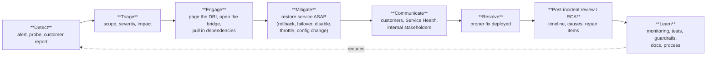
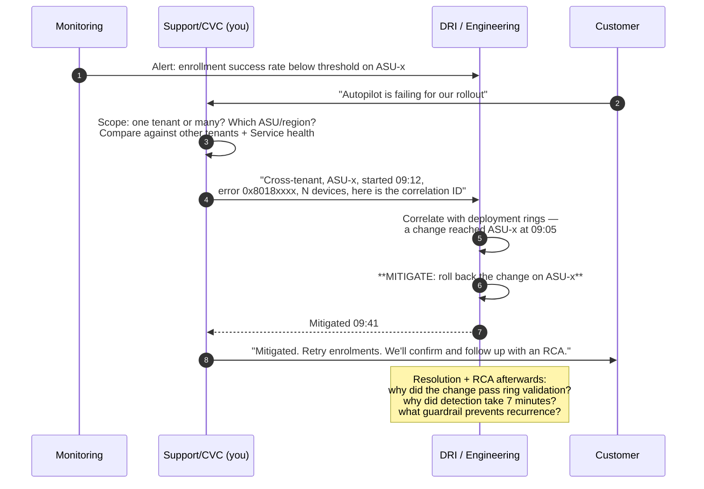
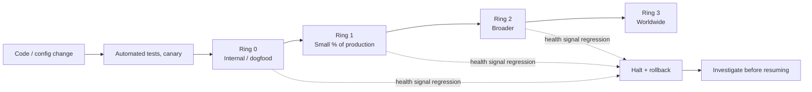

# Part K — Service Availability, Live Site & Incident Management

> **Section goal:** The JD says *"Lead supportability and troubleshoot the availability of the service"* and *"Be the Intune technical lead for a customer in the Mission Critical Support service."* This Part gives you the language, the mental models and the judgement of someone who has run live site: SLAs, incident lifecycle, mitigation-first thinking, safe deployment, blast radius, and how to write an RCA that actually changes something.

Covers index items **89–97**. Maps to JD: *"Lead supportability and troubleshoot the availability of the service"*, *"Be the Intune technical lead for a customer in the Mission Critical Support service"*, *"Provide active coordination across multiple support teams"*, *"3+ years' experience leading supportability and troubleshooting the availability of applications, properties, systems, networks, and servers for high availability enterprise systems"*.

**Assumes:** [Part A](Part-A-cloud-and-modern-management.md) (multi-tenancy, scale units, rings) and [Part I](Part-I-troubleshooting-and-diagnostics.md) (methodology).

---

## 89. Availability, reliability and the language of service health

### 🔍 Plain-English deep-dive: the vocabulary everyone uses and few define

- **Availability** — *the proportion of time the service does what it's supposed to.* **Analogy:** the percentage of days the shop was open when it said it would be. Usually expressed as "nines".
- **Reliability** — *the probability the service performs correctly over a period.* Broader than availability: a service can be "up" and still be giving wrong answers slowly.
- **SLA (Service Level Agreement)** — *the contractual promise to the customer*, usually with financial consequences. Example shape: 99.9% monthly uptime.
- **SLO (Service Level Objective)** — *the internal target the team runs to*, always tighter than the SLA so there's headroom. **Analogy:** you promise to arrive by 9:00 (SLA), so you aim to arrive by 8:45 (SLO).
- **SLI (Service Level Indicator)** — *the actual measurement* the SLO is built from: e.g. "percentage of policy-delivery requests completing successfully in under N seconds."
- **Error budget** — *the amount of failure you're allowed before you breach the SLO.* If you have budget left, ship features; if you've burned it, stop shipping and fix reliability. **Analogy:** an allowance of sick days — spending them isn't a crime, running out changes your behaviour.
- **MTTD / MTTM / MTTR** — Mean Time To **Detect** / **Mitigate** / **Resolve** (or Repair). **This trio is the vocabulary of live site.** Detection is usually the biggest lever, because you can't fix what you don't know about.
- **TTE / TTA** — Time To Engage / Acknowledge.
- **Impact** — expressed as *what percentage of what population could not do what, for how long*. Never just "it was broken."

### The nines

| Availability | Downtime per month | Downtime per year |
|---|---|---|
| 99% | ~7.2 hours | ~3.65 days |
| 99.9% ("three nines") | ~43.8 minutes | ~8.77 hours |
| 99.99% ("four nines") | ~4.4 minutes | ~52.6 minutes |
| 99.999% ("five nines") | ~26 seconds | ~5.26 minutes |

> 💡 **The point to make in an interview:** "Once you're at three or four nines, the dominant term in your downtime is no longer *fix time* — it's *detection and engagement time*. That's why monitoring, alert quality and on-call responsiveness matter more than raw debugging speed, and why I'd invest in detection before I invest in a faster fix."

### What "availability" means for a management service specifically

Intune is not a website — measuring it purely as "is the portal up" is wrong. Meaningful availability questions include:

- Can devices **enrol**?
- Do devices **check in** and receive policy within the expected window?
- Do **apps** download and install?
- Does **compliance state** flow to Entra so Conditional Access doesn't wrongly block people?
- Are **reports and the admin console** accurate and responsive?
- Are **connectors** (Apple, Google, certificate, Defender) healthy?

A partial failure — say, compliance state not propagating — can be more damaging than a portal outage, because it locks users out of everything through Conditional Access while the service looks "up". **Naming that asymmetry is a strong senior signal.**

---

## 90. Mission Critical Support and the Designated Engineer role

The JD explicitly says you'll be *"the Intune technical lead for a customer in the Mission Critical Support service."*

### What that means day to day

| Responsibility | What it looks like |
|---|---|
| **Know the customer's environment deeply** | Their tenant ID, scale unit/region, size, platform mix, network architecture, proxy/inspection posture, identity model, co-management state, connectors and every expiry date |
| **Be their advocate inside Microsoft** | When their case needs engineering, you make it happen and you translate both directions |
| **Proactive risk reduction** | Health reviews, expiry monitoring, upgrade readiness, reading Message Center *for them* and telling them what will affect them |
| **Own escalations end to end** | Not "I raised it with the team" — you own the outcome and the communication |
| **Incident leadership for their impact** | Assess impact, drive mitigation, communicate at the right cadence, then close the loop with an RCA |
| **Trend analysis on their estate** | Their recurring cases become problem-management items and product feedback |
| **Readiness and enablement** | Their admins get better because you teach them |
| **Change advocacy** | Review their planned changes (a new CA policy, a network redesign, a Windows feature update wave) before they self-inflict an outage |

### 🔍 Plain-English deep-dive: proactive vs reactive support

- **Reactive** — the customer tells you something is broken; you fix it. **Analogy:** the fire brigade.
- **Proactive** — you spot the risk before it becomes an incident: an APNs certificate expiring in 30 days, a device population still on an OS about to fall out of support, a Conditional Access change that will lock out enrollment, a connector that quietly stopped syncing. **Analogy:** the fire inspector.
- **Why it matters for this role:** the entire premise of CVC — *"anticipates, amplifies, and systemically solves customer needs"* — is proactive. Frame yourself as the fire inspector who is also very good in a fire.

**A concrete, quotable proactive plan for a Mission Critical customer:**
1. Build an **expiry register**: APNs push certificate, Apple ADE token, VPP token, NDES/Certificate Connector certificate, CA certificates, app registration secrets, Managed Google Play binding — with owners and alerting at 60/30/7 days.
2. **Weekly health review**: enrollment failure rate, non-compliant trend, app install failure rate, devices not checked in for N days, connector status.
3. **Change calendar alignment**: their change freezes, their peak periods, Microsoft's Message Center items that affect them.
4. **Readiness**: OS version distribution vs support lifecycle, Autopilot profile hygiene, ESP blocking-app list review.
5. **Case trend review**: top 5 recurring case types, with a plan to eliminate each.

---

## 91. Monitoring, alerting and detection

| Concept | Plain English |
|---|---|
| **Telemetry** | The stream of measurements the service emits about itself |
| **Metric vs log vs trace** | A number over time / an event record / the path of one request through many services |
| **Synthetic monitoring (probes/watchdogs)** | A robot that continuously performs a real scenario (enrol a test device, deploy a policy) and alerts when it fails. **Analogy:** a canary in the mine |
| **Real user monitoring / passive signals** | Measuring what actual customers experience, rather than a robot |
| **Health model** | An explicit definition of what "healthy" means per component, so alerts map to customer impact |
| **Alert quality** | Precision (is it real?) and recall (did we catch it?). Bad alerts cause **alert fatigue**, which is how real incidents get missed |
| **Dashboards** | Situational awareness, not detection — a human staring at a dashboard is not monitoring |
| **Anomaly detection** | Statistical/ML detection of "this doesn't look like last Tuesday" |
| **Correlation ID** | An identifier carried through a request so you can trace it across services. **Ask customers for these — they turn "it failed" into a traceable path** |

> 💡 **The best thing you can say about monitoring:** "A monitoring gap and a bug are both defects. If we only found out because the customer told us, the incident has two root causes: whatever broke, and why we didn't see it first. I'd file both."

---

## 92. The incident lifecycle

### Severity levels (generic shape — every org differs in detail)

| Sev | Meaning | Response |
|---|---|---|
| **Sev 0 / Sev 1** | Broad customer-impacting outage or security incident | Immediate page, 24×7 bridge, executive comms, all hands |
| **Sev 2** | Significant degradation or a major customer heavily impacted | Page, urgent engagement |
| **Sev 3** | Limited impact, workaround exists | Business hours, tracked |
| **Sev 4** | Minor / cosmetic / single customer with workaround | Backlog |

### 🔍 Plain-English deep-dive: mitigation vs resolution

- **Mitigation** — *make the pain stop*, even if the underlying defect is still there. Roll back the deployment, fail over to another region, disable the feature flag, revert the config, throttle the offending caller.
- **Resolution** — *fix the actual defect* so it can't happen again.
- **Why mitigation comes first, always:** every minute spent understanding the bug is a minute customers stay broken. **Analogy:** if the kitchen is on fire, you put the fire out first; you investigate the faulty toaster afterwards.
- **The counter-intuitive corollary:** engineers' instinct is to diagnose before acting. Live site inverts that. Being able to say *"mitigate first, root-cause second"* — and to mean it — is one of the clearest markers of live-site experience.
- **The nuance to add:** mitigate first *unless* mitigation would destroy the evidence needed to prevent recurrence — in which case capture the evidence (dumps, logs, a held instance) in parallel, but do not delay mitigation for it.

### Roles on an incident

| Role | Responsibility |
|---|---|
| **DRI (Directly Responsible Individual)** | Owns the incident right now; makes the calls |
| **Incident Commander / IM** | Coordinates people, keeps the bridge focused, tracks actions (on large incidents, separate from the technical lead) |
| **Comms lead** | Owns customer-facing and internal messaging on a cadence |
| **Scribe** | Maintains the timeline as it happens — invaluable for the RCA later |
| **Subject-matter experts** | Pulled in per component |
| **Support/CVC engineer (you)** | Customer impact assessment, customer communication, and translating between the customer's reality and engineering's model |

### Tools

- **ICM (Incident Manager)** — Microsoft's internal incident system: severity, ownership, timeline, linked bugs, and the mechanism for paging an on-call DRI.
- **Bridge** — the live call/chat where the incident is worked.
- **Runbook / TSG** — the documented steps for known conditions.
- **Service Health Dashboard / Message Center** — the customer-facing surfaces ([Part C](Part-C-intune-architecture.md)).

---

## 93. Mitigation-first thinking, in practice

A worked example you can narrate in an interview:

> **Scenario:** at 09:12 UTC, enrollment failures spike for a subset of tenants. Your Mission Critical customer is one of them and is provisioning 800 devices today.

**The support engineer's value in that flow is not debugging the code.** It is:
1. Establishing **scope** fast (one tenant vs many) — which converts a case into an incident.
2. Providing **precise, quantified impact** so severity is set correctly.
3. Supplying **evidence** (error codes, correlation IDs, timestamps, device counts) so engineering doesn't start from zero.
4. **Communicating** to the customer at a predictable cadence.
5. Driving the **RCA and repair items** afterwards.

---

## 94. Safe Deployment Practices, rings and blast radius

### The core idea

Never change everything at once. Change a little, watch closely, then change more.

### The vocabulary

| Term | Meaning |
|---|---|
| **SDP (Safe Deployment Practice)** | The discipline of progressive, monitored rollout with automatic halt/rollback |
| **Ring / wave / stage** | A population that receives the change at a given step |
| **Canary** | A tiny first population, heavily monitored |
| **Bake time** | The minimum time to sit in a ring before advancing, so slow-burn regressions surface |
| **Feature flag / flighting** | Turning a feature on for a subset without redeploying code — and, critically, being able to turn it **off** instantly |
| **Kill switch** | A dedicated flag whose only job is to disable a risky path fast |
| **Blast radius** | How many customers/devices a change can affect if it's wrong |
| **Rollback / roll-forward** | Return to the previous version / ship a fix forward. Rollback is usually faster and therefore preferred as a mitigation |
| **Change freeze / lockdown** | Periods (holidays, customer peak seasons) where non-critical change is blocked |
| **Health signals / gates** | Automated criteria that must remain green for a rollout to proceed |
| **Blue/green, canary deployment** | Deployment patterns that keep a known-good version available |

### Why a support engineer must understand SDP

1. It explains **"it works in tenant A but not tenant B"** — they may be in different rings.
2. It's the fastest route to **mitigation**: "was there a deployment to this scale unit in the last hour?" is one of the highest-yield questions in live site.
3. It's what you advise **customers** to do with their own changes — Conditional Access policies, compliance policies, feature updates, ASR rules. *"Ring your own changes"* is advice you'll give weekly.
4. It's a **design review** lever: "does this change have a flag and a documented rollback?"

---

## 95. Root Cause Analysis that actually changes something

### The anatomy of a good RCA / post-incident review

| Section | What goes in it |
|---|---|
| **Summary** | Two sentences a non-engineer can understand |
| **Customer impact** | Who, how many, what they could not do, for how long, quantified |
| **Timeline** | UTC timestamps: change → onset → detection → engagement → mitigation → resolution. Include the *gaps*, because the gaps are the lesson |
| **Root cause** | The technical cause, and the **contributing factors** (why did testing miss it, why did the gate not catch it, why did detection take so long) |
| **Detection** | How was it found? By us or by the customer? What would have caught it sooner? |
| **Mitigation** | What was done and why that was the fastest safe option |
| **Repair items** | Concrete, owned, dated work items — code fix, test, monitor, guardrail, documentation, process |
| **Lessons / what went well** | Preserve what worked; don't only list failures |

### 🔍 Plain-English deep-dive: blameless post-mortems and the Five Whys

- **Blameless** — *the review assumes people acted reasonably given what they knew.* **Analogy:** investigating a plane crash to fix the system, not to punish the pilot. **Why it matters:** blame produces hidden information; you get truthful timelines only when people aren't defending themselves. It is *not* the absence of accountability — repair items still have owners and dates.
- **Five Whys** — keep asking *why* until you reach something systemic. Example:
  1. Devices couldn't enrol. *Why?* A service change rejected a valid request shape.
  2. *Why did it ship?* Tests didn't cover that request shape.
  3. *Why not?* The shape only occurs for tenants with a particular legacy configuration.
  4. *Why wasn't that in test?* No test tenant has that configuration.
  5. *Why?* We have no inventory of legacy configurations in production.
  → **Repair item is not "fix the bug" — it's "build an inventory of production configuration shapes and add representative test tenants."**
- **Counterfactual trap** — avoid "if only X had been more careful"; that's not actionable. Prefer "the system allowed X to happen without detection."

### The two root causes rule

Every customer-reported incident has (at least) two:
1. **The defect** that caused the impact.
2. **The detection gap** that meant a customer told us instead of monitoring telling us.

Filing both is a habit that marks out a live-site-mature engineer.

---

## 96. Communication during an incident

This is disproportionately what customers remember. Get it right and a bad outage becomes a trust-building event.

### The rules

| Rule | Why |
|---|---|
| **Communicate early, before you know the answer** | Silence is interpreted as incompetence. "We're aware, investigating, next update in 30 minutes" is enough |
| **Commit to a cadence and keep it** | Even "no change, still working, next update in 30 minutes" preserves trust |
| **State impact in the customer's terms** | Not "the policy service is degraded" but "devices in your tenant may not receive new configuration; existing configuration is unaffected; enrollment is not impacted" |
| **Separate what you know from what you suspect** | Never speculate on cause in a customer channel. Speculation that turns out wrong is remembered forever |
| **Give a workaround if one exists** | Even a partial one |
| **Close the loop** | Confirm mitigation, then deliver the RCA when promised. Failing to deliver a promised RCA is one of the fastest ways to lose a Mission Critical relationship |
| **Match the audience** | The customer's engineers want error codes; their CIO wants impact, ETA and assurance |
| **Never blame the customer publicly, even when it is their change** | Say what happened and what will prevent it; handle attribution privately and factually |

### A template you can quote

> **Initial:** "We are aware of an issue affecting *[scenario]* for *[scope]*, first observed at *[UTC time]*. Engineering is engaged. Current impact: *[what users cannot do]*. Workaround: *[if any]*. Next update by *[time]*."
>
> **Update:** "Investigation continues. We have identified *[what is known]*. Mitigation is being *[validated/deployed]*. Impact unchanged. Next update by *[time]*."
>
> **Mitigated:** "Mitigation was applied at *[UTC time]* and success rates have returned to normal. Please retry *[action]*. We are continuing to monitor. A root cause analysis will be provided by *[date]*."
>
> **Closure:** "Confirmed resolved. RCA attached, including the repair items we are taking to prevent recurrence."

---

## 97. Capacity, throttling and multi-tenant fairness

| Concept | Plain English | Support relevance |
|---|---|---|
| **Capacity planning** | Provisioning enough resource for expected and peak load | Big customer onboarding waves need planning, not surprise |
| **Throttling / rate limiting** | Rejecting excess requests to protect the service (HTTP 429 + `Retry-After`) | Explain it to customers; fix badly-behaved scripts |
| **Noisy neighbour** | One tenant's load degrading others on shared infrastructure | Why per-tenant limits exist |
| **Back-pressure** | The service telling callers to slow down instead of collapsing | Well-behaved clients back off exponentially with jitter |
| **Circuit breaker** | Stop calling a failing dependency for a while instead of piling on | Prevents cascading failure |
| **Retry storm / thundering herd** | Everyone retrying at the same instant after an outage makes recovery impossible | Why jitter matters, and why "just tell everyone to re-sync" can be the wrong advice |
| **Graceful degradation** | Shed non-essential work to keep the critical path alive | E.g. reporting lags while policy delivery is protected |
| **Bulkhead / partitioning** | Isolating workloads so one failure doesn't take everything | Why scale units exist |

> ⚠️ **Practical live-site judgement worth voicing:** after a service incident, telling 200,000 devices to sync immediately can create a thundering herd that delays recovery. The right advice is usually staggered retries, or simply letting the natural check-in cycle drain the backlog. Recognising that "the obvious remediation can make recovery worse" is a distinctly senior observation.

---

## 📌 Part K quick-reference sheet

| Term | One-line meaning |
|---|---|
| SLA / SLO / SLI | Customer promise / internal target / the measurement behind it. |
| Error budget | Allowed failure before the SLO breaks; governs whether you ship or fix. |
| MTTD / MTTM / MTTR | Time to detect / mitigate / resolve. Detection is usually the biggest lever. |
| Nines | 99.9% ≈ 43 min/month; 99.99% ≈ 4.4 min/month. |
| Availability for Intune | Not "is the portal up" — can devices enrol, check in, get apps, and does compliance flow. |
| Mission Critical / Designated Engineer | Named engineer owning one major customer end to end. |
| Proactive vs reactive | Fire inspector vs fire brigade. CVC is the inspector. |
| Expiry register | APNs, ADE, VPP, NDES, CA certs, app secrets — monitored at 60/30/7 days. |
| Synthetic probe | A robot performing a real scenario continuously. |
| Correlation ID | Traces one request across services; always ask for it. |
| Alert fatigue | Bad alerts cause real incidents to be missed. |
| DRI | Directly Responsible Individual for the incident right now. |
| ICM | Microsoft's internal incident management and paging system. |
| Sev 0–4 | Severity scale driving response and comms. |
| **Mitigate first, root-cause second** | Stop the pain before understanding the bug. |
| Rollback vs roll-forward | Revert (fast, preferred as mitigation) vs fix forward. |
| SDP | Safe Deployment Practice: progressive rollout with health gates. |
| Ring / canary / bake time | Population stages, tiny first stage, minimum soak time. |
| Feature flag / kill switch | Turn behaviour off instantly without redeploying. |
| Blast radius | How much a bad change can hurt. |
| Blameless post-mortem | Fix the system, not the person; blame hides information. |
| Five Whys | Keep asking until the cause is systemic. |
| Two root causes | The defect, **and** the detection gap. |
| Comms cadence | Early, regular, in the customer's terms, no speculation, close the loop. |
| Throttling / 429 / Retry-After | Service self-protection; back off with jitter. |
| Thundering herd | Synchronized retries that prevent recovery. |
| Circuit breaker / bulkhead | Stop calling a failing dependency / isolate workloads. |

---

## ⭐ Likely Interview Questions for This Section

**Q1. "What's the difference between an SLA, an SLO and an SLI?"**
> *Model answer:* "An SLI is the measurement — for example the percentage of policy-delivery requests that succeed within a target time. An SLO is the internal objective built on that indicator, and it's deliberately tighter than what we've promised, so there's headroom. An SLA is the contractual commitment to the customer, usually with financial consequences if missed. The reason the distinction matters operationally is the **error budget**: the gap between perfect and the SLO is a budget you're allowed to spend. If you have budget left, you can take deployment risk and ship; if you've burned it, the right decision is to stop shipping features and invest in reliability. It turns 'how much risk should we take' from an argument into a number."

**Q2. "How would you define availability for a service like Intune?"**
> *Model answer:* "Not as 'is the portal up', because that's the least important surface. I'd define it as a set of scenario-level indicators: can devices enrol, do enrolled devices check in and receive policy within the expected window, do apps download and install, does compliance state propagate to Entra, and are the connectors healthy. The compliance-propagation one is the most interesting, because a partial failure there is more damaging than a portal outage — if compliance doesn't flow, Conditional Access starts blocking legitimate users while every dashboard says the service is green. So I'd want scenario-based synthetic probes covering the customer-visible journeys, not just component-level health, and I'd want per-scale-unit visibility because impact is frequently partitioned."

**Q3. "Walk me through how you'd handle a live-site incident."**
> *Model answer:* "First, scope and impact — is this one tenant or many, which scenario, which region or scale unit, since when, how many devices, and what can users not do. That determines whether it's a case or an incident, and it sets severity. Second, engage the right people fast: raise the ICM at the right severity, get the DRI on a bridge, and pull in dependencies. Third — and this is the discipline that matters — **mitigate before you root-cause**. Roll back the deployment, flip the feature flag, fail over, revert the config. Every minute spent understanding the bug is a minute customers stay broken. The one nuance is that if mitigation destroys the evidence, I capture evidence in parallel rather than delaying mitigation. Fourth, communicate early and on a committed cadence, in the customer's terms, without speculating about cause. Fifth, after mitigation, drive resolution and a blameless post-incident review with owned, dated repair items — including a repair item for the detection gap if a customer told us before monitoring did."

**Q4. "Why mitigate before diagnosing? Isn't that treating symptoms?"**
> *Model answer:* "In development, yes, treating symptoms is bad practice. In live site the calculus is different, because customer impact is accruing continuously while you investigate. Mitigation stops the bleeding — rollback, feature flag, failover, config revert — and it usually takes minutes, whereas root cause can take hours or days. Once impact has stopped, you have all the time you need to do the analysis properly, and you do it under far less pressure, which produces a better answer. The exception I'd flag is that some mitigations destroy the state you need to understand the failure, so I'd capture logs, dumps or a held instance in parallel rather than choosing between them. And mitigation is never the end — it creates an obligation to resolve and to prevent, which is what the RCA and repair items are for."

**Q5. "What are Safe Deployment Practices and why should a support engineer care?"**
> *Model answer:* "SDP is progressive, monitored rollout: a change goes to internal rings, then a small percentage of production, then wider, with health gates and a minimum bake time at each stage, and automatic halt or rollback if signals regress. Support engineers care for three reasons. It explains cross-tenant behaviour differences — two tenants can legitimately be on different builds, so 'works in my test tenant' isn't evidence of a bug. It's the highest-yield question in live site: 'did a deployment reach this scale unit shortly before onset?' frequently identifies the cause in minutes. And it's the advice I give customers about their *own* changes — ring your Conditional Access policies, your compliance policies, your ASR rules and your feature updates, because the most common outages I see in customer tenants are self-inflicted global changes with no pilot and no rollback plan."

**Q6. "How do you write an RCA that engineering will actually act on?"**
> *Model answer:* "Quantified impact first, in customer terms — who, how many, what they couldn't do, for how long — because that's what determines priority. Then a UTC timeline that deliberately exposes the *gaps*: change deployed, onset, detection, engagement, mitigation, resolution. The gaps are usually the real lesson; if detection took forty minutes, that's a bigger finding than the code defect. Then root cause plus contributing factors, using Five Whys until I reach something systemic rather than stopping at 'a bug was introduced' — the useful answer is usually about why testing, gating or monitoring didn't catch it. Then repair items that are specific, owned and dated, covering the fix, the test, the monitor and any guardrail or documentation. And it has to be blameless: I want an accurate timeline, and I only get that if people aren't defending themselves. I'd also record what went well, because good practices get lost if you only ever document failures."

**Q7. "How would you communicate with a Mission Critical customer during a major outage?"**
> *Model answer:* "Early, on a committed cadence, and in their language. My first message goes out before I know the cause: we're aware, here's the observed impact and the time it started, engineering is engaged, next update at a specific time. Then I hold that cadence religiously, even when the update is 'no change'. I state impact in terms of what their users can and cannot do, and I'm explicit about what is *not* affected, because that's often what lets them keep operating. I never speculate about cause in a customer channel — speculation that turns out to be wrong is remembered far longer than the outage. I give any workaround, even a partial one. When mitigation lands I confirm it and tell them what to retry. And I close the loop with the RCA on the date I promised, because failing to deliver a promised RCA damages the relationship more than the outage did. I'd also tailor the message: their engineers want error codes and correlation IDs; their CIO wants impact, ETA and assurance it won't recur."

**Q8. "You're on a bridge with several teams and nobody is making progress. What do you do?"**
> *Model answer:* "I'd try to create clarity, which is what the JD calls for. Concretely: restate the current impact and severity so everyone shares the same problem statement, because bridges usually stall when people are solving different problems. Establish what we actually know versus what we're assuming, and write it down. Ask the mitigation question explicitly — 'what is the fastest way to stop customer impact, independent of cause?' — because bridges often drift into root-cause analysis while the outage continues. Assign named owners to parallel workstreams with a check-back time rather than letting everyone debate serially. And make sure someone is scribing the timeline and someone owns customer comms, because those are the first things dropped and the first things missed afterwards. If I'm not the incident commander, I'd offer these as questions rather than instructions — driving without authority is most of this job."

**Q9. "After an incident is mitigated, a customer asks you to have all 200,000 devices sync immediately. What do you say?"**
> *Model answer:* "I'd push back, and explain why. Triggering a synchronized sync across a very large fleet creates a thundering herd — everyone hitting the service at the same instant — which can re-degrade the very service that just recovered, and can trip throttling so devices back off and take *longer* to converge than if we'd done nothing. The better answers are to let the natural check-in cycle drain the backlog, which for most scenarios is quick enough; or if we do need to accelerate, to stagger it in batches with gaps, prioritising the population with real business impact — for example devices mid-provisioning. It's a good example of the obvious remediation making recovery worse, and being able to explain that calmly to a frustrated customer is part of the job."

**Q10. "What would you do in your first 90 days as the designated engineer for a Mission Critical customer?"**
> *Model answer:* "First 30 days, learn their environment properly and document it: tenant ID, region and scale unit, size and platform mix, identity model and Conditional Access design, co-management state, network architecture including proxy and TLS-inspection posture, connectors, and every credential and token with an expiry date. In parallel, read their last six to twelve months of cases and cluster them, because that tells me where the pain actually is rather than where they say it is. Days 30 to 60, build the operational rhythm: an expiry register with alerting at 60/30/7 days, a weekly health review covering enrollment failure rate, compliance trend, app failure rate and devices not checking in, and a change calendar aligned to their peaks and freezes. Days 60 to 90, start converting: take the top three recurring case clusters and drive each to a systemic outcome — a remediation script, a configuration change, a TSG, or a bug or DCR with quantified impact. And establish the relationship rhythm with their engineers and their leadership, so that when there *is* an incident, I'm already a known and trusted voice rather than a stranger on a bridge."

**Q11. "How do you balance being the customer's advocate with being a Microsoft engineer?"**
> *Model answer:* "I don't think they conflict as often as people assume, because the customer's long-term interest and Microsoft's long-term interest are the same: a service that works and doesn't generate incidents. Where they do conflict, my approach is honesty in both directions. To the customer I'm straight about what is our fault, what is their configuration, and what we can and can't commit to — over-promising internally to look good externally is how designated engineers lose credibility in both directions. To engineering I bring quantified customer impact rather than emotion, because 'this customer is angry' doesn't prioritise anything but '1,300 devices blocked from enrolment for six hours, with this evidence' does. And when the answer is genuinely 'no', I say so, explain the reasoning, and offer the best alternative — customers respect a clear no far more than a vague maybe that quietly expires."

---

## 🧠 30-Second Memory Hooks

- **SLI = the measurement · SLO = the target · SLA = the promise · error budget = the allowance.**
- **99.9% ≈ 43 min/month. 99.99% ≈ 4.4 min/month.**
- **At high nines, detection dominates. MTTD is the biggest lever.**
- **Availability for Intune = enrol · check in · apps · compliance flows — not "is the portal up".**
- **MITIGATE FIRST, ROOT-CAUSE SECOND.** The single most important live-site sentence.
- **"Was there a deployment to this scale unit before onset?"** — the highest-yield question in live site.
- **Every customer-reported incident has two root causes: the defect and the detection gap.**
- **Blameless ≠ accountability-free.** Blame hides the timeline; owners and dates still apply.
- **Five Whys until it's systemic.** "Fix the bug" is never a good final repair item.
- **Comms: early · cadenced · customer's terms · no speculation · close the loop.**
- **Rings and kill switches aren't just ours — tell customers to ring their own changes.**
- **Thundering herd: the obvious remediation can make recovery worse.**

---

*Next suggested section:* **[Part L — Support Process, Problem Management & Voice of the Customer](Part-L-support-process-and-voc.md)** — live site handles the emergency; problem management is how you make sure it stops happening, which is the core of what CVC exists to do.
