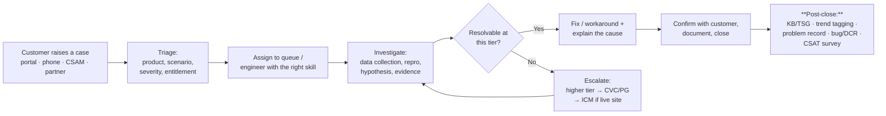
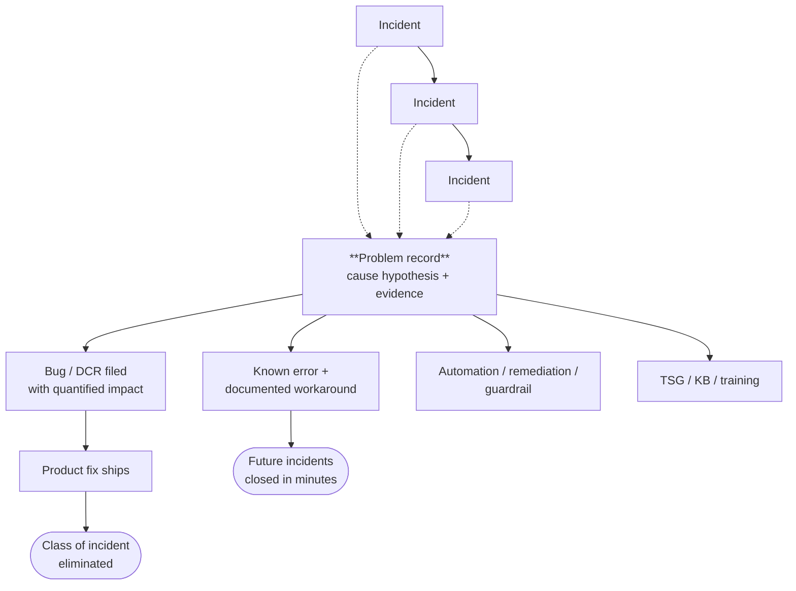
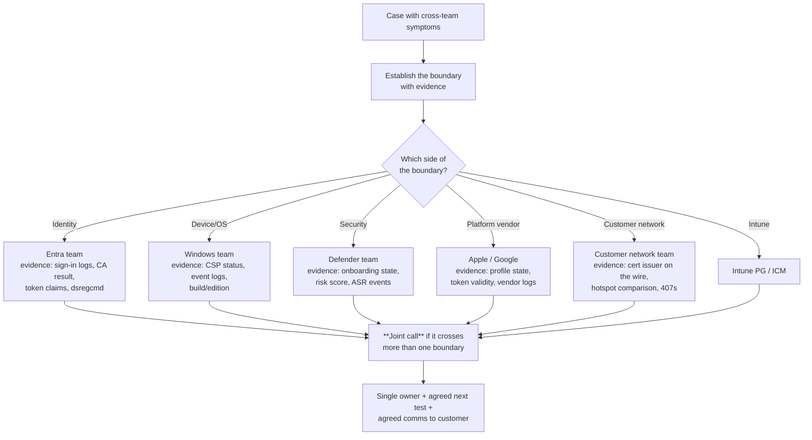
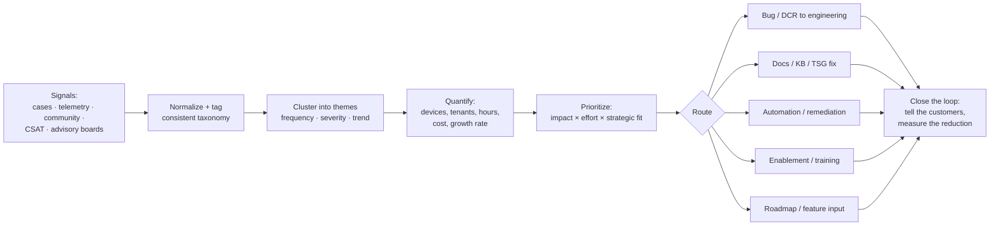
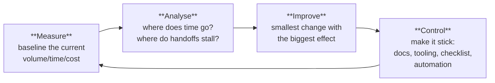

# Part L — Support Process, Problem Management & Voice of the Customer

> **Section goal:** This Part is the *heart of the job description*. Almost every bullet in the JD lives here: driving process improvements, coordinating across support teams, driving bugs and DCRs, costing problem-management tickets, documenting methodologies, enabling support teams and partners, and being the Voice of the Customer. By the end you will have the vocabulary, the frameworks and the concrete artefacts to talk about all of it credibly.

Covers index items **98–107**. Maps to JD: *"Drive process improvements within the team and the larger organization"*, *"Provide active coordination across multiple support teams"*, *"Drive bugs/DCRs related to problem management tickets"*, *"Help to identify the cost associated with each problem management ticket"*, *"Document processes, best methodologies and technical instructions for Support Groups"*, *"Enable customer support teams and partners"*, *"Voice of the Customer"*.

**Assumes:** [Part I](Part-I-troubleshooting-and-diagnostics.md) (methodology) and [Part K](Part-K-live-site-and-availability.md) (incidents, RCA).

---

## 98. The case lifecycle



### Vocabulary

| Term | Meaning |
|---|---|
| **Entitlement** | What support the customer has paid for (Unified/Premier tiers, Mission Critical add-on, partner-delivered) — determines response commitments |
| **Severity (case)** | Customer-declared and agreed urgency: A/1 = critical business impact, B/2 = moderate, C/3 = minimal |
| **Initial response time** | Contractual time to first meaningful contact, driven by severity and entitlement |
| **Ownership / hand-off** | Follow-the-sun means a case may move region; a clean hand-off note is a professional obligation |
| **Workaround vs fix** | Restores function now / removes the cause |
| **Escalation** | Moving a case up a tier or into engineering. *Not* a failure — a late escalation is the failure |
| **Case notes** | The durable record. Written for the next engineer, not for yourself |
| **Closure** | Confirmed with the customer, with cause explained — "it works now" is not a closure |
| **Reopen** | A case reopened is a signal that closure was premature; reopen rate is a real quality metric |

### The hand-off note that marks you as a professional

> **Symptom:** exact failing scenario, scope, first observed (UTC).
> **Environment:** tenant ID, region, platform, OS build, client versions, network posture.
> **Evidence collected:** logs gathered, error codes, correlation IDs, timestamps, what they show.
> **Hypotheses tested and eliminated:** and *how* they were eliminated.
> **Current hypothesis:** and the next test that would confirm or refute it.
> **Customer state:** what they've been told, when the next update is promised, their sentiment.
> **Next action + owner.**

---

## 99. Incident vs problem management — ITIL in plain English

### 🔍 Plain-English deep-dive

- **Incident management** — *restore service as quickly as possible.* **Analogy:** mopping up the water. **Success measure:** time to restore.
- **Problem management** — *find and eliminate the underlying cause of one or more incidents.* **Analogy:** finding and fixing the leaking pipe. **Success measure:** incidents that no longer happen.
- **Known error** — a problem whose cause is understood and for which a workaround exists, documented so incidents can be closed fast.
- **Workaround** — a documented way to restore service without fixing the cause.
- **Change management** — controlling changes so they don't cause incidents (rings, CAB, change freezes).
- **Service request** — a routine ask ("please increase our device limit"), not a failure.
- **Proactive problem management** — finding problems *before* incidents happen: trend analysis, telemetry, risk review.

| | Incident | Problem |
|---|---|---|
| Question | "How do we get this working now?" | "Why does this keep happening?" |
| Time horizon | Minutes to hours | Days to months |
| Output | Restored service | Eliminated cause; fewer future incidents |
| Metric | MTTR, SLA attainment | Recurrence rate, ticket volume reduction, cost avoided |
| Owner | On-call / support engineer | **This role** |



> 💡 **The sentence that frames the whole role:** "Incident management is measured by how fast we recover. Problem management is measured by how often we *don't have to*. This team exists for the second one."

---

## 100. Filing a bug engineering will actually fix

Engineering teams are permanently over-subscribed. Your bug competes with everything else on their backlog. Make it easy to say yes.

### The anatomy of a high-quality bug

| Element | Why it matters | Bad | Good |
|---|---|---|---|
| **Title** | It's how the bug gets triaged in a queue of 200 | "Intune broken" | "Win32 app install reports 0x87D00324 when detection script runs 32-bit on Windows 11 24H2" |
| **Impact, quantified** | Determines priority | "Customer is upset" | "1,347 devices across 22 tenants; blocks provisioning; 41 cases in 30 days; est. 68 support hours/month" |
| **Repro steps** | Removes the biggest reason bugs get returned | "It fails sometimes" | Numbered, minimal, deterministic steps with a clean environment described |
| **Expected vs actual** | States the contract being violated | — | "Expected: detection succeeds. Actual: detection returns not-detected despite the file existing." |
| **Evidence** | Saves engineering hours | "Logs attached" (400 MB) | The relevant log excerpt with timestamps, correlation IDs, device IDs, error codes, and a pointer to full logs |
| **Environment** | Narrows the search | "Windows" | OS build, edition, client version, tenant ID, region/scale unit, service release |
| **Frequency and trend** | Is it growing? | — | "First seen 12 Mar, growing ~15% week over week" |
| **Workaround** | Determines urgency and unblocks customers now | — | "Ticking 'run script as 64-bit' avoids it" |
| **Regression?** | Regressions get fixed far faster | — | "Worked on service release X, fails on X+1" |
| **The ask** | Ambiguous bugs stall | "Please fix" | "Requesting a fix in the next service release, or confirmation that the documented behaviour should change" |

### 🔍 Plain-English deep-dive: bug vs DCR vs feature request

- **Bug** — *the product does not do what it is designed and documented to do.* **Analogy:** the car's brakes don't work. Engineering is obliged to consider it.
- **DCR (Design Change Request)** — *the product works exactly as designed, but the design causes customer pain.* **Analogy:** the handbrake is behind the passenger seat — it works, but it's in the wrong place. **This is the most important artefact in this job**, because most supportability problems are design problems, not defects: unhelpful error messages, missing logging, no correlation ID, a setting that fails silently, a limit with no warning.
- **Feature request / suggestion** — *the product doesn't do something customers want it to do.* Routed through product planning and public feedback channels.
- **Documentation defect** — the product is right and the documentation is wrong or missing. Cheap to fix, disproportionately valuable.

**Why the distinction matters:** filing a DCR as a bug gets it closed as "by design" and you lose. Filing it as a DCR *with quantified support cost* is how supportability actually improves.

### The supportability DCRs worth pushing for

| Pain | DCR ask |
|---|---|
| Error says "an error occurred" | Actionable, unique error codes with documented meanings |
| No way to correlate a client failure to a service request | Emit and surface a **correlation ID** on every failure |
| Failure is silent | Emit a distinguishable event/log entry on the failure path |
| Admin can't tell why a policy didn't apply | Per-setting status with a reason, not just Succeeded/Error |
| Limits hit without warning | Warn at 80%, surface current usage |
| Diagnostics require the user | Server-initiated diagnostic collection for that scenario |
| Nothing detects a broken connector until it fails | Proactive expiry and health signals with alerting |

---

## 101. Escalation and cross-team coordination

The JD asks for *"active coordination across multiple support teams."* Intune sits at a junction — a single case can involve Intune, Entra, Windows, Defender, Apple/Google, networking, and the customer's own teams.

### The rules of good escalation

1. **Escalate early on severity, not on frustration.** Escalating late is the failure mode, not escalating "too soon".
2. **Escalate with a package, not a plea.** Impact, evidence, hypotheses eliminated, and the specific ask.
3. **Own the outcome, not the hand-off.** "I raised it with the other team" is not ownership.
4. **Name the boundary explicitly.** "The device gets a valid token from Entra — that's evidenced here — and fails at MDM check-in with this code, so I believe the boundary is on our side."
5. **Bring the teams together rather than relaying.** Serial relay across three teams multiplies elapsed time; a 20-minute joint call collapses it.
6. **Close the loop with every party**, including the ones who turned out not to be at fault — you'll need them again next month.



---

## 102. Costing a problem — building the business case

The JD literally says *"Help to identify the cost associated with each problem management ticket."* This is unusual and specific — prepare it.

### The basic model

```
Annual cost of a problem  =  Ticket volume (per year)
                           × Average handle time (hours)
                           × Loaded cost per support hour
                           + Escalation cost (engineering hours × engineering rate)
                           + Customer cost (lost productivity, delayed projects)
                           + Opportunity cost (what those engineers would otherwise do)
                           + Risk cost (churn, CSAT damage, contractual credits)
```

### A worked example you can narrate

| Input | Value |
|---|---|
| Cases per month on this failure | 120 |
| Average handle time | 2.5 hours |
| Loaded support cost per hour | (use a placeholder — never quote internal figures) $X |
| Escalations to engineering per month | 6 × 4 hours |
| Customer-side impact | ~300 devices/month blocked from provisioning for ~1 day |

> **Narrative:** "That's 300 support hours a month, 24 engineering hours a month, and roughly 300 device-days of lost productivity for customers, recurring. The fix is a two-line change in a detection path plus a documentation correction. Even ignoring the customer-side cost, the support cost alone pays back the engineering effort in under a month. Here is the bug, here is the evidence, here is the payback."

### Metric definitions you should know

| Metric | Meaning | Why it matters |
|---|---|---|
| **Ticket volume / case rate** | Cases per period, often normalized (per 1,000 seats, per 10,000 devices) | Normalization makes customers comparable |
| **AHT (Average Handle Time)** | Engineer time per case | Multiplied by volume = cost |
| **TTR / TTM** | Time to resolve / mitigate | Customer-perceived speed |
| **Time to first response** | Contractual, and heavily correlated with satisfaction | |
| **Backlog age / aging cases** | Cases older than N days | Where trust dies quietly |
| **Reopen rate** | Cases reopened after closure | Quality of resolution |
| **Escalation rate** | % reaching engineering | Both a complexity and a documentation signal |
| **Deflection rate** | % resolved by self-service/docs/AI before reaching a human | The lever [Part N](Part-N-ai-and-agentic-support.md) is about |
| **CSAT / NSAT** | Customer satisfaction / net satisfaction after a case | Outcome measure |
| **CPE / DSAT drivers** | What causes dissatisfaction — often communication, not technical failure | |
| **Cost per ticket** | Fully-loaded cost of handling one case | The currency of the business case |
| **Repeat-contact rate** | Same customer, same issue | Strong problem-management trigger |
| **Top-N drivers** | The handful of issues generating most volume | Pareto: usually ~20% of causes create ~80% of volume |

> 💡 **The framing that lands:** "I don't ask engineering to fix something because a customer is angry — anger doesn't prioritise. I ask them to fix it because it costs *this much*, recurs at *this rate*, and here's the payback period. That converts a support complaint into an investment decision, which is a conversation engineering leadership can actually act on."

---

## 103. Knowledge management — TSGs, KBs and runbooks

| Artefact | Audience | Contains |
|---|---|---|
| **TSG (Troubleshooting Guide)** | Internal support engineers | Symptom → how to confirm it's this → diagnostic steps in order → decision points → fix → when to escalate and to whom |
| **KB (Knowledge Base article)** | Customers / public | Symptom, cause, resolution, workaround, applies-to |
| **Runbook** | Operators | Step-by-step operational procedure, often for recurring or emergency tasks |
| **Known error record** | Support | Cause understood, workaround documented, bug linked |
| **Playbook** | Team | How we handle a *class* of situation (e.g. major incident comms) |
| **Readiness/enablement content** | Support teams and partners | Training decks, labs, demos, FAQ, "what's new" briefings |

### What makes a TSG good (and most TSGs bad)

| Good | Bad |
|---|---|
| Starts with **how to confirm this is the right TSG** | Assumes you already know |
| **Decision tree**, not prose | A wall of paragraphs |
| Exact commands, log paths and what to look for **with sample output** | "Check the logs" |
| Explicit **escalation criteria and destination** | Ends with "if this doesn't work, escalate" |
| States **why**, so the engineer can adapt | Only steps, so it fails on any variation |
| **Dated and owned**, with a review cadence | Written once in 2019, still cited |
| Linked to the **bug/known error** it relates to | Orphaned |

> 💡 **Say this:** "My test for a TSG is whether a competent engineer who has never seen the issue can go from symptom to resolution without asking anyone — and can tell, at each step, whether they're still on the right path. If the TSG needs me to interpret it, it isn't finished."

---

## 104. Enabling support teams and partners

The JD asks you to *"enable customer support teams and partners in a wide range of technical subjects."*

### The enablement toolkit

| Vehicle | Best for |
|---|---|
| **Live technical training / deep dives** | New feature launches, complex subsystems |
| **Recorded sessions + slides** | Scale and follow-the-sun teams |
| **Hands-on labs / sandbox tenants** | Skills that need muscle memory (Autopilot, packaging, log reading) |
| **TSG walkthroughs** | Turning documentation into practice |
| **Case study reviews / "war stories"** | Teaching judgement, which documentation can't |
| **Office hours / ask-me-anything** | Ongoing support without formal training overhead |
| **Readiness checklists before a feature GAs** | Preventing a launch-day support spike |
| **Partner briefings** | MSPs and delegated admins who touch many tenants |
| **Shadowing and reverse-shadowing** | The fastest way to build real capability |

### How to measure enablement (so it isn't just "we ran a session")

- Change in **escalation rate** for the topic before vs after.
- Change in **AHT** for that case type.
- **Deflection**: cases closed at tier 1 rather than escalated.
- **Quiz/lab completion** and hands-on assessment, not attendance.
- Qualitative: do the TSGs get used, and do engineers ask better questions?

> 💡 **The framing to use:** "Enablement is a lever, not a nice-to-have. If I can move a case type from tier 3 to tier 1, I've reduced cost, reduced time to resolution and freed engineering — and that's measurable in escalation rate and handle time, which is how I'd justify the time I spend on it."

---

## 105. Voice of the Customer

**In one sentence:** VoC is the discipline of turning what customers experience into evidence that changes the product.

### The sources

| Source | What it gives you | Watch out for |
|---|---|---|
| **Support cases** | The richest signal — real, detailed, with evidence | Biased toward customers who bother to open cases |
| **Case tagging/taxonomy** | Enables aggregation and trending | Only as good as the tagging discipline |
| **Telemetry** | Objective, complete, and includes people who never call | Needs a hypothesis; correlation ≠ causation |
| **Community forums, Q&A, Reddit, X** | Unfiltered, early signal, often the first sign of a regression | Loud minority; verify before acting |
| **Feedback portals / UserVoice-style channels** | Structured feature demand with vote counts | Voting favours the organized |
| **CSAT/NSAT verbatims** | *Why* people are unhappy — often communication, not the product | Small samples |
| **Customer advisory boards, TAP/preview programs** | Deep, forward-looking input from sophisticated customers | Skews enterprise |
| **CSAM/account teams and field escalations** | Business context and strategic risk | Can be anecdotal |
| **Partner feedback** | Cross-tenant pattern visibility | Commercial interest |
| **Endpoint Analytics / product usage data** | What customers actually do vs what they say | Privacy and aggregation constraints |

### The VoC pipeline



### The two failure modes of VoC (name these — they show maturity)

1. **Anecdote-driven** — the loudest customer or the most recent escalation sets the agenda. Fix: quantify everything; require volume, trend and cost before prioritising.
2. **Open loop** — feedback goes in and nothing comes back out. Customers stop giving it, and internal teams stop believing it. Fix: always close the loop — tell the customer what changed, and publish the reduction you achieved.

> 💡 **The best VoC sentence you can say:** "Voice of the Customer isn't collecting complaints — it's building an evidence pipeline. My job is to turn 'customers are frustrated with X' into 'X generates N cases per month across M tenants, costs this much, is growing at this rate, and here is the specific change that removes it' — and then to go back to those customers and tell them it changed. Without the last step, the pipeline dries up."

---

## 106. Driving process improvement

The JD asks you to *"drive process improvements within the team and the larger organization."*

### A simple, defensible framework



**Practical improvements that are easy to justify:**

| Problem | Improvement |
|---|---|
| Engineers collect different data for the same case type | A standard **diagnostic data collection checklist** per scenario |
| Cases bounce between teams | A documented **boundary map**: which evidence proves which side owns it |
| Same issue re-derived monthly | Known-error records with workarounds |
| Escalations arrive incomplete | An **escalation template** with mandatory fields |
| Nobody knows if training worked | Measure escalation rate before/after |
| Recurrent manual fix | A **Remediation script** deployed proactively |
| Long tail of "how do I…" cases | Self-service documentation and in-product guidance |
| Tribal knowledge in one person's head | Rotation, shadowing, and writing it down |

**Change management for process:** pilot with a small group, measure, get the team's input (people resist changes done *to* them), then standardize. Ironically, the same ring model as [Part K](Part-K-live-site-and-availability.md).

---

## 107. The supportability review checklist

This is a concrete artefact you can describe in an interview — it directly answers *"Partner with the Software Engineering team to review architecture/design and provide feedback and guidance as it relates to the customer experience, support & customer impact."*

### Before a feature ships, ask:

**Diagnosability**
- [ ] Does every failure path produce a **unique, documented error code**?
- [ ] Is there a **correlation ID** the customer can give us that we can trace end to end?
- [ ] Are failures **logged on the client** in a place we can collect without user interaction?
- [ ] Can we tell *why* something didn't apply, not just that it didn't?
- [ ] Is there **server-side visibility** of per-device, per-setting state?

**Observability**
- [ ] What **telemetry** proves this feature is healthy in production?
- [ ] Is there a **synthetic probe** covering the customer-visible scenario?
- [ ] What alert fires, at what threshold, to whom?
- [ ] Can impact be **scoped by tenant, region and scale unit**?

**Recoverability**
- [ ] Is there a **feature flag / kill switch**?
- [ ] What is the **rollback** plan, and has it been tested?
- [ ] What happens to devices **mid-flight** when it's disabled?

**Customer experience**
- [ ] What does the **end user** see when it fails? Is it actionable or frightening?
- [ ] What does the **admin** see? Can they self-diagnose?
- [ ] Are limits and quotas **surfaced before** they're hit?
- [ ] Does it degrade gracefully offline / on poor networks / behind a proxy?

**Scale and compatibility**
- [ ] Tested at realistic enterprise scale (100k+ devices, complex assignment graphs)?
- [ ] Behaviour with **co-management**, hybrid join, sovereign clouds, older OS builds?
- [ ] Interaction with **existing policies** — conflicts, precedence?

**Readiness**
- [ ] Is there **documentation** at GA, not three months later?
- [ ] Is there a **TSG** for the top three predicted failure modes?
- [ ] Have **support teams been trained** before customers can enable it?
- [ ] Is there a **Message Center** post for anything customers must act on?

> 💡 **The question that most improves a design review:** *"When this fails at 2am for a 200,000-device customer, what exactly will the support engineer see, and will it be enough?"* If nobody can answer, that's the finding.

---

## 📌 Part L quick-reference sheet

| Term | One-line meaning |
|---|---|
| Entitlement | What support the customer has paid for; drives response commitments. |
| Case severity A/B/C | Critical / moderate / minimal business impact. |
| Hand-off note | Symptom, environment, evidence, eliminated hypotheses, current hypothesis, customer state, next action. |
| Incident management | Restore service fast. Measured by MTTR. |
| Problem management | Eliminate the cause. Measured by incidents that stop happening. **This role.** |
| Known error | Cause understood + documented workaround. |
| Bug | Product doesn't do what it's designed to do. |
| **DCR** | Product works as designed, but the design causes pain. **The supportability lever.** |
| Feature request | Product doesn't do something customers want. |
| Quantified impact | Devices, tenants, cases, hours, cost, growth rate. |
| Cost of a problem | Volume × AHT × loaded rate + escalation + customer cost. |
| AHT | Average handle time. |
| TTR / TTM | Time to resolve / mitigate. |
| Reopen rate | Quality of closure. |
| Escalation rate | Complexity and documentation signal. |
| Deflection rate | Resolved without a human. |
| CSAT / NSAT | Satisfaction measures; verbatims explain *why*. |
| Pareto / top-N drivers | ~20% of causes create ~80% of volume. |
| TSG | Internal decision-tree troubleshooting guide with escalation criteria. |
| KB | Customer-facing symptom/cause/resolution article. |
| Runbook | Operational step-by-step procedure. |
| Enablement | Training that is measured by escalation rate and AHT, not attendance. |
| Voice of the Customer | An evidence pipeline from signals to product change — with the loop closed. |
| VoC failure modes | Anecdote-driven, and open loop. |
| Measure–Analyse–Improve–Control | The process-improvement cycle. |
| Supportability review | Diagnosability, observability, recoverability, UX, scale, readiness. |
| The 2am question | "What will the support engineer see, and is it enough?" |

---

## ⭐ Likely Interview Questions for This Section

**Q1. "What's the difference between incident management and problem management?"**
> *Model answer:* "Incident management is about restoring service as fast as possible for a specific occurrence — it's measured by time to mitigate and resolve. Problem management is about identifying and eliminating the underlying cause of one or more incidents, so they stop recurring — it's measured by the incidents that never happen and the ticket volume that disappears. The bridge between them is the known-error record: once you understand a cause and have a workaround, future incidents close in minutes instead of hours while the permanent fix is being built. This role is fundamentally problem management: the JD talks about driving bugs and DCRs from problem tickets and costing them, which is exactly the discipline of turning recurring pain into a funded engineering change."

**Q2. "How do you decide whether something is a bug, a DCR or a feature request?"**
> *Model answer:* "A bug is the product not doing what it's designed and documented to do — the brakes don't work. A DCR, design change request, is the product working exactly as designed but the design causing customer or support pain — the handbrake is behind the passenger seat. A feature request is something the product was never intended to do. The distinction matters enormously in practice, because if you file a supportability problem as a bug it gets closed 'by design' and you lose the argument. Most supportability issues are DCRs: unhelpful or generic error messages, silent failure paths, no correlation ID, no way for an admin to see *why* a policy didn't apply, limits that are hit without warning. Filing those as DCRs, with quantified support cost attached, is how supportability actually improves — and it's why costing problem tickets is called out explicitly in this job description."

**Q3. "How would you cost a problem-management ticket?"**
> *Model answer:* "I'd build it from measurable inputs. Case volume per month for that failure signature, multiplied by average handle time, multiplied by the fully-loaded cost per support hour — that's the direct support cost. Then escalation cost: how many reach engineering and how many engineering hours they consume, which is far more expensive per hour. Then customer-side cost, which I'd express in their terms — devices blocked, provisioning days lost, projects delayed — because that's what makes it real to leadership. Then risk cost: CSAT damage, contractual exposure, churn risk on a Mission Critical account. I'd also include the growth rate, because a problem growing 15% a month has a very different business case from a flat one. The output I want is a payback period: this costs X per month, the fix is Y of engineering effort, it pays back in Z. That converts an emotional escalation into an investment decision, and engineering leadership can act on an investment decision."

**Q4. "What makes a bug report that engineering actually acts on?"**
> *Model answer:* "Make it easy to say yes. A precise title that survives triage in a queue of hundreds. Quantified impact — devices, tenants, cases, trend — not 'customer is unhappy'. Minimal deterministic repro steps, because 'cannot reproduce' is the most common reason bugs get returned. Expected versus actual, stating the contract being violated. Curated evidence: the relevant log excerpt with timestamps, correlation IDs and error codes, with full logs available but not dumped on them. Environment details — OS build and edition, client version, service release, region — because that narrows their search. Whether it's a regression, because regressions get prioritised far faster. Any workaround, since that unblocks customers now and affects urgency. And an explicit ask: what am I requesting, by when, and what would 'no' mean for the customer. Essentially I try to do the first hour of the engineer's work for them."

**Q5. "How would you run Voice of the Customer for Intune?"**
> *Model answer:* "As an evidence pipeline, not a complaint box. Signals come from support cases, which are the richest source, plus telemetry, which crucially includes customers who never open a case, plus community forums and feedback channels, CSAT verbatims, advisory boards and account teams. The first requirement is a consistent taxonomy so cases can actually be aggregated — tagging discipline is unglamorous and it's the thing that makes everything downstream possible. Then cluster into themes and quantify each: frequency, severity, tenant and device counts, cost and trend. Then prioritise on impact versus effort and route appropriately — some go to engineering as bugs or DCRs, some are documentation problems, some are best solved with automation or a remediation, and some are enablement gaps rather than product gaps. The step people skip is closing the loop: going back to the customers and to the support teams to say what changed and showing the measured reduction. Without that, the signal dries up because nobody believes it goes anywhere. The two failure modes I'd guard against are being anecdote-driven, where the loudest escalation sets the agenda, and running an open loop."

**Q6. "You disagree with engineering about whether something should be fixed. What do you do?"**
> *Model answer:* "I'd start by assuming they have context I don't — a competing priority, a technical constraint, a planned redesign that makes my fix wasted work — so my first move is to ask why, not to escalate. Then I make my case in their currency: quantified impact, trend, cost, and payback, plus the customer's specific business consequence. If it's still no, I look for a cheaper win: is there a documentation fix, a diagnostic improvement, or a workaround we can automate that removes most of the pain for a fraction of the effort? Very often a supportability DCR — a better error message or a correlation ID — delivers 80% of the value at 10% of the cost, and that's a much easier yes. If I genuinely believe the decision is wrong and the impact is material, I'd escalate through the right channel with the evidence, transparently, having told the engineering team I'm doing it — escalating behind someone's back destroys the relationship you need next month. And whatever the outcome, I'd tell the customer honestly rather than leaving them expecting a fix that isn't coming."

**Q7. "What makes a good TSG?"**
> *Model answer:* "It starts by telling you how to confirm you're in the right place — the symptom signature and a quick check — because a TSG applied to the wrong problem wastes more time than no TSG. It's a decision tree rather than prose, so an engineer knows at every step whether they're still on the right path. It gives exact commands, exact log paths, and sample output showing what good and bad look like, rather than 'check the logs'. It explains *why* each step matters, so the engineer can adapt when reality differs slightly. It has explicit escalation criteria and a named destination, not 'if this doesn't work, escalate'. It's dated, owned and reviewed, and linked to the bug or known-error record it relates to. My test is whether a competent engineer who has never seen the issue can go from symptom to resolution without asking anyone. If they need me to interpret it, it isn't finished."

**Q8. "How would you enable a global support team on a new Intune feature?"**
> *Model answer:* "I'd start before GA, not after, because the worst outcome is customers enabling a feature the support team has never seen. Concretely: work with the product team during the design review to predict the top failure modes, then write TSGs for those *before* launch. Build a short technical deep-dive covering how the feature actually works — the mechanism, not just the UI — because engineers who understand the mechanism can handle failures nobody documented. Provide a hands-on lab in a sandbox tenant, because reading about Autopilot or app packaging doesn't build the muscle. Record it for follow-the-sun teams and run live office hours for the first few weeks when the real questions surface. Then measure: escalation rate and average handle time for that feature's cases, and whether the TSGs are actually being used. Attendance is not a measure of enablement; escalation rate is. And I'd fold what I learn back into the TSGs, because the first month of real cases always reveals what the documentation missed."

**Q9. "Give me an example of a process improvement you'd look for in a support team."**
> *Model answer:* "The one I'd look for first is inconsistent diagnostic data collection. If five engineers handle the same case type five different ways, you get variable handle times, incomplete escalations that bounce back, and no ability to trend the data because it isn't comparable. The fix is a standard data-collection checklist per scenario — for an Intune enrollment case that's tenant ID, region, exact error code, `dsregcmd` output, the MDM diagnostics CAB, timestamps, and the network posture — ideally partly automated through the Collect diagnostics action. The measurable outcome is lower handle time, fewer returned escalations, and suddenly usable trend data. I'd pilot it with a few engineers, measure, incorporate their feedback, and then standardise — because a process imposed on a team without their input gets quietly ignored. Then I'd 'control' it by baking it into the case template and the escalation form so the right behaviour is the path of least resistance."

**Q10. "What would you look for in a design review as a supportability engineer?"**
> *Model answer:* "I'd anchor on one question: when this fails at 2am for a two-hundred-thousand-device customer, what exactly will the support engineer see, and will it be enough? Concretely I'd check diagnosability — does every failure path emit a unique, documented error code, is there a correlation ID the customer can hand me that I can trace end to end, are failures logged client-side somewhere I can collect without the user's help, and can an admin see *why* something didn't apply rather than just that it didn't. Observability — what telemetry proves this is healthy in production, is there a synthetic probe for the customer-visible scenario, and can impact be scoped by tenant, region and scale unit. Recoverability — is there a feature flag and a tested rollback, and what happens to devices mid-flight if we turn it off. Customer experience — what do the end user and the admin actually see, and is it actionable. Scale and compatibility — has it been tested with realistic assignment complexity, co-management, hybrid join, sovereign clouds and older builds. And readiness — documentation, TSGs for the predicted failure modes, and trained support teams before customers can switch it on. My most useful contribution in those reviews is usually not finding a bug, it's making the diagnosability requirement explicit early, when it costs almost nothing to add."

**Q11. "How do you coordinate a case that spans Intune, Entra, Windows and the customer's network team?"**
> *Model answer:* "First I establish the boundary with evidence rather than opinion, because cross-team cases stall when each team believes it's someone else's. For example: 'the device gets a valid token from Entra — here are the sign-in logs and the token claims — and then fails at MDM check-in with this specific code at this timestamp, so the boundary is here.' Then I bring the teams together rather than relaying between them; serial relay across three teams turns a two-hour investigation into a two-week one, whereas a twenty-minute joint call with the evidence pre-shared usually collapses it. On the call I'd make sure there's a single owner, an agreed next test, and one agreed message to the customer, so they aren't getting three different stories. I own the outcome, not the hand-off — 'I raised it with the other team' isn't ownership. And I close the loop with everyone afterwards, including the teams that turned out not to be at fault, because I'll need their goodwill next month."

---

## 🧠 30-Second Memory Hooks

- **Incident = mop the floor. Problem = fix the pipe. This role is the pipe.**
- **Bug = brakes don't work. DCR = handbrake is behind the passenger seat.** Most supportability issues are DCRs.
- **Never file a DCR as a bug** — it comes back "by design" and you lose.
- **Quantify or it doesn't move:** devices · tenants · cases · hours · cost · growth rate.
- **Cost = volume × AHT × loaded rate + escalation + customer cost.** Then state the payback period.
- **"Customer is angry" doesn't prioritise. "$X/month, growing 15%" does.**
- **A good TSG: confirm you're in the right place → decision tree → exact commands + sample output → escalation criteria.**
- **Enablement is measured by escalation rate and AHT, not attendance.**
- **VoC = an evidence pipeline. Its two killers are anecdote-driven prioritisation and an open loop.**
- **Close the loop or the signal dries up.**
- **Escalate early with a package, not late with a plea. Own the outcome, not the hand-off.**
- **The design-review question: "at 2am, what will the support engineer see — and is it enough?"**

---

*Next suggested section:* **[Part M — SDLC, Agile & Partnering with Engineering](Part-M-sdlc-and-engineering-partnership.md)** — you now know what to ask engineering for; next is how engineering actually works, so you can ask at the right moment and in the right language.
