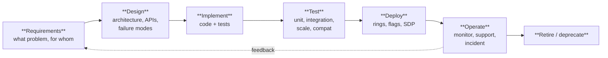
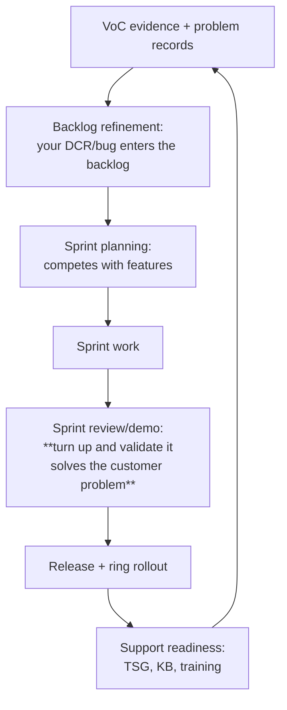

# Part M — SDLC, Agile & Partnering with Engineering

> **Section goal:** The JD asks for *"familiarity with the Software Development Life Cycle (SDLC) in a fast-paced, agile environment"* and for you to *"partner with the Software Engineering team to review architecture/design."* This Part teaches how engineering actually works, when in the cycle your feedback is cheap versus expensive, and how to influence a team you don't manage.

Covers index items **108–115**. Maps to JD: *"Partner with the Software Engineering team to review architecture/design and provide feedback and guidance as it relates to the customer experience, support & customer impact"*, *"Familiarity with the SDLC in a fast paced, agile environment"*, *"Ability to deal with the ambiguity associated with working in a fast paced and changing environment"*, *"Leadership: sound problem resolution, judgment, negotiating and decision making skills"*.

**Assumes:** [Part K](Part-K-live-site-and-availability.md) (rings, flags, RCA) and [Part L](Part-L-support-process-and-voc.md) (bugs, DCRs, supportability review).

---

## 108. The SDLC and where support must show up

**SDLC (Software Development Life Cycle)** is the sequence a piece of software goes through from idea to retirement.

### 🔍 Plain-English deep-dive: the cost-of-change curve

- **What it is:** the cost of fixing a problem rises by roughly an order of magnitude at each stage — a requirement change costs almost nothing, a design change costs a little, a code change costs more, and a change after release costs the most (rework + migration + support + customer trust).
- **Analogy:** moving a doorway is free on the architect's drawing, cheap before the walls go up, expensive once they're plastered, and ruinous once people have moved in.
- **Why it matters for this role:** **your feedback is worth the most at the design stage and almost nothing after GA.** That is precisely why the JD puts "review architecture/design" as the *first* responsibility. If you only appear when the support tickets arrive, you are permanently expensive.

| Stage | What support should contribute | Cost of your feedback |
|---|---|---|
| **Requirements** | "Here's what customers actually struggle with today" — VoC evidence | Free |
| **Design** | Diagnosability, error codes, correlation IDs, telemetry, kill switch, failure modes, scale realities | Very cheap |
| **Implement** | Review the error strings and log messages; they're written last and worst | Cheap |
| **Test** | Test cases from real support scenarios: co-management, hybrid, proxies, sovereign clouds, huge assignment graphs | Moderate |
| **Deploy** | Ring plan, health gates, Message Center content, support readiness | Moderate |
| **Operate** | TSGs, KBs, incident support, VoC feedback | Where most support orgs live |
| **Retire** | Migration guidance, deprecation comms, the long tail of customers who didn't read the notice | Expensive |

---

## 109. Agile, Scrum and Kanban in plain English

### The core idea

**Agile** is a philosophy: deliver small increments of working software frequently, get feedback, and adapt — instead of specifying everything up front and delivering in two years.

**Analogy:** cooking with regular tasting and adjusting, rather than following a five-course recipe blind and finding out at the end that it's inedible.

### Scrum vocabulary

| Term | Plain English |
|---|---|
| **Sprint / iteration** | A fixed timebox (commonly 2–4 weeks) in which a set of work is completed |
| **Product backlog** | The ordered list of everything that might be built |
| **Sprint backlog** | What the team committed to this sprint |
| **User story** | A requirement written from the user's perspective: *"As an Intune admin, I want to see why a policy didn't apply, so that I can fix it without opening a case."* |
| **Acceptance criteria** | The conditions that make a story "done" |
| **Definition of Done (DoD)** | The team's universal bar: tested, documented, telemetry added, reviewed |
| **Story points / velocity** | Relative effort sizing / how much a team completes per sprint |
| **Sprint planning** | Choosing and committing to the sprint's work |
| **Daily standup** | 15 minutes: what I did, what I'm doing, what's blocking me |
| **Sprint review / demo** | Show the working increment to stakeholders |
| **Retrospective** | The team improving how it works |
| **Product Owner** | Owns and orders the backlog; represents the customer |
| **Scrum Master** | Removes impediments, protects the process |
| **Epic / Feature / Story / Task** | Work-item hierarchy from big to small |
| **Spike** | A timeboxed investigation to reduce uncertainty |
| **Technical debt** | Shortcuts taken that cost more later |
| **Refinement / grooming** | Preparing backlog items so they're ready to plan |

### Kanban vocabulary

| Term | Plain English |
|---|---|
| **Board with columns** | Visualize work as it flows: To Do → In Progress → Review → Done |
| **WIP limit** | A cap on items in progress — the core mechanic; it forces finishing over starting |
| **Pull system** | You pull work when you have capacity, rather than having it pushed at you |
| **Cycle time / lead time** | How long an item takes in progress / from request to delivery |
| **Cumulative flow diagram** | Shows where work piles up |
| **Class of service** | Expedite / standard / fixed-date lanes — how urgent work jumps the queue without chaos |

> 💡 **Why Kanban matters for support specifically:** support work is interrupt-driven and unpredictable, so fixed sprint commitments fit badly. Most support and problem-management teams run Kanban or a hybrid ("Scrumban"), with WIP limits and an expedite lane for live site. Saying this shows you understand how *your* work would be organised, not just how developers work.

### Where your work fits into engineering's

**The two meetings to fight your way into:** **backlog refinement** (where your item is understood or misunderstood) and the **sprint review/demo** (where you can say "this doesn't actually solve the customer's problem" while it's still cheap to change).

---

## 110. Azure DevOps, work items and Git for a support engineer

### Azure DevOps (ADO)

| Concept | What it is |
|---|---|
| **Organization → Project → Repo/Boards/Pipelines** | The hierarchy |
| **Work item types** | Epic → Feature → User Story / Product Backlog Item → Task; plus **Bug**, and often **DCR** as a custom type |
| **Area path** | Which team/component owns it |
| **Iteration path** | Which sprint it's in |
| **State** | New → Active → Resolved → Closed (varies by process template) |
| **Tags** | Free-form labels — how you find all the "supportability" items later |
| **Queries (WIQL)** | Saved searches; how you build a "my customer's open bugs" dashboard |
| **Boards / backlogs / sprints** | The planning surfaces |
| **Dashboards / Analytics** | Charts on top of queries — useful for showing trend to leadership |
| **Pipelines** | Build and release automation (CI/CD) |
| **Repos / Pull requests** | Source control and code review |
| **Wikis** | Where TSGs and design docs often live |

**Practical support skills in ADO:** writing a query that finds every bug tagged to your customer or scenario; linking a bug to the problem record and to the cases; using tags consistently so trend analysis is possible later; commenting with new evidence rather than opening duplicates; and understanding priority/severity fields well enough to argue about them credibly.

### Git basics you should recognise

| Term | Plain English |
|---|---|
| **Repository (repo)** | The project's code and history |
| **Branch** | A parallel line of work |
| **Commit** | A saved change with a message |
| **Pull request (PR)** | A proposal to merge a branch, with review and checks |
| **Merge / rebase** | Combining lines of work |
| **Main / trunk** | The primary branch |
| **Tag / release** | A named point in history |
| **Code review** | Peers reviewing changes before merge |

**Why a support engineer benefits from this:** you can read a PR to understand exactly what changed in a service release, correlate a regression with a specific change, propose a documentation fix as a PR yourself, and contribute TSGs into a docs repo. You do not need to be a developer — but being unable to read a diff is a limitation you can cheaply remove.

---

## 111. CI/CD, feature flags and telemetry-driven development

| Concept | Plain English | Support relevance |
|---|---|---|
| **CI (Continuous Integration)** | Every change is built and tested automatically on merge | A broken build gate is why "the fix missed the train" |
| **CD (Continuous Delivery/Deployment)** | Changes flow automatically to environments, gated by tests and health signals | Explains how quickly a fix *could* reach a customer |
| **Build / release pipeline** | The automation that gets code from repo to production | |
| **Environments** | Dev → Test/Integration → Staging/Pre-prod → Production rings | "Which environment is my fix in?" is a legitimate question |
| **Feature flag / flighting** | Enable behaviour for a subset without deploying code | **The mitigation lever**; also how features are A/B tested |
| **Experimentation / A-B test** | Two variants measured against a metric | Explains why two tenants behave differently |
| **Canary / bake time** | Small first audience, minimum soak | See [Part K](Part-K-live-site-and-availability.md) |
| **Telemetry-driven development** | Decisions made from production measurements, not opinion | Your VoC data competes with — and complements — this |
| **Shift-left testing** | Test earlier and cheaper | The philosophy your design feedback belongs to |
| **Chaos/fault injection** | Deliberately break things to prove resilience | Good design-review question: "have we tested the failure path?" |
| **Rollback vs hotfix vs roll-forward** | Revert / urgent targeted fix / fix in the next build | Determines what you can promise a customer |

> 💡 **A useful thing to say:** "Knowing whether a fix is behind a feature flag changes what I can tell a customer. If it's flagged, mitigation can be minutes. If it needs a build, I need to know which ring and which release, and I should set expectations in weeks, not hours. Promising a timeline I don't control is how support engineers lose credibility."

---

## 112. Designing for supportability

This is your specialist contribution. Everything below is something you can *ask for* in a design review, and each has a one-line justification.

| Ask | Justification |
|---|---|
| **Unique, documented error codes on every failure path** | "An error occurred" costs an hour per case, forever |
| **Correlation IDs surfaced to the customer** | Turns "it failed" into a traceable request across services |
| **Actionable end-user messages** | Reduces case volume directly; users self-serve |
| **Admin-visible reason for non-application**, not just status | The #1 admin frustration in policy systems |
| **Client-side logging that we can collect remotely** | Removes dependence on the user following instructions |
| **Structured logs** (key-value/JSON, not prose) | Machine-parseable → automatable → AI-analysable ([Part N](Part-N-ai-and-agentic-support.md)) |
| **Telemetry with a defined health signal** | You cannot alert on what you don't emit |
| **Synthetic probe for the customer-visible scenario** | Detection is the biggest lever on MTTR |
| **Feature flag / kill switch** | Mitigation in minutes rather than a build cycle |
| **Graceful degradation and clear offline behaviour** | Devices are frequently offline, throttled or proxied |
| **Warnings before limits are hit** | Prevents the "we hit a quota nobody told us about" class of case |
| **Idempotent, retry-safe operations with backoff** | Prevents thundering herds and duplicate state |
| **Backward compatibility and clear deprecation** | The long tail of customers is always longer than planned |
| **Documentation and TSGs at GA** | Support readiness is part of "done", not a follow-up |

### 🔍 Plain-English deep-dive: "shift left"

- **What it is:** moving quality activities *earlier* in the lifecycle — testing, security review, and (our concern) supportability review.
- **Analogy:** proof-reading the manuscript before printing 10,000 copies, not after.
- **How support shifts left:** attend design reviews, contribute failure-mode analysis, supply real-world test scenarios from cases, define support readiness as part of the Definition of Done, and get diagnosability into acceptance criteria.
- **The measurable claim:** every supportability requirement added at design time is worth some multiple of cases avoided after GA. Frame it in cases and hours ([Part L](Part-L-support-process-and-voc.md)) and you'll win more of these arguments.

---

## 113. Shift-left in practice — worked examples

**Example 1 — the silent failure**
> *Design as proposed:* a new policy type applies silently; if a prerequisite is missing, nothing happens and the report shows "Succeeded".
> *Support feedback:* "Succeeded" on a device where nothing changed will generate a case per occurrence, and we'll have no client-side evidence. **Ask:** emit a distinct state ("Not applicable — prerequisite X missing") with a documented reason code and a client log entry.
> *Cost at design:* an enum value and a log line. *Cost after GA:* thousands of cases and a permanent TSG.

**Example 2 — the un-mitigatable feature**
> *Design as proposed:* a new evaluation path ships enabled for all tenants in one release.
> *Support feedback:* if it regresses, our only option is a rollback of the whole service release. **Ask:** put it behind a feature flag with per-tenant and per-scale-unit scoping.
> *Cost at design:* a flag. *Cost after GA:* hours of customer impact per incident.

**Example 3 — the scale blind spot**
> *Design as proposed:* tested against a tenant with 50 policies and 20 groups.
> *Support feedback:* our largest customers have thousands of policies and tens of thousands of groups with nested membership and filters. **Ask:** add a scale test representing the real p99 tenant shape.
> *Cost at design:* a test fixture. *Cost after GA:* an outage for exactly the customers who matter most.

**Example 4 — the deprecation**
> *Design as proposed:* deprecate an old enrollment path with a Message Center post 60 days ahead.
> *Support feedback:* our data shows N thousand devices still using it across M tenants, concentrated in a few large accounts; 60 days is not enough and the post won't reach the people who need it. **Ask:** extend the window, add in-product warnings, and give the affected tenants a targeted, named notification.
> *This is Voice of the Customer doing its actual job.*

---

## 114. Writing a supportability review — the template

Something concrete you can describe having produced.

> ### Supportability review: *[feature name]*
> **Reviewer:** *[you]* · **Date:** · **Design doc:** *[link]* · **Target release:**
>
> **1. What the feature does** *(two sentences, in customer terms)*
>
> **2. Predicted top failure modes**
> | # | Failure mode | Likelihood | Customer symptom | Current diagnosability | Ask |
> |---|---|---|---|---|---|
> | 1 | Prerequisite missing | High | Silent no-op | None | Distinct state + reason code + client log |
> | 2 | Network path blocked | High | Timeout, generic error | Generic | Unique code + endpoint named in the message |
> | 3 | Conflict with existing policy | Medium | Unpredictable value | Status only | Per-setting conflict source in the report |
>
> **3. Diagnosability assessment** — error codes ✅/❌, correlation ID ✅/❌, client logs ✅/❌, admin-visible reason ✅/❌
>
> **4. Observability assessment** — health signal defined? probe? alertable? scopeable by tenant/region/scale unit?
>
> **5. Recoverability assessment** — feature flag? tested rollback? in-flight device behaviour?
>
> **6. Scale and compatibility** — p99 tenant shape, co-management, hybrid, sovereign clouds, older OS builds, proxy/inspection environments
>
> **7. Support readiness** — docs at GA? TSGs for the top 3 failure modes? training? Message Center post?
>
> **8. Estimated support impact if the asks are not taken** — *"we estimate N cases/month at M hours each, based on the comparable feature X which shipped without a reason code."*
>
> **9. Agreed actions** — owner, work item, target release, accepted risks

**Why the estimate in section 8 matters:** it converts your opinion into a forecast, and forecasts can be checked. Being right once buys you enormous credibility for every future review.

---

## 115. Working with ambiguity, and influence without authority

The JD calls out *"ability to deal with the ambiguity associated with working in a fast paced and changing environment"* and *"leadership: sound problem resolution, judgment, negotiating and decision making skills."* These are behavioural competencies — [Part Q](Part-Q-behavioral-and-closing.md) will help you build STAR stories — but here are the mental models.

### Handling ambiguity

| Situation | Approach |
|---|---|
| **Unclear ownership** | Don't wait for someone to claim it. Take provisional ownership, state what you're doing, and invite correction. Ambiguity is resolved by someone acting, not by someone asking |
| **Incomplete information** | Decide what's *reversible* and act; reserve deliberation for irreversible decisions. State assumptions explicitly so they can be corrected |
| **Conflicting priorities** | Make the trade-off visible with data, and ask the decision-maker to choose — rather than silently picking and being blamed later |
| **Changing requirements** | Separate the stable *problem* from the volatile *solution*; anchor on the customer outcome |
| **No documentation** | Write the first version. A wrong-but-correctable document beats an empty page and flushes out the real experts |
| **Too much noise** | Timebox: "I'll spend two hours establishing scope, then decide whether this is a case or an incident" |

### 🔍 Plain-English deep-dive: influence without authority

You will need engineering teams, other support teams and customers to do things you cannot instruct them to do.

- **Currency matters.** Engineering's currency is evidence, effort and risk. Leadership's currency is cost, customer impact and reputational exposure. Customers' currency is their business outcome. Translate.
- **Reduce their effort.** Do the first hour of their work: repro steps, curated evidence, a proposed fix, a draft comms message.
- **Reciprocity.** Be the person who helps others first. Support engineers who only ever ask are ignored; support engineers who write the TSG, take the awkward customer call, and review someone else's design get their asks honoured.
- **Escalate transparently.** If you must escalate, tell the person first. Escalating behind someone's back wins one argument and loses the relationship permanently.
- **Give credit publicly.** Costs nothing; compounds.
- **Be right, and be honest when you're not.** Credibility is the actual currency. One retracted, over-claimed escalation costs more than ten correct ones earn.
- **Make the ask specific and bounded.** "Can you add a reason code to this failure path?" beats "can you improve supportability?"

### Decision-making models worth naming

- **Reversible vs irreversible decisions** — move fast on reversible ones; be deliberate on irreversible ones.
- **Disagree and commit** — argue hard, then support the decision fully once it's made. Naming this is a strong culture signal at Microsoft.
- **Timeboxing** — bound the investigation before deciding, so you don't analyse forever.
- **Escalate on impact, not emotion** — severity is a function of customer impact, not how loudly someone is complaining.
- **Ask "what would change my mind?"** before committing to a hypothesis.

---

## 📌 Part M quick-reference sheet

| Term | One-line meaning |
|---|---|
| SDLC | Requirements → Design → Implement → Test → Deploy → Operate → Retire. |
| Cost-of-change curve | Fixing gets ~10× more expensive at each later stage. Design feedback is nearly free. |
| Agile | Small increments, frequent feedback, adapt. |
| Sprint / backlog / story / DoD | Timebox / ordered work / user-perspective requirement / the team's quality bar. |
| Standup / review / retro | Daily sync / demo to stakeholders / improve how we work. |
| Product Owner / Scrum Master | Owns the backlog / removes impediments. |
| Kanban / WIP limit / classes of service | Flow-based work with a cap on parallel work and an expedite lane. Fits support better than Scrum. |
| Epic → Feature → Story → Task | Work-item hierarchy. |
| Area path / iteration path / tags / queries | ADO scoping, scheduling, labelling and reporting. |
| PR / branch / merge / main | Git basics; reading a diff correlates a regression to a change. |
| CI / CD | Automated build+test / automated delivery through gated environments. |
| Feature flag / kill switch | Change behaviour without deploying; the fastest mitigation lever. |
| Experimentation | Why two tenants can legitimately differ. |
| Shift left | Move quality — including supportability — earlier. |
| Diagnosability asks | Unique error codes · correlation IDs · admin-visible reasons · remote-collectable structured logs. |
| Observability asks | Health signal · synthetic probe · alert · scopeable by tenant/region/scale unit. |
| Recoverability asks | Flag · tested rollback · in-flight behaviour. |
| Supportability review | A structured document with predicted failure modes and a support-cost forecast. |
| Reversible vs irreversible | Move fast / be deliberate. |
| Disagree and commit | Argue fully, then back the decision. |
| Influence without authority | Speak their currency, reduce their effort, escalate transparently, be right. |

---

## ⭐ Likely Interview Questions for This Section

**Q1. "Where in the development lifecycle is support feedback most valuable?"**
> *Model answer:* "At design, by a wide margin, because of the cost-of-change curve — a supportability requirement added at design costs an enum value and a log line, and the same gap after GA costs thousands of cases and a permanent TSG. That's exactly why this job description lists 'partner with software engineering to review architecture and design' as the first responsibility rather than the last. Concretely, at design I'd be asking for unique documented error codes on every failure path, a correlation ID the customer can hand me, an admin-visible reason for non-application rather than just a status, client logs I can collect remotely, a defined health signal and probe, and a feature flag so we can mitigate in minutes rather than a build cycle. If support only shows up when the tickets arrive, we are permanently the most expensive part of the system."

**Q2. "Explain agile to someone who has never worked in it."**
> *Model answer:* "Agile is the idea that you deliver small increments of working software frequently, get real feedback, and adapt — rather than specifying everything up front and discovering at the end that you built the wrong thing. Scrum is the most common flavour: work is broken into user stories with acceptance criteria, the team commits to a set of them for a fixed sprint, they sync daily, demo the increment at the end, and hold a retrospective to improve how they work. Kanban is the flow-based alternative: visualise work on a board, cap work in progress so the team finishes rather than starts, and measure cycle time. For support and problem management specifically, Kanban usually fits better than Scrum because the work is interrupt-driven — you can't commit two weeks of capacity when live site can consume it — so most support teams run Kanban or a hybrid with an expedite lane for incidents."

**Q3. "How do you influence an engineering team you have no authority over?"**
> *Model answer:* "By speaking their currency and reducing their effort. Engineering's currency is evidence, effort and risk — so I bring quantified impact, minimal reproduction steps, curated evidence and, where I can, a proposed fix, rather than a complaint. I make asks specific and bounded — 'add a reason code to this failure path' is actionable in a way that 'improve supportability' never is. I build reciprocity: I write the TSG, I take the awkward customer call, I review their design when they ask. I escalate transparently — if I need to go above someone, I tell them first, because escalating behind someone's back wins one argument and costs the relationship permanently. And most importantly I protect my credibility: I'd rather be right and occasionally say 'I was wrong about that' than over-claim, because credibility is the only real currency I have when I can't instruct anyone."

**Q4. "How do you handle ambiguity?"**
> *Model answer:* "I try to convert ambiguity into a decision rather than waiting for clarity that may never come. Practically: if ownership is unclear, I take provisional ownership, state publicly what I'm doing, and invite correction — ambiguity gets resolved by someone acting, not by someone asking. If information is incomplete, I distinguish reversible from irreversible decisions and move quickly on the reversible ones while stating my assumptions explicitly so they can be challenged. If priorities conflict, I make the trade-off visible with data and ask the decision-maker to choose, rather than silently picking and being blamed later. If there's no documentation, I write the first version — a wrong-but-correctable document flushes out the real experts faster than any question. And I timebox: 'I'll spend two hours establishing scope, then decide whether this is a case or an incident' stops me analysing forever."

**Q5. "Walk me through a supportability review you'd run on a new Intune feature."**
> *Model answer:* "I'd produce a structured document rather than ad-hoc comments. It starts with the feature in two sentences in customer terms, so we agree what we're reviewing. Then the core: a table of predicted failure modes with likelihood, what the customer would actually see, what diagnosability exists today, and the specific ask for each. Then four assessments — diagnosability, meaning unique error codes, correlation IDs, client-collectable logs and admin-visible reasons; observability, meaning a defined health signal, a synthetic probe for the customer-visible scenario, and impact that can be scoped by tenant, region and scale unit; recoverability, meaning a feature flag, a tested rollback, and defined behaviour for devices mid-flight; and scale and compatibility against realistic p99 tenant shapes, co-management, hybrid join, sovereign clouds and proxy environments. Then support readiness — docs at GA, TSGs for the top three failure modes, training before customers can enable it. And critically, an estimate of the support cost if the asks aren't taken, benchmarked against a comparable feature. That last part turns my opinion into a forecast, and forecasts can be checked — being right once buys credibility for every review afterwards."

**Q6. "Why does it matter to you whether a fix is behind a feature flag?"**
> *Model answer:* "Because it changes what I can honestly promise a customer, and it changes our mitigation options during an incident. If the behaviour is behind a flag, we can disable it for a tenant or a scale unit in minutes without a build, which turns a multi-hour outage into a short one. If it isn't, the fastest path is a rollback of the whole release or waiting for the next build to travel through the rings, which is days to weeks. So during a design review I ask for the flag as a mitigation lever, and during an incident 'is this flagged?' is one of my first questions. It also matters for expectation-setting: promising a customer a timeline I don't control is one of the fastest ways for a designated engineer to lose credibility, so I want to know which mechanism the fix will travel through before I say anything."

**Q7. "How would you use Azure DevOps in this role?"**
> *Model answer:* "As the connective tissue between support evidence and engineering work. Practically: filing bugs and DCRs with the quality bar we talked about — quantified impact, minimal repro, curated evidence, environment, explicit ask. Linking each one back to the problem record and the underlying cases, so anyone can see the volume behind it. Tagging consistently, because tagging discipline is what makes trend analysis possible six months later. Writing queries and building a dashboard so I can show, for my Mission Critical customer, every open bug affecting them and its state — which is a conversation-changer in a customer review. Turning up to backlog refinement so my item is understood rather than mis-scoped, and to the sprint demo so I can say 'this doesn't actually solve the customer's problem' while it's still cheap to change. And being able to read a pull request well enough to correlate a regression with a specific change, which shortens a lot of arguments."

**Q8. "Give an example of shift-left feedback that would save real money."**
> *Model answer:* "A concrete one: a new policy type that applies silently, where a missing prerequisite results in nothing happening but the report still showing 'Succeeded'. That single design choice generates a case every time it occurs, forever, because the admin has no way to distinguish 'applied' from 'silently did nothing', and there's no client-side evidence to collect. At design time the fix is trivial — a distinct state such as 'Not applicable: prerequisite X missing', with a documented reason code and a client log entry. After GA, the same gap costs a permanent TSG, thousands of support hours, and admin frustration that shows up in satisfaction scores. I'd quantify it by benchmarking against a comparable feature that shipped without a reason code and citing its actual case volume — that's the argument that gets the enum value added."

**Q9. "You think a design is wrong but the team disagrees and the deadline is tight. What do you do?"**
> *Model answer:* "First I check whether I'm right, honestly — they may have constraints or plans I don't know about, so I ask why before I push. If I still believe it's wrong, I make the case in their currency with a forecast: here's the failure mode, here's the customer symptom, here's the estimated case volume and support cost, and here's the smallest change that avoids it. Often the answer is to find a cheaper version of my ask — a log line instead of a UI change, a flag instead of a redesign — which gets most of the value inside the deadline. If it's still no, I ask that the risk be recorded explicitly with an owner, so it's a decision rather than an oversight, and I make sure support readiness accounts for it — TSGs written, teams trained. Then I disagree and commit: I back the decision publicly and I don't relitigate it. And I'd hold myself to my own forecast — if the case volume arrives as predicted, that's the evidence to revisit it, and if it doesn't, I say so."

**Q10. "How would you make support readiness part of a team's Definition of Done?"**
> *Model answer:* "By making it concrete and cheap rather than a vague obligation. I'd propose a small, non-negotiable checklist added to the Definition of Done: documented error codes for new failure paths, a client-collectable log entry on failure, a defined health signal, a Message Center post if customers must act, docs live at GA, and a TSG for the top predicted failure modes. Then I'd make it easy to satisfy — provide the TSG template, draft the Message Center wording myself, and offer to write the first version of the doc. Teams resist process that adds work and accept process that removes ambiguity, so my job is to make the compliant path the easy path. I'd measure it too: track case volume and escalation rate for features that shipped with the checklist versus without, and bring that comparison to a retrospective. Data from their own releases is far more persuasive than an argument from principle."

---

## 🧠 30-Second Memory Hooks

- **Cost of change is ~10× per stage.** Your feedback is nearly free at design and nearly worthless after GA.
- **That's why "review architecture/design" is the JD's *first* responsibility.**
- **Scrum = timeboxed commitments. Kanban = flow with WIP limits.** Support runs Kanban, because live site eats sprints.
- **Two meetings to gatecrash: backlog refinement and the sprint demo.**
- **Feature flag = mitigation in minutes. No flag = mitigation in builds.**
- **Diagnosability asks: unique codes · correlation IDs · admin-visible reasons · remote structured logs.**
- **Observability asks: health signal · probe · alert · scopeable by tenant/region/ASU.**
- **Recoverability asks: flag · tested rollback · in-flight behaviour.**
- **Forecast the support cost.** Being right once buys credibility for every future review.
- **Influence = their currency + less effort for them + transparent escalation + being right.**
- **Reversible → move fast. Irreversible → be deliberate. Then disagree and commit.**

---

*Next suggested section:* **[Part N — AI & Agentic Support Engineering](Part-N-ai-and-agentic-support.md)** — the word "Agentic" is in the team's name, and it's the single clearest opportunity to differentiate yourself in this interview.
