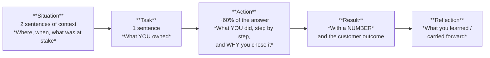

# Part Q — Behavioural & Closing

> **Section goal:** Technical knowledge gets you shortlisted; this Part gets you hired. By the end you will have a working STAR method, a translation table that converts *whatever* your background is into this role's competencies, a small set of reusable stories, prepared "why" answers, questions that make you look senior, and a one-page cheat sheet for the night before.

Covers the final index items. Maps to JD: *"Leadership: sound problem resolution, judgment, negotiating and decision making skills"*, *"Ability to deal with the ambiguity associated with working in a fast paced and changing environment"*, *"Excellent written and oral communication skills"*, *"Passion for customers"*.

---

## 1. The STAR method, done properly

**STAR** = **S**ituation · **T**ask · **A**ction · **R**esult. Add a fifth element that most candidates omit and interviewers love: **Reflection**.

### The rules

| Rule | Why |
|---|---|
| **Say "I", not "we"** | Interviewers are assessing *you*. "We" hides your contribution and is the single most common scoring problem |
| **Keep Situation short** | 20 seconds of context maximum. Candidates routinely burn two minutes setting the scene |
| **Spend the time on Action** | And include the *reasoning*: "I chose to mitigate first because…" — the reasoning is what's actually being assessed |
| **Always land a number** | Devices, hours, percentage, cases, time saved, before/after. A story without a number sounds like an anecdote |
| **Include the customer** | Even for internal work, connect it to a customer or user outcome |
| **Two minutes, not five** | Rehearse to length. Long answers read as poor judgement about what matters |
| **Reflection closes the loop** | "What I'd do differently" is the single strongest growth-mindset signal available to you |
| **Don't fabricate** | Interviewers probe. A real small story survives probing; a big invented one collapses |

### The anti-patterns

- **The hero story with no team** — sounds arrogant and unrealistic.
- **The "failure" where you were secretly right** — interviewers see through it instantly and it costs you the growth-mindset credit.
- **Blaming someone** — even accurately. Describe the situation neutrally and focus on what you did.
- **Vagueness** — "improved things significantly" means nothing.
- **The story with no ending** — always say how it resolved and what changed afterwards.

---

## 2. Translating *any* background into this role

Whatever you've done, this role wants five competencies. Your job is to map your experience onto them explicitly rather than hoping the interviewer does it for you.

### The five competencies (from the JD)

| # | Competency | JD phrasing |
|---|---|---|
| 1 | **Deep technical troubleshooting** | *"Sound troubleshooting skills"*, *"Client Side Support, Hardware/OS, and Networking"* |
| 2 | **Customer ownership** | *"Passion for customers"*, *"Be the Intune technical lead for a customer in Mission Critical Support"* |
| 3 | **Availability / live-site judgement** | *"Lead supportability and troubleshoot the availability of the service"*, *"3+ years… high availability enterprise systems"* |
| 4 | **Systemic problem-solving** | *"Drive process improvements"*, *"Drive bugs/DCRs"*, *"identify the cost"*, *"Voice of the Customer"* |
| 5 | **Leadership, communication and ambiguity** | *"Leadership: sound problem resolution, judgment, negotiating and decision making"*, *"ambiguity"*, *"excellent written and oral communication"* |

### The translation table — fill this in for yourself

| My experience | Competency it proves | The one-line proof point I'll say |
|---|---|---|
| *e.g. debugged production failures in a complex system* | 1 — troubleshooting | "I diagnose by isolating layers and proving with evidence, not by trying fixes" |
| *e.g. owned a customer/stakeholder relationship* | 2 — customer ownership | "I was the named contact for X; they came to me before they escalated" |
| *e.g. handled outages / on-call / severity incidents* | 3 — live site | "I've mitigated first and root-caused second, under pressure, with comms on a cadence" |
| *e.g. reduced a recurring ticket type* | 4 — systemic | "I turned N recurring tickets into a fix and measured the drop" |
| *e.g. got another team to change something* | 5 — leadership | "I influenced with data and reduced their effort, not by escalating" |
| *e.g. wrote docs / trained others* | 4 + 5 | "I wrote the guide the team now uses, and escalation rate on that topic fell" |
| *e.g. automated a manual task* | 4 | "I automated X and saved N hours a month" |

### If your background is *not* Intune

**Say this early and confidently, then never apologise again:**

> "I haven't run Intune at scale, and I'd expect the first weeks to be steep. What I bring is the part that doesn't transfer easily — structured troubleshooting under pressure, live-site judgement, and turning recurring problems into systemic fixes. Product surface I can learn in weeks; that judgement takes years. And I've deliberately learned the Intune architecture — the OMA-DM and CSP model, the IME versus MDM channel split, the compliance-to-Conditional-Access loop — so I'm not starting from zero."

**Why this works:** it's honest, it reframes the gap as the *cheap* part, and it immediately demonstrates that you did the work. Interviewers reward candidates who name their own gap before being asked.

---

## 3. Ready-to-adapt STAR stories

You need **six to eight** solid stories that you can flex to answer twenty questions. Build them from your own experience — the templates below give you the *shape* and the *emphasis* each one needs.

---

### Story 1 — The hard diagnosis *(covers: technical depth, methodology, persistence)*

> **Situation:** A failure that was intermittent, high-impact, and where the obvious explanation was wrong.
> **Task:** You owned finding the cause, not just restoring service.
> **Action:** Scoped it precisely (how many, since when, what changed) → isolated the layer → formed a falsifiable hypothesis → *deliberately looked for evidence that would disprove it* → proved it with logs/traces/device truth → changed one thing at a time.
> **Result:** Cause identified with evidence; a number (devices affected, hours of downtime avoided, cases eliminated).
> **Reflection:** What you'd instrument earlier next time.
>
> 🎯 **The line that lands:** *"The obvious answer was X, and I nearly stopped there — but I asked what I'd expect to see if X were true, and I didn't see it. That's what took me to the real cause."*

---

### Story 2 — The incident *(covers: live site, pressure, comms, judgement)*

> **Situation:** Something broke with real business impact and a clock running.
> **Task:** You were responsible for impact assessment, mitigation and/or communication.
> **Action:** Established scope and impact fast → engaged the right people rather than solo-heroing → **mitigated before root-causing** → communicated early on a committed cadence, in the audience's terms → captured evidence in parallel → drove the post-incident review afterwards.
> **Result:** Time to mitigate, users restored, and the repair items that shipped afterwards.
> **Reflection:** The detection gap you filed alongside the defect.
>
> 🎯 **The line that lands:** *"I made the call to mitigate before we understood the cause, because every minute of analysis was a minute of customer impact. We rolled back first and understood it properly afterwards — and the RCA had two root causes: the defect, and why we hadn't detected it ourselves."*

---

### Story 3 — The systemic fix *(covers: problem management — the most important story for this role)*

> **Situation:** A recurring problem everyone tolerated because each instance was individually small.
> **Task:** You decided to stop treating instances and eliminate the class.
> **Action:** Quantified it (volume × handle time × cost, plus trend) → identified the true cause → chose the right lever: a product change, an automation/remediation, a configuration guardrail, or documentation → built the business case in the decision-maker's currency → drove it through → measured the reduction.
> **Result:** **A percentage drop in the ticket class**, hours reclaimed, cost avoided.
> **Reflection:** How you'd find the next one earlier.
>
> 🎯 **The line that lands:** *"I stopped asking 'how do I fix this ticket' and started asking 'what does this ticket cost us every month'. Once it had a number, the conversation with engineering changed completely."*

---

### Story 4 — Influence without authority *(covers: leadership, negotiation, One Microsoft)*

> **Situation:** You needed another team to do something you couldn't require.
> **Task:** Get the change made without escalating as a first move.
> **Action:** Understood their constraints first → framed the ask in *their* currency (evidence, effort, risk) → did the first hour of their work for them → made the ask specific and bounded → found a cheaper version that captured most of the value → escalated only transparently, after telling them.
> **Result:** The change happened; relationship intact and usable again later.
> **Reflection:** What you'd do to build the relationship *before* needing it.
>
> 🎯 **The line that lands:** *"I could have escalated on day one and probably won. I'd also have spent a relationship I needed every month afterwards."*

---

### Story 5 — Ambiguity *(covers: judgement, decision-making, autonomy)*

> **Situation:** Unclear ownership, incomplete information, or shifting requirements.
> **Task:** Make progress anyway.
> **Action:** Took provisional ownership and said so publicly → separated reversible from irreversible decisions and moved fast on the reversible ones → stated assumptions explicitly so they could be corrected → timeboxed the investigation → wrote the first version of the missing document.
> **Result:** Movement where there had been stalling; a decision made and defensible.
> **Reflection:** Which assumption turned out wrong, and how stating it openly let it be caught cheaply.
>
> 🎯 **The line that lands:** *"Ambiguity gets resolved by someone acting and inviting correction, not by someone waiting to be told."*

---

### Story 6 — The mistake *(covers: growth mindset — do not skip this one)*

> **Situation:** A genuine error with a real cost. Not "I worked too hard."
> **Task:** Own it.
> **Action:** Noticed or was told → escalated it yourself rather than hoping → contained the impact → told the affected people honestly and early → fixed it → then changed the *system* so it couldn't recur.
> **Result:** Impact contained; the guardrail you added.
> **Reflection:** What you now do differently, concretely and permanently.
>
> 🎯 **The line that lands:** *"The thing I changed wasn't 'be more careful' — that never works. I changed the process so being careless wasn't possible."*

---

### Story 7 — The difficult customer *(covers: empathy, communication, integrity)*

> **Situation:** An angry, escalating or unreasonable customer.
> **Task:** Restore the relationship as well as the service.
> **Action:** Let them finish → acknowledged the impact in their terms before defending anything → converted emotion into specifics → committed to a communication cadence and *kept it* → was honest about what you could and couldn't do → delivered, including the unglamorous follow-up.
> **Result:** Relationship recovered; often the strongest advocates are recovered escalations.
> **Reflection:** The early signal you'd act on next time to prevent the escalation.
>
> 🎯 **The line that lands:** *"Most escalations I've seen weren't caused by the technical problem — they were caused by silence. The fix is a cadence you actually keep, even when the update is 'no change yet'."*

---

### Story 8 — Learning something new fast *(covers: learn-it-all, adaptability)*

> **Situation:** You had to become useful in an unfamiliar area quickly.
> **Task:** Deliver while learning.
> **Action:** Found the *mechanism* first rather than memorizing procedures → built a small lab or reproduction → found the authoritative source and the person who knew → wrote it down as you learned, which both cemented it and became a resource for others → asked precise questions rather than broad ones.
> **Result:** Delivered on time; the notes became a team asset.
> **Reflection:** The learning method itself, which is the real answer to this question.
>
> 🎯 **The line that lands:** *"I learn mechanisms rather than steps, because steps fail the moment reality differs slightly and a mechanism lets you reason your way to the answer."*

---

### The story-to-question map

| Story | Answers questions about |
|---|---|
| 1 — Hard diagnosis | Technical problem, persistence, methodology, biggest challenge, attention to detail |
| 2 — Incident | Pressure, on-call, prioritisation, speed vs quality, communication, crisis |
| 3 — Systemic fix | Process improvement, initiative, impact, biggest achievement, going beyond the ticket |
| 4 — Influence | Leadership, conflict, negotiation, cross-team, disagree and commit |
| 5 — Ambiguity | Incomplete information, changing priorities, autonomy, fast-paced environment |
| 6 — Mistake | Failure, weakness, feedback, growth mindset, when you were wrong |
| 7 — Difficult customer | Customer obsession, difficult conversations, bad news, empathy, escalation |
| 8 — Learning fast | Learn-it-all, adaptability, new technology, thirst for knowledge |

**Rehearse each one out loud, timed to two minutes.** Reading them is not preparation.

---

## 4. The "why" answers

These are asked in almost every loop, and weak answers here undo strong technical rounds.

### "Why do you want this role?"

**Structure:** what specifically attracted you (from the JD, not generic) → why you're suited → what you want to learn.

> *Model answer:* "Three things drew me to it specifically. First, the combination of deep technical troubleshooting with owning one customer end-to-end in Mission Critical Support — I like problems where I'm accountable for the outcome rather than passing them on. Second, the problem-management framing: the JD talks about driving bugs and DCRs and identifying the cost of each problem ticket, which is the part of support I find most satisfying, because it's the difference between closing tickets and removing them. Third, the Agentic part — using AI to change how support works rather than just doing support faster. And honestly, endpoint management sits at a genuinely interesting point right now: it's the foundation of Zero Trust, and the Windows 11 migration and passwordless waves mean the problems are real and current."

### "Why Microsoft Security / why this team?"

> *Model answer:* "Because endpoint management is where Zero Trust either works or doesn't. Conditional Access can only make good decisions if the device signal is trustworthy, and making that signal true and provable is Intune's job. On the team specifically, what stands out in the CVC description is 'anticipates, amplifies, and systemically solves customer needs' — that's a much more ambitious remit than answering tickets well, and it matches how I think support should work. The fact that the team is called *Agentic* Support Engineering says something about where they think the value is going, and I want to be part of building that rather than reacting to it."

### "Why should we hire you?"

**Structure:** three strengths mapped to JD bullets, each with a proof point → the honest gap and your plan.

> *Model answer:* "Three reasons. One, structured troubleshooting under pressure — I isolate layers and prove causes with evidence rather than trying fixes, and that transfers to any product. Two, I think in systems: my instinct after fixing something is to ask what it cost, how often it happens, and what would remove the whole class — which is exactly the problem-management and Voice-of-the-Customer work in this JD. Three, I communicate clearly with both engineers and non-technical stakeholders, and I've learned that in incidents the communication is as important as the fix. The honest gap is depth of hands-on Intune at enterprise scale — I've built the architectural understanding deliberately, but I'd expect the first eight weeks to be steep, and I'd close it by living in the case queue, building a lab tenant, and reading the top recurring case clusters for my customer."

### "What's your biggest weakness?"

**Rules:** pick a real one, show the concrete mitigation you *already* use, don't pick anything disqualifying, don't humblebrag.

> *Model answer shape:* "I have a tendency to go deep on a problem past the point where it's the best use of my time — the diagnosis is interesting and I want to reach the bottom of it. What I've learned to do is timebox explicitly and state the timebox out loud: 'I'll spend two hours establishing scope, then decide whether this is a case or an incident.' It also helped me realise that in live site the right move is often to mitigate and *stop* investigating, which was genuinely counter-intuitive for me at first."

### "Where do you see yourself in 3–5 years?"

> *Model answer:* "Deeper in this direction rather than away from it. In three years I'd want to be one of the people others come to for the hardest Intune problems, trusted by a major customer as their technical lead, and with a track record of problems I've eliminated rather than tickets I've closed. Beyond that, I'm drawn to the supportability-influence side — being in design reviews early enough that features ship diagnosable, and helping shape how AI changes support engineering. Whether that's as a senior individual contributor or with formal scope matters less to me than the influence."

### "What would you do in your first 90 days?"

> *Model answer:* "Days 0–30: learn the customer and the data. Document their environment fully — tenant, region and scale unit, size and platform mix, identity and Conditional Access design, co-management state, network posture including proxy and TLS inspection, connectors and every credential expiry. In parallel, read their last six to twelve months of cases and cluster them, because that tells me where the pain actually is. Days 30–60: build the operational rhythm — an expiry register with alerting, a weekly health review on enrollment failures, compliance trend, app failures and devices not checking in, and a change calendar aligned to their peaks. Days 60–90: convert. Take the top three recurring case clusters and drive each to a systemic outcome — a remediation, a configuration change, a TSG, or a bug or DCR with quantified impact — and establish the relationship rhythm with their engineers and leadership, so that when there's an incident I'm already a trusted voice rather than a stranger on a bridge."

### "Tell me about yourself" *(the opener — get this right)*

**Structure:** present → relevant past → why here. **60–90 seconds. Rehearsed.**

> *Model shape:* "Currently I *[role]*, where I *[the one or two things most relevant to this JD]*. Before that I *[the experience that built the transferable competency]*. The thread through all of it is *[structured troubleshooting / customer ownership / turning recurring problems into fixes]*. What drew me here is *[specific JD element]*, because *[genuine reason]* — and that's what I'd like to do next."

---

## 5. Questions to ask them

**Always have questions.** "No, you've covered everything" reads as disinterest. Prepare 6–8; ask 3–4; adapt to who's in the room.

### About the work

1. "What does a typical week look like for this role — how does the time split between reactive customer work, proactive problem management, and design-review engagement?"
2. "For the Mission Critical customer this role would lead technically — what are their biggest pain points today?"
3. "What are the top three recurring case drivers in Intune right now, and which of them do you most want someone to eliminate?"
4. "How does supportability feedback actually reach the engineering team, and what's the success rate of DCRs?"

### About the "Agentic" part

5. "The team is called Agentic Support Engineering — what does that look like in practice today, and what would you like it to look like in a year?"
6. "Where are you on the autonomy spectrum with AI — summarization and retrieval, or agents that take actions?"

### About success and growth

7. "How would you measure whether someone in this role is succeeding, six months in?"
8. "What's the biggest gap on the team today that you'd want this hire to fill?"
9. "What separates the people who thrive in this team from the people who struggle?"

### About the team and culture

10. "How does the team balance the reactive pull of live site against the proactive work, when they compete?"
11. "How do you handle on-call and sustainability for a role that owns a Mission Critical customer?"

> ⚠️ **Avoid in early rounds:** salary, holiday, promotion timelines, working hours as your *first* question. Ask about the work. There's a time for the rest, and it's later.

---

## 6. Communication in the interview itself

The JD asks for *"excellent written and oral communication skills"* — you are being assessed on this while you answer everything else.

| Do | Don't |
|---|---|
| **Signpost:** "There are three parts to this — mechanism, failure modes, and how I'd diagnose it." | Ramble without structure |
| **Answer the question asked**, then add depth | Answer a different, easier question |
| **Check the audience:** "Do you want the architecture, or the troubleshooting path?" | Assume the interviewer wants maximum depth |
| **Use the whiteboard** if offered — draw the pipeline | Describe a diagram verbally for four minutes |
| **Pause before answering.** Two seconds of thought reads as considered | Fill silence with filler |
| **Define terms as you use them** | Hide behind acronyms |
| **Land a conclusion:** "So my answer is X, because Y." | Trail off |
| **Say "I don't know, here's how I'd find out"** | Bluff — interviewers probe, and it always shows |
| **Ask clarifying questions** on scenario questions | Assume the scenario's scope |

### The "never go blank" protocol

If your mind empties:

1. **Buy time honestly:** *"Let me think about that for a second."* (Completely acceptable. Silence is fine.)
2. **Restate the question** in your own words — this frequently unlocks the answer.
3. **Start from the mechanism you *do* know**: "What I know is that policy travels from Intune via SyncML to a CSP, so the question becomes which of those steps this affects…"
4. **Reason out loud.** They are assessing your thinking, not your recall.
5. **If you truly don't know:** *"I haven't come across that. Here's how I'd approach it — [method] — and here's the specific check I'd run to confirm."*

**This protocol is the answer to the goal of this whole guide.** You never need to know everything; you need a method that produces a credible answer from what you do know.

---

## 7. Salary, logistics and the close

- **Compensation:** if asked early, deflect politely once — *"I'd like to understand the role fully first; I'm confident we can align if it's the right fit."* If pressed, give a researched range and say it's negotiable on the total package.
- **Security screening:** the JD mentions a **Microsoft Cloud Background Check** on hire/transfer and every two years. Just confirm you're happy to complete it.
- **Notice period / availability:** know your answer.
- **The close:** end the final interview with a 30-second summary — *"To close: what I'd bring is [three things], the thing I'd most want to work on is [their stated gap], and I'm genuinely excited about [the specific element]. Thank you."*
- **Follow-up:** a short thank-you note within 24 hours, referencing one specific thing discussed. It costs nothing and is remembered more often than people think.

---

## 8. 📋 One-page night-before cheat sheet

*Print this. Read it once in the morning. Don't cram anything else.*

### The one-sentence answers

| Topic | Say this |
|---|---|
| **What is Intune** | Cloud UEM for Windows/iOS/macOS/Android/Linux — config, compliance, apps, security; its compliance signal drives Entra Conditional Access. |
| **The security suite** | Entra = who · Intune = what device · Defender = is it safe · Purview = the data. |
| **The Zero Trust loop** | Defender *signals* → Intune *judges compliance* → Entra CA *decides access*. |
| **Zero Trust** | Verify explicitly · least privilege · assume breach. |
| **Join types** | Registered = personal · Joined = corporate cloud-only · Hybrid = domain-joined *and* Entra-registered. |
| **PRT** | User+device bound token in the TPM; powers SSO and the device claim for CA. |
| **Policy pipeline** | Graph → assignment + filters → push (WNS/APNs/FCM) → device dials out → SyncML → **CSP** applies → status → reporting. |
| **Two Windows channels** | MDM (built in) = settings · IME (installed) = Win32 apps + scripts. Different logs. |
| **Cadence** | Windows MDM ~8 h · IME ~60 min · push makes it feel instant. Sync ≠ faster upstream. |
| **Config vs compliance** | Configuration *sets*; compliance *judges*; CA *decides*. |
| **Conflict** | Two sources, different values → neither applies. Remove one. GPO beats MDM unless MDMWinsOverGP. |
| **#1 app failure** | Installed but not detected — `0x87D00324`. Fix the detection rule. |
| **#1 ESP failure** | Too many blocking apps, or one app with a bad detection rule. |
| **Enrollment chicken-and-egg** | CA requiring a compliant device blocks enrollment. |
| **Apple's clocks** | APNs cert · ADE token · VPP token — all annual. Renew APNs with the **same Apple ID**. |
| **Apple restrictions** | Not supervised = the control cannot apply. |
| **Android** | The enrollment mode decides everything forever; battery optimization kills the DPC. |
| **Network stack** | DNS → TCP → TLS → HTTP. Fastest test: **mobile hotspot**. |
| **#1 enterprise breaker** | TLS inspection — breaks pinning, mutual TLS, content hashes. Bypass Microsoft endpoints. |
| **Proxy trap** | WinINET = user · WinHTTP = SYSTEM. OOBE has no user, so authenticated proxies kill Autopilot. |
| **Error prefixes** | `8018` MDM · `801c` Entra registration · `87D1` Intune client · `80072E` WinHTTP. `80072f8f` = clock. |
| **Live site** | **Mitigate first, root-cause second.** Two root causes: the defect *and* the detection gap. |
| **SLA/SLO/SLI** | Promise / internal target / measurement. Error budget governs ship-vs-fix. |
| **Bug vs DCR** | Doesn't work as designed vs works as designed and hurts. Most supportability issues are DCRs. |
| **Costing** | Volume × AHT × loaded rate + escalation + customer cost → state the payback period. |
| **VoC** | Signals → taxonomy → cluster → quantify → route → **close the loop**. |
| **Design review** | "At 2am, what will the support engineer see — and is it enough?" |
| **AI** | RAG + citations + calibrated refusal; start read-only: log triage, retrieval, clustering. |

### The five answer shapes

1. **"What is X":** what it is → mechanism → how it fails → how you'd prove it → how you'd prevent it.
2. **"How would you troubleshoot":** scope → isolate the layer → hypothesis → evidence → fix → prevent.
3. **"Have you ever":** STAR + Reflection. Say **"I"**. Land a **number**.
4. **"Why":** specific from the JD → why you fit → what you want to learn.
5. **"I don't know":** "Here's how I'd reason about it… and here's the check I'd run."

### The six things to say at least once

- *"Mitigate first, root-cause second."*
- *"Reports are eventually consistent — I verify device truth."*
- *"One tenant or many? That question decides whether this is a case or an incident."*
- *"I'd quantify it: volume, handle time, cost and trend — then it becomes an investment decision."*
- *"I'd file two root causes: the defect and the detection gap."*
- *"I'd start read-only and earn autonomy with an evaluation set."*

### The last five minutes before you walk in

- ☑️ **Breathe.** You know more than you think.
- ☑️ You do **not** need to know everything. You need a **method**.
- ☑️ Say **"I"**, land a **number**, keep answers to **two minutes**.
- ☑️ **Ask your questions.** Have three ready.
- ☑️ If you blank: *"Let me think about that for a second"* → restate → start from the mechanism.

---

## ⭐ Likely Behavioural Questions — model answers

**Q1. "Tell me about yourself."**
> *Model shape (60–90 seconds, rehearsed):* Present role and the one or two things in it most relevant to this JD → the prior experience that built the transferable competency → the thread running through it (structured troubleshooting / customer ownership / systemic fixes) → why this role specifically, naming an element of the JD. Then stop. The biggest mistake here is length.

**Q2. "Tell me about a time you were wrong."**
> *Model answer shape:* A genuine misdiagnosis or misjudgement with a real cost. Describe how you discovered it, that you raised it yourself rather than hoping, how you contained the impact, and — the important part — that the fix you applied was **systemic, not attitudinal**. "I changed the process so being careless wasn't possible" scores; "I learned to be more careful" doesn't. Close with the guardrail that still exists today.

**Q3. "Describe a time you had to deal with ambiguity."**
> *Model answer shape:* Unclear ownership or incomplete information with a clock running. Show: you took provisional ownership and announced it, you separated reversible from irreversible decisions, you stated your assumptions explicitly so they could be corrected, you timeboxed, and you wrote the first version of whatever documentation didn't exist. Result: movement where there had been stalling. Reflection: which assumption was wrong, and how stating it openly let it be caught cheaply.

**Q4. "Tell me about a time you influenced someone without authority."**
> *Model answer shape:* You needed another team to change something. Show that you understood their constraints first, framed it in their currency, did the first hour of their work, made a specific bounded ask, found a cheaper version that captured most of the value, and escalated only transparently if at all. Result: the change happened *and* the relationship survived. Land the line: "I could have escalated on day one and probably won — and spent a relationship I needed every month afterwards."

**Q5. "Tell me about your biggest achievement."**
> *Model answer shape:* Pick the systemic-fix story, not the heroic-firefight story — this role is problem management. Quantify the before and after: cases per month, hours, cost, percentage reduction. Include who else was involved (credit costs nothing and hoarding it is a red flag). Reflection: how you'd find the next one earlier.

**Q6. "How do you handle pressure and on-call?"**
> *Model answer shape:* Structure beats adrenaline. Under pressure I fall back on the same method — scope, mitigate, communicate on a cadence — because a method removes the need to improvise when you're tired. I hand off cleanly with a written note rather than assuming the next person will reconstruct it. And I take sustainability seriously, because degraded judgement is a real operational risk on a Mission Critical account, not a personal indulgence.

**Q7. "Give an example of excellent customer communication."**
> *Model answer shape:* The difficult-customer or incident story. Emphasise: acknowledging impact before defending anything, converting emotion into specifics, committing to a cadence and keeping it even when the update is "no change", being honest about what you couldn't do, and closing the loop with the promised follow-up. The insight to land: most escalations are caused by silence, not by the technical problem.

**Q8. "How do you prioritise when everything is urgent?"**
> *Model answer shape:* By impact, not by volume of noise — number of users affected, whether there's a workaround, business criticality, and whether it's growing. I make the trade-off visible rather than silently choosing: I'll tell the stakeholders what I'm doing first and why, and give them the chance to correct my ranking. And I distinguish reversible from irreversible: things I can undo, I decide fast; things I can't, I slow down for.

**Q9. "Tell me about a time you improved a process."**
> *Model answer shape:* Measure → analyse → improve → control. Baseline it first so the improvement is provable, find the biggest single source of waste, make the smallest change with the largest effect, then make it stick with tooling, a template or automation so it doesn't decay. Include that you piloted with a few people and incorporated their feedback — process imposed on a team gets quietly ignored.

**Q10. "What do you do when you don't know the answer?"**
> *Model answer:* "I say so, and then I show my working. In practice: I restate the problem to make sure I understand it, I start from the mechanism I do understand and reason forward, and I name the specific check that would confirm or refute my reasoning. Then I go and find the authoritative source rather than guessing — the CSP reference, the log, the person who owns it — and I write down what I learn so nobody else has to re-derive it. In a support role, confidently guessing is far more expensive than admitting a gap, because a wrong answer sends the customer down a path and costs everyone a day."

---

## 🧠 30-Second Memory Hooks

- **STAR + Reflection. Say "I". Land a number. Two minutes.**
- **Situation is 20 seconds. Action is 60% — and include *why* you chose it.**
- **Six to eight stories cover twenty questions.** Rehearse them out loud, timed.
- **Name your own gap before they ask, then reframe it: product surface is weeks, judgement is years.**
- **"Why this role" must quote the JD**, not enthusiasm in general.
- **The failure story needs a real cost and a *systemic* fix, not "I'll be more careful".**
- **Always ask questions. Three, minimum, about the work.**
- **Never go blank: pause → restate → start from the mechanism → name the check you'd run.**
- **The six phrases to land: mitigate first · device truth · one tenant or many · quantify it · two root causes · earn autonomy.**
- **You don't need to know everything. You need a method that produces a credible answer from what you do know.**

---

*You've reached the end of the guide.* Go back to the [master index](../Intune%20Agentic%20Support%20Engineering%20-%20Study%20Guide.md), mark your progress, then start drilling [Part P](Part-P-interview-question-bank.md) out loud.

**Honest final note:** reading this guide builds knowledge, but readiness needs three more things — answering questions **aloud** until the phrasing is automatic, **writing** your own STAR stories rather than adapting these templates in your head, and at least one **mock interview** with someone who will interrupt and probe you. If you want, do a mock run: pick ten questions from Part P at random, answer them out loud, and time yourself.
