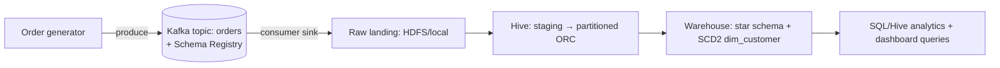
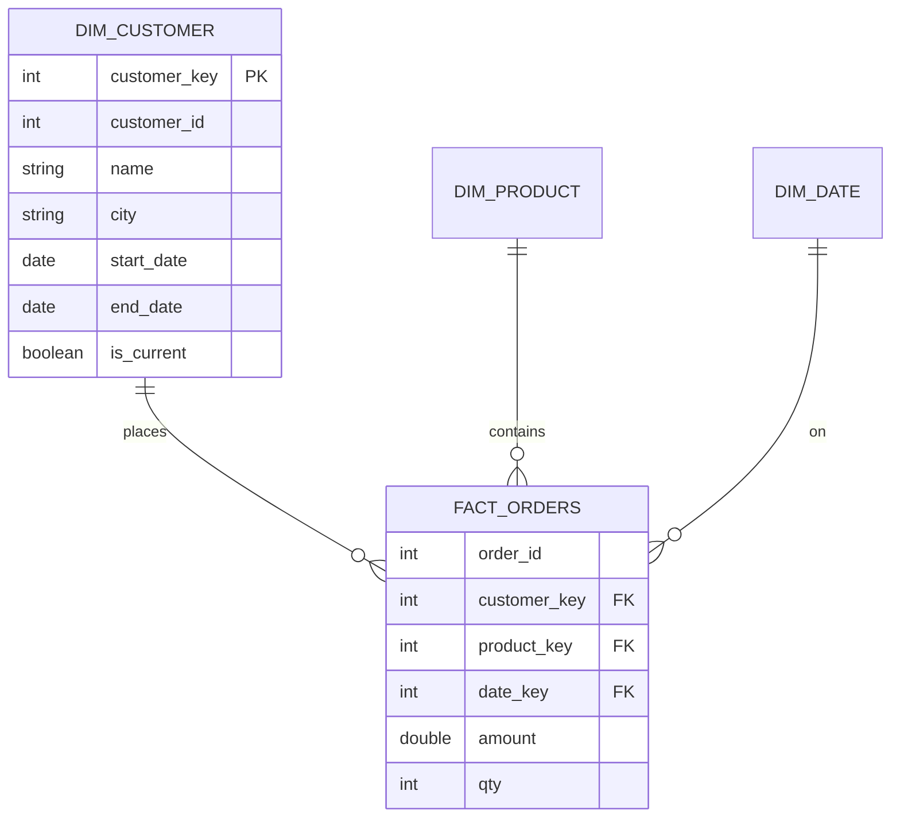
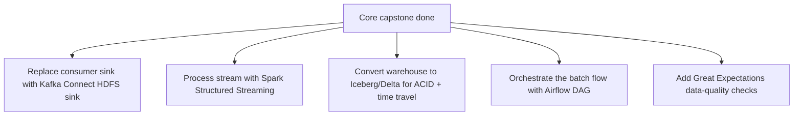

# Capstone Project — End-to-End Data Engineering Pipeline

> Project goal: Build a complete, portfolio-worthy pipeline that ties together **everything** in this curriculum — SQL modeling, Hadoop/HDFS storage, Hive analytics with partitioning/bucketing/ORC, Kafka streaming with a Schema Registry, warehouse modeling (star schema + SCD2), and optimization. This is both a learning capstone and your strongest STAR story.

Builds on **all Parts 1–16**.

---

## 1. Project Overview — "RetailStream Analytics"

You'll build a data platform for a fictional e-commerce company, **RetailStream**, that needs:
1. **Real-time** order ingestion for a live revenue view (Kafka).
2. **Batch** storage and analytics on all historical orders (HDFS + Hive).
3. A **warehouse** modeled as a star schema with customer history tracking (SCD2).
4. **Optimized** queries and clear performance wins to demonstrate.



### Skills demonstrated (map to Parts)
| Stage | Parts used |
|-------|-----------|
| Data model & SQL | 1–5 |
| HDFS / Hadoop | 6–7 |
| Hive tables, ORC, partition/bucket | 8–9 |
| Kafka streaming + Schema Registry | 10–11 |
| Pipeline design, star schema, SCD2 | 12 |
| Optimization & EXPLAIN | 13 |
| Modern stack framing | 14 |

---

## 2. Architecture & Data Model

### Source event (Avro schema for Kafka `orders` topic)
```json
{
  "type": "record",
  "name": "Order",
  "fields": [
    {"name": "order_id",    "type": "int"},
    {"name": "customer_id", "type": "int"},
    {"name": "product",     "type": "string"},
    {"name": "category",    "type": "string"},
    {"name": "amount",      "type": "double"},
    {"name": "qty",         "type": "int"},
    {"name": "order_ts",    "type": "string"},
    {"name": "city",        "type": "string", "default": "Unknown"}
  ]
}
```

### Target star schema (warehouse)


---

## 3. Step-by-Step Build

> Prerequisites: the Dataproc/Hadoop+Hive setup (Lab 7–9) and the local/Confluent Kafka setup (Lab 10–11). You can run Kafka locally and Hive on Dataproc, bridging with files.

### ──────── PHASE 1: Streaming Ingestion (Kafka) ────────

**Step 1.1 — Start Kafka + Schema Registry** (from Lab 11's docker-compose).

**Step 1.2 — Create the topic**
```bash
docker exec broker kafka-topics --create --topic orders \
  --partitions 3 --replication-factor 1 --bootstrap-server localhost:9092
```

**Step 1.3 — Register the Avro schema**
```bash
curl -X POST http://localhost:8081/subjects/orders-value/versions \
  -H "Content-Type: application/vnd.schemaregistry.v1+json" \
  -d '{"schema":"{\"type\":\"record\",\"name\":\"Order\",\"fields\":[{\"name\":\"order_id\",\"type\":\"int\"},{\"name\":\"customer_id\",\"type\":\"int\"},{\"name\":\"product\",\"type\":\"string\"},{\"name\":\"category\",\"type\":\"string\"},{\"name\":\"amount\",\"type\":\"double\"},{\"name\":\"qty\",\"type\":\"int\"},{\"name\":\"order_ts\",\"type\":\"string\"},{\"name\":\"city\",\"type\":\"string\",\"default\":\"Unknown\"}]}"}'
```

**Step 1.4 — Order generator (Python producer)**
```python
# pip install confluent-kafka[avro]
from confluent_kafka import Producer
import json, random, time
from datetime import datetime

p = Producer({'bootstrap.servers': 'localhost:9092'})
products = [('Laptop','Electronics',60000),('Mouse','Electronics',800),
            ('Desk','Furniture',12000),('Chair','Furniture',4500),
            ('Phone','Electronics',35000),('Lamp','Furniture',1500)]
cities = ['Bangalore','Delhi','Mumbai','Chennai']

for oid in range(1, 1001):
    prod, cat, base = random.choice(products)
    order = {
        "order_id": oid,
        "customer_id": random.randint(1, 50),     # 50 customers
        "product": prod, "category": cat,
        "amount": float(base), "qty": random.randint(1,5),
        "order_ts": datetime.now().isoformat(),
        "city": random.choice(cities)
    }
    # key = customer_id keeps each customer's events ordered (same partition)
    p.produce('orders', key=str(order['customer_id']),
              value=json.dumps(order))
    p.poll(0)
    time.sleep(0.01)
p.flush()
print("Produced 1000 orders")
```

**Step 1.5 — Consumer that sinks to landing files (real-time view + batch landing)**
```python
from confluent_kafka import Consumer
import json, csv

c = Consumer({'bootstrap.servers':'localhost:9092',
              'group.id':'sink-group','auto.offset.reset':'earliest'})
c.subscribe(['orders'])

revenue = 0.0
with open('landing_orders.csv','w',newline='') as f:
    w = csv.writer(f)
    w.writerow(['order_id','customer_id','product','category','amount','qty','order_ts','city'])
    try:
        while True:
            msg = c.poll(2.0)
            if msg is None: break          # demo: stop when drained
            if msg.error(): continue
            o = json.loads(msg.value())
            w.writerow([o['order_id'],o['customer_id'],o['product'],o['category'],
                        o['amount'],o['qty'],o['order_ts'],o['city']])
            revenue += o['amount'] * o['qty']
            print(f"Live revenue: {revenue:,.0f}")   # real-time dashboard value
            c.commit(asynchronous=False)             # at-least-once (sync commit)
    finally:
        c.close()
```
> Demonstrates: keyed partitioning (ordering), consumer group, sync commit (at-least-once), and a live revenue aggregate.

---

### ──────── PHASE 2: Batch Storage & Hive ────────

**Step 2.1 — Upload landing file to HDFS**
```bash
hdfs dfs -mkdir -p /retailstream/raw
hdfs dfs -put landing_orders.csv /retailstream/raw/
```

**Step 2.2 — Hive staging (external table on raw)**
```sql
CREATE DATABASE IF NOT EXISTS retailstream;
USE retailstream;

CREATE EXTERNAL TABLE stg_orders (
    order_id INT, customer_id INT, product STRING, category STRING,
    amount DOUBLE, qty INT, order_ts STRING, city STRING)
ROW FORMAT SERDE 'org.apache.hadoop.hive.serde2.OpenCSVSerde'
STORED AS TEXTFILE
LOCATION '/retailstream/raw/'
TBLPROPERTIES ("skip.header.line.count"="1");

SELECT COUNT(*), SUM(amount*qty) AS gross FROM stg_orders;
```

**Step 2.3 — Curated partitioned ORC fact table**
```sql
SET hive.exec.dynamic.partition = true;
SET hive.exec.dynamic.partition.mode = nonstrict;

CREATE TABLE fact_orders (
    order_id INT, customer_id INT, product STRING, category STRING,
    amount DOUBLE, qty INT)
PARTITIONED BY (order_date STRING)
STORED AS ORC;

INSERT INTO fact_orders PARTITION (order_date)
SELECT order_id, customer_id, product, category, amount, qty,
       substr(order_ts,1,10) AS order_date
FROM stg_orders;

SHOW PARTITIONS fact_orders;
```
> Demonstrates: external staging + SerDe, schema-on-read, dynamic partitioning, columnar ORC.

---

### ──────── PHASE 3: Warehouse — Star Schema & SCD2 ────────

**Step 3.1 — Dimension tables**
```sql
CREATE TABLE dim_customer (
    customer_key INT, customer_id INT, name STRING, city STRING,
    start_date STRING, end_date STRING, is_current BOOLEAN)
STORED AS ORC;

CREATE TABLE dim_product (
    product_key INT, product STRING, category STRING)
STORED AS ORC;
```

**Step 3.2 — Load dim_product (simple)**
```sql
INSERT INTO dim_product
SELECT ROW_NUMBER() OVER (ORDER BY product) AS product_key, product, category
FROM (SELECT DISTINCT product, category FROM stg_orders) t;
```

**Step 3.3 — SCD Type 2 for dim_customer (track city changes)**
```sql
-- Initial load (everyone current)
INSERT INTO dim_customer
SELECT ROW_NUMBER() OVER (ORDER BY customer_id) AS customer_key,
       customer_id,
       CONCAT('Customer_', customer_id) AS name,
       city, '2026-01-01' AS start_date, NULL AS end_date, TRUE AS is_current
FROM (SELECT customer_id, MIN(city) AS city FROM stg_orders GROUP BY customer_id) t;

-- On a later batch where a customer's city changed:
-- 1) expire the old current row, 2) insert a new current row (full history kept).
-- (Implement with INSERT OVERWRITE of a recomputed table, since Hive updates are limited.)
```
> Demonstrates: star schema, surrogate keys, SCD2 history tracking (Part 12).

---

### ──────── PHASE 4: Analytics & Optimization ────────

**Step 4.1 — Business questions (uses Parts 3–5 SQL)**
```sql
-- Revenue by category
SELECT category, SUM(amount*qty) AS revenue
FROM fact_orders GROUP BY category ORDER BY revenue DESC;

-- Top 3 customers by spend (window function)
SELECT * FROM (
  SELECT customer_id, SUM(amount*qty) AS spend,
         DENSE_RANK() OVER (ORDER BY SUM(amount*qty) DESC) AS rnk
  FROM fact_orders GROUP BY customer_id
) t WHERE rnk <= 3;

-- Daily running revenue (window + frame)
SELECT order_date,
       SUM(amount*qty) AS daily,
       SUM(SUM(amount*qty)) OVER (ORDER BY order_date) AS running_total
FROM fact_orders GROUP BY order_date ORDER BY order_date;

-- Join fact to current customer city (map-side join on small dim)
SET hive.auto.convert.join = true;
SELECT c.city, SUM(f.amount*f.qty) AS revenue
FROM fact_orders f
JOIN dim_customer c ON f.customer_id = c.customer_id AND c.is_current = TRUE
GROUP BY c.city;
```

**Step 4.2 — Demonstrate optimization (Part 13)**
```sql
-- Before: query the text staging table (full scan)
SELECT category, SUM(amount) FROM stg_orders WHERE order_ts LIKE '2026-%' GROUP BY category;

-- After: partitioned ORC with pruning + vectorization
SET hive.vectorized.execution.enabled = true;
SELECT category, SUM(amount) FROM fact_orders
WHERE order_date BETWEEN '2026-01-01' AND '2026-12-31' GROUP BY category;
```
Record the data-read/runtime difference (this is your quantified STAR result).

---

## 4. Deliverables & Portfolio Checklist

- [ ] **Architecture diagram** (reuse the Mermaid above).
- [ ] **Kafka producer + consumer** scripts, with a note on keys/ordering/commits.
- [ ] **Avro schema** + one evolution (add a field) registered safely.
- [ ] **Hive DDL** for staging (external), fact (partitioned ORC), and dims.
- [ ] **SCD2 logic** for `dim_customer`.
- [ ] **5+ analytical queries** (incl. a window function + a join).
- [ ] **Optimization before/after** with measured improvement.
- [ ] **README** explaining the design choices and trade-offs.

> 💡 **Make it a STAR story:** "I built an end-to-end pipeline ingesting 1,000+ orders/run via Kafka with a Schema Registry, landed to HDFS, modeled a partitioned-ORC star schema with SCD2 history, and cut analytic query data-read by ~90% via partitioning and columnar storage."

---

## 5. Stretch Goals (Optional, for extra edge)



- **Kafka Connect** instead of a custom consumer (Part 11).
- **Spark** for the transform layer instead of Hive (Part 14).
- **Iceberg/Delta** lakehouse table format (Part 14).
- **Airflow DAG** to orchestrate ingest→Hive→warehouse (Part 14).
- **dbt + tests** for the warehouse transforms (Part 14).

---

## ⭐ How to Present This in an Interview

**Q. "Walk me through a project you built."**
> *Model answer:* "I built RetailStream, an end-to-end pipeline. Orders stream into Kafka with keyed partitioning for per-customer ordering and an Avro Schema Registry for safe evolution. A consumer group sinks events with at-least-once semantics to HDFS. In Hive I stage raw data with a CSV SerDe (schema-on-read), then load a dynamically-partitioned ORC fact table. I modeled a star schema with an SCD2 customer dimension to preserve history. Finally I optimized analytics — partition pruning, columnar ORC, vectorization, and a map-side join on the small dimension — cutting query data-read by about 90%. As a stretch I'd move to Spark + Iceberg orchestrated by Airflow."

This single answer touches **every** technology in the curriculum — exactly what interviewers want to hear.

---

## 🧠 30-Second Memory Hooks
- **Flow:** Kafka (keyed, Avro/SR) → consumer sink → HDFS → Hive staging (external/SerDe) → partitioned ORC fact → star schema + SCD2 → optimized analytics.
- **Quantify the win:** partition + ORC → ~90% less data read.
- **Ordering** via message key; **at-least-once** via sync commit after processing.
- **Stretch = modern stack:** Connect, Spark, Iceberg/Delta, Airflow, dbt.
- This project is your **portfolio centerpiece and best STAR story**.

---

🎉 **Congratulations** — you've completed the full Data Engineering study guide and capstone. Return to the [master index](../Data%20Engineering%20-%20Study%20Guide.md) to track review status, drill the [Question Bank](Part-15-Question-Bank.md) aloud, and rehearse your [Behavioral stories](Part-16-Behavioral.md).
