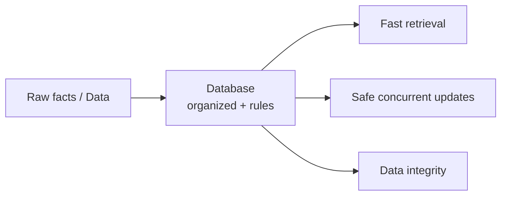
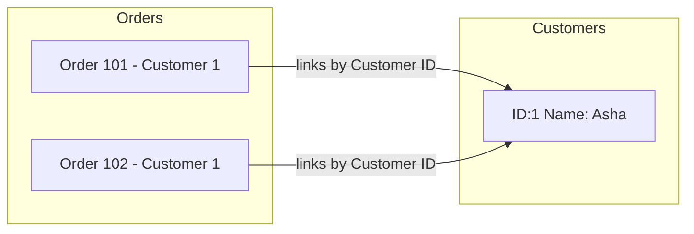
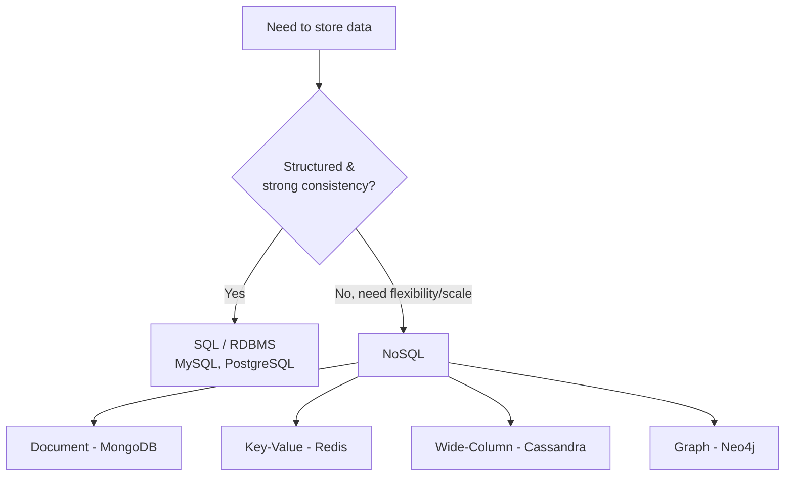
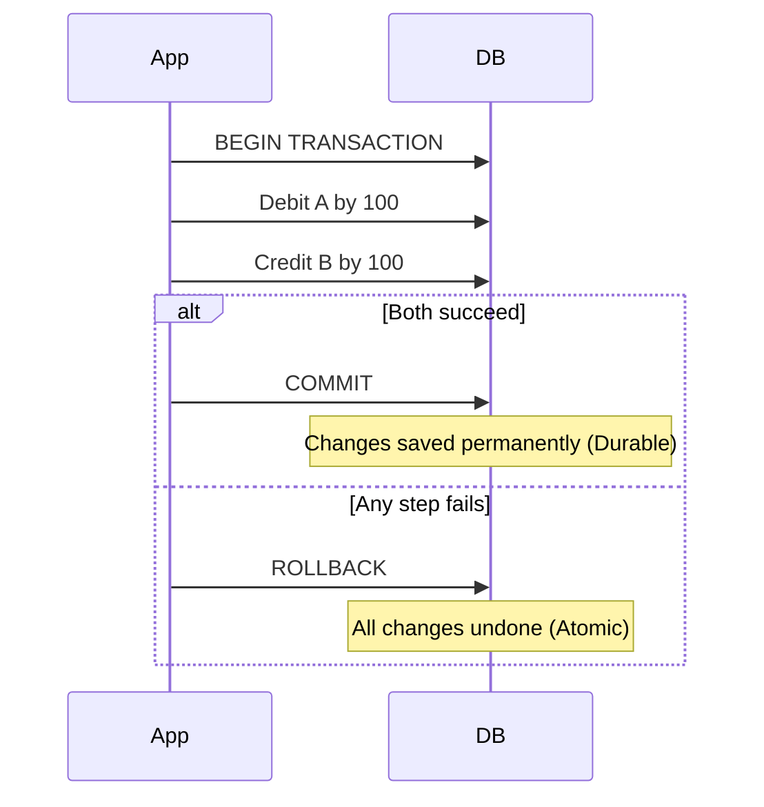
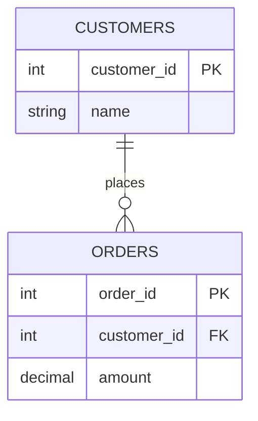

# Part 1 — Database Fundamentals

> Section goal: Build rock-solid mental models for what databases are, why they exist, and the core vocabulary (DBMS, RDBMS, ACID, relational vs NoSQL). Everything in SQL and Big Data later rests on these foundations.

Covers index items **1** (Module 1, Class 1 foundations).

---

## 1. What Is Data, and What Is a Database?

**Data** is just *facts* — a customer's name, a temperature reading, a purchase amount. On its own, a single fact is harmless. The problem starts when you have **millions** of facts and need to store, find, update, and protect them reliably.

A **database** is an *organized collection of data* stored so a computer can quickly retrieve and manage it.

### 🔍 Plain-English deep-dive: database vs. a spreadsheet
- **Spreadsheet (Excel)** — *a single grid of cells.* **Analogy:** a paper notebook. Great for a few hundred rows, one person at a time. **Why it matters:** it breaks down at scale — no real concurrency, no enforced rules, slow searching, easy to corrupt.
- **Database** — *a managed, structured store with rules and fast search.* **Analogy:** a library with a catalog, librarians, and checkout rules. **Why it matters:** thousands of users can read/write safely at once, rules prevent bad data, and queries return answers in milliseconds.



| Spreadsheet | Database |
|-------------|----------|
| One user at a time | Thousands of concurrent users |
| No enforced rules | Constraints enforce valid data |
| Slow search at scale | Indexed, millisecond lookups |
| Easy to corrupt | Transactions protect integrity |

> 💡 **For you:** Think of every app you use — banking, Instagram, Uber. Behind each is a database answering "what's my balance?", "who liked this?", "where's my driver?" — many times per second.

---

## 2. DBMS vs. RDBMS

You don't talk to the database files directly. You talk to a piece of software that manages them: the **DBMS**.

- **DBMS (Database Management System)** — *software that stores, retrieves, and manages data.* **Analogy:** the librarian who fetches and shelves books for you so you never touch the raw archive. Examples: MongoDB, file-based stores.
- **RDBMS (Relational Database Management System)** — *a DBMS where data lives in **tables** (rows and columns) and tables can be **related** to each other.* **Analogy:** a set of interlinked spreadsheets where a "Customer ID" in one sheet points to the full customer details in another. Examples: **MySQL**, PostgreSQL, Oracle, SQL Server.

### 🔍 Plain-English deep-dive: what makes it "relational"?
The word *relational* comes from the mathematical concept of a **relation** (a table). The key idea: instead of repeating a customer's full details on every order, you store the customer **once** and **link** orders to them by an ID. This avoids duplication and keeps data consistent.



| DBMS (general) | RDBMS (relational) |
|----------------|--------------------|
| Data can be files, key-value, documents | Data in tables (rows × columns) |
| Relationships not always enforced | Relationships via keys, enforced |
| May lack ACID guarantees | Strong ACID support |
| e.g., file systems, basic NoSQL | e.g., MySQL, PostgreSQL, Oracle |

---

## 3. Relational (SQL) vs. NoSQL Databases

Both store data, but they're built for different jobs.

- **Relational / SQL databases** — *fixed structure (schema) of tables with strict columns and types.* **Analogy:** a government form — every field is defined and required. Best when data is structured and consistency is critical (banking, orders).
- **NoSQL databases** — *flexible structure; data can be documents, key-value pairs, wide-columns, or graphs.* **Analogy:** a sticky-note board — you can add notes of any shape. Best for huge scale, fast changes, and varied data (social feeds, IoT, caching).



| Aspect | SQL / Relational | NoSQL |
|--------|------------------|-------|
| Schema | Fixed, defined upfront | Flexible / schema-less |
| Scaling | Vertical (bigger server) mostly | Horizontal (more servers) easily |
| Consistency | Strong (ACID) | Often eventual (BASE) |
| Query language | SQL (standardized) | Varies per product |
| Best for | Transactions, reporting | Big scale, fast-changing data |
| Examples | MySQL, Oracle, PostgreSQL | MongoDB, Cassandra, Redis |

### 🔍 Plain-English deep-dive: "BASE" (the NoSQL counterpart to ACID)
- **BA** = *Basically Available* — the system answers, even if not the freshest data.
- **S** = *Soft state* — data may be in flux for a moment.
- **E** = *Eventual consistency* — given time, all copies agree.
- **Analogy:** posting on social media — your friend might see your post a second later than you do, but eventually everyone sees it.

> 💡 **For you:** Modern data engineering uses **both**. You might capture events in NoSQL/Kafka at huge scale, then load cleaned data into a relational warehouse for reporting. We cover both worlds in this guide.

---

## 4. Transactions & ACID Properties

A **transaction** is *a group of one or more database operations treated as a single, all-or-nothing unit.*

**Classic example — a bank transfer of ₹100 from A to B:**
1. Subtract ₹100 from A.
2. Add ₹100 to B.

If step 1 succeeds but step 2 fails (power cut!), money vanishes. A transaction guarantees **both** happen or **neither** does.

### 🔍 Plain-English deep-dive: ACID — the four guarantees
- **A — Atomicity** — *all steps succeed or none do.* **Analogy:** sending a parcel — it either fully arrives or is fully returned; no "half a parcel". 
- **C — Consistency** — *the database moves from one valid state to another, never breaking rules.* **Analogy:** a balanced accounting ledger — totals always add up. 
- **I — Isolation** — *concurrent transactions don't step on each other.* **Analogy:** two people editing the same doc but seeing a clean version, not each other's half-typed words. 
- **D — Durability** — *once committed, data survives crashes/power loss.* **Analogy:** writing in permanent ink and locking it in a safe — a fire won't erase it.



| Property | Guarantees | What breaks without it |
|----------|------------|------------------------|
| Atomicity | All-or-nothing | Half-completed transfers |
| Consistency | Rules always hold | Invalid/corrupt data |
| Isolation | No interference | Race conditions, wrong totals |
| Durability | Survives crashes | Lost committed data |

> 💡 **For you (interview gold):** Interviewers love asking "Explain ACID with an example." The bank-transfer story above is the gold-standard answer — memorize it.

---

## 5. Keys & Relationships (Preview)

Two terms you'll hear constantly (full detail in Part 2):
- **Primary Key (PK)** — *a column whose value uniquely identifies each row.* **Analogy:** your passport number — no two people share it.
- **Foreign Key (FK)** — *a column that points to the primary key of another table.* **Analogy:** writing a friend's phone number in your contacts — it references *their* identity, stored elsewhere.



---

## 🧪 Lab 1 — Set Up MySQL Workbench & Run Your First Commands

**Goal:** Install MySQL, connect, and confirm transactions work.

### Step 1 — Install
1. Download **MySQL Community Server** + **MySQL Workbench** from [dev.mysql.com/downloads](https://dev.mysql.com/downloads/).
2. During setup, set a **root password** (remember it!).
3. Open **MySQL Workbench** → click the local connection → enter your password.

### Step 2 — Create a database and table
Paste this into a Workbench query tab and run (⚡ icon):

```sql
-- Create a database (a container for tables)
CREATE DATABASE bank_demo;
USE bank_demo;

-- Create an accounts table
CREATE TABLE accounts (
    account_id INT PRIMARY KEY,
    owner_name VARCHAR(50),
    balance DECIMAL(10,2)
);

-- Insert two accounts
INSERT INTO accounts VALUES (1, 'Asha', 500.00);
INSERT INTO accounts VALUES (2, 'Ravi', 300.00);

-- Look at the data
SELECT * FROM accounts;
```

### Step 3 — Prove ACID with a transaction
```sql
-- Transfer 100 from Asha (1) to Ravi (2) atomically
START TRANSACTION;
UPDATE accounts SET balance = balance - 100 WHERE account_id = 1;
UPDATE accounts SET balance = balance + 100 WHERE account_id = 2;
COMMIT;            -- both changes saved together

SELECT * FROM accounts;   -- Asha 400, Ravi 400
```

### Step 4 — Prove ROLLBACK (atomicity)
```sql
START TRANSACTION;
UPDATE accounts SET balance = balance - 1000 WHERE account_id = 1;  -- oops, too much
SELECT * FROM accounts;   -- balance looks wrong inside the transaction
ROLLBACK;                 -- undo everything
SELECT * FROM accounts;   -- back to safe values
```

✅ **Checkpoint:** You created a database, inserted rows, committed a transaction, and rolled one back. You've just *experienced* ACID.

---

## ⭐ Likely Interview Questions for This Section

**Q1. "What is the difference between a DBMS and an RDBMS?"**
> *Model answer:* A DBMS is any software that stores and manages data. An RDBMS is a specialized DBMS that stores data in related tables (rows and columns), enforces relationships through primary/foreign keys, and provides strong ACID guarantees. MySQL and PostgreSQL are RDBMS examples.

**Q2. "Explain ACID properties with an example."**
> *Model answer:* ACID = Atomicity (all-or-nothing), Consistency (rules always hold), Isolation (concurrent transactions don't interfere), Durability (committed data survives crashes). Example: a bank transfer debits one account and credits another — atomicity ensures both happen or neither, so money is never lost.

**Q3. "When would you choose NoSQL over a relational database?"**
> *Model answer:* When I need to scale horizontally across many servers, handle huge volumes of fast-changing or unstructured data (logs, social feeds, IoT), and can tolerate eventual consistency. For strict transactional integrity and structured reporting, I'd choose a relational database.

**Q4. "What is the difference between a primary key and a foreign key?"**
> *Model answer:* A primary key uniquely identifies each row in its own table and cannot be null. A foreign key is a column that references the primary key of another table, creating a relationship and enforcing referential integrity.

**Q5. "What does it mean for a transaction to be 'isolated'?"**
> *Model answer:* Isolation means concurrent transactions execute as if they were run one after another — one transaction's intermediate changes are not visible to others until committed, preventing race conditions and dirty reads.

**Q6. "What are the differences between SQL and NoSQL databases?"**
> *Model answer:* SQL databases use a fixed schema of related tables, scale vertically, and offer strong ACID consistency with a standardized query language. NoSQL databases use flexible schemas (document, key-value, wide-column, graph), scale horizontally, and often favor availability and eventual consistency (BASE).

---

## 🧠 30-Second Memory Hooks
- **DBMS** = librarian for data; **RDBMS** = librarian who keeps *related tables*.
- **Relational** = store once, link by ID (no duplication).
- **ACID** = *A*ll-or-nothing, *C*orrect rules, *I*solated, *D*urable.
- **SQL vs NoSQL** = structured + strong consistency vs flexible + huge scale.
- **PK** = passport number (unique); **FK** = a reference to someone else's passport.
- **Transaction** = parcel delivery — fully arrives or fully returns.

---

*Next suggested section:* **Part 2 — SQL Essentials: DDL & DML** (now that you know *what* databases are, learn the commands to *build and fill* them).
