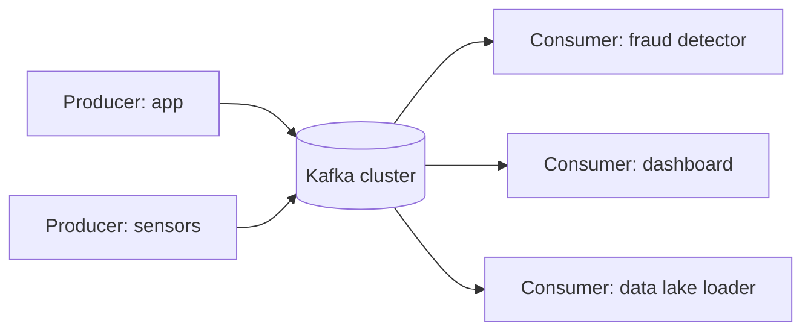
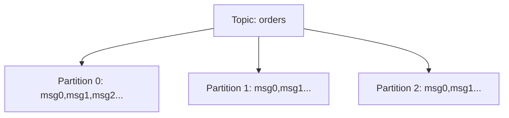
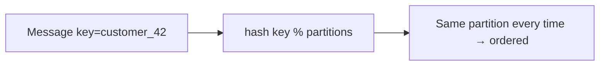
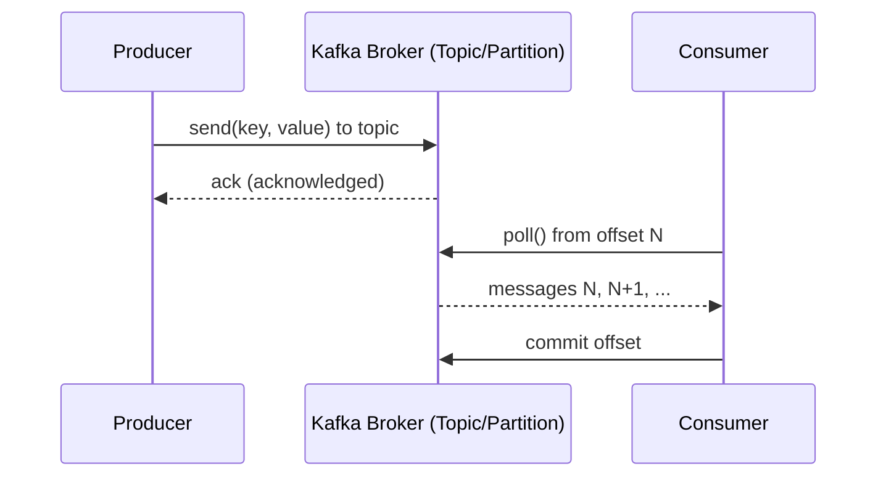
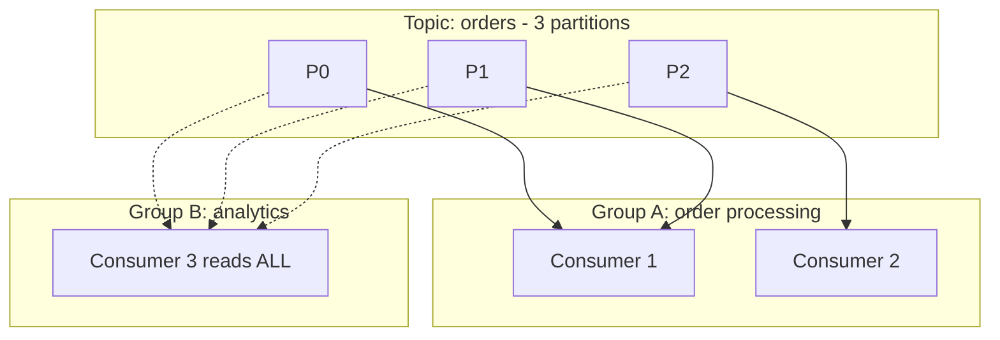
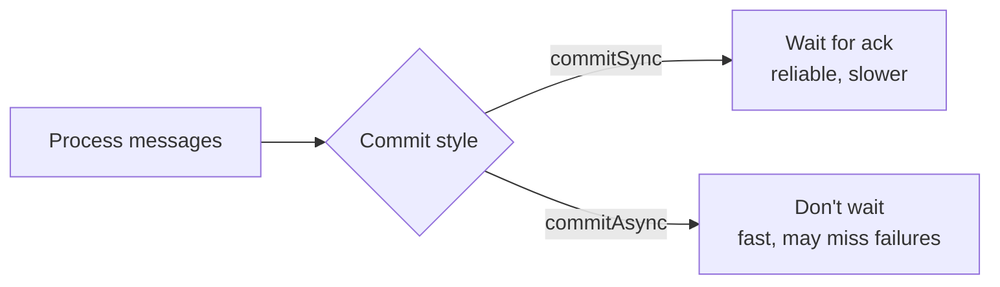
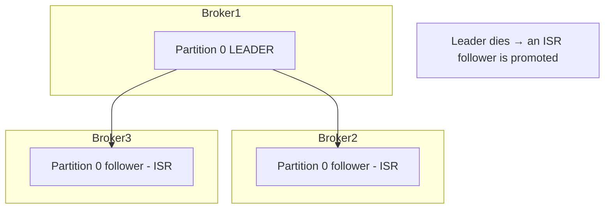

# Part 10 — Apache Kafka

> Section goal: Understand real-time streaming with Kafka — its cluster architecture (brokers, topics, partitions), the producer-consumer model, consumer groups, offset management, replication, and the commit/acknowledgement guarantees that make it reliable.

Covers index items **10** (Module 3, Class 1: Kafka cluster architecture, brokers, topics, partitions, producer-consumer, consumer groups, offset management, replicas, commits, sync & async commits).

---

## 1. What Is Kafka & Why Streaming?

Hive (Parts 8–9) handles **batch** data — processing data *at rest* in big chunks. But many needs are **real-time**: fraud alerts, live dashboards, recommendations. **Apache Kafka** is a *distributed event-streaming platform* for data *in motion*.

### 🔍 Plain-English deep-dive: what Kafka really is
- **Analogy:** Kafka is a *super-powered post office / conveyor belt*. Producers drop messages on the belt; consumers pick them up — neither needs to know about the other, and the belt remembers everything for a configured time.
- It's a **distributed, append-only log**: messages are written in order and kept for a retention period, so multiple consumers can read at their own pace, even re-reading the past.



| Batch (Hive) | Streaming (Kafka) |
|--------------|-------------------|
| Data at rest, processed in bulk | Data in motion, processed as it arrives |
| High latency (minutes–hours) | Low latency (ms–seconds) |
| "What happened yesterday?" | "What's happening now?" |

---

## 2. Core Architecture: Brokers, Topics, Partitions

### 🔍 Plain-English deep-dive: the building blocks
- **Broker** — *a single Kafka server* that stores data and serves clients. A **cluster** is multiple brokers. **Analogy:** one post office branch; several branches form the postal network.
- **Topic** — *a named category/feed of messages* (e.g., `orders`, `clicks`). **Analogy:** a labeled mailbox or channel.
- **Partition** — *a topic is split into ordered partitions* for parallelism and scale. Each partition is an ordered, immutable log. **Analogy:** a single topic's mail split across several numbered conveyor lanes so many workers handle it at once.
- **Offset** — *the position/ID of a message within a partition* (0,1,2,...). **Analogy:** the line number in a ledger.



### Key ordering rule
- **Order is guaranteed *within* a partition**, not across partitions.
- Messages with the **same key** go to the **same partition** (so all events for `customer_42` stay ordered). No key → round-robin distribution.

> 💡 **Interview gold:** "Does Kafka guarantee global ordering?" → No, only per-partition. To keep related events ordered, give them the same key so they share a partition.



---

## 3. Producers & Consumers

- **Producer** — *writes (publishes) messages to topics.* Chooses the partition (by key or round-robin).
- **Consumer** — *reads (subscribes to) messages from topics*, tracking its offset so it knows what it has read.



---

## 4. Consumer Groups — Scaling Consumption

A **consumer group** is a set of consumers that *cooperate* to read a topic, splitting partitions among themselves.

### 🔍 Plain-English deep-dive
- **Analogy:** a group of cashiers (consumers) sharing the checkout lanes (partitions). Each lane is served by exactly one cashier in the group, so work is split with no double-processing.
- **Rules:**
  - Each partition is consumed by **exactly one** consumer *within a group*.
  - Different groups each get **all** the messages independently (great for multiple use-cases).
  - If consumers > partitions, the extras sit idle (parallelism is capped by partition count).



> 💡 **Scaling tip:** to process a topic faster, add partitions *and* consumers in the group. Max useful consumers = number of partitions.

### Rebalancing
When a consumer joins/leaves, Kafka **rebalances** — reassigning partitions among the group's members. **Analogy:** if a cashier goes on break, their lanes are reassigned to the others.

---

## 5. Offset Management & Commits

The **offset** tracks how far a consumer has read. **Committing** an offset records "I've processed up to here", so on restart the consumer resumes correctly.

### 🔍 Plain-English deep-dive: where commits matter
- **Auto-commit** — Kafka periodically commits offsets for you. Simple but risks reprocessing or loss around crashes.
- **Manual commit** — you commit explicitly after processing, for precise control.

### Sync vs Async commit
- **Synchronous commit (`commitSync`)** — *blocks until the broker confirms.* Reliable, retries on failure, but slower. **Analogy:** posting a letter by registered mail and waiting for the signed receipt.
- **Asynchronous commit (`commitAsync`)** — *fires and continues without waiting.* Faster, higher throughput, but no automatic retry on failure. **Analogy:** dropping the letter in the box and walking off.



| | Sync commit | Async commit |
|---|-------------|--------------|
| Waits for ack | Yes | No |
| Throughput | Lower | Higher |
| Retries on failure | Yes | No (typically) |
| Use when | Correctness critical | Throughput critical |

> 💡 **Common pattern:** use `commitAsync` during normal processing for speed, and a final `commitSync` on shutdown for safety.

### Delivery semantics
| Guarantee | Meaning | How |
|-----------|---------|-----|
| **At-most-once** | May lose, never duplicate | Commit *before* processing |
| **At-least-once** | Never lose, may duplicate | Commit *after* processing (default goal) |
| **Exactly-once** | No loss, no duplicate | Idempotent producer + transactions |

---

## 6. Replication & Fault Tolerance

Kafka replicates each partition across brokers so a broker failure doesn't lose data.

### 🔍 Plain-English deep-dive
- **Replica** — *a copy of a partition* on another broker.
- **Leader** — *the replica that handles all reads/writes* for that partition.
- **Followers** — *replicas that copy the leader.* If the leader dies, a follower is promoted.
- **ISR (In-Sync Replicas)** — *followers fully caught up* with the leader; only an ISR can become the new leader (prevents data loss).
- **Replication factor** — *number of copies* (e.g., 3).



### Producer acknowledgements (`acks`)
- **`acks=0`** — fire and forget (fastest, can lose data).
- **`acks=1`** — leader confirms (balanced).
- **`acks=all`** — leader + all ISR confirm (safest, no loss). **Analogy:** waiting until every branch has filed its copy before considering the message "delivered".

> 💡 **Interview gold:** "How does Kafka avoid data loss?" → replication factor ≥ 3, `acks=all`, and `min.insync.replicas` ≥ 2, so a write is only acknowledged once enough in-sync copies exist.

---

## 🧪 Lab 10 — Run Kafka Locally & Stream Messages

**Goal:** Start Kafka, create a topic, produce and consume, and see consumer groups split partitions.

### Step 1 — Install (KRaft mode, no ZooKeeper needed in modern Kafka)
1. Download Kafka from [kafka.apache.org/downloads](https://kafka.apache.org/downloads) (binary, Scala 2.13).
2. Extract. From the Kafka folder:
```bash
# Generate a cluster ID and format storage (KRaft mode)
KAFKA_CLUSTER_ID="$(bin/kafka-storage.sh random-uuid)"
bin/kafka-storage.sh format -t $KAFKA_CLUSTER_ID -c config/kraft/server.properties
# Start the broker
bin/kafka-server-start.sh config/kraft/server.properties
```
(On Windows use the `bin\windows\*.bat` equivalents.)

### Step 2 — Create a topic with 3 partitions
```bash
bin/kafka-topics.sh --create --topic orders \
    --partitions 3 --replication-factor 1 \
    --bootstrap-server localhost:9092

bin/kafka-topics.sh --describe --topic orders --bootstrap-server localhost:9092
```

### Step 3 — Produce messages (with keys for ordering)
```bash
bin/kafka-console-producer.sh --topic orders \
    --property "parse.key=true" --property "key.separator=:" \
    --bootstrap-server localhost:9092
# Then type:
# cust1:order placed 100
# cust1:order shipped
# cust2:order placed 50
```

### Step 4 — Consume in a group (run in 2 terminals, same group)
```bash
# Terminal A
bin/kafka-console-consumer.sh --topic orders --group g1 \
    --from-beginning --bootstrap-server localhost:9092
# Terminal B (same --group g1) → partitions split between A and B
bin/kafka-console-consumer.sh --topic orders --group g1 \
    --bootstrap-server localhost:9092
```
Observe: the two consumers in group `g1` divide the 3 partitions. Start a consumer with a *different* group → it receives ALL messages independently.

### Step 5 — Inspect consumer group & offsets
```bash
bin/kafka-consumer-groups.sh --describe --group g1 \
    --bootstrap-server localhost:9092
# Shows CURRENT-OFFSET, LOG-END-OFFSET, and LAG per partition
```

✅ **Checkpoint:** You ran a broker, created a partitioned topic, produced keyed messages, watched a consumer group split partitions, and inspected offsets/lag. You've operated Kafka's core.

---

## ⭐ Likely Interview Questions for This Section

**Q1. "What are brokers, topics, and partitions?"**
> *Model answer:* A broker is a Kafka server; a cluster is several brokers. A topic is a named message feed. A topic is divided into partitions — ordered, append-only logs — enabling parallelism and scale.

**Q2. "Does Kafka guarantee message ordering?"**
> *Model answer:* Only within a partition, not across partitions. Messages with the same key hash to the same partition, preserving order for related events.

**Q3. "What is a consumer group?"**
> *Model answer:* A set of cooperating consumers that split a topic's partitions among themselves — each partition is read by exactly one consumer in the group. Different groups each receive all messages independently.

**Q4. "What happens if you have more consumers than partitions?"**
> *Model answer:* The extra consumers sit idle, because each partition is assigned to only one consumer per group — so partition count caps parallelism.

**Q5. "Explain offsets and committing."**
> *Model answer:* An offset is a message's position in a partition. Committing records how far a consumer has processed, so it resumes from there after a restart. Commits can be automatic or manual.

**Q6. "Sync vs async commit?"**
> *Model answer:* commitSync blocks until the broker acknowledges and retries on failure — reliable but slower. commitAsync doesn't wait — faster but no retry. A common pattern is async during processing and a final sync on shutdown.

**Q7. "How does Kafka achieve fault tolerance?"**
> *Model answer:* Each partition is replicated across brokers with a leader and follower replicas. Only in-sync replicas (ISR) can be promoted if the leader fails. With replication factor ≥ 3, acks=all, and min.insync.replicas ≥ 2, no acknowledged data is lost.

**Q8. "Explain at-most-once, at-least-once, and exactly-once."**
> *Model answer:* At-most-once commits before processing (may lose, no dupes). At-least-once commits after processing (no loss, possible dupes). Exactly-once uses idempotent producers and transactions to avoid both loss and duplicates.

**Q9. "What do the producer acks settings mean?"**
> *Model answer:* acks=0 doesn't wait (fastest, can lose data); acks=1 waits for the leader; acks=all waits for all in-sync replicas (safest).

---

## 🧠 30-Second Memory Hooks
- **Kafka** = distributed append-only log; a post office/conveyor belt for events.
- **Broker** = server; **topic** = mailbox; **partition** = ordered lane; **offset** = line number.
- **Ordering** = per-partition only; same key → same partition.
- **Consumer group** = cashiers splitting lanes; one partition → one consumer per group; extra consumers idle.
- **commitSync** = registered mail (wait); **commitAsync** = drop & go.
- **Replication** = leader + ISR followers; **acks=all** = no data loss.
- **At-least-once** = commit after processing (no loss, maybe dupes).

---

*Next suggested section:* **Part 11 — Kafka Schema Registry & Streaming** (raw messages are fragile; learn schemas, serialization, and Confluent's production setup).
