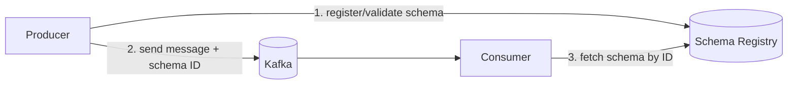
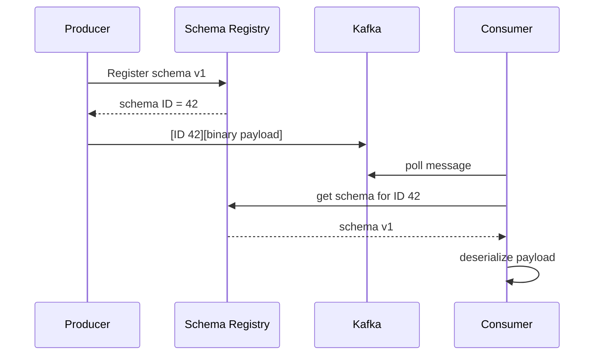
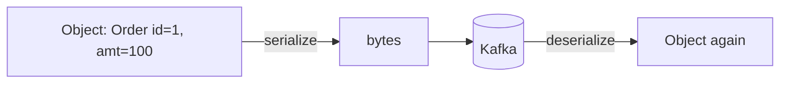
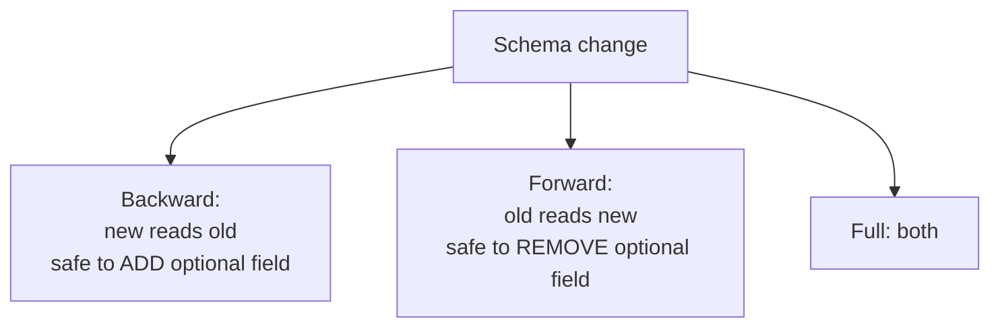
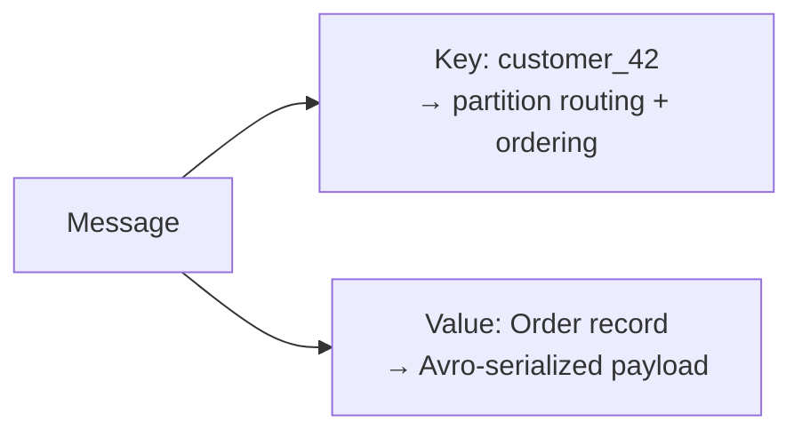
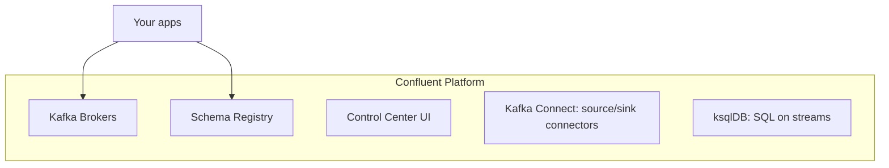

# Part 11 — Kafka Schema Registry & Streaming

> Section goal: Move from raw Kafka messages to production-grade streaming — why schemas matter, the Confluent Schema Registry, serialization formats (Avro, Protobuf, JSON Schema), schema evolution & compatibility, and how to set up Confluent Kafka with topics, keys, and values.

Covers index items **11** (Module 3, Class 2: Confluent Kafka setup, topic creation, Schema Registry, key/value serialization, schema evolution).

---

## 1. The Problem: Raw Messages Are Fragile

In Part 10 we sent plain text. In production, hundreds of services produce and consume messages. If a producer changes the message shape (renames a field, changes a type), **every consumer can break**. We need a contract.

### 🔍 Plain-English deep-dive: why schemas?
- A **schema** is *a formal definition of a message's structure* — fields, types, required/optional. **Analogy:** a shared form template that every department agrees to. If someone wants to change the form, there are rules so existing readers don't break.
- Without schemas: messages are opaque blobs; a typo silently corrupts downstream systems.
- With a **Schema Registry**: producers and consumers validate against a central, versioned schema.



---

## 2. The Confluent Schema Registry

**Confluent** is a company that builds an enterprise platform around Apache Kafka. The **Schema Registry** is its service for storing and versioning schemas.

### 🔍 Plain-English deep-dive: how it works
- Producers register a schema; the registry returns a small **schema ID**.
- The message on Kafka carries only the **ID** (a few bytes) + the binary data — not the whole schema. **Analogy:** instead of stapling the full instruction manual to every package, you stamp a manual *version number*; the reader looks up that version once.
- Consumers fetch the schema by ID (and cache it) to deserialize correctly.



> 💡 **Benefit:** tiny messages (ID, not full schema), centralized governance, and safe evolution.

---

## 3. Serialization Formats: Avro vs Protobuf vs JSON Schema

**Serialization** = converting an in-memory object into bytes to send; **deserialization** = the reverse. (Same idea as Hive's SerDe, applied to streaming.)

| Format | Type | Pros | Cons |
|--------|------|------|------|
| **Avro** | Binary + schema | Compact, rich schema evolution, Kafka-native | Needs schema to read |
| **Protobuf** | Binary | Very compact/fast, cross-language (gRPC) | Slightly less dynamic |
| **JSON Schema** | Text | Human-readable, easy debugging | Larger, slower |



> 💡 **Avro is the most common Kafka choice** because it's compact and was designed with schema evolution in mind. Example Avro schema:
```json
{
  "type": "record",
  "name": "Order",
  "fields": [
    {"name": "order_id", "type": "int"},
    {"name": "amount",   "type": "double"},
    {"name": "currency", "type": "string", "default": "INR"}
  ]
}
```

---

## 4. Schema Evolution & Compatibility

The real power: **changing schemas safely over time** without breaking existing producers/consumers.

### 🔍 Plain-English deep-dive: compatibility modes
- **Backward compatible** — *new schema can read old data.* You can add an optional field (with default). New consumers read old messages. **Analogy:** a new form reader still understands forms filled with the old template.
- **Forward compatible** — *old schema can read new data.* Old consumers ignore new fields. **Analogy:** old readers skip extra boxes on a newer form.
- **Full compatible** — both backward and forward.
- **None** — no checks (risky).



| Change | Backward-safe? | Forward-safe? |
|--------|----------------|---------------|
| Add optional field (with default) | ✅ | ✅ |
| Remove optional field | ✅ (forward) | depends |
| Add required field (no default) | ❌ | ❌ |
| Rename / change type | ❌ | ❌ |

> 💡 **Golden rule:** add fields with defaults, never change types or remove required fields. The registry *enforces* the configured compatibility, rejecting unsafe schemas before they reach Kafka.

---

## 5. Keys & Values in Kafka Messages

Every Kafka message has an optional **key** and a **value**, each independently serialized.

### 🔍 Plain-English deep-dive
- **Value** — *the payload* (the actual data, e.g., the order). Usually Avro/Protobuf/JSON.
- **Key** — *determines the partition* (same key → same partition → ordering) and powers **log compaction**. **Analogy:** the address on an envelope routes it; the letter inside is the value.
- The Schema Registry can manage schemas for **both** key and value separately (subjects `topic-key` and `topic-value`).



### Log compaction (bonus)
With key-based **compaction**, Kafka keeps only the *latest* value per key — turning a topic into a changelog/snapshot. **Analogy:** a contact list keeping only each person's current phone number, discarding old ones.

---

## 6. Confluent Kafka Setup Overview



- **Kafka Connect** — pre-built connectors to move data in/out (DB → Kafka, Kafka → HDFS/S3) without code.
- **ksqlDB** — run SQL-like queries directly on streams.
- **Control Center** — web UI to monitor topics, lag, schemas.

---

## 🧪 Lab 11 — Confluent Kafka + Schema Registry (Docker)

**Goal:** Run Confluent locally, register an Avro schema, and produce/consume Avro messages with evolution.

### Step 1 — Start Confluent with Docker Compose
Create `docker-compose.yml`:
```yaml
version: '3'
services:
  broker:
    image: confluentinc/cp-kafka:7.6.0
    ports: ["9092:9092"]
    environment:
      KAFKA_NODE_ID: 1
      KAFKA_PROCESS_ROLES: broker,controller
      KAFKA_LISTENERS: PLAINTEXT://0.0.0.0:9092,CONTROLLER://0.0.0.0:9093
      KAFKA_ADVERTISED_LISTENERS: PLAINTEXT://localhost:9092
      KAFKA_CONTROLLER_QUORUM_VOTERS: 1@broker:9093
      KAFKA_CONTROLLER_LISTENER_NAMES: CONTROLLER
      KAFKA_LISTENER_SECURITY_PROTOCOL_MAP: CONTROLLER:PLAINTEXT,PLAINTEXT:PLAINTEXT
      KAFKA_OFFSETS_TOPIC_REPLICATION_FACTOR: 1
      CLUSTER_ID: "MkU3OEVBNTcwNTJENDM2Qk"
  schema-registry:
    image: confluentinc/cp-schema-registry:7.6.0
    depends_on: [broker]
    ports: ["8081:8081"]
    environment:
      SCHEMA_REGISTRY_HOST_NAME: schema-registry
      SCHEMA_REGISTRY_KAFKASTORE_BOOTSTRAP_SERVERS: broker:9092
      SCHEMA_REGISTRY_LISTENERS: http://0.0.0.0:8081
```
```bash
docker compose up -d
```

### Step 2 — Create a topic
```bash
docker exec broker kafka-topics --create --topic orders \
    --partitions 3 --replication-factor 1 --bootstrap-server localhost:9092
```

### Step 3 — Register an Avro schema via the REST API
```bash
curl -X POST http://localhost:8081/subjects/orders-value/versions \
  -H "Content-Type: application/vnd.schemaregistry.v1+json" \
  -d '{"schema": "{\"type\":\"record\",\"name\":\"Order\",\"fields\":[{\"name\":\"order_id\",\"type\":\"int\"},{\"name\":\"amount\",\"type\":\"double\"}]}"}'

# List subjects and view the schema
curl http://localhost:8081/subjects
curl http://localhost:8081/subjects/orders-value/versions/1
```

### Step 4 — Test schema evolution (add an optional field with default)
```bash
# This should be ACCEPTED (backward compatible: new optional field with default)
curl -X POST http://localhost:8081/subjects/orders-value/versions \
  -H "Content-Type: application/vnd.schemaregistry.v1+json" \
  -d '{"schema": "{\"type\":\"record\",\"name\":\"Order\",\"fields\":[{\"name\":\"order_id\",\"type\":\"int\"},{\"name\":\"amount\",\"type\":\"double\"},{\"name\":\"currency\",\"type\":\"string\",\"default\":\"INR\"}]}"}'

# Check compatibility of a BREAKING change (changing type) — should report incompatible
curl -X POST http://localhost:8081/compatibility/subjects/orders-value/versions/latest \
  -H "Content-Type: application/vnd.schemaregistry.v1+json" \
  -d '{"schema": "{\"type\":\"record\",\"name\":\"Order\",\"fields\":[{\"name\":\"order_id\",\"type\":\"string\"}]}"}'
```

### Step 5 — Produce/consume Avro (with Confluent CLI tools)
```bash
docker exec -it schema-registry kafka-avro-console-producer \
  --bootstrap-server broker:9092 --topic orders \
  --property schema.registry.url=http://localhost:8081 \
  --property value.schema='{"type":"record","name":"Order","fields":[{"name":"order_id","type":"int"},{"name":"amount","type":"double"}]}'
# type: {"order_id":1,"amount":100.0}

docker exec -it schema-registry kafka-avro-console-consumer \
  --bootstrap-server broker:9092 --topic orders --from-beginning \
  --property schema.registry.url=http://localhost:8081
```

### Step 6 — Clean up
```bash
docker compose down
```

✅ **Checkpoint:** You ran Confluent with a Schema Registry, registered and evolved an Avro schema, saw a breaking change rejected, and produced/consumed Avro messages. This is how real streaming platforms stay reliable.

---

## ⭐ Likely Interview Questions for This Section

**Q1. "Why use a Schema Registry?"**
> *Model answer:* It centralizes and versions message schemas so producers and consumers share a contract. Messages carry a small schema ID instead of the full schema, keeping them compact while enforcing compatibility so schema changes don't break consumers.

**Q2. "How does the Schema Registry keep messages small?"**
> *Model answer:* The producer registers the schema once and gets an ID; each message carries just that ID plus the binary payload. Consumers fetch and cache the schema by ID rather than reading it from every message.

**Q3. "Avro vs Protobuf vs JSON Schema?"**
> *Model answer:* Avro is compact binary with strong schema-evolution support and is Kafka-native. Protobuf is very fast/compact and great cross-language (gRPC). JSON Schema is human-readable but larger and slower. Avro is the most common Kafka choice.

**Q4. "What is backward vs forward compatibility?"**
> *Model answer:* Backward: a new schema can read data written with the old schema (safe to add optional fields with defaults). Forward: an old schema can read data written with the new schema (old consumers ignore new fields). Full means both.

**Q5. "Which schema changes are safe?"**
> *Model answer:* Adding optional fields with defaults is safe. Removing required fields, changing types, or renaming fields are breaking changes. The registry enforces the configured compatibility and rejects unsafe ones.

**Q6. "What is the role of the message key?"**
> *Model answer:* The key determines the partition (same key → same partition → ordering for related events) and enables log compaction, where Kafka retains only the latest value per key.

**Q7. "What is log compaction?"**
> *Model answer:* A retention mode that keeps only the most recent message per key, turning a topic into a compact changelog/snapshot of the latest state.

**Q8. "What are Kafka Connect and ksqlDB?"**
> *Model answer:* Kafka Connect provides ready-made source/sink connectors to move data between Kafka and external systems without custom code; ksqlDB lets you run SQL-like queries and transformations directly on streams.

---

## 🧠 30-Second Memory Hooks
- **Schema** = shared form template; **Schema Registry** = central, versioned store of templates.
- Messages carry a **schema ID**, not the whole schema (small + governed).
- **Avro** = compact binary + evolution (Kafka favorite); Protobuf = fast/cross-language; JSON = readable but big.
- **Backward** = new reads old (add optional field); **Forward** = old reads new (skip new field).
- **Safe change** = add optional field with default; never change types / remove required.
- **Key** = partition routing + compaction; **value** = the payload.
- **Connect** = no-code data movement; **ksqlDB** = SQL on streams.

---

*Next suggested section:* **Part 12 — Real-World Pipelines & Architectures** (you know each tool; now combine SQL + Hadoop/Hive + Kafka into end-to-end data pipelines).
