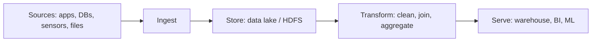
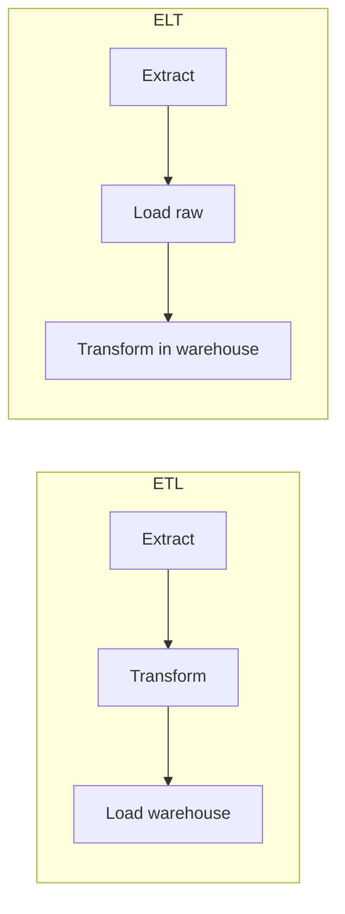
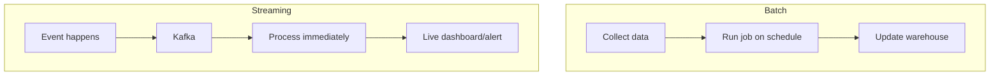
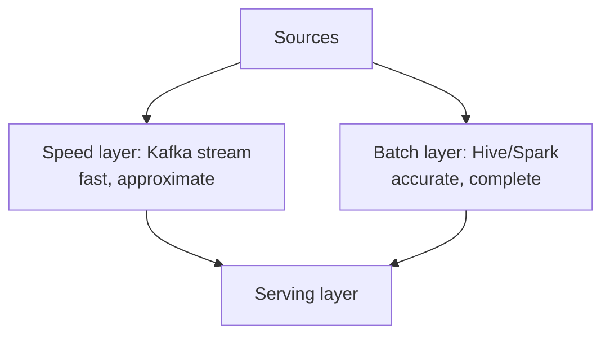
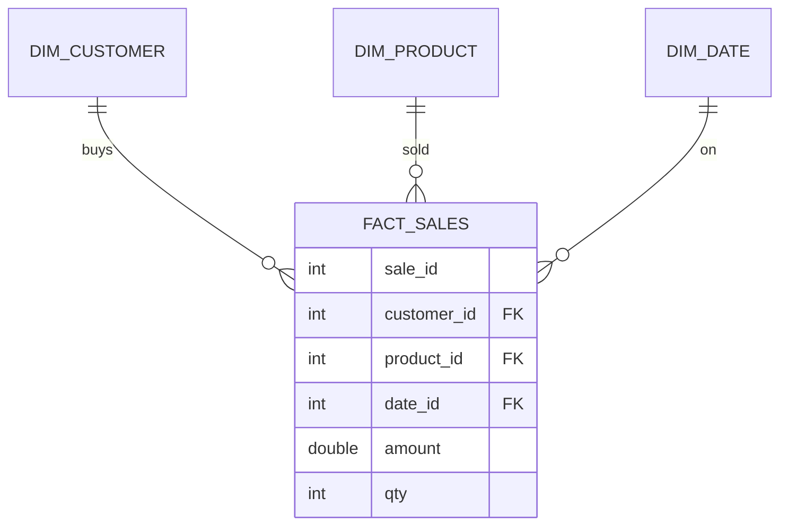
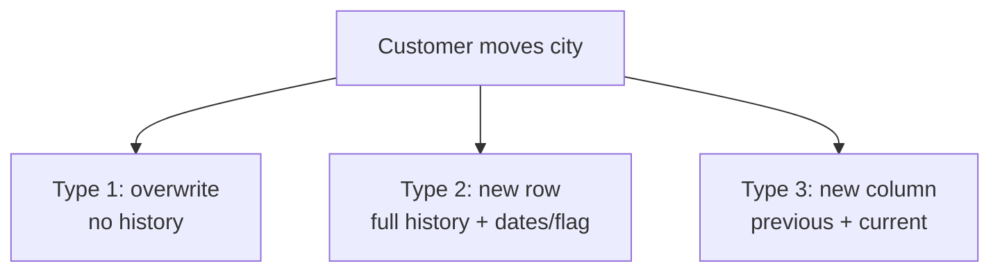
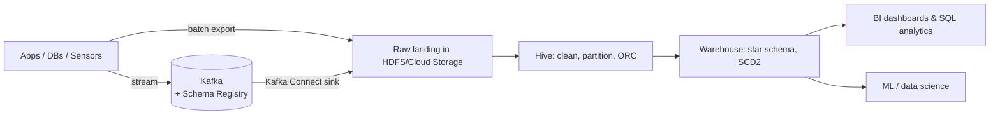

# Part 12 — Real-World Pipelines & Architectures

> Section goal: Connect everything — turn the individual tools (SQL, Hadoop/Hive, Kafka) into end-to-end data pipelines. Learn ETL vs ELT, batch vs streaming architectures, data warehouse modeling, and Slowly Changing Dimensions (SCD).

Covers index items **12** (applied integration of all modules: pipelines, ETL/ELT, warehousing, SCD).

---

## 1. What Is a Data Pipeline?

A **data pipeline** is *a series of steps that move and transform data from sources to a destination* where it delivers value (dashboards, ML, reports).



The job of a **data engineer** is to build and operate these pipelines reliably.

---

## 2. ETL vs ELT

Both move data from source to a warehouse; the difference is *when* transformation happens.

### 🔍 Plain-English deep-dive
- **ETL — Extract, Transform, Load** — *transform before loading.* Clean/shape data in a staging engine, then load the finished result. **Analogy:** cooking the meal in the kitchen, then serving the finished plate.
- **ELT — Extract, Load, Transform** — *load raw first, transform inside the warehouse.* Modern cloud warehouses (BigQuery, Snowflake) are powerful enough to transform in place. **Analogy:** delivering all raw ingredients to the dining table and cooking there on demand.



| | ETL | ELT |
|---|-----|-----|
| Transform location | Separate engine (before load) | Inside the warehouse (after load) |
| Raw data kept? | Often not | Yes (load raw first) |
| Best for | On-prem, limited warehouse compute | Cloud warehouses with scalable compute |
| Flexibility | Re-transform = re-extract | Re-transform raw anytime |

> 💡 **Trend:** the industry shifted toward **ELT** because cheap, scalable cloud storage/compute makes "load raw, transform later" flexible and auditable.

---

## 3. Batch vs Streaming Architectures

### 🔍 Plain-English deep-dive
- **Batch** — *process large chunks on a schedule* (hourly/daily). Tools: Hive, Spark. **Analogy:** doing all the laundry once a week.
- **Streaming** — *process events continuously as they arrive.* Tools: Kafka, Spark Streaming, Flink. **Analogy:** washing each dish right after you use it.



### Lambda & Kappa architectures
- **Lambda architecture** — runs *both* a batch layer (accurate, historical) and a speed/streaming layer (fast, recent), merging results. **Analogy:** a slow careful accountant plus a quick estimator, combined.
- **Kappa architecture** — *streaming only*; reprocess history by replaying the stream. Simpler, increasingly popular with Kafka's retention.



> 💡 **For you:** This curriculum maps directly — Kafka (Parts 10–11) = the streaming/speed layer; Hive/Hadoop (Parts 6–9) = the batch layer; SQL (Parts 1–5) = querying the served results.

---

## 4. Data Warehouse Modeling: Star & Snowflake Schemas

A **data warehouse** is a central store optimized for analytics (OLAP), modeled for fast aggregation.

### 🔍 Plain-English deep-dive
- **Fact table** — *the measurable events* (sales, clicks), with numeric measures and foreign keys. **Analogy:** the transaction log.
- **Dimension table** — *the descriptive context* (customer, product, date). **Analogy:** the reference books describing each ID.
- **Star schema** — one central fact table linked to dimension tables (looks like a star). Simple, fast.
- **Snowflake schema** — dimensions are *normalized* into sub-tables (looks like a snowflake). Less redundancy, more joins.



| | Star | Snowflake |
|---|------|-----------|
| Dimensions | Denormalized (flat) | Normalized (sub-tables) |
| Joins | Fewer (fast) | More (slower) |
| Storage | More redundancy | Less redundancy |
| Use | Most BI/reporting | Complex hierarchies |

---

## 5. Slowly Changing Dimensions (SCD)

Dimension data changes over time (a customer moves city). **SCD** strategies decide how to record that history.

### 🔍 Plain-English deep-dive: the common SCD types
- **SCD Type 1 — Overwrite** — *just update; no history.* **Analogy:** correcting a typo in your address book — the old value is gone.
- **SCD Type 2 — Add new row** — *keep history with versioned rows* (start/end dates, "current" flag). **Analogy:** keeping every past address with dates you lived there.
- **SCD Type 3 — Add new column** — *keep limited history* (e.g., `current_city` + `previous_city`). **Analogy:** noting only your current and immediately previous address.



| Type | History kept | Method |
|------|--------------|--------|
| Type 1 | None | Overwrite value |
| Type 2 | Full | New row per change + validity dates/current flag |
| Type 3 | Partial | Extra column(s) for previous value |

### SCD Type 2 example (most asked)
```sql
-- A Type-2 dimension keeps versioned rows
CREATE TABLE dim_customer (
    surrogate_key INT,        -- unique per version
    customer_id   INT,        -- natural/business key
    name          STRING,
    city          STRING,
    start_date    DATE,
    end_date      DATE,       -- NULL or 9999-12-31 = current
    is_current    BOOLEAN
);
-- On change: close old row (set end_date, is_current=false), insert new current row.
```

> 💡 **Interview gold:** "How do you track historical changes in a dimension?" → SCD Type 2: expire the old row and insert a new version with validity dates and a current flag.

---

## 6. A Reference End-to-End Architecture



This is the blueprint your capstone project (final part) implements end-to-end.

---

## 🧪 Lab 12 — Design & Mini-Build a Pipeline

### Exercise A — Design on paper
For an e-commerce company, sketch a pipeline that:
1. Streams live `order` events (Kafka) for a real-time revenue dashboard.
2. Batch-loads daily orders into Hive, partitioned by date, stored as ORC.
3. Models a star schema (fact_orders + dim_customer/product/date).
4. Tracks customer city changes with SCD Type 2.

*Identify: sources, ingestion method, storage format, transformation steps, serving layer.*

### Exercise B — Implement the SCD Type 2 logic in SQL
```sql
-- Staging: incoming customer with possibly new city
-- 1. Expire changed current rows
UPDATE dim_customer d
JOIN staging_customer s ON d.customer_id = s.customer_id
SET d.end_date = CURRENT_DATE, d.is_current = FALSE
WHERE d.is_current = TRUE AND d.city <> s.city;

-- 2. Insert new current versions for changed/new customers
INSERT INTO dim_customer (surrogate_key, customer_id, name, city, start_date, end_date, is_current)
SELECT /* next surrogate */ , s.customer_id, s.name, s.city, CURRENT_DATE, NULL, TRUE
FROM staging_customer s
LEFT JOIN dim_customer d
  ON s.customer_id = d.customer_id AND d.is_current = TRUE
WHERE d.customer_id IS NULL OR d.city <> s.city;
```

✅ **Checkpoint:** You can describe ETL vs ELT, batch vs streaming (Lambda/Kappa), star vs snowflake schemas, and implement SCD Type 2 — the core knowledge for designing real pipelines.

---

## ⭐ Likely Interview Questions for This Section

**Q1. "What is the difference between ETL and ELT?"**
> *Model answer:* ETL transforms data before loading into the warehouse using a separate engine; ELT loads raw data first and transforms inside the warehouse using its compute. ELT suits modern cloud warehouses and keeps raw data for re-processing.

**Q2. "Batch vs streaming — when do you use each?"**
> *Model answer:* Batch processes large volumes on a schedule for historical/complete analytics (Hive/Spark). Streaming processes events continuously for low-latency needs like alerts and live dashboards (Kafka/Flink). Many systems use both.

**Q3. "Explain Lambda vs Kappa architecture."**
> *Model answer:* Lambda runs parallel batch (accurate) and speed (fast) layers and merges them. Kappa is streaming-only, reprocessing history by replaying the stream — simpler, and practical with Kafka's retention.

**Q4. "What is a star schema?"**
> *Model answer:* A central fact table of measurable events linked to denormalized dimension tables of descriptive context. It minimizes joins for fast BI queries.

**Q5. "Star vs snowflake schema?"**
> *Model answer:* Star keeps dimensions flat/denormalized (fewer joins, faster, some redundancy). Snowflake normalizes dimensions into sub-tables (less redundancy, more joins).

**Q6. "What is a fact table vs a dimension table?"**
> *Model answer:* A fact table stores numeric measures of events (sales amount, quantity) plus foreign keys; a dimension table stores descriptive attributes (customer, product, date) that give context.

**Q7. "Explain SCD Types 1, 2, and 3."**
> *Model answer:* Type 1 overwrites with no history; Type 2 inserts a new versioned row with validity dates/current flag for full history; Type 3 adds a column to keep limited (e.g., previous) history.

**Q8. "How do you implement SCD Type 2?"**
> *Model answer:* When a tracked attribute changes, expire the current row (set end_date and is_current=false) and insert a new row marked current with a new start_date, preserving full history.

---

## 🧠 30-Second Memory Hooks
- **ETL** = cook then serve (transform before load); **ELT** = serve raw, cook at table (transform in warehouse).
- **Batch** = weekly laundry; **streaming** = wash each dish now.
- **Lambda** = batch + speed layers merged; **Kappa** = streaming only (replay history).
- **Fact** = events/measures; **dimension** = descriptive context.
- **Star** = flat dims, fast; **snowflake** = normalized dims, more joins.
- **SCD1** = overwrite; **SCD2** = new versioned row (history); **SCD3** = extra column (partial).

---

*Next suggested section:* **Part 13 — Performance & Optimization** (pipelines built; now make every layer fast and cost-efficient).
