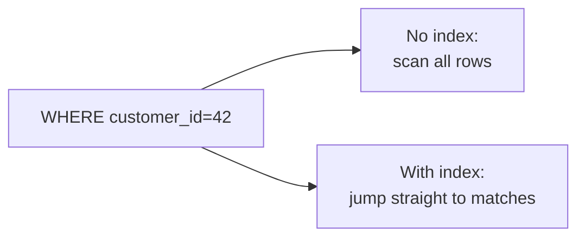
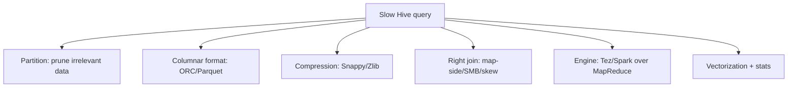
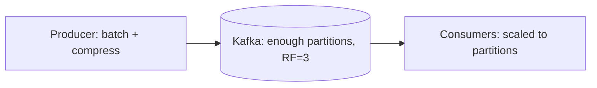
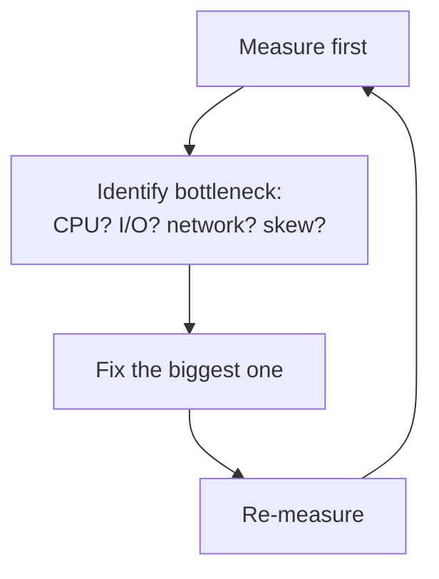

# Part 13 — Performance & Optimization

> Section goal: Make every layer fast and cost-efficient — SQL query optimization with indexes and EXPLAIN, Hive tuning (partitioning, file formats, compression, joins), and Kafka throughput tuning. These trade-off discussions impress interviewers.

Covers index items **13** (cross-cutting optimization across SQL, Hive, and Kafka).

---

## 1. SQL Query Optimization

### Indexes — the #1 SQL performance tool
An **index** is *a sorted lookup structure* (usually a B-tree) that lets the database find rows without scanning the whole table.

### 🔍 Plain-English deep-dive
- **Analogy:** the index at the back of a textbook. To find "ACID", you don't read every page — you jump via the index. Without it, the DB does a **full table scan** (reading every row).
- **Trade-off:** indexes speed up reads but slow down writes (each INSERT/UPDATE must also update the index) and use storage. Index columns used in `WHERE`, `JOIN`, and `ORDER BY` — not every column.

```sql
CREATE INDEX idx_customer ON orders(customer_id);   -- speeds WHERE customer_id = ?
CREATE INDEX idx_date ON orders(order_date);
-- Composite index (order matters: leftmost prefix rule)
CREATE INDEX idx_cust_date ON orders(customer_id, order_date);
```



### EXPLAIN — read the query plan
`EXPLAIN` shows *how* the database will execute a query, revealing full scans, index usage, and join order.
```sql
EXPLAIN SELECT * FROM orders WHERE customer_id = 42;
```
Look for:
| Sign | Meaning |
|------|---------|
| `type: ALL` | Full table scan (bad on big tables) |
| `type: ref/range` | Using an index (good) |
| `rows: large` | Many rows examined |
| `Using filesort` | Sorting without an index (consider indexing ORDER BY column) |
| `Using temporary` | Temp table created (often from GROUP BY) |

### Other SQL tips
- **SELECT only needed columns** — avoid `SELECT *` (less I/O).
- **Filter early** — push `WHERE` conditions to reduce rows before joins/aggregates.
- **Avoid functions on indexed columns** in WHERE (`WHERE YEAR(date)=2026` defeats the index; use a range instead).
- **Use appropriate joins** and ensure join keys are indexed.

> 💡 **Interview gold:** "A query is slow — how do you debug it?" → Run EXPLAIN, look for full scans, add/adjust indexes on filter/join columns, select fewer columns, and rewrite functions that block index use.

---

## 2. Hive Optimization

Recap and extend Part 9's tuning into a checklist.



### Key levers
- **Partition pruning** — partition by date/region so queries scan only relevant folders.
- **Columnar formats** — store as **ORC/Parquet** to read only needed columns + better compression.
- **Compression** — Snappy (fast, balanced) or Zlib/Gzip (smaller, slower). Reduces I/O and storage.
- **Join strategy** — map-side (broadcast small table), SMB (bucketed+sorted), skew-join for hot keys.
- **Execution engine** — use **Tez** or **Spark** instead of classic MapReduce for lower latency.
- **Vectorization** — `SET hive.vectorized.execution.enabled = true;` processes rows in batches of 1024 (faster CPU use).
- **Cost-Based Optimizer (CBO)** — gather column stats (`ANALYZE TABLE ... COMPUTE STATISTICS`) so Hive picks better plans.
- **Avoid small files** — many tiny files overwhelm the NameNode; compact them.

### 🔍 Plain-English deep-dive: compression trade-off
- **Snappy** — *fast compress/decompress, moderate size.* **Analogy:** a quick vacuum-pack — saves space without much effort. Default choice for ORC/Parquet.
- **Gzip/Zlib** — *smaller files, more CPU.* **Analogy:** carefully folding clothes tightly — takes longer but fits more. Good for cold/archival data.

| Codec | Speed | Ratio | Splittable | Use |
|-------|-------|-------|------------|-----|
| Snappy | Fast | Medium | Yes (in ORC/Parquet) | Default analytics |
| Gzip/Zlib | Slow | High | No (raw) | Archival/cold |
| LZO | Fast | Medium | Yes (indexed) | Legacy |

---

## 3. Kafka Optimization

### Producer throughput
- **Batching** — `batch.size` + `linger.ms`: group messages to send fewer, larger requests. **Analogy:** waiting to fill a delivery van rather than driving each parcel separately.
- **Compression** — `compression.type=snappy/lz4/zstd`: compress batches to cut network/storage.
- **acks trade-off** — `acks=all` (safe, slower) vs `acks=1` (faster, small risk). Tune to your durability need.

### Consumer throughput
- **Add partitions + consumers** — parallelism is capped by partition count (Part 10).
- **`max.poll.records`** — how many records per poll.
- **`fetch.min.bytes` / `fetch.max.wait.ms`** — batch fetches for efficiency.

### Cluster/topic design
- **Right partition count** — more partitions = more parallelism, but too many add overhead (more files, longer rebalances/leader elections).
- **Replication factor** ≥ 3 + `min.insync.replicas` = 2 for durability without halting on one failure.
- **Retention** — `retention.ms` / `retention.bytes`: how long data stays. Use **log compaction** for changelog topics.



> 💡 **Interview gold:** "How do you increase Kafka throughput?" → batch and compress on the producer, add partitions and matching consumers for parallelism, and tune fetch sizes — while balancing `acks`/replication for the durability you need.

---

## 4. General Optimization Mindset



- **Measure, don't guess** — use EXPLAIN, query profiles, Kafka lag metrics, YARN UI.
- **Reduce data read** — partitioning, columnar formats, projection, predicate pushdown.
- **Reduce data movement** — broadcast/map-side joins, data locality, compression.
- **Parallelize** — partitions/buckets, more consumers, more reducers.
- **Handle skew** — the one hot key/partition often dominates runtime.

> 💡 **Predicate pushdown** = pushing `WHERE` filters down to the storage layer (ORC/Parquet) so it skips reading non-matching row groups — a recurring optimization theme.

---

## 🧪 Lab 13 — Optimize Real Queries

### Exercise A — SQL: index impact
```sql
USE store_demo;  -- from Part 4
-- Big-ish table
CREATE TABLE big_orders (id INT, customer_id INT, amount DECIMAL(10,2), order_date DATE);
-- Insert many rows (use a loop/procedure or generated data)

EXPLAIN SELECT * FROM big_orders WHERE customer_id = 42;   -- note type: ALL (full scan)
CREATE INDEX idx_cust ON big_orders(customer_id);
EXPLAIN SELECT * FROM big_orders WHERE customer_id = 42;   -- now type: ref (uses index)
```
Compare the `type` and `rows` columns before/after.

### Exercise B — Hive: format & partition impact
```sql
-- Baseline: text, unpartitioned
SELECT category, SUM(amount) FROM sales_raw GROUP BY category;   -- scans everything

-- Optimized: ORC + partitioned (from Part 9)
SET hive.vectorized.execution.enabled = true;
SELECT category, SUM(amount) FROM sales_part
WHERE yr=2026 AND mo=1 GROUP BY category;   -- pruned + columnar + vectorized
```
Observe job runtime/data-read in the YARN/Hive logs.

### Exercise C — Kafka: producer batching
Set `linger.ms=20`, `batch.size=32768`, `compression.type=snappy` in producer config and compare throughput vs defaults using `kafka-producer-perf-test.sh`:
```bash
bin/kafka-producer-perf-test.sh --topic orders --num-records 100000 \
  --record-size 200 --throughput -1 \
  --producer-props bootstrap.servers=localhost:9092 \
  linger.ms=20 batch.size=32768 compression.type=snappy
```

✅ **Checkpoint:** You measured query plans with EXPLAIN, saw index/partition/format effects, and tuned Kafka producer batching. You can now reason about performance trade-offs across all three technologies.

---

## ⭐ Likely Interview Questions for This Section

**Q1. "What is an index and what's the trade-off?"**
> *Model answer:* An index is a sorted structure (often a B-tree) that lets the DB find rows without a full scan, speeding reads. The trade-off is slower writes (the index must be maintained) and extra storage, so you index columns used in WHERE/JOIN/ORDER BY.

**Q2. "A SQL query is slow — how do you optimize it?"**
> *Model answer:* Run EXPLAIN to find full scans or filesorts, add indexes on filter/join/sort columns, select only needed columns, avoid functions on indexed columns, filter early, and ensure good join order.

**Q3. "Why can a function in a WHERE clause hurt performance?"**
> *Model answer:* Wrapping an indexed column in a function (e.g., YEAR(date)=2026) prevents the optimizer from using the index, forcing a scan. Rewrite as a range (date BETWEEN '2026-01-01' AND '2026-12-31').

**Q4. "How do you optimize a slow Hive query?"**
> *Model answer:* Partition to prune data, store as ORC/Parquet with compression, choose the right join (map-side/SMB/skew), enable vectorization and CBO stats, use Tez/Spark over MapReduce, and avoid small files.

**Q5. "Snappy vs Gzip compression — when to use which?"**
> *Model answer:* Snappy is fast with moderate compression — good default for active analytics. Gzip/Zlib compresses more but is slower and CPU-heavy — good for cold/archival data.

**Q6. "How do you increase Kafka throughput?"**
> *Model answer:* Batch and compress on the producer (batch.size, linger.ms, compression.type), add partitions with matching consumers for parallelism, tune fetch sizes, and balance acks/replication for the required durability.

**Q7. "What is predicate pushdown?"**
> *Model answer:* Pushing filter conditions down to the storage layer so columnar formats like ORC/Parquet skip reading row groups that can't match, reducing I/O.

**Q8. "How does partition count affect Kafka?"**
> *Model answer:* More partitions increase parallelism (more consumers can work), but too many add overhead — more open files, longer rebalances and leader elections — so it must be balanced.

---

## 🧠 30-Second Memory Hooks
- **Index** = textbook back-index; fast reads, slower writes — index WHERE/JOIN/ORDER BY columns.
- **EXPLAIN** = the query's plan; `type: ALL` = bad full scan, `ref/range` = good index use.
- **No functions on indexed columns** in WHERE (use ranges).
- **Hive speed** = partition + ORC/Parquet + compression + right join + Tez/Spark + vectorization.
- **Snappy** = fast/balanced; **Gzip** = small/slow (cold data).
- **Kafka throughput** = batch + compress + more partitions/consumers.
- **Predicate pushdown** = filter at storage layer, skip non-matching data.
- **Always measure first**, fix the biggest bottleneck, re-measure.

---

*Next suggested section:* **Part 14 — Miscellaneous & Advanced Topics** (adjacent tools, modern trends, and the competitive landscape for extra interview edge).
