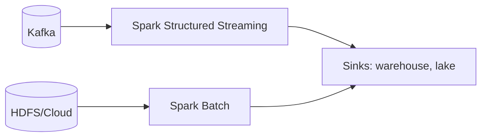
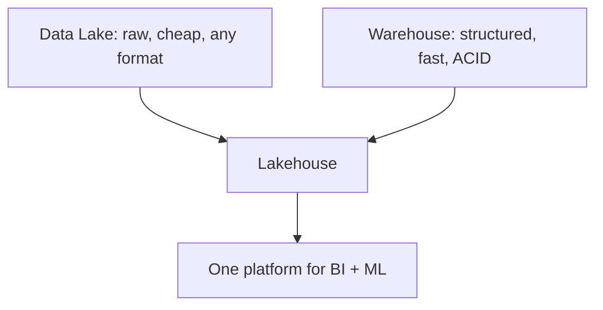
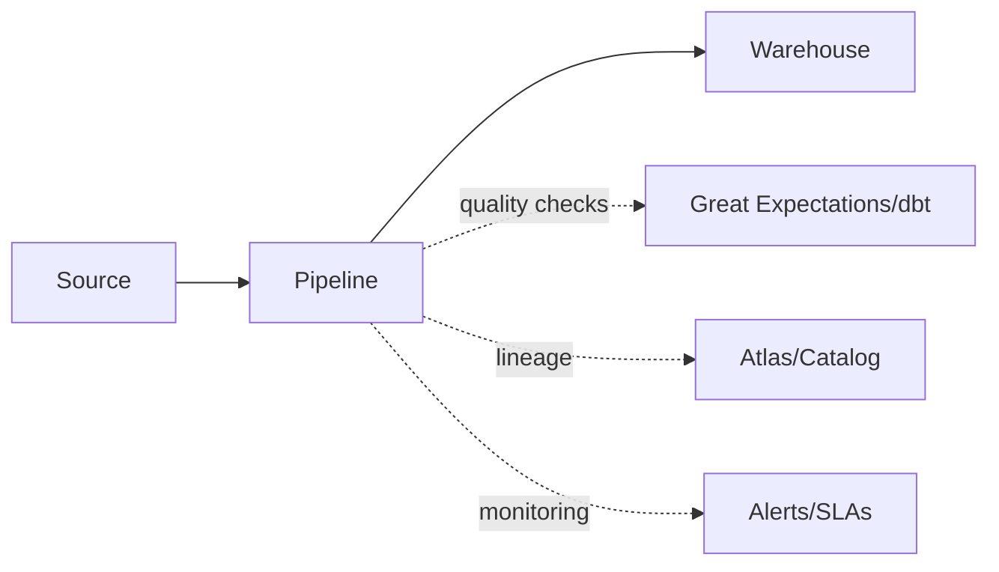

# Part 14 — Miscellaneous & Advanced Topics

> Section goal: Give you the "extra edge" — adjacent tools and modern trends every data engineer is expected to know about (Spark, Airflow, cloud warehouses, lakehouse formats), plus the competitive landscape and standards to discuss confidently.

Covers index items **14** (advanced/adjacent material and current trends across the stack).

---

## 1. Apache Spark — The Modern Compute Engine

**Spark** replaced raw MapReduce as the dominant big-data processing engine because it's far faster.

### 🔍 Plain-English deep-dive
- **Why faster:** MapReduce writes intermediate results to disk between steps; Spark keeps data **in memory** across steps. **Analogy:** MapReduce re-shelves the book after every chapter; Spark keeps it open on the desk. Up to 100× faster for iterative workloads.
- **Core abstractions:** RDD (low-level), and **DataFrame/Dataset** (table-like, optimized via the Catalyst optimizer).
- **Spark SQL** — run SQL on huge data (like Hive, but in-memory fast).
- **Spark Streaming / Structured Streaming** — process Kafka streams in micro-batches.



| | MapReduce | Spark |
|---|-----------|-------|
| Intermediate data | Disk | Memory |
| Speed | Slower | Up to 100× faster |
| API | Verbose Java | SQL, Python, Scala |
| Use today | Legacy | Default engine |

> 💡 **For you:** Hive (Parts 8–9) often runs *on* Spark today. Spark is the natural next skill after this curriculum.

---

## 2. Workflow Orchestration — Apache Airflow

Pipelines have many steps with dependencies that must run on schedule. **Airflow** orchestrates them.

### 🔍 Plain-English deep-dive
- A pipeline is modeled as a **DAG** (Directed Acyclic Graph) — *tasks with dependencies, no cycles.* **Analogy:** a recipe's step-by-step flowchart: chop → cook → plate, where each step waits for the prior.
- Airflow **schedules**, **retries** failures, **alerts**, and shows a UI of runs.


> 💡 Other orchestrators: **Prefect**, **Dagster**, **Luigi**. The DAG concept is universal.

---

## 3. Cloud Data Warehouses & Lakehouse

### Cloud warehouses
- **Snowflake**, **Google BigQuery**, **Amazon Redshift**, **Azure Synapse** — fully managed, separate storage from compute, scale elastically. They power modern **ELT** (Part 12).

### Data Lake vs Warehouse vs Lakehouse
- **Data lake** — *cheap raw storage of any format* (HDFS, S3). Flexible but can become a "data swamp" without governance.
- **Data warehouse** — *structured, curated, query-optimized.* Clean but rigid.
- **Lakehouse** — *combines both*: lake-cheap storage + warehouse-like reliability (ACID, schema) via table formats below.



### Modern table formats (the lakehouse enablers)
- **Apache Iceberg**, **Delta Lake**, **Apache Hudi** — bring **ACID transactions, time travel, schema evolution, and upserts** to data-lake files (Parquet/ORC). **Analogy:** they add a "database brain" on top of plain files in cloud storage.

| Format | Backed by | Strength |
|--------|-----------|----------|
| Delta Lake | Databricks | ACID, time travel, widely used with Spark |
| Apache Iceberg | Netflix/Apple | Open, engine-agnostic, hidden partitioning |
| Apache Hudi | Uber | Fast upserts/incremental, streaming-friendly |

> 💡 **Trend to mention:** "The industry is moving from Hadoop/Hive to cloud lakehouses using Spark + Iceberg/Delta on object storage (S3/GCS)." This shows you know where the field is heading.

---

## 4. The NoSQL Landscape (Recap & Extend)

| Type | Example | Best for |
|------|---------|----------|
| Document | MongoDB | Flexible JSON documents |
| Key-Value | Redis, DynamoDB | Caching, fast lookups |
| Wide-Column | Cassandra, HBase | Huge write-heavy, time-series |
| Graph | Neo4j | Relationships, social networks |

- **HBase** runs on HDFS for random real-time read/write (Hive is batch; HBase is low-latency).
- **Cassandra** is masterless, highly available, great for write-heavy global apps.

---

## 5. Data Governance, Quality & Observability

Modern data engineering isn't just moving data — it's keeping it **trustworthy** (the Veracity "V").
- **Data governance** — policies for access, privacy (GDPR), lineage. Tools: Apache Atlas, Unity Catalog.
- **Data quality** — automated checks (nulls, ranges, uniqueness). Tools: Great Expectations, dbt tests.
- **Data lineage** — tracking where data came from and how it transformed. **Analogy:** a paper trail / chain of custody.
- **Observability** — monitoring freshness, volume, schema drift, and lag (Kafka consumer lag, pipeline SLAs).



---

## 6. dbt & the Analytics Engineering Trend

- **dbt (data build tool)** — *transform data in the warehouse using SQL + software engineering practices* (version control, testing, documentation). It's the "T" in ELT. **Analogy:** bringing software discipline (Git, tests, CI) to SQL transformations.

---

## 7. Competitive Landscape Cheat Sheet

| Need | Tool(s) |
|------|---------|
| Relational DB | MySQL, PostgreSQL, Oracle |
| Distributed storage | HDFS, S3, GCS, ADLS |
| Batch SQL on big data | Hive, Spark SQL, Presto/Trino |
| Fast compute engine | Spark, Flink |
| Streaming | Kafka, Pulsar, Kinesis, Flink |
| Orchestration | Airflow, Dagster, Prefect |
| Cloud warehouse | Snowflake, BigQuery, Redshift |
| Lakehouse formats | Delta, Iceberg, Hudi |
| Transformation | dbt, Spark |
| NoSQL | MongoDB, Cassandra, Redis, HBase |

> 💡 **Interview move:** when asked "how would you build X today?", reference this modern stack (e.g., "Kafka → S3 → Spark + Iceberg → Snowflake, orchestrated by Airflow, tested with dbt").

---

## 🧪 Lab 14 — Explore the Modern Stack (Light, Optional)

### Exercise A — PySpark quickstart
```bash
pip install pyspark
```
```python
from pyspark.sql import SparkSession
spark = SparkSession.builder.appName("demo").getOrCreate()

df = spark.read.csv("sales.csv", header=True, inferSchema=True)
df.printSchema()
df.groupBy("category").sum("amount").show()       # Spark SQL-style aggregation
df.createOrReplaceTempView("sales")
spark.sql("SELECT category, SUM(amount) FROM sales GROUP BY category").show()
df.write.parquet("sales_out.parquet")             # write columnar
spark.stop()
```

### Exercise B — Sketch an Airflow DAG (conceptual)
```python
# Pseudocode of a daily pipeline DAG
extract >> load_to_hdfs >> hive_transform >> load_warehouse >> refresh_dashboard
```
Identify dependencies and where you'd add retries/alerts.

### Exercise C — Research task
Write 3 bullet points each on: Why companies migrate from Hadoop to cloud lakehouses; what Iceberg/Delta add over plain Parquet; and where Kafka fits in a lakehouse.

✅ **Checkpoint:** You can now discuss Spark, Airflow, cloud warehouses, lakehouse formats, governance, and dbt — the modern context around the core curriculum, giving you a clear edge.

---

## ⭐ Likely Interview Questions for This Section

**Q1. "Why did Spark largely replace MapReduce?"**
> *Model answer:* Spark keeps intermediate data in memory across stages instead of writing to disk each step, making it much faster (especially for iterative jobs), and offers friendlier APIs (SQL, Python, Scala) plus streaming.

**Q2. "What is Apache Airflow and a DAG?"**
> *Model answer:* Airflow is a workflow orchestrator. A DAG (Directed Acyclic Graph) models tasks and their dependencies with no cycles, so Airflow can schedule, run in order, retry failures, and alert.

**Q3. "Data lake vs data warehouse vs lakehouse?"**
> *Model answer:* A lake stores cheap raw data of any format but risks becoming ungoverned. A warehouse stores curated, query-optimized structured data. A lakehouse combines them — cheap lake storage with warehouse reliability (ACID, schema) via formats like Delta or Iceberg.

**Q4. "What do Delta Lake / Iceberg / Hudi add over plain Parquet?"**
> *Model answer:* ACID transactions, time travel (querying past versions), schema evolution, and efficient upserts/deletes on top of columnar files in object storage — turning a lake into a reliable lakehouse.

**Q5. "When would you use HBase vs Hive?"**
> *Model answer:* Hive is for batch analytical queries over large datasets; HBase is for low-latency random reads/writes on individual rows. They serve OLAP vs near-real-time access respectively.

**Q6. "What is dbt and where does it fit?"**
> *Model answer:* dbt is a transformation tool that applies software engineering practices (version control, testing, documentation) to SQL transformations in the warehouse — the 'T' in ELT.

**Q7. "What is data lineage and why does it matter?"**
> *Model answer:* Lineage tracks where data originates and how it's transformed across the pipeline, enabling debugging, impact analysis, compliance, and trust in the data.

**Q8. "How would you design a modern data platform today?"**
> *Model answer:* Ingest with Kafka, land raw in object storage (S3/GCS), process with Spark using a lakehouse format (Iceberg/Delta), serve via a cloud warehouse (Snowflake/BigQuery), orchestrate with Airflow, transform/test with dbt, and monitor quality and lineage.

---

## 🧠 30-Second Memory Hooks
- **Spark** = in-memory MapReduce successor (up to 100× faster); Spark SQL + Structured Streaming.
- **Airflow** = orchestrator; pipelines are **DAGs** (tasks + dependencies, no cycles).
- **Lake** = raw/cheap; **Warehouse** = curated/fast; **Lakehouse** = both (Delta/Iceberg/Hudi add ACID + time travel).
- **HBase** = real-time random access on HDFS; **Hive** = batch analytics.
- **dbt** = software discipline for SQL transforms (the T in ELT).
- **Modern stack one-liner:** Kafka → object storage → Spark + Iceberg → Snowflake, orchestrated by Airflow.

---

*Next suggested section:* **Part 15 — Interview Question Bank** (100+ questions across all topics to test and cement your knowledge).
