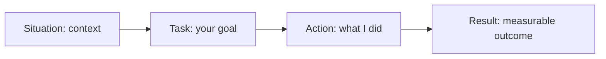
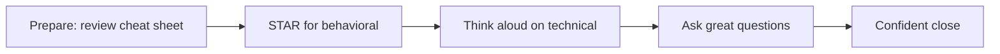

# Part 16 — Behavioral & Closing Prep

> Section goal: Turn technical knowledge into a confident, well-rounded interview performance — the STAR method, ready-to-adapt stories, translating your background into competencies, "why" answers, smart questions to ask, and a one-page night-before cheat sheet.

Covers index items **16** (behavioral interview + closing).

---

## 1. The STAR Method

Behavioral questions ("Tell me about a time...") are best answered with **STAR** — a structure that keeps you concise and impactful.

### 🔍 Plain-English deep-dive
- **S — Situation** — *set the scene briefly.* Where, when, what context.
- **T — Task** — *your specific responsibility/goal.*
- **A — Action** — *what YOU did* (use "I", not "we"). The longest part.
- **R — Result** — *the outcome, ideally quantified* (%, time saved, scale).

> 💡 **Golden rules:** keep S+T short (~20%), make A the focus (~60%), end with a strong R (~20%). Always quantify the Result.

---

## 2. Background → Competency Translation

Map whatever you've done (projects, coursework, prior work, this curriculum's labs) into the competencies interviewers want.

| Your experience | Demonstrates | How to phrase it |
|-----------------|--------------|------------------|
| Built the SQL labs/schemas | Data modeling, SQL proficiency | "I designed normalized schemas with constraints and wrote analytical queries using window functions and CTEs." |
| Hadoop/Hive labs on Dataproc | Distributed systems, cloud | "I provisioned a Hadoop cluster on GCP and built partitioned ORC Hive tables, cutting scan volume dramatically." |
| Kafka producer/consumer labs | Streaming, real-time data | "I built producers/consumers with consumer groups and managed offsets and schema evolution via a Schema Registry." |
| The capstone project | End-to-end ownership | "I delivered an end-to-end pipeline from streaming ingestion through a star-schema warehouse with SCD2 history." |
| Debugging a slow query | Optimization, analysis | "I used EXPLAIN to find a full scan and added a composite index, reducing runtime significantly." |
| Self-learning this stack | Growth mindset | "I systematically learned SQL, Hadoop, Hive, and Kafka with hands-on labs and a capstone." |

> 💡 **For you (beginner→advanced):** even self-built lab/capstone projects are legitimate STAR material. Frame them as real problems you solved with measurable outcomes (e.g., "converting CSV to partitioned ORC cut query data read by ~90%").

---

## 3. Three Ready-to-Adapt STAR Stories

Customize these with your own specifics.

### Story A — Optimizing a slow query/pipeline
- **S:** A reporting query over a large sales table took minutes, blocking a dashboard.
- **T:** I had to bring it under acceptable latency without changing the report.
- **A:** I ran EXPLAIN and found a full table scan and a filesort. I added a composite index on the filter+sort columns, rewrote a `YEAR(date)=...` predicate into a date range to restore index use, and limited selected columns. In Hive, I partitioned by date and stored as ORC with Snappy compression.
- **R:** Query data read dropped by ~90% and runtime fell from minutes to seconds; the dashboard became responsive.

### Story B — Handling a data quality / pipeline incident
- **S:** A nightly load silently produced inflated revenue numbers.
- **T:** I had to find the root cause and prevent recurrence.
- **A:** I traced lineage upstream, found duplicate events from an at-least-once consumer reprocessing after a crash. I introduced idempotent upserts keyed on event ID and added automated data-quality checks (uniqueness, row-count thresholds) that fail the pipeline and alert.
- **R:** Eliminated duplicates, restored accurate reporting, and the new checks caught two later issues before they reached stakeholders.

### Story C — Learning a new technology under pressure
- **S:** A project needed real-time streaming, which I hadn't used in production.
- **T:** I had to deliver a working Kafka pipeline quickly.
- **A:** I learned Kafka's architecture (topics, partitions, consumer groups, offsets), built a proof-of-concept with a Schema Registry for safe evolution, and validated delivery semantics with deliberate failure tests.
- **R:** Delivered an at-least-once pipeline with schema governance on time; it became the template the team reused.

---

## 4. "Why" / Closing Answers

### Why this data engineering role?
> *Framework:* genuine interest + relevant skills + value you'll add. "I enjoy turning messy, large-scale data into reliable, usable insight. I've built end-to-end skills across SQL, Hadoop/Hive, and Kafka, and I want to apply them to [company's data challenge]."

### Why this company?
> *Framework:* specific research + alignment. Reference their products, data scale, or tech stack. "Your scale of [X] data and use of [tech] is exactly the kind of problem I've prepared for; I'm excited to contribute to [specific team/goal]."

### Why should we hire you?
> *Framework:* match top 2–3 requirements + a differentiator. "I combine solid SQL and distributed-systems fundamentals with hands-on pipeline experience, and I learn fast — I built this entire stack end-to-end including an optimization-focused capstone."

### Where are you growing?
> *Framework:* honest + proactive. "I'm deepening Spark and lakehouse formats (Iceberg/Delta) and orchestration with Airflow to round out my batch+streaming skills."

---

## 5. Smart Questions to Ask the Interviewer

Always ask 2–3. It signals engagement.

**About the role/team:**
- What does the data platform/stack look like today, and what's changing?
- What are the biggest data challenges the team is tackling this year?
- How is success measured for this role in the first 6–12 months?

**About engineering culture:**
- How do you handle data quality and pipeline reliability/on-call?
- Batch vs streaming — where is the team investing?
- How do data engineers collaborate with analysts/data scientists?

**Growth:**
- What learning/growth opportunities exist for engineers here?

> 💡 **Avoid** asking only about salary/leave in the first round; lead with role and impact.

---

## 6. One-Page Night-Before Cheat Sheet

**Core definitions to nail aloud:**
- **ACID** = Atomicity, Consistency, Isolation, Durability (bank transfer story).
- **SQL execution order** = FROM→WHERE→GROUP BY→HAVING→SELECT→ORDER BY→LIMIT.
- **Window functions** = keep all rows + add computed col; 2nd-highest = DENSE_RANK.
- **5 V's** = Volume, Velocity, Variety, Veracity, Value.
- **HDFS** = NameNode (metadata) + DataNodes (128MB blocks, 3× replication).
- **MapReduce** = Map → Shuffle/Sort → Reduce.
- **YARN** = ResourceManager + NodeManager + ApplicationMaster + containers.
- **Hive internal vs external** = DROP deletes data vs keeps data.
- **Partition** (folders, low cardinality) vs **bucket** (hash files, high cardinality).
- **Kafka** = brokers/topics/partitions; ordering per-partition; consumer groups split partitions.
- **Kafka durability** = RF≥3, acks=all, min.insync.replicas≥2.
- **Schema Registry** = versioned schemas; add optional fields with defaults.
- **ETL vs ELT**; **star vs snowflake**; **SCD2** = new versioned row with dates/flag.
- **Optimization** = index/EXPLAIN; partition+ORC+compression; map-side/SMB/skew joins; predicate pushdown.

**Mindset checklist:**
- [ ] Speak answers **aloud**; structure behavioral ones with **STAR**.
- [ ] Quantify results; say "I" for your actions.
- [ ] If stuck, **think aloud** and state assumptions — reasoning matters.
- [ ] Have **2–3 questions** ready to ask.
- [ ] Rest well; bring water, a notepad, and your STAR stories.

---

## ⭐ Likely Behavioral Questions + Approach

**Q1. "Tell me about a challenging data problem you solved."**
> Use Story A or B; emphasize diagnosis (EXPLAIN/lineage), your specific actions, and a quantified result.

**Q2. "Describe a time you improved performance."**
> Story A; name concrete levers (index, partition, ORC, compression) and the before/after metric.

**Q3. "How do you handle a production data incident?"**
> Story B; show calm triage: detect → trace lineage → root cause → fix → add checks/monitoring to prevent recurrence.

**Q4. "Tell me about learning something new quickly."**
> Story C; show a structured approach and a delivered outcome.

**Q5. "Describe a disagreement or difficult stakeholder."**
> Show you clarified requirements, communicated trade-offs (e.g., latency vs cost, batch vs streaming), and reached an aligned decision.

**Q6. "Tell me about a mistake you made."**
> Be honest, show ownership, what you learned, and the safeguard you added — never blame others.

---

## 🧠 30-Second Memory Hooks
- **STAR** = Situation, Task, Action (60%), Result (quantify!).
- Say **"I"** for actions; lead with the **result**.
- **Why role/company/you** = interest + matched skills + specific research.
- **Always ask 2–3 questions** — role, challenges, success metrics.
- **Think aloud** when stuck — reasoning > silence.
- Your **labs + capstone are valid STAR stories** — frame as real problems with measurable wins.

---

*Next suggested section:* **Final Capstone Project** — build the full end-to-end pipeline that ties SQL, Hadoop/Hive, and Kafka together (your portfolio centerpiece and STAR story source).
