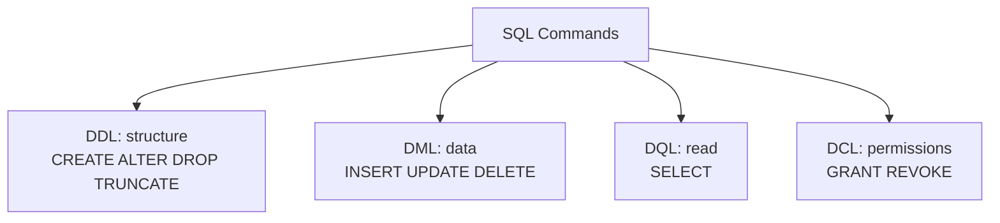
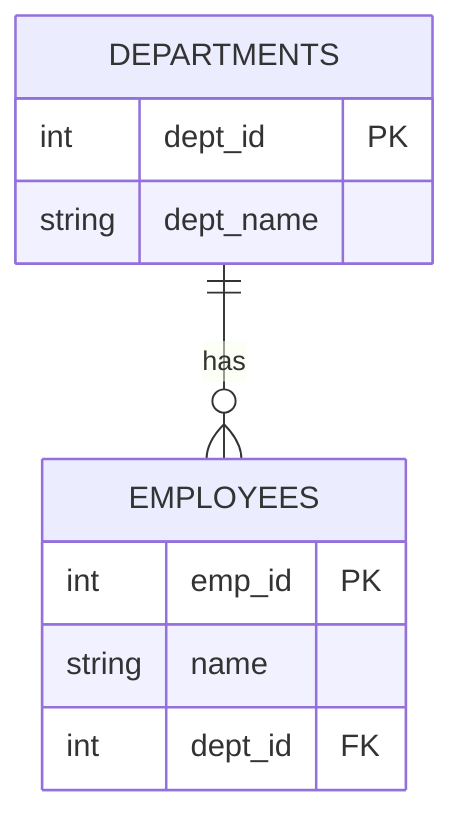
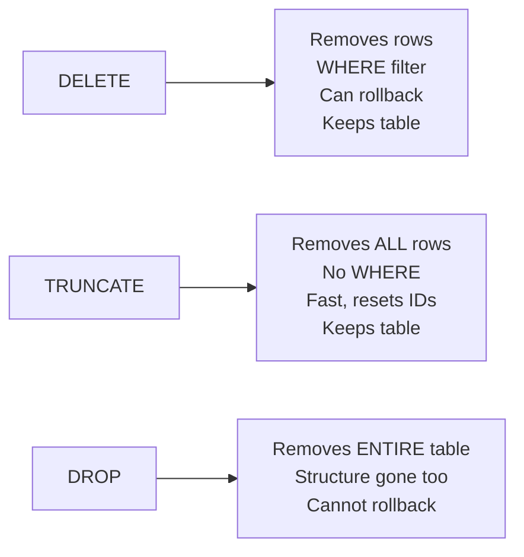

# Part 2 — SQL Essentials: DDL & DML

> Section goal: Learn the SQL command families and how to **create** database structures (DDL) and **fill/modify** them with data (DML), including the integrity constraints that keep data trustworthy.

Covers index items **2** (Module 1, Class 1–2: CREATE, INSERT, constraints, ALTER, DROP/TRUNCATE/DELETE, keys, AUTO_INCREMENT).

---

## 1. The Four SQL Command Families

SQL commands fall into four groups. Knowing which group a command belongs to is a classic interview question.

### 🔍 Plain-English deep-dive: DDL, DML, DQL, DCL
- **DDL — Data Definition Language** — *defines the structure* (tables, columns). **Analogy:** an architect drawing the blueprint of a house. Commands: `CREATE`, `ALTER`, `DROP`, `TRUNCATE`.
- **DML — Data Manipulation Language** — *changes the data inside.* **Analogy:** moving furniture in and out of the house. Commands: `INSERT`, `UPDATE`, `DELETE`.
- **DQL — Data Query Language** — *reads data.* **Analogy:** looking through the windows to see what's inside. Command: `SELECT`.
- **DCL — Data Control Language** — *controls permissions.* **Analogy:** handing out house keys. Commands: `GRANT`, `REVOKE`.



| Family | Purpose | Commands | Auto-commit? |
|--------|---------|----------|--------------|
| DDL | Define structure | CREATE, ALTER, DROP, TRUNCATE | Yes (implicit commit) |
| DML | Modify data | INSERT, UPDATE, DELETE | No (can rollback) |
| DQL | Read data | SELECT | N/A |
| DCL | Control access | GRANT, REVOKE | Yes |

> 💡 **Interview tip:** "Is TRUNCATE a DDL or DML command?" → **DDL**. This trips people up because it removes data, but it operates on the table *structure* (resets it) and can't be rolled back like DELETE.

---

## 2. CREATE — Defining Tables

The `CREATE TABLE` command defines a table's columns and their **data types**.

```sql
CREATE TABLE employees (
    emp_id      INT PRIMARY KEY,
    first_name  VARCHAR(50) NOT NULL,
    email       VARCHAR(100) UNIQUE,
    salary      DECIMAL(10,2),
    hire_date   DATE,
    dept_id     INT
);
```

### Common data types
| Type | Stores | Example |
|------|--------|---------|
| `INT` | Whole numbers | 42 |
| `DECIMAL(p,s)` | Exact decimals (money) | 1234.56 |
| `VARCHAR(n)` | Variable-length text | 'Asha' |
| `CHAR(n)` | Fixed-length text | 'IN' |
| `DATE` / `DATETIME` | Dates / timestamps | 2026-06-11 |
| `BOOLEAN` | True/false | TRUE |
| `TEXT` | Large text | long notes |

> 💡 **Money tip:** Never store money as `FLOAT` — floating point causes rounding errors (₹0.1 + ₹0.2 ≠ ₹0.3). Always use `DECIMAL`.

---

## 3. Integrity Constraints — Rules That Protect Data

A **constraint** is *a rule the database enforces automatically* so bad data can never enter.

### 🔍 Plain-English deep-dive: the six core constraints
- **PRIMARY KEY** — *unique + not null; identifies each row.* **Analogy:** passport number.
- **FOREIGN KEY** — *must match a primary key in another table.* **Analogy:** a reference to someone else's passport — you can't reference a person who doesn't exist.
- **NOT NULL** — *value is required.* **Analogy:** a form field marked with a red asterisk.
- **UNIQUE** — *no duplicates allowed* (but can be null). **Analogy:** usernames — two people can't pick the same one.
- **CHECK** — *value must satisfy a condition.* **Analogy:** "age must be ≥ 18".
- **DEFAULT** — *fills a value if none given.* **Analogy:** a form pre-filled with "Country: India".

```sql
CREATE TABLE students (
    student_id  INT PRIMARY KEY,
    name        VARCHAR(50) NOT NULL,
    email       VARCHAR(100) UNIQUE,
    age         INT CHECK (age >= 18),
    country     VARCHAR(30) DEFAULT 'India',
    dept_id     INT,
    FOREIGN KEY (dept_id) REFERENCES departments(dept_id)
);
```

| Constraint | Prevents | Allows NULL? |
|------------|----------|--------------|
| PRIMARY KEY | Duplicates & nulls | No |
| FOREIGN KEY | Orphan references | Yes (unless also NOT NULL) |
| NOT NULL | Missing values | No |
| UNIQUE | Duplicate values | Yes (one null usually) |
| CHECK | Invalid values | Depends |
| DEFAULT | Missing values (auto-fills) | — |

---

## 4. Referential Integrity & Primary vs Foreign Keys

**Referential integrity** means *every foreign key value must point to a row that actually exists* (or be null). It prevents "orphan" records.



If you try to insert an employee with `dept_id = 99` but no department 99 exists, the database **rejects** it. Likewise, if you delete a department that still has employees, the database blocks it (or cascades, depending on rules).

| Primary Key | Foreign Key |
|-------------|-------------|
| Uniquely identifies a row | References a PK in another table |
| Cannot be NULL | Can be NULL |
| One per table | Can have many per table |
| Enforces entity integrity | Enforces referential integrity |

---

## 5. AUTO_INCREMENT — Automatic IDs

Manually assigning IDs is error-prone. `AUTO_INCREMENT` makes MySQL generate the next number automatically.

```sql
CREATE TABLE products (
    product_id  INT PRIMARY KEY AUTO_INCREMENT,
    name        VARCHAR(50),
    price       DECIMAL(8,2)
);

INSERT INTO products (name, price) VALUES ('Pen', 10.00);   -- gets id 1
INSERT INTO products (name, price) VALUES ('Notebook', 50); -- gets id 2
```

> 💡 **Analogy:** a deli ticket dispenser — each customer pulls the next number automatically; no two get the same.

---

## 6. INSERT — Adding Data

```sql
-- Single row, all columns in order
INSERT INTO employees VALUES (1, 'Asha', 'asha@co.com', 60000, '2024-01-15', 10);

-- Specify columns (recommended — order-independent, safer)
INSERT INTO employees (emp_id, first_name, salary)
VALUES (2, 'Ravi', 55000);

-- Multiple rows at once (efficient)
INSERT INTO employees (emp_id, first_name, salary) VALUES
    (3, 'Meera', 70000),
    (4, 'Karan', 48000);
```

---

## 7. ALTER — Changing Structure

`ALTER TABLE` modifies an existing table's structure.

```sql
ALTER TABLE employees ADD COLUMN phone VARCHAR(15);          -- add column
ALTER TABLE employees MODIFY COLUMN salary DECIMAL(12,2);    -- change type
ALTER TABLE employees CHANGE first_name fname VARCHAR(50);   -- rename column
ALTER TABLE employees DROP COLUMN phone;                     -- remove column
ALTER TABLE employees ADD CONSTRAINT chk_sal CHECK (salary > 0);
```

---

## 8. DROP vs TRUNCATE vs DELETE — The Classic Interview Trio

These all "remove" things but are crucially different.



| Feature | DELETE | TRUNCATE | DROP |
|---------|--------|----------|------|
| Removes | Selected rows | All rows | Entire table + structure |
| WHERE clause | Yes | No | No |
| Rollback possible | Yes (DML) | No (DDL) | No (DDL) |
| Resets AUTO_INCREMENT | No | Yes | N/A |
| Speed | Slower (row by row) | Fast | Fast |
| Triggers fire | Yes | No | No |

```sql
DELETE FROM employees WHERE emp_id = 4;   -- one row, recoverable
TRUNCATE TABLE employees;                  -- all rows, fast, ids reset
DROP TABLE employees;                      -- table is gone entirely
```

> 💡 **Interview gold:** "DELETE without WHERE vs TRUNCATE?" → Both empty the table, but DELETE logs each row and can roll back; TRUNCATE deallocates pages, is faster, resets IDs, but can't roll back.

---

## 🧪 Lab 2 — Build a Mini HR Schema

**Goal:** Create related tables with constraints, insert data, alter structure, and observe referential integrity.

```sql
CREATE DATABASE hr_demo;
USE hr_demo;

-- Parent table
CREATE TABLE departments (
    dept_id   INT PRIMARY KEY AUTO_INCREMENT,
    dept_name VARCHAR(50) NOT NULL UNIQUE
);

-- Child table with a foreign key
CREATE TABLE employees (
    emp_id    INT PRIMARY KEY AUTO_INCREMENT,
    name      VARCHAR(50) NOT NULL,
    email     VARCHAR(100) UNIQUE,
    salary    DECIMAL(10,2) CHECK (salary > 0),
    country   VARCHAR(30) DEFAULT 'India',
    dept_id   INT,
    FOREIGN KEY (dept_id) REFERENCES departments(dept_id)
);

-- Insert departments
INSERT INTO departments (dept_name) VALUES ('Engineering'), ('Finance'), ('HR');

-- Insert employees
INSERT INTO employees (name, email, salary, dept_id) VALUES
    ('Asha', 'asha@co.com', 80000, 1),
    ('Ravi', 'ravi@co.com', 60000, 2),
    ('Meera','meera@co.com',90000, 1);

SELECT * FROM employees;
```

### Now test the rules (each should FAIL — that's the point):
```sql
-- 1. Referential integrity: dept 99 doesn't exist
INSERT INTO employees (name, salary, dept_id) VALUES ('Ghost', 50000, 99);  -- ERROR

-- 2. CHECK constraint: salary must be > 0
INSERT INTO employees (name, salary, dept_id) VALUES ('Bad', -100, 1);      -- ERROR

-- 3. UNIQUE: duplicate email
INSERT INTO employees (name, email, salary, dept_id)
VALUES ('Dup', 'asha@co.com', 50000, 1);                                    -- ERROR

-- 4. NOT NULL: missing name
INSERT INTO employees (salary, dept_id) VALUES (50000, 1);                  -- ERROR
```

### Alter and clean up:
```sql
ALTER TABLE employees ADD COLUMN hire_date DATE;
UPDATE employees SET hire_date = '2024-01-01' WHERE emp_id = 1;
DELETE FROM employees WHERE name = 'Ravi';   -- recoverable
SELECT * FROM employees;
```

✅ **Checkpoint:** You built a two-table schema, watched four constraints reject bad data, and altered a live table. This is the bread-and-butter of data modeling.

---

## ⭐ Likely Interview Questions for This Section

**Q1. "What are DDL, DML, DQL, and DCL?"**
> *Model answer:* DDL defines structure (CREATE, ALTER, DROP, TRUNCATE); DML modifies data (INSERT, UPDATE, DELETE); DQL reads data (SELECT); DCL controls permissions (GRANT, REVOKE).

**Q2. "What is the difference between DELETE, TRUNCATE, and DROP?"**
> *Model answer:* DELETE removes specific rows with a WHERE clause and can be rolled back. TRUNCATE removes all rows quickly, resets AUTO_INCREMENT, and can't be rolled back. DROP removes the entire table including its structure.

**Q3. "Is TRUNCATE a DDL or DML command? Why?"**
> *Model answer:* DDL. Although it removes data, it works at the structural level by deallocating the table's data pages and resetting it, executes an implicit commit, and cannot be rolled back like DML's DELETE.

**Q4. "What is referential integrity?"**
> *Model answer:* It's the guarantee that every foreign key value references an existing primary key (or is null), preventing orphan records. The database enforces it on inserts, updates, and deletes.

**Q5. "Difference between a UNIQUE constraint and a PRIMARY KEY?"**
> *Model answer:* A primary key is unique AND not null, and there's only one per table. A UNIQUE constraint also prevents duplicates but allows nulls and you can have several per table.

**Q6. "Why use AUTO_INCREMENT?"**
> *Model answer:* It auto-generates a unique sequential identifier for each new row, removing the risk of manual ID collisions and simplifying inserts.

**Q7. "Why shouldn't you store money in a FLOAT column?"**
> *Model answer:* FLOAT is approximate and causes rounding errors. Money needs exact arithmetic, so use DECIMAL with a fixed scale.

---

## 🧠 30-Second Memory Hooks
- **DDL** = blueprint (structure), **DML** = furniture (data), **DQL** = window (read), **DCL** = keys (access).
- **DELETE** = surgical + reversible; **TRUNCATE** = wipe + fast + irreversible; **DROP** = demolish the table.
- **TRUNCATE is DDL** (resets, no rollback).
- **PK** = unique + not null + one per table; **UNIQUE** = no dupes but nulls OK, many allowed.
- **AUTO_INCREMENT** = deli ticket dispenser.
- **Money = DECIMAL, never FLOAT.**

---

*Next suggested section:* **Part 3 — SQL Queries & Data Retrieval** (you can build and fill tables; now learn to *ask questions* of the data with SELECT).
