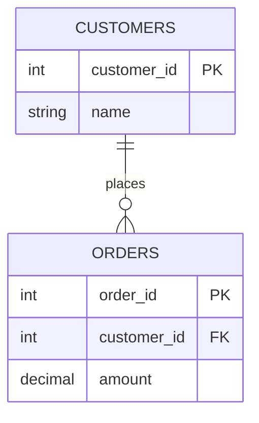
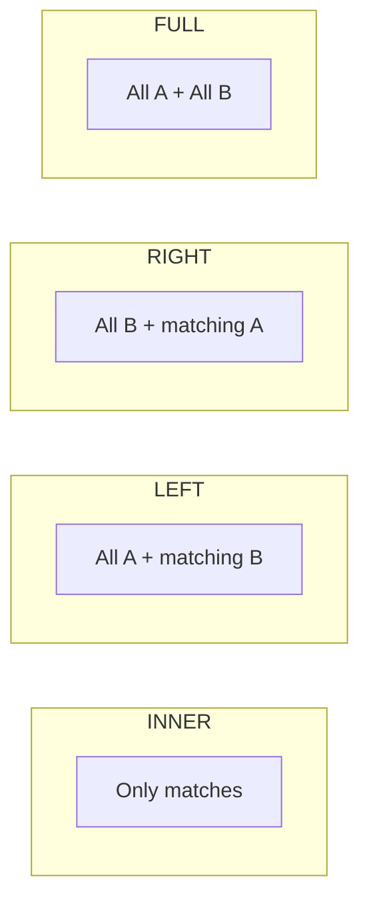
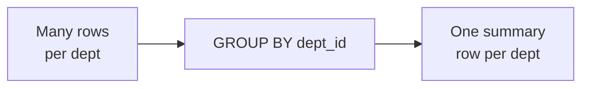

# Part 4 — SQL Advanced: Joins & Subqueries

> Section goal: Learn to combine data across multiple tables with every type of JOIN, and to nest queries with subqueries, IN/NOT IN, EXISTS/NOT EXISTS, and GROUP BY/HAVING — the skills that separate beginners from real analysts.

Covers index items **4** (Module 1, Class 3: GROUP BY, HAVING, GROUP_CONCAT, ROLLUP, subqueries, IN/NOT IN, CASE-WHEN, SQL Joins, EXISTS/NOT EXISTS).

---

## 1. Why Joins? The Core Idea

Relational databases split data across tables to avoid duplication (Part 1). A **JOIN** stitches them back together for a query.

**Example tables:**


To answer "which customer placed each order?", you JOIN `orders` to `customers` on the matching `customer_id`.

---

## 2. Types of Joins

### 🔍 Plain-English deep-dive: the four main joins
Imagine two overlapping circles (a Venn diagram): left circle = table A, right = table B, overlap = matching rows.

- **INNER JOIN** — *only matching rows* (the overlap). **Analogy:** guests on *both* the invite list and the RSVP list.
- **LEFT JOIN** — *all of A, plus matches from B* (nulls where no match). **Analogy:** everyone invited, with their RSVP if they replied.
- **RIGHT JOIN** — *all of B, plus matches from A.* **Analogy:** everyone who RSVP'd, even if not formally invited.
- **FULL OUTER JOIN** — *everything from both sides.* **Analogy:** the complete combined list. (MySQL lacks it natively — emulate with UNION.)



| Join | Returns | NULLs appear for |
|------|---------|------------------|
| INNER | Rows matching in both | Never |
| LEFT | All left + matched right | Unmatched right columns |
| RIGHT | All right + matched left | Unmatched left columns |
| FULL OUTER | All rows from both | Both unmatched sides |
| CROSS | Every combination (A×B) | N/A |
| SELF | Table joined to itself | Depends |

### Syntax
```sql
-- INNER JOIN: orders with their customer name
SELECT o.order_id, c.name, o.amount
FROM orders o
INNER JOIN customers c ON o.customer_id = c.customer_id;

-- LEFT JOIN: all customers, even those with no orders
SELECT c.name, o.order_id
FROM customers c
LEFT JOIN orders o ON c.customer_id = o.customer_id;

-- Find customers with NO orders (LEFT JOIN + IS NULL trick)
SELECT c.name
FROM customers c
LEFT JOIN orders o ON c.customer_id = o.customer_id
WHERE o.order_id IS NULL;
```

### SELF JOIN — a table joined to itself
Useful for hierarchies (employee → manager, both in the same table).
```sql
SELECT e.name AS employee, m.name AS manager
FROM employees e
LEFT JOIN employees m ON e.manager_id = m.emp_id;
```

### CROSS JOIN — every combination
```sql
SELECT s.size, c.color
FROM sizes s CROSS JOIN colors c;   -- all size×color pairs
```

---

## 3. GROUP BY & Aggregation

`GROUP BY` collapses rows that share a value into one summary row.

```sql
SELECT dept_id, COUNT(*) AS headcount, AVG(salary) AS avg_sal
FROM employees
GROUP BY dept_id;
```



### HAVING — filter groups
`WHERE` filters rows *before* grouping; `HAVING` filters groups *after*.
```sql
SELECT dept_id, AVG(salary) AS avg_sal
FROM employees
WHERE salary > 0                 -- row filter (before grouping)
GROUP BY dept_id
HAVING AVG(salary) > 60000;      -- group filter (after grouping)
```

### GROUP_CONCAT — combine group values into one string
```sql
SELECT dept_id, GROUP_CONCAT(name SEPARATOR ', ') AS team
FROM employees
GROUP BY dept_id;
-- dept 1 → "Asha, Meera"
```

### ROLLUP — subtotals + grand total
```sql
SELECT category, SUM(amount) AS total
FROM sales
GROUP BY category WITH ROLLUP;   -- adds a final NULL-category grand-total row
```

> 💡 **Analogy:** ROLLUP is the "Total" line at the bottom of a receipt after the per-category subtotals.

---

## 4. CASE-WHEN — Conditional Logic in SQL

`CASE` is SQL's if/else. It lets you create computed labels.

```sql
SELECT name, salary,
    CASE
        WHEN salary >= 80000 THEN 'High'
        WHEN salary >= 50000 THEN 'Medium'
        ELSE 'Low'
    END AS pay_band
FROM employees;
```

> 💡 **Pivot trick:** combine CASE with SUM to pivot rows into columns:
```sql
SELECT
    SUM(CASE WHEN category='Electronics' THEN amount ELSE 0 END) AS electronics,
    SUM(CASE WHEN category='Furniture'   THEN amount ELSE 0 END) AS furniture
FROM sales;
```

---

## 5. Subqueries (Nested Queries)

A **subquery** is a query inside another query. The inner query runs first and feeds the outer one.

### 🔍 Plain-English deep-dive: types of subqueries
- **Scalar subquery** — *returns one value.* Example: employees earning above the company average.
- **Multi-row subquery** — *returns a list*, used with IN. 
- **Correlated subquery** — *references the outer query*, re-running per outer row. **Analogy:** checking each student's grade against *their own* class average.

```sql
-- Scalar: above-average earners
SELECT name, salary FROM employees
WHERE salary > (SELECT AVG(salary) FROM employees);

-- Multi-row with IN: employees in depts located in 'Bangalore'
SELECT name FROM employees
WHERE dept_id IN (SELECT dept_id FROM departments WHERE city = 'Bangalore');

-- Correlated: employees earning more than their dept's average
SELECT e.name, e.salary
FROM employees e
WHERE e.salary > (
    SELECT AVG(salary) FROM employees x WHERE x.dept_id = e.dept_id
);
```

---

## 6. IN vs NOT IN vs EXISTS vs NOT EXISTS

| Construct | Meaning | NULL caution |
|-----------|---------|--------------|
| `IN (list)` | Value matches any in list/subquery | OK |
| `NOT IN (list)` | Value matches none | ⚠️ breaks if list contains NULL |
| `EXISTS (subquery)` | True if subquery returns ≥1 row | NULL-safe |
| `NOT EXISTS (subquery)` | True if subquery returns 0 rows | NULL-safe |

```sql
-- Customers who HAVE placed orders (EXISTS)
SELECT c.name FROM customers c
WHERE EXISTS (SELECT 1 FROM orders o WHERE o.customer_id = c.customer_id);

-- Customers who have NOT placed orders (NOT EXISTS)
SELECT c.name FROM customers c
WHERE NOT EXISTS (SELECT 1 FROM orders o WHERE o.customer_id = c.customer_id);
```

### 🔍 Plain-English deep-dive: IN vs EXISTS performance & NULL trap
- **EXISTS** stops as soon as it finds one match — efficient for large correlated checks, and it's NULL-safe.
- **NOT IN** with a subquery that returns even one NULL yields *no rows at all* (a famous bug). Prefer **NOT EXISTS** for "find the missing ones".

> 💡 **Interview gold:** "Why might NOT IN return nothing?" → because if the subquery contains a NULL, the comparison becomes UNKNOWN for all rows. NOT EXISTS avoids this.

---

## 🧪 Lab 4 — Multi-Table Analysis

```sql
CREATE DATABASE store_demo;
USE store_demo;

CREATE TABLE customers (
    customer_id INT PRIMARY KEY AUTO_INCREMENT,
    name VARCHAR(50), city VARCHAR(30)
);
CREATE TABLE orders (
    order_id INT PRIMARY KEY AUTO_INCREMENT,
    customer_id INT,
    amount DECIMAL(10,2),
    FOREIGN KEY (customer_id) REFERENCES customers(customer_id)
);

INSERT INTO customers (name, city) VALUES
('Asha','Bangalore'),('Ravi','Delhi'),('Meera','Bangalore'),('Karan','Mumbai');

INSERT INTO orders (customer_id, amount) VALUES
(1, 500),(1, 1500),(2, 800),(3, 2000),(3, 300);
-- Note: Karan (4) has NO orders
```

### Tasks:
```sql
-- 1. INNER JOIN: each order with the customer name
SELECT o.order_id, c.name, o.amount
FROM orders o JOIN customers c ON o.customer_id = c.customer_id;

-- 2. LEFT JOIN: all customers + their total spend (Karan shows 0/NULL)
SELECT c.name, COALESCE(SUM(o.amount),0) AS total_spent
FROM customers c
LEFT JOIN orders o ON c.customer_id = o.customer_id
GROUP BY c.name;

-- 3. Customers with NO orders
SELECT c.name FROM customers c
WHERE NOT EXISTS (SELECT 1 FROM orders o WHERE o.customer_id = c.customer_id);

-- 4. Customers spending above the average customer total (subquery)
SELECT name, total FROM (
    SELECT c.name, SUM(o.amount) AS total
    FROM customers c JOIN orders o ON c.customer_id=o.customer_id
    GROUP BY c.name
) t
WHERE total > (SELECT AVG(amount) FROM orders);

-- 5. Label orders by size with CASE
SELECT order_id, amount,
    CASE WHEN amount >= 1000 THEN 'Big' ELSE 'Small' END AS size
FROM orders;

-- 6. Customers per city, with grand total (ROLLUP)
SELECT city, COUNT(*) AS num FROM customers GROUP BY city WITH ROLLUP;
```

✅ **Checkpoint:** You joined tables four ways, aggregated with GROUP BY/HAVING, used CASE for labels, and wrote scalar/correlated subqueries plus NOT EXISTS. This is the heart of analytical SQL.

---

## ⭐ Likely Interview Questions for This Section

**Q1. "Explain the difference between INNER JOIN and LEFT JOIN."**
> *Model answer:* INNER JOIN returns only rows with a match in both tables. LEFT JOIN returns all rows from the left table plus matching rows from the right, filling NULLs where there's no match.

**Q2. "How do you find rows in table A that have no match in table B?"**
> *Model answer:* LEFT JOIN A to B and filter `WHERE B.key IS NULL`, or use `NOT EXISTS` with a correlated subquery — the latter is NULL-safe and often clearer.

**Q3. "Difference between WHERE and HAVING?"**
> *Model answer:* WHERE filters rows before grouping and can't use aggregates; HAVING filters grouped results after aggregation and can use SUM, COUNT, etc.

**Q4. "What's the difference between NOT IN and NOT EXISTS?"**
> *Model answer:* They're usually equivalent, but NOT IN returns no rows if the subquery contains any NULL (the comparison becomes UNKNOWN). NOT EXISTS handles NULLs correctly, so it's safer for anti-joins.

**Q5. "What is a correlated subquery?"**
> *Model answer:* A subquery that references columns from the outer query, so it re-executes for each outer row — for example, comparing each employee's salary to their own department's average.

**Q6. "When would you use a SELF JOIN?"**
> *Model answer:* When relationships exist within a single table, like employees referencing their manager who is also an employee — you join the table to itself with different aliases.

**Q7. "What does GROUP BY ... WITH ROLLUP do?"**
> *Model answer:* It adds super-aggregate subtotal and grand-total rows on top of the normal grouped results, like a totals line on a report.

**Q8. "How can you pivot rows into columns in SQL?"**
> *Model answer:* Use conditional aggregation: `SUM(CASE WHEN category='X' THEN value ELSE 0 END)` for each target column.

---

## 🧠 30-Second Memory Hooks
- **INNER** = overlap only; **LEFT** = all left + matches; **RIGHT** = all right + matches; **FULL** = everything.
- **No-match finder** = LEFT JOIN + IS NULL, or NOT EXISTS.
- **WHERE** = before grouping; **HAVING** = after grouping.
- **NOT IN + NULL = empty result** → use NOT EXISTS.
- **CASE** = SQL's if/else (great for pay bands & pivots).
- **ROLLUP** = receipt's "Total" line.
- **Correlated subquery** = "compare each to its own group".

---

*Next suggested section:* **Part 5 — SQL Expert: Window Functions & CTEs** (joins and subqueries handled; now learn the advanced analytics tools interviewers love).
