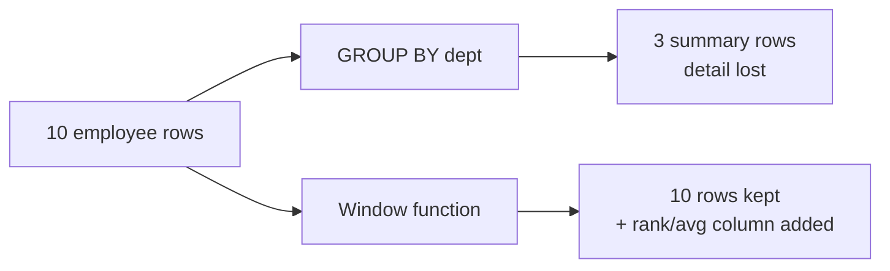
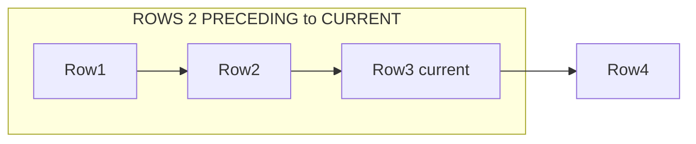
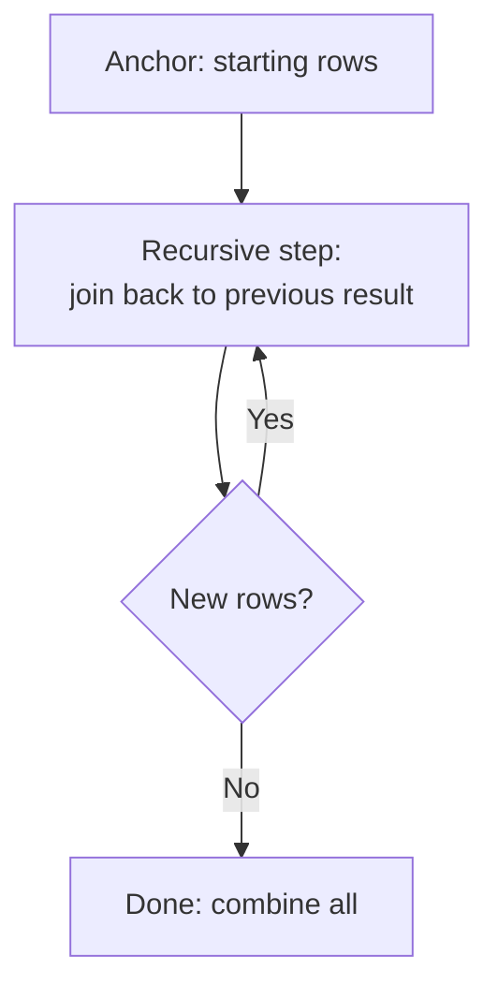

# Part 5 — SQL Expert: Window Functions & CTEs

> Section goal: Master the most powerful analytical SQL — window functions (ranking, running totals, comparisons across rows) and Common Table Expressions including recursion — plus COALESCE for null handling. These are the questions that decide senior interviews.

Covers index items **5** (Module 1, Class 4: EXISTS/NOT EXISTS recap, Window Functions, Frame Clause, COALESCE, CTEs — iterative & recursive).

---

## 1. What Are Window Functions?

A **window function** performs a calculation across a set of rows **related to the current row**, *without collapsing them into one row* (unlike GROUP BY).

### 🔍 Plain-English deep-dive: window vs GROUP BY
- **GROUP BY** — *squashes* many rows into one summary row. You lose the detail.
- **Window function** — *keeps every row* but adds a computed column that "looks at" a window of neighboring rows. **Analogy:** GROUP BY is a summary report; a window function is writing each student's rank *next to their name* while still listing everyone.



### Syntax
```sql
function() OVER (
    PARTITION BY column     -- split into groups (like GROUP BY but keeps rows)
    ORDER BY column         -- order within each group
    [frame clause]          -- which rows around current to include
)
```

---

## 2. Ranking Functions

```sql
SELECT name, dept_id, salary,
    ROW_NUMBER() OVER (PARTITION BY dept_id ORDER BY salary DESC) AS row_num,
    RANK()       OVER (PARTITION BY dept_id ORDER BY salary DESC) AS rnk,
    DENSE_RANK() OVER (PARTITION BY dept_id ORDER BY salary DESC) AS dense_rnk
FROM employees;
```

| Function | Ties get | After a tie of 2 |
|----------|----------|------------------|
| `ROW_NUMBER()` | Different numbers (1,2,3,4) | continues |
| `RANK()` | Same number, then gaps (1,1,3) | skips 2 |
| `DENSE_RANK()` | Same number, no gaps (1,1,2) | no skip |
| `NTILE(n)` | Splits rows into n buckets | — |

> 💡 **Classic question — "Find the 2nd highest salary per department":**
```sql
SELECT * FROM (
    SELECT name, dept_id, salary,
           DENSE_RANK() OVER (PARTITION BY dept_id ORDER BY salary DESC) AS rnk
    FROM employees
) t
WHERE rnk = 2;
```

---

## 3. Value (Navigation) Functions

These peek at other rows relative to the current one.

```sql
SELECT name, salary,
    LAG(salary)  OVER (ORDER BY salary)  AS prev_salary,   -- row before
    LEAD(salary) OVER (ORDER BY salary)  AS next_salary,   -- row after
    FIRST_VALUE(salary) OVER (ORDER BY salary DESC) AS top_salary
FROM employees;
```

| Function | Returns |
|----------|---------|
| `LAG(col, n)` | Value from n rows before |
| `LEAD(col, n)` | Value from n rows after |
| `FIRST_VALUE(col)` | First value in window |
| `LAST_VALUE(col)` | Last value in window |

> 💡 **For you:** `LAG` is how you compute "growth vs last month" — `this_month - LAG(this_month)`.

---

## 4. Aggregate Window Functions & Running Totals

Use aggregates as window functions to get running totals and moving averages.

```sql
SELECT sale_date, amount,
    SUM(amount) OVER (ORDER BY sale_date) AS running_total,
    AVG(amount) OVER (ORDER BY sale_date
                      ROWS BETWEEN 2 PRECEDING AND CURRENT ROW) AS moving_avg_3
FROM sales;
```

---

## 5. The Frame Clause

The **frame** defines *which rows around the current row* the window includes.

### 🔍 Plain-English deep-dive: frames
- **`ROWS BETWEEN 2 PRECEDING AND CURRENT ROW`** — *current row + the two before it.* **Analogy:** a 3-day moving average looking back over a sliding window.
- **`ROWS BETWEEN UNBOUNDED PRECEDING AND CURRENT ROW`** — *everything from the start up to now* (a running total).
- **`RANGE`** vs **`ROWS`** — ROWS counts physical rows; RANGE counts by value (ties share a frame).



| Frame | Includes |
|-------|----------|
| `UNBOUNDED PRECEDING ... CURRENT ROW` | Start → now (running total) |
| `n PRECEDING ... CURRENT ROW` | Last n+1 rows (moving window) |
| `CURRENT ROW ... UNBOUNDED FOLLOWING` | Now → end |
| `UNBOUNDED PRECEDING ... UNBOUNDED FOLLOWING` | Entire partition |

---

## 6. COALESCE — Handling NULLs

`COALESCE(a, b, c, ...)` returns the **first non-null** value in its list.

```sql
SELECT name, COALESCE(phone, email, 'no contact') AS contact
FROM employees;

-- Replace NULL totals with 0
SELECT c.name, COALESCE(SUM(o.amount), 0) AS spend
FROM customers c LEFT JOIN orders o ON c.customer_id=o.customer_id
GROUP BY c.name;
```

| Function | Purpose |
|----------|---------|
| `COALESCE(a,b,...)` | First non-null of many |
| `IFNULL(a,b)` | MySQL: a if not null else b (2 args only) |
| `NULLIF(a,b)` | NULL if a=b (avoid divide-by-zero) |

> 💡 **Analogy:** COALESCE is a list of fallback phone numbers — try the first, if no answer try the next, and so on.

---

## 7. Common Table Expressions (CTEs)

A **CTE** is a named temporary result set defined with `WITH`, usable like a table in the main query. It makes complex queries readable.

```sql
WITH dept_avg AS (
    SELECT dept_id, AVG(salary) AS avg_sal
    FROM employees
    GROUP BY dept_id
)
SELECT e.name, e.salary, d.avg_sal
FROM employees e
JOIN dept_avg d ON e.dept_id = d.dept_id
WHERE e.salary > d.avg_sal;
```

### 🔍 Plain-English deep-dive: CTE vs subquery
- A **subquery** is inline and can get deeply nested and hard to read.
- A **CTE** names the intermediate step, so you read top-to-bottom like steps in a recipe. **Analogy:** prepping ingredients in labeled bowls before cooking, instead of chopping everything mid-stir.
- You can chain multiple CTEs and reference earlier ones.

```sql
WITH
high_value AS (SELECT * FROM orders WHERE amount > 1000),
per_customer AS (SELECT customer_id, COUNT(*) AS n FROM high_value GROUP BY customer_id)
SELECT * FROM per_customer WHERE n >= 2;
```

---

## 8. Recursive CTEs

A **recursive CTE** references itself to walk hierarchies or generate sequences. It has two parts joined by `UNION ALL`:
1. **Anchor** — the starting point.
2. **Recursive member** — repeatedly builds on the previous result until no new rows.



### Example: generate numbers 1–5
```sql
WITH RECURSIVE nums AS (
    SELECT 1 AS n                      -- anchor
    UNION ALL
    SELECT n + 1 FROM nums WHERE n < 5 -- recursive step
)
SELECT * FROM nums;   -- 1,2,3,4,5
```

### Example: employee → manager hierarchy
```sql
WITH RECURSIVE org AS (
    SELECT emp_id, name, manager_id, 1 AS level
    FROM employees WHERE manager_id IS NULL      -- top boss (anchor)
    UNION ALL
    SELECT e.emp_id, e.name, e.manager_id, o.level + 1
    FROM employees e
    JOIN org o ON e.manager_id = o.emp_id        -- attach reports
)
SELECT * FROM org ORDER BY level;
```

> 💡 **Interview gold:** Recursive CTEs answer "print the full org chart" or "find all sub-categories under a category" — very common advanced questions.

---

## 🧪 Lab 5 — Advanced Analytics

```sql
CREATE DATABASE analytics_demo;
USE analytics_demo;

CREATE TABLE employees (
    emp_id INT PRIMARY KEY,
    name VARCHAR(50),
    dept_id INT,
    salary DECIMAL(10,2),
    manager_id INT
);
INSERT INTO employees VALUES
(1,'CEO Asha',10,200000,NULL),
(2,'Ravi',10,120000,1),
(3,'Meera',20,90000,1),
(4,'Karan',20,85000,3),
(5,'Sara',20,85000,3),
(6,'Dev',10,110000,2);
```

### Tasks:
```sql
-- 1. Rank salaries within each department
SELECT name, dept_id, salary,
    DENSE_RANK() OVER (PARTITION BY dept_id ORDER BY salary DESC) AS rnk
FROM employees;

-- 2. 2nd highest salary per department
SELECT * FROM (
    SELECT name, dept_id, salary,
        DENSE_RANK() OVER (PARTITION BY dept_id ORDER BY salary DESC) AS r
    FROM employees
) t WHERE r = 2;

-- 3. Running total of salary ordered by emp_id
SELECT name, salary,
    SUM(salary) OVER (ORDER BY emp_id) AS running_total
FROM employees;

-- 4. Salary difference vs previous employee (LAG)
SELECT name, salary,
    salary - LAG(salary) OVER (ORDER BY salary) AS diff_from_prev
FROM employees;

-- 5. CTE: employees earning above their dept average
WITH dept_avg AS (
    SELECT dept_id, AVG(salary) AS a FROM employees GROUP BY dept_id
)
SELECT e.name, e.salary, d.a
FROM employees e JOIN dept_avg d ON e.dept_id=d.dept_id
WHERE e.salary > d.a;

-- 6. Recursive CTE: full org hierarchy with levels
WITH RECURSIVE org AS (
    SELECT emp_id, name, manager_id, 1 AS lvl FROM employees WHERE manager_id IS NULL
    UNION ALL
    SELECT e.emp_id, e.name, e.manager_id, o.lvl+1
    FROM employees e JOIN org o ON e.manager_id=o.emp_id
)
SELECT lvl, name FROM org ORDER BY lvl, name;
```

✅ **Checkpoint:** You ranked within partitions, computed running totals and LAG diffs, handled nulls with COALESCE, and walked a hierarchy with a recursive CTE. You now have *senior-level* SQL.

---

## ⭐ Likely Interview Questions for This Section

**Q1. "What's the difference between GROUP BY and a window function?"**
> *Model answer:* GROUP BY collapses rows into one summary per group, losing detail. A window function computes across related rows but keeps every row, adding the result as a new column.

**Q2. "Explain ROW_NUMBER, RANK, and DENSE_RANK."**
> *Model answer:* ROW_NUMBER gives unique sequential numbers. RANK gives the same number to ties but skips subsequent numbers (1,1,3). DENSE_RANK gives ties the same number without gaps (1,1,2).

**Q3. "How do you find the Nth highest salary per department?"**
> *Model answer:* Use DENSE_RANK() OVER (PARTITION BY dept ORDER BY salary DESC) in a subquery/CTE, then filter WHERE rank = N.

**Q4. "What is the frame clause?"**
> *Model answer:* It defines which rows around the current row a window function operates on — e.g., ROWS BETWEEN 2 PRECEDING AND CURRENT ROW for a 3-row moving average, or UNBOUNDED PRECEDING to CURRENT ROW for a running total.

**Q5. "What do LAG and LEAD do?"**
> *Model answer:* LAG fetches a value from a previous row and LEAD from a following row, within the ordered window — useful for period-over-period comparisons like month-over-month growth.

**Q6. "What is a CTE and why use one over a subquery?"**
> *Model answer:* A CTE is a named temporary result set defined with WITH. It improves readability, can be referenced multiple times, can be chained, and supports recursion — versus deeply nested, hard-to-read subqueries.

**Q7. "What is a recursive CTE and when would you use it?"**
> *Model answer:* A CTE that references itself, with an anchor and a recursive member combined by UNION ALL. Used to traverse hierarchies (org charts, category trees) or generate sequences.

**Q8. "What does COALESCE do?"**
> *Model answer:* It returns the first non-null value from its arguments — handy for fallback values and replacing NULL aggregates with 0.

---

## 🧠 30-Second Memory Hooks
- **Window function** = rank written next to each name (keeps all rows).
- **ROW_NUMBER** = always unique; **RANK** = ties + gaps; **DENSE_RANK** = ties, no gaps.
- **LAG/LEAD** = look back / look ahead (month-over-month).
- **Frame** = sliding window of neighbor rows; UNBOUNDED PRECEDING→CURRENT = running total.
- **CTE** = labeled prep bowls (`WITH`).
- **Recursive CTE** = anchor + self-join loop (org charts, trees).
- **COALESCE** = first non-null fallback.

---

*Next suggested section:* **Part 6 — Big Data Fundamentals** (you've mastered single-machine SQL; now learn what happens when data is too big for one server).
