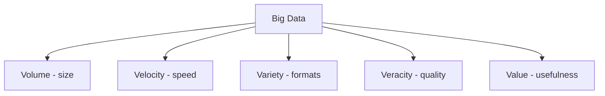
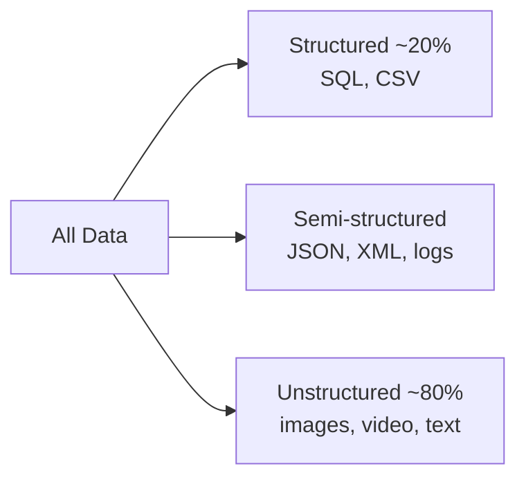
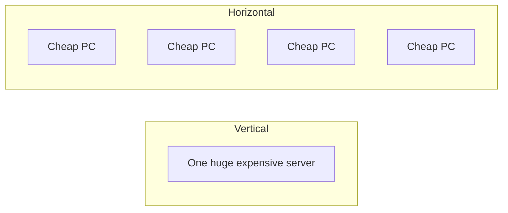
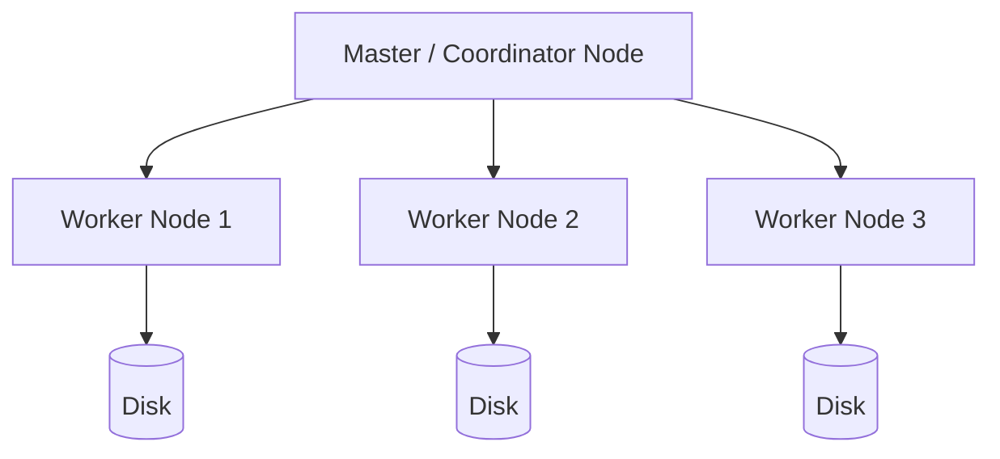
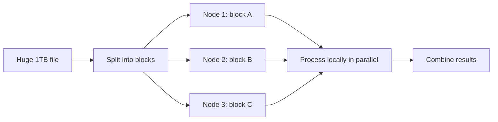

# Part 6 — Big Data Fundamentals

> Section goal: Understand *why* traditional databases break at scale and the core ideas of distributed systems — the 5 V's, distributed storage vs computation, clusters, commodity hardware, data types, and file formats — that underpin Hadoop, Hive, and Kafka.

Covers index items **6** (Module 2, Class 1: 5 V's of Big Data, distributed computation & storage, cluster, commodity hardware, file formats, types of data).

---

## 1. What Is "Big Data"?

**Big Data** is data so large, fast, or varied that a single traditional database/server can't store or process it in reasonable time.

### 🔍 Plain-English deep-dive: the 5 V's of Big Data
- **Volume** — *sheer amount* (terabytes → petabytes). **Analogy:** not a bucket of water but an ocean.
- **Velocity** — *speed of arrival* (millions of events/second). **Analogy:** a firehose, not a tap.
- **Variety** — *different shapes* (tables, JSON, images, logs, video). **Analogy:** a mixed recycling bin, not a sorted drawer.
- **Veracity** — *trustworthiness* (is the data clean/accurate?). **Analogy:** separating reliable news from rumors.
- **Value** — *business worth* (can we turn it into insight/money?). **Analogy:** mining gold from tons of ore.



> 💡 **For you:** If a single MySQL server (Module 1) can comfortably handle it, it's *not* big data. Big data starts where one machine's disk, RAM, or CPU is no longer enough.

---

## 2. Types of Data

| Type | Description | Examples |
|------|-------------|----------|
| **Structured** | Fixed schema, rows & columns | SQL tables, CSV |
| **Semi-structured** | Has tags/markers but flexible | JSON, XML, logs |
| **Unstructured** | No predefined model | Images, video, free text, audio |



> 💡 Most of the world's data (~80%) is unstructured — which is exactly why flexible big-data tools exist.

---

## 3. The Scaling Problem: Vertical vs Horizontal

When one server isn't enough, you have two choices.

### 🔍 Plain-English deep-dive: scale up vs scale out
- **Vertical scaling (scale up)** — *buy a bigger machine* (more CPU/RAM/disk). **Analogy:** upgrading from a car to a truck. **Limit:** there's a ceiling, and big machines cost exponentially more; a single failure takes everything down.
- **Horizontal scaling (scale out)** — *add more ordinary machines* and split the work. **Analogy:** hiring more delivery drivers instead of one superhuman. **Win:** near-limitless, cheaper, fault-tolerant.



| | Vertical (Up) | Horizontal (Out) |
|---|---------------|------------------|
| Approach | Bigger single machine | Many small machines |
| Cost | Exponential | Linear, commodity |
| Limit | Hardware ceiling | Practically unlimited |
| Fault tolerance | Single point of failure | Survives node loss |

Big data tools choose **horizontal scaling** — this is the central design decision behind Hadoop, Hive, and Kafka.

---

## 4. Cluster & Commodity Hardware

- **Cluster** — *a group of networked computers acting as one system.* **Analogy:** a team of workers coordinated to finish a big job together.
- **Node** — *a single machine in the cluster.*
- **Commodity hardware** — *ordinary, inexpensive servers* (not specialized supercomputers). **Analogy:** using many cheap bricks instead of one giant marble block.



> 💡 **Key insight:** Because commodity machines fail often, big-data systems are designed to *expect failure* and recover automatically (via replication and re-computation).

---

## 5. Distributed Storage vs Distributed Computation

These are the two pillars of big data — and two different problems.

### 🔍 Plain-English deep-dive
- **Distributed storage** — *split one huge file across many machines' disks.* **Analogy:** tearing a giant book into chapters and storing each chapter in a different library branch. (This is what **HDFS** does — Part 7.)
- **Distributed computation** — *send the code to where the data lives and process pieces in parallel*, then combine. **Analogy:** instead of mailing all chapters to one reader, each branch's reader summarizes their chapter locally, then summaries are merged. (This is **MapReduce/Spark** — Part 7.)



> 💡 **"Data locality" — the big idea:** moving terabytes across a network is slow; moving a few KB of *code* to the data is fast. Big data systems bring computation **to** the data, not data to the computation.

---

## 6. File Formats — Row vs Columnar

How data is physically stored on disk hugely affects speed and size.

### 🔍 Plain-English deep-dive: row vs columnar storage
- **Row-based** (CSV, Avro) — *stores all columns of a row together.* **Analogy:** a contact card with name, phone, email on one card. **Best for:** writing whole records, transactional workloads.
- **Columnar** (Parquet, ORC) — *stores all values of one column together.* **Analogy:** one list of all names, another of all phones. **Best for:** analytics that read a few columns from huge tables — you skip columns you don't need and compress better (similar values sit together).

```mermaid
flowchart TD
    subgraph Row[Row format CSV/Avro]
    R1[name,phone,email | name,phone,email]
    end
    subgraph Col[Columnar Parquet/ORC]
    C1[all names | all phones | all emails]
    end
```

| Format | Layout | Best for | Compression |
|--------|--------|----------|-------------|
| **CSV** | Row, text | Simple exchange | None (large) |
| **JSON** | Semi-structured | Flexible, nested | Poor |
| **Avro** | Row, binary + schema | Write-heavy, streaming, schema evolution | Good |
| **Parquet** | Columnar | Analytics (read few columns) | Excellent |
| **ORC** | Columnar | Hive analytics, ACID | Excellent |

> 💡 **Interview gold:** "Why is Parquet faster for analytics than CSV?" → It's columnar, so a query reading 2 of 50 columns only reads those 2; it skips the rest and compresses each column tightly. We'll use these heavily in Hive (Part 9).

---

## 🧪 Lab 6 — Reasoning & Format Exercise (No Cluster Needed Yet)

**Goal:** Build intuition before installing Hadoop in Part 7.

### Exercise A — Classify the scenario
For each, decide: *single SQL server* or *big data (distributed)*? Why?
1. A startup's 50,000-row customer table. → **SQL** (fits one machine easily).
2. 2 billion clickstream events/day from a global app. → **Big Data** (volume + velocity).
3. Storing and searching 10 million product images. → **Big Data** (unstructured volume).
4. Monthly payroll for 200 employees. → **SQL**.

### Exercise B — Feel columnar vs row (Python, optional)
If you have Python + pandas + pyarrow installed:
```python
import pandas as pd, numpy as np, os
df = pd.DataFrame({
    'id': range(1_000_000),
    'category': np.random.choice(['A','B','C'], 1_000_000),
    'amount': np.random.rand(1_000_000)*1000
})
df.to_csv('data.csv', index=False)
df.to_parquet('data.parquet', index=False)

print('CSV   MB:', round(os.path.getsize('data.csv')/1e6, 2))
print('Parquet MB:', round(os.path.getsize('data.parquet')/1e6, 2))
# Parquet is typically 3-10x smaller due to columnar compression

# Reading ONE column from Parquet only loads that column:
amounts = pd.read_parquet('data.parquet', columns=['amount'])
print(amounts.shape)
```
Observe: Parquet file is far smaller, and reading one column is faster.

✅ **Checkpoint:** You can now explain when data becomes "big", why horizontal scaling and commodity clusters win, the difference between distributed storage and computation, and why columnar formats dominate analytics.

---

## ⭐ Likely Interview Questions for This Section

**Q1. "What are the 5 V's of Big Data?"**
> *Model answer:* Volume (size), Velocity (speed of arrival), Variety (different formats), Veracity (data quality/trust), and Value (business usefulness).

**Q2. "Difference between vertical and horizontal scaling?"**
> *Model answer:* Vertical scaling adds power to a single machine and hits a cost/hardware ceiling with a single point of failure. Horizontal scaling adds more commodity machines, scaling almost limitlessly, cheaper, and fault-tolerant — the big-data approach.

**Q3. "What is commodity hardware and why use it?"**
> *Model answer:* Ordinary, inexpensive servers rather than specialized supercomputers. Using many of them is cost-effective and, with replication, the system tolerates the frequent failures such hardware has.

**Q4. "Explain distributed storage vs distributed computation."**
> *Model answer:* Distributed storage splits large files across many nodes' disks (HDFS). Distributed computation processes those pieces in parallel where they live and merges results (MapReduce/Spark), exploiting data locality.

**Q5. "What is data locality and why does it matter?"**
> *Model answer:* It's the principle of moving computation to the data instead of moving large data across the network, because shipping a small amount of code is far faster than transferring terabytes.

**Q6. "Why are columnar formats like Parquet/ORC preferred for analytics?"**
> *Model answer:* Analytics queries often read few columns from wide tables; columnar storage reads only the needed columns and compresses better since similar values are stored together, cutting I/O dramatically.

**Q7. "Structured vs semi-structured vs unstructured data — examples?"**
> *Model answer:* Structured = SQL tables/CSV; semi-structured = JSON/XML/logs with flexible tags; unstructured = images, video, free text with no fixed model.

---

## 🧠 30-Second Memory Hooks
- **5 V's** = Volume, Velocity, Variety, Veracity, Value.
- **Scale up** = bigger truck (ceiling); **scale out** = more drivers (big data).
- **Cluster** = team of cheap machines; expect failures, recover automatically.
- **Storage vs compute** = split the book across libraries (HDFS) vs summarize each chapter locally (MapReduce).
- **Data locality** = ship code to data, not data to code.
- **Columnar (Parquet/ORC)** = store columns together → read fewer, compress more.

---

*Next suggested section:* **Part 7 — Hadoop Ecosystem** (now meet the system that actually implements distributed storage and computation).
