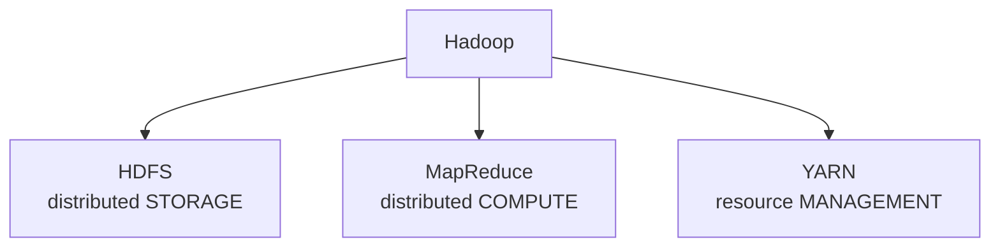
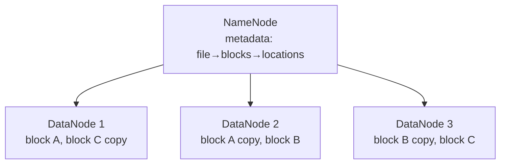
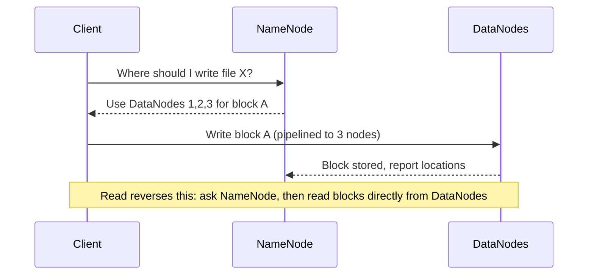
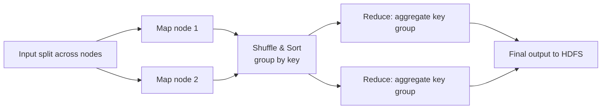
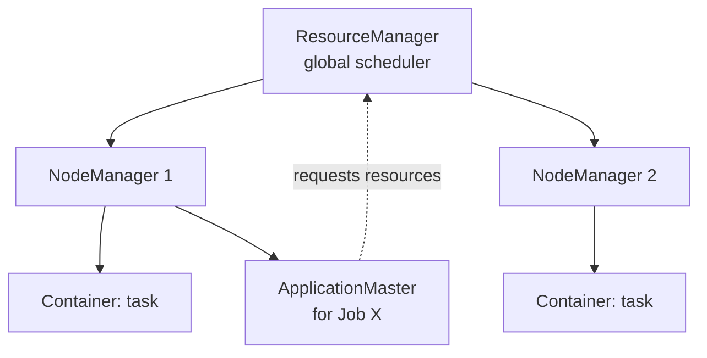
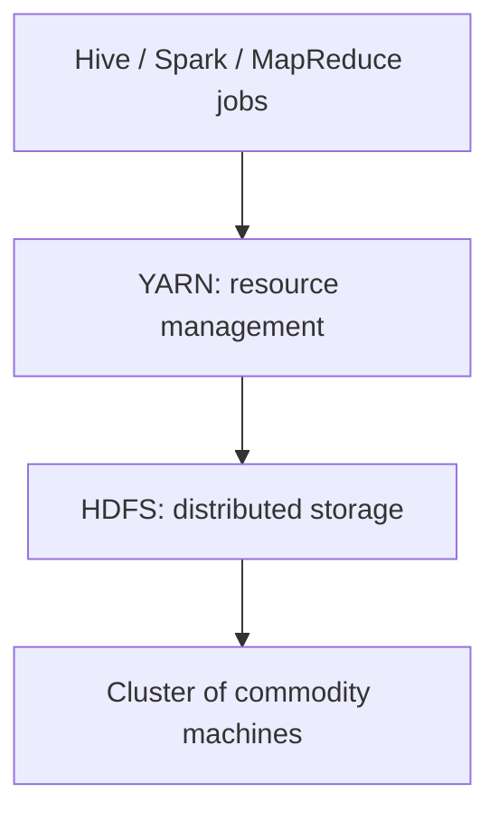

# Part 7 — Hadoop Ecosystem

> Section goal: Understand Hadoop end-to-end — its history, the HDFS storage layer (NameNode/DataNode/blocks/replication), the MapReduce computation model, YARN resource management, and how to spin up a real cluster on Google Cloud Dataproc.

Covers index items **7** (Module 2, Class 1–3: history of Hadoop, architecture & components, MapReduce, YARN, Hadoop cluster setup on GCP Dataproc).

---

## 1. What Is Hadoop & Why It Exists

**Hadoop** is an open-source framework for *storing and processing huge datasets across clusters of commodity machines* (the ideas from Part 6, made real).

### 🔍 Plain-English deep-dive: a tiny history
- Google published papers on **GFS** (storage, 2003) and **MapReduce** (computation, 2004).
- Doug Cutting & Mike Cafarella built open-source versions; named **Hadoop** after his son's toy elephant 🐘.
- It became the foundation of the big-data era, later complemented by Spark, Hive, and Kafka.

Hadoop has **three core components**:



| Component | Role | Analogy |
|-----------|------|---------|
| HDFS | Stores data across nodes | The warehouse |
| MapReduce | Processes data in parallel | The assembly line |
| YARN | Allocates CPU/RAM to jobs | The shift manager |

---

## 2. HDFS — Hadoop Distributed File System

HDFS splits each large file into fixed-size **blocks** (default 128 MB) and spreads them across DataNodes, replicating each block (default 3×) for fault tolerance.

### 🔍 Plain-English deep-dive: the architecture
- **NameNode (master)** — *stores metadata*: which blocks make up which file and where each block lives. **Analogy:** the library's catalog/index — it doesn't hold the books, it knows where every book is. **It's critical** — losing it loses the map to all data (hence backups/standby).
- **DataNode (worker)** — *stores the actual data blocks* and reports health to the NameNode. **Analogy:** the shelves holding the actual books.
- **Block** — *a chunk of a file* (128 MB default). **Analogy:** a chapter torn from a giant book.
- **Replication factor** — *how many copies of each block* (3 by default), placed on different nodes/racks. **Analogy:** keeping 3 photocopies of each chapter in different buildings so a fire never destroys the only copy.



### How a 300 MB file is stored (128 MB blocks, 3× replication)
- Split into 3 blocks: A (128), B (128), C (44).
- Each block copied 3 times → 9 block-copies spread across DataNodes on different racks.
- If a DataNode dies, the NameNode notices missing replicas and re-replicates from surviving copies.

> 💡 **Why big blocks?** 128 MB blocks minimize the metadata the NameNode tracks and reduce disk-seek overhead — big data favors large sequential reads over many small ones.

### HDFS read/write flow


---

## 3. MapReduce — Distributed Computation

**MapReduce** processes data in two phases that run in parallel across DataNodes.

### 🔍 Plain-English deep-dive: Map → Shuffle → Reduce
- **Map** — *transform each input chunk into key-value pairs*, locally where the data lives. **Analogy:** each library reader scans their chapter and notes "word → 1" for every word.
- **Shuffle & Sort** — *group all values with the same key together* and send to reducers. **Analogy:** gathering all the "apple" notes from every reader into one pile.
- **Reduce** — *aggregate each group into a final result.* **Analogy:** counting the size of each word's pile to get total word counts.



### Classic word-count logic
```
Map:    "the cat sat" → (the,1) (cat,1) (sat,1)
Shuffle: (cat,[1]) (sat,[1]) (the,[1,1,...])
Reduce: (cat,1) (sat,1) (the, N)
```

> 💡 **For you:** MapReduce is the *grandfather* of modern engines. Spark replaced raw MapReduce for speed (in-memory), but the Map→Shuffle→Reduce mental model still explains how distributed aggregation works — and Hive (Part 8) compiles SQL into these jobs.

---

## 4. YARN — Yet Another Resource Negotiator

If HDFS is storage and MapReduce is the work, **YARN** is the *operating system of the cluster* — it decides which jobs get which CPU/RAM on which nodes.

### 🔍 Plain-English deep-dive: YARN components
- **ResourceManager (master)** — *global scheduler* deciding resource allocation across all apps. **Analogy:** the shift manager assigning workers to tasks.
- **NodeManager (per node)** — *monitors resources on its machine* and launches containers. **Analogy:** a floor supervisor reporting capacity.
- **ApplicationMaster (per job)** — *negotiates resources for one application* and tracks its tasks. **Analogy:** a project lead requesting a team for one project.
- **Container** — *a slice of CPU+RAM on a node* where a task runs. **Analogy:** a single allocated workstation.



> 💡 **Why YARN matters:** it let Hadoop run *many* frameworks (MapReduce, Spark, Tez) on the same cluster, sharing resources — turning Hadoop from a single-purpose tool into a general platform.

---

## 5. Putting It Together — The Hadoop Stack



A job's life: you submit it → YARN allocates containers → tasks run on DataNodes near their data (data locality) → results written back to HDFS.

---

## 🧪 Lab 7 — Spin Up a Real Hadoop Cluster on GCP Dataproc

**Goal:** Create a managed Hadoop cluster, run HDFS commands, and execute a MapReduce job. (Dataproc handles install/config for you.)

> ⚠️ **Cost note:** Dataproc bills per second. Use small machines and **delete the cluster when done**. New GCP accounts usually get free credits.

### Step 1 — Prerequisites
1. Create a [Google Cloud account](https://cloud.google.com/) and a project.
2. Enable the **Dataproc** and **Compute Engine** APIs.
3. Install the [gcloud CLI](https://cloud.google.com/sdk/docs/install) and run `gcloud init`.

### Step 2 — Create a small cluster
```bash
gcloud dataproc clusters create my-hadoop-cluster \
    --region=us-central1 \
    --single-node \
    --master-machine-type=n1-standard-2 \
    --image-version=2.1-debian11
```
(`--single-node` keeps cost low for learning; production uses multiple workers.)

### Step 3 — SSH into the master node
```bash
gcloud compute ssh my-hadoop-cluster-m --zone=us-central1-a
```

### Step 4 — HDFS commands
```bash
hdfs dfs -mkdir /user/demo                       # make a directory
echo "the cat sat on the mat the cat ran" > words.txt
hdfs dfs -put words.txt /user/demo/              # upload to HDFS
hdfs dfs -ls /user/demo                          # list
hdfs dfs -cat /user/demo/words.txt               # view
hdfs dfs -du -h /user/demo                       # disk usage
```

### Step 5 — Run the built-in word-count MapReduce job
```bash
hadoop jar /usr/lib/hadoop-mapreduce/hadoop-mapreduce-examples.jar \
    wordcount /user/demo/words.txt /user/demo/output

hdfs dfs -cat /user/demo/output/part-r-00000
# the   3
# cat   2
# sat   1  ...
```

### Step 6 — Inspect YARN
```bash
yarn application -list -appStates ALL     # see your job in YARN
```
Or open the YARN ResourceManager UI from the Dataproc web interfaces in the GCP console.

### Step 7 — DELETE the cluster (important!)
```bash
gcloud dataproc clusters delete my-hadoop-cluster --region=us-central1
```

✅ **Checkpoint:** You created a real cluster, stored a file in HDFS (split/replicated automatically), ran a MapReduce job through YARN, and tore it down. You've operated the full Hadoop stack.

---

## ⭐ Likely Interview Questions for This Section

**Q1. "Explain the Hadoop architecture / core components."**
> *Model answer:* Three pillars — HDFS for distributed storage, MapReduce for distributed computation, and YARN for resource management — all running on a cluster of commodity machines.

**Q2. "What are the roles of NameNode and DataNode?"**
> *Model answer:* The NameNode is the master holding metadata (which blocks form a file and where they live); DataNodes are workers storing the actual data blocks and reporting health. The NameNode is critical, so it's backed by a standby.

**Q3. "What is the default block size and replication factor, and why?"**
> *Model answer:* 128 MB blocks and replication factor 3. Large blocks reduce metadata and seek overhead; triple replication on different nodes/racks provides fault tolerance.

**Q4. "Walk me through MapReduce with word count."**
> *Model answer:* Map emits (word,1) for each word locally; Shuffle & Sort groups identical keys; Reduce sums each key's values to produce final counts. Tasks run in parallel near their data.

**Q5. "What problem does YARN solve?"**
> *Model answer:* It separates resource management from computation, letting multiple frameworks (MapReduce, Spark, Tez) share one cluster. ResourceManager schedules globally; NodeManagers run containers; an ApplicationMaster manages each job.

**Q6. "What happens when a DataNode fails?"**
> *Model answer:* The NameNode detects missing block heartbeats, finds under-replicated blocks, and re-replicates them from surviving copies onto healthy nodes, keeping the replication factor satisfied.

**Q7. "What is data locality in Hadoop?"**
> *Model answer:* YARN schedules tasks on (or near) the nodes that already hold the needed data blocks, minimizing network transfer and speeding up processing.

**Q8. "Why is the NameNode a single point of failure, and how is it mitigated?"**
> *Model answer:* It holds all metadata, so its loss makes data unreadable. Mitigations include a Secondary/Standby NameNode, HA with ZooKeeper failover, and persisting the edit log/FSImage.

---

## 🧠 30-Second Memory Hooks
- **Hadoop = HDFS (store) + MapReduce (compute) + YARN (manage)**, named after a toy elephant.
- **NameNode** = library catalog (metadata); **DataNode** = the shelves (blocks).
- **128 MB blocks, 3× replication** — survive failures, fewer seeks.
- **MapReduce** = Map (emit k,v) → Shuffle (group by key) → Reduce (aggregate).
- **YARN** = cluster's shift manager (ResourceManager + NodeManager + ApplicationMaster + containers).
- **Data locality** = run the task where the block already is.

---

*Next suggested section:* **Part 8 — Hive: SQL on Hadoop** (writing raw MapReduce is painful; Hive lets you query HDFS with familiar SQL).
