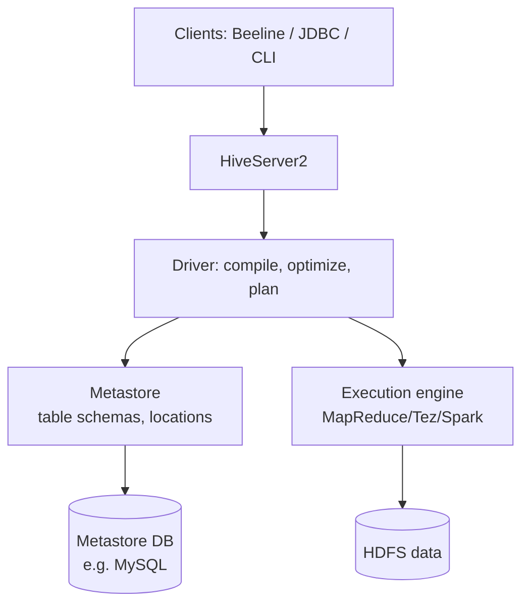
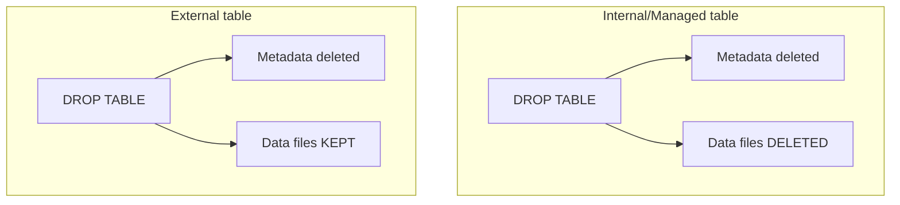

# Part 8 — Hive: SQL on Hadoop

> Section goal: Learn how Hive turns familiar SQL into distributed jobs over HDFS — its architecture and metastore, data types (including complex ones), creating databases/tables, loading data, the crucial internal-vs-external table distinction, SerDe, and file formats.

Covers index items **8** (Module 2, Class 4: Hive architecture, data types, create db/table, load from local & HDFS, internal vs external tables, array & map types, SerDe, file formats, CSV/JSON/Parquet/ORC SerDe).

---

## 1. What Is Hive & Why It Exists

Writing raw MapReduce (Part 7) in Java is slow and painful. **Apache Hive** lets you query data in HDFS using **HiveQL** — a SQL-like language — and compiles it into distributed jobs automatically.

### 🔍 Plain-English deep-dive: Hive's promise
- **Analogy:** Hive is a *translator*. You speak SQL (which analysts already know); Hive translates it into MapReduce/Tez/Spark jobs that run across the cluster. You get big-data scale without writing distributed code.
- **Schema-on-read** (key concept): Hive doesn't validate data when you load it — only when you *read* it. **Analogy:** you toss papers into a drawer now and only sort/interpret them when you open it later. Contrast: traditional RDBMS is **schema-on-write** (validates on insert).


| | RDBMS (MySQL) | Hive |
|---|---------------|------|
| Schema | On write (validated at insert) | On read (validated at query) |
| Scale | Single server | Cluster (petabytes) |
| Latency | Milliseconds | Seconds–minutes (batch) |
| Updates | Full CRUD | Mostly append; limited updates |
| Best for | Transactions (OLTP) | Analytics on huge data (OLAP) |

> 💡 **For you:** Everything you learned in SQL (Parts 1–5) — SELECT, JOIN, GROUP BY, window functions — works in HiveQL. You're reusing your SQL skills at petabyte scale.

---

## 2. Hive Architecture



### 🔍 Plain-English deep-dive: the metastore — Hive's brain
- **Metastore** — *a relational database (often MySQL!) that stores metadata*: table names, column types, partitions, and **where the actual data files live in HDFS**. **Analogy:** the card catalog again — Hive tables are just metadata pointing at files in HDFS. The data and its description are separate.
- **HiveServer2** — accepts client connections (Beeline, JDBC, BI tools).
- **Driver** — compiles HiveQL, optimizes, and creates an execution plan.
- **Execution engine** — runs the plan as MapReduce/Tez/Spark jobs.

> 💡 **Key mental model:** A Hive "table" = *a schema in the metastore* + *files in an HDFS directory*. Understanding this unlocks internal vs external tables below.

---

## 3. Hive Data Types

### Primitive types
| Category | Types |
|----------|-------|
| Numeric | TINYINT, SMALLINT, INT, BIGINT, FLOAT, DOUBLE, DECIMAL |
| String | STRING, VARCHAR, CHAR |
| Date/Time | DATE, TIMESTAMP |
| Boolean | BOOLEAN |
| Binary | BINARY |

### Complex (collection) types — a Hive superpower
| Type | Description | Example |
|------|-------------|---------|
| `ARRAY<T>` | Ordered list | `["a","b","c"]` |
| `MAP<K,V>` | Key-value pairs | `{"math":90,"sci":85}` |
| `STRUCT<...>` | Record with named fields | `{name:"Asha", age:30}` |

```sql
CREATE TABLE students (
    id      INT,
    name    STRING,
    scores  ARRAY<INT>,
    grades  MAP<STRING,INT>,
    address STRUCT<city:STRING, pin:INT>
);

-- Access complex types
SELECT name,
       scores[0]         AS first_score,
       grades['math']    AS math_score,
       address.city      AS city
FROM students;
```

> 💡 Complex types let Hive model semi-structured data (JSON-like) that a flat RDBMS can't easily represent.

---

## 4. Creating Databases & Tables

```sql
CREATE DATABASE sales_db;
USE sales_db;

CREATE TABLE transactions (
    txn_id   INT,
    product  STRING,
    amount   DOUBLE,
    txn_date STRING
)
ROW FORMAT DELIMITED
FIELDS TERMINATED BY ','        -- how columns are separated in the file
LINES TERMINATED BY '\n'
STORED AS TEXTFILE;             -- file format
```

The `ROW FORMAT` and `STORED AS` clauses tell Hive how to interpret the underlying files (schema-on-read in action).

---

## 5. Loading Data — From Local vs HDFS

```sql
-- From the local filesystem (copies the file into Hive's warehouse)
LOAD DATA LOCAL INPATH '/home/user/txns.csv' INTO TABLE transactions;

-- From HDFS (MOVES the file — note: no LOCAL keyword)
LOAD DATA INPATH '/user/data/txns.csv' INTO TABLE transactions;

-- OVERWRITE replaces existing data; without it, appends
LOAD DATA LOCAL INPATH '/home/user/more.csv' OVERWRITE INTO TABLE transactions;
```

### 🔍 Plain-English deep-dive: LOCAL vs HDFS
- **`LOCAL`** = file is on the machine running the client; Hive **copies** it into HDFS.
- **no `LOCAL`** = file is already in HDFS; Hive **moves** it (the original path becomes empty). **Gotcha:** people are surprised their HDFS source file "disappeared" — it was moved into the table's directory.

---

## 6. Internal vs External Tables — THE Key Distinction

This is the single most-asked Hive interview question.

### 🔍 Plain-English deep-dive
- **Internal (managed) table** — *Hive owns the data.* Drop the table → **data files are deleted too.** **Analogy:** food you put in your own fridge — throw away the fridge, the food goes too.
- **External table** — *Hive only references data that lives elsewhere in HDFS.* Drop the table → **only the metadata is removed; the data files remain.** **Analogy:** a library card pointing to a book in another building — return the card, the book stays.



```sql
-- Internal (default): Hive manages the data lifecycle
CREATE TABLE internal_txns (id INT, amount DOUBLE);

-- External: data lives at a path you control
CREATE EXTERNAL TABLE external_txns (id INT, amount DOUBLE)
ROW FORMAT DELIMITED FIELDS TERMINATED BY ','
LOCATION '/user/data/raw_txns/';     -- points to existing HDFS data
```

| | Internal (Managed) | External |
|---|--------------------|----------|
| Data ownership | Hive | You / other systems |
| DROP TABLE deletes data? | **Yes** | **No** |
| Use when | Temp/intermediate data Hive fully owns | Shared/raw data used by other tools |
| LOCATION | Hive warehouse dir | Custom path |

> 💡 **Interview gold:** "When do you use an external table?" → When raw data is shared with other tools (Spark, other teams) or you must not risk deleting source data on `DROP`. Use internal for Hive-managed intermediate results.

---

## 7. SerDe — Serializer/Deserializer

**SerDe** = **Ser**ializer / **De**serializer. It's the component that tells Hive **how to read (deserialize) and write (serialize) each row** of a particular file format.

### 🔍 Plain-English deep-dive
- **Analogy:** a SerDe is a *translator for a specific language*. A CSV file "speaks" comma-separated; a JSON file speaks nested key-values. The matching SerDe translates those bytes into Hive columns and back.
- **Deserialize** = file bytes → Hive row (on read). **Serialize** = Hive row → file bytes (on write).


### Common SerDes
```sql
-- CSV SerDe (handles quotes/escapes better than basic delimited)
CREATE TABLE csv_t (id INT, name STRING)
ROW FORMAT SERDE 'org.apache.hadoop.hive.serde2.OpenCSVSerde'
STORED AS TEXTFILE;

-- JSON SerDe (parses nested JSON into columns)
CREATE TABLE json_t (id INT, name STRING, tags ARRAY<STRING>)
ROW FORMAT SERDE 'org.apache.hive.hcatalog.data.JsonSerDe'
STORED AS TEXTFILE;

-- Parquet & ORC have built-in SerDes — just use STORED AS
CREATE TABLE parquet_t (id INT, amount DOUBLE) STORED AS PARQUET;
CREATE TABLE orc_t     (id INT, amount DOUBLE) STORED AS ORC;
```

| SerDe / Format | Use case |
|----------------|----------|
| LazySimpleSerDe (default) | Simple delimited text |
| OpenCSVSerde | CSV with quotes/escapes |
| JsonSerDe | JSON / nested data |
| Parquet (built-in) | Columnar analytics |
| ORC (built-in) | Columnar + ACID + indexes |

---

## 8. File Formats in Hive — TEXTFILE / ORC / Parquet / Avro

Recap from Part 6, now applied in Hive:

| Format | Type | Pros | Cons |
|--------|------|------|------|
| **TEXTFILE** (CSV) | Row, text | Human-readable, simple | Large, slow, no schema |
| **Avro** | Row, binary | Schema evolution, write-heavy | Slower analytics scans |
| **Parquet** | Columnar | Great compression, fast column reads, cross-tool | Slower for full-row writes |
| **ORC** | Columnar | Best Hive compression, ACID, built-in indexes/stats | Hive-centric |

> 💡 **Rule of thumb:** Land raw data as TEXT/CSV/Avro → convert to **ORC** (for Hive) or **Parquet** (for cross-engine/Spark) for analytics tables. We do exactly this in the capstone project.

---

## 🧪 Lab 8 — Build a Hive Warehouse (on your Dataproc cluster)

> Run on the Dataproc cluster from Lab 7. Start Hive's Beeline shell: `beeline -u jdbc:hive2://localhost:10000` (or just `hive`).

### Step 1 — Create database and a text table
```sql
CREATE DATABASE shop;
USE shop;

CREATE TABLE sales_raw (
    sale_id  INT,
    product  STRING,
    category STRING,
    amount   DOUBLE,
    sale_dt  STRING
)
ROW FORMAT DELIMITED FIELDS TERMINATED BY ','
STORED AS TEXTFILE;
```

### Step 2 — Prepare and load data
On the Linux shell:
```bash
cat > sales.csv <<'EOF'
1,Laptop,Electronics,60000,2026-01-05
2,Mouse,Electronics,800,2026-01-07
3,Desk,Furniture,12000,2026-02-10
4,Chair,Furniture,4500,2026-02-12
5,Phone,Electronics,35000,2026-03-01
EOF
```
Back in Hive:
```sql
LOAD DATA LOCAL INPATH 'sales.csv' INTO TABLE sales_raw;
SELECT * FROM sales_raw;
SELECT category, SUM(amount) AS total FROM sales_raw GROUP BY category;
```

### Step 3 — Internal vs external demo
```sql
-- External table pointing at raw data location
CREATE EXTERNAL TABLE sales_ext (
    sale_id INT, product STRING, category STRING, amount DOUBLE, sale_dt STRING)
ROW FORMAT DELIMITED FIELDS TERMINATED BY ','
LOCATION '/user/hive/external/sales/';

-- Drop both and observe: internal data gone, external data files remain in HDFS
```

### Step 4 — Convert to ORC for analytics
```sql
CREATE TABLE sales_orc STORED AS ORC AS
SELECT * FROM sales_raw;        -- CTAS: create table as select

SELECT category, AVG(amount) FROM sales_orc GROUP BY category;
```

### Step 5 — Complex types
```sql
CREATE TABLE student_scores (
    name STRING,
    scores ARRAY<INT>,
    grades MAP<STRING,INT>
)
ROW FORMAT DELIMITED
FIELDS TERMINATED BY ','
COLLECTION ITEMS TERMINATED BY '|'
MAP KEYS TERMINATED BY ':';
-- e.g. file row: Asha,90|85|95,math:90|sci:85
SELECT name, scores[0], grades['math'] FROM student_scores;
```

✅ **Checkpoint:** You created Hive databases/tables, loaded local data, saw internal vs external behavior, converted to ORC, and queried complex types — all using SQL you already knew.

---

## ⭐ Likely Interview Questions for This Section

**Q1. "What is Hive and how does it differ from a traditional RDBMS?"**
> *Model answer:* Hive is a data-warehouse layer that runs SQL-like queries (HiveQL) over data in HDFS by compiling them to distributed jobs. Unlike an RDBMS, it's schema-on-read, optimized for batch analytics on huge data (OLAP), with limited updates — not low-latency transactions (OLTP).

**Q2. "What is the Hive metastore?"**
> *Model answer:* A relational database (often MySQL) that stores Hive metadata — table schemas, column types, partitions, and the HDFS locations of the data. A Hive table is essentially metastore metadata pointing to files in HDFS.

**Q3. "Difference between internal and external tables?"**
> *Model answer:* For internal (managed) tables Hive owns the data, so DROP TABLE deletes the data files. For external tables Hive only references data at a LOCATION, so DROP removes just the metadata and leaves files intact. Use external for shared/raw data.

**Q4. "What is schema-on-read?"**
> *Model answer:* The schema is applied when data is queried, not when it's loaded. This makes ingestion fast and flexible, deferring validation/interpretation to read time.

**Q5. "What is a SerDe?"**
> *Model answer:* Serializer/Deserializer — the component that tells Hive how to parse rows from a file format on read (deserialize) and write them back (serialize), e.g., OpenCSVSerde for CSV or JsonSerDe for JSON.

**Q6. "What's the difference between LOAD DATA and LOAD DATA LOCAL?"**
> *Model answer:* LOCAL copies a file from the client's local filesystem into HDFS; without LOCAL, Hive moves a file already in HDFS into the table's directory (the source path is emptied).

**Q7. "Which file format would you choose for an analytics table and why?"**
> *Model answer:* ORC or Parquet — columnar formats that compress well and let queries read only needed columns, dramatically reducing I/O. ORC adds ACID and indexes within Hive; Parquet is great for cross-engine use with Spark.

**Q8. "What complex data types does Hive support?"**
> *Model answer:* ARRAY (ordered list), MAP (key-value pairs), and STRUCT (named fields) — letting Hive model semi-structured, JSON-like data.

---

## 🧠 30-Second Memory Hooks
- **Hive** = SQL translator over HDFS (HiveQL → MapReduce/Tez/Spark).
- **Schema-on-read** = sort the papers when you open the drawer, not when you toss them in.
- **Metastore** = card catalog (schema + HDFS location); table = metadata + files.
- **Internal** = Hive's fridge (DROP deletes data); **External** = library card (DROP keeps data).
- **SerDe** = per-format translator (CSV, JSON, ORC, Parquet).
- **ORC/Parquet** = columnar analytics formats; land raw, convert to columnar.
- **ARRAY / MAP / STRUCT** = Hive's complex types.

---

*Next suggested section:* **Part 9 — Hive: Partitioning, Bucketing & Joins** (your tables work; now make them *fast* at scale with partitioning, bucketing, and optimized joins).
