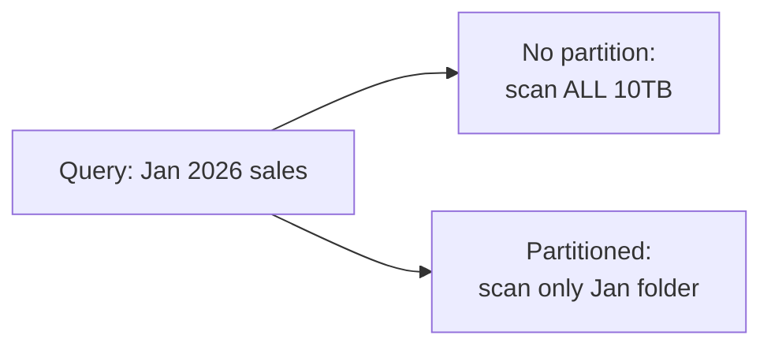
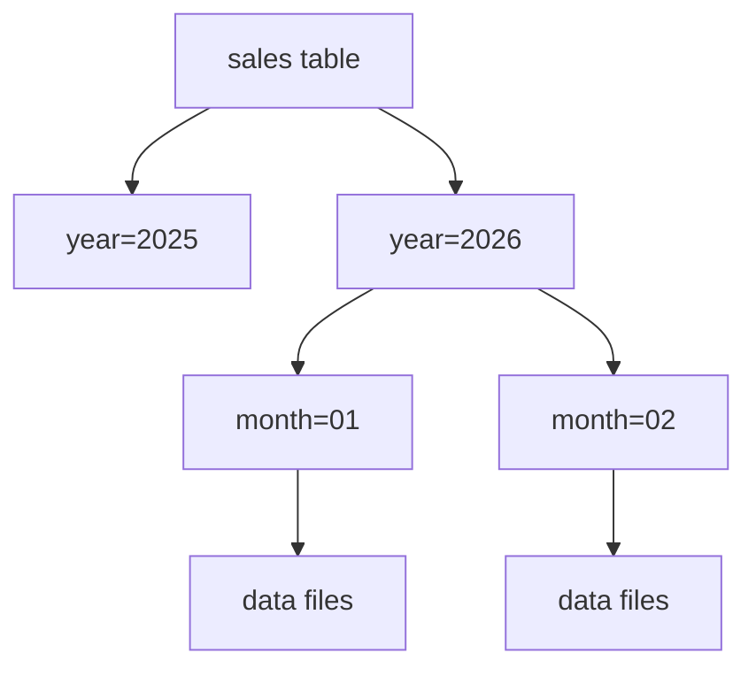
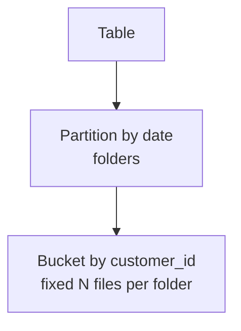
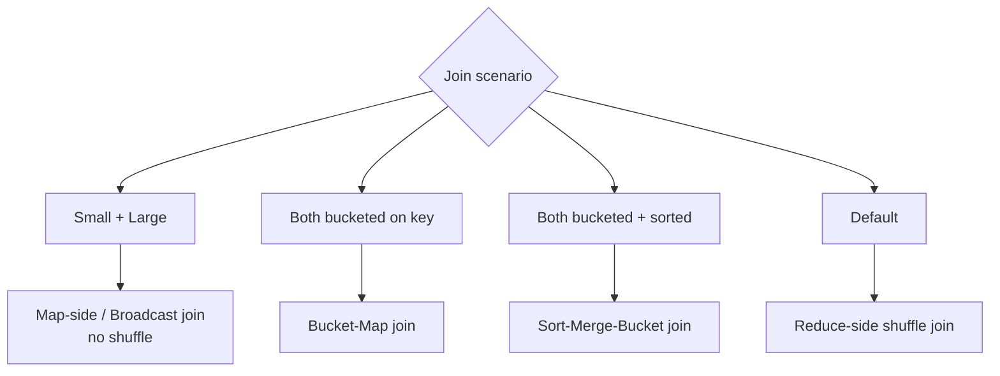

# Part 9 — Hive: Partitioning, Bucketing & Joins

> Section goal: Make Hive *fast* at scale. Master partitioning (static & dynamic) to skip irrelevant data, bucketing to organize within partitions, and the optimized join strategies (map-side, bucket-map, sort-merge, skew) that big tables demand.

Covers index items **9** (Module 2, Class 4: static & dynamic partitioning, bucketing, map-side join, bucket-map join, sorted-merge join, skew join, file formats applied).

---

## 1. The Problem: Full Table Scans

By default, a Hive query reads **every file** in a table. On a 10 TB table, asking "sales in January 2026" scans all 10 TB even though you want a sliver. **Partitioning** and **bucketing** fix this.



---

## 2. Partitioning — Divide Data Into Folders

A **partition** physically splits a table into subdirectories based on a column's value. Hive then reads only the relevant folders — called **partition pruning**.

### 🔍 Plain-English deep-dive
- **Analogy:** a filing cabinet with one drawer per year/month. To find January's invoices you open one drawer, not the whole cabinet.
- On disk, a table partitioned by `year, month` looks like:
```
/warehouse/sales/year=2026/month=01/data files
/warehouse/sales/year=2026/month=02/data files
```
- The partition column is **not stored in the files** — it's encoded in the folder path, saving space.



### Static partitioning — you specify the partition explicitly
```sql
CREATE TABLE sales_part (
    sale_id INT, product STRING, amount DOUBLE
)
PARTITIONED BY (year INT, month INT)
STORED AS ORC;

-- You name the target partition
INSERT INTO sales_part PARTITION (year=2026, month=1)
SELECT sale_id, product, amount FROM sales_raw WHERE ...;
```

### Dynamic partitioning — Hive decides partitions from the data
```sql
SET hive.exec.dynamic.partition = true;
SET hive.exec.dynamic.partition.mode = nonstrict;

INSERT INTO sales_part PARTITION (year, month)
SELECT sale_id, product, amount, year, month FROM sales_staging;
-- Hive creates a partition for each distinct (year, month) automatically
```

### 🔍 Static vs Dynamic
| | Static | Dynamic |
|---|--------|---------|
| Partition value | You specify manually | Hive infers from data |
| Best when | Few, known partitions | Many/unknown partitions |
| Risk | Tedious for many | Can create too many tiny partitions |
| Setting needed | None | `dynamic.partition=true` |

> 💡 **Pitfall — over-partitioning:** partitioning by a high-cardinality column (e.g., `customer_id` with millions of values) creates millions of tiny folders, hurting performance. Partition by low/medium-cardinality columns like date or region.

---

## 3. Bucketing — Divide Data Into Files (Within Partitions)

**Bucketing** splits data into a fixed number of files (buckets) based on a **hash** of a column. Unlike partitioning (unbounded folders), bucketing gives a *fixed* number of evenly-sized files.

### 🔍 Plain-English deep-dive
- **Analogy:** within each monthly drawer, you sort papers into exactly 4 labeled folders by `hash(customer_id) % 4`. Same customer always lands in the same folder.
- **Why:** enables efficient sampling and very fast joins (matching buckets join directly).

```sql
CREATE TABLE sales_bucketed (
    sale_id INT, customer_id INT, amount DOUBLE
)
CLUSTERED BY (customer_id) INTO 4 BUCKETS
STORED AS ORC;

SET hive.enforce.bucketing = true;
INSERT INTO sales_bucketed SELECT sale_id, customer_id, amount FROM sales_raw;
```

### Partitioning vs Bucketing
| | Partitioning | Bucketing |
|---|--------------|-----------|
| Mechanism | Folders by column value | Files by hash of column |
| Number | Unbounded (one per value) | Fixed (you choose N) |
| Best column | Low cardinality (date, region) | High cardinality (id) |
| Benefit | Partition pruning | Even distribution, fast joins, sampling |
| Can combine? | Yes — partition then bucket | Yes |



---

## 4. Join Strategies in Hive

Joins on huge tables are expensive. Hive offers several strategies; choosing the right one is a top optimization skill.

### 🔍 Plain-English deep-dive: the four join types

**a) Common (Reduce-Side / Shuffle) Join** — the default.
- Both tables are shuffled across the network so matching keys meet at the same reducer. **Analogy:** mailing everyone's records to sorting centers by key. **Cost:** heavy network shuffle.

**b) Map-Side Join (Broadcast Join)** — for one small + one large table.
- The small table is loaded into memory on every mapper and joined locally — **no shuffle**. **Analogy:** giving every worker a pocket copy of the small lookup sheet so they never phone headquarters.
```sql
SET hive.auto.convert.join = true;            -- Hive auto-broadcasts small tables
-- or hint:
SELECT /*+ MAPJOIN(small) */ * FROM large l JOIN small s ON l.id=s.id;
```

**c) Bucket-Map Join** — both tables bucketed on the join key by compatible bucket counts.
- Only matching buckets are joined, in memory, mapper-side. **Analogy:** both filing systems use the same 4-folder scheme, so folder 1 only ever joins folder 1.
```sql
SET hive.optimize.bucketmapjoin = true;
```

**d) Sort-Merge Bucket (SMB) Join** — buckets are also **sorted** on the join key.
- Joins by merging sorted streams — extremely efficient for large–large joins, no full shuffle. **Analogy:** merging two already-sorted lists by walking both at once.
```sql
SET hive.optimize.bucketmapjoin.sortedmerge = true;
SET hive.auto.convert.sortmerge.join = true;
```



| Join | Requires | Avoids shuffle? | Best for |
|------|----------|-----------------|----------|
| Reduce-side (common) | Nothing | No | Generic fallback |
| Map-side (broadcast) | One small table | Yes | Big + small lookup |
| Bucket-map | Both bucketed on key | Mostly | Big + medium bucketed |
| Sort-merge-bucket | Bucketed + sorted | Yes | Big + big |

### e) Skew Join — handling lopsided data
**Data skew** = one key has hugely more rows than others (e.g., 90% of events are `user_id = guest`). That one reducer becomes a bottleneck.
- **Skew join** splits the hot key into a separate, parallelized job. **Analogy:** opening extra checkout lanes just for the one customer with 500 items so the rest aren't stuck.
```sql
SET hive.optimize.skewjoin = true;
SET hive.skewjoin.key = 100000;   -- threshold to treat a key as skewed
```

> 💡 **Interview gold:** "How do you optimize a Hive join?" → broadcast the small table (map-side join), bucket+sort both tables on the key (SMB join), and enable skew-join handling for hot keys.

---

## 5. Bringing File Formats Into Play

Partitioning/bucketing combine with columnar formats for maximum speed:
- Partition by **date** → prune to relevant days.
- Store as **ORC/Parquet** → read only needed columns + compression.
- Bucket + sort on the **join key** → SMB joins.

This layered strategy is exactly what the capstone project builds.

---

## 🧪 Lab 9 — Partition, Bucket & Optimize Joins

> On your Dataproc Hive shell.

### Step 1 — Staging table with raw data
```sql
USE shop;
CREATE TABLE sales_staging (
    sale_id INT, product STRING, customer_id INT, amount DOUBLE, yr INT, mo INT)
ROW FORMAT DELIMITED FIELDS TERMINATED BY ',' STORED AS TEXTFILE;
```
Load a CSV with several months of data (yr, mo columns included).

### Step 2 — Dynamic partitioning
```sql
SET hive.exec.dynamic.partition = true;
SET hive.exec.dynamic.partition.mode = nonstrict;

CREATE TABLE sales_part (
    sale_id INT, product STRING, customer_id INT, amount DOUBLE)
PARTITIONED BY (yr INT, mo INT)
STORED AS ORC;

INSERT INTO sales_part PARTITION (yr, mo)
SELECT sale_id, product, customer_id, amount, yr, mo FROM sales_staging;

-- See the partitions Hive created
SHOW PARTITIONS sales_part;

-- Partition pruning in action (only reads yr=2026/mo=1 folder)
SELECT SUM(amount) FROM sales_part WHERE yr=2026 AND mo=1;
```

### Step 3 — Bucketing
```sql
SET hive.enforce.bucketing = true;
CREATE TABLE sales_bucketed (
    sale_id INT, customer_id INT, amount DOUBLE)
CLUSTERED BY (customer_id) SORTED BY (customer_id) INTO 4 BUCKETS
STORED AS ORC;

INSERT INTO sales_bucketed
SELECT sale_id, customer_id, amount FROM sales_staging;
```

### Step 4 — Map-side join (broadcast a small dimension)
```sql
CREATE TABLE customers (customer_id INT, name STRING, city STRING) STORED AS ORC;
-- (load a small customers table)

SET hive.auto.convert.join = true;
SELECT c.name, SUM(s.amount) AS spend
FROM sales_bucketed s
JOIN customers c ON s.customer_id = c.customer_id   -- small table auto-broadcast
GROUP BY c.name;
```

### Step 5 — Enable skew handling and SMB join
```sql
SET hive.optimize.skewjoin = true;
SET hive.optimize.bucketmapjoin = true;
SET hive.optimize.bucketmapjoin.sortedmerge = true;
```

✅ **Checkpoint:** You dynamically partitioned into ORC, observed partition pruning, bucketed+sorted on the join key, and ran an auto-broadcast map-side join with skew handling enabled. This is production-grade Hive tuning.

---

## ⭐ Likely Interview Questions for This Section

**Q1. "What is partitioning in Hive and how does it help?"**
> *Model answer:* Partitioning splits a table into subdirectories by a column's value (e.g., date). Queries filtering on that column read only the relevant folders — partition pruning — avoiding full table scans.

**Q2. "Static vs dynamic partitioning?"**
> *Model answer:* Static: you name the partition explicitly on insert — good for few known partitions. Dynamic: Hive creates partitions automatically from the data's column values — good for many/unknown partitions, but you must enable it and avoid over-partitioning.

**Q3. "What is bucketing and how does it differ from partitioning?"**
> *Model answer:* Bucketing hashes a column into a fixed number of files for even distribution, sampling, and faster joins. Partitioning creates an unbounded number of folders by value. Partition on low-cardinality columns (date); bucket on high-cardinality columns (id). They can be combined.

**Q4. "What is a map-side (broadcast) join?"**
> *Model answer:* When one table is small enough to fit in memory, Hive loads it into every mapper and joins locally, eliminating the network shuffle — ideal for a large fact table joined to a small dimension.

**Q5. "What is a sort-merge-bucket (SMB) join?"**
> *Model answer:* When both tables are bucketed and sorted on the join key with compatible bucket counts, Hive merges the sorted buckets directly — efficient for large-to-large joins without a full shuffle.

**Q6. "What is data skew and how do you handle a skew join?"**
> *Model answer:* Skew is when one key has disproportionately many rows, overloading a single reducer. Enabling hive.optimize.skewjoin splits the hot key into a separate parallel job so it doesn't bottleneck the rest.

**Q7. "What is over-partitioning and why is it bad?"**
> *Model answer:* Partitioning on a high-cardinality column creates millions of tiny folders/files, overwhelming the NameNode and slowing queries. Choose low-to-medium-cardinality partition keys like date or region.

**Q8. "How would you optimize a slow Hive join between two large tables?"**
> *Model answer:* Bucket and sort both tables on the join key for an SMB join, store as ORC/Parquet, partition to prune irrelevant data, broadcast any small dimension as a map-side join, and enable skew-join handling.

---

## 🧠 30-Second Memory Hooks
- **Partition** = folders by value (date/region) → **pruning** skips irrelevant data.
- **Bucket** = fixed N files by hash(column) → even sizes, sampling, fast joins.
- **Partition = low cardinality; bucket = high cardinality.** Over-partitioning = millions of tiny files (bad).
- **Map-side join** = broadcast the small table, no shuffle.
- **SMB join** = bucketed + sorted both sides → merge sorted streams (big+big).
- **Skew join** = extra lanes for the one giant key.

---

*Next suggested section:* **Part 10 — Apache Kafka** (batch analytics done; now learn real-time streaming for data in motion).
