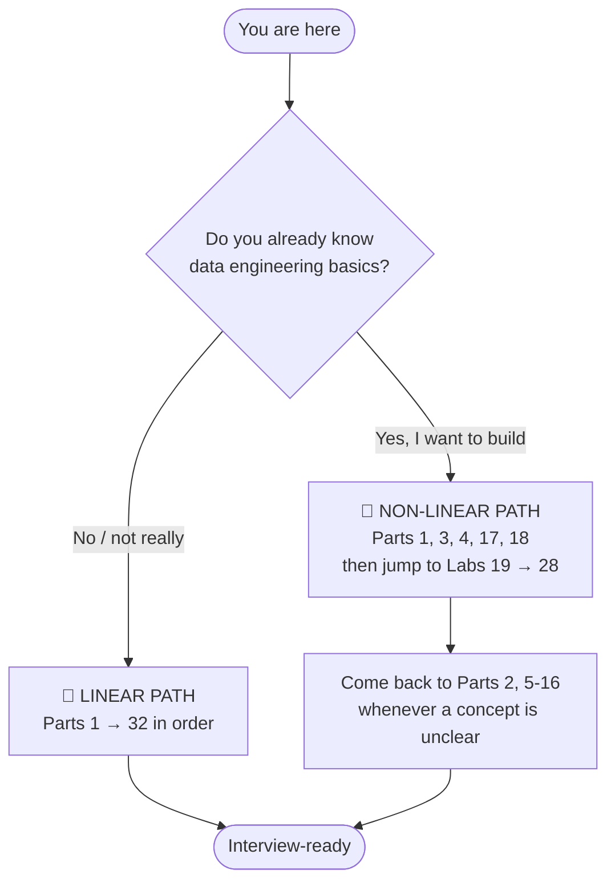
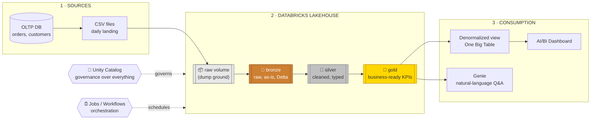
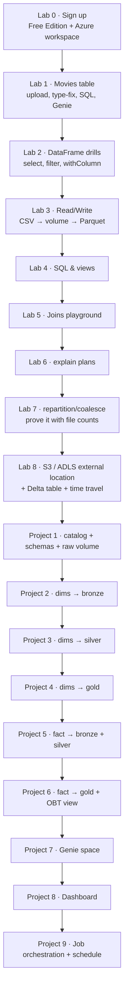
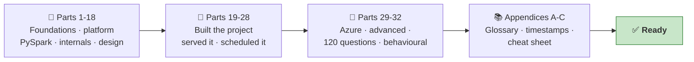

# Databricks — Complete Study Guide

> **Source:** 3h 35m Databricks micro-course transcript (codebasics) — foundations + an end-to-end e-commerce data engineering project.
> **Built for:** learning from zero **+** job-interview preparation.
> **Style:** every term explained before it is used, plain-English analogies, Mermaid diagrams everywhere, click-by-click labs (Databricks Free Edition **and** Azure Databricks), interview Q&As and memory hooks in every Part.

---

## 📌 How to use this guide

There are **two learning paths**, exactly as the course offers:

| Path | Who it's for | Order to read |
|------|--------------|---------------|
| 🐢 **Linear** | New to data engineering / Spark | Part 1 → Part 32, in sequence, then the Appendices |
| 🐇 **Non-linear** | Want to build first, theory later | 1 → 3 → 4 → 17 → 18 → 19-28, then backfill 2, 5-16, then 30-32 |
| 🎯 **Interview crunch (48h)** | Interview is imminent | 2 → 12 → 13 → 14 → 15 → 16 → 17 → 5 → 7 → 30 → 31 → 32 |
| ☁️ **Azure-focused** | Your job/target role is Azure | 3 → 4 → **29** → 5 → 6 → 7 → then the project labs (19-28) |

**Conventions used throughout**

| Marker | Meaning |
|--------|---------|
| 🔍 **Plain-English deep-dive** | The dense concept, re-explained with an analogy |
| 🧪 **LAB** | Hands-on, click-by-click. Do not skip. |
| ☁️ **Azure note** | How this differs on Azure Databricks vs Free Edition/AWS |
| ⚠️ **Gotcha** | Something that breaks for most people the first time |
| ⭐ **Interview** | This exact thing gets asked in interviews |
| 🧠 **Memory hook** | 30-second recall cue |
| **Navigation** | Every Part ends with ⬅️ previous · 🏠 this index · ➡️ next, so you can read straight through without coming back here |

---

## 🗺️ The whole course in one picture

---

## 📚 Part index (grouped, foundations → applied → interview)

### Group A — Orientation & Why Databricks Exists
| # | Part | What you'll get |
|---|------|-----------------|
| 1 | [**Course Map, the A2Z Story & the Problem Statement**](databricks-notes/Part-01-course-map-story-problem-statement.md) | The business narrative (Tony, Bruce, Peter), the 3 acceptance criteria (better than current ETL, easy adoption, fits roadmap = scalable + agile + unified), what "big data" actually means (and why it isn't a size), the 5 Vs mapped to the layer that fixes each, why Python-script ETL breaks at scale, glossary of every term used in the course |
| 2 | [**Distributed Computing, Hadoop & Apache Spark**](databricks-notes/Part-02-distributed-computing-hadoop-spark.md) | The 2,000-puris analogy, map-reduce, driver/worker clusters, fault tolerance, why Hadoop was slow (disk) and Spark is fast (memory), PySpark, self-hosted vs managed (the event-planner analogy) |
| 3 | [**What Databricks Actually Is — Lakehouse, Editions & Cloud Flavours**](databricks-notes/Part-03-what-databricks-is-lakehouse-editions.md) | Data lake vs warehouse vs lakehouse, the platform's components, Free Edition vs Premium, Databricks on Azure vs AWS vs GCP, DBU pricing model basics |

### Group B — Get In and Look Around
| # | Part | What you'll get |
|---|------|-----------------|
| 4 | 🧪 [**LAB — Account Setup & Full UI Tour**](databricks-notes/Part-04-lab-account-setup-ui-tour.md) | Free Edition signup click-by-click; ☁️ **creating an Azure Databricks workspace in the Azure Portal** click-by-click; every left-nav item explained; upload `movies.csv`; fix a column type; first SQL query; connect to serverless compute; first Genie question |
| 5 | [**Unity Catalog — Governance & the 3-Level Namespace**](databricks-notes/Part-05-unity-catalog-governance.md) | catalog → schema → table/volume/view/model; groups vs users; grants at every level; data lineage; discovery & tags; Unity REST API; 🧪 lab creating `dev`/`prod` catalogs, groups and permissions |
| 6 | [**Tables & Volumes — Managed vs External**](databricks-notes/Part-06-tables-volumes-managed-vs-external.md) | Data vs metadata; `DESCRIBE EXTENDED`; managed vs external decision table; volumes (managed & external); 🧪 AWS S3 external-location lab (as in the course) **and** ☁️ the full Azure ADLS Gen2 + Access Connector equivalent |
| 7 | [**Delta Lake — ACID, Time Travel & the Transaction Log**](databricks-notes/Part-07-delta-lake-acid-time-travel.md) | ACID explained with the bank-transfer story; copy-on-write vs transaction-log versioning; `_delta_log` anatomy; `VERSION AS OF` / `TIMESTAMP AS OF` / `RESTORE`; Delta = Parquet + log + metadata; OPTIMIZE, VACUUM, Z-Order teaser; 🧪 create-update-time-travel lab |

### Group C — PySpark Hands-On
| # | Part | What you'll get |
|---|------|-----------------|
| 8 | 🧪 [**DataFrame Fundamentals**](databricks-notes/Part-08-dataframe-fundamentals.md) | The `spark` session object; `spark.table()`; `display()` vs `.show()`; `printSchema`, `count`, `columns`, `describe`, `summary`; column filtering (`select`), row filtering (all 3 syntaxes), `distinct`, `withColumn`, `withColumnRenamed`; immutability; the AI-assist (`Ctrl+I`) trick |
| 9 | 🧪 [**Reading & Writing Data**](databricks-notes/Part-09-reading-writing-data.md) | `spark.read.csv` vs `.format().load()`; `header`, `inferSchema`, `dateFormat` options; explicit `StructType` schemas; write modes (`overwrite`, `append`, `error`, `ignore`); Parquet output; uploading files to a volume |
| 10 | 🧪 [**SQL in Spark**](databricks-notes/Part-10-sql-in-spark.md) | `spark.sql()` (Python API) vs `%sql` magic; `_sqlDF`; `createOrReplaceTempView` vs `createOrReplaceGlobalTempView`; scoping rules; when to use which |
| 11 | 🧪 [**Joins in Spark**](databricks-notes/Part-11-joins-in-spark.md) | inner / left / right / full / left-semi / left-anti explained with the exact customer-order data from the course; aliases; disambiguating duplicate column names; composite (multi-key) joins; null-matching behaviour |

### Group D — Spark Internals (the interview goldmine)
| # | Part | What you'll get |
|---|------|-----------------|
| 12 | [**Query Plans, Catalyst, AQE & Photon**](databricks-notes/Part-12-query-plans-catalyst-aqe-photon.md) | `.explain()`, `.explain("extended")`, `.explain("formatted")`; parsed → analyzed → optimized logical plan → physical plans → cost model → best plan; predicate pushdown & column pruning read line-by-line from real output; Adaptive Query Execution; Project Tungsten & whole-stage codegen (the `*(1)` markers); the Photon C++ vectorized engine; the Google-Maps analogy |
| 13 | [**Spark Architecture & Execution Model**](databricks-notes/Part-13-spark-architecture-execution-model.md) | Driver, executors, cluster manager; partitions → tasks; jobs → stages → tasks; the exact whiteboard diagram interviewers ask for; how Databricks serverless hides all of it |
| 14 | [**Transformations vs Actions & Lazy Evaluation**](databricks-notes/Part-14-transformations-actions-lazy-evaluation.md) | Full transformation/action reference tables; the recipe-vs-cooking analogy; the 4 benefits of laziness (query optimization, avoid unnecessary work, memory efficiency, fault tolerance) with worked examples |
| 15 | [**Narrow vs Wide Transformations & the Shuffle**](databricks-notes/Part-15-narrow-wide-transformations-shuffle.md) | Why `filter`/`select` are cheap and `groupBy`/`join`/`orderBy` are expensive; what a shuffle physically does; reading `Exchange` in a plan; shuffle-partition tuning |
| 16 | 🧪 [**Partitions, Parallelism, `repartition` vs `coalesce`**](databricks-notes/Part-16-partitions-repartition-coalesce.md) | Partition = unit of parallelism; hash partitioning by key vs round-robin; when repartitioning pays for itself; coalesce rules (only reduces, minimizes movement); small-file problem; data skew & salting (bonus); lab writing Parquet to *prove* the partition count |

### Group E — Architecture & Modeling
| # | Part | What you'll get |
|---|------|-----------------|
| 17 | [**Medallion Architecture (Bronze / Silver / Gold)**](databricks-notes/Part-17-medallion-architecture.md) | The website-analytics worked example row-by-row; why raw ≠ bronze; what belongs in each layer; the "product 0/1/2/3" real-world variant; the exact interview answer |
| 18 | [**The Project Blueprint — Data Model & Source Datasets**](databricks-notes/Part-18-project-blueprint-data-model.md) | Fact vs dimension tables; star schema; a field-by-field walkthrough of all 6 source datasets (brands, categories, products, customers, calendar, order_items); the deliberate data-quality defects planted in each file and why |

### Group F — The End-to-End Project (all labs)
| # | Part | What you'll get |
|---|------|-----------------|
| 19 | [**Legacy vs Databricks Architecture**](databricks-notes/Part-19-legacy-vs-databricks-architecture.md) | The old AWS stack (Python pull → S3 → Lambda/Glue/EC2 → Redshift → BI) and its 3 failures; the new lakehouse design; ☁️ the Azure equivalent diagram (ADF/ADLS/Synapse → Azure Databricks) |
| 20 | 🧪 [**LAB 1 — Environment Setup**](databricks-notes/Part-20-lab-environment-setup.md) | `CREATE CATALOG ecommerce`; `USE CATALOG`; bronze/silver/gold schemas; `SHOW DATABASES`; `DROP CATALOG … CASCADE`; creating the `source_data` schema and `raw` managed volume; uploading all source folders |
| 21 | 🧪 [**LAB 2 — Dimensions → Bronze**](databricks-notes/Part-21-lab-dimensions-bronze.md) | Explicit `StructType` per dimension; reading CSV from a volume; adding audit/metadata columns (`source_file`, `ingested_at`); `saveAsTable` in Delta with `mergeSchema`; repeating for all 5 dimensions (full code, not just brands) |
| 22 | 🧪 [**LAB 3 — Dimensions → Silver**](databricks-notes/Part-22-lab-dimensions-silver.md) | Every cleaning technique in the course, in full: `trim`, `regexp_replace` with regex explained character-by-character, anomaly `replace`, `dropDuplicates`, `upper`/`initcap`, unit stripping + casting, spelling fixes with `when/otherwise`, `abs`, null strategy (drop vs fill), `to_date`, quarter/week enrichment, renames |
| 23 | 🧪 [**LAB 4 — Dimensions → Gold**](databricks-notes/Part-23-lab-dimensions-gold.md) | Denormalising products + brands + categories with a CTE join; the country→state→region mapping dictionary → DataFrame → join; date-dimension enrichment (`is_weekend`, `date_id`, `month_name`); column re-ordering |
| 24 | 🧪 [**LAB 5 — Fact Table → Bronze & Silver**](databricks-notes/Part-24-lab-fact-bronze-silver.md) | Ingesting 90 daily landing CSVs (183k rows) with an all-string schema and *why*; spotting the 5 planted defects; silver fixes: text→numeric quantities, `$` stripping, `%` → decimal, coupon lowercasing, channel code → descriptive name, `to_date`/`to_timestamp`, `processed_at` |
| 25 | 🧪 [**LAB 6 — Fact Table → Gold + the Reporting View**](databricks-notes/Part-25-lab-fact-gold-reporting-view.md) | Deriving `gross_amount`, `discount_amount`, `sales_amount` (+ tax), `date_id`, `coupon_flag`; multi-currency normalization to INR via a rates DataFrame join (and how you'd use a live FX API instead); business-friendly renames; then `CREATE OR REPLACE VIEW` — the denormalized "One Big Table" and why teams build it |

### Group G — Serving & Operating
| # | Part | What you'll get |
|---|------|-----------------|
| 26 | 🧪 [**Genie — Natural-Language Analytics**](databricks-notes/Part-26-genie-natural-language-analytics.md) | Catalog-level AI suggestions; creating a Genie space on the gold layer; why you point Genie at gold and never bronze; prompt/instruction engineering; verifying the generated SQL; the sample question set |
| 27 | 🧪 [**AI/BI Dashboards**](databricks-notes/Part-27-ai-bi-dashboards.md) | Pages, text widgets, datasets; building the monthly-sales line chart by hand *and* via AI suggestion; net-amount-by-category bar; the hour × day heatmap; axis labels & titles; filters; multi-page dashboards by business function |
| 28 | 🧪 [**Orchestration — Jobs, Workflows & Scheduling**](databricks-notes/Part-28-orchestration-jobs-workflows.md) | Historical backfill vs daily incremental; creating notebook tasks; task dependencies & branching; parent/child jobs; cron schedules & file-arrival triggers; retries, alerts & failure handling (bonus); the market-close scheduling pattern from real industry practice |

### Group H — Extra Edge & Interview Preparation
| # | Part | What you'll get |
|---|------|-----------------|
| 29 | ☁️ [**Azure Databricks Deep-Dive**](databricks-notes/Part-29-azure-databricks-deep-dive.md) | Full portal click-through: workspace creation, pricing tiers, ADLS Gen2 + containers, **Access Connector for Azure Databricks** + `Storage Blob Data Contributor` role, Unity Catalog metastore setup, external locations with `abfss://`, secret scopes backed by Key Vault, Entra ID (Azure AD) groups & SCIM, cluster policies, VNet injection & Private Link, ADF/Fabric integration, DBU + VM cost model |
| 30 | [**Miscellaneous & Deeper Topics**](databricks-notes/Part-30-miscellaneous-deeper-topics.md) | Auto Loader, Lakeflow Declarative Pipelines (DLT), Structured Streaming, `MERGE` & SCD Type 2, OPTIMIZE / VACUUM / Z-Order / Liquid Clustering, deletion vectors (merge-on-read), broadcast joins, caching, UDFs vs built-ins, data-quality frameworks (DLT expectations, Great Expectations, dbt tests, Soda/Deequ), Databricks Asset Bundles & CI/CD, competitive landscape (Snowflake, Microsoft Fabric, EMR, BigQuery), certification roadmap, 2026 trends |
| 31 | [**Interview Question Bank — 120 questions**](databricks-notes/Part-31-interview-question-bank.md) | ~21% basic / ~21% intermediate / ~50% advanced, each with a model answer and a cross-reference back to the Part; plus scenario/whiteboard questions, rapid-fire one-liners, red flags, a self-quiz tracker and a one-week revision plan |
| 32 | [**Behavioral & Closing**](databricks-notes/Part-32-behavioral-and-closing.md) | STAR (+Learning); a background→competency translation table; 4 ready-to-adapt STAR stories built from *this* project; "why Databricks / why this role / why you"; questions to ask the interviewer; a one-page night-before cheat sheet |

### Appendices
| # | Appendix | What you'll get |
|---|----------|-----------------|
| A | [**Master Glossary**](databricks-notes/Appendix-A-glossary.md) | Every term in the course, A–Z, in one line each |
| B | [**Transcript Timestamp Index**](databricks-notes/Appendix-B-timestamp-index.md) | Jump-to map from every topic back to the exact video timestamp |
| C | [**PySpark & SQL Cheat Sheet**](databricks-notes/Appendix-C-pyspark-sql-cheatsheet.md) | Every command used in the course, grouped by task, copy-paste ready |

---

## ✅ Progress tracker

| # | File | Status |
|---|------|--------|
| 1 | [Course Map, Story & Problem Statement](databricks-notes/Part-01-course-map-story-problem-statement.md) | ✅ Done |
| 2 | [Distributed Computing, Hadoop & Spark](databricks-notes/Part-02-distributed-computing-hadoop-spark.md) | ✅ Done |
| 3 | [What Databricks Is — Lakehouse & Editions](databricks-notes/Part-03-what-databricks-is-lakehouse-editions.md) | ✅ Done |
| 4 | [LAB — Account Setup & UI Tour](databricks-notes/Part-04-lab-account-setup-ui-tour.md) | ✅ Done |
| 5 | [Unity Catalog](databricks-notes/Part-05-unity-catalog-governance.md) | ✅ Done |
| 6 | [Tables & Volumes — Managed vs External](databricks-notes/Part-06-tables-volumes-managed-vs-external.md) | ✅ Done |
| 7 | [Delta Lake — ACID & Time Travel](databricks-notes/Part-07-delta-lake-acid-time-travel.md) | ✅ Done |
| 8 | [DataFrame Fundamentals](databricks-notes/Part-08-dataframe-fundamentals.md) | ✅ Done |
| 9 | [Reading & Writing Data](databricks-notes/Part-09-reading-writing-data.md) | ✅ Done |
| 10 | [SQL in Spark](databricks-notes/Part-10-sql-in-spark.md) | ✅ Done |
| 11 | [Joins in Spark](databricks-notes/Part-11-joins-in-spark.md) | ✅ Done |
| 12 | [Query Plans, Catalyst, AQE & Photon](databricks-notes/Part-12-query-plans-catalyst-aqe-photon.md) | ✅ Done |
| 13 | [Spark Architecture & Execution Model](databricks-notes/Part-13-spark-architecture-execution-model.md) | ✅ Done |
| 14 | [Transformations vs Actions & Lazy Evaluation](databricks-notes/Part-14-transformations-actions-lazy-evaluation.md) | ✅ Done |
| 15 | [Narrow vs Wide Transformations & Shuffle](databricks-notes/Part-15-narrow-wide-transformations-shuffle.md) | ✅ Done |
| 16 | [Partitions, repartition vs coalesce](databricks-notes/Part-16-partitions-repartition-coalesce.md) | ✅ Done |
| 17 | [Medallion Architecture](databricks-notes/Part-17-medallion-architecture.md) | ✅ Done |
| 18 | [Project Blueprint — Data Model](databricks-notes/Part-18-project-blueprint-data-model.md) | ✅ Done |
| 19 | [Legacy vs Databricks Architecture](databricks-notes/Part-19-legacy-vs-databricks-architecture.md) | ✅ Done |
| 20 | [LAB 1 — Environment Setup](databricks-notes/Part-20-lab-environment-setup.md) | ✅ Done |
| 21 | [LAB 2 — Dimensions → Bronze](databricks-notes/Part-21-lab-dimensions-bronze.md) | ✅ Done |
| 22 | [LAB 3 — Dimensions → Silver](databricks-notes/Part-22-lab-dimensions-silver.md) | ✅ Done |
| 23 | [LAB 4 — Dimensions → Gold](databricks-notes/Part-23-lab-dimensions-gold.md) | ✅ Done |
| 24 | [LAB 5 — Fact → Bronze & Silver](databricks-notes/Part-24-lab-fact-bronze-silver.md) | ✅ Done |
| 25 | [LAB 6 — Fact → Gold + Reporting View](databricks-notes/Part-25-lab-fact-gold-reporting-view.md) | ✅ Done |
| 26 | [Genie — Natural-Language Analytics](databricks-notes/Part-26-genie-natural-language-analytics.md) | ✅ Done |
| 27 | [AI/BI Dashboards](databricks-notes/Part-27-ai-bi-dashboards.md) | ✅ Done |
| 28 | [Orchestration — Jobs & Workflows](databricks-notes/Part-28-orchestration-jobs-workflows.md) | ✅ Done |
| 29 | [Azure Databricks Deep-Dive](databricks-notes/Part-29-azure-databricks-deep-dive.md) | ✅ Done |
| 30 | [Miscellaneous & Deeper Topics](databricks-notes/Part-30-miscellaneous-deeper-topics.md) | ✅ Done |
| 31 | [Interview Question Bank (120)](databricks-notes/Part-31-interview-question-bank.md) | ✅ Done |
| 32 | [Behavioral & Closing](databricks-notes/Part-32-behavioral-and-closing.md) | ✅ Done |
| A | [Appendix — Master Glossary](databricks-notes/Appendix-A-glossary.md) | ✅ Done |
| B | [Appendix — Transcript Timestamp Index](databricks-notes/Appendix-B-timestamp-index.md) | ✅ Done |
| C | [Appendix — PySpark & SQL Cheat Sheet](databricks-notes/Appendix-C-pyspark-sql-cheatsheet.md) | ✅ Done |

Legend: ⬜ Not started · 🟨 In progress · ✅ Done

---

## 🧪 Lab inventory (what you will actually build)

---

## 📥 Before you start — what to have ready

| Item | Where to get it | Needed for |
|------|-----------------|------------|
| Databricks **Free Edition** account | `databricks.com` → *Try Databricks* → **Free Edition** (personal use) | Everything |
| `movies.csv` | Course resources (video description) | Parts 4, 8, 10, 12, 16 |
| `orders.csv` | Course resources | Part 9 |
| Project source folder (brands, categories, products, customers, date_dim, order_items) | Course resources | Parts 20–28 |
| An **AWS** account (optional) | `aws.amazon.com` → *Create a Free Account* | Part 6/7 external-table labs |
| An **Azure** subscription (optional) | `portal.azure.com` — free tier or pay-as-you-go | Parts 4, 6, 29 (the Azure track) |
| Python basics | — | Helpful, not mandatory; everything is explained |
| SQL basics (`SELECT`, `JOIN`, `GROUP BY`) | — | Helpful, not mandatory |

> ⚠️ **Gotcha:** AWS and Azure both ask for a **credit card** even on free tiers. Every lab in this guide is designed so the **core learning path needs only the free Databricks edition** — cloud accounts are only for the optional external-table parts.

---

## ✅ Guide complete — 32 Parts + 3 Appendices

**The four things that turn this guide into an offer:**

1. **Run the labs.** Reading about `regexp_replace` and debugging your own regex at 11pm are different skills — and interviewers can tell which one you have.
2. **Answer aloud, three passes.** Use the tracker in [Part 31](databricks-notes/Part-31-interview-question-bank.md).
3. **Write your four STAR stories in full** and time them — [Part 32](databricks-notes/Part-32-behavioral-and-closing.md).
4. **Put the project on GitHub** with a README covering the architecture *and* the deliberate simplifications. A hiring manager can click a link; they cannot click your workspace.

> 💡 **If you only have one hour:** read [Part 12](databricks-notes/Part-12-query-plans-catalyst-aqe-photon.md), [Part 13](databricks-notes/Part-13-spark-architecture-execution-model.md) and [Part 17](databricks-notes/Part-17-medallion-architecture.md), then the rapid-fire section of [Part 31](databricks-notes/Part-31-interview-question-bank.md). That's where most interview questions land.