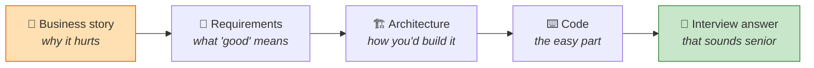
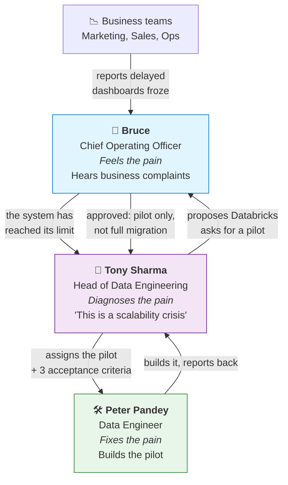
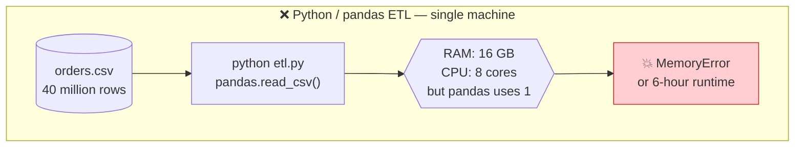
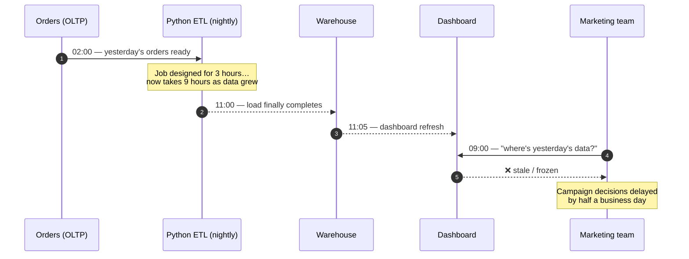
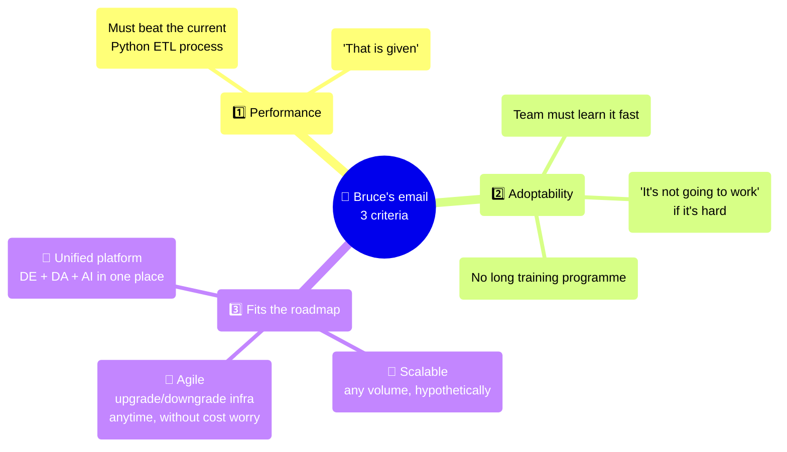
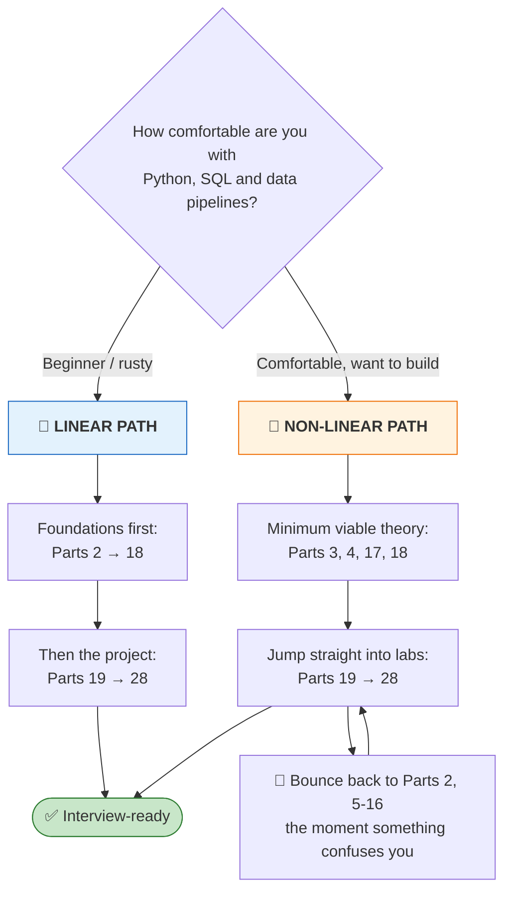

# Part 1 — Course Map, the A2Z Story & the Problem Statement

> **Section goal:** Understand *why* a company reaches for Databricks in the first place, meet the three people whose decisions drive this entire course, and learn the exact acceptance criteria your project must satisfy. By the end you will be able to explain — in business language, not jargon — what problem Databricks solves and how you would evaluate it for a real company.

Covers transcript `00:00:00` – `00:05:22`.

---

## 1. Why start with a story and not with code?

Almost every Databricks tutorial starts with "open a notebook and type `spark.read.csv`". That teaches you *syntax* but not *judgement*. Interviews test judgement.

When an interviewer asks **"Why did your team choose Databricks?"**, the wrong answer is *"because it runs Spark"*. The right answer sounds like this:

> *"Our Python ETL scripts ran on a single machine. As order volume grew, the nightly run started overrunning into business hours, so dashboards showed yesterday's data at 11am instead of 6am. The bottleneck was that we could only scale vertically. We piloted Databricks because it gave us horizontal scale on managed Spark, elastic cost, and one platform for engineering, analytics and ML instead of five stitched-together AWS services."*

That answer comes straight out of the story below. So learn the story.

---

## 2. The company: A2Z

| Attribute | Value |
|-----------|-------|
| Name | **A2Z** *(auto-transcribed; also heard as "A2C" — same company)* |
| Industry | E-commerce |
| Headquarters | United States |
| Stage | Rapidly growing |
| Current data stack | Python-based ETL pipelines |
| Presenting symptom | Pipelines are hard to scale → performance bottlenecks → **delayed dashboards** |

> As their business expands, **both the volume and the velocity of their data have exploded.**

### 🔍 Plain-English deep-dive: what "big data" actually means

**Big data is not a size.** There is no row count above which data becomes "big". The working definition — and the one to give in an interview — is:

> **Data is "big" when it can no longer be processed by a single machine within the time you have available.**

That is deliberately relative. 50 GB is "big" on a laptop with 8 GB of RAM and trivial on a 512 GB server. The same dataset can be big for A2Z on Monday and ordinary on Tuesday after they add nodes. What matters is the *mismatch* between the work and the machine — which is exactly A2Z's situation, and exactly why the answer is "more machines" (Part 2) rather than "better Python".

These three words show up in every data-engineering job description. They are the classic "3 Vs of big data".

| The V | Plain meaning | Analogy | Why it matters at A2Z |
|-------|---------------|---------|------------------------|
| **Volume** | *How much* data there is. | The size of the pile of laundry. | Order history grew from thousands of rows to hundreds of millions. One computer's RAM can no longer hold it. |
| **Velocity** | *How fast* new data arrives. | How fast dirty clothes are added to the pile *while you're washing*. | Orders arrive continuously; a batch job that takes 8 hours is already 8 hours stale when it finishes. |
| **Variety** | *How many shapes* the data comes in. | Shirts, jeans, curtains, a duvet — different wash settings. | CSV landing files, relational tables, JSON clickstream, images — all need one platform. |

> 💡 Two more Vs get added in most modern lists, and both map to something you'll build:
> - **Veracity** — *how trustworthy* the data is. This is what the entire **Silver layer** exists to fix (Part 17, built hands-on in Part 22).
> - **Value** — whether any of it produces a business outcome. That's the **Gold layer**, the dashboard and Genie (Parts 23–27). Data with no consumer is cost, not an asset.

> ⭐ **Interview:** *"What is big data?"* → *"I'd avoid quoting a threshold, because there isn't one. My working definition is data that can't be processed on a single machine within the time budget you have — so it's a relationship between the workload and the hardware, not an absolute size. The Vs are the useful vocabulary for describing *which* dimension is hurting: volume, velocity, variety, and then veracity and value. That matters practically, because the fix differs. A volume problem wants horizontal scale, a velocity problem wants streaming or micro-batch, a variety problem wants schema-on-read and an open format, and a veracity problem wants a cleaning layer — throwing more compute at a veracity problem just gives you wrong answers faster."*

---

## 3. Meet the cast

The whole course is framed as three people making one decision. Interviewers love candidates who can name stakeholders, because it proves you've worked with humans and not just notebooks.

| Person | Role | What they care about | Their line in the story |
|--------|------|----------------------|--------------------------|
| **Bruce** *(COO)* | Executive sponsor | Business outcomes, risk, cost | *"Reports were delayed, dashboards froze. Marketing couldn't see yesterday's data on time."* |
| **Tony Sharma** | Head of Data Engineering | Technical strategy, team capability | *"This wasn't just a coding problem. It was a scalability crisis."* |
| **Peter Pandey** | Data Engineer (that's **you**) | Making it actually work | *"I'm excited to start work on this."* |

> ⭐ **Interview relevance:** When you describe a project, always name the *sponsor*, the *problem owner*, and the *builder*. Even in a personal project you can say *"I played the data engineer role against a simulated COO's requirements."* It signals you understand that engineering serves a business.

### 🔍 Plain-English deep-dive: "pilot project", "MVP", "proof of concept"

Bruce agreed to Databricks — **but not a full migration**. He wanted *"a pilot project, a small measurable [scope]"*.

- **Pilot / Proof of Concept (PoC)** — *a small, time-boxed build whose purpose is to answer a question, not to ship a product.* **Analogy:** before re-roofing the whole house, you re-tile one square metre and check it doesn't leak. **Why it matters:** it caps the downside. If Databricks turns out to be wrong, A2Z has burned two weeks, not two years.
- **MVP (Minimum Viable Product)** — *the smallest version that a real user could actually use.* Slightly different: a PoC answers *"can it?"*, an MVP answers *"will they?"*.
- **Migration** — *moving an existing workload from one platform to another.* Expensive, risky, and only justified once the pilot proves the destination works.

> 💡 **This is why the project you build is only 3 months of e-commerce data and 6 tables.** It is deliberately a pilot. Knowing that, you can defend its small scope in an interview instead of apologising for it.

---

## 4. Why did the old system break? (The technical truth behind the story)

The transcript says the Python pipelines *"have become difficult to scale, causing performance bottlenecks and delays in dashboards"* and that *"Python scripts were running out of breath"*. Let's unpack exactly what that means, because **this is a very common interview question**.

### The single-machine ceiling

A plain Python/pandas ETL script runs on **one computer**, using **one process**, holding data in **that machine's RAM**.

Five concrete failure modes:

| # | Failure mode | What actually happens | The Spark answer (Part 2) |
|---|--------------|------------------------|----------------------------|
| 1 | **Memory ceiling** | pandas loads the whole dataset into RAM. 40M rows × 20 columns simply does not fit. | Split data into **partitions** across many machines. |
| 2 | **Single-core execution** | pandas is largely single-threaded; 7 of your 8 CPU cores idle. | **Parallel tasks**, one per partition. |
| 3 | **Vertical-scaling wall** | Your only fix is a bigger machine. Machines have a maximum size, and price grows faster than power. | **Horizontal scaling** — add more machines, not bigger ones. |
| 4 | **No fault tolerance** | The script dies at hour 5 of 6 → start over from zero. | Driver **re-assigns the failed task** to another worker. |
| 5 | **No optimizer** | Your code runs exactly as written, including the wasteful bits. | **Catalyst optimizer** rewrites your query (Part 12). |

### 🔍 Plain-English deep-dive: vertical vs horizontal scaling

- **Vertical scaling ("scale up")** — *make the one machine bigger: more RAM, more CPU.* **Analogy:** hiring one chef and giving them a bigger stove. There's a limit to how big a stove fits in the kitchen, and a super-stove costs 10× a normal one.
- **Horizontal scaling ("scale out")** — *add more machines and split the work.* **Analogy:** hiring four normal chefs with four normal stoves. Cheaper, and you can hire a fifth tomorrow. **Why it matters:** this single idea is the entire reason Spark, and therefore Databricks, exists.

> ⭐ **Interview:** *"Why not just use a bigger EC2 instance?"* → *"Vertical scaling has a hard ceiling and superlinear cost, and it gives you no fault tolerance — if that one big box dies mid-run, you restart from scratch. Horizontal scaling with Spark gives elastic capacity plus task-level recovery."*

### The knock-on business damage

**The chain: data growth → longer runtime → missed SLA → stale dashboards → slower decisions → lost revenue.** Notice the failure is *technical* but the complaint is *commercial*. That's why Bruce, not Tony, escalated it.

### 🔍 Plain-English deep-dive: OLTP, OLAP, ETL, SLA

You'll see these four acronyms constantly from here on.

| Term | Stands for | Plain meaning | Analogy |
|------|-----------|---------------|---------|
| **OLTP** | On-Line **Transaction** Processing | The live operational database that records each individual event as it happens (an order is placed, a payment clears). Optimised for *many tiny writes*. | The **cash register** at the shop. Fast for one sale at a time. |
| **OLAP** | On-Line **Analytical** Processing | The analytics system that answers questions across millions of past events ("revenue by region by quarter"). Optimised for *few huge reads*. | The **accountant's back office** poring over a year of receipts. |
| **ETL** | Extract, Transform, Load | The pipeline that moves data from OLTP to OLAP, cleaning it on the way. | The **courier** who collects receipts, tidies them, files them. |
| **SLA** | Service-Level Agreement | The promise about *when* data will be ready (e.g. "dashboards refreshed by 06:00"). | The **delivery-by-9am guarantee**. Missing it is what got Bruce shouting. |

> ⚠️ **Gotcha:** People say "ETL" out of habit, but modern lakehouse pipelines are usually **ELT** — Extract, **Load** (raw, untouched, into bronze), *then* **Transform** (silver/gold). This project is ELT. Say "ELT" in an interview and explain why, and you'll stand out. More in Part 17.

---

## 5. The requirements: Bruce's three acceptance criteria

This is the most important table in Part 1. Tony reads Bruce's email to Peter and lists **three things Peter must confirm**. Everything you build for the rest of the course exists to prove one of these.

### Criterion 1 — Performance
> *"Of course, it should work better than our current ETL process. That is given."*

Non-negotiable baseline. **Proven by:** Parts 2, 12–16 (distributed execution, Catalyst optimizer, Photon, partition tuning).

### Criterion 2 — Adoptability
> *"The tool should be easy to adopt. I don't want to spend too much time training the entire team."*

A brilliant platform nobody can use is worthless. **Proven by:** the fact that Peter — who had **never used Databricks** — delivered the whole pilot in **about two weeks** (his closing report at `03:34:06`). Also by Databricks supporting plain SQL, plain Python, notebooks and AI assistance so analysts don't have to become Spark experts.

### Criterion 3 — Fits the roadmap (three sub-requirements)

| Sub-requirement | Bruce's words | What it means technically | Where this guide proves it |
|-----------------|---------------|---------------------------|-----------------------------|
| **Scalable** | *"We should be able to accommodate any scale of data, hypothetically."* | Horizontal scale-out; add executors as data grows; no code rewrite required | Parts 2, 13, 16 |
| **Agile** | *"We should be able to upgrade or downgrade infrastructure at any point without worrying about the cost."* | **Elastic** compute — resize or auto-scale clusters; serverless spins up/down on demand; pay for what you use | Parts 3, 4, 29 |
| **Unified** | *"Data engineers, data analysts and AI engineers all working together in one place… simplify our data workflow altogether."* | One governed platform for ingestion, ETL, SQL analytics, BI dashboards and ML — not five glued-together services | Parts 3, 5, 19, 26, 27 |

> 💡 **Tie-in:** Notice Bruce never once says the word "Spark". Executives buy **outcomes** (fresh dashboards, predictable cost, one team), not **technologies**. When you present work upward, translate: *"we cut the pipeline from 9 hours to 40 minutes"*, not *"we repartitioned by studio to avoid a shuffle"*.

### 🔍 Plain-English deep-dive: "elastic" and "agile" infrastructure

- **Elastic** — *capacity that grows and shrinks automatically with demand, and you're billed accordingly.* **Analogy:** a taxi vs owning a car. You pay per ride; you don't pay while it's parked. **Why it matters:** Bruce's "without worrying about the cost" is only possible because you're not paying for idle servers.
- **Serverless** — *elastic taken to its extreme: you never see, size, or manage a machine at all.* **Analogy:** ordering food delivery instead of running a kitchen. You care about the meal, not the ovens. Databricks Free Edition gives you **serverless compute only** — you'll meet it in Part 4.
- **Managed service** — *someone else runs the infrastructure; you consume the capability.* Databricks is a managed Spark service. Part 2 ends with the "event planner" analogy for exactly this.

---

## 6. The definition of done — Peter's closing report

Here's a spoiler that will keep you oriented for the next 30 Parts. At `03:33:41` Peter reports back to Tony. **This is your project's acceptance test.** Read it now; you'll appreciate every lab more.

| Criterion | Peter's verdict | Evidence he cites |
|-----------|-----------------|-------------------|
| **Scalable** | ✅ Pass | *"Easy to upgrade or downgrade capacities, and it is fully managed — you don't have to worry about infrastructure, you can just focus on your business logic."* |
| **Adoptable** | ✅ Pass | *"I spent about two weeks and I was able to get this project done. Adoption won't be difficult for our team."* |
| **Unified** | ✅ Pass | *"It provides almost everything in one place… I really like some of the features like Workflows, Dashboards, Genie."* |

Tony's response: *"This looks positive… Let's give it a boost and wait for Bruce's decision."*

> ⭐ **Interview:** This report *is* your project summary slide. Memorise its shape — **criterion → verdict → concrete evidence**. That's how you answer "tell me about a project you delivered".

---

## 7. Your two learning paths

At `04:47` the course splits. Both are valid; pick honestly.

| | 🐢 Linear | 🐇 Non-linear |
|---|---|---|
| **Best for** | *"I don't know much about data engineering"* | *"I want to get into the action straight away"* |
| **Risk** | Losing motivation before you build anything | Building something you can't explain in an interview |
| **Mitigation** | Do the mini-labs in Parts 8–11 as you go | **Force yourself** to read Parts 12–16 before any interview |

> ⚠️ **Gotcha for the non-linear crowd:** You can complete this entire project without ever understanding a shuffle. You cannot pass a Spark interview without it. Parts 12–16 are where 60% of the technical questions come from. Budget the time.

---

## 8. Complete term list introduced in this Part

Keep this handy; every one of these gets expanded later.

| Term | One-line meaning | Expanded in |
|------|------------------|-------------|
| **Databricks** | A managed cloud platform for data + AI, built around Apache Spark | Part 3 |
| **Apache Spark** | Open-source distributed compute engine for large-scale data processing | Part 2 |
| **Distributed computing** | Splitting one big task across many machines running in parallel | Part 2 |
| **ETL / ELT** | Extract-Transform-Load / Extract-Load-Transform pipeline patterns | Part 17 |
| **OLTP** | The live transactional database (many small writes) | Part 19 |
| **OLAP** | The analytical system (few huge reads) | Part 19 |
| **Data pipeline** | Automated series of steps that moves and reshapes data | Part 28 |
| **Dashboard / BI** | Visual reporting layer business users actually look at | Part 27 |
| **Business intelligence** | Turning raw data into decisions | Part 27 |
| **Scalability** | Ability to handle growing data without redesign | Part 13 |
| **Bottleneck** | The single slowest step that caps end-to-end speed | Part 15 |
| **Pilot / PoC** | Small time-boxed build to answer "will this work for us?" | this Part |
| **Vertical / horizontal scaling** | Bigger machine vs more machines | Part 2 |
| **Elastic / serverless** | Capacity that auto-adjusts; infrastructure you never see | Part 4 |
| **Bronze / Silver / Gold** | The three refinement layers of medallion architecture | Part 17 |
| **Free Edition** | Databricks' no-cost tier for students and practitioners | Part 4 |

### The name-drop you should remember

The course cites **Mercedes-Benz** as a Databricks customer that *"sped up their data-informed decision-making process by enhancing their business intelligence, improved query performance, and ran ML models on sensor data."*

> ⭐ **Interview:** Having one real customer example ready ("Mercedes-Benz uses it for sensor-data ML and BI acceleration") makes a "why Databricks?" answer concrete rather than generic.

---

## ⭐ Likely Interview Questions for This Section

**Q1. "Walk me through a time your existing pipeline stopped scaling. What did you do?"**
> *Model answer:* "Our ETL was a set of Python/pandas scripts on a single VM. As order volume grew, the nightly run stretched from three hours to nine, so the 06:00 dashboard SLA was being missed and marketing was working off two-day-old numbers. Diagnosing it, the constraint wasn't the code — it was that pandas is single-machine and largely single-core, so our only lever was a bigger box, which has a hard ceiling and no fault tolerance. We piloted Databricks to get horizontal scale on managed Spark. We deliberately scoped it as a pilot on three months of data and six tables so we could prove it in two weeks rather than committing to a full migration."

**Q2. "Why Databricks rather than just adding more AWS Glue jobs, or a bigger EC2 instance?"**
> *Model answer:* "Three reasons, matching how our COO framed it. **Scale** — Spark scales out horizontally, so growth is a config change, not a rewrite. **Elasticity** — we can resize or use serverless and pay for what we use, instead of over-provisioning a permanently large instance. **Unification** — with Glue/Lambda/EC2/Redshift our ETL logic was fragmented across four services with opaque billing; Databricks gave engineering, SQL analytics, BI and ML one governed platform. A bigger EC2 instance solves none of those and still leaves us with no task-level fault tolerance."

**Q3. "What's the difference between OLTP and OLAP, and where does your pipeline sit?"**
> *Model answer:* "OLTP is the operational system that records individual transactions — many small, low-latency writes, normalised for integrity. OLAP is the analytical system that scans huge history to answer aggregate questions — few large reads, denormalised for query speed. My pipeline is the bridge: it extracts from OLTP, lands it raw in the lakehouse, then progressively cleans and aggregates it into gold tables that serve the OLAP/BI workload."

**Q4. "You said 'scalable, agile, unified'. Those are buzzwords — define each concretely."**
> *Model answer:* "**Scalable** means I can handle 10× the data by adding executors, with no change to my transformation code. **Agile** means the infrastructure is elastic — I can scale a cluster up for a backfill and down afterwards, or use serverless, so cost tracks usage rather than peak provisioning. **Unified** means one platform and one governance model covers ingestion, transformation, SQL analytics, dashboards and ML — so there's a single permission model and a single lineage graph, instead of four tools each with their own."

**Q5. "How do you decide between a pilot and a full migration?"**
> *Model answer:* "A pilot when the *technology* is unproven for us; a migration when only the *effort* is in question. In this case nobody on the team had used Databricks, so the open question was 'does it actually fit our workloads and can our team learn it?' — that's a PoC question. We time-boxed it to two weeks with explicit pass/fail criteria on performance, adoptability and roadmap fit, so the decision at the end was evidence-based rather than a vendor pitch."

**Q6. "The business complained about dashboards. Why is that a data-engineering problem?"**
> *Model answer:* "Because the dashboard is just the last mile. The visible symptom — 'the dashboard is frozen at 11am' — traces back through refresh time, to warehouse load time, to pipeline runtime, to the fact that the transformation was single-machine. Data engineering owns freshness as an SLA. I'd instrument each stage so we can point to *which* stage broke the SLA rather than arguing about the dashboard tool."

**Q7. "How would you measure whether the Databricks pilot succeeded?"**
> *Model answer:* "Against the three criteria we agreed up front. Performance: end-to-end pipeline runtime versus the existing baseline on the same data. Adoptability: elapsed time for an engineer with no prior Databricks experience to deliver the pilot — ours was about two weeks. Roadmap fit: can we scale by config alone, can we resize infrastructure without renegotiating cost, and can engineers, analysts and ML folks work in one governed workspace. I'd also track cost-per-run so 'faster' doesn't quietly mean 'much more expensive'."

**Q8. "Tony said 'this wasn't a coding problem, it was a scalability crisis.' What's the distinction?"**
> *Model answer:* "A coding problem is fixable inside the current architecture — a bad join, a missing index, an unnecessary loop. A scalability crisis means the architecture itself has hit a structural limit, so no amount of local optimisation gets you there. Recognising which one you have matters, because the responses are completely different: refactor versus re-platform. Ours was structural — single-machine execution — so tuning the Python would have bought months, not years."

---

## 🧠 30-Second Memory Hooks

- **A2Z** = US e-commerce company whose **Python ETL ran out of breath**.
- **Bruce (COO)** feels it → **Tony (Head of DE)** diagnoses it → **Peter (DE)** builds it. *Pain → Plan → Pilot.*
- **Three criteria: Perform, Adopt, Fit.** And "Fit" = **S-A-U → Scalable, Agile, Unified.**
- **"Not a coding problem, a scalability crisis"** = the difference between *refactor* and *re-platform*.
- **Vertical = bigger chef's stove. Horizontal = more chefs.** Spark is more chefs.
- **Pilot, not migration** — cap the downside, decide on evidence.
- **The complaint is always commercial, the cause is always technical.** Stale dashboard ← slow pipeline ← single machine.
- **3 Vs**: Volume (how much), Velocity (how fast), Variety (how many shapes). Veracity (how trustworthy) is what Silver fixes.
- **⭐ "Big data" is not a size** — it's data that won't fit through one machine in the time you have. Relative, not absolute.
- **Match the V to the fix:** volume → scale out · velocity → streaming · variety → open format · veracity → cleaning layer · value → gold layer.
- **Peter's verdict, in his words:** *scalable, fully managed, two weeks to learn, everything in one place.*

---

*Next suggested section:* **[Part 2 — Distributed Computing, Hadoop & Apache Spark](Part-02-distributed-computing-hadoop-spark.md)** — you now know *why* one machine wasn't enough; next you'll learn exactly how many machines are made to act like one, using the 2,000-puris wedding analogy that makes map-reduce click permanently.

---

**Navigation** — ⬅️ *Start of guide* · 🏠 **[Master Index](../Databricks%20-%20Study%20Guide.md)** · ➡️ **[Part 2 — Distributed Computing & Spark](Part-02-distributed-computing-hadoop-spark.md)**
