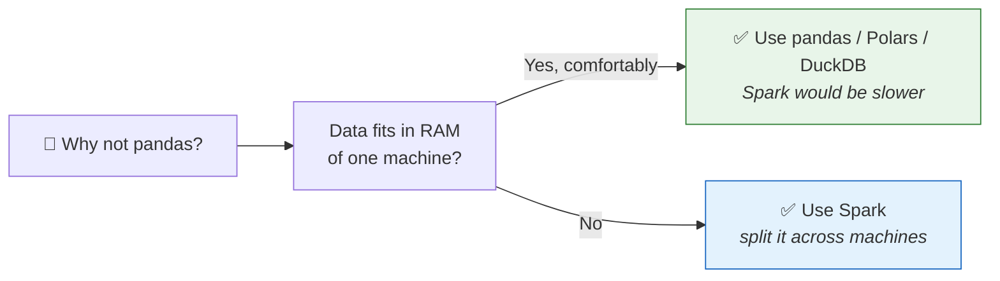
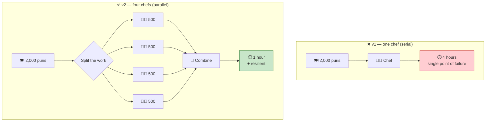
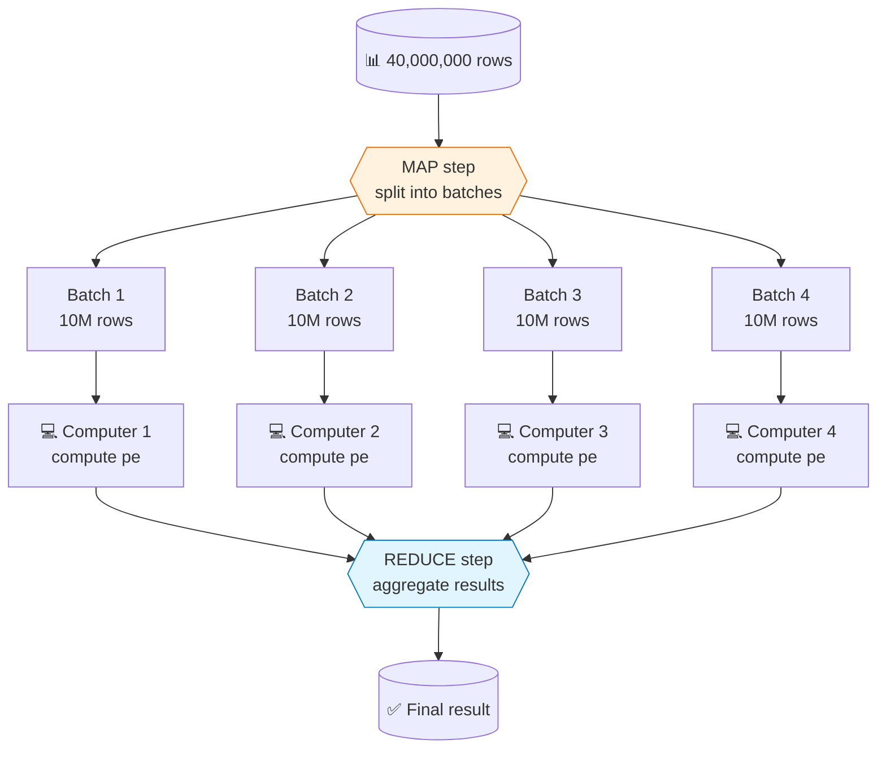
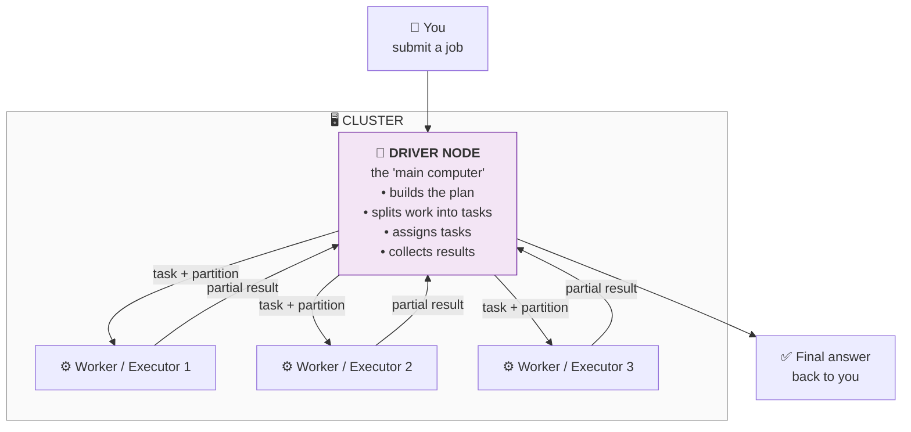
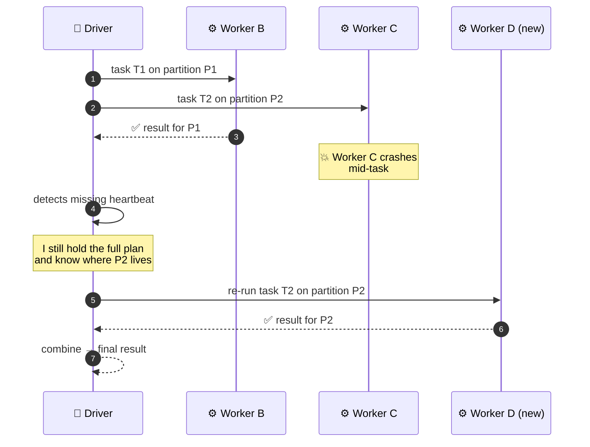
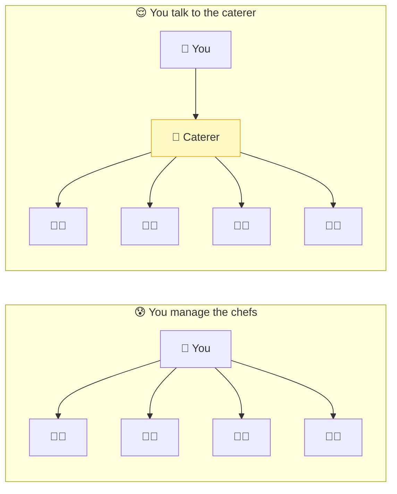
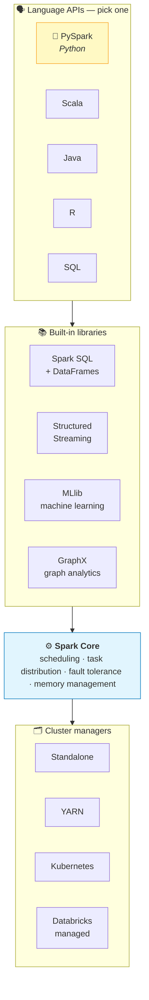
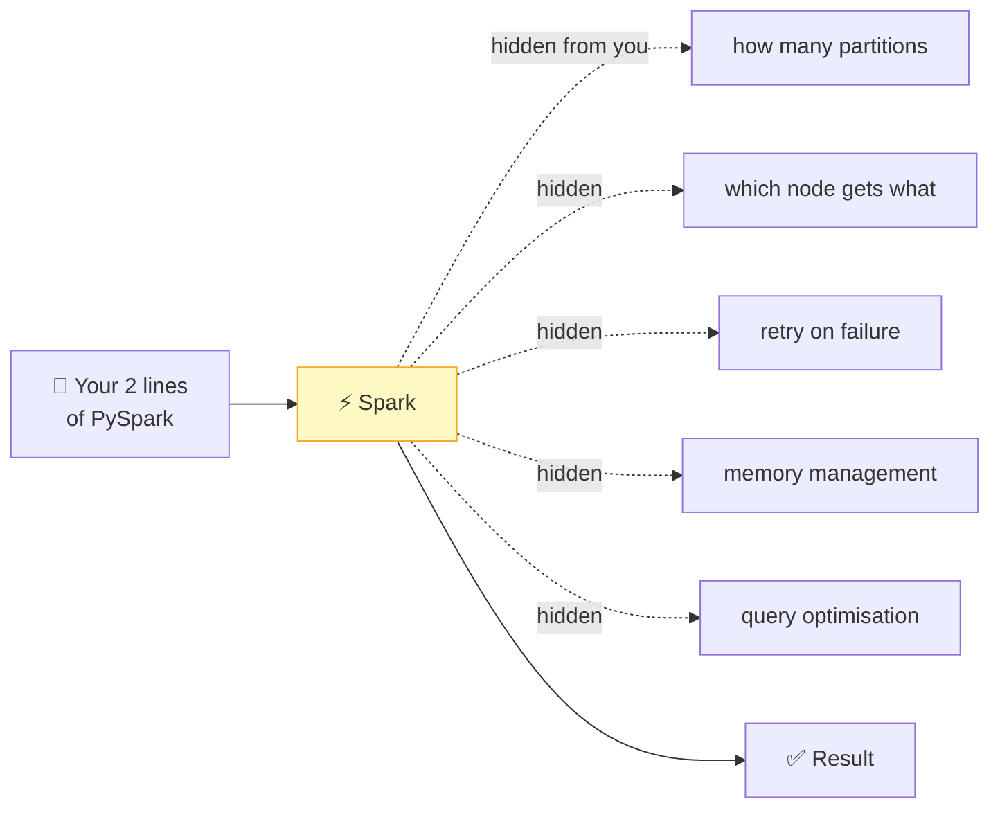
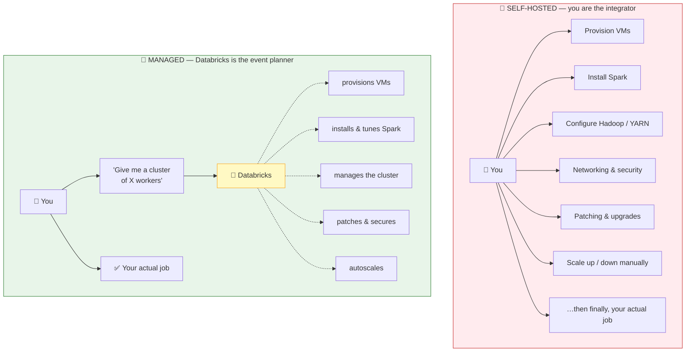

# Part 2 — Distributed Computing, Hadoop & Apache Spark

> **Section goal:** Answer the question every learner secretly asks — *"why can't I just do this in pandas on my laptop?"* — and come out able to draw a Spark cluster on a whiteboard, explain map-reduce with an analogy an executive would understand, and articulate exactly why Spark replaced Hadoop and why Databricks replaced running Spark yourself.

Covers transcript `00:27:57` – `00:34:53` (plus the framing at `00:01:02`).

---

## 1. The question that opens this Part

> *"We just worked on some basic DataFrame operations in Databricks and you might be wondering — how is this different from running a plain Python notebook on my local computer? I can use pandas and do the same thing."*

That is the correct instinct. For a 37-row movies table, **pandas is genuinely better** — faster to start, less ceremony, no cluster. Spark only starts winning when the data stops fitting on one machine.

**The one-word answer is: _distributed computing_.** Everything else in this Part unpacks that word.



> ⚠️ **Gotcha / honesty check:** Spark has real startup overhead — building a plan, scheduling tasks, shuffling data. On a 100 MB file, pandas will beat Spark every time. Saying this in an interview shows judgement, not ignorance. The right framing is: *"Spark is a scale tool, not a speed tool. It wins when the alternative is 'doesn't run at all'."*

---

## 2. The 2,000-puris wedding — the analogy that makes it permanent

The instructor uses his own Indian wedding to explain parallelism. It's the single best mental model in the course, so let's do it properly.

**The problem:** 2,000 *puris* (fried flatbreads) needed for the wedding feast.

| Attempt | Setup | Time | Problem |
|---------|-------|------|---------|
| **v1** | Hire **1 chef** | **4 hours** | Too slow. Also: if that chef falls sick, the whole feast fails. There's a **single point of failure**. |
| **v2** | Hire **4 chefs**, give each **500 puris** | **1 hour** | ✅ 4× faster. If one chef falls ill, redistribute their 500. |



> *"Now this is a common sense concept, right? You can make your work parallel and get it done in a quicker time. Similar thing you can do with computers."*

**Two lessons are hidden in there, and both are core Spark concepts:**

1. **Speed through parallelism** — 4 workers ≈ ¼ the time.
2. **Resilience through redundancy** — losing one worker costs you one worker's share, not the whole job. This becomes **fault tolerance**.

---

## 3. The same idea on computers: map and reduce

Now the compute version. The instructor's example: a table of stock **tickers**, their **price**, and their **EPS**, and you want the **P/E ratio**.

### 🔍 Plain-English deep-dive: the finance terms (so nothing is unexplained)

- **Ticker** — *the short code identifying a listed company* (AAPL, MSFT). **Analogy:** a nickname.
- **EPS (Earnings Per Share)** — *company profit divided by number of shares.* How much profit each share "earned".
- **P/E ratio** — *Price ÷ EPS.* Roughly: how many years of current earnings you're paying for one share. **You don't need finance knowledge** — for our purposes it's just *"a new column computed from two existing columns, row by row."*

| ticker | price | eps | → pe = price / eps |
|--------|-------|-----|--------------------|
| AAPL | 190 | 6.1 | 31.1 |
| MSFT | 410 | 11.5 | 35.7 |

With 5 rows: pandas, instantly. **With 40 million rows: *"your computer will probably hang."***

### The map-reduce pattern



| Step | What it does | Puri equivalent |
|------|--------------|------------------|
| **Map** | Break the big task into independent sub-tasks and run the *same* operation on each chunk. | Give each chef 500 puris to fry. |
| **Reduce** | Combine the partial results into the final answer. | Pile all the puris into serving trays. |

> 🧠 **Map = "do this to every piece separately." Reduce = "now put the pieces together."**

> ⭐ **Interview:** *"Does Spark use MapReduce?"* → *"Spark uses the map-reduce **programming model** — split, compute in parallel, combine — but not Hadoop's **MapReduce engine**. Hadoop materialised the output of every stage to disk; Spark keeps intermediate results in memory and chains stages into a DAG, which is where most of the 10–100× speedup comes from."*

---

## 4. The cluster: driver and workers

Generalise the picture and you get the actual Spark vocabulary.



### 🔍 Plain-English deep-dive: every word in that diagram

| Term | Plain meaning | Analogy | Note |
|------|---------------|---------|------|
| **Node** | *One computer* (usually a virtual machine in the cloud). | One person on the team. | *"Node means a computer in cloud."* |
| **Cluster** | *A group of nodes working together as one system.* | The whole kitchen brigade. | You talk to the cluster, not to individual nodes. |
| **Driver** | *The coordinating node.* Builds the execution plan, splits work, hands out tasks, collects results. | The **team lead** / head chef. | Your notebook runs on the driver. |
| **Worker / Executor** | *A node that does actual data processing.* | The **team members** / line chefs. | "Worker" is the machine; "executor" is the JVM process on it that runs tasks. In practice, used loosely. |
| **Task** | *One unit of work — one operation applied to one partition.* | "Fry these 500 puris." | Part 13 goes deeper. |
| **Partition** | *One chunk of the data.* | The tray of 500 raw puris. | Part 16 is entirely about these. |

> 💡 *"It's as if you have a team lead and they have four team members, and it divides each of these sub-tasks to them."*

### Fault tolerance — the second benefit



> *"Let's say something happens to this computer, it goes down. Then this driver or team lead can assign that task to somebody else. So you get something called fault tolerance."*

**Why this works is subtle and important:** the driver holds the *recipe* (the execution plan), not a half-finished result. So it can simply ask a different worker to redo that step from the original data. You'll meet this again in Part 14 — it's a direct consequence of **lazy evaluation**.

---

## 5. The caterer upgrade — abstraction

The instructor then improves the wedding analogy, and this is the step most people skip.

> *"Instead of hiring 4 chefs, how about I hire a **caterer**? The caterer can have multiple chefs — I don't care. I just talk to the caterer. This person is a single point of contact for me, and as an output I get 2,000 puris. If some chef gets sick, the caterer will take care of assigning that work to some other chef."*



**The caterer is Spark.** You say *"compute the P/E column"*; Spark decides how many workers, which partition goes where, what to do when one dies.

### The formal definition (memorise this one)

> **Distributed computing** is the process of splitting a large computing task into smaller sub-tasks and executing them in parallel, so that the work can be done efficiently — while the whole thing **acts like a single system**.

That last clause is the important bit. *Acts like a single system* = **abstraction**. You write one line of code; sixteen machines execute it; you never see them.

---

## 6. Hadoop — the ancestor, and why it wasn't enough

> *"Hadoop is a distributed computing framework for folks. It lets you do the same thing, but it is very disk-heavy and slow."*

### 🔍 Plain-English deep-dive: what Hadoop actually is

Hadoop isn't one thing — it's three, and knowing the three separates you from candidates who just say "Hadoop is old Spark".

| Component | Full name | What it does | Modern equivalent |
|-----------|-----------|--------------|-------------------|
| **HDFS** | Hadoop **Distributed File System** | Stores huge files by splitting them into blocks replicated across many machines. | Cloud object storage: **S3**, **ADLS Gen2**, **GCS** |
| **MapReduce** | — | The original compute engine: run a map phase, write to disk, run a reduce phase, write to disk. | **Apache Spark** |
| **YARN** | **Y**et **A**nother **R**esource **N**egotiator | The cluster manager — decides which job gets which machines. | **YARN**, **Kubernetes**, or **Databricks' own manager** |

### Why disk-heavy = slow

```mermaid
flowchart TD
    subgraph HADOOP["🐢 Hadoop MapReduce — every stage hits disk"]
        H1[("💾 HDFS")] --> H2["Map"] --> H3[("💾 write to disk")]
        H3 --> H4["Reduce"] --> H5[("💾 write to disk")]
        H5 --> H6["Map again"] --> H7[("💾 write to disk")]
        H7 --> H8["Reduce again"] --> H9[("💾 final output")]
    end

    subgraph SPARK["⚡ Spark — intermediate results stay in RAM"]
        S1[("💾 storage")] --> S2["Stage 1"] --> S3(["🧠 memory"])
        S3 --> S4["Stage 2"] --> S5(["🧠 memory"])
        S5 --> S6["Stage 3"] --> S7[("💾 final output only")]
    end

    style HADOOP fill:#ffebee,stroke:#c62828
    style SPARK fill:#e8f5e9,stroke:#2e7d32
```



Disk is roughly **100–1000× slower than RAM**. A multi-step pipeline in MapReduce pays that penalty at *every* step. Spark pays it **once at the start and once at the end**.

> ⚠️ **Nuance worth knowing:** Spark isn't "purely in-memory". When data doesn't fit in RAM, it **spills to disk** — gracefully, rather than crashing. And shuffles always write to disk. The honest statement is *"Spark keeps intermediate results in memory **where it can**"*, not *"Spark never touches disk"*.

---

## 7. Apache Spark — the origin story and the definition

> *"When Hadoop was going through all these problems, at **UC Berkeley AMPLab**, **Matei Zaharia**, along with other people working at UC Berkeley, invented Spark."*

| Fact | Detail |
|------|--------|
| **Born** | UC Berkeley **AMPLab** (Algorithms, Machines and People Lab), ~2009 |
| **Creator** | **Matei Zaharia** (later co-founder & CTO of Databricks) |
| **Open-sourced** | 2010; donated to the Apache Software Foundation 2013 |
| **Company spun out** | **Databricks**, founded 2013 by the same Berkeley team |

> 💡 **This is the link most people miss:** Databricks was founded *by the people who created Spark*. That's why "Databricks = managed Spark" is the natural framing, and why Databricks ships Spark improvements (Photon, AQE, Delta) first.

### The definition

> **Apache Spark is a unified engine for large-scale data analytics — an open-source distributed compute engine designed to process large-scale data quickly and efficiently.**

Break that sentence apart, because each phrase is deliberate:

| Phrase | What it means |
|--------|---------------|
| **Unified** | One engine covers batch ETL, SQL, streaming, ML and graph — you don't need four systems. |
| **Engine** | It's **compute**, not storage. Spark does *not* store your data. (Very common interview trap.) |
| **Open source** | Apache 2.0 licensed; no vendor lock-in at the engine level. |
| **Distributed** | Runs across a cluster of machines. |

> ⚠️ **Gotcha:** *"Is Spark a database?"* **No.** Spark is a processing engine. Your data lives in S3/ADLS/HDFS/Delta; Spark reads it, computes, writes it back. The instructor says it plainly: *"It is basically a compute."*

### The Spark stack



**PySpark** — *the Python library that lets you drive Spark from Python.* That's the one this whole course uses.

> *"Spark is supported in Python, Scala, Java, different languages, but we are going to be mainly using Python."*

> ⭐ **Interview:** *"Is PySpark slower than Scala Spark?"* → *"For DataFrame and SQL operations, no — both compile down to the same optimised plan executed by the JVM/Photon engine, so the language is just a front-end. The gap only appears with Python UDFs, which force row-by-row serialisation between the JVM and a Python process. Use built-in functions or Pandas UDFs (Arrow-based) and the difference largely disappears."*

### What Spark hides from you

The instructor's stocks example makes the point:

```python
df = spark.read.csv("stocks.csv", header=True, inferSchema=True)
df = df.withColumn("pe", df.price / df.eps)   # that's it
```

> *"Internally it will assign it to your computers and all that. You don't have to worry about the details of distributed computing. You focus on your business logic — how to divide the work, how many computers, all those details will be taken care of by Spark."*



**Formal statement (worth quoting verbatim in an interview):**

> Spark is a distributed compute engine that **abstracts the complexity of parallelism**, letting developers focus on business logic — and it is fast compared to Hadoop because of in-memory processing and a simple API.

---

## 8. Hadoop vs Spark — the comparison table

| Dimension | 🐘 Hadoop MapReduce | ⚡ Apache Spark |
|-----------|---------------------|-----------------|
| **Intermediate data** | Written to **disk** after every stage | Kept in **memory** where possible |
| **Typical speed** | Baseline | Commonly cited as **10–100× faster** for multi-stage jobs |
| **Programming model** | Verbose Java map/reduce classes | Concise DataFrame / SQL / functional APIs |
| **Interactive queries** | Not practical | Yes — sub-second on cached data |
| **Streaming** | No (needs Storm/Flink alongside) | Yes — Structured Streaming built in |
| **Machine learning** | No (needs Mahout) | Yes — MLlib built in |
| **Query optimiser** | None | **Catalyst** (Part 12) |
| **Storage** | Bundled with **HDFS** | **Storage-agnostic** — S3, ADLS, GCS, HDFS, Delta |
| **Fault tolerance** | Replication + re-run | Lineage-based re-computation |
| **Status in 2026** | Legacy; HDFS largely replaced by object storage | Industry standard |

> ⚠️ **Don't over-claim the 100×.** The honest version: *"10–100× is the marketing number and it holds for iterative, multi-stage workloads where Hadoop's per-stage disk writes dominate. For a single-pass scan-and-filter job, the gap is much smaller."*

---

## 9. Self-hosted Spark vs a managed service — enter Databricks

You now know what Spark is. The last question: **who runs it?**

> *"If you want to run Apache Spark, you have two options."*

### Option 1 — Self-hosting

> *"You go to the Spark website, you download the Docker image or the zip file, and you set things up on your computer."*

What "setting things up" actually involves:

| You must… | Because… |
|-----------|----------|
| Provision physical or VM nodes | Someone has to supply the machines |
| Install & configure **Spark** | On every node, matching versions |
| Install & configure **Hadoop/HDFS** | If you need distributed storage |
| Install & configure **YARN** | Something must allocate resources |
| Handle networking, security, patching | Nodes must find each other, safely |
| Manage cluster lifecycle | Start, stop, scale, replace dead nodes |
| Monitor & tune | Nobody else will |

The wedding analogy again:

> *"This is like me talking to the caterer, photographer and decorator individually. And even I will go — if the decorator says 'I need this muslin cloth' — I will go and get it from the market. So I'm also involved in this management."*

### Option 2 — Managed service

> *"Just imagine I hire an **event planner**, and the event planner will talk to all these people and take care of all of those things. So there is less headache for me."*



> *"In managed service you take away the cluster lifecycle management burden. You just say 'give me a cluster of X workers' and it will do that. **So this managed service is nothing but Databricks.** When you go to Databricks you just create a cluster, create a compute, and that's it — everything else is taken care of."*

### The full analogy chain (this is the one to memorise)

| Wedding | Computing |
|---------|-----------|
| 1 chef, 4 hours | Single machine / pandas |
| 4 chefs, 500 each | Parallel workers, partitioned data |
| A chef falls sick, work reassigned | **Fault tolerance** |
| The **caterer** — one point of contact, hides the chefs | **Apache Spark** — abstracts parallelism |
| You still chase the decorator for cloth | **Self-hosted Spark** — you do the ops |
| The **event planner** — handles every vendor | **Databricks** — managed Spark |

> 💡 **Tie-in to Part 1:** Bruce's *"agile — upgrade or downgrade infrastructure at any point without worrying about the cost"* is literally impossible with self-hosted Spark on owned hardware. It's only achievable with a managed, elastic service. Requirement 3b is satisfied by *this* choice, not by Spark itself.

---

## 10. Bonus: RDD vs DataFrame vs Dataset

Not in the transcript, but asked in almost every Spark interview. Worth 90 seconds.

| | **RDD** | **DataFrame** | **Dataset** |
|---|---------|---------------|-------------|
| **Full name** | Resilient Distributed Dataset | — | — |
| **Introduced** | Spark 1.0 (2014) | Spark 1.3 | Spark 1.6 |
| **Shape** | Distributed collection of *objects* | Distributed collection of *rows with a schema* — like a table | DataFrame + compile-time types |
| **Analogy** | A list of Python objects | A **spreadsheet** with named, typed columns | A spreadsheet where the compiler checks your column names |
| **Optimised by Catalyst?** | ❌ No | ✅ Yes | ✅ Yes |
| **Available in Python?** | ✅ Yes | ✅ Yes | ❌ No (needs static typing → Scala/Java only) |
| **Use when** | You need low-level control over partitions/unstructured data | **Almost always** | You're in Scala and want type safety |

> ⭐ **Interview:** *"Why prefer DataFrames over RDDs?"* → *"RDDs are opaque to the engine — Spark can't see inside your lambda, so it can't optimise it. A DataFrame carries a schema, so Catalyst can reorder filters, prune columns, push predicates into the file scan, and Photon can execute it in vectorised C++. In PySpark there's an extra reason: RDD operations serialise data to a Python process per row, while DataFrame operations stay in the JVM."*

> 💡 In PySpark, `df` is a **DataFrame**. That's what you'll use for this entire course.

---

## 11. When *not* to use Spark

Balanced judgement scores points.

| Situation | Better choice | Why |
|-----------|---------------|-----|
| Data < a few GB, fits in RAM | **pandas**, **Polars**, **DuckDB** | No cluster overhead; often 10× faster |
| Single-row lookups by key | **PostgreSQL**, **DynamoDB**, **Cosmos DB** | Spark has no indexes; it scans |
| Sub-millisecond serving latency | A cache / OLTP store | Spark job startup alone is seconds |
| Complex per-row Python logic on small data | Plain Python | Python UDFs kill Spark's advantage |
| Truly real-time, event-at-a-time | **Flink**, **Kafka Streams** | Spark Structured Streaming is micro-batch |

---

## ⭐ Likely Interview Questions for This Section

**Q1. "Explain distributed computing to a non-technical stakeholder."**
> *Model answer:* "Imagine you need 2,000 flatbreads for a wedding. One cook takes four hours, and if they fall ill you have nothing. Four cooks with 500 each take one hour, and if one drops out you only redistribute their share. Distributed computing is the same idea for data: we split a huge dataset into chunks, hand each chunk to a different machine, run the same calculation everywhere at once, then combine the answers. To the person writing the code it still looks like one system — that abstraction is what Spark provides."

**Q2. "What is Apache Spark, precisely?"**
> *Model answer:* "It's an open-source, distributed **compute** engine for large-scale data processing — deliberately not a storage system. It's unified in that one engine handles batch ETL, SQL, streaming, and machine learning. It came out of UC Berkeley's AMPLab around 2009, created by Matei Zaharia, who went on to co-found Databricks. Its key advantage over Hadoop MapReduce is keeping intermediate results in memory and chaining stages into a DAG rather than materialising to disk between every stage."

**Q3. "Spark vs Hadoop — when would you still pick Hadoop?"**
> *Model answer:* "Essentially never for new builds in 2026. HDFS has been displaced by cloud object storage — S3, ADLS Gen2 — which is cheaper, elastic and separates storage from compute. MapReduce has been displaced by Spark. The one place Hadoop still shows up is a large existing on-premises estate where the migration cost hasn't been justified yet. Worth noting the two aren't strictly rivals: Spark can run *on* YARN and read *from* HDFS — Spark replaced the compute layer, not the whole ecosystem."

**Q4. "Draw and explain the Spark cluster architecture."**
> *Model answer:* "There's one **driver** and N **executors**, coordinated by a **cluster manager**. The driver hosts the SparkSession, builds the logical and physical plan, splits the data into partitions, and schedules one task per partition. Executors run those tasks on their partitions and return partial results. The cluster manager — YARN, Kubernetes, or Databricks' own — handles node lifecycle: provisioning, replacing failed nodes. Key division: the **cluster manager owns node lifecycle; the driver owns task assignment**."

**Q5. "How does Spark achieve fault tolerance?"**
> *Model answer:* "Through lineage. Because evaluation is lazy, the driver holds the full recipe for how every partition was derived from its source. If an executor dies, the driver doesn't have a corrupted half-result to salvage — it simply re-runs that task's lineage on another executor. It's the difference between handing a new chef the written recipe versus handing them a half-cooked dish."

**Q6. "Why is Databricks better than running Spark yourself on EC2?"**
> *Model answer:* "Self-hosting means you own provisioning, installing and version-matching Spark across nodes, configuring YARN or Kubernetes, networking, security, patching, autoscaling and monitoring — all before you write a line of business logic. Databricks is managed Spark: you request compute and it handles the lifecycle. On top of that you get things that aren't in open-source Spark at all — Photon, Unity Catalog governance, Delta optimisations, notebooks, jobs and dashboards. The trade-off is cost and some vendor coupling, which is why the pilot approach makes sense."

**Q7. "Is Spark always faster than pandas?"**
> *Model answer:* "No, and it's important to say so. On data that fits comfortably in one machine's memory, pandas or Polars will beat Spark because Spark pays planning, scheduling and serialisation overhead. Spark wins when the dataset exceeds a single machine, when you need fault tolerance for long-running jobs, or when you need to scale the same code to 100× the data. It's a scale tool, not a speed tool."

**Q8. "What's the difference between a worker and an executor?"**
> *Model answer:* "Strictly, the **worker node** is the machine and the **executor** is the JVM process running on it that holds a slice of memory and a set of task slots. One worker node can host multiple executors. In everyday conversation people use them interchangeably, but when tuning — `spark.executor.cores`, `spark.executor.memory` — the distinction matters, because you're sizing processes, not machines."

**Q9. "What does 'Spark is unified' actually buy me?"**
> *Model answer:* "One engine, one API surface and one skillset across batch, SQL, streaming and ML. Practically: my batch ETL and my streaming ingest share the same DataFrame code, so I don't maintain two implementations of the same business logic in two systems. Before Spark you'd typically run MapReduce for batch, Storm for streaming and Mahout for ML — three clusters, three codebases, three sets of bugs."

---

## 🧠 30-Second Memory Hooks

- **2,000 puris.** 1 chef = 4 hours + fragile. 4 chefs = 1 hour + resilient. That's parallelism *and* fault tolerance in one image.
- **Map = do it to each piece. Reduce = combine the pieces.**
- **Driver = team lead. Executors = team members. Cluster = the team.**
- **Caterer = Spark** (hides the chefs). **Event planner = Databricks** (hides everything, including the caterer).
- **Hadoop writes to disk between every stage; Spark keeps it in memory.** Disk is ~100–1000× slower than RAM. That's the whole speed story.
- **Hadoop = HDFS (storage) + MapReduce (compute) + YARN (manager).** Spark replaced *only the compute*.
- **Spark is compute, not storage.** It does not own your data.
- **Matei Zaharia · UC Berkeley AMPLab · ~2009 → Databricks 2013.** Same people.
- **RDD = opaque objects. DataFrame = schema'd table Catalyst can optimise.** Use DataFrames.
- **Spark is a *scale* tool, not a *speed* tool.** Under a few GB, pandas wins.
- **Cluster manager owns nodes. Driver owns tasks.**

---

*Next suggested section:* **[Part 3 — What Databricks Actually Is: Lakehouse, Editions & Cloud Flavours](Part-03-what-databricks-is-lakehouse-editions.md)** — you know Databricks is "managed Spark"; next you'll learn what else it bundles, what a lakehouse is versus a warehouse and a lake, and how the Free Edition, AWS and Azure versions differ before you sign up in Part 4.

---

**Navigation** — ⬅️ **[Part 1 — Course Map & the A2Z Story](Part-01-course-map-story-problem-statement.md)** · 🏠 **[Master Index](../Databricks%20-%20Study%20Guide.md)** · ➡️ **[Part 3 — What Databricks Is](Part-03-what-databricks-is-lakehouse-editions.md)**
