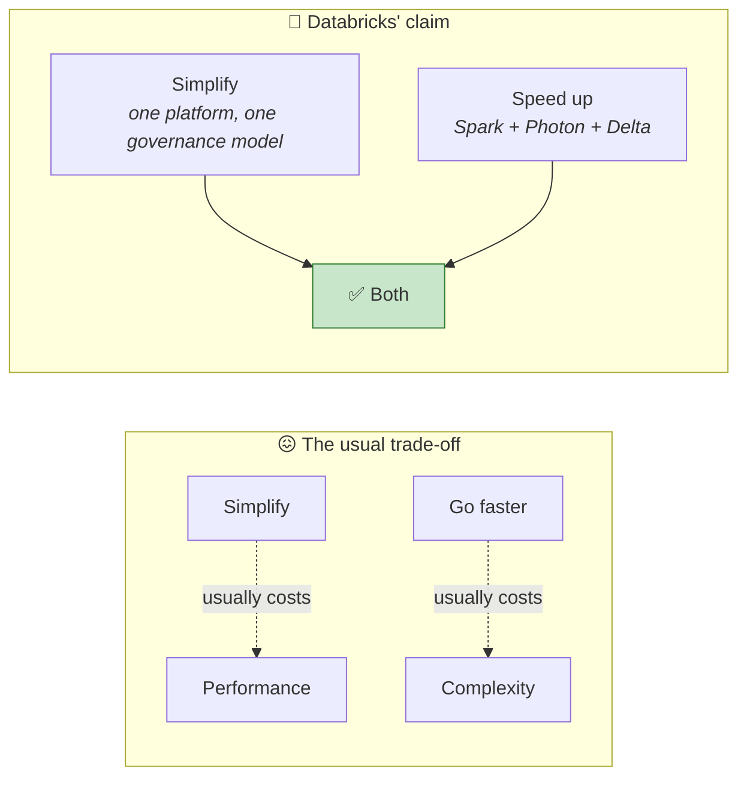
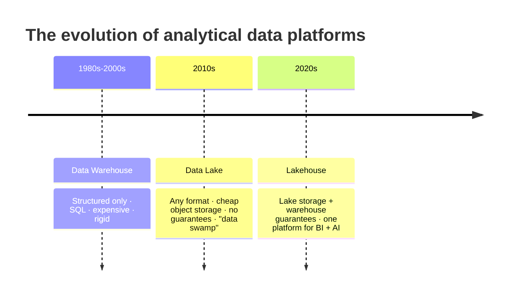
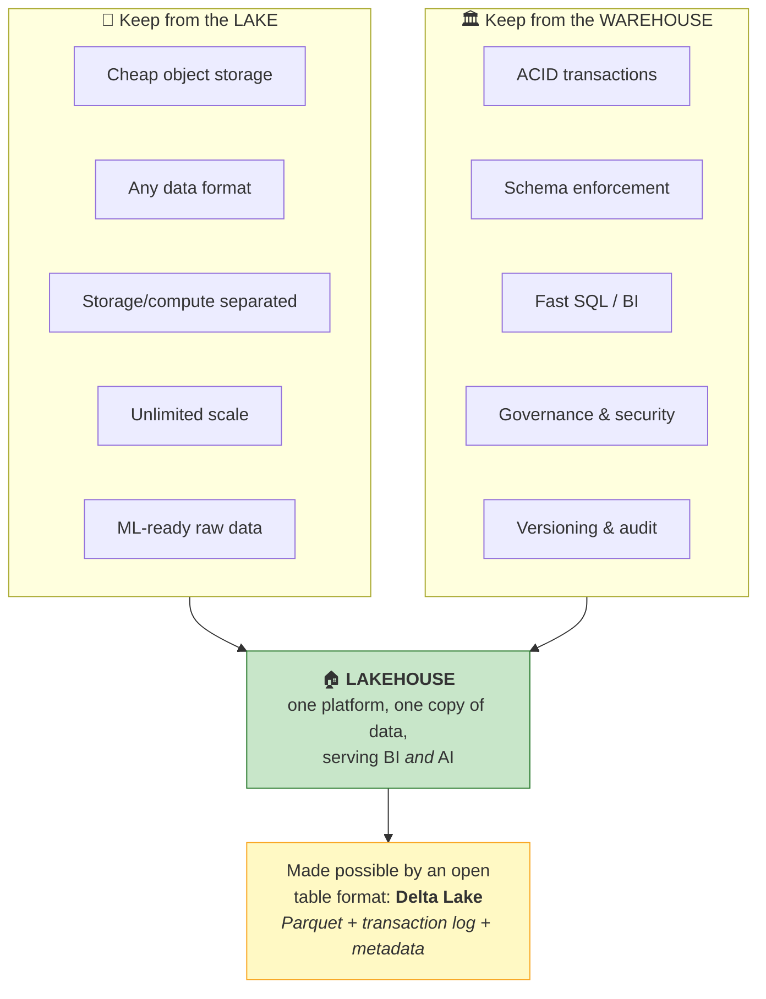
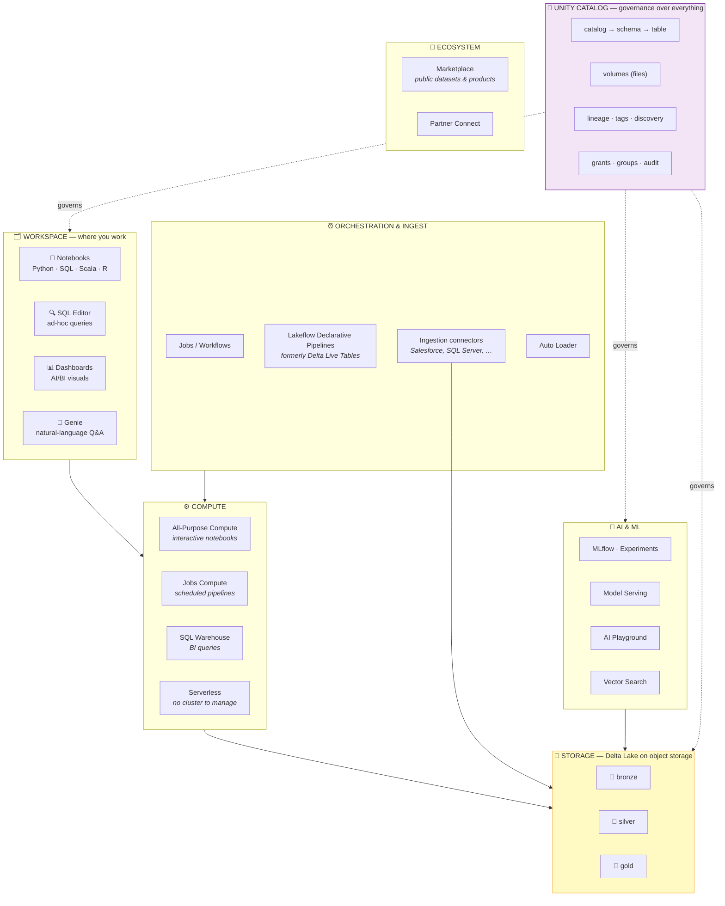
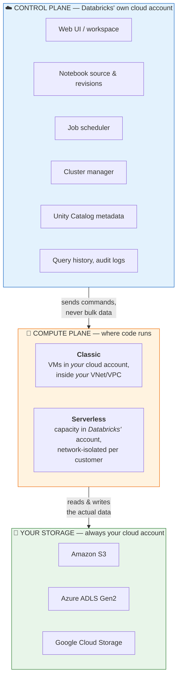
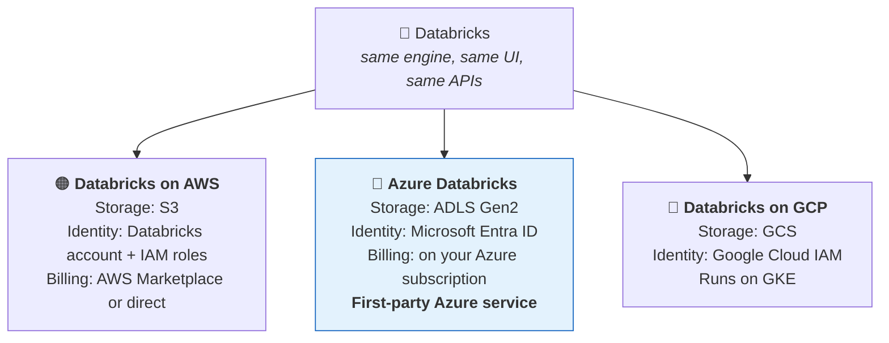
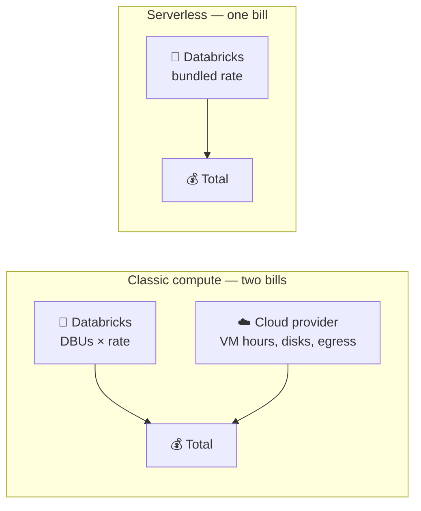
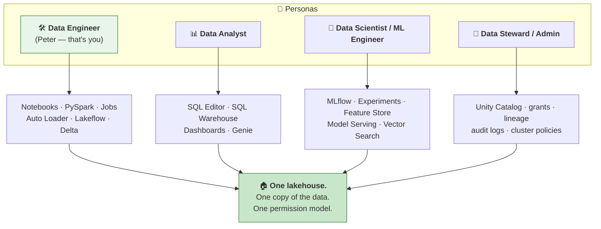
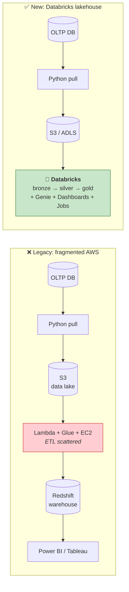

# Part 3 — What Databricks Actually Is: Lakehouse, Editions & Cloud Flavours

> **Section goal:** Move from *"Databricks is managed Spark"* (true but incomplete) to a precise mental map of the whole platform — what a **lakehouse** is and why it beat both the warehouse and the lake, which component does what, how the **control plane / data plane** split works, what the **Free Edition** does and doesn't give you, and how **Azure Databricks** differs from AWS. This is the Part that makes the UI in the next lab stop looking random.

Covers transcript `00:00:24` – `00:00:56`, `00:06:08` – `00:11:00`, `00:33:27` – `00:34:53`, `01:43:52` – `01:44:20`, `02:25:19` – `02:29:07`.

---

## 1. The one-sentence positioning

> *"For people who don't know what Databricks is — it is a **leading AI and data platform for enterprises**. The reason for its popularity is its ability to **simplify the architecture** and **speed things up** at the same time."*

Two claims, and they're in tension everywhere else in the industry:

### The customer proof-point to remember

> *"It has helped companies like **Mercedes-Benz** to speed up their data-informed decision-making process by enhancing their business intelligence, and at the same time improve their query performance and run ML models on sensor data."*

| What Mercedes-Benz got | Which Databricks capability |
|------------------------|------------------------------|
| Faster data-informed decisions | Unified platform + fresh pipelines |
| Better business intelligence | SQL Warehouse + AI/BI Dashboards |
| Improved query performance | Photon engine + Delta Lake optimisations |
| ML on sensor data | MLflow, Model Serving, same platform as the data |

> ⭐ **Interview:** Keep exactly one customer story in your pocket. "Mercedes-Benz — BI acceleration plus ML on vehicle sensor telemetry, on the same platform" turns a vague answer into a credible one.

---

## 2. The big idea: warehouse → lake → **lakehouse**

You cannot understand Databricks without this history. It's also one of the most reliable interview questions in data engineering.

### 🔍 Plain-English deep-dive: the three architectures

#### 🏛️ Data Warehouse

*A highly organised, structured database built specifically for analytics and reporting.*

**Analogy:** a **library**. Every book catalogued, shelved by subject, spine labelled. Finding "sales by region, Q3" is instant. But you cannot put a bucket of loose photographs or a raw audio recording on those shelves — the library only accepts books.

| ✅ Strengths | ❌ Weaknesses |
|-------------|---------------|
| Fast SQL queries | **Structured data only** |
| ACID transactions | **Schema-on-write** — must define structure *before* loading |
| Mature BI tool support | Expensive proprietary storage |
| Strong governance | Poor fit for ML / unstructured data |
| Reliable, well-understood | Storage and compute often coupled |

Examples: Teradata, Oracle Exadata, **Amazon Redshift** (used in this project's *legacy* architecture), Snowflake, Azure Synapse dedicated pools.

#### 🌊 Data Lake

*A cheap, giant storage bucket that accepts files of any shape.*

**Analogy:** a **garage**. Anything goes in — boxes, tools, bikes, old paperwork. Storage is cheap and unlimited. But six months later, nobody can find anything, and there's no guarantee that the box labelled "tax 2023" still contains tax 2023.

| ✅ Strengths | ❌ Weaknesses |
|-------------|---------------|
| Stores **any** format — CSV, JSON, Parquet, images, audio | **No ACID transactions** |
| Very cheap (S3 / ADLS / GCS) | **No schema enforcement** |
| Storage decoupled from compute | **No versioning / no audit trail** |
| Great for ML and raw retention | Concurrent writes can corrupt data |
| Infinitely scalable | Degenerates into a **"data swamp"** |

Examples: **Amazon S3**, **Azure Data Lake Storage Gen2**, Google Cloud Storage, HDFS.

> 💡 The instructor lists the lake's problems almost word-for-word at `02:21:01`: *"no audit trail… concurrent rewrite can cause data corruption… no schema enforcement."* Those three bullets are exactly what Delta Lake exists to fix (Part 7).

#### 🏠 Lakehouse

> *"Lakehouse is nothing but a combination of **data lake** plus **data warehouse**. When you combine these two, it makes a lakehouse."*

**Analogy:** a **well-organised garage with a proper filing system and a security camera.** You keep the cheap, flexible storage — but you add a catalogue, version history, locks and access control on top.

**The key insight:** a lakehouse is not new *storage*. It's your existing data lake **plus a metadata/transaction layer** — Delta Lake — that gives lake files warehouse-grade guarantees. That's why the instructor says the delta format *"is actually a storage layer **on top of** your data lake"* and *"you're not replacing your data lake — your data lake will remain."*

### The comparison table (memorise this)

| | 🏛️ Warehouse | 🌊 Lake | 🏠 Lakehouse |
|---|---|---|---|
| **Data types** | Structured only | Any | Any |
| **Schema** | Schema-on-**write** | Schema-on-**read** | Both — enforced *and* evolvable |
| **ACID transactions** | ✅ | ❌ | ✅ |
| **Time travel / versioning** | Limited | ❌ | ✅ |
| **Storage cost** | High | Low | Low |
| **Storage format** | Proprietary | Open files | **Open** (Parquet + Delta log) |
| **BI / SQL performance** | Excellent | Poor | Excellent |
| **ML / data science** | Poor | Good | Excellent |
| **Governance** | Strong | Weak | Strong (Unity Catalog) |
| **Streaming** | Awkward | Awkward | Native |
| **Typical failure mode** | Too rigid, too expensive | **Data swamp** | Complexity if ungoverned |

> ⭐ **Interview:** *"What is a lakehouse and why does it exist?"* → *"It exists because organisations were forced to run **two** systems: a lake for cheap raw storage and ML, and a warehouse for BI — with an ETL job copying data between them. That meant two copies, two governance models, two costs, and data that was always slightly out of sync. A lakehouse puts an open transactional table format — Delta Lake — directly on top of cheap object storage, so one copy of data serves both BI and ML with ACID guarantees and unified governance."*

---

## 3. So what *is* Databricks, concretely?

Three layers of answer, depending on who's asking:

| Audience | Answer |
|----------|--------|
| **An executive** | *"A single cloud platform where our data engineers, analysts and AI teams work on one governed copy of our data."* |
| **A recruiter / generalist** | *"A managed cloud service for large-scale data engineering, analytics and machine learning, built on Apache Spark and the Delta Lake format."* |
| **An engineer** | *"Managed Spark plus Delta Lake plus Unity Catalog plus Photon, wrapped in notebooks, SQL warehouses, workflows, dashboards and MLflow — deployed as a control plane in Databricks' cloud account and a compute plane that runs either in my cloud account or theirs."* |

### The platform component map

Here is everything you'll touch in this course, and where it lives. Map this to the left-hand nav you'll see in Part 4.

### Component glossary — what each one is *for*

| Component | Plain meaning | You'll use it in |
|-----------|---------------|------------------|
| **Workspace** | Your team's home in Databricks — folders, notebooks, dashboards, queries. | Part 4 onward |
| **Notebook** | A document mixing runnable code cells and markdown text cells. Like Jupyter. | Parts 8–25 |
| **Compute** | The cluster (or serverless capacity) that actually runs your code. Nothing runs without one attached. | Part 4 |
| **Unity Catalog** | The governance layer: what data exists, who may touch it, where it came from. | Part 5 |
| **Catalog → Schema → Table** | The 3-level naming hierarchy (`catalog.schema.table`). | Part 5 |
| **Volume** | A governed folder for **files** (as opposed to tables) — CSVs, images, PDFs. | Parts 6, 9, 20 |
| **Delta Lake / Delta format** | The open table format giving ACID, time travel and schema enforcement. Default table format. | Part 7 |
| **SQL Editor** | Write and run SQL without a notebook. | Part 4 |
| **SQL Warehouse** | Compute tuned specifically for BI/SQL workloads. | Parts 26–27 |
| **Genie** | Ask questions in English; it writes and runs the SQL. | Part 26 |
| **AI/BI Dashboards** | Native charting and dashboards on top of your tables. | Part 27 |
| **Jobs / Workflows** | Scheduler and DAG runner for multi-task pipelines. | Part 28 |
| **Lakeflow Declarative Pipelines** (was **Delta Live Tables**) | Declarative pipeline framework with built-in quality expectations. | Part 30 |
| **Auto Loader** | Incrementally ingests new files as they land, without rescanning. | Part 30 |
| **Marketplace** | Browse and consume public datasets and data products. | Part 4 |
| **MLflow / Experiments / Model Serving** | Track ML experiments, register models, serve them as endpoints. | Part 30 |
| **Photon** | Databricks' vectorised C++ query engine — a drop-in speedup under Spark SQL. | Part 12 |

> ⚠️ **Naming churn warning:** Databricks renames things often. **Delta Live Tables → Lakeflow Declarative Pipelines**; **Databricks SQL Analytics → Databricks SQL**; **Community Edition → Free Edition**. In an interview, using the old name is fine as long as you say *"formerly known as"* — it actually signals you've been around.

---

## 4. Control plane vs data plane — the architecture question

Not in the transcript, but it's asked constantly in interviews and it's the single most useful thing to know before you click "Create workspace" in Part 4. Security teams will *always* ask you this.

| | **Control plane** | **Compute (data) plane** | **Storage** |
|---|---|---|---|
| **Whose account?** | Databricks' | Yours (classic) or Databricks' (serverless) | **Always yours** |
| **What lives here?** | UI, notebook source, job definitions, cluster orchestration, Unity Catalog metadata | The Spark driver + executors actually processing rows | Your Delta/Parquet/CSV files |
| **Does your business data sit here?** | ❌ No (except query *results* cached for display) | ⏳ Transiently, during processing | ✅ Yes, permanently |

> ⭐ **Interview / security review:** *"Where does my data go when I use Databricks?"* → *"Your data stays in your own cloud storage account. The control plane holds metadata and orchestration — notebook code, job definitions, catalog metadata — not your table contents. Compute runs either on VMs in your own VPC/VNet (classic) or on network-isolated Databricks-managed capacity (serverless). That separation is why you can enforce your own encryption keys, private networking and storage firewall rules."*

> 💡 **Why it matters for this course:** the **Free Edition is serverless-only**, which is exactly why you'll see cluster-configuration options greyed out in Part 4.

---

## 5. Editions — what the Free Edition gives you

> *"Throughout this course we will be using **Databricks Free Edition**. This free edition enables students and practitioners to learn professional data and AI tools **for free**."*

> *"In a free edition, what you get is a **serverless compute**. See, this option is disabled. If you have an enterprise account, you can create a compute where you can specify your cluster — how many nodes you're going to have, etc. But we are going to use this serverless compute throughout this course."*

| Capability | 🆓 Free Edition | 💼 Paid (Standard / Premium / Enterprise) |
|-----------|-----------------|-------------------------------------------|
| **Cost** | Free, no credit card | Pay-as-you-go (DBUs + VMs) |
| **Compute** | **Serverless only** | Serverless **+** configurable classic clusters |
| **Choose node type / count / autoscaling** | ❌ Disabled | ✅ Full control |
| **Notebooks, SQL Editor** | ✅ | ✅ |
| **Unity Catalog** | ✅ | ✅ |
| **Delta Lake, time travel** | ✅ | ✅ |
| **Genie, AI/BI Dashboards** | ✅ | ✅ |
| **Jobs / Workflows** | ✅ | ✅ |
| **MLflow, Model Serving** | ✅ (limited) | ✅ |
| **External locations (S3/ADLS)** | ✅ | ✅ |
| **Usage limits** | Yes — capped compute, intended for learning | Governed by your spend |
| **SLA / support** | ❌ None | ✅ Enterprise support |
| **Production use** | ❌ Not permitted | ✅ |

> 💡 **Free Edition replaced the old *Community Edition*** in 2025. If you find a tutorial referring to Community Edition with a fixed 15 GB single-node cluster, it's outdated — Free Edition is materially more capable and covers everything in this course, project included.

> ⚠️ **Gotcha:** A few features behave differently on serverless. The instructor hits one at `01:19:20`: to demonstrate wide transformations he must *"set explicit partition and also call repartition"* because serverless manages partitioning automatically. Another at `02:17:00`: `input_file_name()` *"is not supported"* on serverless. When something behaves oddly, "am I on serverless?" is the first question to ask.

---

## 6. Cloud flavours — AWS vs Azure vs GCP

Databricks is the same product everywhere, but the *packaging* differs — and this matters a lot for your job search.

### ☁️ Why Azure Databricks is special

**Azure Databricks is a *first-party* Microsoft service** — jointly engineered by Microsoft and Databricks. Practical consequences:

| Aspect | On AWS | ☁️ On Azure |
|--------|--------|-------------|
| **How you create it** | Sign up with Databricks; it deploys into your AWS account | **Create an Azure resource** in the Azure Portal, like any VM or storage account |
| **Billing** | Separate Databricks contract (or AWS Marketplace) | **Appears on your Azure invoice**; counts toward Azure commitments (MACC) |
| **Identity** | Databricks account console + SCIM | **Microsoft Entra ID** (formerly Azure AD) — SSO, conditional access, Entra groups |
| **Storage** | S3 buckets + IAM role | **ADLS Gen2** + **Access Connector for Azure Databricks** (a managed identity) |
| **Storage URI** | `s3://bucket/path` | `abfss://container@account.dfs.core.windows.net/path` |
| **Networking** | VPC / PrivateLink | **VNet injection**, **Azure Private Link**, NSGs |
| **Secrets** | Databricks-backed secret scopes | **Azure Key Vault-backed secret scopes** |
| **Support ticket goes to** | Databricks | **Microsoft** (single throat to choke) |

> 💡 **For your job search:** a very large share of enterprise Databricks roles — especially in banking, insurance, retail and public sector — are **Azure** Databricks roles, because those organisations are already on Microsoft 365 and Entra ID. Learning the Azure specifics (Part 29) is disproportionately valuable per hour spent.

> ⚠️ **Gotcha:** The **transcript uses AWS S3** for its external-table demo (Part 6/7). You do **not** need an AWS account to complete this course — Part 6 gives you the Azure ADLS Gen2 equivalent, and the whole project runs on managed storage anyway.

---

## 7. How you're billed — the DBU model

You won't pay anything for this course, but "how does Databricks pricing work?" is a real interview question, and it's what Bruce meant by *"without worrying about the cost."*

### 🔍 Plain-English deep-dive: the DBU

- **DBU (Databricks Unit)** — *a normalised unit of processing capability consumed per hour.* **Analogy:** kilowatt-hours on your electricity bill. A bigger appliance running longer burns more kWh; a bigger cluster running longer burns more DBUs.
- **Total cost (classic compute) = (DBUs consumed × DBU rate) + (underlying cloud VM cost).** You pay Databricks for the software and your cloud provider for the metal.
- **Serverless** bundles both into a single rate — simpler, slightly higher headline price, but **zero idle cost** because it spins down automatically.

### The SKU cheat sheet (cheapest → most expensive per DBU)

| Workload type | What it's for | Relative DBU rate |
|---------------|---------------|-------------------|
| **Jobs Compute** | Scheduled, automated pipelines | 💲 Lowest |
| **Delta Live Tables / Lakeflow** | Declarative pipelines | 💲💲 |
| **SQL Warehouse (Classic/Pro)** | BI & SQL queries | 💲💲 |
| **All-Purpose Compute** | Interactive notebook development | 💲💲💲 Highest |
| **Serverless variants** | Any of the above, no cluster management | Bundled rate, no idle cost |

> ⭐ **Interview — a genuine cost-optimisation answer:** *"The biggest and easiest win is not running scheduled work on All-Purpose Compute — Jobs Compute is materially cheaper per DBU for the same work. After that: aggressive auto-termination on interactive clusters, right-sizing rather than defaulting to large nodes, spot/low-priority VMs for fault-tolerant batch, enabling Photon where it reduces total runtime enough to pay for its higher DBU multiplier, and using serverless for spiky workloads so we pay nothing while idle. Then attach cluster policies and tags so cost is attributable per team."*

---

## 8. Who actually uses Databricks — the personas

Bruce's "unified" requirement is the promise that these four groups share one platform instead of four.

> 💡 **Tie-in to Part 1:** This diagram *is* Bruce's third requirement. When he said *"just imagine our data engineers, data analysts and AI engineers all working together in one place"* — this is the picture he had in his head.

---

## 9. The competitive landscape (short version)

Enough to answer "why Databricks over X?" without waffling. Part 30 goes deeper.

| Platform | Core identity | Strongest at | Weakest at |
|----------|---------------|--------------|------------|
| **Databricks** | Lakehouse; Spark-native; open formats | Large-scale engineering, ML/AI, open storage, one platform for BI+AI | Steeper learning curve than a pure SQL warehouse |
| **Snowflake** | Cloud data warehouse (now adding lake features) | Effortless SQL, near-zero admin, concurrency | Historically weaker for ML/unstructured; proprietary storage roots |
| **Microsoft Fabric** | All-in-one Microsoft SaaS analytics (OneLake, Delta-based) | Deep Power BI / M365 integration, simple licensing | Younger; less control for heavy custom engineering |
| **AWS EMR + Glue + Redshift** | Assemble-it-yourself AWS stack | Maximum flexibility, native AWS billing | Fragmented — **exactly the legacy pain in Part 19** |
| **Google BigQuery** | Serverless warehouse | Superb ad-hoc SQL at scale, zero ops | Less natural for Spark-style custom pipelines |

> ⭐ **Interview:** *"Databricks or Snowflake?"* → *"They're converging, so I'd choose on workload mix. If the centre of gravity is SQL analytics on structured data with minimal ops, Snowflake is excellent. If we have heavy custom transformation, streaming, unstructured data or ML in the same estate — and we want our data to stay in open Delta/Parquet in our own storage rather than a proprietary format — Databricks fits better. The open-format point matters most, because it's what stops the decision from being irreversible."*

---

## 10. Where this project sits

Preview of Part 19, so the pieces connect:

**Three problems the old design had** (all quoted from `02:26:53`):

1. **Fragmented ETL and maintenance overhead** — *"You are using so many different AWS services. Your ETL logic is scattered… you don't have much transparency on how you're being billed."*
2. **Limited scalability and cost inefficiency** — *"The cost of AWS can easily go high… we are not using any native Spark cloud platform."*
3. **Lack of a unified platform.**

---

## ⭐ Likely Interview Questions for This Section

**Q1. "What is a data lakehouse?"**
> *Model answer:* "It's an architecture that puts warehouse-grade guarantees directly on top of cheap data-lake storage, so a single copy of data serves both BI and ML. Technically it's object storage — S3 or ADLS Gen2 — holding open Parquet files, with an open transactional table format like Delta Lake adding ACID transactions, schema enforcement, time travel and a transaction log, plus a governance layer like Unity Catalog. It exists because the previous norm was running a lake and a warehouse side by side, with ETL copying between them: two copies, two governance models, two costs and permanent drift."

**Q2. "Data warehouse vs data lake — when would you still choose a pure warehouse?"**
> *Model answer:* "When the workload is overwhelmingly structured SQL reporting, the team is SQL-only, data volumes are moderate, and operational simplicity outweighs flexibility. A warehouse gives excellent BI performance with minimal engineering. I'd move toward a lakehouse as soon as unstructured data, ML, streaming, or very large raw retention enters the picture — or when warehouse storage costs start dominating the bill."

**Q3. "Explain the Databricks control plane and data plane."**
> *Model answer:* "The control plane runs in Databricks' cloud account and holds the web UI, notebook source, job definitions, cluster orchestration and Unity Catalog metadata. The compute plane is where your code actually executes — with classic compute that's VMs inside your own VPC or VNet; with serverless it's network-isolated capacity in Databricks' account. Your data always lives in your own object storage. The important consequence is that bulk business data never resides in the control plane, which is what lets security teams keep their own encryption keys, private networking and storage firewalls."

**Q4. "What does Databricks add on top of open-source Spark?"**
> *Model answer:* "Roughly five things. **Managed infrastructure** — cluster lifecycle, autoscaling, patching. **Delta Lake** as the default table format, giving ACID and time travel. **Unity Catalog** for centralised, fine-grained governance and lineage. **Photon**, a vectorised C++ execution engine that's faster than the JVM path for many SQL workloads. And the **workspace surface** — notebooks, SQL warehouses, Workflows, AI/BI dashboards, Genie, MLflow. Open-source Spark gives you the engine; Databricks gives you the platform around it."

**Q5. "Why is the Free Edition serverless-only, and how does that affect what you can learn?"**
> *Model answer:* "Serverless means Databricks manages the compute capacity, so they can offer it free with usage caps and no risk of learners leaving huge clusters running. It covers essentially everything conceptually — Delta, Unity Catalog, jobs, dashboards, Genie. What you lose is hands-on cluster *sizing*: choosing node types, worker counts and autoscaling. So I'd supplement by reading cluster-configuration and cost documentation, since sizing and cost-optimisation questions do come up in interviews."

**Q6. "How is Azure Databricks different from Databricks on AWS?"**
> *Model answer:* "The engine and UI are identical; the integration differs. Azure Databricks is a first-party Azure resource — you create it in the Azure Portal, it bills to your Azure subscription and counts toward Azure commitments, and Microsoft provides first-line support. Identity is Microsoft Entra ID, so you get SSO, conditional access and Entra groups natively. Storage is ADLS Gen2 accessed via `abfss://` and authenticated through an Access Connector managed identity rather than an IAM role. Secrets integrate with Azure Key Vault, and networking uses VNet injection and Private Link."

**Q7. "How does Databricks pricing work, and how would you reduce a bill?"**
> *Model answer:* "You're billed in DBUs — a normalised unit of processing per hour — at a rate that varies by workload type, plus the underlying cloud VM cost for classic compute; serverless bundles both. The biggest lever is workload type: moving scheduled pipelines off All-Purpose Compute onto Jobs Compute is a large saving for identical work. After that: short auto-termination on interactive clusters, right-sizing instead of defaulting large, spot or low-priority VMs for retryable batch, Photon where it cuts runtime enough to offset its multiplier, serverless for spiky workloads to eliminate idle, and cluster policies plus tagging so spend is attributable and capped per team."

**Q8. "Your CTO asks: Databricks or Microsoft Fabric?"**
> *Model answer:* "If the organisation is heavily Microsoft-centric — Power BI everywhere, Entra ID, M365 — and the analytics workload is mostly BI over structured data, Fabric's integration and single licensing model are compelling. If we have substantial custom engineering, streaming, ML, or very large-scale Spark workloads, Databricks is more mature and gives more control. They're not mutually exclusive either: both build on Delta/Parquet, so with open table formats you can serve Power BI from Databricks tables. I'd frame the decision around where the team's centre of gravity is, and deliberately keep storage in an open format so the decision stays reversible."

---

## 🧠 30-Second Memory Hooks

- **Warehouse = library** (organised, books only). **Lake = garage** (anything, chaos). **Lakehouse = organised garage with a filing system and CCTV.**
- **Lakehouse = data lake + data warehouse.** Cheap open storage **+** ACID, schema, governance, BI speed.
- **The lakehouse isn't new storage — it's a transaction layer (Delta) on the storage you already have.**
- **Data lake's three sins:** no audit trail, no schema enforcement, corruptible concurrent writes. **Delta fixes all three.**
- **Control plane = Databricks' account (UI, metadata, scheduling). Compute plane = where code runs. Storage = always yours.**
- **Free Edition = serverless only.** Cluster-sizing options are greyed out by design.
- **Azure Databricks is a first-party Azure resource:** Entra ID + ADLS Gen2 + `abfss://` + Key Vault + your Azure bill.
- **DBU = the kWh of Databricks.** Total = DBUs × rate **+** VM cost (classic); bundled (serverless).
- **Cheapest→dearest per DBU: Jobs → DLT → SQL Warehouse → All-Purpose.** Never schedule production work on All-Purpose.
- **Mercedes-Benz** = your ready customer example: BI acceleration + ML on sensor data.
- **Databricks = Spark + Delta + Unity Catalog + Photon + the workspace around them.**

---

*Next suggested section:* **[Part 4 — LAB: Account Setup & Full UI Tour](Part-04-lab-account-setup-ui-tour.md)** — theory is done; now you'll create a Free Edition account (and, on the Azure track, a real Azure Databricks workspace in the portal), upload your first dataset, run your first query, and put a name to every icon in the left-hand nav.

---

**Navigation** — ⬅️ **[Part 2 — Distributed Computing & Spark](Part-02-distributed-computing-hadoop-spark.md)** · 🏠 **[Master Index](../Databricks%20-%20Study%20Guide.md)** · ➡️ **[Part 4 — LAB: Setup & UI Tour](Part-04-lab-account-setup-ui-tour.md)**
