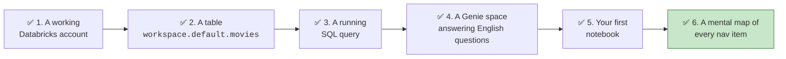
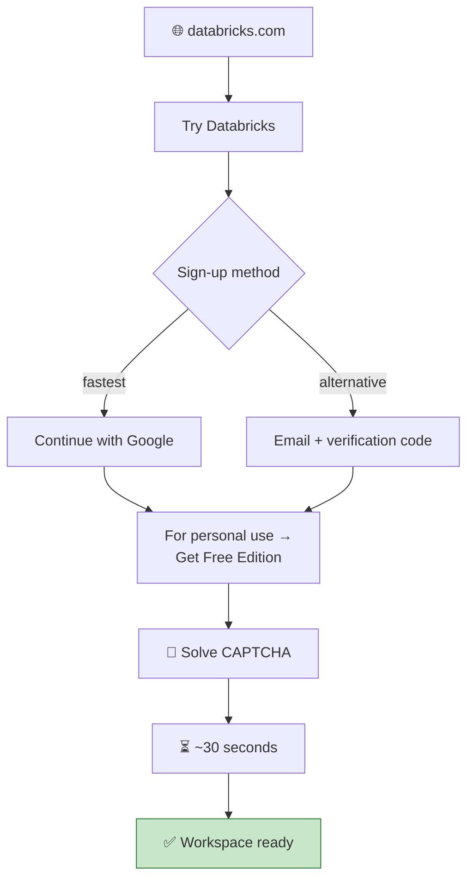
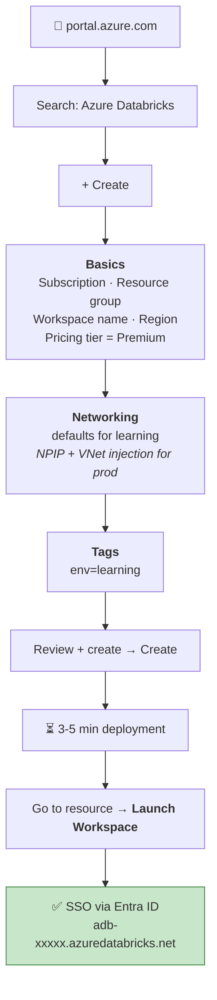
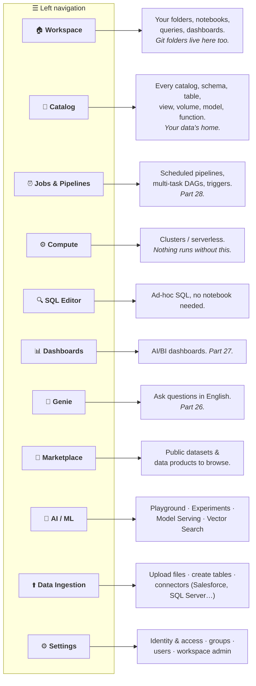
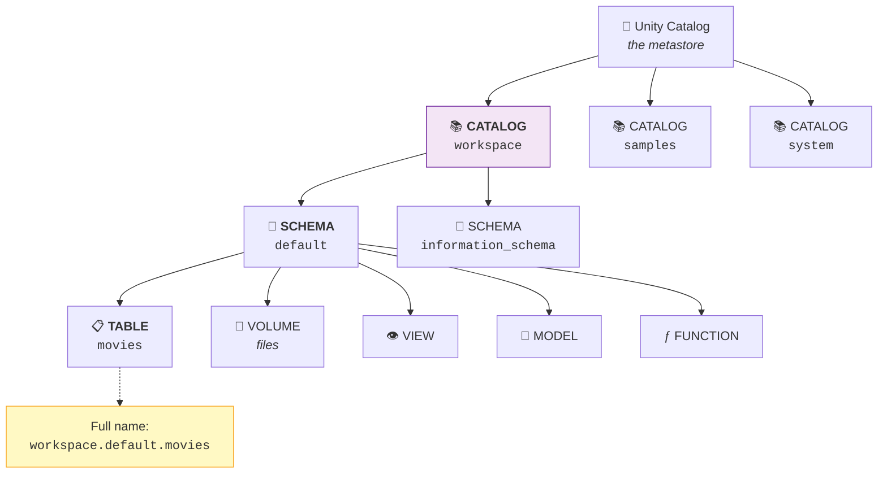
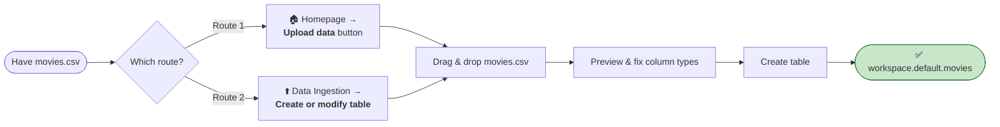
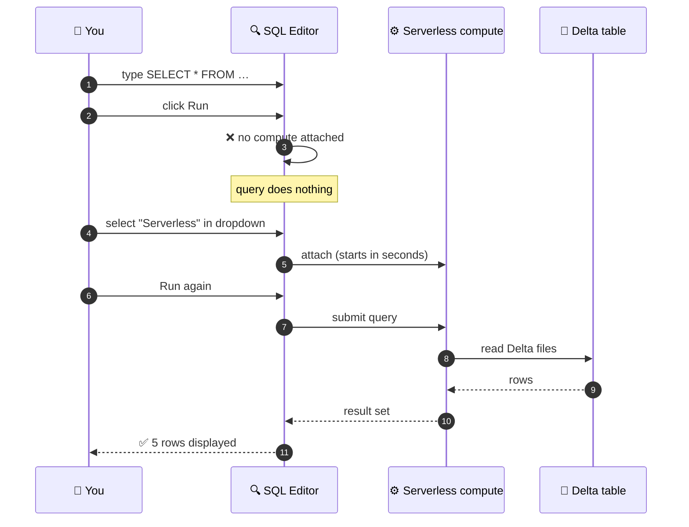
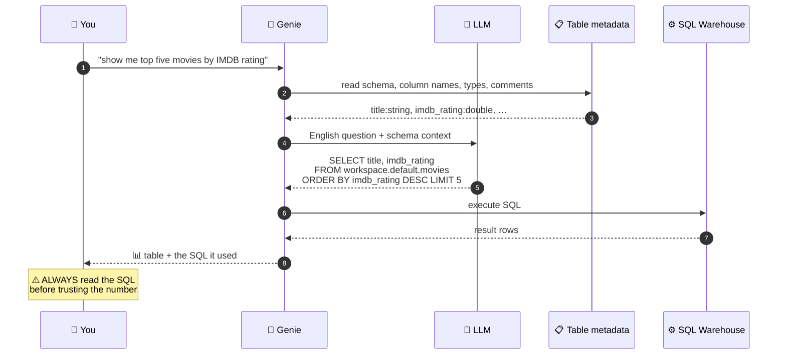

# Part 4 — 🧪 LAB: Account Setup & Full UI Tour

> **Section goal:** Get a working Databricks environment (Free Edition **and**, optionally, a real Azure Databricks workspace), then learn what every single item in the interface does — so that when Part 20 says *"go to Catalog → create a volume"*, you already know exactly where that is and why it exists.

Covers transcript `00:05:22` – `00:11:00`, plus a full ☁️ Azure Portal track that the video does not include.

---

## 0. What you will have built by the end of this lab



**Checklist — tick these off as you go:**

- [ ] Account created (Free Edition **or** Azure workspace)
- [ ] `movies.csv` downloaded from the course resources
- [ ] Table `workspace.default.movies` exists with **37 rows**
- [ ] `imdb_rating` has data type **double**, not string
- [ ] A `SELECT` query returned rows in the SQL Editor
- [ ] A Genie space answered *"show me top 5 movies by IMDB rating"*
- [ ] A notebook created and `spark` printed successfully

---

## 1. Two paths — pick one (or do both)

| | 🆓 **Path A — Databricks Free Edition** | ☁️ **Path B — Azure Databricks** |
|---|---|---|
| **Cost** | Free forever, no credit card | Real money (DBUs + VMs). 14-day trial available |
| **Time to set up** | ~3 minutes | ~15 minutes |
| **What you get** | Serverless compute only | Full cluster configuration, Entra ID, ADLS Gen2 |
| **Do the whole course on it?** | ✅ Yes, including the project | ✅ Yes |
| **Best for** | Everyone. **Start here.** | If your target job is Azure, or your employer already has a workspace |

> 💡 **Recommendation:** Do **Path A now** and complete the course on it. Then do **Path B** once (alongside Part 29) so that when an interviewer asks *"have you provisioned an Azure Databricks workspace?"* the answer is yes.

---

## 2. 🧪 Path A — Create a Databricks Free Edition account

> *"All you have to do is click a link down below in the video description and you will come here. This is Databricks Free Edition. [Databricks] created this free edition so that the learning community can benefit."*

### Step-by-step

| # | Where | What to click |
|---|-------|---------------|
| 1 | Browser | Go to **`databricks.com`** |
| 2 | Top-right | Click **`Try Databricks`** |
| 3 | Sign-up page | Choose **`Continue with Google`** (fastest) — or enter an email address and use the emailed verification code |
| 4 | Google popup | Select your Google account → **`Continue`** |
| 5 | "How will you use Databricks?" | Select **`For personal use`** → **`Get free edition`** → **`Continue`** |
| 6 | Verification | Solve the **puzzle / CAPTCHA** → **`Submit`** |
| 7 | Wait | *"After a few seconds my account is ready."* |



> ⚠️ **Gotcha:** Databricks also offers a **14-day paid trial** on AWS/Azure/GCP. That is **not** what you want — it expires and may need a card. Make sure the page says **Free Edition** / *"for personal use"*. If you land on a "choose your cloud provider" screen, you're on the wrong flow — go back and look for the Free Edition option.

> ⚠️ **Gotcha:** Free Edition previously existed as **Community Edition**. Any tutorial mentioning a "15 GB single-node Community cluster" is pre-2025 and outdated.

**✅ Checkpoint A:** You should be looking at a page with a left-hand navigation bar containing *Workspace, Catalog, Jobs & Pipelines, Compute, SQL Editor, Dashboards, Genie, Marketplace*.

---

## 3. ☁️ Path B — Create an Azure Databricks workspace (Azure Portal, click-by-click)

The transcript never does this — but you asked for the Azure route, and this is exactly what you'd do on day one of an Azure data-engineering job.

### 🔍 Plain-English deep-dive: what you're actually creating

- **Azure subscription** — *the billing container.* **Analogy:** your account with the electricity company. Everything you create bills to it.
- **Resource group** — *a folder that groups related Azure resources so you can manage and delete them together.* **Analogy:** a project folder. Delete the folder, everything inside goes with it — which is your safety net for a learning environment.
- **Region** — *the physical datacentre location.* Put your Databricks workspace and your storage account in the **same region**, or you pay egress charges and add latency.
- **Azure Databricks workspace** — *the resource that represents your Databricks environment.* Creating it also creates a hidden **managed resource group** where Azure puts the VMs, disks and storage Databricks needs.

### Step-by-step

| # | Where | What to do |
|---|-------|-----------|
| 1 | Browser | Go to **`portal.azure.com`** and sign in with your work or personal Microsoft account |
| 2 | Top search bar | Type **`Azure Databricks`** → click the **Azure Databricks** service result |
| 3 | Service page | Click **`+ Create`** (top-left) |
| 4 | **Basics** tab → *Project details* | **Subscription:** pick yours. **Resource group:** click **`Create new`** → name it `rg-databricks-learn` |
| 5 | **Basics** tab → *Instance details* | **Workspace name:** `dbw-learn-ecommerce` (must be globally unique-ish). **Region:** pick one near you, e.g. `East US` / `West Europe` / `Central India` |
| 6 | **Basics** tab → *Pricing Tier* | Choose **`Premium`** *(needed for Unity Catalog, role-based access, cluster policies)*. Or **`Trial (Premium – 14-Days Free DBUs)`** to avoid DBU charges for two weeks |
| 7 | **Networking** tab | Leave defaults for learning. *(Production would set **Deploy with Secure Cluster Connectivity (No Public IP)** = Yes and **Deploy into your own VNet** = Yes — see Part 29.)* |
| 8 | **Encryption / Security** tabs | Leave defaults |
| 9 | **Tags** tab | Optional but good practice: `env=learning`, `owner=<your name>` |
| 10 | **Review + create** | Wait for **`Validation passed`** → click **`Create`** |
| 11 | Deployment | Takes **~3–5 minutes**. When done, click **`Go to resource`** |
| 12 | Resource page | Click the big **`Launch Workspace`** button |
| 13 | New tab | You're single-signed-on via **Microsoft Entra ID** to `adb-<id>.<n>.azuredatabricks.net` |



### 💸 Cost safety rules for Azure (read this twice)

| Rule | Why |
|------|-----|
| **Always set cluster auto-termination** (e.g. 10–20 min idle) | An idle cluster still bills VM time. This is the #1 way people get a shock bill. |
| **Use the smallest node type** — `Standard_DS3_v2` or `Standard_D4ds_v5` | You're learning, not benchmarking |
| **Use Single Node mode** for lab work | 1 VM instead of 3+ |
| **Delete the whole resource group when finished** | Portal → Resource groups → `rg-databricks-learn` → **Delete resource group** → type the name to confirm. Removes everything, including the managed resource group. |
| **Set a budget alert** | Portal → **Cost Management + Billing** → **Budgets** → **+ Add** → set e.g. £10/month with an email alert at 80% |

> ⚠️ **Gotcha:** The **Trial (14-Days Free DBUs)** tier waives the *Databricks* charge but **not** the underlying **Azure VM** charge. Auto-termination still matters.

> ⚠️ **Gotcha:** Azure Portal blades get redesigned regularly. Field *names* are stable (Subscription, Resource group, Workspace name, Region, Pricing Tier); their *positions* may shift. If a tab looks unfamiliar, the values above still apply.

**✅ Checkpoint B:** You're inside a Databricks workspace whose URL ends in `.azuredatabricks.net`, and your Azure Portal shows an `Azure Databricks Service` resource in `rg-databricks-learn`.

---

## 4. The UI tour — every item in the left navigation

This is the map you'll use for the next 28 Parts.



### What the instructor points out, in order

| Timestamp | Feature | What it does |
|-----------|---------|--------------|
| `00:06:08` | **Upload data** (homepage button) | Fastest path to get a CSV into a table |
| `00:06:11` | **Marketplace** | *"Browse public data sets… look at all the data products"* |
| `00:06:21` | **Catalog** | *"Where you will see your tables etc."* |
| `00:06:40` | **Data Ingestion → Create or modify table** | The other route to upload |
| `00:08:19` | **SQL Editor** | Run SQL directly |
| `00:08:45` | **Compute** | Serverless in Free Edition; cluster creation disabled |
| `00:09:36` | **Genie** | AI assistant that converts English → SQL |
| `00:10:17` | **Data Ingestion → connectors** | Salesforce, SQL Server, and *"so many different connectors… click See all"* |
| `00:10:39` | **AI section** | *"Playground, experiments, model serving"* |
| `00:10:47` | **Jobs & Pipelines** | *"Create your ETL jobs or ingestion pipelines"* |
| `00:10:53` | **Workspace** | *"You will be able to create a new notebook"* |

---

## 5. The three-level namespace — your first look

Before you upload anything, understand the hierarchy. Everything in Databricks is addressed this way.

> *"So there are these three layers. At the outside you have something called a **catalog**. Under that, what you have is **schema**. So you have this **default** schema."*



### 🔍 Plain-English deep-dive: catalog / schema / table

**Analogy: a filing cabinet.**

| Level | Filing-cabinet equivalent | In Databricks | Example |
|-------|---------------------------|---------------|---------|
| **Catalog** | The whole **cabinet** | Top-level container. Usually one per environment (`dev`, `prod`) or per domain (`sales`, `marketing`). | `workspace`, `ecommerce` |
| **Schema** (a.k.a. **database**) | A **drawer** in the cabinet | Groups related tables. | `default`, `bronze`, `silver`, `gold` |
| **Table / View / Volume** | A **folder** in the drawer | The actual data object. | `movies`, `slv_orders` |

> ⚠️ **Gotcha:** In Databricks, **"schema" and "database" mean the same thing.** `CREATE SCHEMA bronze` and `CREATE DATABASE bronze` are equivalent, and `SHOW DATABASES` lists schemas. Don't let this confuse you — the instructor uses `SHOW DATABASES` at `02:31:35` to list schemas he created with `CREATE SCHEMA`.

> ⚠️ **Gotcha:** Confusingly, `workspace` is the **name of the default catalog**, and *Workspace* is also the name of a **left-nav item** (your folders). They're unrelated. Context tells you which.

**The always-true rule:** a fully qualified name is `catalog.schema.object` — three parts, dot-separated. If a query fails with *"table or view not found"*, 90% of the time you gave two parts instead of three, or you're in the wrong current catalog.

---

## 6. 🧪 LAB 6.1 — Upload `movies.csv` and create your first table

### The dataset

> *"This is a simple movies database where you have movie name, industry, release year, IMDb rating and all of that information."*

| Column | Meaning | Correct type |
|--------|---------|--------------|
| `title` | Movie name | `string` |
| `industry` | Bollywood / Hollywood | `string` |
| `release_year` | Year of release | `int` |
| `imdb_rating` | Rating out of 10 | **`double`** ← the one you must fix |
| `studio` | Producing studio (22 distinct) | `string` |
| `language` | Hindi, English, Bengali, Kannada, Telugu | `string` |
| `budget` | Money spent making it | numeric |
| `revenue` | Money it earned | numeric |

**37 rows total.** Small on purpose — you're learning the platform, not stress-testing it.

### Two routes to upload (both work)



### Click-by-click

| # | Action |
|---|--------|
| 1 | Left nav → **`Data Ingestion`** → **`Create or modify table`** *(or homepage → `Upload data`)* |
| 2 | **Drag and drop** `movies.csv` onto the drop zone |
| 3 | Confirm the target: **Catalog = `workspace`**, **Schema = `default`**, **Table = `movies`** |
| 4 | Look at the **preview grid** — Databricks has guessed a data type for each column |
| 5 | 🔧 **Fix the type:** find `imdb_rating`. It says **`string`**. Click the type dropdown → change to **`double`** |
| 6 | 💡 **Tip from the video:** *"If you just decrease your font size, you'll be able to see all the columns in one single view."* Use **`Ctrl` + `-`** in the browser |
| 7 | Click **`Create table`** |
| 8 | Go to left nav → **`Catalog`** → click the **refresh** icon |
| 9 | Expand **`workspace`** → **`default`** → you should see **`movies`** |

### 🔍 Plain-English deep-dive: why fix `imdb_rating` manually?

Databricks **infers** types by sampling the file. If it sees `7.8`, `9.3`, `1.9` it usually guesses `double` — but a single stray value (a blank, a `N/A`, a quote character) makes it fall back to `string`, because `string` can hold anything.

**Why it matters:** if `imdb_rating` stays a `string`, then:

- `MAX(imdb_rating)` sorts **alphabetically** — `"9.3"` beats `"10.0"` because `9` > `1` as characters. Silently wrong results.
- `AVG(imdb_rating)` errors or returns null.
- Comparisons like `imdb_rating > 8` behave unpredictably.

> ⚠️ **This is a preview of the entire Silver layer.** In Part 22 you'll do exactly this — fixing types and cleaning values — but in code, at scale, for six tables.

**✅ Checkpoint 6.1:** `workspace.default.movies` exists.

---

## 7. 🧪 LAB 6.2 — Explore your table's tabs

Click the `movies` table in Catalog. You get a row of tabs. **Each one is a concept you'll need later.**

| Tab | What it shows | Where it's used later |
|-----|---------------|------------------------|
| **Overview / Columns** | Column names, types, comments | Everywhere |
| **Sample data** | *"It will show you the sample data from your table"* — a quick peek without writing SQL | Every lab's spot-check |
| **Details** | *"Will show you the metadata of this table"* — created by, created at, **type: MANAGED**, storage location, table properties, **data source format: delta** | **Part 6** (managed vs external), **Part 7** (Delta) |
| **Permissions** | Who can `SELECT`, `MODIFY`, etc. | **Part 5** (Unity Catalog) |
| **History** | Every version of the table, with the operation that created it | **Part 7** (time travel) |
| **Lineage** | Upstream/downstream — which notebooks and tables touched this | **Part 5** |
| **Insights / Quality** | Usage stats and profiling | Bonus |

> *"So this is a **managed table**. We'll talk about managed versus external table later on. You have different levels of permissions, policies, history, lineage and so on."*

**👀 Do this now:** open **Details** and note two things you'll need in Part 6 and Part 7:
1. **Type:** `MANAGED`
2. **Data source format:** `delta` ← *your very first table is already a Delta table. You get ACID and time travel for free, without asking.*

---

## 8. 🧪 LAB 6.3 — First SQL query & attaching compute

| # | Action |
|---|--------|
| 1 | Left nav → **`SQL Editor`** |
| 2 | Type the query below |
| 3 | Notice the **`Connect`** / compute dropdown at the top-right — it will say *not connected* |
| 4 | Select **`Serverless`** |
| 5 | Click **`Run`** (or press **`Ctrl` + `Enter`**) |

```sql
SELECT * FROM workspace.default.movies LIMIT 5;
```

Then verify the row count:

```sql
SELECT COUNT(*) FROM workspace.default.movies;
-- Expect: 37
```

> ⚠️ **The single most common beginner error:** running anything before attaching compute. **Nothing executes in Databricks without compute attached** — not SQL, not notebooks, not dashboards. If a cell hangs or a query does nothing, check the compute dropdown first.



**✅ Checkpoint 6.3:** You see 5 movie rows, and `COUNT(*)` returns **37**.

---

## 9. Compute — the deep dive

### What the Free Edition gives you

> *"Now in a Free Edition, what you get is a **serverless compute**. See, this option is disabled. If you have an enterprise account, you can create a compute where you can specify your cluster basically — how many nodes you're going to have in your cluster, etc. But we are going to use this serverless compute throughout this course."*

### 🔍 Plain-English deep-dive: serverless

> *"Serverless compute is sort of like **AWS Lambda**. Behind the scenes they have servers, but all those details are hidden from you. This way you can just focus on your business logic — you don't have to worry about managing your computers on cloud."*

- **Serverless** — *compute you request and use, but never see, size, patch, or shut down.* **Analogy:** a **hotel** vs owning a house. You get a room when you need one; you don't fix the boiler. **Why it matters:** near-instant startup (seconds, not minutes) and zero idle cost.
- **AWS Lambda / Azure Functions** — the same idea for application code. Databricks Serverless applies it to Spark.

| | **Serverless** | **Classic cluster** |
|---|---|---|
| **Startup time** | Seconds | 3–7 minutes |
| **You choose node type/count** | ❌ | ✅ |
| **You manage lifecycle** | ❌ Automatic | ✅ You start/stop/auto-terminate |
| **Idle cost** | None | Yes, until it terminates |
| **Runs in whose account** | Databricks' | Yours (VPC/VNet) |
| **Available in Free Edition** | ✅ Only option | ❌ Disabled |
| **Best for** | Learning, spiky work, SQL/BI | Long jobs, custom libraries, strict network isolation |

### ☁️ Azure track: the cluster-creation screen, field by field

On Azure (Premium tier) you *can* create classic clusters. Go to **`Compute`** → **`Create compute`**. Here's what each field means — this is a favourite interview area.

| Field | What it means | Learning-lab suggestion |
|-------|---------------|--------------------------|
| **Policy** | An admin-defined template that constrains what you may choose (max nodes, allowed VM types, mandatory auto-terminate). Cost-control mechanism. | `Unrestricted` or `Personal Compute` |
| **Single node / Multi node** | Single node = driver only, no executors. Cheapest; fine for small data. | **Single node** |
| **Access mode** | `Standard` (shared, Unity Catalog enforced) vs `Dedicated` (single user, supports more libraries). Older names: *Shared* / *Single user* / *No isolation shared*. | `Dedicated` (single user) |
| **Databricks Runtime version** | The bundled Spark + Delta + library stack. **LTS** = Long-Term Support, patched for longer. `ML` variants preinstall PyTorch/scikit-learn. | Latest **LTS** |
| **Use Photon Acceleration** | Enables the vectorised C++ engine. Higher DBU rate, but often lower total cost via shorter runtime. | ✅ On |
| **Node type (worker & driver)** | The Azure VM SKU. `Standard_DS3_v2` = 4 cores/14 GB. `Standard_D4ds_v5` = 4 cores/16 GB with local SSD. | Smallest available |
| **Min / Max workers (autoscaling)** | Spark adds/removes executors within this range based on load. | Off, or 1–2 |
| **Terminate after N minutes of inactivity** | ⭐ **The money-saver.** Shuts the cluster down when idle. | **10–20 minutes** |
| **Spot instances / Spot with fallback** | Use discounted, interruptible Azure capacity. Big savings; Spark's fault tolerance handles evictions. | On for batch, off for demos |
| **Advanced → Spark config** | Key/value Spark settings, e.g. `spark.sql.shuffle.partitions` | Leave default |
| **Advanced → Environment variables / Init scripts** | Startup scripts for custom setup | Leave empty |
| **Tags** | Cost attribution labels | `env=learning` |

> ⭐ **Interview:** *"How do you size a Databricks cluster?"* → *"Start from the data, not the VM list. Estimate the input size per run and target roughly 128 MB per partition to compute the task count, then pick a worker count so total cores are a small multiple of that. Memory-per-core matters more than raw core count for shuffle-heavy jobs, so I'd choose memory-optimised nodes if I see heavy spill. Then measure — the Spark UI's spill, GC and task-skew metrics tell you whether to scale out, scale up, or fix the query. Always set auto-termination and prefer Jobs Compute with autoscaling for scheduled work."*

> ⚠️ **Gotcha (Azure):** New subscriptions have low regional **vCPU quotas**. If cluster creation fails with a quota error, either pick a smaller VM SKU, try another region, or raise a quota increase from **Subscription → Usage + quotas**.

---

## 10. 🧪 LAB 6.4 — Your first Genie space

> *"Then there is this Genie option. Click on it, click on New, and you can click on your movies and create this Genie space."*

| # | Action |
|---|--------|
| 1 | Left nav → **`Genie`** |
| 2 | Click **`New`** |
| 3 | Choose the dataset: expand **`workspace`** → **`default`** → tick **`movies`** |
| 4 | Click **`Create`** |
| 5 | In the chat box, type: **`show me top five movies by IMDB rating`** → Enter |
| 6 | Read the answer, then click **`Show code`** / **`Show generated SQL`** to see what it wrote |



> *"This is an AI assistant / AI chatbot, where it will take a command in natural language, and it is internally converting it to a SQL query… This is very beneficial. Even if you don't know coding, you can just give commands in natural language and it will show you the results."*

> ⚠️ **Gotcha:** Genie's answer quality depends almost entirely on **metadata quality** — clear table and column names, comments, and clean data. That's why in Part 26 you point Genie at the **gold** layer only, never bronze. Garbage schema in, confident-sounding wrong answer out.

**✅ Checkpoint 6.4:** Genie returned 5 movies and you can see the SQL it generated.

---

## 11. Tour the rest of the nav (2-minute skim)

You don't need to use these yet — just know they exist.

### Data Ingestion → connectors
> *"We also have this option for data ingestion, where you can connect with different connectors — Salesforce, SQL Server. There are so many different connectors. If you click on **See all**, you will see this entire list."*

Click **`See all`** and skim. These are managed connectors that pull from SaaS apps and databases directly into Databricks — no custom extraction code.

### AI / ML section
> *"For AI they have all these different options — there is Playground, Experiments, there is Model Serving and so on."*

| Item | What it's for |
|------|---------------|
| **Playground** | Chat with foundation models (Llama, Claude, GPT-class) inside Databricks |
| **Experiments** | MLflow experiment tracking — parameters, metrics, artifacts per training run |
| **Models** | The model registry — versioned, governed by Unity Catalog |
| **Serving** | Deploy a model behind a REST endpoint |

### Jobs & Pipelines
> *"Jobs & Pipelines is something where you can create your ETL jobs or ingestion pipelines."*

You'll build a real one in **Part 28**.

### Marketplace
Browse free public datasets and paid data products. Useful for practice data when you run out of course files.

---

## 12. 🧪 LAB 6.5 — Create your first notebook

> *"If you look at Workspace here, you will be able to create a new notebook."*

| # | Action |
|---|--------|
| 1 | Left nav → **`Workspace`** |
| 2 | Click **`Create`** → **`Notebook`** |
| 3 | Rename it (click the title at the top): `00_hello_databricks` |
| 4 | Check the **language** dropdown next to the title — set it to **Python** |
| 5 | Attach compute: **`Connect`** dropdown top-right → **`Serverless`** |
| 6 | In the first cell, type `spark` and press **`Ctrl` + `Enter`** |

You should see something like:

```
<pyspark.sql.connect.session.SparkSession object at 0x...>
```

> *"Here you will find this object called **`spark`**, and if you `Ctrl+Enter` and run it, it will show you this thing. So the Databricks environment gives you this variable, this object, which is a **SparkSession** object."*

**Outside Databricks you'd have to build it yourself:**

```python
# NOT needed in Databricks — this is what Databricks does for you
from pyspark.sql import SparkSession
spark = SparkSession.builder.appName("my_app").getOrCreate()
```

> 💡 `spark` is your handle on the entire cluster. Every DataFrame you create in Parts 8–25 starts from it.

### Notebook keyboard shortcuts (learn these — they save hours)

| Shortcut | Action |
|----------|--------|
| **`Ctrl` + `Enter`** | Run current cell, stay in it |
| **`Shift` + `Enter`** | Run current cell, move to the next |
| **`Ctrl` + `Alt` + `P`** | Insert cell **above** |
| **`Ctrl` + `Alt` + `N`** | Insert cell **below** |
| **`Ctrl` + `Shift` + `Enter`** | Run all cells |
| **`Esc`** then **`D` `D`** | Delete cell |
| **`Ctrl` + `I`** | 🤖 **AI assistant** — describe what you want in English and it writes the code |
| **`Ctrl` + `/`** | Comment / uncomment |
| **`Ctrl` + `Shift` + `F`** | Format code |

### Cell magics — mixing languages in one notebook

| Magic | Effect |
|-------|--------|
| `%python` | Run this cell as Python (default if notebook language is Python) |
| `%sql` | Run this cell as SQL — result auto-displays as a table |
| `%md` | Render this cell as **Markdown** (headings, notes) |
| `%scala` / `%r` | Other languages |
| `%sh` | Shell commands on the driver |
| `%pip install <pkg>` | Install a Python package for this notebook session |
| `%run ./other_notebook` | Execute another notebook inline (shares variables) |

> 💡 **Markdown cells:** *"Just like Jupyter notebook, you can add markdown cells here… you can give it headers, etc."* Use them liberally — a notebook with section headings is the difference between a script and a document a reviewer can follow. Interviewers notice.

**✅ Checkpoint 6.5:** `spark` printed a SparkSession object.

---

## 13. 🚑 Troubleshooting

| Symptom | Likely cause | Fix |
|---------|--------------|-----|
| Query/cell does nothing, spinner forever | **No compute attached** | Top-right dropdown → select **Serverless** |
| `Table or view not found` | Used 2-part name, or wrong current catalog | Use the full `catalog.schema.table`, or run `USE CATALOG <name>` first |
| Uploaded table doesn't appear in Catalog | Stale UI | Click the **refresh** icon in the Catalog pane |
| `imdb_rating` still `string` after upload | Type change wasn't applied before **Create table** | Drop the table and re-upload, changing the type in the preview screen |
| Genie gives an odd answer | Ambiguous column names or messy data | Read the generated SQL; add table/column **comments**; point Genie at clean (gold) tables |
| ☁️ Azure: cluster fails with quota error | Subscription vCPU quota too low | Smaller VM SKU, different region, or request a quota increase |
| ☁️ Azure: `Launch Workspace` opens then errors | Entra ID user lacks workspace access | Ask an admin to add you, or use the account that created the workspace |
| ☁️ Azure: unexpected charges | Cluster left running | Set **auto-terminate**; delete the resource group when done |
| `input_file_name()` not supported | You're on serverless | Use `_metadata.file_path` instead |
| Free Edition: `Create compute` greyed out | **Expected** — serverless only | Not a bug. Use serverless. |

---

## 14. ✅ Final checkpoint

Run this in the SQL Editor. If all three return, the lab is complete:

```sql
-- 1. The table exists and is findable
SHOW TABLES IN workspace.default;

-- 2. It has the right number of rows
SELECT COUNT(*) AS row_count FROM workspace.default.movies;   -- expect 37

-- 3. The rating column is genuinely numeric (this errors if it's a string)
SELECT ROUND(AVG(imdb_rating), 2) AS avg_rating,
       MIN(imdb_rating)          AS min_rating,
       MAX(imdb_rating)          AS max_rating
FROM   workspace.default.movies;
-- expect roughly: avg 7.8, min 1.9, max 9.3
```

> 💡 Those exact numbers appear later in the course at `00:14:30` when the instructor runs `df.describe()`. If yours match, your table is correct.

---

## ⭐ Likely Interview Questions for This Section

**Q1. "Walk me through the Databricks object hierarchy."**
> *Model answer:* "Unity Catalog sits at the top as the metastore for an account or region. Under it, three levels: **catalog** → **schema** → object. Objects can be tables, views, volumes for files, ML models or functions. Everything is addressed as `catalog.schema.object`. Teams typically use catalogs to separate environments — dev, staging, prod — or business domains, and schemas to separate medallion layers or subject areas. The practical benefit is that permissions can be granted at any level and inherit downward, so I can grant read on a whole catalog rather than table by table."

**Q2. "What's the difference between serverless and classic compute, and when would you pick each?"**
> *Model answer:* "Classic compute runs on VMs in my own cloud account, so I control node type, worker count, autoscaling, init scripts and network isolation — and I pay for idle time until auto-termination fires. Serverless runs on Databricks-managed capacity, starts in seconds instead of minutes, and has no idle cost. I'd use serverless for interactive development, SQL/BI and spiky workloads. I'd use classic for long-running jobs where warm-cluster reuse matters, workloads needing custom init scripts or specific instance types like GPUs, or where compliance requires compute inside my own VNet."

**Q3. "You uploaded a CSV and the numeric column came in as a string. What happened and why does it matter?"**
> *Model answer:* "Type inference samples the file, and one non-numeric value — a blank, an `N/A`, a stray quote — makes it widen to string, since string accepts anything. It matters because aggregations then silently misbehave: `MAX` sorts lexicographically, so `'9.3'` beats `'10.0'`, and averages fail or return null. The fix during upload is to set the type in the preview. In a pipeline the fix is to declare an **explicit schema** rather than relying on `inferSchema`, which also avoids the extra file scan inference costs and prevents the schema drifting between runs."

**Q4. "Nothing runs in your notebook. Debug it."**
> *Model answer:* "First check compute is attached — that's the most common cause and it's silent. Then check the cluster is actually running rather than starting or terminated. Then whether the cell is genuinely executing versus queued behind another cell. If it's a table error, verify the fully qualified three-part name and the current catalog. Then check permissions in Unity Catalog. And if it's slow rather than stuck, open the Spark UI to see whether it's a long shuffle or a skewed task rather than a hang."

**Q5. "How do you provision an Azure Databricks workspace, and what decisions matter?"**
> *Model answer:* "In the Azure Portal, create an Azure Databricks Service resource: choose the subscription, a resource group, workspace name, region and pricing tier. The decisions that actually matter are: **Premium tier**, because Unity Catalog and role-based access need it; **region**, which must match your ADLS Gen2 storage to avoid egress and latency; and **networking** — for anything beyond a lab I'd enable Secure Cluster Connectivity so clusters have no public IP, deploy into a customer-managed VNet, and use Private Link to storage. Creating the workspace also creates a managed resource group holding the VMs and managed storage — you don't edit that directly."

**Q6. "How would you stop a learning environment from generating a surprise bill?"**
> *Model answer:* "Auto-termination on every cluster — that's the single biggest cause of waste. Single-node, smallest SKU for lab work. Cluster policies to cap node counts and enforce termination if others use the workspace. Spot or low-priority VMs for retryable batch. Tags for attribution, and an Azure Cost Management budget with an email alert. And for a pure learning setup, keep everything in one resource group so I can delete the whole thing in one action when I'm done."

**Q7. "What is Genie and would you let business users rely on it?"**
> *Model answer:* "Genie is a natural-language interface that reads table metadata, uses an LLM to generate SQL, runs it, and shows both the result and the SQL. I'd let business users use it for exploration, with two guardrails. First, point it only at curated gold-layer tables with meaningful names and column comments — its accuracy is a direct function of metadata quality. Second, treat it as a draft: the generated SQL should be reviewable, and anything feeding a decision or a regulatory number should come from a governed, tested dashboard rather than an ad-hoc Genie answer. Unity Catalog permissions still apply, so it can't leak data a user couldn't otherwise query."

**Q8. "Your first uploaded table was already in Delta format without you asking. Why does that matter?"**
> *Model answer:* "Because Delta is the default table format in Databricks, so every managed table gets ACID transactions, schema enforcement, time travel and a transaction log by default — I don't opt in. Practically, that means I can recover from a bad write with `RESTORE`, audit changes through table history, and safely have concurrent readers and writers. It's the mechanism that makes the lake behave like a warehouse, which is the whole lakehouse premise."

---

## 🧠 30-Second Memory Hooks

- **`catalog.schema.table`** — always three parts. Filing cabinet → drawer → folder.
- **Schema == database** in Databricks. `SHOW DATABASES` lists schemas.
- **Nothing runs without compute attached.** Symptom #1 of every "it's broken".
- **Serverless = hotel** (room on demand, no boiler maintenance). **Classic cluster = house** (you own it, you heat it, you pay when empty).
- **Free Edition = serverless only.** Greyed-out cluster creation is by design, not a bug.
- **`spark` is pre-created for you** in Databricks. Outside it, you build a SparkSession yourself.
- **`Ctrl+Enter` run · `Shift+Enter` run+next · `Ctrl+I` AI-write-my-code.**
- **`%sql`, `%md`, `%pip`, `%run`** — mix languages and tooling in one notebook.
- **Your very first table is already Delta and MANAGED.** Check the **Details** tab to prove it.
- **Fix types at upload time** — a numeric column stuck as string breaks `MAX` and `AVG` *silently*.
- **☁️ Azure: Premium tier + same region as storage + auto-terminate + delete the resource group when done.**
- **Genie is only as good as your metadata.** Point it at gold, never bronze.

---

*Next suggested section:* **[Part 5 — Unity Catalog: Governance & the 3-Level Namespace](Part-05-unity-catalog-governance.md)** — you've now *used* `workspace.default.movies` without knowing what enforces it. Next you'll learn the governance layer that decides who can see what, tracks where data came from, and is the reason large enterprises choose Databricks at all.

---

**Navigation** — ⬅️ **[Part 3 — What Databricks Is](Part-03-what-databricks-is-lakehouse-editions.md)** · 🏠 **[Master Index](../Databricks%20-%20Study%20Guide.md)** · ➡️ **[Part 5 — Unity Catalog](Part-05-unity-catalog-governance.md)**
