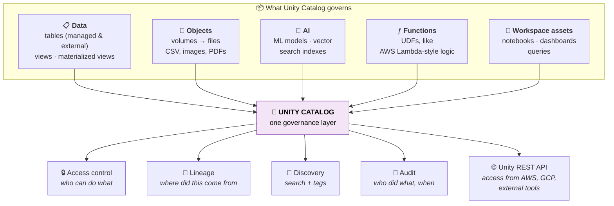
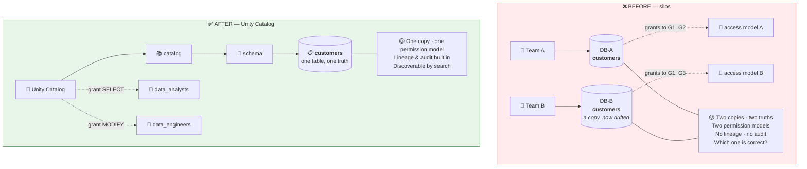
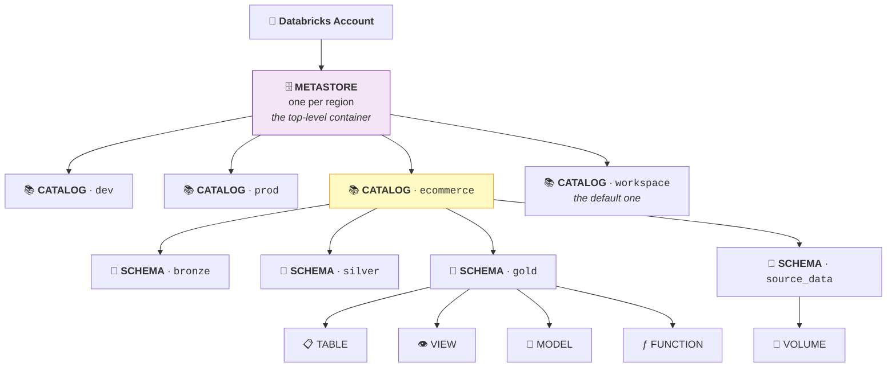
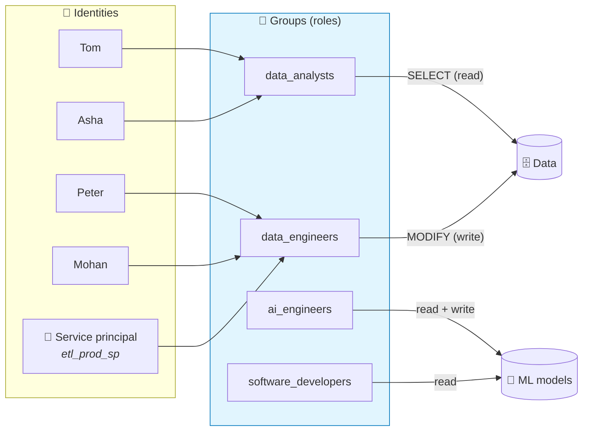
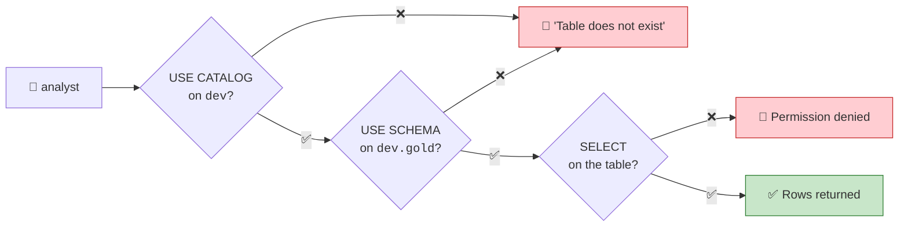
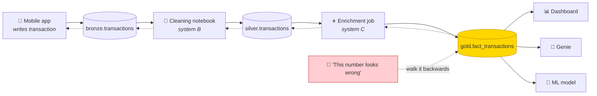
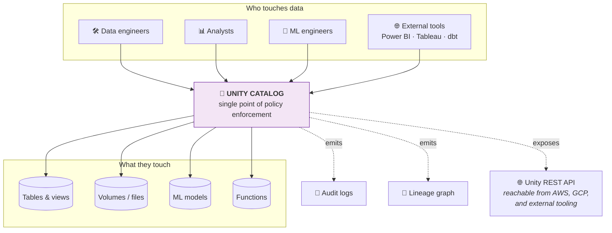

# Part 5 — Unity Catalog: Governance & the 3-Level Namespace

> **Section goal:** Understand the layer that decides **who can see what**, **where data came from**, and **how anyone finds it** — and be able to explain why large enterprises pick Databricks largely *because of* this component. By the end you'll be able to design a catalog strategy, grant permissions correctly (including the three-grant rule that trips up almost everyone), and read a lineage graph.

Covers transcript `01:49:26` – `01:59:31`, plus the hierarchy introduced at `00:06:21`.

---

## 1. The definition, unpacked

> *"Unity Catalog is a **unified governance solution for data and AI assets** on the Databricks platform."*

That sentence has four load-bearing words. Take them one at a time.

| Word | What it means here |
|------|--------------------|
| **Unified** | One system covers *everything* — not a different permission model per tool. |
| **Governance** | *"Access control, and how you want your data to be governed."* Plus: lineage, discovery, auditing. |
| **Data assets** | *"Tables, views, etc."* — and volumes (files). |
| **AI assets** | *"Models, etc. You can have a trained AI model which you have stored on Databricks."* |



---

## 2. The problem it solves — the "silos" story

This is the strongest way to explain Unity Catalog in an interview, because it starts with pain, not features.

> *"Previously what used to happen — and by the way I have worked in such organisations — is there are databases owned by different teams and there is different type of access. Team A owns the customer database… Team B also will have a customer table. They will have **duplications** and they will have **different kinds of access**. It's like teams are working in **silos** and they don't have unified governance."*



> ⭐ **Interview:** *"Why does Unity Catalog matter?"* → *"Before it, governance lived inside each workspace and each tool, so large organisations ended up with duplicated tables, inconsistent grants and no cross-team lineage. Unity Catalog moves governance up to the **account level**, so one permission model, one lineage graph and one audit trail cover every workspace, every cloud and every asset type — tables, files, ML models and functions. Practically, that's what lets a security team approve a self-service data platform: they can prove who can access what, and where any number came from."*

---

## 3. The three-level namespace (formally this time)

You met this in Part 4. Now the rules.



### 🔍 Plain-English deep-dive: metastore

- **Metastore** — *the top-level container that holds all your catalogs and the metadata about them.* **Analogy:** the **whole records room** of a building; catalogs are the filing cabinets inside it. **Why it matters:** there is normally **one Unity Catalog metastore per cloud region per account**, and multiple workspaces attach to it. That's precisely how governance becomes *centralised* rather than per-workspace.

- **Legacy `hive_metastore`** — *the old, per-workspace metastore that predates Unity Catalog.* You may still see a catalog literally named `hive_metastore` in older workspaces. It has **no** fine-grained governance, no lineage, no cross-workspace sharing. **Migrating off it is a common real-world project** — a great thing to mention in an interview if you've done it.

### Catalog naming strategies

> *"You can have catalogs based on your environment: dev, prod, staging. You can also have catalog names based on your three layers of medallion architecture: bronze, gold, silver. Or you can have it based on teams — one catalog for sales team, another for marketing."*

| Strategy | Example catalogs | Best when | Watch out for |
|----------|------------------|-----------|---------------|
| **By environment** ⭐ | `dev`, `staging`, `prod` | Almost always the right default | Need consistent schema names across all three |
| **By business domain** | `sales`, `marketing`, `finance` | Data-mesh style, domain ownership | Cross-domain joins need grants in both |
| **By medallion layer** | `bronze`, `silver`, `gold` | Small orgs, single domain | Doesn't scale — where does *prod* gold live? |
| **Hybrid** ⭐⭐ | `prod_sales`, `dev_sales` | Larger orgs | Naming discipline required |

> 💡 **What this project does:** one catalog `ecommerce`, with schemas `bronze`, `silver`, `gold`, `source_data`. That's the *medallion-as-schemas* pattern — correct for a pilot. In production you'd more likely see `prod_ecommerce.bronze` / `dev_ecommerce.bronze`.

> ⭐ **Interview:** *"How would you structure catalogs?"* → *"I default to environment-level catalogs — dev, staging, prod — with medallion layers as schemas inside each. That gives a clean promotion path where the same code runs against a different catalog per environment via a parameter, and it makes blast-radius control easy: prod write access is granted at catalog level to exactly one service principal. For a larger data-mesh organisation I'd combine environment and domain, like `prod_sales`, so domain teams own their catalog while environment separation is preserved."*

---

## 4. Identities: users, groups and service principals

> *"These teams, they are called **groups** in Databricks. They're like **role-based privileging**. When you use role-based privileging you have roles… and then you can have users tied to it. So let's say Tom, Peter, Mohan — these are all the users tied to this group. When you give read access to a group, automatically these folks get that read access."*



### 🔍 Plain-English deep-dive: why grant to groups, never to people

- **User** — *one human.* **Analogy:** one employee.
- **Group** — *a named bundle of users representing a role.* **Analogy:** the **"Finance" door-badge group**. You program the door once; adding a new hire means adding them to the badge group, not reprogramming every door.
- **Service principal** — *a non-human identity for automation.* **Analogy:** a **robot's badge**. Your scheduled pipelines should run as one of these, never as a person's account — otherwise the pipeline breaks the day that person leaves.

> ⚠️ **Gotcha / real-world rule:** **Never grant privileges to individual users.** Grant to groups only. Otherwise permission cleanup during joiners/movers/leavers becomes impossible, and auditors will fail you on it.

### ☁️ Azure specifics

| Concept | On Azure Databricks |
|---------|---------------------|
| Identity provider | **Microsoft Entra ID** (formerly Azure AD) |
| Groups | Sync **Entra ID groups** into Databricks via **SCIM** provisioning, so group membership is managed once in Entra |
| SSO | Automatic — you're already signed in via Entra |
| Service principals | Entra ID **service principals** / managed identities |
| Where you administer | **Databricks Account Console** (`accounts.azuredatabricks.net`) for account-level; the workspace admin settings for workspace-level |

> 🔍 **Identity federation** — *defining users and groups once at the **account** level, then assigning them to individual workspaces.* **Analogy:** one company ID card that works in every office building, instead of a separate pass per building. This is what Unity Catalog requires and enables.

---

## 5. 🧪 LAB — Create catalogs, groups and grants

### 5.1 Create catalogs (two ways)

**UI route:**

| # | Action |
|---|--------|
| 1 | Left nav → **`Catalog`** |
| 2 | Click **`+`** (or **`Create catalog`**) top-right |
| 3 | Name: `dev` → **Type: Standard** → **`Create`** |
| 4 | Repeat for `prod` |

**SQL route** (what the project actually uses, at `02:30:13`):

```sql
CREATE CATALOG IF NOT EXISTS dev;
CREATE CATALOG IF NOT EXISTS prod;

-- Verify
SHOW CATALOGS;
```

### 5.2 Create groups

> *"If you go to Settings → Identity and access → Groups… I have created a new group here, let's say data analysts and data engineers."*

| # | Action |
|---|--------|
| 1 | Top-right **profile icon** → **`Settings`** |
| 2 | → **`Identity and access`** |
| 3 | → **`Groups`** → **`Add group`** |
| 4 | Name: `data_analysts` → **`Add`** |
| 5 | Open the group → **`Members`** tab → **`Add members`** → add yourself |
| 6 | Repeat for `data_engineers` |

> ⚠️ **Gotcha (Free Edition):** You may be the only user, and some account-console features are limited. Create the groups anyway — the *grants* still work, and you'll be practising the correct pattern.

### 5.3 Grant permissions

**UI route:**

| # | Action |
|---|--------|
| 1 | **`Catalog`** → click the **`dev`** catalog |
| 2 | **`Permissions`** tab → **`Grant`** |
| 3 | **Principal:** `data_analysts` |
| 4 | **Privileges:** tick `USE CATALOG`, `USE SCHEMA`, `SELECT`, `BROWSE` |
| 5 | **`Grant`** |
| 6 | Repeat for `data_engineers` with `USE CATALOG`, `USE SCHEMA`, `SELECT`, `MODIFY`, `CREATE TABLE`, `CREATE SCHEMA` |

> *"So let's say data analyst folks have read access… and the data engineers have write access and so on."*

**SQL route (know this — interviewers ask for the syntax):**

```sql
-- Read-only analysts on the whole dev catalog
GRANT USE CATALOG ON CATALOG dev            TO `data_analysts`;
GRANT USE SCHEMA  ON CATALOG dev            TO `data_analysts`;
GRANT SELECT      ON CATALOG dev            TO `data_analysts`;
GRANT BROWSE      ON CATALOG dev            TO `data_analysts`;

-- Engineers can also write and create
GRANT USE CATALOG, USE SCHEMA, SELECT, MODIFY, CREATE SCHEMA, CREATE TABLE
  ON CATALOG dev TO `data_engineers`;

-- Narrower: one schema only
GRANT USE SCHEMA, SELECT ON SCHEMA dev.gold TO `data_analysts`;

-- Narrowest: one table only
GRANT SELECT ON TABLE dev.gold.fact_orders  TO `data_analysts`;

-- Files in a volume
GRANT READ VOLUME  ON VOLUME dev.source_data.raw TO `data_analysts`;
GRANT WRITE VOLUME ON VOLUME dev.source_data.raw TO `data_engineers`;

-- Inspect and undo
SHOW GRANTS ON CATALOG dev;
SHOW GRANTS ON TABLE   dev.gold.fact_orders;
REVOKE SELECT ON TABLE dev.gold.fact_orders FROM `data_analysts`;

-- Ownership transfer (owners can always grant on what they own)
ALTER TABLE dev.gold.fact_orders OWNER TO `data_engineers`;
```

> ⚠️ **THE THREE-GRANT RULE — the #1 Unity Catalog gotcha.**
>
> To read one table, a principal needs **all three** of:
> 1. `USE CATALOG` on the catalog
> 2. `USE SCHEMA` on the schema
> 3. `SELECT` on the table
>
> Granting only `SELECT` produces a confusing *"does not exist or you do not have permission"* error. Think of it as: **key to the building** → **key to the floor** → **key to the room**. All three or you're standing outside.



### 5.4 Privilege reference

| Privilege | Applies to | Means |
|-----------|-----------|-------|
| `USE CATALOG` | Catalog | "I'm allowed to traverse into this catalog." **Not** data access. |
| `USE SCHEMA` | Schema | "I'm allowed to traverse into this schema." **Not** data access. |
| `SELECT` | Table / view | Read rows |
| `MODIFY` | Table | `INSERT`, `UPDATE`, `DELETE`, `MERGE` |
| `CREATE SCHEMA` | Catalog | Create schemas inside it |
| `CREATE TABLE` | Schema | Create tables inside it |
| `CREATE VOLUME` | Schema | Create volumes inside it |
| `READ VOLUME` / `WRITE VOLUME` | Volume | Read / write files |
| `EXECUTE` | Function / model | Run it |
| `BROWSE` | Catalog / schema | See that an object *exists* in search, without reading its data ← great for discovery |
| `APPLY TAG` | Most objects | Add governance tags |
| `ALL PRIVILEGES` | Any | Everything (use sparingly) |
| `MANAGE` | Any | Manage the object's grants and metadata |

**Inheritance:** privileges granted at a higher level flow **downward**. `GRANT SELECT ON CATALOG dev` covers every table in every schema in `dev`, including ones created tomorrow. **Ownership** is separate — the owner always has full control and can grant to others.

---

## 6. Fine-grained access control (beyond table-level)

Not in the transcript, but it's what "fine-grained" actually means and it comes up in interviews.

### Row filters and column masks

```sql
-- 1. A function that decides which rows a user may see
CREATE OR REPLACE FUNCTION ecommerce.gold.region_filter(region STRING)
RETURN is_account_group_member('global_admins') OR region = 'West';

-- 2. Attach it to the table as a row filter
ALTER TABLE ecommerce.gold.gld_dim_customers
  SET ROW FILTER ecommerce.gold.region_filter ON (region);

-- 3. A function that masks a sensitive column
CREATE OR REPLACE FUNCTION ecommerce.gold.mask_phone(phone STRING)
RETURN CASE WHEN is_account_group_member('pii_readers') THEN phone
            ELSE 'XXX-XXX-' || RIGHT(phone, 4) END;

-- 4. Attach it to the column
ALTER TABLE ecommerce.gold.gld_dim_customers
  ALTER COLUMN phone SET MASK ecommerce.gold.mask_phone;
```

| Technique | Restricts | Analogy |
|-----------|-----------|---------|
| **Table grant** | Whole table | Locking the room |
| **Row filter** | Which **rows** you see | Handing you only your region's pages |
| **Column mask** | What a **cell** shows | Redacting the phone number with a black marker |
| **Dynamic view** | Both, via SQL logic in a view | A custom window into the room |

```sql
-- The older, still-common "dynamic view" pattern
CREATE OR REPLACE VIEW ecommerce.gold.v_customers_safe AS
SELECT customer_id,
       CASE WHEN is_account_group_member('pii_readers')
            THEN phone ELSE 'REDACTED' END AS phone,
       country, state, region
FROM   ecommerce.gold.gld_dim_customers
WHERE  is_account_group_member('global_admins')
   OR  region = current_user_region();
```

> ⭐ **Interview:** *"How do you give the India team access to only Indian customers?"* → *"A row filter function on the customers table that checks group membership against the region column, so the restriction is enforced at the table itself rather than relying on every analyst remembering to add a `WHERE` clause. Column masks handle the orthogonal problem — everyone sees their region's rows, but only the PII-approved group sees unmasked phone numbers. Both are attached to the object, so they apply through SQL, notebooks, dashboards and Genie identically."*

---

## 7. Data lineage — the spy story

> *"Lineage means: when you have any data, what kind of systems it has gone through… Let's say someone makes a transaction on their mobile phone and that mobile app is what is updating that table. Then it goes to a downstream system B, which is doing some data cleaning. Then it goes through C, which is adding a new column. When you have something wrong in this table, you want to **backtrack** — it's like you are a **spy** and you want to figure out all the places where data has travelled."*



### Two directions, two use cases

| Direction | Question it answers | When you need it |
|-----------|---------------------|------------------|
| **Upstream** (backwards) | *"Where did this number come from?"* | Debugging a wrong figure; regulatory audit; root-cause analysis |
| **Downstream** (forwards) | *"If I change/drop this column, what breaks?"* | **Impact analysis before a schema change** — arguably the more valuable one |

**Where to see it:** Catalog → click a table → **`Lineage`** tab. You get a graph of upstream/downstream tables plus the **notebooks, jobs, queries and dashboards** involved.

> ⚠️ **Gotcha:** Lineage is **captured automatically but not retroactively**. It only exists for operations run **after** Unity Catalog was in place, it's retained for about a year, and some paths (external tools writing directly to storage) won't be captured. The instructor sees this himself: *"Right now it's just a simple table so you're not able to see much of the things here."*

---

## 8. Data discovery — search and tags

> *"If you want to search through this data, there is this search thing. You can add the **tags** and everything… Through the discovery feature, when you have a huge organisation and you're trying to locate the data, Unity Catalog will help you."*

| Feature | What it does | How to use |
|---------|--------------|------------|
| **Search** | Full-text search across catalogs, schemas, tables, columns | Search box at the top of the workspace |
| **Tags** | Key/value labels on any object | Table → **Overview** → **Tags** → **Add tag**, e.g. `pii=true`, `domain=sales`, `certified=gold` |
| **Comments** | Human descriptions on tables and columns | See SQL below. **Also fuels Genie's accuracy.** |
| **Certification** | Marks a table as blessed/trusted | Table detail page |

```sql
COMMENT ON TABLE ecommerce.gold.gld_fact_order_items IS
  'Business-ready order line items. One row per line. Currency normalised to INR. Owner: data_engineering.';

ALTER TABLE ecommerce.gold.gld_fact_order_items
  ALTER COLUMN net_amount_inr COMMENT 'Sales amount after discount, including tax, converted to INR at transaction-date spot rate.';

ALTER TABLE ecommerce.gold.gld_dim_customers SET TAGS ('pii' = 'true', 'domain' = 'customer');
```

> 💡 **Two-for-one:** every comment you write improves both **human discovery** and **Genie's SQL accuracy** (Part 26), because Genie reads exactly this metadata. Commenting tables is the highest-return five minutes in the whole platform.

---

## 9. Bonus: system tables and Delta Sharing

### System tables — governance you can query

Unity Catalog exposes operational metadata as ordinary tables in the `system` catalog:

```sql
-- Who queried what, when
SELECT event_time, user_identity.email, action_name, request_params
FROM   system.access.audit
WHERE  event_date >= current_date() - INTERVAL 7 DAYS
ORDER  BY event_time DESC
LIMIT  100;

-- Where the money went
SELECT usage_date, sku_name, SUM(usage_quantity) AS dbus
FROM   system.billing.usage
WHERE  usage_date >= current_date() - INTERVAL 30 DAYS
GROUP  BY usage_date, sku_name
ORDER  BY usage_date DESC;

-- Column-level lineage as data
SELECT * FROM system.access.column_lineage LIMIT 20;
```

> ⭐ **Interview gold:** *"How would you find out who accessed a PII table last month, or which team drove last month's cost spike?"* → *"Query the `system` catalog — `system.access.audit` for access events and `system.billing.usage` for DBU consumption by SKU and tag. Because they're just Delta tables, I can build a dashboard or an alert on them rather than filing a request with the platform team."*

### Delta Sharing — governed sharing outside your account

An open protocol for sharing live Delta tables with other organisations **without copying data** and **without requiring them to use Databricks**. It's the modern answer to "email a CSV to the partner every month".

---

## 10. Where governance sits in the bigger picture



**The three headline benefits** (straight from the course, at `01:57:04`):

1. **Unified, centralised governance** — one model across workspaces and clouds.
2. **Fine-grained access control** — catalog → schema → table → row → column.
3. **Automated lineage and data discovery** — captured for free, no manual documentation.

---

## ⭐ Likely Interview Questions for This Section

**Q1. "What is Unity Catalog and what problem does it solve?"**
> *Model answer:* "It's Databricks' unified governance layer for data and AI assets. Before it, governance was per-workspace and per-tool, so large organisations ended up with duplicated tables owned by different teams, inconsistent grants, and no way to trace where a number came from. Unity Catalog lifts governance to the account level: one metastore per region, a three-level `catalog.schema.object` namespace, one permission model covering tables, views, volumes, functions and ML models, plus automatic lineage, discovery and audit. It's usually the deciding factor for enterprise adoption, because it's what lets a security team approve self-service analytics."

**Q2. "Explain the three-level namespace and why it exists."**
> *Model answer:* "`catalog.schema.object`. The older Hive model was two-level — database and table — scoped to a single workspace, so you couldn't cleanly separate environments or domains within one governed metastore. Adding the catalog level gives a natural isolation boundary: dev/staging/prod, or per business domain. It also creates a useful place to grant permissions in bulk, since privileges inherit downward, so I can grant read on an entire prod catalog to an analyst group rather than maintaining table-by-table grants."

**Q3. "An analyst says a table 'does not exist' but you can see it. What's wrong?"**
> *Model answer:* "Almost certainly the three-grant rule. Reading a table needs `USE CATALOG` on the catalog, `USE SCHEMA` on the schema, and `SELECT` on the table. If any traversal grant is missing, Unity Catalog deliberately reports the object as non-existent rather than 'permission denied', so users can't enumerate objects they shouldn't know about. I'd run `SHOW GRANTS` at all three levels. If those are fine, I'd check they're querying the fully qualified name, that they're in the right workspace, and that the group membership has actually synced from Entra ID."

**Q4. "Should you grant permissions to users or groups?"**
> *Model answer:* "Groups, always. Granting to individuals makes joiner/mover/leaver handling impossible and fails audits, because there's no way to answer 'what can this role do?' without enumerating every object. I'd sync groups from the corporate identity provider — Entra ID via SCIM on Azure — so membership is managed once in the place HR processes already touch. Automation should run as service principals rather than a person's account, otherwise pipelines break when someone leaves."

**Q5. "How would you implement row-level and column-level security?"**
> *Model answer:* "Row filters and column masks. A row filter is a SQL function attached to a table that returns a boolean per row — typically checking `is_account_group_member()` against a region or tenant column — so the restriction is enforced at the table rather than depending on analysts writing the right `WHERE` clause. A column mask is a function attached to a specific column that returns a redacted value for unauthorised groups. Both apply uniformly across SQL, notebooks, dashboards and Genie. The older equivalent is a dynamic view with the same logic embedded, which is still useful when you need more complex shaping."

**Q6. "What is data lineage and how have you used it?"**
> *Model answer:* "Lineage is the automatically captured graph of how data flows between tables, and which notebooks, jobs, queries and dashboards touched it. I use it in two directions. Upstream, to root-cause a wrong figure — walk back from the gold table to the silver transformation to the bronze ingest and find where the value diverged. Downstream, for impact analysis before a schema change — before dropping or renaming a column I check what consumes it, which turns a risky change into a known one. The caveats are that it's only captured for operations run under Unity Catalog, it has a retention window, and writes made outside Databricks won't appear."

**Q7. "How would you design catalogs and schemas for a company with three domains and three environments?"**
> *Model answer:* "I'd use catalogs for the environment-plus-domain combination — `dev_sales`, `prod_sales`, `dev_finance`, and so on — and keep schema names identical inside each, typically `bronze`, `silver`, `gold`. That gives two things: identical code can be promoted between environments by changing a single catalog parameter, and blast radius is contained since prod write access is granted at the catalog level to a single service principal per domain. Domain teams own their catalogs, a central platform group owns catalog creation and the identity mapping, and cross-domain access is an explicit grant, which makes sharing a deliberate decision rather than an accident."

**Q8. "How do you audit who accessed sensitive data?"**
> *Model answer:* "Query `system.access.audit` in the system catalog, filtered by action and object. Because system tables are ordinary Delta tables, I can build a scheduled dashboard or an alert on them — for example, notify on any read of a table tagged `pii=true` by a principal outside the approved group. I'd combine that with `system.billing.usage` for cost attribution, and tag objects consistently so both queries can filter by tag rather than by hardcoded table names."

**Q9. "What's the difference between Unity Catalog and the Hive metastore?"**
> *Model answer:* "The Hive metastore is per-workspace, two-level, and has no fine-grained access control, no lineage and no cross-workspace or cross-cloud governance — permissions effectively live at the cluster and storage layer. Unity Catalog is account-level, three-level, and governs tables, files, models and functions with inherited, fine-grained privileges plus automatic lineage and audit. Most enterprises with older workspaces have a `hive_metastore` catalog still hanging around, and migrating off it is a common project — the main work is inventorying tables, recreating them as external or managed UC tables, remapping storage credentials, and repointing jobs."

---

## 🧠 30-Second Memory Hooks

- **Unity Catalog = one governance layer for data *and* AI assets.** Tables, views, volumes, models, functions — all under one roof.
- **Metastore → Catalog → Schema → Object.** Records room → filing cabinet → drawer → folder.
- **⚠️ THE THREE-GRANT RULE: `USE CATALOG` + `USE SCHEMA` + `SELECT`.** Building key → floor key → room key.
- **Missing traversal grant ⇒ "does not exist"**, *not* "permission denied". By design, so you can't enumerate hidden objects.
- **Grant to groups, never to users.** Run pipelines as **service principals**, never as a person.
- **Privileges inherit downward. Ownership always wins.**
- **Schema == database** in Databricks.
- **Row filter = which rows. Column mask = what the cell shows. Table grant = the whole room.**
- **Lineage: upstream = "where did this come from"; downstream = "what breaks if I change it".** The second one is more valuable.
- **Comments are free Genie accuracy.** Document tables and columns; Genie reads them.
- **`system.access.audit` = who did what. `system.billing.usage` = where the money went.** They're just Delta tables — query them.
- **☁️ Azure: Entra ID + SCIM for groups; account console at `accounts.azuredatabricks.net`.**

---

*Next suggested section:* **[Part 6 — Tables & Volumes: Managed vs External](Part-06-tables-volumes-managed-vs-external.md)** — you now know *who* can access data; next you'll learn *where it physically lives*, the difference between a table Databricks owns and one that just points at your S3/ADLS storage, and what actually happens to the files when you `DROP` each kind.

---

**Navigation** — ⬅️ **[Part 4 — LAB: Setup & UI Tour](Part-04-lab-account-setup-ui-tour.md)** · 🏠 **[Master Index](../Databricks%20-%20Study%20Guide.md)** · ➡️ **[Part 6 — Tables & Volumes](Part-06-tables-volumes-managed-vs-external.md)**
