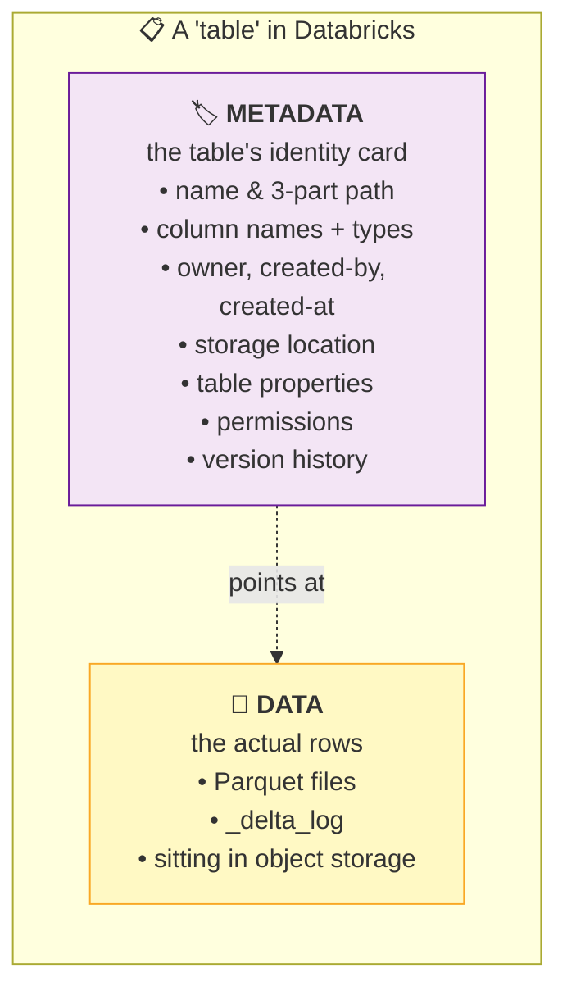
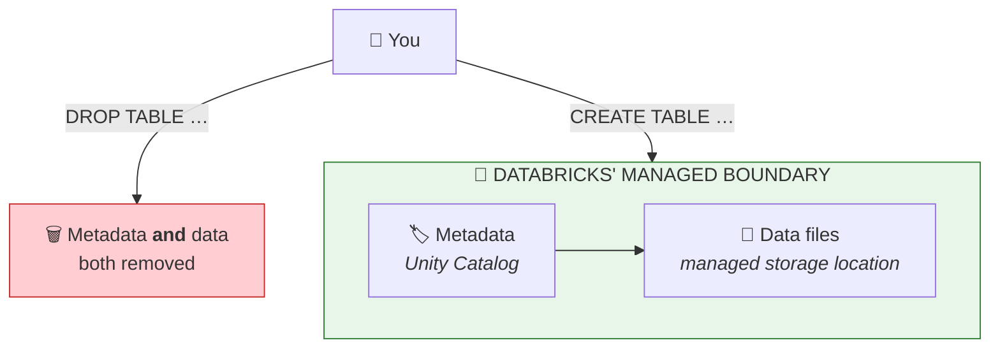
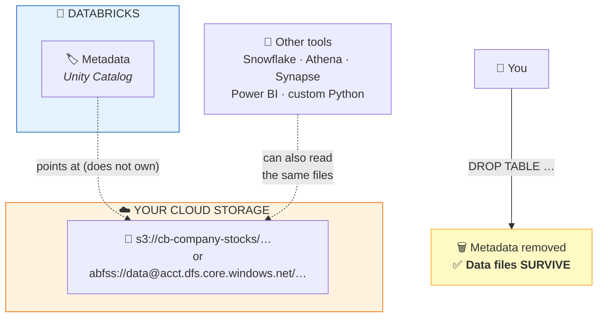
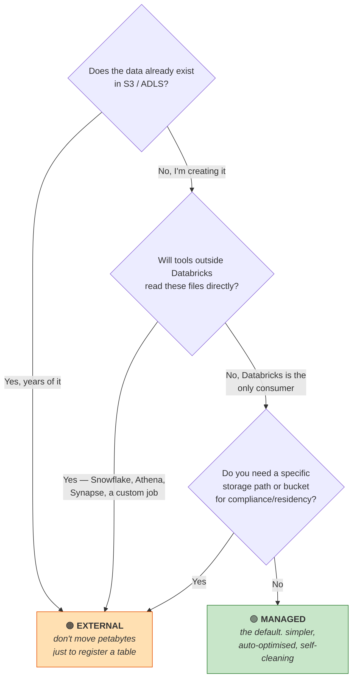
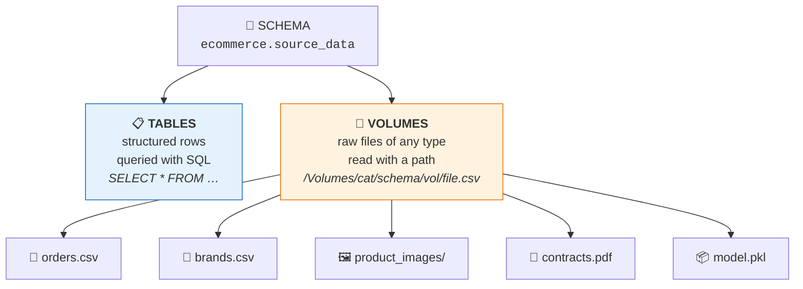
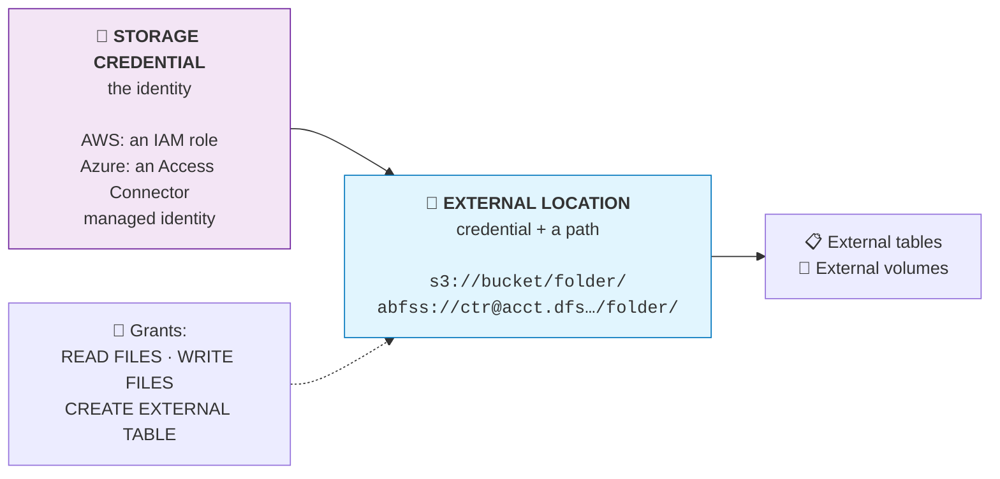
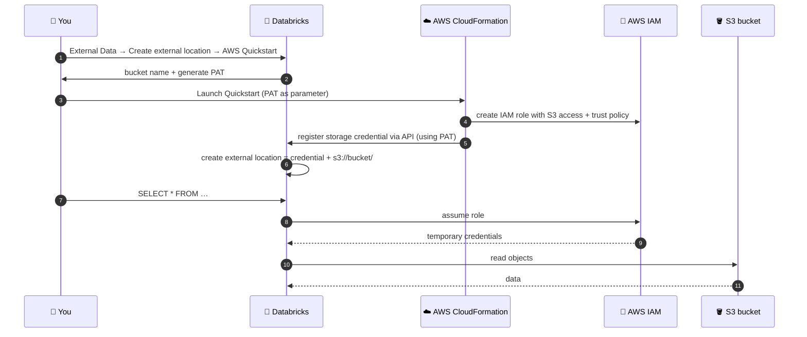
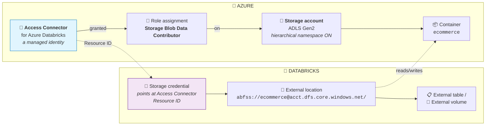
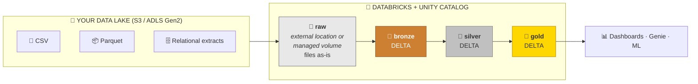

# Part 6 — Tables & Volumes: Managed vs External

> **Section goal:** Learn where your data *physically lives*. Understand the difference between a table Databricks owns end-to-end and one that merely points at files in your own S3/ADLS storage — including the single most consequential difference: **what happens to the files when you `DROP` it**. You'll also learn volumes (governed folders for files) and wire up a real external location on both AWS and ☁️ Azure.

Covers transcript `00:21:08` – `00:23:03`, `01:39:45` – `01:43:34`, `02:09:15` – `02:14:24`, `02:34:37` – `02:36:31`.

---

## 1. Every table is two things

> *"See, when you look at any table in Databricks, it has **two components**. One is **data**. And the other one is **metadata**."*



**Analogy:** a **library catalogue card** and the **book itself**. The card tells you the title, author, and shelf number. The book is the actual content. The card is metadata; the book is data.

**The managed-vs-external question is simply: *who owns the book?*** (The card is always Databricks'.)

### 🔍 Plain-English deep-dive: metadata

- **Metadata** — *data about the data.* **Analogy:** the label on a jam jar — flavour, date made, ingredients. You need the label to know what's inside without opening it. **Why it matters:** Spark uses metadata to **skip work**. Knowing a Parquet file's column statistics lets it avoid reading files that can't contain matching rows (Part 12). Metadata isn't paperwork — it's performance.

### Two ways to inspect it

**Route 1 — the UI:**
Catalog → click the table → **`Details`** tab.

> *"Created at, who created it, what is my storage location — all this information. See properties. This is called metadata."*

**Route 2 — SQL (know this one; it comes up in interviews):**

```sql
DESCRIBE EXTENDED workspace.default.movies;
```

You get back a long list. The rows that matter:

| Row you're looking for | Managed table shows | External table shows |
|------------------------|---------------------|----------------------|
| **Type** | `MANAGED` | `EXTERNAL` |
| **Location** | A Databricks-managed path | **Your own** `s3://…` or `abfss://…` |
| **Provider / data source format** | `delta` | `delta` (or parquet/csv) |
| **Owner** | the creating principal | the creating principal |

Related commands worth knowing:

```sql
DESCRIBE TABLE           workspace.default.movies;   -- columns only
DESCRIBE EXTENDED        workspace.default.movies;   -- + full metadata
DESCRIBE DETAIL          workspace.default.movies;   -- Delta-specific: files, size, partitions
DESCRIBE HISTORY         workspace.default.movies;   -- version history (Part 7)
SHOW CREATE TABLE        workspace.default.movies;   -- the DDL that would recreate it
```

---

## 2. Managed tables

> *"For a managed table, Databricks will manage **both** the content and metadata."*



**How you create one:** just don't specify a location.

```sql
-- Managed, because no LOCATION clause
CREATE TABLE ecommerce.bronze.brz_brands (
  brand_code    STRING,
  brand_name    STRING,
  category_code STRING
);
```

```python
# Managed, because saveAsTable() with no path option
df.write.format("delta").mode("overwrite").saveAsTable("ecommerce.bronze.brz_brands")
```

> 💡 **Your very first table was managed.** In Part 4, `workspace.default.movies` showed **Type: MANAGED** in the Details tab. You never chose that — it's the default.

### ⚠️ The `DROP` behaviour — the thing to never forget

```sql
DROP TABLE ecommerce.bronze.brz_brands;
-- Removes metadata AND deletes the underlying data files.
```

> 💡 **Safety net:** Unity Catalog keeps dropped managed-table data for a retention window, so you can usually recover:
> ```sql
> UNDROP TABLE ecommerce.bronze.brz_brands;
> ```
> Don't rely on it — it's a grace period, not a backup.

### Why managed is the modern default

| Benefit | Why |
|---------|-----|
| **Simplest governance** | *"For managed tables, data governance is easy because Unity Catalog controls everything."* One system owns the whole lifecycle. |
| **Automatic optimisation** | Databricks can run **predictive optimization** — automatic `OPTIMIZE`, `VACUUM`, file compaction and liquid clustering — because it owns the files. |
| **No orphaned files** | Drop the table, the files go. No storage bill for data nobody remembers. |
| **No credential plumbing** | No IAM roles, no Access Connectors, no external locations to configure. |

---

## 3. External tables

> *"For an external table… this table has its actual data in S3. Amazon S3 has a bucket called `cb-company-stocks`, and the actual storage location is in S3. Whereas for movies, the actual storage location is [Databricks'] first storage. So for external tables, **data can be stored in S3 or any other external location, but metadata is inside Databricks**."*



**How you create one:** add a `LOCATION`.

```sql
CREATE TABLE workspace.default.company_stocks
USING DELTA
LOCATION 's3://cb-company-stocks-001/bronze/';
```

### ⚠️ The `DROP` behaviour — the mirror image

```sql
DROP TABLE workspace.default.company_stocks;
-- Removes ONLY the metadata. The S3/ADLS files remain, untouched.
```

> *"Let's say if you delete a table, it will delete the metadata but it will **not** delete the actual content, which might be stored in S3 or any other location."*

This is a **double-edged sword**:

| ✅ Upside | ❌ Downside |
|-----------|------------|
| Dropping a table can't destroy the source of truth | **Orphaned files** accumulate silently, still costing storage |
| Other tools keep working after you drop the Databricks table | Recreate the table and the *old data reappears* — surprising if you expected a clean slate |
| Safe to experiment | *"It will require discipline"* — someone must own cleanup |

> ⭐ **Interview — asked constantly:** *"What happens to the data when you drop a managed table versus an external table?"* → *"Dropping a **managed** table removes both metadata and the underlying files, though Unity Catalog holds them for a retention window so `UNDROP TABLE` can recover a mistake. Dropping an **external** table removes only the metadata registration — the files in S3 or ADLS are untouched. That makes external tables safer against accidental deletion but creates an orphan-file problem: storage costs continue and re-creating the table silently resurrects the old data. So external needs an explicit lifecycle policy, whereas managed tables clean up after themselves."*

---

## 4. Head-to-head comparison

| Dimension | 🟢 **Managed** | 🟠 **External** |
|-----------|----------------|------------------|
| **Metadata owned by** | Databricks | Databricks |
| **Data files owned by** | **Databricks** | **You** (your S3/ADLS account) |
| **`LOCATION` clause** | Absent | Present |
| **`DROP TABLE` deletes files?** | ✅ Yes (with UNDROP grace period) | ❌ No |
| **Setup effort** | None | Storage credential + external location |
| **Other tools can read the files** | Not directly | ✅ Yes |
| **Automatic optimisation** | ✅ Predictive optimization | ⚠️ Manual `OPTIMIZE` / `VACUUM` |
| **Governance** | *"Easy — Unity Catalog controls everything"* | *"There is governance because metadata is inside Databricks, but it will require discipline"* |
| **Best for** | *"Quick analytics and fully-governed data"* | *"Data shared with other tools, or pre-existing datasets"* |

### The decision flowchart



> *"When you're doing quick analytics and fully-governed data, use managed table. But if you have years of data stored externally, either in ADLS or S3, then it's better to use external table… When you have data in S3 or ADLS, you can access it from Databricks and you can access it from other tools also. That part becomes easier."*

> 💡 **Industry reality check:** *"In the industry you will see all these companies who will have this huge data in S3. So in that case when they use Databricks, all they do is they use it as an external table — so that metadata is still managed by Databricks."* Both patterns are normal. **Databricks' current guidance is: prefer managed unless you have a concrete reason not to**, because predictive optimization and lifecycle simplicity are real wins.

> 💡 **What this project uses:** everything is **managed**. The external-table material exists so you understand the pattern and can answer interview questions — the project itself doesn't need it.

---

## 5. Volumes — governed folders for *files*

Tables hold rows. **Volumes hold files.** They're the other half of Unity Catalog's storage story, and you need one before Part 20.

> *"We'll go to Data Ingestion, and then instead of using 'Create or modify table' we'll **upload files to volume**. Why? Because we don't want to create a table out of this CSV file. We want to upload this file **as is**."*



### 🔍 Plain-English deep-dive: volume vs table

| | 📋 **Table** | 📁 **Volume** |
|---|---|---|
| **Holds** | Rows with a schema | Files of any type |
| **Access with** | SQL / DataFrame API | A **file path** |
| **Path form** | `catalog.schema.table` | `/Volumes/catalog/schema/volume/…` |
| **Analogy** | A **spreadsheet** | A **folder** on a shared drive |
| **Governed by Unity Catalog?** | ✅ | ✅ (`READ VOLUME` / `WRITE VOLUME`) |
| **Use for** | Anything you'll query | Landing zones, images, PDFs, model artifacts, config files |

**Volumes come in the same two flavours as tables:**

| | **Managed volume** | **External volume** |
|---|---|---|
| Storage | Databricks-managed location | Your S3/ADLS path |
| Create with | No location | `LOCATION 'abfss://…'` |
| Delete removes files? | ✅ Yes | ❌ No |
| The course uses | ✅ This one | — |

> *"Manage volume means: here we are uploading the data to Databricks and Databricks is taking care of management."*
> *"This is going to be a **managed volume**, which means the data files' storage location is managed by Unity Catalog."*

> ⚠️ **Legacy warning — DBFS:** Older tutorials use `dbfs:/FileStore/…` or `/dbfs/…`. **DBFS is legacy** and is not governed by Unity Catalog. Use **Volumes** for anything new. If an interviewer mentions DBFS, saying *"we standardised on Unity Catalog volumes because DBFS has no fine-grained governance or lineage"* is a strong answer.

---

## 6. 🧪 LAB — Create a volume and upload files

This is exactly what the course does at `00:21:52`, and what you'll repeat in Part 20 for the project.

### 6.1 Create the volume (UI)

| # | Action |
|---|--------|
| 1 | Left nav → **`Data Ingestion`** |
| 2 | Click **`Upload files to volume`** *(not "Create or modify table")* |
| 3 | In the target picker choose **`workspace`** → **`default`** |
| 4 | Click **`Create a volume`** |
| 5 | **Volume name:** `raw_data` |
| 6 | **Volume type:** **`Managed volume`** |
| 7 | Click **`Create`** |
| 8 | Now **drag and drop** `orders.csv` into the upload zone |
| 9 | Click **`Upload`** |

### 6.2 Verify

Catalog → `workspace` → `default` → expand **`Volumes`** → `raw_data`.

> *"See, the CSV file is **as is** — we did not convert that to a table."*

That's the whole point: a volume is a folder, not a table.

### 6.3 The SQL equivalent (know both routes)

```sql
CREATE SCHEMA IF NOT EXISTS ecommerce.source_data;

-- Managed volume — no LOCATION
CREATE VOLUME IF NOT EXISTS ecommerce.source_data.raw;

-- External volume — with LOCATION
CREATE EXTERNAL VOLUME IF NOT EXISTS ecommerce.source_data.landing
LOCATION 'abfss://ecommerce@mystorageacct.dfs.core.windows.net/landing/';

SHOW VOLUMES IN ecommerce.source_data;
```

### 6.4 Reading from a volume

The path is always `/Volumes/<catalog>/<schema>/<volume>/<subpath>`:

```python
path = "/Volumes/workspace/default/raw_data/orders.csv"

df = (spark.read
      .option("header", "true")
      .option("inferSchema", "true")
      .csv(path))
display(df)
```

```sql
-- SQL can query files directly, too
SELECT * FROM read_files('/Volumes/workspace/default/raw_data/orders.csv',
                         format => 'csv', header => true);
```

Useful helpers:

```python
# List what's in a volume
display(dbutils.fs.ls("/Volumes/workspace/default/raw_data/"))

# Copy / move / remove
dbutils.fs.cp("/Volumes/.../a.csv", "/Volumes/.../archive/a.csv")
dbutils.fs.rm("/Volumes/.../old.csv")
```

> 💡 **Why the project needs a volume at all:** at `02:36:00` the instructor asks the obvious question — *"Why do we need raw? Can't we directly store it in bronze?"* — and answers it: *"This **raw volume is our dump ground**. We just dump data as-is without any changes. Whereas in bronze we might make minor updates. It is still raw data, but it is in **Delta Lake format**, so it gets ACID, transactions, time travel properties."* Full discussion in Part 17.

**✅ Checkpoint:** `orders.csv` is visible under Volumes, and the DataFrame read above returns rows.

---

## 7. Storage credentials & external locations — the two-part key

Before you can create an external table, Unity Catalog needs to know **how to authenticate** to your storage and **which paths** you're allowed to touch. That's two separate objects, and understanding the split makes both cloud labs make sense.



**Analogy:**
- **Storage credential** = the **keycard** (proves who you are).
- **External location** = the **specific door** that keycard is allowed to open (`s3://bucket/bronze/`).
- You grant users the right to use *that door*, not the keycard itself.

> 💡 **Why the split?** One credential can back many locations. That means you configure cloud IAM **once**, then carve up path-level access in Databricks — where your data team can manage it — instead of raising a cloud-infra ticket for every folder.

---

## 8. 🧪 LAB (AWS route) — S3 bucket → external location → external table

This is the path the video takes. **Skip to §9 if you're on Azure.**

### 8.1 Create an AWS account (if you need one)

> *"You can Google 'create AWS account'… click on **Create a free account**… provide your email address… account name… verify by email… provide a password… select your plan (free six-month plan)… They just do a **credit card verification** — it is not going to charge… then SMS verification."*

> *"At any step, if you're feeling stuck, folks, use common sense. Setting up an AWS account should not be rocket science."*

⚠️ Requires a **credit card**. If you don't want to, use the Azure route or skip both — **the project doesn't need either**.

### 8.2 Create an S3 bucket and upload a file

| # | Action |
|---|--------|
| 1 | AWS Console → search **`S3`** → **`Create bucket`** |
| 2 | **Bucket name** — must be **globally unique**. e.g. `cb-company-stocks-<yourinitials>-001` |
| 3 | Leave everything else default → **`Create bucket`** |
| 4 | Open the bucket → **`Upload`** → drag `company_stocks.csv` → **`Upload`** |

> *"The bucket name has to be **globally unique**… you won't be able to use this name, so say `cb-company-stocks-002-003` or just give your name initial — make it unique."*

### 8.3 Create the external location via AWS Quickstart

| # | Action |
|---|--------|
| 1 | Databricks → **`Catalog`** → **`External Data`** → **`Create external location`** |
| 2 | Choose **`AWS Quickstart`** |
| 3 | Type your **bucket name** |
| 4 | Click **`Generate a new token`** → **copy it** |
| 5 | Click **`Launch Quickstart`** — this opens **AWS CloudFormation** |
| 6 | Paste the token into the `Databricks Personal Access Token` parameter |
| 7 | Tick **`I acknowledge that AWS CloudFormation might create IAM resources`** |
| 8 | **`Create stack`** |
| 9 | Wait for **`CREATE_COMPLETE`** *(takes a few minutes)* |
| 10 | Back in Databricks → **`External Data`** → your location now appears |

> *"I acknowledge — I never say no to this kind of thing."* 😄 (That checkbox is mandatory: the stack creates the IAM role that becomes your storage credential.)



### 8.4 Query the file, then create a Delta external table

```sql
-- Query the raw CSV directly, no table needed
SELECT * FROM csv.`s3://cb-company-stocks-001/company_stocks.csv`;
```

Then the external Delta table the instructor builds at `02:15:50`:

```sql
CREATE TABLE workspace.default.company_stocks
USING DELTA
LOCATION 's3://cb-company-stocks-001/bronze/'
AS
SELECT *,
       current_timestamp()          AS ingested_at,
       _metadata.file_path          AS input_file_name,
       uuid()                       AS bronze_id
FROM   csv.`s3://cb-company-stocks-001/company_stocks.csv`;
```

> *"So basically I want to use the same schema as whatever I have in this CSV file. On top of that I want to add these three columns: **ingested_at** — when did I create this table; **input file name**; and a **UUID as bronze_id**."*

> ⚠️ **Gotcha the instructor hits live at `02:17:00`:** `input_file_name()` *"is not supported"* on serverless compute. Use the **`_metadata.file_path`** column instead — that's what the code above does. This is a genuinely useful thing to know.

> 💡 Notice he names the folder `bronze` — *"usually when you ingest data into Delta Lake under medallion architecture you will have bronze layer, then silver, then gold."* That's Part 17.

---

## 9. ☁️ 🧪 LAB (Azure route) — ADLS Gen2 → Access Connector → external location

The video doesn't do this. **This is the version you'll actually be asked about in an Azure interview**, so do it properly.

### The moving parts



### Step 1 — Create an ADLS Gen2 storage account

| # | Where | What to do |
|---|-------|-----------|
| 1 | `portal.azure.com` → search **`Storage accounts`** | Click **`+ Create`** |
| 2 | **Basics** | **Resource group:** `rg-databricks-learn` (same one). **Storage account name:** `stdbxlearn<random>` — lowercase letters+digits only, 3–24 chars, globally unique |
| 3 | **Basics** | **Region:** ⚠️ **the same region as your Databricks workspace** |
| 4 | **Basics** | **Performance:** `Standard`. **Redundancy:** `LRS` (cheapest) |
| 5 | **Advanced** | ⚠️⚠️ **Tick `Enable hierarchical namespace`** — *this is the single setting that makes it **ADLS Gen2** rather than plain Blob storage.* Miss it and nothing else works. |
| 6 | **Review + create** | → **`Create`**, wait ~1 min |

### 🔍 Plain-English deep-dive: what is "hierarchical namespace"?

- **Plain Blob storage** treats `folder/sub/file.csv` as one long *name* — there are no real folders, just objects with slashes in their names. Renaming a "folder" means copying every object.
- **Hierarchical namespace (HNS)** adds **real directories** with atomic rename and per-directory ACLs. **Analogy:** the difference between a pile of envelopes each labelled *"Projects/2026/report.pdf"* versus an actual filing cabinet with real drawers.
- **Why it matters:** Spark and Delta do a lot of directory listing and renaming. Without HNS those operations are slow and non-atomic. **ADLS Gen2 = Blob storage + HNS.**

### Step 2 — Create a container

| # | Action |
|---|--------|
| 1 | Open the storage account → left menu **`Data storage`** → **`Containers`** |
| 2 | **`+ Container`** → **Name:** `ecommerce` → **`Create`** |

> A **container** is the top-level folder in a storage account — the Azure equivalent of an S3 **bucket**.

### Step 3 — Create an Access Connector for Azure Databricks

| # | Action |
|---|--------|
| 1 | Portal search bar → **`Access Connector for Azure Databricks`** |
| 2 | **`+ Create`** |
| 3 | **Resource group:** `rg-databricks-learn`. **Name:** `ac-databricks-learn`. **Region:** same as everything else |
| 4 | **`Review + create`** → **`Create`** |
| 5 | Open the created resource → **`Properties`** (or **`JSON View`**) → **copy the `Resource ID`** |

It looks like:
```
/subscriptions/<sub-id>/resourceGroups/rg-databricks-learn/providers/Microsoft.Databricks/accessConnectors/ac-databricks-learn
```

> 🔍 **What is it?** A **managed identity** — an Azure-managed service identity that Databricks can assume to reach your storage. **Analogy:** a **staff badge issued to a robot**. No password to store, no secret to rotate, no key to leak. This is the modern, recommended way; older tutorials using storage **account keys** or **service principal secrets** are a security downgrade.

### Step 4 — Grant the connector access to the storage account

| # | Action |
|---|--------|
| 1 | Go to the **storage account** (not the connector) |
| 2 | Left menu → **`Access Control (IAM)`** |
| 3 | **`+ Add`** → **`Add role assignment`** |
| 4 | **Role** tab: search **`Storage Blob Data Contributor`** → select → **`Next`** |
| 5 | **Members** tab: **Assign access to** = **`Managed identity`** |
| 6 | **`+ Select members`** → **Managed identity** = **`Access connector for Azure Databricks`** → pick `ac-databricks-learn` → **`Select`** |
| 7 | **`Review + assign`** |

> ⚠️ **Gotcha:** It must be **Storage Blob Data Contributor** (a *data-plane* role). `Contributor` or `Owner` are *control-plane* roles — they let you manage the storage account but **do not** grant read/write on the blobs inside. This trips up a lot of people. If you get `403` errors later, this is the first thing to check.

> ⚠️ **Gotcha:** Role assignments can take **up to ~5 minutes** to propagate. If the connection test fails immediately after assigning, wait and retry before debugging anything else.

### Step 5 — Create the storage credential in Databricks

| # | Action |
|---|--------|
| 1 | Databricks → **`Catalog`** → **`External Data`** → **`Credentials`** tab |
| 2 | **`Create credential`** |
| 3 | **Credential type:** `Azure Managed Identity` |
| 4 | **Name:** `cred-adls-learn` |
| 5 | **Access Connector ID:** paste the Resource ID from Step 3 |
| 6 | **`Create`** |

### Step 6 — Create the external location

| # | Action |
|---|--------|
| 1 | **`External Data`** → **`External Locations`** tab → **`Create external location`** |
| 2 | Choose **`Manual`** |
| 3 | **Name:** `ext-ecommerce` |
| 4 | **URL:** `abfss://ecommerce@stdbxlearn<random>.dfs.core.windows.net/` |
| 5 | **Storage credential:** `cred-adls-learn` |
| 6 | **`Create`** → then click **`Test connection`** |

### 🔍 Plain-English deep-dive: the `abfss://` URI

```
abfss://ecommerce@stdbxlearn123.dfs.core.windows.net/bronze/orders/
└─┬──┘   └───┬───┘ └─────┬──────┘└────────┬───────┘└──────┬──────┘
  │          │           │                │               │
  │          │           │                │               └─ path inside the container
  │          │           │                └─ ADLS Gen2 DFS endpoint (always this)
  │          │           └─ your storage account name
  │          └─ the container
  └─ Azure Blob File System, Secure (TLS). Always use abfss, never abfs.
```

| Cloud | URI scheme | Example |
|-------|-----------|---------|
| Azure ADLS Gen2 | `abfss://` | `abfss://ecommerce@acct.dfs.core.windows.net/bronze/` |
| AWS S3 | `s3://` | `s3://my-bucket/bronze/` |
| Google GCS | `gs://` | `gs://my-bucket/bronze/` |
| Unity Catalog volume | `/Volumes/` | `/Volumes/ecommerce/source_data/raw/` |
| ⚠️ Legacy Databricks FS | `dbfs:/` | *avoid for new work* |

> ⚠️ **Gotcha:** `wasbs://` is the **old Blob** scheme. If you see it in a tutorial, that tutorial predates ADLS Gen2. Use `abfss://`.

### Step 7 — Grant and use it

```sql
GRANT READ FILES, WRITE FILES, CREATE EXTERNAL TABLE
  ON EXTERNAL LOCATION `ext-ecommerce` TO `data_engineers`;

-- External Delta table on Azure
CREATE TABLE ecommerce.bronze.brz_stocks
USING DELTA
LOCATION 'abfss://ecommerce@stdbxlearn123.dfs.core.windows.net/bronze/stocks/';

-- External volume for raw landing files
CREATE EXTERNAL VOLUME ecommerce.source_data.landing
LOCATION 'abfss://ecommerce@stdbxlearn123.dfs.core.windows.net/landing/';

-- Verify
DESCRIBE EXTENDED ecommerce.bronze.brz_stocks;   -- Type should read EXTERNAL
```

**✅ Checkpoint (Azure):** `Test connection` passes, and `DESCRIBE EXTENDED` shows `Type: EXTERNAL` with your `abfss://` location.

### 🚑 Azure troubleshooting

| Error | Cause | Fix |
|-------|-------|-----|
| `403 Forbidden` / `AuthorizationPermissionMismatch` | Wrong role, or not yet propagated | Confirm **Storage Blob Data Contributor** on the **storage account**, assigned to the **Access Connector managed identity**. Wait 5 min. |
| `Container not found` | Typo in the `abfss://` URI | Format is `abfss://<container>@<account>.dfs.core.windows.net/` |
| `Filesystem not found` / odd path errors | **Hierarchical namespace not enabled** | Cannot be turned on retroactively in all cases — recreate the storage account with HNS ticked |
| `Storage credential not found` | Wrong Access Connector Resource ID | Re-copy from the connector's **Properties**/**JSON View** |
| Works for admin, fails for others | Missing grants | `GRANT READ FILES ON EXTERNAL LOCATION …` |
| Overlapping-path error | Two external locations covering the same prefix | UC forbids overlaps — use distinct, non-nested paths |

---

## 10. Putting it together — the reference architecture

This is the shape the instructor draws at `02:23:43`, and exactly what the project builds.



> *"So this is the typical architecture that people follow. **Raw** is just pointing to that location, and then you have **bronze, silver, gold** which are in Delta format. So this is essentially your **Delta Lake** — and it is a core component of your **lake house**."*

---

## ⭐ Likely Interview Questions for This Section

**Q1. "Managed vs external tables — what's the difference?"**
> *Model answer:* "Both register metadata in Unity Catalog. The difference is who owns the data files. A managed table's files live in a Databricks-managed storage location and Databricks controls their full lifecycle — including deleting them when you drop the table. An external table is created with an explicit `LOCATION` pointing at your own S3 or ADLS path; Databricks stores only the metadata, so dropping it deregisters the table but leaves the files. I default to managed because it's simpler to govern and Databricks can run predictive optimization on files it owns, and I use external when the data already exists at scale, when other tools must read the same files, or when compliance dictates a specific storage path."

**Q2. "You dropped a table and the data came back when you recreated it. Explain."**
> *Model answer:* "That's an external table. `DROP TABLE` only removed the Unity Catalog registration; the Parquet and `_delta_log` files stayed in the storage path. Recreating the table over the same `LOCATION` re-attaches to those files, so the old rows reappear. It's a classic gotcha and it cuts both ways — you can't accidentally destroy the source of truth, but you also accumulate orphaned files that keep costing storage. External tables need an explicit lifecycle policy; managed tables clean up after themselves and support `UNDROP` within the retention window."

**Q3. "What's a volume and when do you use one instead of a table?"**
> *Model answer:* "A volume is Unity Catalog's governed abstraction for **files** rather than rows. You address it by path — `/Volumes/catalog/schema/volume/...` — and it's secured with `READ VOLUME` and `WRITE VOLUME` grants, so it gets the same governance, lineage and audit as tables. I use volumes for landing zones of raw files, unstructured data like images or PDFs, model artifacts and config. They replace DBFS, which had no fine-grained governance. Tables are for anything I'll query with SQL; volumes are for anything that's still just a file."

**Q4. "Why does the project land files in a `raw` volume and then create a bronze table, instead of loading straight into bronze?"**
> *Model answer:* "Because they serve different purposes. `raw` is an immutable dump ground — files exactly as received, byte-for-byte, so we can always replay history and prove what the source actually sent. Bronze is the same data but materialised as Delta, which adds ACID transactions, schema tracking, time travel and audit columns like ingestion timestamp and source file name. Separating them means a bug in bronze logic is fully recoverable by reprocessing raw, and it gives a clean boundary between 'what we received' and 'what we ingested'."

**Q5. "Walk me through setting up access to ADLS Gen2 from Azure Databricks."**
> *Model answer:* "Create a storage account with **hierarchical namespace enabled** — that's what makes it Gen2 rather than plain Blob — in the same region as the workspace, and add a container. Then create an **Access Connector for Azure Databricks**, which is a managed identity, and assign it the **Storage Blob Data Contributor** role on the storage account. That role is the common mistake: `Contributor` is a control-plane role and doesn't grant blob data access. In Databricks, create a **storage credential** referencing the Access Connector's resource ID, then an **external location** combining that credential with an `abfss://container@account.dfs.core.windows.net/` URL, and test the connection. Finally grant `READ FILES` / `WRITE FILES` on the external location to the appropriate groups. Using a managed identity means there are no keys or secrets to store or rotate."

**Q6. "What's the difference between a storage credential and an external location?"**
> *Model answer:* "A storage credential is the **identity** — an AWS IAM role or an Azure Access Connector managed identity — that Databricks uses to authenticate to cloud storage. An external location is that credential **bound to a specific path**. The separation matters because one credential can back many locations, so cloud IAM is configured once by the platform team while path-level access is delegated and managed inside Unity Catalog. Users are granted on the external location, never on the credential itself, which keeps the blast radius small. Unity Catalog also forbids overlapping external location paths, so ownership of a prefix is unambiguous."

**Q7. "`input_file_name()` failed in your notebook. What did you do?"**
> *Model answer:* "That function isn't supported on serverless compute. The replacement is the built-in `_metadata` column — `_metadata.file_path` gives the source file, and `_metadata.file_modification_time` gives the timestamp. It's actually the better option generally, because `_metadata` works uniformly across file formats and compute types. I add it as an audit column in the bronze layer so every row can be traced back to the file it came from, which is invaluable when a single bad source file needs to be identified and reprocessed."

**Q8. "How would you find and clean up orphaned files from dropped external tables?"**
> *Model answer:* "There's no automatic cleanup, so it needs a deliberate process. I'd inventory the storage prefixes under each external location and reconcile them against the tables currently registered in Unity Catalog — `system.information_schema.tables` gives you the registered set and its locations. Anything present in storage but unregistered is a candidate. Before deleting I'd check lineage and access logs to confirm nothing else reads it, then apply cloud-native lifecycle policies — S3 Lifecycle rules or Azure blob lifecycle management — to tier or expire stale prefixes automatically. Long-term the better fix is preferring managed tables so the problem doesn't arise."

**Q9. "Where does Databricks put a managed table's files, and does it matter?"**
> *Model answer:* "In the managed storage location configured at the metastore, catalog or schema level — you can set a default managed location per catalog so a domain's data lands in a specific storage account, which matters for data residency and cost allocation. Beyond that it shouldn't matter operationally, and that's the point: you address the table by its three-part name, not by path, so Databricks is free to reorganise, compact and cluster the files underneath through predictive optimization. Depending on the physical path is exactly the coupling managed tables are designed to remove."

---

## 🧠 30-Second Memory Hooks

- **Every table = metadata (the catalogue card) + data (the book).** Managed vs external is *"who owns the book?"* — the card is always Databricks'.
- **No `LOCATION` clause ⇒ MANAGED. With `LOCATION` ⇒ EXTERNAL.** That's the whole distinction in one line.
- **`DROP` a managed table → files deleted** (with `UNDROP` grace period). **`DROP` an external table → files survive.**
- **`DESCRIBE EXTENDED <table>`** → look at the **Type** and **Location** rows.
- **Managed = default.** Simpler governance + predictive optimization. External = pre-existing data, or other tools read the same files.
- **Tables hold rows. Volumes hold files.** `/Volumes/catalog/schema/volume/...`
- **DBFS is legacy.** Use Volumes — they're governed, DBFS isn't.
- **Storage credential = the keycard. External location = the door it opens.** Grant users on the door.
- **☁️ Azure chain: HNS-enabled storage → container → Access Connector → Storage Blob Data Contributor → credential → external location → `abfss://`.**
- **⚠️ `Storage Blob Data Contributor`, not `Contributor`.** Data plane, not control plane. #1 cause of `403`.
- **⚠️ Hierarchical namespace ON = ADLS Gen2.** Forget it and nothing works.
- **`abfss://container@account.dfs.core.windows.net/path`** — memorise the shape.
- **On serverless, `input_file_name()` is dead — use `_metadata.file_path`.**
- **`raw` = dump ground (files as-is). `bronze` = same data, now Delta** (ACID + time travel).

---

*Next suggested section:* **[Part 7 — Delta Lake: ACID, Time Travel & the Transaction Log](Part-07-delta-lake-acid-time-travel.md)** — you've now seen `USING DELTA` several times without knowing what it buys you. Next: the bank-transfer story behind ACID, how the `_delta_log` actually works, and how to query your table as it looked last Tuesday.

---

**Navigation** — ⬅️ **[Part 5 — Unity Catalog](Part-05-unity-catalog-governance.md)** · 🏠 **[Master Index](../Databricks%20-%20Study%20Guide.md)** · ➡️ **[Part 7 — Delta Lake](Part-07-delta-lake-acid-time-travel.md)**
