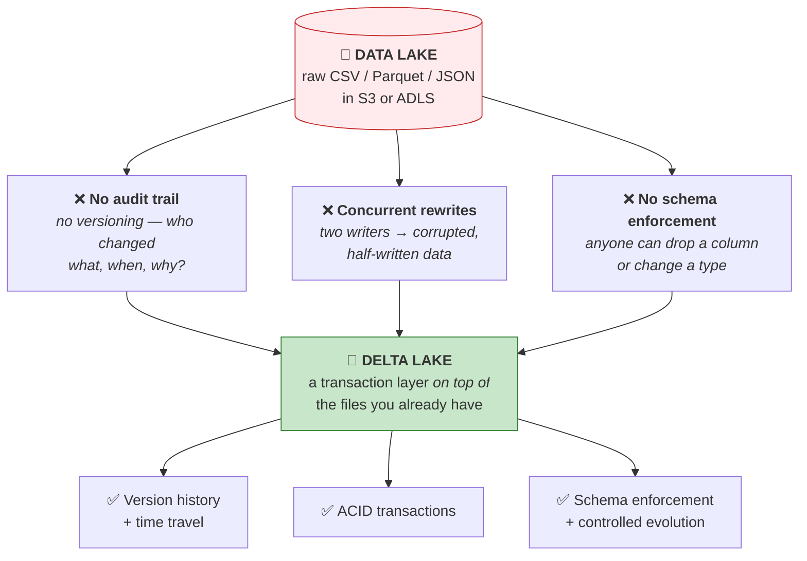
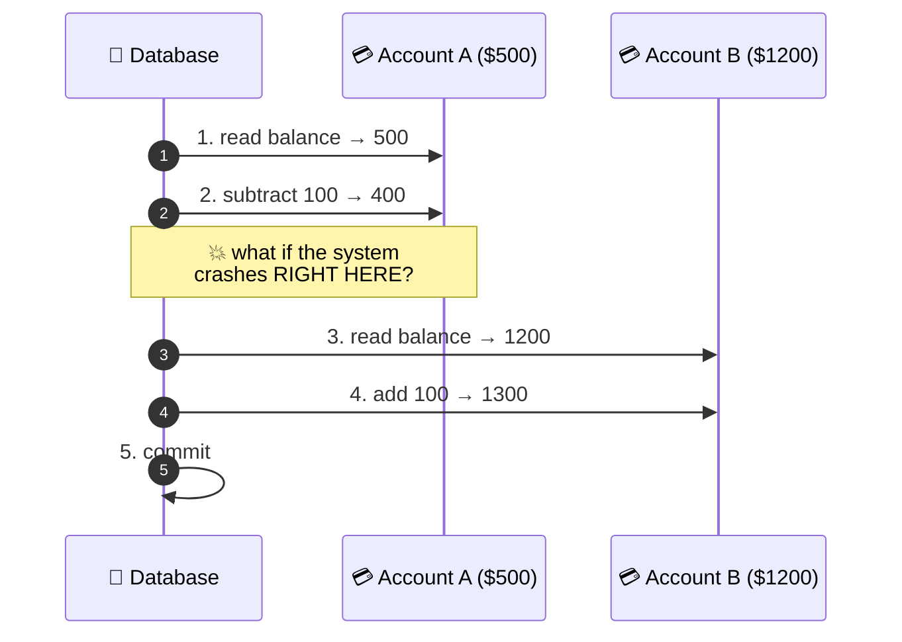
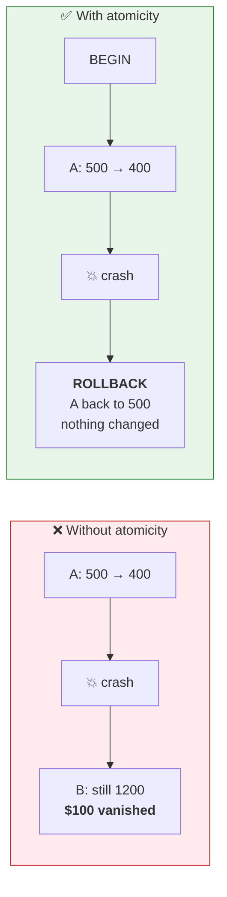
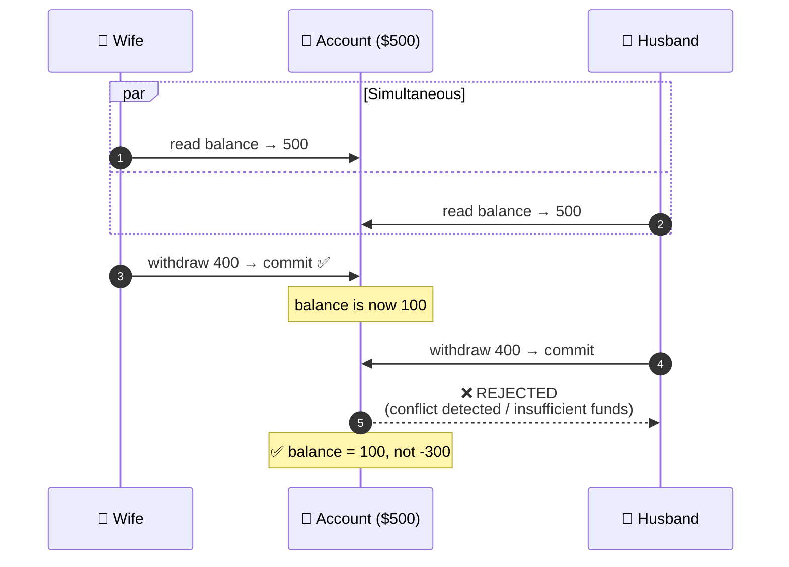
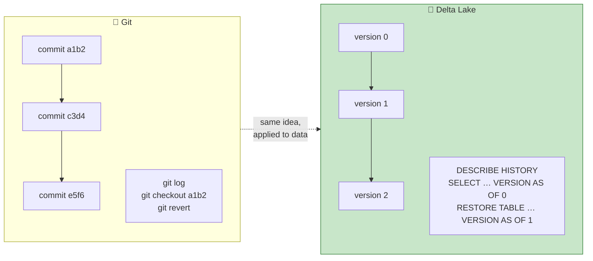
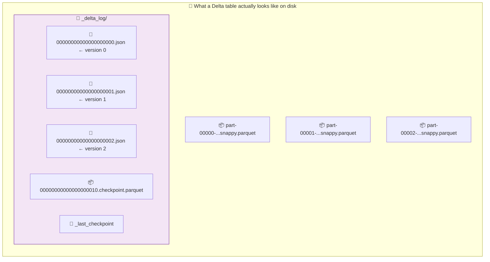
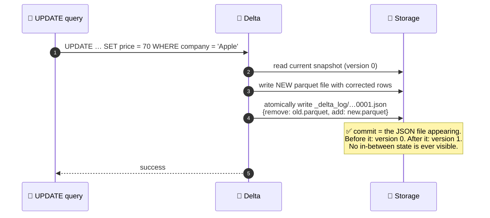

# Part 7 — Delta Lake: ACID, Time Travel & the Transaction Log

> **Section goal:** Understand the technology that turns a pile of files in cheap object storage into something that behaves like a database. You'll learn ACID through a bank-transfer story, see exactly what lives inside a `_delta_log` folder, query your table as it looked three versions ago, and know the maintenance commands (`OPTIMIZE`, `VACUUM`, `Z-ORDER`) that every Databricks interview eventually reaches.

Covers transcript `01:59:31` – `02:09:15` and `02:11:49` – `02:25:19`.

---

## 1. Why Delta Lake exists — the three sins of a data lake

Recall Part 3: a data lake is a garage. Cheap, flexible, and eventually unusable. The instructor lists the problems precisely at `02:21:01`:



> *"If I'm on an S3 bucket, someone can overwrite my CSV file easily. This is like a **folder on the cloud** — anything can happen here."*

**The critical framing — Delta does *not* replace your lake:**

> *"So what people do is they use Delta Lake, which is just a **layer on top of** your data lake. Your data lake will remain."*

---

## 2. ACID — the bank-transfer story

> *"Let's discuss another exotic topic called **ACID** — Atomicity, Consistency, Isolation and Durability. Often during data engineering interviews the interviewer will touch base on this point."*

**The scenario throughout:** transferring **$100 from account A to account B**.

Internally the database performs several steps:



> *"Let's say your computer crashes after step two. What will happen? This will have 400 because it subtracted, but it did not add $100 here. **Where did $100 go? In the air.** It is inconsistent."*

That single question motivates all four letters.

---

### 🅰️ Atomicity — all or nothing

> *"Either **all** these steps should succeed, or they **all** should fail. That is called atomicity. There shouldn't be partial completion."*

**Analogy:** a **light switch**. It's on or off. There is no "40% on". A transaction either fully happened or fully didn't.



In classic SQL:

```sql
BEGIN TRANSACTION;
  UPDATE accounts SET balance = balance - 100 WHERE id = 'A';
  UPDATE accounts SET balance = balance + 100 WHERE id = 'B';
COMMIT;   -- if anything fails in between → automatic ROLLBACK
```

> *"So the entire block will get executed. If something fails in between, it will **roll back** and it will undo all the partial steps."*

**In Delta:** a write either appears in the transaction log or it doesn't. There is no half-committed state. A job that dies mid-write leaves the table exactly as it was — the orphaned data files simply are never referenced.

---

### 🅲 Consistency — the rules always hold

> *"Let's say your account A has a balance of $50. When you subtract $100, it will become negative. Unless you have an overdraft rule, this is an **invalid situation**."*

**Analogy:** the rules of chess. Every move must leave the board in a legal position. You can't end your turn with your own king in check.

```sql
-- The constraint that enforces it
ALTER TABLE accounts
  ADD CONSTRAINT positive_balance CHECK (balance >= 0);
```

> **Consistency** = *transactions move the database from one **valid** state to another valid state, maintaining the defined rules and constraints.*

**In Delta**, this maps to:

```sql
-- Delta CHECK constraints
ALTER TABLE ecommerce.silver.slv_order_items
  ADD CONSTRAINT positive_qty CHECK (quantity > 0);

ALTER TABLE ecommerce.silver.slv_order_items
  ADD CONSTRAINT valid_currency CHECK (currency IN ('INR','USD','GBP','AUD'));

-- NOT NULL enforcement
ALTER TABLE ecommerce.silver.slv_customers
  ALTER COLUMN customer_id SET NOT NULL;

-- Inspect
SHOW TBLPROPERTIES ecommerce.silver.slv_order_items;
```

Any write violating a constraint **fails the whole transaction**. Combined with **schema enforcement** (§6), that's Delta's consistency guarantee.

---

### 🅸 Isolation — concurrent transactions don't collide

> *"Let's say this account is a **joint account** between me and my wife. We have only $500 — we are very poor people. My wife transfers $400 from this account. At the same time, I'm in a different location, I am also transferring $400 to another account. Will this work? **Ideally it should not work.**"*

**Analogy:** two people booking the **last seat** on a flight at the same instant. Exactly one must succeed. Without isolation you sell the same seat twice.



> *"So both the transactions will not go successful. That is called isolation. **Concurrent transactions don't interfere with each other — each transaction feels like it's running alone.**"*

**In Delta:** implemented via **optimistic concurrency control** plus **snapshot isolation** — explained mechanically in §5.

---

### 🅳 Durability — committed means permanent

> *"Once a transaction is **committed**, it stays committed — even if the system crashes immediately after."*

**Analogy:** writing in **permanent marker** versus pencil. Once it's on the page it survives, even if you drop the notebook.

**In Delta:** the commit is an atomic file write to cloud object storage (S3/ADLS), which is itself durably replicated. Once the JSON commit file exists in `_delta_log`, the version exists — process crash, cluster termination or region failover notwithstanding.

---

### ACID summary

| Letter | Guarantees | Bank example | Analogy | Delta mechanism |
|--------|-----------|--------------|---------|-----------------|
| **A**tomicity | All steps or none | Debit *and* credit, or neither | Light switch | Atomic commit to `_delta_log` |
| **C**onsistency | Rules never violated | No negative balance | Chess rules | `CHECK` constraints + schema enforcement |
| **I**solation | Concurrent txns don't interfere | Only one $400 withdrawal wins | Last airline seat | Optimistic concurrency + snapshot isolation |
| **D**urability | Committed survives crashes | Transfer stays done | Permanent marker | Durable object-storage commit |

> ⭐ **Interview:** *"Explain ACID with an example."* → Use the bank transfer. It's universally understood and covers all four letters naturally. Then add the Delta-specific twist: *"Delta gives you these guarantees on **object storage**, which historically had none — that's the whole point of the lakehouse. It does it with a transaction log rather than a database server, using optimistic concurrency, which works well for the append- and batch-heavy patterns analytics workloads actually have."*

---

## 3. Time travel — the regulator comes knocking

> *"Now I will take you to the movie **Back to the Future** and discuss this topic of time travel."*

### Why it exists: regulation

> *"Let's say Shivaji Investment is an investment firm. A regulatory body such as **SEBI** in India — in the US it is **SEC**, **FINRA** — will monitor your activity. SEBI can come and say: **'Can you show me the account balance of some customer as of Jan 2022?'** Or **'whether certain trading restrictions were applied during a historical period.'**"*

> *"It is as if they want you to **time travel** into the past… It's not just checking a balance — as if you're going back in time, and at that time, what was the customer's experience? There are a lot of rules — for example in Europe that is **GDPR**."*

| Regulator | Region | Relevance |
|-----------|--------|-----------|
| **SEBI** | India | Securities market audits |
| **SEC / FINRA** | United States | Financial records, trade reconstruction |
| **GDPR** | Europe | Data lineage, right to erasure, processing records |
| **BCBS 239** | Global banking | Risk data aggregation & lineage |
| **SOX** | US public companies | Financial reporting audit trail |

> 💡 *"When I was at **Bloomberg**, we had our own data store and we used to do the same thing, because Bloomberg is a finance company and they had this kind of audit requirement."*

### Three benefits (the ones to name in an interview)

| # | Benefit | The scenario |
|---|---------|--------------|
| 1 | **Audit & compliance** | *"Show me this customer's balance as of Jan 2022."* Absolutely required in regulated industries. |
| 2 | **Error recovery** | *"You update some transactions, you figure out there is an error, and you want to roll back to a state four days ago."* Exactly like `git revert`. |
| 3 | **Historical analysis** | Reproduce a report or retrain an ML model on the exact data snapshot used originally. |

---

## 4. Two ways to version data

Before showing Delta's answer, the course explains the two general approaches. Knowing both is what separates a memorised answer from an understood one.

### Approach 1 — Copy-on-write (insert a new row per change)

> *"If you're doing copy-on-write, when someone updates the address — let's say this person moved to Paris from Delhi — it will **not update** that particular record. It will **insert a new record** along with that new information."*

| valid_from | customer | address | balance |
|-----------|----------|---------|---------|
| 2010-10-06 | Raj | Delhi | 5,000 |
| 2011-03-14 | Raj | **Paris** | 5,000 |
| 2011-09-02 | Raj | Paris | **7,500** |

| ✅ Pro | ❌ Con |
|--------|--------|
| Trivial to query "as of" any date | Storage grows with every change |
| Full row visible at every point in time | Table gets large fast |

> *"Understand, due to this your data storage will increase. But nowadays data storage is actually **very cheap**."*

> 💡 This is exactly **Slowly Changing Dimension Type 2** in dimensional modelling — see Part 30.

### Approach 2 — Transaction logs (record only the change)

> *"Instead of inserting a new record, you will only record **what got updated**."*

```
2011-03-14 07:00  customer=Raj  address: Delhi → Paris
2011-09-02 11:22  customer=Raj  balance: 5000 → 7500
```

> *"Now if someone wants a record as of a certain date, you can **replay** all this. You take this base record and you replay all these transactions, and that way you get the entire record."*

| ✅ Pro | ❌ Con |
|--------|--------|
| Compact — stores deltas, not full rows | Reading "as of" requires replay |
| Natural audit trail of *what changed* | Needs periodic checkpoints to stay fast |

### The Git analogy

> *"As I said, this is similar to **Git**, where in Git you see this version history. Whenever you're writing code, your code file will have version history. So it is a very similar concept."*



| Git | Delta Lake |
|-----|------------|
| `git log` | `DESCRIBE HISTORY table` |
| `git checkout <sha>` | `SELECT * FROM table VERSION AS OF 5` |
| `git revert` | `RESTORE TABLE table TO VERSION AS OF 3` |
| `.git/` directory | `_delta_log/` directory |
| Commit | Table version |

> ⚠️ **Where the analogy breaks:** Git stores full history forever; Delta's history is bounded by **`VACUUM`** retention (default 7 days of data files) and log retention (default 30 days). Delta is a safety net, **not a backup or an archive**. Saying this unprompted is a strong interview signal.

---

## 5. What Delta Lake actually *is*

> **Delta Lake is an open-source storage layer that brings ACID transactions, time travel and schema enforcement to your data lake.**

> *"It is built on top of **Parquet** files and adds a **transaction log** to track all the changes. In short: **Delta Lake = Parquet files + transaction logs + metadata.**"*



> *"See this bronze — in bronze I have this **`_delta_log`**. So I have the data stored as **Parquet**… you have different versions, and you have this delta log."*

### 🔍 Plain-English deep-dive: Parquet, and why Delta sits on it

- **Parquet** — *an open, columnar, compressed file format.* **Analogy:** instead of storing a spreadsheet **row by row**, it stores it **column by column**. **Why it matters:** if your query needs 3 of 40 columns, a columnar format reads only those 3 — the other 37 are never touched. Combined with per-column compression and min/max statistics, that's often a 10–100× reduction in bytes read. You'll literally watch Spark exploit this in Part 12.
- **Row-based (CSV)** vs **columnar (Parquet)**:

| | CSV (row-based) | Parquet (columnar) |
|---|---|---|
| Layout | `r1c1,r1c2,r1c3 / r2c1,r2c2,r2c3` | `c1: r1,r2,r3 / c2: r1,r2,r3` |
| Read 3 of 40 columns | Reads everything | Reads 3 |
| Compression | Poor | Excellent (similar values adjacent) |
| Schema | None | Embedded |
| Column stats for skipping | None | ✅ min/max per row group |

> *"When you're printing the results, you need them in a **row** format — but in Parquet it is stored in a **columnar** form, so you have to convert columns to rows."* (That's the `ColumnarToRow` step you'll read in a query plan in Part 12.)

### Inside a commit file

Each `NNNNNNN.json` is a list of **actions** describing one atomic transaction:

| Action | Meaning |
|--------|---------|
| `protocol` | Minimum reader/writer version required |
| `metaData` | Schema, partitioning, table properties |
| `add` | A data file **added** by this commit (with size, stats, partition values) |
| `remove` | A data file **logically removed** by this commit |
| `commitInfo` | Operation (`WRITE`, `MERGE`, `UPDATE`…), timestamp, user, metrics |

**Crucially, an `UPDATE` doesn't edit a Parquet file** — Parquet is immutable. Delta writes a *new* file with the changed rows and records `remove(old) + add(new)` in one atomic commit.



### How ACID is actually implemented

| Guarantee | Mechanism |
|-----------|-----------|
| **Atomicity** | A version exists only once its single JSON commit file lands. Partial writes leave unreferenced files that no reader ever sees. |
| **Consistency** | Schema enforcement + `CHECK` constraints validated before commit. |
| **Isolation** | **Snapshot isolation** — every reader pins a version number and sees a consistent snapshot even while writers work. **Optimistic concurrency control** — a writer reads version *N*, prepares files, then tries to commit version *N+1*; if another writer got there first, it detects the conflict and retries against the new version (or fails on a genuine conflict). |
| **Durability** | Object storage durability (S3/ADLS replication). |

### Checkpoints — why reading stays fast

Replaying 50,000 JSON files would be slow. Every ~10 commits Delta writes a **checkpoint** Parquet file summarising the full state, and `_last_checkpoint` points at the newest one. A reader loads the latest checkpoint plus the few JSON files after it.

> **Analogy:** a bank statement. You don't recompute your balance from every transaction since you opened the account — you take last month's closing balance (checkpoint) and add this month's transactions.

---

## 6. Schema enforcement and schema evolution

Two opposite-sounding features that work together.

| | **Schema enforcement** | **Schema evolution** |
|---|---|---|
| **What** | Rejects writes whose schema doesn't match | Allows *deliberate* schema changes |
| **Default** | ✅ On | ❌ Off — you must opt in |
| **Analogy** | The **bouncer** who checks the guest list | The **guest list being updated** with the manager's approval |
| **Protects against** | A bad upstream change silently corrupting a table | — |

```python
# ❌ Rejected: DataFrame has a column the table doesn't
df.write.format("delta").mode("append").saveAsTable("ecommerce.bronze.brz_brands")
# AnalysisException: A schema mismatch detected when writing to the Delta table.

# ✅ Allowed: you explicitly opt in to evolution
(df.write
   .format("delta")
   .mode("append")
   .option("mergeSchema", "true")     # ← permit new columns
   .saveAsTable("ecommerce.bronze.brz_brands"))
```

> 💡 **This is exactly the option the project uses** at `02:38:55`: *"`mergeSchema` is true — so let's say tomorrow if you get two new columns, then it will merge those columns. This is for **schema evolution**."*

| Option | Effect | Danger |
|--------|--------|--------|
| `mergeSchema=true` | Add new columns on append | Typos create junk columns — `custmer_id` alongside `customer_id` |
| `overwriteSchema=true` | Replace the schema entirely (with `mode("overwrite")`) | ⚠️ **Destructive** — can drop columns |

```sql
-- SQL equivalents
ALTER TABLE ecommerce.bronze.brz_brands ADD COLUMNS (region STRING COMMENT 'sales region');
ALTER TABLE ecommerce.bronze.brz_brands RENAME COLUMN brand_nm TO brand_name;   -- needs column mapping
ALTER TABLE ecommerce.bronze.brz_brands SET TBLPROPERTIES ('delta.columnMapping.mode' = 'name');
```

> ⭐ **Interview:** *"How do you handle an upstream schema change?"* → *"Schema enforcement is on by default, so an unexpected change fails the write loudly rather than corrupting the table silently — which is the behaviour I want. For expected additive changes I enable `mergeSchema` on the bronze ingest, since bronze should absorb whatever the source sends. Silver and gold stay strict, with explicit column selection, so a new upstream column never leaks into business logic unreviewed. For breaking changes I version the table or add a transformation step rather than mutating in place."*

---

## 7. 🧪 LAB — Create a Delta table, update it, and time travel

Follow along on the AWS or Azure external location from Part 6, or just use a managed table — the Delta behaviour is identical.

### 7.1 Create the table

```sql
CREATE TABLE workspace.default.company_stocks
USING DELTA
LOCATION 's3://cb-company-stocks-001/bronze/'    -- or abfss://… , or omit for managed
AS
SELECT *,
       current_timestamp() AS ingested_at,
       uuid()              AS bronze_id
FROM   csv.`s3://cb-company-stocks-001/company_stocks.csv`;
```

Verify it's Delta and external:

```sql
DESCRIBE EXTENDED workspace.default.company_stocks;
-- Type: EXTERNAL     Provider: delta
```

> *"Now let me go to Catalog → workspace → default → tables → company_stocks. See, I get this table… if you look at Details it is actually an **external table**, and I have this **history**."*

### 7.2 See the starting state

```sql
SELECT * FROM workspace.default.company_stocks WHERE company = 'Apple';
-- stock_price = 62.67
```

### 7.3 Make a change

```sql
UPDATE workspace.default.company_stocks
SET    stock_price = 70
WHERE  company = 'Apple';
```

> ⚠️ **The important observation:** *"Now see, it will update the **Delta table**. It will **not update the actual CSV file**."*

The source `company_stocks.csv` is untouched. Delta wrote new Parquet files plus a new commit under `bronze/_delta_log/`.

### 7.4 Read the history

**UI:** table → **`History`** tab.
**SQL:**

```sql
DESCRIBE HISTORY workspace.default.company_stocks;
```

| version | timestamp | operation | operationParameters | userName |
|---------|-----------|-----------|---------------------|----------|
| 1 | 2026-08-24 10:42 | `UPDATE` | `predicate: company = 'Apple'` | you |
| 0 | 2026-08-24 10:31 | `CREATE TABLE AS SELECT` | — | you |

### 7.5 Time travel 🕰️

```sql
-- By version number
SELECT * FROM workspace.default.company_stocks VERSION AS OF 0
WHERE  company = 'Apple';        -- → 62.67  (the original)

SELECT * FROM workspace.default.company_stocks VERSION AS OF 1
WHERE  company = 'Apple';        -- → 70     (after the update)

-- By timestamp
SELECT * FROM workspace.default.company_stocks
TIMESTAMP AS OF '2026-08-24 10:35:00';

-- Shorthand with @
SELECT * FROM workspace.default.company_stocks@v0;
```

> ⚠️ **Syntax gotcha the instructor hits live:** *"I think you have to move `VERSION AS OF 0` **before** the `WHERE` clause."* Correct — the order is `FROM <table> VERSION AS OF n WHERE …`. Putting it after `WHERE` is a syntax error.

**In PySpark:**

```python
df_v0 = spark.read.format("delta").option("versionAsOf", 0).table("workspace.default.company_stocks")
df_ts = spark.read.format("delta").option("timestampAsOf", "2026-08-24 10:35:00").table("workspace.default.company_stocks")
```

### 7.6 Restore — the `git revert` of data

```sql
-- Undo a bad update entirely
RESTORE TABLE workspace.default.company_stocks TO VERSION AS OF 0;

-- Or by time
RESTORE TABLE workspace.default.company_stocks TO TIMESTAMP AS OF '2026-08-24 10:35:00';
```

> 💡 `RESTORE` doesn't erase history — it creates a **new version** whose contents match the old one. Your audit trail stays intact. (Just like `git revert`, not `git reset --hard`.)

### 7.7 Look at the files

Navigate to the storage location. You'll see:

```
bronze/
├── part-00000-....snappy.parquet
├── part-00001-....snappy.parquet
└── _delta_log/
    ├── 00000000000000000000.json
    └── 00000000000000000001.json
```

> *"So see, when I updated that, the `company_stocks.csv` file is not changed — but it created this **bronze**. And in bronze I have this **`_delta_log`**. So I have the data stored as **Parquet** — you see this Parquet — and you have different versions, and you have this delta log."*

**Read the log yourself** (excellent for understanding):

```python
display(spark.read.json("s3://cb-company-stocks-001/bronze/_delta_log/00000000000000000001.json"))
```

**✅ Checkpoint:** `DESCRIBE HISTORY` shows ≥ 2 versions, and `VERSION AS OF 0` returns the pre-update price.

---

## 8. Delta maintenance — the commands interviews ask about

Not in the transcript, but you will be asked.

### The small-file problem

Streaming or frequent small writes produce thousands of tiny Parquet files. Every query then pays per-file overhead. **Analogy:** 10,000 sticky notes instead of 10 pages.

```sql
-- Compact small files into larger, optimally sized ones
OPTIMIZE ecommerce.gold.gld_fact_order_items;

-- Compact AND co-locate related data for faster filtering
OPTIMIZE ecommerce.gold.gld_fact_order_items
  ZORDER BY (transaction_date, category_name);
```

### 🔍 Plain-English deep-dive: Z-ORDER

- **Z-ORDER** — *physically sorts and co-locates rows with similar values in the chosen columns into the same files.* **Analogy:** organising a warehouse so all size-10 blue shoes sit in one aisle. When someone asks for blue size 10, you walk to one aisle instead of the whole warehouse. **Why it matters:** Delta stores min/max per file, so a query filtering on a Z-ORDERed column can **skip entire files** — this is **data skipping**, and it's often the single biggest query win available.
- Choose Z-ORDER columns by **what you filter and join on**, not by what you display. Effective on high-cardinality columns; 1–4 columns max.

### VACUUM — reclaiming space

```sql
-- Show what WOULD be deleted (always do this first)
VACUUM ecommerce.gold.gld_fact_order_items RETAIN 168 HOURS DRY RUN;

-- Actually delete files no longer referenced and older than the retention window
VACUUM ecommerce.gold.gld_fact_order_items;   -- default: 7 days
```

> ⚠️⚠️ **`VACUUM` is the one destructive Delta command.** It permanently deletes unreferenced data files — **which destroys your ability to time travel past the retention window**. Never lower the retention below 7 days without understanding the consequences; the default guard exists to prevent deleting files a long-running concurrent reader still needs.

### Liquid Clustering — the modern replacement

```sql
CREATE TABLE ecommerce.gold.gld_fact_order_items
CLUSTER BY (transaction_date, category_name)
AS SELECT * FROM …;

-- Change clustering keys later without rewriting everything
ALTER TABLE ecommerce.gold.gld_fact_order_items CLUSTER BY (region, transaction_date);
```

| | **Partitioning** | **Z-ORDER** | **Liquid Clustering** |
|---|---|---|---|
| Physical directories | ✅ Yes | ❌ No | ❌ No |
| Change keys later | ❌ Requires full rewrite | ✅ Re-run OPTIMIZE | ✅ Just `ALTER TABLE` |
| Handles skew | ❌ Poorly | ⚠️ Some | ✅ Well |
| Small-file risk | ⚠️ High if over-partitioned | Low | Low |
| Databricks recommendation (2026) | Legacy | Legacy | ⭐ **Preferred** |

> ⭐ **Interview:** *"How do you speed up a slow Delta query?"* → *"First look at the plan and the Spark UI to find out whether it's I/O bound, shuffle bound or skewed. If it's reading far more data than it needs, that's a data-layout problem: enable liquid clustering — or Z-ORDER on older runtimes — on the columns actually used in filters and joins, so file-level min/max statistics let Delta skip files. Run `OPTIMIZE` if there's a small-file problem. Make sure statistics are current. Then check the query itself for the usual suspects — filtering after a join instead of before, or a `SELECT *` defeating column pruning."*

### Predictive Optimization

Databricks can run `OPTIMIZE`, `VACUUM` and clustering **automatically** on Unity Catalog **managed** tables, based on observed query patterns.

> 💡 **This is a strong argument for managed over external tables** (Part 6) — Databricks can only auto-tune files it owns.

### CDF and MERGE (previewing Part 30)

```sql
-- Change Data Feed: emit row-level changes for downstream consumers
ALTER TABLE ecommerce.silver.slv_customers
  SET TBLPROPERTIES (delta.enableChangeDataFeed = true);

SELECT * FROM table_changes('ecommerce.silver.slv_customers', 5, 10);

-- MERGE: upsert — the workhorse of incremental pipelines
MERGE INTO ecommerce.silver.slv_customers AS t
USING staged_updates AS s
   ON t.customer_id = s.customer_id
WHEN MATCHED THEN UPDATE SET *
WHEN NOT MATCHED THEN INSERT *;
```

---

## 9. Delta vs Iceberg vs Hudi

| | 🔺 **Delta Lake** | 🧊 **Apache Iceberg** | 🐗 **Apache Hudi** |
|---|---|---|---|
| Origin | Databricks | Netflix | Uber |
| Metadata model | Transaction log (JSON + checkpoints) | Manifest files + snapshots | Timeline + file groups |
| ACID / time travel | ✅ / ✅ | ✅ / ✅ | ✅ / ✅ |
| Schema evolution | ✅ | ✅ (strongest) | ✅ |
| Best at | Databricks-native, streaming + batch, huge ecosystem | Engine neutrality, partition evolution | High-frequency upserts, CDC |
| Underlying files | Parquet | Parquet/ORC/Avro | Parquet |

> 💡 **The trend to know:** these formats are converging. **Delta UniForm** lets a Delta table simultaneously expose Iceberg and Hudi metadata, so an Iceberg-native engine can read it without conversion. Mentioning UniForm signals you're current.

---

## ⭐ Likely Interview Questions for This Section

**Q1. "What is Delta Lake?"**
> *Model answer:* "An open-source storage layer that brings ACID transactions, time travel and schema enforcement to data-lake storage. Concretely, a Delta table is Parquet data files plus a `_delta_log` transaction log — so Delta equals Parquet plus transaction log plus metadata. It doesn't replace the lake; it sits on top of the files already in S3 or ADLS and makes them behave like a database table. It's the component that makes a lakehouse possible, and it's the default table format in Databricks."

**Q2. "Explain ACID with a concrete example."**
> *Model answer:* "Transferring $100 between accounts. **Atomicity** — the debit and credit both happen or neither does; a crash after the debit rolls back rather than losing money. **Consistency** — constraints hold before and after, so a balance can't go negative. **Isolation** — if two people withdraw from the same joint account simultaneously, they don't both succeed against the same starting balance. **Durability** — once committed, it survives a crash. Delta implements these on object storage: atomicity through a single atomic commit file, consistency through schema enforcement and `CHECK` constraints, isolation through snapshot isolation with optimistic concurrency control, and durability through the storage layer's own replication."

**Q3. "How does time travel work internally?"**
> *Model answer:* "Every write appends a numbered JSON commit file to `_delta_log` listing which data files were added and removed. The table's state at version *N* is the result of replaying commits 0 through *N*, and periodic checkpoints summarise state so replay stays cheap. Because Parquet files are immutable and updates write new files while logically removing old ones, the old files still physically exist — so `VERSION AS OF 5` just reconstructs the file list as of that commit and reads those files. The limit is `VACUUM`: once it deletes unreferenced files past the retention window, you can no longer travel back beyond that point."

**Q4. "You ran a bad UPDATE in production. Walk me through recovery."**
> *Model answer:* "First `DESCRIBE HISTORY` on the table to find the version immediately before the bad operation and confirm the timestamp and predicate. Then validate with a read — `SELECT ... VERSION AS OF n` — and diff against current to be sure that's the right version and that no legitimate writes happened afterwards that I'd be discarding. Then `RESTORE TABLE ... TO VERSION AS OF n`, which creates a *new* version matching the old contents rather than erasing history, so the audit trail stays intact. Afterwards I'd check whether downstream tables consumed the bad data and reprocess them, and add a `CHECK` constraint or a pipeline expectation so the same class of error fails loudly next time."

**Q5. "Is Delta time travel a backup strategy?"**
> *Model answer:* "No, and it's important to be clear about that. It's bounded by `VACUUM` retention — seven days by default — and by log retention, typically thirty days. It's also in the same storage account, so it doesn't protect against account deletion, ransomware, region loss, or someone dropping the table and vacuuming. It's excellent for operational error recovery and short-window audit. Real backup needs cross-account or cross-region copies with their own retention and immutability, plus for regulated data an explicit archive built with append-only history rather than relying on the transaction log."

**Q6. "Schema enforcement vs schema evolution?"**
> *Model answer:* "Enforcement is the default: a write whose schema doesn't match the table is rejected, which prevents an upstream change from silently corrupting a table. Evolution is the deliberate opt-in — `mergeSchema` to add new columns on append, or `overwriteSchema` to replace the schema on overwrite. My pattern is permissive at bronze, since bronze should absorb whatever the source sends, and strict at silver and gold with explicit column selection, so a new column never leaks into business logic without review. `overwriteSchema` I treat as dangerous because it can drop columns."

**Q7. "What are OPTIMIZE, Z-ORDER and VACUUM, and when do you run them?"**
> *Model answer:* "`OPTIMIZE` compacts many small files into fewer well-sized ones, which matters after streaming or frequent small writes because per-file overhead dominates otherwise. `ZORDER BY` additionally co-locates similar values into the same files so Delta's per-file min/max statistics let it skip files entirely — that's data skipping, and it's usually the biggest single query win. `VACUUM` deletes data files no longer referenced and older than the retention window to reclaim storage, and it's the one destructive command because it caps how far back you can time travel. On current Databricks I'd prefer **liquid clustering** over partitioning and Z-ORDER, since clustering keys can be changed without a full rewrite, and I'd enable **predictive optimization** on managed tables so Databricks runs this maintenance automatically."

**Q8. "How does Delta handle two jobs writing to the same table at once?"**
> *Model answer:* "Optimistic concurrency control. Each writer reads the current version, prepares its data files, then attempts to commit the next version number atomically. If another writer committed first, the loser detects the conflict, and if the two operations are logically compatible — say two appends touching different files — it retries against the new version and succeeds. If they genuinely conflict, like two updates to the same rows, it fails and the caller must handle it. Readers are unaffected throughout because they get snapshot isolation on a pinned version. It's optimistic rather than lock-based because analytics workloads are append-heavy with rare true conflicts, so avoiding locks is cheaper overall."

**Q9. "Why Parquet underneath, and what does columnar buy you?"**
> *Model answer:* "Parquet is columnar, so a query touching 3 of 40 columns reads only those 3 — that's column pruning, and it's often an order-of-magnitude reduction in bytes read. Storing a column's values together also compresses far better than mixed row data. And Parquet keeps min/max statistics per row group, which lets the engine skip whole chunks that can't match a predicate — that's predicate pushdown, and it's what Z-ORDER and liquid clustering are designed to make more effective. The cost is that reads must convert columnar data back to rows for display, which shows up as a `ColumnarToRow` step in Spark plans."

**Q10. "Delta or Iceberg?"**
> *Model answer:* "If the platform is Databricks, Delta — it's native, gets features first, and Unity Catalog, predictive optimization and Photon are all built around it. Iceberg's argument is engine neutrality: broader first-class support across Snowflake, Trino, Flink and others, plus partition evolution. Practically the gap is closing, and Delta UniForm lets a Delta table expose Iceberg metadata simultaneously, so an Iceberg-native engine can read it without conversion. That largely removes the lock-in concern, which is usually the real reason the question gets asked."

---

## 🧠 30-Second Memory Hooks

- **Delta Lake = Parquet files + transaction log + metadata.** Say that sentence verbatim.
- **Delta doesn't replace your lake — it's a layer *on top of* it.**
- **A data lake's three sins:** no audit trail, corruptible concurrent writes, no schema enforcement. **Delta fixes all three.**
- **ACID via the bank transfer:** Atomicity = light switch. Consistency = chess rules. Isolation = last airline seat. Durability = permanent marker.
- **Delta is Git for data.** `DESCRIBE HISTORY` ≈ `git log`. `VERSION AS OF` ≈ `git checkout`. `RESTORE` ≈ `git revert`. `_delta_log/` ≈ `.git/`.
- **Parquet is immutable — an UPDATE writes a NEW file and records `remove + add` in one atomic commit.**
- **The commit *is* the JSON file appearing in `_delta_log`.** Before it: old version. After: new. No in-between.
- **Checkpoints every ~10 commits** so readers don't replay thousands of JSONs. *Bank statement, not every transaction since you opened the account.*
- **`VERSION AS OF n` goes BEFORE the `WHERE` clause.**
- **⚠️ Time travel is NOT a backup.** Bounded by `VACUUM` (7 days) and log retention (30 days).
- **`VACUUM` is the one destructive command** — it permanently kills your ability to time travel further back.
- **`OPTIMIZE` = fewer, bigger files. `ZORDER` = co-locate for file skipping. Liquid Clustering = the modern replacement for both partitioning and Z-ORDER.**
- **Schema enforcement is ON by default. `mergeSchema=true` is how you opt in to evolution.** Permissive at bronze, strict at silver/gold.
- **Two versioning styles:** copy-on-write (new row per change, = SCD Type 2) vs transaction log (record the delta, replay it). Delta uses the log.

---

*Next suggested section:* **[Part 8 — DataFrame Fundamentals](Part-08-dataframe-fundamentals.md)** — foundations are complete. From here it's hands-on PySpark: the `spark` session, creating DataFrames, `select`, `filter`, `withColumn`, and the immutability rule that surprises every pandas user.

---

**Navigation** — ⬅️ **[Part 6 — Tables & Volumes](Part-06-tables-volumes-managed-vs-external.md)** · 🏠 **[Master Index](../Databricks%20-%20Study%20Guide.md)** · ➡️ **[Part 8 — DataFrame Fundamentals](Part-08-dataframe-fundamentals.md)**
