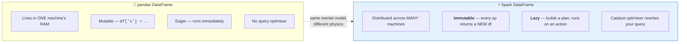
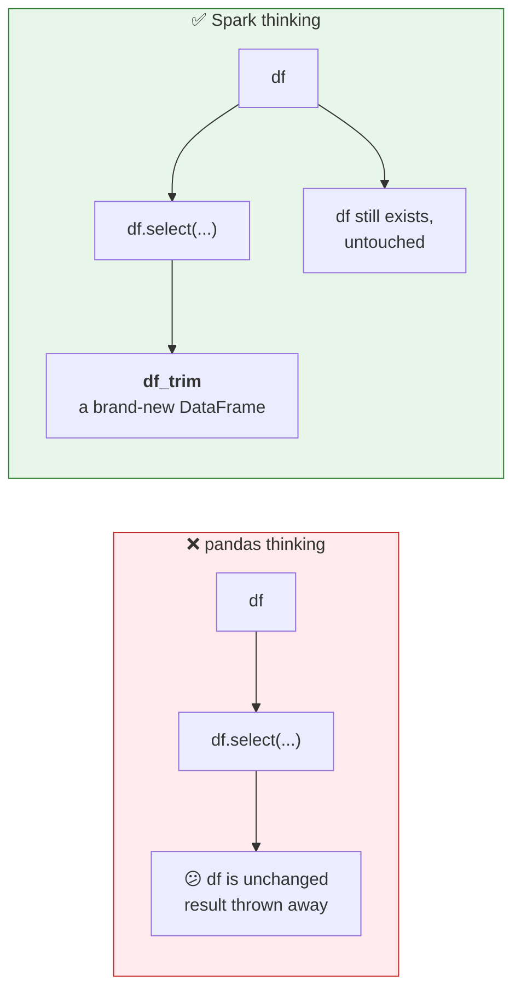

# Part 8 — 🧪 DataFrame Fundamentals

> **Section goal:** Become fluent with the object you'll use in every remaining lab — the Spark DataFrame. You'll learn how to create one, inspect it, filter rows and columns, add and rename columns, and — critically — internalise the **immutability** rule that catches every pandas user out.

Covers transcript `00:11:00` – `00:21:08`.

---

## 1. Set up your notebook

| # | Action |
|---|--------|
| 1 | Left nav → **`Workspace`** → **`Create`** → **`Notebook`** |
| 2 | Rename it: **`basic_operations`** *(the name the instructor gives it at `00:21:20`)* |
| 3 | Language: **Python** |
| 4 | **`Connect`** → **`Serverless`** |

> ⚠️ Nothing runs without compute attached. If a cell hangs, check this first.

---

## 2. The `spark` object — your handle on the cluster

> *"Here you will find this object called **`spark`**, and if you `Ctrl+Enter` and run it, it will show you this thing. So the Databricks environment gives you this variable, this object, which is a **SparkSession** object."*

```python
spark
```
```
<pyspark.sql.connect.session.SparkSession object at 0x7f...>
```

**Outside Databricks, you'd have to build it yourself:**

```python
# NOT needed in Databricks — this is what Databricks does for you
from pyspark.sql import SparkSession

spark = (SparkSession.builder
         .appName("my_app")
         .master("local[*]")
         .getOrCreate())
```

### 🔍 Plain-English deep-dive: what a SparkSession *is*

- **SparkSession** — *your single entry point to everything Spark can do: reading data, running SQL, creating DataFrames, configuring the engine.* **Analogy:** the **phone line to the caterer** from Part 2. You don't talk to individual chefs (executors); you talk to one contact who organises them. **Why it matters:** every DataFrame in this course descends from `spark`.

| You want to… | You call… |
|--------------|-----------|
| Read a registered table | `spark.table("cat.schema.tbl")` |
| Read files | `spark.read.csv(...)`, `spark.read.parquet(...)` |
| Run SQL | `spark.sql("SELECT …")` |
| Build a DataFrame from Python data | `spark.createDataFrame(data, schema)` |
| Change engine settings | `spark.conf.set("spark.sql.shuffle.partitions", 200)` |
| See the current catalog/schema | `spark.catalog.currentCatalog()` |

> 💡 **`sc` (SparkContext)** is the older, lower-level handle for RDD work. You'll rarely need it. In Databricks, `spark` is what you want.

---

## 3. pandas vs Spark DataFrames

> *"If you have studied **pandas**, pandas has a DataFrame. Similarly, **Spark** has a DataFrame — and we are using Python here, so the module or the library that we are using is **PySpark**."*



| | 🐼 **pandas** | ⚡ **PySpark** |
|---|---|---|
| Where data lives | One machine's RAM | Partitioned across the cluster |
| Mutability | Mutable in place | **Immutable** |
| Execution | Eager | **Lazy** (Part 14) |
| Scale ceiling | Machine RAM | Petabytes |
| Add a column | `df['profit'] = df.revenue - df.budget` | `df = df.withColumn("profit", F.col("revenue") - F.col("budget"))` |
| Filter | `df[df.year > 2010]` | `df.filter(F.col("year") > 2010)` |
| Select | `df[['a','b']]` | `df.select("a","b")` |
| Row count | `len(df)` | `df.count()` |
| Show 5 rows | `df.head()` | `df.show(5)` / `display(df)` |
| Stats | `df.describe()` | `df.describe()` ✅ same name |

> 💡 **Good news:** the vocabulary is deliberately familiar. **Bad news:** the semantics differ in two ways — immutability and laziness — and both bite silently.

---

## 4. Creating your first DataFrame

> *"Now let's create a DataFrame by calling this function **`spark.table`**. Here you can specify `workspace.default.movies`. And the return value will be our DataFrame."*

```python
df = spark.table("workspace.default.movies")
df
```

Notice: printing `df` shows only a **schema description**, not data. That's laziness — nothing has been read yet.

### Four ways to look at the data

```python
display(df)              # ⭐ Databricks-native: rich, sortable, chartable grid
df.show(5)               # plain-text table, fast
df.show(5, truncate=False)   # don't cut long strings
df.limit(5).toPandas()   # convert a SMALL result to pandas
```

> *"You can also run `df.show()` — let's say I want to display only five rows. Now this is not very well-formatted. **`display`** will give you a proper formatted table. But sometimes people use this `show` method because it is **very fast**."*

| Method | Output | Speed | Notes |
|--------|--------|-------|-------|
| `display(df)` | Interactive grid + built-in charts | Slower to render | **Databricks-only.** Doesn't exist in vanilla PySpark |
| `df.show(n)` | ASCII table in output | Fast | Works everywhere |
| `df.show(n, truncate=False)` | Same, full-length strings | Fast | Use for long titles/URLs |
| `df.toPandas()` | A pandas DataFrame | ⚠️ **Dangerous** | Pulls **all** data to the driver — always `.limit()` first |

> ⚠️ **Gotcha:** `truncate` defaults to **`True`** (it cuts strings at 20 characters). The instructor misspeaks and says it defaults to `False`. Verify yourself:
> ```python
> df.select("title").show(3)                  # 'Avengers: Infinity ...'
> df.select("title").show(3, truncate=False)  # 'Avengers: Infinity War'
> ```

> ⚠️ **Gotcha:** `df.toPandas()` and `df.collect()` bring **every row into the driver's memory**. On a big table that kills the driver. This is one of the classic ways juniors take down a cluster.

---

## 5. Inspecting a DataFrame

> *"You can run `df.printSchema()`, `count()` — all of these useful methods."*

### `printSchema()` — the structure

```python
df.printSchema()
```
```
root
 |-- title: string (nullable = true)
 |-- industry: string (nullable = true)
 |-- release_year: integer (nullable = true)
 |-- imdb_rating: double (nullable = true)
 |-- studio: string (nullable = true)
 |-- language: string (nullable = true)
 |-- budget: double (nullable = true)
 |-- revenue: double (nullable = true)
```

> *"So `title` is a string data type, `imdb_rating` is a **double** data type and so on."*

> 💡 **Make `printSchema()` a reflex.** Run it after *every* read and *every* transformation. Most silent data bugs are type bugs, and this is the two-second check that catches them.

### `count()` — how many rows

```python
print(df.count())     # 37
```

**Cross-check it in SQL** (the instructor does exactly this at `00:13:44`):

```sql
SELECT COUNT(*) FROM workspace.default.movies;   -- 37 ✅
```

> ⚠️ `count()` is an **action** — it triggers a full distributed scan. Cheap here, expensive on a billion rows. Don't sprinkle it through a pipeline.

### `columns` — the names as a plain Python list

```python
print(df.columns)
# ['title', 'industry', 'release_year', 'imdb_rating', 'studio', 'language', 'budget', 'revenue']
```

> *"It's a plain Python list with all the columns."* Useful for programmatic column handling:

```python
numeric_cols = [c for c, t in df.dtypes if t in ("int", "double", "bigint")]
```

### `describe()` — quick statistics

```python
display(df.describe())
```

| summary | release_year | imdb_rating | budget | revenue |
|---------|-------------|-------------|--------|---------|
| count | 37 | 37 | … | … |
| mean | … | **7.8** | … | … |
| stddev | … | … | … | … |
| min | … | **1.9** | … | … |
| max | … | **9.3** | … | … |

> *"For IMDb rating my minimum rating is **1.9**, maximum rating is **9.3**, and my average rating in my movies table is **7.8**."*

*(If your numbers match, your Part 4 upload was correct — including the `double` type fix.)*

### `summary()` — describe plus percentiles

```python
display(df.summary())
```

> *"It will show you similar columns, but it will show you additional data such as all these **percentiles**."*

Adds `25%`, `50%` (median), `75%`. You can request specific ones:

```python
display(df.summary("count", "min", "25%", "50%", "75%", "max"))
```

| | `describe()` | `summary()` |
|---|---|---|
| count, mean, stddev, min, max | ✅ | ✅ |
| 25% / 50% / 75% percentiles | ❌ | ✅ |
| Customisable metrics | ❌ | ✅ |

> 💡 **Why percentiles matter:** mean hides skew. If mean revenue is ₹50M but the median is ₹8M, a handful of blockbusters are dragging the average. Always look at the median before quoting an average to a stakeholder.

### Other inspectors worth knowing

```python
df.dtypes           # [('title','string'), ('release_year','int'), …]
df.schema           # the StructType object (programmatic)
df.isEmpty()        # cheaper than count() == 0
df.explain()        # the query plan — Part 12
df.rdd.getNumPartitions()   # how many partitions — Part 16
```

---

## 6. Column filtering — `select`

> *"Let's say I want to select only three columns in my data."*

First, a markdown cell for structure:

```
%md
## Column filtering
```

> *"Just like Jupyter notebook, you can add markdown cells here… you can give it headers, etc."*

Then:

```python
df_trim = df.select(["title", "studio", "imdb_rating"])
df_trim.show(3, truncate=False)
```

All these forms work:

```python
df.select("title", "studio")                       # varargs
df.select(["title", "studio"])                     # a list
df.select(df.title, df.studio)                     # attribute access
df.select(df["title"], df["studio"])               # bracket access
df.select(F.col("title"), F.col("studio"))         # ⭐ the function form
df.select("*", F.lit("2026").alias("load_year"))   # everything + a literal
df.select([c for c in df.columns if c != "budget"]) # everything except one
```

---

## 7. ⚠️ Immutability — the rule that surprises everyone

> *"See, here these DataFrames will be **immutable**, which means you **can't modify them**. So I'm selecting three columns and returning it to a **new** DataFrame."*



```python
df.select("title", "studio")     # ❌ result discarded — df unchanged
df_trim = df.select("title", "studio")   # ✅ capture the result
df = df.select("title", "studio")        # ✅ also fine — rebinds the name
```

### 🔍 Plain-English deep-dive: why immutable?

**Analogy:** a **photocopy**, not a whiteboard. Every transformation gives you a fresh copy with the change applied; the original stays pristine.

Three reasons this is a feature, not an annoyance:

| Reason | Explanation |
|--------|-------------|
| **Fault tolerance** | Because the original is never mutated, Spark can always **recompute** a lost partition from its source. That's the lineage-based recovery from Part 2. |
| **Safe parallelism** | Many machines can read the same data concurrently with zero locking, because nothing is ever changed in place. |
| **Optimisation** | Catalyst can freely reorder operations knowing nothing has hidden side effects (Part 12). |

> ⭐ **Interview:** *"Why are Spark DataFrames immutable?"* → *"Because immutability is what makes distributed fault tolerance and optimisation possible. Since no partition is ever mutated in place, Spark can recompute any lost partition by replaying its lineage from the source rather than needing checkpoints or locks. It also lets many executors read the same data concurrently without synchronisation, and it frees Catalyst to reorder and fuse operations safely, since no transformation has hidden side effects."*

---

## 8. Row filtering — `filter` / `where`

### The AI-assist trick

> *"Now I can write queries, but I noticed this option of **generate with AI**. So let's do **`Ctrl+I`**, and then type in your criteria: 'show me all the movies released between 2000 to 2010' — hit enter and the AI assistant will write the query for you."*

Press **`Ctrl+I`**, describe what you want in English, review the generated code, then **`Accept`**.

> 💡 Use it — but **always read what it produces**. Treat it as a fast first draft, not an oracle. Interviewers will ask you to explain your code, and "Copilot wrote it" is not an answer.

### Three equivalent ways to filter

> *"So it will do exactly the same thing — there are just two different ways of doing it. There is a **third** way, by the way…"*

```python
from pyspark.sql.functions import col

# Way 1 — DataFrame attribute
df_filtered = df.filter((df.release_year >= 2000) & (df.release_year <= 2010))

# Way 2 — the col() function
df_filtered = df.filter((col("release_year") >= 2000) & (col("release_year") <= 2010))

# Way 3 — the between() helper  ⭐ cleanest
df_filtered = df.filter(col("release_year").between(2000, 2010))

display(df_filtered)
```

### ⚠️⚠️ The two mistakes literally everyone makes

```python
# ❌ WRONG — Python's `and` / `or` / `not` don't work on Spark columns
df.filter(df.release_year >= 2000 and df.release_year <= 2010)
# ValueError: Cannot convert column into bool

# ✅ RIGHT — use & | ~
df.filter((df.release_year >= 2000) & (df.release_year <= 2010))
```

```python
# ❌ WRONG — & binds tighter than >=, so this parses as  2000 & df.release_year
df.filter(df.release_year >= 2000 & df.release_year <= 2010)

# ✅ RIGHT — parenthesise EVERY condition
df.filter((df.release_year >= 2000) & (df.release_year <= 2010))
```

| Python | PySpark column logic |
|--------|----------------------|
| `and` | `&` |
| `or` | `\|` |
| `not` | `~` |
| — | **Always wrap each condition in `()`** |

> 🧠 **Memory hook:** *"Ampersand, pipe, tilde — and parentheses around everything."*

### `filter` vs `where`

```python
df.filter(col("studio") == "Marvel Studios")
df.where(col("studio")  == "Marvel Studios")   # identical
```

**They are exact aliases.** `where` exists so SQL people feel at home. Pick one and be consistent.

### More filter examples

```python
# Exact match
df.filter(col("studio") == "Marvel Studios")

# Multiple values
df.filter(col("industry").isin("Bollywood", "Hollywood"))

# Pattern matching
df.filter(col("title").like("%Avengers%"))
df.filter(col("title").rlike("^The .*"))       # regex

# Nulls
df.filter(col("budget").isNull())
df.filter(col("budget").isNotNull())

# Negation
df.filter(~col("industry").isin("Bollywood"))

# OR
df.filter((col("imdb_rating") > 9) | (col("studio") == "Marvel Studios"))

# SQL string form — often the most readable for complex predicates
df.filter("release_year BETWEEN 2000 AND 2010 AND industry = 'Hollywood'")
```

### Practical example from the course

> *"How do you print all the movies which are released by Marvel? I love Marvel movies."*

```python
marvel = df.filter(col("studio") == "Marvel Studios")
display(marvel)
```

---

## 9. `distinct` — finding unique values

> *"Now I want to know how many distinct movie industries are there."*

```python
unique_industries = df.select("industry").distinct()
display(unique_industries)
# Bollywood, Hollywood  →  only 2
```

```python
display(df.select("language").distinct())
# Hindi, English, Bengali, Kannada, Telugu
```

More useful variants:

```python
df.select("studio").distinct().count()          # 22 distinct studios
df.select("industry", "language").distinct()    # distinct COMBINATIONS
df.dropDuplicates(["studio"])                   # keep 1 full row per studio
df.select("studio").distinct().orderBy("studio")  # sorted, for eyeballing
```

> 💡 **Why this is a real technique, not a toy:** profiling distinct values is the **first thing you do on unfamiliar data**. In Part 22 this exact move reveals that the project's category codes contain both `BKS` and `Books`, and both `GRCY` and `Grocery` — duplicates hiding as inconsistent spellings. `.distinct()` is how you find them.

> ⚠️ `distinct()` is a **wide transformation** — it requires a shuffle (Part 15). Cheap on 37 rows, expensive on a billion.

---

## 10. `withColumn` — creating and transforming columns

> *"See, my table has the budget and revenue column. Naturally, when I'm doing data analytics, I'm interested in knowing the **profitability**… If you do revenue minus budget, you will get profit."*

```python
from pyspark.sql.functions import col

df = df.withColumn("profit", col("revenue") - col("budget"))
display(df)
```

> *"With column is a function that you will use a lot… Here the syntax is a little different, but it's easy to remember, right? You just say `df.withColumn`, you specify your **new column name**, and here you specify your **expression**."*

### The signature

```python
df.withColumn(<new_or_existing_column_name>, <column_expression>)
```

| If the name… | Then… |
|--------------|-------|
| **doesn't exist** | a new column is appended |
| **already exists** | that column is **replaced** ← this is how you clean/cast data |

### The patterns you'll use constantly in Parts 22–25

```python
import pyspark.sql.functions as F

# Arithmetic
df.withColumn("profit",        F.col("revenue") - F.col("budget"))
df.withColumn("margin_pct",    F.round(F.col("profit") / F.col("revenue") * 100, 2))

# Constant / literal
df.withColumn("source_system", F.lit("movies_csv"))
df.withColumn("ingested_at",   F.current_timestamp())

# Casting  ⭐ heavily used in silver
df.withColumn("release_year",  F.col("release_year").cast("int"))

# String cleaning  ⭐ heavily used in silver
df.withColumn("studio",        F.trim(F.col("studio")))
df.withColumn("industry",      F.upper(F.col("industry")))
df.withColumn("title",         F.initcap(F.col("title")))
df.withColumn("code",          F.regexp_replace(F.col("code"), "[^A-Za-z0-9]", ""))

# Conditional logic  ⭐ the Spark equivalent of CASE WHEN
df.withColumn("rating_band",
    F.when(F.col("imdb_rating") >= 8, "Great")
     .when(F.col("imdb_rating") >= 6, "Good")
     .otherwise("Poor"))

# Null handling
df.withColumn("budget", F.coalesce(F.col("budget"), F.lit(0)))

# Dates
df.withColumn("load_date", F.to_date(F.lit("2026-08-24"), "yyyy-MM-dd"))
```

### Chaining — and how to keep it readable

```python
# Wrap the whole chain in parentheses so you can break lines freely
df_clean = (df
    .withColumn("profit",     F.col("revenue") - F.col("budget"))
    .withColumn("margin_pct", F.round(F.col("profit") / F.col("revenue") * 100, 2))
    .withColumn("studio",     F.trim(F.col("studio")))
    .filter(F.col("revenue").isNotNull())
)
```

> 💡 *"Whenever you want to write multi-line code you can use this kind of bracket."* ← the instructor's exact tip at `00:44:46`. Outer parentheses beat trailing backslashes every time.

> ⚠️ **Performance note:** `withColumn` called in a Python **loop** over many columns builds a deeply nested plan and can be slow to *analyse*. For 20+ columns prefer a single `select` with a list of expressions:
> ```python
> df.select(*[F.trim(F.col(c)).alias(c) if t == "string" else F.col(c)
>             for c, t in df.dtypes])
> ```

### Related column operations

```python
df.withColumnRenamed("revenue", "total_revenue")
df.withColumnsRenamed({"revenue": "total_revenue", "budget": "total_budget"})  # newer runtimes
df.drop("language")
df.drop("language", "budget")
df.select(F.col("revenue").alias("total_revenue"))   # rename inside select
```

---

## 11. `withColumnRenamed`

> *"When I look at the revenue column I feel like I want to rename it to **total revenue**, so it shows it's the total revenue generated by that particular movie."*

```python
df = df.withColumnRenamed("revenue", "total_revenue")
df.printSchema()
# … |-- total_revenue: double (nullable = true)   ✅
```

> ⚠️ **Silent failure:** if the source column name is misspelled, `withColumnRenamed` does **nothing** — no error, no warning. Always follow it with `printSchema()`.

---

## 12. Sorting, limiting and other everyday operations

Not all in the transcript, but you need them from Part 20 onward.

```python
import pyspark.sql.functions as F

# Sorting
df.orderBy("imdb_rating")                       # ascending
df.orderBy(F.col("imdb_rating").desc())         # descending
df.orderBy(F.desc("imdb_rating"), F.asc("title"))
df.sort("imdb_rating")                          # alias of orderBy

# Top N
df.orderBy(F.col("imdb_rating").desc()).limit(5)

# Deduplication
df.dropDuplicates()
df.dropDuplicates(["studio"])

# Nulls
df.na.drop()                                    # drop rows with ANY null
df.na.drop(subset=["customer_id"])              # drop only if this col is null
df.na.fill({"phone": "Not Available", "budget": 0})
df.na.replace({"Books": "BKS", "Grocery": "GRCY"}, subset=["category_code"])

# Aggregation
df.groupBy("studio").count()
(df.groupBy("industry")
   .agg(F.count("*").alias("movie_count"),
        F.round(F.avg("imdb_rating"), 2).alias("avg_rating"),
        F.sum("total_revenue").alias("total_revenue"),
        F.max("imdb_rating").alias("best_rating")))

# Set operations
df1.union(df2)                                  # by position
df1.unionByName(df2, allowMissingColumns=True)  # ⭐ by name — safer
```

> ⚠️ **`union` vs `unionByName`:** `union` matches columns **by position**, so if the two DataFrames have the same columns in a different order you get silently scrambled data. **Prefer `unionByName`.** This is a classic production bug.

---

## 13. The three column-reference styles — which to use when

```python
df.filter(df.release_year > 2010)          # attribute
df.filter(df["release_year"] > 2010)       # bracket
df.filter(F.col("release_year") > 2010)    # ⭐ function
```

| Style | Handles spaces/special chars | Works before df exists | Reusable expression | Best for |
|-------|------------------------------|------------------------|---------------------|----------|
| `df.col` | ❌ | ❌ | ❌ | Quick interactive work |
| `df["col"]` | ✅ | ❌ | ❌ | Names with spaces |
| `F.col("col")` | ✅ | ✅ | ✅ | **Everything else — default to this** |

**Why `F.col()` wins:**

```python
# 1. Works with awkward names
df.select(F.col("release year"))        # ✅
df.select(df.release year)              # ❌ SyntaxError

# 2. Expressions can be defined before/independently of any DataFrame
recent = F.col("release_year") > 2010
df_a.filter(recent)
df_b.filter(recent)                     # reuse it

# 3. Disambiguates duplicate names after a join (Part 11)
joined.select(F.col("o.country"), F.col("c.country"))
```

> 💡 **Convention:** `import pyspark.sql.functions as F` — the near-universal standard in real codebases. The transcript uses it at `02:37:10`. Some people use `from pyspark.sql.functions import *`, but that shadows Python builtins like `sum`, `max`, `min`, `round`, `abs` and `filter`, which causes maddening bugs. **Use `F.`**

---

## 14. 🧪 Consolidated lab — do all of this in your notebook

```python
# ── Setup ────────────────────────────────────────────────────────────
import pyspark.sql.functions as F

df = spark.table("workspace.default.movies")

# ── 1. Inspect ───────────────────────────────────────────────────────
df.printSchema()
print("Rows:", df.count())          # 37
print("Cols:", df.columns)
display(df.describe())
display(df.summary())

# ── 2. Column filtering ──────────────────────────────────────────────
df_trim = df.select("title", "studio", "imdb_rating")
df_trim.show(3, truncate=False)

# ── 3. Row filtering — three equivalent ways ─────────────────────────
a = df.filter((df.release_year >= 2000) & (df.release_year <= 2010))
b = df.filter((F.col("release_year") >= 2000) & (F.col("release_year") <= 2010))
c = df.filter(F.col("release_year").between(2000, 2010))
assert a.count() == b.count() == c.count()
display(c)

# ── 4. Marvel only ───────────────────────────────────────────────────
display(df.filter(F.col("studio") == "Marvel Studios"))

# ── 5. Distinct profiling ────────────────────────────────────────────
display(df.select("industry").distinct())        # Bollywood, Hollywood
display(df.select("language").distinct())        # Hindi, English, Bengali, Kannada, Telugu
print("Distinct studios:", df.select("studio").distinct().count())   # 22

# ── 6. New column + rename ───────────────────────────────────────────
df = (df
      .withColumn("profit", F.col("revenue") - F.col("budget"))
      .withColumnRenamed("revenue", "total_revenue"))
df.printSchema()
display(df.select("title", "budget", "total_revenue", "profit")
          .orderBy(F.col("profit").desc())
          .limit(10))

# ── 7. Bonus: conditional column + aggregation ───────────────────────
df = df.withColumn("rating_band",
        F.when(F.col("imdb_rating") >= 8, "Great")
         .when(F.col("imdb_rating") >= 6, "Good")
         .otherwise("Poor"))

display(df.groupBy("industry")
          .agg(F.count("*").alias("movies"),
               F.round(F.avg("imdb_rating"), 2).alias("avg_rating"),
               F.sum("profit").alias("total_profit"))
          .orderBy(F.col("total_profit").desc()))
```

**✅ Checkpoint:** `count()` = 37; distinct industries = 2; distinct studios = 22; `profit` and `rating_band` exist; `revenue` is now `total_revenue`.

---

## 15. Quick-reference: DataFrame API cheat sheet

| Task | Code |
|------|------|
| From a table | `spark.table("cat.sch.tbl")` |
| From files | `spark.read.csv(path, header=True)` |
| From Python data | `spark.createDataFrame(data, schema)` |
| Show | `display(df)` · `df.show(5, truncate=False)` |
| Schema | `df.printSchema()` · `df.dtypes` · `df.schema` |
| Row count | `df.count()` |
| Column names | `df.columns` |
| Stats | `df.describe()` · `df.summary()` |
| Pick columns | `df.select("a","b")` |
| Drop columns | `df.drop("a")` |
| Filter rows | `df.filter(F.col("a") > 1)` · `df.where(...)` |
| Between | `F.col("a").between(1, 10)` |
| In a list | `F.col("a").isin("x","y")` |
| Null tests | `F.col("a").isNull()` / `.isNotNull()` |
| Pattern | `F.col("a").like("%x%")` · `.rlike("^x")` |
| Unique | `df.distinct()` · `df.dropDuplicates(["a"])` |
| New column | `df.withColumn("new", expr)` |
| Rename | `df.withColumnRenamed("old","new")` |
| Cast | `F.col("a").cast("int")` |
| CASE WHEN | `F.when(cond, v).otherwise(v2)` |
| Sort | `df.orderBy(F.col("a").desc())` |
| Top N | `df.orderBy(...).limit(5)` |
| Group + aggregate | `df.groupBy("a").agg(F.sum("b").alias("s"))` |
| Union | `df1.unionByName(df2)` |
| Fill nulls | `df.na.fill({"a": 0})` |
| Drop null rows | `df.na.drop(subset=["a"])` |
| Replace values | `df.na.replace({"old":"new"}, subset=["a"])` |
| Query plan | `df.explain(True)` |

---

## ⭐ Likely Interview Questions for This Section

**Q1. "What's the difference between a pandas DataFrame and a Spark DataFrame?"**
> *Model answer:* "The API looks similar deliberately, but three things differ fundamentally. A pandas DataFrame lives in one machine's memory; a Spark DataFrame is partitioned across a cluster. pandas is mutable and eager — operations run immediately and modify in place; Spark DataFrames are immutable and lazy, so every operation returns a new DataFrame and nothing executes until an action. And Spark runs your operations through the Catalyst optimiser, which can reorder and rewrite them, so the physical execution often differs from what you wrote. The practical consequence is that pandas habits like `df['x'] = ...` silently do nothing useful in Spark."

**Q2. "Why are Spark DataFrames immutable?"**
> *Model answer:* "It's what makes distributed fault tolerance and optimisation possible. Since no partition is ever mutated in place, Spark can recompute a lost partition by replaying its lineage from the source, rather than needing checkpoints or distributed locks. It also means many executors can read the same data concurrently with no synchronisation. And because transformations have no side effects, Catalyst is free to reorder, fuse and push them down safely."

**Q3. "`display()` vs `show()` vs `collect()` — when do you use each?"**
> *Model answer:* "`show(n)` prints an ASCII table, is fast, and works in any Spark environment — good for quick checks in a job or on a terminal. `display()` is Databricks-specific and renders an interactive, sortable, chartable grid, which is better for exploration but heavier. `collect()` and `toPandas()` bring the *entire* result into the driver's memory, which will kill the driver on a large DataFrame — I only use them on results I've explicitly limited or aggregated down to a small size. In production code I generally avoid all three and write to a table instead."

**Q4. "Someone writes `df.filter(df.a > 1 and df.b < 2)` and it errors. Why?"**
> *Model answer:* "Python's `and`, `or` and `not` call `__bool__` on their operands, and a Spark `Column` can't be evaluated to a single boolean at that point — it's a symbolic expression, not a value — so it raises. You use the bitwise operators `&`, `|` and `~` instead, which Spark overloads to build a combined column expression. The related trap is precedence: `&` binds tighter than the comparison operators, so every condition must be individually parenthesised, otherwise `df.a > 1 & df.b` parses as `df.a > (1 & df.b)`."

**Q5. "How do you add a computed column, and what happens if the name already exists?"**
> *Model answer:* "`df.withColumn('name', expression)`, and the result must be assigned because DataFrames are immutable. If the name already exists, the column is replaced rather than duplicated — which is the idiomatic way to clean or cast data in place, for example `withColumn('qty', F.col('qty').cast('int'))`. One caveat: calling `withColumn` in a Python loop over many columns builds a deeply nested logical plan that can be slow to analyse, so beyond roughly twenty columns I'd build a single `select` with a list of expressions instead."

**Q6. "You have `df.col`, `df['col']` and `F.col('col')`. Which do you use and why?"**
> *Model answer:* "`F.col()` as the default. It handles column names with spaces or special characters, it lets me build a reusable expression before any DataFrame exists, and crucially it disambiguates duplicate column names after a join when combined with aliases — `F.col('o.country')` versus `F.col('c.country')`. Attribute access is convenient for quick interactive work but breaks on awkward names. I also always import as `import pyspark.sql.functions as F` rather than star-importing, because a star import shadows Python builtins like `sum`, `max`, `round` and `filter`, which produces very confusing bugs."

**Q7. "How would you profile a table you've never seen before?"**
> *Model answer:* "`printSchema()` first to see the columns and — more importantly — whether the types are sensible, since numerics arriving as strings is the most common upstream problem. Then `count()` for scale, and `summary()` rather than `describe()` so I get percentiles, because the median versus the mean immediately reveals skew. Then `distinct()` on the categorical columns — that's what surfaces inconsistent codes like `BKS` alongside `Books`. Then null counts per column to decide a null strategy, and duplicate counts on the candidate key to check uniqueness. That's essentially the checklist that produces the silver-layer transformation list."

**Q8. "What's the difference between `union` and `unionByName`?"**
> *Model answer:* "`union` matches columns **by position**, like SQL's `UNION ALL`, so if two DataFrames have the same column names in a different order it will silently combine the wrong columns and you'll get corrupted data with no error. `unionByName` matches by column name, and with `allowMissingColumns=True` it fills absent columns with null instead of failing. I default to `unionByName` in production because the failure mode of `union` is silent and hard to detect downstream. Also note neither deduplicates — both behave like `UNION ALL`; you need an explicit `distinct()` if you want set semantics."

---

## 🧠 30-Second Memory Hooks

- **`spark` is pre-created in Databricks.** It's your phone line to the caterer.
- **DataFrames are IMMUTABLE.** Every operation returns a **new** one — *always assign the result*. Photocopy, not whiteboard.
- **Immutable + lazy = fault tolerance + optimisation.** That's the whole reason.
- **`display()` = pretty (Databricks-only). `.show()` = fast (everywhere). `.collect()`/`.toPandas()` = dangerous** — pulls everything to the driver.
- **`truncate=True` is the DEFAULT** — pass `truncate=False` for full strings.
- **⚠️ `&`, `|`, `~` — never `and`, `or`, `not`. And parenthesise EVERY condition.**
- **`filter` == `where`.** Exact aliases.
- **`F.col()` is the default column reference.** `import pyspark.sql.functions as F` — never `import *`.
- **`withColumn(name, expr)`: new name → adds; existing name → replaces.** Replacing is how you clean data.
- **`printSchema()` after every read and transform.** Two seconds; catches most silent bugs.
- **`describe()` = 5 stats. `summary()` = + percentiles.** Median exposes skew that the mean hides.
- **`.distinct()` is your data-profiling superpower** — it's what finds `BKS` vs `Books`.
- **`unionByName` > `union`.** Position-matching corrupts data silently.
- **Wrap long chains in outer `( … )`** for clean multi-line code.

---

*Next suggested section:* **[Part 9 — Reading & Writing Data](Part-09-reading-writing-data.md)** — you've worked with a table that already existed. Next you'll create DataFrames from raw files: CSV options, `inferSchema` versus explicit `StructType` schemas, date formats, and writing back out as Parquet.

---

**Navigation** — ⬅️ **[Part 7 — Delta Lake](Part-07-delta-lake-acid-time-travel.md)** · 🏠 **[Master Index](../Databricks%20-%20Study%20Guide.md)** · ➡️ **[Part 9 — Reading & Writing Data](Part-09-reading-writing-data.md)**
