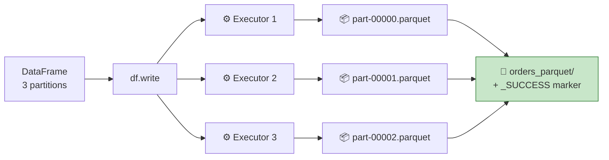

# Part 9 — 🧪 Reading & Writing Data

> **Section goal:** Get data *in* from raw files and *out* to storage, correctly. You'll learn every CSV option that matters, why `inferSchema` is fine for exploration and wrong for production, how to declare an explicit `StructType` schema, how the four write modes differ, and why one `.write` call produces a folder full of files instead of one file.

Covers transcript `00:21:08` – `00:27:57`.

---

## 1. The dataset and the setup

> *"We have given this another file called **`orders.csv`**. It's a different dataset — it has some kind of orders from an e-commerce company: country, order ID, etc."*

Approximate shape:

| Column | Example | The type it *should* be |
|--------|---------|-------------------------|
| `order_date` | `2023-04-17` | `date` |
| `order_id` | `10248` | `int` |
| `country` | `Germany` | `string` |
| `quantity` | `12` | `int` |
| `unit_price` | `14.50` | `double` |

### Load it into a volume first

> *"We'll go to Data Ingestion, and then instead of using 'Create or modify table' we'll **upload files to volume**. Why? Because we don't want to create a table out of this CSV file — we want to upload this file **as is**."*

| # | Action |
|---|--------|
| 1 | **`Data Ingestion`** → **`Upload files to volume`** |
| 2 | Target: **`workspace`** → **`default`** |
| 3 | **`Create a volume`** → name `raw_data`, type **Managed volume** → **`Create`** |
| 4 | Drag & drop `orders.csv` → **`Upload`** |
| 5 | Verify: **`Catalog`** → `workspace` → `default` → **Volumes** → `raw_data` |

Your path is now:

```
/Volumes/workspace/default/raw_data/orders.csv
```

Then create a new notebook named **`read_write_csv`** (the instructor's name at `00:23:09`).

---

## 2. First attempt — and the two problems it reveals

```python
path = "/Volumes/workspace/default/raw_data/orders.csv"

df = spark.read.csv(path)
display(df)
```

### ❌ Problem 1 — the header becomes a data row

```
+----------+--------+---------+--------+----------+
|       _c0|     _c1|      _c2|     _c3|       _c4|
+----------+--------+---------+--------+----------+
|order_date|order_id|  country|quantity|unit_price|   ← 😱 the header, as data
|2023-04-17|   10248|  Germany|      12|      14.5|
```

> *"There is a problem — the header is considered as one of the rows in that table."*

**Fix:**

```python
df = spark.read.option("header", "true").csv(path)
```

### ❌ Problem 2 — everything is a string

```python
df.printSchema()
```
```
root
 |-- order_date: string      ← should be date
 |-- order_id:   string      ← should be int
 |-- country:    string      ✅
 |-- quantity:   string      ← should be int
 |-- unit_price: string      ← should be double
```

> *"See, this `order_id` is integer, but here it says the data type is **string**… everything is string."*

**Why:** CSV is a plain-text format with **no type information whatsoever**. Without instructions, Spark treats every field as text.

**Two fixes exist. One is convenient; one is correct.**

---

## 3. Fix A — `inferSchema` (convenient)

> *"So you can **infer the schema** as one of the options."*

```python
df = (spark.read
      .option("header", "true")
      .option("inferSchema", "true")
      .csv(path))

df.printSchema()
```
```
 |-- order_date: string       ⚠️ still string! (dates aren't inferred by default)
 |-- order_id:   integer      ✅
 |-- country:    string       ✅
 |-- quantity:   integer      ✅
 |-- unit_price: double       ✅
```

> *"Now you can see `order_id` — it's integer. Then quantity, it is integer."*

> 💡 **Multi-line style tip:** *"If you want to supply another option you again say `.option(...)`. And the line is getting bigger, so let me just do this…"* — wrap the chain in **outer parentheses** and put each `.option()` on its own line. Much more readable than trailing backslashes.

### 🔍 Plain-English deep-dive: how `inferSchema` works, and why it's a trap in production

Spark makes an **extra full pass over the file** just to sample values and guess types.

| ❌ Problem | Why it hurts |
|-----------|--------------|
| **Costs an extra read** | Two passes instead of one. On terabytes, that's real money and time. |
| **Non-deterministic across runs** | Monday's file has clean integers → `integer`. Tuesday's has one `"N/A"` → `string`. Your pipeline's schema silently changed. |
| **Breaks downstream contracts** | A table whose types shift between runs will eventually break a dashboard or a join. |
| **Misses semantic types** | Dates are inferred as strings unless you also set `inferTimestamp`/`dateFormat`. |
| **Guesses wrongly on identifiers** | A zip code `01234` becomes the integer `1234` — the leading zero is gone forever. |
| **Precision loss** | Long numeric IDs may be inferred as `double` and lose precision. |

> ⚠️ **The zip-code bug is real and common.** Product codes, phone numbers, account numbers, postcodes — anything with leading zeros must stay a **string**. `inferSchema` will happily destroy them.

**Verdict:** `inferSchema=true` for **exploration**. **Explicit schema** for **anything scheduled**.

---

## 4. Fix B — an explicit schema (correct)

> *"Sometimes, instead of letting Spark infer the schema, you want to **specify** the schema."*

```python
import pyspark.sql.functions as F
import pyspark.sql.types     as T

csv_schema = T.StructType([
    T.StructField("order_date", T.DateType(),    True),
    T.StructField("order_id",   T.IntegerType(), True),
    T.StructField("country",    T.StringType(),  True),
    T.StructField("quantity",   T.IntegerType(), True),
    T.StructField("unit_price", T.DoubleType(),  True),
])

df = (spark.read
      .option("header", "true")
      .schema(csv_schema)          # ⚠️ a METHOD, not an option
      .csv(path))

df.printSchema()
```

> *"You supply another option called `.schema`. **It's not an option, it's a method.** You just say `.schema` is this particular CSV schema."*

### 🔍 Plain-English deep-dive: `StructType` and `StructField`

- **`StructType`** — *the schema of a whole table: an ordered list of fields.* **Analogy:** the **column headers row** of a form, with the expected format written next to each.
- **`StructField(name, dataType, nullable)`** — *one column definition.* Three arguments:
  1. **name** — the column name
  2. **dataType** — `StringType()`, `IntegerType()`, `DoubleType()`, `DateType()`, `TimestampType()`, `BooleanType()`, `DecimalType(10,2)`, `LongType()`, …
  3. **nullable** — `True` means nulls are allowed. **Analogy:** whether the form field is optional.

> 💡 *"You don't need to remember all this code — you have assisted coding, so you can generate this code easily."* Press **`Ctrl+I`** and describe the schema in English. But **read what it produces** — a wrong type here poisons everything downstream.

### The shorthand: DDL-string schemas

For simple cases, this is far less typing and equally valid:

```python
ddl = """
    order_date DATE,
    order_id   INT,
    country    STRING,
    quantity   INT,
    unit_price DOUBLE
"""
df = spark.read.option("header", "true").schema(ddl).csv(path)
```

### Generating a schema you can paste

Great trick — infer once during development, then freeze it into code:

```python
tmp = spark.read.option("header", "true").option("inferSchema", "true").csv(path)
print(tmp.schema)            # StructType([StructField('order_date', StringType(), True), …])
print(tmp._jdf.schema().toDDL())   # order_date STRING, order_id INT, …
```

### The full type reference

| Spark type | Python equivalent | SQL name | Use for |
|------------|-------------------|----------|---------|
| `StringType()` | `str` | `STRING` | Text, codes, **IDs with leading zeros** |
| `IntegerType()` | `int` (32-bit) | `INT` | Counts up to ~2.1 billion |
| `LongType()` | `int` (64-bit) | `BIGINT` | Large IDs, epoch millis |
| `DoubleType()` | `float` | `DOUBLE` | Ratings, measurements |
| `DecimalType(p, s)` | `Decimal` | `DECIMAL(p,s)` | ⭐ **Money** — exact, no float error |
| `BooleanType()` | `bool` | `BOOLEAN` | Flags |
| `DateType()` | `date` | `DATE` | Calendar dates |
| `TimestampType()` | `datetime` | `TIMESTAMP` | Date + time |
| `ArrayType(t)` | `list` | `ARRAY<t>` | Repeated values |
| `MapType(k, v)` | `dict` | `MAP<k,v>` | Key/value pairs |
| `StructType([...])` | nested | `STRUCT<...>` | Nested records (JSON) |

> ⚠️ **Money should be `DecimalType`, not `DoubleType`.** Floating-point can't represent `0.1` exactly, so summing millions of currency values accumulates error. Financial reconciliation failures caused by `double` are a genuine production problem. (This course uses `double` for simplicity — worth flagging in an interview that you know the difference.)

### Explicit schema vs inferSchema — the summary

| | `inferSchema=true` | Explicit `StructType` |
|---|---|---|
| Extra pass over data | ✅ Yes (slow) | ❌ No |
| Deterministic | ❌ Depends on the data | ✅ Always |
| Protects leading zeros | ❌ | ✅ |
| Catches upstream changes | ❌ Silently adapts | ✅ Fails loudly |
| Effort | Zero | A few lines |
| **Use for** | Exploration | ⭐ **Production** |

> ⭐ **Interview:** *"Would you use `inferSchema` in a production pipeline?"* → *"No. It costs an extra full pass over the data, and worse, it's non-deterministic — the inferred types depend on the contents of that particular file, so a single `N/A` in one day's extract silently turns an integer column into a string and breaks everything downstream. It also destroys leading zeros on identifiers like postcodes. I define an explicit `StructType`, which is deterministic, avoids the extra scan, and turns an unexpected upstream change into a loud failure rather than silent corruption. I'll use `inferSchema` interactively to *discover* the schema, then freeze it into code."*

---

## 5. Date and timestamp formats

> *"Now sometimes you want a specific format for a column. Let's say this is a date — you want it to be in a `MM-dd-yyyy` format. So once again, there is an option — you will have an option called **`dateFormat`**."*

```python
df = (spark.read
      .option("header", "true")
      .option("dateFormat", "MM-dd-yyyy")           # how dates look IN THE FILE
      .option("timestampFormat", "yyyy-MM-dd HH:mm:ss")
      .schema(csv_schema)
      .csv(path))
```

> *"The usually accepted format is `yyyy-MM-dd`, and that is what we have already — but I'm just showing you."*

**`yyyy-MM-dd` is the ISO 8601 standard and Spark's default.** Use it wherever you control the format.

### Format pattern reference

| Pattern | Means | Example |
|---------|-------|---------|
| `yyyy` | 4-digit year | 2026 |
| `yy` | 2-digit year | 26 |
| `MM` | 2-digit month | 08 |
| `MMM` | Short month name | Aug |
| `MMMM` | Full month name | August |
| `dd` | 2-digit day | 24 |
| `EEEE` | Day name | Monday |
| `HH` | Hour, 24-clock | 14 |
| `hh` | Hour, 12-clock | 02 |
| `mm` | Minutes | 35 |
| `ss` | Seconds | 07 |
| `a` | AM/PM | PM |

> ⚠️⚠️ **The classic bug: `MM` vs `mm`.** **`MM` = month. `mm` = minutes.** Writing `dd-mm-yyyy` gives you the *minute* in the month position. It silently produces garbage. Check every format string twice.

> ⚠️ **Spark 3 date parsing is strict.** An unparseable date raises an error rather than returning null. To restore Spark 2 behaviour (nulls instead of failures):
> ```python
> spark.conf.set("spark.sql.legacy.timeParserPolicy", "LEGACY")
> ```
> Prefer fixing the data.

---

## 6. The alternative read syntax

> *"Whatever we just did, you can do the same thing with a little difference in syntax, where you will say `spark.read.format(...)`. We were saying `read.csv` previously… instead of that you can say `read` but in `format` CSV. So this will do the same thing — it's just a different syntax."*

```python
# Style 1 — the shortcut
df = spark.read.option("header", "true").csv(path)

# Style 2 — format + load  (generic, works for every source)
df = (spark.read
      .format("csv")
      .option("header", "true")
      .load(path))
```

| | `.csv(path)` | `.format("csv").load(path)` |
|---|---|---|
| Brevity | ✅ Shorter | More verbose |
| Format as a variable | ❌ | ✅ `.format(fmt)` |
| Works for JDBC / Kafka / custom | ❌ | ✅ |
| Consistency across sources | — | ✅ |

**Formats you can pass:** `csv`, `json`, `parquet`, `delta`, `orc`, `avro`, `text`, `xml`, `jdbc`, `kafka`, `cloudFiles` (Auto Loader).

---

## 7. Every CSV read option that matters

| Option | Default | What it does |
|--------|---------|--------------|
| `header` | `false` | Treat row 1 as column names |
| `inferSchema` | `false` | Guess types (extra pass) |
| `sep` / `delimiter` | `,` | Field separator — `\t`, `\|`, `;` |
| `quote` | `"` | Quote character |
| `escape` | `\` | Escape character inside quotes |
| `multiLine` | `false` | ⭐ Allow newlines **inside** quoted fields |
| `nullValue` | — | String that means null, e.g. `"NULL"`, `"N/A"`, `"\\N"` |
| `emptyValue` | `""` | How to treat empty strings |
| `nanValue` | `NaN` | String meaning "not a number" |
| `dateFormat` | `yyyy-MM-dd` | Date pattern in the file |
| `timestampFormat` | ISO | Timestamp pattern |
| `encoding` / `charset` | `UTF-8` | e.g. `ISO-8859-1`, `UTF-16` |
| `ignoreLeadingWhiteSpace` | `false` | Trim leading spaces |
| `ignoreTrailingWhiteSpace` | `false` | Trim trailing spaces |
| `comment` | — | Skip lines starting with this char |
| `mode` | `PERMISSIVE` | Bad-record handling — see below |
| `columnNameOfCorruptRecord` | `_corrupt_record` | Where to stash bad rows |
| `recursiveFileLookup` | `false` | Read nested subdirectories |
| `pathGlobFilter` | — | e.g. `*.csv` |
| `enforceSchema` | `true` | Apply your schema even if the header disagrees |

### Bad-record handling modes

| `mode` | Behaviour | When to use |
|--------|-----------|-------------|
| `PERMISSIVE` *(default)* | Sets unparseable fields to null; optionally captures the raw line in `_corrupt_record` | Exploration, bronze ingest |
| `DROPMALFORMED` | Silently discards bad rows | ⚠️ Dangerous — you lose data with no trace |
| `FAILFAST` | Throws immediately on the first bad row | ⭐ Production, when data quality is contractual |

```python
schema_with_corrupt = T.StructType(csv_schema.fields + [
    T.StructField("_corrupt_record", T.StringType(), True)
])

df = (spark.read
      .option("header", "true")
      .option("mode", "PERMISSIVE")
      .option("columnNameOfCorruptRecord", "_corrupt_record")
      .schema(schema_with_corrupt)
      .csv(path))

# Quarantine bad rows instead of losing them
bad  = df.filter(F.col("_corrupt_record").isNotNull())
good = df.filter(F.col("_corrupt_record").isNull()).drop("_corrupt_record")
```

> ⭐ **Interview:** *"How do you handle malformed records?"* → *"Depends on the layer. At bronze I use `PERMISSIVE` with `columnNameOfCorruptRecord`, then split the DataFrame into good rows and a quarantine table, so nothing is silently lost and someone can investigate the bad ones. I avoid `DROPMALFORMED` because it discards data with no audit trail. For contractual feeds where any malformation means the whole file is untrustworthy, `FAILFAST` is correct — fail the run loudly and alert, rather than half-loading."*

---

## 8. Reading many files at once

The project's `order_items` folder has **~90 daily CSVs**. Spark handles that natively:

```python
# Whole directory — every file must share a schema
df = spark.read.option("header","true").schema(s).csv("/Volumes/.../order_items/landing/")

# Glob pattern
df = spark.read.csv("/Volumes/.../landing/orders_2025-08-*.csv", header=True)

# Explicit list
df = spark.read.csv(["/Volumes/.../a.csv", "/Volumes/.../b.csv"], header=True)

# Recurse into subfolders
df = (spark.read.option("recursiveFileLookup","true")
                .option("pathGlobFilter","*.csv")
                .csv("/Volumes/.../landing/"))
```

**Track which file each row came from** — essential for auditing (and used in Part 21):

```python
df = df.withColumn("source_file", F.col("_metadata.file_path"))
```

> ⚠️ **Serverless gotcha (repeated because it matters):** `input_file_name()` is **not supported** on serverless — the instructor hits this live at `02:17:00`. Use **`_metadata.file_path`**.

### SQL equivalent

```sql
SELECT * FROM read_files(
  '/Volumes/workspace/default/raw_data/orders.csv',
  format   => 'csv',
  header   => true,
  schema   => 'order_date DATE, order_id INT, country STRING, quantity INT, unit_price DOUBLE'
);

-- Quick and dirty
SELECT * FROM csv.`/Volumes/workspace/default/raw_data/orders.csv`;
```

> 💡 **Preview of Part 30 — Auto Loader.** Re-reading the whole folder every night gets slower forever. **Auto Loader** (`.format("cloudFiles")`) tracks which files it has already seen and processes only new arrivals:
> ```python
> (spark.readStream.format("cloudFiles")
>       .option("cloudFiles.format", "csv")
>       .option("cloudFiles.schemaLocation", "/Volumes/.../_schema")
>       .load("/Volumes/.../landing/"))
> ```

---

## 9. Writing data out

> *"I want to write the DataFrame to, let's say, **Parquet** format. You know how you have a `read` function — you also have a **`write`** function."*

```python
out = "/Volumes/workspace/default/raw_data/orders_parquet"

(df.write
   .mode("overwrite")
   .parquet(out))
```

> *"`df.write.mode('overwrite')` — means whatever file you're writing to, if there is already a file present there, just overwrite it. And here you will say `parquet` and you specify the path."*

### The four write modes

| Mode | If the target exists | Analogy | Use for |
|------|----------------------|---------|---------|
| `overwrite` | **Deletes** and replaces everything | Wiping the whiteboard and rewriting | Full refresh / backfill |
| `append` | Adds new files alongside | Adding pages to a binder | Incremental loads |
| `ignore` | Silently does nothing | *"Already there? Fine, skip."* | Idempotent first-time setup |
| `error` / `errorifexists` *(default)* | Throws | *"Refusing to touch it."* | Safety by default |

> ⚠️ **`overwrite` is destructive.** On a Delta table you can `RESTORE` (Part 7). On a plain Parquet directory, the old data is gone.

### The syntax families

```python
# Format shortcuts
df.write.mode("overwrite").parquet(path)
df.write.mode("overwrite").csv(path)
df.write.mode("overwrite").json(path)

# Generic — works for any format
df.write.format("delta").mode("overwrite").save(path)

# ⭐ Save as a MANAGED table in Unity Catalog (what the project uses)
(df.write
   .format("delta")
   .mode("overwrite")
   .option("mergeSchema", "true")
   .saveAsTable("ecommerce.bronze.brz_order_items"))

# EXTERNAL table — path + table name
(df.write
   .format("delta")
   .mode("overwrite")
   .option("path", "abfss://ctr@acct.dfs.core.windows.net/bronze/orders/")
   .saveAsTable("ecommerce.bronze.brz_orders_ext"))
```

| | `.save(path)` | `.saveAsTable(name)` |
|---|---|---|
| Creates files | ✅ | ✅ |
| Registers in Unity Catalog | ❌ | ✅ |
| Queryable by name in SQL | ❌ (path only) | ✅ |
| Gets governance & lineage | ❌ | ✅ |
| **Prefer** | Interchange files | ⭐ **Almost always this** |

### Partitioned writes

```python
(df.write
   .mode("overwrite")
   .partitionBy("country")          # creates country=Germany/, country=India/, …
   .parquet(out))
```

Produces:
```
orders_parquet/
├── country=Germany/part-00000-….parquet
├── country=India/  part-00000-….parquet
└── _SUCCESS
```

> ⚠️ **Don't over-partition.** Partitioning by a high-cardinality column (like `order_id`) creates millions of tiny files and makes everything *slower*. Rule of thumb: only partition when each partition holds **≥ 1 GB**, and prefer **Liquid Clustering** (Part 7) on modern Databricks.

---

## 10. Why you get a *folder*, not a file

> *"So now let's go to Catalog → workspace → default → volumes → raw_data, and here you see Parquet. So the data is now written in the Parquet format."*

Open it and you'll find:

```
orders_parquet/
├── _SUCCESS
├── part-00000-a1b2c3….snappy.parquet
├── part-00001-d4e5f6….snappy.parquet
└── part-00002-g7h8i9….snappy.parquet
```



**One output file per partition**, written in parallel by different executors. That's the whole point — a single file would mean a single writer, which would be a bottleneck.

**`_SUCCESS`** is an empty marker file meaning *"the write completed"*. Downstream systems check for it.

**If you genuinely need one file** (e.g. handing a CSV to a business user):

```python
df.coalesce(1).write.mode("overwrite").csv(out, header=True)
```

> ⚠️ `coalesce(1)` funnels all data through **one** executor. Fine for a small export; a guaranteed out-of-memory error on a large one. Part 16 covers `coalesce` vs `repartition` properly.

> 💡 **You'll use this trick in Part 16** to *prove* how many partitions a DataFrame has — count the output files.

---

## 11. 🧪 Consolidated lab

```python
import pyspark.sql.functions as F
import pyspark.sql.types     as T

path = "/Volumes/workspace/default/raw_data/orders.csv"

# ── 1. Naive read — see both problems ────────────────────────────────
display(spark.read.csv(path))                       # header as data, _c0.. names

# ── 2. Fix the header ────────────────────────────────────────────────
df = spark.read.option("header", "true").csv(path)
df.printSchema()                                    # all strings

# ── 3. inferSchema (exploration only) ────────────────────────────────
df_inf = (spark.read
          .option("header", "true")
          .option("inferSchema", "true")
          .csv(path))
df_inf.printSchema()

# ── 4. Explicit schema (production) ──────────────────────────────────
csv_schema = T.StructType([
    T.StructField("order_date", T.DateType(),    True),
    T.StructField("order_id",   T.IntegerType(), True),
    T.StructField("country",    T.StringType(),  True),
    T.StructField("quantity",   T.IntegerType(), True),
    T.StructField("unit_price", T.DoubleType(),  True),
])

df = (spark.read
      .option("header", "true")
      .option("dateFormat", "yyyy-MM-dd")
      .schema(csv_schema)
      .csv(path))
df.printSchema()
display(df)

# ── 5. The .format().load() equivalent ───────────────────────────────
df2 = (spark.read
       .format("csv")
       .option("header", "true")
       .schema(csv_schema)
       .load(path))
assert df.count() == df2.count()

# ── 6. Add an audit column ───────────────────────────────────────────
df = df.withColumn("source_file", F.col("_metadata.file_path")) \
       .withColumn("ingested_at", F.current_timestamp())

# ── 7. Write to Parquet ──────────────────────────────────────────────
out = "/Volumes/workspace/default/raw_data/orders_parquet"
df.write.mode("overwrite").parquet(out)

# ── 8. Read it back and prove the schema survived ────────────────────
back = spark.read.parquet(out)
back.printSchema()                                  # ✅ types preserved — no options needed
print("rows:", back.count())

# ── 9. Inspect the output files ──────────────────────────────────────
display(dbutils.fs.ls(out))                         # part-*.parquet + _SUCCESS

# ── 10. Save as a governed Delta table ───────────────────────────────
(df.write
   .format("delta")
   .mode("overwrite")
   .option("mergeSchema", "true")
   .saveAsTable("workspace.default.orders_bronze"))
```

**✅ Checkpoint:** `back.printSchema()` shows proper types **without** any options — because Parquet stores its schema inside the file. That single observation is the best argument for Parquet over CSV.

---

## 12. Format comparison

| Format | Schema stored? | Compressed | Columnar | Splittable | Human-readable | Use for |
|--------|---------------|-----------|----------|-----------|----------------|---------|
| **CSV** | ❌ | ❌ | ❌ | ✅ | ✅ | Interchange, source files |
| **JSON** | ⚠️ implicit | ❌ | ❌ | ✅ | ✅ | APIs, nested data |
| **Parquet** | ✅ | ✅ | ✅ | ✅ | ❌ | ⭐ Analytics storage |
| **ORC** | ✅ | ✅ | ✅ | ✅ | ❌ | Hive ecosystems |
| **Avro** | ✅ | ✅ | ❌ (row) | ✅ | ❌ | Streaming, row-wise writes |
| **Delta** | ✅ | ✅ | ✅ | ✅ | ❌ | ⭐⭐ **Default in Databricks** |

> ⭐ **Interview:** *"Why Parquet over CSV?"* → *"Four reasons. It's columnar, so a query touching 3 of 40 columns reads only 3 — often a 10× reduction in I/O. It compresses far better because similar values sit adjacent. It embeds the schema, so types survive a round-trip and no inference is needed. And it stores per-row-group min/max statistics, which lets the engine skip whole chunks that can't match a predicate. CSV has none of that — it's text, so every read is a full parse with no type information. I'd keep CSV only as the interchange format at the very edge of the system."*

---

## 13. 🚑 Troubleshooting

| Error / symptom | Cause | Fix |
|-----------------|-------|-----|
| Columns named `_c0`, `_c1`… | Missing header option | `.option("header","true")` |
| Everything is `string` | No schema, no inference | `.option("inferSchema","true")` or `.schema(...)` |
| `Path does not exist` | Typo, or reading before uploading | Check with `dbutils.fs.ls(parent_dir)` |
| `Path already exists` | Default write mode is `error` | Add `.mode("overwrite")` or `.mode("append")` |
| Dates all null / parse error | Wrong `dateFormat`, or `MM` vs `mm` | Fix the pattern; **`MM` = month** |
| Leading zeros vanished | `inferSchema` turned a code into an int | Declare it `StringType()` |
| Row counts don't add up | `DROPMALFORMED` silently dropped rows | Use `PERMISSIVE` + quarantine |
| `Column '_corrupt_record' not found` | Not declared in the schema | Add the field to your `StructType` |
| `input_file_name()` unsupported | Serverless compute | Use `_metadata.file_path` |
| Newlines break rows | Embedded newline inside a quoted field | `.option("multiLine","true")` |
| Odd characters (`é` instead of `é`) | Wrong encoding | `.option("encoding","ISO-8859-1")` |
| Thousands of tiny output files | Too many partitions | `.coalesce(n)` before write, or `OPTIMIZE` after |

---

## ⭐ Likely Interview Questions for This Section

**Q1. "Walk me through reading a CSV in Spark properly."**
> *Model answer:* "`spark.read` with three things set explicitly. `header=true` so row one becomes column names rather than data. An explicit `StructType` schema rather than `inferSchema`, so the types are deterministic and I don't pay for an extra pass over the file. And a `mode` plus `columnNameOfCorruptRecord` so malformed rows are captured rather than silently nulled or dropped. If dates are non-ISO I'd set `dateFormat` too. I'd also add an audit column from `_metadata.file_path` so every row traces back to its source file."

**Q2. "`inferSchema` — yes or no in production?"**
> *Model answer:* "No. It triggers an additional full scan just to sample types, and it's non-deterministic: the inferred schema depends on that day's data, so one `N/A` value flips an integer column to string and breaks everything downstream without an error. It also destroys leading zeros on codes and postcodes by inferring them as integers. I use it interactively to discover the schema, print `schema.toDDL()`, and then freeze that into code as an explicit schema."

**Q3. "Explain the write modes."**
> *Model answer:* "`overwrite` deletes and replaces the target — used for full refreshes, and destructive unless the target is Delta where `RESTORE` gives you a way back. `append` adds new files, used for incremental loads. `ignore` does nothing if the target exists, which is useful for idempotent first-time setup. `errorifexists` is the default and throws, which is the right conservative default. In practice I use `overwrite` for backfills and `append` or, more often, `MERGE` for incremental — because `append` alone gives duplicates if a run is retried."

**Q4. "Why does one `.write` produce many files?"**
> *Model answer:* "Because each partition is written independently and in parallel by a different task — one output file per partition, plus a `_SUCCESS` marker. That parallelism is the point; a single file would mean a single writer and a bottleneck. If I genuinely need one file for a downstream consumer I'd `coalesce(1)` first, but that funnels everything through one executor and risks OOM, so it's only acceptable for small exports. The opposite problem — thousands of tiny files — hurts read performance, and the fix is `coalesce` before writing or `OPTIMIZE` afterwards."

**Q5. "How do you handle malformed records?"**
> *Model answer:* "By layer. At bronze I use `PERMISSIVE` with `columnNameOfCorruptRecord`, then split into a clean DataFrame and a quarantine table, so nothing is lost and there's a queue for someone to investigate. I avoid `DROPMALFORMED` because it discards rows with no audit trail — you find out weeks later when a total doesn't reconcile. For contractual feeds where any malformation means the file is untrustworthy, `FAILFAST` is right: fail loudly and alert rather than half-loading. Whichever I pick, I record the good/bad counts as metrics so a spike in rejects triggers an alert."

**Q6. "Why Parquet over CSV?"**
> *Model answer:* "Columnar layout means reading 3 of 40 columns touches only 3 columns' worth of bytes. Better compression, because adjacent values in a column are similar. Embedded schema, so types survive a round-trip and no inference is needed on read. And per-row-group min/max statistics that let the engine skip whole chunks that can't satisfy a predicate — that's predicate pushdown, and it's what makes Z-ORDER and liquid clustering effective. CSV is plain text with none of that. I'd keep CSV only at the system boundary for interchange."

**Q7. "How would you read 90 daily CSV files that keep arriving?"**
> *Model answer:* "For a one-off backfill, point `spark.read` at the directory with an explicit schema — Spark reads all files in parallel — and add `_metadata.file_path` as an audit column so each row traces to its source file. For the ongoing incremental case I wouldn't re-scan the whole directory every night, because that gets slower forever and reprocesses data already loaded. I'd use **Auto Loader** with `format('cloudFiles')`, which tracks processed files in a checkpoint and picks up only new arrivals, with schema evolution and rescue-data columns for unexpected fields. Then a Databricks job triggered on file arrival or on a schedule."

**Q8. "Should money be a `double`?"**
> *Model answer:* "No — `DecimalType` with an explicit precision and scale. Floating point can't represent values like 0.1 exactly, so summing millions of currency amounts accumulates error and financial reconciliation fails by small amounts that are very hard to trace. `DECIMAL(18,2)` is exact for currency. `Double` is fine for measurements and ratings where tiny error is irrelevant, and a lot of tutorial code uses it for simplicity, but for anything that has to balance I'd use decimal."

---

## 🧠 30-Second Memory Hooks

- **CSV carries no types.** Without `header` and a schema you get `_c0` columns full of strings.
- **`.option("header","true")`** — the first thing you always add.
- **`inferSchema` = extra scan + non-deterministic + kills leading zeros.** Explore with it; never ship it.
- **`.schema()` is a METHOD, not an option.** `.option("schema", …)` does nothing.
- **`StructField(name, type, nullable)`** ×N inside a **`StructType([...])`**. Or use a DDL string.
- **`print(df.schema)` / `.toDDL()`** — infer once, then freeze it into code.
- **⚠️ `MM` = month, `mm` = minutes.** `yyyy-MM-dd` is ISO and Spark's default.
- **Money → `DecimalType`, not `Double`.**
- **`PERMISSIVE` = null it. `DROPMALFORMED` = lose it silently (avoid). `FAILFAST` = stop.** Bronze: permissive + quarantine.
- **Four write modes: overwrite · append · ignore · errorifexists (default).**
- **`.save(path)` = files only. `.saveAsTable(name)` = governed table.** Prefer the table.
- **One output file per partition + `_SUCCESS`.** That's why you get a folder.
- **`coalesce(1)` gives one file — and one bottleneck.** Small exports only.
- **Parquet embeds its schema** — read it back with zero options and the types are still right.
- **`_metadata.file_path`** for provenance (serverless-safe). **Auto Loader** for the incremental version.

---

*Next suggested section:* **[Part 10 — SQL in Spark](Part-10-sql-in-spark.md)** — you've been writing Python. Next: running SQL against DataFrames two different ways, temp views versus global temp views, and when each approach is the right tool.

---

**Navigation** — ⬅️ **[Part 8 — DataFrame Fundamentals](Part-08-dataframe-fundamentals.md)** · 🏠 **[Master Index](../Databricks%20-%20Study%20Guide.md)** · ➡️ **[Part 10 — SQL in Spark](Part-10-sql-in-spark.md)**
