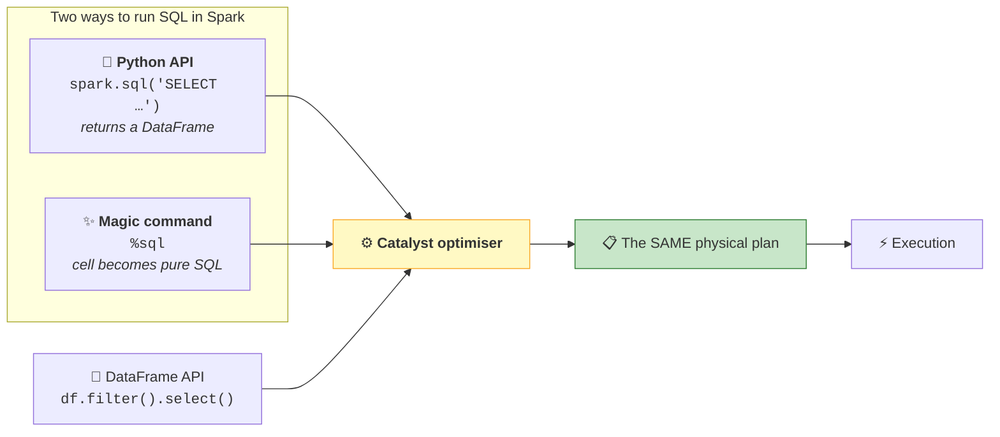
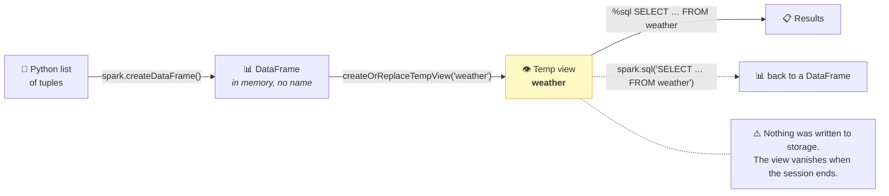
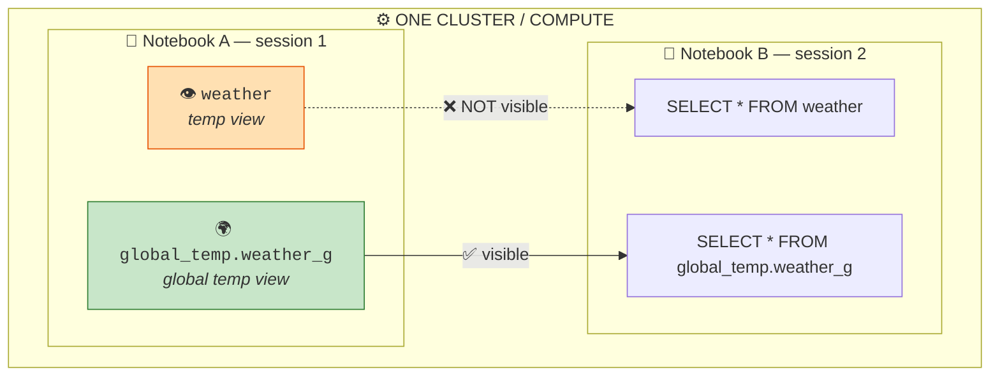

# Part 10 — 🧪 SQL in Spark

> **Section goal:** Run SQL against Spark two different ways, understand that they compile to *exactly the same execution plan*, and learn temporary views — the bridge that lets a DataFrame you built in Python be queried as if it were a table.

Covers transcript `00:34:53` – `00:40:04`.

---

## 1. Why this matters more than it looks

> *"We are going to run SQL queries in Spark, which is something you will do a lot — either as a data engineer or as a data analyst."*

Real Databricks codebases are **bilingual**. Nobody writes 100% PySpark or 100% SQL. You'll constantly switch based on which expresses the intent more clearly.



> ⭐ **The single most important fact in this Part:** SQL and the DataFrame API are **two front-ends to the same engine**. There is **no performance difference**. Choose on readability, not speed. Interviewers ask this exact question, and the wrong answer ("SQL is faster") is a red flag.

---

## 2. Way 1 — `spark.sql()` (the Python API)

Add a markdown cell first, as the instructor does:

```
%md
## SQL using Python API
```

Then:

```python
df_marvel = spark.sql("SELECT * FROM workspace.default.movies WHERE studio = 'Marvel Studios'")
df_marvel.show()
```

> *"We have the `spark` object already, correct? So on that you can simply run `spark.sql(...)`. Now it will return a **DataFrame**."*

### ⚠️ The quoting error the instructor hits live

> *"OK, I got this error because I have [a double] quote here and [a double] quote here. So you can just use a **single quote** here."*

```python
# ❌ Broken — the inner " ends the Python string early
spark.sql("SELECT * FROM movies WHERE studio = "Marvel Studios"")

# ✅ Double outside, single inside
spark.sql("SELECT * FROM movies WHERE studio = 'Marvel Studios'")

# ✅ Best for anything multi-line — triple quotes
spark.sql("""
    SELECT studio,
           COUNT(*)                  AS movie_count,
           ROUND(AVG(imdb_rating),2) AS avg_rating
    FROM   workspace.default.movies
    WHERE  release_year BETWEEN 2000 AND 2010
    GROUP  BY studio
    ORDER  BY avg_rating DESC
""")
```

> *"You have to take care of these quotes in Python. You can also use **triple quotes** if you have a longer SQL query."*

**Rule of thumb:** SQL string literals use `'single quotes'`. So wrap the Python string in `"double"` or `"""triple"""` and you'll never collide.

### The key property: it returns a DataFrame

This is what makes `spark.sql()` powerful — you can **mix SQL and DataFrame operations freely**:

```python
import pyspark.sql.functions as F

result = (spark.sql("SELECT * FROM workspace.default.movies")
            .filter(F.col("imdb_rating") > 8)                 # DataFrame API
            .withColumn("is_marvel", F.col("studio") == "Marvel Studios")
            .orderBy(F.col("imdb_rating").desc()))

display(result)
```

SQL for the heavy joins and aggregations, Python for the fiddly conditional logic. Best of both.

---

## 3. Way 2 — the `%sql` magic

```
%md
## SQL using %sql
```

```sql
%sql
SELECT * FROM workspace.default.movies
WHERE  studio = 'Marvel Studios';
```

> *"When you say `%sql`, you can now **freely write your query**… This feels more like you're having your database tool — your Oracle or MySQL Workbench — and you are directly running your query."*

### `_sqlDF` — getting the result back into Python

> *"And this result will be stored in **`_sqlDF`**, so that if you want to use it later on, you can use it."*

```sql
%sql
SELECT studio, COUNT(*) AS n
FROM   workspace.default.movies
GROUP  BY studio
```

```python
# Next cell — the previous %sql result is available as _sqlDF
top = _sqlDF.orderBy(F.col("n").desc()).limit(5)
display(top)
```

> ⚠️ **`_sqlDF` holds only the *most recent* `%sql` cell's result.** Run another `%sql` cell and it's overwritten. Don't build a pipeline on it — it's a convenience for interactive work.

### Which magic to use when

| | `spark.sql("…")` | `%sql` |
|---|---|---|
| Cell language | Python | SQL |
| Returns | A DataFrame you name | Auto-displayed table + `_sqlDF` |
| Can be parameterised with Python variables | ✅ Easily | ⚠️ Needs widgets |
| Can be looped / conditional | ✅ | ❌ |
| Chain with DataFrame ops | ✅ | Only via `_sqlDF` |
| Auto-renders as a table | ❌ (need `display()`) | ✅ |
| Readability for long queries | Good with `"""` | ✅ Best — real SQL syntax highlighting |
| **Best for** | Pipelines, dynamic logic | Exploration, ad-hoc analysis, sharing with analysts |

> 💡 **Practical convention:** use `%sql` while exploring, then convert to `spark.sql()` when the logic goes into a scheduled notebook — because production code needs variables, loops and error handling.

---

## 4. Temporary views — querying a DataFrame with SQL

Here's the gap: `%sql` can only see **registered tables**. But your DataFrame might be built in memory and never saved. **A temp view bridges that.**

### Build a DataFrame from scratch

> *"Now let me create a temporary DataFrame. I'm not going to use the movies table — I'm going to create a DataFrame **on the fly** for my weather data. So I have this Python array, and in Spark you can say `spark.createDataFrame(data)`, then you specify your schema."*

```python
import pyspark.sql.functions as F

data = [
    ("2024-01-01", "Rain",  32),
    ("2024-01-02", "Sunny", 41),
    ("2024-01-03", "Snow",  28),
    ("2024-01-04", "Rain",  35),
    ("2024-01-05", "Sunny", 44),
    ("2024-01-06", "Snow",  25),
]
schema = ["day", "event", "temperature"]

df = spark.createDataFrame(data, schema)
df = df.withColumn("day", F.to_date("day", "yyyy-MM-dd"))   # the date formatting step
display(df)
```

### 🔍 Plain-English deep-dive: `spark.createDataFrame()`

*Turns ordinary Python data — a list of tuples, a list of dicts, a pandas DataFrame — into a distributed Spark DataFrame.*

**Analogy:** typing a small table by hand instead of loading a file. **Why it matters:** it's how you build **test fixtures**. Being able to construct a five-row DataFrame to verify a transformation is a genuine professional skill — and it's exactly what the joins lab in Part 11 does.

```python
# Schema as a list of names (types inferred)
spark.createDataFrame(data, ["day", "event", "temperature"])

# Schema as a DDL string  ⭐ concise and explicit
spark.createDataFrame(data, "day STRING, event STRING, temperature INT")

# Schema as a StructType (full control over nullability)
import pyspark.sql.types as T
spark.createDataFrame(data, T.StructType([
    T.StructField("day",         T.StringType(),  True),
    T.StructField("event",       T.StringType(),  True),
    T.StructField("temperature", T.IntegerType(), True),
]))

# From dicts, or from pandas
spark.createDataFrame([{"day": "2024-01-01", "event": "Rain"}])
spark.createDataFrame(pandas_df)
```

### Register it as a view

> *"Now I want to run a SQL query on top of it. How do I do that? Well, you can do that by creating a **temporary view**."*

```python
df.createOrReplaceTempView("weather")
```

> *"If you already have a view with the name `weather` in your session, this will **replace** it. You can also say `createTempView`, but we always use **`createOrReplaceTempView`**."*

⚠️ `createTempView("weather")` throws if the name already exists — so re-running the cell fails. `createOrReplaceTempView` is idempotent, which is why it's the one everybody uses.

### Query it

```sql
%sql
SELECT event,
       ROUND(AVG(temperature), 1) AS avg_temp,
       MIN(temperature)           AS min_temp,
       MAX(temperature)           AS max_temp,
       COUNT(*)                   AS days
FROM   weather
GROUP  BY event
ORDER  BY avg_temp DESC;
```

> *"So `weather` is the view that you have created… Now remember that `weather` is **not a table** in my Databricks — it's a **DataFrame** from which I have created this view. And see, I'm able to run the query. So this is very cool."*

**That's the whole trick.** No table was created, nothing was written to storage, and yet SQL works.



---

## 5. Temp view vs global temp view — the scoping rules

> *"Now if you look at other options for the function, it has **`createGlobalTempView`**. So see the **scope**… this is **session scope**. What it means is: in my current PySpark session, in **this notebook**, this is valid. So if I go to a different notebook and run this query, it's **not going to work**. But if I had used `createGlobalTempView`, then… I can create another notebook — it should be in the **same cluster** — on which I can run my query."*



```python
# Session-scoped — this notebook only
df.createOrReplaceTempView("weather")

# Cluster-scoped — any notebook on the SAME cluster
df.createOrReplaceGlobalTempView("weather_g")
```

> ⚠️ **The gotcha:** a global temp view lives in a special database called **`global_temp`** and you **must** prefix it:
> ```sql
> SELECT * FROM global_temp.weather_g;   -- ✅
> SELECT * FROM weather_g;               -- ❌ table not found
> ```

### The four kinds of "view", compared

| | **Temp view** | **Global temp view** | **View** (permanent) | **Materialized view** |
|---|---|---|---|---|
| Created with | `createOrReplaceTempView` | `createOrReplaceGlobalTempView` | `CREATE VIEW` | `CREATE MATERIALIZED VIEW` |
| Lives in | Your session | `global_temp` database | Unity Catalog | Unity Catalog |
| Visible to | This notebook only | Any notebook on the same cluster | **Everyone with permission** | Everyone with permission |
| Survives session end | ❌ | ❌ (dies with the cluster) | ✅ | ✅ |
| Stores data | ❌ (a saved query) | ❌ | ❌ | ✅ **Yes — precomputed** |
| Governed by Unity Catalog | ❌ | ❌ | ✅ | ✅ |
| Query cost | Recomputed each time | Recomputed each time | Recomputed each time | Cheap — reads stored result |
| **Use for** | Intermediate steps in one notebook | Sharing between notebooks on one cluster | ⭐ **Shared logic, the BI layer** | Expensive aggregations queried often |

```sql
-- Permanent view — what the project builds in Part 25
CREATE OR REPLACE VIEW ecommerce.gold.vw_sales_obt AS
SELECT f.*, d.quarter, d.month_name, p.category_name
FROM   ecommerce.gold.gld_fact_order_items f
JOIN   ecommerce.gold.gld_dim_date        d ON f.date_id    = d.date_id
JOIN   ecommerce.gold.gld_dim_products    p ON f.product_id = p.product_id;

DROP VIEW IF EXISTS ecommerce.gold.vw_sales_obt;
SHOW VIEWS IN ecommerce.gold;
```

> 💡 **A view is a saved query, not saved data.** Every time you select from it, the underlying query runs. That's why it's always fresh — and why an expensive view is expensive *every single time*. A **materialized view** trades freshness for speed by storing the result.

### Cleaning up

```python
spark.catalog.dropTempView("weather")
spark.catalog.dropGlobalTempView("weather_g")
display(spark.catalog.listTables())      # what's registered right now
```

---

## 6. Choosing your catalog and schema context

Typing `catalog.schema.table` everywhere gets tedious. Set the context once:

```sql
%sql
USE CATALOG ecommerce;
USE SCHEMA  gold;

SELECT * FROM gld_fact_order_items LIMIT 5;   -- 1-part name now resolves
```

```python
spark.sql("USE CATALOG ecommerce")
spark.sql("USE SCHEMA gold")

print(spark.catalog.currentCatalog())   # ecommerce
print(spark.catalog.currentDatabase())  # gold
```

> 💡 **The project uses exactly this** at `02:31:00`: *"`USE CATALOG ecommerce` — whatever code you run after this line will use this ecommerce catalog as a default."*

> ⚠️ **Gotcha:** `USE` is **session state**. A notebook that relies on it will break if run as a job task in a fresh session, or if someone runs cells out of order. **In production, always use fully qualified three-part names.** Reserve `USE` for interactive work.

---

## 7. Parameterising SQL — and a security warning

You'll frequently want the catalog, a date, or a table name to be a variable.

### ✅ Option 1 — Python f-strings (fine for *identifiers you control*)

```python
catalog = "ecommerce"
layer   = "bronze"

df = spark.sql(f"SELECT * FROM {catalog}.{layer}.brz_brands")
```

This is what the project does at `02:40:30`:
```python
df_bronze = spark.table(f"{catalog_name}.bronze.brz_brands")
```

### 🚨 Option 2 — parameter markers (**required for user-supplied values**)

```python
# ❌❌ SQL INJECTION RISK — never interpolate untrusted input
user_input = "Marvel'; DROP TABLE movies; --"
spark.sql(f"SELECT * FROM movies WHERE studio = '{user_input}'")   # 💀

# ✅ SAFE — named parameter markers; values are bound, never concatenated
spark.sql(
    "SELECT * FROM workspace.default.movies WHERE studio = :studio AND release_year >= :yr",
    args={"studio": user_input, "yr": 2010}
)
```

> ⚠️ **Interview-worthy point:** f-string interpolation of **values** is a genuine SQL-injection vector as soon as any input comes from a widget, a job parameter, an API or a config file someone else edits. Use `args={}` parameter markers for values. F-strings are acceptable only for **identifiers** (catalog/schema/table names) that you fully control — and even then, validate them against an allow-list if they're externally supplied.

### Option 3 — notebook widgets (parameters for `%sql` cells and jobs)

```python
dbutils.widgets.text("run_date", "2025-10-31", "Run date")
dbutils.widgets.dropdown("layer", "bronze", ["bronze", "silver", "gold"], "Layer")

run_date = dbutils.widgets.get("run_date")
```

```sql
%sql
SELECT * FROM ecommerce.silver.slv_order_items
WHERE  ingestion_date = :run_date;     -- widgets bind as named parameters
```

Older syntax you'll still see in the wild: `${run_date}` and `getArgument('run_date')`.

> 💡 **Widgets are how a notebook becomes a reusable, schedulable job task.** Part 28 passes parameters into tasks exactly this way.

---

## 8. When to use SQL vs the DataFrame API

Since performance is identical, this is purely an engineering-judgement call — and a very common interview question.

| Prefer **SQL** when… | Prefer the **DataFrame API** when… |
|---------------------|-------------------------------------|
| The logic is a join + aggregate + filter | You need loops, conditionals, or dynamic column lists |
| Analysts need to read or own it | You want unit tests and modular functions |
| It's a set-based transformation | You're doing schema manipulation or metadata-driven work |
| You want it to look like the BI layer | You need Python libraries in the logic |
| The query is long and declarative | You want type checking, linting and IDE support |
| — | You're building reusable, parameterised components |

```python
# Same result, two styles

# SQL — reads like the business question
spark.sql("""
    SELECT studio, COUNT(*) AS n, ROUND(AVG(imdb_rating),2) AS avg_rating
    FROM   workspace.default.movies
    WHERE  release_year >= 2010
    GROUP  BY studio
    HAVING COUNT(*) > 1
    ORDER  BY avg_rating DESC
""")

# DataFrame API — composable and testable
(spark.table("workspace.default.movies")
   .filter(F.col("release_year") >= 2010)
   .groupBy("studio")
   .agg(F.count("*").alias("n"),
        F.round(F.avg("imdb_rating"), 2).alias("avg_rating"))
   .filter(F.col("n") > 1)
   .orderBy(F.col("avg_rating").desc()))
```

> 💡 **How the project splits it:** DataFrame API for the row-level cleaning in bronze/silver (Parts 21–24), SQL for the gold-layer joins and the reporting view (Parts 23, 25). That's a very typical, defensible split.

---

## 9. SQL features you'll actually use

Spark SQL is ANSI-compliant and richer than most people expect.

```sql
-- CTEs — the readable way to build multi-step logic  ⭐ used in Part 23
WITH recent AS (
    SELECT * FROM workspace.default.movies WHERE release_year >= 2010
),
by_studio AS (
    SELECT studio, COUNT(*) AS n, AVG(imdb_rating) AS avg_rating
    FROM recent GROUP BY studio
)
SELECT * FROM by_studio WHERE n > 1 ORDER BY avg_rating DESC;

-- Window functions — rank within a group without a self-join
SELECT title, studio, imdb_rating,
       ROW_NUMBER() OVER (PARTITION BY studio ORDER BY imdb_rating DESC) AS rank_in_studio,
       AVG(imdb_rating) OVER (PARTITION BY studio)                       AS studio_avg,
       imdb_rating - AVG(imdb_rating) OVER (PARTITION BY studio)         AS vs_studio_avg
FROM   workspace.default.movies;

-- CASE WHEN
SELECT title,
       CASE WHEN imdb_rating >= 8 THEN 'Great'
            WHEN imdb_rating >= 6 THEN 'Good'
            ELSE 'Poor' END AS band
FROM workspace.default.movies;

-- Null handling
SELECT COALESCE(budget, 0) AS budget, NVL(studio,'Unknown') AS studio
FROM workspace.default.movies;

-- Query files directly, no table required
SELECT * FROM csv.`/Volumes/workspace/default/raw_data/orders.csv`;
SELECT * FROM read_files('/Volumes/.../orders.csv', format => 'csv', header => true);

-- Delta time travel (Part 7)
SELECT * FROM workspace.default.movies VERSION AS OF 0;

-- Metadata
SHOW CATALOGS;  SHOW SCHEMAS IN ecommerce;  SHOW TABLES IN ecommerce.gold;
DESCRIBE EXTENDED workspace.default.movies;
SELECT * FROM ecommerce.information_schema.columns WHERE table_name = 'gld_dim_products';
```

---

## 10. 🧪 Consolidated lab

```python
import pyspark.sql.functions as F

# ── 1. SQL via the Python API ────────────────────────────────────────
df_marvel = spark.sql("""
    SELECT title, release_year, imdb_rating
    FROM   workspace.default.movies
    WHERE  studio = 'Marvel Studios'
    ORDER  BY imdb_rating DESC
""")
display(df_marvel)
print(type(df_marvel))        # pyspark.sql.dataframe.DataFrame

# ── 2. Mix SQL with the DataFrame API ────────────────────────────────
display(spark.sql("SELECT * FROM workspace.default.movies")
          .filter(F.col("imdb_rating") > 8)
          .withColumn("decade", (F.col("release_year") / 10).cast("int") * 10)
          .groupBy("decade").count()
          .orderBy("decade"))
```

```sql
%sql
-- ── 3. The %sql magic ───────────────────────────────────────────────
SELECT studio, COUNT(*) AS n, ROUND(AVG(imdb_rating), 2) AS avg_rating
FROM   workspace.default.movies
GROUP  BY studio
HAVING COUNT(*) > 1
ORDER  BY avg_rating DESC;
```

```python
# ── 4. Reuse the previous %sql result ────────────────────────────────
display(_sqlDF.limit(3))

# ── 5. Build a DataFrame on the fly ──────────────────────────────────
data = [("2024-01-01","Rain",32), ("2024-01-02","Sunny",41), ("2024-01-03","Snow",28),
        ("2024-01-04","Rain",35), ("2024-01-05","Sunny",44), ("2024-01-06","Snow",25)]

weather = (spark.createDataFrame(data, "day STRING, event STRING, temperature INT")
              .withColumn("day", F.to_date("day", "yyyy-MM-dd")))
display(weather)

# ── 6. Register both view scopes ─────────────────────────────────────
weather.createOrReplaceTempView("weather")
weather.createOrReplaceGlobalTempView("weather_g")
```

```sql
%sql
-- ── 7. Query the DataFrame as if it were a table ────────────────────
SELECT event,
       ROUND(AVG(temperature),1) AS avg_temp,
       MIN(temperature) AS min_temp,
       MAX(temperature) AS max_temp,
       COUNT(*)         AS days
FROM   weather
GROUP  BY event
ORDER  BY avg_temp DESC;
```

```python
# ── 8. The same query through the Python API ─────────────────────────
display(spark.sql("SELECT event, AVG(temperature) AS avg_temp FROM weather GROUP BY event"))

# ── 9. Prove the scoping rule ────────────────────────────────────────
display(spark.sql("SELECT * FROM global_temp.weather_g"))   # ✅ works here AND in another notebook
# spark.sql("SELECT * FROM weather_g")                      # ❌ needs the global_temp prefix

# ── 10. Safe parameterisation ────────────────────────────────────────
display(spark.sql(
    "SELECT * FROM workspace.default.movies WHERE studio = :studio AND release_year >= :yr",
    args={"studio": "Marvel Studios", "yr": 2010}))

# ── 11. Clean up ─────────────────────────────────────────────────────
spark.catalog.dropTempView("weather")
spark.catalog.dropGlobalTempView("weather_g")
```

**✅ Checkpoint:** the `weather` view answers a `GROUP BY` even though no table was ever created; `global_temp.weather_g` works from a *second* notebook on the same compute, while plain `weather` does not.

---

## ⭐ Likely Interview Questions for This Section

**Q1. "Is SQL slower than the DataFrame API in Spark?"**
> *Model answer:* "No — they're two front-ends to the same engine. Both are parsed into an unresolved logical plan, resolved against the catalog, optimised by Catalyst, and turned into the same physical plan. You can prove it by calling `.explain()` on both and comparing. So the choice is about readability and maintainability, not speed. I use SQL for set-based joins and aggregations, especially where analysts need to read or own the logic, and the DataFrame API where I need loops, dynamic column handling, unit tests or Python libraries."

**Q2. "What's a temporary view and why would you create one?"**
> *Model answer:* "It registers an existing DataFrame under a name so SQL can query it, without writing anything to storage. It's a pointer to the DataFrame's logical plan, not a copy of data. I use them to bridge languages — build something in PySpark, then express the join or aggregation in SQL because it reads better — and to name intermediate steps in a long transformation so the code is followable. They're session-scoped and disappear when the notebook detaches, which is exactly what you want for scratch work; anything shared should be a permanent view or a table."

**Q3. "Temp view vs global temp view vs permanent view?"**
> *Model answer:* "A temp view is scoped to one Spark session — one notebook — and vanishes when it ends. A global temp view lives in the special `global_temp` database and is visible to any notebook attached to the same cluster, so you must qualify it as `global_temp.name`; it still dies with the cluster. A permanent view is created with `CREATE VIEW`, stored in Unity Catalog, visible to everyone with permission, survives restarts, and is governed with grants and lineage. In practice I use temp views for intermediate steps, permanent views for the semantic layer that dashboards and Genie consume, and I mostly avoid global temp views since needing them usually signals that the logic should be a real view or a job parameter."

**Q4. "Is a view stored data?"**
> *Model answer:* "No — a standard view is a saved query. Selecting from it re-runs the underlying query against the base tables, so results are always current, but an expensive view is expensive on every access. A **materialized view** is the opposite trade: the result is computed and stored, so reads are cheap but the data is as fresh as the last refresh. I'd use a plain view for the semantic/denormalised layer and switch to a materialized view when a heavy aggregation is queried far more often than the base data changes."

**Q5. "How do you parameterise a SQL query in Databricks safely?"**
> *Model answer:* "For **values**, named parameter markers — `spark.sql('… WHERE studio = :studio', args={'studio': x})`. The value is bound rather than concatenated, so it's injection-safe. Python f-strings are acceptable only for **identifiers** I control, like catalog or schema names, and even then I'd validate against an allow-list if they come from configuration. Interpolating a user-supplied value into a query string is a real SQL-injection vector as soon as the input comes from a widget, job parameter or API. For notebooks that run as job tasks I use `dbutils.widgets`, which also bind as named parameters in `%sql` cells and are how a job passes arguments in."

**Q6. "`USE CATALOG` is convenient. Any downside?"**
> *Model answer:* "It's session state, so it's fragile. If someone runs cells out of order, or the notebook runs as a job task in a fresh session where that cell hasn't executed, unqualified names resolve against the wrong catalog — or fail. Worse, they might silently resolve against a *different* catalog with the same schema names, so a dev run writes to prod or vice versa. I use `USE` for interactive convenience but always write fully qualified three-part names in anything scheduled, usually with the catalog supplied as a job parameter so the same code promotes cleanly between environments."

**Q7. "You have a DataFrame in Python and a colleague wants to query it in SQL. Options?"**
> *Model answer:* "Depends on scope and lifetime. Within one notebook, `createOrReplaceTempView`. Across notebooks on the same cluster, `createOrReplaceGlobalTempView`, queried as `global_temp.name`. If they need it in *their* session or in a dashboard, neither works — I'd persist it, either as a Delta table with `saveAsTable` or as a permanent view over the source tables, which also gets it governance, lineage and grants. The general rule: temp views are scratch; anything another human depends on should be a governed object."

---

## 🧠 30-Second Memory Hooks

- **SQL and the DataFrame API compile to the *same* plan.** No performance difference. Choose on readability. ⭐
- **Two ways to run SQL: `spark.sql("…")` (returns a DataFrame) and `%sql` (a SQL cell).**
- **`spark.sql()` returns a DataFrame** — so you can chain `.filter()`, `.withColumn()` onto a SQL query.
- **`"""triple quotes"""` for multi-line SQL.** SQL uses `'single'`; Python uses `"double"` — never collide.
- **`_sqlDF`** holds the **last** `%sql` result. Convenience only; it gets overwritten.
- **`createOrReplaceTempView` over `createTempView`** — the latter throws on re-run.
- **Temp view = this notebook. Global temp view = any notebook, same cluster, prefixed `global_temp.`. Permanent view = everyone, governed, survives restarts.**
- **A view is a saved QUERY, not saved DATA.** Materialized view = saved data.
- **`spark.createDataFrame(data, "col TYPE, …")`** — how you build test fixtures by hand.
- **⚠️ `USE CATALOG` is session state.** Fully qualify names in production.
- **🚨 f-strings for identifiers only. Use `args={}` parameter markers for values** — SQL injection is real.
- **`dbutils.widgets`** turns a notebook into a parameterised, schedulable job task.

---

*Next suggested section:* **[Part 11 — Joins in Spark](Part-11-joins-in-spark.md)** — the last piece of the hands-on toolkit. All six join types demonstrated on deliberately messy customer/order data, plus aliasing, duplicate-column disambiguation, null-matching behaviour and composite keys.

---

**Navigation** — ⬅️ **[Part 9 — Reading & Writing Data](Part-09-reading-writing-data.md)** · 🏠 **[Master Index](../Databricks%20-%20Study%20Guide.md)** · ➡️ **[Part 11 — Joins in Spark](Part-11-joins-in-spark.md)**
