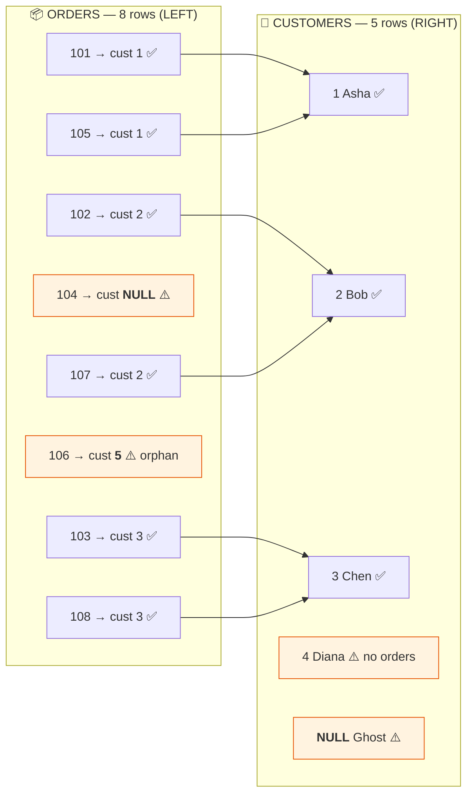
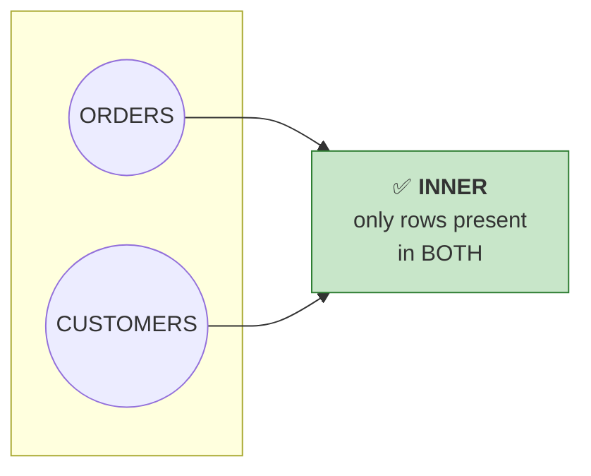
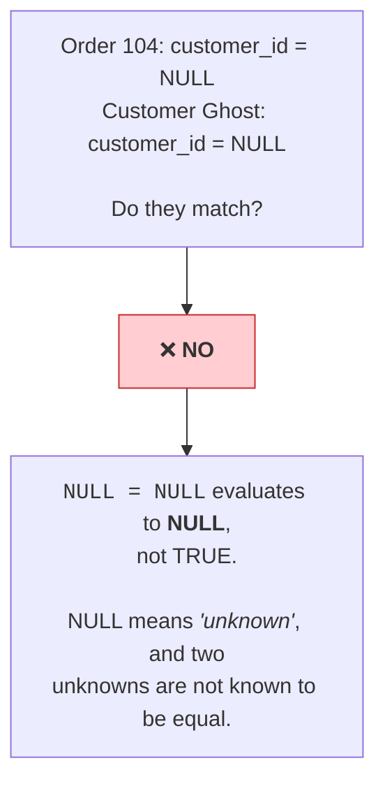
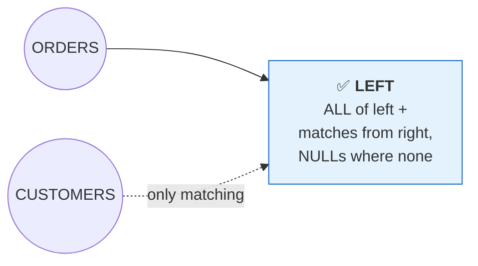
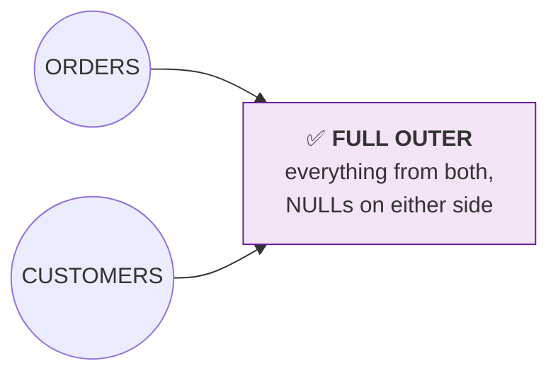
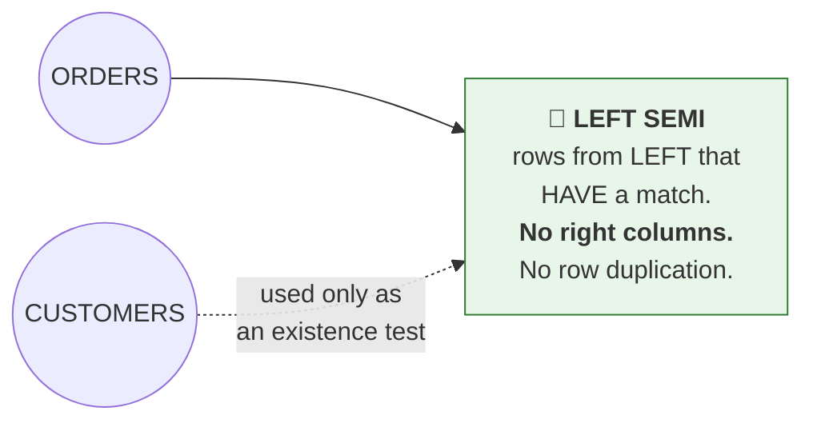
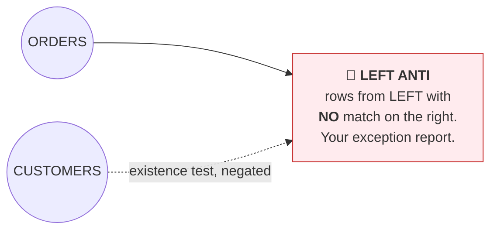
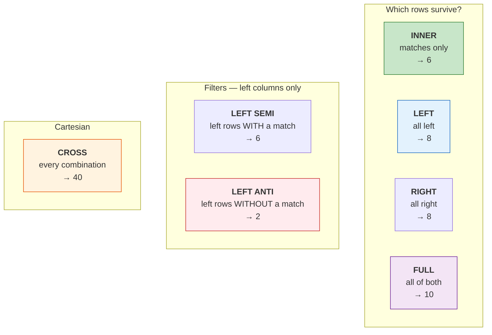
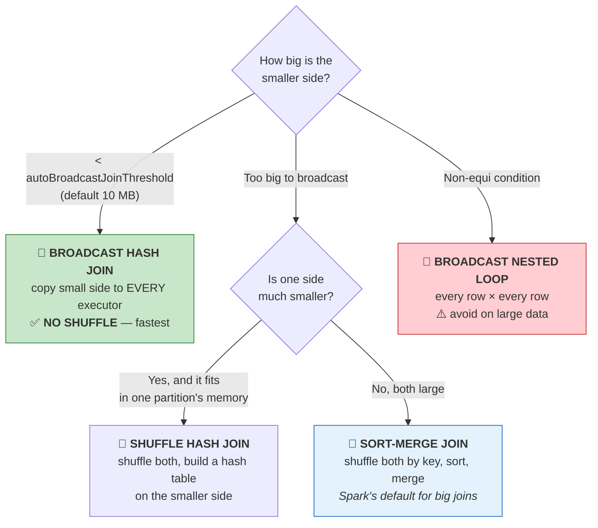

# Part 11 — 🧪 Joins in Spark

> **Section goal:** Master every join type on deliberately messy data, learn the null-matching rule that produces "wrong" results people spend hours debugging, disambiguate duplicate column names with aliases, and understand the three physical join strategies Spark chooses between — the part interviewers use to separate people who've *used* Spark from people who *understand* it.

Covers transcript `00:40:04` – `00:49:49`.

---

## 1. Build the test data

> *"I have created a new notebook and I have two DataFrames that I have created on the fly — one is **customers**, second one is **orders**. And here I have specified schemas, and then I've used `spark.createDataFrame`."*

> *"In the customers DataFrame we have one record where **customer ID is null**. In orders, we have reference to some customer IDs… and look at this — **customer ID 5, it does not exist** here. This kind of **inconsistency** will help us demonstrate the concept of joins better."*

That's a deliberate teaching choice, and a good habit: **build fixtures that contain the edge cases**, not just the happy path.

```python
import pyspark.sql.functions as F

customers_schema = "customer_id INT, name STRING, country STRING, vip BOOLEAN"
customers_data = [
    (1,    "Asha",  "IN", True),
    (2,    "Bob",   "US", False),
    (3,    "Chen",  "CN", True),
    (4,    "Diana", "UK", False),   # ← has NO orders
    (None, "Ghost", "AU", False),   # ← NULL customer_id
]

orders_schema = "order_id INT, customer_id INT, amount DOUBLE, country STRING"
orders_data = [
    (101, 1,    250.0, "IN"),
    (102, 2,    130.0, "US"),
    (103, 3,    500.0, "CN"),
    (104, None,  90.0, "IN"),   # ← NULL customer_id
    (105, 1,    310.0, "IN"),
    (106, 5,     75.0, "US"),   # ← customer 5 does NOT exist
    (107, 2,    220.0, "US"),
    (108, 3,    410.0, "CN"),
]

df_customers = spark.createDataFrame(customers_data, customers_schema)
df_orders    = spark.createDataFrame(orders_data,    orders_schema)

display(df_customers)   # 5 rows
display(df_orders)      # 8 rows
```

### The four deliberate "defects"



| Defect | Where | What it will demonstrate |
|--------|-------|---------------------------|
| Order 104 has `customer_id = NULL` | orders | **Nulls never match** — not even other nulls |
| Order 106 references customer 5 | orders | **Orphaned foreign key** — a referential-integrity failure |
| Customer 4 (Diana) has no orders | customers | Rows that only appear in **right/full** joins |
| Customer "Ghost" has `customer_id = NULL` | customers | Same null rule, from the other side |

**Memorise these counts — they're the answer key for the whole Part:**

| Join type | Result rows | Why |
|-----------|------------|-----|
| `inner` | **6** | Only the matching pairs |
| `left` | **8** | All orders, nulls where no customer |
| `right` | **8** | 6 matches + Diana + Ghost |
| `full` / `outer` | **10** | 8 orders + Diana + Ghost |
| `left_semi` | **6** | Orders *with* a known customer, orders columns only |
| `left_anti` | **2** | Orders *without* a known customer (104, 106) |
| composite `[customer_id, country]` | **6** | Both keys must match |

---

## 2. Join syntax

> *"The APIs look pretty similar to pandas APIs."*

```python
df_left.join(df_right, on=<condition>, how=<join_type>)
```

Three ways to express the `on` condition — **and they behave differently:**

```python
# A) Column NAME string — the shared key appears ONCE in the result  ⭐ cleanest
df_orders.join(df_customers, on="customer_id", how="inner")

# B) List of names — same, for composite keys
df_orders.join(df_customers, on=["customer_id", "country"], how="inner")

# C) Explicit expression — the key appears TWICE (once from each side)
df_orders.join(df_customers, df_orders.customer_id == df_customers.customer_id, how="inner")
```

| Form | Duplicate key column in output? | Supports non-equi joins (`>`, `<`, `!=`)? |
|------|--------------------------------|-------------------------------------------|
| `on="col"` | ❌ appears once | ❌ equality only |
| `on=["a","b"]` | ❌ appears once each | ❌ |
| `on=<expression>` | ⚠️ **yes, twice** | ✅ |

> ⚠️ **This is the #1 source of "ambiguous column reference" errors.** Form C leaves two identically-named columns in the result, and any later `select("customer_id")` fails. Use form A unless you need a non-equality condition.

> 💡 *"To be explicit, you can specify the name of the parameter — so you'll say `on='customer_id'`, and `how` — where you will say left join, right join, inner join. **By default it is inner join**."*

---

## 3. INNER JOIN — only the matches

```python
df_inner = df_orders.join(df_customers, on="customer_id", how="inner")
display(df_inner)
print(df_inner.count())   # 6
```



**Result (6 rows):**

| customer_id | order_id | amount | country (orders) | name | country (customers) | vip |
|---|---|---|---|---|---|---|
| 1 | 101 | 250.0 | IN | Asha | IN | true |
| 1 | 105 | 310.0 | IN | Asha | IN | true |
| 2 | 102 | 130.0 | US | Bob | US | false |
| 2 | 107 | 220.0 | US | Bob | US | false |
| 3 | 103 | 500.0 | CN | Chen | CN | true |
| 3 | 108 | 410.0 | CN | Chen | CN | true |

> *"Inner join means you should have that customer ID in the second table — which is your customer table — otherwise you will not see the row… So when you perform inner join, these rows with order ID **104** and **106** will not be displayed."*

### ⚠️ The NULL rule — the single most important thing in this Part

> *"Also this customer ID is null. **You can say null is matching null here** — [but] **null means nothing**. So this is also not matching."*



**Analogy:** two people whose names you don't know. Are they the same person? You can't say yes — you simply don't know. SQL encodes that as "not a match".

```python
# Prove it
display(spark.sql("SELECT (NULL = NULL) AS eq, (NULL IS NULL) AS is_null"))
# eq = null   |   is_null = true
```

If you *do* want nulls to match (rare, and usually a sign of a modelling problem):

```python
df_orders.join(df_customers,
               df_orders.customer_id.eqNullSafe(df_customers.customer_id),   # <=> operator
               "inner")
```

> ⭐ **Interview:** *"Two tables both have a null in the join key. Do those rows join?"* → *"No. `NULL = NULL` evaluates to NULL, not TRUE, because NULL means 'unknown' rather than a value, so the join predicate never returns true. That's ANSI SQL behaviour and it's the correct default — but it silently drops rows in an inner join, which is a very common source of 'my counts don't add up'. If nulls genuinely should match I'd use the null-safe equality operator `<=>`, or `eqNullSafe` in PySpark. Usually though, nulls in a foreign key mean upstream data quality needs fixing rather than the join needing loosening."*

---

## 4. LEFT JOIN — keep everything on the left

```python
df_left = df_orders.join(df_customers, on="customer_id", how="left")
display(df_left)
print(df_left.count())   # 8
```



> *"From your SQL concepts you know that left join will keep **all the rows on the left table**. So the left table is the orders table… and in the customer table if it doesn't find something — see, for this null customer ID it did not find anything — these three are the columns from the customer table, so put **null** here."*

**Result (8 rows) — the two extra:**

| customer_id | order_id | amount | name | country (cust) | vip |
|---|---|---|---|---|---|
| … 6 matched rows … | | | | | |
| `null` | 104 | 90.0 | **null** | **null** | **null** |
| 5 | 106 | 75.0 | **null** | **null** | **null** |

> 💡 **Left join is the workhorse of dimensional modelling.** In Parts 23–25 every fact-to-dimension enrichment is a left join, because you must never lose a fact row just because a dimension lookup is missing.

**Aliases:** `how="left"`, `"leftouter"`, `"left_outer"` — all identical.

---

## 5. RIGHT JOIN — keep everything on the right

```python
df_right = df_orders.join(df_customers, on="customer_id", how="right")
display(df_right)
print(df_right.count())   # 8  → 6 matches + Diana + Ghost
```

> *"Similarly, you also know how right join performs."*

| customer_id | order_id | amount | name |
|---|---|---|---|
| … 6 matched rows … | | | |
| 4 | **null** | **null** | Diana |
| null | **null** | **null** | Ghost |

> 💡 **Right joins are rare in practice.** `A.join(B, how="right")` is identical to `B.join(A, how="left")`, and reading left-to-right is easier for humans. Most style guides say: **always write left joins and reorder the tables instead.**

---

## 6. FULL OUTER JOIN — keep everything from both sides

> *"So let me just show you the **full join** here. Full join will show you everything. **It's like a union between two sets.**"*

```python
df_full = df_orders.join(df_customers, on="customer_id", how="full")
display(df_full)
print(df_full.count())   # 10
```



> *"We got **10 rows**. Why 10 rows? Because it will give me all the eight rows from the order table… and then on the right-hand side, there is this row with **customer ID 4** — we don't have any order — but it will also show that. And there is another row with **customer ID null**. So eight plus these two."*

| Group | Rows |
|-------|------|
| Matched pairs | 6 |
| Orders with no customer (104, 106) | 2 |
| Customers with no order (Diana, Ghost) | 2 |
| **Total** | **10** |

**Aliases:** `"full"`, `"outer"`, `"fullouter"`, `"full_outer"`.

> 💡 **The real-world use case: reconciliation.** Full-outer two systems' records on a shared key, then filter for rows null on one side — that's your "in A but not B" and "in B but not A" exception report in one pass.

---

## 7. LEFT SEMI — a filter, not a join

> *"Now there is another kind of join where you say **left semi**, and what it will do is it will show you **orders with a known customer**."*

```python
df_semi = df_orders.join(df_customers, on="customer_id", how="left_semi")
display(df_semi)
print(df_semi.count())   # 6
```



**Two things make it different from an inner join:**

| | `inner` | `left_semi` |
|---|---|---|
| Right-side columns in output | ✅ included | ❌ **excluded** |
| One left row matching *n* right rows | produces *n* rows | produces **1** row |
| Equivalent SQL | `JOIN` | `WHERE EXISTS (…)` / `WHERE x IN (…)` |

> *"This is different than left, right? Because if it was a left join, you would have also got this 5 row. But here you don't get it."*

```sql
-- Semantically identical
SELECT * FROM orders o WHERE EXISTS (SELECT 1 FROM customers c WHERE c.customer_id = o.customer_id);
SELECT * FROM orders o LEFT SEMI JOIN customers c ON c.customer_id = o.customer_id;
```

> 💡 **Why it matters for performance:** because the right side is only an existence test, Spark can stop scanning after the first match and never materialises the right columns. When you only need to *filter*, a semi join is cheaper than an inner join followed by `.select()` and `.distinct()`.

---

## 8. LEFT ANTI — the exact opposite

> *"Exactly opposite of this is **left anti**… Customer 5 is not present in the customer table, so it will show you that. Customer 5, you see. And then it will also show you null, this null."*

```python
df_anti = df_orders.join(df_customers, on="customer_id", how="left_anti")
display(df_anti)
print(df_anti.count())   # 2
```

| order_id | customer_id | amount | country |
|---|---|---|---|
| 104 | `null` | 90.0 | IN |
| 106 | 5 | 75.0 | US |



> ⭐ **This is a data-quality engineer's favourite tool.** Left-anti-joining a fact table against its dimension gives you exactly the **orphaned foreign keys** — rows that will silently produce nulls in every downstream report. Run it as a scheduled check.

```python
# A referential-integrity check you can drop into any pipeline
orphans = df_orders.join(df_customers, on="customer_id", how="left_anti")
if orphans.count() > 0:
    display(orphans)
    raise ValueError(f"❌ {orphans.count()} orders reference unknown customers")
```

```sql
SELECT * FROM orders o WHERE NOT EXISTS (SELECT 1 FROM customers c WHERE c.customer_id = o.customer_id);
```

> ⚠️ Note that **anti join catches nulls too** — order 104 appears because `NULL` matches nothing. That's usually what you want (both are "unjoinable"), but be aware you're catching two different problems in one bucket. Separate them if the remediation differs.

---

## 9. CROSS JOIN — every combination

Not in the transcript, but you must know what it is so you can recognise an accidental one.

```python
df_cross = df_orders.crossJoin(df_customers)
print(df_cross.count())   # 8 × 5 = 40
```

**Legitimate uses:** generating a complete date × product grid, building all scenario combinations for a model, small lookup expansions.

> ⚠️ **The danger:** an *accidental* cross join — a missing or wrong `on` condition — turns 1M × 1M rows into 10¹² rows and hangs the cluster. Spark refuses implicit cross joins by default (`spark.sql.crossJoin.enabled=false`), which is a guard rail worth leaving on. If a job suddenly runs forever, "did I accidentally cross join?" is an early thing to check in the query plan.

---

## 10. All join types — the master table



| `how=` | Aliases | Keeps | Right columns? | Our count |
|--------|---------|-------|----------------|-----------|
| `inner` *(default)* | — | Matching pairs only | ✅ | 6 |
| `left` | `leftouter`, `left_outer` | All left rows | ✅ (nulls if no match) | 8 |
| `right` | `rightouter`, `right_outer` | All right rows | ✅ (nulls if no match) | 8 |
| `full` | `outer`, `fullouter`, `full_outer` | All rows, both sides | ✅ (nulls both ways) | 10 |
| `left_semi` | `leftsemi`, `semi` | Left rows **with** a match | ❌ | 6 |
| `left_anti` | `leftanti`, `anti` | Left rows **without** a match | ❌ | 2 |
| `cross` | — | Every combination | ✅ | 40 |

---

## 11. Aliases — and fixing ambiguous columns

> *"One thing that will help us write our queries better, or perform our join better, is this concept of **alias**."*

```python
o = df_orders.alias("o")
c = df_customers.alias("c")
```

> *"So this `o` is nothing but just another DataFrame that you've created — it's exactly the same as this one. But this alias `o` is similar to the alias that we use in SQL queries when performing joins. Also, when you're performing a join with the **same table**, this kind of alias will be useful."*

### The problem aliases solve

> *"When you look at all the columns, the **country** column is kind of common in both of the tables — and this is creating **ambiguity**. You don't know which table this country column refers to versus this, right? So you want to say, OK, this is my **orders country** — or **shipment country**, where you're shipping it — and this is my **customer country**."*

```python
df_inner_clean = (
    df_orders.alias("o")
      .join(df_customers.alias("c"), on="customer_id", how="inner")
      .select(
          F.col("customer_id"),
          F.col("o.order_id"),
          F.col("o.amount"),
          F.col("o.country").alias("ship_country"),      # ← disambiguated
          F.col("c.name"),
          F.col("c.country").alias("customer_country"),  # ← disambiguated
          F.col("c.vip"),
      )
)
display(df_inner_clean)
```

> *"Now you clearly know that this particular column belongs to my **order** table and this column belongs to my **customer** table."*

> 💡 **The multi-line tip again:** *"Whenever you want to write multi-line code you can use this kind of bracket."* Outer `( … )` lets you break the chain across lines cleanly.

### The error you'll hit without aliases

```python
joined = df_orders.join(df_customers, df_orders.customer_id == df_customers.customer_id)
joined.select("country")
# AnalysisException: Reference 'country' is ambiguous, could be: country, country.
```

**Three ways out:**

```python
# 1. Alias the DataFrames  ⭐ best
df_orders.alias("o").join(df_customers.alias("c"), "customer_id").select("o.country", "c.country")

# 2. Rename before joining — also very readable
(df_orders.withColumnRenamed("country", "ship_country")
   .join(df_customers.withColumnRenamed("country", "customer_country"), "customer_id"))

# 3. Drop the duplicate you don't need
df_orders.join(df_customers, "customer_id").drop(df_customers.country)
```

> ⚠️ **Ambiguity strikes *later*, not at join time.** The join itself succeeds; the error appears at the first `select`, `filter` or `write` that touches the duplicated name. In a long pipeline that's a confusing distance from the cause. **Disambiguate at the join.**

---

## 12. Composite (multi-key) joins

> *"You can also perform a join using a **composite key** or **multi key**. So let's say I want to perform a join using **customer ID and country**."*

```python
df_multi = df_orders.join(df_customers, on=["customer_id", "country"], how="inner")
display(df_multi)
print(df_multi.count())   # 6
```

> *"So when I do that I get **six rows**. Customer ID is 1 and country is IN, so it will perform a join with this particular record, Asha. Then you have 2 and for 2 you have US, so 2-US. Then 3, you have CN… So this is using **multiple keys** to perform the join."*

Because both keys appear in both DataFrames, the list form collapses each into a single output column — no ambiguity at all. **That's a bonus reason to prefer the list form when the names match.**

For keys with **different names** on each side:

```python
df_orders.alias("o").join(
    df_customers.alias("c"),
    (F.col("o.customer_id") == F.col("c.cust_id")) &
    (F.col("o.country")     == F.col("c.cust_country")),
    "inner")
```

### Non-equi joins — when `=` isn't the condition

```python
# Match an order to the FX rate valid on its date
orders.alias("o").join(
    rates.alias("r"),
    (F.col("o.currency") == F.col("r.currency")) &
    (F.col("o.order_date") >= F.col("r.valid_from")) &
    (F.col("o.order_date") <  F.col("r.valid_to")),
    "left")
```

> ⚠️ Non-equi joins can't use hash or sort-merge strategies, so Spark falls back to a **broadcast nested loop join** — fine when one side is small, catastrophic when both are large.

---

## 13. Self joins

> *"Also, when you're performing a join with the **same table**, this kind of alias will be useful."*

Aliases become mandatory here — every column name exists twice.

```python
employees = spark.createDataFrame(
    [(1,"Asha",None), (2,"Bob",1), (3,"Chen",1), (4,"Diana",2)],
    "emp_id INT, emp_name STRING, manager_id INT")

e = employees.alias("e")
m = employees.alias("m")

display(e.join(m, F.col("e.manager_id") == F.col("m.emp_id"), "left")
         .select(F.col("e.emp_name").alias("employee"),
                 F.col("m.emp_name").alias("manager")))
```

| employee | manager |
|----------|---------|
| Asha | null |
| Bob | Asha |
| Chen | Asha |
| Diana | Bob |

---

## 14. How Spark *physically* executes a join — interview gold

Everything above is *logical* — what rows come out. This section is *physical* — how the cluster does it. **This is where Spark interviews get serious.**



### 🔍 Plain-English deep-dive: the three strategies

| Strategy | How it works | Analogy | Shuffle? |
|----------|--------------|---------|----------|
| **Broadcast hash join** | The small table is copied in full to every executor, which then joins its local partition against the in-memory copy. | Giving **every** cashier their own copy of the price list. Nobody has to walk anywhere. | ❌ **None** — this is why it's fast |
| **Sort-merge join** | Both sides are shuffled so matching keys land on the same executor, sorted, then merged in one pass. | Two people each sort their deck of cards, then walk through both in order matching them up. | ✅ Both sides |
| **Shuffle hash join** | Both shuffled by key; a hash table is built on the smaller side per partition. | Sorting one deck and building an index of the other. | ✅ Both sides |
| **Broadcast nested loop** | Every left row compared against every broadcast right row. | Checking every item against every rule, one by one. | ❌ but O(n×m) |

### Broadcasting — the biggest join optimisation available

```python
from pyspark.sql.functions import broadcast

# Explicit hint: force the small dimension to be broadcast
df_big_fact.join(broadcast(df_small_dim), on="product_id", how="left")
```

```python
# The auto-broadcast threshold (default 10 MB)
print(spark.conf.get("spark.sql.autoBroadcastJoinThreshold"))   # 10485760

spark.conf.set("spark.sql.autoBroadcastJoinThreshold", 50 * 1024 * 1024)  # raise to 50 MB
spark.conf.set("spark.sql.autoBroadcastJoinThreshold", -1)               # disable entirely
```

**Verify which strategy was chosen:**

```python
df_orders.join(df_customers, "customer_id").explain()
# Look for: BroadcastHashJoin  /  SortMergeJoin  /  ShuffleHashJoin
```

> ⭐ **Interview:** *"You're joining a 2 TB fact table to a 50 MB dimension and it's slow. What do you do?"* → *"First check the plan — if it's doing a sort-merge join, both sides are being shuffled, and shuffling 2 TB to match against 50 MB is enormous waste. The fix is a broadcast hash join: either raise `spark.sql.autoBroadcastJoinThreshold` above the dimension's size, or add an explicit `broadcast()` hint. That eliminates the shuffle on the fact side entirely — usually the single biggest win available on a star-schema join. I'd verify with `.explain()` that it became a `BroadcastHashJoin`, and make sure statistics are current since the optimiser uses estimated sizes. If the dimension is genuinely too big to broadcast, I'd look at pre-filtering it to only the keys the fact actually uses, or bucketing both tables on the join key so the shuffle can be skipped."*

### Data skew — when one key dominates

If 80% of orders belong to one customer, the executor handling that key does 80% of the work while the rest idle.

```python
# 1. Diagnose
display(df_orders.groupBy("customer_id").count().orderBy(F.col("count").desc()).limit(20))

# 2. Let AQE handle it (usually enough on modern Databricks)
spark.conf.set("spark.sql.adaptive.enabled", "true")
spark.conf.set("spark.sql.adaptive.skewJoin.enabled", "true")

# 3. Manual salting, if AQE isn't enough
salted_left  = df_orders.withColumn("salt", (F.rand() * 10).cast("int"))
salted_right = (df_customers
                .withColumn("salt", F.explode(F.array([F.lit(i) for i in range(10)]))))
salted_left.join(salted_right, on=["customer_id", "salt"], how="left")
```

Full treatment in Part 15 (shuffle) and Part 16 (partitioning).

---

## 15. 🧪 Consolidated lab

```python
import pyspark.sql.functions as F

# ── Fixtures with deliberate defects ─────────────────────────────────
df_customers = spark.createDataFrame(
    [(1,"Asha","IN",True), (2,"Bob","US",False), (3,"Chen","CN",True),
     (4,"Diana","UK",False), (None,"Ghost","AU",False)],
    "customer_id INT, name STRING, country STRING, vip BOOLEAN")

df_orders = spark.createDataFrame(
    [(101,1,250.0,"IN"), (102,2,130.0,"US"), (103,3,500.0,"CN"), (104,None,90.0,"IN"),
     (105,1,310.0,"IN"), (106,5,75.0,"US"),  (107,2,220.0,"US"), (108,3,410.0,"CN")],
    "order_id INT, customer_id INT, amount DOUBLE, country STRING")

# ── Every join type, with the expected counts asserted ───────────────
expected = {"inner": 6, "left": 8, "right": 8, "full": 10, "left_semi": 6, "left_anti": 2}
for how, n in expected.items():
    got = df_orders.join(df_customers, on="customer_id", how=how).count()
    print(f"{how:<12} → {got:>3} rows   {'✅' if got == n else '❌ expected ' + str(n)}")

print(f"{'cross':<12} → {df_orders.crossJoin(df_customers).count():>3} rows   (8 × 5)")

# ── Prove the NULL rule ──────────────────────────────────────────────
display(spark.sql("SELECT (NULL = NULL) AS eq, (NULL IS NULL) AS is_null"))
print("null-safe join:",
      df_orders.join(df_customers,
                     df_orders.customer_id.eqNullSafe(df_customers.customer_id),
                     "inner").count())     # 7 — order 104 now matches Ghost

# ── Aliases: disambiguate the duplicate 'country' ────────────────────
df_clean = (df_orders.alias("o")
    .join(df_customers.alias("c"), on="customer_id", how="inner")
    .select(F.col("customer_id"),
            F.col("o.order_id"),
            F.col("o.amount"),
            F.col("o.country").alias("ship_country"),
            F.col("c.name"),
            F.col("c.country").alias("customer_country"),
            F.col("c.vip")))
display(df_clean)

# ── Composite key ────────────────────────────────────────────────────
print("composite:", df_orders.join(df_customers, on=["customer_id","country"], how="inner").count())  # 6

# ── Data-quality check with left anti ────────────────────────────────
orphans = df_orders.join(df_customers, on="customer_id", how="left_anti")
print(f"\n⚠️  {orphans.count()} orders reference an unknown customer:")
display(orphans)

# ── Inspect the physical strategy ────────────────────────────────────
df_orders.join(df_customers, "customer_id").explain()

# ── Force a broadcast ────────────────────────────────────────────────
from pyspark.sql.functions import broadcast
df_orders.join(broadcast(df_customers), "customer_id").explain()   # BroadcastHashJoin
```

**✅ Checkpoint:** all six assertions print ✅; the null-safe join returns **7** (one more than inner); `orphans` shows orders **104** and **106**; the broadcast plan shows `BroadcastHashJoin`.

---

## ⭐ Likely Interview Questions for This Section

**Q1. "Walk me through the join types."**
> *Model answer:* "Inner keeps only matching pairs. Left keeps every left row, filling nulls where the right has no match — it's the default for fact-to-dimension enrichment because you must never drop a fact. Right is the mirror image and I generally avoid it, since `A right join B` is just `B left join A` and reads worse. Full outer keeps everything from both sides, which is what I use for reconciliation between two systems. Then two filtering joins that return only left-side columns: left semi keeps left rows that *have* a match — equivalent to `WHERE EXISTS` — and left anti keeps left rows that *don't*, which is my go-to referential-integrity check. And cross join is the Cartesian product, which is almost always an accident when you see it in a plan."

**Q2. "Two rows both have NULL in the join key. Do they match?"**
> *Model answer:* "No. `NULL = NULL` evaluates to NULL rather than TRUE, because NULL means 'unknown' — two unknowns aren't known to be equal. So in an inner join those rows are dropped, and in a left join the right-side columns come back null. This silently changes row counts, and it's a very common cause of 'the totals don't reconcile'. If nulls genuinely should match I'd use the null-safe equality operator `<=>`, or `eqNullSafe` in PySpark. But usually a null foreign key is a data-quality problem I'd rather surface with an anti join than paper over."

**Q3. "Difference between inner join and left semi join?"**
> *Model answer:* "Two differences. Left semi returns only the left table's columns — it's a filter, not an enrichment. And it doesn't duplicate rows: if one left row matches three right rows, an inner join emits three rows while a semi join emits one. That makes semi joins both semantically safer and cheaper when you only want to filter, since Spark can short-circuit on the first match and never materialises the right side's columns. In SQL it's the equivalent of `WHERE EXISTS`."

**Q4. "How would you find orphaned foreign keys?"**
> *Model answer:* "A left anti join from the fact table to the dimension on the key — that returns exactly the fact rows with no matching dimension row. I'd build that into the pipeline as a quality gate: count the orphans, log the metric, and either fail the run or route them to a quarantine table depending on how critical the feed is. It's important because those rows don't error — they silently produce nulls in every downstream report, so a total looks plausible but is wrong. One caveat: the anti join also catches null keys, which are technically a different problem, so I'd usually split the two so remediation can differ."

**Q5. "Explain Spark's join strategies and when each is chosen."**
> *Model answer:* "Three main ones. **Broadcast hash join** — if one side is under `autoBroadcastJoinThreshold`, default 10 MB, Spark copies it to every executor and joins locally, which avoids shuffling the large side entirely. That's by far the fastest and it's what you want for star-schema fact-to-dimension joins. **Sort-merge join** is the default for two large tables: shuffle both by the join key so matching keys co-locate, sort each partition, then merge. **Shuffle hash join** also shuffles both but builds a hash table on the smaller side instead of sorting; Spark picks it when one side is meaningfully smaller but still too big to broadcast. Non-equality conditions fall back to a **broadcast nested loop join**, which is O(n×m) and dangerous on large data. I check which one I got with `.explain()`."

**Q6. "A join between a 2 TB fact and a 50 MB dimension is slow. Fix it."**
> *Model answer:* "Check the plan first. If it's a sort-merge join, Spark is shuffling 2 TB to match against 50 MB, which is almost all wasted work. The fix is to force a broadcast — either raise `autoBroadcastJoinThreshold` above the dimension size or add an explicit `broadcast()` hint — which removes the fact-side shuffle completely. I'd confirm via `.explain()` that it became a `BroadcastHashJoin`. It's also worth checking why the optimiser didn't broadcast automatically: usually stale or missing statistics, since it works from *estimated* sizes. If the dimension really is too large, options are pre-filtering it to only the keys the fact uses, or bucketing both tables on the join key so the shuffle can be avoided."

**Q7. "You get 'Reference country is ambiguous'. What happened and how do you prevent it?"**
> *Model answer:* "Both sides had a column called `country` and I joined with an explicit equality *expression* rather than a column-name string, so both survived into the result with the same name. The join itself succeeded — the error surfaces at the first `select` or `filter` that touches the name, which can be a long way from the cause. Prevention: alias both DataFrames and qualify every ambiguous column, giving them meaningful distinct names like `ship_country` and `customer_country`; or rename before joining; or use the `on='key'` string form, which collapses the shared key into one column. I prefer aliasing plus an explicit `select` right after the join, because it makes the output schema deliberate rather than accidental."

**Q8. "What is data skew in a join and how do you handle it?"**
> *Model answer:* "Skew is when one join key holds a disproportionate share of rows, so the executor handling that key does most of the work while the others finish and idle — the stage takes as long as its slowest task. You spot it in the Spark UI as one task with a duration and shuffle-read size far above the median. First remedy is Adaptive Query Execution with skew-join handling enabled, which detects oversized partitions at runtime and splits them automatically; on modern Databricks that handles most cases. If it isn't enough, salting: add a random salt to the skewed key on the large side and explode the small side across all salt values, so the hot key spreads across many partitions. Broadcasting the small side also sidesteps skew entirely, since there's no shuffle at all."

**Q9. "When would you use a full outer join?"**
> *Model answer:* "Reconciliation. If I'm comparing two systems' views of the same entities — a source extract versus what landed in the warehouse, or two ledgers — a full outer on the shared key in one pass gives me matched rows plus both sets of exceptions. I then filter for rows where the left key is null to get 'only in B', and vice versa for 'only in A', and compare values on the matched rows to find discrepancies. Outside reconciliation and certain slowly-changing-dimension merges it's fairly rare, and seeing one in a plan where a left join was intended is often a bug."

---

## 🧠 30-Second Memory Hooks

- **The answer key: inner 6 · left 8 · right 8 · full 10 · semi 6 · anti 2 · cross 40.**
- **⚠️ `NULL = NULL` is NULL, not TRUE.** Nulls never join. Use `eqNullSafe` / `<=>` if you truly need them to.
- **Left join = the workhorse of dimensional modelling.** Never lose a fact row because a lookup is missing.
- **Semi = `WHERE EXISTS`. Anti = `WHERE NOT EXISTS`.** Both return **left columns only** and **never duplicate rows**.
- **Left anti join = your orphaned-foreign-key detector.** Make it a scheduled quality gate.
- **Full outer = reconciliation** between two systems in one pass.
- **`on="col"` → key appears once. `on=<expression>` → key appears twice → ambiguity.**
- **Ambiguity errors surface *later* than the join.** Alias and `select` immediately after joining.
- **Right joins are just left joins written backwards.** Reorder the tables instead.
- **Three physical strategies: broadcast hash (no shuffle, fastest) · sort-merge (default for big-big) · shuffle hash.** Non-equi → broadcast nested loop (slow).
- **`broadcast(small_df)`** is the single biggest star-schema join optimisation. Default auto threshold: **10 MB**.
- **`.explain()` tells you which strategy you got.** Always check before optimising.
- **Skew = one key hogs a partition.** AQE skew-join first; salting if that's not enough; broadcasting sidesteps it entirely.

---

*Next suggested section:* **[Part 12 — Query Plans, Catalyst, AQE & Photon](Part-12-query-plans-catalyst-aqe-photon.md)** — you've now built joins and filters without knowing what Spark *does* with them. Group D opens the engine: reading `.explain()` output line by line, watching predicate pushdown and column pruning happen, and understanding the optimiser that makes all of it fast. This is where 60% of Spark interview questions come from.

---

**Navigation** — ⬅️ **[Part 10 — SQL in Spark](Part-10-sql-in-spark.md)** · 🏠 **[Master Index](../Databricks%20-%20Study%20Guide.md)** · ➡️ **[Part 12 — Query Plans & Catalyst](Part-12-query-plans-catalyst-aqe-photon.md)**
